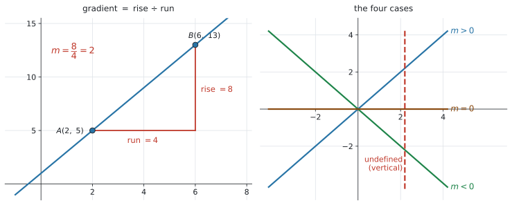
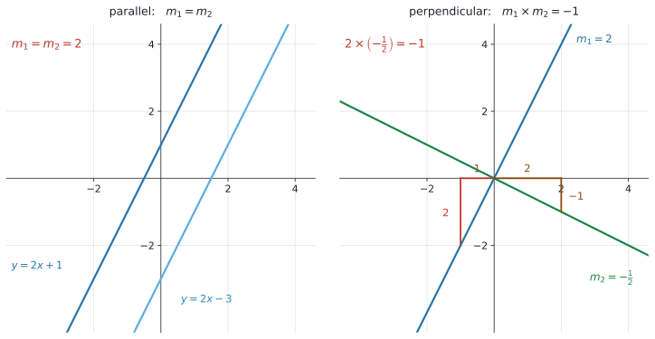
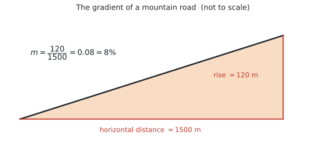

# SL 2.1 — Equations of a straight line（直線の方程式） {#sec-sl-2-1}

::: {.callout-note}
## What you should be able to do
- **gradient**（傾き）の意味が分かり、$2$ 点から求められる。
- 直線の式を、**3つの形**で書ける。
  - $y = mx + c$（**gradient-intercept form**）
  - $ax + by + d = 0$（**general form**）
  - $y - y_1 = m(x - x_1)$（**point-gradient form**）
- **$x$-intercept** と **$y$-intercept** を求められる。
- **parallel**（$m_1 = m_2$）と **perpendicular**（$m_1 \times m_2 = -1$）を判定し、使える。
- 坂道やスロープなどの**現実の傾き**を求め、**問題の文脈で説明**できる。
:::

::: {.callout-important}
## Formula booklet に載っているもの
SL 2.1 の欄には、次の4つが印刷されています。

$$
y = mx + c, \qquad ax + by + d = 0, \qquad y - y_1 = m(x - x_1)
$$

$$
m = \frac{y_2 - y_1}{x_2 - x_1}
$$

**この4つは配られるので、覚える必要はありません。** 覚えるべきなのは、**どういうときにどれを使うか**です。

★ ただし、**次の2つは公式集に載っていません。**

$$
\text{parallel}: \ m_1 = m_2 \qquad\qquad \text{perpendicular}: \ m_1 \times m_2 = -1
$$

シラバスの Content 欄にだけ書かれています。**ここは自分で覚えておく必要があります。**
:::

## The idea

### 1. gradient（傾き）とは {#gradient}

**gradient**（傾き）は、**「横に $1$ 進んだとき、縦にいくつ変わるか」**です。記号は **$m$** を使います。

公式集の式は次のとおりです。

$$
m = \frac{y_2 - y_1}{x_2 - x_1}
$$ {#eq-sl21-grad}

**分子が縦の変化（rise）、分母が横の変化（run）**です。

{#fig-sl21-grad width=100%}

@fig-sl21-grad の左を見てください。$A(2, 5)$ から $B(6, 13)$ まで、**横に $4$、縦に $8$** 動いています。

$$
m = \frac{13 - 5}{6 - 2} = \frac{8}{4} = 2
$$

**横に $1$ 進むごとに、縦に $2$ 上がる**、という意味です。

#### 符号と、$4$ つの場合

@fig-sl21-grad の右のように、$m$ の符号でグラフの向きが決まります。

| $m$ | グラフ |
|---|---|
| $m > 0$ | 右上がり |
| $m < 0$ | 右下がり |
| $m = 0$ | **水平**（$y = c$ の形） |
| **undefined**（定義できない） | **垂直**（$x = k$ の形） |

: gradient の $4$ つの場合 {#tbl-sl21-cases}

::: {.callout-warning}
## 垂直な直線の傾きは「$0$」ではありません ★
垂直な直線では $x_2 - x_1 = 0$ になるので、@eq-sl21-grad の**分母が $0$** になります。$0$ で割ることはできないので、**gradient は undefined**（定義できない）です。

- **$y = 4$** … 水平。$m = 0$
- **$x = 4$** … 垂直。$m$ は **undefined**

**この2つを取り違える人がとても多い**ので、いま区別しておいてください。
:::

### 2. 直線の式は3つの形があります ★ {#three-forms}

同じ直線でも、**書き方が3通り**あります。3つとも公式集にあります。**どれを使うかで、解く速さが変わります。**

| 形 | 式 | いつ使うか |
|---|---|---|
| **gradient-intercept form** | $y = mx + c$ | $m$ と $y$-intercept が見える。**電卓にグラフを入れるとき** |
| **general form** | $ax + by + d = 0$ | 答えの形を指定されたとき。**分数を消せる** |
| **point-gradient form** | $y - y_1 = m(x - x_1)$ | **傾きと $1$ 点**が分かっているとき。一番速い |

: 3つの形の使い分け {#tbl-sl21-forms}

#### point-gradient form が一番速いことが多いです ★

「傾きが $2$ で、点 $(2, 5)$ を通る直線」を求めるとします。

$$
y - 5 = 2(x - 2)
$$

**代入するだけ**で、もう答えです。展開すれば $y = 2x + 1$ になります。

$y = mx + c$ から始めると、$5 = 2(2) + c$ を解いて $c = 1$、と**1手間多くなります。** どちらでも正解ですが、**point-gradient form のほうが速い**ことは知っておいてください。

#### general form への直し方

**分数を消して、右辺を $0$ にします。**

$$
y = -\frac{3}{4}x + 6
$$

両辺を $4$ 倍して、

$$
4y = -3x + 24
$$

$$
3x + 4y - 24 = 0
$$

**`Give your answer in the form ax + by + d = 0` と指示されたら、この形にします。** $a$、$b$、$d$ は**整数**にするのがふつうです。

::: {.callout-note}
## SL 4.4 では文字が違います ★
SL 4.4 の regression line は $y = ax + b$ と書きました。**そちらでは $a$ が傾き**です。

この項目では $y = mx + c$ で、**$m$ が傾き、$c$ が $y$-intercept** です。

**同じ「直線の式」なのに、文字の役割が違います。** 公式集のどちらの欄を見ているかで判断してください。**文字ではなく、位置で覚える**のが安全です（**$x$ に掛かっているほうが傾き**）。
:::

### 3. intercept（切片） {#intercepts}

**intercept** は、**グラフが軸と交わる点**です。

| 名前 | どこ | 求め方 |
|---|---|---|
| **$y$-intercept** | $y$ 軸との交点 | **$x = 0$** を代入する |
| **$x$-intercept** | $x$ 軸との交点 | **$y = 0$** を代入する |

: 2つの intercept {#tbl-sl21-intercepts}

$y = mx + c$ の形なら、**$c$ がそのまま $y$-intercept** です。$x = 0$ を入れると $y = c$ になるからです。

$3x + 4y - 24 = 0$ で確かめます。

$$
x = 0 \ \Rightarrow \ 4y = 24 \ \Rightarrow \ y = 6 \qquad (y\text{-intercept は } 6)
$$

$$
y = 0 \ \Rightarrow \ 3x = 24 \ \Rightarrow \ x = 8 \qquad (x\text{-intercept は } 8)
$$

**「$y$-intercept を求めよ」で $x = 0$ を代入する。** **名前と、代入する文字が逆**なので気をつけてください。

### 4. parallel と perpendicular ★★ {#parallel-perp}

**この項目で一番よく出るところ**です。公式集には載っていないので、**覚えてください。**

{#fig-sl21-perp width=100%}

#### parallel（平行）

$$
m_1 = m_2
$$ {#eq-sl21-par}

**傾きが同じなら平行**です。@fig-sl21-perp の左では、どちらも $m = 2$ です。$y$-intercept が違うだけで、**同じ角度**で上がっています。

#### perpendicular（垂直）

$$
m_1 \times m_2 = -1
$$ {#eq-sl21-perp}

**掛けて $-1$ になれば垂直**です。@fig-sl21-perp の右では $2 \times \left(-\dfrac{1}{2}\right) = -1$ になっています。

::: {.callout-tip}
## 「ひっくり返して、符号を変える」★★
$m_1$ が分かっているとき、垂直な直線の傾きは**その場で作れます。**

$$
m_2 = -\frac{1}{m_1}
$$

やることは**2つだけ**です。

1. **分数をひっくり返す**（逆数にする）
2. **符号を反対にする**

| $m_1$ | $m_2$（垂直） |
|---|---|
| $2$ | $-\dfrac{1}{2}$ |
| $-3$ | $\dfrac{1}{3}$ |
| $\dfrac{3}{4}$ | $-\dfrac{4}{3}$ |
| $-\dfrac{2}{5}$ | $\dfrac{5}{2}$ |

: 垂直な傾きの作り方 {#tbl-sl21-negrecip}

これを **negative reciprocal**（負の逆数）といいます。**掛けて $-1$ になるか、必ず確かめてください。**
:::

::: {.callout-warning}
## 符号を変えるのを忘れる ★
$m_1 = 2$ のとき、$m_2 = \dfrac{1}{2}$ ではありません。**$-\dfrac{1}{2}$** です。

$2 \times \dfrac{1}{2} = 1$ で、$-1$ になっていません。**掛け算で確かめれば、その場で気づけます。**
:::

### 5. 現実の場面での傾き ★ {#real-gradient}

シラバスに、はっきり書かれています。

> Calculate gradients of **inclines** such as mountain roads, bridges, etc.

**AI らしい出題**です。坂道、橋、車いす用スロープ、スキー場 ── こうした場面で傾きを求めさせます。

{#fig-sl21-incline width=80%}

$$
m = \frac{(\text{上がった高さ})}{(\text{水平に進んだ距離})}
$$ {#eq-sl21-incline}

@fig-sl21-incline では、水平に $1500$ m 進むあいだに $120$ m 上がっています。

$$
m = \frac{120}{1500} = 0.08
$$

::: {.callout-important}
## 単位をそろえてから割ってください ★★
**ここが一番の落とし穴です。**

上の例で「$1.5$ km」と「$120$ m」をそのまま割ると、

$$
\frac{120}{1.5} = 80
$$

となってしまいます。**$80$ という傾きは、ほぼ真上に登る崖**です。おかしいと気づけるはずです。

**必ず、どちらも同じ単位に直してから**割ってください。$1.5$ km $= 1500$ m です。
:::

#### パーセントで答えることもあります

道路標識では、傾きを**パーセント**で書きます。**$100$ 倍するだけ**です。

$$
0.08 \times 100 = 8\%
$$

意味は「**水平に $100$ m 進むと、$8$ m 上がる**」です。

**`Give your answer as a percentage` と書かれていたら $\%$ を付けて**、そうでなければ小数のまま答えてください。

## Why it works

ここでは、**なぜ垂直な2直線で $m_1 \times m_2 = -1$ になるのか**だけを説明します。

傾き $m_1 = 2$ の直線を考えます。この直線に沿って進むと、**右に $1$、上に $2$** です。

この直線を、**そのまま $90°$ 回してみます。** 「右に $1$」だった向きは「上に $1$」になり、「上に $2$」だった向きは「左に $2$」になります。

つまり回したあとは、**左に $2$、上に $1$** です。これを傾きに直すと、

$$
m_2 = \frac{(\text{上に } 1)}{(\text{左に } 2)} = \frac{1}{-2} = -\frac{1}{2}
$$

@fig-sl21-perp の右の2つの三角形が、まさにこれです。**縦と横が入れかわり、向きが1つ反対になる。** だから **逆数にして、符号を変える**のです。

掛けてみると、

$$
2 \times \left(-\frac{1}{2}\right) = -1
$$

**$m$ が何であっても同じ**です。$m$ と $-\dfrac{1}{m}$ を掛ければ、必ず $-1$ になります。

## Worked examples

::: {.callout-note appearance="simple"}
問題文は英語です。意味が理解できなかったら、問題文の下の「**日本語訳**」を開いてください。解説は日本語です。
:::

::: {#exm-sl21-twopoints}
[The line $L$ passes through the points $A(2,\ 5)$ and $B(6,\ 13)$.]{.q-en}

**(a)** [Find the gradient of $L$.]{.q-en}

**(b)** [Find the equation of $L$ in the form $y = mx + c$.]{.q-en}

**(c)** [Write your answer to part (b) in the form $ax + by + d = 0$.]{.q-en}

<details class="jp-trans">
<summary>日本語訳</summary>

直線 $L$ は $2$ 点 $A(2,\ 5)$ と $B(6,\ 13)$ を通ります。

**(a)** $L$ の傾きを求めなさい。

**(b)** $L$ の式を $y = mx + c$ の形で求めなさい。

**(c)** (b) の答えを $ax + by + d = 0$ の形で書きなさい。

</details>

---

**(a)** [公式集の式](#gradient)に代入します。

$$
m = \frac{y_2 - y_1}{x_2 - x_1} = \frac{13 - 5}{6 - 2} = \frac{8}{4} = 2
$$

**$A$ と $B$ のどちらを「$1$」にしても構いません。** 逆にしても $\dfrac{5-13}{2-6} = \dfrac{-8}{-4} = 2$ で、同じ答えです。**上と下で順番をそろえること**だけが条件です。

**(b)** [point-gradient form](#three-forms) を使います。$A(2, 5)$ を使いましょう。

$$
y - 5 = 2(x - 2)
$$

展開して、

$$
y - 5 = 2x - 4
$$

$$
y = 2x + 1
$$

**検算。** $B(6, 13)$ を入れてみます。$2(6) + 1 = 13$ ✓ **もう一方の点で必ず確かめてください。**

**(c)** 右辺を $0$ にします。

$$
2x - y + 1 = 0
$$

::: {.callout-note}
## 解答例（答案用紙にはこう書く）
**(a)** $m = \dfrac{13 - 5}{6 - 2} = 2$

**(b)** $y - 5 = 2(x - 2)$

$$y = 2x + 1$$

**(c)** $2x - y + 1 = 0$
:::
:::

::: {#exm-sl21-general}
[A line has equation $3x + 4y - 24 = 0$.]{.q-en}

**(a)** [Find the gradient of the line.]{.q-en}

**(b)** [Find the coordinates of the $x$-intercept and the $y$-intercept.]{.q-en}

<details class="jp-trans">
<summary>日本語訳</summary>

ある直線の式は $3x + 4y - 24 = 0$ です。

**(a)** この直線の傾きを求めなさい。

**(b)** $x$ 切片と $y$ 切片の座標を求めなさい。

（`coordinates` は「座標」です。$(8,\ 0)$ のように書きます。）

</details>

---

**(a)** **general form のままでは傾きが見えません。** まず $y = mx + c$ の形に直します。

$$
4y = -3x + 24
$$

$$
y = -\frac{3}{4}x + 6
$$

$$
m = -\frac{3}{4}
$$

**$x$ に掛かっている数**が傾きです（[文字ではなく位置で覚えます](#three-forms)）。

**(b)** [それぞれ $0$ を代入](#intercepts)します。**もとの式のままで構いません。**

$y$-intercept … $x = 0$ を入れます。

$$
4y - 24 = 0 \ \Rightarrow \ y = 6
$$

$x$-intercept … $y = 0$ を入れます。

$$
3x - 24 = 0 \ \Rightarrow \ x = 8
$$

**`coordinates`（座標）と聞かれている**ので、$( \ , \ )$ の形で答えます。

$$
x\text{-intercept}: (8,\ 0), \qquad y\text{-intercept}: (0,\ 6)
$$

**$8$ と $6$ だけ書くと減点されることがあります。** 何を聞かれているか、最後にもう一度読んでください。

::: {.callout-note}
## 解答例（答案用紙にはこう書く）
**(a)** $4y = -3x + 24$, so $y = -\dfrac{3}{4}x + 6$

$$m = -\frac{3}{4}$$

**(b)** $x = 0 \Rightarrow y = 6$, so the $y$-intercept is $(0,\ 6)$

$y = 0 \Rightarrow x = 8$, so the $x$-intercept is $(8,\ 0)$
:::
:::

::: {#exm-sl21-parperp}
[The line $L_1$ has equation $y = 3x - 4$. The point $P$ has coordinates $(2,\ 5)$.]{.q-en}

**(a)** [Find the equation of the line through $P$ that is parallel to $L_1$.]{.q-en}

**(b)** [Find the equation of the line through $P$ that is perpendicular to $L_1$, giving your answer in the form $ax + by + d = 0$.]{.q-en}

<details class="jp-trans">
<summary>日本語訳</summary>

直線 $L_1$ の式は $y = 3x - 4$ です。点 $P$ の座標は $(2,\ 5)$ です。

**(a)** $P$ を通り、$L_1$ に平行な直線の式を求めなさい。

**(b)** $P$ を通り、$L_1$ に垂直な直線の式を、$ax + by + d = 0$ の形で求めなさい。

</details>

---

$L_1$ は $y = mx + c$ の形なので、**傾きは $3$** だとすぐ読めます。

**(a)** [平行なら傾きは同じ](#parallel-perp)です。

$$
m = 3
$$

$P(2, 5)$ を通るので、point-gradient form に入れます。

$$
y - 5 = 3(x - 2)
$$

$$
y = 3x - 1
$$

**(b)** [垂直なら negative reciprocal](#parallel-perp) です。

$$
m = -\frac{1}{3}
$$

**確かめ。** $3 \times \left(-\dfrac{1}{3}\right) = -1$ ✓

$$
y - 5 = -\frac{1}{3}(x - 2)
$$

**`ax + by + d = 0` を指定されている**ので、**分数を消してから**進めます。両辺を $3$ 倍します。

$$
3(y - 5) = -(x - 2)
$$

$$
3y - 15 = -x + 2
$$

$$
x + 3y - 17 = 0
$$

**検算。** $P(2, 5)$ を入れます。$2 + 3(5) - 17 = 2 + 15 - 17 = 0$ ✓

::: {.callout-note}
## 解答例（答案用紙にはこう書く）
**(a)** Parallel, so $m = 3$.

$$y - 5 = 3(x - 2), \quad \text{so} \quad y = 3x - 1$$

**(b)** Perpendicular, so $m = -\dfrac{1}{3}$ (since $3 \times \left(-\dfrac{1}{3}\right) = -1$).

$$y - 5 = -\frac{1}{3}(x - 2)$$

$$3y - 15 = -x + 2$$

$$x + 3y - 17 = 0$$
:::
:::

::: {#exm-sl21-road}
[A mountain road rises $120$ metres over a horizontal distance of $1.5$ km.]{.q-en}

**(a)** [Find the gradient of the road.]{.q-en}

**(b)** [Write the gradient as a percentage.]{.q-en}

**(c)** [Interpret this percentage in the context of the road.]{.q-en}

[A wheelchair ramp must have a gradient of at most $\dfrac{1}{12}$. A ramp is needed to rise $0.4$ m.]{.q-en}

**(d)** [Find the shortest horizontal distance the ramp can have.]{.q-en}

<details class="jp-trans">
<summary>日本語訳</summary>

ある山道は、水平に $1.5$ km 進むあいだに $120$ m 上がります。

**(a)** この道の傾きを求めなさい。

**(b)** その傾きをパーセントで書きなさい。

**(c)** このパーセントの意味を、道の文脈で説明しなさい。

車いす用のスロープは、傾きが $\dfrac{1}{12}$ 以下でなければなりません。$0.4$ m 上がるスロープが必要です。

**(d)** このスロープに必要な、最も短い水平距離を求めなさい。

（`at most` は「〜以下」、`ramp` は「スロープ」です。）

</details>

---

**(a)** **まず単位をそろえます**（[ここが落とし穴](#real-gradient)）。

$$
1.5 \ \text{km} = 1500 \ \text{m}
$$

$$
m = \frac{120}{1500} = 0.08
$$

**(b)** $100$ 倍します。

$$
0.08 \times 100 = 8\%
$$

**(c)** `Interpret` なので、**言葉で説明**します。

::: {.model-answer}
**試験ではこう書く**

*For every $100$ metres travelled horizontally, the road rises $8$ metres.*
:::

（意味：水平に $100$ m 進むごとに、道は $8$ m 上がる。）

**「傾きが $8\%$ です」だけでは点になりません。** **何が、どれだけ変わるのか**を書いてください。

**(d)** 傾きが $\dfrac{1}{12}$ **以下**なので、**水平距離が短いほど傾きは急**になります。**ちょうど $\dfrac{1}{12}$ のときが、いちばん短い**場合です。

$$
\frac{0.4}{d} = \frac{1}{12}
$$

$$
d = 0.4 \times 12 = 4.8 \ \text{m}
$$

**$4.8$ m 以上**必要、ということです。

::: {.callout-note}
## 解答例（答案用紙にはこう書く）
**(a)** $1.5$ km $= 1500$ m

$$m = \frac{120}{1500} = 0.08$$

**(b)** $0.08 \times 100 = 8\%$

**(c)** *For every $100$ metres travelled horizontally, the road rises $8$ metres.*

**(d)** $\dfrac{0.4}{d} = \dfrac{1}{12}$, so $d = 4.8$ m
:::
:::

::: {#exm-sl21-candle}
[A candle burns at a constant rate. After $2$ hours its height is $18$ cm, and after $5$ hours its height is $10.5$ cm. Let $h$ be the height in cm after $t$ hours.]{.q-en}

**(a)** [Find a linear equation for $h$ in terms of $t$.]{.q-en}

**(b)** [Interpret the gradient in the context of the candle.]{.q-en}

**(c)** [Write down the height of the candle before it was lit.]{.q-en}

**(d)** [Find how long the candle takes to burn out completely.]{.q-en}

<details class="jp-trans">
<summary>日本語訳</summary>

あるろうそくが一定の速さで燃えています。$2$ 時間後の高さは $18$ cm、$5$ 時間後の高さは $10.5$ cm です。$t$ 時間後の高さを $h$（cm）とします。

**(a)** $h$ を $t$ で表す1次式を求めなさい。

**(b)** 傾きの意味を、ろうそくの文脈で説明しなさい。

**(c)** 火をつける前のろうそくの高さを書きなさい。

**(d)** ろうそくが完全に燃えつきるまでの時間を求めなさい。

（`at a constant rate` は「一定の速さで」、`burn out` は「燃えつきる」です。）

</details>

---

**(a)** $2$ つの点 $(2,\ 18)$ と $(5,\ 10.5)$ が与えられている、と読みかえます。**横軸が $t$、縦軸が $h$** です。

$$
m = \frac{10.5 - 18}{5 - 2} = \frac{-7.5}{3} = -2.5
$$

**負の値**です。ろうそくは短くなっていくので、これで合っています。

$$
h - 18 = -2.5(t - 2)
$$

$$
h = -2.5t + 23
$$

**(b)** `Interpret` なので、**言葉で**書きます。

::: {.model-answer}
**試験ではこう書く**

*The candle burns down by $2.5$ cm each hour.*
:::

（意味：ろうそくは $1$ 時間あたり $2.5$ cm ずつ短くなる。）

**符号を「短くなる」という言葉に直してください。** 「傾きは $-2.5$ です」だけでは足りません。

**(c)** 火をつける前は $t = 0$ です。

$$
h = -2.5(0) + 23 = 23 \ \text{cm}
$$

**これは $y$-intercept そのもの**です。$h = -2.5t + 23$ の $23$ を読むだけで済みます。

**(d)** 燃えつきるのは **$h = 0$** のときです。

$$
0 = -2.5t + 23
$$

$$
2.5t = 23
$$

$$
t = 9.2 \ \text{hours}
$$

**これは $x$-intercept**（この問題では $t$-intercept）です。

::: {.callout-note}
## 解答例（答案用紙にはこう書く）
**(a)** $m = \dfrac{10.5 - 18}{5 - 2} = -2.5$

$$h - 18 = -2.5(t - 2), \quad \text{so} \quad h = -2.5t + 23$$

**(b)** *The candle burns down by $2.5$ cm each hour.*

**(c)** $h = 23$ cm

**(d)** $0 = -2.5t + 23$, so $t = 9.2$ hours
:::
:::

## Common errors

::: {.callout-warning}
## gradient の分子と分母を逆にする ★
$m = \dfrac{y_2 - y_1}{x_2 - x_1}$ です。**$y$ が上、$x$ が下**。

**「rise over run」**（縦を横で割る）と覚えてください。逆にすると、答えが逆数になります。
:::

::: {.callout-warning}
## 引き算の順番をそろえない ★★
上を $y_2 - y_1$ にしたら、下も **$x_2 - x_1$** です。

$\dfrac{y_2 - y_1}{x_1 - x_2}$ のように**片方だけ逆にすると、符号が反対**になります。

**どちらの点を「$1$」にしてもよいのですが、上下でそろえること**が条件です。
:::

::: {.callout-warning}
## 垂直な傾きで符号を変え忘れる ★★
$m_1 = 2$ に垂直なのは $-\dfrac{1}{2}$ です。$\dfrac{1}{2}$ ではありません。

**掛けて $-1$ になるか、必ず確かめてください。** $10$ 秒で確かめられます。
:::

::: {.callout-warning}
## $x = 4$ の傾きを $0$ だと思う
**$x = 4$ は垂直**なので、傾きは **undefined** です。

**$y = 4$**（水平）のほうが $m = 0$ です。**文字がどちらに付いているか**を見てください。
:::

::: {.callout-warning}
## general form のまま傾きを読もうとする
$3x + 4y - 24 = 0$ の傾きは $3$ でも $-3$ でもありません。

**まず $y = mx + c$ の形に直して**から読んでください。この例では $-\dfrac{3}{4}$ です。
:::

::: {.callout-warning}
## $x$-intercept と $y$-intercept の代入を逆にする
- **$y$-intercept** を求めるなら **$x = 0$**
- **$x$-intercept** を求めるなら **$y = 0$**

**名前と、代入する文字が逆**です。ここは意識して覚えてください。
:::

::: {.callout-warning}
## 現実の傾きで単位をそろえない ★★
$120$ m と $1.5$ km をそのまま割ってはいけません。

**$1.5$ km $= 1500$ m** に直してから割ります。単位がずれると、答えが $1000$ 倍ずれます。
:::

::: {.callout-warning}
## 傾きの意味を書かずに数字で終わる ★
`Interpret` や `Comment on` が付いていたら、**言葉が必要**です。

「$m = -2.5$」ではなく、「**$1$ 時間あたり $2.5$ cm ずつ短くなる**」まで書いてください。**単位も付けてください。**
:::

## Using your GDC (TI-Nspire CX II)

**この項目は、手で計算するほうが速い場面が多い**です。電卓は**検算とグラフの確認**に使ってください。

### 直線をグラフにする

```
ctrl + doc → 2: Add Graphs
```

`f1(x) =` のところに式を入れます。

```
f1(x) = 2x + 1
```

::: {.callout-important}
## general form のままでは入りません ★
Graphs のページは **$y =$ の形しか受け付けません。**

$3x + 4y - 24 = 0$ を入れたいときは、**先に $y = -\dfrac{3}{4}x + 6$ に直して**から打ち込んでください。

**この「直す」作業は、どのみち傾きを読むために必要**です。
:::

画面に収まらないときは、

```
menu → Window/Zoom → Zoom - Fit
```

### 求めた式を確かめる ★

**答えを出したあと、$30$ 秒でできる検算**です。

1. 求めた式を `f1(x)` に入れる
2. 通るはずの点が、グラフの上に乗っているか見る

より確実にするなら、**計算ページで点を代入**します。$P(2, 5)$ を通るはずなら、

```
2 × 2 + 1
```

と打って $5$ が出れば正しい、という具合です。**手で代入するのと同じことですが、打ち間違いが減ります。**

### 2直線の交わる点

$2$ 本を `f1(x)`、`f2(x)` に入れて、

```
menu → Analyze Graph → Intersection
```

交点の左と右を指定すると、座標が出ます。

SL 1.8 でやった**方程式を解く機能**でも同じ答えが出ます。**どちらでも構いません。**

### 垂直かどうかを目で確かめるとき ★

**画面の縦横の比率がそろっていないと、垂直に見えません。**

```
menu → Window/Zoom → Zoom - Square
```

これで縦横の目盛りがそろい、**直角がちゃんと直角に見えます。** @fig-sl21-perp の右も、この比率でかいてあります。

**ただし、判定は必ず $m_1 \times m_2 = -1$ でしてください。** 見た目で決めてはいけません。

## Exercises

::: {.callout-note appearance="simple"}
各問題に、折りたたみが3つ付いています。**日本語訳**、**解答例**（答案用紙に書くべきこと。英語です）、**解説**（なぜそうなるか。日本語です）。

まず自分で解いて、次に解答例と見くらべてください。**解説は、合わなかったときだけ開けば十分です。**
:::

::: {.exercise-block}

[1]{.ex-no} [Find the gradient of the line passing through the points $(3,\ -1)$ and $(7,\ 5)$.]{.q-en}

<details class="jp-trans">
<summary>日本語訳</summary>

$2$ 点 $(3,\ -1)$ と $(7,\ 5)$ を通る直線の傾きを求めなさい。

</details>

::: {.callout-note collapse="true"}
## 解答例（答案用紙に書くこと）
$$m = \frac{5 - (-1)}{7 - 3} = \frac{6}{4} = \frac{3}{2}$$
:::

::: {.callout-tip collapse="true"}
## 解説
公式集の式に入れるだけです。

**$-1$ を引くところ**に気をつけてください。$5 - (-1) = 5 + 1 = 6$ です。**カッコを付けて書く**と、符号を間違えません。

$$\frac{6}{4} = \frac{3}{2} = 1.5$$

**分数のままでも小数でも正解**です。分数のほうが、あとで計算に使いやすくなります。
:::

::: {.ex-sep}
:::

[2]{.ex-no} [A line has gradient $-3$ and passes through the point $(-1,\ 4)$.]{.q-en}

**(a)** [Find its equation in the form $y = mx + c$.]{.q-en}

**(b)** [Write your answer in the form $ax + by + d = 0$.]{.q-en}

<details class="jp-trans">
<summary>日本語訳</summary>

ある直線は傾きが $-3$ で、点 $(-1,\ 4)$ を通ります。

**(a)** その式を $y = mx + c$ の形で求めなさい。

**(b)** 答えを $ax + by + d = 0$ の形で書きなさい。

</details>

::: {.callout-note collapse="true"}
## 解答例（答案用紙に書くこと）
**(a)** $y - 4 = -3(x - (-1))$

$$y - 4 = -3(x + 1)$$

$$y = -3x + 1$$

**(b)** $3x + y - 1 = 0$
:::

::: {.callout-tip collapse="true"}
## 解説
**(a)** point-gradient form に入れます。**$x_1 = -1$ なので、$x - (-1) = x + 1$** になります。ここが引っかかりやすいところです。

$$y - 4 = -3(x + 1) = -3x - 3$$

$$y = -3x + 1$$

**検算。** $x = -1$ を入れると $-3(-1) + 1 = 4$ ✓

**(b)** $3x$ と $-1$ を左辺へ移します。

$$3x + y - 1 = 0$$

**$a$ を正にする**のがふつうです。$-3x - y + 1 = 0$ も同じ直線ですが、$a > 0$ の形が読みやすいです。
:::

::: {.ex-sep}
:::

[3]{.ex-no} [A line has equation $5x - 2y + 10 = 0$.]{.q-en}

**(a)** [Find the gradient.]{.q-en}

**(b)** [Find the $y$-intercept.]{.q-en}

**(c)** [Find the $x$-intercept.]{.q-en}

<details class="jp-trans">
<summary>日本語訳</summary>

ある直線の式は $5x - 2y + 10 = 0$ です。

**(a)** 傾きを求めなさい。

**(b)** $y$ 切片を求めなさい。

**(c)** $x$ 切片を求めなさい。

</details>

::: {.callout-note collapse="true"}
## 解答例（答案用紙に書くこと）
**(a)** $2y = 5x + 10$, so $y = \dfrac{5}{2}x + 5$

$$m = \frac{5}{2}$$

**(b)** $x = 0 \Rightarrow y = 5$

**(c)** $y = 0 \Rightarrow x = -2$
:::

::: {.callout-tip collapse="true"}
## 解説
**(a)** $y$ について解きます。**$-2y$ を右に移す**と符号が変わります。

$$5x + 10 = 2y \quad \Rightarrow \quad y = \frac{5}{2}x + 5$$

**$-\dfrac{5}{2}$ としないように。** 移項で符号が変わることを、ゆっくり確かめてください。

**(b)** $y = \dfrac{5}{2}x + 5$ の **$5$ がそのまま $y$-intercept** です。

**(c)** $y = 0$ を入れます。

$$0 = \frac{5}{2}x + 5 \quad \Rightarrow \quad \frac{5}{2}x = -5 \quad \Rightarrow \quad x = -2$$

もとの式で確かめると $5(-2) - 0 + 10 = 0$ ✓
:::

::: {.ex-sep}
:::

[4]{.ex-no} [Find the equation of the line that passes through $(4,\ -2)$ and is parallel to the line $y = -\dfrac{1}{2}x + 7$.]{.q-en}

<details class="jp-trans">
<summary>日本語訳</summary>

点 $(4,\ -2)$ を通り、直線 $y = -\dfrac{1}{2}x + 7$ に平行な直線の式を求めなさい。

</details>

::: {.callout-note collapse="true"}
## 解答例（答案用紙に書くこと）
Parallel, so $m = -\dfrac{1}{2}$.

$$y - (-2) = -\frac{1}{2}(x - 4)$$

$$y + 2 = -\frac{1}{2}x + 2$$

$$y = -\frac{1}{2}x$$
:::

::: {.callout-tip collapse="true"}
## 解説
[平行なら傾きは同じ](#parallel-perp)なので、**$m = -\dfrac{1}{2}$** です。$7$ は関係ありません。

$y_1 = -2$ なので、**$y - (-2) = y + 2$** になります。

$$y + 2 = -\frac{1}{2}(x - 4) = -\frac{1}{2}x + 2$$

$$y = -\frac{1}{2}x$$

**$c = 0$ になりました。** 原点を通る直線です。**$0$ が出ても間違いではありません。**

**検算。** $x = 4$ を入れると $-\dfrac{1}{2}(4) = -2$ ✓
:::

::: {.ex-sep}
:::

[5]{.ex-no} [Find the equation of the line that passes through $(3,\ 1)$ and is perpendicular to the line $y = 4x - 5$. Give your answer in the form $ax + by + d = 0$.]{.q-en}

<details class="jp-trans">
<summary>日本語訳</summary>

点 $(3,\ 1)$ を通り、直線 $y = 4x - 5$ に垂直な直線の式を、$ax + by + d = 0$ の形で求めなさい。

</details>

::: {.callout-note collapse="true"}
## 解答例（答案用紙に書くこと）
Perpendicular, so $m = -\dfrac{1}{4}$ (since $4 \times \left(-\dfrac{1}{4}\right) = -1$).

$$y - 1 = -\frac{1}{4}(x - 3)$$

$$4(y - 1) = -(x - 3)$$

$$4y - 4 = -x + 3$$

$$x + 4y - 7 = 0$$
:::

::: {.callout-tip collapse="true"}
## 解説
$m_1 = 4$ なので、[ひっくり返して符号を変えて](#parallel-perp) $m_2 = -\dfrac{1}{4}$。

**確かめ。** $4 \times \left(-\dfrac{1}{4}\right) = -1$ ✓

**`ax + by + d = 0` を指定されている**ので、**分数を先に消します。** 両辺を $4$ 倍するのが一番速いです。

$$4y - 4 = -x + 3 \quad \Rightarrow \quad x + 4y - 7 = 0$$

**検算。** $(3, 1)$ を入れると $3 + 4 - 7 = 0$ ✓

**小数にしないでください。** $-0.25$ で計算すると、あとで分数に戻すのが面倒になります。
:::

::: {.ex-sep}
:::

[6]{.ex-no} [Two lines have equations $2x - 3y + 6 = 0$ and $3x + 2y - 12 = 0$.]{.q-en}

[Determine whether the lines are parallel, perpendicular, or neither, showing your working.]{.q-en}

<details class="jp-trans">
<summary>日本語訳</summary>

$2$ 本の直線の式が $2x - 3y + 6 = 0$ と $3x + 2y - 12 = 0$ です。

この $2$ 直線が平行か、垂直か、どちらでもないかを、途中を示して判定しなさい。

（`Determine` は「判定して答えを出す」、`showing your working` は「途中の計算を書く」という指示です。）

</details>

::: {.callout-note collapse="true"}
## 解答例（答案用紙に書くこと）
$2x - 3y + 6 = 0 \Rightarrow y = \dfrac{2}{3}x + 2$, so $m_1 = \dfrac{2}{3}$

$3x + 2y - 12 = 0 \Rightarrow y = -\dfrac{3}{2}x + 6$, so $m_2 = -\dfrac{3}{2}$

$$m_1 \times m_2 = \frac{2}{3} \times \left(-\frac{3}{2}\right) = -1$$

*The lines are perpendicular.*
:::

::: {.callout-tip collapse="true"}
## 解説
**両方とも general form** なので、まず $y = mx + c$ に直します。**ここを飛ばすと比べられません。**

$$m_1 = \frac{2}{3}, \qquad m_2 = -\frac{3}{2}$$

**分子と分母が入れかわって、符号が反対**になっています。これは negative reciprocal の形そのものです。

$$\frac{2}{3} \times \left(-\frac{3}{2}\right) = -\frac{6}{6} = -1$$

**`showing your working` があるので、この掛け算の1行を必ず書いてください。** 「垂直です」だけでは点になりません。

最後に **`The lines are perpendicular.` と言葉でも書く**と、聞かれたことに答えた形になります。
:::

::: {.ex-sep}
:::

[7]{.ex-no} [A ski slope descends $450$ metres over a horizontal distance of $3$ km.]{.q-en}

**(a)** [Find the gradient of the slope.]{.q-en}

**(b)** [Write the gradient as a percentage, and interpret it in context.]{.q-en}

<details class="jp-trans">
<summary>日本語訳</summary>

あるスキー場の斜面は、水平に $3$ km 進むあいだに $450$ m 下ります。

**(a)** この斜面の傾きを求めなさい。

**(b)** その傾きをパーセントで書き、文脈の中で意味を説明しなさい。

（`descends` は「下る」です。）

</details>

::: {.callout-note collapse="true"}
## 解答例（答案用紙に書くこと）
**(a)** $3$ km $= 3000$ m

$$m = \frac{-450}{3000} = -0.15$$

**(b)** $-0.15 \times 100 = -15\%$

*For every $100$ metres travelled horizontally, the slope drops $15$ metres.*
:::

::: {.callout-tip collapse="true"}
## 解説
**(a)** **まず単位をそろえます。** $3$ km $= 3000$ m。

**下るので符号は負**です。

$$m = \frac{-450}{3000} = -0.15$$

**(b)** $-15\%$。意味は「水平に $100$ m 進むと $15$ m 下がる」です。

**符号を「下がる」という言葉に直してください。** `drops` や `descends` を使えば、マイナスを言葉で表せます。
:::

::: {.ex-sep}
:::

[8]{.ex-no} [A wheelchair ramp must not have a gradient greater than $\dfrac{1}{15}$. A ramp is required to rise $0.75$ m.]{.q-en}

[Find the minimum horizontal distance the ramp must have.]{.q-en}

<details class="jp-trans">
<summary>日本語訳</summary>

車いす用のスロープは、傾きが $\dfrac{1}{15}$ より大きくてはいけません。$0.75$ m 上がるスロープが必要です。

スロープに必要な最小の水平距離を求めなさい。

（`minimum` は「最小の」です。）

</details>

::: {.callout-note collapse="true"}
## 解答例（答案用紙に書くこと）
$$\frac{0.75}{d} = \frac{1}{15}$$

$$d = 0.75 \times 15 = 11.25 \text{ m}$$
:::

::: {.callout-tip collapse="true"}
## 解説
**傾きは $\dfrac{(\text{上がる高さ})}{(\text{水平距離})}$** です（@eq-sl21-incline）。

水平距離 $d$ が**短いほど、傾きは急**になります。ですから **「傾きがちょうど $\dfrac{1}{15}$ のとき」が、いちばん短い場合**です。

$$\frac{0.75}{d} = \frac{1}{15} \quad \Rightarrow \quad d = 0.75 \times 15 = 11.25$$

**単位を付けて $11.25$ m** と答えてください。

**$0.75 \div 15 = 0.05$ としないように。** 求めているのは**傾き**ではなく**距離**です。$d$ が分母にあることを、図でも確かめてください。
:::

::: {.ex-sep}
:::

[9]{.ex-no} [A student writes: "The line $x = 4$ has gradient $0$, because it does not go up or down."]{.q-en}

[Explain why this statement is not correct, and state the gradient of the line $y = 4$.]{.q-en}

<details class="jp-trans">
<summary>日本語訳</summary>

ある生徒が「直線 $x = 4$ は上りも下りもしないので、傾きは $0$ である」と書きました。

この主張が正しくない理由を説明し、直線 $y = 4$ の傾きを述べなさい。

（本書オリジナルの問題です。）

</details>

::: {.callout-note collapse="true"}
## 解答例（答案用紙に書くこと）
*The line $x = 4$ is vertical, not horizontal. For any two points on it, $x_2 - x_1 = 0$, so the gradient formula has a denominator of zero and the gradient is undefined, not $0$.*

*The line $y = 4$ is horizontal, and its gradient is $0$.*
:::

::: {.callout-tip collapse="true"}
## 解説
$x = 4$ は、**$x$ がいつも $4$ の点の集まり**です。$(4, 0)$、$(4, 1)$、$(4, 7)$ … と、**縦にまっすぐ並びます。**

この $2$ 点で公式集の式を使うと、

$$m = \frac{1 - 0}{4 - 4} = \frac{1}{0}$$

**$0$ で割ることはできません。** ですから傾きは **undefined**（定義できない）です。

いっぽう $y = 4$ は $(0, 4)$、$(5, 4)$ … と**横に並ぶ**ので、

$$m = \frac{4 - 4}{5 - 0} = \frac{0}{5} = 0$$

こちらは**きちんと $0$** です。

**答案には `undefined` という語を使ってください。** 「ない」では伝わりません。
:::

::: {.ex-sep}
:::

[10]{.ex-no} [A print shop charges a fixed set-up cost plus a cost for each copy. Printing $100$ copies costs $\$65$, and printing $250$ copies costs $\$110$. Let $C$ be the cost in dollars of printing $n$ copies.]{.q-en}

**(a)** [Find a linear equation for $C$ in terms of $n$.]{.q-en}

**(b)** [Interpret the gradient in the context of the print shop.]{.q-en}

**(c)** [Interpret the $C$-intercept in the context of the print shop.]{.q-en}

**(d)** [Find the cost of printing $400$ copies.]{.q-en}

**(e)** [A customer has $\$200$ to spend. Find the greatest number of copies they can print.]{.q-en}

<details class="jp-trans">
<summary>日本語訳</summary>

ある印刷店は、決まった準備費に加えて、$1$ 枚ごとの料金をとります。$100$ 枚の印刷は $\$65$、$250$ 枚の印刷は $\$110$ かかります。$n$ 枚印刷したときの費用（ドル）を $C$ とします。

**(a)** $C$ を $n$ で表す1次式を求めなさい。

**(b)** 傾きの意味を、印刷店の文脈で説明しなさい。

**(c)** $C$ 切片の意味を、印刷店の文脈で説明しなさい。

**(d)** $400$ 枚印刷する費用を求めなさい。

**(e)** ある客は $\$200$ を使えます。印刷できる最大の枚数を求めなさい。

（`fixed set-up cost` は「決まった準備費」、`greatest` は「最大の」です。）

</details>

::: {.callout-note collapse="true"}
## 解答例（答案用紙に書くこと）
**(a)** $m = \dfrac{110 - 65}{250 - 100} = \dfrac{45}{150} = 0.3$

$$C - 65 = 0.3(n - 100)$$

$$C = 0.3n + 35$$

**(b)** *Each extra copy costs $\$0.30$ to print.*

**(c)** *The fixed set-up cost is $\$35$, charged even if no copies are printed.*

**(d)** $C = 0.3(400) + 35 = \$155$

**(e)** $200 = 0.3n + 35$, so $0.3n = 165$ and $n = 550$ copies.
:::

::: {.callout-tip collapse="true"}
## 解説
**(a)** $2$ 点 $(100,\ 65)$ と $(250,\ 110)$ が与えられている、と読みかえます。

$$m = \frac{45}{150} = 0.3$$

point-gradient form に入れて、

$$C - 65 = 0.3(n - 100) = 0.3n - 30$$

$$C = 0.3n + 35$$

**検算。** $n = 250$ を入れると $0.3(250) + 35 = 75 + 35 = 110$ ✓

**(b)(c)** **この2つが、AI で一番点差がつくところ**です。

- **傾き $0.3$** … $n$ が $1$ 増えるごとに $C$ が $0.3$ 増える → **$1$ 枚あたり $\$0.30$**
- **切片 $35$** … $n = 0$ のときの $C$ → **$1$ 枚も刷らなくてもかかる費用**、つまり準備費

**必ず単位を付けて**ください。

**(d)** 代入するだけです。

$$0.3(400) + 35 = 120 + 35 = 155$$

**(e)** 今度は**逆向き**で、$C = 200$ から $n$ を求めます。

$$200 = 0.3n + 35 \quad \Rightarrow \quad 0.3n = 165 \quad \Rightarrow \quad n = 550$$

**ちょうど $550$ 枚**になりました。割り切れないときは、**枚数なので切り捨て**ます（$\$200$ を超えてはいけないからです）。
:::

:::
