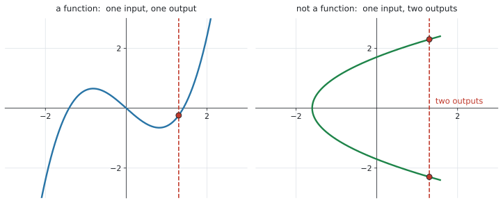
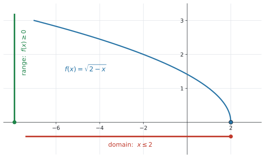
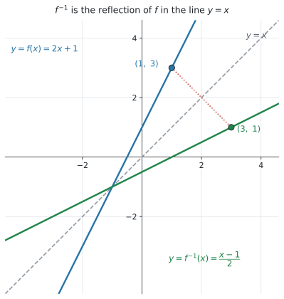

# SL 2.2 — Functions, domain, range and inverse functions（関数・定義域・値域・逆関数） {#sec-sl-2-2}

::: {.callout-note}
## What you should be able to do
- **function**（関数）とは何かを説明できる。**1つの入力に、出力は1つだけ**。
- **function notation**（$f(x)$、$v(t)$、$C(n)$）を読み、$f(3)$ のような値を求められる。
- **domain**（定義域）と **range**（値域）を、式からもグラフからも答えられる。
- 関数を **mathematical model** として使い、**文脈から domain を決められる**。
- **inverse function**（逆関数）が「もとにもどす」ものだと分かり、**$f^{-1}(x)$** の記号を使える。
- **$f(x) = 10$ を解くことと $f^{-1}(10)$ を求めることは同じ**だと分かる。
- $f^{-1}$ のグラフが **$y = x$ についての対称移動**であることを説明できる。
:::

::: {.callout-important}
## Formula booklet には、何も載っていません
公式集の Topic 2 の欄には、**SL 2.1 と SL 2.5 の式しかありません。** SL 2.2 の欄は**ありません。**

この項目は**式を使う項目ではなく、言葉と考え方の項目**です。覚えるのは**記号の意味**だけです。
:::

::: {.callout-important}
## Topic 2 全体にかかる3つの決めごと ★★
シラバスの Topic 2 の冒頭に、**この Topic 全部にかかる大事なことが3つ**書かれています。SL 2.2 から SL 2.6 まで、ずっと効いてきます。

**(1) 断りがなければ、domain は「その式が使えるいちばん広い範囲」**

> the domain will be the **largest possible domain** for which a function is defined unless otherwise stated; this will usually be the real numbers.

つまり「$f(x) = 3x - 5$ の domain は？」と聞かれたら、**答えは「すべての実数」**です。式が使えなくなる場所がないからです。

**(2) シラバスに載っていない形の関数も、グラフをかかせることがある**

> questions may be set requiring the graphing of functions that **do not explicitly appear on the syllabus**

**知らない形が出ても、電卓に入れればグラフは出ます。** あわてないでください。

**(3) 手で式変形するより、電卓を使う**

> students should be given the opportunity to use technology such as graphing packages and graphing calculators ... **rather than using elaborate analytical techniques**

**AI はここが AA と一番違うところ**です。**込み入った式変形は求められていません。**
:::

## The idea

### 1. function とは ── 「入力1つに、出力1つ」 {#what-is-function}

**function**（関数）は、**「入れると、何か1つ出てくる仕組み」**です。

大事なのは**「1つだけ」**というところです。

> **同じ入力を入れたら、出てくる答えはいつも同じ、ただ1つ。**

{#fig-sl22-test width=100%}

@fig-sl22-test で見分け方が分かります。**縦の線を1本引いてみて、グラフと2回以上ぶつかったら function ではありません。**

- **左** … どこに縦線を引いても、ぶつかるのは1回だけ → **function**
- **右** … $x = 1.3$ で2回ぶつかる → 入力1つに出力が2つ → **function ではない**

::: {.callout-note}
## 「出力が同じ」なのは構いません
$f(x) = x^2$ では、$f(2) = 4$ と $f(-2) = 4$ で、**出力が同じ**になります。

これは **function です。** 禁止されているのは「**1つの入力から、2つの出力**」であって、「2つの入力から、同じ出力」ではありません。

**この違いは、あとの [inverse function](#inverse) のところで効いてきます。**
:::

### 2. function notation ── $f(x)$ の読み方 {#notation}

シラバスに、**3つの例**が挙がっています。

$$
f(x), \qquad v(t), \qquad C(n)
$$

**カッコの中が入力**です。文字は場面によって変わります。

| 書き方 | 読み方 |
|---|---|
| $f(x)$ | $x$ を入れたときの、$f$ の出力 |
| $v(t)$ | 時刻 $t$ での**速さ**（velocity） |
| $C(n)$ | $n$ 個作ったときの**費用**（cost） |

: function notation の例 {#tbl-sl22-notation}

::: {.callout-warning}
## $f(3)$ は「$f$ かける $3$」ではありません ★
$f(3)$ は**掛け算ではありません。** 「$x$ のところに $3$ を入れる」という意味です。

$f(x) = 3x - 5$ なら、

$$
f(3) = 3(3) - 5 = 4
$$

**カッコの中の数を、式の $x$ に全部入れる。** これだけです。
:::

#### 「$f(x) = 16$ を解く」は、逆向きです

| 聞かれ方 | やること |
|---|---|
| **$f(4)$ を求めよ** | $x = 4$ を**入れて**、出力を出す |
| **$f(x) = 16$ を解け** | 出力が $16$ になる**入力を探す** |

: 2つの向き {#tbl-sl22-directions}

**この2つは向きが反対**です。どちらを聞かれているか、問題文をよく読んでください。**後者は [inverse function](#inverse) の話につながります。**

### 3. domain と range ★★ {#domain-range}

| 英語 | 日本語 | 意味 |
|---|---|---|
| **domain** | 定義域 | **入れてよい $x$** の範囲 |
| **range** | 値域 | **出てくる $f(x)$** の範囲 |

: domain と range {#tbl-sl22-dr}

**domain は横軸（$x$）、range は縦軸（$f(x)$）**の話です。ここを取り違えないでください。

#### シラバスの例で見ます

シラバスに、この例がそのまま載っています。

> Example: $f(x) = \sqrt{2 - x}$, the domain is $x \leq 2$, range is $f(x) \geq 0$.

{#fig-sl22-dr width=85%}

**domain がなぜ $x \leq 2$ なのか。** ルートの中は**負にできない**からです。

$$
2 - x \geq 0 \quad \Rightarrow \quad x \leq 2
$$

**range がなぜ $f(x) \geq 0$ なのか。** ルートの答えは**負にならない**からです。@fig-sl22-dr のグラフが、$x$ 軸より下に行かないことを見てください。

::: {.callout-tip}
## range はグラフで見るのが確実です ★
シラバスにも書かれています。

> **A graph is helpful in visualizing the range.**

**range を式だけで考えると、まず間違えます。** 電卓でグラフをかいて、**「縦にどこからどこまで届いているか」**を見てください。

**domain は横の広がり、range は縦の広がり。** グラフを見れば、両方とも一目で分かります。
:::

#### 断りがなければ「いちばん広い範囲」

前に書いた Topic 2 の決めごと (1) です。**式が使えなくなる場所だけを外します。**

| 式 | 使えない場所 | domain |
|---|---|---|
| $f(x) = 3x - 5$ | なし | **すべての実数** |
| $f(x) = \sqrt{x - 5}$ | 中が負になるところ | $x \geq 5$ |
| $f(x) = \dfrac{1}{x - 3}$ | 分母が $0$ | $x \neq 3$ |

: よくある3つの型 {#tbl-sl22-largest}

**気をつけるのは2つだけ**です。

1. **ルートの中は $0$ 以上**
2. **分母は $0$ にできない**

### 4. 文脈が domain を決めることもあります {#context-domain}

シラバスの Content 欄に **"The concept of a function as a mathematical model"** とあります。**AI らしいところ**です。

現実の場面では、**式は使えても、意味を持たない値**があります。

> $n$ 個の商品を作る費用が $C(n) = 500 + 30n$（ドル）

式としては $n = -4$ でも計算できますが、**$-4$ 個作ることはできません。** また、商品は**整数個**です。

$$
\text{domain}: \quad n \geq 0 \ (\text{整数})
$$

::: {.callout-important}
## `in this context` と書かれていたら、現実を見てください ★
**`State the domain in this context`** と聞かれたら、**数学的に可能な範囲ではなく、意味を持つ範囲**を答えます。

- 個数、人数 … **$0$ 以上の整数**
- 時間 … ふつう **$t \geq 0$**、終わりが決まっていれば **$0 \leq t \leq (\text{終わり})$**
- 長さ、重さ … **正の数**

**「なぜその範囲なのか」を1行そえる**と、より確実です。
:::

### 5. inverse function ── もとにもどす ★★ {#inverse}

シラバスの言葉は、こうです。

> **Informal concept** that an inverse function **reverses or undoes** the effect of a function.

**inverse function**（逆関数）は、**もとの関数がやったことを、元にもどす**ものです。記号は **$f^{-1}(x)$** と書きます。

#### 記号の意味

$$
f(a) = b \qquad \Longleftrightarrow \qquad f^{-1}(b) = a
$$ {#eq-sl22-inv}

**入力と出力を入れかえるだけ**です。

$f(1) = 3$ なら、$f^{-1}(3) = 1$。**それだけのこと**です。

::: {.callout-important}
## $f(x) = 10$ を解くことと、$f^{-1}(10)$ を求めることは同じです ★★
シラバスに、この例がそのまま載っています。

> Example: Solving $f(x) = 10$ is equivalent to finding $f^{-1}(10)$.

**「出力が $10$ になる入力を探す」**という、まったく同じ作業だからです（@tbl-sl22-directions の右側）。

ですから、**$f^{-1}$ の式を求めなくても、$f^{-1}(10)$ の値は出せます。** 方程式 $f(x) = 10$ を解けばよいのです。**電卓で解いて構いません**（SL 1.8）。
:::

#### グラフは $y = x$ についての対称移動 {#reflection}

シラバスの Content 欄に、はっきり書かれています。

> Inverse function as a **reflection in the line $y = x$**, and the notation $f^{-1}(x)$.

{#fig-sl22-inv width=62%}

@fig-sl22-inv では、$f(x) = 2x + 1$ の上の点 $(1,\ 3)$ が、$f^{-1}$ の上では **$(3,\ 1)$** になっています。

$$
(a,\ b) \quad \longrightarrow \quad (b,\ a)
$$

**座標を入れかえるだけ**です。$y = x$ の線が、ちょうど鏡になっています。

#### domain と range も入れかわります ★

シラバスに書かれています。

> the **domain of $f^{-1}(x)$ is equal to the range of $f(x)$**

入力と出力が入れかわるのですから、当然そうなります。

| | domain | range |
|---|---|---|
| $f$ | $A$ | $B$ |
| **$f^{-1}$** | **$B$** | **$A$** |

: domain と range の入れかわり {#tbl-sl22-swap}

#### 逆関数がある関数、ない関数

シラバスに書かれています。

> inverse functions exist for **one to one** functions

**one-to-one**（1対1）とは、**「違う入力からは、必ず違う出力が出る」**という意味です。

$f(x) = x^2$ を考えます。$f(2) = 4$ で、$f(-2) = 4$。**出力 $4$ から、入力にもどれません。** $2$ なのか $-2$ なのか決まらないからです。

**だから $f(x) = x^2$（すべての実数で）には逆関数がありません。**

::: {.callout-note}
## 式変形で $f^{-1}(x)$ を求める必要はありません
シラバスの言葉は **`Informal concept`**（大まかな考え方）です。**式を変形して $f^{-1}(x)$ を求める手順は、Content 欄に挙げられていません。**

AI SL で聞かれるのは、次の4つです。

1. **$f^{-1}(b)$ の値**（$f(a) = b$ から読む、または $f(x) = b$ を解く）
2. **$f^{-1}$ のグラフ上の点**（座標を入れかえる）
3. **$f^{-1}$ の domain と range**（$f$ のものと入れかえる）
4. **$y = x$ についての対称移動**であること

**この4つができれば十分**です。
:::

## Why it works

ここでは、**なぜ $f^{-1}$ のグラフが $y = x$ の対称移動になるのか**だけを説明します。

$f$ のグラフの上に、点 $(a,\ b)$ があるとします。これは **$f(a) = b$** という意味です。

@eq-sl22-inv より、このとき **$f^{-1}(b) = a$** です。つまり **$f^{-1}$ のグラフの上には、点 $(b,\ a)$ がある**ことになります。

$f$ の上の点をぜんぶ**「座標を入れかえた点」**に置きかえると、$f^{-1}$ のグラフになる、ということです。

では、**$(a, b)$ を $(b, a)$ にする移動とは何でしょうか。**

$y = x$ の線は、**縦の座標と横の座標が等しい点の集まり**です。$(a, b)$ からこの線に垂直に下ろして、同じだけ向こう側へ行くと、ちょうど $(b, a)$ に着きます。

$$
(a,\ b) \quad \xrightarrow{\ y = x \text{ で折り返す}\ } \quad (b,\ a)
$$

@fig-sl22-inv の点線が、まさにこの折り返しです。**$(1, 3)$ と $(3, 1)$ を結ぶ線が、$y = x$ と直角に交わっている**ことを確かめてみてください。

## Worked examples

::: {.callout-note appearance="simple"}
問題文は英語です。意味が理解できなかったら、問題文の下の「**日本語訳**」を開いてください。解説は日本語です。
:::

::: {#exm-sl22-notation}
[A function is defined by $f(x) = 3x - 5$.]{.q-en}

**(a)** [Find $f(4)$.]{.q-en}

**(b)** [Find $f(-2)$.]{.q-en}

**(c)** [Solve $f(x) = 16$.]{.q-en}

**(d)** [Write down the value of $f^{-1}(16)$.]{.q-en}

<details class="jp-trans">
<summary>日本語訳</summary>

関数が $f(x) = 3x - 5$ で定められています。

**(a)** $f(4)$ を求めなさい。

**(b)** $f(-2)$ を求めなさい。

**(c)** $f(x) = 16$ を解きなさい。

**(d)** $f^{-1}(16)$ の値を書きなさい。

</details>

---

**(a)(b)** **$x$ のところに数を入れるだけ**です。

$$
f(4) = 3(4) - 5 = 12 - 5 = 7
$$

$$
f(-2) = 3(-2) - 5 = -6 - 5 = -11
$$

**負の数はカッコを付けて代入**してください。$3 \times -2$ と書くと符号を落としやすくなります。

**(c)** 今度は**逆向き**です（@tbl-sl22-directions）。出力が $16$ になる $x$ を探します。

$$
3x - 5 = 16
$$

$$
3x = 21
$$

$$
x = 7
$$

**(d)** **(c) がそのまま答えです。**

$$
f^{-1}(16) = 7
$$

[$f(x) = 16$ を解くことと、$f^{-1}(16)$ を求めることは同じ](#inverse)だからです。**$f^{-1}$ の式を作る必要はありません。**

::: {.callout-note}
## 解答例（答案用紙にはこう書く）
**(a)** $f(4) = 3(4) - 5 = 7$

**(b)** $f(-2) = 3(-2) - 5 = -11$

**(c)** $3x - 5 = 16$, so $3x = 21$ and $x = 7$

**(d)** $f^{-1}(16) = 7$
:::
:::

::: {#exm-sl22-sqrt}
[A function is defined by $f(x) = \sqrt{2 - x}$.]{.q-en}

**(a)** [Write down the domain of $f$.]{.q-en}

**(b)** [Write down the range of $f$.]{.q-en}

**(c)** [Find $f(-7)$.]{.q-en}

<details class="jp-trans">
<summary>日本語訳</summary>

関数が $f(x) = \sqrt{2 - x}$ で定められています。

**(a)** $f$ の domain を書きなさい。

**(b)** $f$ の range を書きなさい。

**(c)** $f(-7)$ を求めなさい。

</details>

---

**(a)** **ルートの中は負にできません**（@tbl-sl22-largest）。

$$
2 - x \geq 0
$$

$$
2 \geq x, \qquad \text{つまり} \qquad x \leq 2
$$

**不等号の向きに注意してください。** $-x$ を移すときに向きが変わります。心配なら $x = 0$（$\sqrt{2}$ が出る、OK）と $x = 5$（$\sqrt{-3}$ になる、だめ）で確かめると、$x \leq 2$ で合っていると分かります。

**(b)** **ルートの答えは負になりません。**

$$
f(x) \geq 0
$$

@fig-sl22-dr のグラフのとおり、**$x$ 軸より下には行きません。**

**(c)** 代入するだけです。

$$
f(-7) = \sqrt{2 - (-7)} = \sqrt{9} = 3
$$

**$2 - (-7) = 9$** です。$-5$ としないように、カッコを付けて書いてください。

::: {.callout-note}
## 解答例（答案用紙にはこう書く）
**(a)** $2 - x \geq 0$, so the domain is $x \leq 2$

**(b)** The range is $f(x) \geq 0$

**(c)** $f(-7) = \sqrt{2 - (-7)} = \sqrt{9} = 3$
:::
:::

::: {#exm-sl22-graph}
[The function $f$ is defined by $f(x) = x^{2} - 4x + 1$ for $0 \leq x \leq 5$.]{.q-en}

**(a)** [Sketch the graph of $f$ using your GDC.]{.q-en}

**(b)** [Write down the minimum value of $f(x)$.]{.q-en}

**(c)** [Hence write down the range of $f$.]{.q-en}

<details class="jp-trans">
<summary>日本語訳</summary>

関数 $f$ が、$0 \leq x \leq 5$ の範囲で $f(x) = x^{2} - 4x + 1$ と定められています。

**(a)** GDC を使って $f$ のグラフをかきなさい。

**(b)** $f(x)$ の最小値を書きなさい。

**(c)** よって、$f$ の range を書きなさい。

（`Hence` は「いまの答えを使って」という指示です。前の答えを必ず使ってください。）

</details>

---

**この問題は、domain が問題文で指定されています。** 「いちばん広い範囲」ではありません。

**(a)** 電卓に `f1(x) = x^2 - 4x + 1` と入れます。**下に開いた谷の形（放物線）**が出ます。

**(b)** [range はグラフで見ます](#domain-range)。谷の底が最小値です。

```
menu → Analyze Graph → Minimum
```

$$
\text{最小値} = -3 \quad (x = 2 \text{ のとき})
$$

**(c)** range は**縦にどこまで届いているか**です。**下は最小値、上は端っこ**を調べます。

domain の両端を代入します。

$$
f(0) = 1, \qquad f(5) = 25 - 20 + 1 = 6
$$

大きいほうは **$f(5) = 6$**。

$$
-3 \leq f(x) \leq 6
$$

::: {.callout-warning}
## 「両端」だけを見てはいけません ★
$f(0) = 1$ と $f(5) = 6$ だけを見て「$1 \leq f(x) \leq 6$」と答えるのが、**この形の問題で一番多い間違い**です。

**途中で $-3$ まで下がっています。** グラフをかけば必ず気づきます。**だから (a) でグラフをかかせているのです。**
:::

::: {.callout-note}
## 解答例（答案用紙にはこう書く）
**(b)** The minimum value is $-3$ (at $x = 2$).

**(c)** $f(0) = 1$ and $f(5) = 6$, so the range is $-3 \leq f(x) \leq 6$
:::
:::

::: {#exm-sl22-taxi}
[A taxi company charges a fixed fee plus an amount for each kilometre. The cost, in dollars, of a journey of $d$ kilometres is given by]{.q-en}

$$
C(d) = 3.5 + 1.8d
$$

[The company only accepts journeys of up to $20$ km.]{.q-en}

**(a)** [Find $C(6)$ and interpret this value in context.]{.q-en}

**(b)** [State the domain of $C$ in this context.]{.q-en}

**(c)** [Find the range of $C$ in this context.]{.q-en}

**(d)** [A journey costs $\$23.30$. Find the length of the journey.]{.q-en}

<details class="jp-trans">
<summary>日本語訳</summary>

あるタクシー会社は、定額の基本料金に加えて、$1$ km ごとの料金をとります。$d$ km の乗車にかかる費用（ドル）は次の式で表されます。

この会社は、$20$ km までの乗車しか受けつけません。

**(a)** $C(6)$ を求め、その値の意味を文脈の中で説明しなさい。

**(b)** この文脈での $C$ の domain を述べなさい。

**(c)** この文脈での $C$ の range を求めなさい。

**(d)** ある乗車の費用が $\$23.30$ でした。その距離を求めなさい。

（`fixed fee` は「基本料金」、`up to` は「〜まで」です。）

</details>

---

**(a)** $d = 6$ を入れます。

$$
C(6) = 3.5 + 1.8(6) = 3.5 + 10.8 = 14.3
$$

`interpret` があるので、**言葉が必要**です。

::: {.model-answer}
**試験ではこう書く**

*A journey of $6$ km costs $\$14.30$.*
:::

（意味：$6$ km の乗車は $\$14.30$ かかる。）

**$14.3$ だけでは点になりません。** 単位（ドル）と、何の値なのかを書いてください。

**(b)** `in this context` なので、[現実に意味のある範囲](#context-domain)です。

距離は**負にならず**、会社は **$20$ km まで**しか受けません。

$$
0 \leq d \leq 20
$$

**(c)** $C$ は**右上がりの直線**（傾き $1.8 > 0$）なので、**端が最小と最大**になります。

$$
C(0) = 3.5, \qquad C(20) = 3.5 + 1.8(20) = 3.5 + 36 = 39.5
$$

$$
3.5 \leq C(d) \leq 39.5
$$

**@exm-sl22-graph と違って、途中で下がったりしません。** 直線だからです。

**(d)** 今度は**逆向き**です。$C(d) = 23.3$ を解きます。

$$
3.5 + 1.8d = 23.3
$$

$$
1.8d = 19.8
$$

$$
d = 11 \ \text{km}
$$

**これは $C^{-1}(23.3)$ を求めたことになります**（@eq-sl22-inv）。

::: {.callout-note}
## 解答例（答案用紙にはこう書く）
**(a)** $C(6) = 3.5 + 1.8(6) = 14.3$

*A journey of $6$ km costs $\$14.30$.*

**(b)** $0 \leq d \leq 20$

**(c)** $C(0) = 3.5$ and $C(20) = 39.5$, so $3.5 \leq C(d) \leq 39.5$

**(d)** $3.5 + 1.8d = 23.3$, so $1.8d = 19.8$ and $d = 11$ km
:::
:::

::: {#exm-sl22-inverse}
[The function $f$ has domain $0 \leq x \leq 6$ and range $1 \leq f(x) \leq 13$. The graph of $f$ passes through the point $(2,\ 5)$.]{.q-en}

**(a)** [Write down the value of $f^{-1}(5)$.]{.q-en}

**(b)** [Write down the coordinates of a point on the graph of $y = f^{-1}(x)$.]{.q-en}

**(c)** [Write down the domain and range of $f^{-1}$.]{.q-en}

**(d)** [Describe the geometric relationship between the graphs of $y = f(x)$ and $y = f^{-1}(x)$.]{.q-en}

<details class="jp-trans">
<summary>日本語訳</summary>

関数 $f$ は domain が $0 \leq x \leq 6$、range が $1 \leq f(x) \leq 13$ です。$f$ のグラフは点 $(2,\ 5)$ を通ります。

**(a)** $f^{-1}(5)$ の値を書きなさい。

**(b)** $y = f^{-1}(x)$ のグラフ上の点の座標を $1$ つ書きなさい。

**(c)** $f^{-1}$ の domain と range を書きなさい。

**(d)** $y = f(x)$ と $y = f^{-1}(x)$ のグラフの、図形としての関係を述べなさい。

（`geometric relationship` は「図形としての関係」です。）

</details>

---

**この問題には式がありません。** $f$ がどんな式かは分からないままです。**それでも全部答えられます。**

**(a)** グラフが $(2, 5)$ を通るので、**$f(2) = 5$** です。@eq-sl22-inv より、

$$
f^{-1}(5) = 2
$$

**(b)** [座標を入れかえるだけ](#reflection)です。

$$
(5,\ 2)
$$

**(c)** [domain と range が入れかわります](#inverse)（@tbl-sl22-swap）。

$$
\text{domain of } f^{-1}: \quad 1 \leq x \leq 13
$$

$$
\text{range of } f^{-1}: \quad 0 \leq f^{-1}(x) \leq 6
$$

**$f$ の range が $f^{-1}$ の domain**、**$f$ の domain が $f^{-1}$ の range** です。

**(d)** `Describe` なので、**言葉で**答えます。

::: {.model-answer}
**試験ではこう書く**

*The graph of $y = f^{-1}(x)$ is the reflection of the graph of $y = f(x)$ in the line $y = x$.*
:::

（意味：$y = f^{-1}(x)$ のグラフは、$y = f(x)$ のグラフを直線 $y = x$ について折り返したものである。）

**`in the line y = x` まで書いてください。** 「対称です」だけでは、何について対称なのかが伝わりません。

::: {.callout-note}
## 解答例（答案用紙にはこう書く）
**(a)** $f^{-1}(5) = 2$

**(b)** $(5,\ 2)$

**(c)** Domain of $f^{-1}$: $1 \leq x \leq 13$. Range of $f^{-1}$: $0 \leq f^{-1}(x) \leq 6$

**(d)** *The graph of $y = f^{-1}(x)$ is the reflection of the graph of $y = f(x)$ in the line $y = x$.*
:::
:::

## Common errors

::: {.callout-warning}
## $f(3)$ を「$f$ かける $3$」だと思う ★
$f(3)$ は**代入**です。掛け算ではありません。

$f(x) = 3x - 5$ なら $f(3) = 3(3) - 5 = 4$ です。
:::

::: {.callout-warning}
## domain と range を取り違える ★★
- **domain** … **横**（入れる $x$）
- **range** … **縦**（出てくる $f(x)$）

**「domain は横、range は縦」**と、口に出して覚えてください。
:::

::: {.callout-warning}
## range を求めるのに両端しか見ない ★★
$f(0)$ と $f(5)$ だけを見て答えると、**途中の山や谷を見落とします。**

**必ずグラフをかいてください。** シラバスにも `A graph is helpful in visualizing the range` と書かれています。
:::

::: {.callout-warning}
## 文脈の domain に、負の値や小数を入れてしまう
個数や人数なら **$0$ 以上の整数**、距離や時間なら **$0$ 以上**です。

**`in this context` と書かれていたら、現実に戻って考えてください。**
:::

::: {.callout-warning}
## $f^{-1}(x)$ を $\dfrac{1}{f(x)}$ だと思う ★★
**この $-1$ は「逆数」ではありません。** 「もとにもどす関数」という意味の記号です。

$f(x) = 2x$ なら $f^{-1}(6) = 3$ ですが、$\dfrac{1}{f(6)} = \dfrac{1}{12}$。**まったく別の値**です。
:::

::: {.callout-warning}
## $f^{-1}$ の domain と range を入れかえ忘れる
$f$ の **range** が $f^{-1}$ の **domain** です。

**入力と出力が入れかわるのだから、範囲も入れかわります。**
:::

::: {.callout-warning}
## 座標を入れかえずに書く
$f$ が $(2,\ 5)$ を通るなら、$f^{-1}$ は **$(5,\ 2)$** を通ります。$(2,\ 5)$ のままではありません。
:::

::: {.callout-warning}
## 「$y = x$ について」を書き落とす ★
`Describe the relationship` の答えは、**`reflection in the line y = x`** です。

**「対称です」だけでは点になりません。** 何について対称なのかが要ります。
:::

## Using your GDC (TI-Nspire CX II)

シラバスに、こう書かれています。

> use technology such as graphing packages and graphing calculators ... **rather than using elaborate analytical techniques**

**この項目は、電卓でグラフを見るのが本筋**です。

### グラフをかいて range を読む ★

```
ctrl + doc → 2: Add Graphs
```

`f1(x) =` に式を入れます。

```
f1(x) = x^2 - 4x + 1
```

**山や谷があるかどうかを、まず目で見ます。** あれば、その値が range の端になります。

```
menu → Analyze Graph → Minimum
menu → Analyze Graph → Maximum
```

左右の境目を指定すると、頂点の座標が出ます。

::: {.callout-tip}
## domain が指定されているときは、両端も代入する ★
$0 \leq x \leq 5$ のように domain が決まっているときは、**グラフの山や谷だけでなく、両端の値も必要**です。

1. **山・谷** … Analyze Graph で出す
2. **両端** … $f(0)$、$f(5)$ を代入して出す
3. **その中でいちばん小さい値といちばん大きい値**が range の端

**3つを全部そろえてから答えてください。**
:::

### 値の表を出す

$f(x)$ の値をいくつか並べて見たいときは、

```
ctrl + T
```

でグラフの横に表が出ます。**$x$ を変えると $f(x)$ がどう動くか**が見えるので、range の見当がつきます。

### $f(x) = k$ を解く（＝ $f^{-1}(k)$ を求める）★

**$f^{-1}(k)$ を聞かれたら、方程式 $f(x) = k$ を解きます**（@eq-sl22-inv）。

`f1(x)` に $f$、`f2(x)` に $k$（水平な直線）を入れて、

```
menu → Analyze Graph → Intersection
```

交点の $x$ 座標が $f^{-1}(k)$ です。

SL 1.8 でやった**方程式を解く機能**でも構いません。**どちらでも同じ答えが出ます。**

### 画面に入らないとき

```
menu → Window/Zoom → Zoom - Fit
```

**グラフが見えていないと、range は読めません。** まずは全体が見える大きさにしてください。

## Exercises

::: {.callout-note appearance="simple"}
各問題に、折りたたみが3つ付いています。**日本語訳**、**解答例**（答案用紙に書くべきこと。英語です）、**解説**（なぜそうなるか。日本語です）。

まず自分で解いて、次に解答例と見くらべてください。**解説は、合わなかったときだけ開けば十分です。**
:::

::: {.exercise-block}

[1]{.ex-no} [A function is defined by $f(x) = 5 - 2x$.]{.q-en}

**(a)** [Find $f(3)$.]{.q-en}

**(b)** [Find $f(-1)$.]{.q-en}

**(c)** [Solve $f(x) = 11$.]{.q-en}

<details class="jp-trans">
<summary>日本語訳</summary>

関数が $f(x) = 5 - 2x$ で定められています。

**(a)** $f(3)$ を求めなさい。

**(b)** $f(-1)$ を求めなさい。

**(c)** $f(x) = 11$ を解きなさい。

</details>

::: {.callout-note collapse="true"}
## 解答例（答案用紙に書くこと）
**(a)** $f(3) = 5 - 2(3) = -1$

**(b)** $f(-1) = 5 - 2(-1) = 7$

**(c)** $5 - 2x = 11$, so $-2x = 6$ and $x = -3$
:::

::: {.callout-tip collapse="true"}
## 解説
**(a)(b)** 代入するだけです。**(b) は $-2 \times (-1) = +2$** なので $5 + 2 = 7$。**符号が2回変わる**ところが引っかかりやすいので、カッコを付けて書いてください。

**(c)** 出力から入力を探す、**逆向き**の問題です。

$$-2x = 11 - 5 = 6 \quad \Rightarrow \quad x = -3$$

**両辺を $-2$ で割るとき、符号が変わります。**

**検算。** $f(-3) = 5 - 2(-3) = 5 + 6 = 11$ ✓
:::

::: {.ex-sep}
:::

[2]{.ex-no} [A function is defined by $g(x) = x^{2} + 3$ for all real values of $x$.]{.q-en}

**(a)** [Find $g(4)$ and $g(-4)$.]{.q-en}

**(b)** [Explain why $g$ does not have an inverse function.]{.q-en}

<details class="jp-trans">
<summary>日本語訳</summary>

関数が、すべての実数 $x$ について $g(x) = x^{2} + 3$ と定められています。

**(a)** $g(4)$ と $g(-4)$ を求めなさい。

**(b)** $g$ に逆関数がない理由を説明しなさい。

</details>

::: {.callout-note collapse="true"}
## 解答例（答案用紙に書くこと）
**(a)** $g(4) = 4^{2} + 3 = 19$ and $g(-4) = (-4)^{2} + 3 = 19$

**(b)** *Since $g(4) = g(-4) = 19$, the function is not one to one. The output $19$ comes from two different inputs, so it is not possible to reverse the function and $g$ has no inverse.*
:::

::: {.callout-tip collapse="true"}
## 解説
**(a)** **$(-4)^2 = 16$** です。$-16$ ではありません。**カッコを付けて書く**と間違えません。

**(b)** [逆関数があるのは one-to-one の関数だけ](#inverse)です。

$19$ という出力から**もとの入力にもどろうとしても、$4$ なのか $-4$ なのか決まりません。** これでは「もとにもどす」ことができません。

**(a) を根拠として使ってください。** 「$x^2$ だからだめ」ではなく、「**$g(4) = g(-4) = 19$ だから one-to-one ではない**」と、**具体的な数で示す**のが答え方です。
:::

::: {.ex-sep}
:::

[3]{.ex-no} [A function is defined by $h(x) = \sqrt{x - 5}$.]{.q-en}

**(a)** [Write down the domain of $h$.]{.q-en}

**(b)** [Write down the range of $h$.]{.q-en}

**(c)** [Find $h(9)$.]{.q-en}

<details class="jp-trans">
<summary>日本語訳</summary>

関数が $h(x) = \sqrt{x - 5}$ で定められています。

**(a)** $h$ の domain を書きなさい。

**(b)** $h$ の range を書きなさい。

**(c)** $h(9)$ を求めなさい。

</details>

::: {.callout-note collapse="true"}
## 解答例（答案用紙に書くこと）
**(a)** $x - 5 \geq 0$, so the domain is $x \geq 5$

**(b)** The range is $h(x) \geq 0$

**(c)** $h(9) = \sqrt{9 - 5} = \sqrt{4} = 2$
:::

::: {.callout-tip collapse="true"}
## 解説
**(a)** **ルートの中は $0$ 以上**（@tbl-sl22-largest）。

$$x - 5 \geq 0 \quad \Rightarrow \quad x \geq 5$$

**@exm-sl22-sqrt と向きが逆**です。あちらは $2 - x$ だったので $x \leq 2$、こちらは $x - 5$ なので $x \geq 5$。**$x$ の符号を見てください。**

**(b)** ルートの答えは負になりません。$x = 5$ のとき $h = 0$ になるので、**$0$ も入ります。**

**(c)** $\sqrt{4} = 2$。
:::

::: {.ex-sep}
:::

[4]{.ex-no} [The function $f$ is defined by $f(x) = x^{2} - 6x + 5$ for $0 \leq x \leq 7$.]{.q-en}

**(a)** [Use your GDC to find the minimum value of $f(x)$.]{.q-en}

**(b)** [Find the range of $f$.]{.q-en}

<details class="jp-trans">
<summary>日本語訳</summary>

関数 $f$ が、$0 \leq x \leq 7$ の範囲で $f(x) = x^{2} - 6x + 5$ と定められています。

**(a)** GDC を使って $f(x)$ の最小値を求めなさい。

**(b)** $f$ の range を求めなさい。

</details>

::: {.callout-note collapse="true"}
## 解答例（答案用紙に書くこと）
**(a)** The minimum value is $-4$ (at $x = 3$).

**(b)** $f(0) = 5$ and $f(7) = 49 - 42 + 5 = 12$

The range is $-4 \leq f(x) \leq 12$
:::

::: {.callout-tip collapse="true"}
## 解説
**(a)** 電卓でグラフをかき、`Analyze Graph → Minimum`。$x = 3$ で $f = -4$ です。

**(b)** [3つそろえます](#domain-range)。

- **谷** … $-4$
- **左端** … $f(0) = 5$
- **右端** … $f(7) = 49 - 42 + 5 = 12$

いちばん小さいのが $-4$、いちばん大きいのが $12$。

$$-4 \leq f(x) \leq 12$$

**「$5 \leq f(x) \leq 12$」と答えないでください。** 途中で $-4$ まで下がっています。**グラフを見れば防げます。**
:::

::: {.ex-sep}
:::

[5]{.ex-no} [A tank is being emptied. The volume of water in the tank, in litres, after $t$ minutes is given by]{.q-en}

$$
V(t) = 500 - 25t
$$

**(a)** [Find $V(8)$ and interpret this value in context.]{.q-en}

**(b)** [State the domain of $V$ in this context.]{.q-en}

**(c)** [State the range of $V$ in this context.]{.q-en}

<details class="jp-trans">
<summary>日本語訳</summary>

あるタンクの水が抜かれています。$t$ 分後のタンクの中の水の量（リットル）は次の式で表されます。

**(a)** $V(8)$ を求め、その値の意味を文脈の中で説明しなさい。

**(b)** この文脈での $V$ の domain を述べなさい。

**(c)** この文脈での $V$ の range を述べなさい。

（`tank` は「タンク」、`emptied` は「空にされる」です。）

</details>

::: {.callout-note collapse="true"}
## 解答例（答案用紙に書くこと）
**(a)** $V(8) = 500 - 25(8) = 300$

*After $8$ minutes there are $300$ litres of water left in the tank.*

**(b)** The tank is empty when $500 - 25t = 0$, so $t = 20$.

The domain is $0 \leq t \leq 20$.

**(c)** $0 \leq V(t) \leq 500$
:::

::: {.callout-tip collapse="true"}
## 解説
**(a)** $500 - 200 = 300$。**言葉と単位（リットル）**を付けてください。

**(b)** `in this context` なので[現実で考えます](#context-domain)。

- 時間は**負になりません** → $t \geq 0$
- **空になったら終わり** → $V = 0$ となる $t$ を求めます

$$500 - 25t = 0 \quad \Rightarrow \quad t = 20$$

$$0 \leq t \leq 20$$

**この「終わりを自分で計算する」ところが山**です。$t \geq 0$ だけでは足りません。

**(c)** 水の量は、はじめ $500$ L で、$0$ L まで減ります。

$$0 \leq V(t) \leq 500$$

**傾きが負なので、$t$ の左端が range の上端**になります。
:::

::: {.ex-sep}
:::

[6]{.ex-no} [For a function $f$, it is given that $f(2) = 9$ and $f^{-1}(4) = -1$.]{.q-en}

**(a)** [Write down the value of $f^{-1}(9)$.]{.q-en}

**(b)** [Write down the value of $f(-1)$.]{.q-en}

<details class="jp-trans">
<summary>日本語訳</summary>

ある関数 $f$ について、$f(2) = 9$ かつ $f^{-1}(4) = -1$ であることが分かっています。

**(a)** $f^{-1}(9)$ の値を書きなさい。

**(b)** $f(-1)$ の値を書きなさい。

</details>

::: {.callout-note collapse="true"}
## 解答例（答案用紙に書くこと）
**(a)** $f^{-1}(9) = 2$

**(b)** $f(-1) = 4$
:::

::: {.callout-tip collapse="true"}
## 解説
[@eq-sl22-inv の関係](#inverse)を、**両方の向きに**使う問題です。

$$f(a) = b \quad \Longleftrightarrow \quad f^{-1}(b) = a$$

**(a)** $f(2) = 9$ → **入力と出力を入れかえて** $f^{-1}(9) = 2$。

**(b)** $f^{-1}(4) = -1$ → 同じく入れかえて $f(-1) = 4$。

**式は分からないままでも答えられます。** この項目では、**そういう問題がよく出ます。**
:::

::: {.ex-sep}
:::

[7]{.ex-no} [The graph of $y = f(x)$ passes through the point $(-3,\ 8)$.]{.q-en}

[Write down the coordinates of the corresponding point on the graph of $y = f^{-1}(x)$.]{.q-en}

<details class="jp-trans">
<summary>日本語訳</summary>

$y = f(x)$ のグラフは点 $(-3,\ 8)$ を通ります。

$y = f^{-1}(x)$ のグラフ上の、対応する点の座標を書きなさい。

（`corresponding` は「対応する」です。）

</details>

::: {.callout-note collapse="true"}
## 解答例（答案用紙に書くこと）
$(8,\ -3)$
:::

::: {.callout-tip collapse="true"}
## 解説
[座標を入れかえるだけ](#reflection)です。

$$(-3,\ 8) \quad \longrightarrow \quad (8,\ -3)$$

**符号はそのまま持っていきます。** $(8,\ 3)$ ではありません。

**なぜそうなるか。** $(-3, 8)$ を通るということは $f(-3) = 8$。ですから $f^{-1}(8) = -3$、つまり $f^{-1}$ のグラフは $(8, -3)$ を通ります。

図で見ると、**$y = x$ について折り返した位置**です（@fig-sl22-inv）。
:::

::: {.ex-sep}
:::

[8]{.ex-no} [A function $f$ has domain $2 \leq x \leq 10$ and range $5 \leq f(x) \leq 40$.]{.q-en}

[Write down the domain and the range of $f^{-1}$.]{.q-en}

<details class="jp-trans">
<summary>日本語訳</summary>

関数 $f$ は domain が $2 \leq x \leq 10$、range が $5 \leq f(x) \leq 40$ です。

$f^{-1}$ の domain と range を書きなさい。

</details>

::: {.callout-note collapse="true"}
## 解答例（答案用紙に書くこと）
Domain of $f^{-1}$: $5 \leq x \leq 40$

Range of $f^{-1}$: $2 \leq f^{-1}(x) \leq 10$
:::

::: {.callout-tip collapse="true"}
## 解説
**そっくり入れかえるだけ**です（@tbl-sl22-swap）。

- $f$ の **range** $5 \leq f(x) \leq 40$ → $f^{-1}$ の **domain** $5 \leq x \leq 40$
- $f$ の **domain** $2 \leq x \leq 10$ → $f^{-1}$ の **range** $2 \leq f^{-1}(x) \leq 10$

**書くときの文字に注意してください。** domain は $x$ の範囲なので **$5 \leq x \leq 40$**、range は出てくる値の範囲なので **$2 \leq f^{-1}(x) \leq 10$** です。

シラバスにも *"the domain of $f^{-1}(x)$ is equal to the range of $f(x)$"* と、そのまま書かれています。
:::

::: {.ex-sep}
:::

[9]{.ex-no} [A student writes: "$f^{-1}(x)$ means $\dfrac{1}{f(x)}$."]{.q-en}

[Explain why this is not correct, using the function $f(x) = 2x$ as an example.]{.q-en}

<details class="jp-trans">
<summary>日本語訳</summary>

ある生徒が「$f^{-1}(x)$ は $\dfrac{1}{f(x)}$ という意味だ」と書きました。

これが正しくない理由を、関数 $f(x) = 2x$ を例に使って説明しなさい。

（本書オリジナルの問題です。）

</details>

::: {.callout-note collapse="true"}
## 解答例（答案用紙に書くこと）
*The notation $f^{-1}$ means the inverse function, which reverses the effect of $f$; it does not mean a reciprocal.*

*For $f(x) = 2x$ we have $f(3) = 6$, so $f^{-1}(6) = 3$. However $\dfrac{1}{f(6)} = \dfrac{1}{12}$. These are different, so $f^{-1}(x)$ is not $\dfrac{1}{f(x)}$.*
:::

::: {.callout-tip collapse="true"}
## 解説
**$-1$ という肩の数字が、ふつうの「$-1$ 乗（逆数）」と同じに見える**ので、とても多い間違いです。

**$f^{-1}$ は、記号としてひとかたまり**です。「もとにもどす関数」という名前だと思ってください。

**`using ... as an example` と指示されている**ので、**具体的な数を出す**必要があります。

- $f(3) = 6$ なので $f^{-1}(6) = 3$
- ところが $\dfrac{1}{f(6)} = \dfrac{1}{12}$

**$3 \neq \dfrac{1}{12}$。** これで「別のものだ」と示せました。

**言葉だけで「意味が違います」と書いても、点になりません。** 数で示してください。
:::

::: {.ex-sep}
:::

[10]{.ex-no} [Temperatures in degrees Celsius, $c$, are converted to degrees Fahrenheit, $F$, using the function]{.q-en}

$$
F(c) = 1.8c + 32
$$

**(a)** [Find $F(25)$.]{.q-en}

**(b)** [Solve $F(c) = 68$.]{.q-en}

**(c)** [Write down the value of $F^{-1}(68)$, and interpret it in context.]{.q-en}

**(d)** [The domain of $F$ is restricted to $0 \leq c \leq 40$. Find the range of $F$.]{.q-en}

**(e)** [Explain why $F$ has an inverse function.]{.q-en}

<details class="jp-trans">
<summary>日本語訳</summary>

摂氏 $c$ 度の温度は、次の関数で華氏 $F$ 度に変換されます。

**(a)** $F(25)$ を求めなさい。

**(b)** $F(c) = 68$ を解きなさい。

**(c)** $F^{-1}(68)$ の値を書き、その意味を文脈の中で説明しなさい。

**(d)** $F$ の domain を $0 \leq c \leq 40$ に制限します。$F$ の range を求めなさい。

**(e)** $F$ に逆関数がある理由を説明しなさい。

（`degrees Celsius` は「摂氏」、`degrees Fahrenheit` は「華氏」、`restricted` は「制限された」です。）

</details>

::: {.callout-note collapse="true"}
## 解答例（答案用紙に書くこと）
**(a)** $F(25) = 1.8(25) + 32 = 77$

**(b)** $1.8c + 32 = 68$, so $1.8c = 36$ and $c = 20$

**(c)** $F^{-1}(68) = 20$

*A temperature of $68$ degrees Fahrenheit is the same as $20$ degrees Celsius.*

**(d)** $F(0) = 32$ and $F(40) = 104$, so the range is $32 \leq F(c) \leq 104$

**(e)** *$F$ is a straight line with gradient $1.8$, which is not zero, so every Fahrenheit value comes from exactly one Celsius value. $F$ is one to one, so it has an inverse function.*
:::

::: {.callout-tip collapse="true"}
## 解説
**シラバスが挙げている場面そのもの**です（Other contexts: *Temperature and currency conversions*）。

**(a)** $1.8 \times 25 = 45$、$45 + 32 = 77$。

**(b)** 逆向きです。$1.8c = 36$ なので $c = 20$。

**(c)** **(b) がそのまま答え**です（@eq-sl22-inv）。

`interpret` があるので、**言葉が必要**です。「$20$ です」ではなく、「**華氏 $68$ 度は摂氏 $20$ 度と同じ**」と書いてください。

**$F^{-1}$ は「華氏を摂氏にもどす関数」**だと分かっていれば、迷いません。

**(d)** 直線で傾きが正なので、[端が range の端](#domain-range)になります。

$$F(0) = 32, \qquad F(40) = 1.8(40) + 32 = 72 + 32 = 104$$

$$32 \leq F(c) \leq 104$$

**(e)** [one-to-one かどうか](#inverse)が根拠です。

**傾きが $0$ でない直線**なので、ずっと増えつづけます。同じ $F$ の値が2回出てくることはありません。ですから**もとにもどせます。**

**問9の $g(x) = x^2$ と、ちょうど反対の例**です。読みくらべてみてください。
:::

:::
