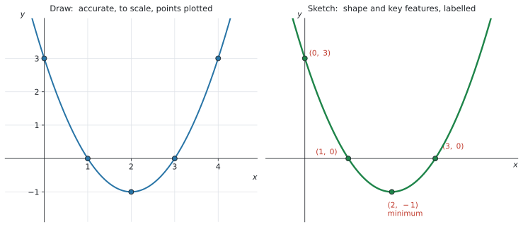
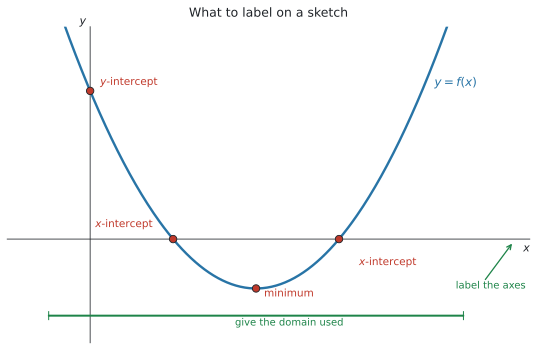
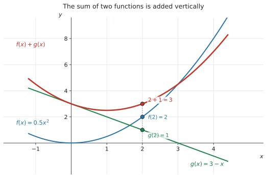

# SL 2.3 — Graphs of functions（グラフをかく・読む） {#sec-sl-2-3}

::: {.callout-note}
## What you should be able to do
- $y = f(x)$ という書き方の意味が分かり、**点がグラフの上にあるか**を確かめられる。
- **`Draw` と `Sketch` の違い**を説明し、指示どおりにかき分けられる。
- グラフに**軸と key features のラベルを付けられる**（ここが点になります）。
- 電卓の画面を見て、**紙に写せる**（transferring a graph from screen to paper）。
- 電卓で **2つの関数の和・差**のグラフをかける。
- 文脈から、**意味の通るグラフ**をかける。
:::

::: {.callout-important}
## Formula booklet には、何も載っていません
公式集の Topic 2 の欄には、**SL 2.1 と SL 2.5 の式しかありません。**

この項目は**手を動かす項目**です。式ではなく、**かき方の作法**を覚えます。
:::

::: {.callout-note}
## SL 2.2 の「3つの決めごと」がそのまま効きます
SL 2.2 で見た Topic 2 全体の決めごとのうち、**(2) と (3) がこの項目そのもの**です。

> questions may be set requiring the graphing of functions that **do not explicitly appear on the syllabus**

> ... use technology such as graphing packages and graphing calculators ... **rather than using elaborate analytical techniques**

**知らない形の関数が出ても、電卓に入れればグラフが出ます。** この項目は、そのグラフを**どう紙に落とすか**の話です。
:::

## The idea

### 1. $y = f(x)$ とグラフ {#graph-equation}

グラフは、**式を満たす点 $(x,\ y)$ を全部集めたもの**です。

$$
y = f(x)
$$

$f(x) = x^{2} - 4x + 3$ なら、$x = 5$ を入れると $f(5) = 25 - 20 + 3 = 8$。ですから**点 $(5,\ 8)$ はグラフの上にあります。**

#### 点がグラフ上にあるか確かめる ★

**$x$ 座標を式に入れて、$y$ 座標と合うかを見るだけ**です。

| 点 | 計算 | 判定 |
|---|---|---|
| $(5,\ 8)$ | $f(5) = 8$ | $y$ 座標と**一致** → 上にある |
| $(2,\ 1)$ | $f(2) = -1$ | $1$ と**合わない** → 上にない |

: 点がグラフ上にあるかの確かめ方 {#tbl-sl23-onthegraph}

**`Show that the point lies on the graph` と言われたら、この代入を1行書いてください。** 「グラフを見たらそう見える」では点になりません。

### 2. `Draw` と `Sketch` の違い ★★ {#draw-sketch}

**シラバスが名指しで指定している項目**です。

> Students should be aware of the difference between the command terms **"draw" and "sketch"**.

IB の command term の定義は、次のとおりです。

::: {.callout-important}
## 2つの定義
**Draw**

> Represent by means of a **labelled, accurate** diagram or graph, **using a pencil**. A **ruler** (straight edge) should be used for straight lines. Diagrams should be **drawn to scale**. Graphs should have points **correctly plotted** (if appropriate) and joined in a straight line or smooth curve.

**Sketch**

> Represent by means of a diagram or graph (**labelled as appropriate**). The sketch should give a **general idea of the required shape or relationship**, and should include **relevant features**.
:::

{#fig-sl23-ds width=100%}

@fig-sl23-ds は、**同じ関数を2通りにかいたもの**です。

| | **Draw** | **Sketch** |
|---|---|---|
| 目盛り | **必要**（正確な縮尺で） | なくてよい |
| 定規 | **直線には使う** | 使わなくてよい |
| 点 | **正確にプロットする** | 大事な点だけ |
| 求められているもの | **正確さ** | **形と特徴** |
| ラベル | 必要 | **必要** |

: `Draw` と `Sketch` {#tbl-sl23-ds}

::: {.callout-warning}
## `Sketch` でも、ラベルは必要です ★★
**「ざっとかけばいい」ではありません。**

定義の中に **`labelled as appropriate`** と **`should include relevant features`** が入っています。**形だけ合っていても、ラベルがなければ点になりません。**

「$5$ 秒でかいた線」と「$30$ 秒でラベルまで書いた図」の差が、そのまま点差になります。
:::

::: {.callout-note}
## `Plot` は3つ目の言葉です
`Plot` は **`Mark the position of points on a diagram`** ── 「点の位置を印す」だけです。

$3$ つとも別の指示なので、**問題文の動詞をよく見てください。**
:::

### 3. 何にラベルを付けるか ★★ {#labelling}

シラバスの Guidance に、はっきり書かれています。

> **All axes and key features should be labelled.**

{#fig-sl23-labels width=80%}

**チェックリストにしておきます。** @fig-sl23-labels を見ながら、$1$ つずつ確かめてください。

| 何を | どう書くか |
|---|---|
| **軸の名前** | $x$、$y$（文脈なら $t$、$h$ など**問題の文字**で） |
| **軸の単位** | 時間なら `(seconds)`、お金なら `($)` |
| **$y$-intercept** | 座標で $(0,\ 3)$ |
| **$x$-intercept** | 座標で $(1,\ 0)$、$(3,\ 0)$ |
| **maximum / minimum** | 座標と、どちらかの語 |
| **かいた範囲（domain）** | $-1 \leq x \leq 5$ など |
| **式** | $y = f(x)$ を曲線のそばに |

: ラベルのチェックリスト {#tbl-sl23-checklist}

::: {.callout-tip}
## 「key features」は SL 2.4 でくわしくやります
どの点が key feature なのかは、**SL 2.4** で正式に扱います。シラバスにこう並んでいます。

> Maximum and minimum values; intercepts; symmetry; vertex; zeros of functions or roots of equations; vertical and horizontal asymptotes

**この項目では「軸と、目立つ点にラベルを付ける」ことを身につけてください。** 何を探すかは SL 2.4 の話です。
:::

### 4. 画面から紙へ写す ★ {#screen-to-paper}

シラバスの Content 欄に、そのまま書かれています。

> Creating a sketch from information given or a context, including **transferring a graph from screen to paper**.

**電卓の画面と、答案の図は別物です。** 画面をそのまま写すのではありません。

#### 手順は4つです

1. **電卓でグラフを出し、全体が見える大きさにする**（Zoom - Fit）
2. **大事な点の座標を、電卓で読む**（切片、最大・最小）
3. **紙に軸をかき、名前と単位を書く**
4. **形をかいて、読んだ座標をラベルとして書き込む**

::: {.callout-important}
## 画面の枠を写してはいけません ★
電卓の画面には、**たまたまその窓に入っていた部分**しか映っていません。

- 画面の外に続いている部分は、**紙では続けてかく**
- 画面の縦横の比は、**紙では気にしなくてよい**（Sketch の場合）
- 画面に出ている目盛りの数字を、そのまま写す必要はない

**写すのは「形」と「大事な点の座標」**です。**画面の見た目ではありません。**
:::

::: {.callout-warning}
## domain が指定されていたら、そこで止める ★
$0 \leq x \leq 5$ と指定されているのに、**両側に伸ばしてかいてはいけません。**

指定された範囲の**端で線を止めて、端の点にも印**を付けてください。SL 2.2 でやった domain の話が、そのまま図に出てきます。
:::

### 5. 和と差のグラフ {#sums}

シラバスの Content 欄に書かれています。

> Using technology to graph functions including their **sums and differences**.

**2つの関数を足したり引いたりしたグラフ**も、電卓でかけます。

{#fig-sl23-sum width=72%}

@fig-sl23-sum は、$f(x) = 0.5x^{2}$ と $g(x) = 3 - x$、そしてその**和**です。

$$
(f + g)(x) = f(x) + g(x)
$$ {#eq-sl23-sum}

#### やっていることは「縦に足す」だけです ★

$x = 2$ のところを見てください。

$$
f(2) = 2, \qquad g(2) = 1, \qquad f(2) + g(2) = 3
$$

**それぞれのグラフの高さを、その場所で足す**と、和のグラフの高さになります。

**引き算も同じ**です。$(f - g)(x) = f(x) - g(x)$ で、**高さを引きます。**

::: {.callout-note}
## $g(x)$ が負のところでは、和は下がります
$x = 4$ では $g(4) = -1$ です。ですから、

$$
f(4) + g(4) = 8 + (-1) = 7
$$

**足しているのに、$f$ より下**になります。**「足す」ではなく「符号ごと足す」**と思ってください。
:::

## Why it works

ここでは、**なぜ和のグラフが「縦に足す」だけでできるのか**を説明します。

グラフの上の点 $(x,\ y)$ で、**$y$ はその場所での高さ**です（@fig-sl23-sum）。

$f$ のグラフは、$x$ のところで高さ $f(x)$。$g$ のグラフは、同じ $x$ のところで高さ $g(x)$。

そして和の関数は、定義そのものが

$$
(f + g)(x) = f(x) + g(x)
$$

です。**「その $x$ での高さ」を足す、と定義されている**のですから、グラフでも高さを足すことになります。

**新しいことは何もしていません。** @eq-sl23-sum を図に翻訳しただけです。

だから、**式がなくても和のグラフはかけます。** グラフが $2$ 本与えられていれば、いくつかの $x$ で高さを足して点を打ち、なめらかにつなげばよいのです。

## Worked examples

::: {.callout-note appearance="simple"}
問題文は英語です。意味が理解できなかったら、問題文の下の「**日本語訳**」を開いてください。解説は日本語です。
:::

::: {#exm-sl23-onpoint}
[A function is defined by $f(x) = x^{2} - 4x + 3$.]{.q-en}

**(a)** [Show that the point $(5,\ 8)$ lies on the graph of $y = f(x)$.]{.q-en}

**(b)** [Determine whether the point $(2,\ 1)$ lies on the graph of $y = f(x)$.]{.q-en}

<details class="jp-trans">
<summary>日本語訳</summary>

関数が $f(x) = x^{2} - 4x + 3$ で定められています。

**(a)** 点 $(5,\ 8)$ が $y = f(x)$ のグラフ上にあることを示しなさい。

**(b)** 点 $(2,\ 1)$ が $y = f(x)$ のグラフ上にあるかどうかを判定しなさい。

（`lies on` は「〜の上にある」です。）

</details>

---

**(a)** `Show that` なので、**途中を全部書きます**（[代入して確かめる](#graph-equation)）。

$x = 5$ を入れます。

$$
f(5) = 5^{2} - 4(5) + 3 = 25 - 20 + 3 = 8
$$

**これが点の $y$ 座標 $8$ と一致した**ので、$(5,\ 8)$ はグラフ上にあります。

**「一致したので上にある」という一文まで書いてください。** 計算だけで止めると、示したことになりません。

**(b)** 同じように $x = 2$ を入れます。

$$
f(2) = 2^{2} - 4(2) + 3 = 4 - 8 + 3 = -1
$$

**$-1 \neq 1$** なので、$(2,\ 1)$ は**グラフ上にありません。**

**グラフ上にあるのは $(2,\ -1)$ のほう**です。

::: {.callout-note}
## 解答例（答案用紙にはこう書く）
**(a)** $f(5) = 5^{2} - 4(5) + 3 = 8$

*This equals the $y$-coordinate, so $(5,\ 8)$ lies on the graph.*

**(b)** $f(2) = 2^{2} - 4(2) + 3 = -1$

*Since $-1 \neq 1$, the point $(2,\ 1)$ does not lie on the graph.*
:::
:::

::: {#exm-sl23-sketch}
[The function $f$ is defined by $f(x) = x^{2} - 4x + 3$ for $-1 \leq x \leq 5$.]{.q-en}

**(a)** [Write down the coordinates of the $y$-intercept.]{.q-en}

**(b)** [Write down the coordinates of the two $x$-intercepts.]{.q-en}

**(c)** [Use your GDC to find the coordinates of the minimum point.]{.q-en}

**(d)** [Sketch the graph of $y = f(x)$, labelling the axes and the points found above.]{.q-en}

<details class="jp-trans">
<summary>日本語訳</summary>

関数 $f$ が、$-1 \leq x \leq 5$ の範囲で $f(x) = x^{2} - 4x + 3$ と定められています。

**(a)** $y$ 切片の座標を書きなさい。

**(b)** $2$ つの $x$ 切片の座標を書きなさい。

**(c)** GDC を使って、最小点の座標を求めなさい。

**(d)** $y = f(x)$ のグラフの概形をかき、軸と、上で求めた点にラベルを付けなさい。

</details>

---

**(a)** $x = 0$ を入れます（SL 2.1 の intercept）。

$$
f(0) = 3 \quad \Rightarrow \quad (0,\ 3)
$$

**(b)** $y = 0$ になる $x$ です。電卓のグラフで読みます。

```
menu → Analyze Graph → Zero
```

$$
(1,\ 0) \quad \text{と} \quad (3,\ 0)
$$

**(c)** 谷の底を出します。

```
menu → Analyze Graph → Minimum
```

$$
(2,\ -1)
$$

**(d)** [ラベルのチェックリスト](#labelling)のとおりにかきます。できあがりは @fig-sl23-ds の**右**の形です。

**書き込むもの**

- **軸に $x$ と $y$**
- $(0,\ 3)$、$(1,\ 0)$、$(3,\ 0)$、$(2,\ -1)$ の**4点**
- 最小点には **`minimum`** の語
- **$-1 \leq x \leq 5$ の範囲で止める** ── 端は $f(-1) = 8$ と $f(5) = 8$ です

**`Sketch` なので目盛りは要りません。** ただし**上の4点のラベルは必要**です（@tbl-sl23-ds）。

::: {.callout-note}
## 解答例（答案用紙にはこう書く）
**(a)** $(0,\ 3)$

**(b)** $(1,\ 0)$ and $(3,\ 0)$

**(c)** $(2,\ -1)$

**(d)** *A parabola opening upwards, drawn only for $-1 \leq x \leq 5$, with the $x$- and $y$-axes labelled and the points $(0,\ 3)$, $(1,\ 0)$, $(3,\ 0)$ and the minimum $(2,\ -1)$ marked.*
:::
:::

::: {#exm-sl23-features}
[A student is asked to sketch the graph of $f(x) = 3 - 0.5x^{2}$ for $-4 \leq x \leq 4$. The student draws a curve of the correct shape but writes nothing else.]{.q-en}

**(a)** [State three things the student should have labelled.]{.q-en}

**(b)** [Find the coordinates of the maximum point.]{.q-en}

**(c)** [Find the $x$-intercepts, giving your answers correct to three significant figures.]{.q-en}

<details class="jp-trans">
<summary>日本語訳</summary>

ある生徒が、$-4 \leq x \leq 4$ の範囲で $f(x) = 3 - 0.5x^{2}$ のグラフの概形をかくよう言われました。形は正しい曲線をかきましたが、ほかには何も書きませんでした。

**(a)** この生徒がラベルを付けるべきだったものを $3$ つ述べなさい。

**(b)** 最大点の座標を求めなさい。

**(c)** $x$ 切片を、有効数字3桁で求めなさい。

</details>

---

**(a)** [チェックリスト](#labelling)から3つ挙げれば十分です。

::: {.model-answer}
**試験ではこう書く**

*The $x$- and $y$-axes should be labelled; the maximum point should be labelled with its coordinates; the $x$-intercepts should be labelled with their coordinates.*
:::

（意味：$x$ 軸と $y$ 軸に名前を付ける。最大点に座標を書く。$x$ 切片に座標を書く。）

**シラバスの言葉は `All axes and key features should be labelled` です。** 「軸」と「key features」の両方に触れてください。

**(b)** 電卓で `Analyze Graph → Maximum`。

$$
(0,\ 3)
$$

$-0.5x^{2}$ の部分は**必ず $0$ 以下**なので、$x = 0$ のとき $f$ が一番大きくなります。**この形なら、電卓を使わなくても分かります。**

**(c)** $y = 0$ になる $x$ です。`Analyze Graph → Zero` で読みます。

$$
x = \pm 2.449\ldots
$$

$$
(-2.45,\ 0) \quad \text{と} \quad (2.45,\ 0) \qquad (3 \text{ s.f.})
$$

**有効数字3桁を指定されている**ので、$2.4$ や $2.5$ では足りません。

::: {.callout-note}
## 解答例（答案用紙にはこう書く）
**(a)** *The $x$- and $y$-axes; the coordinates of the maximum point; the coordinates of the $x$-intercepts.*

**(b)** $(0,\ 3)$

**(c)** $(-2.45,\ 0)$ and $(2.45,\ 0)$ (3 s.f.)
:::
:::

::: {#exm-sl23-sum}
[Two functions are defined by $f(x) = 0.5x^{2}$ and $g(x) = 3 - x$.]{.q-en}

**(a)** [Find $f(2)$ and $g(2)$.]{.q-en}

**(b)** [Hence write down the value of $(f + g)(2)$.]{.q-en}

**(c)** [Write down an expression for $(f + g)(x)$.]{.q-en}

**(d)** [Use your GDC to find the coordinates of the minimum point of $y = (f + g)(x)$.]{.q-en}

<details class="jp-trans">
<summary>日本語訳</summary>

$2$ つの関数が $f(x) = 0.5x^{2}$、$g(x) = 3 - x$ で定められています。

**(a)** $f(2)$ と $g(2)$ を求めなさい。

**(b)** よって $(f + g)(2)$ の値を書きなさい。

**(c)** $(f + g)(x)$ を表す式を書きなさい。

**(d)** GDC を使って、$y = (f + g)(x)$ の最小点の座標を求めなさい。

（`expression` は「式」です。`=` のない、$x$ の式だけを書きます。）

</details>

---

**(a)** それぞれ代入します。

$$
f(2) = 0.5(2)^{2} = 2, \qquad g(2) = 3 - 2 = 1
$$

**(b)** `Hence` なので、**(a) をそのまま使います**（[縦に足すだけ](#sums)）。

$$
(f + g)(2) = 2 + 1 = 3
$$

**新しく計算しないでください。** @fig-sl23-sum の $x = 2$ のところが、この $3$ です。

**(c)** 式どうしを足します。

$$
(f + g)(x) = 0.5x^{2} + (3 - x) = 0.5x^{2} - x + 3
$$

**検算。** $x = 2$ を入れると $0.5(4) - 2 + 3 = 2 - 2 + 3 = 3$ ✓ **(b) と合いました。**

**(d)** `f3(x) = 0.5x^2 - x + 3` を電卓に入れて、

```
menu → Analyze Graph → Minimum
```

$$
(1,\ 2.5)
$$

**`f1(x) + f2(x)` と入れても同じグラフが出ます。** 電卓の中で足してくれるので、(c) の式を作らなくても (d) は答えられます。

::: {.callout-note}
## 解答例（答案用紙にはこう書く）
**(a)** $f(2) = 0.5(2)^{2} = 2$ and $g(2) = 3 - 2 = 1$

**(b)** $(f + g)(2) = 2 + 1 = 3$

**(c)** $(f + g)(x) = 0.5x^{2} - x + 3$

**(d)** $(1,\ 2.5)$
:::
:::

::: {#exm-sl23-ball}
[A ball is thrown upwards. Its height above the ground, in metres, after $t$ seconds is given by]{.q-en}

$$
h(t) = 20t - 5t^{2}, \qquad 0 \leq t \leq 4
$$

**(a)** [Find the values of $t$ for which the ball is at ground level.]{.q-en}

**(b)** [Find the maximum height of the ball and the time at which it occurs.]{.q-en}

**(c)** [Sketch the graph of $h$ against $t$, labelling the axes and the points found in (a) and (b).]{.q-en}

**(d)** [State the range of $h$ in this context.]{.q-en}

<details class="jp-trans">
<summary>日本語訳</summary>

ボールを上に投げます。$t$ 秒後の地面からの高さ（メートル）は次の式で表されます。

**(a)** ボールが地面の高さにある $t$ の値を求めなさい。

**(b)** ボールの最高点の高さと、そのときの時刻を求めなさい。

**(c)** $t$ に対する $h$ のグラフの概形をかき、軸と、(a)(b) で求めた点にラベルを付けなさい。

**(d)** この文脈での $h$ の range を述べなさい。

（`at ground level` は「地面の高さにある」、`against` は「〜に対して」です。横軸が $t$、縦軸が $h$ になります。）

</details>

---

**(a)** 地面の高さ $= 0$ なので、$h(t) = 0$ を解きます。

```
menu → Analyze Graph → Zero
```

$$
t = 0 \quad \text{と} \quad t = 4
$$

**$t = 0$ は投げた瞬間**、**$t = 4$ は落ちてきた瞬間**です。両方とも意味があります。

**(b)** `Analyze Graph → Maximum`。

$$
(2,\ 20)
$$

**答え方に注意してください。** 「最高点の高さ」は **$20$ m**、「そのときの時刻」は **$t = 2$ 秒**です。**座標のまま $(2, 20)$ と書くだけでは、聞かれたことに答えていません。**

**(c)** [画面から紙へ写します](#screen-to-paper)。

**軸の名前を、問題の文字と単位で書きます。**

- 横軸 … **$t$ (seconds)**
- 縦軸 … **$h$ (metres)**

そして $(0,\ 0)$、$(4,\ 0)$、$(2,\ 20)$ の**3点**にラベルを付けます。最高点には **`maximum`** と書き添えてください。

**$0 \leq t \leq 4$ の外はかきません。** $t < 0$（投げる前）も $t > 4$（地面より下）も、意味がないからです。

**(d)** `in this context` なので、現実の範囲です（SL 2.2）。

$$
0 \leq h(t) \leq 20
$$

地面（$0$ m）から最高点（$20$ m）までです。

::: {.callout-note}
## 解答例（答案用紙にはこう書く）
**(a)** $t = 0$ and $t = 4$ seconds

**(b)** The maximum height is $20$ m, at $t = 2$ seconds.

**(c)** *A curve from $(0,\ 0)$ up to the maximum $(2,\ 20)$ and back down to $(4,\ 0)$, drawn only for $0 \leq t \leq 4$, with the horizontal axis labelled $t$ (seconds) and the vertical axis labelled $h$ (metres).*

**(d)** $0 \leq h(t) \leq 20$
:::
:::

## Common errors

::: {.callout-warning}
## `Sketch` でラベルを何も書かない ★★
**この項目で一番点を落とすところ**です。

`Sketch` の定義に **`labelled as appropriate`** と入っています。**形だけでは点になりません。**

**軸の名前、切片、最大・最小。** この3つを書く習慣を付けてください。
:::

::: {.callout-warning}
## `Draw` なのに目盛りをかかない
`Draw` は **`accurate`**、**`to scale`**、**`ruler`** が定義に入っています。

**方眼と目盛りが必要**です。フリーハンドの概形では足りません。
:::

::: {.callout-warning}
## 軸に単位を書かない ★
文脈のある問題では、**$t$ (seconds)、$h$ (metres)、$C$ (\$)** のように単位まで書きます。

**文字だけでは、何のグラフか伝わりません。**
:::

::: {.callout-warning}
## 指定された domain の外までかく ★
$0 \leq t \leq 4$ なら、**$t = 4$ で線を止めます。**

伸ばしてかくと、「地面より下にもぐったボール」をかいたことになります。**意味を考えてください。**
:::

::: {.callout-warning}
## 電卓の画面をそのまま写す
画面には、**たまたまその窓に入った部分**が映っているだけです。

**写すのは形と、大事な点の座標だけ**です。画面の枠や目盛りの数字ではありません。
:::

::: {.callout-warning}
## 座標を $(y,\ x)$ の順で書く
**必ず $(x,\ y)$ の順**です。最小点は $(2,\ -1)$ であって $(-1,\ 2)$ ではありません。

文脈のある問題では **$(t,\ h)$** の順、つまり**横軸のほうが先**です。
:::

::: {.callout-warning}
## 「最高点は $(2, 20)$ です」で終わる
「**高さ**を求めよ」なら $20$ m、「**時刻**も」なら $t = 2$ 秒。

**聞かれた形で答えてください。** 座標を書くだけでは、答えたことになりません。
:::

::: {.callout-warning}
## 和のグラフを、$2$ 本の線の「あいだ」だと思う
$(f+g)(x)$ は、**$2$ つの高さを足したもの**です。あいだでも平均でもありません。

$f(2) = 2$、$g(2) = 1$ なら、和は **$3$**（@fig-sl23-sum）。**$2$ 本より上に来ます**（どちらも正のとき）。
:::

## Using your GDC (TI-Nspire CX II)

**この項目は、電卓の画面を紙に落とすところまでが中身**です。

### グラフを出す

```
ctrl + doc → 2: Add Graphs
```

`f1(x) =` に式を入れます。

```
f1(x) = x^2 - 4x + 3
```

### 全体が見える大きさにする ★

**まずこれをやってください。** 画面に入っていないものは、読めません。

```
menu → Window/Zoom → Zoom - Fit
```

うまくいかないときは、`Window Settings` で $x$ と $y$ の範囲を手で入れます。**問題の domain に合わせる**のが早いです。

### 大事な点を読む

```
menu → Analyze Graph → Zero        （x 切片）
menu → Analyze Graph → Minimum     （最小点）
menu → Analyze Graph → Maximum     （最大点）
```

**左と右の境目を指定する**と、その区間の中の1つを出してくれます。$x$ 切片が $2$ つあるときは、**$2$ 回に分けて**読んでください。

$y$ 切片は、**$x = 0$ を式に代入するほうが速い**ことが多いです。

### 和と差のグラフ ★

**式を作らなくても、電卓の中で足せます。**

```
f1(x) = 0.5x^2
f2(x) = 3 - x
f3(x) = f1(x) + f2(x)
```

`f3` に **`f1(x) + f2(x)`** と打つだけです。**引き算なら `f1(x) - f2(x)`。**

3本が同時に表示されるので、@fig-sl23-sum のように**縦に足されている**ことが目で確かめられます。

::: {.callout-tip}
## 一時的に $1$ 本だけ見たいとき
グラフの式のところで **`enter` の前にチェックを外す**か、`f1` の行を選んで非表示にできます。

**3本が重なって見づらいときは、$1$ 本ずつ見てください。**
:::

### 表で値を確かめる

```
ctrl + T
```

グラフの横に値の表が出ます。**和のグラフが本当に「足したもの」になっているか**を、いくつかの $x$ で確かめられます。

### 画面から紙へ ★

**この順番でやってください。**

1. **Zoom - Fit** で全体を見る
2. **Analyze Graph** で大事な点の座標を読み、**メモする**
3. 紙に**軸をかき、名前と単位を書く**
4. **形をかき、メモした座標をラベルとして書き込む**

**電卓を見ながら紙に写すのではなく、「数字を先に読んでから、紙にかく」**のがこつです。そのほうが、ラベルの書き忘れが減ります。

## Exercises

::: {.callout-note appearance="simple"}
各問題に、折りたたみが3つ付いています。**日本語訳**、**解答例**（答案用紙に書くべきこと。英語です）、**解説**（なぜそうなるか。日本語です）。

まず自分で解いて、次に解答例と見くらべてください。**解説は、合わなかったときだけ開けば十分です。**
:::

::: {.exercise-block}

[1]{.ex-no} [A function is defined by $f(x) = x^{2} - 6x + 8$.]{.q-en}

**(a)** [Show that the point $(5,\ 3)$ lies on the graph of $y = f(x)$.]{.q-en}

**(b)** [Determine whether the point $(1,\ 2)$ lies on the graph.]{.q-en}

<details class="jp-trans">
<summary>日本語訳</summary>

関数が $f(x) = x^{2} - 6x + 8$ で定められています。

**(a)** 点 $(5,\ 3)$ が $y = f(x)$ のグラフ上にあることを示しなさい。

**(b)** 点 $(1,\ 2)$ がグラフ上にあるかどうかを判定しなさい。

</details>

::: {.callout-note collapse="true"}
## 解答例（答案用紙に書くこと）
**(a)** $f(5) = 5^{2} - 6(5) + 8 = 3$

*This equals the $y$-coordinate, so $(5,\ 3)$ lies on the graph.*

**(b)** $f(1) = 1 - 6 + 8 = 3$

*Since $3 \neq 2$, the point $(1,\ 2)$ does not lie on the graph.*
:::

::: {.callout-tip collapse="true"}
## 解説
**やることは代入だけ**です（@tbl-sl23-onthegraph）。

**(a)** $25 - 30 + 8 = 3$。**点の $y$ 座標と一致**しました。

**`Show that` なので、「一致したから上にある」という一文まで書いてください。** 計算で止めないように。

**(b)** $f(1) = 3$ です。**$(1,\ 3)$ ならグラフ上にありますが、$(1,\ 2)$ は違います。**

**惜しい形の点が出される**のがこの問題の型です。**必ず計算して確かめてください。**
:::

::: {.ex-sep}
:::

[2]{.ex-no} [State two differences between the command terms `Draw` and `Sketch`.]{.q-en}

<details class="jp-trans">
<summary>日本語訳</summary>

command term の `Draw` と `Sketch` の違いを $2$ つ述べなさい。

</details>

::: {.callout-note collapse="true"}
## 解答例（答案用紙に書くこと）
*(1) A drawing must be accurate and to scale, with points correctly plotted, while a sketch only needs to show the general shape.*

*(2) A ruler should be used for straight lines when drawing, but a sketch may be done freehand.*
:::

::: {.callout-tip collapse="true"}
## 解説
[2つの定義](#draw-sketch)から選べば十分です。

使える違いは、たとえば次のとおりです。

- **正確さ** … Draw は `accurate`、`to scale`。Sketch は `general idea of the required shape`
- **道具** … Draw は `ruler`（直線に）。Sketch はフリーハンドでよい
- **点** … Draw は `correctly plotted`。Sketch は大事な点だけ

**「ラベル」は違いになりません。** **どちらもラベルが必要**だからです。ここを違いとして書くと、逆に減点されかねません。
:::

::: {.ex-sep}
:::

[3]{.ex-no} [The graph of $y = f(x)$ passes through the point $(3,\ -2)$.]{.q-en}

**(a)** [Write down the value of $f(3)$.]{.q-en}

**(b)** [Find the coordinates of the point where the graph of $y = 4 - 2x$ crosses the $x$-axis.]{.q-en}

<details class="jp-trans">
<summary>日本語訳</summary>

$y = f(x)$ のグラフは点 $(3,\ -2)$ を通ります。

**(a)** $f(3)$ の値を書きなさい。

**(b)** $y = 4 - 2x$ のグラフが $x$ 軸と交わる点の座標を求めなさい。

</details>

::: {.callout-note collapse="true"}
## 解答例（答案用紙に書くこと）
**(a)** $f(3) = -2$

**(b)** $4 - 2x = 0$, so $x = 2$. The point is $(2,\ 0)$.
:::

::: {.callout-tip collapse="true"}
## 解説
**(a)** 「$(3,\ -2)$ を通る」は「$f(3) = -2$」と**同じことを言っています**（[グラフと式](#graph-equation)）。**計算はいりません。**

**(b)** $x$ 軸との交点は **$y = 0$** のところです（SL 2.1 の intercept）。

$$4 - 2x = 0 \quad \Rightarrow \quad x = 2$$

**`coordinates` と聞かれている**ので、$(2,\ 0)$ と書いてください。$2$ だけでは足りません。
:::

::: {.ex-sep}
:::

[4]{.ex-no} [The function $f$ is defined by $f(x) = x^{2} + 2x - 8$ for $-5 \leq x \leq 3$.]{.q-en}

**(a)** [Write down the $y$-intercept.]{.q-en}

**(b)** [Use your GDC to find the $x$-intercepts and the minimum point.]{.q-en}

**(c)** [State the range of $f$.]{.q-en}

<details class="jp-trans">
<summary>日本語訳</summary>

関数 $f$ が、$-5 \leq x \leq 3$ の範囲で $f(x) = x^{2} + 2x - 8$ と定められています。

**(a)** $y$ 切片を書きなさい。

**(b)** GDC を使って、$x$ 切片と最小点を求めなさい。

**(c)** $f$ の range を述べなさい。

</details>

::: {.callout-note collapse="true"}
## 解答例（答案用紙に書くこと）
**(a)** $(0,\ -8)$

**(b)** $x$-intercepts: $(-4,\ 0)$ and $(2,\ 0)$. Minimum: $(-1,\ -9)$.

**(c)** $f(-5) = 7$ and $f(3) = 7$, so the range is $-9 \leq f(x) \leq 7$
:::

::: {.callout-tip collapse="true"}
## 解説
**(a)** $f(0) = -8$。

**(b)** `Analyze Graph → Zero` を**2回**（$x$ 切片が2つあるので）、`Minimum` を1回。

**(c)** range は**縦の広がり**です（SL 2.2）。**谷と、両端の3つ**を調べます。

- 谷 … $-9$
- 左端 … $f(-5) = 25 - 10 - 8 = 7$
- 右端 … $f(3) = 9 + 6 - 8 = 7$

$$-9 \leq f(x) \leq 7$$

**両端がたまたま同じ値** $7$ になりました。$-1$ を中心に左右対称だからです。
:::

::: {.ex-sep}
:::

[5]{.ex-no} [Two functions are defined by $f(x) = x^{2}$ and $g(x) = 2x + 3$.]{.q-en}

**(a)** [Find $f(2)$ and $g(2)$.]{.q-en}

**(b)** [Hence write down $(f + g)(2)$.]{.q-en}

**(c)** [Write down an expression for $(f + g)(x)$.]{.q-en}

<details class="jp-trans">
<summary>日本語訳</summary>

$2$ つの関数が $f(x) = x^{2}$、$g(x) = 2x + 3$ で定められています。

**(a)** $f(2)$ と $g(2)$ を求めなさい。

**(b)** よって $(f + g)(2)$ を書きなさい。

**(c)** $(f + g)(x)$ を表す式を書きなさい。

</details>

::: {.callout-note collapse="true"}
## 解答例（答案用紙に書くこと）
**(a)** $f(2) = 4$ and $g(2) = 7$

**(b)** $(f + g)(2) = 4 + 7 = 11$

**(c)** $(f + g)(x) = x^{2} + 2x + 3$
:::

::: {.callout-tip collapse="true"}
## 解説
**(a)** $2^2 = 4$、$2(2) + 3 = 7$。

**(b)** `Hence` なので**(a) を足すだけ**です（[縦に足す](#sums)）。$4 + 7 = 11$。

**(c)** 式どうしを足します。$x^2 + (2x + 3) = x^2 + 2x + 3$。

**検算。** $x = 2$ を入れると $4 + 4 + 3 = 11$ ✓ **(b) と合いました。**

**この検算を必ずやってください。** (b) と (c) が合わなければ、どちらかが間違っています。
:::

::: {.ex-sep}
:::

[6]{.ex-no} [Two functions are defined by $f(x) = 3x + 1$ and $g(x) = x^{2} - 4$.]{.q-en}

**(a)** [Find $(f - g)(3)$.]{.q-en}

**(b)** [Write down an expression for $(f - g)(x)$.]{.q-en}

<details class="jp-trans">
<summary>日本語訳</summary>

$2$ つの関数が $f(x) = 3x + 1$、$g(x) = x^{2} - 4$ で定められています。

**(a)** $(f - g)(3)$ を求めなさい。

**(b)** $(f - g)(x)$ を表す式を書きなさい。

</details>

::: {.callout-note collapse="true"}
## 解答例（答案用紙に書くこと）
**(a)** $f(3) = 10$ and $g(3) = 5$, so $(f - g)(3) = 10 - 5 = 5$

**(b)** $(f - g)(x) = (3x + 1) - (x^{2} - 4) = -x^{2} + 3x + 5$
:::

::: {.callout-tip collapse="true"}
## 解説
**(a)** $f(3) = 9 + 1 = 10$、$g(3) = 9 - 4 = 5$。引いて $5$。

**引く順番に注意してください。** $(f - g)$ なので **$f$ から $g$ を引きます。** $g - f$ にすると $-5$ になってしまいます。

**(b)** **カッコを付けて引く**のが要です。

$$(3x + 1) - (x^{2} - 4) = 3x + 1 - x^{2} + 4 = -x^{2} + 3x + 5$$

**$-(-4) = +4$** です。カッコを外すときに符号が全部変わります。**ここが一番間違えやすいところ**です。

**検算。** $x = 3$ を入れると $-9 + 9 + 5 = 5$ ✓ **(a) と合いました。**
:::

::: {.ex-sep}
:::

[7]{.ex-no} [State four things that should be shown when transferring a graph from your GDC screen to paper.]{.q-en}

<details class="jp-trans">
<summary>日本語訳</summary>

GDC の画面から紙にグラフを写すとき、示すべきことを $4$ つ述べなさい。

（`transferring` は「写すこと」です。）

</details>

::: {.callout-note collapse="true"}
## 解答例（答案用紙に書くこと）
*(1) Both axes, labelled with the correct variables and units.*

*(2) The general shape of the curve.*

*(3) The coordinates of the intercepts.*

*(4) The coordinates of any maximum or minimum points.*
:::

::: {.callout-tip collapse="true"}
## 解説
[チェックリスト](#labelling)から4つ挙げれば十分です。

シラバスの言葉は **`All axes and key features should be labelled`**。ですから、**「軸」と「key features」の両方**に触れてください。

ほかに使えるもの：

- **かいた範囲（domain）**を示す
- 曲線のそばに **$y = f(x)$** と書く

**「きれいにかく」「定規を使う」は違います。** 写すのは `sketch` なので、求められているのは**正確さではなく、情報が全部そろっていること**です。
:::

::: {.ex-sep}
:::

[8]{.ex-no} [A tank contains $60$ litres of water and is drained at a constant rate. The volume, in litres, after $t$ minutes is given by]{.q-en}

$$
V(t) = 60 - 4t, \qquad 0 \leq t \leq 15
$$

**(a)** [Write down the volume of water at the start.]{.q-en}

**(b)** [Show that the tank is empty at $t = 15$.]{.q-en}

**(c)** [Sketch the graph of $V$ against $t$, labelling the axes and both intercepts.]{.q-en}

<details class="jp-trans">
<summary>日本語訳</summary>

あるタンクに $60$ リットルの水が入っていて、一定の速さで抜かれます。$t$ 分後の量（リットル）は次の式で表されます。

**(a)** はじめの水の量を書きなさい。

**(b)** $t = 15$ でタンクが空になることを示しなさい。

**(c)** $t$ に対する $V$ のグラフの概形をかき、軸と $2$ つの切片にラベルを付けなさい。

</details>

::: {.callout-note collapse="true"}
## 解答例（答案用紙に書くこと）
**(a)** $V(0) = 60$ litres

**(b)** $V(15) = 60 - 4(15) = 60 - 60 = 0$, so the tank is empty.

**(c)** *A straight line from $(0,\ 60)$ down to $(15,\ 0)$, drawn only for $0 \leq t \leq 15$, with the horizontal axis labelled $t$ (minutes) and the vertical axis labelled $V$ (litres).*
:::

::: {.callout-tip collapse="true"}
## 解説
**(a)** はじめは $t = 0$。$V(0) = 60$。**単位（リットル）を付けてください。**

**(b)** `Show that` なので、**代入して $0$ になることを書きます。**

$$60 - 4(15) = 60 - 60 = 0$$

**「グラフを見ると $0$ です」では点になりません。**

**(c)** **直線です。** $V(t) = 60 - 4t$ は SL 2.1 の $y = mx + c$ の形で、傾き $-4$、$V$ 切片 $60$。

**軸には単位まで**書きます。$t$ (minutes)、$V$ (litres)。

**$0 \leq t \leq 15$ の外はかきません。** $t > 15$ に伸ばすと「水の量が負」になってしまいます。
:::

::: {.ex-sep}
:::

[9]{.ex-no} [A student sketches a graph with the correct shape, but does not label the axes and does not mark any points. The student says: "The shape is right, so the sketch is fine."]{.q-en}

[Explain why the student would still lose marks.]{.q-en}

<details class="jp-trans">
<summary>日本語訳</summary>

ある生徒が、正しい形のグラフの概形をかきましたが、軸にラベルを付けず、点にも印を付けませんでした。その生徒は「形が合っているから、この概形で問題ない」と言っています。

この生徒が、それでも点を失う理由を説明しなさい。

（本書オリジナルの問題です。）

</details>

::: {.callout-note collapse="true"}
## 解答例（答案用紙に書くこと）
*The command term "sketch" requires the graph to be labelled as appropriate and to include the relevant features, not only the correct shape.*

*Without labelled axes it is not clear what the graph represents, and without the intercepts and the maximum or minimum point there is no evidence that these values were found. Marks are given for these features, so they would be lost.*
:::

::: {.callout-tip collapse="true"}
## 解説
**この項目の一番大事な考え方**です。

`Sketch` の定義には、次の $2$ つが入っています。

- **`labelled as appropriate`**
- **`should include relevant features`**

つまり**形だけでは、定義を満たしていません。**

**採点する側から見ると**、こうなります。

- 軸にラベルがない → **何のグラフか分からない**
- 切片や最大・最小に印がない → **その値を求めた証拠がない**

**点は「求めたことが伝わったところ」に付きます。** 頭の中で分かっていても、紙に書いていなければ伝わりません。

**「形」「軸」「点」の3つがそろって、はじめて `sketch` です。**
:::

::: {.ex-sep}
:::

[10]{.ex-no} [A ball is thrown upwards from the ground. Its height above the ground, in metres, after $t$ seconds is]{.q-en}

$$
h(t) = 12t - 3t^{2}, \qquad 0 \leq t \leq 4
$$

**(a)** [Write down the values of $t$ at which the ball is at ground level.]{.q-en}

**(b)** [Find the maximum height of the ball and the time at which it occurs.]{.q-en}

**(c)** [Sketch the graph of $h$ against $t$, labelling the axes and the three points found in (a) and (b).]{.q-en}

**(d)** [State the range of $h$ in this context.]{.q-en}

**(e)** [A second ball rises so that its height is given by $g(t) = 4t$. Find $(h - g)(1)$ and interpret this value in context.]{.q-en}

<details class="jp-trans">
<summary>日本語訳</summary>

ボールを地面から上に投げます。$t$ 秒後の地面からの高さ（メートル）は次のとおりです。

**(a)** ボールが地面の高さにある $t$ の値を書きなさい。

**(b)** ボールの最高点の高さと、そのときの時刻を求めなさい。

**(c)** $t$ に対する $h$ のグラフの概形をかき、軸と、(a)(b) で求めた $3$ 点にラベルを付けなさい。

**(d)** この文脈での $h$ の range を述べなさい。

**(e)** $2$ つ目のボールは、高さが $g(t) = 4t$ で表されるように上がります。$(h - g)(1)$ を求め、その値の意味を文脈の中で説明しなさい。

</details>

::: {.callout-note collapse="true"}
## 解答例（答案用紙に書くこと）
**(a)** $t = 0$ and $t = 4$ seconds

**(b)** The maximum height is $12$ m, at $t = 2$ seconds.

**(c)** *A curve from $(0,\ 0)$ up to the maximum $(2,\ 12)$ and back down to $(4,\ 0)$, drawn only for $0 \leq t \leq 4$, with the horizontal axis labelled $t$ (seconds) and the vertical axis labelled $h$ (metres).*

**(d)** $0 \leq h(t) \leq 12$

**(e)** $h(1) = 9$ and $g(1) = 4$, so $(h - g)(1) = 5$.

*After $1$ second the first ball is $5$ metres higher than the second ball.*
:::

::: {.callout-tip collapse="true"}
## 解説
**(a)** `Analyze Graph → Zero` で $t = 0$ と $t = 4$。手でもできます。

$$12t - 3t^{2} = 3t(4 - t) = 0 \quad \Rightarrow \quad t = 0,\ 4$$

**(b)** `Analyze Graph → Maximum` で $(2,\ 12)$。

**答え方**：高さは **$12$ m**、時刻は **$t = 2$ 秒**。**聞かれた形で書いてください。**

**(c)** [画面から紙へ](#screen-to-paper)。**軸は $t$ (seconds) と $h$ (metres)**、点は $(0,\ 0)$、$(2,\ 12)$、$(4,\ 0)$。最高点には `maximum` と書き添えます。

**(d)** 地面から最高点まで。$0 \leq h(t) \leq 12$。

**(e)** それぞれ代入して引きます（[差は縦に引く](#sums)）。

$$h(1) = 12 - 3 = 9, \qquad g(1) = 4$$

$$(h - g)(1) = 9 - 4 = 5$$

`interpret` があるので、**言葉が必要**です。$5$ は **$2$ つのボールの高さの差**、つまり「$1$ 秒後に $1$ つ目のボールが $5$ m 高いところにいる」という意味です。

**単位（メートル）と、どちらが高いのか**を書いてください。「$5$ です」では点になりません。
:::

:::
