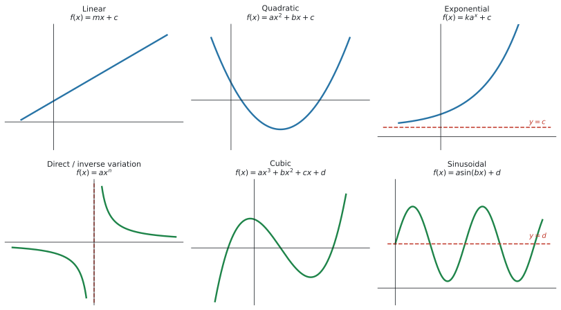
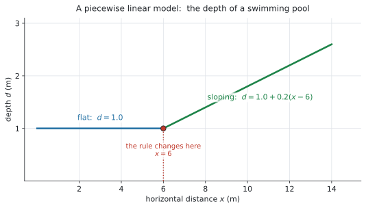
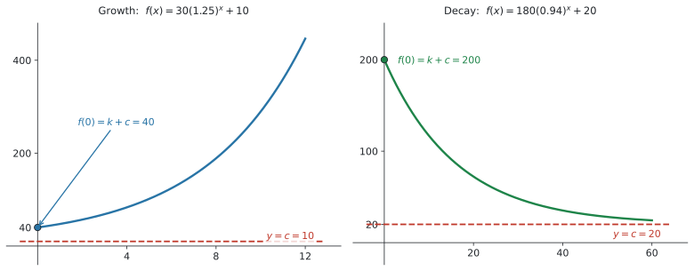
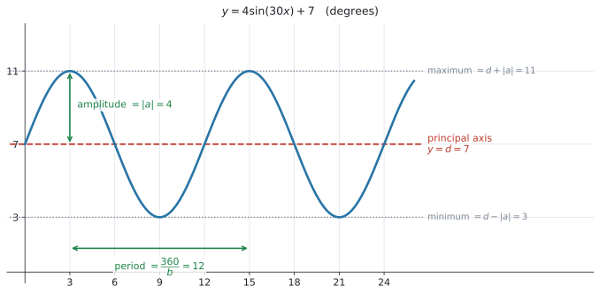

# SL 2.5 — Modelling with functions（モデルに使う関数） {#sec-sl-2-5}

::: {.callout-note}
## What you should be able to do
- モデルに使う **6つの関数の形**を、英語の名前と式で言える。
- **linear model** のパラメーターを、文脈の言葉で説明できる（**piecewise linear** を含む）。
- **quadratic model** の vertex・zeros・intercepts を求められる。
- **exponential model** の $k$、$a$、$c$ の意味が分かり、**horizontal asymptote** を書ける。
- **direct / inverse variation** の $a$ を、点を代入して求められる。
- **sinusoidal model** の **amplitude・period・principal axis** を求められる。
:::

::: {.callout-important}
## Formula booklet には、1つだけ載っています
公式集の SL 2.5 の欄にあるのは、**これだけ**です。

$$
f(x) = ax^{2} + bx + c \ \Rightarrow \ \text{axis of symmetry is } x = -\frac{b}{2a}
$$

**★★ amplitude・period・principal axis は、公式集にありません。** シラバスの Guidance 欄に書かれているだけなので、**この3つは覚える必要があります。**

$$
\text{amplitude} = |a|, \qquad \text{period} = \frac{360}{b}, \qquad \text{principal axis: } y = d
$$
:::

::: {.callout-note}
## この項目は「形のカタログ」です
シラバスは、SL 2.5 のことを **theoretical models**（理論上のモデル）と呼んでいます。

**どのモデルを選ぶか・データにどう当てはめるかは、次の SL 2.6 の話**です。この項目では、**6つの形を1つずつ知る**ことに集中します。
:::

## The idea

現実の場面を式で表したものが **model**（モデル）です。AI SL では、**使ってよい形が6つに決まっています。**

### 1. 6つの形 {#six-models}

{#fig-sl25-models width=100%}

| English | 式 | 現実のどんな場面か |
|---|---|---|
| linear model | $f(x) = mx + c$ | 一定の割合で増える・減る |
| quadratic model | $f(x) = ax^{2} + bx + c$（$a \neq 0$） | 上がって下がる（ボール・利益・橋） |
| exponential model | $f(x) = ka^{x} + c$ | 倍々に増える・半分ずつ減る |
| direct / inverse variation | $f(x) = ax^{n}$（$n$ は整数） | 比例・反比例 |
| cubic model | $f(x) = ax^{3} + bx^{2} + cx + d$ | 上下に2回曲がる（箱の体積など） |
| sinusoidal model | $f(x) = a\sin(bx) + d$ | くり返す（潮・観覧車・気温） |

: SL 2.5 で使う6つのモデル {#tbl-sl25-models}

::: {.callout-tip}
## この表を、まず声に出して覚えてください
この項目は、**式を導く項目ではありません。** 6つの形を知っていて、**問題文を読んでどれかを取り出せる**ことが中身です。

@fig-sl25-models の6つの絵と、@tbl-sl25-models の6つの式を、**セットで**覚えてください。
:::

### 2. linear model {#linear}

$$
f(x) = mx + c
$$ {#eq-sl25-linear}

SL 2.1 でやった直線の式です。**文脈のある問題では、$m$ と $c$ に必ず現実の意味があります。**

| 記号 | 何を表すか | 例（携帯電話の料金） |
|---|---|---|
| $m$ | **$1$ 増えるごとの変化** | $1$ 分あたりの通話料 |
| $c$ | **はじめの値**（$x = 0$ のとき） | 毎月の基本料金 |

: linear model の $m$ と $c$ {#tbl-sl25-linear}

#### piecewise linear model ★★ {#piecewise}

シラバスが名指しで挙げている形です。

> Including **piecewise linear models**, for example horizontal distances of an object to a wall, **depth of a swimming pool**, mobile phone charges.

**途中で傾きが変わる**モデルです。@fig-sl25-piecewise はプールの深さです。

{#fig-sl25-piecewise width=82%}

$$
d(x) =
\begin{cases}
1.0 & 0 \leq x \leq 6 \\
1.0 + 0.2(x - 6) & 6 < x \leq 14
\end{cases}
$$

::: {.callout-warning}
## $x$ がどちらの式に入るかを、先に決めます ★★
$x = 10$ なら **$6$ より大きい**ので、下の式です。

$$
d(10) = 1.0 + 0.2(10 - 6) = 1.0 + 0.8 = 1.8
$$

**上の式にそのまま入れてしまう**のが、この形での一番多い誤りです。**計算より先に、どちらの区間かを確かめてください。**
:::

### 3. quadratic model {#quadratic}

$$
f(x) = ax^{2} + bx + c, \qquad a \neq 0
$$ {#eq-sl25-quadratic}

シラバスが「求められるようにしておくもの」として挙げているのは、この4つです。

> **Axis of symmetry, vertex, zeros and roots, intercepts** on the $x$-axis and $y$-axis.

**どれも SL 2.4 でやったものです。** ここでは、それを**文脈のある問題**で使います。

| $a$ の符号 | グラフの形 | 現実の場面 |
|---|---|---|
| $a > 0$ | 谷（下に凸） | 費用の最小、ケーブルのたるみ |
| $a < 0$ | 山（上に凸） | ボールの高さ、利益の最大、噴水 |

: $a$ の符号で山か谷かが決まります {#tbl-sl25-quadsign}

シラバスの Guidance 欄に **Technology can be used to find roots** とあります。**因数分解や解の公式で解く必要はありません。**

### 4. exponential model ★★ {#exponential}

シラバスに、3つの形が並んでいます。

$$
\begin{aligned}
f(x) &= ka^{x} + c \\[2pt]
f(x) &= ka^{-x} + c \quad (a > 0) \\[2pt]
f(x) &= k\mathrm{e}^{rx} + c
\end{aligned}
$$ {#eq-sl25-exponential}

{#fig-sl25-exponential width=100%}

#### growth か decay かは、$a$ で決まります {#growth-decay}

| 形 | 条件 | 動き |
|---|---|---|
| $ka^{x} + c$ | $a > 1$ | **growth**（増える） |
| $ka^{x} + c$ | $0 < a < 1$ | **decay**（減る） |
| $ka^{-x} + c$ | $a > 1$ | **decay**（$a^{-x} = \left(\frac{1}{a}\right)^{x}$ なので） |
| $k\mathrm{e}^{rx} + c$ | $r > 0$ で growth、$r < 0$ で decay | |

: growth と decay の見分け方 {#tbl-sl25-growthdecay}

#### $c$ は horizontal asymptote です {#exp-asymptote}

$x$ を大きくすると $ka^{x}$ の部分が $0$ に近づく（decay の場合）ので、**残るのは $c$** です。

$$
y = c
$$

SL 2.4 でやった [horizontal asymptote](sl-2-4.qmd#horizontal-asymptote) が、そのまま出てきます。

::: {.callout-important}
## $x = 0$ のときの値は $k$ ではなく $k + c$ です ★★
ここが、この項目で一番落とすところです。

$$
f(0) = ka^{0} + c = k(1) + c = k + c
$$

$a^{0} = 1$ なので、**$k$ がそのまま残り、そこに $c$ が足されます。**

@fig-sl25-exponential の右の例では $180 + 20 = 200$ が「はじめの温度」です。**$180$ ではありません。**
:::

::: {.callout-note}
## Topic 1 とつながっています
シラバスの Guidance 欄に、こう書かれています。

> Link to: **compound interest (SL 1.4)**, **geometric sequences and series (SL 1.3)** and **amortization (SL 1.7)**.

SL 1.3 で書いた $u_n = u_1 r^{n-1}$ は、**$r$ が $a$ の役をしている exponential model**です。**同じものを、別の書き方で見ています。**
:::

### 5. direct / inverse variation {#variation}

$$
f(x) = ax^{n}, \qquad n \in \mathbb{Z}
$$ {#eq-sl25-variation}

$n$ が整数（$\mathbb{Z}$ は整数全体）であればよい、という形です。

| $n$ | 呼び方 | 例 |
|---|---|---|
| $n > 0$ | **direct variation**（比例） | $y = 4.9x^{2}$（落下距離） |
| $n < 0$ | **inverse variation**（反比例） | $y = \dfrac{120}{x} = 120x^{-1}$（人数と時間） |

: direct と inverse {#tbl-sl25-variation}

シラバスに、こう書かれています。

> The $y$-axis as a **vertical asymptote** when $n < 0$.

$n < 0$ だと $x = 0$ で計算できなくなるので、**$y$ 軸が [vertical asymptote](sl-2-4.qmd#vertical-asymptote) になります。**

#### $a$ は、点を1つ代入すれば出ます {#find-a}

$y = ax^{n}$ の $n$ が分かっていれば、**分かっている点を1つ入れるだけ**です。

$n = -1$ で、$x = 3$ のとき $y = 40$ なら

$$
40 = \frac{a}{3} \ \Rightarrow \ a = 120
$$

### 6. cubic model {#cubic}

$$
f(x) = ax^{3} + bx^{2} + cx + d
$$ {#eq-sl25-cubic}

**上下に2回曲がることができる**形です（@fig-sl25-models の下段中央）。

シラバスの Connections 欄が挙げている場面は、**箱の体積**、**テニスボールの缶のすき間**、**風力発電の出力**です。

**この形について、AI SL で手計算で求めることはありません。** 電卓に入れて、[Analyze Graph](sl-2-4.qmd#intersection) で最大・最小や zeros を読みます。

### 7. sinusoidal model ★★ {#sinusoidal}

$$
f(x) = a\sin(bx) + d, \qquad f(x) = a\cos(bx) + d
$$ {#eq-sl25-sinusoidal}

**くり返す（周期的な）場面**に使います。潮の満ち引き、観覧車、1年の気温です。

{#fig-sl25-sinusoid width=94%}

シラバスの Guidance 欄が、**聞かれることを3つに限定しています。**

> ... will only be required to predict or find **amplitude ($|a|$)**, **period ($\frac{360}{b}$)**, or equation of the **principal axis ($y = d$)**.

| English | 求め方 | @fig-sl25-sinusoid では |
|---|---|---|
| **amplitude** | $\lvert a \rvert$ | $4$ |
| **period** | $\dfrac{360}{b}$ | $\dfrac{360}{30} = 12$ |
| **principal axis** | $y = d$ | $y = 7$ |

: sinusoidal model で聞かれる3つ {#tbl-sl25-sin}

この3つから、最大・最小も出せます。

$$
\text{maximum} = d + |a|, \qquad \text{minimum} = d - |a|
$$ {#eq-sl25-maxmin}

::: {.callout-important}
## 覚える必要があるのは、この3つだけです ★★
公式集に載っていないのは、この項目ではこの3つ（$|a|$、$\dfrac{360}{b}$、$y = d$）です。**ここだけは覚えてください。**

$\dfrac{360}{b}$ の $360$ は **degree（度）**の $360$ です。**radian は SL では要りません**（SL 3.4 に `Radians are not required at SL` と書かれています）。電卓は **Degree** にしておいてください。
:::

::: {.callout-note}
## sin と cos の書きかえは、要りません
シラバスに、はっきり書かれています。

> Students will **not** be expected to translate between $\sin x$ and $\cos x$.

$\sin$ と $\cos$ のどちらで書かれていても、**amplitude・period・principal axis の求め方は同じ**です。
:::

## Why it works

ここでは **period がなぜ $\dfrac{360}{b}$ なのか**だけを説明します。

$\sin$ は、中身の角が $0^\circ$ から $360^\circ$ まで進むと、ちょうど1周してもとに戻ります。

$f(x) = \sin(30x)$ の中身は $30x$ です。ですから、**中身が $360$ になるのは**

$$
30x = 360 \ \Rightarrow \ x = 12
$$

のときです。$x$ が $12$ 進むあいだに、中身は $1$ 周ぶん進みます。**これが period です。**

$b$ が大きいほど中身が速く進むので、**period は短くなります。** $\dfrac{360}{b}$ の $b$ が分母にあるのは、そのためです。

## Worked examples

::: {.callout-note appearance="simple"}
問題文は英語です。意味が理解できなかったら、問題文の下の「**日本語訳**」を開いてください。解説は日本語です。
:::

::: {#exm-sl25-linear}
[A mobile phone plan charges a fixed monthly fee plus a fixed amount for each minute of calls. A customer who uses 100 minutes pays 28 dollars. A customer who uses 250 minutes pays 46 dollars.]{.q-en}

[The monthly cost, $C$ dollars, for $t$ minutes of calls is modelled by $C(t) = mt + c$.]{.q-en}

**(a)** [Find the value of $m$ and the value of $c$.]{.q-en}

**(b)** [Interpret the value of $m$ in the context of the question.]{.q-en}

**(c)** [Find the cost of a month in which 400 minutes of calls are made.]{.q-en}

<details class="jp-trans">
<summary>日本語訳</summary>

ある携帯電話のプランは、毎月の固定料金に加えて、通話1分ごとに決まった額がかかります。$100$ 分使った人は $28$ ドル、$250$ 分使った人は $46$ ドル払いました。

$t$ 分通話したときの月額 $C$ ドルが、$C(t) = mt + c$ でモデル化されています。

**(a)** $m$ と $c$ の値を求めなさい。

**(b)** $m$ の値を、この問題の文脈で解釈しなさい。

**(c)** $400$ 分通話した月の料金を求めなさい。

</details>

---

**(a)** 点が2つ分かっています。$(100,\ 28)$ と $(250,\ 46)$ です。SL 2.1 の gradient の式が使えます。

$$
m = \frac{46 - 28}{250 - 100} = \frac{18}{150} = 0.12
$$

$c$ は、どちらかの点を入れれば出ます。

$$
28 = 0.12(100) + c \ \Rightarrow \ 28 = 12 + c \ \Rightarrow \ c = 16
$$

**検算。** $0.12(250) + 16 = 30 + 16 = 46$ ✓

**(b)** $m$ は「[$1$ 増えるごとの変化](#linear)」でした。ここでの $1$ は $1$ 分です。

::: {.model-answer}
**試験ではこう書く**

*Each extra minute of calls costs 0.12 dollars, so the plan charges 12 cents per minute.*
:::

（通話 $1$ 分ごとに $0.12$ ドルかかる、という意味です。）

**(c)** $t = 400$ を入れます。

$$
C(400) = 0.12(400) + 16 = 48 + 16 = 64
$$

::: {.callout-note}
## 解答例（答案用紙にはこう書く）
**(a)** $m = \dfrac{46 - 28}{250 - 100} = 0.12$ and $28 = 0.12(100) + c$, so $c = 16$

**(b)** *Each extra minute of calls costs 0.12 dollars, so the plan charges 12 cents per minute.*

**(c)** $C(400) = 0.12(400) + 16 = 64$ dollars
:::
:::

::: {#exm-sl25-piecewise}
[The depth of a swimming pool, $d$ metres, at a horizontal distance $x$ metres from the shallow end is modelled by]{.q-en}

$$
d(x) =
\begin{cases}
1.0 & 0 \leq x \leq 6 \\
1.0 + 0.2(x - 6) & 6 < x \leq 14
\end{cases}
$$

**(a)** [Find the depth of the pool at $x = 4$.]{.q-en}

**(b)** [Find the depth of the pool at $x = 10$.]{.q-en}

**(c)** [Find the depth at the deep end of the pool.]{.q-en}

**(d)** [Find the horizontal distance at which the depth is 2.0 metres.]{.q-en}

<details class="jp-trans">
<summary>日本語訳</summary>

プールの浅い端から水平に $x$ メートルの位置での深さ $d$ メートルが、次のようにモデル化されています。

$$
d(x) =
\begin{cases}
1.0 & 0 \leq x \leq 6 \\
1.0 + 0.2(x - 6) & 6 < x \leq 14
\end{cases}
$$

**(a)** $x = 4$ でのプールの深さを求めなさい。

**(b)** $x = 10$ でのプールの深さを求めなさい。

**(c)** プールの深い端での深さを求めなさい。

**(d)** 深さが $2.0$ メートルになる水平距離を求めなさい。

</details>

---

**(a)** まず、[どちらの区間か](#piecewise)を決めます。$4$ は $0 \leq x \leq 6$ に入るので、**上の式**です。

$$
d(4) = 1.0
$$

**上の式には $x$ が入っていません。** ここは平らな部分なので、どこでも $1.0$ m です。

**(b)** $10$ は $6$ より大きいので、**下の式**です。

$$
d(10) = 1.0 + 0.2(10 - 6) = 1.0 + 0.8 = 1.8
$$

**(c)** 「deep end（深い端）」は $x$ が一番大きいところ、つまり $x = 14$ です。

$$
d(14) = 1.0 + 0.2(14 - 6) = 1.0 + 1.6 = 2.6
$$

**(d)** $2.0$ は $1.0$ より深いので、**下の式のほう**で起きています。

$$
1.0 + 0.2(x - 6) = 2.0 \ \Rightarrow \ 0.2(x - 6) = 1.0 \ \Rightarrow \ x - 6 = 5 \ \Rightarrow \ x = 11
$$

**検算。** $1.0 + 0.2(11 - 6) = 1.0 + 1.0 = 2.0$ ✓

::: {.callout-note}
## 解答例（答案用紙にはこう書く）
**(a)** $d(4) = 1.0$ m

**(b)** $d(10) = 1.0 + 0.2(10 - 6) = 1.8$ m

**(c)** $d(14) = 1.0 + 0.2(14 - 6) = 2.6$ m

**(d)** $1.0 + 0.2(x - 6) = 2.0 \Rightarrow x - 6 = 5 \Rightarrow x = 11$ m
:::
:::

::: {#exm-sl25-quadratic}
[Water from a fountain follows a curved path. Its height above the ground, $h$ metres, at a horizontal distance $x$ metres from the nozzle is modelled by]{.q-en}

$$
h(x) = -0.5x^{2} + 3x
$$

**(a)** [Find the horizontal distance at which the water lands on the ground.]{.q-en}

**(b)** [Find the maximum height of the water and the distance at which it occurs.]{.q-en}

**(c)** [Find the height of the water at a horizontal distance of 1 metre.]{.q-en}

**(d)** [State a reasonable domain for this model.]{.q-en}

<details class="jp-trans">
<summary>日本語訳</summary>

噴水の水が曲線を描いて飛びます。ノズルから水平に $x$ メートルの位置での地面からの高さ $h$ メートルが

$$
h(x) = -0.5x^{2} + 3x
$$

でモデル化されています。

**(a)** 水が地面に落ちる水平距離を求めなさい。

**(b)** 水の最高の高さと、そのときの距離を求めなさい。

**(c)** 水平距離 $1$ メートルでの水の高さを求めなさい。

**(d)** このモデルの妥当な定義域を述べなさい。

</details>

---

**(a)** 「地面に落ちる」は $h = 0$、つまり [zeros](sl-2-4.qmd#zeros-roots) です。

```
menu → 6: Analyze Graph → 1: Zero
```

$x = 0$ と $x = 6$ が出ます。**$x = 0$ はノズルの位置**（まだ飛び出す前）なので、落ちるのは

$$
x = 6
$$

のほうです。**2つ出たら、どちらが聞かれているのかを文脈で決めます。**

**(b)** $a = -0.5$ で負なので、[山になります](#quadratic)。

```
menu → 6: Analyze Graph → 3: Maximum
```

$(3,\ 4.5)$ が出ます。聞かれているのは**高さ**と**距離**の2つなので、両方を言葉で書きます。

**検算。** 公式集の $x = -\dfrac{b}{2a} = -\dfrac{3}{2(-0.5)} = 3$ ✓、$h(3) = -4.5 + 9 = 4.5$ ✓

**(c)** $x = 1$ を入れるだけです。

$$
h(1) = -0.5 + 3 = 2.5
$$

**(d)** ノズルから出て、地面に落ちるまでです。

$$
0 \leq x \leq 6
$$

これより外は、**水が飛んでいないところ**なので意味がありません。

::: {.callout-note}
## 解答例（答案用紙にはこう書く）
**(a)** $h(x) = 0$ gives $x = 0$ and $x = 6$. The water lands at $x = 6$ m.

**(b)** The maximum height is 4.5 m, at a horizontal distance of 3 m.

**(c)** $h(1) = -0.5 + 3 = 2.5$ m

**(d)** $0 \leq x \leq 6$
:::
:::

::: {#exm-sl25-exponential}
[An oven is switched off. Its temperature, in degrees Celsius, $t$ minutes later is modelled by]{.q-en}

$$
T(t) = 180(0.94)^{t} + 20, \qquad t \geq 0
$$

**(a)** [Write down the temperature of the oven at the moment it is switched off.]{.q-en}

**(b)** [Write down the equation of the horizontal asymptote of the graph of $T$.]{.q-en}

**(c)** [Find the temperature of the oven after 30 minutes, correct to three significant figures.]{.q-en}

**(d)** [Find the time taken for the oven to cool to 50 degrees Celsius, correct to three significant figures.]{.q-en}

<details class="jp-trans">
<summary>日本語訳</summary>

オーブンのスイッチを切ります。その $t$ 分後の温度（摂氏）が

$$
T(t) = 180(0.94)^{t} + 20, \qquad t \geq 0
$$

でモデル化されています。

**(a)** スイッチを切った瞬間のオーブンの温度を書きなさい。

**(b)** $T$ のグラフの水平漸近線の式を書きなさい。

**(c)** $30$ 分後のオーブンの温度を、有効数字3桁で求めなさい。

**(d)** オーブンが摂氏 $50$ 度まで冷めるのにかかる時間を、有効数字3桁で求めなさい。

</details>

---

**(a)** $t = 0$ を入れます。**ここが一番の落としどころです。**

$$
T(0) = 180(0.94)^{0} + 20 = 180(1) + 20 = 200
$$

$0.94^{0} = 1$ なので、答えは [$k + c$](#exp-asymptote)、つまり $200$ 度です。**$180$ ではありません。**

**(b)** $0.94 < 1$ なので decay です。$t$ が大きくなると $180(0.94)^{t}$ は $0$ に近づき、残るのは $20$ です。

$$
T = 20
$$

**縦軸の文字に合わせて $T = 20$ と書きます。** これは部屋の温度です。

**(c)** $t = 30$ を電卓に入れます。

$$
T(30) = 180(0.94)^{30} + 20 = 48.126\ldots
$$

有効数字3桁で **$48.1$ 度**です。

**(d)** $T = 50$ になる $t$ です。**横一直線をかいて交点を読みます。**

```
f1(x) = 180(0.94)^x + 20
f2(x) = 50
menu → 6: Analyze Graph → 4: Intersection
```

$t = 28.957\ldots$ なので、有効数字3桁で **$29.0$ 分**です。

**$29$ ではなく $29.0$** と書いてください。有効数字3桁を求められています。

::: {.callout-note}
## 解答例（答案用紙にはこう書く）
**(a)** $T(0) = 180 + 20 = 200$ degrees

**(b)** $T = 20$

**(c)** $T(30) = 48.126\ldots = 48.1$ degrees (3 s.f.)

**(d)** $180(0.94)^{t} + 20 = 50$, so $t = 28.95\ldots = 29.0$ minutes (3 s.f.)
:::
:::

::: {#exm-sl25-variation}
[The time taken to fill a tank, $T$ minutes, varies inversely with the number of taps used, $n$. The model is $T = an^{-1}$, for $n \geq 1$.]{.q-en}

[When 3 taps are used, the tank takes 40 minutes to fill.]{.q-en}

**(a)** [Find the value of $a$.]{.q-en}

**(b)** [Find the time taken to fill the tank when 8 taps are used.]{.q-en}

**(c)** [Write down the equation of the vertical asymptote of the graph of $T$ against $n$.]{.q-en}

**(d)** [Explain why this asymptote has no meaning in the context of the question.]{.q-en}

<details class="jp-trans">
<summary>日本語訳</summary>

タンクを満たすのにかかる時間 $T$ 分は、使う蛇口の数 $n$ に反比例します。モデルは $n \geq 1$ に対して $T = an^{-1}$ です。

蛇口を $3$ つ使うと、タンクは $40$ 分で満たされます。

**(a)** $a$ の値を求めなさい。

**(b)** 蛇口を $8$ つ使ったときにかかる時間を求めなさい。

**(c)** $n$ に対する $T$ のグラフの垂直漸近線の式を書きなさい。

**(d)** この漸近線が、この問題の文脈で意味を持たない理由を説明しなさい。

</details>

---

**(a)** [点を1つ代入します](#find-a)。$n = 3$ のとき $T = 40$ です。

$$
40 = \frac{a}{3} \ \Rightarrow \ a = 120
$$

$n^{-1} = \dfrac{1}{n}$ であることに注意してください。

**(b)** モデルは $T = \dfrac{120}{n}$ と分かったので、$n = 8$ を入れます。

$$
T = \frac{120}{8} = 15
$$

$15$ 分です。**蛇口が増えると時間が減る**という、反比例の動きが出ています。

**(c)** $n = 0$ で $\dfrac{120}{0}$ が計算できません。

$$
n = 0
$$

シラバスの言う「$n < 0$ のとき $y$ 軸が vertical asymptote になる」が、そのまま出ています。

**(d)** $n$ は蛇口の数です。**$0$ 本ではタンクは満たせません。**

::: {.model-answer}
**試験ではこう書く**

*The asymptote is at $n = 0$, but $n$ is the number of taps. With no taps the tank would never fill, so $n = 0$ has no meaning here.*
:::

（漸近線は $n = 0$ だが、$n$ は蛇口の数である。蛇口が $0$ 本ならタンクは満たされないので、$n = 0$ はここでは意味を持たない、という意味です。）

::: {.callout-note}
## 解答例（答案用紙にはこう書く）
**(a)** $40 = \dfrac{a}{3}$, so $a = 120$

**(b)** $T = \dfrac{120}{8} = 15$ minutes

**(c)** $n = 0$

**(d)** *The asymptote is at $n = 0$, but $n$ is the number of taps. With no taps the tank would never fill, so $n = 0$ has no meaning here.*
:::
:::

::: {#exm-sl25-sinusoidal}
[The depth of water in a harbour, $d$ metres, $t$ hours after midnight is modelled by]{.q-en}

$$
d(t) = 4\sin(30t) + 7
$$

**(a)** [Write down the amplitude.]{.q-en}

**(b)** [Find the period, and interpret it in the context of the question.]{.q-en}

**(c)** [Write down the equation of the principal axis.]{.q-en}

**(d)** [Find the maximum depth and the time at which it first occurs.]{.q-en}

<details class="jp-trans">
<summary>日本語訳</summary>

港の水深 $d$ メートルが、真夜中から $t$ 時間後に

$$
d(t) = 4\sin(30t) + 7
$$

でモデル化されています。

**(a)** 振幅を書きなさい。

**(b)** 周期を求め、この問題の文脈で解釈しなさい。

**(c)** 中心軸の式を書きなさい。

**(d)** 最大の水深と、それが最初に起こる時刻を求めなさい。

</details>

---

**(a)** [amplitude は $|a|$](#sinusoidal) です。$\sin$ の前の数を見ます。

$$
\text{amplitude} = 4
$$

**(b)** $\sin$ の中身の $t$ の係数が $b$ です。ここでは $b = 30$。

$$
\text{period} = \frac{360}{30} = 12
$$

単位は $t$ の単位、つまり**時間**です。

::: {.model-answer}
**試験ではこう書く**

*The pattern of the tide repeats every 12 hours, so there are two high tides each day.*
:::

（潮の動きが $12$ 時間ごとにくり返す、つまり $1$ 日に $2$ 回満潮がある、という意味です。）

**(c)** $\sin$ のあとに足されている数が $d$ です。

$$
d = 7
$$

これが、水深が上下する**真ん中の高さ**です。

**(d)** [最大は $d + |a|$](#sinusoidal) です。

$$
7 + 4 = 11
$$

そのときの時刻は、$\sin$ の中身が $90^\circ$ になるところです。

$$
30t = 90 \ \Rightarrow \ t = 3
$$

$t = 3$、つまり**午前3時**です。電卓で `Analyze Graph → Maximum` を使っても同じ答えになります。

**検算。** $d(3) = 4\sin(90^\circ) + 7 = 4(1) + 7 = 11$ ✓

::: {.callout-note}
## 解答例（答案用紙にはこう書く）
**(a)** $4$

**(b)** Period $= \dfrac{360}{30} = 12$ hours. *The pattern of the tide repeats every 12 hours, so there are two high tides each day.*

**(c)** $d = 7$

**(d)** Maximum depth $= 7 + 4 = 11$ m, when $30t = 90$, so $t = 3$ (3 am).
:::
:::

## Common errors

::: {.callout-warning}
## exponential model の「はじめの値」を $k$ だと思う ★★
$f(x) = ka^{x} + c$ で $x = 0$ を入れると、$a^{0} = 1$ なので

$$
f(0) = k + c
$$

です。**$c$ を足し忘れる**のが、この項目で一番多い誤りです。
:::

::: {.callout-warning}
## piecewise linear で、区間を確かめずに代入する ★★
$x$ がどちらの式に入るのかを、**計算より先に**決めてください。

境目の値（上の例なら $x = 6$）が**どちらの区間に入っているか**を、不等号の向き（$\leq$ か $<$ か）で確かめます。
:::

::: {.callout-warning}
## period を $\dfrac{b}{360}$ と逆に書く ★★
**$b$ は分母です。**

$$
\text{period} = \frac{360}{b}
$$

$b$ が大きいほど波が速くなる（period が短くなる）ので、$b$ は下、と覚えてください。
:::

::: {.callout-warning}
## amplitude を「最大値」と答える ★
amplitude は $|a|$、つまり**中心からの高さ**です。

@fig-sl25-sinusoid では amplitude は $4$、最大値は $11$ です。**別のものです。**
:::

::: {.callout-warning}
## radian のまま sinusoidal model を計算する ★
$\dfrac{360}{b}$ は **degree の式**です。電卓が Radian になっていると、まったく違う答えが出ます。

**AI SL では、Topic 3 も含めて degree が中心**です。試験の前に Degree にしておいてください。
:::

::: {.callout-warning}
## quadratic の zeros を、両方とも答えにしてしまう ★
噴水やボールの問題では、$x = 0$ と $x = 6$ の**両方が出て、片方だけが答え**ということがよくあります。

**「その数が現実の何を表すか」を考えてから、どちらかを選んでください。**
:::

::: {.callout-warning}
## direct / inverse variation で $n^{-1}$ を $-n$ だと思う ★
$$
n^{-1} = \frac{1}{n}
$$

マイナスの指数は**逆数**です。符号を変えるのではありません（SL 1.5）。
:::

::: {.callout-warning}
## domain を聞かれて、式の都合で答える ★
`State a reasonable domain` は、**現実に意味のある範囲**を聞いています。

噴水なら $0 \leq x \leq 6$、蛇口なら $n \geq 1$ です。**式が計算できる範囲ではありません。**
:::

## Using your GDC (TI-Nspire CX II)

### 1. 角の設定を Degree にする ★

sinusoidal model を扱う前に、必ず確かめてください。

```
ctrl + doc → Document Settings → Angle: Degree
```

Press-to-Test で始めた直後は **Degree** になっています。**AI SL では、そのままで構いません。**

### 2. モデルをグラフにする

```
ctrl + doc → 2: Add Graphs
f1(x) = 180(0.94)^x + 20
menu → Window/Zoom → Zoom - Fit
```

$0.94^{x}$ は `0.94^x` と入力します。`^` は **キーボードの `^` キー**です。

### 3. モデルから値を読む

| 聞かれること | やること |
|---|---|
| $x$ を入れて $y$ を出す | 式に代入するか、表（`ctrl + T`）で読む |
| $y$ を入れて $x$ を出す | `f2(x) = その値` をかいて `Intersection` |
| 最大・最小 | `Analyze Graph → Maximum / Minimum` |
| $y = 0$ になる $x$ | `Analyze Graph → Zero` |

: モデルの使い分け {#tbl-sl25-gdc}

::: {.callout-important}
## 「$y$ から $x$ を出す」は、横一直線が速いです ★★
$T = 50$ になる時刻、$V = 10000$ になる年数 — この形の設問は、AI SL でくり返し出ます。

```
f1(x) = 180(0.94)^x + 20
f2(x) = 50
menu → 6: Analyze Graph → 4: Intersection
```

**$f2$ は横一直線です。** SL 1.8 で使ったやり方と同じで、この項目でもそのまま使えます。
:::

### 4. piecewise はグラフにしなくてよい

区間ごとに式が違うだけなので、**どちらの式かを決めて、電卓では普通に計算するだけ**です。

電卓に区分関数を入れることもできますが、AI SL の問題では**手で区間を決めるほうが速く、間違いも少なくなります。**

### 5. sinusoidal を見るとき ★

```
f1(x) = 4 sin(30x) + 7
```

`sin` は `trig` キーから入れます。**入れたあと、画面に波が2〜3周ぶん見えるように Window を調整してください。**

```
menu → Window/Zoom → Window Settings
XMin = 0,  XMax = 24    （period が 12 なら 2 周ぶん）
```

Zoom - Fit だけだと、**波が1周も見えていない**ことがあります。

## Exercises

::: {.callout-note appearance="simple"}
各問題に、折りたたみが3つ付いています。**日本語訳**、**解答例**（答案用紙に書くべきこと。英語です）、**解説**（なぜそうなるか。日本語です）。

まず自分で解いて、次に解答例と見くらべてください。**解説は、合わなかったときだけ開けば十分です。**
:::

::: {.exercise-block}

[1]{.ex-no} [A gym charges a joining fee plus a fixed monthly fee. A member who has been in the gym for 4 months has paid 190 dollars in total. A member who has been in the gym for 10 months has paid 370 dollars in total. The total cost, $C$ dollars, after $n$ months is modelled by $C(n) = mn + c$.]{.q-en}

**(a)** [Find the value of $m$ and the value of $c$.]{.q-en}

**(b)** [Interpret the value of $c$ in the context of the question.]{.q-en}

**(c)** [Find the total cost after 12 months.]{.q-en}

<details class="jp-trans">
<summary>日本語訳</summary>

あるジムは、入会金に加えて毎月定額の会費がかかります。$4$ か月続けた会員は合計 $190$ ドル、$10$ か月続けた会員は合計 $370$ ドル払っています。$n$ か月後の合計費用 $C$ ドルが $C(n) = mn + c$ でモデル化されています。

**(a)** $m$ と $c$ の値を求めなさい。

**(b)** $c$ の値を、この問題の文脈で解釈しなさい。

**(c)** $12$ か月後の合計費用を求めなさい。

</details>

::: {.callout-note collapse="true"}
## 解答例（答案用紙に書くこと）
**(a)** $m = \dfrac{370 - 190}{10 - 4} = 30$ and $190 = 30(4) + c$, so $c = 70$

**(b)** *The joining fee is 70 dollars, because this is the amount paid before any months have passed.*

**(c)** $C(12) = 30(12) + 70 = 430$ dollars
:::

::: {.callout-tip collapse="true"}
## 解説
$(4,\ 190)$ と $(10,\ 370)$ の2点から、SL 2.1 の gradient の式で $m$ を出します。

**検算**：$30(10) + 70 = 370$ ✓

**(b)** $c$ は「$n = 0$ のときの値」、つまり**まだ1か月も経っていないのに払っている額**です。それが入会金です。$m$（月$30$ ドル）と混同しないでください。
:::

::: {.ex-sep}
:::

[2]{.ex-no} [A car park charges 5 dollars for the first 2 hours, and then 3 dollars for each extra hour. The cost, $C$ dollars, for $t$ hours is modelled by]{.q-en}

$$
C(t) =
\begin{cases}
5 & 0 < t \leq 2 \\
5 + 3(t - 2) & 2 < t \leq 8
\end{cases}
$$

**(a)** [Find the cost of parking for 1.5 hours.]{.q-en}

**(b)** [Find the cost of parking for 5 hours.]{.q-en}

**(c)** [Find the number of hours for which the cost is 20 dollars.]{.q-en}

<details class="jp-trans">
<summary>日本語訳</summary>

ある駐車場は、最初の $2$ 時間が $5$ ドル、そのあとは $1$ 時間ごとに $3$ ドルかかります。$t$ 時間の費用 $C$ ドルが上の式でモデル化されています。

**(a)** $1.5$ 時間駐車したときの費用を求めなさい。

**(b)** $5$ 時間駐車したときの費用を求めなさい。

**(c)** 費用が $20$ ドルになる時間を求めなさい。

</details>

::: {.callout-note collapse="true"}
## 解答例（答案用紙に書くこと）
**(a)** $C(1.5) = 5$ dollars

**(b)** $C(5) = 5 + 3(5 - 2) = 14$ dollars

**(c)** $5 + 3(t - 2) = 20 \Rightarrow 3(t - 2) = 15 \Rightarrow t = 7$ hours
:::

::: {.callout-tip collapse="true"}
## 解説
**(a)** $1.5$ は $0 < t \leq 2$ に入るので**上の式**です。$x$ が入っていないので、答えは $5$ ドルのままです。

**(b)** $5$ は $2$ より大きいので**下の式**。$(5 - 2) = 3$ 時間ぶんの追加料金です。

**(c)** $20$ ドルは $5$ ドルより高いので、**下の式で起きています。** 先にどちらの区間かを決めてから式を立ててください。

**検算**：$5 + 3(7 - 2) = 5 + 15 = 20$ ✓
:::

::: {.ex-sep}
:::

[3]{.ex-no} [The height of a stone arch above the ground, $h$ metres, at a horizontal distance $x$ metres from one end is modelled by $h(x) = -0.2x^{2} + 2x$.]{.q-en}

**(a)** [Find the zeros of $h$.]{.q-en}

**(b)** [Find the maximum height of the arch.]{.q-en}

**(c)** [State a reasonable domain for this model.]{.q-en}

<details class="jp-trans">
<summary>日本語訳</summary>

石のアーチの地面からの高さ $h$ メートルが、一方の端から水平に $x$ メートルの位置で $h(x) = -0.2x^{2} + 2x$ でモデル化されています。

**(a)** $h$ の zeros を求めなさい。

**(b)** アーチの最高の高さを求めなさい。

**(c)** このモデルの妥当な定義域を述べなさい。

</details>

::: {.callout-note collapse="true"}
## 解答例（答案用紙に書くこと）
**(a)** $x = 0$ and $x = 10$

**(b)** $x = -\dfrac{2}{2(-0.2)} = 5$ and $h(5) = -5 + 10 = 5$, so the maximum height is 5 m.

**(c)** $0 \leq x \leq 10$
:::

::: {.callout-tip collapse="true"}
## 解説
$a = -0.2$ で負なので、上に凸の山です。アーチの形になります。

**(a)** の zeros は、**アーチの両端が地面に着いているところ**です。ここでは両方に意味があります。

**(c)** アーチは $x = 0$ から $x = 10$ までしかありません。それより外は石がないので、モデルの外です。
:::

::: {.ex-sep}
:::

[4]{.ex-no} [The temperature of a cup of tea, in degrees Celsius, $t$ minutes after it is poured is modelled by $T(t) = 70(0.9)^{t} + 20$.]{.q-en}

**(a)** [Write down the temperature of the tea when it is poured.]{.q-en}

**(b)** [Write down the equation of the horizontal asymptote.]{.q-en}

**(c)** [Find the temperature after 15 minutes, correct to three significant figures.]{.q-en}

**(d)** [Find the time taken for the tea to cool to 40 degrees Celsius, correct to three significant figures.]{.q-en}

<details class="jp-trans">
<summary>日本語訳</summary>

紅茶の温度（摂氏）が、注いでから $t$ 分後に $T(t) = 70(0.9)^{t} + 20$ でモデル化されています。

**(a)** 注いだときの紅茶の温度を書きなさい。

**(b)** 水平漸近線の式を書きなさい。

**(c)** $15$ 分後の温度を有効数字3桁で求めなさい。

**(d)** 紅茶が摂氏 $40$ 度まで冷めるのにかかる時間を、有効数字3桁で求めなさい。

</details>

::: {.callout-note collapse="true"}
## 解答例（答案用紙に書くこと）
**(a)** $T(0) = 70 + 20 = 90$ degrees

**(b)** $T = 20$

**(c)** $T(15) = 34.41\ldots = 34.4$ degrees (3 s.f.)

**(d)** $70(0.9)^{t} + 20 = 40$, so $t = 11.89\ldots = 11.9$ minutes (3 s.f.)
:::

::: {.callout-tip collapse="true"}
## 解説
**(a)** $0.9^{0} = 1$ なので $70 + 20 = 90$ です。**$70$ ではありません。**

**(b)** $t$ が大きくなると $70(0.9)^{t}$ が $0$ に近づくので、残るのは $20$。これが部屋の温度です。

**(d)** は `f2(x) = 40` という横一直線をかいて `Intersection` で読みます。$40$ 度は asymptote の $20$ 度より上なので、**必ず答えがあります**。
:::

::: {.ex-sep}
:::

[5]{.ex-no} [The value of an investment, in dollars, after $t$ years is modelled by $V(t) = 5000(1.06)^{t}$.]{.q-en}

**(a)** [Write down the amount invested at the start.]{.q-en}

**(b)** [Find the value of the investment after 10 years, correct to three significant figures.]{.q-en}

**(c)** [Find the number of years for the investment to double in value, correct to three significant figures.]{.q-en}

<details class="jp-trans">
<summary>日本語訳</summary>

投資の価値（ドル）が、$t$ 年後に $V(t) = 5000(1.06)^{t}$ でモデル化されています。

**(a)** 最初に投資した金額を書きなさい。

**(b)** $10$ 年後の投資の価値を、有効数字3桁で求めなさい。

**(c)** 投資の価値が $2$ 倍になるまでの年数を、有効数字3桁で求めなさい。

</details>

::: {.callout-note collapse="true"}
## 解答例（答案用紙に書くこと）
**(a)** $V(0) = 5000$ dollars

**(b)** $V(10) = 8954.2\ldots = 8950$ dollars (3 s.f.)

**(c)** $5000(1.06)^{t} = 10000$, so $t = 11.89\ldots = 11.9$ years (3 s.f.)
:::

::: {.callout-tip collapse="true"}
## 解説
この式には $+ c$ がないので、$c = 0$、つまり $V(0) = k = 5000$ です。**$+ c$ があるときとないときを、式を見て区別してください。**

$1.06 > 1$ なので growth です。SL 1.4 の compound interest と同じ形で、$1.06$ は「年 $6\%$ 増える」を意味しています。

**(c)** の「double」は $2$ 倍、つまり $10000$ ドルです。`f2(x) = 10000` の横一直線と交わるところを読みます。
:::

::: {.ex-sep}
:::

[6]{.ex-no} [The distance fallen by an object, $d$ metres, in $t$ seconds is modelled by $d = at^{2}$. When $t = 3$, the object has fallen 44.1 metres.]{.q-en}

**(a)** [Find the value of $a$.]{.q-en}

**(b)** [Find the distance fallen after 5 seconds.]{.q-en}

**(c)** [Find the time taken to fall 78.4 metres.]{.q-en}

<details class="jp-trans">
<summary>日本語訳</summary>

物体が $t$ 秒間に落下する距離 $d$ メートルが $d = at^{2}$ でモデル化されています。$t = 3$ のとき、物体は $44.1$ メートル落下しています。

**(a)** $a$ の値を求めなさい。

**(b)** $5$ 秒後の落下距離を求めなさい。

**(c)** $78.4$ メートル落下するのにかかる時間を求めなさい。

</details>

::: {.callout-note collapse="true"}
## 解答例（答案用紙に書くこと）
**(a)** $44.1 = a(3)^{2} = 9a$, so $a = 4.9$

**(b)** $d = 4.9(5)^{2} = 122.5$ m

**(c)** $4.9t^{2} = 78.4 \Rightarrow t^{2} = 16 \Rightarrow t = 4$ seconds
:::

::: {.callout-tip collapse="true"}
## 解説
$n = 2$ で正なので、**direct variation**（比例）です。$t$ が $2$ 倍になると $d$ は $4$ 倍になります。

**(a)** は[点を1つ代入するだけ](#find-a)です。$3^{2} = 9$ を先に計算してから割ります。

**(c)** $t = -4$ も式は満たしますが、**時間なので正のほうだけ**が答えです。文脈で選んでください。
:::

::: {.ex-sep}
:::

[7]{.ex-no} [The loudness of a sound, $L$ units, at a distance $r$ metres from the source is modelled by $L = ar^{-2}$, for $r > 0$. When $r = 2$, the loudness is 15 units.]{.q-en}

**(a)** [Find the value of $a$.]{.q-en}

**(b)** [Find the loudness at a distance of 5 metres.]{.q-en}

**(c)** [Write down the equation of the vertical asymptote of the graph of $L$ against $r$.]{.q-en}

<details class="jp-trans">
<summary>日本語訳</summary>

音の大きさ $L$ 単位が、音源から $r$ メートルの距離で $L = ar^{-2}$（$r > 0$）でモデル化されています。$r = 2$ のとき、大きさは $15$ 単位です。

**(a)** $a$ の値を求めなさい。

**(b)** $5$ メートルの距離での大きさを求めなさい。

**(c)** $r$ に対する $L$ のグラフの垂直漸近線の式を書きなさい。

</details>

::: {.callout-note collapse="true"}
## 解答例（答案用紙に書くこと）
**(a)** $15 = \dfrac{a}{2^{2}} = \dfrac{a}{4}$, so $a = 60$

**(b)** $L = \dfrac{60}{5^{2}} = \dfrac{60}{25} = 2.4$ units

**(c)** $r = 0$
:::

::: {.callout-tip collapse="true"}
## 解説
$n = -2$ で負なので **inverse variation** です。$r^{-2} = \dfrac{1}{r^{2}}$ であることに注意してください。

距離が $2$ 倍になると、大きさは $\dfrac{1}{4}$ になります。物理の inverse square law（逆2乗の法則）です。

**(c)** $n < 0$ なので、シラバスの言うとおり**縦軸そのもの**（$r = 0$）が vertical asymptote です。
:::

::: {.ex-sep}
:::

[8]{.ex-no} [An open box is made from a rectangular sheet of card measuring 20 cm by 30 cm, by cutting a square of side $x$ cm from each corner and folding up the sides. The volume of the box, $V$ cm$^{3}$, is modelled by]{.q-en}

$$
V(x) = x(20 - 2x)(30 - 2x), \qquad 0 < x < 10
$$

**(a)** [Use your GDC to find the value of $x$ that gives the maximum volume, correct to three significant figures.]{.q-en}

**(b)** [Find the maximum volume, correct to the nearest cm$^{3}$.]{.q-en}

**(c)** [Explain why the domain of the model does not include $x = 10$.]{.q-en}

<details class="jp-trans">
<summary>日本語訳</summary>

$20$ cm × $30$ cm の長方形の厚紙の四隅から $1$ 辺 $x$ cm の正方形を切り取り、側面を折り上げてふたのない箱を作ります。箱の体積 $V$ cm$^{3}$ が上の式でモデル化されています。

**(a)** 電卓を使って、体積が最大になる $x$ の値を有効数字3桁で求めなさい。

**(b)** 最大の体積を、$1$ cm$^{3}$ の位まで求めなさい。

**(c)** このモデルの定義域に $x = 10$ が含まれない理由を説明しなさい。

</details>

::: {.callout-note collapse="true"}
## 解答例（答案用紙に書くこと）
**(a)** $x = 3.92$ cm (3 s.f.)

**(b)** $V = 1056$ cm$^{3}$

**(c)** *If $x = 10$ then $20 - 2x = 0$, so the box would have no width and no volume.*
:::

::: {.callout-tip collapse="true"}
## 解説
**cubic model** です。展開すると $V(x) = 4x^{3} - 100x^{2} + 600x$ になりますが、**展開しなくてもそのまま電卓に入れられます。**

```
f1(x) = x(20-2x)(30-2x)
menu → Window/Zoom → Window Settings   XMin = 0, XMax = 10
menu → 6: Analyze Graph → 3: Maximum
```

$(3.9237\ldots,\ 1056.3\ldots)$ が出ます。**(a) は $x$、(b) は $V$** と、聞かれたほうを取り出してください（SL 2.4）。

**(c)** は `Explain why` なので英語の一文です。$x = 10$ だと短いほうの辺が $20 - 20 = 0$ になり、箱がつぶれます。
:::

::: {.ex-sep}
:::

[9]{.ex-no} [The height of a seat on a Ferris wheel above the ground, $h$ metres, $t$ seconds after the wheel starts, is modelled by $h(t) = 15\sin(9t) + 18$.]{.q-en}

**(a)** [Write down the amplitude.]{.q-en}

**(b)** [Find the period.]{.q-en}

**(c)** [Write down the equation of the principal axis.]{.q-en}

**(d)** [Find the maximum height and the minimum height of the seat.]{.q-en}

<details class="jp-trans">
<summary>日本語訳</summary>

観覧車の座席の地面からの高さ $h$ メートルが、動き始めてから $t$ 秒後に $h(t) = 15\sin(9t) + 18$ でモデル化されています。

**(a)** 振幅を書きなさい。

**(b)** 周期を求めなさい。

**(c)** 中心軸の式を書きなさい。

**(d)** 座席の最高の高さと最低の高さを求めなさい。

</details>

::: {.callout-note collapse="true"}
## 解答例（答案用紙に書くこと）
**(a)** $15$

**(b)** Period $= \dfrac{360}{9} = 40$ seconds

**(c)** $h = 18$

**(d)** Maximum $= 18 + 15 = 33$ m and minimum $= 18 - 15 = 3$ m
:::

::: {.callout-tip collapse="true"}
## 解説
$3$ つとも、**式を見るだけ**で出ます。$a = 15$、$b = 9$、$d = 18$ です。

**(b)** の $40$ 秒は「観覧車が $1$ 周するのにかかる時間」です。

**(d)** 最大は $d + |a|$、最小は $d - |a|$。最低の $3$ m は、**座席が一番下に来たときも地面から $3$ m ある**という意味で、観覧車として自然な値です。**答えが現実に合っているかを確かめる**習慣を付けてください。
:::

::: {.ex-sep}
:::

[10]{.ex-no} [For each of the following situations, state which of the six models on the syllabus would be the most appropriate, and give a reason.]{.q-en}

**(a)** [The mass of a radioactive sample halves every 3 hours.]{.q-en}

**(b)** [A bike can be hired for a fixed deposit of 5 dollars plus 2 dollars for each hour.]{.q-en}

**(c)** [The number of hours of daylight in a city, measured on the first day of each month for two years.]{.q-en}

<details class="jp-trans">
<summary>日本語訳</summary>

次のそれぞれの場面について、シラバスの6つのモデルのうちどれが最も適切かを述べ、理由を書きなさい。

**(a)** 放射性物質の質量が $3$ 時間ごとに半分になる。

**(b)** 自転車を、固定の預り金 $5$ ドルに加えて $1$ 時間ごとに $2$ ドルで借りられる。

**(c)** ある都市の日照時間を、$2$ 年間、毎月$1$日に測ったもの。

</details>

::: {.callout-note collapse="true"}
## 解答例（答案用紙に書くこと）
**(a)** *An exponential decay model, because the mass is multiplied by the same factor in each equal time interval.*

**(b)** *A linear model, because the cost increases by the same amount for each extra hour, starting from a fixed deposit.*

**(c)** *A sinusoidal model, because the number of hours of daylight repeats over each year.*
:::

::: {.callout-tip collapse="true"}
## 解説
選ぶときに見るのは、**「同じだけ増えるのか、同じ倍率で増えるのか、くり返すのか」**です。

- 同じ**額**ずつ → **linear**
- 同じ**倍率**で → **exponential**
- **くり返す** → **sinusoidal**
- 上がって下がる（1回） → **quadratic**
- 片方が増えると片方が減る → **inverse variation**

**理由を書かないと点になりません。** 「exponential です」だけでは足りず、`because` から先が必要です。

なお、**モデルを選ぶこと自体は SL 2.6 の項目**です。ここでは、6つの形をひととおり見た確認として置いています。
:::

:::
