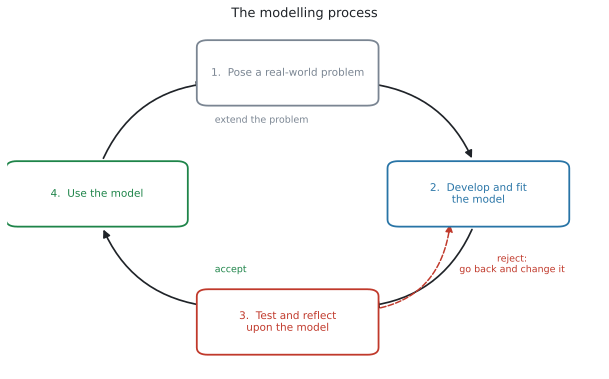
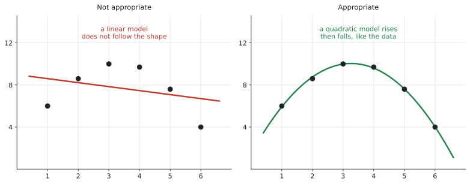
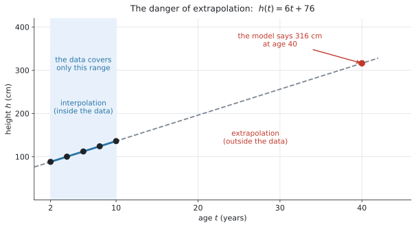

# SL 2.6 — The modelling process（モデリングの手順） {#sec-sl-2-6}

::: {.callout-note}
## What you should be able to do
- **modelling process の4段階**を、順に言える。
- データの形・曲線の性質・文脈から、**モデルを選び、その理由を英語で書ける**。
- モデルの **reasonable domain** を決められる。
- **initial condition・点の代入・連立方程式**の3つで、パラメーターを求められる。
- モデルが**どれくらい当てはまっているか**を、数と言葉で述べられる。
- **interpolation と extrapolation** の違いが分かり、extrapolation の危険を説明できる。
:::

::: {.callout-important}
## Formula booklet には、この項目の式はありません
この項目は**式ではなく、手順**です。

ただし、モデルの当てはまり具合を数で言うときに、**SL 1.6 の percentage error** をそのまま使えます。これは公式集に載っています。

$$
\varepsilon = \left| \frac{v_A - v_E}{v_E} \right| \times 100\%
$$
:::

::: {.callout-note}
## この項目は Topic 2 のまとめです
SL 2.5 で**6つの形**を見ました。この項目は、**その6つを実際に使う手順**です。

シラバスの言い方はこうです。

> Use the modelling process ... to create, fit and use the **theoretical models in section SL2.5** and their graphs.

新しい関数は出てきません。**やることは、選ぶ・当てはめる・確かめる・使う**の4つです。
:::

## The idea

### 1. modelling process の4段階 {#cycle}

{#fig-sl26-cycle width=86%}

シラバスの Content 欄は、この手順を**3つの見出し**に分けています。

| シラバスの見出し | やること |
|---|---|
| **Develop and fit the model** | モデルを選び、domain を決め、パラメーターを求める |
| **Test and reflect upon the model** | 当てはまり具合を確かめ、選んだ理由を述べる |
| **Use the model** | 読み取り、解釈し、予測する |

: シラバスが挙げている3つの段階 {#tbl-sl26-stages}

**試験では、この3つが (a)(b)(c)… の順に並んだ長い問題として出ます。** 1つずつ見ていきます。

### 2. モデルを選ぶ ★★ {#choose}

シラバスは、選ぶ根拠を**3つ**挙げています。

> Justify the choice of a particular model, based on **the shape of the data**, **properties of the curve** and/or on **the context of the situation**.

| 根拠 | どういうことか |
|---|---|
| the shape of the data | データを散布図にすると、どんな形か |
| properties of the curve | asymptote があるか、山や谷があるか、くり返すか |
| the context | 現実にどう動くはずか（増え続ける・いつか止まる・毎年同じ） |

: 選んだ理由に使える3つの根拠 {#tbl-sl26-justify}

{#fig-sl26-fit width=100%}

#### 表から見分ける ★★ {#from-table}

データが表で与えられたときは、**となり合う数を見比べます。**

| 見るもの | それが一定なら | 例 |
|---|---|---|
| **差**（引き算） | **linear** | $12,\ 19,\ 26,\ 33$（差が $7$） |
| **比**（割り算） | **exponential** | $20,\ 30,\ 45,\ 67.5$（比が $1.5$） |
| 上がって下がる | **quadratic** | |
| 一定の間隔でくり返す | **sinusoidal** | |
| 片方が増えると片方が減る | **inverse variation** | |

: 表からモデルを見分ける {#tbl-sl26-fromtable}

::: {.callout-important}
## 理由を書かないと点になりません ★★
`Justify` や `Give a reason` が付いていたら、**「exponential です」だけでは $0$ 点**です。

**`because` から先が答え**だと思ってください。

::: {.model-answer}
**試験ではこう書く**

*An exponential model, because each value is 1.5 times the one before, so the ratio between consecutive values is constant.*
:::

（それぞれの値が前の値の $1.5$ 倍で、となり合う値の比が一定だから、という意味です。）
:::

### 3. reasonable domain を決める ★ {#domain}

シラバスの Content 欄にある一行です。

> **Determine a reasonable domain** for a model.

**式が計算できる範囲ではなく、現実に意味のある範囲**です（SL 2.2 の `in this context` と同じ考え方です）。

| 場面 | reasonable domain | なぜ |
|---|---|---|
| ボールを投げてから落ちるまで | $0 \leq t \leq 4$ | 投げる前と落ちたあとは飛んでいない |
| 蛇口の数と時間 | $n \geq 1$ | 蛇口が $0$ 本では満たせない |
| 測ったデータに合わせたモデル | データのある範囲 | その外は確かめていない |

: reasonable domain の決め方 {#tbl-sl26-domain}

**3つ目が、この項目で一番大事です。** データを取った範囲の外では、そのモデルが正しいかどうかを**誰も確かめていません**（この先の [6.](#use) で詳しく見ます）。

### 4. パラメーターを求める ★★ {#parameters}

モデルの形が決まったら、$m$ や $k$ や $a$ の値を出します。シラバスは、やり方を**3つ**挙げています。

> By setting up and **solving equations simultaneously (using technology)**, by consideration of **initial conditions** or by **substitution of points** into a given function.

#### 道すじ1：initial condition（はじめの値） {#route-initial}

**$x = 0$ のときの値**が問題文に書かれていることが、とても多いです。

- $f(x) = mx + c$ なら、$f(0) = c$
- $f(x) = ka^{x}$ なら、$f(0) = k$
- $f(x) = ka^{x} + c$ なら、$f(0) = k + c$（★ SL 2.5）

「はじめは $500$ 匹でした」と書いてあったら、**それが $k$（または $c$）です。**

#### 道すじ2：点を代入する {#route-point}

分かっている点を式に入れて、残った文字を出します。

$N(t) = 500a^{t}$ で $N(4) = 1200$ なら

$$
500a^{4} = 1200 \ \Rightarrow \ a^{4} = 2.4 \ \Rightarrow \ a = 1.244\ldots
$$

::: {.callout-warning}
## 途中で丸めないでください ★★
$a = 1.24$ と丸めてから $N(10)$ を計算すると **$4300$ 前後**になりますが、丸めずに計算すると **$4460$** です。**$150$ 以上ずれます。**

**電卓に入れたままの値を使い、丸めるのは最後の1回だけ**にしてください。TI-Nspire なら、出た値を `ctrl + var` で変数に入れておくと確実です。
:::

#### 道すじ3：連立方程式（変数3つまで）★★ {#route-simultaneous}

シラバスに、SL の範囲がはっきり書かれています。

> At SL, students will **not** be expected to perform non-linear regressions, but will be expected to **set up and solve up to three linear equations in three variables using technology**.

$f(x) = ax^{2} + bx + c$ の $a$、$b$、$c$ を出すには、**点が3つ**あればよいことになります。点を1つ代入するごとに、式が1本できるからです。

$(1,\ 6)$、$(3,\ 10)$、$(6,\ 4)$ を通るなら

$$
\begin{aligned}
a + b + c &= 6 \\
9a + 3b + c &= 10 \\
36a + 6b + c &= 4
\end{aligned}
$$ {#eq-sl26-simul}

これを電卓で解きます（SL 1.8 でやったものと同じです）。

```
menu → Algebra → Solve System of Linear Equations
```

::: {.callout-note}
## regression は Topic 4 の話です
シラバスの Guidance 欄に、こう書かれています。

> **Fitting models using regression is covered in topic 4.**

散布図に**直線**を当てはめる（least squares regression）のは [SL 4.4](../04-statistics-and-probability/sl-4-4.qmd) です。**この項目では、点を通るように式を作ります。** 別のやり方なので、混同しないでください。

そして **non-linear regression（曲線の回帰）は、SL では出ません。**
:::

### 5. モデルを確かめる ★ {#test}

シラバスの Content 欄です。

> **Comment on the appropriateness and reasonableness** of a model.

確かめ方は3つあります。

| 確かめ方 | どうするか |
|---|---|
| **数で** | モデルの値と実測値の差、または [percentage error](../01-number-and-algebra/sl-1-6.qmd#sec-sl-1-6) |
| **形で** | 散布図とモデルのグラフを重ねて、形が合っているか（@fig-sl26-fit） |
| **文脈で** | 出た答えが現実にありえる値か |

: モデルの確かめ方 {#tbl-sl26-check}

::: {.callout-tip}
## 「よく合っている」だけでは足りません ★
`Comment on` の答えには、**数を根拠として入れてください。**

::: {.model-answer}
**試験ではこう書く**

*The model gives 41.9 while the measured value is 42.5, a percentage error of 1.36%. This is small, so the model is appropriate over this range.*
:::

（モデルは $41.9$、実測は $42.5$ で誤差率 $1.36\%$。小さいので、この範囲ではこのモデルは適切である、という意味です。）
:::

### 6. モデルを使う ── interpolation と extrapolation ★★ {#use}

シラバスの Guidance 欄に、この項目で唯一の「注意」が書かれています。

> Students should be aware of the **dangers of extrapolation**.

{#fig-sl26-extrapolation width=88%}

| English | 日本語 | 意味 |
|---|---|---|
| **interpolation** | 内挿（ないそう） | **データのある範囲の中**で予測する |
| **extrapolation** | 外挿（がいそう） | **データの外側**で予測する |

: interpolation と extrapolation {#tbl-sl26-extrap}

@fig-sl26-extrapolation は、$2$ 歳から $10$ 歳までの身長のデータに合わせた $h(t) = 6t + 76$ です。データの範囲では、よく合っています。

ですが、この式に $t = 40$ を入れると

$$
h(40) = 6(40) + 76 = 316
$$

**身長 $316$ cm** になります。**式は正しく計算できていますが、答えは現実的ではありません。**

::: {.callout-important}
## extrapolation が危ない理由 ★★
モデルは、**データのある範囲で「合っている」ことを確かめただけ**です。その外側で同じ形が続く保証は、どこにもありません。

人は $10$ 歳を過ぎると伸び方が変わり、やがて止まります。**直線のモデルは、それを知りません。**

答案には、こう書きます。

::: {.model-answer}
**試験ではこう書く**

*The prediction is not reliable, because $t = 40$ is far outside the range of the data used to make the model. This is extrapolation.*
:::

（$t = 40$ はモデルを作るのに使ったデータの範囲からずっと外側にあるので、この予測は信頼できない。これは extrapolation である、という意味です。）
:::

## Why it works

ここでは、**なぜ点が3つあれば quadratic model が決まるのか**だけを説明します。

$f(x) = ax^{2} + bx + c$ には、**分からない文字が3つ**あります（$a$、$b$、$c$）。

点を1つ代入すると、式が1本できます。$(1,\ 6)$ を入れれば $a + b + c = 6$ です。

**文字が3つなら、式が3本必要です。** ですから、**点が3つ**要ります（SL 1.8）。

同じ考え方で、

- linear model は文字が2つ（$m$、$c$）なので、**点が2つ**
- $f(x) = ka^{x}$ は文字が2つ（$k$、$a$）なので、**点が2つ**

決まります。**「文字の数だけ、点が要る」**と覚えてください。

## Worked examples

::: {.callout-note appearance="simple"}
問題文は英語です。意味が理解できなかったら、問題文の下の「**日本語訳**」を開いてください。解説は日本語です。
:::

::: {#exm-sl26-simul}
[A company's monthly profit, $P$ thousand dollars, when it spends $x$ thousand dollars on advertising is modelled by]{.q-en}

$$
P(x) = ax^{2} + bx + c
$$

[The company has recorded the following data.]{.q-en}

| Advertising $x$ (thousand dollars) | 1 | 3 | 6 |
|---|---|---|---|
| Profit $P$ (thousand dollars) | 6 | 10 | 4 |

: Recorded data {#tbl-sl26-we1}

**(a)** [Write down three equations in $a$, $b$ and $c$.]{.q-en}

**(b)** [Use your GDC to find the values of $a$, $b$ and $c$.]{.q-en}

**(c)** [Find the amount the company should spend on advertising to maximise its profit.]{.q-en}

**(d)** [Explain why a quadratic model is appropriate for this situation.]{.q-en}

<details class="jp-trans">
<summary>日本語訳</summary>

ある会社の月の利益 $P$（千ドル）が、広告に $x$ 千ドル使ったときに $P(x) = ax^{2} + bx + c$ でモデル化されています。会社は上の表のデータを記録しました。

（表の見出しは Advertising が「広告費」、Profit が「利益」です。）

**(a)** $a$、$b$、$c$ についての3本の式を書きなさい。

**(b)** 電卓を使って、$a$、$b$、$c$ の値を求めなさい。

**(c)** 利益を最大にするために会社が広告に使うべき金額を求めなさい。

**(d)** この場面に quadratic model が適切である理由を説明しなさい。

</details>

---

**(a)** [点を1つずつ代入します](#route-simultaneous)。$x = 1$ なら $x^{2} = 1$ なので

$$
a(1) + b(1) + c = 6 \ \Rightarrow \ a + b + c = 6
$$

$x = 3$ なら $x^{2} = 9$、$x = 6$ なら $x^{2} = 36$ です。

$$
\begin{aligned}
a + b + c &= 6 \\
9a + 3b + c &= 10 \\
36a + 6b + c &= 4
\end{aligned}
$$

**(b)** 変数3つの連立方程式なので、電卓で解きます。

```
menu → Algebra → Solve System of Linear Equations
Number of equations: 3
Number of unknowns: 3
```

$$
a = -0.8, \qquad b = 5.2, \qquad c = 1.6
$$

**検算。** $9(-0.8) + 3(5.2) + 1.6 = -7.2 + 15.6 + 1.6 = 10$ ✓

**(c)** $a = -0.8$ で負なので、グラフは山です。頂点が最大の利益になります。

$$
x = -\frac{b}{2a} = -\frac{5.2}{2(-0.8)} = 3.25
$$

$3.25$ 千ドル、つまり **$3250$ ドル**です。

**(d)** `Explain why` なので、[理由を英語で書きます](#choose)。

::: {.model-answer}
**試験ではこう書く**

*The profit rises and then falls as spending increases, and a quadratic model has exactly this shape, with a single maximum point.*
:::

（広告費が増えると利益は上がってから下がる。quadratic model はまさにその形で、最大点を1つ持つ、という意味です。）

::: {.callout-note}
## 解答例（答案用紙にはこう書く）
**(a)** $a + b + c = 6$, $9a + 3b + c = 10$, $36a + 6b + c = 4$

**(b)** $a = -0.8$, $b = 5.2$, $c = 1.6$

**(c)** $x = -\dfrac{5.2}{2(-0.8)} = 3.25$, so the company should spend 3250 dollars.

**(d)** *The profit rises and then falls as spending increases, and a quadratic model has exactly this shape, with a single maximum point.*
:::
:::

::: {#exm-sl26-exponential}
[The number of fish in a lake is modelled by $N(t) = ka^{t}$, where $t$ is the number of years after the fish were introduced.]{.q-en}

[There were 500 fish at the start, and 1200 fish after 4 years.]{.q-en}

**(a)** [Write down the value of $k$.]{.q-en}

**(b)** [Find the value of $a$, correct to three significant figures.]{.q-en}

**(c)** [Use the model to predict the number of fish after 10 years.]{.q-en}

**(d)** [Comment on the reliability of your answer to part (c).]{.q-en}

<details class="jp-trans">
<summary>日本語訳</summary>

湖の魚の数が $N(t) = ka^{t}$ でモデル化されています。$t$ は魚を放してからの年数です。

最初は $500$ 匹で、$4$ 年後には $1200$ 匹でした。

**(a)** $k$ の値を書きなさい。

**(b)** $a$ の値を有効数字3桁で求めなさい。

**(c)** このモデルを使って、$10$ 年後の魚の数を予測しなさい。

**(d)** (c) の答えの信頼性についてコメントしなさい。

</details>

---

**(a)** 「最初は $500$ 匹」が [initial condition](#route-initial) です。$a^{0} = 1$ なので

$$
N(0) = k a^{0} = k = 500
$$

この式には $+ c$ がないので、$k$ がそのまま初期値です。

**(b)** [点を代入します](#route-point)。$N(4) = 1200$ なので

$$
500a^{4} = 1200 \ \Rightarrow \ a^{4} = 2.4 \ \Rightarrow \ a = 1.2446\ldots
$$

有効数字3桁で **$a = 1.24$** です。

**(c)** ここで [$1.24$ を使ってはいけません](#route-point)。**電卓に入ったままの $1.2446\ldots$ を使います。**

$$
N(10) = 500(1.2446\ldots)^{10} = 4461.6\ldots
$$

魚は整数なので、**約 $4460$ 匹**です。

（$1.24$ で計算すると $4297$ になり、$160$ 匹以上ずれます。）

**(d)** データは **$t = 4$ まで**しかありません。$t = 10$ はその外側なので、[extrapolation](#use) です。

::: {.model-answer}
**試験ではこう書く**

*The prediction is not very reliable, because $t = 10$ is outside the range of the data, which only goes up to $t = 4$. The lake may also not have enough food for so many fish.*
:::

（データは $t = 4$ までしかなく、$t = 10$ はその外側なのであまり信頼できない。湖にそれだけの魚を養う食料がない可能性もある、という意味です。）

::: {.callout-note}
## 解答例（答案用紙にはこう書く）
**(a)** $k = 500$

**(b)** $500a^{4} = 1200 \Rightarrow a^{4} = 2.4 \Rightarrow a = 1.24$ (3 s.f.)

**(c)** $N(10) = 500(1.2446\ldots)^{10} = 4461.6\ldots$, so about 4460 fish.

**(d)** *The prediction is not very reliable, because $t = 10$ is outside the range of the data, which only goes up to $t = 4$.*
:::
:::

::: {#exm-sl26-choose}
[Two students each collect a set of data.]{.q-en}

| $x$ | 0 | 1 | 2 | 3 | 4 |
|---|---|---|---|---|---|
| Set A | 20 | 30 | 45 | 67.5 | 101.25 |
| Set B | 12 | 19 | 26 | 33 | 40 |

: The two data sets {#tbl-sl26-we3}

**(a)** [For Set A, state which model on the syllabus is appropriate and justify your choice.]{.q-en}

**(b)** [Find the model for Set A.]{.q-en}

**(c)** [For Set B, state which model on the syllabus is appropriate and justify your choice.]{.q-en}

**(d)** [Find the model for Set B.]{.q-en}

<details class="jp-trans">
<summary>日本語訳</summary>

$2$ 人の生徒が、それぞれデータを集めました。

**(a)** Set A について、シラバスのどのモデルが適切かを述べ、選んだ理由を書きなさい。

**(b)** Set A のモデルを求めなさい。

**(c)** Set B について、シラバスのどのモデルが適切かを述べ、選んだ理由を書きなさい。

**(d)** Set B のモデルを求めなさい。

</details>

---

**(a)** [まず差、次に比を見ます](#from-table)。

Set A の差は $10,\ 15,\ 22.5,\ 33.75$ で**一定ではありません。** 比を見ると

$$
\frac{30}{20} = 1.5, \quad \frac{45}{30} = 1.5, \quad \frac{67.5}{45} = 1.5, \quad \frac{101.25}{67.5} = 1.5
$$

**比が一定**なので exponential です。

::: {.model-answer}
**試験ではこう書く**

*An exponential model, because each value is 1.5 times the one before, so the ratio between consecutive values is constant.*
:::

**(b)** $f(x) = ka^{x}$ の形です。$x = 0$ のとき $20$ なので $k = 20$、比が $1.5$ なので $a = 1.5$ です。

$$
f(x) = 20(1.5)^{x}
$$

**検算。** $f(4) = 20(1.5)^{4} = 20(5.0625) = 101.25$ ✓

**(c)** Set B の差は $7,\ 7,\ 7,\ 7$ で**一定**です。

::: {.model-answer}
**試験ではこう書く**

*A linear model, because the value increases by 7 each time $x$ increases by 1, so the difference between consecutive values is constant.*
:::

**(d)** $f(x) = mx + c$ の形です。差が $7$ なので $m = 7$、$x = 0$ のとき $12$ なので $c = 12$ です。

$$
f(x) = 7x + 12
$$

**検算。** $f(4) = 28 + 12 = 40$ ✓

::: {.callout-note}
## 解答例（答案用紙にはこう書く）
**(a)** *An exponential model, because each value is 1.5 times the one before, so the ratio between consecutive values is constant.*

**(b)** $f(x) = 20(1.5)^{x}$

**(c)** *A linear model, because the value increases by 7 each time $x$ increases by 1, so the difference between consecutive values is constant.*

**(d)** $f(x) = 7x + 12$
:::
:::

::: {#exm-sl26-extrap}
[Data on the height of a child was collected between the ages of 2 and 10 years. The height, $h$ cm, at age $t$ years is modelled by]{.q-en}

$$
h(t) = 6t + 76
$$

**(a)** [Use the model to find the height of the child at age 5.]{.q-en}

**(b)** [Interpret the value 6 in the context of the question.]{.q-en}

**(c)** [The model gives $h(40) = 316$. Comment on this value.]{.q-en}

**(d)** [State a reasonable domain for this model.]{.q-en}

<details class="jp-trans">
<summary>日本語訳</summary>

$2$ 歳から $10$ 歳までのあいだで、ある子どもの身長のデータが集められました。$t$ 歳での身長 $h$ cm が $h(t) = 6t + 76$ でモデル化されています。

**(a)** このモデルを使って、$5$ 歳のときの身長を求めなさい。

**(b)** $6$ という値を、この問題の文脈で解釈しなさい。

**(c)** このモデルでは $h(40) = 316$ となります。この値についてコメントしなさい。

**(d)** このモデルの妥当な定義域を述べなさい。

</details>

---

**(a)** $t = 5$ を入れるだけです。$5$ はデータの範囲（$2$ から $10$）の**中**なので、[interpolation](#use) です。

$$
h(5) = 6(5) + 76 = 106
$$

**(b)** $6$ は $m$、つまり[$1$ 増えるごとの変化](sl-2-5.qmd#linear)です。ここでの $1$ は $1$ 年です。

::: {.model-answer}
**試験ではこう書く**

*The child grows about 6 cm each year.*
:::

**(c)** $316$ cm という身長は、**現実にはありえません。**

$t = 40$ はデータの範囲（$2 \leq t \leq 10$）から**ずっと外**です。

::: {.model-answer}
**試験ではこう書く**

*A height of 316 cm is not possible. The value $t = 40$ is far outside the range of the data, so using the model here is extrapolation and the answer is not reliable.*
:::

（$316$ cm という身長はありえない。$t = 40$ はデータの範囲からずっと外側なので、ここでモデルを使うのは extrapolation であり、答えは信頼できない、という意味です。）

**(d)** [データのある範囲](#domain)です。

$$
2 \leq t \leq 10
$$

::: {.callout-note}
## 解答例（答案用紙にはこう書く）
**(a)** $h(5) = 6(5) + 76 = 106$ cm

**(b)** *The child grows about 6 cm each year.*

**(c)** *A height of 316 cm is not possible. The value $t = 40$ is far outside the range of the data, so using the model here is extrapolation and the answer is not reliable.*

**(d)** $2 \leq t \leq 10$
:::
:::

::: {#exm-sl26-test}
[A student models the temperature of a cooling liquid, in degrees Celsius, $t$ minutes after the start, by]{.q-en}

$$
T(t) = 60(0.9)^{t} + 21
$$

[The table shows the temperatures the student measured.]{.q-en}

| Time $t$ (minutes) | 5 | 10 | 20 |
|---|---|---|---|
| Measured temperature ($^\circ$C) | 56.5 | 42.5 | 28.5 |

: The measured temperatures {#tbl-sl26-we5}

**(a)** [Find $T(10)$, correct to three significant figures.]{.q-en}

**(b)** [Find the percentage error in the value given by the model at $t = 10$, correct to three significant figures.]{.q-en}

**(c)** [Comment on the appropriateness of the model.]{.q-en}

<details class="jp-trans">
<summary>日本語訳</summary>

ある生徒が、冷えていく液体の温度（摂氏）を、開始から $t$ 分後に $T(t) = 60(0.9)^{t} + 21$ でモデル化しました。表は、その生徒が測った温度です。

（表の見出しは Time が「時間」、Measured temperature が「測った温度」です。）

**(a)** $T(10)$ を有効数字3桁で求めなさい。

**(b)** $t = 10$ でのモデルの値の誤差率を、有効数字3桁で求めなさい。

**(c)** このモデルの適切さについてコメントしなさい。

</details>

---

**(a)** 電卓に入れます。

$$
T(10) = 60(0.9)^{10} + 21 = 41.92\ldots
$$

有効数字3桁で **$41.9$** 度です。

**(b)** [percentage error](../01-number-and-algebra/sl-1-6.qmd#sec-sl-1-6) の式を使います。**分母は「本当の値」、つまり測った値のほう**です。

$$
\varepsilon = \left| \frac{41.92 - 42.5}{42.5} \right| \times 100\% = 1.363\ldots\%
$$

有効数字3桁で **$1.36\%$** です。

**(c)** 他の2つも同じように調べると、$t = 5$ で $0.125\%$、$t = 20$ で $0.721\%$ です。**どれも $1.5\%$ より小さい**ので、よく合っています。

::: {.model-answer}
**試験ではこう書く**

*At all three times the model is within 1.4% of the measured temperature, so the model is appropriate for this liquid over the first 20 minutes.*
:::

（$3$ つの時刻すべてで、モデルは測定値の $1.4\%$ 以内に入っている。したがって最初の $20$ 分についてはこのモデルは適切である、という意味です。）

**「よく合っています」だけでは足りません。** 数を根拠に入れてください。

::: {.callout-note}
## 解答例（答案用紙にはこう書く）
**(a)** $T(10) = 41.92\ldots = 41.9$ degrees (3 s.f.)

**(b)** $\varepsilon = \left| \dfrac{41.92 - 42.5}{42.5} \right| \times 100\% = 1.36\%$ (3 s.f.)

**(c)** *At all three times the model is within 1.4% of the measured temperature, so the model is appropriate for this liquid over the first 20 minutes.*
:::
:::

## Common errors

::: {.callout-warning}
## モデル名だけ書いて、理由を書かない ★★
`Justify` や `Explain why` が付いていたら、**`because` から先が答え**です。

「exponential model です」だけでは点になりません。**「比が一定だから」「上がって下がるから」**まで書いてください。
:::

::: {.callout-warning}
## 途中で丸めてから、次の計算に使う ★★
$a = 1.2446\ldots$ を $1.24$ にしてから $10$ 乗すると、答えが大きくずれます。

**丸めるのは、答えを書く最後の1回だけ**です。途中は電卓の中の値を使ってください。
:::

::: {.callout-warning}
## extrapolation なのに「信頼できる」と書く ★★
`Comment on the reliability` は、**ほぼ必ず extrapolation を聞いています。**

問題文の中の**データの範囲**を確かめてください。予測したい値がその外なら、**理由はそこ**です。
:::

::: {.callout-warning}
## reasonable domain を、式の都合で答える ★
`reasonable domain` は**現実に意味のある範囲**です。

「$x$ は実数全体」「$x \neq 0$」のような答えは、この設問では点になりません。
:::

::: {.callout-warning}
## percentage error の分母を間違える ★
分母は $v_E$、つまり**本当の値（測った値）**です。

モデルの値を分母にすると、違う答えになります（SL 1.6）。
:::

::: {.callout-warning}
## 点が足りないのに連立方程式を立てようとする ★
$ax^{2} + bx + c$ は文字が3つなので、**点が3つ**要ります。

点が2つしかないときは、**問題文のどこかにもう1つ条件があります。** 「グラフは原点を通る」「はじめは $0$ だった」なども、1本の式になります。
:::

::: {.callout-warning}
## 表を見て、差と比の片方しか調べない ★
差が一定でなければ、**次は比を見てください。**

差だけ見て「linear ではない」で止まると、exponential を見落とします。
:::

::: {.callout-warning}
## regression と混同する ★
この項目でやるのは、**点を通るように式を作る**ことです。

散布図に直線を当てはめる regression は [SL 4.4](../04-statistics-and-probability/sl-4-4.qmd) の話で、**やり方も答えも違います。** 問題文が `regression` と言っているかどうかで判断してください。
:::

## Using your GDC (TI-Nspire CX II)

### 1. 連立方程式を解く ★★

この項目の中心です。

```
menu → Algebra → Solve System of Linear Equations
Number of equations: 3
Number of unknowns: 3
```

$x$、$y$、$z$ の欄に **$a$、$b$、$c$ と打ち直せます。** そのまま $x$、$y$、$z$ で解いて、最後に読み替えても構いません。

（OS によっては `Simultaneous Equation Solver` という名前で出ます。SL 1.8 で使ったものと同じです。）

::: {.callout-important}
## 式を打ち込む前に、紙に3本書いてください ★
電卓に直接打ち込もうとすると、**どの点をどこに入れたか分からなくなります。**

$x = 3$ なら $x^{2} = 9$ です。**この $9$ を先に計算して紙に書いてから**、電卓に入れてください。
:::

### 2. 値を丸めずに使う ★★

出た値を変数に入れておくと、丸め誤差が入りません。

```
2.4^(1/4)  →  ctrl + var  →  ra   （好きな名前でよい）
500 * ra^10
```

`ctrl + var` は `sto→`（記憶）です。**$a$ という1文字の名前は、電卓が別の意味で使うことがあるので避けてください。**

### 3. データとモデルを重ねて見る

データが表で与えられたら、散布図にモデルを重ねると形が合っているかが見えます。

```
Lists & Spreadsheet ページに x と y を入れる
ctrl + doc → Add Data & Statistics
menu → Plot Type → Scatter Plot
menu → Analyze → Plot Function     f1(x) = 20*1.5^x
```

**`Plot Function` で、散布図の上に自分の式を重ねられます。** @fig-sl26-fit のような比べ方が、画面の中でできます。

### 4. 差と比を、表で調べる

表の数が多いときは、Lists & Spreadsheet の列の式で一度に出せます。

```
列 A に データ
列 B の見出しの式に  = b[]-a[]      （差）
```

**手で $4$ 回引き算するより速く、見落としもありません。**

## Exercises

::: {.callout-note appearance="simple"}
各問題に、折りたたみが3つ付いています。**日本語訳**、**解答例**（答案用紙に書くべきこと。英語です）、**解説**（なぜそうなるか。日本語です）。

まず自分で解いて、次に解答例と見くらべてください。**解説は、合わなかったときだけ開けば十分です。**
:::

::: {.exercise-block}

[1]{.ex-no} [The height of a water jet above the ground, $y$ metres, at a horizontal distance $x$ metres is modelled by $y = ax^{2} + bx + c$. The jet passes through the points $(0,\ 4)$, $(2,\ 12)$ and $(5,\ 9)$.]{.q-en}

**(a)** [Write down three equations in $a$, $b$ and $c$.]{.q-en}

**(b)** [Use your GDC to find the values of $a$, $b$ and $c$.]{.q-en}

**(c)** [Find the maximum height of the jet.]{.q-en}

<details class="jp-trans">
<summary>日本語訳</summary>

水の噴射の地面からの高さ $y$ メートルが、水平距離 $x$ メートルで $y = ax^{2} + bx + c$ でモデル化されています。噴射は $(0,\ 4)$、$(2,\ 12)$、$(5,\ 9)$ を通ります。

**(a)** $a$、$b$、$c$ についての3本の式を書きなさい。

**(b)** 電卓を使って $a$、$b$、$c$ の値を求めなさい。

**(c)** 噴射の最高の高さを求めなさい。

</details>

::: {.callout-note collapse="true"}
## 解答例（答案用紙に書くこと）
**(a)** $c = 4$, $4a + 2b + c = 12$, $25a + 5b + c = 9$

**(b)** $a = -1$, $b = 6$, $c = 4$

**(c)** $x = -\dfrac{6}{2(-1)} = 3$ and $y = -9 + 18 + 4 = 13$, so the maximum height is 13 m.
:::

::: {.callout-tip collapse="true"}
## 解説
$(0,\ 4)$ を入れると $a(0) + b(0) + c = 4$、つまり **$c = 4$** がすぐ出ます。これが [initial condition](#route-initial) です。

残りの2本を電卓に入れてもよいですが、**3本まとめて入れるほうが打ち間違いが少なくなります。**

**検算**：$4(-1) + 2(6) + 4 = -4 + 12 + 4 = 12$ ✓
:::

::: {.ex-sep}
:::

[2]{.ex-no} [A taxi fare, $C$ dollars, for a journey of $d$ km is modelled by $C = md + c$. A journey of 2 km costs 58 dollars and a journey of 7 km costs 88 dollars.]{.q-en}

**(a)** [Find the value of $m$ and the value of $c$.]{.q-en}

**(b)** [Interpret the value of $c$ in the context of the question.]{.q-en}

**(c)** [Find the cost of a journey of 12 km.]{.q-en}

<details class="jp-trans">
<summary>日本語訳</summary>

$d$ km の乗車のタクシー料金 $C$ ドルが $C = md + c$ でモデル化されています。$2$ km の乗車は $58$ ドル、$7$ km の乗車は $88$ ドルです。

**(a)** $m$ と $c$ の値を求めなさい。

**(b)** $c$ の値を、この問題の文脈で解釈しなさい。

**(c)** $12$ km の乗車の料金を求めなさい。

</details>

::: {.callout-note collapse="true"}
## 解答例（答案用紙に書くこと）
**(a)** $m = \dfrac{88 - 58}{7 - 2} = 6$ and $58 = 6(2) + c$, so $c = 46$

**(b)** *The fixed charge for getting into the taxi is 46 dollars, before any distance is travelled.*

**(c)** $C = 6(12) + 46 = 118$ dollars
:::

::: {.callout-tip collapse="true"}
## 解説
文字が2つ（$m$、$c$）なので、**点が2つ**あれば決まります（Why it works）。

**(b)** $c$ は $d = 0$ のときの料金、つまり**まだ $1$ m も走っていないのに払う額**です。$m$（$1$ km あたり $6$ ドル）と混同しないでください。

**検算**：$6(7) + 46 = 42 + 46 = 88$ ✓
:::

::: {.ex-sep}
:::

[3]{.ex-no} [The value of a machine, $V$ dollars, $t$ years after it is bought is modelled by $V(t) = ka^{t}$. The machine cost 18 000 dollars when new, and after 5 years it is worth 9000 dollars.]{.q-en}

**(a)** [Write down the value of $k$.]{.q-en}

**(b)** [Find the value of $a$, correct to three significant figures.]{.q-en}

**(c)** [Find the value of the machine after 8 years, correct to three significant figures.]{.q-en}

<details class="jp-trans">
<summary>日本語訳</summary>

機械の価値 $V$ ドルが、買ってから $t$ 年後に $V(t) = ka^{t}$ でモデル化されています。機械は新品のとき $18\,000$ ドルで、$5$ 年後には $9000$ ドルの価値になります。

**(a)** $k$ の値を書きなさい。

**(b)** $a$ の値を有効数字3桁で求めなさい。

**(c)** $8$ 年後の機械の価値を、有効数字3桁で求めなさい。

</details>

::: {.callout-note collapse="true"}
## 解答例（答案用紙に書くこと）
**(a)** $k = 18\,000$

**(b)** $18\,000a^{5} = 9000 \Rightarrow a^{5} = 0.5 \Rightarrow a = 0.871$ (3 s.f.)

**(c)** $V(8) = 18\,000(0.8705\ldots)^{8} = 5937.7\ldots = 5940$ dollars (3 s.f.)
:::

::: {.callout-tip collapse="true"}
## 解説
**(a)** 「新品のとき」が $t = 0$、つまり [initial condition](#route-initial) です。

**(b)** $5$ 年で半分になるので $a^{5} = 0.5$。$a = 0.5^{1/5} = 0.8705\ldots$ です。$a < 1$ なので decay になっています。

**(c)** ★ **$0.871$ を使わないでください。** $0.8705\ldots$ のまま計算します。$0.871$ で計算すると $5962$ になり、有効数字3桁では $5960$ と、答えが変わってしまいます。
:::

::: {.ex-sep}
:::

[4]{.ex-no} [Two sets of data are shown below.]{.q-en}

| $x$ | 0 | 1 | 2 | 3 | 4 |
|---|---|---|---|---|---|
| Set C | 5 | 8 | 11 | 14 | 17 |
| Set D | 80 | 60 | 45 | 33.75 | 25.3125 |

: The two data sets {#tbl-sl26-e4}

**(a)** [For each set, state which model is appropriate and justify your choice.]{.q-en}

**(b)** [Find the model for Set D.]{.q-en}

<details class="jp-trans">
<summary>日本語訳</summary>

$2$ 組のデータが上に示されています。

**(a)** それぞれの組について、どのモデルが適切かを述べ、選んだ理由を書きなさい。

**(b)** Set D のモデルを求めなさい。

</details>

::: {.callout-note collapse="true"}
## 解答例（答案用紙に書くこと）
**(a)** *Set C: a linear model, because the value increases by 3 each time $x$ increases by 1, so the difference between consecutive values is constant.*

*Set D: an exponential model, because each value is 0.75 times the one before, so the ratio between consecutive values is constant.*

**(b)** $f(x) = 80(0.75)^{x}$
:::

::: {.callout-tip collapse="true"}
## 解説
**まず差、次に比**の順で調べます（@tbl-sl26-fromtable）。

Set D の差は $-20,\ -15,\ -11.25,\ -8.4375$ で一定ではありません。比を見ると $\dfrac{60}{80} = 0.75$ で、以降もすべて $0.75$ です。

**検算**：$80(0.75)^{4} = 80 \times 0.31640625 = 25.3125$ ✓

$0 < 0.75 < 1$ なので **exponential decay** です。理由の文には「比が一定」まで書いてください。
:::

::: {.ex-sep}
:::

[5]{.ex-no} [A ball is thrown from a cliff. Its height above the sea, $h$ metres, after $t$ seconds is modelled by $h(t) = -5t^{2} + 10t + 40$. The ball hits the sea after 4 seconds.]{.q-en}

**(a)** [State a reasonable domain for this model.]{.q-en}

**(b)** [Explain why $t = 6$ is not in the domain.]{.q-en}

**(c)** [Find the height of the ball after 1 second.]{.q-en}

<details class="jp-trans">
<summary>日本語訳</summary>

崖からボールが投げられます。海面からの高さ $h$ メートルが、$t$ 秒後に $h(t) = -5t^{2} + 10t + 40$ でモデル化されています。ボールは $4$ 秒後に海に落ちます。

**(a)** このモデルの妥当な定義域を述べなさい。

**(b)** $t = 6$ が定義域に入らない理由を説明しなさい。

**(c)** $1$ 秒後のボールの高さを求めなさい。

</details>

::: {.callout-note collapse="true"}
## 解答例（答案用紙に書くこと）
**(a)** $0 \leq t \leq 4$

**(b)** *After 4 seconds the ball is already in the sea, so it is no longer falling through the air and the model no longer describes the situation.*

**(c)** $h(1) = -5 + 10 + 40 = 45$ m
:::

::: {.callout-tip collapse="true"}
## 解説
**(a)** 投げた瞬間（$t = 0$）から、海に落ちる瞬間（$t = 4$）までです。

**検算**：$h(4) = -80 + 40 + 40 = 0$ ✓ ちょうど海面です。

**(b)** は `Explain why` なので、**英語の一文**が答えです。$h(6) = -180 + 60 + 40 = -80$ と計算はできますが、「海面より $80$ m 下」は現実の話ではありません。
:::

::: {.ex-sep}
:::

[6]{.ex-no} [The number of people using a new app was recorded each week for the first 8 weeks, and modelled by $N(w) = 200(1.4)^{w}$, where $w$ is the number of weeks.]{.q-en}

**(a)** [Find the number of users after 6 weeks.]{.q-en}

**(b)** [The model predicts about 4.8 million users after 30 weeks. Comment on this prediction.]{.q-en}

<details class="jp-trans">
<summary>日本語訳</summary>

新しいアプリの利用者数が最初の $8$ 週間、毎週記録され、$N(w) = 200(1.4)^{w}$ でモデル化されました。$w$ は週数です。

**(a)** $6$ 週間後の利用者数を求めなさい。

**(b)** このモデルは $30$ 週間後に約 $484$ 万人の利用者を予測します。この予測についてコメントしなさい。

</details>

::: {.callout-note collapse="true"}
## 解答例（答案用紙に書くこと）
**(a)** $N(6) = 200(1.4)^{6} = 1505.7\ldots$, so about 1510 users.

**(b)** *The prediction is not reliable. $w = 30$ is far outside the 8 weeks of data used to build the model, so this is extrapolation. In practice the growth would slow down once most interested people have the app.*
:::

::: {.callout-tip collapse="true"}
## 解説
**(a)** 人数なので整数にします。有効数字3桁なら $1510$ 人です。

**(b)** は、この項目で一番よく出る形の設問です。答えに入れるべきものは**2つ**あります。

1. **データの範囲は $8$ 週まで**で、$30$ 週はその外（extrapolation）
2. **現実の理由** ── 興味のある人に行き渡れば、増え方は必ず鈍る

「信頼できません」だけでは足りません。**どちらも書いてください。**
:::

::: {.ex-sep}
:::

[7]{.ex-no} [A model predicts that the mass of a substance after 12 hours is 34.4 grams. The measured mass was 35.1 grams.]{.q-en}

**(a)** [Find the percentage error in the value given by the model, correct to three significant figures.]{.q-en}

**(b)** [Comment on the appropriateness of the model at this time.]{.q-en}

<details class="jp-trans">
<summary>日本語訳</summary>

あるモデルは、$12$ 時間後の物質の質量を $34.4$ グラムと予測します。測った質量は $35.1$ グラムでした。

**(a)** モデルの値の誤差率を、有効数字3桁で求めなさい。

**(b)** この時刻でのモデルの適切さについてコメントしなさい。

</details>

::: {.callout-note collapse="true"}
## 解答例（答案用紙に書くこと）
**(a)** $\varepsilon = \left| \dfrac{34.4 - 35.1}{35.1} \right| \times 100\% = 1.99\%$ (3 s.f.)

**(b)** *The model is within 2% of the measured mass, so it is appropriate at this time.*
:::

::: {.callout-tip collapse="true"}
## 解説
**分母は「本当の値」、つまり測った $35.1$ のほう**です（SL 1.6）。$34.4$ を分母にすると $2.03\%$ になり、答えが変わってしまいます。

**(b)** は数を根拠にしてください。「$2\%$ 以内」と書くだけで、根拠のある一文になります。

なお、**この $1$ 点だけでモデル全体を判断することはできません。** 「at this time（この時刻では）」と限定して書いているのは、そのためです。
:::

::: {.ex-sep}
:::

[8]{.ex-no} [The depth of water in a harbour is modelled by $d(t) = a\sin(bt) + c$, where $t$ is the time in hours after midnight. The maximum depth is 14 metres, the minimum depth is 2 metres, and the pattern repeats every 24 hours.]{.q-en}

**(a)** [Find the value of $c$.]{.q-en}

**(b)** [Find the value of $a$.]{.q-en}

**(c)** [Find the value of $b$.]{.q-en}

<details class="jp-trans">
<summary>日本語訳</summary>

港の水深が $d(t) = a\sin(bt) + c$ でモデル化されています。$t$ は真夜中からの時間（時）です。最大の水深は $14$ メートル、最小の水深は $2$ メートルで、$24$ 時間ごとに同じ動きをくり返します。

**(a)** $c$ の値を求めなさい。

**(b)** $a$ の値を求めなさい。

**(c)** $b$ の値を求めなさい。

</details>

::: {.callout-note collapse="true"}
## 解答例（答案用紙に書くこと）
**(a)** $c = \dfrac{14 + 2}{2} = 8$

**(b)** $a = \dfrac{14 - 2}{2} = 6$

**(c)** $\dfrac{360}{b} = 24$, so $b = 15$
:::

::: {.callout-tip collapse="true"}
## 解説
SL 2.5 の3つを、**逆向きに使う**問題です。

- **principal axis** は最大と最小の**真ん中**なので、$c = \dfrac{14 + 2}{2} = 8$
- **amplitude** は真ん中からの高さなので、$a = \dfrac{14 - 2}{2} = 6$
- **period** が $24$ なので $\dfrac{360}{b} = 24$、つまり $b = 15$

**検算**：$d = 6\sin(15t) + 8$ で、$t = 6$ のとき $6\sin(90^\circ) + 8 = 14$ ✓、$t = 18$ のとき $6\sin(270^\circ) + 8 = 2$ ✓
:::

::: {.ex-sep}
:::

[9]{.ex-no} [Two students propose different models for the same set of data. At $x = 6$ the measured value is 30. Model 1 gives 28.9 and Model 2 gives 31.8.]{.q-en}

**(a)** [Find the percentage error of each model at $x = 6$, correct to three significant figures.]{.q-en}

**(b)** [State which model fits better at $x = 6$, and give a reason.]{.q-en}

**(c)** [Explain why this comparison is not enough to decide which model is better overall.]{.q-en}

<details class="jp-trans">
<summary>日本語訳</summary>

$2$ 人の生徒が、同じデータに対して違うモデルを提案しました。$x = 6$ での測定値は $30$ です。モデル1は $28.9$、モデル2は $31.8$ を与えます。

**(a)** $x = 6$ でのそれぞれのモデルの誤差率を、有効数字3桁で求めなさい。

**(b)** $x = 6$ でどちらのモデルのほうがよく合っているかを述べ、理由を書きなさい。

**(c)** この比較だけでは、どちらのモデルが全体としてよいかを決められない理由を説明しなさい。

</details>

::: {.callout-note collapse="true"}
## 解答例（答案用紙に書くこと）
**(a)** Model 1: $\left| \dfrac{28.9 - 30}{30} \right| \times 100\% = 3.67\%$ (3 s.f.)

Model 2: $\left| \dfrac{31.8 - 30}{30} \right| \times 100\% = 6.00\%$ (3 s.f.)

**(b)** *Model 1 fits better at $x = 6$, because its percentage error of 3.67% is smaller than the 6.00% of Model 2.*

**(c)** *This is only one data point. A model could fit well at $x = 6$ but badly everywhere else, so all the data points must be compared before deciding.*
:::

::: {.callout-tip collapse="true"}
## 解説
**(a)** 分母はどちらも測定値の $30$ です。

**(b)** は `give a reason` なので、**数を理由にして**ください。「モデル1のほうが近いから」ではなく、**$3.67\%$ と $6.00\%$** を出して比べます。

**(c)** がこの問題の中心です。**$1$ 点だけで判断してはいけません。** モデルの良し悪しは、**すべてのデータ点と、グラフの形**（@fig-sl26-fit）で見ます。
:::

::: {.ex-sep}
:::

[10]{.ex-no} [A student is given a set of data and asked to build a model. Describe, in order, the four stages of the modelling process the student should follow.]{.q-en}

<details class="jp-trans">
<summary>日本語訳</summary>

ある生徒がデータを渡され、モデルを作るように言われました。この生徒がたどるべき modelling process の4段階を、順に書きなさい。

</details>

::: {.callout-note collapse="true"}
## 解答例（答案用紙に書くこと）
1. *Pose the real-world problem and decide what is being modelled.*

2. *Develop and fit the model: choose an appropriate model from the shape of the data, decide a reasonable domain, and find the parameters.*

3. *Test and reflect upon the model: compare it with the data and comment on how well it fits. If it does not fit, go back and change it.*

4. *Use the model: read values from it and make predictions, being careful about extrapolation.*
:::

::: {.callout-tip collapse="true"}
## 解説
@fig-sl26-cycle と @tbl-sl26-stages を、言葉にしたものです。

**「合わなかったら 2 に戻る」**という矢印を書き落とさないでください。modelling は一方通行ではなく、**うまくいくまでくり返す**ものです。シラバスも、そこを cycle（輪）として描いています。

この形の設問は文章だけで答えます。**普段から、例題を解くときに「いま4段階のどこにいるか」を意識しておく**と、書けるようになります。
:::

:::
