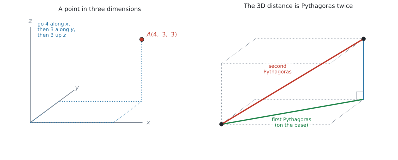
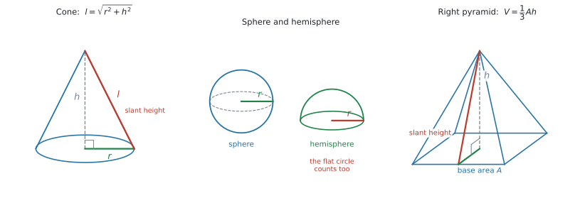
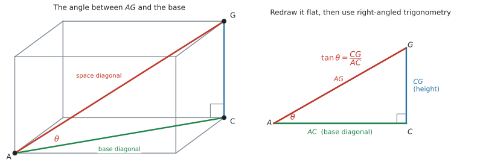

# SL 3.1 — Three-dimensional geometry（空間図形 — 距離・体積・表面積・角） {#sec-sl-3-1}

::: {.callout-note}
## What you should be able to do
- 空間の2点の**距離**と **midpoint** を、公式集の式で求められる。
- **右錐・円錐・球・半球**の体積と表面積を求められる。
- それらを**組み合わせた立体**の体積と表面積を求められる。
- 円錐の **slant height** を Pythagoras で出せる。
- 立体の中から**直角三角形を見つけて**、辺の長さと角を求められる。
- **直線と平面のなす角**が何なのかを説明できる。
:::

::: {.callout-important}
## Formula booklet に載っているもの
この項目は、**公式集の分量が一番多い項目**です。SL 3.1 の欄に、次の5つがあります。

$$
d = \sqrt{(x_1 - x_2)^{2} + (y_1 - y_2)^{2} + (z_1 - z_2)^{2}}
$$

$$
\text{midpoint} = \left( \frac{x_1 + x_2}{2},\ \frac{y_1 + y_2}{2},\ \frac{z_1 + z_2}{2} \right)
$$

$$
V_{\text{pyramid}} = \frac{1}{3}Ah, \qquad V_{\text{cone}} = \frac{1}{3}\pi r^{2} h, \qquad A_{\text{cone, curved}} = \pi r l
$$

$$
V_{\text{sphere}} = \frac{4}{3}\pi r^{3}, \qquad A_{\text{sphere}} = 4\pi r^{2}
$$

さらに **Prior learning** の欄にも、次のものが印刷されています。

$$
V_{\text{cuboid}} = lwh, \qquad V_{\text{cylinder}} = \pi r^{2} h
$$

$$
V_{\text{prism}} = Ah, \qquad A_{\text{cylinder, curved}} = 2\pi r h
$$

$$
A_{\text{circle}} = \pi r^{2}, \qquad C = 2\pi r
$$

$$
A_{\text{triangle}} = \frac{1}{2}bh, \qquad A_{\text{trapezoid}} = \frac{1}{2}(a + b)h
$$

**配られるので、覚える必要はありません。** 覚えるべきなのは、**どの立体にどれを使うか**です。
:::

::: {.callout-warning}
## 公式集に「載っていない」3つ ★★
ここが、この項目で一番落とすところです。

1. **hemisphere（半球）の公式はありません。** 球の式を自分で半分にします。
2. **円錐・円柱の「全表面積」はありません。** 載っているのは **curved surface（側面）だけ**です。底の円は自分で足します。
3. **Pythagoras の定理はありません。** 円錐の $l$（slant height）を出すときに必ず使うので、これは知っている前提です。

$$
l = \sqrt{r^{2} + h^{2}}
$$
:::

::: {.callout-tip}
## 電卓は Degree にしておいてください ★
Topic 3 は**角度を扱う topic** です。AI SL では **degree（度）が中心**で、シラバスの SL 3.4 に `Radians are not required at SL` とはっきり書かれています。

```
ctrl + doc → Document Settings → Angle: Degree
```

Press-to-Test で始めた直後は Degree になっています。**そのままで構いません。**
:::

## The idea

### 1. 空間の座標 {#coordinates-3d}

平面では $(x,\ y)$ の2つでしたが、空間では**もう1つ**、高さを表す $z$ が加わります。

{#fig-sl31-space width=100%}

@fig-sl31-space の左のように、**$x$ 方向に進み、$y$ 方向に進み、最後に $z$ 方向に上がる**と、その点に着きます。

### 2. 距離と midpoint {#distance-midpoint}

公式集の式は、**平面のときの式に $z$ の項が1つ増えただけ**です。

$$
d = \sqrt{(x_1 - x_2)^{2} + (y_1 - y_2)^{2} + (z_1 - z_2)^{2}}
$$ {#eq-sl31-distance}

$$
\text{midpoint} = \left( \frac{x_1 + x_2}{2},\ \frac{y_1 + y_2}{2},\ \frac{z_1 + z_2}{2} \right)
$$ {#eq-sl31-midpoint}

#### 引き算の向きは、どちらでも構いません {#order}

$(x_1 - x_2)$ でも $(x_2 - x_1)$ でも、**2乗すると同じ**になります。ですから、**どちらから引いても答えは変わりません。**

$$
(2 - 6)^{2} = (-4)^{2} = 16, \qquad (6 - 2)^{2} = 4^{2} = 16
$$

::: {.callout-warning}
## midpoint は「足して2で割る」です ★
距離は**引き算**、midpoint は**足し算**です。

$$
\text{midpoint の } x = \frac{x_1 + x_2}{2}
$$

ここで引き算をしてしまう誤りが、とても多いです。**符号を1つ間違えるだけで、全部ずれます。**
:::

### 3. 立体の体積と表面積 {#solids}

シラバスが名指ししている立体は、これだけです。

> Volume and surface area of three-dimensional solids including **right-pyramid, right cone, sphere, hemisphere** and **combinations of these solids**.

{#fig-sl31-solids width=100%}

| 立体 | 体積 | 表面積 |
|---|---|---|
| cuboid（直方体） | $lwh$ | 6つの長方形を足す |
| prism（角柱） | $Ah$ | 2つの底面 ＋ 側面 |
| cylinder（円柱） | $\pi r^{2} h$ | $2\pi r h + 2\pi r^{2}$ ★ |
| right pyramid（角錐） | $\dfrac{1}{3}Ah$ | 底面 ＋ 三角形の側面 |
| right cone（円錐） | $\dfrac{1}{3}\pi r^{2} h$ | $\pi r l + \pi r^{2}$ ★ |
| sphere（球） | $\dfrac{4}{3}\pi r^{3}$ | $4\pi r^{2}$ |
| hemisphere（半球） | $\dfrac{2}{3}\pi r^{3}$ ★ | $2\pi r^{2} + \pi r^{2} = 3\pi r^{2}$ ★ |

: 立体の体積と表面積（★ は公式集にない形） {#tbl-sl31-solids}

#### 円錐の slant height ★★ {#slant}

公式集の $A = \pi r l$ の $l$ は、**高さ $h$ ではありません。** 頂点から底の円のふちまでの、**斜めの長さ**です（@fig-sl31-solids 左）。

$r$、$h$、$l$ は直角三角形をつくるので、Pythagoras で出します。

$$
l = \sqrt{r^{2} + h^{2}}
$$ {#eq-sl31-slant}

$r = 5$、$h = 12$ なら $l = \sqrt{25 + 144} = \sqrt{169} = 13$ です。

**問題文が $h$ を与えていたら、まず $l$ を出す**ところから始まります。

#### hemisphere ★★ {#hemisphere}

半球は、球を半分にしたものです。**体積は半分でよい**のですが、**表面積は半分では足りません。**

| | 求め方 | 式 |
|---|---|---|
| 体積 | 球の半分 | $\dfrac{1}{2} \times \dfrac{4}{3}\pi r^{3} = \dfrac{2}{3}\pi r^{3}$ |
| **曲面だけ** | 球の表面積の半分 | $\dfrac{1}{2} \times 4\pi r^{2} = 2\pi r^{2}$ |
| **全表面積** | 曲面 ＋ **切り口の円** | $2\pi r^{2} + \pi r^{2} = 3\pi r^{2}$ |

: 半球の体積と表面積 {#tbl-sl31-hemisphere}

**切り口の平らな円を忘れない**のが ★★ です（@fig-sl31-solids 中央）。

#### 組み合わせた立体 ★ {#combinations}

シラバスの `combinations of these solids` です。**円柱の上に半球**、**円柱の上に円錐**、といった形が出ます。

| | やること |
|---|---|
| **体積** | それぞれの体積を**足す** |
| **表面積** | **外から見える面だけ**を足す |

: 組み合わせた立体 {#tbl-sl31-combined}

::: {.callout-important}
## くっついた面は、数えません ★★
円柱の上に半球をのせたとき、**触れ合っている円は外から見えません。** ですから、表面積に入れません。

数えるのは

- 円柱の側面 $2\pi r h$
- 円柱の**下の**底面 $\pi r^{2}$
- 半球の曲面 $2\pi r^{2}$

の3つです。**「下の底面は数えるが、真ん中の円は数えない」**と覚えてください。
:::

### 4. 立体の中の角度 ★★ {#angles-3d}

シラバスの Guidance 欄に、SL の範囲がはっきり書かれています。

> In SL examinations, **only right-angled trigonometry questions** will be set in reference to three-dimensional shapes.
>
> ... students should be able to **identify relevant right-angled triangles** in three-dimensional objects and use them to find unknown lengths and angles.

**やることは、直角三角形を1つ見つけることだけ**です。

{#fig-sl31-angle width=100%}

#### 手順は3つです {#three-steps}

1. **求める角をはさむ2辺**を含む三角形を探す
2. その三角形を、**紙の上に平らにかき直す**（@fig-sl31-angle 右）
3. その三角形で、Pythagoras か $\sin/\cos/\tan$ を使う

**2 が一番大事です。** 立体のままでは角の大きさが正しく見えないので、**必ず取り出してかき直してください。**

#### 直線と平面のなす角 {#line-plane}

「**線と平面のなす角**」は、**その線を平面に落とした影との角**です。

@fig-sl31-angle では、$AG$（空間の対角線）と底面のなす角を聞かれています。$AG$ の影は $AC$（底面の対角線）なので、求めるのは $\angle GAC$ です。

$\angle GCA$ が直角なので、この三角形で

$$
\tan\theta = \frac{CG}{AC}
$$

が使えます。

::: {.callout-note}
## $\sin$、$\cos$、$\tan$ は SL 3.2 でやります
この項目では、**直角三角形が見つかったあと**の計算に使うだけです。使い方をきちんと見るのは、次の [SL 3.2](sl-3-2.qmd) です。

いま必要なのは、この3つだけです。

$$
\sin\theta = \frac{\text{opposite}}{\text{hypotenuse}}, \qquad \cos\theta = \frac{\text{adjacent}}{\text{hypotenuse}}, \qquad \tan\theta = \frac{\text{opposite}}{\text{adjacent}}
$$

角を求めるときは、電卓で $\tan^{-1}$（`ctrl` + `tan`）を使います。
:::

## Why it works

ここでは、**なぜ空間の距離が @eq-sl31-distance になるのか**だけを説明します。

@fig-sl31-space の右を見てください。原点から点 $B$ までの距離を、**2段階**で出します。

**1回目**は、床の上です。$x$ 方向に $5$、$y$ 方向に $3.4$ 進んだ点までの距離は、平面の Pythagoras で

$$
(\text{床の対角線})^{2} = 5^{2} + 3.4^{2}
$$

**2回目**は、そこから真上に上がるところです。床の対角線と、上に伸びる辺は**直角**なので、もう一度 Pythagoras が使えます。

$$
d^{2} = (\text{床の対角線})^{2} + (\text{高さ})^{2} = 5^{2} + 3.4^{2} + 2.8^{2}
$$

**Pythagoras を2回続けて使うと、$z$ の項が1つ増えるだけ**になります。これが $\sqrt{\ }$ の中に3つ並んでいる理由です。

## Worked examples

::: {.callout-note appearance="simple"}
問題文は英語です。意味が理解できなかったら、問題文の下の「**日本語訳**」を開いてください。解説は日本語です。
:::

::: {#exm-sl31-distance}
[Two points are given by $A(2,\ -1,\ 4)$ and $B(6,\ 3,\ -2)$.]{.q-en}

**(a)** [Find the distance $AB$, correct to three significant figures.]{.q-en}

**(b)** [Find the coordinates of the midpoint of $AB$.]{.q-en}

<details class="jp-trans">
<summary>日本語訳</summary>

$2$ つの点が $A(2,\ -1,\ 4)$、$B(6,\ 3,\ -2)$ で与えられています。

**(a)** 距離 $AB$ を有効数字3桁で求めなさい。

**(b)** $AB$ の中点の座標を求めなさい。

</details>

---

**(a)** [公式集の式](#distance-midpoint)に入れます。**引き算を3つ、先に済ませてから**2乗すると、間違いが減ります。

$$
x: 2 - 6 = -4, \qquad y: -1 - 3 = -4, \qquad z: 4 - (-2) = 6
$$

$z$ の引き算に注意してください。$4 - (-2) = 4 + 2 = 6$ です。

$$
d = \sqrt{(-4)^{2} + (-4)^{2} + 6^{2}} = \sqrt{16 + 16 + 36}
$$

$$
= \sqrt{68} = 8.246\ldots
$$

有効数字3桁で **$8.25$** です。

**(b)** midpoint は[足して2で割ります](#distance-midpoint)。

$$
\left( \frac{2 + 6}{2},\ \frac{-1 + 3}{2},\ \frac{4 + (-2)}{2} \right) = (4,\ 1,\ 1)
$$

::: {.callout-note}
## 解答例（答案用紙にはこう書く）
**(a)** $d = \sqrt{(2 - 6)^{2} + (-1 - 3)^{2} + (4 + 2)^{2}} = \sqrt{68} = 8.25$ (3 s.f.)

**(b)** $\left( \dfrac{2 + 6}{2},\ \dfrac{-1 + 3}{2},\ \dfrac{4 - 2}{2} \right) = (4,\ 1,\ 1)$
:::
:::

::: {#exm-sl31-cone}
[A solid cone has a radius of 5 cm and a vertical height of 12 cm.]{.q-en}

**(a)** [Find the slant height of the cone.]{.q-en}

**(b)** [Find the volume of the cone, correct to three significant figures.]{.q-en}

**(c)** [Find the area of the curved surface of the cone, correct to three significant figures.]{.q-en}

**(d)** [Find the total surface area of the cone, correct to three significant figures.]{.q-en}

<details class="jp-trans">
<summary>日本語訳</summary>

ある中身の詰まった円錐の半径は $5$ cm、垂直の高さは $12$ cm です。

**(a)** 円錐の母線の長さを求めなさい。

**(b)** 円錐の体積を有効数字3桁で求めなさい。

**(c)** 円錐の側面積を有効数字3桁で求めなさい。

**(d)** 円錐の全表面積を有効数字3桁で求めなさい。

</details>

---

**(a)** [slant height](#slant) は、$r$ と $h$ を2辺とする直角三角形の斜辺です。

$$
l = \sqrt{5^{2} + 12^{2}} = \sqrt{169} = 13
$$

$13$ cm です。

**(b)** 公式集の $V = \dfrac{1}{3}\pi r^{2} h$ に入れます。**ここで使うのは $h = 12$**、$l$ ではありません。

$$
V = \frac{1}{3}\pi (5)^{2}(12) = 100\pi = 314.15\ldots
$$

有効数字3桁で **$314$ cm$^{3}$** です。

**(c)** curved surface は $A = \pi r l$。**ここで使うのは $l = 13$**、$h$ ではありません。

$$
A = \pi (5)(13) = 65\pi = 204.20\ldots
$$

有効数字3桁で **$204$ cm$^{2}$** です。

**(d)** `total surface area` は[公式集にありません](#slant)。**底の円を自分で足します。**

$$
A_{\text{total}} = \underbrace{65\pi}_{\text{curved}} + \underbrace{\pi(5)^{2}}_{\text{base}} = 65\pi + 25\pi = 90\pi = 282.74\ldots
$$

有効数字3桁で **$283$ cm$^{2}$** です。

**(c) と (d) の違いが、この項目の一番の分かれ目です。** 問題文が `curved` と言っているか `total` と言っているかを、必ず読んでください。

::: {.callout-note}
## 解答例（答案用紙にはこう書く）
**(a)** $l = \sqrt{5^{2} + 12^{2}} = 13$ cm

**(b)** $V = \dfrac{1}{3}\pi(5)^{2}(12) = 100\pi = 314$ cm$^{3}$ (3 s.f.)

**(c)** $A = \pi(5)(13) = 65\pi = 204$ cm$^{2}$ (3 s.f.)

**(d)** $A = 65\pi + \pi(5)^{2} = 90\pi = 283$ cm$^{2}$ (3 s.f.)
:::
:::

::: {#exm-sl31-combined}
[A solid is made from a cylinder of radius 3 cm and height 10 cm, with a hemisphere of radius 3 cm attached to the top.]{.q-en}

**(a)** [Find the volume of the solid, correct to three significant figures.]{.q-en}

**(b)** [Find the total surface area of the solid, correct to three significant figures.]{.q-en}

<details class="jp-trans">
<summary>日本語訳</summary>

半径 $3$ cm、高さ $10$ cm の円柱の上に、半径 $3$ cm の半球をくっつけた立体があります。

**(a)** この立体の体積を有効数字3桁で求めなさい。

**(b)** この立体の全表面積を有効数字3桁で求めなさい。

</details>

---

**(a)** [体積は、そのまま足します](#combinations)。

$$
V_{\text{cylinder}} = \pi (3)^{2}(10) = 90\pi
$$

$$
V_{\text{hemisphere}} = \frac{1}{2} \times \frac{4}{3}\pi (3)^{3} = \frac{2}{3}\pi (27) = 18\pi
$$

$$
V = 90\pi + 18\pi = 108\pi = 339.29\ldots
$$

有効数字3桁で **$339$ cm$^{3}$** です。

**(b)** 表面積は、[外から見える面だけ](#combinations)です。**何が見えているかを、先に3つ書き出します。**

1. 円柱の側面 $\quad 2\pi(3)(10) = 60\pi$
2. 円柱の下の底面 $\quad \pi(3)^{2} = 9\pi$
3. 半球の曲面 $\quad \dfrac{1}{2} \times 4\pi(3)^{2} = 18\pi$

$$
A = 60\pi + 9\pi + 18\pi = 87\pi = 273.31\ldots
$$

有効数字3桁で **$273$ cm$^{2}$** です。

**円柱の上の円と、半球の切り口の円は、くっついていて見えません。** ですから数えません。

::: {.callout-note}
## 解答例（答案用紙にはこう書く）
**(a)** $V = \pi(3)^{2}(10) + \dfrac{1}{2} \times \dfrac{4}{3}\pi(3)^{3} = 90\pi + 18\pi = 108\pi = 339$ cm$^{3}$ (3 s.f.)

**(b)** $A = 2\pi(3)(10) + \pi(3)^{2} + \dfrac{1}{2} \times 4\pi(3)^{2} = 60\pi + 9\pi + 18\pi = 87\pi = 273$ cm$^{2}$ (3 s.f.)
:::
:::

::: {#exm-sl31-cuboid}
[A cuboid $ABCDEFGH$ has $AB = 8$ cm, $BC = 6$ cm and $CG = 5$ cm, where $ABCD$ is the base and $CG$ is vertical.]{.q-en}

**(a)** [Find the length of the base diagonal $AC$.]{.q-en}

**(b)** [Find the length of the space diagonal $AG$, correct to three significant figures.]{.q-en}

**(c)** [Find the size of the angle between $AG$ and the base $ABCD$, correct to three significant figures.]{.q-en}

<details class="jp-trans">
<summary>日本語訳</summary>

直方体 $ABCDEFGH$ で、$AB = 8$ cm、$BC = 6$ cm、$CG = 5$ cm です。$ABCD$ が底面で、$CG$ は垂直です。

**(a)** 底面の対角線 $AC$ の長さを求めなさい。

**(b)** 空間の対角線 $AG$ の長さを有効数字3桁で求めなさい。

**(c)** $AG$ と底面 $ABCD$ のなす角の大きさを、有効数字3桁で求めなさい。

</details>

---

**(a)** $AC$ は、底面の長方形の対角線です。$\angle ABC$ は直角なので、Pythagoras が使えます。

$$
AC = \sqrt{8^{2} + 6^{2}} = \sqrt{100} = 10
$$

$10$ cm です。

**(b)** [1回目の Pythagoras で出した $AC$ を使って、もう1回](#angles-3d)です。$\angle ACG$ は直角です。

$$
AG = \sqrt{10^{2} + 5^{2}} = \sqrt{125} = 11.18\ldots
$$

有効数字3桁で **$11.2$ cm** です。

**(c)** [$AG$ の影は $AC$](#line-plane) なので、求めるのは $\angle GAC$ です。

三角形 $ACG$ を[取り出してかき直します](#three-steps)（@fig-sl31-angle 右）。$\angle ACG = 90^\circ$ で、

- $\theta$ の**向かい**が $CG = 5$
- $\theta$ の**となり**が $AC = 10$

なので $\tan$ です。

$$
\tan\theta = \frac{5}{10} = 0.5 \ \Rightarrow \ \theta = \tan^{-1}(0.5) = 26.56\ldots^\circ
$$

有効数字3桁で **$26.6^\circ$** です。

**検算。** $AG = 11.18$ を使って $\sin\theta = \dfrac{5}{11.18} = 0.4472$、$\theta = 26.57^\circ$ ✓ 同じ角が出ました。

::: {.callout-note}
## 解答例（答案用紙にはこう書く）
**(a)** $AC = \sqrt{8^{2} + 6^{2}} = 10$ cm

**(b)** $AG = \sqrt{10^{2} + 5^{2}} = \sqrt{125} = 11.2$ cm (3 s.f.)

**(c)** *In triangle $ACG$, angle $ACG = 90^\circ$.*

$\tan\theta = \dfrac{CG}{AC} = \dfrac{5}{10}$, so $\theta = 26.6^\circ$ (3 s.f.)
:::
:::

::: {#exm-sl31-pyramid}
[A right pyramid has a square base of side 10 cm and a vertical height of 12 cm.]{.q-en}

**(a)** [Find the volume of the pyramid.]{.q-en}

**(b)** [Find the length of a slant edge of the pyramid, correct to three significant figures.]{.q-en}

**(c)** [Find the size of the angle between a slant edge and the base, correct to three significant figures.]{.q-en}

<details class="jp-trans">
<summary>日本語訳</summary>

ある正四角錐の底面は1辺 $10$ cm の正方形で、垂直の高さは $12$ cm です。

**(a)** この角錐の体積を求めなさい。

**(b)** この角錐の側稜（頂点と底面の角を結ぶ辺）の長さを、有効数字3桁で求めなさい。

**(c)** 側稜と底面のなす角の大きさを、有効数字3桁で求めなさい。

</details>

---

**(a)** 公式集の $V = \dfrac{1}{3}Ah$ です。$A$ は**底面積**なので、$10 \times 10 = 100$。

$$
V = \frac{1}{3}(100)(12) = 400
$$

$400$ cm$^{3}$ です。

**(b)** `slant edge`（側稜）は、頂点から**底面の角**までの辺です。

底面の中心から角までの長さが要ります。底面の対角線は $\sqrt{10^{2} + 10^{2}} = 10\sqrt{2}$ なので、その半分は

$$
\frac{10\sqrt{2}}{2} = 5\sqrt{2} = 7.071\ldots
$$

高さ $12$ とこの $5\sqrt{2}$ が直角をはさむので、

$$
\text{slant edge} = \sqrt{(5\sqrt{2})^{2} + 12^{2}} = \sqrt{50 + 144}
$$

$$
= \sqrt{194} = 13.92\ldots
$$

有効数字3桁で **$13.9$ cm** です。

**(c)** 同じ直角三角形を使います。$\theta$ の向かいが $12$、となりが $5\sqrt{2}$ です。

$$
\tan\theta = \frac{12}{5\sqrt{2}} = 1.697\ldots \ \Rightarrow \ \theta = 59.49\ldots^\circ
$$

有効数字3桁で **$59.5^\circ$** です。

::: {.callout-warning}
## 「底面の中心から角まで」と「底面の中心から辺の中点まで」は別です ★★
- **側稜**（角まで）に使うのは、対角線の半分 $5\sqrt{2} = 7.07$
- **側面の三角形の高さ**（辺の中点まで）に使うのは、$1$ 辺の半分 $5$

$\sqrt{5^{2} + 12^{2}} = 13$ と $\sqrt{(5\sqrt{2})^{2} + 12^{2}} = 13.9$ で、**違う答えになります。** どちらを聞かれているのか、図をかいて確かめてください。
:::

::: {.callout-note}
## 解答例（答案用紙にはこう書く）
**(a)** $V = \dfrac{1}{3}(10 \times 10)(12) = 400$ cm$^{3}$

**(b)** *Half the base diagonal* $= \dfrac{\sqrt{10^{2} + 10^{2}}}{2} = 5\sqrt{2}$

slant edge $= \sqrt{(5\sqrt{2})^{2} + 12^{2}} = \sqrt{194} = 13.9$ cm (3 s.f.)

**(c)** $\tan\theta = \dfrac{12}{5\sqrt{2}}$, so $\theta = 59.5^\circ$ (3 s.f.)
:::
:::

## Common errors

::: {.callout-warning}
## 円錐の $\pi r l$ に $h$ を入れる ★★
$l$ は **slant height**（母線）で、$h$ ではありません。

$$
l = \sqrt{r^{2} + h^{2}}
$$

**問題文が $h$ を与えていたら、まず $l$ を出す**という順番を、体に入れてください。
:::

::: {.callout-warning}
## `total surface area` で、底の円を足し忘れる ★★
公式集の $\pi r l$ も $2\pi r h$ も、**側面だけ**です。

- 円錐の全表面積 $= \pi r l + \pi r^{2}$
- 円柱の全表面積 $= 2\pi r h + 2\pi r^{2}$（底が**2つ**）

問題文の `curved` と `total` を、必ず読み分けてください。
:::

::: {.callout-warning}
## 半球の表面積を、球の半分で終える ★★
曲面は半分（$2\pi r^{2}$）で合っていますが、**切り口の円 $\pi r^{2}$** が残っています。

$$
A_{\text{hemisphere, total}} = 2\pi r^{2} + \pi r^{2} = 3\pi r^{2}
$$

ただし、**何かの上にのっているとき**は切り口が見えないので、$2\pi r^{2}$ だけです。**どちらなのかは、図で決まります。**
:::

::: {.callout-warning}
## 組み合わせた立体で、くっついた面を数える ★★
体積は足すだけですが、**表面積は「外から見える面」だけ**です。

数える前に、**見えている面を箇条書きにする**習慣を付けてください。$3$ つか $4$ つ書き出せば、数え間違いはほぼなくなります。
:::

::: {.callout-warning}
## midpoint で引き算をする ★
距離は引き算、midpoint は**足し算**です。

$$
\frac{x_1 + x_2}{2}
$$

$z$ 座標が負のときに、特に間違えやすくなります。$\dfrac{4 + (-2)}{2} = 1$ です。
:::

::: {.callout-warning}
## 立体の絵のまま、角を測ろうとする ★★
立体の絵の中では、**直角が直角に見えません。** 角の大きさも、見た目とは違います。

**必ず三角形を取り出して、平らにかき直してから**計算してください（@fig-sl31-angle）。
:::

::: {.callout-warning}
## 角錐で「対角線の半分」と「辺の半分」を取り違える ★★
- 頂点と底面の**角**を結ぶ → 対角線の半分
- 頂点と底面の**辺の中点**を結ぶ → 辺の半分

図をかいて、**どこからどこまでの長さなのか**を確かめてください。
:::

::: {.callout-warning}
## 途中で $\pi$ を数にしてしまう ★
$100\pi$ のまま計算を進めて、**最後の1回だけ**電卓で数にしてください。

途中で $314$ にすると、その先の足し算で誤差が積み重なります。
:::

## Using your GDC (TI-Nspire CX II)

### 1. 角の設定を確かめる ★

```
ctrl + doc → Document Settings → Angle: Degree
```

**Topic 3 では、これを最初に確かめてください。** Radian になっていると、$\tan^{-1}$ の答えがまったく違う数で出ます。

$26.6$ と出るはずが $0.464$ と出たら、**Radian になっています。**

### 2. $\tan^{-1}$ で角を出す ★

```
ctrl + tan   →   tan⁻¹(0.5)   →   26.56505...
```

`sin⁻¹` は `ctrl + sin`、`cos⁻¹` は `ctrl + cos` です。

::: {.callout-tip}
## 答えを丸めずに次へ渡す
$\theta = 26.56505\ldots$ を $26.6$ にしてから次の計算に使うと、答えがずれます。

**画面に出たまま次の式に使う**か、`ctrl + var` で変数に入れてください（SL 2.6）。
:::

### 3. $\pi$ をそのまま入れる

TI-Nspire は $\pi$ を記号のまま扱えます。

```
(1/3) * π * 5^2 * 12   →   100·π
ctrl + enter           →   314.159...
```

`enter` だと $100\pi$ のまま、`ctrl + enter` だと小数で出ます。**途中は $100\pi$ のまま進めるほうが正確です。**

### 4. 平方根は、そのまま入れてよい

```
√(8^2 + 6^2)   →   10
√(5^2 + 12^2)  →   13
```

$\sqrt{\ }$ は `ctrl + x²` です。**$\sqrt{194}$ のように割り切れない値は、そのまま次の計算に使ってください。**

### 5. 立体の問題では、電卓より先に図をかく ★★

この項目は、**電卓の操作より「どの三角形を使うか」で差がつきます。**

```
1. 立体の絵をかき、分かっている長さを全部書き込む
2. 求める角・長さを含む三角形を、横に取り出してかく
3. そこで初めて電卓を使う
```

**2 を飛ばすと、たいてい間違えます。**

## Exercises

::: {.callout-note appearance="simple"}
各問題に、折りたたみが3つ付いています。**日本語訳**、**解答例**（答案用紙に書くべきこと。英語です）、**解説**（なぜそうなるか。日本語です）。

まず自分で解いて、次に解答例と見くらべてください。**解説は、合わなかったときだけ開けば十分です。**
:::

::: {.exercise-block}

[1]{.ex-no} [Two points are given by $P(1,\ 5,\ -3)$ and $Q(7,\ -1,\ 3)$.]{.q-en}

**(a)** [Find the distance $PQ$, correct to three significant figures.]{.q-en}

**(b)** [Find the coordinates of the midpoint of $PQ$.]{.q-en}

<details class="jp-trans">
<summary>日本語訳</summary>

$2$ つの点が $P(1,\ 5,\ -3)$、$Q(7,\ -1,\ 3)$ で与えられています。

**(a)** 距離 $PQ$ を有効数字3桁で求めなさい。

**(b)** $PQ$ の中点の座標を求めなさい。

</details>

::: {.callout-note collapse="true"}
## 解答例（答案用紙に書くこと）
**(a)** $PQ = \sqrt{(1 - 7)^{2} + (5 + 1)^{2} + (-3 - 3)^{2}} = \sqrt{108} = 10.4$ (3 s.f.)

**(b)** $\left( \dfrac{1 + 7}{2},\ \dfrac{5 - 1}{2},\ \dfrac{-3 + 3}{2} \right) = (4,\ 2,\ 0)$
:::

::: {.callout-tip collapse="true"}
## 解説
**引き算を3つ先に済ませます。** $1 - 7 = -6$、$5 - (-1) = 6$、$-3 - 3 = -6$。どれも2乗すると $36$ なので、$\sqrt{108}$ です。

**(b)** は足し算です。$z$ が $\dfrac{-3 + 3}{2} = 0$ になるのは、$2$ 点が $z = 0$ の平面をはさんで対称にあるからです。
:::

::: {.ex-sep}
:::

[2]{.ex-no} [A solid cone has a radius of 9 cm and a vertical height of 12 cm.]{.q-en}

**(a)** [Find the slant height of the cone.]{.q-en}

**(b)** [Find the volume of the cone, correct to three significant figures.]{.q-en}

**(c)** [Find the total surface area of the cone, correct to three significant figures.]{.q-en}

<details class="jp-trans">
<summary>日本語訳</summary>

ある中身の詰まった円錐の半径は $9$ cm、垂直の高さは $12$ cm です。

**(a)** 母線の長さを求めなさい。

**(b)** 体積を有効数字3桁で求めなさい。

**(c)** 全表面積を有効数字3桁で求めなさい。

</details>

::: {.callout-note collapse="true"}
## 解答例（答案用紙に書くこと）
**(a)** $l = \sqrt{9^{2} + 12^{2}} = \sqrt{225} = 15$ cm

**(b)** $V = \dfrac{1}{3}\pi(9)^{2}(12) = 324\pi = 1020$ cm$^{3}$ (3 s.f.)

**(c)** $A = \pi(9)(15) + \pi(9)^{2} = 135\pi + 81\pi = 216\pi = 679$ cm$^{2}$ (3 s.f.)
:::

::: {.callout-tip collapse="true"}
## 解説
$9$、$12$、$15$ は $3$、$4$、$5$ を $3$ 倍したものです。**$\sqrt{\ }$ の中がきれいな数になったら、たいてい合っています。**

**(b)** で使うのは $h = 12$、**(c)** の $\pi r l$ で使うのは $l = 15$ です。ここを取り違えるのが一番多い誤りです。

**(c)** は `total` なので、底の円 $\pi(9)^{2} = 81\pi$ を足します。$1017.8\ldots$ は有効数字3桁で $1020$ です。
:::

::: {.ex-sep}
:::

[3]{.ex-no} [A sphere has a radius of 7 cm.]{.q-en}

**(a)** [Find the volume of the sphere, correct to three significant figures.]{.q-en}

**(b)** [Find the surface area of the sphere, correct to three significant figures.]{.q-en}

<details class="jp-trans">
<summary>日本語訳</summary>

ある球の半径は $7$ cm です。

**(a)** 球の体積を有効数字3桁で求めなさい。

**(b)** 球の表面積を有効数字3桁で求めなさい。

</details>

::: {.callout-note collapse="true"}
## 解答例（答案用紙に書くこと）
**(a)** $V = \dfrac{4}{3}\pi(7)^{3} = \dfrac{1372}{3}\pi = 1440$ cm$^{3}$ (3 s.f.)

**(b)** $A = 4\pi(7)^{2} = 196\pi = 616$ cm$^{2}$ (3 s.f.)
:::

::: {.callout-tip collapse="true"}
## 解説
球は、**公式集の式をそのまま使うだけ**です。$r$ を**3乗するのか2乗するのか**だけ確かめてください。

体積は $r^{3}$（$343$）、表面積は $r^{2}$（$49$）です。$1436.7\ldots$ は有効数字3桁で $1440$ になります。
:::

::: {.ex-sep}
:::

[4]{.ex-no} [A solid hemisphere has a radius of 6 cm.]{.q-en}

**(a)** [Find the volume of the hemisphere, correct to three significant figures.]{.q-en}

**(b)** [Find the total surface area of the hemisphere, correct to three significant figures.]{.q-en}

<details class="jp-trans">
<summary>日本語訳</summary>

ある中身の詰まった半球の半径は $6$ cm です。

**(a)** 半球の体積を有効数字3桁で求めなさい。

**(b)** 半球の全表面積を有効数字3桁で求めなさい。

</details>

::: {.callout-note collapse="true"}
## 解答例（答案用紙に書くこと）
**(a)** $V = \dfrac{1}{2} \times \dfrac{4}{3}\pi(6)^{3} = 144\pi = 452$ cm$^{3}$ (3 s.f.)

**(b)** $A = \dfrac{1}{2} \times 4\pi(6)^{2} + \pi(6)^{2} = 72\pi + 36\pi = 108\pi = 339$ cm$^{2}$ (3 s.f.)
:::

::: {.callout-tip collapse="true"}
## 解説
**(a)** は球の体積の半分です。$\dfrac{4}{3}\pi(216) = 288\pi$ の半分で $144\pi$。

**(b)** ★★ **曲面だけでは足りません。** 「solid hemisphere（中身の詰まった半球）」なので、**平らな切り口も外から見えています。**

$$
\underbrace{72\pi}_{\text{曲面}} + \underbrace{36\pi}_{\text{切り口の円}} = 108\pi
$$

もしこの半球が何かの上にのっていたら、切り口は見えないので $72\pi$ だけになります。
:::

::: {.ex-sep}
:::

[5]{.ex-no} [A cuboid has a base measuring 12 cm by 5 cm, and a vertical height of 9 cm.]{.q-en}

**(a)** [Find the length of a diagonal of the base.]{.q-en}

**(b)** [Find the length of a space diagonal of the cuboid, correct to three significant figures.]{.q-en}

**(c)** [Find the size of the angle between a space diagonal and the base, correct to three significant figures.]{.q-en}

<details class="jp-trans">
<summary>日本語訳</summary>

ある直方体の底面は $12$ cm × $5$ cm で、垂直の高さは $9$ cm です。

**(a)** 底面の対角線の長さを求めなさい。

**(b)** 直方体の空間の対角線の長さを、有効数字3桁で求めなさい。

**(c)** 空間の対角線と底面のなす角の大きさを、有効数字3桁で求めなさい。

</details>

::: {.callout-note collapse="true"}
## 解答例（答案用紙に書くこと）
**(a)** $\sqrt{12^{2} + 5^{2}} = \sqrt{169} = 13$ cm

**(b)** $\sqrt{13^{2} + 9^{2}} = \sqrt{250} = 15.8$ cm (3 s.f.)

**(c)** $\tan\theta = \dfrac{9}{13}$, so $\theta = 34.7^\circ$ (3 s.f.)
:::

::: {.callout-tip collapse="true"}
## 解説
$12$、$5$、$13$ は Pythagoras の組です。

**(b)** は、**(a) で出した $13$ を1辺として**もう一度 Pythagoras です（@fig-sl31-space 右）。$12^{2} + 5^{2} + 9^{2} = 250$ と一度に計算しても同じです。

**(c)** の角は、**空間の対角線と、その影である底面の対角線**のあいだの角です。向かいが $9$、となりが $13$ なので $\tan$ を使います。
:::

::: {.ex-sep}
:::

[6]{.ex-no} [A right pyramid has a square base of side 8 cm and a vertical height of 3 cm.]{.q-en}

**(a)** [Find the volume of the pyramid.]{.q-en}

**(b)** [Find the height of one of the triangular faces, measured from the midpoint of a base edge.]{.q-en}

**(c)** [Find the total surface area of the pyramid.]{.q-en}

<details class="jp-trans">
<summary>日本語訳</summary>

ある正四角錐の底面は1辺 $8$ cm の正方形で、垂直の高さは $3$ cm です。

**(a)** 体積を求めなさい。

**(b)** 側面の三角形の高さ（底辺の中点から測ったもの）を求めなさい。

**(c)** 全表面積を求めなさい。

</details>

::: {.callout-note collapse="true"}
## 解答例（答案用紙に書くこと）
**(a)** $V = \dfrac{1}{3}(8 \times 8)(3) = 64$ cm$^{3}$

**(b)** $\sqrt{4^{2} + 3^{2}} = 5$ cm

**(c)** $A = 8 \times 8 + 4 \times \dfrac{1}{2}(8)(5) = 64 + 80 = 144$ cm$^{2}$
:::

::: {.callout-tip collapse="true"}
## 解説
**(b)** は「底辺の**中点**まで」なので、使うのは**1辺の半分 $4$** です（対角線の半分ではありません）。$\sqrt{4^{2} + 3^{2}} = 5$。

**(c)** 側面は**合同な三角形が4つ**です。1つの面積は $\dfrac{1}{2} \times 8 \times 5 = 20$ なので、$4$ つで $80$。そこに底面の $64$ を足します。

**「底面を足すかどうか」は問題文で決まります。** ここは `total` なので足します。
:::

::: {.ex-sep}
:::

[7]{.ex-no} [A solid is made from a cylinder of radius 4 cm and height 10 cm, with a cone of radius 4 cm and vertical height 3 cm attached to the top.]{.q-en}

**(a)** [Find the volume of the solid, correct to three significant figures.]{.q-en}

**(b)** [Find the total surface area of the solid, correct to three significant figures.]{.q-en}

<details class="jp-trans">
<summary>日本語訳</summary>

半径 $4$ cm、高さ $10$ cm の円柱の上に、半径 $4$ cm、垂直の高さ $3$ cm の円錐をくっつけた立体があります。

**(a)** この立体の体積を有効数字3桁で求めなさい。

**(b)** この立体の全表面積を有効数字3桁で求めなさい。

</details>

::: {.callout-note collapse="true"}
## 解答例（答案用紙に書くこと）
**(a)** $V = \pi(4)^{2}(10) + \dfrac{1}{3}\pi(4)^{2}(3) = 160\pi + 16\pi = 176\pi = 553$ cm$^{3}$ (3 s.f.)

**(b)** $l = \sqrt{4^{2} + 3^{2}} = 5$

$A = 2\pi(4)(10) + \pi(4)(5) + \pi(4)^{2} = 80\pi + 20\pi + 16\pi = 116\pi = 364$ cm$^{2}$ (3 s.f.)
:::

::: {.callout-tip collapse="true"}
## 解説
**(b)** で見えているのは、次の3つです。

1. 円柱の側面 $\quad 2\pi(4)(10) = 80\pi$
2. 円錐の側面 $\quad \pi r l = \pi(4)(5) = 20\pi$
3. 円柱の**下の**底面 $\quad \pi(4)^{2} = 16\pi$

**円柱の上の円は、円錐でふさがれていて見えません。** 数えません。

$l = 5$ を出すのを忘れないでください。$\pi r h$ ではなく $\pi r l$ です。
:::

::: {.ex-sep}
:::

[8]{.ex-no} [A vertical flagpole of height 15 m stands at one corner of a rectangular field measuring 20 m by 12 m.]{.q-en}

**(a)** [Find the distance from the foot of the flagpole to the opposite corner of the field, correct to three significant figures.]{.q-en}

**(b)** [Find the angle of elevation of the top of the flagpole from the opposite corner, correct to three significant figures.]{.q-en}

<details class="jp-trans">
<summary>日本語訳</summary>

高さ $15$ m の垂直な旗竿が、$20$ m × $12$ m の長方形の広場の1つの角に立っています。

**(a)** 旗竿の足元から広場の対角にある角までの距離を、有効数字3桁で求めなさい。

**(b)** 対角の角から見た、旗竿の先端の仰角を有効数字3桁で求めなさい。

</details>

::: {.callout-note collapse="true"}
## 解答例（答案用紙に書くこと）
**(a)** $\sqrt{20^{2} + 12^{2}} = \sqrt{544} = 23.3$ m (3 s.f.)

**(b)** $\tan\theta = \dfrac{15}{\sqrt{544}}$, so $\theta = 32.7^\circ$ (3 s.f.)
:::

::: {.callout-tip collapse="true"}
## 解説
**文章だけで立体が説明されています。まず絵をかいてください。** 広場が底面の長方形、旗竿がその角に立つ垂直な辺です。

**(a)** は広場の対角線です。$\sqrt{544} = 23.32\ldots$ ですが、**この値を丸めずに (b) へ渡してください。**

**(b)** の `angle of elevation`（仰角）は、**水平線から上を見上げる角**です。向かいが $15$、となりが $23.32\ldots$ なので $\tan$ です。

$23.3$ で計算すると $32.76^\circ$ になり、有効数字3桁でも $32.8$ とずれてしまいます。
:::

::: {.ex-sep}
:::

[9]{.ex-no} [A cone has a volume of 500 cm$^{3}$ and a radius of 6 cm.]{.q-en}

**(a)** [Find the vertical height of the cone, correct to three significant figures.]{.q-en}

**(b)** [Find the slant height of the cone, correct to three significant figures.]{.q-en}

<details class="jp-trans">
<summary>日本語訳</summary>

ある円錐の体積は $500$ cm$^{3}$、半径は $6$ cm です。

**(a)** 円錐の垂直の高さを有効数字3桁で求めなさい。

**(b)** 円錐の母線の長さを有効数字3桁で求めなさい。

</details>

::: {.callout-note collapse="true"}
## 解答例（答案用紙に書くこと）
**(a)** $\dfrac{1}{3}\pi(6)^{2}h = 500 \Rightarrow 12\pi h = 500 \Rightarrow h = 13.3$ cm (3 s.f.)

**(b)** $l = \sqrt{6^{2} + 13.26\ldots^{2}} = 14.6$ cm (3 s.f.)
:::

::: {.callout-tip collapse="true"}
## 解説
**公式を逆向きに使う問題**です。$\dfrac{1}{3}\pi(36) = 12\pi$ なので、$h = \dfrac{500}{12\pi} = 13.262\ldots$。

電卓の `nSolve` や、`f1(x) = (1/3)π(6)^2 x` と `f2(x) = 500` の交点でも出せます（SL 1.8）。

**(b)** ★ ここでも **$13.3$ ではなく $13.262\ldots$** を使ってください。$\sqrt{36 + 175.9} = 14.55\ldots$ で、有効数字3桁は $14.6$ です。
:::

::: {.ex-sep}
:::

[10]{.ex-no} [A solid metal sphere of radius 5 cm is melted down and recast as a solid cylinder of radius 5 cm.]{.q-en}

**(a)** [Find the volume of the sphere, correct to three significant figures.]{.q-en}

**(b)** [Find the height of the cylinder, correct to three significant figures.]{.q-en}

**(c)** [State one assumption you have made.]{.q-en}

<details class="jp-trans">
<summary>日本語訳</summary>

半径 $5$ cm の金属の球を溶かして、半径 $5$ cm の円柱に作り直します。

**(a)** 球の体積を有効数字3桁で求めなさい。

**(b)** 円柱の高さを有効数字3桁で求めなさい。

**(c)** あなたが置いた仮定を1つ述べなさい。

</details>

::: {.callout-note collapse="true"}
## 解答例（答案用紙に書くこと）
**(a)** $V = \dfrac{4}{3}\pi(5)^{3} = \dfrac{500}{3}\pi = 524$ cm$^{3}$ (3 s.f.)

**(b)** $\pi(5)^{2}h = \dfrac{500}{3}\pi \Rightarrow 25h = \dfrac{500}{3} \Rightarrow h = 6.67$ cm (3 s.f.)

**(c)** *No metal is lost when the sphere is melted down, so the volume stays the same.*
:::

::: {.callout-tip collapse="true"}
## 解説
「溶かして作り直す」問題では、**体積が変わらない**というのが出発点です。

**(b)** で $\pi$ が両辺にあるので、**約分できます。** $25h = \dfrac{500}{3}$ から $h = \dfrac{20}{3} = 6.666\ldots$。有効数字3桁で $6.67$ cm です。

**検算**：$\pi(25)(6.667) = 523.6$ ✓ (a) と一致します。

**(c)** は `State an assumption` なので、**英語の一文**が答えです。金属が失われない（体積が保たれる）ことが、この問題を成り立たせている仮定です。
:::

:::
