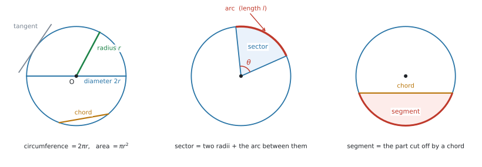
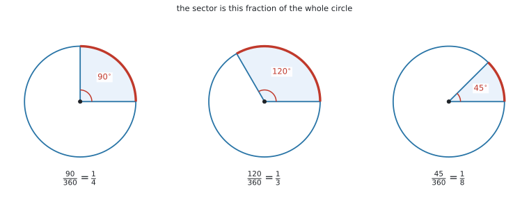
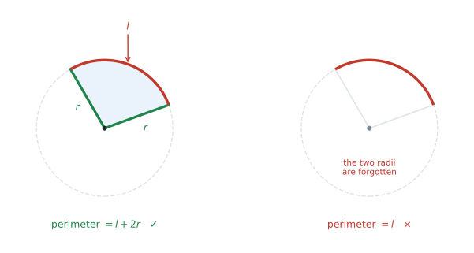
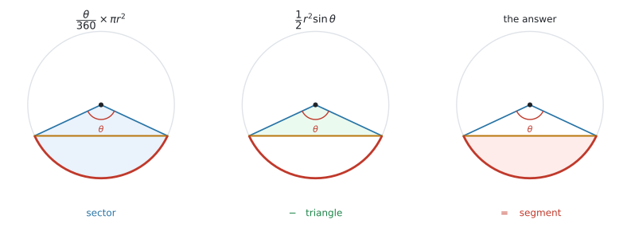
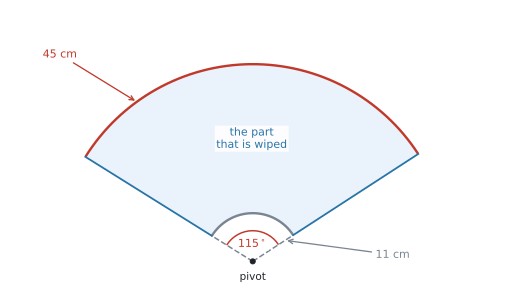

# SL 3.4 — The circle: length of an arc, area of a sector（円 — 弧の長さと扇形の面積） {#sec-sl-3-4}

::: {.callout-note}
## What you should be able to do
- **circle**（円）の各部の名前 — **arc**、**sector**、**chord**、**segment** など — が英語で分かる。
- **弧の長さ** $l$ と**扇形の面積** $A$ を、公式集の2つの式で求められる。
- 逆に、$l$ や $A$ が与えられたとき、**中心角 $\theta$ や半径 $r$ を求められる**。
- **扇形の周（perimeter）**を求められる。← 公式集にありません
- 扇形と三角形を組み合わせた形（**segment**・複合図形）の面積を求められる。
- ワイパー・花壇・防犯カメラのような**文脈のある問題**で使える。
:::

::: {.callout-important}
## Formula booklet に載っているもの
公式集の Topic 3 の欄に、**3.4 として2つ**印刷されています。

$$
l = \frac{\theta}{360} \times 2\pi r
$$ {#eq-sl34-arc}

$$
A = \frac{\theta}{360} \times \pi r^{2}
$$ {#eq-sl34-area}

どちらにも、次の1行が添えられています。

> where $\theta$ is the angle measured in degrees, $r$ is the radius

**2つとも試験で配られます。覚える必要はありません。** 覚えるべきなのは、**どちらを使うか**と、**この2つだけでは足りない場面がある**ことです。
:::

::: {.callout-warning}
## 扇形の「周」の式は、公式集にありません ★★
$$
\text{perimeter} = l + 2r
$$

**弧だけでは、扇形を一周できません。** 半径2本を足すのを忘れる誤りが、この項目で一番多いものです。くわしくは[3節](#perimeter)で扱います。
:::

::: {.callout-tip}
## Radians は SL では要りません ★
シラバスの Guidance 欄に、この1行だけが書かれています。

> **Radians are not required at SL.**

つまり、$\theta$ は**いつも度（degree）**です。電卓も Degree にしておいてください。

```
ctrl + doc → Document Settings → Angle: Degree
```

（radian は HL の AHL 3.7 で出てきます。SL の試験には出ません。）
:::

## The idea

この項目は、**円の一部分の長さと面積**を求めるものです。使う式は上の2つだけです。

### 1. 円の各部の名前は、Prior learning です ★★ {#names}

シラバスの SL 3.4 の欄は、たった1行しかありません。

> **The circle: length of an arc; area of a sector.**

では `arc` や `sector` という言葉はどこで教わるのかというと、シラバスの前のほうにある **Prior learning topics**（入学までに知っているものとされる内容）の欄です。

> The circle, its centre and radius, area and circumference. The terms **diameter, arc, sector, chord, tangent and segment**

::: {.callout-important}
## Prior learning は「教わらないまま試験に出る」ところです ★★
Prior learning は**授業でやり直されないことが多い**のに、試験では**知っている前提**で問題文に出てきます。

日本の中学で「弦」「弧」「扇形」を習っていても、**英語で読めなければ同じことです。** ここで名前を押さえておいてください。
:::

{#fig-sl34-parts width=100%}

| English | 日本語 | どこのことか |
|---|---|---|
| **centre** | 中心 | 円の真ん中の点（$O$ と書くことが多い） |
| **radius**（複数形 **radii**） | 半径 | 中心から円周までの長さ |
| **diameter** | 直径 | 中心を通る、はしからはしまで。$2r$ |
| **circumference** | 円周 | 円のまわり全部。$2\pi r$ |
| **arc** | 弧 | 円周の**一部** |
| **sector** | 扇形（おうぎがた） | 半径2本と弧で囲まれた部分 |
| **chord** | 弦 | 円周上の2点を結ぶ**まっすぐな**線 |
| **segment** | 弓形（きゅうけい） | 弦で切り取られた部分 |
| **tangent** | 接線 | 円に1点で触れる直線 |

: 円の各部の名前 {#tbl-sl34-parts}

::: {.callout-warning}
## sector と segment は、別のものです ★★
どちらも「円の一部分」ですが、**切り口が違います。**

- **sector** … **半径2本**で切る（ピザの1切れ）
- **segment** … **弦1本**で切る（円をまっすぐ切り落とした形）

問題文が `sector` なのか `segment` なのかで、**やることが変わります。**
:::

#### minor と major {#minor-major}

同じ2点で円を切ると、**小さいほう**と**大きいほう**の2つに分かれます。

- **minor sector / minor arc / minor segment** … 小さいほう
- **major sector / major arc / major segment** … 大きいほう

**major のほうの中心角は、$360^\circ$ から引いて出します。** 中心角が $75^\circ$ の minor sector に対して、major sector の中心角は $360 - 75 = 285^\circ$ です。

### 2. どちらの式も「円全体の $\dfrac{\theta}{360}$ 倍」です ★★ {#fraction}

円全体では、まわりの長さは $2\pi r$、面積は $\pi r^{2}$ です。**知りたいのは、そのうちの一部分です。**

そこで、**「一周のうち、どれだけの角を占めているか」**を分数にします。一周は $360^\circ$ なので、中心角が $\theta$ なら、その割合は $\dfrac{\theta}{360}$ です。

{#fig-sl34-fraction width=100%}

この分数を、円全体の長さ・面積に**掛けるだけ**です。それが @eq-sl34-arc と @eq-sl34-area です。

#### 記号の意味 {#symbols}

| 記号 | 読み方 | 何を表すか |
|---|---|---|
| $\theta$ | theta（シータ） | **中心角**。円の中心のところにある角。**度**で入れる |
| $r$ | | **半径**。直径が与えられたときは、$2$ で割ってから使う |
| $l$ | ell | **弧の長さ**。長さなので単位は cm、m など |
| $A$ | | **扇形の面積**。面積なので単位は cm$^2$、m$^2$ など |

: SL 3.4 で使う記号 {#tbl-sl34-symbols}

::: {.callout-important}
## $\theta$ は「中心にある角」です ★★
扇形にはほかにも角がありますが、この2つの式で使えるのは**中心の角だけ**です。

図に角が書き込まれているときは、**その角の頂点が中心 $O$ にあるか**を必ず確かめてください。
:::

#### 具体例で確かめます {#check}

半径 $r = 6$ cm、中心角 $\theta = 90^\circ$ の扇形で考えます。$90^\circ$ は一周のちょうど $\dfrac{1}{4}$ です。

$$
l = \frac{90}{360} \times 2\pi(6) = \frac{1}{4} \times 12\pi = 3\pi = 9.42\ldots
$$

$$
A = \frac{90}{360} \times \pi(6)^{2} = \frac{1}{4} \times 36\pi = 9\pi = 28.3\ldots
$$

**円全体で確かめます。** 円周は $12\pi = 37.7$、その $\dfrac{1}{4}$ は $9.42$ ✓　面積は $36\pi = 113$、その $\dfrac{1}{4}$ は $28.3$ ✓

::: {.callout-tip}
## どちらの式か迷ったら、単位で決まります ★
- 聞かれているのが**長さ**（cm、m）→ 弧の長さ @eq-sl34-arc。$r$ は**1乗**
- 聞かれているのが**面積**（cm$^2$、m$^2$）→ 扇形の面積 @eq-sl34-area。$r$ は**2乗**

$r$ が2乗になっているほうが面積です。**面積の式に $2\pi r$ を使ってしまう**のが、次によくある誤りです。
:::

### 3. 扇形の周（perimeter of a sector）★★ {#perimeter}

`Find the perimeter of the sector.` と聞かれたら、**弧の長さだけでは足りません。**

扇形のまわりを指でなぞってみてください。弧を通ったあと、**半径を2本たどらないと元に戻れません。**

{#fig-sl34-perimeter width=96%}

$$
\text{perimeter} = l + 2r = \frac{\theta}{360} \times 2\pi r + 2r
$$ {#eq-sl34-perim}

::: {.callout-warning}
## この式は公式集にありません ★★
公式集にあるのは $l$ と $A$ の2つだけです。**周の式は自分で組み立てます。**

とはいえ、覚えるのは「**$+\,2r$**」の1か所だけです。図を見て「一周できるか」を確かめれば、その場で作れます。
:::

`perimeter` のほかに、`the total length of the edge`、`the length of the boundary` のような言い方でも聞かれます。**「まわりの長さ」と言われたら、半径2本を思い出してください。**

### 4. 逆に使う — $l$ や $A$ から $\theta$ や $r$ を出す {#backwards}

$\theta$ と $r$ が分かっていて $l$ や $A$ を出す問題だけではありません。**答えのほうが与えられて、$\theta$ か $r$ を聞かれる**問題も、同じくらいよく出ます。

やることは、**式に数を入れてから、その方程式を解く**ことです。

| 与えられているもの | 求めるもの | やること |
|---|---|---|
| $r$ と $l$ | $\theta$ | @eq-sl34-arc に入れて $\theta$ について解く |
| $r$ と $A$ | $\theta$ | @eq-sl34-area に入れて $\theta$ について解く |
| $\theta$ と $l$ | $r$ | @eq-sl34-arc に入れて $r$ について解く |
| $\theta$ と $A$ | $r$ | $r^{2}$ を出してから、**最後に $\sqrt{\ }$** |

: 逆向きに使うときの手順 {#tbl-sl34-back}

::: {.callout-tip}
## 数を先に入れてから解くほうが安全です ★
公式を文字のまま変形して $\theta = \dfrac{360\,l}{2\pi r}$ を作ってもかまいませんが、**移項の途中で間違えやすい**です。

**先に数を入れて**しまえば、残るのは「$x$ の1次方程式」だけになります。
:::

### 5. segment（弓形）の面積 {#segment-area}

`segment` の面積は、**扇形から三角形を引いて**出します。

{#fig-sl34-segment width=100%}

引く三角形は、**2辺が半径**の三角形です。ですから [SL 3.2](sl-3-2.qmd) の面積の式 $A = \dfrac{1}{2}ab\sin C$ で、$a = b = r$、$C = \theta$ とすればよいことになります。

$$
\text{segment} = \frac{\theta}{360}\times \pi r^{2} \; - \; \frac{1}{2}r^{2}\sin\theta
$$ {#eq-sl34-segment}

::: {.callout-important}
## この式は覚えなくて構いません ★
$\dfrac{1}{2}ab\sin C$ は**公式集にあります**（SL 3.2 の欄）。$\dfrac{\theta}{360}\times\pi r^{2}$ も公式集にあります。

覚えるのは式ではなく、**「扇形から三角形を引く」という手順のほう**です。図をかけば、引き算だと分かります。
:::

## Why it works

なぜ $\dfrac{\theta}{360}$ を掛けるだけでよいのかを説明します。

円は、**どこを見ても同じ形**です。中心のまわりに回しても、円は変わりません。ですから、中心角が2倍になれば弧も2倍、3倍になれば弧も3倍になります。**中心角と弧の長さは、比例します。**

面積も同じです。中心角が2倍になれば、扇形の面積も2倍になります。

比例するものは、**「全体のうちどれだけか」という分数を掛ければ出せます。** 一周 $360^\circ$ のうち $\theta$ を占めているのだから、その分数は $\dfrac{\theta}{360}$ です。

$$
\frac{l}{2\pi r} = \frac{\theta}{360}, \qquad \frac{A}{\pi r^{2}} = \frac{\theta}{360}
$$

この2つを $l$、$A$ について書き直したものが、公式集の2つの式です。**新しいことは何もしていません。**

## Worked examples

::: {.callout-note appearance="simple"}
問題文は英語です。意味が理解できなかったら、問題文の下の「**日本語訳**」を開いてください。解説は日本語です。
:::

::: {#exm-sl34-basic}
[A sector of a circle has radius $12$ cm and an angle of $65^\circ$ at the centre.]{.q-en}

**(a)** [Find the length of the arc, correct to three significant figures.]{.q-en}

**(b)** [Find the area of the sector, correct to three significant figures.]{.q-en}

**(c)** [Find the perimeter of the sector, correct to three significant figures.]{.q-en}

<details class="jp-trans">
<summary>日本語訳</summary>

ある扇形は、半径が $12$ cm、中心角が $65^\circ$ です。

**(a)** 弧の長さを、有効数字3桁で求めなさい。

**(b)** 扇形の面積を、有効数字3桁で求めなさい。

**(c)** 扇形の周の長さを、有効数字3桁で求めなさい。

</details>

---

**(a)** 聞かれているのは**長さ**なので、@eq-sl34-arc です。$r$ は1乗のほうを使います。

$$
l = \frac{65}{360} \times 2\pi(12) = 13.6135\ldots
$$

有効数字3桁で **$13.6$ cm** です。

**(b)** 聞かれているのは**面積**なので、@eq-sl34-area です。$r$ は2乗になります。

$$
A = \frac{65}{360} \times \pi(12)^{2} = 81.6814\ldots
$$

有効数字3桁で **$81.7$ cm$^2$** です。

**(c)** [周には、半径2本が入ります](#perimeter)。**(a)** で出した弧の長さに $2r = 24$ を足します。

$$
\text{perimeter} = 13.6135\ldots + 24 = 37.6135\ldots
$$

有効数字3桁で **$37.6$ cm** です。

::: {.callout-tip}
## (c) で $13.6$ を使わないでください ★★
**(a)** の答えを $13.6$ に丸めてから足すと $37.6$ になり、今回はたまたま同じ答えになります。**ですが、それは運がよかっただけです。**

丸めた数を次の計算に使うと、**桁が増えたときにずれます。** 電卓の中の $13.6135\ldots$ をそのまま使ってください。
:::

**検算。** 一周の $\dfrac{65}{360} = 0.18$ ぶんなので、円周 $24\pi = 75.4$ の約 $18\%$ で $13.6$ ✓　円の面積 $144\pi = 452$ の約 $18\%$ で $81.7$ ✓

::: {.callout-note}
## 解答例（答案用紙にはこう書く）
**(a)** $l = \dfrac{65}{360}\times 2\pi(12) = 13.6$ cm (3 s.f.)

**(b)** $A = \dfrac{65}{360}\times \pi(12)^{2} = 81.7$ cm$^2$ (3 s.f.)

**(c)** $P = 13.6135\ldots + 2(12) = 37.6$ cm (3 s.f.)
:::
:::

::: {#exm-sl34-findangle}
[An arc of a circle of radius $9$ cm has length $20$ cm.]{.q-en}

**(a)** [Find the angle that the arc makes at the centre of the circle, correct to three significant figures.]{.q-en}

**(b)** [Hence find the area of the corresponding sector, correct to three significant figures.]{.q-en}

<details class="jp-trans">
<summary>日本語訳</summary>

半径 $9$ cm の円の弧の長さが $20$ cm です。

**(a)** この弧が円の中心につくる角を、有効数字3桁で求めなさい。

**(b)** これを使って、対応する扇形の面積を有効数字3桁で求めなさい。

</details>

---

**(a)** [与えられているのは $r$ と $l$、聞かれているのは $\theta$](#backwards) です。@eq-sl34-arc に**数を先に入れます**。

$$
20 = \frac{\theta}{360} \times 2\pi(9)
$$

$2\pi(9) = 56.548\ldots$ なので、右辺は $\dfrac{\theta}{360} \times 56.548\ldots$ です。両辺を $56.548\ldots$ で割ってから、$360$ を掛けます。

$$
\theta = \frac{20 \times 360}{2\pi(9)} = 127.323\ldots
$$

有効数字3桁で **$127^\circ$** です。

**(b)** `Hence` なので、**(a)** の角を使います。ここでも $127$ ではなく **$127.323\ldots$** を使ってください。

$$
A = \frac{127.323\ldots}{360} \times \pi(9)^{2} = 90.0
$$

有効数字3桁で **$90.0$ cm$^2$** です。

::: {.callout-tip}
## 答えが $360$ を超えたら、どこかが違います ★
$\theta$ は円の中心の角なので、**$0^\circ$ から $360^\circ$ のあいだ**にしかなりません。

$127^\circ$ は一周の3分の1くらいです。円周は $56.5$ cm、その3分の1は約 $18.8$ cm。弧の $20$ cm と近いので、つじつまが合っています ✓
:::

::: {.callout-note}
## 解答例（答案用紙にはこう書く）
**(a)** $20 = \dfrac{\theta}{360}\times 2\pi(9)$, so $\theta = \dfrac{20\times 360}{2\pi(9)} = 127^\circ$ (3 s.f.)

**(b)** $A = \dfrac{127.323\ldots}{360}\times \pi(9)^{2} = 90.0$ cm$^2$ (3 s.f.)
:::
:::

::: {#exm-sl34-findradius}
[A sector of a circle has an angle of $140^\circ$ at the centre and an area of $95$ cm$^2$.]{.q-en}

**(a)** [Find the radius of the circle, correct to three significant figures.]{.q-en}

**(b)** [Find the length of the arc of this sector, correct to three significant figures.]{.q-en}

<details class="jp-trans">
<summary>日本語訳</summary>

ある扇形は、中心角が $140^\circ$、面積が $95$ cm$^2$ です。

**(a)** 円の半径を、有効数字3桁で求めなさい。

**(b)** この扇形の弧の長さを、有効数字3桁で求めなさい。

</details>

---

**(a)** 与えられているのは $\theta$ と $A$、聞かれているのは $r$ です。@eq-sl34-area に数を入れます。

$$
95 = \frac{140}{360} \times \pi r^{2}
$$

$\dfrac{140}{360}\times\pi = 1.2217\ldots$ なので、$95 = 1.2217\ldots \times r^{2}$ です。

$$
r^{2} = \frac{95}{1.2217\ldots} = 77.758\ldots
$$

**ここで終わりではありません。** $r^{2}$ が出ただけなので、最後に平方根を取ります。

$$
r = \sqrt{77.758\ldots} = 8.8180\ldots
$$

有効数字3桁で **$8.82$ cm** です。

**(b)** **(a)** で $r = 8.8180\ldots$ が出たので、@eq-sl34-arc に入れます。

$$
l = \frac{140}{360} \times 2\pi(8.8180\ldots) = 21.546\ldots
$$

有効数字3桁で **$21.5$ cm** です。

::: {.callout-warning}
## $\sqrt{\ }$ を忘れると $77.8$ と書いてしまいます ★★
面積から半径を出すときは、**$r^{2}$ が先に出ます。** ここで止めてしまう答案がとても多いところです。

$r^{2}$ という文字が式に残っているかどうかを、必ず見てください。
:::

**検算。** $\dfrac{140}{360}\times\pi(8.818)^{2} = 95.0$ ✓

::: {.callout-note}
## 解答例（答案用紙にはこう書く）
**(a)** $95 = \dfrac{140}{360}\times \pi r^{2}$, so $r^{2} = 77.758\ldots$ and $r = 8.82$ cm (3 s.f.)

**(b)** $l = \dfrac{140}{360}\times 2\pi(8.8180\ldots) = 21.5$ cm (3 s.f.)
:::
:::

::: {#exm-sl34-segment}
[The points $A$ and $B$ lie on a circle with centre $O$ and radius $10$ cm. The angle $AOB$ is $80^\circ$.]{.q-en}

**(a)** [Find the area of the sector $OAB$, correct to three significant figures.]{.q-en}

**(b)** [Find the area of the triangle $OAB$, correct to three significant figures.]{.q-en}

**(c)** [Hence find the area of the minor segment cut off by the chord $AB$, correct to three significant figures.]{.q-en}

<details class="jp-trans">
<summary>日本語訳</summary>

点 $A$ と $B$ は、中心 $O$、半径 $10$ cm の円の上にあります。角 $AOB$ は $80^\circ$ です。

**(a)** 扇形 $OAB$ の面積を、有効数字3桁で求めなさい。

**(b)** 三角形 $OAB$ の面積を、有効数字3桁で求めなさい。

**(c)** これを使って、弦 $AB$ が切り取る minor segment の面積を、有効数字3桁で求めなさい。

</details>

---

この問題は、[5節](#segment-area)の手順を (a)(b)(c) に分けて聞いています。**設問の並びが、そのまま手順です。**

**(a)** 扇形なので @eq-sl34-area です。

$$
A_{\text{sector}} = \frac{80}{360} \times \pi(10)^{2} = 69.813\ldots
$$

有効数字3桁で **$69.8$ cm$^2$** です。

**(b)** 三角形 $OAB$ は、**2辺が半径**（どちらも $10$ cm）で、そのあいだの角が $80^\circ$ です。[SL 3.2](sl-3-2.qmd) の面積の式を使います。

$$
A_{\text{triangle}} = \frac{1}{2}(10)(10)\sin 80^\circ = 49.240\ldots
$$

有効数字3桁で **$49.2$ cm$^2$** です。

**(c)** segment は、**扇形から三角形を引いた残り**です。

$$
A_{\text{segment}} = 69.813\ldots - 49.240\ldots = 20.572\ldots
$$

有効数字3桁で **$20.6$ cm$^2$** です。

::: {.callout-tip}
## 引き算の答えは、必ず小さくなります ★
segment は扇形の**一部分**なので、$20.6 < 69.8$ でなければおかしいです。

もし引き算の答えがマイナスになったら、**引く順番が逆**です。いつも「扇形 $-$ 三角形」です。
:::

::: {.callout-note}
## 解答例（答案用紙にはこう書く）
**(a)** $A_{\text{sector}} = \dfrac{80}{360}\times \pi(10)^{2} = 69.8$ cm$^2$ (3 s.f.)

**(b)** $A_{\text{triangle}} = \dfrac{1}{2}(10)(10)\sin 80^\circ = 49.2$ cm$^2$ (3 s.f.)

**(c)** $A_{\text{segment}} = 69.813\ldots - 49.240\ldots = 20.6$ cm$^2$ (3 s.f.)
:::
:::

::: {#exm-sl34-wiper}
[A windscreen wiper on a car has a rubber blade attached to an arm. The blade covers the part of the arm between $11$ cm and $45$ cm from the pivot. As the arm turns, it sweeps through an angle of $115^\circ$.]{.q-en}

**(a)** [Find the area of the windscreen that is wiped, correct to three significant figures.]{.q-en}

**(b)** [The windscreen has an area of $4800$ cm$^2$. Find the percentage of the windscreen that is wiped, correct to three significant figures.]{.q-en}

**(c)** [Comment on whether one wiper of this size is enough for the driver.]{.q-en}

<details class="jp-trans">
<summary>日本語訳</summary>

車のワイパーは、アームにゴムのブレードが付いています。ブレードは、支点（pivot）から $11$ cm のところから $45$ cm のところまでに付いています。アームが動くと、$115^\circ$ の角を掃きます。

**(a)** 拭かれるフロントガラスの面積を、有効数字3桁で求めなさい。

**(b)** フロントガラスの面積は $4800$ cm$^2$ です。拭かれる部分の割合を百分率で、有効数字3桁で求めなさい。

**(c)** この大きさのワイパー1本で運転者に十分かどうか、コメントしなさい。

</details>

---

{#fig-sl34-wiper width=82%}

**(a)** **まず、どんな形かを決めます。** 拭かれるのは扇形そのものではありません。**真ん中の $11$ cm ぶんは拭かれない**ので、扇形にあいた穴があります。

ですから、**大きい扇形から小さい扇形を引きます。**

$$
A = \frac{115}{360} \times \pi(45)^{2} \; - \; \frac{115}{360} \times \pi(11)^{2}
$$

$\dfrac{115}{360}$ が共通なので、まとめて書けます。

$$
A = \frac{115}{360} \times \pi\left(45^{2} - 11^{2}\right) = \frac{115}{360} \times \pi(1904) = 1910.78\ldots
$$

有効数字3桁で **$1910$ cm$^2$** です。

**(b)** 拭かれる面積を、ガラス全体で割ります。

$$
\frac{1910.78\ldots}{4800} \times 100 = 39.808\ldots
$$

有効数字3桁で **$39.8\%$** です。

**(c)** 数値だけでは点になりません。**(b) の数を使って、英語で一文書いてください。**

::: {.model-answer}
**試験ではこう書く**

*One wiper clears only about $40\%$ of the windscreen, so about $60\%$ of the glass stays wet. One wiper of this size is not enough for the driver to see clearly, so a second wiper is needed.*
:::

（ワイパー1本ではガラスの約 $40\%$ しか拭けないので、約 $60\%$ は濡れたままです。運転者がはっきり見るには1本では足りないので、2本目が必要です。）

::: {.callout-important}
## `Comment on` では、必ず数を引用します ★★
`Comment on ...` に「不十分です」とだけ書いても点になりません。

**(b) で出した $39.8\%$（または「約 $40\%$」）を文の中に入れてください。** 自分の計算結果を根拠にしている、と示すのが目的です。
:::

::: {.callout-note}
## 解答例（答案用紙にはこう書く）
**(a)** $A = \dfrac{115}{360}\times \pi\left(45^{2} - 11^{2}\right) = 1910$ cm$^2$ (3 s.f.)

**(b)** $\dfrac{1910.78\ldots}{4800}\times 100 = 39.8\%$ (3 s.f.)

**(c)** *One wiper clears only about $40\%$ of the windscreen, so about $60\%$ of the glass stays wet. One wiper of this size is not enough for the driver to see clearly, so a second wiper is needed.*
:::
:::

## Common errors

::: {.callout-warning}
## 弧の長さの式と、面積の式を取り違える ★★
$2\pi r$ と $\pi r^{2}$ は見た目が似ています。**公式集を見ながらでも、行を取り違えます。**

見分け方は $r$ の指数です。**$r$ が2乗なら面積、1乗なら長さ**です。

聞かれているものの**単位**（cm か cm$^2$ か）と合っているかを、答えを書く前に見てください。
:::

::: {.callout-warning}
## 扇形の周に、半径2本を足し忘れる ★★
`perimeter` と聞かれて、弧の長さだけを書いてしまう誤りです。**この項目で一番多いものです。**

原因は、$l + 2r$ が**公式集にない**ことです。$l$ と $A$ は公式集を見れば出せるので、$+\,2r$ だけが抜け落ちます。

図の上を指でなぞって、**元の場所に戻れるか**を確かめてください。
:::

::: {.callout-warning}
## diameter を、そのまま $r$ に入れる ★★
問題文に `a circle of diameter 36 cm` とあったとき、$r = 36$ としてしまう誤りです。

**$r = 18$ です。** 面積では2乗されるので、答えは4倍ずれます。

`diameter` という語を見たら、**先に $2$ で割って、図か式のわきに $r = 18$ と書いてしまう**のが安全です。
:::

::: {.callout-warning}
## 電卓が Radian になっている ★★
弧の長さと面積の式には $\sin$ が出てこないので、**Degree か Radian かで答えは変わりません。**

ですが **segment の問題**では $\dfrac{1}{2}r^{2}\sin\theta$ を使います。ここで Radian のままだと、**三角形の面積だけが違う値**になります。

しかも答えは「それらしい数」で出てくるので、**気づきません。** 試験の最初に Degree を確かめてください。
:::

::: {.callout-warning}
## 途中の値を丸めてから、次の設問に使う ★★
$\theta = 127.323\ldots$ を $127$ に丸めてから面積を出す、というやり方です。

$\theta$ を丸めると、**面積では丸め誤差が拡大します。** 有効数字3桁の答えが合わなくなることがあります。

**丸めるのは、答えを書くときだけ**です。
:::

::: {.callout-warning}
## major sector なのに、書いてある角をそのまま使う ★★
`Find the area of the major sector.` と言われたのに、図に書いてある $75^\circ$ をそのまま使ってしまう誤りです。

**major のほうの角は $360 - 75 = 285^\circ$ です。**

見分け方があります。**major の答えは、円の面積の半分より大きく**なります。半分より小さければ、$360$ から引き忘れています。
:::

::: {.callout-warning}
## segment なのに、三角形を引き忘れる ★★
`segment` と `sector` は、英語で1文字違いです。**問題文を読み飛ばすと取り違えます。**

`chord`（弦）という語が問題文にあれば、まず segment を疑ってください。

引き算をしたあとは、**答えが扇形の面積より小さい**ことを確かめてください。
:::

::: {.callout-warning}
## 「半円」「四分円」で $\theta$ を書かずに進む ★
`semicircle`（半円）は $\theta = 180^\circ$、`quarter circle`（四分円）は $\theta = 90^\circ$ です。

言葉のまま計算しようとすると混乱します。**まず $\theta$ を数で書いてしまう**と、あとはいつもの式になります。

半円の周は、弧 $\pi r$ に**直径 $2r$** を足したものです。ここでも $+\,2r$ を忘れないでください。
:::

::: {.callout-warning}
## 単位を書かない、または cm と cm$^2$ を混ぜる ★
長さの答えに cm$^2$、面積の答えに cm と書いてしまう誤りです。

**単位は答えの一部です。** 書き終えたら、「長さを聞かれたのか、面積を聞かれたのか」をもう一度読んでください。
:::

## Using your GDC (TI-Nspire CX II)

この項目では、電卓は**計算機として**使います。特別な機能は要りません。そのぶん、**入れ方**で差がつきます。

### 1. 角の設定を確かめる ★★

```
ctrl + doc → Document Settings → Angle: Degree
```

弧の長さと面積の式だけなら影響しませんが、**segment の $\sin\theta$ で効いてきます。** Topic 3 のあいだは Degree のままにしておいてください。

### 2. $\pi$ は $3.14$ と打たない ★★

$3.14$ と打つと、有効数字3桁の答えが最後の桁でずれることがあります。

**電卓の $\pi$ をそのまま入れてください。** キーパッドの $\pi$ か、記号のパレットから入れられます。

### 3. 1行で入れて、途中で丸めない ★★

例題1の (a) なら、こう入れます。

```
65 / 360 × 2 × π × 12
```

$\dfrac{65}{360} = 0.180555\ldots$ を先に出して $0.181$ と書き写す、ということをしないでください。**1行で入れれば、丸め誤差はそもそも起きません。**

### 4. 前の答えを次に使うときは `ans` {#ans}

例題1の (c) のように、前の答えをそのまま使いたいときは、$13.6$ と打ち直さずに **`ans`**（直前の答え）を使います。

```
ans + 2 × 12
```

`ans` は ctrl と $(-)$ で入ります。**電卓の中の全部の桁が、そのまま次に渡ります。**

### 5. 逆算は、まず手で解く ★

$\theta$ や $r$ を求める問題では、**式に数を入れて1次方程式にしてから**電卓に入れるのが確実です。

$$
20 = \frac{\theta}{360}\times 2\pi(9) \quad \Rightarrow \quad \theta = \frac{20 \times 360}{2\pi \times 9}
$$

右側の形にしてから、1行で入れます。

**検算に `nSolve` が使えます。** Calculator ページで、次のように入れます。

```
nSolve(20 = t / 360 × 2 × π × 9, t)
```

`nSolve` は menu の Algebra からも呼び出せます。**手で解いた答えと一致するかを見る**のに向いています。

### 6. 答えの単位は、電卓には出ません

電卓が返すのは数だけです。**cm なのか cm$^2$ なのかは、自分で書きます。** ここを落とす答案が毎年あります。

## Exercises

::: {.callout-note appearance="simple"}
各問題に、折りたたみが3つ付いています。**日本語訳**、**解答例**（答案用紙に書くべきこと。英語です）、**解説**（なぜそうなるか。日本語です）。

まず自分で解いて、次に解答例と見くらべてください。**解説は、合わなかったときだけ開けば十分です。**
:::

::: {.exercise-block}

[1]{.ex-no} [A sector of a circle has radius $8$ cm and an angle of $45^\circ$ at the centre.]{.q-en}

**(a)** [Find the length of the arc, correct to three significant figures.]{.q-en}

**(b)** [Find the area of the sector, correct to three significant figures.]{.q-en}

<details class="jp-trans">
<summary>日本語訳</summary>

ある扇形は、半径が $8$ cm、中心角が $45^\circ$ です。

**(a)** 弧の長さを、有効数字3桁で求めなさい。

**(b)** 扇形の面積を、有効数字3桁で求めなさい。

</details>

::: {.callout-note collapse="true"}
## 解答例（答案用紙に書くこと）
**(a)** $l = \dfrac{45}{360}\times 2\pi(8) = 6.28$ cm (3 s.f.)

**(b)** $A = \dfrac{45}{360}\times \pi(8)^{2} = 25.1$ cm$^2$ (3 s.f.)
:::

::: {.callout-tip collapse="true"}
## 解説
$45^\circ$ は一周の $\dfrac{1}{8}$ です。

**(a)** 円周は $16\pi = 50.27$。その $\dfrac{1}{8}$ は $6.28$ ✓

**(b)** 円の面積は $64\pi = 201.1$。その $\dfrac{1}{8}$ は $25.1$ ✓

**分数が簡単な角のときは、この確かめ方が速いです。**
:::

::: {.ex-sep}
:::

[2]{.ex-no} [A sector of a circle has radius $15$ cm and an angle of $200^\circ$ at the centre.]{.q-en}

**(a)** [Find the length of the arc, correct to three significant figures.]{.q-en}

**(b)** [Find the area of the sector, correct to three significant figures.]{.q-en}

**(c)** [Find the perimeter of the sector, correct to three significant figures.]{.q-en}

<details class="jp-trans">
<summary>日本語訳</summary>

ある扇形は、半径が $15$ cm、中心角が $200^\circ$ です。

**(a)** 弧の長さを、有効数字3桁で求めなさい。

**(b)** 扇形の面積を、有効数字3桁で求めなさい。

**(c)** 扇形の周の長さを、有効数字3桁で求めなさい。

</details>

::: {.callout-note collapse="true"}
## 解答例（答案用紙に書くこと）
**(a)** $l = \dfrac{200}{360}\times 2\pi(15) = 52.4$ cm (3 s.f.)

**(b)** $A = \dfrac{200}{360}\times \pi(15)^{2} = 393$ cm$^2$ (3 s.f.)

**(c)** $P = 52.359\ldots + 2(15) = 82.4$ cm (3 s.f.)
:::

::: {.callout-tip collapse="true"}
## 解説
$200^\circ$ は $180^\circ$ より大きいので、**半円より大きい扇形**です。

**(b)** 円の面積は $225\pi = 706.9$。その半分より大きい $393$ になっているので、つじつまが合っています ✓

**(c)** で $2(15) = 30$ を足すのを忘れると $52.4$ と書いてしまいます。[半径2本](#perimeter)です。
:::

::: {.ex-sep}
:::

[3]{.ex-no} [An arc of a circle of radius $6$ cm has length $14$ cm. Find the angle that the arc makes at the centre of the circle, correct to three significant figures.]{.q-en}

<details class="jp-trans">
<summary>日本語訳</summary>

半径 $6$ cm の円の弧の長さが $14$ cm です。この弧が円の中心につくる角を、有効数字3桁で求めなさい。

</details>

::: {.callout-note collapse="true"}
## 解答例（答案用紙に書くこと）
$14 = \dfrac{\theta}{360}\times 2\pi(6)$

$\theta = \dfrac{14\times 360}{2\pi(6)} = 134^\circ$ (3 s.f.)
:::

::: {.callout-tip collapse="true"}
## 解説
[数を先に入れてから解きます](#backwards)。

**確かめ方**：円周は $12\pi = 37.7$ cm。弧が $14$ cm なので、一周の $\dfrac{14}{37.7} = 0.371$ ぶんです。$0.371 \times 360 = 134$ ✓

**この確かめ方は、そのまま別解にもなります。**
:::

::: {.ex-sep}
:::

[4]{.ex-no} [A sector of a circle of radius $7$ cm has area $60$ cm$^2$. Find the angle at the centre of the sector, correct to three significant figures.]{.q-en}

<details class="jp-trans">
<summary>日本語訳</summary>

半径 $7$ cm の扇形の面積が $60$ cm$^2$ です。扇形の中心角を、有効数字3桁で求めなさい。

</details>

::: {.callout-note collapse="true"}
## 解答例（答案用紙に書くこと）
$60 = \dfrac{\theta}{360}\times \pi(7)^{2}$

$\theta = \dfrac{60\times 360}{\pi(7)^{2}} = 140^\circ$ (3 s.f.)
:::

::: {.callout-tip collapse="true"}
## 解説
面積のほうの式なので、$r$ は**2乗**です。$\pi(7)^{2} = 153.9$。

**確かめ方**：円の面積は $153.9$ cm$^2$。扇形が $60$ cm$^2$ なので、一周の $\dfrac{60}{153.9} = 0.390$ ぶん。$0.390\times 360 = 140$ ✓

$140^\circ$ は $180^\circ$ より小さいので、**半円より小さい扇形**です。面積も円の半分（$77.0$）より小さい $60$ になっています ✓
:::

::: {.ex-sep}
:::

[5]{.ex-no} [A sector of a circle has an angle of $72^\circ$ at the centre. The length of its arc is $25$ cm. Find the radius of the circle, correct to three significant figures.]{.q-en}

<details class="jp-trans">
<summary>日本語訳</summary>

ある扇形の中心角は $72^\circ$ で、弧の長さは $25$ cm です。円の半径を、有効数字3桁で求めなさい。

</details>

::: {.callout-note collapse="true"}
## 解答例（答案用紙に書くこと）
$25 = \dfrac{72}{360}\times 2\pi r$

$r = \dfrac{25\times 360}{72\times 2\pi} = 19.9$ cm (3 s.f.)
:::

::: {.callout-tip collapse="true"}
## 解説
$\dfrac{72}{360} = \dfrac{1}{5}$ なので、この弧は**円周のちょうど5分の1**です。

つまり円周は $25\times 5 = 125$ cm。$2\pi r = 125$ から $r = \dfrac{125}{2\pi} = 19.9$ ✓

**弧の長さの式なので、$r$ は1乗です。** ここで平方根を取ってしまうと $4.46$ になります。
:::

::: {.ex-sep}
:::

[6]{.ex-no} [The perimeter of a sector of a circle is $44$ cm. The radius of the circle is $10$ cm. Find the angle at the centre of the sector, correct to three significant figures.]{.q-en}

<details class="jp-trans">
<summary>日本語訳</summary>

ある扇形の周の長さは $44$ cm です。円の半径は $10$ cm です。扇形の中心角を、有効数字3桁で求めなさい。

</details>

::: {.callout-note collapse="true"}
## 解答例（答案用紙に書くこと）
$P = l + 2r$, so $l = 44 - 2(10) = 24$ cm

$24 = \dfrac{\theta}{360}\times 2\pi(10)$

$\theta = \dfrac{24\times 360}{2\pi(10)} = 138^\circ$ (3 s.f.)
:::

::: {.callout-tip collapse="true"}
## 解説
**周から始まる問題です。** いきなり $44$ を弧の長さの式に入れないでください。

[周は $l + 2r$](#perimeter) なので、**先に半径2本ぶん（$20$ cm）を引いて**、弧の長さ $24$ cm を出します。そこからはいつもの逆算です。

$44$ をそのまま入れると $\theta = 252^\circ$ になります。**この形の問題では、$\theta$ が大きくなりすぎたら周から引き忘れています。**
:::

::: {.ex-sep}
:::

[7]{.ex-no} [A circle has centre $O$ and radius $11$ cm. A sector of this circle has an angle of $75^\circ$ at the centre.]{.q-en}

**(a)** [Find the area of the minor sector, correct to three significant figures.]{.q-en}

**(b)** [Find the area of the major sector, correct to three significant figures.]{.q-en}

<details class="jp-trans">
<summary>日本語訳</summary>

中心 $O$、半径 $11$ cm の円があります。この円の扇形の中心角は $75^\circ$ です。

**(a)** minor sector（小さいほうの扇形）の面積を、有効数字3桁で求めなさい。

**(b)** major sector（大きいほうの扇形）の面積を、有効数字3桁で求めなさい。

</details>

::: {.callout-note collapse="true"}
## 解答例（答案用紙に書くこと）
**(a)** $A = \dfrac{75}{360}\times \pi(11)^{2} = 79.2$ cm$^2$ (3 s.f.)

**(b)** Angle of major sector $= 360 - 75 = 285^\circ$

$A = \dfrac{285}{360}\times \pi(11)^{2} = 301$ cm$^2$ (3 s.f.)
:::

::: {.callout-tip collapse="true"}
## 解説
**(b)** で $75$ をそのまま使わないでください。[major の角は $360$ から引きます](#minor-major)。

**検算**：$79.194\ldots + 300.938\ldots = 380.13$。円全体の面積 $\pi(11)^{2} = 380.13$ と一致します ✓

**minor と major を足すと円全体になる**ので、これが一番速い確かめ方です。

**別解**：$\pi(11)^{2} - 79.194\ldots = 301$ でも出せます。
:::

::: {.ex-sep}
:::

[8]{.ex-no} [The points $P$ and $Q$ lie on a circle with centre $O$ and radius $12$ cm. The angle $POQ$ is $100^\circ$. Find the area of the minor segment cut off by the chord $PQ$, correct to three significant figures.]{.q-en}

<details class="jp-trans">
<summary>日本語訳</summary>

点 $P$ と $Q$ は、中心 $O$、半径 $12$ cm の円の上にあります。角 $POQ$ は $100^\circ$ です。弦 $PQ$ が切り取る minor segment の面積を、有効数字3桁で求めなさい。

</details>

::: {.callout-note collapse="true"}
## 解答例（答案用紙に書くこと）
$A_{\text{sector}} = \dfrac{100}{360}\times \pi(12)^{2} = 125.663\ldots$ cm$^2$

$A_{\text{triangle}} = \dfrac{1}{2}(12)(12)\sin 100^\circ = 70.906\ldots$ cm$^2$

$A_{\text{segment}} = 125.663\ldots - 70.906\ldots = 54.8$ cm$^2$ (3 s.f.)
:::

::: {.callout-tip collapse="true"}
## 解説
`segment` と `chord` が出てきたら、[扇形 $-$ 三角形](#segment-area)です。

三角形は**2辺が半径**（どちらも $12$）なので、$\dfrac{1}{2}(12)(12)\sin 100^\circ$ です。

**電卓が Degree になっているかを確かめてください。** Radian だと $\sin 100$ の値が変わり、三角形の面積だけが違う数になります。

**確かめ方**：$54.8 < 125.7$ ✓（segment は扇形の一部分です）
:::

::: {.ex-sep}
:::

[9]{.ex-no} [A circular pizza of diameter $36$ cm is cut into $8$ equal slices.]{.q-en}

**(a)** [Find the area of one slice, correct to three significant figures.]{.q-en}

**(b)** [The crust is the curved edge of a slice. Find the length of the crust on one slice, correct to three significant figures.]{.q-en}

<details class="jp-trans">
<summary>日本語訳</summary>

直径 $36$ cm の円形のピザを、$8$ 等分に切ります。

**(a)** 1切れの面積を、有効数字3桁で求めなさい。

**(b)** crust（耳）は1切れの曲がったふちの部分です。1切れの crust の長さを、有効数字3桁で求めなさい。

</details>

::: {.callout-note collapse="true"}
## 解答例（答案用紙に書くこと）
$r = 36 \div 2 = 18$ cm,  $\theta = 360 \div 8 = 45^\circ$

**(a)** $A = \dfrac{45}{360}\times \pi(18)^{2} = 127$ cm$^2$ (3 s.f.)

**(b)** $l = \dfrac{45}{360}\times 2\pi(18) = 14.1$ cm (3 s.f.)
:::

::: {.callout-tip collapse="true"}
## 解説
**この問題は、2か所で引っかかります。**

1つ目は `diameter` です。**$r = 18$** です。$36$ をそのまま入れると、面積は4倍の $509$ になります。

2つ目は $\theta$ です。**問題文に角は書かれていません。** $8$ 等分なので $\theta = \dfrac{360}{8} = 45^\circ$ と、自分で出します。

**確かめ方**：ピザ全体の面積は $\pi(18)^{2} = 1017.9$。その8分の1は $127.2$ ✓
:::

::: {.ex-sep}
:::

[10]{.ex-no} [A circular pond has radius $3$ m. A stone path of width $1.2$ m is built around part of the edge of the pond, covering an angle of $240^\circ$ at the centre of the pond. Find the area of the path, correct to three significant figures.]{.q-en}

<details class="jp-trans">
<summary>日本語訳</summary>

円形の池の半径は $3$ m です。幅 $1.2$ m の石の小道が、池のふちの一部に沿って作られています。小道は、池の中心から見て $240^\circ$ の角にわたっています。小道の面積を、有効数字3桁で求めなさい。

</details>

::: {.callout-note collapse="true"}
## 解答例（答案用紙に書くこと）
Outer radius $= 3 + 1.2 = 4.2$ m

$A = \dfrac{240}{360}\times \pi(4.2)^{2} \; - \; \dfrac{240}{360}\times \pi(3)^{2}$

$A = \dfrac{240}{360}\times \pi\left(4.2^{2} - 3^{2}\right) = 18.1$ m$^2$ (3 s.f.)
:::

::: {.callout-tip collapse="true"}
## 解説
例題5（ワイパー）と**同じ形**です。**大きい扇形から小さい扇形を引きます。**

外側の半径は $3 + 1.2 = 4.2$ m です。**$1.2$ をそのまま半径として使わないでください。**

$\dfrac{240}{360}$ が共通なので、$4.2^{2} - 3^{2} = 17.64 - 9 = 8.64$ を先に出すと、掛け算が1回で済みます。

$\dfrac{240}{360} = \dfrac{2}{3}$ なので、$\dfrac{2}{3}\times \pi \times 8.64 = 18.1$ ✓
:::

::: {.ex-sep}
:::

[11]{.ex-no} [A security camera is fixed to a wall. It can see a sector of radius $12$ m with an angle of $90^\circ$ at the camera.]{.q-en}

**(a)** [Find the area that one camera can see, correct to three significant figures.]{.q-en}

**(b)** [A car park has area $400$ m$^2$. Find the smallest number of these cameras whose areas add up to at least $400$ m$^2$.]{.q-en}

**(c)** [Explain why the number of cameras found in part (b) may not be enough to see the whole car park.]{.q-en}

<details class="jp-trans">
<summary>日本語訳</summary>

防犯カメラが壁に取り付けられています。カメラは、カメラのところで $90^\circ$ の角をなす、半径 $12$ m の扇形を見ることができます。

**(a)** カメラ1台が見られる面積を、有効数字3桁で求めなさい。

**(b)** ある駐車場の面積は $400$ m$^2$ です。面積の合計が $400$ m$^2$ 以上になる、このカメラの最小の台数を求めなさい。

**(c)** (b) で求めた台数では駐車場全体を見るのに足りないかもしれない理由を、説明しなさい。

</details>

::: {.callout-note collapse="true"}
## 解答例（答案用紙に書くこと）
**(a)** $A = \dfrac{90}{360}\times \pi(12)^{2} = 113$ m$^2$ (3 s.f.)

**(b)** $\dfrac{400}{113.097\ldots} = 3.53\ldots$, so $4$ cameras are needed.

**(c)** *The sectors are unlikely to fit together with no gaps and no overlaps inside a car park, so some parts would still not be seen. More than four cameras would be needed in practice.*
:::

::: {.callout-tip collapse="true"}
## 解説
**(a)** $90^\circ$ は一周の $\dfrac{1}{4}$ です。円の面積 $\pi(12)^{2} = 452.4$ の4分の1で $113$ ✓

**(b)** $3.53$ 台という答えはありえないので、**切り上げて $4$ 台**です。$3$ 台では $339$ m$^2$ にしかならず、$400$ m$^2$ に届きません。

**四捨五入して $4$ とするのではありません。** 「足りる台数」なので、$3.1$ でも $4$ 台になります。

**(c)** は計算ではなく**説明**です。扇形は曲がったふちを持つので、**すきまなく敷きつめられません。** 面積の合計が足りていても、見えない場所が残ります。

このように「計算では出ないこと」を書かせるのが、**AI で一番点差がつくところ**です。
:::

:::
