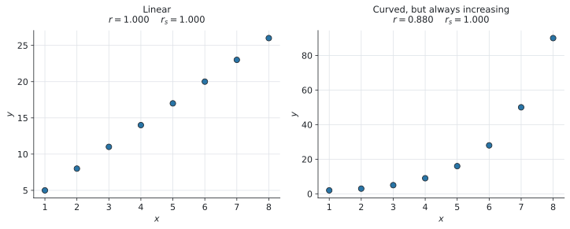
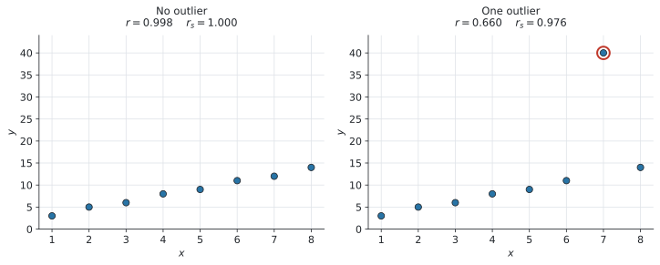

# SL 4.10 — Spearman's rank correlation coefficient（Spearmanの順位相関係数） {#sec-sl-4-10}

::: {.callout-note}
## What you should be able to do
- データを **rank**（順位）に直せる。**同じ値があるときは順位を平均する。**
- **$r_s$**（Spearman's rank correlation coefficient）を電卓で求められる。
- $r_s$ の値を、**問題の文脈に戻して**言葉で説明できる。
- **Pearson の $r$** と **Spearman の $r_s$** の違いを説明できる。
  - $r$ は **linear**（直線）の関係だけ
  - $r_s$ は **monotonic**（ずっと増える／ずっと減る）関係なら何でも
- **$r_s$ のほうが outlier に強い**ことを、理由をつけて説明できる。
:::

::: {.callout-important}
## Formula booklet には、何も載っていません
公式集の Topic 4 の欄は **SL 4.8 で終わっています。** SL 4.9 と同じく、この項目の式も**印刷されていません。**

理由はシラバスに書いてあります。

> In examinations Spearman's rank correlation coefficient, $r_s$, should be found **using technology**.

さらに、こうも書かれています。

> **Not required:** Derivation/proof of Pearson's product moment correlation coefficient and Spearman's rank correlation coefficient.

**証明は出ません。** この項目でやることは、**順位を作ること**と、**出た $r_s$ を言葉で説明すること**の2つです。
:::

## The idea

### 1. Spearman's $r_s$ とは ── 順位に付けかえた $r$ {#what-is-rs}

SL 4.4 で **Pearson's $r$** を求めました。あれは**データの値そのもの**を使っていました。

**Spearman's rank correlation coefficient**（順位相関係数）$r_s$ は、**値のかわりに順位を使って、同じ計算をしたもの**です。

$$
r_s = (\text{順位に付けかえたデータの、Pearson's } r)
$$ {#eq-sl410-def}

やることは**2段階**だけです。

1. **それぞれの変数を、順位に直す**
2. **その順位に、SL 4.4 と同じ Pearson's $r$ をかける**

**新しい計算は何もありません。** $r$ の出し方は SL 4.4 で身に付けたものが、そのまま使えます。

### 2. 順位のつけ方 ★ {#ranking}

**この本では、小さいほうから $1$ 位**とします。

| 値 | 12 | 15 | 9 | 20 |
|---|---|---|---|---|
| 順位 | 2 | 3 | **1** | 4 |

: 順位のつけ方（小さいほうから） {#tbl-sl410-rank}

::: {.callout-note}
## 大きいほうから $1$ 位にしても構いません
**両方の変数で同じ向きにそろえれば、$r_s$ は同じ値になります。**

ただし**片方だけ逆向き**にすると、**符号が反対**になってしまいます。

**どちらの向きでもよいので、必ず2つの変数でそろえてください。**
:::

### 3. 同じ値があるときは、順位を平均します ★★ {#ties}

**シラバスに名指しで書かれている決めごと**です。

> If data items are equal, ranks should be **averaged**.

たとえば $2$ 位と $3$ 位の場所に同じ値が2つ並んだら、[順位を平均](#ties)して、

$$
\frac{2 + 3}{2} = 2.5
$$

**両方とも $2.5$ 位**にします。そして**次の値は $4$ 位**です。$3$ 位は飛ばします。

| 値 | 9 | 12 | 12 | 18 | 20 |
|---|---|---|---|---|---|
| 順位 | 1 | **2.5** | **2.5** | 4 | 5 |

: 同じ値があるときの順位 {#tbl-sl410-ties}

**3つ並んだときも同じです。** $4$、$5$、$6$ 位の場所に同じ値が3つなら、

$$
\frac{4 + 5 + 6}{3} = 5
$$

で、**3つとも $5$ 位**。次は $7$ 位です。

::: {.callout-warning}
## 小数の順位が出ても、それで正しいです
$2.5$ 位や $5.5$ 位という順位に違和感があるかもしれませんが、**シラバスがそうしろと指定しています。**

整数に丸めたり、$2$ 位と $3$ 位を勝手に決めたりしないでください。**平均した値を、そのまま電卓に入れます。**
:::

### 4. $r_s$ の読み方 {#reading-rs}

$r_s$ も、$r$ と同じく **$-1$ から $1$ まで**の値をとります。

| $r_s$ | 意味 |
|---|---|
| $r_s = 1$ | **順位が完全に一致**。ずっと増える関係（perfectly monotonic increasing） |
| $r_s$ が $1$ に近い | 強い正の monotonic な関係 |
| $r_s \approx 0$ | monotonic な関係がほとんどない |
| $r_s$ が $-1$ に近い | 強い負の monotonic な関係 |
| $r_s = -1$ | **順位が完全に逆**。ずっと減る関係 |

: $r_s$ の読み方 {#tbl-sl410-read}

**強さの言葉（strong / moderate / weak）は SL 4.4 の $r$ と同じ**でよいのですが、**「linear」とは言えません。** ここが $r$ との一番の違いです。次の節で見ます。

### 5. $r$ と $r_s$ の違い ★★ {#difference}

シラバスに、**2つのはっきりした違い**が書かれています。

> Pearson's product moment correlation coefficient is useful when testing for only **linearity** and Spearman's correlation coefficient for any **monotonic** relationship.

> Spearman's correlation coefficient is **less sensitive to outliers** than Pearson's product moment correlation coefficient.

#### 違い(1) ── linear だけか、monotonic なら何でもか

**monotonic**（単調）とは、**「ずっと増えつづける」か「ずっと減りつづける」**という意味です。**まっすぐである必要はありません。**

{#fig-sl410-monotonic width=100%}

@fig-sl410-monotonic の**右側**を見てください。曲がっていますが、**$x$ が増えれば $y$ も必ず増えて**います。

- **$r = 0.880$** … 直線ではないので、$1$ より小さくなります
- **$r_s = 1.000$** … 順位は完全に一致しているので、ぴったり $1$ です

**曲がっていても、順位さえ合っていれば $r_s = 1$ になります。** これが $r_s$ の強みです。

#### 違い(2) ── outlier への強さ ★

{#fig-sl410-outlier width=100%}

@fig-sl410-outlier は、**$1$ つの点を大きく動かしただけ**の同じデータです。

| | $r$ | $r_s$ |
|---|---|---|
| outlier なし | $0.998$ | $1.000$ |
| outlier あり | **$0.660$** | **$0.976$** |

: outlier $1$ 個で、どれだけ変わるか {#tbl-sl410-outlier}

**$r$ は $0.998$ から $0.660$ まで落ちました。** いっぽう **$r_s$ は $1.000$ から $0.976$ にしか動いていません。**

::: {.callout-tip}
## なぜ $r_s$ は outlier に強いのか ★
**$r_s$ は「順位」しか見ていないから**です。

@fig-sl410-outlier で $7$ 番目の点は $12$ から $40$ へ、**大きく動きました**。$r$ はこの $40$ という値をそのまま計算に使うので、大きく影響を受けます。

でも順位で見ると、この点は **$7$ 位から $8$ 位**に上がっただけです。**$1$ つずれただけ**なので、$r_s$ はほとんど変わりません。

**「どれだけ離れているか」ではなく「何番目か」しか見ない。** これが $r_s$ の性質です。
:::

::: {.callout-important}
## 使い分けのまとめ ★★
| こういうときは | どちらを使うか |
|---|---|
| データが**直線的**に並んでいる | **Pearson's $r$** |
| 曲がっているが、**ずっと増える／減る** | **Spearman's $r_s$** |
| **outlier がある** | **Spearman's $r_s$** |
| **回帰直線で予測したい** | **Pearson's $r$**（SL 4.4） |

: $r$ と $r_s$ の使い分け {#tbl-sl410-choose}

`Which is more appropriate` と聞かれたら、**この表のどれに当てはまるかを言い、理由を1文つけてください。**
:::

::: {.callout-warning}
## $r_s$ からは、予測ができません
$r_s$ は順位しか見ていないので、**「$x$ が $10$ のとき $y$ はいくつか」には答えられません。**

予測が必要なら、SL 4.4 の **regression line**（回帰直線）を使います。**$r_s$ に回帰直線はありません。**
:::

## Why it works

ここでは、**なぜ順位に付けかえると、曲がった関係もとらえられるのか**だけを説明します。

Pearson's $r$ は、点が**1本の直線にどれだけ近いか**を測っています（SL 4.4）。ですから @fig-sl410-monotonic の右のように**曲がっている**と、どれだけきれいな関係でも $r$ は $1$ になりません。

ここで、**データを順位に付けかえる**と何が起きるでしょうか。

順位は $1, 2, 3, 4, \ldots$ と、**必ず等間隔に並びます。** もとの $y$ が $2, 3, 5, 9, 16, 28, 50, 90$ とどれだけ急に増えていても、順位にすれば $1, 2, 3, 4, 5, 6, 7, 8$ です。

$x$ の順位も $1, 2, 3, \ldots$ ですから、**順位どうしをグラフにすると、完全な直線**になります。だから $r_s = 1$ です。

**曲がりぐあいの情報を捨てて、順番だけを残す。** これが順位に付けかえるということです。**捨てるからこそ、outlier の影響も一緒に消えます。**

::: {.callout-note}
## 手計算の式について（参考・覚えなくてよい）
教科書によっては、次の式が載っていることがあります。

$$
r_s = 1 - \frac{6 \sum d^{2}}{n(n^{2} - 1)}
$$

$d$ は、それぞれの組の**順位の差**です。

ただし、**この式は AI SL の公式集に載っていません。** シラバスが「電卓で求めること」と指定しているので、**使う必要もありません。**

さらに、**同じ値があって順位を平均したときには、この式は正確ではなくなります。** 正しい $r_s$ は、あくまで @eq-sl410-def の「順位に Pearson's $r$ をかけたもの」です。

**電卓で出してください。** そのほうが速く、同順位があっても正しい値が出ます。
:::

## Worked examples

::: {.callout-note appearance="simple"}
問題文は英語です。意味が理解できなかったら、問題文の下の「**日本語訳**」を開いてください。解説は日本語です。
:::

::: {#exm-sl410-rank}
[The table shows the number of hours eight students spent revising and their test scores.]{.q-en}

| Hours | 3 | 7 | 5 | 10 | 7 | 2 | 8 | 6 |
|---|---|---|---|---|---|---|---|---|
| Score | 45 | 72 | 60 | 88 | 68 | 38 | 80 | 64 |

: Hours and scores {#tbl-sl410-we1}

**(a)** [Write down the rank of each value, ranking from lowest to highest.]{.q-en}

**(b)** [Find Spearman's rank correlation coefficient, $r_s$.]{.q-en}

**(c)** [Interpret your answer in context.]{.q-en}

<details class="jp-trans">
<summary>日本語訳</summary>

表は、$8$ 人の生徒が復習に使った時間と、テストの得点を示しています。見出しの `Hours` は「時間」、`Score` は「得点」です。

**(a)** それぞれの値の順位を、小さいほうから順に書きなさい。

**(b)** Spearman の順位相関係数 $r_s$ を求めなさい。

**(c)** 答えの意味を、問題の文脈で説明しなさい。

</details>

---

**(a)** **`Hours` に $7$ が2つあります。** ここが山場です。

小さい順に並べると $2, 3, 5, 6, 7, 7, 8, 10$ なので、$7$ は **$5$ 番目と $6$ 番目**の場所に来ます。ですから[順位を平均](#ties)して、

$$
\frac{5 + 6}{2} = 5.5
$$

**両方とも $5.5$ 位**です。次の $8$ は **$7$ 位**（$6$ 位は飛ばします）。

| Hours | 3 | 7 | 5 | 10 | 7 | 2 | 8 | 6 |
|---|---|---|---|---|---|---|---|---|
| **Hours rank** | 2 | **5.5** | 3 | 8 | **5.5** | 1 | 7 | 4 |
| Score | 45 | 72 | 60 | 88 | 68 | 38 | 80 | 64 |
| **Score rank** | 2 | 6 | 3 | 8 | 5 | 1 | 7 | 4 |

: 順位に直した表 {#tbl-sl410-we1b}

**`Score` には同じ値がない**ので、こちらはふつうに $1$ から $8$ です。

**検算。** どちらの行も、足すと $\dfrac{8 \times 9}{2} = 36$ になります ✓

**(b)** **順位の2列に、SL 4.4 と同じ Linear Regression をかけます。**

```
menu → Statistics → Stat Calculations → Linear Regression (a+bx)
```

**$x$ には Hours の順位、$y$ には Score の順位**を指定します。出てきた $r$ が $r_s$ です。

$$
r_s = 0.994 \quad (3 \text{ s.f.})
$$

**(c)** `Interpret` なので、**言葉で説明**します。

::: {.model-answer}
**試験ではこう書く**

*There is a very strong positive monotonic relationship between the number of hours spent revising and the test score: students who revised for longer generally scored higher.*
:::

（意味：復習時間と得点のあいだには、非常に強い正の monotonic な関係がある。長く復習した生徒ほど、おおむね高い得点だった。）

**「$r_s$ が大きい」だけでは点になりません。** 「復習時間」と「得点」という**問題の言葉に戻して**書いてください。

::: {.callout-note}
## 解答例（答案用紙にはこう書く）
**(a)**

| Hours rank | 2 | 5.5 | 3 | 8 | 5.5 | 1 | 7 | 4 |
|---|---|---|---|---|---|---|---|---|
| Score rank | 2 | 6 | 3 | 8 | 5 | 1 | 7 | 4 |

**(b)** $r_s = 0.994$ (3 s.f.)

**(c)** *There is a very strong positive monotonic relationship between revision time and test score: students who revised for longer generally scored higher.*
:::
:::

::: {#exm-sl410-judges}
[Two judges each award a score to eight competitors in a competition. Their scores are shown in the table.]{.q-en}

| Competitor | A | B | C | D | E | F | G | H |
|---|---|---|---|---|---|---|---|---|
| Judge 1 | 8.5 | 7.0 | 9.2 | 6.1 | 8.0 | 9.5 | 7.5 | 6.8 |
| Judge 2 | 8.0 | 7.2 | 9.0 | 6.5 | 7.8 | 9.4 | 7.0 | 6.2 |

: Scores given by two judges {#tbl-sl410-we2}

**(a)** [Find Spearman's rank correlation coefficient, $r_s$.]{.q-en}

**(b)** [Comment on the level of agreement between the two judges.]{.q-en}

<details class="jp-trans">
<summary>日本語訳</summary>

$2$ 人の審査員が、コンテストの $8$ 人の出場者にそれぞれ点を付けました。見出しの `Competitor` は「出場者」、`Judge` は「審査員」です。

**(a)** Spearman の順位相関係数 $r_s$ を求めなさい。

**(b)** $2$ 人の審査員の意見がどれくらい一致しているか、コメントしなさい。

（`agreement` は「一致」です。）

</details>

---

**(a)** どちらの行にも**同じ値はありません**。ふつうに $1$ 位から $8$ 位まで付けます。

| Competitor | A | B | C | D | E | F | G | H |
|---|---|---|---|---|---|---|---|---|
| Judge 1 rank | 6 | 3 | 7 | 1 | 5 | 8 | 4 | 2 |
| Judge 2 rank | 6 | 4 | 7 | 2 | 5 | 8 | 3 | 1 |

: 順位に直した表 {#tbl-sl410-we2b}

**違うのは B、D、G、H のところだけ**です。あとは完全に同じ順位です。

順位の2列に Linear Regression をかけて、

$$
r_s = 0.952 \quad (3 \text{ s.f.})
$$

**(b)** `Comment on` なので、**言葉で答える設問**です。

::: {.model-answer}
**試験ではこう書く**

*Since $r_s = 0.952$ is very close to $1$, the two judges ranked the competitors in almost the same order. There is a very high level of agreement between them.*
:::

（意味：$r_s = 0.952$ は $1$ にとても近いので、$2$ 人の審査員はほぼ同じ順序で出場者を並べた。$2$ 人の意見は非常によく一致している。）

::: {.callout-tip}
## 審査員の採点は、$r_s$ の代表的な使い道です
審査員には**点の付け方のくせ**があります。$1$ 人は $6$ 〜 $10$ 点の幅で付け、もう $1$ 人は $2$ 〜 $9$ 点の幅で付けるかもしれません。

それでも「**誰を上位にしたか**」を比べたいのなら、**点そのものより順位のほうが公平**です。だから $r_s$ を使います。
:::

::: {.callout-note}
## 解答例（答案用紙にはこう書く）
**(a)** $r_s = 0.952$ (3 s.f.)

**(b)** *Since $r_s = 0.952$ is very close to $1$, the two judges ranked the competitors in almost the same order, so there is a very high level of agreement.*
:::
:::

::: {#exm-sl410-curved}
[A scientist records the number of bacteria in a sample at eight different times.]{.q-en}

| Time (hours) | 1 | 2 | 3 | 4 | 5 | 6 | 7 | 8 |
|---|---|---|---|---|---|---|---|---|
| Bacteria (thousands) | 2 | 3 | 5 | 9 | 16 | 28 | 50 | 90 |

: Bacteria over time {#tbl-sl410-we3}

**(a)** [Find Pearson's product moment correlation coefficient, $r$.]{.q-en}

**(b)** [Find Spearman's rank correlation coefficient, $r_s$.]{.q-en}

**(c)** [State which of the two coefficients is more appropriate for this data, giving a reason.]{.q-en}

<details class="jp-trans">
<summary>日本語訳</summary>

ある科学者が、$8$ 回にわたって試料の中の細菌の数を記録しました。見出しの `Time (hours)` は「時間（時）」、`Bacteria (thousands)` は「細菌の数（千個）」です。

**(a)** Pearson の積率相関係数 $r$ を求めなさい。

**(b)** Spearman の順位相関係数 $r_s$ を求めなさい。

**(c)** このデータには $2$ つの係数のどちらがより適切かを、理由をつけて述べなさい。

</details>

---

**(a)** **もとの値のまま** Linear Regression をかけます（SL 4.4 のとおり）。

$$
r = 0.880 \quad (3 \text{ s.f.})
$$

**(b)** 今度は**順位に直して**からかけます。$x$ も $y$ も、**すでに小さい順に並んでいます。**

| Time rank | 1 | 2 | 3 | 4 | 5 | 6 | 7 | 8 |
|---|---|---|---|---|---|---|---|---|
| Bacteria rank | 1 | 2 | 3 | 4 | 5 | 6 | 7 | 8 |

: 順位に直した表 {#tbl-sl410-we3b}

**2つの行が完全に同じ**です。ですから、

$$
r_s = 1
$$

**(c)** `State ... giving a reason` なので、**選んで、理由を書きます。**

散布図をかくと、@fig-sl410-monotonic の右のように**急に立ち上がる曲線**になります。**直線ではありません。**

::: {.model-answer}
**試験ではこう書く**

*Spearman's $r_s$ is more appropriate. The number of bacteria increases at an increasing rate, so the relationship is not linear, and Pearson's $r$ only measures how close the data is to a straight line. The relationship is monotonic, which is what $r_s$ measures, and $r_s = 1$ shows that it is perfectly increasing.*
:::

（意味：Spearman の $r_s$ のほうが適切である。細菌の数は増える速さがどんどん上がっているので関係は直線ではなく、Pearson の $r$ は直線への近さしか測れない。この関係は monotonic であり、それを測るのが $r_s$ である。$r_s = 1$ なので、完全に増えつづける関係だと分かる。）

**$r = 0.880$ を見て「そこそこ強い」と答えて終わらないでください。** 本当は**完全にきれいな関係**なのに、$r$ ではそれが見えていません。

::: {.callout-note}
## 解答例（答案用紙にはこう書く）
**(a)** $r = 0.880$ (3 s.f.)

**(b)** $r_s = 1$

**(c)** *Spearman's $r_s$ is more appropriate, because the relationship is not linear but is monotonic increasing. Pearson's $r$ only measures linearity, so it underestimates the strength of this relationship.*
:::
:::

::: {#exm-sl410-outlier}
[The table shows eight pairs of values.]{.q-en}

| $x$ | 1 | 2 | 3 | 4 | 5 | 6 | 7 | 8 |
|---|---|---|---|---|---|---|---|---|
| $y$ | 3 | 5 | 6 | 8 | 9 | 11 | 40 | 14 |

: Data containing one outlier {#tbl-sl410-we4}

**(a)** [Identify the outlier.]{.q-en}

**(b)** [Find $r$ and $r_s$ for this data.]{.q-en}

**(c)** [The value $y = 40$ is replaced by $y = 12$. The new values are $r = 0.998$ and $r_s = 1$. Comment on the effect of the outlier on each coefficient.]{.q-en}

<details class="jp-trans">
<summary>日本語訳</summary>

表は $8$ 組の値を示しています。

**(a)** outlier を特定しなさい。

**(b)** このデータの $r$ と $r_s$ を求めなさい。

**(c)** $y = 40$ を $y = 12$ に置きかえると、新しい値は $r = 0.998$、$r_s = 1$ になります。それぞれの係数に対する outlier の影響についてコメントしなさい。

</details>

---

**(a)** $y$ の値は $3, 5, 6, 8, 9, 11, \ldots, 14$ とゆるやかに増えているのに、**$x = 7$ のところだけ $40$** です。

$$
(x, y) = (7,\ 40)
$$

**(b)** そのままの値で $r$、順位に直して $r_s$。

$$
r = 0.660, \qquad r_s = 0.976 \quad (3 \text{ s.f.})
$$

**$y$ の順位**を見ておきましょう。$40$ は一番大きいので **$8$ 位**、$14$ が **$7$ 位**です。**入れかわったのはこの2つだけ**です。

| $x$ rank | 1 | 2 | 3 | 4 | 5 | 6 | 7 | 8 |
|---|---|---|---|---|---|---|---|---|
| $y$ rank | 1 | 2 | 3 | 4 | 5 | 6 | **8** | **7** |

: $y = 40$ のときの順位 {#tbl-sl410-we4b}

**(c)** `Comment on` なので、**言葉で答えます。** 数字を並べるだけでは足りません。

| | outlier あり | outlier なし |
|---|---|---|
| $r$ | $0.660$ | $0.998$ |
| $r_s$ | $0.976$ | $1$ |

: 変化のようす {#tbl-sl410-we4c}

::: {.model-answer}
**試験ではこう書く**

*The outlier has a large effect on Pearson's $r$, which falls from $0.998$ to $0.660$, because $r$ uses the actual values and the outlier lies far from the straight line. It has only a small effect on Spearman's $r_s$, which falls from $1$ to $0.976$, because $r_s$ uses only the ranks and the outlier moves that point by just one rank position.*
:::

（意味：outlier は Pearson の $r$ に大きく影響し、$0.998$ から $0.660$ まで下がる。$r$ は実際の値を使うので、直線から大きく離れた点の影響を受けるからである。いっぽう Spearman の $r_s$ への影響は小さく、$1$ から $0.976$ に下がっただけである。$r_s$ は順位しか使わず、この点は順位で $1$ つ動いただけだからである。）

**「$r_s$ のほうが outlier に強い」で終わらせず、「順位しか使っていないから」という理由**まで書いてください。**理由が点になります。**

::: {.callout-note}
## 解答例（答案用紙にはこう書く）
**(a)** The outlier is $(7,\ 40)$.

**(b)** $r = 0.660$, $r_s = 0.976$ (3 s.f.)

**(c)** *The outlier has a large effect on $r$ ($0.998 \to 0.660$) because $r$ uses the actual data values. It has only a small effect on $r_s$ ($1 \to 0.976$) because $r_s$ uses only the ranks, and the outlier changes the rank of that point by only one place.*
:::
:::

## Common errors

::: {.callout-warning}
## 同じ値があるのに、順位を平均しない ★★
**この項目で一番多い間違いです。**

$2$ 位と $3$ 位の場所に同じ値が2つ並んだら、**両方とも $2.5$ 位**。次は **$4$ 位**です。

**$2$ 位と $3$ 位を勝手に決めてはいけません。** シラバスに `ranks should be averaged` と書かれています。
:::

::: {.callout-warning}
## 平均した順位の次を、$3$ 位にしてしまう
$2.5$ 位が2つ来たら、**次は $4$ 位**です。$3$ 位ではありません。

$2.5$ が2つで、**$2$ 位と $3$ 位の両方を使いきっている**からです。**順位は全部で $n$ 個ぶん使う**、と考えると間違えません。
:::

::: {.callout-warning}
## 片方だけ逆向きに順位を付ける ★
片方を「小さいほうから」、もう片方を「大きいほうから」付けると、**符号が反対**になります。

$r_s = 0.9$ になるはずが $-0.9$ になります。**2つの変数で必ずそろえてください。**
:::

::: {.callout-warning}
## もとの値のまま Linear Regression をかけてしまう
それでは **Pearson's $r$** が出ます。$r_s$ ではありません。

**必ず、順位の列を作ってから**かけてください。**$r$ と $r_s$ は近い値になることも多いので、気づきにくい間違い**です。
:::

::: {.callout-warning}
## $r_s$ を「linear な関係がある」と説明する ★
$r_s$ が測っているのは **monotonic**（ずっと増える／減る）な関係です。

$r_s = 1$ でも、**直線とはかぎりません**（@fig-sl410-monotonic の右）。

**`linear` ではなく `monotonic` という語を使ってください。**
:::

::: {.callout-warning}
## $r_s$ で予測しようとする
$r_s$ は順位しか見ていないので、**$y$ の値を予測することはできません。**

予測には SL 4.4 の regression line が必要です。
:::

::: {.callout-warning}
## 数字だけ書いて、文脈に戻さない ★★
`Interpret` や `Comment on` が付いていたら、**問題の言葉に戻して1文書きます。**

「$r_s = 0.952$」だけでなく、「**$2$ 人の審査員はほぼ同じ順序で並べた**」まで書いてください。
:::

## Using your GDC (TI-Nspire CX II)

::: {.callout-important}
## TI-Nspire に「Spearman」というコマンドはありません ★★
$r_s$ を直接出すメニューは**ありません。**

**自分で順位の列を作って、その順位に Linear Regression をかけます。** 出てきた $r$ が、そのまま $r_s$ です。

**この手順を覚えることが、この項目の中身**です。
:::

### 手順

**1. Lists & Spreadsheet に、もとのデータを2列入れます。**

```
ctrl + doc → 4: Add Lists & Spreadsheet
```

列に名前を付けます（`x`、`y` など）。

**2. 順位の列を、$2$ 列作ります。**

順位は**自分で見て入れます。** 列名は `rx`、`ry` などにしておきます。

数が多いときは、いったん並べかえると数えやすくなります。

```
menu → Actions → Sort
```

::: {.callout-warning}
## 並べかえると、行の対応が崩れることがあります ★
$x$ の列だけを並べかえると、**$y$ の列との組み合わせがずれてしまいます。**

**$8$ 個や $10$ 個なら、紙に書いて数えるほうが速くて確実です。** 電卓に入れるのは、順位が決まってからで構いません。
:::

**3. 順位の2列に、Linear Regression をかけます。**

```
menu → Statistics → Stat Calculations → Linear Regression (a+bx)
```

- `X List` … **`rx`**（順位のほう）
- `Y List` … **`ry`**（順位のほう）

**4. 出てきた $r$ を読みます。**

$$
r_s = (\text{順位に対する } r)
$$

**画面には $r$ としか出ません。** 順位を入れたのだから $r_s$ だ、と自分で分かっている必要があります。

### $r$ と $r_s$ の両方を聞かれたら

同じ画面を**2回**使うだけです。

| 求めるもの | `X List` / `Y List` に指定する列 |
|---|---|
| **$r$**（Pearson） | もとの値の列（`x`、`y`） |
| **$r_s$**（Spearman） | 順位の列（`rx`、`ry`） |

: どの列を指定するか {#tbl-sl410-gdc}

**列を取り違えると、まったく別のものが出ます。** 指定するときに、列名を必ず確かめてください。

### 順位の検算 ★

**順位の合計**で確かめられます。$n$ 個の順位を全部足すと、必ず

$$
1 + 2 + \cdots + n = \frac{n(n+1)}{2}
$$

になります。$n = 8$ なら $36$ です。**同順位を平均していても、合計は変わりません。**

$$
\texttt{sum(rx)} \qquad \texttt{sum(ry)}
$$

を計算して、**2つとも $36$ になれば、順位の付け方は正しい**です。$36$ にならなければ、飛ばしたか重ねたかしています。

**$10$ 秒でできる検算**なので、順位を入れたら必ずやってください。

## Exercises

::: {.callout-note appearance="simple"}
各問題に、折りたたみが3つ付いています。**日本語訳**、**解答例**（答案用紙に書くべきこと。英語です）、**解説**（なぜそうなるか。日本語です）。

まず自分で解いて、次に解答例と見くらべてください。**解説は、合わなかったときだけ開けば十分です。**
:::

::: {.exercise-block}

[1]{.ex-no} [Rank the following values from lowest to highest, averaging the ranks of any equal values.]{.q-en}

$$
12, \quad 15, \quad 12, \quad 18, \quad 20, \quad 15, \quad 15, \quad 9
$$

<details class="jp-trans">
<summary>日本語訳</summary>

次の値に、小さいほうから順位を付けなさい。同じ値があるときは、順位を平均しなさい。

</details>

::: {.callout-note collapse="true"}
## 解答例（答案用紙に書くこと）
| Value | 12 | 15 | 12 | 18 | 20 | 15 | 15 | 9 |
|---|---|---|---|---|---|---|---|---|
| Rank | 2.5 | 5 | 2.5 | 7 | 8 | 5 | 5 | 1 |
:::

::: {.callout-tip collapse="true"}
## 解説
**まず小さい順に並べます。**

$$9, \quad 12, \quad 12, \quad 15, \quad 15, \quad 15, \quad 18, \quad 20$$

- $9$ … $1$ 位
- $12$ が2つ … $2$ 位と $3$ 位の場所なので $\dfrac{2+3}{2} = 2.5$ 位
- $15$ が**3つ** … $4$、$5$、$6$ 位の場所なので $\dfrac{4+5+6}{3} = 5$ 位
- $18$ … **$7$ 位**（$6$ 位までは使いきっています）
- $20$ … $8$ 位

**検算。** 全部足すと

$$2.5 + 5 + 2.5 + 7 + 8 + 5 + 5 + 1 = 36$$

$\dfrac{8 \times 9}{2} = 36$ ✓ **合っています。**
:::

::: {.ex-sep}
:::

[2]{.ex-no} [Eight students were ranked in a mathematics test and in a physics test. The ranks are shown in the table.]{.q-en}

| Maths rank | 6 | 3 | 8 | 1 | 4 | 7 | 2 | 5 |
|---|---|---|---|---|---|---|---|---|
| Physics rank | 4 | 3 | 8 | 1 | 5 | 7 | 2 | 6 |

: Ranks in two tests {#tbl-sl410-e2}

[Find Spearman's rank correlation coefficient, $r_s$.]{.q-en}

<details class="jp-trans">
<summary>日本語訳</summary>

$8$ 人の生徒に、数学のテストと物理のテストで順位が付けられました。順位は表のとおりです。

Spearman の順位相関係数 $r_s$ を求めなさい。

</details>

::: {.callout-note collapse="true"}
## 解答例（答案用紙に書くこと）
$r_s = 0.929$ (3 s.f.)
:::

::: {.callout-tip collapse="true"}
## 解説
**この問題では、すでに順位が与えられています。** 順位を作る手間がないので、**そのまま Linear Regression にかけるだけ**です。

```
menu → Statistics → Stat Calculations → Linear Regression (a+bx)
```

$X$ に Maths rank、$Y$ に Physics rank を指定して、$r$ を読みます。

$$r_s = 0.9285\ldots = 0.929$$

**入れかわっているのは $4$ 位と $6$ 位のところだけ**なので、$1$ に近い値になるはずです。$0.929$ は妥当です。

**検算。** どちらの行も足すと $36$ です ✓
:::

::: {.ex-sep}
:::

[3]{.ex-no} [The table shows the marks of eight students in a mathematics test and a physics test.]{.q-en}

| Maths | 78 | 65 | 92 | 55 | 70 | 88 | 60 | 74 |
|---|---|---|---|---|---|---|---|---|
| Physics | 72 | 68 | 90 | 50 | 75 | 85 | 58 | 80 |

: Marks in two tests {#tbl-sl410-e3}

**(a)** [Find $r_s$.]{.q-en}

**(b)** [Interpret your answer in context.]{.q-en}

<details class="jp-trans">
<summary>日本語訳</summary>

表は、$8$ 人の生徒の数学と物理のテストの得点を示しています。

**(a)** $r_s$ を求めなさい。

**(b)** 答えの意味を、問題の文脈で説明しなさい。

</details>

::: {.callout-note collapse="true"}
## 解答例（答案用紙に書くこと）
**(a)** Ranks:

| Maths rank | 6 | 3 | 8 | 1 | 4 | 7 | 2 | 5 |
|---|---|---|---|---|---|---|---|---|
| Physics rank | 4 | 3 | 8 | 1 | 5 | 7 | 2 | 6 |

$$r_s = 0.929 \text{ (3 s.f.)}$$

**(b)** *There is a strong positive monotonic relationship between the marks in the two tests: students who scored higher in mathematics generally scored higher in physics.*
:::

::: {.callout-tip collapse="true"}
## 解説
**(a)** **同じ値はありません**ので、ふつうに $1$ 位から $8$ 位まで付けます。

Maths を小さい順に並べると $55, 60, 65, 70, 74, 78, 88, 92$。ですから $78$ は $6$ 位、$65$ は $3$ 位、というように付けていきます。

**これは問2と同じ順位表**になります。答えも同じ $0.929$ です。

**(b)** `Interpret` なので**言葉で**。**「数学の得点」「物理の得点」という問題の言葉**を使ってください。

**`linear` と書かないように。** $r_s$ が測っているのは monotonic な関係です。
:::

::: {.ex-sep}
:::

[4]{.ex-no} [The table shows the value of a rare item at the end of each of seven years.]{.q-en}

| Year | 1 | 2 | 3 | 4 | 5 | 6 | 7 |
|---|---|---|---|---|---|---|---|
| Value (hundreds of dollars) | 5 | 7 | 11 | 20 | 38 | 75 | 150 |

: Value over seven years {#tbl-sl410-e4}

**(a)** [Find $r$ and $r_s$.]{.q-en}

**(b)** [State which coefficient better describes the relationship, giving a reason.]{.q-en}

<details class="jp-trans">
<summary>日本語訳</summary>

表は、ある希少品の $7$ 年間の年末ごとの価値を示しています。見出しの `Value (hundreds of dollars)` は「価値（百ドル単位）」です。

**(a)** $r$ と $r_s$ を求めなさい。

**(b)** どちらの係数がこの関係をよりよく表しているかを、理由をつけて述べなさい。

</details>

::: {.callout-note collapse="true"}
## 解答例（答案用紙に書くこと）
**(a)** $r = 0.872$ (3 s.f.), $r_s = 1$

**(b)** *$r_s$ describes the relationship better. The value increases every year, so the relationship is perfectly monotonic and $r_s = 1$. However the increase is not linear — the value rises more and more steeply — so Pearson's $r$ is less than $1$.*
:::

::: {.callout-tip collapse="true"}
## 解説
**(a)** $r$ は**もとの値**、$r_s$ は**順位**でかけます。

年も価値も**すでに小さい順**なので、順位はどちらも $1, 2, 3, 4, 5, 6, 7$。**完全に一致**しているので $r_s = 1$ です。

**(b)** 散布図をかくと、@fig-sl410-monotonic の右のように**急に立ち上がる曲線**になります。

- **価値は毎年必ず上がっている** → monotonic → $r_s = 1$
- **直線ではない** → $r < 1$

**「$r = 0.872$ だから強い相関」で終わらせないでください。** 本当は**完全にきれいな関係**です。$r$ ではそれが見えません。
:::

::: {.ex-sep}
:::

[5]{.ex-no} [The table shows eight pairs of values.]{.q-en}

| $x$ | 2 | 4 | 6 | 8 | 10 | 12 | 14 | 16 |
|---|---|---|---|---|---|---|---|---|
| $y$ | 20 | 26 | 31 | 35 | 40 | 95 | 50 | 55 |

: Data containing one outlier {#tbl-sl410-e5}

**(a)** [Find $r$ and $r_s$.]{.q-en}

**(b)** [Without the outlier the values would be $r = 0.999$ and $r_s = 1$. Comment on which coefficient is affected more, and explain why.]{.q-en}

<details class="jp-trans">
<summary>日本語訳</summary>

表は $8$ 組の値を示しています。

**(a)** $r$ と $r_s$ を求めなさい。

**(b)** outlier がなければ $r = 0.999$、$r_s = 1$ になります。どちらの係数がより大きく影響を受けるかをコメントし、その理由を説明しなさい。

</details>

::: {.callout-note collapse="true"}
## 解答例（答案用紙に書くこと）
**(a)** $r = 0.692$ (3 s.f.), $r_s = 0.929$ (3 s.f.)

**(b)** *Pearson's $r$ is affected much more, falling from $0.999$ to $0.692$, because it uses the actual data values and the point $(12,\ 95)$ lies far from the straight line. Spearman's $r_s$ falls only from $1$ to $0.929$, because it uses only the ranks and the outlier changes that point's rank by two places.*
:::

::: {.callout-tip collapse="true"}
## 解説
**(a)** outlier は $(12,\ 95)$ です。$y$ の値がまわりから大きく外れています。

**$y$ の順位**を見ます。$95$ は一番大きいので **$8$ 位**。$50$ と $55$ が $6$ 位と $7$ 位に下がります。

| $x$ rank | 1 | 2 | 3 | 4 | 5 | 6 | 7 | 8 |
|---|---|---|---|---|---|---|---|---|
| $y$ rank | 1 | 2 | 3 | 4 | 5 | **8** | **6** | **7** |

**(b)** 数字を並べるだけでなく、**理由**を書いてください。

- $r$ は**値そのもの**を使う → $95$ という大きな値に強く引っぱられる
- $r_s$ は**順位だけ**を使う → $6$ 位が $8$ 位になった、というだけ

**シラバスの言葉は `less sensitive to outliers` です。** この一言を、自分の言葉で説明できるようにしておいてください。
:::

::: {.ex-sep}
:::

[6]{.ex-no} [The table shows the number of hours six people spent watching television and their score on a memory test.]{.q-en}

| Hours | 1 | 2 | 3 | 4 | 5 | 6 |
|---|---|---|---|---|---|---|
| Score | 100 | 82 | 71 | 60 | 45 | 30 |

: Television and memory {#tbl-sl410-e6}

**(a)** [Find $r_s$.]{.q-en}

**(b)** [Interpret your answer in context.]{.q-en}

<details class="jp-trans">
<summary>日本語訳</summary>

表は、$6$ 人がテレビを見た時間と、記憶力テストの得点を示しています。

**(a)** $r_s$ を求めなさい。

**(b)** 答えの意味を、問題の文脈で説明しなさい。

</details>

::: {.callout-note collapse="true"}
## 解答例（答案用紙に書くこと）
**(a)** $r_s = -1$

**(b)** *There is a perfect negative monotonic relationship: as the number of hours watching television increases, the memory test score always decreases.*
:::

::: {.callout-tip collapse="true"}
## 解説
**(a)** Hours の順位は $1, 2, 3, 4, 5, 6$。

Score は $100$ が一番大きいので、小さいほうから付けると **$6$ 位**。順に $5, 4, 3, 2, 1$ 位となり、

| Hours rank | 1 | 2 | 3 | 4 | 5 | 6 |
|---|---|---|---|---|---|---|
| Score rank | 6 | 5 | 4 | 3 | 2 | 1 |

**完全に逆**なので $r_s = -1$ です。

**(b)** **`perfect` と `negative` の2語**を入れてください。$r_s = -1$ はただの「強い」ではなく、**完全に逆順**という意味です。

**なお、これは「テレビを見ると記憶力が下がる」という意味ではありません。** SL 4.4 でやった `correlation does not imply causation` は、$r_s$ でもまったく同じです。
:::

::: {.ex-sep}
:::

[7]{.ex-no} [State one advantage of using Spearman's rank correlation coefficient rather than Pearson's product moment correlation coefficient, and give an example of a situation in which it would be preferred.]{.q-en}

<details class="jp-trans">
<summary>日本語訳</summary>

Pearson の積率相関係数ではなく Spearman の順位相関係数を使うことの利点を $1$ つ述べ、それが好まれる場面の例を挙げなさい。

（`advantage` は「利点」、`preferred` は「好まれる」です。）

</details>

::: {.callout-note collapse="true"}
## 解答例（答案用紙に書くこと）
*Spearman's $r_s$ is less affected by outliers than Pearson's $r$, because it uses only the ranks of the data rather than the actual values.*

*For example, if a set of data on house prices contains one extremely expensive house, $r$ would be pulled towards that point, while $r_s$ would still describe the general trend.*
:::

::: {.callout-tip collapse="true"}
## 解説
**利点は2つあります。** どちらか $1$ つを書けば十分です。

1. **outlier に強い**（順位しか使わないから）
2. **曲がっていても、monotonic なら測れる**（直線でなくてよい）

**`giving an example` があるので、例が必ず要ります。** 理由だけでは点が足りません。

例は身近なもので構いません。**「1軒だけ極端に高い家がある住宅価格のデータ」「1人だけ極端な点を付ける審査員」**など、**outlier がありそうな場面**を挙げてください。
:::

::: {.ex-sep}
:::

[8]{.ex-no} [A student calculates $r_s = 0.95$ for a set of data and then uses a regression line to predict a value of $y$.]{.q-en}

[Explain why the value of $r_s$ does not justify making this prediction.]{.q-en}

<details class="jp-trans">
<summary>日本語訳</summary>

ある生徒が、あるデータについて $r_s = 0.95$ を求め、そのあと回帰直線を使って $y$ の値を予測しました。

$r_s$ の値が、この予測の根拠にならない理由を説明しなさい。

（`justify` は「正当化する・根拠づける」です。）

</details>

::: {.callout-note collapse="true"}
## 解答例（答案用紙に書くこと）
*$r_s$ uses only the ranks of the data, so a value close to $1$ shows that the relationship is monotonic but does not show that it is linear. A regression line assumes a linear relationship, so $r_s$ cannot justify using one. Pearson's $r$ would be needed to judge whether a linear model is suitable.*
:::

::: {.callout-tip collapse="true"}
## 解説
**回帰直線は「直線の関係」を前提にしています**（SL 4.4）。

$r_s = 0.95$ が言っているのは「**順位がよく合っている**」ということだけで、**直線かどうかは何も言っていません。** @fig-sl410-monotonic の右のように、$r_s = 1$ でも大きく曲がっていることがあります。

**書くべきことは3つ**です。

1. $r_s$ は**順位だけ**を使う
2. だから **monotonic** は言えても **linear** は言えない
3. 回帰直線を使いたいなら、**$r$ を見るべき**

**「$r_s$ では予測できない」だけでは弱い**です。**なぜ**かまで書いてください。
:::

::: {.ex-sep}
:::

[9]{.ex-no} [A student writes: "For this data $r_s = 1$, so the points lie on a straight line."]{.q-en}

[Explain why this statement is not correct, and describe what $r_s = 1$ does tell us.]{.q-en}

<details class="jp-trans">
<summary>日本語訳</summary>

ある生徒が「このデータでは $r_s = 1$ なので、点は一直線上に並んでいる」と書きました。

この主張が正しくない理由を説明し、$r_s = 1$ が実際に何を意味しているかを述べなさい。

（本書オリジナルの問題です。）

</details>

::: {.callout-note collapse="true"}
## 解答例（答案用紙に書くこと）
*The statement is not correct. $r_s$ is calculated from the ranks of the data, not from the values, so $r_s = 1$ only means that the ranks of $x$ and $y$ agree exactly.*

*This tells us that the relationship is perfectly monotonic increasing: whenever $x$ increases, $y$ also increases. The points may still lie on a curve. Only $r = 1$ would show that the points lie exactly on a straight line.*
:::

::: {.callout-tip collapse="true"}
## 解説
**この本で何度か出てきた考え方**です。

$r_s = 1$ が言っているのは、**「順位がぴったり同じ」**ということだけ。@fig-sl410-monotonic の右の細菌のデータがまさにこれで、$r_s = 1$ ですが、**点は曲線の上**にあります。

**まっすぐだと言えるのは $r = 1$ のとき**です。

**答案では、次の対比をはっきり書いてください。**

| | 何が言えるか |
|---|---|
| $r_s = 1$ | 完全に **monotonic increasing** |
| $r = 1$ | 点が完全に **一直線上** |

**この2つを混ぜないことが、この項目の一番のねらい**です。
:::

::: {.ex-sep}
:::

[10]{.ex-no} [A teacher records the number of practice papers eight students completed and their final examination mark.]{.q-en}

| Papers | 4 | 9 | 6 | 12 | 9 | 3 | 10 | 7 |
|---|---|---|---|---|---|---|---|---|
| Mark | 52 | 74 | 61 | 90 | 70 | 45 | 82 | 66 |

: Practice papers and marks {#tbl-sl410-e10}

**(a)** [Write down the ranks of the two variables, ranking from lowest to highest.]{.q-en}

**(b)** [Find $r_s$.]{.q-en}

**(c)** [Interpret your answer in context.]{.q-en}

**(d)** [The teacher says: "This shows that completing more practice papers causes a higher mark." Comment on this statement.]{.q-en}

<details class="jp-trans">
<summary>日本語訳</summary>

ある先生が、$8$ 人の生徒が解いた練習問題のセット数と、最終試験の得点を記録しました。見出しの `Papers` は「解いたセット数」、`Mark` は「得点」です。

**(a)** $2$ つの変数の順位を、小さいほうから書きなさい。

**(b)** $r_s$ を求めなさい。

**(c)** 答えの意味を、問題の文脈で説明しなさい。

**(d)** 先生は「これは、練習問題を多く解くことが高い得点の**原因**になっていることを示している」と言いました。この主張についてコメントしなさい。

</details>

::: {.callout-note collapse="true"}
## 解答例（答案用紙に書くこと）
**(a)**

| Papers rank | 2 | 5.5 | 3 | 8 | 5.5 | 1 | 7 | 4 |
|---|---|---|---|---|---|---|---|---|
| Mark rank | 2 | 6 | 3 | 8 | 5 | 1 | 7 | 4 |

**(b)** $r_s = 0.994$ (3 s.f.)

**(c)** *There is a very strong positive monotonic relationship: students who completed more practice papers generally achieved a higher mark.*

**(d)** *The statement is not justified. A strong correlation does not show causation. Other factors, such as how much a student studies overall or how motivated they are, could affect both the number of practice papers completed and the final mark.*
:::

::: {.callout-tip collapse="true"}
## 解説
**(a)** **`Papers` に $9$ が2つあります。** 小さい順に並べると $3, 4, 6, 7, 9, 9, 10, 12$ なので、$9$ は **$5$ 位と $6$ 位**の場所です。

$$\frac{5 + 6}{2} = 5.5$$

**両方とも $5.5$ 位**、次の $10$ は **$7$ 位**です。

**検算。** $2 + 5.5 + 3 + 8 + 5.5 + 1 + 7 + 4 = 36$ ✓（$\dfrac{8 \times 9}{2} = 36$）

**`Mark` には同じ値がない**ので、ふつうに $1$ 位から $8$ 位です。

**(b)** 順位の2列に Linear Regression をかけて $r_s = 0.994$。

**(c)** `Interpret` なので**言葉で**。「練習問題のセット数」「得点」という**問題の言葉**を使ってください。

**(d)** **SL 4.4 の `correlation does not imply causation` と同じ話**です。$r_s$ でもまったく変わりません。

**「別の要因を1つ挙げる」**のが、この設問で点になるところです。「そもそもよく勉強する生徒だった」「やる気が高かった」など、**両方に効きそうな要因**を挙げてください。

**ただし「関係がない」と言い切ってもいけません。** 関係はあります。**「原因だと言い切れない」**が正しい答え方です。
:::

:::
