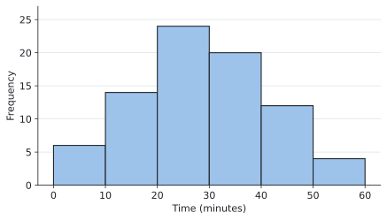
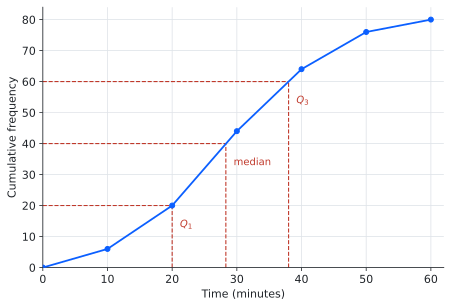
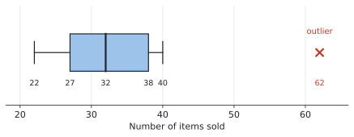
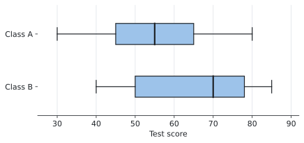

# SL 4.2 — Presentation of data（データの表し方 — 度数分布・ヒストグラム・箱ひげ図） {#sec-sl-4-2}

::: {.callout-note}
## What you should be able to do
- **frequency distribution table**（度数分布表）を読み、作れる。
- **class interval**（階級）の不等式の書き方を正しく読める。
- **histogram**（ヒストグラム）をかき、読み取れる。
- **cumulative frequency**（累積度数）の表とグラフを作れる。
- 累積度数グラフから **median・quartile・percentile・range・IQR** を読み取れる。
- **box and whisker diagram**（箱ひげ図）をかき、外れ値を $\times$ で示せる。
- **2つの箱ひげ図を比べて**、違いを英語で説明できる。
- 箱ひげ図の**左右対称さ**から、正規分布に近いかどうかを判断できる。
:::

::: {.callout-important}
## Formula booklet に載っているもの
SL 4.2 の欄には、次の1行だけが印刷されています。

$$
\text{IQR} = Q_3 - Q_1
$$

**これだけです。** あとは「かき方」と「読み取り方」なので、公式ではなく**手順を身につける**項目です。
:::

::: {.callout-warning}
## 範囲外のものが、はっきり書かれています
シラバスの Guidance 欄に、次の一文があります。

> **Not required: Frequency density histograms.**

**frequency density（度数密度）のヒストグラムは出ません。** つまり、**階級の幅がバラバラなヒストグラムは扱いません。**

> Frequency histograms with equal class intervals.

**階級の幅は、いつも等しい**という前提です。

日本の教科書では「相対度数」や、幅の違う階級の話が出てくることがありますが、**AI SL では必要ありません。** ここに時間を使わないでください。
:::

## The idea

この項目は、**同じデータを4つの形で表す**ことを学びます。

1. **frequency distribution table** ── 表にまとめる
2. **histogram** ── 形を見る
3. **cumulative frequency graph** ── 中央値や四分位数を読み取る
4. **box and whisker diagram** ── 5つの数で要約し、他と比べる

**どれも同じデータです。** 目的によって見せ方を変えているだけ、と思ってください。

このページでは、**1つのデータをずっと使います。** ある学校で、生徒 $80$ 人の通学時間を調べたものです。

### 1. frequency distribution table と class interval {#class-interval}

データを**区間ごとに数えた表**が frequency distribution table です。区間のことを **class interval**（階級）といいます。

| Time, $t$ (minutes) | Frequency |
|---|---|
| $0 \leq t < 10$ | 6 |
| $10 \leq t < 20$ | 14 |
| $20 \leq t < 30$ | 24 |
| $30 \leq t < 40$ | 20 |
| $40 \leq t < 50$ | 12 |
| $50 \leq t < 60$ | 4 |

: 生徒80人の通学時間 {#tbl-sl42-freq}

**合計は $6 + 14 + 24 + 20 + 12 + 4 = 80$ 人**です。表を見たら、まず合計を確かめる習慣をつけてください。

#### 不等式の向きに意味があります ★

シラバスに、次のように書かれています。

> Class intervals will be given as **inequalities, without gaps**.

**階級は必ず不等式で書かれ、すきまがありません。** $0 \leq t < 10$ の次が $10 \leq t < 20$ です。

ここで大事なのは、**ちょうど $10$ 分の人がどちらに入るか**です。

$$
0 \leq t < 10 \quad \text{には } 10 \text{ が}\textbf{入らない}
$$

$$
10 \leq t < 20 \quad \text{には } 10 \text{ が}\textbf{入る}
$$

**左は $\leq$、右は $<$。** ちょうど境目の値は、**下の階級ではなく上の階級**に入ります。

::: {.callout-important}
## 「すきまがない」ことの意味
$0 \leq t < 10$、$10 \leq t < 20$ のように書かれていれば、**どの値も必ずどこか1つの階級に入ります。** 迷う値はありません。

もし「$0$〜$9$」「$10$〜$19$」のような書き方だったら、$9.5$ 分の人がどこにも入らなくなってしまいます。**不等式で書くのは、そのすきまをなくすため**です。

**時間や長さのような continuous data では、この書き方でないと困ります。**
:::

#### mid-interval value（階級値）

各階級の**まん中の値**を **mid-interval value**（階級値）といいます。

$$
0 \leq t < 10 \quad \longrightarrow \quad \frac{0 + 10}{2} = 5
$$

この表なら $5, 15, 25, 35, 45, 55$ です。

**この項目では使いませんが、SL 4.3 で平均を求めるときに使います。** 「階級のまん中で代表させる」という考え方だとだけ覚えておいてください。

### 2. histogram {#histogram}

frequency distribution table をそのまま棒にしたものが **histogram** です。

{#fig-sl42-hist width=90%}

**横軸は時間、縦軸は度数（人数）**です。@tbl-sl42-freq の数字がそのまま棒の高さになっています。

#### 棒と棒のあいだを空けない ★

**これが histogram の一番の特徴**です。

- **histogram** … 棒どうしが**くっついている**
- **bar chart**（棒グラフ）… 棒どうしが**離れている**

くっつけるのは、**横軸が連続した量（時間・長さ・重さ）だから**です。$10$ 分と $20$ 分のあいだにも時間はつながって存在しています。

一方、棒グラフの横軸は「好きなスポーツ」のように**バラバラの項目**なので、離して書きます。

**答案でヒストグラムをかくときは、必ず棒をくっつけてください。**

### 3. cumulative frequency（累積度数）{#cumfreq}

**cumulative frequency** は、**その階級までの合計**です。上から順に足していきます。

| Time, $t$ (minutes) | Frequency | Cumulative frequency |
|---|---|---|
| $0 \leq t < 10$ | 6 | **6** |
| $10 \leq t < 20$ | 14 | **20** |
| $20 \leq t < 30$ | 24 | **44** |
| $30 \leq t < 40$ | 20 | **64** |
| $40 \leq t < 50$ | 12 | **76** |
| $50 \leq t < 60$ | 4 | **80** |

: 累積度数の表 {#tbl-sl42-cum}

$6$、$6+14=20$、$20+24=44$ … と足していくだけです。**一番下は必ずデータの個数（ここでは $80$）になります。** ならなければ、どこかで計算を間違えています。

#### グラフは「階級の上端」に点を打ちます ★

ここが一番間違えやすいところです。

累積度数 $20$ は「**$20$ 分未満の人が $20$ 人**」という意味です。ですから、この点は **$t = 20$ のところ**に打ちます。$t = 15$（階級値）ではありません。

{#fig-sl42-cum width=95%}

**左端は $(0, 0)$ から始めます。** $0$ 分未満の人は $0$ 人だからです。

#### グラフからの読み取り方

**縦軸から入って、横軸に出ます。**

| 読みたいもの | 縦軸のどこから読むか | この例では |
|---|---|---|
| **median** | $\dfrac{n}{2} = 40$ | 約 $28$ 分 |
| **$Q_1$** | $\dfrac{n}{4} = 20$ | $20$ 分 |
| **$Q_3$** | $\dfrac{3n}{4} = 60$ | $38$ 分 |
| **90th percentile** | $0.9 \times 80 = 72$ | 約 $47$ 分 |

: 累積度数グラフの読み方 {#tbl-sl42-read}

**手順はいつも同じです。**

1. 縦軸の値を決める（$n$ を使って計算する）
2. そこから**横に**線を引き、グラフにぶつける
3. そこから**下に**線を下ろし、横軸を読む

**答案には、その線を実際にかいてください。** 読み取ったことが採点者に伝わります。

そして、

$$
\text{IQR} = Q_3 - Q_1 = 38 - 20 = 18 \ \text{分}
$$

**range**（範囲）は、一番大きい値から一番小さい値を引いたものです。この表からは正確には分かりませんが、**$60 - 0 = 60$ 分**と見積もれます。

::: {.callout-note}
## percentile（百分位数）とは
**$p$ th percentile** は、**下から $p\%$ のところにある値**です。

- 25th percentile ＝ $Q_1$
- 50th percentile ＝ median
- 75th percentile ＝ $Q_3$

ですから percentile は、四分位数を細かくしたものだと思えば十分です。$90$ th なら $0.9 \times n$ を縦軸から読みます。

**逆向きに聞かれることもあります。** 「$45$ 分より長くかかる生徒は何人か」なら、横軸の $45$ から**上に**線を引いてグラフにぶつけ、縦軸を読んで、$80$ から引きます。
:::

### 4. box and whisker diagram（箱ひげ図）{#boxplot}

**5つの数**だけでデータを要約したものが box and whisker diagram です。

| 名前 | 意味 |
|---|---|
| **minimum** | 一番小さい値 |
| **$Q_1$** | 第1四分位数 |
| **median** | 中央値 |
| **$Q_3$** | 第3四分位数 |
| **maximum** | 一番大きい値 |

: five-number summary（5数要約） {#tbl-sl42-five}

**箱の両端が $Q_1$ と $Q_3$**、**箱の中の線が median**、**ひげの先が最小値と最大値**です。

#### 外れ値は $\times$ で示します ★

シラバスに、はっきり書かれています。

> **Outliers should be indicated with a cross.**

**外れ値は、点ではなく $\times$ でかきます。** そして、**ひげはその手前で止めます。**

次の図は、ある店の $11$ 日ぶんの販売個数です。

$$
22, \quad 25, \quad 27, \quad 28, \quad 30, \quad 32, \quad 34, \quad 36, \quad 38, \quad 40, \quad 62
$$

{#fig-sl42-box width=95%}

$62$ が外れ値（SL 4.1 の $1.5 \times \text{IQR}$ で判定）なので $\times$ で示し、**ひげは $40$ で止めています。**

**外れ値をひげの先にしてしまうと、間違いです。** ひげの先は「外れ値でない中で一番大きい値」です。

#### 2つを比べる {#compare-boxplots}

シラバスは、**比べること**を求めています。

> Use of box and whisker diagrams to compare two distributions, using **symmetry, median, interquartile range or range**.

比べる観点は、この4つです。

{#fig-sl42-compare width=95%}

| | Class A | Class B |
|---|---|---|
| median | $55$ | $70$ |
| IQR | $65 - 45 = 20$ | $78 - 50 = 28$ |
| range | $80 - 30 = 50$ | $85 - 40 = 45$ |

: 2つのクラスの比較 {#tbl-sl42-ab}

**数字を出すだけでは点になりません。** 「だから何が言えるか」を言葉で書きます。@exm-sl42-compare で型を示します。

#### 左右対称かどうかで、正規分布かを見る {#symmetry}

シラバスにもう1行あります。

> Determining whether the data may be **normally distributed** by consideration of the **symmetry** of the box and whiskers.

**箱ひげ図が左右対称なら、normal distribution（正規分布、SL 4.9）に近いかもしれない**、という見方です。

確かめるのは2つです。

1. **median が箱のまん中にあるか**（$\text{median} - Q_1$ と $Q_3 - \text{median}$ が同じくらいか）
2. **左右のひげの長さが同じくらいか**

Class A では $55 - 45 = 10$、$65 - 55 = 10$ で**ぴったり同じ**です。ひげも $15$ と $15$ で同じです。**左右対称なので、正規分布に近いかもしれません。**

Class B では $70 - 50 = 20$、$78 - 70 = 8$ で**大きく違います**。**対称ではないので、正規分布とは考えにくい**です。

::: {.callout-warning}
## 「正規分布である」とは言い切らない
箱ひげ図が対称でも、**正規分布だと証明できたわけではありません。**

答案では `may be normally distributed`（正規分布かもしれない）と書きます。シラバスの言葉も `may be` です。**言い切らないでください。**
:::

## Why it works

ここでは、**なぜ累積度数のグラフを「階級の上端」に打つのか**だけを説明します。

累積度数 $20$ は、$0 \leq t < 20$ に入る人数、つまり「**$20$ 分未満の人が $20$ 人**」という意味でした。

このとき、**$20$ 人という数が確実に言えるのは $t = 20$ に来たときだけ**です。$t = 15$ の時点では、$10 \leq t < 20$ の $14$ 人のうち何人が $15$ 分未満かは分かりません。表からは読み取れないのです。

だから、**確実に分かる点だけを打って、あいだを直線で結びます。** その「確実に分かる点」が階級の上端です。

$$
(10,\ 6), \quad (20,\ 20), \quad (30,\ 44), \quad \ldots
$$

**あいだを直線で結ぶのは、「その階級の中では均等に散らばっている」と仮定している**からです。本当にそうとは限りません。ですから、グラフから読んだ median は**あくまで推定値**です。

**答えが少しずれても構いません。** IB もグラフの読み取りには幅を持たせて採点します。

## Worked examples

::: {.callout-note appearance="simple"}
問題文は英語です。意味が理解できなかったら、問題文の下の「**日本語訳**」を開いてください。解説は日本語です。
:::

::: {#exm-sl42-table}
[The table shows the times, in minutes, taken by $80$ students to travel to school.]{.q-en}

| Time, $t$ (minutes) | Frequency |
|---|---|
| $0 \leq t < 10$ | 6 |
| $10 \leq t < 20$ | 14 |
| $20 \leq t < 30$ | 24 |
| $30 \leq t < 40$ | 20 |
| $40 \leq t < 50$ | 12 |
| $50 \leq t < 60$ | 4 |

: Travel times {#tbl-sl42-we1}

**(a)** [Write down the modal class.]{.q-en}

**(b)** [A student takes exactly $30$ minutes. State which class interval this student belongs to.]{.q-en}

**(c)** [Find the number of students who take less than $40$ minutes.]{.q-en}

<details class="jp-trans">
<summary>日本語訳</summary>

表は、生徒 $80$ 人が学校まで通うのにかかった時間（分）です。表の見出しは `Time` が「時間」、`Frequency` が「度数」です。

**(a)** 最頻階級（modal class）を書きなさい。

**(b)** ちょうど $30$ 分かかった生徒がいます。この生徒がどの階級に入るかを答えなさい。

**(c)** $40$ 分未満の生徒の人数を求めなさい。

</details>

---

**(a)** **modal class** は、**度数が一番大きい階級**です。$24$ が一番大きいので、

$$
20 \leq t < 30
$$

**「$24$」と答えないでください。** 聞かれているのは**階級**なので、不等式で書きます。

**(b)** [不等式の向き](#class-interval)の話です。

$20 \leq t < 30$ には $30$ が**入りません**（右が $<$ だから）。$30 \leq t < 40$ には $30$ が**入ります**（左が $\leq$ だから）。

ですから $30 \leq t < 40$ です。

**(c)** 「$40$ 分未満」は、上から3つの階級を足します。

$$
6 + 14 + 24 + 20 = 64
$$

これは[累積度数](#cumfreq)そのものです。$40$ までの累積が $64$ 人です。

::: {.callout-note}
## 解答例（答案用紙にはこう書く）
**(a)** $20 \leq t < 30$

**(b)** $30 \leq t < 40$

**(c)** $6 + 14 + 24 + 20 = 64$ students
:::
:::

::: {#exm-sl42-cum}
[Using the data in @tbl-sl42-we1:]{.q-en}

**(a)** [Complete a cumulative frequency table.]{.q-en}

**(b)** [Use your cumulative frequency graph to estimate the median, $Q_1$ and $Q_3$.]{.q-en}

**(c)** [Find the interquartile range.]{.q-en}

<details class="jp-trans">
<summary>日本語訳</summary>

@tbl-sl42-we1 のデータについて、

**(a)** 累積度数の表を完成させなさい。

**(b)** 累積度数グラフを使って、中央値、$Q_1$、$Q_3$ を**推定**しなさい。

**(c)** 四分位範囲を求めなさい。

（`estimate` は「だいたいの値を出す」という指示です。グラフから読み取ります。）

</details>

---

**(a)** 上から順に足していきます。

$$
6, \quad 6+14 = 20, \quad 20+24 = 44, \quad 44+20 = 64, \quad 64+12 = 76, \quad 76+4 = 80
$$

**一番下が $80$（データの個数）になっているか確かめてください。**

**(b)** グラフは @fig-sl42-cum です。$n = 80$ なので、

$$
\text{median} : \ \frac{80}{2} = 40, \qquad Q_1 : \ \frac{80}{4} = 20, \qquad Q_3 : \ \frac{3 \times 80}{4} = 60
$$

この3つの値を**縦軸**から読み、横に線を引いてグラフにぶつけ、下に下ろします。

$$
\text{median} \approx 28, \qquad Q_1 = 20, \qquad Q_3 = 38
$$

$Q_1$ はちょうど点の上（$(20, 20)$）に来るので、$20$ 分と読めます。

**$28$ は「約」で構いません。** $27$ や $29$ と読んでも正解です。`estimate` なので、幅を持たせて採点されます。

**(c)** 公式集の式を使います。

$$
\text{IQR} = Q_3 - Q_1 = 38 - 20 = 18 \ \text{minutes}
$$

::: {.callout-note}
## 解答例（答案用紙にはこう書く）
**(a)** $6, \ 20, \ 44, \ 64, \ 76, \ 80$

**(b)** median $\approx 28$ min, $Q_1 = 20$ min, $Q_3 = 38$ min

**(c)** $\text{IQR} = 38 - 20 = 18$ minutes
:::
:::

::: {#exm-sl42-percentile}
[Use @fig-sl42-cum to answer the following.]{.q-en}

**(a)** [Estimate the $90$th percentile.]{.q-en}

**(b)** [Estimate the number of students who take more than $45$ minutes.]{.q-en}

<details class="jp-trans">
<summary>日本語訳</summary>

@fig-sl42-cum を使って、次の問いに答えなさい。

**(a)** 第90百分位数（90th percentile）を推定しなさい。

**(b)** $45$ 分より長くかかる生徒の人数を推定しなさい。

</details>

---

**(a)** **下から $90\%$ のところ**なので、縦軸の

$$
0.9 \times 80 = 72
$$

から読みます。$72$ から横に線を引くと、$t \approx 47$ 分のあたりでグラフにぶつかります。

$$
90\text{th percentile} \approx 47 \ \text{minutes}
$$

**意味は「生徒の $90\%$ は $47$ 分以内に着いている」**ということです。

**(b)** これは**逆向き**の読み取りです（[percentile の欄](#cumfreq)）。

横軸の $45$ から**上に**線を引くと、累積度数は約 $70$ です。これは「$45$ 分未満が約 $70$ 人」という意味なので、

$$
80 - 70 = 10 \ \text{students}
$$

**引き算を忘れないでください。** グラフから読めるのは「〜未満」の人数です。「〜より多い」を聞かれたら、全体から引きます。

::: {.callout-note}
## 解答例（答案用紙にはこう書く）
**(a)** $0.9 \times 80 = 72$

$90$th percentile $\approx 47$ minutes

**(b)** From the graph, about $70$ students take less than $45$ minutes.

$$80 - 70 = 10 \ \text{students}$$
:::
:::

::: {#exm-sl42-box}
[The number of items sold in a shop on $11$ days is]{.q-en}

$$
22, \quad 25, \quad 27, \quad 28, \quad 30, \quad 32, \quad 34, \quad 36, \quad 38, \quad 40, \quad 62 .
$$

**(a)** [Write down the five-number summary.]{.q-en}

**(b)** [Show that $62$ is an outlier.]{.q-en}

**(c)** [Draw a box and whisker diagram for this data.]{.q-en}

<details class="jp-trans">
<summary>日本語訳</summary>

ある店で $11$ 日間に売れた商品の個数は次のとおりです。

$$
22, \quad 25, \quad 27, \quad 28, \quad 30, \quad 32, \quad 34, \quad 36, \quad 38, \quad 40, \quad 62
$$

**(a)** 5数要約（five-number summary）を書きなさい。

**(b)** $62$ が外れ値であることを示しなさい。

**(c)** このデータの箱ひげ図をかきなさい。

（`Show that` は「与えられた結論に向かって、途中を全部書く」、`Draw` は「定規と目盛りを使って正確にかく」という指示です。）

</details>

---

**(a)** 電卓の One-Variable Statistics に入れると出ます。

$$
\text{min} = 22, \quad Q_1 = 27, \quad \text{median} = 32, \quad Q_3 = 38, \quad \text{max} = 62
$$

**(b)** SL 4.1 の $1.5 \times \text{IQR}$ の決まりを使います。

$$
\text{IQR} = 38 - 27 = 11
$$

$$
1.5 \times \text{IQR} = 16.5
$$

$$
Q_3 + 16.5 = 38 + 16.5 = 54.5
$$

$62 > 54.5$ なので、$62$ は外れ値です。

**`Show that` なので、この数字を全部書いてください。** 結論だけでは点になりません。

**(c)** かき方は @fig-sl42-box のとおりです。**外れ値を $\times$ でかき、ひげをその手前で止める**のがポイントです。

外れ値でない中で一番大きいのは **$40$** なので、**右のひげは $40$ まで**です。$62$ まで伸ばしてはいけません。

::: {.callout-note}
## 解答例（答案用紙にはこう書く）
**(a)** min $= 22$, $Q_1 = 27$, median $= 32$, $Q_3 = 38$, max $= 62$

**(b)** $\text{IQR} = 38 - 27 = 11$

$$1.5 \times \text{IQR} = 16.5$$
$$Q_3 + 16.5 = 54.5$$

*Since $62 > 54.5$, the value $62$ is an outlier.*

**(c)** *Box from $27$ to $38$, median line at $32$. Whiskers to $22$ and $40$. The outlier $62$ is marked with a cross.*
:::
:::

::: {#exm-sl42-compare}
[The box and whisker diagrams show the test scores of two classes.]{.q-en}

{width=95%}

**(a)** [Compare the test scores of the two classes.]{.q-en}

**(b)** [State, with a reason, which class may be normally distributed.]{.q-en}

<details class="jp-trans">
<summary>日本語訳</summary>

箱ひげ図は、2つのクラスのテストの点を表しています。

**(a)** 2つのクラスのテストの点を比較しなさい。

**(b)** どちらのクラスが正規分布に近いと考えられるか、理由をつけて答えなさい。

（`Compare` は「両方に触れて違いを述べる」、`State, with a reason` は「答えと理由の両方を書く」という指示です。）

</details>

---

**(a)** [比べる観点は4つ](#compare-boxplots)でした。**symmetry・median・IQR・range** です。

まず数字を出します。

| | Class A | Class B |
|---|---|---|
| median | $55$ | $70$ |
| IQR | $65 - 45 = 20$ | $78 - 50 = 28$ |
| range | $80 - 30 = 50$ | $85 - 40 = 45$ |

: 数値の比較 {#tbl-sl42-we5}

**ここで終わってはいけません。** 数字が何を意味するかを書きます。

- median が高い → **B のほうが点が高かった**
- IQR が小さい → **A のほうがばらつきが小さく、そろっている**

**`Compare` は「両方に触れる」という指示です。** 片方のことだけ書くと点が出ません。

**(b)** [左右対称かどうか](#symmetry)を見ます。

Class A は $55 - 45 = 10$、$65 - 55 = 10$ で**同じ**。ひげも $45 - 30 = 15$、$80 - 65 = 15$ で**同じ**です。

Class B は $70 - 50 = 20$、$78 - 70 = 8$ で**大きく違います**。

ですから **A** です。**`may be` を使って、言い切らないでください。**

::: {.callout-note}
## 解答例（答案用紙にはこう書く）
**(a)** *Class B has a higher median ($70$) than Class A ($55$), so students in Class B scored higher on average.*

*Class A has a smaller interquartile range ($20$) than Class B ($28$), so the scores in Class A are more consistent.*

**(b)** *Class A may be normally distributed, because the median lies at the centre of the box ($55-45 = 10$ and $65-55 = 10$) and the two whiskers are the same length, so the diagram is symmetric.*
:::
:::

## Common errors

::: {.callout-warning}
## histogram の棒を離してかく
**棒はくっつけます。** 離すと bar chart になってしまいます。

横軸が時間・長さ・重さのような**連続した量**だから、くっつけるのです。
:::

::: {.callout-warning}
## 累積度数を階級値にプロットする
点を打つのは**階級の上端**です。$10 \leq t < 20$ の累積度数 $20$ は、$t = 15$ ではなく **$t = 20$** に打ちます。

$(0, 0)$ から始めることも忘れないでください。
:::

::: {.callout-warning}
## modal class を度数で答える
「$24$」ではなく「$20 \leq t < 30$」です。**聞かれているのは階級**です。
:::

::: {.callout-warning}
## 境目の値を下の階級に入れる
$20 \leq t < 30$ に $30$ は**入りません**。

**左が $\leq$、右が $<$。** ちょうどの値は**上の階級**に入ります。
:::

::: {.callout-warning}
## 外れ値までひげを伸ばす
ひげの先は「**外れ値でない中で一番大きい（小さい）値**」です。

外れ値は $\times$ で別にかきます。シラバスに `Outliers should be indicated with a cross` と明記されています。
:::

::: {.callout-warning}
## `Compare` で片方のことしか書かない
`Compare` は**両方に触れる**という指示です。

「A のほうがばらつきが小さい」ではなく、「**A の IQR は $20$、B の IQR は $28$ なので**、A のほうがばらつきが小さい」と、**数字を出して両方に触れて**ください。
:::

::: {.callout-warning}
## 数値を出しただけで終わる
median や IQR を書いただけでは点になりません。

**「だから何が言えるか」**を一文足してください。`so students in Class B scored higher` のような一文です。**AI で差がつくのはここです。**
:::

::: {.callout-warning}
## 「正規分布である」と言い切る
箱ひげ図の対称性だけでは、正規分布だと証明できません。

**`may be normally distributed`** と書いてください。
:::

## Using your GDC (TI-Nspire CX II)

### 度数分布表を入れる ── 2列使います

生の数値ではなく**度数分布表**が与えられたときは、**2つの列**を使います。

```
ctrl + doc → 4: Add Lists & Spreadsheet
```

| 列A（`midpt`） | 列B（`freq`） |
|---|---|
| 5 | 6 |
| 15 | 14 |
| 25 | 24 |
| 35 | 20 |
| 45 | 12 |
| 55 | 4 |

: 表を電卓に入れる形 {#tbl-sl42-gdc}

**左の列には mid-interval value（階級値）を入れます。** 階級そのものは入れられないので、まん中の値で代表させます。

::: {.callout-warning}
## Frequency List を指定し忘れる
One-Variable Statistics の画面で、**`Frequency List` の欄に度数の列（`freq`）を選んでください。**

ここが `1` のままだと、**「$5, 15, 25, 35, 45, 55$ という6個のデータ」として計算されてしまいます。** $80$ 人ぶんになりません。

答えの $n$ が **$80$ になっているか**を必ず確かめてください。$6$ になっていたら、この指定を忘れています。
:::

### ヒストグラムと箱ひげ図をかく

```
ctrl + doc → 5: Add Data & Statistics
```

下の軸をクリックして列を選ぶと、まず点が散らばった図が出ます。そこから、

```
menu → Plot Type → Histogram
menu → Plot Type → Box Plot
```

で切り替えられます。**同じデータを両方の形で見られる**ので、行き来してみてください。

::: {.callout-note}
## 度数分布表から図をかくとき
`menu → Plot Properties → Add X Summary List` で度数の列を指定します。

ただし、**試験でヒストグラムをかくよう求められたら、手でかくのがふつう**です。電卓の図は、手でかいたものが合っているかの**確認**に使ってください。
:::

### 階級の幅を合わせる

電卓が勝手に決めた階級の幅が、問題の階級と違うことがあります。

```
menu → Plot Properties → Histogram Properties → Bin Settings → Equal Bin Width
```

で `Width` を $10$、`Alignment` を $0$ にすれば、$0 \leq t < 10$ からの区切りになります。

### 外れ値の表示

箱ひげ図で外れ値を $\times$ として別に表示させるには、

```
menu → Plot Properties → Extend Box Plot Whiskers
```

が**オフ**になっている必要があります。オンにすると、**ひげが外れ値まで伸びてしまいます。**

::: {.callout-tip}
## 電卓の図と、答案にかく図は別物です
電卓の箱ひげ図は確認用です。**答案には、定規と目盛りを使って自分でかいてください。**

`Draw` と指示されたら、**軸に目盛りと単位を入れる**ことも忘れないでください。目盛りのない図は点になりません。
:::

## Exercises

::: {.callout-note appearance="simple"}
各問題に、折りたたみが3つ付いています。**日本語訳**、**解答例**（答案用紙に書くべきこと。英語です）、**解説**（なぜそうなるか。日本語です）。

まず自分で解いて、次に解答例と見くらべてください。**解説は、合わなかったときだけ開けば十分です。**
:::

::: {.exercise-block}

[1]{.ex-no} [The table shows the masses, in grams, of $50$ apples.]{.q-en}

| Mass, $m$ (grams) | Frequency |
|---|---|
| $80 \leq m < 100$ | 5 |
| $100 \leq m < 120$ | 13 |
| $120 \leq m < 140$ | 18 |
| $140 \leq m < 160$ | 10 |
| $160 \leq m < 180$ | 4 |

: Masses of apples {#tbl-sl42-e1}

**(a)** [Write down the modal class.]{.q-en} **(b)** [Find the number of apples with a mass less than $140$ g.]{.q-en} **(c)** [An apple has a mass of exactly $120$ g. State its class interval.]{.q-en}

<details class="jp-trans">
<summary>日本語訳</summary>

表は、りんご $50$ 個の重さ（グラム）です。表の見出しは `Mass` が「重さ」、`Frequency` が「度数」です。

**(a)** 最頻階級を書きなさい。 **(b)** 重さが $140$ g 未満のりんごの個数を求めなさい。 **(c)** あるりんごの重さはちょうど $120$ g です。その階級を答えなさい。

</details>

::: {.callout-note collapse="true"}
## 解答例（答案用紙に書くこと）
**(a)** $120 \leq m < 140$

**(b)** $5 + 13 + 18 = 36$ apples

**(c)** $120 \leq m < 140$
:::

::: {.callout-tip collapse="true"}
## 解説
**(a)** 度数が一番大きいのは $18$ なので、その階級を**不等式で**書きます。「$18$」と書かないでください。

**(b)** 「$140$ 未満」なので上から3つを足します。$5+13+18 = 36$。

**(c)** $100 \leq m < 120$ には $120$ が**入りません**（右が $<$）。$120 \leq m < 140$ に入ります（左が $\leq$）。

合計は $5+13+18+10+4 = 50$ ✓ 表を見たら最初に確かめておくと安心です。
:::

::: {.ex-sep}
:::

[2]{.ex-no} [Explain why the bars of a histogram are drawn touching each other, while the bars of a bar chart are drawn with gaps.]{.q-en}

<details class="jp-trans">
<summary>日本語訳</summary>

ヒストグラムの棒はくっつけてかき、棒グラフの棒はすきまを空けてかきます。その理由を説明しなさい。

</details>

::: {.callout-note collapse="true"}
## 解答例（答案用紙に書くこと）
*In a histogram the horizontal axis shows continuous data, so the class intervals join together with no gaps between them. In a bar chart the horizontal axis shows separate categories, which are not connected, so gaps are drawn between the bars.*
:::

::: {.callout-tip collapse="true"}
## 解説
ポイントは **continuous data かどうか**です。

ヒストグラムの横軸は時間や重さのような**つながった量**です。$100$ g と $120$ g のあいだにも重さは存在するので、すきまを作れません。

棒グラフの横軸は「好きなスポーツ」のような**バラバラの項目**です。サッカーと野球のあいだには何もないので、離してかきます。

**`continuous` と `categories` という2語**を使えると、短くまとまります。
:::

::: {.ex-sep}
:::

[3]{.ex-no} [Using @tbl-sl42-e1, complete a cumulative frequency table for the masses of the apples.]{.q-en}

<details class="jp-trans">
<summary>日本語訳</summary>

@tbl-sl42-e1 を使って、りんごの重さの累積度数の表を完成させなさい。

</details>

::: {.callout-note collapse="true"}
## 解答例（答案用紙に書くこと）
| Mass, $m$ (g) | Cumulative frequency |
|---|---|
| $m < 100$ | 5 |
| $m < 120$ | 18 |
| $m < 140$ | 36 |
| $m < 160$ | 46 |
| $m < 180$ | 50 |
:::

::: {.callout-tip collapse="true"}
## 解説
上から順に足すだけです。

$$5, \quad 5+13=18, \quad 18+18=36, \quad 36+10=46, \quad 46+4=50$$

**一番下が $50$（りんごの個数）になっているか**を確かめてください。ならなければ、どこかで足し間違えています。

見出しを `m < 100` のように書くと、**「その値未満の個数」という意味がはっきり**します。グラフにするときも、この値が横軸の位置になります。
:::

::: {.ex-sep}
:::

[4]{.ex-no} [A cumulative frequency graph is drawn for $200$ pieces of data. State the cumulative frequency value that should be used to estimate each of the following.]{.q-en}

**(a)** [the median]{.q-en} **(b)** [$Q_1$]{.q-en} **(c)** [$Q_3$]{.q-en} **(d)** [the $80$th percentile]{.q-en}

<details class="jp-trans">
<summary>日本語訳</summary>

$200$ 個のデータについて累積度数グラフをかきました。次のそれぞれを推定するとき、縦軸のどの値から読み取ればよいか答えなさい。

**(a)** 中央値 **(b)** $Q_1$ **(c)** $Q_3$ **(d)** 第80百分位数

</details>

::: {.callout-note collapse="true"}
## 解答例（答案用紙に書くこと）
**(a)** $\dfrac{200}{2} = 100$

**(b)** $\dfrac{200}{4} = 50$

**(c)** $\dfrac{3 \times 200}{4} = 150$

**(d)** $0.8 \times 200 = 160$
:::

::: {.callout-tip collapse="true"}
## 解説
$n = 200$ を、それぞれの割合にかけるだけです。

- median は真ん中なので $\dfrac{n}{2}$
- $Q_1$ は下から $\dfrac{1}{4}$ なので $\dfrac{n}{4}$
- $Q_3$ は下から $\dfrac{3}{4}$ なので $\dfrac{3n}{4}$
- $p$ th percentile は下から $p\%$ なので $\dfrac{p}{100} \times n$

**percentile は四分位数を細かくしたもの**だと思えば、全部同じ考え方です。$Q_1$ は 25th percentile、median は 50th percentile と言い換えられます。
:::

::: {.ex-sep}
:::

[5]{.ex-no} [Use @fig-sl42-cum to estimate the number of students who take between $25$ and $45$ minutes to travel to school.]{.q-en}

<details class="jp-trans">
<summary>日本語訳</summary>

@fig-sl42-cum を使って、通学時間が $25$ 分から $45$ 分のあいだの生徒の人数を推定しなさい。

</details>

::: {.callout-note collapse="true"}
## 解答例（答案用紙に書くこと）
From the graph:

*Students taking less than $45$ minutes: about $70$*

*Students taking less than $25$ minutes: about $32$*

$$70 - 32 = 38 \ \text{students}$$
:::

::: {.callout-tip collapse="true"}
## 解説
**「あいだ」は、引き算で出します。**

$45$ 分未満の人数から、$25$ 分未満の人数を引けば、$25$ 分から $45$ 分のあいだの人数になります。

累積度数グラフから直接読めるのは「**〜未満**」の人数だけです。**「〜から〜まで」は必ず2回読んで引く**、と覚えてください。

グラフの読み取りなので、$37$ や $39$ でも正解です。**答案には、読み取った2つの値も書いてください。** 引き算だけ書かれていると、どこから出したのか伝わりません。
:::

::: {.ex-sep}
:::

[6]{.ex-no} [The times, in seconds, of $11$ runners are]{.q-en}

$$
52, \quad 54, \quad 55, \quad 57, \quad 58, \quad 60, \quad 61, \quad 63, \quad 64, \quad 66, \quad 89 .
$$

**(a)** [Write down the five-number summary.]{.q-en}

**(b)** [Determine whether $89$ is an outlier.]{.q-en}

**(c)** [State the values at the two ends of the whiskers in a box and whisker diagram for this data.]{.q-en}

<details class="jp-trans">
<summary>日本語訳</summary>

$11$ 人の走者のタイム（秒）は次のとおりです。

$$
52, \quad 54, \quad 55, \quad 57, \quad 58, \quad 60, \quad 61, \quad 63, \quad 64, \quad 66, \quad 89
$$

**(a)** 5数要約を書きなさい。

**(b)** $89$ が外れ値かどうかを判定しなさい。

**(c)** このデータの箱ひげ図で、2本のひげの先の値を答えなさい。

</details>

::: {.callout-note collapse="true"}
## 解答例（答案用紙に書くこと）
**(a)** min $= 52$, $Q_1 = 55$, median $= 60$, $Q_3 = 64$, max $= 89$

**(b)** $\text{IQR} = 64 - 55 = 9$

$$1.5 \times \text{IQR} = 13.5$$
$$Q_3 + 13.5 = 77.5$$

*Since $89 > 77.5$, the value $89$ is an outlier.*

**(c)** *The whiskers end at $52$ and $66$.*
:::

::: {.callout-tip collapse="true"}
## 解説
**(a)** $11$ 個なので、中央値は6番目の $60$。$Q_1$ は下半分（1〜5番目）の真ん中で3番目の $55$、$Q_3$ は上半分（7〜11番目）の真ん中で9番目の $64$ です。電卓の One-Variable Statistics で確かめられます。

**(b)** SL 4.1 と同じ手順です。$\text{IQR} = 9$、$1.5 \times 9 = 13.5$、$64 + 13.5 = 77.5$。$89$ はこれを超えています。

**(c)** ここが本題です。**ひげの先は $89$ ではありません。**

$89$ は外れ値なので $\times$ で別にかき、**ひげは外れ値でない中で一番大きい $66$ で止めます。**

左側は $52$ が外れ値かどうかも確かめておきます。$Q_1 - 13.5 = 55 - 13.5 = 41.5$ で、$52 > 41.5$ なので外れ値ではありません。ですから左のひげは $52$ までです。
:::

::: {.ex-sep}
:::

[7]{.ex-no} [A box and whisker diagram has $Q_1 = 20$, median $= 26$ and $Q_3 = 40$. The whiskers end at $12$ and $50$.]{.q-en}

[State, with a reason, whether this data is likely to be normally distributed.]{.q-en}

<details class="jp-trans">
<summary>日本語訳</summary>

ある箱ひげ図では、$Q_1 = 20$、中央値 $= 26$、$Q_3 = 40$ です。ひげの先は $12$ と $50$ です。

このデータが正規分布に近いと考えられるかどうか、理由をつけて答えなさい。

</details>

::: {.callout-note collapse="true"}
## 解答例（答案用紙に書くこと）
$$\text{median} - Q_1 = 26 - 20 = 6$$
$$Q_3 - \text{median} = 40 - 26 = 14$$

*The median is not at the centre of the box, so the diagram is not symmetric. The data is therefore unlikely to be normally distributed.*
:::

::: {.callout-tip collapse="true"}
## 解説
[対称かどうかを見る](#symmetry)手順そのものです。

**median が箱のまん中にあるか**を確かめます。左が $6$、右が $14$ で、**2倍以上違います。** 対称ではありません。

ひげも $20 - 12 = 8$ と $50 - 40 = 10$ で少し違いますが、**箱の非対称さのほうがはっきりしている**ので、そちらを理由に挙げれば十分です。

**数字を出して比べてください。** 「対称ではないので」だけでは、どこを見たのか伝わりません。
:::

::: {.ex-sep}
:::

[8]{.ex-no} [Two box and whisker diagrams show the heights of plants grown with two different fertilisers.]{.q-en}

| | Fertiliser P | Fertiliser Q |
|---|---|---|
| minimum | 12 | 18 |
| $Q_1$ | 20 | 24 |
| median | 26 | 30 |
| $Q_3$ | 32 | 34 |
| maximum | 44 | 40 |

: Heights in cm {#tbl-sl42-e8}

[Compare the heights of the plants grown with the two fertilisers.]{.q-en}

<details class="jp-trans">
<summary>日本語訳</summary>

2つの箱ひげ図が、異なる2種類の肥料で育てた植物の高さを表しています。表の見出しは `Fertiliser` が「肥料」です。単位は cm です。

2種類の肥料で育てた植物の高さを比較しなさい。

</details>

::: {.callout-note collapse="true"}
## 解答例（答案用紙に書くこと）
*Fertiliser Q has a higher median ($30$ cm) than Fertiliser P ($26$ cm), so plants grown with Q were taller on average.*

*Fertiliser Q has a smaller interquartile range ($34 - 24 = 10$ cm) than Fertiliser P ($32 - 20 = 12$ cm), so the heights of the plants grown with Q are more consistent.*

*Fertiliser Q also has a smaller range ($40 - 18 = 22$ cm) than Fertiliser P ($44 - 12 = 32$ cm).*
:::

::: {.callout-tip collapse="true"}
## 解説
[4つの観点](#compare-boxplots) ── symmetry・median・IQR・range ── から選んで書きます。

**2つか3つ書けば十分**です。ただし、**必ず数字を出して、両方に触れてください。**

型は毎回同じです。

1. **どちらが大きいか（数字つき）**
2. **だから何が言えるか**

`so plants grown with Q were taller on average` の一文が **2** にあたります。ここを書かないと点が出ません。

IQR は $34-24 = 10$ と $32-20 = 12$。差は小さいですが、**Q のほうがそろっている**と言えます。
:::

::: {.ex-sep}
:::

[9]{.ex-no} [A student enters a frequency table into a GDC and finds that $n = 6$. The table has $6$ class intervals and a total frequency of $120$.]{.q-en}

[Explain what the student has done wrong.]{.q-en}

<details class="jp-trans">
<summary>日本語訳</summary>

ある生徒が度数分布表を電卓に入れたところ、$n = 6$ と表示されました。表には $6$ つの階級があり、度数の合計は $120$ です。

この生徒が何を間違えたか説明しなさい。

（本書オリジナルの問題です。）

</details>

::: {.callout-note collapse="true"}
## 解答例（答案用紙に書くこと）
*The student did not select the frequency column in the `Frequency List` box. The calculator has treated the $6$ mid-interval values as $6$ separate data items, instead of using the frequencies. The value of $n$ should be $120$.*
:::

::: {.callout-tip collapse="true"}
## 解説
**$n = 6$ は「6個のデータ」という意味**です。階級の数と同じになっているのが手がかりです。

One-Variable Statistics の `Frequency List` を指定し忘れると、電卓は**階級値だけを6個のデータとして扱います。** 度数を見ていません。

正しく指定すれば $n = 120$ になります。

**電卓で統計を出したら、まず $n$ を見る**習慣をつけてください。$n$ が合っていれば、他の値もたいてい合っています。
:::

::: {.ex-sep}
:::

[10]{.ex-no} [The cumulative frequency graph in @fig-sl42-cum shows the travel times of $80$ students.]{.q-en}

**(a)** [Estimate the percentage of students who take less than $30$ minutes.]{.q-en}

**(b)** [The school wants to identify the $25\%$ of students with the longest travel times. Estimate the minimum travel time for these students.]{.q-en}

<details class="jp-trans">
<summary>日本語訳</summary>

@fig-sl42-cum の累積度数グラフは、生徒 $80$ 人の通学時間を表しています。

**(a)** 通学時間が $30$ 分未満の生徒の割合（パーセント）を推定しなさい。

**(b)** 学校は、通学時間が長いほうから $25\%$ の生徒を知りたいと考えています。その生徒たちの通学時間の最小値を推定しなさい。

</details>

::: {.callout-note collapse="true"}
## 解答例（答案用紙に書くこと）
**(a)** From the graph, $44$ students take less than $30$ minutes.

$$\frac{44}{80} \times 100 = 55\%$$

**(b)** The longest $25\%$ are above $Q_3$.

$$\frac{3 \times 80}{4} = 60$$

*From the graph, $Q_3 = 38$ minutes.*

*So these students take at least about $38$ minutes.*
:::

::: {.callout-tip collapse="true"}
## 解説
**(a)** グラフの $t = 30$ から上に線を引くと、累積度数は $44$ です。これを**割合に直します。**

$$\frac{44}{80} \times 100 = 55\%$$

**人数を答えて終わりにしないでください。** `percentage` と指定されています。

**(b)** 「長いほうから $25\%$」は、**下から $75\%$ より上**ということです。つまり $Q_3$ を求めればよいことになります。

$$\frac{3 \times 80}{4} = 60$$

縦軸の $60$ から読んで $38$ 分。

**問題文を読み替えるところが山**です。「上位 $25\%$」と言われたら $Q_3$、「下位 $25\%$」と言われたら $Q_1$ です。どちらから数えているのかを、必ず確かめてください。
:::

:::
