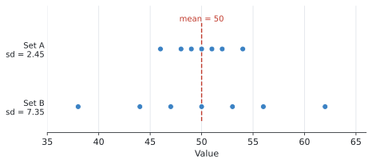
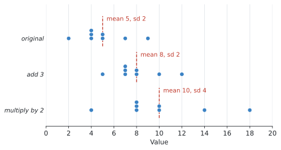

# SL 4.3 — Measures of central tendency and dispersion（代表値と散らばり） {#sec-sl-4-3}

::: {.callout-note}
## What you should be able to do
- **mean・median・mode** を求め、**どれを使うべきか**を判断できる。
- 度数分布表から、公式集の式で **mean** を求められる。
- **grouped data** から、mid-interval value を使って mean を**推定**できる。
- **modal class** を答えられる。
- 電卓で **standard deviation**（標準偏差）と **variance**（分散）を出せる。
- **$\sigma_x$ と $s_x$ のどちらを答えに書くか**を判断できる。
- $\text{variance} = (\text{standard deviation})^2$ を使える。
- データ全部に**同じ数を足したり掛けたり**したとき、mean と standard deviation がどう変わるか説明できる。
:::

::: {.callout-important}
## Formula booklet に載っているもの
SL 4.3 の欄には、次の1行だけが印刷されています。

$$
\bar{x} = \frac{\sum_{i=1}^{k} f_i x_i}{n}, \qquad \text{where } n = \sum_{i=1}^{k} f_i
$$

**度数分布表から mean を求める式**です。読み方は[この節](#mean-from-table)で説明します。

**standard deviation の式は載っていません。** シラバスが、こう決めているからです。

> Calculation of standard deviation and variance of the data set using **only technology**.

**電卓で出すもの**なので、式そのものは覚える必要がありません。
:::

::: {.callout-warning}
## この項目の山は「電卓の使い分け」です
計算は電卓がやってくれます。ですから点差がつくのは、次の2つです。

1. **$\sigma_x$ と $s_x$**、どちらを答えに書くか（[この節](#sigma-vs-s)）
2. **データに定数を足したり掛けたり**したとき、何が変わって何が変わらないか（[この節](#constant-changes)）

**どちらも計算ではなく、判断の問題です。** ここを読み飛ばさないでください。
:::

## The idea

この項目は**2つの質問**に答えるものです。

1. **このデータは、だいたいどのあたりか** ── measures of **central tendency**（代表値）
2. **このデータは、どれくらい散らばっているか** ── measures of **dispersion**（散らばり）

### 1. 3つの代表値 {#three-averages}

| English | 日本語 | 何をするか |
|---|---|---|
| **mean** | 平均値 | 全部足して、個数で割る |
| **median** | 中央値 | 小さい順に並べて、まん中の値 |
| **mode** | 最頻値 | 一番多く出てくる値 |

: 3つの代表値 {#tbl-sl43-three}

**mean は $\bar{x}$（エックスバー）と書きます。**

#### 使い分け ★

**外れ値があるかどうか**で決まります。

- **mean** … 全部の値を使うので、**外れ値に引っぱられます**
- **median** … 順番だけを見るので、**外れ値にほとんど動きません**
- **mode** … 一番多い値。データが数値でなくても使えます

たとえば $4, 5, 5, 6, 8, 9, 11, 16$ の mean は $8$ ですが、最後の $16$ を $40$ に変えると mean は $11$ に上がります。**median は $7$ のまま**です（@exm-sl43-three で確かめます）。

**外れ値があるデータでは、median のほうが実感に近い代表値になります。** 給料や家の値段の話で「平均」より「中央値」が使われるのは、そのためです。

### 2. 度数分布表からの mean {#mean-from-table}

同じ値が何回も出てくるとき、全部書き出すのは大変です。そこで**度数分布表**を使います。公式集の式は、そのための式です。

$$
\bar{x} = \frac{\sum_{i=1}^{k} f_i x_i}{n}, \qquad n = \sum_{i=1}^{k} f_i
$$ {#eq-sl43-mean}

#### 記号の意味

いきなり $\sum$（シグマ）が出てくるので、順に見ていきます。

| 記号 | 意味 |
|---|---|
| $x_i$ | $i$ 番目の**値** |
| $f_i$ | その値の**度数**（何回出てきたか） |
| $k$ | 表の**行数** |
| $n$ | データの**個数の合計**（$= \sum f_i$） |

: 記号の読み方 {#tbl-sl43-symbols}

$\sum f_i x_i$ は「**それぞれの行で（度数）×（値）を計算して、全部足す**」という意味です。SL 1.2 で出てきた $\sum$ と同じ記号です。

**やっていることは、ふつうの平均と同じ**です。$2$ が $3$ 回出てくるなら $2+2+2 = 2 \times 3$ と書けます。それを全部の行でやって、個数で割っているだけです。

**表に「$f \times x$」の列を1つ足すと、間違えにくくなります。** @exm-sl43-table でその形を使います。

### 3. grouped data の mean は「推定」です {#grouped-mean}

SL 4.2 で見たような、**階級で区切られた表**では、一人ひとりの正確な値が分かりません。$20 \leq t < 30$ に $24$ 人いることは分かっても、その $24$ 人が $21$ 分なのか $29$ 分なのかは分かりません。

そこでシラバスは、こう決めています。

> Students should use **mid-interval values** to estimate the mean of grouped data.

**階級のまん中の値（mid-interval value、階級値）で代表させます。**

$$
20 \leq t < 30 \quad \longrightarrow \quad x = \frac{20 + 30}{2} = 25
$$

そのうえで、@eq-sl43-mean をそのまま使います。

**答えは必ず「推定値」です。** 問題文も `estimate the mean` となります。`find` ではありません。

#### modal class

**度数が一番大きい階級**が **modal class** です。

シラバスに条件が1つ付いています。

> **For equal class intervals only.**

**階級の幅が等しいときだけ**の話です。幅が違う表は AI SL では出ません（SL 4.2 で見たとおりです）。

**答えは階級（不等式）で書きます。** 度数の数字ではありません。

### 4. 散らばりを表す3つ {#dispersion}

| English | 日本語 | 求め方 | 外れ値の影響 |
|---|---|---|---|
| **range** | 範囲 | 最大 $-$ 最小 | **とても大きい** |
| **interquartile range (IQR)** | 四分位範囲 | $Q_3 - Q_1$ | **小さい** |
| **standard deviation** | 標準偏差 | 電卓で出す | 大きい |

: 3つの散らばりの尺度 {#tbl-sl43-dispersion}

#### standard deviation は何を表しているか

**「それぞれの値が、平均からどれくらい離れているか」の平均的な大きさ**です。

- **小さい** … データが平均のまわりに**集まっている**
- **大きい** … データが**広く散らばっている**

同じ平均でも、散らばりはまったく違うことがあります。

{#fig-sl43-spread width=95%}

**Set A も Set B も、平均は $50$ です。** けれども Set A は $46$ から $54$ に収まっているのに対し、Set B は $38$ から $62$ まで広がっています。

その違いが standard deviation の $2.45$ と $7.35$ に出ています。**平均だけ見ていては分からないことが、これで分かります。**

#### variance は standard deviation の2乗 {#variance}

シラバスに、そのまま書かれています。

> **Variance is the square of the standard deviation.**

$$
\text{variance} = (\text{standard deviation})^{2}
$$ {#eq-sl43-var}

記号では $\sigma^2$ と $\sigma$ です。**2乗が付いているほうが variance** です。

$$
\sigma = 2 \quad \Longrightarrow \quad \sigma^{2} = 4
$$

$$
\sigma^{2} = 20.25 \quad \Longrightarrow \quad \sigma = \sqrt{20.25} = 4.5
$$

**電卓は standard deviation しか表示しません。** variance を聞かれたら、**自分で2乗してください。**

### 5. $\sigma_x$ と $s_x$ ── どちらを書くか ★ {#sigma-vs-s}

電卓の One-Variable Statistics には、**標準偏差が2つ並んで出てきます。**

| 表示 | 名前 | いつ使うか |
|---|---|---|
| $\sigma_x$ | population standard deviation | データ全部が**母集団**のとき |
| $s_x$ | sample standard deviation | データが**標本**で、母集団を推測したいとき |

: 2つの標準偏差 {#tbl-sl43-sigma-s}

**AI SL では、原則 $\sigma_x$ です。**

理由は、SL 4.1 の冒頭で見たシラバスの一文です。

> At SL the data set will be considered to be **the population** unless otherwise stated.

**特に断りがなければ、与えられたデータが母集団そのもの**として扱われます。ですから population standard deviation、つまり **$\sigma_x$** を書きます。

::: {.callout-important}
## 見分け方は1つだけ
**答案に書くのは $\sigma_x$ のほう**、と覚えて構いません。

電卓の画面では、$\sigma_x$ のほうが**小さい値**になります。2つ並んでいて、どちらか分からなくなったら、**小さいほうが $\sigma_x$** です。

たとえば @exm-sl43-sd のデータでは $\sigma_x = 2$、$s_x = 2.14$ です。

**問題文に `sample` と書いてあって、母集団について推測せよと言われている場合だけ**、$s_x$ を使います。AI SL でそこまで問われることはほとんどありません。
:::

### 6. データ全部に定数を足す・掛ける ★ {#constant-changes}

シラバスが、**例文つき**で挙げている項目です。

> If **three is subtracted** from the data items, then the mean is decreased by three, but the **standard deviation is unchanged**.
>
> If all the data items are **doubled**, the mean is doubled and the standard deviation is **also doubled**.

まとめると、こうなります。

| したこと | mean | standard deviation | variance |
|---|---|---|---|
| **$c$ を足す（引く）** | $c$ だけ増える（減る） | **変わらない** | **変わらない** |
| **$k$ 倍する** | $k$ 倍になる | $k$ 倍になる | $k^{2}$ 倍になる |

: 定数を変えたときの影響 {#tbl-sl43-changes}

**一番大事なのは、足し算では standard deviation が変わらないこと**です。

{#fig-sl43-changes width=95%}

図を見てください。$3$ を足すと、点が**そろって右にずれるだけ**です。**点どうしの間隔は変わっていません。** だから散らばりも変わりません。

$2$ 倍すると、点の**間隔そのものが広がります**。だから散らばりも $2$ 倍になります。

::: {.callout-warning}
## variance だけ $k^2$ 倍です
$k$ 倍したとき、standard deviation は $k$ 倍ですが、**variance は $k^2$ 倍**になります。

variance は standard deviation の**2乗**だからです（@eq-sl43-var）。

$$
\sigma \to 2\sigma \quad \Longrightarrow \quad \sigma^{2} \to (2\sigma)^{2} = 4\sigma^{2}
$$

**$2$ 倍ではなく $4$ 倍です。** ここはよく間違えます。
:::

### 7. quartile の求め方は1つではありません {#quartile-methods}

シラバスに、正直な一文があります。

> Awareness that **different methods for finding quartiles exist** and therefore the values obtained using technology and by hand may **differ**.

**$Q_1$ と $Q_3$ の求め方には流儀がいくつかあり、手計算と電卓で答えが違うことがあります。**

だからシラバスは `Using technology` と指定しています。**電卓が出した値をそのまま書けば正解**です。

**教科書やサイトによって値が違っても、心配しないでください。** 試験では電卓の値が使われます。

## Why it works

ここでは、**なぜ定数を足しても standard deviation が変わらないのか**だけを説明します。

standard deviation は、**「それぞれの値が平均からどれだけ離れているか」**から計算されます。使うのは**値そのものではなく、平均との差**です。

いま、データ全部に $3$ を足したとします。すると、

- それぞれの値が $3$ 増える
- **平均も $3$ 増える**

つまり、**値と平均が同じだけ動きます。** ですから、その差は変わりません。

$$
(x + 3) - (\bar{x} + 3) = x - \bar{x}
$$

**差が変わらないので、そこから計算される standard deviation も変わらない**、というわけです。

@fig-sl43-changes で、点が形を保ったまま右にずれているのは、これを絵にしたものです。

一方 $2$ 倍したときは、

$$
2x - 2\bar{x} = 2(x - \bar{x})
$$

**差そのものが $2$ 倍**になります。だから standard deviation も $2$ 倍です。

## Worked examples

::: {.callout-note appearance="simple"}
問題文は英語です。意味が理解できなかったら、問題文の下の「**日本語訳**」を開いてください。解説は日本語です。
:::

::: {#exm-sl43-three}
[Eight students record the number of hours they spent reading in one week:]{.q-en}

$$
4, \quad 5, \quad 5, \quad 6, \quad 8, \quad 9, \quad 11, \quad 16 .
$$

**(a)** [Find the mean, the median and the mode.]{.q-en}

**(b)** [The value $16$ is replaced by $40$. Find the new mean and the new median.]{.q-en}

**(c)** [Comment on which measure of central tendency is more affected by this change.]{.q-en}

<details class="jp-trans">
<summary>日本語訳</summary>

$8$ 人の生徒が、1週間に読書に使った時間（時間）を記録しました。

$$
4, \quad 5, \quad 5, \quad 6, \quad 8, \quad 9, \quad 11, \quad 16
$$

**(a)** 平均値、中央値、最頻値を求めなさい。

**(b)** $16$ という値を $40$ に置きかえます。新しい平均値と中央値を求めなさい。

**(c)** この変更によって、どちらの代表値がより大きく影響を受けるかコメントしなさい。

</details>

---

**(a)** **mean** は全部足して $8$ で割ります。

$$
\bar{x} = \frac{4+5+5+6+8+9+11+16}{8} = \frac{64}{8} = 8
$$

**median** は、$8$ 個なので**まん中2つの平均**です。$4$ 番目と $5$ 番目は $6$ と $8$ なので、

$$
\frac{6+8}{2} = 7
$$

**mode** は一番多く出てくる値です。$5$ が2回、他は1回ずつなので $5$ です。

**(b)** $16$ を $40$ に変えると、合計が $24$ 増えます。

$$
\bar{x} = \frac{88}{8} = 11
$$

median は、**並べ方が変わらない**ので、まん中2つも $6$ と $8$ のままです。

$$
\text{median} = 7 \quad (\text{変わらず})
$$

**(c)** mean は $8$ から $11$ へ **$3$ も動いた**のに、median は $7$ のまま**まったく動いていません**。

理由は[使い分けの節](#three-averages)のとおりです。mean は全部の値を足すので大きい値に引っぱられますが、median は**順番しか見ない**ので、一番大きい値が何であっても関係ありません。

::: {.callout-note}
## 解答例（答案用紙にはこう書く）
**(a)** $\bar{x} = \dfrac{64}{8} = 8$ hours, median $= \dfrac{6+8}{2} = 7$ hours, mode $= 5$ hours

**(b)** $\bar{x} = \dfrac{88}{8} = 11$ hours, median $= 7$ hours

**(c)** *The mean is more affected. It increased from $8$ to $11$, while the median stayed at $7$. This is because the mean uses every value, so a single large value pulls it up, whereas the median depends only on the position of the middle values.*
:::
:::

::: {#exm-sl43-table}
[The table shows the number of siblings of $40$ students.]{.q-en}

| Number of siblings, $x$ | Frequency, $f$ |
|---|---|
| 0 | 8 |
| 1 | 12 |
| 2 | 15 |
| 3 | 4 |
| 4 | 1 |

: Siblings {#tbl-sl43-we2}

**(a)** [Find the mean number of siblings.]{.q-en}

**(b)** [Write down the mode.]{.q-en}

**(c)** [Find the median.]{.q-en}

<details class="jp-trans">
<summary>日本語訳</summary>

表は、生徒 $40$ 人の兄弟姉妹の人数です。表の見出しは `Number of siblings` が「兄弟姉妹の人数」、`Frequency` が「度数」です。

**(a)** 兄弟姉妹の人数の平均を求めなさい。

**(b)** 最頻値を書きなさい。

**(c)** 中央値を求めなさい。

</details>

---

**(a)** 公式集の @eq-sl43-mean を使います。**表に $f \times x$ の列を足す**のが確実です。

| $x$ | $f$ | $f x$ |
|---|---|---|
| 0 | 8 | $0$ |
| 1 | 12 | $12$ |
| 2 | 15 | $30$ |
| 3 | 4 | $12$ |
| 4 | 1 | $4$ |
| **合計** | **40** | **58** |

: $fx$ の列を足した表 {#tbl-sl43-we2b}

$$
n = \sum f_i = 40, \qquad \sum f_i x_i = 58
$$

$$
\bar{x} = \frac{58}{40} = 1.45
$$

**$1.45$ 人という答えでよいです。** 実際に $1.45$ 人の兄弟がいる人はいませんが、平均とはそういうものです。

**(b)** 度数が一番大きいのは $15$ で、そのときの値は $2$ です。

$$
\text{mode} = 2
$$

**「$15$」ではありません。** mode は**値のほう**です。

**(c)** $40$ 個なので、**$20$ 番目と $21$ 番目の平均**です。

累積度数を出して、何番目がどの値かを調べます。

$$
8, \quad 20, \quad 35, \quad 39, \quad 40
$$

- $1$〜$8$ 番目 … $x = 0$
- $9$〜$20$ 番目 … $x = 1$
- $21$〜$35$ 番目 … $x = 2$

ですから $20$ 番目は $1$、$21$ 番目は $2$ です。

$$
\text{median} = \frac{1+2}{2} = 1.5
$$

::: {.callout-note}
## 解答例（答案用紙にはこう書く）
**(a)** $\sum f x = 0 + 12 + 30 + 12 + 4 = 58$

$$\bar{x} = \frac{58}{40} = 1.45$$

**(b)** mode $= 2$

**(c)** median $= \dfrac{1+2}{2} = 1.5$
:::
:::

::: {#exm-sl43-grouped}
[The table shows the times, in minutes, taken by $80$ students to travel to school.]{.q-en}

| Time, $t$ (minutes) | Frequency |
|---|---|
| $0 \leq t < 10$ | 6 |
| $10 \leq t < 20$ | 14 |
| $20 \leq t < 30$ | 24 |
| $30 \leq t < 40$ | 20 |
| $40 \leq t < 50$ | 12 |
| $50 \leq t < 60$ | 4 |

: Travel times {#tbl-sl43-we3}

**(a)** [Write down the modal class.]{.q-en}

**(b)** [Estimate the mean travel time.]{.q-en}

**(c)** [Explain why your answer to part (b) is an estimate.]{.q-en}

<details class="jp-trans">
<summary>日本語訳</summary>

表は、生徒 $80$ 人が学校まで通うのにかかった時間（分）です。

**(a)** 最頻階級を書きなさい。

**(b)** 平均の通学時間を**推定**しなさい。

**(c)** (b) の答えが推定値である理由を説明しなさい。

</details>

---

**(a)** 度数が一番大きいのは $24$ なので、

$$
20 \leq t < 30
$$

**不等式で書いてください。** 「$24$」でも「$25$」でもありません。

**(b)** `estimate` と書かれているので、[mid-interval value を使う](#grouped-mean)合図です。

まず各階級の**まん中の値**を出します。

| $t$ | mid-interval value, $x$ | $f$ | $fx$ |
|---|---|---|---|
| $0 \leq t < 10$ | 5 | 6 | $30$ |
| $10 \leq t < 20$ | 15 | 14 | $210$ |
| $20 \leq t < 30$ | 25 | 24 | $600$ |
| $30 \leq t < 40$ | 35 | 20 | $700$ |
| $40 \leq t < 50$ | 45 | 12 | $540$ |
| $50 \leq t < 60$ | 55 | 4 | $220$ |
| **合計** | | **80** | **2300** |

: 階級値を使った計算 {#tbl-sl43-we3b}

$$
\bar{x} = \frac{2300}{80} = 28.75 \ \text{minutes}
$$

**SL 4.2 で累積度数グラフから読んだ median は約 $28$ 分**でした。近い値になっています。**2つの方法の答えが近ければ、どちらも大きくは外していない**と分かります。

**(c)** 理由は1つで十分です。

**階級の中の一人ひとりの正確な値が分からない**ので、全員が階級のまん中にいると仮定して計算しています。本当はそうとは限りません。

::: {.callout-note}
## 解答例（答案用紙にはこう書く）
**(a)** $20 \leq t < 30$

**(b)** $\sum f x = 30 + 210 + 600 + 700 + 540 + 220 = 2300$

$$\bar{x} = \frac{2300}{80} = 28.75 \ \text{minutes}$$

**(c)** *The exact times of the individual students are not known. Each student is assumed to take the mid-interval value of their class, so the answer is only an estimate.*
:::
:::

::: {#exm-sl43-sd}
[The number of cakes sold in a shop on eight days is]{.q-en}

$$
2, \quad 4, \quad 4, \quad 4, \quad 5, \quad 5, \quad 7, \quad 9 .
$$

**(a)** [Find the mean.]{.q-en}

**(b)** [Find the standard deviation.]{.q-en}

**(c)** [Find the variance.]{.q-en}

<details class="jp-trans">
<summary>日本語訳</summary>

ある店で $8$ 日間に売れたケーキの個数は次のとおりです。

$$
2, \quad 4, \quad 4, \quad 4, \quad 5, \quad 5, \quad 7, \quad 9
$$

**(a)** 平均を求めなさい。 **(b)** 標準偏差を求めなさい。 **(c)** 分散を求めなさい。

</details>

---

**(a)** 電卓の One-Variable Statistics に入れます。

$$
\bar{x} = \frac{2+4+4+4+5+5+7+9}{8} = \frac{40}{8} = 5
$$

**(b)** 同じ画面に、標準偏差が**2つ**出てきます。

$$
\sigma_x = 2, \qquad s_x = 2.138\ldots
$$

**どちらを書くか**が問われています（[この節](#sigma-vs-s)）。問題文に `sample` とは書かれていないので、**このデータは母集団**として扱います。

$$
\text{standard deviation} = \sigma_x = 2
$$

**$2.14$ と書くと不正解**です。$s_x$ のほうを写してしまった、ということになります。

**(c)** variance は standard deviation の**2乗**です（@eq-sl43-var）。

$$
\sigma_x^{2} = 2^{2} = 4
$$

**電卓には variance の欄がありません。** 自分で2乗してください。

::: {.callout-note}
## 解答例（答案用紙にはこう書く）
**(a)** $\bar{x} = 5$ cakes

**(b)** $\sigma = 2$ cakes

**(c)** $\sigma^{2} = 2^{2} = 4$
:::
:::

::: {#exm-sl43-changes}
[A set of data has a mean of $24$ and a standard deviation of $5$.]{.q-en}

**(a)** [Each value in the data set is increased by $3$. Write down the new mean and the new standard deviation.]{.q-en}

**(b)** [Instead, each value in the original data set is multiplied by $2$. Find the new mean, the new standard deviation and the new variance.]{.q-en}

**(c)** [Explain why adding a constant does not change the standard deviation.]{.q-en}

<details class="jp-trans">
<summary>日本語訳</summary>

あるデータの平均は $24$、標準偏差は $5$ です。

**(a)** データの各値に $3$ を加えます。新しい平均と標準偏差を書きなさい。

**(b)** かわりに、もとのデータの各値を $2$ 倍します。新しい平均、標準偏差、分散を求めなさい。

**(c)** 定数を加えても標準偏差が変わらない理由を説明しなさい。

</details>

---

**(a)** [表](#constant-changes)のとおりです。

$$
\text{new mean} = 24 + 3 = 27
$$

$$
\text{new standard deviation} = 5 \quad (\text{変わらず})
$$

**標準偏差に $3$ を足さないでください。** ここが一番よくある間違いです。

**(b)** $2$ 倍のときは、mean も standard deviation も $2$ 倍です。

$$
\text{new mean} = 24 \times 2 = 48
$$

$$
\text{new standard deviation} = 5 \times 2 = 10
$$

variance は standard deviation の2乗なので、

$$
\text{new variance} = 10^{2} = 100
$$

**もとの variance は $5^2 = 25$ でした。$25 \times 4 = 100$ で、たしかに $2^2 = 4$ 倍**になっています。

**(c)** @fig-sl43-changes の話をそのまま書きます。値も平均も同じだけ動くので、その差が変わらない、というのが理由です。

::: {.callout-note}
## 解答例（答案用紙にはこう書く）
**(a)** new mean $= 27$, new standard deviation $= 5$

**(b)** new mean $= 48$, new standard deviation $= 10$, new variance $= 10^{2} = 100$

**(c)** *When a constant is added, every value and the mean increase by the same amount, so the distance between each value and the mean is unchanged. The standard deviation is calculated from these distances, so it stays the same.*
:::
:::

## Common errors

::: {.callout-warning}
## $s_x$ を答えに書いてしまう
電卓に2つ並んでいるうち、**答案に書くのは $\sigma_x$** です。

`the data set will be considered to be the population` なので、population standard deviation を使います。**$\sigma_x$ のほうが小さい値**です。
:::

::: {.callout-warning}
## 定数を足したときに標準偏差も足す
mean $= 24$、SD $= 5$ で $3$ を足したら、mean は $27$ ですが **SD は $5$ のまま**です。

$8$ にはなりません。
:::

::: {.callout-warning}
## $k$ 倍したときに variance も $k$ 倍にする
**variance は $k^2$ 倍**です。$2$ 倍なら variance は $4$ 倍。

standard deviation が $k$ 倍で、variance はその2乗だからです。
:::

::: {.callout-warning}
## mode を度数で答える
@tbl-sl43-we2 で「$15$」と答える誤りです。**mode は値のほう**なので $2$ です。

modal class も同じで、**階級（不等式）**を書きます。
:::

::: {.callout-warning}
## grouped data で階級の上端や下端を使う
使うのは **mid-interval value**（まん中の値）です。$20 \leq t < 30$ なら $25$ です。$20$ でも $30$ でもありません。
:::

::: {.callout-warning}
## variance を電卓で探す
**電卓に variance の欄はありません。** standard deviation を出して、自分で2乗してください。
:::

::: {.callout-warning}
## `estimate` を無視して正確な答えのように書く
grouped data から出した mean は**必ず推定値**です。

問題文が `estimate` なら、理由を聞かれる可能性があります。**「一人ひとりの正確な値が分からないから」**と書けるようにしておいてください。
:::

::: {.callout-warning}
## 度数分布表の $n$ を行数だと思う
$n$ は**度数の合計**です。@tbl-sl43-we2 なら $n = 40$ で、$5$ ではありません。

電卓で $n = 5$ と出たら、Frequency List を指定し忘れています（SL 4.2）。
:::

## Using your GDC (TI-Nspire CX II)

**この項目は、ほぼ全部が電卓の操作です。** シラバスも `using only technology` と指定しています。

### 生データを入れる

```
ctrl + doc → 4: Add Lists & Spreadsheet
```

一番上のグレーの行に列の名前（`cakes` など）を入れ、その下にデータを並べます。

```
menu → Statistics → Stat Calculations → One-Variable Statistics
```

`Num of Lists` は **1**、`X1 List` に列の名前を選び、`Frequency List` は **1** のままで `OK` です。

### 度数分布表を入れる ── 2列使います

値の列と度数の列を作り、**`Frequency List` に度数の列を指定します。**

| `x` | `f` |
|---|---|
| 0 | 8 |
| 1 | 12 |
| 2 | 15 |
| 3 | 4 |
| 4 | 1 |

: 度数分布表の入れ方 {#tbl-sl43-gdc}

grouped data なら、左の列に **mid-interval value** を入れます。

::: {.callout-warning}
## まず $n$ を見てください
結果の $n$ が**データの個数の合計**になっているか確かめます。

@tbl-sl43-gdc なら $n = 40$ です。**$5$ になっていたら、`Frequency List` を指定し忘れています。**

これは AI SL の統計で一番多い操作ミスです。**$n$ を見る習慣**をつけてください。
:::

### 結果の読み方

| 表示 | 意味 | 答案で使うか |
|---|---|---|
| $\bar{x}$ | mean | **使う** |
| $\Sigma x$ | 合計（$\sum f x$） | 途中式に使える |
| $\sigma_x$ | population standard deviation | **これを書く** |
| $s_x$ | sample standard deviation | ふつう使わない |
| $n$ | データの個数 | **最初に確認する** |
| MedianX | median | 使う |
| Q1X / Q3X | $Q_1$ / $Q_3$ | 使う |

: One-Variable Statistics の読み方 {#tbl-sl43-read}

**variance の欄はありません。** $\sigma_x$ を2乗してください。

::: {.callout-tip}
## $\Sigma x$ は検算に使えます
度数分布表から mean を手で計算したとき、$\sum f x$ の値が電卓の $\Sigma x$ と合っているか確かめられます。

@exm-sl43-grouped なら $\Sigma x = 2300$ と表示されます。**手計算と合っていれば、そこまでは正しい**と分かります。
:::

### 表示桁数を増やしておく

$\sigma_x$ が $2.138089\ldots$ のように続く値のとき、表示が短いと丸め方に困ります。

```
ctrl + menu（またはドキュメント設定）→ Display Digits → Float 6
```

くらいにしておくと、**有効数字3桁に丸めるときに迷いません。**

### 電卓で定数変化を確かめる

@exm-sl43-changes のような問題は、**実際にやってみると納得できます。**

Lists & Spreadsheet で、B列の一番上のグレーの行の下（式を入れる行）に

```
=a[]+3
```

と入れると、A列全部に $3$ を足した列ができます。両方の $\sigma_x$ を出して比べてみてください。**同じ値になります。**

```
=a[]*2
```

なら $\sigma_x$ がちょうど $2$ 倍になります。

## Exercises

::: {.callout-note appearance="simple"}
各問題に、折りたたみが3つ付いています。**日本語訳**、**解答例**（答案用紙に書くべきこと。英語です）、**解説**（なぜそうなるか。日本語です）。

まず自分で解いて、次に解答例と見くらべてください。**解説は、合わなかったときだけ開けば十分です。**
:::

::: {.exercise-block}

[1]{.ex-no} [Find the mean, median and mode of the following data.]{.q-en}

$$
3, \quad 7, \quad 7, \quad 8, \quad 10, \quad 12, \quad 15
$$

<details class="jp-trans">
<summary>日本語訳</summary>

次のデータの平均値、中央値、最頻値を求めなさい。

$$
3, \quad 7, \quad 7, \quad 8, \quad 10, \quad 12, \quad 15
$$

</details>

::: {.callout-note collapse="true"}
## 解答例（答案用紙に書くこと）
$$\bar{x} = \frac{62}{7} = 8.857\ldots = 8.86 \ (3\text{ s.f.})$$

median $= 8$, mode $= 7$
:::

::: {.callout-tip collapse="true"}
## 解説
合計は $3+7+7+8+10+12+15 = 62$。$7$ 個なので $\bar{x} = \dfrac{62}{7} = 8.857\ldots$ です。

**割り切れないときは、有効数字3桁**にします（SL 1.6）。$8.86$ です。

median は $7$ 個なので**4番目**の値、つまり $8$。**まん中2つの平均を取るのは、個数が偶数のときだけ**です。

mode は $7$（2回出てくる）。
:::

::: {.ex-sep}
:::

[2]{.ex-no} [The salaries of five employees, in thousands of dollars, are]{.q-en}

$$
38, \quad 42, \quad 45, \quad 48, \quad 320 .
$$

[Explain why the median is a better measure of central tendency than the mean for this data.]{.q-en}

<details class="jp-trans">
<summary>日本語訳</summary>

$5$ 人の従業員の給料（千ドル単位）は次のとおりです。

$$
38, \quad 42, \quad 45, \quad 48, \quad 320
$$

このデータについて、中央値のほうが平均値よりも代表値として適している理由を説明しなさい。

</details>

::: {.callout-note collapse="true"}
## 解答例（答案用紙に書くこと）
$$\bar{x} = \frac{493}{5} = 98.6, \qquad \text{median} = 45$$

*The value $320$ is an outlier which pulls the mean up to $98.6$. This is higher than four of the five salaries, so the mean does not represent a typical employee. The median of $45$ is close to most of the values, so it is a better measure here.*
:::

::: {.callout-tip collapse="true"}
## 解説
まず**数字を出してください。** 平均は $\dfrac{493}{5} = 98.6$（千ドル）です。

ここで気づいてほしいのは、**$5$ 人のうち $4$ 人が平均より下**だということです。「平均的な従業員」を表していません。

median は $45$ で、$38$〜$48$ の4人に近い値です。

**「外れ値があるから」だけでは足りません。** 「$5$ 人中 $4$ 人が平均より下」のような**具体的な指摘**があると、説明として完成します。
:::

::: {.ex-sep}
:::

[3]{.ex-no} [The table shows the number of pets owned by $30$ students.]{.q-en}

| Number of pets, $x$ | Frequency, $f$ |
|---|---|
| 1 | 5 |
| 2 | 9 |
| 3 | 11 |
| 4 | 3 |
| 5 | 2 |

: Pets owned {#tbl-sl43-e3}

**(a)** [Find the mean.]{.q-en} **(b)** [Write down the mode.]{.q-en} **(c)** [Find the median.]{.q-en}

<details class="jp-trans">
<summary>日本語訳</summary>

表は、生徒 $30$ 人が飼っているペットの数です。

**(a)** 平均を求めなさい。 **(b)** 最頻値を書きなさい。 **(c)** 中央値を求めなさい。

</details>

::: {.callout-note collapse="true"}
## 解答例（答案用紙に書くこと）
**(a)** $\sum f x = 5 + 18 + 33 + 12 + 10 = 78$

$$\bar{x} = \frac{78}{30} = 2.6$$

**(b)** mode $= 3$

**(c)** median $= 3$
:::

::: {.callout-tip collapse="true"}
## 解説
**(a)** $fx$ の列を作ります。$1\times5=5$、$2\times9=18$、$3\times11=33$、$4\times3=12$、$5\times2=10$。合計 $78$。$n = 30$ なので $\bar{x} = 2.6$。

**(b)** 度数が一番大きいのは $11$。そのときの値は $3$ です。**「$11$」ではありません。**

**(c)** $30$ 個なので $15$ 番目と $16$ 番目の平均です。累積度数は $5, 14, 25, 28, 30$。

$15$〜$25$ 番目が $x = 3$ なので、$15$ 番目も $16$ 番目も $3$。よって median $= 3$ です。

電卓に入れれば MedianX に $3$ と出ます。**`Frequency List` の指定を忘れずに。**
:::

::: {.ex-sep}
:::

[4]{.ex-no} [The table shows the masses, in grams, of $40$ eggs.]{.q-en}

| Mass, $m$ (grams) | Frequency |
|---|---|
| $40 \leq m < 50$ | 4 |
| $50 \leq m < 60$ | 11 |
| $60 \leq m < 70$ | 15 |
| $70 \leq m < 80$ | 8 |
| $80 \leq m < 90$ | 2 |

: Masses of eggs {#tbl-sl43-e4}

**(a)** [Write down the modal class.]{.q-en} **(b)** [Estimate the mean mass.]{.q-en}

<details class="jp-trans">
<summary>日本語訳</summary>

表は、卵 $40$ 個の重さ（グラム）です。

**(a)** 最頻階級を書きなさい。 **(b)** 平均の重さを推定しなさい。

</details>

::: {.callout-note collapse="true"}
## 解答例（答案用紙に書くこと）
**(a)** $60 \leq m < 70$

**(b)** Mid-interval values: $45, 55, 65, 75, 85$

$$\sum f x = 180 + 605 + 975 + 600 + 170 = 2530$$
$$\bar{x} = \frac{2530}{40} = 63.25 \ \text{grams}$$
:::

::: {.callout-tip collapse="true"}
## 解説
**(a)** 度数が一番大きい $15$ の階級です。**不等式で**書きます。

**(b)** `estimate` なので **mid-interval value** を使います。

$$\frac{40+50}{2} = 45, \quad \frac{50+60}{2} = 55, \quad \ldots$$

あとは $fx$ を足すだけです。$45\times4=180$、$55\times11=605$、$65\times15=975$、$75\times8=600$、$85\times2=170$。

**階級値を答案に書いてください。** どの値を使ったかが伝わらないと、途中点が付きません。

$63.25$ g は、modal class の $60 \leq m < 70$ の中に入っています。**つじつまが合っています。**
:::

::: {.ex-sep}
:::

[5]{.ex-no} [The heights, in cm, of six plants are]{.q-en}

$$
12, \quad 15, \quad 15, \quad 18, \quad 20, \quad 22 .
$$

**(a)** [Find the mean.]{.q-en} **(b)** [Find the standard deviation, correct to three significant figures.]{.q-en} **(c)** [Find the variance, correct to three significant figures.]{.q-en}

<details class="jp-trans">
<summary>日本語訳</summary>

$6$ 本の植物の高さ（cm）は次のとおりです。

$$
12, \quad 15, \quad 15, \quad 18, \quad 20, \quad 22
$$

**(a)** 平均を求めなさい。 **(b)** 標準偏差を有効数字3桁で求めなさい。 **(c)** 分散を有効数字3桁で求めなさい。

</details>

::: {.callout-note collapse="true"}
## 解答例（答案用紙に書くこと）
**(a)** $\bar{x} = \dfrac{102}{6} = 17$ cm

**(b)** $\sigma = 3.3665\ldots = 3.37$ cm (3 s.f.)

**(c)** $\sigma^{2} = 11.333\ldots = 11.3$ (3 s.f.)
:::

::: {.callout-tip collapse="true"}
## 解説
**(a)** 合計 $102$、$6$ 個なので $17$。

**(b)** 電卓の $\sigma_x$ を読みます。$3.3665\ldots$ なので $3.37$。

**$s_x$（$3.6878\ldots$）を書かないでください。** 2つ出てくるうちの**小さいほう**です。

**(c)** **$\sigma$ を2乗します。** ここで注意することが1つあります。

$$3.37^2 = 11.3569 \quad (\times)$$

**丸めた $3.37$ ではなく、電卓の中の値をそのまま2乗してください。**

$$\sigma^2 = 11.3333\ldots \quad \longrightarrow \quad 11.3$$

**丸めてから計算すると、答えがずれます**（SL 1.6）。
:::

::: {.ex-sep}
:::

[6]{.ex-no} **(a)** [A data set has a standard deviation of $3.5$. Find the variance.]{.q-en}

**(b)** [Another data set has a variance of $20.25$. Find the standard deviation.]{.q-en}

<details class="jp-trans">
<summary>日本語訳</summary>

**(a)** あるデータの標準偏差は $3.5$ です。分散を求めなさい。

**(b)** 別のデータの分散は $20.25$ です。標準偏差を求めなさい。

</details>

::: {.callout-note collapse="true"}
## 解答例（答案用紙に書くこと）
**(a)** $\sigma^{2} = 3.5^{2} = 12.25$

**(b)** $\sigma = \sqrt{20.25} = 4.5$
:::

::: {.callout-tip collapse="true"}
## 解説
**variance は standard deviation の2乗**、それだけです（@eq-sl43-var）。

**(a)** 2乗する。 **(b)** 逆なので**平方根**を取ります。

どちらの向きか迷ったら、**「$\sigma^2$ のほうが大きい」**と思い出してください（$\sigma > 1$ のとき）。$3.5$ と $12.25$ なら、$12.25$ が variance です。
:::

::: {.ex-sep}
:::

[7]{.ex-no} [A data set has a mean of $40$ and a standard deviation of $6$. Each value in the data set is decreased by $5$.]{.q-en}

[Write down the new mean and the new standard deviation.]{.q-en}

<details class="jp-trans">
<summary>日本語訳</summary>

あるデータの平均は $40$、標準偏差は $6$ です。データの各値を $5$ ずつ減らします。

新しい平均と新しい標準偏差を書きなさい。

</details>

::: {.callout-note collapse="true"}
## 解答例（答案用紙に書くこと）
new mean $= 40 - 5 = 35$

new standard deviation $= 6$
:::

::: {.callout-tip collapse="true"}
## 解説
**引き算でも足し算でも、standard deviation は変わりません。**

$1$ に $6 - 5 = 1$ としないでください。データ全部が同じだけ左にずれるので、**点どうしの間隔は変わっていません**（@fig-sl43-changes）。

`Write down` なので、計算過程は不要です。**答えだけで構いません。**
:::

::: {.ex-sep}
:::

[8]{.ex-no} [A data set has a mean of $12$ and a standard deviation of $2.5$. Each value in the data set is multiplied by $3$.]{.q-en}

[Find the new mean, the new standard deviation and the new variance.]{.q-en}

<details class="jp-trans">
<summary>日本語訳</summary>

あるデータの平均は $12$、標準偏差は $2.5$ です。データの各値を $3$ 倍します。

新しい平均、新しい標準偏差、新しい分散を求めなさい。

</details>

::: {.callout-note collapse="true"}
## 解答例（答案用紙に書くこと）
new mean $= 12 \times 3 = 36$

new standard deviation $= 2.5 \times 3 = 7.5$

new variance $= 7.5^{2} = 56.25$
:::

::: {.callout-tip collapse="true"}
## 解説
掛け算のときは、**mean も standard deviation も同じだけ $k$ 倍**です。

variance は $7.5$ を2乗して $56.25$。

**確かめ**：もとの variance は $2.5^2 = 6.25$。$6.25 \times 9 = 56.25$ で、たしかに $3^2 = 9$ 倍になっています。

**variance を $3$ 倍（$18.75$）としないでください。** $k$ 倍のとき variance は $k^2$ 倍です。
:::

::: {.ex-sep}
:::

[9]{.ex-no} [A student enters a data set into a GDC and sees two values displayed: $\sigma_x = 4.82$ and $s_x = 5.08$.]{.q-en}

[State which value should be written as the standard deviation, and give a reason.]{.q-en}

<details class="jp-trans">
<summary>日本語訳</summary>

ある生徒がデータを電卓に入れたところ、$\sigma_x = 4.82$ と $s_x = 5.08$ の2つの値が表示されました。

標準偏差として書くべき値を答え、理由を述べなさい。

（本書オリジナルの問題です。）

</details>

::: {.callout-note collapse="true"}
## 解答例（答案用紙に書くこと）
$\sigma_x = 4.82$

*In this course the data set is treated as the population unless the question says otherwise, so the population standard deviation $\sigma_x$ should be used.*
:::

::: {.callout-tip collapse="true"}
## 解説
根拠は、シラバスの Topic 4 冒頭の一文です。

> At SL the data set will be considered to be the population unless otherwise stated.

**与えられたデータは母集団**として扱うので、population standard deviation の $\sigma_x$ を書きます。

$\sigma_x$ のほうが**小さい値**になっている点も、見分けの手がかりです。

**この判断が問われる設問は多くありませんが、$\sigma_x$ と $s_x$ を取り違えた答えは毎回のように失点します。** 電卓の画面を見たら、**左側（小さいほう）**と覚えておいてください。
:::

::: {.ex-sep}
:::

[10]{.ex-no} [Two machines fill bottles with juice. The table shows the mean and standard deviation of the volume, in ml, of the juice in $50$ bottles from each machine.]{.q-en}

| Machine | Mean (ml) | Standard deviation (ml) |
|---|---|---|
| P | 250 | 1.2 |
| Q | 250 | 4.5 |

: Bottle filling {#tbl-sl43-e10}

[Comment on the performance of the two machines.]{.q-en}

<details class="jp-trans">
<summary>日本語訳</summary>

$2$ 台の機械がボトルにジュースを入れます。表は、それぞれの機械で満たした $50$ 本のボトルの容量（ml）の平均と標準偏差です。

$2$ 台の機械の性能についてコメントしなさい。

</details>

::: {.callout-note collapse="true"}
## 解答例（答案用紙に書くこと）
*Both machines have the same mean volume of $250$ ml, so on average both fill the bottles correctly.*

*Machine P has a much smaller standard deviation ($1.2$ ml) than Machine Q ($4.5$ ml), so the volumes from Machine P are much more consistent. Machine P is therefore performing better.*
:::

::: {.callout-tip collapse="true"}
## 解説
**平均が同じ**というのが、この問題の仕掛けです。平均だけ見ると差がありません。

差が出るのは **standard deviation** です。P は $1.2$ ml、Q は $4.5$ ml。**Q のほうが3倍以上ばらついています。**

ジュースの充填では、**ばらつきが小さいほうがよい機械**です。多すぎれば損、少なすぎれば苦情になります。

**型は SL 4.2 の `Compare` と同じ**です。

1. 数字を出す（両方に触れる）
2. **だから何が言えるか**を書く

`so the volumes from Machine P are much more consistent` の一文が **2** です。ここを書かないと点が出ません。

@fig-sl43-spread が、まさにこの状況の絵です。
:::

:::
