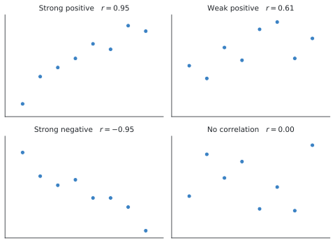
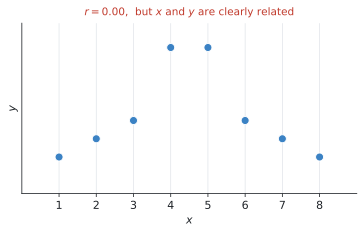
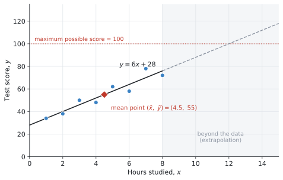

# SL 4.4 — Correlation and linear regression（相関と回帰 — Pearsonの相関係数） {#sec-sl-4-4}

::: {.callout-note}
## What you should be able to do
- **scatter diagram**（散布図）をかき、相関の**向き**と**強さ**を言葉で説明できる。
- 電卓で **Pearson's product-moment correlation coefficient $r$** を求められる。
- $r$ の値から相関を**言葉で**説明できる（strong / weak、positive / negative）。
- **line of best fit** を目分量でかき、**平均点 $(\bar{x}, \bar{y})$ を通す**ことができる。
- 電卓で **regression line of $y$ on $x$**（$y = ax + b$）を求められる。
- **$a$ と $b$ が問題の中で何を意味するか**を説明できる。
- 回帰直線で予測し、**extrapolation（外挿）の危険**を指摘できる。
- **correlation does not imply causation** を説明できる。
:::

::: {.callout-important}
## Formula booklet に載っているもの
**SL 4.4 の欄はありません。** 公式集の Topic 4 は 4.2, 4.3, 4.5, 4.6, 4.7, 4.8 だけです。

$r$ も回帰直線も、シラバスが**電卓で出すもの**と決めているからです。

> **Technology should be used** to calculate $r$.
>
> **Technology should be used** to find the equation.

**式を覚える必要はありません。** そのかわり、**出てきた数を言葉で説明する**ことが問われます。
:::

::: {.callout-warning}
## $r$ の critical value は問題文に出ます
シラバスに、こう書かれています。

> **Critical values of $r$ will be given where appropriate.**

「$r$ がいくつ以上なら強い相関と言えるか」の基準は、**必要なときは問題文に書いてあります。** 表を覚える必要はありません。
:::

## The idea

ここまでは**1種類のデータ**（通学時間だけ、点数だけ）を扱ってきました。この項目からは**2種類を組にして**考えます。これを **bivariate data**（2変量データ）といいます。

「勉強時間と点数」「気温とアイスの売上」のように、**片方が増えるともう片方も増えるのか**を調べます。

やることは3つです。

1. **散布図をかいて、目で見る**
2. **$r$ を出して、相関の強さを数で表す**
3. **回帰直線を出して、予測に使う**

### 1. scatter diagram と相関の型 {#correlation-types}

**scatter diagram**（散布図）は、$(x, y)$ の組をそのまま点で打った図です。

点の並び方で、相関を**向き**と**強さ**の2つで説明します。

{#fig-sl44-types width=95%}

| | 言葉 | 意味 |
|---|---|---|
| **向き** | **positive**（正） | $x$ が増えると $y$ も増える |
| | **negative**（負） | $x$ が増えると $y$ は減る |
| **強さ** | **strong**（強い） | 点が直線の近くに並んでいる |
| | **weak**（弱い） | 点がばらついている |
| | **no correlation** | 並びが見えない |

: 相関の説明のしかた {#tbl-sl44-types}

**答案には「向き」と「強さ」の両方を書いてください。** `strong positive correlation` のように、**2語セット**が基本の形です。

### 2. Pearson's $r$ {#pearson-r}

相関の強さを**数で**表したものが **Pearson's product-moment correlation coefficient**（ピアソンの積率相関係数）で、記号は $r$ です。

$$
-1 \leq r \leq 1
$$

| $r$ の値 | 意味 |
|---|---|
| $r = 1$ | 完全な正の相関（点が全部1本の直線上） |
| $r$ が $1$ に近い | strong positive |
| $r$ が $0$ に近い | no correlation |
| $r$ が $-1$ に近い | strong negative |
| $r = -1$ | 完全な負の相関 |

: $r$ の読み方 {#tbl-sl44-r}

**符号が向き、絶対値の大きさが強さ**です。$r = -0.9$ と $r = 0.9$ は、**向きが逆なだけで、強さは同じ**です。

::: {.callout-important}
## $r$ は「直線の関係」しか測れません ★
シラバスに、はっきり書かれています。

> Students should be aware that Pearson's product moment correlation coefficient ($r$) is **only meaningful for linear relationships**.

次の図を見てください。

{#fig-sl44-nonlinear width=75%}

$r = 0.00$ ですが、$x$ と $y$ には**はっきりした関係**があります。山の形なので、**直線では表せない**というだけです。

**$r$ が $0$ に近いから関係がない、とは言えません。** 「**直線の関係**は見られない」と言うのが正確です。

**だから、必ず散布図も見てください。** $r$ の数字だけで判断すると、こういう形を見落とします。
:::

### 3. line of best fit と平均点 {#mean-point}

**line of best fit**（最もよくあてはまる直線）を目分量でかくとき、シラバスに条件が1つあります。

> Scatter diagrams; lines of best fit, **by eye, passing through the mean point**.

**平均点 $(\bar{x}, \bar{y})$ を必ず通します。**

$\bar{x}$ は $x$ の平均、$\bar{y}$ は $y$ の平均です。**この1点だけは、必ず直線の上に来ます。**

ですから、手でかくときの手順はこうなります。

1. $\bar{x}$ と $\bar{y}$ を計算する（電卓の One-Variable Statistics、または2変数の統計）
2. その点 $(\bar{x}, \bar{y})$ を図に打つ
3. **その点を通るように**、点の真ん中を通る直線を定規で引く

**平均点に印を付けておいてください。** 採点者は、そこを通っているかを見ます。

### 4. regression line of $y$ on $x$ {#regression}

目分量ではなく、**電卓が計算してくれる直線**が **regression line**（回帰直線）です。

IB では、次の形で書きます。

$$
y = ax + b
$$ {#eq-sl44-line}

::: {.callout-warning}
## $a$ が傾きです ★ 電卓と文字が入れかわります
IB の書き方では、

- **$a$ … gradient（傾き）**
- **$b$ … $y$-intercept（$y$ 切片）**

です。SL 2.1 の $y = mx + c$ で言えば、**$a$ が $m$、$b$ が $c$** にあたります。

ところが **TI-Nspire の `Linear Regression (a+bx)` を選ぶと、$y = a + bx$ の形**で出てきます。**こちらは $b$ が傾き**です。**文字の意味が逆になります。**

ですから、この本では **`Linear Regression (mx+b)`** を使います。$m$ が傾き、$b$ が切片なので、**$m$ を $a$ に読みかえるだけ**で済みます。

**画面に出た文字をそのまま写さないでください。** どちらが傾きかを、毎回確かめてください。
:::

次の図が、その回帰直線です。

{#fig-sl44-reg width=95%}

**回帰直線も、必ず平均点 $(\bar{x}, \bar{y})$ を通ります。** 図の赤いひし形がそれです。$(4.5, 55)$ が直線の上に乗っています。

$$
6 \times 4.5 + 28 = 27 + 28 = 55 \quad \checkmark
$$

#### $a$ と $b$ の意味を言葉にする ★

シラバスが求めているのは、計算ではなく**解釈**です。

> **Interpret the meaning of the parameters, $a$ and $b$**, in a linear regression $y = ax + b$.

@fig-sl44-reg の $y = 6x + 28$ なら、こうなります。

| 記号 | 値 | 意味 |
|---|---|---|
| $a$ | $6$ | 勉強時間が **1時間増えるごとに**、点数が**約6点上がる** |
| $b$ | $28$ | 勉強時間が **$0$ 時間のとき**の予測点数は **28点** |

: $a$ と $b$ の意味 {#tbl-sl44-ab}

**$a$ は「$x$ が1増えたときの $y$ の変化」、$b$ は「$x = 0$ のときの $y$」**です。これを**問題の言葉で**書きます。「傾きは6です」だけでは点になりません。

::: {.callout-note}
## $b$ に意味がないこともあります
$x = 0$ が現実にありえない場面では、$b$ の解釈は無理をしないでください。

たとえば $x$ が「気温」なら $0$℃ はありえますが、$x$ が「人の身長」なら $0$ cm はありえません。そういうときは、

> *The value of $b$ has no meaningful interpretation here, because $x = 0$ is outside the range of the data.*

と書くのが正直な答えです。
:::

### 5. 予測と、extrapolation の危険 ★ {#extrapolation}

回帰直線に $x$ を入れれば、$y$ を予測できます。

$$
x = 5.5 \quad \longrightarrow \quad y = 6(5.5) + 28 = 61
$$

$5.5$ 時間は、データのある範囲（$1$〜$8$ 時間）の**中**にあります。こういう予測を **interpolation**（内挿）といい、**信頼できます**。

問題は、範囲の**外**を予測するときです。

$$
x = 20 \quad \longrightarrow \quad y = 6(20) + 28 = 148
$$

**$148$ 点。テストは100点満点なのに、です。**

これが **extrapolation**（外挿）で、シラバスが警告しているものです。

> Students should be aware **of the dangers of extrapolation**.

@fig-sl44-reg の灰色の部分がその領域です。**$x = 12$ で予測がちょうど $100$ 点に達し、それより先はありえない値になります。**

**理由は単純です。** データのない場所で、その直線が成り立つ保証はどこにもありません。$20$ 時間も勉強した人のデータを、私たちは1つも持っていないのです。

#### $y$ から $x$ を予測してはいけません ★

シラバスに、もう1つ注意があります。

> Students should be aware that they **cannot always reliably make a prediction of $x$ from a value of $y$**, when using a $y$ on $x$ line.

**$y$ on $x$ の直線は、「$x$ から $y$ を予測する」ために作られています。** 逆向きには作られていません。

「$70$ 点を取るには何時間勉強すればよいか」を、この式を逆に解いて出すのは、**厳密には正しくありません。**

**試験でこれが問われたら、「$y$ on $x$ の回帰直線なので、$y$ から $x$ を予測するのは信頼できない」と書いてください。**

### 6. correlation does not imply causation ★ {#causation}

シラバスが**名指しで**求めている内容です。

> Students should be able to make the distinction between **correlation and causation** and know that **correlation does not imply causation**.

**相関があっても、原因と結果とはかぎりません。**

たとえば「アイスの売上」と「水の事故の件数」には強い正の相関があります。ですが、アイスを食べると溺れるわけではありません。

**両方とも「気温が高い」ことが原因**です。こういう裏に隠れた変数を **confounding variable**（交絡変数）といいます。

::: {.model-answer}
**試験ではこう書く**

*Although there is a strong positive correlation between the two variables, this does not mean that one causes the other. There may be a third variable, such as temperature, which affects both.*
:::

（2つの変数に強い正の相関があっても、一方が他方の原因だということにはなりません。両方に影響する第3の変数、たとえば気温があるかもしれません。）

**型は2文です。**

1. **相関があることは認める**（Although there is a strong correlation…）
2. **でも原因とは言えない**＋**第3の変数の例**

**「相関と因果は違うから」だけでは点になりません。** 具体的に「何が第3の変数になりうるか」を挙げてください。

## Why it works

ここでは、**なぜ回帰直線が必ず平均点を通るのか**だけを説明します。

回帰直線は、**それぞれの点と直線との縦のずれを、全体として一番小さくする**ように引かれています。

いま、直線を平均点 $(\bar{x}, \bar{y})$ から外したとします。すると**全部の点に対して、まんべんなくずれが増えます**。全体を上にずらせば、下にある点との差が大きくなるからです。

**ずれの合計が一番小さくなるのは、上下のずれがちょうど釣り合う位置**です。そして上下のずれが釣り合う高さこそ、**$y$ の平均 $\bar{y}$** です。

同じことが横方向にも言えるので、直線は $(\bar{x}, \bar{y})$ を通ることになります。

**だから、手でかく line of best fit も平均点を通すのです。** 目分量でも、その1点さえ押さえておけば、大きく外れません。

## Worked examples

::: {.callout-note appearance="simple"}
問題文は英語です。意味が理解できなかったら、問題文の下の「**日本語訳**」を開いてください。解説は日本語です。
:::

::: {#exm-sl44-describe}
[For each of the following values of $r$, describe the correlation.]{.q-en}

**(a)** [$r = 0.92$]{.q-en} **(b)** [$r = -0.88$]{.q-en} **(c)** [$r = 0.15$]{.q-en} **(d)** [$r = -0.41$]{.q-en}

<details class="jp-trans">
<summary>日本語訳</summary>

次のそれぞれの $r$ の値について、相関を説明しなさい。

**(a)** $r = 0.92$ **(b)** $r = -0.88$ **(c)** $r = 0.15$ **(d)** $r = -0.41$

（`describe the correlation` は「向きと強さを言葉で書く」という意味です。）

</details>

---

[向きと強さの2語セット](#correlation-types)で答えます。

**符号を見て向き、絶対値を見て強さ**です。

**(a)** $0.92$ は $1$ に近く、符号は正。→ **strong positive**

**(b)** $-0.88$ は $-1$ に近く、符号は負。→ **strong negative**

**(c)** $0.15$ は $0$ に近い。→ **no（または very weak）correlation**

**(d)** $-0.41$ は $0$ と $-1$ の中間くらい。→ **weak negative**

**「強い」「弱い」の境目に厳密な決まりはありません。** 目安として、絶対値が $0.8$ を超えれば strong、$0.5$ 前後なら weak、$0.2$ 未満ならほぼ相関なし、と考えれば十分です。

**必要な場合は、問題文に critical value が与えられます。**

::: {.callout-note}
## 解答例（答案用紙にはこう書く）
**(a)** *Strong positive correlation.*

**(b)** *Strong negative correlation.*

**(c)** *No correlation (or very weak positive correlation).*

**(d)** *Weak negative correlation.*
:::
:::

::: {#exm-sl44-full}
[The table shows the number of hours eight students spent studying, $x$, and their test scores, $y$.]{.q-en}

| Hours, $x$ | 1 | 2 | 3 | 4 | 5 | 6 | 7 | 8 |
|---|---|---|---|---|---|---|---|---|
| Score, $y$ | 34 | 38 | 50 | 48 | 62 | 58 | 78 | 72 |

: Study hours and test scores {#tbl-sl44-we2}

**(a)** [Find $\bar{x}$ and $\bar{y}$.]{.q-en}

**(b)** [Find Pearson's product-moment correlation coefficient, $r$.]{.q-en}

**(c)** [Describe the correlation between $x$ and $y$.]{.q-en}

**(d)** [Find the equation of the regression line of $y$ on $x$.]{.q-en}

<details class="jp-trans">
<summary>日本語訳</summary>

表は、$8$ 人の生徒が勉強した時間 $x$（時間）と、テストの点数 $y$ です。

**(a)** $\bar{x}$ と $\bar{y}$ を求めなさい。

**(b)** ピアソンの積率相関係数 $r$ を求めなさい。

**(c)** $x$ と $y$ の相関を説明しなさい。

**(d)** $y$ の $x$ への回帰直線の式を求めなさい。

</details>

---

**(a)** 平均を出します。

$$
\bar{x} = \frac{1+2+\cdots+8}{8} = \frac{36}{8} = 4.5
$$

$$
\bar{y} = \frac{34+38+50+48+62+58+78+72}{8} = \frac{440}{8} = 55
$$

**この $(4.5, 55)$ が[平均点](#mean-point)**です。あとで使います。

**(b)** 電卓の Linear Regression に入れると、$r$ も一緒に出ます。

$$
r = 0.9486\ldots = 0.949 \quad (3 \text{ s.f.})
$$

**(c)** $0.949$ は $1$ にとても近く、符号は正です。

$$
\text{strong positive correlation}
$$

**(d)** 同じ画面に傾きと切片が出ています。

$$
y = 6x + 28
$$

**確かめ**：この直線に平均点を入れてみます。

$$
6(4.5) + 28 = 55 \quad \checkmark
$$

**$\bar{y}$ と一致しました。** 回帰直線は必ず平均点を通るので、**これが一番早い検算**です。

::: {.callout-note}
## 解答例（答案用紙にはこう書く）
**(a)** $\bar{x} = 4.5$ hours, $\bar{y} = 55$ marks

**(b)** $r = 0.949$ (3 s.f.)

**(c)** *There is a strong positive correlation between the number of hours studied and the test score.*

**(d)** $y = 6x + 28$
:::
:::

::: {#exm-sl44-interpret}
[Use the regression line $y = 6x + 28$ from @exm-sl44-full.]{.q-en}

**(a)** [Interpret the meaning of $a = 6$ in this context.]{.q-en}

**(b)** [Interpret the meaning of $b = 28$ in this context.]{.q-en}

<details class="jp-trans">
<summary>日本語訳</summary>

@exm-sl44-full の回帰直線 $y = 6x + 28$ を使います。

**(a)** この文脈における $a = 6$ の意味を説明しなさい。

**(b)** この文脈における $b = 28$ の意味を説明しなさい。

（`Interpret` は「その数値が現実の何を意味するかを説明する」という指示です。）

</details>

---

**計算する問題ではありません。** [$a$ と $b$ の意味](#regression)を、**問題の言葉で**書きます。

**(a)** $a$ は傾きです。傾きは「**$x$ が $1$ 増えたとき $y$ がどれだけ増えるか**」を表します。

ここでは $x$ が勉強時間、$y$ が点数なので、**勉強時間が1時間増えるごとに、点数が約6点上がる**ということです。

**「傾きが6です」だけでは点になりません。** 「1時間」「6点」という**この問題の言葉**を使ってください。

**(b)** $b$ は $y$ 切片で、**$x = 0$ のときの $y$** です。

**まったく勉強しなかった生徒の予測点数が28点**、という意味になります。

::: {.callout-important}
## 「約」を付けてください
回帰直線は**予測**の式です。「6点上がる」と言い切ると、必ずそうなるように聞こえてしまいます。

英語では `on average`（平均して）や `approximately`（約）を入れます。
:::

::: {.callout-note}
## 解答例（答案用紙にはこう書く）
**(a)** *For each additional hour of study, the test score increases by approximately $6$ marks, on average.*

**(b)** *A student who does no studying at all is predicted to score $28$ marks.*
:::
:::

::: {#exm-sl44-predict}
[Use the regression line $y = 6x + 28$ from @exm-sl44-full.]{.q-en}

**(a)** [Estimate the score of a student who studies for $5.5$ hours.]{.q-en}

**(b)** [A student claims that studying for $20$ hours would give a score of $148$. Comment on this claim.]{.q-en}

<details class="jp-trans">
<summary>日本語訳</summary>

@exm-sl44-full の回帰直線 $y = 6x + 28$ を使います。

**(a)** $5.5$ 時間勉強した生徒の点数を推定しなさい。

**(b)** ある生徒が「$20$ 時間勉強すれば $148$ 点になる」と言っています。この主張についてコメントしなさい。

</details>

---

**(a)** 式に入れるだけです。

$$
y = 6(5.5) + 28 = 33 + 28 = 61
$$

$5.5$ 時間は**データのある範囲（$1$〜$8$ 時間）の中**なので、この予測は信頼できます（[interpolation](#extrapolation)）。

**(b)** 計算そのものは合っています。

$$
6(20) + 28 = 148
$$

**ですが、この主張は成り立ちません。** 理由が2つあります。

1. **$20$ 時間は、データの範囲（$1$〜$8$ 時間）のはるか外側**です。そこで同じ直線が成り立つ保証はありません（extrapolation）
2. **テストは $100$ 点満点**なので、$148$ 点はそもそもありえません

**「計算が違う」と書かないでください。** 計算は合っています。**問題は、その式を使ってよい範囲を超えていること**です。

::: {.callout-note}
## 解答例（答案用紙にはこう書く）
**(a)** $y = 6(5.5) + 28 = 61$ marks

**(b)** *The value $x = 20$ is far outside the range of the data ($1$ to $8$ hours), so this is extrapolation and the regression line cannot be relied on there. Also, a score of $148$ is impossible because the maximum score is $100$. The claim is not valid.*
:::
:::

::: {#exm-sl44-causation}
[A study finds a strong positive correlation between the number of ice creams sold in a town and the number of water accidents in that town.]{.q-en}

[A newspaper claims that eating ice cream causes water accidents. Explain why this conclusion is not valid.]{.q-en}

<details class="jp-trans">
<summary>日本語訳</summary>

ある調査で、町でのアイスクリームの売上個数と、その町での水の事故の件数に、強い正の相関があることが分かりました。

ある新聞が「アイスクリームを食べることが水の事故の原因である」と主張しています。この結論が正しくない理由を説明しなさい。

</details>

---

**計算はありません。** [correlation does not imply causation](#causation) の話です。

まず、**相関があること自体は否定しません。** データがそう言っているのですから。

問題は、そこから「**原因である**」と結論したことです。

**この場合の第3の変数は「気温」です。** 暑い日にはアイスがよく売れ、同じ暑い日には泳ぐ人も増えるので、水の事故も増えます。**アイスと事故は、どちらも気温の結果**です。

**答案には、この「第3の変数の例」を必ず書いてください。** そこが点になります。

::: {.callout-note}
## 解答例（答案用紙にはこう書く）
*A correlation between two variables does not mean that one causes the other.*

*Both variables are likely to be affected by a third variable: the temperature. On hot days more ice cream is sold, and more people go swimming, so more water accidents occur. The ice cream sales do not cause the accidents.*
:::
:::

## Common errors

::: {.callout-warning}
## 相関を「向き」だけで答える
`positive` だけでは足りません。**`strong positive` のように、強さも書いてください。**

逆に `strong` だけでも足りません。**2語セット**が基本です。
:::

::: {.callout-warning}
## $r$ が $0$ に近いから「関係がない」と書く
正しくは「**直線の関係が見られない**」です。

@fig-sl44-nonlinear のように、$r = 0$ でもはっきりした関係があることがあります。**$r$ は直線の関係しか測れません。**
:::

::: {.callout-warning}
## 電卓の $a$ と $b$ をそのまま写す
`Linear Regression (a+bx)` を選ぶと $y = a + bx$ の形になり、**$b$ が傾き**です。IB の $y = ax + b$ とは逆です。

**`Linear Regression (mx+b)` を使い、$m$ を $a$ に読みかえてください。**
:::

::: {.callout-warning}
## $a$ と $b$ の解釈を「傾き」「切片」で終わらせる
`Interpret` は、**問題の言葉で説明せよ**という指示です。

「傾きは6です」ではなく、「**勉強時間が1時間増えるごとに点数が約6点上がる**」と書いてください。
:::

::: {.callout-warning}
## 外挿なのに、そのまま答えてしまう
データの範囲の外を予測したら、**必ず一言添えてください。**

計算が合っていても、**「範囲の外なので信頼できない」と書かないと点が出ません。**
:::

::: {.callout-warning}
## line of best fit を平均点から外してかく
シラバスが `passing through the mean point` と指定しています。

**$(\bar{x}, \bar{y})$ を先に打ってから**、そこを通る直線を引いてください。
:::

::: {.callout-warning}
## causation の説明で第3の変数を挙げない
「相関は因果ではない」だけでは、覚えた言葉を書いただけになります。

**「気温が両方に影響している」のように、具体的な第3の変数を挙げてください。**
:::

## Using your GDC (TI-Nspire CX II)

### 2つの列にデータを入れる

```
ctrl + doc → 4: Add Lists & Spreadsheet
```

**$x$ の列と $y$ の列**を作り、名前を付けます（`hours` と `score` など）。

**行がずれないように注意してください。** $x$ と $y$ は**同じ行が1組**です。

### $r$ と回帰直線を一度に出す

```
menu → Statistics → Stat Calculations → Linear Regression (mx+b)
```

| 欄 | 入れるもの |
|---|---|
| `X List` | $x$ の列（`hours`） |
| `Y List` | $y$ の列（`score`） |
| `Save RegEqn to` | `f1` のままでよい |
| 他 | そのまま |

: Linear Regression の設定 {#tbl-sl44-gdc}

`OK` を押すと、結果が表で出ます。

| 表示 | 意味 |
|---|---|
| `m` | **傾き**（IB の $a$） |
| `b` | **$y$ 切片**（IB の $b$） |
| `r` | **相関係数** |
| `r²` | 決定係数（AI SL では使いません） |

: 結果の読み方 {#tbl-sl44-read}

@exm-sl44-full なら `m = 6`、`b = 28`、`r = 0.948683…` と出ます。

答案には $y = 6x + 28$ と書きます。**`m` を `a` に書きかえるのを忘れないでください。**

::: {.callout-warning}
## `Linear Regression (a+bx)` を選ばない
こちらを選ぶと **$y = a + bx$** の形になり、**`a` が切片、`b` が傾き**になります。IB の書き方と**逆**です。

取り違えると、$y = 28x + 6$ のような**まったく違う式**を書いてしまいます。

**傾きのほうが大きい／小さい、という思い込みも危険です。** 迷ったら、**平均点を代入して確かめてください**（@exm-sl44-full の検算）。
:::

### 散布図をかく

```
ctrl + doc → 5: Add Data & Statistics
```

**下の軸をクリックして $x$ の列、左の軸をクリックして $y$ の列**を選びます。これで散布図になります。

回帰直線を重ねるには、

```
menu → Analyze → Regression → Show Linear (mx+b)
```

**点の並びと直線が合っているか、目で確かめてください。** 直線が明らかにずれていたら、$x$ と $y$ を逆に入れています。

### 平均点を確かめる

$\bar{x}$ と $\bar{y}$ は、One-Variable Statistics を**2回**（$x$ の列と $y$ の列）走らせても出せますが、

```
menu → Statistics → Stat Calculations → Two-Variable Statistics
```

なら**一度に両方**出ます。$\bar{x}$ と $\bar{y}$ が並んで表示されます。

::: {.callout-tip}
## 検算はいつも「平均点を代入」
回帰直線が出たら、**$\bar{x}$ を式に入れて $\bar{y}$ になるか**を確かめてください。

$$
a\bar{x} + b = \bar{y}
$$

**必ず成り立ちます。** 合わなければ、傾きと切片を取り違えているか、入力を間違えています。

**10秒で終わる検算です。毎回やってください。**
:::

## Exercises

::: {.callout-note appearance="simple"}
各問題に、折りたたみが3つ付いています。**日本語訳**、**解答例**（答案用紙に書くべきこと。英語です）、**解説**（なぜそうなるか。日本語です）。

まず自分で解いて、次に解答例と見くらべてください。**解説は、合わなかったときだけ開けば十分です。**
:::

::: {.exercise-block}

[1]{.ex-no} [Describe the correlation for each of the following values of $r$.]{.q-en}

**(a)** [$r = -0.94$]{.q-en} **(b)** [$r = 0.07$]{.q-en} **(c)** [$r = 0.58$]{.q-en}

<details class="jp-trans">
<summary>日本語訳</summary>

次のそれぞれの $r$ の値について、相関を説明しなさい。

**(a)** $r = -0.94$ **(b)** $r = 0.07$ **(c)** $r = 0.58$

</details>

::: {.callout-note collapse="true"}
## 解答例（答案用紙に書くこと）
**(a)** *Strong negative correlation.*

**(b)** *No correlation.*

**(c)** *Weak (or moderate) positive correlation.*
:::

::: {.callout-tip collapse="true"}
## 解説
**符号で向き、絶対値で強さ**です。

**(a)** $-0.94$ は $-1$ にとても近い。負で強い。

**(b)** $0.07$ はほぼ $0$。相関なし。

**(c)** $0.58$ は中くらい。`weak positive` でも `moderate positive` でも構いません。

**必ず2語で書いてください。** `negative` だけ、`strong` だけでは足りません。
:::

::: {.ex-sep}
:::

[2]{.ex-no} [The table shows the maximum daily temperature, $x$ °C, and the number of cold drinks sold, $y$, at a shop on eight days.]{.q-en}

| $x$ | 14 | 17 | 19 | 21 | 24 | 26 | 28 | 31 |
|---|---|---|---|---|---|---|---|---|
| $y$ | 27 | 31 | 31 | 41 | 49 | 44 | 50 | 63 |

: Temperature and drinks sold {#tbl-sl44-e2}

**(a)** [Find $\bar{x}$ and $\bar{y}$.]{.q-en} **(b)** [Find $r$.]{.q-en} **(c)** [Describe the correlation.]{.q-en} **(d)** [Find the equation of the regression line of $y$ on $x$.]{.q-en}

<details class="jp-trans">
<summary>日本語訳</summary>

表は、ある店での $8$ 日間の最高気温 $x$（℃）と、冷たい飲み物の売れた本数 $y$ です。

**(a)** $\bar{x}$ と $\bar{y}$ を求めなさい。 **(b)** $r$ を求めなさい。 **(c)** 相関を説明しなさい。 **(d)** $y$ の $x$ への回帰直線の式を求めなさい。

</details>

::: {.callout-note collapse="true"}
## 解答例（答案用紙に書くこと）
**(a)** $\bar{x} = 22.5$ °C, $\bar{y} = 42$ drinks

**(b)** $r = 0.955$ (3 s.f.)

**(c)** *There is a strong positive correlation between the temperature and the number of cold drinks sold.*

**(d)** $y = 2x - 3$
:::

::: {.callout-tip collapse="true"}
## 解説
電卓に2列入れて `Linear Regression (mx+b)` を走らせるだけです。

**(a)** $\bar{x} = \dfrac{180}{8} = 22.5$、$\bar{y} = \dfrac{336}{8} = 42$。

**(b)** $r = 0.9551\ldots$ なので $0.955$。

**(d)** `m = 2`、`b = -3` と出ます。**答案では $y = 2x - 3$** と書きます。

**検算**：$2(22.5) - 3 = 45 - 3 = 42 = \bar{y}$ ✓ 平均点を通っています。
:::

::: {.ex-sep}
:::

[3]{.ex-no} [Using the regression line $y = 2x - 3$ from question 2, interpret the meaning of the value $2$ in this context.]{.q-en}

<details class="jp-trans">
<summary>日本語訳</summary>

問題2の回帰直線 $y = 2x - 3$ について、この文脈における $2$ の意味を説明しなさい。

</details>

::: {.callout-note collapse="true"}
## 解答例（答案用紙に書くこと）
*For each increase of $1$ °C in the maximum daily temperature, approximately $2$ more cold drinks are sold, on average.*
:::

::: {.callout-tip collapse="true"}
## 解説
$2$ は傾き（IB の $a$）です。傾きは「**$x$ が1増えたときの $y$ の増え方**」を表します。

ここでは $x$ が気温、$y$ が本数なので、「**気温が1℃上がるごとに、飲み物が約2本多く売れる**」となります。

**「傾きは2です」では点になりません。** `1 °C` と `2 more cold drinks` という、**この問題の言葉**を使ってください。

`on average` や `approximately` を入れるのも忘れずに。
:::

::: {.ex-sep}
:::

[4]{.ex-no} [Using the regression line $y = 2x - 3$ from question 2:]{.q-en}

**(a)** [Estimate the number of drinks sold when the temperature is $23$ °C.]{.q-en}

**(b)** [Explain why the line should not be used to estimate the number of drinks sold when the temperature is $45$ °C.]{.q-en}

<details class="jp-trans">
<summary>日本語訳</summary>

問題2の回帰直線 $y = 2x - 3$ について、

**(a)** 気温が $23$ ℃ のときに売れる本数を推定しなさい。

**(b)** 気温が $45$ ℃ のときの本数を推定するのに、この直線を使うべきでない理由を説明しなさい。

</details>

::: {.callout-note collapse="true"}
## 解答例（答案用紙に書くこと）
**(a)** $y = 2(23) - 3 = 43$ drinks

**(b)** *The temperature $45$ °C is outside the range of the data, which is from $14$ °C to $31$ °C. Using the line here would be extrapolation, and there is no evidence that the linear relationship continues that far.*
:::

::: {.callout-tip collapse="true"}
## 解説
**(a)** $23$ ℃ はデータの範囲（$14$〜$31$ ℃）の**中**なので、そのまま代入できます。$43$ 本。

**(b)** $45$ ℃ は範囲の**外**です。

**答案には「データの範囲」を数字で書いてください。** 「$14$ ℃ から $31$ ℃ まで」と具体的に書くと、なぜ外なのかがはっきりします。

`extrapolation` という語も使えると強いです。
:::

::: {.ex-sep}
:::

[5]{.ex-no} [A scatter diagram shows $r = 0.02$ for two variables. A student concludes that the two variables are not related in any way.]{.q-en}

[Explain why this conclusion may not be correct.]{.q-en}

<details class="jp-trans">
<summary>日本語訳</summary>

ある散布図で、2つの変数の $r$ は $0.02$ でした。ある生徒が「この2つの変数にはまったく関係がない」と結論しました。

この結論が正しいとはかぎらない理由を説明しなさい。

（本書オリジナルの問題です。）

</details>

::: {.callout-note collapse="true"}
## 解答例（答案用紙に書くこと）
*Pearson's correlation coefficient only measures how close the relationship is to a straight line. A value of $r$ close to zero means there is no linear relationship, but the variables could still be related in a non-linear way, for example by a curve. The scatter diagram should be examined before making this conclusion.*
:::

::: {.callout-tip collapse="true"}
## 解説
シラバスの `only meaningful for linear relationships` が、そのまま問われています。

@fig-sl44-nonlinear が、まさにこの状況です。$r = 0$ なのに、$x$ と $y$ には山の形のはっきりした関係があります。

**「直線の関係はない」と「関係がない」は別のこと**です。ここを書き分けてください。

**「散布図を見るべき」の一言**を加えると、答えとして完成します。
:::

::: {.ex-sep}
:::

[6]{.ex-no} [A researcher finds a strong positive correlation between the number of firefighters sent to a fire and the amount of damage caused by the fire.]{.q-en}

[The researcher concludes that sending more firefighters causes more damage. Explain why this conclusion is not valid.]{.q-en}

<details class="jp-trans">
<summary>日本語訳</summary>

ある研究者が、火事に送られた消防士の人数と、その火事による損害額に、強い正の相関があることを見つけました。

研究者は「消防士を多く送るほど損害が大きくなる」と結論しました。この結論が正しくない理由を説明しなさい。

</details>

::: {.callout-note collapse="true"}
## 解答例（答案用紙に書くこと）
*Correlation does not imply causation.*

*Both variables are affected by a third variable: the size of the fire. A larger fire causes more damage, and also requires more firefighters to be sent. Sending more firefighters does not cause the damage.*
:::

::: {.callout-tip collapse="true"}
## 解説
第3の変数は「**火事の規模**」です。

大きい火事ほど損害が大きく、大きい火事ほど多くの消防士が送られます。**両方とも火事の規模の結果**です。

例題5のアイスと同じ型ですが、こちらのほうが「逆に見える」ぶん分かりやすいかもしれません。**消防士が損害を出しているわけではありません。**

**型は2文**です。相関があることは認め、そのうえで第3の変数を挙げます。
:::

::: {.ex-sep}
:::

[7]{.ex-no} [The table shows the number of days $x$ that eight students were absent, and their final test score $y$.]{.q-en}

| $x$ | 2 | 4 | 5 | 7 | 8 | 10 | 11 | 13 |
|---|---|---|---|---|---|---|---|---|
| $y$ | 93 | 85 | 76 | 74 | 67 | 67 | 62 | 50 |

: Absences and scores {#tbl-sl44-e7}

**(a)** [Find $r$ and describe the correlation.]{.q-en}

**(b)** [Find the equation of the regression line of $y$ on $x$.]{.q-en}

**(c)** [Interpret the meaning of the $y$-intercept in this context.]{.q-en}

<details class="jp-trans">
<summary>日本語訳</summary>

表は、$8$ 人の生徒の欠席日数 $x$ と、最終テストの点数 $y$ です。

**(a)** $r$ を求め、相関を説明しなさい。 **(b)** $y$ の $x$ への回帰直線の式を求めなさい。 **(c)** この文脈における $y$ 切片の意味を説明しなさい。

</details>

::: {.callout-note collapse="true"}
## 解答例（答案用紙に書くこと）
**(a)** $r = -0.975$ (3 s.f.)

*There is a strong negative correlation between the number of days absent and the test score.*

**(b)** $y = -3.5x + 98$

**(c)** *A student who was never absent is predicted to score $98$ marks.*
:::

::: {.callout-tip collapse="true"}
## 解説
**(a)** $r = -0.9748\ldots$ なので $-0.975$。**負の符号を落とさないでください。**

**(b)** `m = -3.5`、`b = 98`。答案では $y = -3.5x + 98$。

**検算**：$\bar{x} = 7.5$、$\bar{y} = 71.75$。$-3.5(7.5) + 98 = -26.25 + 98 = 71.75$ ✓

**(c)** $y$ 切片は $x = 0$ のとき、つまり**欠席日数が $0$ 日**のときの予測点数です。

ここでは $x = 0$ に意味があります（1日も休まなかった生徒はいます）。ですから素直に解釈できます。

なお傾きの $-3.5$ は「**1日休むごとに、点数が約3.5点下がる**」という意味です。
:::

::: {.ex-sep}
:::

[8]{.ex-no} [A set of bivariate data has $\bar{x} = 12$ and $\bar{y} = 40$. The regression line of $y$ on $x$ has gradient $2.5$.]{.q-en}

[Find the equation of the regression line.]{.q-en}

<details class="jp-trans">
<summary>日本語訳</summary>

ある2変量データについて、$\bar{x} = 12$、$\bar{y} = 40$ です。$y$ の $x$ への回帰直線の傾きは $2.5$ です。

回帰直線の式を求めなさい。

</details>

::: {.callout-note collapse="true"}
## 解答例（答案用紙に書くこと）
The regression line passes through $(\bar{x}, \bar{y}) = (12, 40)$.

$$40 = 2.5(12) + b$$
$$40 = 30 + b$$
$$b = 10$$
$$y = 2.5x + 10$$
:::

::: {.callout-tip collapse="true"}
## 解説
**データが与えられていないので、電卓は使えません。** 使うのは「**回帰直線は必ず平均点を通る**」という性質だけです。

$y = ax + b$ に $a = 2.5$ と $(12, 40)$ を入れて、$b$ について解きます。

$$40 = 2.5 \times 12 + b \quad \Longrightarrow \quad b = 40 - 30 = 10$$

**平均点を通ることが、こういう形で問われることもあります。** 「必ず通る」を検算だけでなく、**求めるための道具**としても使えるようにしてください。
:::

::: {.ex-sep}
:::

[9]{.ex-no} [A student uses the regression line of $y$ on $x$ to predict the value of $x$ when $y = 60$.]{.q-en}

[State one reason why this prediction may not be reliable.]{.q-en}

<details class="jp-trans">
<summary>日本語訳</summary>

ある生徒が、$y$ の $x$ への回帰直線を使って、$y = 60$ のときの $x$ の値を予測しました。

この予測が信頼できるとはかぎらない理由を1つ述べなさい。

</details>

::: {.callout-note collapse="true"}
## 解答例（答案用紙に書くこと）
*The regression line of $y$ on $x$ is designed to predict $y$ from $x$, not $x$ from $y$. Predicting $x$ from a value of $y$ using this line is not reliable.*
:::

::: {.callout-tip collapse="true"}
## 解説
シラバスにそのまま書かれている注意です。

> they cannot always reliably make a prediction of $x$ from a value of $y$, when using a $y$ on $x$ line

$y$ on $x$ の直線は、**縦方向のずれ**を小さくするように作られています。つまり「$x$ を決めて $y$ を当てる」ための道具です。

**逆向きに使うには、本当は $x$ on $y$ という別の直線が必要**です（AI SL では扱いません）。

**`State one reason` なので、1つ書けば十分**です。長く書く必要はありません。
:::

::: {.ex-sep}
:::

[10]{.ex-no} [Eight plants are grown with different amounts of fertiliser. The regression line of height $y$ (cm) on fertiliser $x$ (grams) is]{.q-en}

$$
y = 1.8x + 12 , \qquad r = 0.89 .
$$

[The amounts of fertiliser used ranged from $5$ g to $25$ g.]{.q-en}

**(a)** [Interpret the meaning of $1.8$ and of $12$ in this context.]{.q-en}

**(b)** [Estimate the height of a plant grown with $18$ g of fertiliser.]{.q-en}

**(c)** [A gardener says that using $200$ g of fertiliser would produce a plant of height $372$ cm. Comment on this.]{.q-en}

<details class="jp-trans">
<summary>日本語訳</summary>

$8$ 本の植物を、異なる量の肥料で育てました。肥料 $x$（グラム）に対する高さ $y$（cm）の回帰直線は

$$
y = 1.8x + 12 , \qquad r = 0.89
$$

です。使われた肥料の量は $5$ g から $25$ g の範囲でした。

**(a)** この文脈における $1.8$ と $12$ の意味を説明しなさい。

**(b)** 肥料 $18$ g で育てた植物の高さを推定しなさい。

**(c)** ある園芸家が「肥料を $200$ g 使えば高さ $372$ cm の植物ができる」と言っています。これについてコメントしなさい。

</details>

::: {.callout-note collapse="true"}
## 解答例（答案用紙に書くこと）
**(a)** *For each additional gram of fertiliser, the height of the plant increases by approximately $1.8$ cm, on average.*

*A plant grown with no fertiliser is predicted to have a height of $12$ cm.*

**(b)** $y = 1.8(18) + 12 = 32.4 + 12 = 44.4$ cm

**(c)** *The calculation is correct, but $200$ g is far outside the range of the data ($5$ g to $25$ g), so this is extrapolation. There is no evidence that the linear relationship continues that far, and a height of $372$ cm is not realistic for this kind of plant. The claim is not valid.*
:::

::: {.callout-tip collapse="true"}
## 解説
この項目で問われることが**全部入った形**の問題です。

**(a)** 傾きは「1 g 増えるごとに約 1.8 cm 高くなる」、切片は「肥料なしのときの予測 12 cm」。**問題の言葉で**書きます。

**(b)** $18$ g は範囲（$5$〜$25$ g）の**中**なので、そのまま代入。$44.4$ cm。

**(c)** $1.8(200) + 12 = 372$ で、**計算は合っています。** 問題はそこではありません。

書くべきことは2つです。

1. **$200$ g は範囲の外**（extrapolation）── データは $25$ g までしかない
2. **$372$ cm という高さが現実的でない**（SL 1.6 の `reasonable` の話です）

**「計算が間違っている」と書かないでください。** 合っています。**式を使ってよい範囲を超えていることが問題**です。
:::

:::
