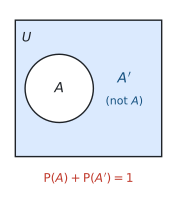
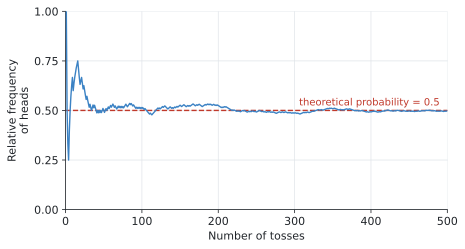

# SL 4.5 — Introduction to probability（確率の基礎） {#sec-sl-4-5}

::: {.callout-note}
## What you should be able to do
- **trial・outcome・sample space・event** の意味を説明できる。
- **sample space** を、表やリストの形で書き出せる。
- 公式集の $P(A) = \dfrac{n(A)}{n(U)}$ を使って確率を求められる。
- **complementary event**（余事象）$A'$ を使って、$P(A') = 1 - P(A)$ を計算できる。
- **relative frequency**（相対度数）を求め、**theoretical probability** との違いを説明できる。
- **expected number of occurrences**（期待される回数）を求められる。
:::

::: {.callout-important}
## Formula booklet に載っているもの
SL 4.5 の欄には、次の2行が印刷されています。

$$
P(A) = \frac{n(A)}{n(U)}
$$

$$
P(A) + P(A') = 1
$$

**どちらも短い式ですが、意味が分かっていないと使えません。** $n(A)$ と $n(U)$ が何を数えているのかを、この項目でしっかりつかんでください。
:::

::: {.callout-warning}
## この項目は「数え上げ」が9割です
確率の計算そのものは割り算だけです。**難しいのは、分母と分子を正しく数えること**です。

ですから、この項目でやることは実質1つ ── **起こりうることを全部きちんと書き出す**ことです。

**急いで頭の中で数えないでください。** 表かリストに書き出すほうが、結局は速くて確実です。
:::

## The idea

### 1. 言葉を4つ覚えます {#vocabulary}

確率の問題は、**言葉の定義が分かっていないと問題文が読めません。** まずここからです。

| English | 日本語 | 意味 | 例（サイコロを1回振る） |
|---|---|---|---|
| **trial** | 試行 | 1回やってみること | サイコロを1回振る |
| **outcome** | 結果 | 1回の trial で起こったこと | $3$ が出た |
| **sample space** ($U$) | 標本空間 | 起こりうる outcome の全部 | $\{1, 2, 3, 4, 5, 6\}$ |
| **event** | 事象 | 注目している outcome の集まり | 「偶数が出る」$= \{2, 4, 6\}$ |

: 確率の4つの言葉 {#tbl-sl45-words}

**event は、sample space の一部分**です。$\{2,4,6\}$ は $\{1,2,3,4,5,6\}$ の中に入っています。

::: {.callout-note}
## $U$ という記号について
IB では sample space を **$U$** と書きます。`universal set`（全体集合）の $U$ です。

教科書によっては $S$、$\Omega$（オメガ）、$\varepsilon$（イプシロン）を使うこともありますが、**IB の問題文と公式集では $U$** です。
:::

### 2. 確率の式 {#probability-formula}

公式集の式は、**「注目しているものの個数 ÷ 全部の個数」**というだけです。

$$
P(A) = \frac{n(A)}{n(U)}
$$ {#eq-sl45-prob}

| 記号 | 意味 |
|---|---|
| $n(A)$ | event $A$ に入る outcome の**個数** |
| $n(U)$ | sample space 全部の outcome の**個数** |

: 記号の意味 {#tbl-sl45-symbols}

**$n(\ )$ は「個数」を表す記号**です。$n(U) = 6$ なら「起こりうることが全部で6通り」という意味です。

サイコロで「偶数が出る」なら、

$$
P(\text{even}) = \frac{n(\{2,4,6\})}{n(\{1,2,3,4,5,6\})} = \frac{3}{6} = \frac{1}{2}
$$

#### この式が使える条件 ★

シラバスの Content 欄に、さりげなく大事な言葉が入っています。

> Concepts of trial, outcome, **equally likely outcomes**, relative frequency, sample space ($U$) and event.

**@eq-sl45-prob が使えるのは、すべての outcome が「同じくらい起こりやすい」ときだけ**です。

サイコロなら、$1$ から $6$ はどれも同じくらい出ます。だから「個数を数えて割る」でよいのです。

**もし細工のあるサイコロで $6$ ばかり出るなら、この式は使えません。** そういうときは、実際に振って調べるしかありません（次の節の relative frequency です）。

::: {.callout-important}
## 確率は必ず $0$ 以上 $1$ 以下です
$$
0 \leq P(A) \leq 1
$$

- $P(A) = 0$ … **絶対に起こらない**（impossible）
- $P(A) = 1$ … **必ず起こる**（certain）

サイコロで「$7$ が出る」確率は $0$、「$6$ 以下が出る」確率は $1$ です。

**答えが $1$ を超えたり負になったりしたら、必ずどこかで間違えています。** 出た答えを見て、この範囲に入っているか毎回確かめてください。
:::

### 3. sample space の書き出し方 {#sample-space}

シラバスに、こう書かれています。

> Sample spaces can be represented in many ways, for example **as a table or a list**.

**表かリスト**で書き出します。書き出せば、あとは数えるだけです。

#### リストで書く

コインを2回投げるなら、

$$
U = \{ \text{HH}, \ \text{HT}, \ \text{TH}, \ \text{TT} \}
$$

$n(U) = 4$ です。

**HT と TH は別のもの**として数えます。1回目が表で2回目が裏、というのと、その逆は違う出来事だからです。ここを1つにまとめてしまうと、答えが変わってしまいます。

#### 表で書く ── サイコロ2個

サイコロを2個振ったときの**和**は、表にすると一目で分かります。

| $+$ | 1 | 2 | 3 | 4 | 5 | 6 |
|---|---|---|---|---|---|---|
| **1** | 2 | 3 | 4 | 5 | 6 | 7 |
| **2** | 3 | 4 | 5 | 6 | 7 | 8 |
| **3** | 4 | 5 | 6 | 7 | 8 | 9 |
| **4** | 5 | 6 | 7 | 8 | 9 | 10 |
| **5** | 6 | 7 | 8 | 9 | 10 | 11 |
| **6** | 7 | 8 | 9 | 10 | 11 | 12 |

: サイコロ2個の和 {#tbl-sl45-dice}

**マス目は $6 \times 6 = 36$ 個**です。これが $n(U)$ になります。

**この表は、試験でも自分でかいてください。** 36マスをかくのに1分もかかりません。頭の中で数えるより、ずっと確実です。

### 4. complementary events（余事象）{#complement}

**$A$ が起こらない**という事象を **$A'$**（A ダッシュ、A prime）と書きます。日本語では **余事象**です。

{#fig-sl45-comp width=60%}

$A$ と $A'$ を合わせると、**sample space 全体**になります。どんな結果も、$A$ に入るか入らないかのどちらかだからです。

だから、公式集の2行目が成り立ちます。

$$
P(A) + P(A') = 1
$$ {#eq-sl45-comp}

実際に使うのは、たいていこの形に変えたものです。

$$
P(A') = 1 - P(A)
$$

#### 「〜でない」は引き算のほうが速い ★

これが余事象の一番の使いどころです。

たとえば @tbl-sl45-dice で「**和が $4$ 以上**」の確率を求めるとします。$4, 5, 6, \ldots, 12$ を全部数えるのは大変です。

そこで**逆**を数えます。和が $4$ 未満、つまり $2$ か $3$ になるのは $1 + 2 = 3$ 通りだけです。

$$
P(\text{和が}4\text{未満}) = \frac{3}{36} = \frac{1}{12}
$$

$$
P(\text{和が}4\text{以上}) = 1 - \frac{1}{12} = \frac{11}{12}
$$

**数えるマスが $33$ 個から $3$ 個に減りました。**

**問題文に `at least`（少なくとも）や `not`（〜でない）が出てきたら、余事象を思い出してください。** そのほうが速いことがよくあります。

### 5. relative frequency と theoretical probability {#relative-frequency}

ここまでは「同じくらい起こりやすい」と分かっている場合の話でした。**実際にやってみて調べる**方法もあります。

$$
\text{relative frequency} = \frac{\text{その結果が起こった回数}}{\text{trial の回数}}
$$ {#eq-sl45-relfreq}

これを **experimental probability**（実験による確率）ともいいます。

| | 求め方 | 別名 |
|---|---|---|
| **theoretical probability** | 数えて割る（@eq-sl45-prob） | 理論上の確率 |
| **relative frequency** | 実際にやって数える | experimental probability |

: 2つの確率 {#tbl-sl45-two}

#### 回数を増やすと、2つは近づきます

コインを投げて、表が出た割合を記録していくと、次のようになります。

{#fig-sl45-relfreq width=95%}

**最初は大きく揺れます。** 10回くらいでは $0.7$ になったり $0.3$ になったりします。

ですが**回数が増えるにつれて、$0.5$ に落ち着いていきます。** これが理論上の確率です。

::: {.callout-note}
## この違いを聞かれることがあります
「相対度数が理論値と違うのはなぜか」と問われたら、**理由は2つ**考えられます。

1. **trial の回数が少ないから**（もっと増やせば近づく）
2. **そもそも公平でないから**（細工のあるサイコロ、ゆがんだコインなど）

どちらなのかは、**ずれの大きさ**で判断します。少しのずれなら 1、何度やっても大きくずれるなら 2 を疑います。

答案では `The number of trials was small` や `The die may be biased` のように書きます。
:::

### 6. expected number of occurrences ★ {#expected-number}

シラバスが、**具体例つき**で挙げている項目です。

> Example: If there are **128 students** in a class and the probability of being absent is **0.1**, the expected number of absent students is **12.8**.

式にすると、こうです。

$$
(\text{期待される回数}) = n \times P(A)
$$ {#eq-sl45-expected}

$n$ は trial の回数（人数、個数）です。

$$
128 \times 0.1 = 12.8
$$

::: {.callout-important}
## $12.8$ 人でよいのです
「$12.8$ 人なんて、いるわけがない」と思うかもしれません。**それで正解です。**

これは「**平均するとこれくらい**」という値だからです。SL 4.3 で平均が $1.45$ 人になったのと同じことです。

**答えを $13$ 人に丸めないでください。** 問題文が `Give your answer to the nearest whole number` と言っていないかぎり、$12.8$ のまま書きます。

**丸めると減点されます。** ここは実際によく間違えるところです。
:::

## Why it works

ここでは、**なぜ $P(A) + P(A') = 1$ なのか**だけを説明します。

どんな結果が出ても、それは **$A$ に入るか、入らないか**のどちらかです。両方に入ることも、どちらにも入らないこともありません。

ですから、**$A$ の個数と $A'$ の個数を足すと、全体の個数になります。**

$$
n(A) + n(A') = n(U)
$$

この式の両辺を $n(U)$ で割ってみます。

$$
\frac{n(A)}{n(U)} + \frac{n(A')}{n(U)} = \frac{n(U)}{n(U)}
$$

左の2つは、それぞれ $P(A)$ と $P(A')$ です（@eq-sl45-prob）。右は $1$ です。

$$
P(A) + P(A') = 1
$$

**@fig-sl45-comp の絵を、式にしただけ**です。円の中と外を足せば、長方形全体になる ── それだけのことです。

## Worked examples

::: {.callout-note appearance="simple"}
問題文は英語です。意味が理解できなかったら、問題文の下の「**日本語訳**」を開いてください。解説は日本語です。
:::

::: {#exm-sl45-bag}
[A bag contains $5$ red counters, $3$ blue counters and $4$ green counters. One counter is taken from the bag at random.]{.q-en}

**(a)** [Write down $n(U)$.]{.q-en}

**(b)** [Find the probability that the counter is red.]{.q-en}

**(c)** [Find the probability that the counter is not green.]{.q-en}

<details class="jp-trans">
<summary>日本語訳</summary>

袋の中に赤いカウンターが $5$ 個、青が $3$ 個、緑が $4$ 個入っています。袋から無作為に $1$ 個取り出します。

**(a)** $n(U)$ を書きなさい。

**(b)** そのカウンターが赤である確率を求めなさい。

**(c)** そのカウンターが緑でない確率を求めなさい。

（`at random` は「無作為に」＝どれも同じくらい選ばれやすい、という意味です。）

</details>

---

**(a)** $n(U)$ は**起こりうること全部の個数**です。カウンターは全部で

$$
5 + 3 + 4 = 12 \ \text{個}
$$

$$
n(U) = 12
$$

**(b)** 赤は $5$ 個なので $n(A) = 5$ です。@eq-sl45-prob に入れます。

$$
P(\text{red}) = \frac{n(\text{red})}{n(U)} = \frac{5}{12}
$$

**約分できないので、このままです。**

**(c)** 「緑でない」は**余事象**です。2通りの解き方があります。

**方法1：直接数える。** 緑でないのは赤 $5$ 個と青 $3$ 個で $8$ 個です。

$$
P(\text{not green}) = \frac{8}{12} = \frac{2}{3}
$$

**方法2：$1$ から引く。**

$$
P(\text{green}) = \frac{4}{12} = \frac{1}{3}
$$

$$
P(\text{not green}) = 1 - \frac{1}{3} = \frac{2}{3}
$$

**どちらでも構いません。** この問題では数えるほうが速いですが、数が多いときは引き算のほうが確実です。

::: {.callout-note}
## 解答例（答案用紙にはこう書く）
**(a)** $n(U) = 5 + 3 + 4 = 12$

**(b)** $P(\text{red}) = \dfrac{5}{12}$

**(c)** $P(\text{not green}) = \dfrac{8}{12} = \dfrac{2}{3}$
:::
:::

::: {#exm-sl45-dice}
[Two fair six-sided dice are rolled. The score is the sum of the two numbers.]{.q-en}

**(a)** [Write down the number of possible outcomes.]{.q-en}

**(b)** [Find the probability that the score is $7$.]{.q-en}

**(c)** [Find the probability that the score is greater than $9$.]{.q-en}

**(d)** [Find the probability that the score is $1$.]{.q-en}

<details class="jp-trans">
<summary>日本語訳</summary>

公平な6面のサイコロを2個振ります。得点は2つの数の和です。

**(a)** 起こりうる結果の総数を書きなさい。

**(b)** 得点が $7$ である確率を求めなさい。

**(c)** 得点が $9$ より大きい確率を求めなさい。

**(d)** 得点が $1$ である確率を求めなさい。

（`fair` は「公平な」＝どの目も同じくらい出る、という意味です。）

</details>

---

@tbl-sl45-dice の表を見ながら数えます。**試験でもこの表を自分でかいてください。**

**(a)** $1$ 個目に $6$ 通り、$2$ 個目にも $6$ 通りなので、

$$
n(U) = 6 \times 6 = 36
$$

**(b)** 表の中で $7$ が入っているマスを数えます。**斜めに1列**並んでいて、$6$ 個あります。

$$
P(7) = \frac{6}{36} = \frac{1}{6}
$$

**(c)** 「$9$ より大きい」は $10$、$11$、$12$ です。**$9$ は入りません。**

表から、$10$ が $3$ 個、$11$ が $2$ 個、$12$ が $1$ 個。

$$
n(A) = 3 + 2 + 1 = 6
$$

$$
P(\text{score} > 9) = \frac{6}{36} = \frac{1}{6}
$$

**`greater than` は「より大きい」で、その数自身は含みません。** `at least`（以上）なら含みます。**ここを読み違えると答えが変わります。**

**(d)** 一番小さい和は $1 + 1 = 2$ です。**$1$ になることはありません。**

$$
P(1) = 0
$$

**「ありえない」ときの答えは $0$ です。** 空欄にしないでください。

::: {.callout-note}
## 解答例（答案用紙にはこう書く）
**(a)** $n(U) = 36$

**(b)** $P(7) = \dfrac{6}{36} = \dfrac{1}{6}$

**(c)** $P(\text{score} > 9) = \dfrac{3+2+1}{36} = \dfrac{6}{36} = \dfrac{1}{6}$

**(d)** $P(1) = 0$
:::
:::

::: {#exm-sl45-complement}
[The probability that a student passes a driving test at the first attempt is $0.82$.]{.q-en}

**(a)** [Find the probability that a student does not pass at the first attempt.]{.q-en}

**(b)** [Two dice are rolled. Use the complement to find the probability that the score is at least $4$.]{.q-en}

<details class="jp-trans">
<summary>日本語訳</summary>

ある生徒が運転免許の試験に1回目で合格する確率は $0.82$ です。

**(a)** 1回目で合格しない確率を求めなさい。

**(b)** サイコロを2個振ります。**余事象を使って**、得点が $4$ 以上である確率を求めなさい。

</details>

---

**(a)** 「合格しない」は「合格する」の余事象です。@eq-sl45-comp を使います。

$$
P(\text{not pass}) = 1 - 0.82 = 0.18
$$

**(b)** 問題文が「余事象を使え」と指示しています。[なぜそのほうが速いか](#complement)を思い出してください。

「$4$ 以上」の逆は「**$4$ 未満**」、つまり和が $2$ か $3$ です。

@tbl-sl45-dice から、$2$ は $1$ 個、$3$ は $2$ 個。

$$
P(\text{score} < 4) = \frac{1+2}{36} = \frac{3}{36} = \frac{1}{12}
$$

$$
P(\text{score} \geq 4) = 1 - \frac{1}{12} = \frac{11}{12}
$$

**直接数えると $33$ マスです。** 余事象なら $3$ マス。**この差が、余事象を使う理由**です。

::: {.callout-note}
## 解答例（答案用紙にはこう書く）
**(a)** $P(\text{not pass}) = 1 - 0.82 = 0.18$

**(b)** $P(\text{score} < 4) = \dfrac{3}{36} = \dfrac{1}{12}$

$$P(\text{score} \geq 4) = 1 - \frac{1}{12} = \frac{11}{12}$$
:::
:::

::: {#exm-sl45-relfreq}
[A die is rolled $200$ times. The number $4$ occurs $40$ times.]{.q-en}

**(a)** [Find the relative frequency of rolling a $4$.]{.q-en}

**(b)** [State the theoretical probability of rolling a $4$ with a fair die.]{.q-en}

**(c)** [Comment on whether the die appears to be fair.]{.q-en}

<details class="jp-trans">
<summary>日本語訳</summary>

サイコロを $200$ 回振ったところ、$4$ が $40$ 回出ました。

**(a)** $4$ が出る相対度数を求めなさい。

**(b)** 公平なサイコロで $4$ が出る理論上の確率を書きなさい。

**(c)** このサイコロが公平と言えるかどうか、コメントしなさい。

</details>

---

**(a)** @eq-sl45-relfreq のとおり、**出た回数 ÷ 振った回数**です。

$$
\text{relative frequency} = \frac{40}{200} = 0.2
$$

**(b)** 公平なサイコロなら、$6$ つの目がどれも同じくらい出ます。

$$
P(4) = \frac{1}{6} = 0.167 \quad (3 \text{ s.f.})
$$

**(c)** 2つをくらべます。

$$
0.2 \quad \text{と} \quad 0.167
$$

**近いですが、ぴったりではありません。** ここで「公平ではない」と決めつけないでください。

[相対度数は必ず揺れます](#relative-frequency)。$200$ 回では、この程度のずれはふつうに起こります。

**もっと確かめたければ、回数を増やすことです。** $2000$ 回、$20000$ 回と増やして、それでも $0.2$ 前後に留まるなら、そのときは細工を疑います。

::: {.callout-note}
## 解答例（答案用紙にはこう書く）
**(a)** $\dfrac{40}{200} = 0.2$

**(b)** $\dfrac{1}{6} = 0.167$ (3 s.f.)

**(c)** *The relative frequency $0.2$ is close to the theoretical probability $0.167$, so the die may well be fair. The difference could easily be due to the small number of trials. Rolling the die many more times would give a clearer answer.*
:::
:::

::: {#exm-sl45-expected}
[The probability that a student in a school cycles to school is $0.24$. There are $850$ students in the school.]{.q-en}

**(a)** [Find the expected number of students who cycle to school.]{.q-en}

**(b)** [In another school there are $128$ students and the probability of a student being absent is $0.1$. Find the expected number of absent students.]{.q-en}

<details class="jp-trans">
<summary>日本語訳</summary>

ある学校で、生徒が自転車で通学する確率は $0.24$ です。この学校には $850$ 人の生徒がいます。

**(a)** 自転車で通学すると期待される生徒の人数を求めなさい。

**(b)** 別の学校には $128$ 人の生徒がいて、生徒が欠席する確率は $0.1$ です。欠席すると期待される生徒の人数を求めなさい。

</details>

---

**(a)** @eq-sl45-expected のとおり、**人数 × 確率**です。

$$
850 \times 0.24 = 204
$$

**(b)** 同じようにやります。

$$
128 \times 0.1 = 12.8
$$

**$12.8$ 人です。** 小数のままで正解です。

**$13$ 人に丸めないでください。** [これは「平均するとこれくらい」という値](#expected-number)なので、小数になって構いません。

問題文に `to the nearest whole number`（整数に丸めよ）と書いてあるときだけ、丸めます。

::: {.callout-note}
## 解答例（答案用紙にはこう書く）
**(a)** $850 \times 0.24 = 204$ students

**(b)** $128 \times 0.1 = 12.8$ students
:::
:::

## Common errors

::: {.callout-warning}
## HT と TH を1つに数える
コイン2枚では、$U = \{\text{HH}, \text{HT}, \text{TH}, \text{TT}\}$ で **$n(U) = 4$** です。

「表1枚・裏1枚」を1通りとして $n(U) = 3$ にすると、答えが全部おかしくなります。**順番が違えば別の結果**です。
:::

::: {.callout-warning}
## `greater than` と `at least` を取り違える
- `greater than 9` … $10, 11, 12$（**$9$ を含まない**）
- `at least 9` … $9, 10, 11, 12$（**$9$ を含む**）

**問題文の言葉を、指でなぞって確認してください。** ここだけで答えが変わります。
:::

::: {.callout-warning}
## 期待される回数を整数に丸める
$12.8$ 人は $12.8$ 人のままです。

指示がないかぎり丸めません。**「人数だから整数のはず」と考えて丸めるのが、一番多い失点です。**
:::

::: {.callout-warning}
## 相対度数がずれただけで「公平でない」と結論する
少ない回数なら、ずれるのがふつうです（@fig-sl45-relfreq）。

**「回数が少ないからかもしれない」という可能性を、必ず一緒に書いてください。**
:::

::: {.callout-warning}
## $P(A) = \dfrac{n(A)}{n(U)}$ を、同様に確からしくない場合に使う
この式が使えるのは、**すべての outcome が同じくらい起こりやすいとき**だけです。

問題文の `fair`、`at random`、`equally likely` が、その合図です。**これらの語がなければ、少し立ち止まってください。**
:::

::: {.callout-warning}
## 確率を「〜通り」と答える
聞かれているのが確率なら、**答えは分数か小数**です。

「$6$ 通り」ではなく $\dfrac{6}{36} = \dfrac{1}{6}$ と書きます。
:::

::: {.callout-warning}
## ありえない場合を空欄にする
起こりえないなら、答えは **$0$** です。空欄や「なし」ではありません。

同じように、必ず起こるなら **$1$** です。
:::

## Using your GDC (TI-Nspire CX II)

**この項目では、電卓の出番はほとんどありません。** 数えて割るだけだからです。

ただ、次の2つは知っておくと役に立ちます。

### 分数のまま計算する

$$
1 - \frac{1}{12}
$$

をそのまま打ち込めば、$\dfrac{11}{12}$ と**分数で**返してきます。

**小数に直したいときは `ctrl + enter`** で押し直します。$0.9166\ldots$ になります。

::: {.callout-tip}
## 答えは分数のままでよいことが多いです
$\dfrac{11}{12}$ は正確な値ですが、$0.917$ は丸めた値です。

**問題文が小数を指定していなければ、分数のまま書くほうが安全**です。
:::

### シミュレーションで確かめる ── `randInt`

@fig-sl45-relfreq のようなことは、**自分の電卓でも確かめられます。**

Calculator ページで、

```
randInt(1, 6, 100)
```

と打つと、$1$ から $6$ までの整数が $100$ 個返ってきます。サイコロを $100$ 回振ったのと同じです。

これを Lists & Spreadsheet の列に入れて、

```
menu → Statistics → Stat Calculations → One-Variable Statistics
```

で $4$ が何回出たかを数えれば、相対度数が出せます。

**同じことを $100$ 回、$1000$ 回とやってみると、$\dfrac{1}{6}$ に近づいていくのが自分の手で見られます。**

::: {.callout-note}
## 試験でこの操作を求められることはありません
シラバスには `Simulations may be used to enhance this topic`（シミュレーションを使うと理解が深まる）と書かれているだけです。

**やらなくても点は取れます。** ただ、確率が腑に落ちない人には、実際に手を動かしてみるのが一番の近道です。
:::

## Exercises

::: {.callout-note appearance="simple"}
各問題に、折りたたみが3つ付いています。**日本語訳**、**解答例**（答案用紙に書くべきこと。英語です）、**解説**（なぜそうなるか。日本語です）。

まず自分で解いて、次に解答例と見くらべてください。**解説は、合わなかったときだけ開けば十分です。**
:::

::: {.exercise-block}

[1]{.ex-no} [A spinner has $8$ equal sections numbered $1$ to $8$. The spinner is spun once.]{.q-en}

**(a)** [Write down the sample space $U$.]{.q-en}

**(b)** [Write down $n(U)$.]{.q-en}

**(c)** [Find the probability of spinning an odd number.]{.q-en}

<details class="jp-trans">
<summary>日本語訳</summary>

$1$ から $8$ までの番号が付いた $8$ 等分のスピナーがあります。これを $1$ 回まわします。

**(a)** 標本空間 $U$ を書きなさい。

**(b)** $n(U)$ を書きなさい。

**(c)** 奇数が出る確率を求めなさい。

</details>

::: {.callout-note collapse="true"}
## 解答例（答案用紙に書くこと）
**(a)** $U = \{1, 2, 3, 4, 5, 6, 7, 8\}$

**(b)** $n(U) = 8$

**(c)** Odd numbers: $1, 3, 5, 7$

$$P(\text{odd}) = \frac{4}{8} = \frac{1}{2}$$
:::

::: {.callout-tip collapse="true"}
## 解説
**(a)** `Write down the sample space` は「起こりうることを全部書け」という指示です。**中カッコ $\{\ \}$ を使ってください。**

**(b)** 個数なので $8$。

**(c)** 奇数は $1, 3, 5, 7$ の $4$ つ。$\dfrac{4}{8}$ を約分して $\dfrac{1}{2}$ です。

**`equal sections` が「同様に確からしい」の合図**です。だから[数えて割る式](#probability-formula)が使えます。
:::

::: {.ex-sep}
:::

[2]{.ex-no} [A box contains $7$ red pens, $5$ white pens and $8$ black pens. One pen is chosen at random.]{.q-en}

**(a)** [Find the probability that the pen is white.]{.q-en}

**(b)** [Find the probability that the pen is not red.]{.q-en}

<details class="jp-trans">
<summary>日本語訳</summary>

箱の中に赤いペンが $7$ 本、白が $5$ 本、黒が $8$ 本入っています。$1$ 本を無作為に選びます。

**(a)** そのペンが白である確率を求めなさい。

**(b)** そのペンが赤でない確率を求めなさい。

</details>

::: {.callout-note collapse="true"}
## 解答例（答案用紙に書くこと）
$n(U) = 7 + 5 + 8 = 20$

**(a)** $P(\text{white}) = \dfrac{5}{20} = \dfrac{1}{4}$

**(b)** $P(\text{not red}) = \dfrac{13}{20}$
:::

::: {.callout-tip collapse="true"}
## 解説
まず $n(U)$ を出します。$7+5+8 = 20$。**ここを間違えると全部ずれます。**

**(a)** $\dfrac{5}{20}$ は約分して $\dfrac{1}{4}$。

**(b)** 赤でないのは白 $5$ 本と黒 $8$ 本で $13$ 本。$\dfrac{13}{20}$ は約分できません。

余事象で $1 - \dfrac{7}{20} = \dfrac{13}{20}$ としても同じです。**どちらでも構いません。**
:::

::: {.ex-sep}
:::

[3]{.ex-no} [A coin is tossed twice.]{.q-en}

**(a)** [List all the possible outcomes.]{.q-en}

**(b)** [Find the probability of getting exactly one head.]{.q-en}

**(c)** [Find the probability of getting at least one head.]{.q-en}

<details class="jp-trans">
<summary>日本語訳</summary>

コインを $2$ 回投げます。

**(a)** 起こりうる結果をすべて書き出しなさい。

**(b)** 表がちょうど $1$ 回出る確率を求めなさい。

**(c)** 表が少なくとも $1$ 回出る確率を求めなさい。

</details>

::: {.callout-note collapse="true"}
## 解答例（答案用紙に書くこと）
**(a)** $U = \{\text{HH}, \text{HT}, \text{TH}, \text{TT}\}$

**(b)** Exactly one head: HT, TH

$$P = \frac{2}{4} = \frac{1}{2}$$

**(c)** $P(\text{no heads}) = P(\text{TT}) = \dfrac{1}{4}$

$$P(\text{at least one head}) = 1 - \frac{1}{4} = \frac{3}{4}$$
:::

::: {.callout-tip collapse="true"}
## 解説
**(a)** **$n(U) = 4$ です。** HT と TH を1つにまとめないでください。

**(b)** `exactly one head`（ちょうど1回）は HT と TH の $2$ 通り。HH は $2$ 回なので入りません。

**(c)** `at least one`（少なくとも1回）が出たら、**余事象**です。

逆は「$1$ 回も出ない」＝ TT の $1$ 通りだけ。

$$1 - \frac{1}{4} = \frac{3}{4}$$

直接数えても HH, HT, TH の $3$ 通りで同じ答えですが、**回数が増えると余事象のほうが圧倒的に速くなります。** いまのうちに慣れておいてください。
:::

::: {.ex-sep}
:::

[4]{.ex-no} [Two fair six-sided dice are rolled. The score is the positive difference between the two numbers (for example, $5$ and $2$ give a score of $3$).]{.q-en}

**(a)** [Find the probability that the score is $0$.]{.q-en}

**(b)** [Find the probability that the score is at least $4$.]{.q-en}

<details class="jp-trans">
<summary>日本語訳</summary>

公平な6面のサイコロを $2$ 個振ります。得点は $2$ つの数の差（正の値）です（たとえば $5$ と $2$ なら得点は $3$）。

**(a)** 得点が $0$ である確率を求めなさい。

**(b)** 得点が $4$ 以上である確率を求めなさい。

</details>

::: {.callout-note collapse="true"}
## 解答例（答案用紙に書くこと）
$n(U) = 36$

**(a)** Score $0$: $(1,1), (2,2), (3,3), (4,4), (5,5), (6,6)$ — $6$ outcomes

$$P(0) = \frac{6}{36} = \frac{1}{6}$$

**(b)** Score $4$: $(1,5),(5,1),(2,6),(6,2)$ — $4$ outcomes

Score $5$: $(1,6),(6,1)$ — $2$ outcomes

$$P(\text{at least } 4) = \frac{4+2}{36} = \frac{6}{36} = \frac{1}{6}$$
:::

::: {.callout-tip collapse="true"}
## 解説
**和ではなく差の表**を、自分でかいてください。@tbl-sl45-dice と同じ $6 \times 6$ の表で、中身を差にするだけです。

**(a)** 差が $0$ になるのは**同じ目が出たとき**です。表の**斜め1列**、$6$ 個です。

**(b)** `at least 4` は $4$ **と** $5$ です。差の最大は $6-1 = 5$ なので、$6$ はありえません。

$4$ になるのは $(1,5)$ と $(5,1)$、$(2,6)$ と $(6,2)$ の $4$ 通り。**順番が違うものを両方数えるのを忘れないでください。**

$5$ になるのは $(1,6)$ と $(6,1)$ の $2$ 通り。合わせて $6$ 通りです。
:::

::: {.ex-sep}
:::

[5]{.ex-no} [The probability that it rains on a given day in a city is $0.35$.]{.q-en}

**(a)** [Find the probability that it does not rain on that day.]{.q-en}

**(b)** [Write down $P(A) + P(A')$ for any event $A$.]{.q-en}

<details class="jp-trans">
<summary>日本語訳</summary>

ある都市で、ある日に雨が降る確率は $0.35$ です。

**(a)** その日に雨が降らない確率を求めなさい。

**(b)** 任意の事象 $A$ について $P(A) + P(A')$ を書きなさい。

</details>

::: {.callout-note collapse="true"}
## 解答例（答案用紙に書くこと）
**(a)** $P(\text{no rain}) = 1 - 0.35 = 0.65$

**(b)** $P(A) + P(A') = 1$
:::

::: {.callout-tip collapse="true"}
## 解説
**(a)** 余事象なので $1$ から引くだけです。

**(b)** これは公式集に載っている式そのものです。**どんな事象でも必ず $1$** になります。

理由は [Why it works](#why-it-works) のとおりで、$A$ と $A'$ を合わせると全体になるからです。
:::

::: {.ex-sep}
:::

[6]{.ex-no} [A spinner has $4$ equal sections coloured red, blue, green and yellow. The spinner is spun $300$ times and lands on red $57$ times.]{.q-en}

**(a)** [Find the relative frequency of landing on red.]{.q-en}

**(b)** [State the theoretical probability of landing on red.]{.q-en}

**(c)** [Give one reason why these two values are different.]{.q-en}

<details class="jp-trans">
<summary>日本語訳</summary>

$4$ 等分され、赤・青・緑・黄に色分けされたスピナーがあります。$300$ 回まわして、赤に $57$ 回止まりました。

**(a)** 赤に止まる相対度数を求めなさい。

**(b)** 赤に止まる理論上の確率を書きなさい。

**(c)** この $2$ つの値が異なる理由を $1$ つ挙げなさい。

</details>

::: {.callout-note collapse="true"}
## 解答例（答案用紙に書くこと）
**(a)** $\dfrac{57}{300} = 0.19$

**(b)** $\dfrac{1}{4} = 0.25$

**(c)** *The relative frequency is based on a limited number of trials, so it will not be exactly equal to the theoretical probability. (Alternatively, the spinner may not be perfectly fair.)*
:::

::: {.callout-tip collapse="true"}
## 解説
**(a)** $\dfrac{57}{300} = 0.19$。

**(b)** $4$ 等分なので $\dfrac{1}{4} = 0.25$。

**(c)** [理由は2つ](#relative-frequency)あり、**どちらか1つ書けば正解**です。

- **回数が限られているから**（もっとまわせば近づく）
- **スピナーが完全に公平でないから**

$0.19$ と $0.25$ の差は $0.06$。$300$ 回なら、このくらいのずれは起こりえます。**ですから「公平でない」と決めつける書き方は避けてください。** `may not be` のように書きます。
:::

::: {.ex-sep}
:::

[7]{.ex-no} [A factory produces $1200$ light bulbs in a day. The probability that a bulb is faulty is $0.035$.]{.q-en}

[Find the expected number of faulty bulbs produced in a day.]{.q-en}

<details class="jp-trans">
<summary>日本語訳</summary>

ある工場では1日に $1200$ 個の電球を作ります。電球が不良品である確率は $0.035$ です。

1日に作られる不良品の期待される個数を求めなさい。

</details>

::: {.callout-note collapse="true"}
## 解答例（答案用紙に書くこと）
$$1200 \times 0.035 = 42 \ \text{bulbs}$$
:::

::: {.callout-tip collapse="true"}
## 解説
**個数 × 確率**、それだけです（@eq-sl45-expected）。

$$1200 \times 0.035 = 42$$

**ちょうど整数になりました。** ですがこれは偶然で、整数になるとはかぎりません（次の問題を見てください）。

**単位（bulbs）も書いてください。** 数字だけだと何の $42$ か伝わりません。
:::

::: {.ex-sep}
:::

[8]{.ex-no} [A class has $90$ students. The probability that a student is left-handed is $0.18$.]{.q-en}

**(a)** [Find the expected number of left-handed students.]{.q-en}

**(b)** [Explain why your answer to part (a) is not a whole number.]{.q-en}

<details class="jp-trans">
<summary>日本語訳</summary>

ある学年に $90$ 人の生徒がいます。生徒が左利きである確率は $0.18$ です。

**(a)** 左利きの生徒の期待される人数を求めなさい。

**(b)** (a) の答えが整数にならない理由を説明しなさい。

（本書オリジナルの問題です。）

</details>

::: {.callout-note collapse="true"}
## 解答例（答案用紙に書くこと）
**(a)** $90 \times 0.18 = 16.2$ students

**(b)** *The expected number is an average value, not the number of students in any one particular class. Over many classes of $90$ students, the average number of left-handed students would be $16.2$. It does not need to be a whole number.*
:::

::: {.callout-tip collapse="true"}
## 解説
**(a)** $90 \times 0.18 = 16.2$。**$16$ に丸めないでください。**

**(b)** ここが本題です。

**期待値は「平均するとこれくらい」という値**です。実際のあるクラスでは $15$ 人だったり $18$ 人だったりしますが、たくさんのクラスで平均を取ると $16.2$ に近づきます。

SL 4.3 で、兄弟の人数の平均が $1.45$ 人になったのと同じことです。**$1.45$ 人の兄弟がいる人はいませんが、平均としては正しい値**でした。

**「小数でよい」だけでなく、「平均だから」という理由**まで書けると完成です。
:::

::: {.ex-sep}
:::

[9]{.ex-no} [A bag contains only red and blue marbles. One marble is taken at random. State the value of each of the following.]{.q-en}

**(a)** [The probability of taking a green marble.]{.q-en}

**(b)** [The probability of taking a marble that is either red or blue.]{.q-en}

<details class="jp-trans">
<summary>日本語訳</summary>

袋の中には赤と青のビー玉だけが入っています。$1$ 個を無作為に取り出します。次のそれぞれの値を答えなさい。

**(a)** 緑のビー玉を取り出す確率。

**(b)** 赤または青のビー玉を取り出す確率。

</details>

::: {.callout-note collapse="true"}
## 解答例（答案用紙に書くこと）
**(a)** $0$

**(b)** $1$
:::

::: {.callout-tip collapse="true"}
## 解説
**(a)** 緑は入っていないので、**絶対に起こりません**。確率は $0$ です。

**空欄にしたり「なし」と書いたりしないでください。** $0$ という数が答えです。

**(b)** 赤か青しか入っていないので、取り出したビー玉は**必ず**どちらかです。**必ず起こる**ので確率は $1$ です。

この2つが[確率のとりうる範囲の両端](#probability-formula)です。

$$0 \leq P(A) \leq 1$$

**答えがこの範囲の外に出たら、必ず計算ミスです。**
:::

::: {.ex-sep}
:::

[10]{.ex-no} [In a town, the probability that a randomly chosen household owns a dog is $0.15$. There are $4000$ households in the town.]{.q-en}

**(a)** [Find the probability that a randomly chosen household does not own a dog.]{.q-en}

**(b)** [Find the expected number of households that own a dog.]{.q-en}

**(c)** [Find the expected number of households that do not own a dog.]{.q-en}

<details class="jp-trans">
<summary>日本語訳</summary>

ある町で、無作為に選んだ世帯が犬を飼っている確率は $0.15$ です。町には $4000$ 世帯あります。

**(a)** 無作為に選んだ世帯が犬を飼っていない確率を求めなさい。

**(b)** 犬を飼っていると期待される世帯数を求めなさい。

**(c)** 犬を飼っていないと期待される世帯数を求めなさい。

</details>

::: {.callout-note collapse="true"}
## 解答例（答案用紙に書くこと）
**(a)** $P(\text{no dog}) = 1 - 0.15 = 0.85$

**(b)** $4000 \times 0.15 = 600$ households

**(c)** $4000 \times 0.85 = 3400$ households
:::

::: {.callout-tip collapse="true"}
## 解説
この項目で学んだことが**全部つながる**問題です。

**(a)** 余事象。$1 - 0.15 = 0.85$。

**(b)** 世帯数 × 確率。$4000 \times 0.15 = 600$。

**(c)** (a) で出した $0.85$ を使います。$4000 \times 0.85 = 3400$。

**検算**：$600 + 3400 = 4000$ ✓ **全世帯の数になります。**

これは偶然ではありません。$P(A) + P(A') = 1$ の両辺に $4000$ を掛けたものだからです。**この足し算で確かめる習慣**をつけてください。
:::

:::
