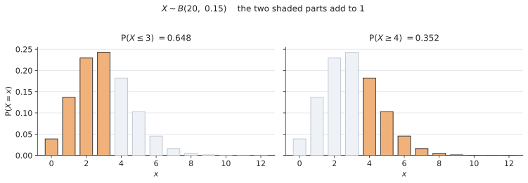
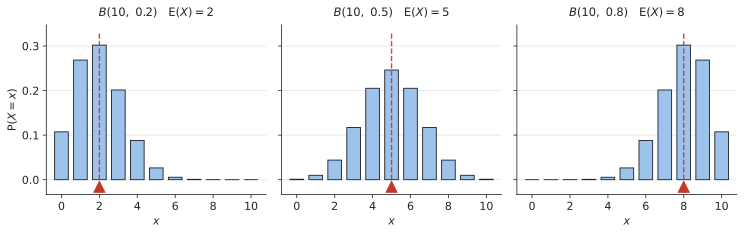

# SL 4.8 — The binomial distribution（二項分布） {#sec-sl-4-8}

::: {.callout-note}
## What you should be able to do
- **binomial distribution**（二項分布）が使える場面かどうかを、**4つの条件**で判定できる。
- $X \sim B(n, p)$ という書き方の意味が分かり、自分で書ける。
- 電卓の **binomPdf** と **binomCdf** を使い分けて確率を出せる。
- `at most`、`at least`、`more than`、`fewer than` を、$x$ の範囲に直せる。
- 公式集の **$E(X) = np$** と **$\text{Var}(X) = np(1-p)$** を使える。
- $E(X)$ が問題の中で**何を意味するか**を説明できる。
:::

::: {.callout-important}
## Formula booklet に載っているもの
SL 4.8 の欄には、次の3つが印刷されています。

$$
X \sim B(n, p)
$$

$$
E(X) = np
$$

$$
\text{Var}(X) = np(1-p)
$$

**この3つは配られるので、覚える必要はありません。**

★ そして**ここが大事なところ**なのですが、**確率そのものを出す式は、公式集に載っていません。** シラバスにはこう書かれています。

> In examinations, binomial probabilities should be found using **available technology**.

つまり、**確率は電卓を使って出します。** 電卓の使い方をマスターしましょう。
:::

## The idea

::: {.callout-tip}
## 電卓を開きながら、このページを読んでください
この項目は、読んでから電卓を触るのでは身に付きません。**TI-Nspire を手元に置いて、出てくる数を1つずつ自分で打ち込みながら**読み進めてください。

使うのは次の1か所だけです。

```
menu → Statistics → Distributions
```

ここに `Binomial Pdf` と `Binomial Cdf` があることを、いま確かめておいてください。
:::

### 1. binomial distribution が使える4つの条件 ★ {#four-conditions}

**binomial distribution**（二項分布）が扱うのは、次のような場面です。

> **同じことを $n$ 回くり返して、うまくいった回数を数える。**

ただし、**どんな場面でも使えるわけではありません。** シラバスにも *"Situations where the binomial distribution is an appropriate model"*（二項分布が適切なモデルとなる場面）と書かれています。**使ってよいかどうかの判断**が、この項目の半分です。

次の**4つが全部そろったとき**だけ使えます。

| # | 条件 | 英語での言い方 |
|---|---|---|
| 1 | **回数 $n$ が決まっている** | a fixed number of trials |
| 2 | 毎回の結果が**2つだけ**（うまくいく／いかない） | two outcomes: success or failure |
| 3 | うまくいく確率 $p$ が**毎回同じ** | the probability $p$ is constant |
| 4 | 毎回が **independent**（前の回の結果に影響されない） | the trials are independent |

: binomial distribution の4条件 {#tbl-sl48-conditions}

サイコロを $20$ 回振って $6$ が出た回数、$50$ 個の製品を調べて不良品だった個数、$15$ 本のシュートを打って入った本数 ── どれも4つを満たします。

::: {.callout-warning}
## 一番検討が必要なのは、条件3です ★★
**`without replacement`（戻さずに）と書いてあったら、二項分布は使えません。**

袋から玉を戻さずに取り出すと、**2回目の確率が1回目と変わってしまいます**（SL 4.6 でやったとおりです）。条件3の「$p$ が毎回同じ」が崩れます。

`with replacement`（戻しながら）なら $p$ は変わらないので、使えます。

**問題文の `with` と `without` は、必ず丸で囲んでください。** ここだけで、使える・使えないが決まります。
:::

### 2. $X \sim B(n, p)$ という書き方 {#notation}

条件がそろったら、次のように書きます。**公式集にもこの形で載っています。**

$$
X \sim B(n, p)
$$ {#eq-sl48-notation}

#### 記号の意味

| 記号 | 読み方・意味 |
|---|---|
| $\sim$ | 「〜に従う」（distributed as）。イコールではありません |
| $B$ | **B**inomial の B |
| $n$ | くり返す**回数** |
| $p$ | 1回あたりの**うまくいく確率** |

: $X \sim B(n,p)$ の記号 {#tbl-sl48-symbols}

たとえば「$4$ 択の問題 $12$ 問を、全部あてずっぽうで答える」なら、$n = 12$、$p = \dfrac{1}{4} = 0.25$ なので、

$$
X \sim B(12,\ 0.25)
$$

と書きます。$X$ は「正解した問題数」です（大文字 $X$ と小文字 $x$ の使い分けは SL 4.7 のとおりです）。

**`Write down the distribution of X` と聞かれたら、この1行を書くだけ**で点になります。

### 3. 電卓のコマンドは2つだけです ★ {#two-commands}

確率は電卓で出します。**使うのは2つだけ**です。

| 求めたいもの | 使うコマンド |
|---|---|
| $P(X = x)$ … **ちょうど** $x$ 回 | **binomPdf** |
| $P(a \leq X \leq b)$ … **範囲** | **binomCdf** |

: 2つのコマンドの使い分け {#tbl-sl48-commands}

**Pdf は棒1本、Cdf は棒のかたまり**、と覚えてください。操作の手順は、このページの「Using your GDC」に書いてあります。

ちなみに、**Cdf** は **cumulative**（累積）からきています。SL 4.2 の cumulative frequency と同じ「積み上げていく」という意味です。

### 4. 英語を $x$ の範囲に直します ★★ {#inequalities}

**この項目で一番点を落とすのは、計算ではなくここです。** 英語を読み違えると、電卓に入れる数がずれます。

$n = 20$ のときを例に、$5$ を基準にして並べます。

| 英語 | 不等号 | binomCdf に入れる範囲 |
|---|---|---|
| `exactly 5` | $X = 5$ | binomPdf を使う |
| `at most 5` | $X \leq 5$ | $0$ から $5$ |
| `fewer than 5`, `less than 5` | $X < 5$、つまり $X \leq 4$ | $0$ から $4$ |
| `at least 5` | $X \geq 5$ | $5$ から $20$ |
| `more than 5` | $X > 5$、つまり $X \geq 6$ | $6$ から $20$ |
| `between 5 and 8 inclusive` | $5 \leq X \leq 8$ | $5$ から $8$ |

: 英語と $x$ の範囲 {#tbl-sl48-words}

::: {.callout-important}
## `at least` と `more than` は違います ★★
- **`at least 5`** … 「$5$ 以上」。**$5$ を含みます**
- **`more than 5`** … 「$5$ より多い」。**$5$ を含みません**

同じように **`at most 5`（$5$ 以下、$5$ を含む）** と **`fewer than 5`（$5$ 未満、$5$ を含まない）** も違います。

$X$ は回数なので**整数しかとりません**。だから $X < 5$ は $X \leq 4$ と同じです。**この読みかえができると、binomCdf の上限・下限に迷わなくなります。**
:::

#### 残りどうしの関係も使えます

$P(X \leq 3)$ と $P(X \geq 4)$ は、**足すと $1$** になります。**あいだに抜けている整数がない**からです。

{#fig-sl48-ranges width=100%}

@fig-sl48-ranges は $X \sim B(20,\ 0.15)$ の様子です。オレンジの棒を全部足すと、左が $0.648$、右が $0.352$ で、**合わせて $1$** になります。

$$
P(X \geq 4) = 1 - P(X \leq 3)
$$ {#eq-sl48-complement}

SL 4.5 の complementary events と同じ考え方です。TI-Nspire では binomCdf に上限 $n$ を入れれば直接出せるので、**この式を使わなくても解けます。** ただし「$P(X \geq 4)$ を $1 - P(X \leq 4)$ にしてしまう」間違いが多いので、**引くなら $3$ まで**だと覚えておいてください。

### 5. $E(X) = np$ と $\text{Var}(X)$ {#mean-variance}

期待値は、公式集の1行で出ます。

$$
E(X) = np
$$ {#eq-sl48-mean}

$20$ 回のうち $1$ 回あたり $0.15$ の確率で起きるなら、**$20 \times 0.15 = 3$ 回**。感覚どおりの答えになります。

分散（**variance**）も公式集にあります。

$$
\text{Var}(X) = np(1-p)
$$ {#eq-sl48-var}

**標準偏差（standard deviation）が聞かれたら、$\text{Var}(X)$ の平方根**をとります。

$$
\sigma = \sqrt{np(1-p)}
$$ {#eq-sl48-sd}

::: {.callout-note}
## $\sigma$ の式は公式集に**ありません**
公式集にあるのは $\text{Var}(X) = np(1-p)$ までです。**「標準偏差は分散の平方根」**という関係（SL 4.3）は、自分で覚えておく必要があります。

**まず $\text{Var}(X)$ を出して、それから平方根をとる**、という2段階でやれば確実です。
:::

#### $p$ が変わると形が変わります

{#fig-sl48-shapes width=100%}

@fig-sl48-shapes は $n = 10$ のまま $p$ だけを変えたものです。赤い印が $E(X) = np$ の位置です。

- $p$ が小さいと**左に寄り**ます（$p = 0.2$ なら $E(X) = 2$）
- $p = 0.5$ のときだけ**左右対称**になります
- $p$ が大きいと**右に寄り**ます（$p = 0.8$ なら $E(X) = 8$）

**$E(X) = np$ は、山のだいたい真ん中**です。答えを出したあと、**$np$ とかけ離れていないか**を見れば、打ち間違いに気づけます。

## Why it works

ここでは、**なぜ $E(X) = np$ になるのか**だけを説明します。

$1$ 回だけやる場合を考えます。うまくいけば $1$ 回、いかなければ $0$ 回と数えるので、SL 4.7 の $E(X)$ の式に入れると、

$$
E(X) = 1 \times p + 0 \times (1-p) = p
$$

**$1$ 回あたりの期待値は $p$** です。

それを $n$ 回くり返すのですから、全部合わせると $p$ が $n$ 個ぶんで、

$$
E(X) = \underbrace{p + p + \cdots + p}_{n \text{ 個}} = np
$$

これが @eq-sl48-mean です。**SL 4.5 の「期待される回数 $= n \times P(A)$」と、まったく同じ式**でもあります。シラバスにも *"Link to: expected number of occurrences (SL4.5)"* と書かれています。

::: {.callout-note}
## 確率の式について（参考・覚えなくてよい）
確率そのものは、次の式から出ています。

$$
P(X = x) = \binom{n}{x} p^{x} (1-p)^{\,n-x}
$$

**この式は AI SL の公式集に載っていませんし、試験で使う必要もありません。** シラバスが「電卓で求めること」と指定しているからです。

意味だけ書いておくと、$p^{x}$ は「うまくいった $x$ 回ぶん」、$(1-p)^{\,n-x}$ は「いかなかった残りぶん」、$\binom{n}{x}$ は「どの回にうまくいくかの選び方の数」です。**電卓の binomPdf は、これを計算しています。**

分散 $np(1-p)$ の証明も、シラバスに *"Not required: Formal proof of mean and variance"* と明記されています。**出ません。**
:::

## Worked examples

::: {.callout-note appearance="simple"}
問題文は英語です。意味が理解できなかったら、問題文の下の「**日本語訳**」を開いてください。解説は日本語です。
:::

::: {#exm-sl48-quiz}
[A quiz has $12$ multiple-choice questions. Each question has $4$ options, exactly one of which is correct. A student guesses the answer to every question. Let $X$ be the number of questions the student answers correctly.]{.q-en}

**(a)** [Write down the distribution of $X$.]{.q-en}

**(b)** [Find $P(X = 3)$.]{.q-en}

**(c)** [Find $E(X)$.]{.q-en}

<details class="jp-trans">
<summary>日本語訳</summary>

$12$ 問の4択問題のテストがあります。各問題には $4$ つの選択肢があり、正解はちょうど $1$ つです。ある生徒が全問をあてずっぽうで答えます。$X$ をその生徒が正解した問題数とします。

**(a)** $X$ の分布を書きなさい。

**(b)** $P(X = 3)$ を求めなさい。

**(c)** $E(X)$ を求めなさい。

</details>

---

**(a)** まず[4つの条件](#four-conditions)を確かめます。**問題数 $12$ は決まっている**、**各問は正解か不正解の2つだけ**、**あてずっぽうなので確率はどの問も $\dfrac{1}{4}$ で同じ**、**1問の結果が次の問に影響しない**。4つとも満たしています。

$n = 12$、$p = \dfrac{1}{4} = 0.25$ なので、

$$
X \sim B(12,\ 0.25)
$$

**`Write down` なので、この1行で終わりです。** 計算はいりません。

**(b)** 「ちょうど $3$ 問」なので **binomPdf** です（@tbl-sl48-commands）。

```
binomPdf(12, 0.25, 3)
```

$$
P(X = 3) = 0.258 \quad (3 \text{ s.f.})
$$

**(c)** [公式集の $E(X) = np$](#mean-variance) です。

$$
E(X) = 12 \times 0.25 = 3
$$

**あてずっぽうで $12$ 問やると、平均 $3$ 問正解する**、という意味です。(b) で「ちょうど $3$ 問」を聞かれているのは、そこが山の真ん中だからです。

::: {.callout-note}
## 解答例（答案用紙にはこう書く）
**(a)** $X \sim B(12,\ 0.25)$

**(b)** $P(X = 3) = 0.258$ (3 s.f.)

**(c)** $E(X) = np = 12 \times 0.25 = 3$
:::
:::

::: {#exm-sl48-defects}
[A machine produces components. On average $8\%$ of the components are defective. A random sample of $20$ components is taken. Let $X$ be the number of defective components in the sample.]{.q-en}

**(a)** [Find $P(X = 2)$.]{.q-en}

**(b)** [Find the probability that at most $2$ components are defective.]{.q-en}

**(c)** [Find the probability that at least $3$ components are defective.]{.q-en}

<details class="jp-trans">
<summary>日本語訳</summary>

ある機械が部品を作っています。平均して $8\%$ が不良品です。$20$ 個の部品を無作為に取り出します。$X$ をその中の不良品の個数とします。

**(a)** $P(X = 2)$ を求めなさい。

**(b)** 不良品が $2$ 個以下である確率を求めなさい。

**(c)** 不良品が $3$ 個以上である確率を求めなさい。

（`at most` は「〜以下」、`at least` は「〜以上」です。）

</details>

---

$8\%$ なので $p = 0.08$、$n = 20$ です。

$$
X \sim B(20,\ 0.08)
$$

**(a)** 「ちょうど $2$ 個」なので **binomPdf**。

```
binomPdf(20, 0.08, 2)
```

$$
P(X = 2) = 0.271 \quad (3 \text{ s.f.})
$$

**(b)** **`at most 2` は $X \leq 2$**、つまり $0, 1, 2$ です（@tbl-sl48-words）。**範囲なので binomCdf**、下限は $0$ です。

```
binomCdf(20, 0.08, 0, 2)
```

$$
P(X \leq 2) = 0.788 \quad (3 \text{ s.f.})
$$

**(c)** **`at least 3` は $X \geq 3$**。上限は $n = 20$ です。

```
binomCdf(20, 0.08, 3, 20)
```

$$
P(X \geq 3) = 0.212 \quad (3 \text{ s.f.})
$$

**検算。** (b) と (c) は残りどうしなので、足すと $1$ になるはずです。

$$
0.788 + 0.212 = 1.000 \quad \checkmark
$$

**このように確かめられる形の設問は多い**ので、時間があれば必ずやってください。

::: {.callout-note}
## 解答例（答案用紙にはこう書く）
$X \sim B(20,\ 0.08)$

**(a)** $P(X = 2) = 0.271$ (3 s.f.)

**(b)** $P(X \leq 2) = 0.788$ (3 s.f.)

**(c)** $P(X \geq 3) = 0.212$ (3 s.f.)
:::
:::

::: {#exm-sl48-seeds}
[A seed supplier states that $60\%$ of its seeds germinate. A gardener plants $50$ of these seeds. Let $X$ be the number of seeds that germinate.]{.q-en}

**(a)** [Find $E(X)$.]{.q-en}

**(b)** [Find $\text{Var}(X)$.]{.q-en}

**(c)** [Find the standard deviation of $X$, correct to three significant figures.]{.q-en}

<details class="jp-trans">
<summary>日本語訳</summary>

ある種苗店は、自社の種の $60\%$ が発芽すると言っています。ある人がこの種を $50$ 粒まきます。$X$ を発芽した種の数とします。

**(a)** $E(X)$ を求めなさい。

**(b)** $\text{Var}(X)$ を求めなさい。

**(c)** $X$ の標準偏差を有効数字3桁で求めなさい。

（`germinate` は「発芽する」です。）

</details>

---

$n = 50$、$p = 0.6$ です。

$$
X \sim B(50,\ 0.6)
$$

**(a)** [公式集の $E(X) = np$](#mean-variance)。

$$
E(X) = 50 \times 0.6 = 30
$$

**(b)** [公式集の $\text{Var}(X) = np(1-p)$](#mean-variance)。**$1 - p = 0.4$** をまず出しておくと、打ち間違いが減ります。

$$
\text{Var}(X) = 50 \times 0.6 \times 0.4 = 12
$$

**(c)** **標準偏差は分散の平方根**です。この関係は公式集にありません。

$$
\sigma = \sqrt{12} = 3.4641\ldots = 3.46 \quad (3 \text{ s.f.})
$$

**$30$ の前後 $3.46$ くらい、つまりだいたい $27$ 〜 $33$ 粒あたりに集まる**、ということです。$50$ 粒まいて $30$ 粒前後、と考えれば感覚に合います。

::: {.callout-note}
## 解答例（答案用紙にはこう書く）
$X \sim B(50,\ 0.6)$

**(a)** $E(X) = np = 50 \times 0.6 = 30$

**(b)** $\text{Var}(X) = np(1-p) = 50 \times 0.6 \times 0.4 = 12$

**(c)** $\sigma = \sqrt{12} = 3.46$ (3 s.f.)
:::
:::

::: {#exm-sl48-throws}
[A basketball player succeeds with $70\%$ of her free throws. She takes $15$ free throws. Let $X$ be the number of successful throws.]{.q-en}

**(a)** [Find $P(X = 12)$.]{.q-en}

**(b)** [Find the probability that she scores between $10$ and $13$ throws inclusive.]{.q-en}

**(c)** [Find $E(X)$ and interpret this value in context.]{.q-en}

<details class="jp-trans">
<summary>日本語訳</summary>

あるバスケットボール選手は、フリースローの $70\%$ を成功させます。この選手が $15$ 本のフリースローを打ちます。$X$ を成功した本数とします。

**(a)** $P(X = 12)$ を求めなさい。

**(b)** 成功が $10$ 本以上 $13$ 本以下である確率を求めなさい。

**(c)** $E(X)$ を求め、その値の意味を問題の文脈で説明しなさい。

（`between 10 and 13 inclusive` は「$10$ 以上 $13$ 以下」、つまり両端を含みます。）

</details>

---

$$
X \sim B(15,\ 0.7)
$$

**(a)** 「ちょうど $12$ 本」なので **binomPdf**。

```
binomPdf(15, 0.7, 12)
```

$$
P(X = 12) = 0.170 \quad (3 \text{ s.f.})
$$

**(b)** **`between 10 and 13 inclusive` は $10 \leq X \leq 13$** です。**`inclusive` があるので両端を含みます**（@tbl-sl48-words）。範囲なので **binomCdf**、下限 $10$・上限 $13$。

```
binomCdf(15, 0.7, 10, 13)
```

$$
P(10 \leq X \leq 13) = 0.686 \quad (3 \text{ s.f.})
$$

**(c)** $E(X) = 15 \times 0.7 = 10.5$ です。

`Interpret` が付いているので、**数字だけでは点になりません。** 言葉で1文書きます。

::: {.model-answer}
**試験ではこう書く**

*On average, the player scores $10.5$ out of $15$ free throws, in the long run.*
:::

（意味：この選手は長い目で見て、$15$ 本のうち平均 $10.5$ 本を決める。）

**$10.5$ 本というシュートは存在しません**が、丸めないでください。SL 4.7 でやったとおり、**期待値は実際には出ない値でも構いません**。

::: {.callout-note}
## 解答例（答案用紙にはこう書く）
$X \sim B(15,\ 0.7)$

**(a)** $P(X = 12) = 0.170$ (3 s.f.)

**(b)** $P(10 \leq X \leq 13) = 0.686$ (3 s.f.)

**(c)** $E(X) = np = 15 \times 0.7 = 10.5$

*On average, the player scores $10.5$ out of $15$ free throws, in the long run.*
:::
:::

::: {#exm-sl48-model}
[A bag contains $20$ counters, of which $6$ are red. Five counters are taken from the bag **without replacement**. Let $X$ be the number of red counters taken.]{.q-en}

**(a)** [Explain why $X$ cannot be modelled by a binomial distribution.]{.q-en}

[The five counters are now taken **with replacement** instead.]{.q-en}

**(b)** [Write down the distribution of $X$.]{.q-en}

**(c)** [Find $P(X = 2)$.]{.q-en}

<details class="jp-trans">
<summary>日本語訳</summary>

袋に $20$ 個のカウンターが入っていて、そのうち $6$ 個が赤です。**戻さずに** $5$ 個取り出します。$X$ を取り出した赤の個数とします。

**(a)** $X$ が二項分布ではモデル化できない理由を説明しなさい。

いま、$5$ 個を**戻しながら**取り出すことにします。

**(b)** $X$ の分布を書きなさい。

**(c)** $P(X = 2)$ を求めなさい。

</details>

---

**(a)** `Explain why` なので、**言葉で答える設問**です。計算はいりません。

[条件3（$p$ が毎回同じ）](#four-conditions)が崩れています。**戻さないと、2回目の袋の中身が変わる**からです。

$1$ 回目に赤を引く確率は $\dfrac{6}{20} = 0.3$ ですが、赤を引いたあとの $2$ 回目は $\dfrac{5}{19}$ になります。**毎回同じ $p$ ではありません。**

::: {.model-answer}
**試験ではこう書く**

*Because the counters are taken without replacement, the probability of taking a red counter changes at each draw. The trials are not independent and $p$ is not constant, so the binomial model does not apply.*
:::

（意味：戻さずに取り出すので、赤を引く確率が毎回変わってしまう。試行が独立でなく $p$ も一定でないので、二項分布は使えない。）

**(b)** 戻すなら、袋の中身はいつも $20$ 個のまま、赤も $6$ 個のままです。**毎回 $p = \dfrac{6}{20} = 0.3$** になります。

$$
X \sim B(5,\ 0.3)
$$

**(c)** 「ちょうど $2$ 個」なので **binomPdf**。

```
binomPdf(5, 0.3, 2)
```

$$
P(X = 2) = 0.309 \quad (3 \text{ s.f.})
$$

::: {.callout-note}
## 解答例（答案用紙にはこう書く）
**(a)** *Because the counters are taken without replacement, the probability of taking a red counter changes at each draw, so $p$ is not constant. The binomial model does not apply.*

**(b)** $X \sim B(5,\ 0.3)$

**(c)** $P(X = 2) = 0.309$ (3 s.f.)
:::
:::

## Common errors

::: {.callout-warning}
## `at least` と `more than` を同じだと思う ★★
**この項目で一番多い間違いです。**

- `at least 4` … $X \geq 4$。**$4$ を含む**
- `more than 4` … $X > 4$、つまり $X \geq 5$。**$4$ を含まない**

`at most` と `fewer than` も同じ関係です。**問題文の英語に線を引いてから、電卓に入れる数を決めてください。**
:::

::: {.callout-warning}
## $P(X \geq 4)$ を $1 - P(X \leq 4)$ にしてしまう
引くなら **$P(X \leq 3)$** です。

$$
P(X \geq 4) = 1 - P(X \leq 3)
$$

**$x = 4$ を2回数えてしまう**のがこの間違いです。TI-Nspire なら `binomCdf(n, p, 4, n)` で直接出せるので、**そもそも引き算をしないほうが安全**です。
:::

::: {.callout-warning}
## `without replacement` なのに二項分布を使う ★★
戻さない場合は $p$ が毎回変わるので、**使えません**（SL 4.6 の樹形図で解きます）。

**問題文に `with` と `without` のどちらが書いてあるか**を、必ず確かめてください。
:::

::: {.callout-warning}
## binomPdf と binomCdf を取り違える
- **`exactly`（ちょうど）** … binom**Pdf**
- **範囲（以上・以下・〜から〜まで）** … binom**Cdf**

範囲なのに Pdf を使うと、棒 $1$ 本ぶんしか出ません。**答えが小さすぎたら、まずここを疑ってください。**
:::

::: {.callout-warning}
## binomCdf の下限・上限を入れ忘れる
`at most 5` なら **下限は $0$**、`at least 5` なら **上限は $n$** です。

**4つの欄が全部埋まっているか**を確かめてから `OK` を押してください。
:::

::: {.callout-warning}
## $p$ にパーセントのまま入れる
$8\%$ なら **$p = 0.08$** です。$8$ ではありません。

$p$ は必ず $0$ 以上 $1$ 以下です。**$1$ より大きい数を入れた時点で間違いです。**
:::

::: {.callout-warning}
## $E(X)$ を「必ずその回数になる」と読む
$E(X) = 10.5$ は「**長い目で見た平均**」です。$15$ 本打って必ず $10.5$ 本入る、という意味ではありません。

`Interpret` が付いていたら、**`on average`、`in the long run` を必ず入れて**ください。
:::

::: {.callout-warning}
## 標準偏差を聞かれて $\text{Var}(X)$ で答える
公式集にあるのは $\text{Var}(X) = np(1-p)$ までです。

**`standard deviation` と書かれていたら、そのあとに平方根が必要**です。
:::

## Using your GDC (TI-Nspire CX II)

シラバスが「確率は technology で求めること」と指定しています。**ここの操作を覚えれば、この項目の計算はすべて出せます。**

### 使うのはこの1か所だけです

```
menu → Statistics → Distributions
```

ここに次の2つがあります。

| コマンド | いつ使うか |
|---|---|
| **Binomial Pdf** | $P(X = x)$ … ちょうど $x$ 回 |
| **Binomial Cdf** | $P(a \leq X \leq b)$ … 範囲 |

: Distributions メニューの2つ {#tbl-sl48-gdc}

### Binomial Pdf ── ちょうど $x$ 回

出てくる欄は3つです。

- `Num Trials, n` … 回数 $n$
- `Prob Success, p` … 確率 $p$（**小数で**）
- `X Value` … 求めたい $x$

@exm-sl48-quiz なら $12$、$0.25$、$3$ と入れて、$0.258$ が出ます。

### Binomial Cdf ── 範囲 ★

出てくる欄は**4つ**です。**下2つを埋め忘れないでください。**

- `Num Trials, n`
- `Prob Success, p`
- **`Lower Bound`** … 範囲の**下**
- **`Upper Bound`** … 範囲の**上**

@tbl-sl48-words のとおりに直すと、次のようになります。

| 求めたいもの | Lower | Upper |
|---|---|---|
| $P(X \leq 5)$（at most 5） | $0$ | $5$ |
| $P(X < 5)$（fewer than 5） | $0$ | $4$ |
| $P(X \geq 5)$（at least 5） | $5$ | $n$ |
| $P(X > 5)$（more than 5） | $6$ | $n$ |
| $P(5 \leq X \leq 8)$ | $5$ | $8$ |

: Lower と Upper の決め方（$n$ は問題の回数） {#tbl-sl48-bounds}

**「以上」なら Upper に $n$、「以下」なら Lower に $0$。** ここだけ覚えておけば迷いません。

### 直接打ち込むこともできます

計算ページで、次のように書いても同じ結果になります。

```
binomPdf(20, 0.08, 2)
binomCdf(20, 0.08, 0, 2)
```

**メニューから選んだほうが、欄の名前が出るぶん安全**です。慣れるまではメニューを使ってください。

### 出た答えを $np$ で見直す

答えが出たら、**$E(X) = np$ と見くらべてください**（@fig-sl48-shapes）。

$n = 20$、$p = 0.08$ なら $np = 1.6$ です。**$1$ 個や $2$ 個あたりの確率が大きく、$10$ 個の確率はほぼ $0$** になるはずです。ここから大きく外れていたら、$n$ と $p$ を入れ違えているか、パーセントのまま入れています。

### 表にして全部見る（余裕があれば）

Lists & Spreadsheet で、$A$ 列に $0, 1, 2, \ldots, n$ を入れ、$B$ 列の見出しの下に

```
= binomPdf(20, 0.08, a[])
```

と入れると、**すべての $x$ についての確率が一度に並びます。** @fig-sl48-shapes のような形が自分の電卓で見えるので、一度やっておくと分布のイメージがつかめます。

## Exercises

::: {.callout-note appearance="simple"}
各問題に、折りたたみが3つ付いています。**日本語訳**、**解答例**（答案用紙に書くべきこと。英語です）、**解説**（なぜそうなるか。日本語です）。

まず自分で解いて、次に解答例と見くらべてください。**解説は、合わなかったときだけ開けば十分です。**
:::

::: {.exercise-block}

[1]{.ex-no} [The random variable $X$ follows the distribution $X \sim B(10,\ 0.4)$.]{.q-en}

**(a)** [Find $P(X = 4)$.]{.q-en}

**(b)** [Find $P(X \leq 4)$.]{.q-en}

**(c)** [Find $E(X)$.]{.q-en}

<details class="jp-trans">
<summary>日本語訳</summary>

確率変数 $X$ は $X \sim B(10,\ 0.4)$ に従います。

**(a)** $P(X = 4)$ を求めなさい。

**(b)** $P(X \leq 4)$ を求めなさい。

**(c)** $E(X)$ を求めなさい。

</details>

::: {.callout-note collapse="true"}
## 解答例（答案用紙に書くこと）
**(a)** $P(X = 4) = 0.251$ (3 s.f.)

**(b)** $P(X \leq 4) = 0.633$ (3 s.f.)

**(c)** $E(X) = np = 10 \times 0.4 = 4$
:::

::: {.callout-tip collapse="true"}
## 解説
**(a)** 「ちょうど $4$」なので **binomPdf**。`binomPdf(10, 0.4, 4)`。

**(b)** **範囲なので binomCdf**。$X \leq 4$ の下限は $0$ です。`binomCdf(10, 0.4, 0, 4)`。

**(c)** $E(X) = np = 4$。

**(a) と (b) を見くらべてください。** $P(X \leq 4) = 0.633$ の中に $P(X = 4) = 0.251$ が含まれています。**Cdf のほうが必ず大きくなります。** 逆になっていたら、どちらかを取り違えています。
:::

::: {.ex-sep}
:::

[2]{.ex-no} [In a large batch of light bulbs, $5\%$ are faulty. A random sample of $30$ bulbs is taken. Let $X$ be the number of faulty bulbs in the sample.]{.q-en}

**(a)** [Find $P(X = 0)$.]{.q-en}

**(b)** [Find the probability that at least one bulb is faulty.]{.q-en}

<details class="jp-trans">
<summary>日本語訳</summary>

大量の電球のうち $5\%$ が不良品です。$30$ 個を無作為に取り出します。$X$ をその中の不良品の個数とします。

**(a)** $P(X = 0)$ を求めなさい。

**(b)** 少なくとも $1$ 個が不良品である確率を求めなさい。

</details>

::: {.callout-note collapse="true"}
## 解答例（答案用紙に書くこと）
$X \sim B(30,\ 0.05)$

**(a)** $P(X = 0) = 0.215$ (3 s.f.)

**(b)** $P(X \geq 1) = 1 - P(X = 0) = 1 - 0.215 = 0.785$ (3 s.f.)
:::

::: {.callout-tip collapse="true"}
## 解説
$5\%$ なので **$p = 0.05$**。$5$ ではありません。

**(a)** `binomPdf(30, 0.05, 0)`。

**(b)** **`at least one` は $X \geq 1$** です。$X$ は整数なので、**$X \geq 1$ の反対は $X = 0$ だけ**になります。

$$P(X \geq 1) = 1 - P(X = 0)$$

`binomCdf(30, 0.05, 1, 30)` でも同じ $0.785$ が出ます。**どちらでも構いません。**

`at least one`（少なくとも1つ）は**とてもよく出る言い方**です。見たら「$1$ から引く」と反応できるようにしておいてください。
:::

::: {.ex-sep}
:::

[3]{.ex-no} [The random variable $X$ follows the distribution $X \sim B(60,\ 0.35)$.]{.q-en}

**(a)** [Find $E(X)$.]{.q-en}

**(b)** [Find $\text{Var}(X)$.]{.q-en}

**(c)** [Find the standard deviation of $X$, correct to three significant figures.]{.q-en}

<details class="jp-trans">
<summary>日本語訳</summary>

確率変数 $X$ は $X \sim B(60,\ 0.35)$ に従います。

**(a)** $E(X)$ を求めなさい。

**(b)** $\text{Var}(X)$ を求めなさい。

**(c)** $X$ の標準偏差を有効数字3桁で求めなさい。

</details>

::: {.callout-note collapse="true"}
## 解答例（答案用紙に書くこと）
**(a)** $E(X) = np = 60 \times 0.35 = 21$

**(b)** $\text{Var}(X) = np(1-p) = 60 \times 0.35 \times 0.65 = 13.65$

**(c)** $\sigma = \sqrt{13.65} = 3.69$ (3 s.f.)
:::

::: {.callout-tip collapse="true"}
## 解説
**どちらも公式集に載っています。** 代入するだけです。

**(b)** $1 - p = 1 - 0.35 = 0.65$。**先にこれを出しておく**と、$0.35$ を2回かけるような間違いが防げます。

**(c)** **標準偏差は分散の平方根**。この関係だけは公式集にありません。

$$\sqrt{13.65} = 3.6945\ldots$$

有効数字3桁で $3.69$ です。**$13.65$ をそのまま答えないでください。**
:::

::: {.ex-sep}
:::

[4]{.ex-no} [The random variable $X$ follows the distribution $X \sim B(n,\ 0.2)$, and $E(X) = 9$.]{.q-en}

**(a)** [Find the value of $n$.]{.q-en}

**(b)** [Find $\text{Var}(X)$.]{.q-en}

<details class="jp-trans">
<summary>日本語訳</summary>

確率変数 $X$ は $X \sim B(n,\ 0.2)$ に従い、$E(X) = 9$ です。

**(a)** $n$ の値を求めなさい。

**(b)** $\text{Var}(X)$ を求めなさい。

</details>

::: {.callout-note collapse="true"}
## 解答例（答案用紙に書くこと）
**(a)** $np = 9$

$$0.2n = 9$$

$$n = 45$$

**(b)** $\text{Var}(X) = np(1-p) = 45 \times 0.2 \times 0.8 = 7.2$
:::

::: {.callout-tip collapse="true"}
## 解説
**逆向きに使う問題**です。$E(X) = np$ の $n$ が分からないので、方程式にします。

$$n \times 0.2 = 9 \quad \Rightarrow \quad n = \frac{9}{0.2} = 45$$

**(b)** (a) で $n = 45$ が出たので、代入するだけです。$1 - p = 0.8$。

$$45 \times 0.2 \times 0.8 = 7.2$$

**$n$ は回数なので、必ず整数になります。** 整数にならなかったら (a) の計算が間違っています。
:::

::: {.ex-sep}
:::

[5]{.ex-no} [The random variable $X$ follows the distribution $X \sim B(20,\ 0.15)$.]{.q-en}

**(a)** [Find $P(X \geq 4)$.]{.q-en}

**(b)** [Find $P(X > 4)$.]{.q-en}

**(c)** [Explain why your answers to (a) and (b) are different.]{.q-en}

<details class="jp-trans">
<summary>日本語訳</summary>

確率変数 $X$ は $X \sim B(20,\ 0.15)$ に従います。

**(a)** $P(X \geq 4)$ を求めなさい。

**(b)** $P(X > 4)$ を求めなさい。

**(c)** (a) と (b) の答えが違う理由を説明しなさい。

</details>

::: {.callout-note collapse="true"}
## 解答例（答案用紙に書くこと）
**(a)** $P(X \geq 4) = 0.352$ (3 s.f.)

**(b)** $P(X > 4) = 0.170$ (3 s.f.)

**(c)** *$P(X \geq 4)$ includes $x = 4$, while $P(X > 4)$ does not. The difference between the two answers is $P(X = 4) = 0.182$.*
:::

::: {.callout-tip collapse="true"}
## 解説
**(a)** $X \geq 4$ なので Lower $= 4$、Upper $= 20$。`binomCdf(20, 0.15, 4, 20)`。

**(b)** **$X > 4$ は $X \geq 5$** です（$X$ は整数）。Lower $= 5$。`binomCdf(20, 0.15, 5, 20)`。

**(c)** 違いは **$x = 4$ の棒1本ぶん**だけです。

$$0.352 - 0.170 = 0.182 = P(X = 4)$$

`binomPdf(20, 0.15, 4)` で確かめられます。

**この棒1本の差が、そのまま点差になります。** `at least` と `more than` を読み分けてください。
:::

::: {.ex-sep}
:::

[6]{.ex-no} [The random variable $X$ follows the distribution $X \sim B(25,\ 0.6)$.]{.q-en}

**(a)** [Find the probability that $X$ is between $12$ and $18$ inclusive.]{.q-en}

**(b)** [Find $E(X)$.]{.q-en}

<details class="jp-trans">
<summary>日本語訳</summary>

確率変数 $X$ は $X \sim B(25,\ 0.6)$ に従います。

**(a)** $X$ が $12$ 以上 $18$ 以下である確率を求めなさい。

**(b)** $E(X)$ を求めなさい。

</details>

::: {.callout-note collapse="true"}
## 解答例（答案用紙に書くこと）
**(a)** $P(12 \leq X \leq 18) = 0.849$ (3 s.f.)

**(b)** $E(X) = np = 25 \times 0.6 = 15$
:::

::: {.callout-tip collapse="true"}
## 解説
**(a)** **`inclusive` があるので両端を含みます。** Lower $= 12$、Upper $= 18$ をそのまま入れます。

```
binomCdf(25, 0.6, 12, 18)
```

`inclusive` がなければ $13 \leq X \leq 17$ になるところでした。**この1語で答えが変わります。**

**(b)** $E(X) = 15$。

$15$ は $12$ と $18$ のちょうど真ん中あたりです。**山の中心を含む広い範囲なので、確率が $0.849$ と大きくなる**のは自然です。答えが $0.1$ のような小さい値になったら、範囲を入れ間違えています。
:::

::: {.ex-sep}
:::

[7]{.ex-no} [Each morning a commuter records whether her train is late. Over a period of $20$ days, let $X$ be the number of days on which the train is late.]{.q-en}

**(a)** [State two assumptions needed for $X$ to be modelled by a binomial distribution.]{.q-en}

**(b)** [Explain why one of these assumptions may not hold in practice.]{.q-en}

<details class="jp-trans">
<summary>日本語訳</summary>

ある通勤者が、毎朝、電車が遅れたかどうかを記録します。$20$ 日間について、$X$ を電車が遅れた日数とします。

**(a)** $X$ を二項分布でモデル化するために必要な仮定を $2$ つ述べなさい。

**(b)** そのうちの $1$ つが、実際には成り立たないかもしれない理由を説明しなさい。

（`assumption` は「仮定」です。）

</details>

::: {.callout-note collapse="true"}
## 解答例（答案用紙に書くこと）
**(a)** *(1) The probability that the train is late is the same on every day. (2) Whether the train is late on one day is independent of whether it is late on any other day.*

**(b)** *Whether the train is late is unlikely to be independent from day to day. For example, bad weather or a signal fault may cause the train to be late on several consecutive days, so one late day makes the next more likely.*
:::

::: {.callout-tip collapse="true"}
## 解説
**計算のない設問**ですが、シラバスに *"Situations where the binomial distribution is an appropriate model"* とある以上、**出うる形**です。

**(a)** [4つの条件](#four-conditions)のうち、**$p$ が一定** と **independent** の $2$ つを書けば十分です。

- 「$20$ 日と決まっている」（条件1）と「遅れる／遅れないの2つだけ」（条件2）は、**問題文からすでに決まっていること**です。仮定ではありません
- 聞かれているのは、**確かめようがないので仮定するしかない部分**です

**(b)** **independent のほうが崩れやすい**です。悪天候や信号故障は何日も続くので、「昨日遅れたなら今日も遅れやすい」という関係が生まれます。

**具体例を1つ挙げてください。** 「独立でないかもしれない」だけでは弱く、`for example` から先が点になります。
:::

::: {.ex-sep}
:::

[8]{.ex-no} [An online shop finds that $3\%$ of the items it sells are returned by the customer. In one month the shop sells $200$ items. Let $X$ be the number of items that are returned.]{.q-en}

**(a)** [Find the expected number of items returned in the month.]{.q-en}

**(b)** [Find $P(X \leq 5)$.]{.q-en}

<details class="jp-trans">
<summary>日本語訳</summary>

あるオンラインショップでは、売れた商品の $3\%$ が客から返品されます。ある月に、この店は $200$ 個の商品を売りました。$X$ を返品された商品の個数とします。

**(a)** その月に返品されると期待される商品の個数を求めなさい。

**(b)** $P(X \leq 5)$ を求めなさい。

</details>

::: {.callout-note collapse="true"}
## 解答例（答案用紙に書くこと）
$X \sim B(200,\ 0.03)$

**(a)** $E(X) = np = 200 \times 0.03 = 6$

**(b)** $P(X \leq 5) = 0.443$ (3 s.f.)
:::

::: {.callout-tip collapse="true"}
## 解説
**(a)** `expected number` と書かれていますが、やることは $E(X) = np$ です。

**SL 4.5 の「期待される回数 $= n \times P(A)$」とまったく同じ式**です。シラバスにも SL 4.5 へのリンクが書かれています。**別の公式ではありません。**

**(b)** `binomCdf(200, 0.03, 0, 5)`。$n$ が $200$ と大きくても、**電卓の入れ方は同じ**です。

$E(X) = 6$ なので、**「$5$ 個以下」は平均よりやや少ないほう**です。だいたい半分弱、つまり $0.4$ 〜 $0.5$ くらいになるはずで、$0.443$ はその範囲に入っています。**答えの見当をつけてから電卓を打つ**と、打ち間違いに気づけます。
:::

::: {.ex-sep}
:::

[9]{.ex-no} [The random variable $X$ follows the distribution $X \sim B(40,\ 0.25)$. A student calculates $E(X) = 10$ and then states: "So exactly $10$ of the $40$ trials will be successful."]{.q-en}

**(a)** [Explain why the student's statement is not correct.]{.q-en}

**(b)** [Find the standard deviation of $X$, correct to three significant figures.]{.q-en}

<details class="jp-trans">
<summary>日本語訳</summary>

確率変数 $X$ は $X \sim B(40,\ 0.25)$ に従います。ある生徒が $E(X) = 10$ を計算し、「だから $40$ 回のうちちょうど $10$ 回が成功する」と言いました。

**(a)** この生徒の主張が正しくない理由を説明しなさい。

**(b)** $X$ の標準偏差を有効数字3桁で求めなさい。

（本書オリジナルの問題です。）

</details>

::: {.callout-note collapse="true"}
## 解答例（答案用紙に書くこと）
**(a)** *$E(X)$ is the mean number of successes in the long run, not the number that must occur. $X$ can take any value from $0$ to $40$, so the actual number of successes will vary from one set of $40$ trials to another.*

**(b)** $\text{Var}(X) = 40 \times 0.25 \times 0.75 = 7.5$

$$\sigma = \sqrt{7.5} = 2.74 \text{ (3 s.f.)}$$
:::

::: {.callout-tip collapse="true"}
## 解説
**(a)** $E(X)$ は**平均**であって、**必ず起きる回数ではありません**（SL 4.7 で見たとおりです）。

$X$ は $0$ から $40$ までのどの値もとりえます。$40$ 回やるたびに $9$ 回だったり $12$ 回だったりします。**$10$ 回になるとはかぎりません。**

**`on average` や `in the long run` を入れて書いてください。**

**(b)** $\text{Var}(X) = np(1-p) = 40 \times 0.25 \times 0.75 = 7.5$。

$$\sigma = \sqrt{7.5} = 2.7386\ldots = 2.74$$

**(a) と (b) はつながっています。** 標準偏差 $2.74$ は「$10$ 回のまわりに、だいたい $2.7$ くらいずつばらつく」という意味です。**この数字が、(a) の「ばらつく」を裏づけています。**
:::

::: {.ex-sep}
:::

[10]{.ex-no} [In a certain town, $45\%$ of households own a cat. A researcher selects $8$ households at random. Let $X$ be the number of these households that own a cat.]{.q-en}

**(a)** [Write down the distribution of $X$.]{.q-en}

**(b)** [Find $P(X = 4)$.]{.q-en}

**(c)** [Find the probability that at least $5$ of the households own a cat.]{.q-en}

**(d)** [Find $E(X)$ and interpret this value in context.]{.q-en}

<details class="jp-trans">
<summary>日本語訳</summary>

ある町では、世帯の $45\%$ が猫を飼っています。ある研究者が $8$ 世帯を無作為に選びます。$X$ をそのうち猫を飼っている世帯数とします。

**(a)** $X$ の分布を書きなさい。

**(b)** $P(X = 4)$ を求めなさい。

**(c)** 少なくとも $5$ 世帯が猫を飼っている確率を求めなさい。

**(d)** $E(X)$ を求め、その値の意味を問題の文脈で説明しなさい。

（`household` は「世帯」です。）

</details>

::: {.callout-note collapse="true"}
## 解答例（答案用紙に書くこと）
**(a)** $X \sim B(8,\ 0.45)$

**(b)** $P(X = 4) = 0.263$ (3 s.f.)

**(c)** $P(X \geq 5) = 0.260$ (3 s.f.)

**(d)** $E(X) = np = 8 \times 0.45 = 3.6$

*On average, $3.6$ of every $8$ households selected in this way own a cat.*
:::

::: {.callout-tip collapse="true"}
## 解説
**(a)** $45\%$ なので **$p = 0.45$**、$n = 8$。

**(b)** 「ちょうど $4$」なので **binomPdf**。`binomPdf(8, 0.45, 4)`。

**(c)** **`at least 5` は $X \geq 5$**。Lower $= 5$、**Upper $= 8$**（$n$ です）。

```
binomCdf(8, 0.45, 5, 8)
```

**Upper に $8$ を入れ忘れないでください。**

**(d)** $E(X) = 3.6$。`Interpret` があるので、**言葉で1文**必要です。

$3.6$ 世帯という世帯はありませんが、**丸めないでください**（SL 4.7）。「$8$ 世帯選ぶことを何度もくり返したときの平均」だからです。

**(b) と (c) の見当。** $E(X) = 3.6$ なので、山の中心は $3$ と $4$ のあたりです。だから $P(X = 4)$ は大きめ、$P(X \geq 5)$ は半分より小さめになるはずで、$0.263$ と $0.260$ はどちらもつじつまが合っています。
:::

:::
