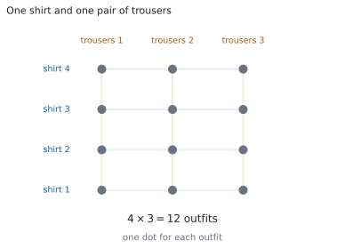
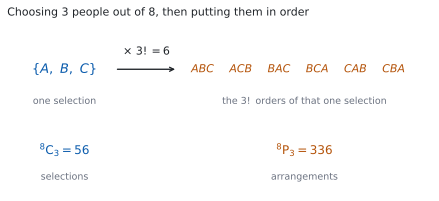

# HL 1.10a — Counting principles: permutations and combinations（数え上げの原理：順列と組合せ） {#sec-aahl-1-10a}

::: {.callout-note}
## What you should be able to do
- **multiplication principle**（かけ算の原理）を使って、段階に分かれた数え方ができる。
- $n!$（factorial、階乗）の意味が分かり、$0! = 1$ も含めて使える。
- $^{n}\mathrm{P}_{r}$ と $^{n}\mathrm{C}_{r}$ を、公式から電卓なしで計算できる。
- 問題文を読んで、**順番が意味を持つかどうか**で $^{n}\mathrm{P}_{r}$ と $^{n}\mathrm{C}_{r}$ を選べる。
- 「必ず入れる」「隣り合う」「少なくとも $1$ つ」のような条件が付いた数え方ができる。
- 数えた結果を、確率につなげられる。
:::

## The idea

### 1. The multiplication principle（かけ算で数える） {#multiplication}

数え上げ（**counting**）の問題は、**全部書き出さずに「何通りあるか」を出す**ためのものです。$10$ 通りなら書き出せますが、$100$ 通りを超えると手に負えなくなります。

出発点は、たった $1$ つの考え方です。

{#fig-aahl110a-idea-a width=100%}

shirt が $4$ 枚、trousers が $3$ 本あるとします。上を選んでから下を選ぶと、**上の選び方 $1$ つにつき、下の選び方が $3$ 通り**あります。ですから全部で

$$
4 \times 3 = 12
$$

通りです（@fig-aahl110a-idea-a）。

これを **multiplication principle（かけ算の原理）**といいます。ある作業が $2$ 段階に分かれていて、$1$ 段目が $m$ 通り、**そのどれに対しても** $2$ 段目が $n$ 通りあるなら、全体は $m \times n$ 通りです。段階が $3$ つ以上でも同じで、順にかけていきます。

::: {.callout-important}
## この原理は公式集にありません
かけ算の原理も、次の節の $n!$ の意味も、**公式集には印刷されていません。** ただし覚えるものは式ではなく、**「段階に分けて、かける」**という考え方のほうです。
:::

#### 「かける」のか「足す」のか {#add-or-multiply}

**$2$ つのことが続けて起きるならかけ算**、**どちらか一方しか起きないなら足し算**です。

学校へ行くのに、電車の経路が $3$ 通り、バスの経路が $2$ 通りあるとします。電車とバスのどちらかを使うので、行き方は

$$
3 + 2 = 5
$$

通りです。ここでかけてしまうと、$1$ 回の通学で電車とバスを両方使ったことになります。

**「そして（and）」ならかけ算、「または（or）」なら足し算**、と読み替えてください。

#### くり返してよいかどうかで、答えが変わります {#repeat}

アルファベット $26$ 文字から $2$ 文字を選んで、順に並べた code を作ります。

- 同じ文字を **$2$ 回使ってよい**なら、$2$ 文字目も $26$ 通りなので $26 \times 26 = 676$ 通り。
- 同じ文字を **$2$ 回使えない**なら、$2$ 文字目は $1$ つ減って $26 \times 25 = 650$ 通り。

**問題文に `may be repeated` と書いてあるか、`all different` と書いてあるかで、答えが変わります。** ここを読み飛ばさないでください。

### 2. Factorials: arranging all of them（階乗：全部を並べる） {#factorial}

$4$ 冊のちがう本を、棚に $1$ 列に並べます。左から順に決めていくと、$1$ 番目は $4$ 通り、$2$ 番目は残りから $3$ 通り、$3$ 番目は $2$ 通り、$4$ 番目は $1$ 通りです。かけ算の原理から

$$
4 \times 3 \times 2 \times 1 = 24
$$

通りあります。このように $1$ から $n$ までをかけたものを **$n!$（factorial、階乗）**と書きます。

$$
n! = n \times (n-1) \times \cdots \times 2 \times 1
$$ {#eq-aahl110a-factorial}

$3! = 6$、$2! = 2$、$1! = 1$ です。そして

$$
0! = 1
$$

と決めます。「何も並べないやり方が、$1$ 通りある」と数えているからです。こう決めておくと、次の節からの公式が $r = 0$ や $r = n$ のときもそのまま使えます。

::: {.callout-warning}
## 階乗は、すぐに大きくなります
$4! = 24$ ですが、$10!$ は $300$ 万を超えます。**Paper 1 では、階乗を最後まで計算しないのがふつうです。** 約分で消えるところを先に消してから計算してください（[第 3 節](#permutation)）。
:::

### 3. Permutations: arranging some of them（順列：一部を並べる） {#permutation}

$8$ 人の中から $3$ 人を選んで、$1$ 位・$2$ 位・$3$ 位を決めます。$1$ 位は $8$ 通り、$2$ 位は残りの $7$ 通り、$3$ 位は残りの $6$ 通りなので

$$
8 \times 7 \times 6 = 336
$$

通りです。$n$ 個から $r$ 個を取り出して、**順番まで決める**数え方を **permutation（順列）**といい、$^{n}\mathrm{P}_{r}$ と書きます。かけ算は $n$ から始めて $r$ 個ぶん続くので、階乗を使うと次の形になります。

$$
^{n}\mathrm{P}_{r} = \frac{n!}{(n-r)!}
$$ {#eq-aahl110a-npr}

分母の $(n-r)!$ が、**取り出さずに残した $n-r$ 個ぶんのかけ算を消しています。** 実際、$n = 8$、$r = 3$ なら

$$
^{8}\mathrm{P}_{3} = \frac{8!}{5!} = \frac{8 \times 7 \times 6 \times 5!}{5!} = 8 \times 7 \times 6 = 336
$$

です。**$8!$ も $5!$ も、最後まで計算する必要はありません。**

::: {.callout-important}
## この式は公式集にあります
公式集の **1.10** の欄に、次の $2$ つが印刷されています。

> Combinations $^{n}\mathrm{C}_{r} = \dfrac{n!}{r!(n-r)!}$
>
> Permutations $^{n}\mathrm{P}_{r} = \dfrac{n!}{(n-r)!}$

試験中に配られるので、**この $2$ つを覚える必要はありません。** 覚えるのは、**どちらを使う場面なのか**のほうです（[第 5 節](#which)）。
:::

**問われない範囲**が、シラバスにはっきり書かれています。

> Not required: Permutations where some objects are identical. Circular arrangements.

同じものが混ざっているときの並べ方（`BANANA` の並べかえのような問題）と、**円形に並べる**数え方は、AA HL では**問われません。** 他の問題集で見かけても、ここに時間を使う必要はありません。

### 4. Combinations: choosing without order（組合せ：順番を問わずに選ぶ） {#combination}

同じ $8$ 人から、今度は**委員会（committee）の $3$ 人**を選びます。委員に順位はないので、$A, B, C$ を選ぶことと $C, A, B$ を選ぶことは、**同じ $1$ 通り**です。

{#fig-aahl110a-idea-b width=100%}

@fig-aahl110a-idea-b を見てください。**$1$ つの選び方が、$3! = 6$ 通りに並んでいます。** ですから $^{8}\mathrm{P}_{3} = 336$ は、$1$ つの選び方を $6$ 回ずつ数えていることになります。$6$ で割れば、選び方だけの数になります。

$$
\frac{336}{6} = 56
$$

順番を問わずに $n$ 個から $r$ 個を選ぶ数え方を **combination（組合せ）**といい、$^{n}\mathrm{C}_{r}$ と書きます。

$$
^{n}\mathrm{C}_{r} = \frac{^{n}\mathrm{P}_{r}}{r!} = \frac{n!}{r!\,(n-r)!}
$$ {#eq-aahl110a-ncr}

この $^{n}\mathrm{C}_{r}$ は、二項定理の係数と同じものです（[SL 1.9](../../aa-sl/01-number-and-algebra/aasl-1-9.qmd#ncr)）。二項展開の係数も「$n$ 個のかっこのうち、どの $r$ 個から $b$ を取るか」の選び方でした。同じものを数えているので、同じ式になります。

手で計算するときは、**上は $r$ 個ぶんだけかけて、下は $r!$** です。

$$
^{8}\mathrm{C}_{3} = \frac{8 \times 7 \times 6}{3 \times 2 \times 1} = 56
$$

::: {.callout-tip collapse="true"}
## Paper 2 では、電卓でこう出せます
`menu → Probability → Permutations` を選ぶと `nPr(` が、`menu → Probability → Combinations` を選ぶと `nCr(` が出ます。$^{8}\mathrm{P}_{3}$ なら `nPr(8,3)`、$^{8}\mathrm{C}_{3}$ なら `nCr(8,3)` と入れます。階乗の `!` も、同じ `menu → Probability` の中にあります。

**Paper 1 では使えません。** ですから、このページの例題と演習は、すべて手で出せる大きさにしてあります。
:::

### 5. Which one to use（順列と組合せ、どちらを使うか） {#which}

迷ったときに見るのは、**順番が意味を持つかどうか**の $1$ 点だけです。

| 問題文の言い方 | 順番 | 使うもの | $8$ 人から $3$ 人 |
|:--|:--|:--|:--|
| `arrange`、`in order`、`first, second and third`、`president and secretary` | **意味を持つ** | $^{n}\mathrm{P}_{r}$ | $336$ |
| `choose`、`select`、`a committee of 3`、`a team of 3` | **意味を持たない** | $^{n}\mathrm{C}_{r}$ | $56$ |

: どちらを使うかは、順番が意味を持つかどうかで決まります {#tbl-aahl110a-which}

$2$ つの関係は、@fig-aahl110a-idea-b がそのまま表しています。

$$
^{n}\mathrm{P}_{r} = {}^{n}\mathrm{C}_{r} \times r!
$$ {#eq-aahl110a-link}

**$^{n}\mathrm{P}_{r}$ が $^{n}\mathrm{C}_{r}$ より小さくなることはありません。** $r \geq 2$ なら $r! > 1$ なので大きくなり、$r = 0$ と $r = 1$ では $r! = 1$ なので等しくなります。

#### 役割に名前が付いていたら、順列です {#roles}

`president, secretary and treasurer` のように、**選ばれた人にちがう名前が付く**なら、誰がどの役かで別の結果になります。順番が意味を持つのと同じことなので、$^{n}\mathrm{P}_{r}$ です。

`a committee of 3` のように、**選ばれた人が全員同じ立場**なら $^{n}\mathrm{C}_{r}$ です。

### 6. Counting with restrictions（条件が付いた数え方） {#restrictions}

試験で差がつくのは、条件が付いたときです。よく出る $3$ つの形を見ます。

#### (i) 特定のものを、必ず入れる／入れない {#include}

$7$ 人から $3$ 人の委員会を作ります。条件がなければ $^{7}\mathrm{C}_{3} = 35$ 通りです。

Maya を**必ず入れる**なら、$1$ 人は決まっているので、**残り $6$ 人から $2$ 人**を選びます。

$$
^{6}\mathrm{C}_{2} = \frac{6 \times 5}{2 \times 1} = 15
$$

Maya を**入れない**なら、**残り $6$ 人から $3$ 人**です。

$$
^{6}\mathrm{C}_{3} = \frac{6 \times 5 \times 4}{3 \times 2 \times 1} = 20
$$

どの委員会も、Maya を含むか含まないかのどちらかです。ですから $15 + 20 = 35$ になっていなければなりません。**この足し算が、そのまま検算になります。**

#### (ii) 隣り合う：ひとまとまりとして扱う {#block}

$4$ 人 $A, B, C, D$ を $1$ 列に並べます。条件がなければ $4! = 24$ 通りです。

**$B$ と $C$ が隣り合う**並べ方を数えます。$B$ と $C$ をしばって $1$ つのものとして扱うと、並べるものは $(BC)$、$A$、$D$ の $3$ つになるので $3!$ 通り。そのそれぞれで、しばった中身が $BC$ か $CB$ かの $2!$ 通りがあります。

$$
3! \times 2! = 6 \times 2 = 12
$$

**中身の $2!$ を忘れると、答えが半分になります。**

#### (iii) 「少なくとも」：全体から引く {#at-least}

$6$ 人（男子 $4$ 人・女子 $2$ 人）から $3$ 人を選びます。**少なくとも $1$ 人は女子**である選び方を数えます。

「女子 $1$ 人」と「女子 $2$ 人」に分けて足してもよいのですが、**当てはまらない場合を全体から引く**ほうが短くてすみます。当てはまらないのは「女子が $0$ 人」、つまり男子だけの場合です。

$$
^{6}\mathrm{C}_{3} - {}^{4}\mathrm{C}_{3} = 20 - 4 = 16
$$

**`at least` が出てきたら、まず「引く」を考えてください。**

### 7. From counting to probability（数え上げから確率へ） {#to-probability}

すべての結果が同じ確からしさ（`equally likely`）で起こるなら、確率は**数えるだけ**で出ます（[SL 4.5](../../aa-sl/04-statistics-and-probability/aasl-4-5.qmd#counting)）。公式集の **4.5** の欄に、次の形で印刷されています。

$$
P(A) = \frac{n(A)}{n(U)}
$$

第 6 節 (iii) の $6$ 人から、$3$ 人を無作為に（`at random`）選ぶとします。少なくとも $1$ 人が女子である確率は

$$
\frac{16}{20} = \frac{4}{5}
$$

です。**分子と分母を、同じ数え方でそろえる**ことが大事です。片方を順列で、もう片方を組合せで数えると合いません。

## Why it works

::: {.callout-tip collapse="true"}
## クリックすると開きます

**$r!$ で割ってよいのは、どの選び方も「ちょうど $r!$ 回」数えられているからです。**

$^{n}\mathrm{P}_{r}$ の並べ方をすべて書き出して、**中身の顔ぶれが同じものを $1$ つの山にまとめる**ところを想像してください。

- $1$ つの山に入る並べ方は、**同じ $r$ 個を並べかえたものだけ**です。$r$ 個はどれもちがうので、並べかえは $r!$ 通りあります。
- どの山も、**きっかり $r!$ 個**の並べ方を含みます。$3$ 個の山も $7$ 個の山もありません。

大きさのそろった山に分けられたので、山の数は

$$
\frac{^{n}\mathrm{P}_{r}}{r!}
$$

です。山の数がそのまま「選び方の数」、つまり $^{n}\mathrm{C}_{r}$ になります。

**どの山も同じ大きさであることが、この議論の要です。** もし $r$ 個の中に同じものが混ざっていたら、山の大きさがそろわなくなり、この割り算は使えません。シラバスが `Permutations where some objects are identical` を範囲外にしているのは、そこに別の扱いが要るからです。

#### $0! = 1$ は、つじつま合わせではありません

$^{n}\mathrm{C}_{n}$、つまり $n$ 個から $n$ 個すべてを選ぶやり方は、全部を取るという $1$ 通りしかありません。@eq-aahl110a-ncr に $r = n$ を入れると

$$
^{n}\mathrm{C}_{n} = \frac{n!}{n!\,(n-n)!} = \frac{1}{0!}
$$

となるので、これが $1$ になるためには $0! = 1$ でなければなりません。**$0! = 1$ と決めたから公式が合う**のではなく、**公式が合うためには $0! = 1$ 以外にない**、という順序です。
:::

## Worked examples

::: {.callout-note appearance="simple"}
問題文は英語です。意味が理解できなかったら、問題文の下の「**日本語訳**」を開いてください。解説は日本語です。

**例題も演習も、すべて電卓なしで解けます。** Paper 1 のつもりで解いてください。
:::

::: {#exm-aahl110a-code}
[A four-digit code is formed, each digit being chosen from the digits $0$ to $9$.]{.q-en}

**(a)** [Find the number of possible codes if the digits may be repeated.]{.q-en}

**(b)** [Find the number of possible codes in which all four digits are different.]{.q-en}

**(c)** [Find the number of possible codes in which all four digits are different and the first digit is not $0$.]{.q-en}

日本語訳

$4$ 桁の code を作ります。各桁は $0$ から $9$ までの数字から選びます。

**(a)** 同じ数字をくり返し使ってよいとき、code は何通りできるか求めなさい。

**(b)** $4$ 桁がすべてちがうとき、code は何通りできるか求めなさい。

**(c)** $4$ 桁がすべてちがい、かつ先頭が $0$ でないとき、code は何通りできるか求めなさい。

---

**(a)** どの桁も $0$ から $9$ までの $10$ 通りで、前の桁に左右されません（[第 1 節](#repeat)）。

$$
10 \times 10 \times 10 \times 10 = 10\,000
$$

**(b)** 先頭は $10$ 通り、$2$ 桁目は使った $1$ つを除いて $9$ 通り、$3$ 桁目は $8$ 通り、$4$ 桁目は $7$ 通りです。

$$
10 \times 9 \times 8 \times 7 = 5040
$$

**(c)** 先頭だけ条件がちがうので、**先頭から決めます。** 先頭は $0$ を除いた $9$ 通り。残りの $3$ 桁は、まだ使っていない $9$ 個の数字（$0$ を含みます）から順に選ぶので $9 \times 8 \times 7$ 通りです。

$$
9 \times 9 \times 8 \times 7 = 4536
$$

**検算（(b) について）。** $^{10}\mathrm{P}_{4} = \dfrac{10!}{6!}$ を使っても $10 \times 9 \times 8 \times 7$ になるだけなので、**これは検算になりません。** 同じかけ算を書き直しているだけです。

**検算（(c) について）。** **数え方をまったく変えて**出します。**(b)** の $5040$ 個の code は、先頭がどの数字であっても同じだけあります。$10$ 個の数字は対等なので、先頭が $0$ のものは

$$
\frac{5040}{10} = 504
$$

個です。求めるのは残りなので $5040 - 504 = 4536$ ✓ **(c)** ではかけ算で、ここでは割り算と引き算で出したので、道すじが別になっています。

**先頭を $9$ 通りとしたあと、残りを $9 \times 8 \times 7$ ではなく $8 \times 7 \times 6$ としていたら**、$9 \times 336 = 3024$ となります。$4536$ とは合いません。**先頭で $0$ を使わなかったぶん、$0$ は後ろの桁にまだ残っています。**

::: {.callout-note}
## 解答例（答案用紙に書くこと）
**(a)**
$$10^{4} = 10\,000$$

**(b)**
$$10 \times 9 \times 8 \times 7 = 5040$$

**(c)**
$$9 \times 9 \times 8 \times 7 = 4536$$
:::
:::

::: {#exm-aahl110a-club}
[A club has $10$ members.]{.q-en}

**(a)** [Find the number of ways in which a president, a secretary and a treasurer can be chosen, if no member may hold more than one of these positions.]{.q-en}

**(b)** [Find the number of ways in which a committee of $3$ members can be chosen.]{.q-en}

**(c)** [Explain why the answer to part **(a)** is $6$ times the answer to part **(b)**.]{.q-en}

日本語訳

ある club に $10$ 人の会員がいます。

**(a)** president、secretary、treasurer を選ぶ方法は何通りあるか求めなさい。ただし、$1$ 人が $2$ つ以上の役に就くことはできません。

**(b)** $3$ 人の committee を選ぶ方法は何通りあるか求めなさい。

**(c)** **(a)** の答えが **(b)** の答えの $6$ 倍になる理由を説明しなさい。

---

**(a)** 役に名前が付いているので、**誰がどの役かで別の結果**です（[第 5 節](#roles)）。順列を使います。

$$
^{10}\mathrm{P}_{3} = 10 \times 9 \times 8 = 720
$$

**(b)** committee には役の区別がないので、組合せです。

$$
^{10}\mathrm{C}_{3} = \frac{10 \times 9 \times 8}{3 \times 2 \times 1} = 120
$$

**(c)** `Explain why` なので、英語で理由を書きます。

::: {.model-answer}
**試験ではこう書く**

*Each committee of $3$ members can be given the three different titles in $3! = 6$ ways, and different allocations of the titles count as different answers in part **(a)** but as the same committee in part **(b)**. So every one selection in **(b)** corresponds to exactly $6$ of the outcomes in **(a)**, which gives $^{10}\mathrm{P}_{3} = {}^{10}\mathrm{C}_{3} \times 3!$.*
:::

（**(b)** で選んだ $3$ 人に、$3$ つのちがう役を割りふる方法が $3! = 6$ 通りある。役の割りふりが変われば **(a)** では別の結果になるが、**(b)** では同じ committee である。だから **(b)** の $1$ 通りが、**(a)** のちょうど $6$ 通りに対応する、という意味です。）

**検算（(b) について）。** **割り算を使わない道すじ**で出します。$10$ 人のうち、特定の $1$ 人 Kenji を入れるか入れないかで分けます（[第 6 節](#include)）。入れるなら残り $9$ 人から $2$ 人で $^{9}\mathrm{C}_{2} = 36$、入れないなら残り $9$ 人から $3$ 人で $^{9}\mathrm{C}_{3} = 84$ です。

$$
36 + 84 = 120
$$

合いました ✓ **$\dfrac{10 \times 9 \times 8}{6}$ をもう一度計算しても、検算にはなりません。**

**検算（(a) について）。** @eq-aahl110a-link より $^{10}\mathrm{P}_{3} = {}^{10}\mathrm{C}_{3} \times 3!$ なので、$120 \times 6 = 720$ ✓

**$3!$ で割り忘れて **(b)** も $720$ としていたら**、**(c)** の「$6$ 倍」が説明できなくなります。$2$ つの答えが同じ数になったら、どちらかで割り忘れています。

::: {.callout-note}
## 解答例（答案用紙に書くこと）
**(a)**
$$^{10}\mathrm{P}_{3} = 10 \times 9 \times 8 = 720$$

**(b)**
$$^{10}\mathrm{C}_{3} = \frac{10 \times 9 \times 8}{3 \times 2 \times 1} = 120$$

**(c)** *The $3$ chosen members can be given the three titles in $3! = 6$ ways. These $6$ outcomes are different in **(a)** but are the same committee in **(b)**, so $^{10}\mathrm{P}_{3} = {}^{10}\mathrm{C}_{3} \times 3!$.*
:::
:::

::: {#exm-aahl110a-team}
[A group of $9$ students consists of $5$ girls and $4$ boys. A team of $4$ students is to be chosen from the group.]{.q-en}

**(a)** [Find the number of teams containing exactly $2$ girls and $2$ boys.]{.q-en}

**(b)** [Find the number of teams containing at least $1$ boy.]{.q-en}

日本語訳

$9$ 人の生徒がいて、女子が $5$ 人、男子が $4$ 人です。この中から $4$ 人の team を選びます。

**(a)** 女子がちょうど $2$ 人、男子がちょうど $2$ 人である team は何通りあるか求めなさい。

**(b)** 男子が少なくとも $1$ 人いる team は何通りあるか求めなさい。

---

**(a)** 女子を選ぶことと男子を選ぶことは、**続けて起きる $2$ 段階**です。かけ算の原理を使います（[第 1 節](#multiplication)）。

$$
^{5}\mathrm{C}_{2} = \frac{5 \times 4}{2 \times 1} = 10, \qquad {}^{4}\mathrm{C}_{2} = \frac{4 \times 3}{2 \times 1} = 6
$$

$$
^{5}\mathrm{C}_{2} \times {}^{4}\mathrm{C}_{2} = 10 \times 6 = 60
$$

**(b)** `at least` なので、当てはまらない場合を引きます（[第 6 節](#at-least)）。当てはまらないのは「男子が $0$ 人」、つまり女子だけの $4$ 人です。

$$
^{9}\mathrm{C}_{4} = \frac{9 \times 8 \times 7 \times 6}{4 \times 3 \times 2 \times 1} = 126, \qquad {}^{5}\mathrm{C}_{4} = 5
$$

$$
126 - 5 = 121
$$

**検算（(b) について）。** **引き算を使わない道すじ**で出します。男子の人数で場合分けして、全部足します。

$$
^{4}\mathrm{C}_{1}\,{}^{5}\mathrm{C}_{3} + {}^{4}\mathrm{C}_{2}\,{}^{5}\mathrm{C}_{2} + {}^{4}\mathrm{C}_{3}\,{}^{5}\mathrm{C}_{1} + {}^{4}\mathrm{C}_{4}\,{}^{5}\mathrm{C}_{0}
$$

$$
= 4 \times 10 + 6 \times 10 + 4 \times 5 + 1 \times 1 = 40 + 60 + 20 + 1 = 121
$$

合いました ✓ **$4$ 項をすべて計算する必要はありませんが、検算としては $4$ 項ぜんぶが要ります。**

**検算（(a) について）。** 女子の人数で場合分けした $5$ つを足すと、team の総数 $^{9}\mathrm{C}_{4} = 126$ にならなければなりません。

$$
1 + 20 + 60 + 40 + 5 = 126
$$

合いました ✓ **(a)** の $60$ は、この並びの $3$ 番目です。**この検算は、$5$ つのうち $1$ つだけが間違っていても見つかります。**

**$^{5}\mathrm{C}_{2} + {}^{4}\mathrm{C}_{2} = 16$ としていたら**、足し算とかけ算を取りちがえています。女子を選んだ**あとで**男子を選ぶので、かけ算です（[第 1 節](#add-or-multiply)）。

::: {.callout-note}
## 解答例（答案用紙に書くこと）
**(a)**
$$^{5}\mathrm{C}_{2} \times {}^{4}\mathrm{C}_{2} = 10 \times 6 = 60$$

**(b)**
$$^{9}\mathrm{C}_{4} - {}^{5}\mathrm{C}_{4} = 126 - 5 = 121$$
:::
:::

::: {#exm-aahl110a-books}
[Eight different books are placed in a row on a shelf. Three of the books are mathematics books and the other five are novels.]{.q-en}

**(a)** [Find the number of arrangements in which the three mathematics books are all next to each other.]{.q-en}

**(b)** [Find the number of arrangements in which the three mathematics books are not all next to each other.]{.q-en}

**(c)** [Explain why the answer to part **(b)** is not $8! - 3!$.]{.q-en}

日本語訳

$8$ 冊のちがう本を、棚に $1$ 列に並べます。そのうち $3$ 冊は数学の本で、残りの $5$ 冊は小説です。

**(a)** $3$ 冊の数学の本がすべて隣り合う並べ方は何通りあるか求めなさい。

**(b)** $3$ 冊の数学の本がすべて隣り合うわけではない並べ方は何通りあるか求めなさい。

**(c)** **(b)** の答えが $8! - 3!$ でない理由を説明しなさい。

---

**(a)** 数学の本 $3$ 冊をしばって、$1$ つのものとして扱います（[第 6 節](#block)）。並べるものは、しばった $1$ かたまりと小説 $5$ 冊の、合わせて $6$ つです。

$$
6! \times 3! = 720 \times 6 = 4320
$$

**(b)** 「すべて隣り合うわけではない」は、**(a)** の場合を全体から除いたものです。全体は $8! = 40\,320$ です。

$$
40\,320 - 4320 = 36\,000
$$

**(c)** `Explain why` なので、英語で理由を書きます。

::: {.model-answer}
**試験ではこう書く**

*The number to subtract is the number of whole arrangements of all eight books in which the three mathematics books are together, which is $6! \times 3! = 4320$, not $3!$. The expression $3!$ only counts the orders of the three mathematics books among themselves; it does not say where the five novels go. Subtracting $3!$ would remove only $6$ of the $8!$ arrangements.*
:::

（引くべきなのは、$8$ 冊全体の並べ方のうち数学の本が隣り合っているものの数 $6! \times 3! = 4320$ であって、$3!$ ではない。$3!$ は数学の本どうしの並べ方を数えているだけで、小説の位置を何も言っていない、という意味です。）

**検算（(a) について）。** **「しばる」という考えを使わずに**出します。かたまりが占める $3$ 席の左端は、$1$ 番目から $6$ 番目までの $6$ 通りです。そのそれぞれで、数学の本の並べ方が $3!$ 通り、残りの $5$ 席に小説を並べる方法が $5!$ 通りあります。

$$
6 \times 3! \times 5! = 6 \times 6 \times 120 = 4320
$$

合いました ✓ **席の位置から数え直しているので、「かたまりを $1$ つと見る」が正しいかどうかを確かめられます。**

**検算（(b) について）。** 全体に対する割合で見ます。**(a)** の割合は $\dfrac{4320}{40\,320} = \dfrac{3}{28}$ なので、**(b)** の割合は $\dfrac{25}{28}$ のはずです。

$$
40\,320 \times \frac{25}{28} = 1440 \times 25 = 36\,000
$$

合いました ✓

**$3!$ を掛け忘れて **(a)** を $6! = 720$ としていたら**、**(b)** は $39\,600$ になります。**しばった中身の並べ方は、必ず数に入れてください。**

::: {.callout-note}
## 解答例（答案用紙に書くこと）
**(a)**
$$6! \times 3! = 720 \times 6 = 4320$$

**(b)**
$$8! - 6! \times 3! = 40\,320 - 4320 = 36\,000$$

**(c)** *The arrangements to be removed are those of all eight books with the mathematics books together, which number $6! \times 3! = 4320$. The expression $3!$ counts only the orders of the three mathematics books and says nothing about the positions of the five novels.*
:::
:::

## Common errors

::: {.callout-warning}
## `choose` と書いてあるのに、順列で数える
`choose a committee of 3`、`select a team of 3` は、**選ばれた人に区別がありません。** $^{n}\mathrm{C}_{r}$ です。

$^{n}\mathrm{P}_{r}$ を使うと、答えが $r!$ 倍だけ大きくなります（@eq-aahl110a-link）。**答えが大きすぎると感じたら、$r!$ で割り忘れていないかを見てください。**

逆に `president and secretary` のように役に名前が付いていたら、そこは順列です（[第 5 節](#roles)）。
:::

::: {.callout-warning}
## 「そして」と「または」を取りちがえる
$2$ つのことが**続けて起きる**ならかけ算、**どちらか一方しか起きない**なら足し算です（[第 1 節](#add-or-multiply)）。

女子を $2$ 人選び、**そのあと**男子を $2$ 人選ぶなら $^{5}\mathrm{C}_{2} \times {}^{4}\mathrm{C}_{2}$ です。ここを足すと、女子だけ、または男子だけを選んだ数になってしまいます。
:::

::: {.callout-warning}
## 隣り合う条件で、しばった中身の並べ方を忘れる
$3$ つをしばって $1$ つとして扱ったら、**しばった中身の $3!$ 通り**を必ず掛けてください（[第 6 節](#block)）。

忘れると、答えが $3!$ 分の $1$ になります。**「しばる」は「中身を固定する」ことではありません。**
:::

::: {.callout-warning}
## 「少なくとも」を、重複して数える
$5$ 人の女子と $4$ 人の男子から $4$ 人を選び、**男子が少なくとも $1$ 人**いる場合を数えるとき、「まず男子を $1$ 人選び、残り $3$ 人は $8$ 人から自由に選ぶ」として $^{4}\mathrm{C}_{1} \times {}^{8}\mathrm{C}_{3} = 4 \times 56 = 224$ とするのは誤りです。

**同じ team を何度も数えているからです。** 男子が $2$ 人いる team は、「最初に選んだ男子」がどちらだったかで $2$ 回数えられます。

**全体から引く**か、**男子の人数で場合分けして足す**かのどちらかにしてください（[第 6 節](#at-least)）。
:::

::: {.callout-warning}
## $0!$ を $0$ にする
$0! = 1$ です（[第 2 節](#factorial)）。$0$ にすると $^{n}\mathrm{C}_{n}$ の分母が $0$ になり、計算そのものができなくなります。

$^{n}\mathrm{C}_{0} = 1$、$^{n}\mathrm{C}_{n} = 1$、$^{n}\mathrm{P}_{0} = 1$ も、あわせて確かめておいてください。
:::

::: {.callout-warning}
## 範囲外の問題に、時間を使ってしまう
**同じものが混ざった並べ方と、円形に並べる数え方は、AA HL では問われません**（[第 3 節](#permutation)）。

> Not required: Permutations where some objects are identical. Circular arrangements.

他の問題集には出てきます。解けるに越したことはありませんが、**試験前の限られた時間を、ここに使う必要はありません。**
:::

## Exercises

::: {.callout-note appearance="simple"}
各問題に、折りたたみが $3$ つ付いています。**日本語訳**、**解答例**（答案用紙に書くべきこと。英語です）、**解説**（なぜそうなるか。日本語です）。

まず自分で解いて、次に解答例と見くらべてください。**解説は、合わなかったときだけ開けば十分です。**
:::

::: {.exercise-block}

[1]{.ex-no} [A password consists of three letters chosen from A, B, C, D, E, followed by two digits chosen from $1$ to $9$. The letters may be repeated, but the two digits must be different. Find the number of possible passwords.]{.q-en}

日本語訳

ある password は、A, B, C, D, E から選んだ $3$ 文字のあとに、$1$ から $9$ までから選んだ $2$ 個の数字を続けた形です。文字はくり返し使ってよいのですが、$2$ 個の数字はちがうものでなければなりません。password は何通りできるか求めなさい。

::: {.callout-note collapse="true"}
## 解答例（答案用紙に書くこと）

$$5 \times 5 \times 5 \times 9 \times 8 = 125 \times 72 = 9000$$
:::

::: {.callout-tip collapse="true"}
## 解説

文字と数字は**続けて決める**ので、かけ算です（[第 1 節](#multiplication)）。

文字は $5$ 通りが $3$ 回くり返せるので $5^{3} = 125$ 通り。数字はちがうものなので $9 \times 8 = 72$ 通りです（[第 1 節](#repeat)）。

**検算。** 数字のほうを $^{9}\mathrm{P}_{2}$ として出し直します。$\dfrac{9!}{7!} = 9 \times 8 = 72$ で同じです。文字のほうは、**くり返してよいので順列ではありません。** $^{5}\mathrm{P}_{3} = 60$ を使うと、$3$ 文字がすべてちがう場合だけを数えたことになり、答えが変わります。**くり返してよいかどうかを、必ず問題文で確かめてください。**

**桁数のぶんだけ因数があるか**も見てください。$3$ 文字と $2$ 個の数字なので、かける数は $5$ つです。
:::

::: {.ex-sep}
:::

[2]{.ex-no} **(a)** [Find the value of $^{7}\mathrm{P}_{2}$.]{.q-en}

**(b)** [Find the value of $^{7}\mathrm{C}_{2}$.]{.q-en}

**(c)** [Explain why $^{7}\mathrm{C}_{5}$ has the same value as $^{7}\mathrm{C}_{2}$.]{.q-en}

日本語訳

**(a)** $^{7}\mathrm{P}_{2}$ の値を求めなさい。

**(b)** $^{7}\mathrm{C}_{2}$ の値を求めなさい。

**(c)** $^{7}\mathrm{C}_{5}$ が $^{7}\mathrm{C}_{2}$ と同じ値になる理由を説明しなさい。

::: {.callout-note collapse="true"}
## 解答例（答案用紙に書くこと）

**(a)**
$$^{7}\mathrm{P}_{2} = \frac{7!}{5!} = 7 \times 6 = 42$$

**(b)**
$$^{7}\mathrm{C}_{2} = \frac{7 \times 6}{2 \times 1} = 21$$

**(c)** *Choosing which $5$ of the $7$ objects to take is the same as choosing which $2$ objects to leave behind, so the two counts are equal.*
:::

::: {.callout-tip collapse="true"}
## 解説

**(a)** $7!$ も $5!$ も計算せず、約分してください（[第 3 節](#permutation)）。

**(b)** $^{7}\mathrm{P}_{2}$ を $2!$ で割っても出ます（@eq-aahl110a-link）。

**(c)** `Explain why` なので、英語で理由を書きます。式で示すこともできますが、**数え方の言葉のほうが短くてすみます。**

**検算。** **割り算を使わない道すじ**で **(b)** を出します。$7$ 個から $2$ 個を選ぶとき、番号の小さいほうで分けて数えます。$1$ 番と組む相手は $6$ 通り、$2$ 番と組む相手は（$1$ 番を除いて）$5$ 通り、… と続けて

$$
6 + 5 + 4 + 3 + 2 + 1 = 21
$$

合いました ✓ **(a)** はこれを $2!$ 倍した $42$ です。

**$\dfrac{7 \times 6}{2}$ をもう一度計算しても、検算にはなりません。** 同じ割り算を書き直すだけです。

::: {.model-answer}
**試験ではこう書く**

*Every selection of $5$ objects from the $7$ leaves exactly $2$ objects behind, and every selection of $2$ objects to leave behind determines exactly one selection of $5$ objects to take. The two kinds of selection are therefore paired off one to one, so there are equally many of each, giving $^{7}\mathrm{C}_{5} = {}^{7}\mathrm{C}_{2}$.*
:::
:::

::: {.ex-sep}
:::

[3]{.ex-no} [Eleven athletes take part in a race. Find the number of different ways in which the gold, silver and bronze medals can be awarded, assuming that there are no ties.]{.q-en}

日本語訳

$11$ 人の athlete が race に出ます。金・銀・銅のメダルの配られ方は何通りあるか求めなさい。ただし、同着はないものとします。

::: {.callout-note collapse="true"}
## 解答例（答案用紙に書くこと）

$$^{11}\mathrm{P}_{3} = 11 \times 10 \times 9 = 990$$
:::

::: {.callout-tip collapse="true"}
## 解説

メダルには金・銀・銅の区別があるので、**順番が意味を持ちます**（[第 5 節](#which)）。順列です。

**検算。** 特定の $1$ 人 Ravi がメダルを取るかどうかで分けます。

Ravi が取るなら、どのメダルかが $3$ 通りで、残り $2$ つのメダルを他の $10$ 人に配る方法が $10 \times 9$ 通りなので $3 \times 90 = 270$ です。Ravi が取らないなら、残り $10$ 人に $3$ つのメダルを配って $10 \times 9 \times 8 = 720$ です。

$$
270 + 720 = 990
$$

合いました ✓ **場合分けの足し算なので、$11 \times 10 \times 9$ をやり直したのとは別の道すじです。**

**$^{11}\mathrm{C}_{3}$ としていたら**、金・銀・銅の区別を捨てたことになります。**「$3$ 人が入賞した」だけを数えた答え**になってしまいます。
:::

::: {.ex-sep}
:::

[4]{.ex-no} [A committee of $4$ people is to be chosen from a group of $12$ people.]{.q-en}

**(a)** [Find the number of possible committees.]{.q-en}

**(b)** [Find the number of possible committees that include Aiko, who is one of the $12$ people.]{.q-en}

日本語訳

$12$ 人の中から $4$ 人の committee を選びます。

**(a)** committee は何通りできるか求めなさい。

**(b)** $12$ 人のうちの $1$ 人である Aiko を含む committee は何通りあるか求めなさい。

::: {.callout-note collapse="true"}
## 解答例（答案用紙に書くこと）

**(a)**
$$^{12}\mathrm{C}_{4} = \frac{12 \times 11 \times 10 \times 9}{4 \times 3 \times 2 \times 1} = 495$$

**(b)**
$$^{11}\mathrm{C}_{3} = \frac{11 \times 10 \times 9}{3 \times 2 \times 1} = 165$$
:::

::: {.callout-tip collapse="true"}
## 解説

**(a)** committee に役の区別はないので、組合せです。

**(b)** Aiko は決まっているので、**残り $11$ 人から $3$ 人**を選びます（[第 6 節](#include)）。$^{12}\mathrm{C}_{4}$ から何かを引くのではありません。

**検算。** Aiko を**含まない** committee は、残り $11$ 人から $4$ 人を選ぶので

$$
^{11}\mathrm{C}_{4} = \frac{11 \times 10 \times 9 \times 8}{4 \times 3 \times 2 \times 1} = 330
$$

です。どの committee も Aiko を含むか含まないかのどちらかなので、$165 + 330 = 495$ になるはずです。**(a)** と一致しました ✓

**$^{11}\mathrm{C}_{3}$ を $^{12}\mathrm{C}_{3}$ としていたら**、Aiko をもう一度選べることになってしまいます。**決まっている $1$ 人は、残りの人数からも除きます。**
:::

::: {.ex-sep}
:::

[5]{.ex-no} [Nine different cards are placed in a row.]{.q-en}

**(a)** [Find the number of possible arrangements.]{.q-en}

**(b)** [Find the number of arrangements in which two particular cards are next to each other.]{.q-en}

日本語訳

$9$ 枚のちがう card を $1$ 列に並べます。

**(a)** 並べ方は何通りあるか求めなさい。

**(b)** 特定の $2$ 枚が隣り合う並べ方は何通りあるか求めなさい。

::: {.callout-note collapse="true"}
## 解答例（答案用紙に書くこと）

**(a)**
$$9! = 362\,880$$

**(b)**
$$8! \times 2! = 40\,320 \times 2 = 80\,640$$
:::

::: {.callout-tip collapse="true"}
## 解説

**(b)** $2$ 枚をしばって $1$ つとして扱うと、並べるものは $8$ つになります（[第 6 節](#block)）。しばった中身の並び $2!$ を忘れないでください。

**検算。** **「しばる」を使わない道すじ**で出します。特定の $2$ 枚が入る席の選び方を数えます。$9$ 席のうち、隣り合う席の組は $8$ 通りあります。そのそれぞれで $2$ 枚の並び方が $2$ 通り、残りの $7$ 枚の並べ方が $7!$ 通りなので

$$
8 \times 2 \times 7! = 16 \times 5040 = 80\,640
$$

合いました ✓ **席の位置から数え直しているので、しばり方そのものを確かめられます。**

**$2!$ を忘れて $8!$ としていたら**、答えは半分になります。**$1$ 列に並んだ $2$ 枚には、$2$ 通りの並び方があります。**
:::

::: {.ex-sep}
:::

[6]{.ex-no} [A team of $3$ people is to be chosen from $5$ women and $4$ men. Find the number of teams containing at least $2$ women.]{.q-en}

日本語訳

女性 $5$ 人と男性 $4$ 人の中から、$3$ 人の team を選びます。女性が少なくとも $2$ 人いる team は何通りあるか求めなさい。

::: {.callout-note collapse="true"}
## 解答例（答案用紙に書くこと）

$$^{5}\mathrm{C}_{2} \times {}^{4}\mathrm{C}_{1} + {}^{5}\mathrm{C}_{3} = 10 \times 4 + 10 = 50$$
:::

::: {.callout-tip collapse="true"}
## 解説

女性の人数は $2$ 人か $3$ 人のどちらかです。**どちらか一方しか起きないので、足します**（[第 1 節](#add-or-multiply)）。それぞれの場合の中では、女性を選び、**そのあと**男性を選ぶのでかけ算です。

**検算。** 当てはまらない場合を数えて、合計が全体になるかを見ます。当てはまらないのは女性が $1$ 人以下、つまり

$$
^{5}\mathrm{C}_{1} \times {}^{4}\mathrm{C}_{2} + {}^{4}\mathrm{C}_{3} = 5 \times 6 + 4 = 34
$$

です。全体は $^{9}\mathrm{C}_{3} = 84$ なので、$50 + 34 = 84$ ✓ **足し算の側と引き算の側の両方を独立に数えて、突き合わせています。**

**「まず女性を $2$ 人選び、残り $1$ 人は $7$ 人から自由に」として $^{5}\mathrm{C}_{2} \times {}^{7}\mathrm{C}_{1} = 70$ としていたら**、女性 $3$ 人の team を $3$ 回ずつ数えています。$70 - 50 = 20$ は、$^{5}\mathrm{C}_{3} = 10$ を余分に $2$ 回数えたぶんです。
:::

::: {.ex-sep}
:::

[7]{.ex-no} [Eight people sit in a row of eight seats. Find the number of seating arrangements in which two particular people, Sam and Toni, are not next to each other.]{.q-en}

日本語訳

$8$ 人が、$8$ 席の $1$ 列に座ります。特定の $2$ 人 Sam と Toni が隣り合わない座り方は何通りあるか求めなさい。

::: {.callout-note collapse="true"}
## 解答例（答案用紙に書くこと）

$$8! - 7! \times 2! = 40\,320 - 10\,080 = 30\,240$$
:::

::: {.callout-tip collapse="true"}
## 解説

「隣り合わない」を直接数えるのは大変です。**全体から、隣り合う場合を引きます**（[第 6 節](#at-least)）。

隣り合う場合は、$2$ 人をしばって $7$ つを並べ、中身の $2!$ を掛けて $7! \times 2! = 10\,080$ です。

**検算。** 割合で見ます。$8$ 席のうち Sam と Toni が座る $2$ 席の選び方は、順序をつけて $8 \times 7 = 56$ 通りで、そのうち隣り合うのは、隣り合う席の組 $7$ 通りに対して $2$ 通りずつの $14$ 通りです。ですから隣り合う割合は

$$
\frac{14}{56} = \frac{1}{4}
$$

隣り合わない割合は $\dfrac{3}{4}$ なので、$40\,320 \times \dfrac{3}{4} = 30\,240$ ✓ **人の並べ方ではなく席の選び方から出しているので、別の道すじです。**

**$8! - 2!$ としていたら**、引く数が小さすぎます。**引くのは「隣り合う並べ方の総数」**であって、しばった中身の並べ方ではありません。
:::

::: {.ex-sep}
:::

[8]{.ex-no} [Given that $^{n}\mathrm{C}_{2} = 45$, find the value of $n$.]{.q-en}

日本語訳

$^{n}\mathrm{C}_{2} = 45$ であるとき、$n$ の値を求めなさい。

::: {.callout-note collapse="true"}
## 解答例（答案用紙に書くこと）

$$\frac{n(n-1)}{2} = 45$$

$$n^{2} - n - 90 = 0$$

$$(n-10)(n+9) = 0$$

*Since $n$ is a positive integer, $n = 10$.*
:::

::: {.callout-tip collapse="true"}
## 解説

$^{n}\mathrm{C}_{2} = \dfrac{n!}{2!\,(n-2)!} = \dfrac{n(n-1)}{2}$ です。$n!$ のうち $(n-2)!$ が約分で消え、上に $2$ 個ぶんだけ残ります（[第 4 節](#combination)）。

そこから $2$ 次方程式になります。解き方は [SL 2.7](../../aa-sl/02-functions/aasl-2-7.qmd) と同じです。

**$n = -9$ は捨てます。** $n$ は「何個から選ぶか」の個数なので、正の整数です。**捨てる理由を $1$ 行書いてください。**

**検算。** 出した $n$ を、もとの式に戻します。

$$
^{10}\mathrm{C}_{2} = \frac{10 \times 9}{2} = 45
$$

問題文の $45$ に戻りました ✓ **$2$ 次方程式を解き直すのではなく、答えから逆に戻しています。**

**$n = 9$ としていたら**、$^{9}\mathrm{C}_{2} = 36$ で $45$ になりません。**$1$ ずれても、戻せばすぐ分かります。**
:::

::: {.ex-sep}
:::

[9]{.ex-no} [A bag contains seven counters, all of which are different. Four of the counters are red and three are blue. Three counters are chosen at random. Find the probability that exactly two of them are red.]{.q-en}

日本語訳

袋の中に、すべてちがう $7$ 個の counter が入っています。そのうち $4$ 個が赤、$3$ 個が青です。$3$ 個の counter を無作為に選びます。ちょうど $2$ 個が赤である確率を求めなさい。

::: {.callout-note collapse="true"}
## 解答例（答案用紙に書くこと）

$$P(\text{exactly two red}) = \frac{^{4}\mathrm{C}_{2} \times {}^{3}\mathrm{C}_{1}}{^{7}\mathrm{C}_{3}} = \frac{6 \times 3}{35} = \frac{18}{35}$$
:::

::: {.callout-tip collapse="true"}
## 解説

**分子も分母も、組合せで数えます**（[第 7 節](#to-probability)）。選ぶ順番は問われていないので、どちらも $^{n}\mathrm{C}_{r}$ でそろえます。

分子は、赤 $4$ 個から $2$ 個、青 $3$ 個から $1$ 個を選ぶので $^{4}\mathrm{C}_{2} \times {}^{3}\mathrm{C}_{1}$ です。

**検算。** 赤の個数は $0, 1, 2, 3$ のどれかなので、$4$ つの場合の数を足すと $^{7}\mathrm{C}_{3} = 35$ になるはずです。

$$
^{3}\mathrm{C}_{3} + {}^{4}\mathrm{C}_{1}\,{}^{3}\mathrm{C}_{2} + {}^{4}\mathrm{C}_{2}\,{}^{3}\mathrm{C}_{1} + {}^{4}\mathrm{C}_{3}
$$

$$
= 1 + 4 \times 3 + 6 \times 3 + 4 = 1 + 12 + 18 + 4 = 35
$$

合いました ✓ **確率にすると $\dfrac{1+12+18+4}{35} = 1$ で、すべての場合を数え落としなく拾えたことが分かります。**

**分母を $^{7}\mathrm{P}_{3} = 210$ としていたら**、分子だけが組合せのままなので、そろっていません。**分子と分母は、同じ数え方でそろえてください。**
:::

::: {.ex-sep}
:::

[10]{.ex-no} [A student is asked to find the number of ways in which $3$ books can be chosen from $12$ different books. The student writes the following.]{.q-en}

$$
^{12}\mathrm{P}_{3} = 12 \times 11 \times 10 = 1320
$$

[Identify the error in the student's work, and write down the correct answer.]{.q-en}

日本語訳

ある生徒が、$12$ 冊のちがう本から $3$ 冊を選ぶ方法が何通りあるかを求めるように言われ、上のように書きました。

生徒の誤りを指摘し、正しい答えを書きなさい。

::: {.callout-note collapse="true"}
## 解答例（答案用紙に書くこと）

*The student used $^{12}\mathrm{P}_{3}$, which counts the $3$ chosen books in order, but the question asks only which $3$ books are chosen.*

$$^{12}\mathrm{C}_{3} = \frac{12 \times 11 \times 10}{3 \times 2 \times 1} = 220$$
:::

::: {.callout-tip collapse="true"}
## 解説

`Identify the error` なので、**どこが違うのかを名指し**してから、正しい答えを書きます。

`chosen from` には順番の指定がありません（[第 5 節](#which)）。生徒の $1320$ は、$3$ 冊を並べる順番まで別のものとして数えています。

**検算。** **割り算を使わない道すじ**で出します。特定の $1$ 冊を含む選び方は、残り $11$ 冊から $2$ 冊を選ぶので $^{11}\mathrm{C}_{2} = 55$ 通りです。$12$ 冊それぞれについてこれを数えると $12 \times 55 = 660$ になりますが、**どの選び方も $3$ 冊を含むので、$3$ 回ずつ数えています。**

$$
\frac{660}{3} = 220
$$

合いました ✓

**$\dfrac{1320}{6}$ を計算しても、検算としては弱いままです。** 生徒の $1320$ が正しいことを前提にしているからです。

::: {.model-answer}
**試験ではこう書く**

*The student calculated $^{12}\mathrm{P}_{3}$, which counts arrangements: it treats the same three books in a different order as a different outcome. The question says only that $3$ books are chosen, so the order does not matter and $^{12}\mathrm{C}_{3}$ is needed. Since each selection of $3$ books can be arranged in $3! = 6$ ways, the student's answer is $6$ times too large. The correct answer is $^{12}\mathrm{C}_{3} = \dfrac{1320}{3!} = 220$.*
:::
:::

:::
