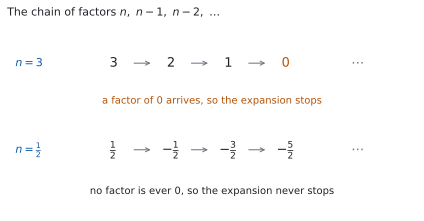
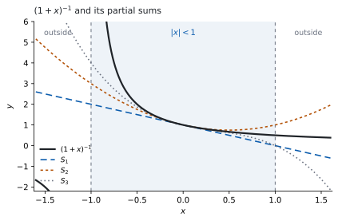

# HL 1.10b — Extension of the binomial theorem to fractional and negative indices（二項定理の拡張：分数と負の指数） {#sec-aahl-1-10b}

::: {.callout-note}
## What you should be able to do
- $n$ が分数や負の数のときの $(1+x)^{n}$ の展開を、必要な項まで書ける。
- 展開が使える範囲（$\lvert x \rvert < 1$）を、自分で言える。
- $(a+b)^{n}$ を $a^{n}\left(1+\dfrac{b}{a}\right)^{n}$ の形にしてから展開できる。
- $(1-2x)^{n}$ のように、$x$ に係数や符号が付いた形も扱える。
- 展開を使って、$\sqrt{1.04}$ のような値の近似を出せる。
:::

## The idea

### 1. Expansions that stop and expansions that do not（終わる展開と、終わらない展開） {#finite-or-not}

$n$ が $0$ 以上の整数のとき、$(1+x)^{n}$ の展開は**有限個の項で終わります**（[SL 1.9](../../aa-sl/01-number-and-algebra/aasl-1-9.qmd#theorem)）。たとえば

$$
(1+x)^{3} = 1 + 3x + 3x^{2} + x^{3}
$$

で、$x^{3}$ のあとに項はありません。

**ここでは、$n$ が分数や負の数のときを扱います。** $(1+x)^{1/2}$ や $(1+x)^{-3}$ には、$\sqrt{1+x}$ や $\dfrac{1}{(1+x)^{3}}$ という意味があります（[SL 1.7a](../../aa-sl/01-number-and-algebra/aasl-1-7a.qmd#negative)）。ところがこのとき、展開は**終わりません。** 項が無限に続きます。

シラバスは、この範囲を $n \in \mathbb{Q}$（有理数）と書いています。

### 2. The extended binomial theorem（一般の $n$ での展開） {#formula}

$n$ が分数や負の数でも使える形を書きます。$(1+x)^{n}$ を $x$ の小さいほうから並べた式は、次のとおりです。

$$
(1+x)^{n} = 1 + nx + \frac{n(n-1)}{2!}x^{2} + \frac{n(n-1)(n-2)}{3!}x^{3} + \cdots
$$ {#eq-aahl110b-main}

::: {.callout-important}
## この式は公式集にあります
公式集の **1.10** の欄に、次の形で印刷されています。

> Extension of binomial theorem, $n \in \mathbb{Q}$
>
> $(a+b)^{n} = a^{n}\left(1 + n\left(\dfrac{b}{a}\right) + \dfrac{n(n-1)}{2!}\left(\dfrac{b}{a}\right)^{2} + \ldots\right)$

$a = 1$、$b = x$ とすると @eq-aahl110b-main になります。**覚える必要はありません。** 覚えるのは、**いつ使えるか**のほうです（[第 3 節](#validity)）。公式集には、そちらが書かれていません。
:::

**係数の作り方は、$1$ つだけです。**

- 上（分子）は $n$ から始めて、$1$ ずつ小さくした数を、**$x$ の指数と同じ個数だけ**かけます。
- 下（分母）は、その個数の階乗です。

$x^{3}$ の項なら、上は $n(n-1)(n-2)$ の $3$ 個、下は $3!$ です。

{#fig-aahl110b-idea-a width=100%}

@fig-aahl110b-idea-a が、$1$ 節の話の中身です。$n = 3$ では $4$ 番目の因数が $n - 3 = 0$ になるので、そこから先の項がすべて消えます。**$n$ が分数や負の数なら、$n - r = 0$ になる $0$ 以上の整数 $r$ がありません。** ですから、消える項が現れません。

::: {.callout-note}
## $^{n}\mathrm{C}_{r}$ は、ここでは使えません
[HL 1.10a](aahl-1-10a.qmd#combination) の $^{n}\mathrm{C}_{r} = \dfrac{n!}{r!(n-r)!}$ は、$n$ が $0$ 以上の整数のときの式です。$n = \dfrac{1}{2}$ に対する $\left(\dfrac{1}{2}\right)!$ には、この本で扱う意味がありません。

**ですから @eq-aahl110b-main は、$^{n}\mathrm{C}_{r}$ を使わずに書いてあります。** 使うのは、かけ算の鎖のほうです。
:::

シラバスには、次の $1$ 行もあります。

> Not required: Proof of binomial theorem.

**なぜこの形になるのかの証明は、問われません。** この式が成り立つものとして使ってください。

### 3. Validity: where the expansion may be used（展開が使える範囲） {#validity}

項が無限に続くので、「足し切る」ことはできません。**部分和が、$(1+x)^{n}$ の値に近づくかどうか**が問題になります。

{#fig-aahl110b-idea-b width=100%}

@fig-aahl110b-idea-b は、$n = -1$ の場合です。$S_{1}$、$S_{2}$、$S_{3}$ は、それぞれ $x$ の $1$ 次・$2$ 次・$3$ 次までで打ち切った部分和です。**$x = 0$ の近くでは、どれも曲線に重なっています。** ところが $x$ が $-1$ や $1$ に近づくと、離れていきます。

**@eq-aahl110b-main が使えるのは、次のときです。**

$$
\lvert x \rvert < 1
$$ {#eq-aahl110b-valid}

答案では `The expansion is valid for` $\lvert x \rvert < 1$ のように書きます。

::: {.callout-important}
## 範囲は、公式集にありません
公式集の **1.10** の欄には、この条件が印刷されていません。**ここは覚えてください。**

`state the values of x for which the expansion is valid` は設問としてよく置かれます。範囲を書かないと、そのぶんの得点にならないことがあります。
:::

#### なぜ $\lvert x \rvert < 1$ なのか {#why-valid}

となり合う項の比を見ます。$x^{r}$ の項から $x^{r+1}$ の項へ進むとき、かかるのは

$$
\frac{n-r}{r+1}\,x
$$

です。$r$ を大きくしていくと $\dfrac{n-r}{r+1}$ は $-1$ に近づくので、**この比の大きさは $\lvert x \rvert$ に近づきます。**

- $\lvert x \rvert > 1$ なら、項の大きさはやがて増えていきます。足しても値が定まりません。
- $\lvert x \rvert < 1$ なら、項の大きさは減っていきます。

**$\lvert x \rvert = 1$ は、$n$ によって変わります。** この本では扱いません。

### 4. Negative indices: the link with geometric series（負の指数：等比級数とのつながり） {#negative}

$n = -1$ を @eq-aahl110b-main に入れます。係数は $1$、$-1$、$\dfrac{(-1)(-2)}{2} = 1$、$\dfrac{(-1)(-2)(-3)}{6} = -1$ と続くので

$$
(1+x)^{-1} = 1 - x + x^{2} - x^{3} + \cdots
$$ {#eq-aahl110b-neg1}

**これは、すでに知っている級数です。** 初項 $1$、公比 $-x$ の infinite geometric series です（[SL 1.8](../../aa-sl/01-number-and-algebra/aasl-1-8.qmd#formula)）。その和は

$$
\frac{1}{1-(-x)} = \frac{1}{1+x}
$$

で、左辺と一致します。**しかも SL 1.8 の収束条件は $\lvert -x \rvert < 1$**、つまり $\lvert x \rvert < 1$ です（[SL 1.8 の $\lvert r \rvert < 1$](../../aa-sl/01-number-and-algebra/aasl-1-8.qmd#modulus)）。@eq-aahl110b-valid と同じものが出てきました。

**新しい公式が、知っている公式と食い違っていないことを、ここで $1$ 度確かめられます。**

### 5. Fractional indices: expanding a square root（分数の指数：平方根を展開する） {#fractional}

$n = \dfrac{1}{2}$ なら $(1+x)^{1/2} = \sqrt{1+x}$ です。係数は

$$
\frac{1}{2}, \qquad \frac{\frac{1}{2}\left(-\frac{1}{2}\right)}{2} = -\frac{1}{8},
\qquad \frac{\frac{1}{2}\left(-\frac{1}{2}\right)\left(-\frac{3}{2}\right)}{6} = \frac{1}{16}
$$

なので

$$
\sqrt{1+x} = 1 + \frac{x}{2} - \frac{x^{2}}{8} + \frac{x^{3}}{16} - \cdots
$$ {#eq-aahl110b-sqrt}

**分数どうしのかけ算なので、符号を追いかけてください。** $-\dfrac{1}{2}$ から先は負の数が続くので、$2$ つかけるたびに符号が戻ります。

### 6. $(a+b)^{n}$: taking out $a^{n}$（$a^{n}$ をくくり出す） {#factor}

@eq-aahl110b-main は、かっこの中が $1 + (\text{何か})$ の形でないと使えません。$(2+x)^{-1}$ のような式は、**先に $a^{n}$ をくくり出します。**

シラバスは、この一手をそのまま書いています。

> $(a + b)^{n} = \left(a\left(1 + \dfrac{b}{a}\right)\right)^{n} = a^{n}\left(1 + \dfrac{b}{a}\right)^{n}$, $n \in \mathbb{Q}$

$(2+x)^{-1}$ なら $a = 2$、$b = x$ です。

$$
(2+x)^{-1} = 2^{-1}\left(1 + \frac{x}{2}\right)^{-1}
= \frac{1}{2}\left(1 - \frac{x}{2} + \frac{x^{2}}{4} - \cdots\right)
= \frac{1}{2} - \frac{x}{4} + \frac{x^{2}}{8} - \cdots
$$

::: {.callout-warning}
## くくり出したら、範囲も変わります
@eq-aahl110b-valid の $x$ にあたるのは、いまは $\dfrac{b}{a}$ です。ですから条件は

$$
\left\lvert \frac{b}{a} \right\rvert < 1
$$

になります。$(2+x)^{-1}$ なら $\left\lvert \dfrac{x}{2} \right\rvert < 1$、つまり $\lvert x \rvert < 2$ です。

**$\lvert x \rvert < 1$ のまま書くと、誤りです。** くくり出した中身が何かを、そのつど見てください。
:::

### 7. Using the expansion to approximate（近似に使う） {#approximation}

$\lvert x \rvert$ が小さいと、$x^{2}$ や $x^{3}$ の項はとても小さくなります。**そこで打ち切れば、電卓なしで値を近似できます。**

$\sqrt{1.04}$ を出してみます。@eq-aahl110b-sqrt に $x = 0.04$ を入れて、$x^{2}$ の項まで使います。

$$
\sqrt{1.04} \approx 1 + \frac{0.04}{2} - \frac{0.04^{2}}{8} = 1 + 0.02 - 0.0002 = 1.0198
$$

$\lvert 0.04 \rvert < 1$ なので、@eq-aahl110b-valid を満たしています。

**打ち切った先の項は、$\dfrac{x^{3}}{16} = \dfrac{0.000064}{16} = 0.000004$ です。** 小数第 $4$ 位までなら、影響しません。

::: {.callout-tip collapse="true"}
## Paper 2 では、電卓で答え合わせができます
展開そのものを出す機能は使いません。できるのは、**出した式が合っているかを数で確かめる**ことです。

$x$ に小さい値（$0.1$ や $0.05$ など）を入れて、展開した式の値と、もとの $(1+x)^{n}$ をそのまま計算した値を見くらべます。近ければ、係数の作り方が合っています。**$\lvert x \rvert$ を小さくするほど、よく合います。**

**Paper 1 では使えません。** ですから、このページの例題と演習は、すべて手で出せる数にしてあります。
:::

**この級数は、AHL 5.19 の Maclaurin 展開でもう一度出てきます。** そこでは $e^{x}$ や $\sin x$ も同じように級数になります。

## Why it works

::: {.callout-tip collapse="true"}
## クリックすると開きます

**@eq-aahl110b-main は、$n$ が $0$ 以上の整数のときの式を、書きなおしただけです。**

[SL 1.9](../../aa-sl/01-number-and-algebra/aasl-1-9.qmd#ncr) の係数は $^{n}\mathrm{C}_{r} = \dfrac{n!}{r!\,(n-r)!}$ でした。この分数を、約分してから見ます。$n!$ のうち $(n-r)!$ が消えるので、上に残るのは **$n$ から始まる $r$ 個**です。

$$
^{n}\mathrm{C}_{r} = \frac{n(n-1)(n-2)\cdots(n-r+1)}{r!}
$$

**右辺には、階乗が $r!$ しか残っていません。** $n!$ が消えたことが要です。$n!$ は $n$ が $0$ 以上の整数でないと書けませんが、**$n(n-1)\cdots(n-r+1)$ は、$n$ が何であってもただのかけ算**だからです。

そこで、この形のほうを $n$ が分数や負の数のときの係数として使います。それが @eq-aahl110b-main です。

**$n$ が $0$ 以上の整数なら、もとの展開に戻ります。** $r = n+1$ のとき、かけ算の鎖に $n - n = 0$ が入るので、そこから先の係数がすべて $0$ になります（@fig-aahl110b-idea-a）。有限個で終わる、というのはこのことです。

#### 本当にこれでよいのか

書きなおしただけでは、$n$ が分数のときに**値が合う**保証はありません。その確かめが [第 4 節](#negative) です。$n = -1$ の場合に、この式が SL 1.8 の infinite geometric series とぴったり同じ級数を出し、しかも収束条件まで同じ $\lvert x \rvert < 1$ になりました。

**一般の $n$ についての証明は、シラバスが `Not required` と書いています。** ですから、ここまでで足ります。
:::

## Worked examples

::: {.callout-note appearance="simple"}
問題文は英語です。意味が理解できなかったら、問題文の下の「**日本語訳**」を開いてください。解説は日本語です。

**例題も演習も、すべて電卓なしで解けます。** Paper 1 のつもりで解いてください。
:::

::: {#exm-aahl110b-neg}
**(a)** [Find the first four terms, in ascending powers of $x$, of the expansion of $(1+x)^{-3}$.]{.q-en}

**(b)** [State the values of $x$ for which the expansion is valid.]{.q-en}

**(c)** [Explain why the expansion does not terminate.]{.q-en}

日本語訳

**(a)** $(1+x)^{-3}$ の展開を、$x$ の次数の低いほうから $4$ 項求めなさい。

**(b)** この展開が使える $x$ の値の範囲を述べなさい。

**(c)** この展開が有限個の項で終わらない理由を説明しなさい。

---

**(a)** @eq-aahl110b-main に $n = -3$ を入れます。かけ算の鎖は $-3$、$-4$、$-5$ と続きます。

$$
\frac{(-3)(-4)}{2!} = \frac{12}{2} = 6, \qquad
\frac{(-3)(-4)(-5)}{3!} = \frac{-60}{6} = -10
$$

$$
(1+x)^{-3} = 1 - 3x + 6x^{2} - 10x^{3} - \cdots
$$

**(b)** くくり出しをしていないので、そのまま $\lvert x \rvert < 1$ です（@eq-aahl110b-valid）。

**(c)** `Explain why` なので、英語で理由を書きます。

::: {.model-answer}
**試験ではこう書く**

*The coefficient of $x^{r}$ contains the product $n(n-1)\cdots(n-r+1)$, and a term vanishes only when one of these factors is $0$, that is when $n = r$ for some integer $r \geq 0$. Here $n = -3$ is negative, so $n - r$ is negative for every integer $r \geq 0$ and no factor is ever $0$. Hence every coefficient is non-zero and the expansion continues without end.*
:::

（$x^{r}$ の係数には $n(n-1)\cdots(n-r+1)$ というかけ算が入っていて、項が消えるのは、その因数のどれかが $0$ になるとき、つまり $n$ が $0$ 以上の整数 $r$ と等しいときだけである。ここでは $n = -3$ が負なので、$0$ 以上のどの整数 $r$ についても $n - r$ は負で、因数が $0$ になることがない、という意味です。）

**検算。** **かけ算の鎖を使わない道すじ**で出します。$(1+x)^{-3} = (1+x)^{-1} \times (1+x)^{-2}$ なので、$2$ つの展開をかけ合わせます。@eq-aahl110b-neg1 と、$n = -2$ の展開 $1 - 2x + 3x^{2} - 4x^{3}$ を使います。

$x^{2}$ の項は $1 \times 3x^{2} + (-x)(-2x) + x^{2} \times 1 = 3x^{2} + 2x^{2} + x^{2} = 6x^{2}$ です ✓

$x^{3}$ の項は $1 \times (-4x^{3}) + (-x)(3x^{2}) + x^{2}(-2x) + (-x^{3}) \times 1 = -10x^{3}$ です ✓

**かけ算の順序も、割り算も使っていません。** 係数の作り方をまちがえていれば、ここで合わなくなります。

**検算（数で）。** $x = 0.1$ を入れます。$(1.1)^{-3}$ は $0.75131\ldots$ です。答えの式は

$$
1 - 0.3 + 0.06 - 0.01 = 0.75
$$

差は $0.0013$ ほどです。打ち切った次の項は $\dfrac{(-3)(-4)(-5)(-6)}{4!}x^{4} = 15x^{4} = 0.0015$ なので、**差の大きさが次の項で説明できています** ✓

::: {.callout-note}
## 解答例（答案用紙に書くこと）
**(a)**
$$(1+x)^{-3} = 1 + (-3)x + \frac{(-3)(-4)}{2!}x^{2} + \frac{(-3)(-4)(-5)}{3!}x^{3} - \cdots$$

$$= 1 - 3x + 6x^{2} - 10x^{3} - \cdots$$

**(b)** *The expansion is valid for $\lvert x \rvert < 1$.*

**(c)** *A term vanishes only if one of the factors $n, n-1, n-2, \ldots$ is $0$. With $n = -3$ every factor $n - r$ is negative, so no coefficient is ever $0$ and the expansion never terminates.*
:::
:::

::: {#exm-aahl110b-bracket}
**(a)** [Find the first three terms, in ascending powers of $x$, of the expansion of $(1-2x)^{\frac{1}{2}}$.]{.q-en}

**(b)** [State the values of $x$ for which the expansion is valid.]{.q-en}

日本語訳

**(a)** $(1-2x)^{\frac{1}{2}}$ の展開を、$x$ の次数の低いほうから $3$ 項求めなさい。

**(b)** この展開が使える $x$ の値の範囲を述べなさい。

---

**(a)** @eq-aahl110b-sqrt の $x$ のところに、$-2x$ をそのまま入れます。**かっこを忘れないでください。**

$$
1 + \frac{(-2x)}{2} - \frac{(-2x)^{2}}{8} = 1 - x - \frac{4x^{2}}{8} = 1 - x - \frac{x^{2}}{2}
$$

**(b)** @eq-aahl110b-valid の $x$ にあたるのは $-2x$ です。

$$
\lvert -2x \rvert < 1 \ \Rightarrow \ 2\lvert x \rvert < 1 \ \Rightarrow \ \lvert x \rvert < \frac{1}{2}
$$

**検算。** **答えから逆に戻します。** これは $\sqrt{1-2x}$ の近似なので、$2$ 乗すれば $1-2x$ に戻るはずです。

$$
\left(1 - x - \frac{x^{2}}{2}\right)^{2} = 1 - 2x + x^{3} + \frac{x^{4}}{4}
$$

**$x^{2}$ までを見ると $1 - 2x$ で、$x^{2}$ の項は $0$ です** ✓ 残った $x^{3}$ と $x^{4}$ は、$3$ 項で打ち切ったために出たもので、もともと打ち切った先にある項と打ち消し合うぶんです。

**$2$ 乗して $1 - 2x + (\text{何か})x^{2}$ のように $x^{2}$ が残っていたら**、どこかで係数をまちがえています。

**検算（数で）。** $x = 0.1$ を入れます。$\sqrt{1-0.2} = \sqrt{0.8} = 0.89442\ldots$ です。答えの式は

$$
1 - 0.1 - 0.005 = 0.895
$$

合っています ✓

::: {.callout-note}
## 解答例（答案用紙に書くこと）
**(a)**
$$(1-2x)^{\frac{1}{2}} = 1 + \frac{1}{2}(-2x) + \frac{\frac{1}{2}\left(-\frac{1}{2}\right)}{2!}(-2x)^{2} + \cdots$$

$$= 1 - x - \frac{x^{2}}{2} + \cdots$$

**(b)** *Valid for $\lvert -2x \rvert < 1$, that is $\lvert x \rvert < \dfrac{1}{2}$.*
:::
:::

::: {#exm-aahl110b-factor}
**(a)** [Show that $(4+x)^{-\frac{1}{2}} = \dfrac{1}{2}\left(1 + \dfrac{x}{4}\right)^{-\frac{1}{2}}$.]{.q-en}

**(b)** [Hence find the first three terms, in ascending powers of $x$, of the expansion of $(4+x)^{-\frac{1}{2}}$.]{.q-en}

**(c)** [State the values of $x$ for which the expansion is valid.]{.q-en}

日本語訳

**(a)** $(4+x)^{-\frac{1}{2}} = \dfrac{1}{2}\left(1 + \dfrac{x}{4}\right)^{-\frac{1}{2}}$ であることを示しなさい。

**(b)** それを使って、$(4+x)^{-\frac{1}{2}}$ の展開を $x$ の次数の低いほうから $3$ 項求めなさい。

**(c)** この展開が使える $x$ の値の範囲を述べなさい。

---

**(a)** $a = 4$ をくくり出します（[第 6 節](#factor)）。

$$
(4+x)^{-\frac{1}{2}} = \left(4\left(1 + \frac{x}{4}\right)\right)^{-\frac{1}{2}}
= 4^{-\frac{1}{2}}\left(1 + \frac{x}{4}\right)^{-\frac{1}{2}}
$$

$4^{-\frac{1}{2}} = \dfrac{1}{\sqrt{4}} = \dfrac{1}{2}$ です（[SL 1.7a](../../aa-sl/01-number-and-algebra/aasl-1-7a.qmd#negative)）。

**(b)** まず $n = -\dfrac{1}{2}$ の係数を作ります。かけ算の鎖は $-\dfrac{1}{2}$、$-\dfrac{3}{2}$ です。

$$
\frac{\left(-\frac{1}{2}\right)\left(-\frac{3}{2}\right)}{2!} = \frac{\frac{3}{4}}{2} = \frac{3}{8}
$$

$$
(1+u)^{-\frac{1}{2}} = 1 - \frac{u}{2} + \frac{3u^{2}}{8} - \cdots
$$

$u = \dfrac{x}{4}$ を入れます。$u^{2} = \dfrac{x^{2}}{16}$ なので

$$
1 - \frac{x}{8} + \frac{3}{8}\cdot\frac{x^{2}}{16} = 1 - \frac{x}{8} + \frac{3x^{2}}{128}
$$

$\dfrac{1}{2}$ を掛けて

$$
(4+x)^{-\frac{1}{2}} = \frac{1}{2} - \frac{x}{16} + \frac{3x^{2}}{256} - \cdots
$$

**(c)** $\left\lvert \dfrac{x}{4} \right\rvert < 1$、つまり $\lvert x \rvert < 4$ です。

**検算。** **$2$ 乗して、$(4+x)^{-1}$ の展開に戻るかを見ます。**

$$
\left(\frac{1}{2} - \frac{x}{16} + \frac{3x^{2}}{256}\right)^{2}
= \frac{1}{4} - \frac{x}{16} + \frac{x^{2}}{64} + \cdots
$$

いっぽう $(4+x)^{-1} = \dfrac{1}{4}\left(1 + \dfrac{x}{4}\right)^{-1} = \dfrac{1}{4}\left(1 - \dfrac{x}{4} + \dfrac{x^{2}}{16}\right) = \dfrac{1}{4} - \dfrac{x}{16} + \dfrac{x^{2}}{64}$ です。

$x^{2}$ までぴったり一致しました ✓ **$2$ 乗のほうは $-\dfrac{1}{2}$ 乗の計算をまったく使っていないので、別の道すじです。**

**検算（数で）。** $x = 0.4$ を入れます。$(4.4)^{-\frac{1}{2}} = 0.47673\ldots$ です。答えの式は

$$
0.5 - 0.025 + \frac{3 \times 0.16}{256} = 0.5 - 0.025 + 0.001875 = 0.476875
$$

合っています ✓

**$4^{-\frac{1}{2}}$ を $\dfrac{1}{4}$ や $-2$ としていたら**、先頭の項が $\dfrac{1}{2}$ になりません。**$x = 0$ を入れて、先頭の項だけを先に確かめてください。**

::: {.callout-note}
## 解答例（答案用紙に書くこと）
**(a)**
$$(4+x)^{-\frac{1}{2}} = \left(4\left(1+\frac{x}{4}\right)\right)^{-\frac{1}{2}} = 4^{-\frac{1}{2}}\left(1+\frac{x}{4}\right)^{-\frac{1}{2}} = \frac{1}{2}\left(1+\frac{x}{4}\right)^{-\frac{1}{2}}$$

**(b)**
$$\frac{1}{2}\left(1 - \frac{1}{2}\left(\frac{x}{4}\right) + \frac{\left(-\frac{1}{2}\right)\left(-\frac{3}{2}\right)}{2!}\left(\frac{x}{4}\right)^{2} + \cdots\right) = \frac{1}{2} - \frac{x}{16} + \frac{3x^{2}}{256} - \cdots$$

**(c)** *Valid for $\left\lvert \dfrac{x}{4} \right\rvert < 1$, that is $\lvert x \rvert < 4$.*
:::
:::

::: {#exm-aahl110b-approx}
**(a)** [Find the first three terms, in ascending powers of $x$, of the expansion of $(1+x)^{\frac{1}{3}}$.]{.q-en}

**(b)** [Hence find an approximation to $\sqrt[3]{1.03}$, giving your answer correct to five decimal places.]{.q-en}

**(c)** [Explain why the same expansion cannot be used to find $\sqrt[3]{4}$ by putting $x = 3$.]{.q-en}

日本語訳

**(a)** $(1+x)^{\frac{1}{3}}$ の展開を、$x$ の次数の低いほうから $3$ 項求めなさい。

**(b)** それを使って $\sqrt[3]{1.03}$ の近似値を求め、小数第 $5$ 位まで答えなさい。

**(c)** 同じ展開に $x = 3$ を入れて $\sqrt[3]{4}$ を求めることができない理由を説明しなさい。

---

**(a)** $n = \dfrac{1}{3}$ です。かけ算の鎖は $\dfrac{1}{3}$、$-\dfrac{2}{3}$ と続きます。

$$
\frac{\frac{1}{3}\left(-\frac{2}{3}\right)}{2!} = \frac{-\frac{2}{9}}{2} = -\frac{1}{9}
$$

$$
(1+x)^{\frac{1}{3}} = 1 + \frac{x}{3} - \frac{x^{2}}{9} + \cdots
$$

**(b)** $1.03 = 1 + 0.03$ なので $x = 0.03$ です。$\lvert 0.03 \rvert < 1$ なので使えます。

$$
1 + \frac{0.03}{3} - \frac{0.03^{2}}{9} = 1 + 0.01 - \frac{0.0009}{9} = 1 + 0.01 - 0.0001 = 1.0099
$$

小数第 $5$ 位まででは $1.00990$ です。

**(c)** `Explain why` なので、英語で理由を書きます。

::: {.model-answer}
**試験ではこう書く**

*The expansion of $(1+x)^{\frac{1}{3}}$ is only valid for $\lvert x \rvert < 1$, and $x = 3$ does not satisfy this. For $\lvert x \rvert > 1$ the terms of the series eventually increase in size instead of decreasing, so the partial sums do not settle down to a value and cannot approximate $\sqrt[3]{4}$. To use the expansion, $\sqrt[3]{4}$ would first have to be written with a bracket of the form $1 + x$ with $\lvert x \rvert < 1$.*
:::

（$(1+x)^{\frac{1}{3}}$ の展開が使えるのは $\lvert x \rvert < 1$ のときだけで、$x = 3$ はこれを満たさない。$\lvert x \rvert > 1$ では項がやがて大きくなっていくので、部分和が $1$ つの値に落ち着かない、という意味です。）

**検算。** **答えから逆に戻します。** $1.0099$ を $3$ 乗すると

$$
1.0099^{3} = 1.029995\ldots
$$

で、$1.03$ との差は $0.000005$ ほどです ✓ **$3$ 乗のほうは、展開をまったく使っていません。**

**検算（打ち切った先の項）。** 次の項は

$$
\frac{\frac{1}{3}\left(-\frac{2}{3}\right)\left(-\frac{5}{3}\right)}{3!}x^{3} = \frac{5x^{3}}{81}
$$

です。$x = 0.03$ なら $\dfrac{5 \times 0.000027}{81} = 0.0000017$ ほどなので、**小数第 $5$ 位には届きません。** 小数第 $5$ 位まで答えてよい、ということがここで言えます ✓

**$x^{2}$ の係数を $+\dfrac{1}{9}$ としていたら**、答えは $1.0101$ になります。$3$ 乗すると $1.0306$ ほどで、$1.03$ と合いません。

::: {.callout-note}
## 解答例（答案用紙に書くこと）
**(a)**
$$(1+x)^{\frac{1}{3}} = 1 + \frac{1}{3}x + \frac{\frac{1}{3}\left(-\frac{2}{3}\right)}{2!}x^{2} + \cdots = 1 + \frac{x}{3} - \frac{x^{2}}{9} + \cdots$$

**(b)** *Put $x = 0.03$:*
$$1 + 0.01 - 0.0001 = 1.0099 = 1.00990 \ \text{(5 d.p.)}$$

**(c)** *The expansion is valid only for $\lvert x \rvert < 1$, and $x = 3$ lies outside this. For $\lvert x \rvert > 1$ the terms eventually increase in size, so the partial sums do not approach a value.*
:::
:::

## Common errors

::: {.callout-warning}
## 範囲を書かない
`state the values of x for which the expansion is valid` は、**設問の一部**です。展開だけを書いて止めると、そのぶんの得点にならないことがあります。

範囲は公式集にありません（[第 3 節](#validity)）。**展開を書いたら、続けて範囲を書く**、と手順にしてしまうのが確実です。
:::

::: {.callout-warning}
## $^{n}\mathrm{C}_{r}$ を使ってしまう
$^{n}\mathrm{C}_{r} = \dfrac{n!}{r!(n-r)!}$ は、$n$ が $0$ 以上の整数のときの式です（[HL 1.10a](aahl-1-10a.qmd#combination)）。$n = -3$ や $n = \dfrac{1}{2}$ では、$n!$ が書けません。

**使うのは、かけ算の鎖のほうです**（@eq-aahl110b-main）。$x^{r}$ の係数は $\dfrac{n(n-1)\cdots(n-r+1)}{r!}$ で、上の因数は $r$ 個です。
:::

::: {.callout-warning}
## $a^{n}$ をくくり出さずに展開する
@eq-aahl110b-main が使えるのは、かっこの中が $1 + (\text{何か})$ のときだけです。$(4+x)^{-\frac{1}{2}}$ をそのまま展開することはできません。

**先に $a^{n}$ をくくり出します**（[第 6 節](#factor)）。$x = 0$ を入れて、先頭の項が $a^{n}$ になっているかを見れば、くくり出しを忘れていないか確かめられます。
:::

::: {.callout-warning}
## くくり出したのに、範囲を $\lvert x \rvert < 1$ のままにする
くくり出したあと、@eq-aahl110b-valid の $x$ にあたるのは $\dfrac{b}{a}$ です。条件は $\left\lvert \dfrac{b}{a} \right\rvert < 1$ になります（[第 6 節](#factor)）。

$(4+x)^{-\frac{1}{2}}$ なら $\lvert x \rvert < 4$ で、$\lvert x \rvert < 1$ ではありません。**かっこの中身が何かを、そのつど見てください。**
:::

::: {.callout-warning}
## かっこを付けずに代入する
$(1-2x)^{\frac{1}{2}}$ では、@eq-aahl110b-sqrt の $x$ のところに $-2x$ が入ります。$x^{2}$ の項は $-\dfrac{(-2x)^{2}}{8}$ であって、$-\dfrac{-2x^{2}}{8}$ ではありません。

**$(-2x)^{2} = 4x^{2}$ です。** 係数の $2$ も $2$ 乗されます（[SL 1.9 第 6 節](../../aa-sl/01-number-and-algebra/aasl-1-9.qmd#substitution)）。
:::

::: {.callout-warning}
## 分数の指数で、符号を追いかけそこねる
$n = \dfrac{1}{2}$ のかけ算の鎖は $\dfrac{1}{2}$、$-\dfrac{1}{2}$、$-\dfrac{3}{2}$、$-\dfrac{5}{2}$ です。**$2$ 番目から先は、すべて負**になります。

ですから負の数を $1$ つかけるたびに符号が変わり、$2$ つかけると戻ります。$\sqrt{1+x}$ の符号が $+,\ +,\ -,\ +$ と並ぶのは、そのためです（@eq-aahl110b-sqrt）。**符号が交互だと思い込まないでください。**
:::

## Exercises

::: {.callout-note appearance="simple"}
各問題に、折りたたみが $3$ つ付いています。**日本語訳**、**解答例**（答案用紙に書くべきこと。英語です）、**解説**（なぜそうなるか。日本語です）。

まず自分で解いて、次に解答例と見くらべてください。**解説は、合わなかったときだけ開けば十分です。**
:::

::: {.exercise-block}

[1]{.ex-no} **(a)** [Find the first four terms, in ascending powers of $x$, of the expansion of $(1+x)^{-4}$.]{.q-en}

**(b)** [State the values of $x$ for which the expansion is valid.]{.q-en}

日本語訳

**(a)** $(1+x)^{-4}$ の展開を、$x$ の次数の低いほうから $4$ 項求めなさい。

**(b)** この展開が使える $x$ の値の範囲を述べなさい。

::: {.callout-note collapse="true"}
## 解答例（答案用紙に書くこと）

**(a)**
$$(1+x)^{-4} = 1 + (-4)x + \frac{(-4)(-5)}{2!}x^{2} + \frac{(-4)(-5)(-6)}{3!}x^{3} - \cdots$$

$$= 1 - 4x + 10x^{2} - 20x^{3} - \cdots$$

**(b)** *Valid for $\lvert x \rvert < 1$.*
:::

::: {.callout-tip collapse="true"}
## 解説

かけ算の鎖は $-4$、$-5$、$-6$ です。$\dfrac{(-4)(-5)}{2} = 10$、$\dfrac{(-4)(-5)(-6)}{6} = -20$ となります。

**検算。** **かけ算の鎖を使わない道すじ**で出します。$(1+x)^{-4} = \left((1+x)^{-2}\right)^{2}$ なので、$1 - 2x + 3x^{2} - 4x^{3}$ を $2$ 乗します。

$x$ の項は $2(-2x) = -4x$、$x^{2}$ の項は $2(3x^{2}) + (-2x)^{2} = 6x^{2} + 4x^{2} = 10x^{2}$、$x^{3}$ の項は $2(-4x^{3}) + 2(-2x)(3x^{2}) = -8x^{3} - 12x^{3} = -20x^{3}$ です ✓

**$n$ が負の整数なら、符号は交互になります。** $+,\ -,\ +,\ -$ と並んでいなければ、どこかで符号を落としています。ただし**これは $n$ が負の整数のときの話**で、$n$ が分数のときは当てはまりません。
:::

::: {.ex-sep}
:::

[2]{.ex-no} **(a)** [Find the first three terms, in ascending powers of $x$, of the expansion of $(1+x)^{\frac{1}{4}}$.]{.q-en}

**(b)** [State the values of $x$ for which the expansion is valid.]{.q-en}

日本語訳

**(a)** $(1+x)^{\frac{1}{4}}$ の展開を、$x$ の次数の低いほうから $3$ 項求めなさい。

**(b)** この展開が使える $x$ の値の範囲を述べなさい。

::: {.callout-note collapse="true"}
## 解答例（答案用紙に書くこと）

**(a)**
$$(1+x)^{\frac{1}{4}} = 1 + \frac{1}{4}x + \frac{\frac{1}{4}\left(-\frac{3}{4}\right)}{2!}x^{2} + \cdots = 1 + \frac{x}{4} - \frac{3x^{2}}{32} + \cdots$$

**(b)** *Valid for $\lvert x \rvert < 1$.*
:::

::: {.callout-tip collapse="true"}
## 解説

$\dfrac{\frac{1}{4}\left(-\frac{3}{4}\right)}{2} = \dfrac{-\frac{3}{16}}{2} = -\dfrac{3}{32}$ です。**分子どうし、分母どうしでかけてから、$2!$ で割ります。**

**検算（数で）。** $x = 0.1$ を入れます。$1.1^{\frac{1}{4}}$ は $1.02411\ldots$ です。答えの式は

$$
1 + 0.025 - \frac{3 \times 0.01}{32} = 1 + 0.025 - 0.0009375 = 1.0240625
$$

合っています ✓ **$4$ 乗して $1.1$ に戻るかを見てもかまいません。**

**$x$ の係数を $\dfrac{1}{4}$ ではなく $4$ としていたら**、$x = 0.1$ で $1.4$ ほどになり、$1.024$ とはまるでちがいます。
:::

::: {.ex-sep}
:::

[3]{.ex-no} **(a)** [Find the first three terms, in ascending powers of $x$, of the expansion of $(1-3x)^{-1}$.]{.q-en}

**(b)** [State the values of $x$ for which the expansion is valid.]{.q-en}

日本語訳

**(a)** $(1-3x)^{-1}$ の展開を、$x$ の次数の低いほうから $3$ 項求めなさい。

**(b)** この展開が使える $x$ の値の範囲を述べなさい。

::: {.callout-note collapse="true"}
## 解答例（答案用紙に書くこと）

**(a)**
$$(1-3x)^{-1} = 1 + (-1)(-3x) + \frac{(-1)(-2)}{2!}(-3x)^{2} + \cdots = 1 + 3x + 9x^{2} + \cdots$$

**(b)** *Valid for $\lvert -3x \rvert < 1$, that is $\lvert x \rvert < \dfrac{1}{3}$.*
:::

::: {.callout-tip collapse="true"}
## 解説

@eq-aahl110b-main の $x$ のところに $-3x$ を入れます。**かっこを忘れないでください。** $(-3x)^{2} = 9x^{2}$ です。

**検算。** **等比級数として出し直します**（[第 4 節](#negative)）。$\dfrac{1}{1-3x}$ は、初項 $1$、公比 $3x$ の infinite geometric series の和です。ですから項は $1,\ 3x,\ 9x^{2},\ \ldots$ で、収束するのは $\lvert 3x \rvert < 1$ のときです ✓

**二項定理をまったく使わずに、展開も範囲も出ました。** $n = -1$ のときは、いつもこの道すじが使えます。

**符号がすべて $+$ です。** $(1-3x)$ のかっこの中が負なので、$(-3x)$ の偶数乗・奇数乗と、係数の側の符号が打ち消し合います。**負の符号があるから交互になる、とはかぎりません。**
:::

::: {.ex-sep}
:::

[4]{.ex-no} **(a)** [Find the first three terms, in ascending powers of $x$, of the expansion of $(1+2x)^{-3}$.]{.q-en}

**(b)** [State the values of $x$ for which the expansion is valid.]{.q-en}

日本語訳

**(a)** $(1+2x)^{-3}$ の展開を、$x$ の次数の低いほうから $3$ 項求めなさい。

**(b)** この展開が使える $x$ の値の範囲を述べなさい。

::: {.callout-note collapse="true"}
## 解答例（答案用紙に書くこと）

**(a)**
$$(1+2x)^{-3} = 1 + (-3)(2x) + \frac{(-3)(-4)}{2!}(2x)^{2} + \cdots = 1 - 6x + 24x^{2} + \cdots$$

**(b)** *Valid for $\lvert 2x \rvert < 1$, that is $\lvert x \rvert < \dfrac{1}{2}$.*
:::

::: {.callout-tip collapse="true"}
## 解説

$n = -3$ の係数 $1,\ -3,\ 6$ はそのままで、$x$ のところに $2x$ が入ります。$6 \times (2x)^{2} = 6 \times 4x^{2} = 24x^{2}$ です。

**検算（数で）。** $x = 0.05$ を入れます。$(1.1)^{-3}$ は $0.75131\ldots$ です。答えの式は

$$
1 - 0.3 + 24 \times 0.0025 = 1 - 0.3 + 0.06 = 0.76
$$

差は $0.009$ ほどで、次の項 $\dfrac{(-3)(-4)(-5)}{3!}(2x)^{3} = -10 \times 0.001 = -0.01$ と大きさが合っています ✓

**$(2x)^{2}$ を $2x^{2}$ としていたら**、$x^{2}$ の係数は $12$ です。$x = 0.05$ で $1 - 0.3 + 0.03 = 0.73$ となり、$0.751$ とずれる向きが逆になります。
:::

::: {.ex-sep}
:::

[5]{.ex-no} **(a)** [Show that $(9+x)^{\frac{1}{2}} = 3\left(1 + \dfrac{x}{9}\right)^{\frac{1}{2}}$.]{.q-en}

**(b)** [Hence find the first three terms, in ascending powers of $x$, of the expansion of $(9+x)^{\frac{1}{2}}$.]{.q-en}

**(c)** [State the values of $x$ for which the expansion is valid.]{.q-en}

日本語訳

**(a)** $(9+x)^{\frac{1}{2}} = 3\left(1 + \dfrac{x}{9}\right)^{\frac{1}{2}}$ であることを示しなさい。

**(b)** それを使って、$(9+x)^{\frac{1}{2}}$ の展開を $x$ の次数の低いほうから $3$ 項求めなさい。

**(c)** この展開が使える $x$ の値の範囲を述べなさい。

::: {.callout-note collapse="true"}
## 解答例（答案用紙に書くこと）

**(a)**
$$(9+x)^{\frac{1}{2}} = \left(9\left(1+\frac{x}{9}\right)\right)^{\frac{1}{2}} = 9^{\frac{1}{2}}\left(1+\frac{x}{9}\right)^{\frac{1}{2}} = 3\left(1+\frac{x}{9}\right)^{\frac{1}{2}}$$

**(b)**
$$3\left(1 + \frac{1}{2}\left(\frac{x}{9}\right) - \frac{1}{8}\left(\frac{x}{9}\right)^{2} + \cdots\right) = 3 + \frac{x}{6} - \frac{x^{2}}{216} + \cdots$$

**(c)** *Valid for $\left\lvert \dfrac{x}{9} \right\rvert < 1$, that is $\lvert x \rvert < 9$.*
:::

::: {.callout-tip collapse="true"}
## 解説

**(b)** @eq-aahl110b-sqrt に $\dfrac{x}{9}$ を入れてから、$3$ 倍します。$3 \times \dfrac{1}{2} \times \dfrac{1}{9} = \dfrac{1}{6}$、$3 \times \left(-\dfrac{1}{8}\right) \times \dfrac{1}{81} = -\dfrac{1}{216}$ です。

**検算。** **$2$ 乗して $9+x$ に戻るかを見ます。**

$$
\left(3 + \frac{x}{6} - \frac{x^{2}}{216}\right)^{2} = 9 + x + \left(\frac{1}{36} - \frac{1}{36}\right)x^{2} + \cdots = 9 + x + \cdots
$$

$x^{2}$ の係数が $0$ になりました ✓ **$2$ 乗のほうは、$\frac{1}{2}$ 乗の計算をまったく使っていません。**

**検算（$x = 0$ で）。** 先頭の項は $3$ で、$\sqrt{9} = 3$ と合っています ✓ **くくり出しを忘れていないかが、これで分かります。**

**$9^{\frac{1}{2}}$ を $\dfrac{9}{2}$ としていたら**、先頭が $4.5$ になります。$x = 0$ を入れるだけで気づけます。
:::

::: {.ex-sep}
:::

[6]{.ex-no} **(a)** [Find the first three terms, in ascending powers of $x$, of the expansion of $(2-x)^{-2}$.]{.q-en}

**(b)** [State the values of $x$ for which the expansion is valid.]{.q-en}

日本語訳

**(a)** $(2-x)^{-2}$ の展開を、$x$ の次数の低いほうから $3$ 項求めなさい。

**(b)** この展開が使える $x$ の値の範囲を述べなさい。

::: {.callout-note collapse="true"}
## 解答例（答案用紙に書くこと）

**(a)**
$$(2-x)^{-2} = 2^{-2}\left(1 - \frac{x}{2}\right)^{-2} = \frac{1}{4}\left(1 + x + \frac{3x^{2}}{4} + \cdots\right) = \frac{1}{4} + \frac{x}{4} + \frac{3x^{2}}{16} + \cdots$$

**(b)** *Valid for $\left\lvert -\dfrac{x}{2} \right\rvert < 1$, that is $\lvert x \rvert < 2$.*
:::

::: {.callout-tip collapse="true"}
## 解説

$a = 2$ をくくり出すと $2^{-2} = \dfrac{1}{4}$ です。中身は $\left(1 - \dfrac{x}{2}\right)^{-2}$ なので、$u = -\dfrac{x}{2}$ として $1 - 2u + 3u^{2}$ に入れます。$-2u = x$、$3u^{2} = \dfrac{3x^{2}}{4}$ です。

**検算（数で）。** $x = 0.2$ を入れます。$(1.8)^{-2} = \dfrac{1}{3.24} = 0.30864\ldots$ です。答えの式は

$$
0.25 + 0.05 + \frac{3 \times 0.04}{16} = 0.25 + 0.05 + 0.0075 = 0.3075
$$

差は $0.001$ ほどで、次の項 $\dfrac{1}{4} \times (-4)u^{3} = \dfrac{1}{4} \times 4\left(\frac{x}{2}\right)^{3} = 0.001$ と合っています ✓

**$2^{-2}$ を $-4$ や $\dfrac{1}{2}$ としていたら**、$x = 0$ で先頭が $\dfrac{1}{4}$ になりません。**$(2-0)^{-2} = \dfrac{1}{4}$ です。**
:::

::: {.ex-sep}
:::

[7]{.ex-no} [Use the first three terms of the expansion of $(1+x)^{\frac{1}{2}}$ to find an approximation to $\sqrt{1.08}$, giving your answer correct to four decimal places.]{.q-en}

日本語訳

$(1+x)^{\frac{1}{2}}$ の展開の最初の $3$ 項を使って、$\sqrt{1.08}$ の近似値を求め、小数第 $4$ 位まで答えなさい。

::: {.callout-note collapse="true"}
## 解答例（答案用紙に書くこと）

*Put $x = 0.08$, and note that $\lvert 0.08 \rvert < 1$.*

$$\sqrt{1.08} \approx 1 + \frac{0.08}{2} - \frac{0.08^{2}}{8} = 1 + 0.04 - 0.0008 = 1.0392$$
:::

::: {.callout-tip collapse="true"}
## 解説

$1.08 = 1 + 0.08$ なので $x = 0.08$ です。@eq-aahl110b-sqrt に入れます。$0.08^{2} = 0.0064$、$\dfrac{0.0064}{8} = 0.0008$ です。

**検算。** **$2$ 乗して $1.08$ に戻るかを見ます。** $1.0392^{2} = 1.07993\ldots$ で、$1.08$ との差は $0.00007$ ほどです ✓

**検算（打ち切った先の項）。** 次の項は $\dfrac{x^{3}}{16} = \dfrac{0.000512}{16} = 0.000032$ です。**小数第 $4$ 位には届きません**ので、$1.0392$ と答えてよいことが分かります ✓

**$x = 1.08$ としていたら**、範囲 $\lvert x \rvert < 1$ を外れます。**入れるのは、$1$ からの差のほうです。**
:::

::: {.ex-sep}
:::

[8]{.ex-no} [The expansion of $(1-x)^{-1}$ in ascending powers of $x$ is $1 + x + x^{2} + x^{3} + \cdots$.]{.q-en}

**(a)** [Show that this is an infinite geometric series, stating its first term and its common ratio.]{.q-en}

**(b)** [Explain why the condition for this geometric series to have a sum is the same as the condition for the binomial expansion to be valid.]{.q-en}

日本語訳

$(1-x)^{-1}$ を $x$ の次数の低いほうから展開すると $1 + x + x^{2} + x^{3} + \cdots$ になります。

**(a)** これが infinite geometric series であることを示し、初項と公比を述べなさい。

**(b)** この等比級数に和が存在するための条件が、二項展開が使えるための条件と同じになる理由を説明しなさい。

::: {.callout-note collapse="true"}
## 解答例（答案用紙に書くこと）

**(a)** *Each term is $x$ times the previous term, so the series is geometric with first term $u_{1} = 1$ and common ratio $r = x$.*

**(b)** *The geometric series has a sum only when $\lvert r \rvert < 1$, that is $\lvert x \rvert < 1$. The binomial expansion of $(1-x)^{-1}$ is valid for $\lvert -x \rvert < 1$, which is also $\lvert x \rvert < 1$. Both conditions say that the terms must shrink towards zero fast enough for the partial sums to settle down, and here the two series are the same series, so the two conditions must agree.*
:::

::: {.callout-tip collapse="true"}
## 解説

**(a)** となり合う項の比を見ます。$\dfrac{x^{2}}{x} = x$、$\dfrac{x^{3}}{x^{2}} = x$ なので、公比は $x$ です（[SL 1.8](../../aa-sl/01-number-and-algebra/aasl-1-8.qmd#formula)）。

**(b)** `Explain why` なので、英語で理由を書きます。**$2$ つの級数が同じものである**ことを言うのが要です。

**検算。** SL 1.8 の公式で和を出し、もとの式に戻るかを見ます。

$$
S_{\infty} = \frac{u_{1}}{1-r} = \frac{1}{1-x} = (1-x)^{-1}
$$

もとの式に戻りました ✓ **二項定理をまったく使っていない道すじです。**

**$r = -x$ としていたら**、和は $\dfrac{1}{1+x}$ になります。$x = 0.5$ で $\dfrac{1}{0.5} = 2$ と $\dfrac{1}{1.5} = 0.67$ ですから、まるでちがう値です。

::: {.model-answer}
**試験ではこう書く**

*The two series are the same series written in two ways, so a condition that makes one of them work must make the other work too. The geometric series $1 + x + x^{2} + \cdots$ has a sum exactly when $\lvert r \rvert = \lvert x \rvert < 1$, and the binomial expansion of $(1-x)^{-1}$ is valid exactly when $\lvert -x \rvert = \lvert x \rvert < 1$. In both cases the reason is the same: the terms must decrease in size towards zero fast enough for the partial sums to approach a limit.*
:::
:::

::: {.ex-sep}
:::

[9]{.ex-no} **(a)** [Find the first three terms, in ascending powers of $x$, of the expansion of $(9-2x)^{-\frac{1}{2}}$.]{.q-en}

**(b)** [State the values of $x$ for which the expansion is valid.]{.q-en}

日本語訳

**(a)** $(9-2x)^{-\frac{1}{2}}$ の展開を、$x$ の次数の低いほうから $3$ 項求めなさい。

**(b)** この展開が使える $x$ の値の範囲を述べなさい。

::: {.callout-note collapse="true"}
## 解答例（答案用紙に書くこと）

**(a)**
$$(9-2x)^{-\frac{1}{2}} = 9^{-\frac{1}{2}}\left(1 - \frac{2x}{9}\right)^{-\frac{1}{2}} = \frac{1}{3}\left(1 + \frac{x}{9} + \frac{x^{2}}{54} + \cdots\right)$$

$$= \frac{1}{3} + \frac{x}{27} + \frac{x^{2}}{162} + \cdots$$

**(b)** *Valid for $\left\lvert -\dfrac{2x}{9} \right\rvert < 1$, that is $\lvert x \rvert < \dfrac{9}{2}$.*
:::

::: {.callout-tip collapse="true"}
## 解説

$9^{-\frac{1}{2}} = \dfrac{1}{3}$ です。中身は $u = -\dfrac{2x}{9}$ として $1 - \dfrac{u}{2} + \dfrac{3u^{2}}{8}$ に入れます。

$-\dfrac{u}{2} = \dfrac{x}{9}$、$\dfrac{3}{8}u^{2} = \dfrac{3}{8}\cdot\dfrac{4x^{2}}{81} = \dfrac{x^{2}}{54}$ です。

**検算。** **$2$ 乗して $(9-2x)^{-1}$ の展開に戻るかを見ます。**

$$
\left(\frac{1}{3} + \frac{x}{27} + \frac{x^{2}}{162}\right)^{2}
= \frac{1}{9} + \frac{2x}{81} + \left(\frac{1}{243} + \frac{1}{729}\right)x^{2} + \cdots
= \frac{1}{9} + \frac{2x}{81} + \frac{4x^{2}}{729} + \cdots
$$

いっぽう $(9-2x)^{-1} = \dfrac{1}{9}\left(1 - \dfrac{2x}{9}\right)^{-1} = \dfrac{1}{9}\left(1 + \dfrac{2x}{9} + \dfrac{4x^{2}}{81}\right) = \dfrac{1}{9} + \dfrac{2x}{81} + \dfrac{4x^{2}}{729}$ です。

$x^{2}$ までぴったり一致しました ✓ **$2$ 乗のほうは、$-\frac{1}{2}$ 乗の計算をまったく使っていません。**

**$x^{2}$ の係数は、$2$ か所から来ています。** $\dfrac{1}{3}$ と $\dfrac{x^{2}}{162}$ の積が $2$ つぶんで $\dfrac{1}{243}$、$\dfrac{x}{27}$ どうしの積が $\dfrac{1}{729}$ です。**片方を落とすと合わなくなる**ので、この検算は係数を $1$ つずつ見ています。

**$\left\lvert \dfrac{2x}{9} \right\rvert < 1$ を $\lvert x \rvert < 9$ としていたら**、$2$ を落としています。**$\lvert x \rvert < \dfrac{9}{2}$ です。**
:::

::: {.ex-sep}
:::

[10]{.ex-no} [A student writes down the expansion]{.q-en}

$$
(1-x)^{-2} = 1 + 2x + 3x^{2} + 4x^{3} + \cdots
$$

[and then substitutes $x = 1$ to conclude that $1 + 2 + 3 + 4 + \cdots = (1-1)^{-2}$.]{.q-en}

[Identify the error in the student's work, and state the values of $x$ for which the expansion is valid.]{.q-en}

日本語訳

ある生徒が上の展開を書き、そのあと $x = 1$ を代入して $1 + 2 + 3 + 4 + \cdots = (1-1)^{-2}$ であると結論しました。

生徒の誤りを指摘し、この展開が使える $x$ の値の範囲を述べなさい。

::: {.callout-note collapse="true"}
## 解答例（答案用紙に書くこと）

*The expansion itself is correct, but it is valid only for $\lvert x \rvert < 1$, and $x = 1$ does not satisfy this. The substitution is therefore not allowed.*

*Valid for $\lvert -x \rvert < 1$, that is $\lvert x \rvert < 1$.*
:::

::: {.callout-tip collapse="true"}
## 解説

`Identify the error` なので、**どこが違うのかを名指し**します。**展開そのものは合っています。** 誤りは、範囲の外の値を入れたことです。

$x = 1$ では、左辺の $(1-1)^{-2} = 0^{-2}$ が数になりません。右辺も、足すほど大きくなっていくだけです。

**検算。** 範囲の中の値でなら、両辺が近づくことを確かめます。$x = 0.1$ を入れると、左辺は $(0.9)^{-2} = \dfrac{1}{0.81} = 1.2345\ldots$ です。右辺は

$$
1 + 0.2 + 0.03 + 0.004 = 1.234
$$

合っています ✓ **$x = 0.1$ では合い、$x = 1$ では合わない**ことが、範囲の意味です。

**$n = -2$ の展開なのに符号が交互でないのは、かっこの中が $1 - x$ だからです。** $(-x)$ の奇数乗の負号と、係数の側の負号が打ち消し合います（演習 $3$ と同じ形です）。

::: {.model-answer}
**試験ではこう書く**

*The expansion is correct, but it holds only for $\lvert x \rvert < 1$, and the student has substituted $x = 1$, which lies outside that range. At $x = 1$ the left-hand side $(1-1)^{-2}$ is not defined, and on the right-hand side the terms $1, 2, 3, 4, \ldots$ increase in size, so the partial sums do not approach any value. Substituting a value of $x$ into a binomial expansion of this kind is only allowed when $\lvert x \rvert < 1$.*
:::
:::

:::
