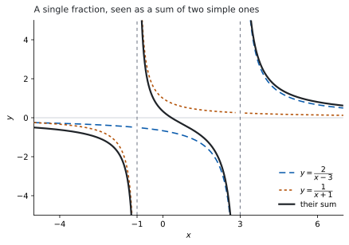

# HL 1.11 — Partial fractions（部分分数分解） {#sec-aahl-1-11}

::: {.callout-note}
## What you should be able to do
- $1$ つの分数を、$\dfrac{A}{x-p} + \dfrac{B}{x-q}$ の形に分けられる。
- 分母を因数分解してから、$A$ と $B$ を決められる。
- $A$ と $B$ を、**代入**でも**係数の比較**でも出せる。
- どんな分数なら分けられるのか（シラバスの範囲）を、自分で判定できる。
- 分けた結果を、積分や二項展開につなげられる。
:::

## The idea

### 1. Undoing an addition of fractions（足し算を、逆向きにたどる） {#idea}

$2$ つの分数を、$1$ つにまとめてみます。

$$
\frac{2}{x-3} + \frac{1}{x+1}
= \frac{2(x+1) + (x-3)}{(x-3)(x+1)}
= \frac{3x-1}{x^{2}-2x-3}
$$

**partial fractions（部分分数分解）は、この向きを逆にたどる**ことです。$\dfrac{3x-1}{x^{2}-2x-3}$ だけを見せられて、もとの $2$ つを言い当てます。

{#fig-aahl111-idea width=100%}

@fig-aahl111-idea が、その足し算の様子です。実線が $\dfrac{3x-1}{x^{2}-2x-3}$、$2$ 本の点線が $\dfrac{2}{x-3}$ と $\dfrac{1}{x+1}$ です。

**なぜ逆向きにたどりたいのでしょうか。** $\dfrac{3x-1}{x^{2}-2x-3}$ のままでは手が出ない計算が、$\dfrac{2}{x-3}$ と $\dfrac{1}{x+1}$ に分かれた瞬間にできるようになるからです（[第 7 節](#uses)）。

::: {.callout-important}
## この項目に、公式集の欄はありません
公式集に、部分分数分解の式は印刷されていません。**ただし覚える式もありません。** やることは、**分母を因数分解して、分子を決める**だけです（[第 3 節](#method)）。
:::

### 2. How far the syllabus goes（どこまでが範囲か） {#scope}

**分けられる分数には、条件があります。** シラバスは、そこをはっきり書いています。

> Maximum of two distinct linear terms in the denominator, with degree of numerator less than the degree of the denominator.

$3$ つのことを言っています。

| 条件 | 意味 | 例 |
|:--|:--|:--|
| **two** | 分母の因数は、多くても $2$ つ | $(x-3)(x+1)$ はよい。$3$ つの積は出ません |
| **distinct linear** | どちらも $1$ 次式で、しかも**別のもの** | $(x-3)^{2}$ や $x^{2}+1$ は出ません |
| **degree of numerator less** | 分子の次数が、分母の次数より低い | $\dfrac{3x-1}{x^{2}-2x-3}$ はよい。$\dfrac{x^{2}+1}{x^{2}-2x-3}$ は出ません |

: シラバスが言っている $3$ つの条件 {#tbl-aahl111-scope}

シラバスには、例も $1$ つ挙がっています。

> Example: $\dfrac{2x+1}{x^{2}+x-2} \equiv \dfrac{1}{(x-1)} + \dfrac{1}{(x+2)}$

**この $3$ つを満たしていない分数が出たら、それは範囲外です。** 手が止まったときは、まず条件を見直してください。

### 3. The method（手順） {#method}

$\dfrac{7x-1}{x^{2}-x-6}$ を分けます。

#### 手順 1：分母を因数分解する {#step1}

$$
x^{2}-x-6 = (x-3)(x+2)
$$

**因数分解できなければ、そこで終わりです。** [第 2 節](#scope) の `distinct linear` を満たしません。

#### 手順 2：分けた形を書く {#step2}

$$
\frac{7x-1}{(x-3)(x+2)} \equiv \frac{A}{x-3} + \frac{B}{x+2}
$$

**$A$ と $B$ は、これから決める数**です。分母に $x-3$ が来たら、その分子は文字 $1$ つです。

#### 手順 3：分母をはらう {#step3}

両辺に $(x-3)(x+2)$ を掛けます。左辺では約分でちょうど消えます。

$$
7x-1 \equiv A(x+2) + B(x-3)
$$ {#eq-aahl111-cleared}

**$A$ に掛かるのは $(x+2)$ で、$(x-3)$ ではありません。** $\dfrac{A}{x-3}$ の分母が消えたぶん、**残るのはもう一方**です。

#### 手順 4：$A$ と $B$ を決める {#step4}

やり方は $2$ つあります。[第 4 節](#substitution) の代入と、[第 5 節](#coefficients) の係数の比較です。どちらでも同じ答えになります。

### 4. Finding $A$ and $B$ by substitution（$A$ と $B$ の出し方：代入する） {#substitution}

@eq-aahl111-cleared は**すべての $x$ で成り立つ**ので、好きな値を入れてかまいません。**片方の文字が消える値**を選ぶのが要です。

$x = 3$ を入れると $B$ の側の $(x-3)$ が $0$ になります。

$$
7(3)-1 = A(3+2) \ \Rightarrow \ 20 = 5A \ \Rightarrow \ A = 4
$$

$x = -2$ を入れると、今度は $A$ の側が消えます。

$$
7(-2)-1 = B(-2-3) \ \Rightarrow \ -15 = -5B \ \Rightarrow \ B = 3
$$

$$
\frac{7x-1}{x^{2}-x-6} \equiv \frac{4}{x-3} + \frac{3}{x+2}
$$ {#eq-aahl111-answer}

**入れる値は、分母を $0$ にする値です。** $(x-3)$ なら $x = 3$、$(x+2)$ なら $x = -2$ です。

::: {.callout-warning}
## 分母を $0$ にする値は、もとの分数には入れられません
$x = 3$ をもとの $\dfrac{7x-1}{(x-3)(x+2)}$ に入れることはできません。分母が $0$ になるからです。

入れてよいのは、**分母をはらったあとの** @eq-aahl111-cleared です。こちらは分母がないので、$x = 3$ でも困りません。**$2$ つの式は、$x = 3$ 以外のすべてで同じ値になる**ように作ってあります。
:::

### 5. Equating coefficients（係数をくらべる） {#coefficients}

同じ @eq-aahl111-cleared を、右辺を展開してから見ます。

$$
A(x+2) + B(x-3) = (A+B)x + (2A-3B)
$$

左辺は $7x - 1$ です。**両辺が同じ式なら、$x$ の係数どうし、定数項どうしが等しい**はずです。

$$
A + B = 7, \qquad 2A - 3B = -1
$$

この連立方程式を解きます。$1$ 本目から $A = 7 - B$ として $2$ 本目に入れると

$$
2(7-B) - 3B = -1 \ \Rightarrow \ 14 - 5B = -1 \ \Rightarrow \ B = 3
$$

$A = 7 - 3 = 4$ です。@eq-aahl111-answer と一致しました。

| | 代入（[第 4 節](#substitution)） | 係数の比較 |
|:--|:--|:--|
| 速さ | **速い**。$1$ 行で $1$ 文字 | 連立方程式を解くぶん長い |
| 向いている場面 | 分母が $1$ 次式の積のとき | 分母に $2$ 次式が残るとき（AA HL の範囲外） |
| 答案の言い方 | `Substituting $x = 3$` | `Comparing coefficients of $x$` |

: $2$ つのやり方 {#tbl-aahl111-two-ways}

**この項目では、代入のほうが速いです。** ただし係数の比較は、$1$ か所まちがえると連立方程式が合わなくなるので、**気づきやすい**という利点があります。

::: {.callout-tip collapse="true"}
## Paper 2 では、電卓に連立方程式を解かせられます
係数の比較で出てきた $A + B = 7$、$2A - 3B = -1$ は、電卓の **Simultaneous Equation Solver**（連立方程式を解く機能）に入れれば解けます。

答え合わせにも使えます。分けた式ともとの式に、**分母を $0$ にしない同じ $x$ の値**を入れて、値が一致するかを見ます。

**Paper 1 では使えません。** ですから、このページの例題と演習は、すべて手で解ける数にしてあります。
:::

### 6. Identities and equations（恒等式と方程式のちがい） {#identity}

ここまで、$=$ ではなく $\equiv$ を使ってきました。

- **equation（方程式）**は、**ある $x$ でだけ**成り立つ式です。$7x - 1 = 0$ は $x = \dfrac{1}{7}$ でだけ成り立ちます。
- **identity（恒等式）**は、**すべての $x$ で**成り立つ式です。@eq-aahl111-cleared がそれです。

**$\equiv$ を使うのは、$A$ と $B$ が「すべての $x$ で成り立つように」決められているからです。** [第 4 節](#substitution) で好きな値を代入できたのは、このためです。

答案では $=$ と書いても伝わりますが、**$\equiv$ と書いてあれば「すべての $x$ で」と言えています。**

#### 検算に使う {#check}

恒等式なら、**$A$ と $B$ を決めるのに使わなかった値**を入れても成り立つはずです。@eq-aahl111-answer を $x = 0$ で見ます。

$$
\text{左辺} = \frac{-1}{-6} = \frac{1}{6}, \qquad
\text{右辺} = \frac{4}{-3} + \frac{3}{2} = -\frac{4}{3} + \frac{3}{2} = \frac{1}{6}
$$

一致しました。**$x = 3$ と $x = -2$ は、$A$ と $B$ を決めるのに使った値なので、検算になりません。** 必ず**別の値**を選んでください。

### 7. What partial fractions are for（何に使うのか） {#uses}

#### 積分 {#integration}

$\displaystyle\int \frac{7x-1}{x^{2}-x-6}\,dx$ は、このままでは手が出ません。ところが @eq-aahl111-answer に分けたあとなら、$\displaystyle\int \frac{1}{x-a}\,dx = \ln\lvert x-a \rvert + C$ の形が $2$ つ並ぶだけです（[SL 5.10](../../aa-sl/05-calculus/aasl-5-10.qmd)）。

$$
\int \frac{7x-1}{x^{2}-x-6}\,dx = 4\ln\lvert x-3 \rvert + 3\ln\lvert x+2 \rvert + C
$$

**AHL 5.15 と AHL 5.18 は、この一手を前提にしています。** シラバスも `Link to: use of partial fractions to rearrange the integrand` と書いています。

#### 二項展開 {#binomial}

$\dfrac{5}{(1-x)(1+4x)}$ を、$x$ の級数に直したいとします。このままでは [HL 1.10b](aahl-1-10b.qmd#formula) が使えませんが、分けると使えます。

$$
\frac{5}{(1-x)(1+4x)} \equiv \frac{1}{1-x} + \frac{4}{1+4x}
$$

それぞれを展開して足します。

$$
(1 + x + x^{2} + \cdots) + 4(1 - 4x + 16x^{2} - \cdots) = 5 - 15x + 65x^{2} + \cdots
$$

**使える範囲は、きびしいほうに合わせます。** $\lvert x \rvert < 1$ と $\lvert 4x \rvert < 1$ の両方が要るので、$\lvert x \rvert < \dfrac{1}{4}$ です。

## Why it works

::: {.callout-tip collapse="true"}
## クリックすると開きます

**なぜ、文字 $2$ つでいつも足りるのでしょうか。** そして、なぜシラバスは `distinct` と言っているのでしょうか。$2$ つは同じ理由でつながっています。

分母が $(x-p)(x-q)$、分子が $mx+c$ の形だとします。分母をはらうと

$$
mx + c \equiv A(x-q) + B(x-p)
$$

です。右辺を展開すると $(A+B)x - (qA + pB)$ なので、係数をくらべて

$$
A + B = m, \qquad qA + pB = -c
$$

**文字が $2$ つ、式も $2$ 本です。** 分子が $1$ 次式である以上、合わせるべき係数はいつも $2$ つ（$x$ の係数と定数項）なので、文字が $2$ つで過不足がありません。**これが `degree of numerator less than the degree of the denominator` の意味です。** 分子が $2$ 次なら合わせる係数が $3$ つになり、文字 $2$ つでは足りません。

この連立方程式が**ただ $1$ 組の解を持つ**のは、$2$ 本の式が互いに定数倍になっていないときです。$1$ 本目を $q$ 倍すると $qA + qB = qm$ で、これが $2$ 本目 $qA + pB = -c$ と同じ形になってしまうのは $p = q$ のときです。

**ですから $p \neq q$、つまり $2$ つの因数が別のものであることが要ります。** シラバスの `distinct` は、ここから来ています。

#### $(x-p)^{2}$ だとどうなるか

$p = q$ のとき、$\dfrac{A}{x-p} + \dfrac{B}{x-p} = \dfrac{A+B}{x-p}$ となり、文字が $2$ つあっても中身は $1$ つぶんです。そのため $\dfrac{1}{(x-p)^{2}}$ のような分数は、この形では書けません。**別の形（分母に $(x-p)^{2}$ を残す）が要りますが、AA HL の範囲外です**（[第 2 節](#scope)）。
:::

## Worked examples

::: {.callout-note appearance="simple"}
問題文は英語です。意味が理解できなかったら、問題文の下の「**日本語訳**」を開いてください。解説は日本語です。

**例題も演習も、すべて電卓なしで解けます。** Paper 1 のつもりで解いてください。
:::

::: {#exm-aahl111-basic}
[Express $\dfrac{5x+7}{(x+1)(x+3)}$ in partial fractions.]{.q-en}

日本語訳

$\dfrac{5x+7}{(x+1)(x+3)}$ を部分分数に分けなさい。

---

分母はもう因数分解されているので、[手順 2](#step2) から始めます。

$$
\frac{5x+7}{(x+1)(x+3)} \equiv \frac{A}{x+1} + \frac{B}{x+3}
$$

両辺に $(x+1)(x+3)$ を掛けます。

$$
5x+7 \equiv A(x+3) + B(x+1)
$$

$x = -1$ を入れると $B$ の側が消えます。

$$
5(-1)+7 = A(-1+3) \ \Rightarrow \ 2 = 2A \ \Rightarrow \ A = 1
$$

$x = -3$ を入れると $A$ の側が消えます。

$$
5(-3)+7 = B(-3+1) \ \Rightarrow \ -8 = -2B \ \Rightarrow \ B = 4
$$

$$
\frac{5x+7}{(x+1)(x+3)} \equiv \frac{1}{x+1} + \frac{4}{x+3}
$$

**検算。** **足し算に戻します。** これは問題文そのものに戻る道すじです。

$$
\frac{1}{x+1} + \frac{4}{x+3} = \frac{(x+3) + 4(x+1)}{(x+1)(x+3)} = \frac{5x+7}{(x+1)(x+3)}
$$

分子が $5x+7$ に戻りました ✓

**検算（別の値で）。** $A$ と $B$ を決めるのに使ったのは $x = -1$ と $x = -3$ です。**使っていない $x = 0$** で見ます（[第 6 節](#check)）。

$$
\text{左辺} = \frac{7}{3}, \qquad \text{右辺} = 1 + \frac{4}{3} = \frac{7}{3}
$$

一致しました ✓

**$A$ に掛かるのを $(x+1)$ としていたら**、$x = -1$ で $2 = 0$ という式になってしまいます。**おかしな式が出たら、掛ける相手を取りちがえています**（[手順 3](#step3)）。

::: {.callout-note}
## 解答例（答案用紙に書くこと）

$$\frac{5x+7}{(x+1)(x+3)} \equiv \frac{A}{x+1} + \frac{B}{x+3}$$

$$5x+7 \equiv A(x+3) + B(x+1)$$

*Substituting $x = -1$:* $\ 2 = 2A$, *so* $A = 1$

*Substituting $x = -3$:* $\ -8 = -2B$, *so* $B = 4$

$$\frac{5x+7}{(x+1)(x+3)} \equiv \frac{1}{x+1} + \frac{4}{x+3}$$
:::
:::

::: {#exm-aahl111-factorise}
**(a)** [Express $\dfrac{x+6}{x^{2}-3x-4}$ in partial fractions.]{.q-en}

**(b)** [Explain why the same method cannot be used for $\dfrac{x+6}{x^{2}-3x+4}$.]{.q-en}

日本語訳

**(a)** $\dfrac{x+6}{x^{2}-3x-4}$ を部分分数に分けなさい。

**(b)** $\dfrac{x+6}{x^{2}-3x+4}$ には同じ方法が使えない理由を説明しなさい。

---

**(a)** まず分母を因数分解します（[手順 1](#step1)）。足して $-3$、掛けて $-4$ になる $2$ 数は $-4$ と $1$ です。

$$
x^{2}-3x-4 = (x-4)(x+1)
$$

$$
x+6 \equiv A(x+1) + B(x-4)
$$

$x = 4$ で $\ 10 = 5A \ \Rightarrow \ A = 2$、$x = -1$ で $\ 5 = -5B \ \Rightarrow \ B = -1$ です。

$$
\frac{x+6}{x^{2}-3x-4} \equiv \frac{2}{x-4} - \frac{1}{x+1}
$$

**(b)** `Explain why` なので、英語で理由を書きます。

::: {.model-answer}
**試験ではこう書く**

*The method needs the denominator to be a product of two distinct linear factors. For $x^{2}-3x+4$ the discriminant is $\Delta = (-3)^{2} - 4(1)(4) = 9 - 16 = -7$, which is negative, so the quadratic has no real roots and cannot be written as a product of two real linear factors. There is therefore no pair of brackets of the form $(x-p)(x-q)$ to split the fraction over.*
:::

（この方法は、分母が相異なる $1$ 次式 $2$ つの積であることを必要とする。$x^{2}-3x+4$ の判別式は $-7$ で負なので実数解を持たず、実数の範囲では $1$ 次式の積に書けない、という意味です。）

**検算（(a) について）。** **足し算に戻します。**

$$
\frac{2}{x-4} - \frac{1}{x+1} = \frac{2(x+1) - (x-4)}{(x-4)(x+1)} = \frac{x+6}{(x-4)(x+1)}
$$

分子が $x+6$ に戻りました ✓

**検算（別の値で）。** 使っていない $x = 0$ で見ます。

$$
\text{左辺} = \frac{6}{-4} = -\frac{3}{2}, \qquad
\text{右辺} = \frac{2}{-4} - \frac{1}{1} = -\frac{1}{2} - 1 = -\frac{3}{2}
$$

一致しました ✓

**$B$ の符号を $+1$ としていたら**、$x = 0$ で右辺が $-\dfrac{1}{2} + 1 = \dfrac{1}{2}$ になり、$-\dfrac{3}{2}$ と合いません。**符号のまちがいは、別の値の代入で見つかります。**

::: {.callout-note}
## 解答例（答案用紙に書くこと）
**(a)**
$$x^{2}-3x-4 = (x-4)(x+1)$$

$$x+6 \equiv A(x+1) + B(x-4)$$

*Substituting $x = 4$:* $\ 10 = 5A$, *so* $A = 2$

*Substituting $x = -1$:* $\ 5 = -5B$, *so* $B = -1$

$$\frac{x+6}{x^{2}-3x-4} \equiv \frac{2}{x-4} - \frac{1}{x+1}$$

**(b)** *For $x^{2}-3x+4$ the discriminant is $9 - 16 = -7 < 0$, so the denominator has no real linear factors and cannot be written as $(x-p)(x-q)$.*
:::
:::

::: {#exm-aahl111-coeff}
[Use the method of equating coefficients to express $\dfrac{2x+23}{x^{2}+3x-4}$ in partial fractions. Verify your answer by substituting $x = 0$.]{.q-en}

日本語訳

係数を比較する方法を使って $\dfrac{2x+23}{x^{2}+3x-4}$ を部分分数に分けなさい。$x = 0$ を代入して答えを確かめなさい。

---

$x^{2}+3x-4 = (x-1)(x+4)$ です。

$$
2x+23 \equiv A(x+4) + B(x-1)
$$

右辺を展開して、$x$ の係数と定数項を集めます（[第 5 節](#coefficients)）。

$$
A(x+4) + B(x-1) = (A+B)x + (4A - B)
$$

$$
A + B = 2, \qquad 4A - B = 23
$$

$2$ 本を足すと $B$ が消えて $5A = 25$、$A = 5$ です。$1$ 本目から $B = 2 - 5 = -3$ です。

$$
\frac{2x+23}{x^{2}+3x-4} \equiv \frac{5}{x-1} - \frac{3}{x+4}
$$

`Verify` と言われているので、$x = 0$ を入れます。

$$
\text{左辺} = \frac{23}{-4} = -\frac{23}{4}, \qquad
\text{右辺} = \frac{5}{-1} - \frac{3}{4} = -5 - \frac{3}{4} = -\frac{23}{4}
$$

一致しました ✓

**検算。** **代入の方法でも出してみます**（[第 4 節](#substitution)）。$x = 1$ で $\ 25 = 5A \ \Rightarrow \ A = 5$、$x = -4$ で $\ 15 = -5B \ \Rightarrow \ B = -3$ です。

同じ答えになりました ✓ **連立方程式を解き直したのではなく、まったく別の道すじです。** 係数の比較で移項をまちがえていれば、ここで合わなくなります。

**検算（足し算に戻す）。**

$$
\frac{5}{x-1} - \frac{3}{x+4} = \frac{5(x+4) - 3(x-1)}{(x-1)(x+4)} = \frac{5x+20-3x+3}{(x-1)(x+4)} = \frac{2x+23}{(x-1)(x+4)}
$$

問題文の分子に戻りました ✓

**$4A - B = 23$ を $4A + B = 23$ としていたら**、$A = \dfrac{25}{5}$ ではなく $A$ と $B$ の値が入れかわった形になります。**展開したときの $B(x-1)$ の定数項は $-B$ です。**

::: {.callout-note}
## 解答例（答案用紙に書くこと）

$$x^{2}+3x-4 = (x-1)(x+4)$$

$$2x+23 \equiv A(x+4) + B(x-1) = (A+B)x + (4A-B)$$

*Comparing coefficients of $x$:* $\ A + B = 2$

*Comparing constant terms:* $\ 4A - B = 23$

*Adding:* $\ 5A = 25$, *so* $A = 5$ *and* $B = -3$

$$\frac{2x+23}{x^{2}+3x-4} \equiv \frac{5}{x-1} - \frac{3}{x+4}$$

*Check: at $x = 0$ the left side is $-\dfrac{23}{4}$ and the right side is $-5 - \dfrac{3}{4} = -\dfrac{23}{4}$.*
:::
:::

::: {#exm-aahl111-integral}
**(a)** [Express $\dfrac{10}{(x-2)(x+3)}$ in partial fractions.]{.q-en}

**(b)** [Hence find $\displaystyle\int \frac{10}{(x-2)(x+3)}\,dx$.]{.q-en}

**(c)** [Hence show that $\displaystyle\int_{3}^{4} \frac{10}{(x-2)(x+3)}\,dx = 2\ln\frac{12}{7}$.]{.q-en}

日本語訳

**(a)** $\dfrac{10}{(x-2)(x+3)}$ を部分分数に分けなさい。

**(b)** それを使って $\displaystyle\int \frac{10}{(x-2)(x+3)}\,dx$ を求めなさい。

**(c)** それを使って $\displaystyle\int_{3}^{4} \frac{10}{(x-2)(x+3)}\,dx = 2\ln\frac{12}{7}$ であることを示しなさい。

---

**(a)** 分子は定数ですが、やることは同じです。

$$
10 \equiv A(x+3) + B(x-2)
$$

$x = 2$ で $\ 10 = 5A \ \Rightarrow \ A = 2$、$x = -3$ で $\ 10 = -5B \ \Rightarrow \ B = -2$ です。

$$
\frac{10}{(x-2)(x+3)} \equiv \frac{2}{x-2} - \frac{2}{x+3}
$$

**(b)** $\displaystyle\int \frac{1}{x-a}\,dx = \ln\lvert x-a \rvert + C$ を $2$ 回使います（[SL 5.10](../../aa-sl/05-calculus/aasl-5-10.qmd)）。

$$
\int \frac{10}{(x-2)(x+3)}\,dx = 2\ln\lvert x-2 \rvert - 2\ln\lvert x+3 \rvert + C
$$

**(c)** $x$ を $3$ から $4$ まで動かすあいだ、$x-2$ も $x+3$ も正なので、絶対値は外せます。

$$
\Bigl[2\ln(x-2) - 2\ln(x+3)\Bigr]_{3}^{4}
= \bigl(2\ln 2 - 2\ln 7\bigr) - \bigl(2\ln 1 - 2\ln 6\bigr)
$$

$\ln 1 = 0$ なので

$$
= 2\ln 2 - 2\ln 7 + 2\ln 6 = 2\ln\frac{2 \times 6}{7} = 2\ln\frac{12}{7}
$$

**検算（大きさで）。** 被積分関数は $x = 3$ で $\dfrac{10}{1 \times 6} = 1.67$、$x = 4$ で $\dfrac{10}{2 \times 7} = 0.71$ です。幅 $1$ の区間なので、面積は $0.71$ と $1.67$ のあいだにあるはずです。

$2\ln\dfrac{12}{7} = 2 \times 0.539 = 1.08$ で、確かにそのあいだです ✓ **積分をまったく使わない見積もりです。**

**検算（(a) について）。** 使っていない $x = 0$ で見ます。

$$
\text{左辺} = \frac{10}{(-2)(3)} = -\frac{5}{3}, \qquad
\text{右辺} = \frac{2}{-2} - \frac{2}{3} = -1 - \frac{2}{3} = -\frac{5}{3}
$$

一致しました ✓

**$\ln$ の引き算を $\ln$ の割り算に直すところで、$\dfrac{2}{7} \times 6$ を $\dfrac{2 \times 7}{6}$ としていたら**、$\ln\dfrac{14}{6}$ になります。$\dfrac{12}{7} = 1.71$、$\dfrac{14}{6} = 2.33$ なので、値がちがいます。

::: {.callout-note}
## 解答例（答案用紙に書くこと）
**(a)**
$$10 \equiv A(x+3) + B(x-2)$$

*Substituting $x = 2$:* $\ 10 = 5A$, *so* $A = 2$

*Substituting $x = -3$:* $\ 10 = -5B$, *so* $B = -2$

$$\frac{10}{(x-2)(x+3)} \equiv \frac{2}{x-2} - \frac{2}{x+3}$$

**(b)**
$$\int \frac{10}{(x-2)(x+3)}\,dx = 2\ln\lvert x-2 \rvert - 2\ln\lvert x+3 \rvert + C$$

**(c)**
$$\Bigl[2\ln(x-2) - 2\ln(x+3)\Bigr]_{3}^{4} = (2\ln 2 - 2\ln 7) - (0 - 2\ln 6)$$

$$= 2\ln\frac{12}{7}$$
:::
:::

## Common errors

::: {.callout-warning}
## 掛ける相手を取りちがえる
$\dfrac{A}{x-3}$ の分母をはらうと、$A$ に残るのは**もう一方の** $(x+2)$ です（[手順 3](#step3)）。$A(x-3)$ と書くと、$x = 3$ を入れたときに $0 = 0$ のような式になり、$A$ が出せません。

**分けた形を書いたら、掛ける相手を矢印で結んでから**進めてください。
:::

::: {.callout-warning}
## 分母を因数分解せずに始める
$\dfrac{7x-1}{x^{2}-x-6}$ のままでは、どんな分母に分ければよいのか決まりません。**最初にすることは因数分解です**（[手順 1](#step1)）。

因数分解できなければ、そこで終わりです。$\dfrac{1}{x^{2}+1}$ は、この項目では分けられません。
:::

::: {.callout-warning}
## 分子の次数が、分母以上になっている
$\dfrac{x^{2}+1}{(x-1)(x+2)}$ は、$\dfrac{A}{x-1} + \dfrac{B}{x+2}$ の形には書けません。右辺をまとめた分子はいつも $1$ 次以下なのに、左辺の分子が $2$ 次だからです。

シラバスは `degree of numerator less than the degree of the denominator` と書いています（[第 2 節](#scope)）。**問題に出るのは、この条件を満たすものだけです。**
:::

::: {.callout-warning}
## 検算に、使った値を入れてしまう
$A$ を出すのに $x = 3$ を使ったなら、$x = 3$ での一致は**そう決めたから**であって、何も確かめていません。

**検算には、使っていない値を選んでください**（[第 6 節](#check)）。$x = 0$ は、たいていの場合いちばん計算が軽くてすみます。
:::

::: {.callout-warning}
## 展開したときの符号を落とす
$B(x-3)$ を展開すると $Bx - 3B$ です。定数項は $-3B$ であって、$3B$ ではありません。

係数を比較する方法では、**ここが $1$ か所ちがうだけで連立方程式の答えが変わります**（[第 5 節](#coefficients)）。展開を $1$ 行ぶん書いてから係数を読んでください。
:::

::: {.callout-warning}
## 分母を $0$ にする値を、もとの分数に入れる
$x = 3$ を入れてよいのは、**分母をはらったあとの式**だけです。もとの $\dfrac{7x-1}{(x-3)(x+2)}$ に入れると、分母が $0$ になります。

答案では、`Substituting $x = 3$ into` **$7x-1 \equiv A(x+2) + B(x-3)$** のように、**どちらの式に入れたか**が分かるように書いてください。
:::

## Exercises

::: {.callout-note appearance="simple"}
各問題に、折りたたみが $3$ つ付いています。**日本語訳**、**解答例**（答案用紙に書くべきこと。英語です）、**解説**（なぜそうなるか。日本語です）。

まず自分で解いて、次に解答例と見くらべてください。**解説は、合わなかったときだけ開けば十分です。**
:::

::: {.exercise-block}

[1]{.ex-no} [Express $\dfrac{5x+16}{(x+2)(x+5)}$ in partial fractions.]{.q-en}

日本語訳

$\dfrac{5x+16}{(x+2)(x+5)}$ を部分分数に分けなさい。

::: {.callout-note collapse="true"}
## 解答例（答案用紙に書くこと）

$$5x+16 \equiv A(x+5) + B(x+2)$$

*Substituting $x = -2$:* $\ 6 = 3A$, *so* $A = 2$

*Substituting $x = -5$:* $\ -9 = -3B$, *so* $B = 3$

$$\frac{5x+16}{(x+2)(x+5)} \equiv \frac{2}{x+2} + \frac{3}{x+5}$$
:::

::: {.callout-tip collapse="true"}
## 解説

分母を $0$ にする値は $x = -2$ と $x = -5$ です。

**検算。** 使っていない $x = 0$ で見ます。左辺は $\dfrac{16}{10} = \dfrac{8}{5}$、右辺は $1 + \dfrac{3}{5} = \dfrac{8}{5}$ です ✓

**足し算に戻す道すじでも確かめられます。** $2(x+5) + 3(x+2) = 2x+10+3x+6 = 5x+16$ ✓ **こちらは問題文の分子そのものに戻るので、いちばん強い検算です。**
:::

::: {.ex-sep}
:::

[2]{.ex-no} [Express $\dfrac{x-8}{x^{2}-x-2}$ in partial fractions.]{.q-en}

日本語訳

$\dfrac{x-8}{x^{2}-x-2}$ を部分分数に分けなさい。

::: {.callout-note collapse="true"}
## 解答例（答案用紙に書くこと）

$$x^{2}-x-2 = (x+1)(x-2)$$

$$x-8 \equiv A(x-2) + B(x+1)$$

*Substituting $x = -1$:* $\ -9 = -3A$, *so* $A = 3$

*Substituting $x = 2$:* $\ -6 = 3B$, *so* $B = -2$

$$\frac{x-8}{x^{2}-x-2} \equiv \frac{3}{x+1} - \frac{2}{x-2}$$
:::

::: {.callout-tip collapse="true"}
## 解説

足して $-1$、掛けて $-2$ になる $2$ 数は $1$ と $-2$ です（[手順 1](#step1)）。

**検算。** $x = 0$ で見ます。左辺は $\dfrac{-8}{-2} = 4$、右辺は $3 - (-1) = 3 + 1 = 4$ です ✓

**符号に気をつけてください。** $\dfrac{2}{x-2}$ の前が $-$ なので、$x = 0$ では $-\dfrac{2}{-2} = +1$ になります。

**$B = +2$ としていたら**、$x = 0$ で右辺が $3 - 1 = 2$ になり、$4$ と合いません。
:::

::: {.ex-sep}
:::

[3]{.ex-no} [Express $\dfrac{9x-17}{x^{2}-3x-10}$ in partial fractions.]{.q-en}

日本語訳

$\dfrac{9x-17}{x^{2}-3x-10}$ を部分分数に分けなさい。

::: {.callout-note collapse="true"}
## 解答例（答案用紙に書くこと）

$$x^{2}-3x-10 = (x-5)(x+2)$$

$$9x-17 \equiv A(x+2) + B(x-5)$$

*Substituting $x = 5$:* $\ 28 = 7A$, *so* $A = 4$

*Substituting $x = -2$:* $\ -35 = -7B$, *so* $B = 5$

$$\frac{9x-17}{x^{2}-3x-10} \equiv \frac{4}{x-5} + \frac{5}{x+2}$$
:::

::: {.callout-tip collapse="true"}
## 解説

足して $-3$、掛けて $-10$ になる $2$ 数は $-5$ と $2$ です。

**検算。** 足し算に戻します。$4(x+2) + 5(x-5) = 4x+8+5x-25 = 9x-17$ ✓ **問題文の分子に戻りました。**

**$A$ と $B$ の合計は $x$ の係数**になります。$4 + 5 = 9$ で、分子の $x$ の係数と同じです ✓ これは**係数を比較する方法の $1$ 本目**（[第 5 節](#coefficients)）なので、代入で出した答えを別の見方で確かめたことになります。

**ただし合計が合うだけでは足りません。** 定数項のほうも合う必要があります。$4 \times 2 + 5 \times (-5) = 8 - 25 = -17$ ✓
:::

::: {.ex-sep}
:::

[4]{.ex-no} [Express $\dfrac{8x+7}{2x^{2}+5x+2}$ in partial fractions.]{.q-en}

日本語訳

$\dfrac{8x+7}{2x^{2}+5x+2}$ を部分分数に分けなさい。

::: {.callout-note collapse="true"}
## 解答例（答案用紙に書くこと）

$$2x^{2}+5x+2 = (2x+1)(x+2)$$

$$8x+7 \equiv A(x+2) + B(2x+1)$$

*Substituting $x = -2$:* $\ -9 = -3B$, *so* $B = 3$

*Substituting $x = -\dfrac{1}{2}$:* $\ 3 = \dfrac{3}{2}A$, *so* $A = 2$

$$\frac{8x+7}{2x^{2}+5x+2} \equiv \frac{2}{2x+1} + \frac{3}{x+2}$$
:::

::: {.callout-tip collapse="true"}
## 解説

**$x^{2}$ の係数が $1$ でないときも、やることは同じです。** $2x^{2}+5x+2$ は $(2x+1)(x+2)$ に分かれます。

分母を $0$ にする値は $x = -\dfrac{1}{2}$ と $x = -2$ です。**分数になりますが、そのまま入れてかまいません。**

**検算。** 足し算に戻します。$2(x+2) + 3(2x+1) = 2x+4+6x+3 = 8x+7$ ✓

**検算（別の値で）。** $x = 0$ で見ます。左辺は $\dfrac{7}{2}$、右辺は $\dfrac{2}{1} + \dfrac{3}{2} = \dfrac{7}{2}$ です ✓

**$\dfrac{A}{2x+1}$ を $\dfrac{A}{x+\frac{1}{2}}$ と書き直していたら**、$A$ の値が変わります。**答えは、分母を問題文と同じ形にそろえて書いてください。**
:::

::: {.ex-sep}
:::

[5]{.ex-no} [It is given that $\dfrac{5x+11}{(x-1)(x+3)} \equiv \dfrac{A}{x-1} + \dfrac{B}{x+3}$.]{.q-en}

**(a)** [Find the value of $A$ and the value of $B$.]{.q-en}

**(b)** [Explain why substituting $x = 0$ into the identity provides a check on your answer, but substituting $x = 1$ does not.]{.q-en}

日本語訳

$\dfrac{5x+11}{(x-1)(x+3)} \equiv \dfrac{A}{x-1} + \dfrac{B}{x+3}$ であるとします。

**(a)** $A$ と $B$ の値を求めなさい。

**(b)** この恒等式に $x = 0$ を代入することが答えの確認になり、$x = 1$ を代入することは確認にならない理由を説明しなさい。

::: {.callout-note collapse="true"}
## 解答例（答案用紙に書くこと）

**(a)**
$$5x+11 \equiv A(x+3) + B(x-1)$$

*Substituting $x = 1$:* $\ 16 = 4A$, *so* $A = 4$

*Substituting $x = -3$:* $\ -4 = -4B$, *so* $B = 1$

**(b)** *The values $x = 1$ and $x = -3$ were the ones used to find $A$ and $B$, so the identity is bound to hold there whatever arithmetic was done afterwards. The value $x = 0$ was not used, so agreement there is new information.*
:::

::: {.callout-tip collapse="true"}
## 解説

**(a)** $x = 1$ と $x = -3$ を入れます。$5(1)+11 = 16 = 4A$、$5(-3)+11 = -4 = -4B$ です。

**(b)** `Explain why` なので、英語で理由を書きます。

**検算。** $x = 0$ で見ます。左辺は $\dfrac{11}{-3}$、右辺は $\dfrac{4}{-1} + \dfrac{1}{3} = -4 + \dfrac{1}{3} = -\dfrac{11}{3}$ です ✓

**足し算に戻す道すじでも確かめられます。** $4(x+3) + (x-1) = 4x+12+x-1 = 5x+11$ ✓

::: {.model-answer}
**試験ではこう書く**

*To find $A$ I substituted $x = 1$, and to find $B$ I substituted $x = -3$. At those two values the identity is satisfied by construction, so re-checking them tests nothing: any arithmetic slip made after that point would still leave them satisfied. The value $x = 0$ was not used anywhere in the working, so it is an independent test: if $A$ or $B$ were wrong, the two sides would disagree there.*
:::
:::

::: {.ex-sep}
:::

[6]{.ex-no} [Use the method of equating coefficients to express $\dfrac{x-9}{x^{2}-9}$ in partial fractions.]{.q-en}

日本語訳

係数を比較する方法を使って $\dfrac{x-9}{x^{2}-9}$ を部分分数に分けなさい。

::: {.callout-note collapse="true"}
## 解答例（答案用紙に書くこと）

$$x^{2}-9 = (x-3)(x+3)$$

$$x-9 \equiv A(x+3) + B(x-3) = (A+B)x + (3A-3B)$$

*Comparing coefficients of $x$:* $\ A + B = 1$

*Comparing constant terms:* $\ 3A - 3B = -9$, *so* $A - B = -3$

*Hence* $A = -1$ *and* $B = 2$

$$\frac{x-9}{x^{2}-9} \equiv \frac{2}{x+3} - \frac{1}{x-3}$$
:::

::: {.callout-tip collapse="true"}
## 解説

$x^{2}-9$ は difference of two squares なので $(x-3)(x+3)$ です。

$A+B = 1$ と $A-B = -3$ を足すと $2A = -2$、$A = -1$ です。

**検算。** **代入の方法でも出します**（[第 4 節](#substitution)）。$x = 3$ で $\ -6 = 6A \ \Rightarrow \ A = -1$、$x = -3$ で $\ -12 = -6B \ \Rightarrow \ B = 2$ です ✓ **連立方程式をまったく使わない道すじです。**

**$A$ が負になることもあります。** 符号がおかしいと感じても、そこで止めずに検算まで進めてください。

**$3A-3B$ を $3A+3B$ としていたら**、$A + B$ と同じ式になってしまい、$A$ と $B$ が決まりません。**式が $2$ 本とも同じ形になったら、展開の符号を疑ってください。**
:::

::: {.ex-sep}
:::

[7]{.ex-no} [The function $f$ is given by $f(x) = \dfrac{6}{(1-x)(1+2x)}$.]{.q-en}

**(a)** [Express $f(x)$ in partial fractions.]{.q-en}

**(b)** [Hence find the first three terms, in ascending powers of $x$, of the expansion of $f(x)$.]{.q-en}

**(c)** [State the values of $x$ for which the expansion is valid.]{.q-en}

日本語訳

関数 $f$ が $f(x) = \dfrac{6}{(1-x)(1+2x)}$ で与えられています。

**(a)** $f(x)$ を部分分数に分けなさい。

**(b)** それを使って、$f(x)$ の展開を $x$ の次数の低いほうから $3$ 項求めなさい。

**(c)** その展開が使える $x$ の値の範囲を述べなさい。

::: {.callout-note collapse="true"}
## 解答例（答案用紙に書くこと）

**(a)**
$$6 \equiv A(1+2x) + B(1-x)$$

*Substituting $x = 1$:* $\ 6 = 3A$, *so* $A = 2$

*Substituting $x = -\dfrac{1}{2}$:* $\ 6 = \dfrac{3}{2}B$, *so* $B = 4$

$$f(x) \equiv \frac{2}{1-x} + \frac{4}{1+2x}$$

**(b)**
$$2(1 + x + x^{2} + \cdots) + 4(1 - 2x + 4x^{2} - \cdots) = 6 - 6x + 18x^{2} + \cdots$$

**(c)** *Valid for $\lvert x \rvert < 1$ and $\lvert 2x \rvert < 1$, so $\lvert x \rvert < \dfrac{1}{2}$.*
:::

::: {.callout-tip collapse="true"}
## 解説

**(a)** 分母を $0$ にするのは $x = 1$ と $x = -\dfrac{1}{2}$ です。

**(b)** $(1-x)^{-1}$ と $(1+2x)^{-1}$ を、それぞれ [HL 1.10b](aahl-1-10b.qmd#formula) で展開して足します。$2 + 4 = 6$、$2 - 8 = -6$、$2 + 16 = 18$ です。

**(c)** **きびしいほうに合わせます。** $\lvert x \rvert < 1$ と $\lvert x \rvert < \dfrac{1}{2}$ の両方が要るので、答えは $\lvert x \rvert < \dfrac{1}{2}$ です。

**検算。** **部分分数を使わずに出します。** 分母を展開すると $(1-x)(1+2x) = 1 + x - 2x^{2}$ なので

$$
f(x) = 6\bigl(1 + (x - 2x^{2})\bigr)^{-1} = 6\left(1 - (x-2x^{2}) + (x-2x^{2})^{2} - \cdots\right)
$$

$x^{2}$ までを拾うと $6(1 - x + 2x^{2} + x^{2}) = 6 - 6x + 18x^{2}$ ✓ **分けずに出しても同じ答えになりました。**

**$x = 0$ でも見ます。** $f(0) = \dfrac{6}{1 \times 1} = 6$ で、展開の定数項も $6$ です ✓
:::

::: {.ex-sep}
:::

[8]{.ex-no} [Explain why $\dfrac{x^{2}+1}{(x-1)(x+2)}$ cannot be written in the form $\dfrac{A}{x-1} + \dfrac{B}{x+2}$, where $A$ and $B$ are constants.]{.q-en}

日本語訳

$\dfrac{x^{2}+1}{(x-1)(x+2)}$ が、定数 $A$、$B$ を使って $\dfrac{A}{x-1} + \dfrac{B}{x+2}$ の形には書けない理由を説明しなさい。

::: {.callout-note collapse="true"}
## 解答例（答案用紙に書くこと）

*Combining the right-hand side over a common denominator gives $\dfrac{A(x+2) + B(x-1)}{(x-1)(x+2)}$, whose numerator $(A+B)x + (2A-B)$ is of degree at most $1$ for any constants $A$ and $B$. The numerator on the left is $x^{2}+1$, which is of degree $2$, so no constants $A$ and $B$ can make the two numerators equal.*
:::

::: {.callout-tip collapse="true"}
## 解説

`Explain why` なので、英語で理由を書きます。**分母をそろえて、分子どうしをくらべる**のがいちばん短い道すじです。

$A$ と $B$ がどんな定数でも、$(A+B)x + (2A-B)$ は $1$ 次以下です。$x^{2}$ の項を作る方法がありません。

**検算。** $x^{2}$ の係数だけを見ます。左辺の分子では $1$、右辺の分子では $0$ です。**この $1$ か所だけで、成り立たないことが言えます** ✓

**これはシラバスの条件そのものです**（[第 2 節](#scope)）。`degree of numerator less than the degree of the denominator` を満たしていません。

**「$A$ と $B$ を $x$ の式にすればよい」とは考えないでください。** 問題文が `where $A$ and $B$ are constants` と言っています。

::: {.model-answer}
**試験ではこう書く**

*Writing the right-hand side over the common denominator $(x-1)(x+2)$ gives the numerator $A(x+2) + B(x-1) = (A+B)x + (2A-B)$. For constants $A$ and $B$ this is a polynomial of degree at most $1$, whereas the numerator on the left-hand side is $x^{2}+1$, of degree $2$. Comparing the coefficients of $x^{2}$ gives $1 = 0$, which is impossible, so no such constants exist.*
:::
:::

::: {.ex-sep}
:::

[9]{.ex-no} **(a)** [Express $\dfrac{9x+12}{x^{2}+2x-8}$ in partial fractions.]{.q-en}

**(b)** [Hence find $\displaystyle\int \frac{9x+12}{x^{2}+2x-8}\,dx$.]{.q-en}

日本語訳

**(a)** $\dfrac{9x+12}{x^{2}+2x-8}$ を部分分数に分けなさい。

**(b)** それを使って $\displaystyle\int \frac{9x+12}{x^{2}+2x-8}\,dx$ を求めなさい。

::: {.callout-note collapse="true"}
## 解答例（答案用紙に書くこと）

**(a)**
$$x^{2}+2x-8 = (x+4)(x-2)$$

$$9x+12 \equiv A(x-2) + B(x+4)$$

*Substituting $x = -4$:* $\ -24 = -6A$, *so* $A = 4$

*Substituting $x = 2$:* $\ 30 = 6B$, *so* $B = 5$

$$\frac{9x+12}{x^{2}+2x-8} \equiv \frac{4}{x+4} + \frac{5}{x-2}$$

**(b)**
$$\int \frac{9x+12}{x^{2}+2x-8}\,dx = 4\ln\lvert x+4 \rvert + 5\ln\lvert x-2 \rvert + C$$
:::

::: {.callout-tip collapse="true"}
## 解説

**(a)** 足して $2$、掛けて $-8$ になる $2$ 数は $4$ と $-2$ です。

**(b)** $\displaystyle\int \frac{1}{x-a}\,dx = \ln\lvert x-a \rvert + C$ を $2$ 回使います（[第 7 節](#integration)）。**絶対値を忘れないでください。**

**検算（(a) について）。** 足し算に戻します。$4(x-2) + 5(x+4) = 4x-8+5x+20 = 9x+12$ ✓

**検算（(b) について）。** **微分して、もとの被積分関数に戻るかを見ます。**

$$
\frac{d}{dx}\Bigl(4\ln\lvert x+4 \rvert + 5\ln\lvert x-2 \rvert\Bigr) = \frac{4}{x+4} + \frac{5}{x-2}
$$

**(a)** の答えに戻りました ✓ **積分をやり直したのではなく、逆向きの操作です。**

**$C$ を書き忘れると、不定積分として不足します。**
:::

::: {.ex-sep}
:::

[10]{.ex-no} [A student is asked to express $\dfrac{7x+1}{(x+1)(x-2)}$ in partial fractions, and writes the following.]{.q-en}

$$
\frac{7x+1}{(x+1)(x-2)} \equiv \frac{A}{x+1} + \frac{B}{x-2}, \qquad 7x+1 \equiv A(x+1) + B(x-2)
$$

[Identify the error in the student's work, and find the correct values of $A$ and $B$.]{.q-en}

日本語訳

ある生徒が $\dfrac{7x+1}{(x+1)(x-2)}$ を部分分数に分けるように言われ、上のように書きました。

生徒の誤りを指摘し、$A$ と $B$ の正しい値を求めなさい。

::: {.callout-note collapse="true"}
## 解答例（答案用紙に書くこと）

*The student has multiplied $A$ by $(x+1)$ and $B$ by $(x-2)$, but these are the factors that cancel. The correct identity is*

$$7x+1 \equiv A(x-2) + B(x+1)$$

*Substituting $x = -1$:* $\ -6 = -3A$, *so* $A = 2$

*Substituting $x = 2$:* $\ 15 = 3B$, *so* $B = 5$

$$\frac{7x+1}{(x+1)(x-2)} \equiv \frac{2}{x+1} + \frac{5}{x-2}$$
:::

::: {.callout-tip collapse="true"}
## 解説

`Identify the error` なので、**どこが違うのかを名指し**してから、正しい答えを書きます。

$\dfrac{A}{x+1}$ に $(x+1)(x-2)$ を掛けると、$(x+1)$ が約分で消えて $A(x-2)$ が残ります（[手順 3](#step3)）。生徒は**消えるほうを掛けています。**

**生徒の式のままだと、$x = -1$ で $-6 = 0$ になります。** 成り立たない式が出た時点で、掛ける相手がちがうと気づけます。

**検算。** 足し算に戻します。$2(x-2) + 5(x+1) = 2x-4+5x+5 = 7x+1$ ✓

**検算（別の値で）。** $x = 0$ で見ます。左辺は $\dfrac{1}{(1)(-2)} = -\dfrac{1}{2}$、右辺は $2 - \dfrac{5}{2} = -\dfrac{1}{2}$ です ✓

::: {.model-answer}
**試験ではこう書く**

*Multiplying $\dfrac{A}{x+1}$ by $(x+1)(x-2)$ cancels the factor $(x+1)$ and leaves $A(x-2)$, not $A(x+1)$; similarly $B$ must be multiplied by $(x+1)$. The student has used the factors that cancel. The correct identity is $7x+1 \equiv A(x-2) + B(x+1)$, which gives $A = 2$ and $B = 5$.*
:::
:::

:::
