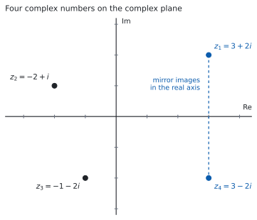
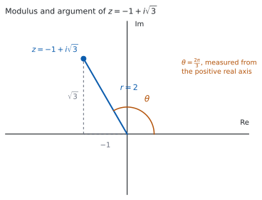

# HL 1.12 — Complex numbers in Cartesian form（複素数：$a+bi$ の形） {#sec-aahl-1-12}

::: {.callout-note}
## What you should be able to do
- $i^{2} = -1$ を使って、$i$ の累乗を整理できる。
- 複素数の real part（実部）と imaginary part（虚部）を言える。
- $a+bi$ の形どうしを、足す・引く・かけることができる。
- conjugate（共役複素数）を使って、割り算を $a+bi$ の形に直せる。
- 複素数を complex plane（複素平面）に置ける。
- modulus（絶対値）と argument（偏角）を求められる。
:::

## The idea

### 1. The number $i$（$i$ という数） {#i}

$x^{2} + 1 = 0$ という方程式には、**実数の解がありません。** $x^{2} \geq 0$ なので、$x^{2} = -1$ になる実数はないからです（[SL 2.7](../../aa-sl/02-functions/aasl-2-7.qmd)）。

そこで、**$2$ 乗すると $-1$ になる数を $1$ つ用意します。**

$$
i^{2} = -1
$$ {#eq-aahl112-i}

これが **imaginary unit（虚数単位）**です。名前は `imaginary` ですが、**「存在しない数」という意味ではありません。** 実数の直線の上にない、というだけのことです（[第 3 節](#plane)）。

#### $i$ の累乗は、$4$ つで一回りします {#powers}

@eq-aahl112-i から順に掛けていきます。

$$
i^{1} = i, \qquad i^{2} = -1, \qquad i^{3} = i^{2} \times i = -i, \qquad i^{4} = i^{2} \times i^{2} = 1
$$

$i^{4} = 1$ なので、ここから先は同じ $4$ つがくり返されます。**指数を $4$ で割った余りを見れば、どれかが決まります。**

$15 = 4 \times 3 + 3$ なので

$$
i^{15} = \left(i^{4}\right)^{3} \times i^{3} = 1 \times (-i) = -i
$$

### 2. Cartesian form（$a+bi$ の形） {#cartesian}

実数 $a$、$b$ を使って $a + bi$ と書いた数を、**complex number（複素数）**といいます。

$$
z = a + bi
$$ {#eq-aahl112-cartesian}

::: {.callout-important}
## この書き方は公式集にあります
公式集の **1.12** の欄に、次の $1$ 行だけが印刷されています。

> Complex numbers $\quad z = a + bi$

**覚える式はここにはありません。** この項目で覚えるのは、$i^{2} = -1$ と、[第 5 節](#conjugate) の共役の使い方です。
:::

$a$ を **real part（実部）**、$b$ を **imaginary part（虚部）**といい、$\operatorname{Re}(z)$、$\operatorname{Im}(z)$ と書きます。

$z = 3 + 2i$ なら $\operatorname{Re}(z) = 3$、$\operatorname{Im}(z) = 2$ です。

::: {.callout-warning}
## 虚部は $2i$ ではなく $2$ です
$\operatorname{Im}(z)$ は**実数**です。$i$ は付けません。

$z = 3 + 2i$ の虚部は $2$ です。$2i$ と答えると、$\operatorname{Im}(z)$ の定義と合いません。
:::

**$2$ つの複素数が等しいのは、実部どうしと虚部どうしが両方等しいときだけです。**

$$
a + bi = c + di \iff a = c \ \text{かつ} \ b = d
$$ {#eq-aahl112-equal}

これは見た目より強い決まりです。**$1$ つの等式から、実数の式が $2$ 本取り出せます**（例題 $1$ のような問題は、これを使います）。

### 3. The complex plane（複素平面） {#plane}

実数は数直線の上に並びますが、複素数は $a$ と $b$ の $2$ つで決まるので、**平面の上の点**として表せます。

{#fig-aahl112-idea-a width=100%}

横軸に実部、縦軸に虚部をとります。横軸を **real axis（実軸）**、縦軸を **imaginary axis（虚軸）**といいます。$z = a+bi$ は、点 $(a,\ b)$ に置きます（@fig-aahl112-idea-a）。

シラバスには、呼び名がもう $1$ つ書かれています。

> The complex plane is also known as the Argand diagram.

**`complex plane` と `Argand diagram` は、同じものです。** 問題文にはどちらも出ます。

### 4. Adding, subtracting and multiplying（足す・引く・かける） {#arithmetic}

**$i$ を文字だと思って、そのまま計算します。** 最後に $i^{2}$ が出てきたら $-1$ に直すだけです。

$z_1 = 3+2i$、$z_2 = -2+i$ で見ます。足し算は、実部どうし・虚部どうしです。

$$
z_1 + z_2 = (3-2) + (2+1)i = 1 + 3i
$$

掛け算は、かっこを展開します。

$$
z_1 z_2 = (3+2i)(-2+i) = -6 + 3i - 4i + 2i^{2}
$$

$2i^{2} = -2$ なので

$$
z_1 z_2 = -6 - i - 2 = -8 - i
$$

**$2i^{2}$ を $2$ のままにするのが、いちばん多い誤りです。** 展開したら $i^{2}$ を探してください。

### 5. The conjugate（共役複素数） {#conjugate}

$z = a+bi$ に対して、**虚部の符号だけを変えた数**を conjugate（共役複素数）といいます。

$$
z^{*} = a - bi
$$ {#eq-aahl112-conj}

**この本では $z^{*}$ と書きます。** $\overline{z}$ と書く本もありますが、同じものです。

@fig-aahl112-idea-a の $z_1 = 3+2i$ と $z_4 = 3-2i$ が、その組です。**実軸について対称な位置**にあります。

共役がありがたいのは、次の $2$ つが**実数になる**からです。

$$
z + z^{*} = 2a, \qquad z z^{*} = a^{2} + b^{2}
$$ {#eq-aahl112-real}

$z z^{*}$ のほうを確かめます。

$$
(a+bi)(a-bi) = a^{2} - abi + abi - b^{2}i^{2} = a^{2} + b^{2}
$$

**$i$ の項が打ち消し合い、$-b^{2}i^{2}$ が $+b^{2}$ になります。** $z = 3+2i$ なら $z z^{*} = 9 + 4 = 13$、$z + z^{*} = 6$ です。

### 6. Division: making the denominator real（割り算：分母を実数にする） {#division}

$\dfrac{4+7i}{3+2i}$ を $a+bi$ の形にします。**分母の共役を、分母と分子の両方に掛けます。**

$$
\frac{4+7i}{3+2i} = \frac{(4+7i)(3-2i)}{(3+2i)(3-2i)}
$$

分母は @eq-aahl112-real から $3^{2} + 2^{2} = 13$ です。分子は

$$
(4+7i)(3-2i) = 12 - 8i + 21i - 14i^{2} = 12 + 13i + 14 = 26 + 13i
$$

$$
\frac{26 + 13i}{13} = 2 + i
$$

**分母を実数にしてから、実部と虚部に分けます。** 分数のまま答えてもかまいませんが、$a + bi$ の形に直すところまでが答えです。

::: {.callout-tip collapse="true"}
## Paper 2 では、電卓で答え合わせができます
TI-Nspire CX II は、複素数をそのまま計算できます。$a+bi$ の形で入れれば、和・差・積・商が $a+bi$ の形で返ってきます。

手で出した答えを入れ直して見くらべれば、符号の落としが見つかります。

**Paper 1 では使えません。** ですから、このページの例題と演習は、すべて手で出せる数にしてあります。
:::

### 7. Modulus and argument（絶対値と偏角） {#modulus-argument}

複素平面の上の点として見ると、$2$ つの量が読めます。

{#fig-aahl112-idea-b width=100%}

**modulus（絶対値）**は、原点から $z$ までの距離です。

$$
\lvert z \rvert = \sqrt{a^{2}+b^{2}}
$$ {#eq-aahl112-mod}

三平方の定理そのものです。$\lvert 3+2i \rvert = \sqrt{9+4} = \sqrt{13}$ です。@eq-aahl112-real とくらべると $\lvert z \rvert^{2} = z z^{*}$ が読めます。

**argument（偏角）**は、**正の実軸から測った角**です（@fig-aahl112-idea-b）。$\arg z$ と書きます。

::: {.callout-important}
## $\arg z$ は、$\arctan\dfrac{b}{a}$ とはかぎりません
$\arctan$ が返す角は $-\dfrac{\pi}{2}$ と $\dfrac{\pi}{2}$ のあいだだけなので、**第 $2$ 象限と第 $3$ 象限の $z$ では、そのままでは合いません。**

$z = -1 + i\sqrt{3}$ で見ます。$\arctan\dfrac{\sqrt{3}}{-1} = -\dfrac{\pi}{3}$ ですが、この角は第 $4$ 象限を指しています。$z$ は第 $2$ 象限にあるので、正しい偏角は

$$
\theta = \pi - \frac{\pi}{3} = \frac{2\pi}{3}
$$

です。**必ず図をかいて、どの象限かを見てから決めてください。**
:::

$\lvert z \rvert = \sqrt{1+3} = 2$ なので、この $z$ は $r = 2$、$\theta = \dfrac{2\pi}{3}$ です。

#### 偏角の範囲 {#range}

$\theta$ に $2\pi$ を足しても、同じ点を指します。ですから偏角は $1$ つに決まりません。**この本では**

$$
-\pi < \theta \leq \pi
$$

の範囲で答えます（**principal argument**、主値）。問題文が範囲を指定していたら、そちらに従ってください。

**角は radian で書きます。** 度で答えると、[HL 1.13](aahl-1-13.qmd) の Euler 形で使えなくなります。

## Why it works

::: {.callout-tip collapse="true"}
## クリックすると開きます

**なぜ、割り算をしても $a+bi$ の形から出ないのでしょうか。**

足し算・引き算・掛け算は、見ればわかります。$i^{2}$ が出ても $-1$ に変わるだけなので、$i$ の $1$ 乗より高い項は残りません。結果はいつも $a+bi$ の形です。

割り算だけが心配です。$\dfrac{1}{3+2i}$ のような数が、$a+bi$ で書けるとはかぎらないように見えます。

**ここで効くのが、共役です。** $z = a+bi$ が $0$ でなければ、@eq-aahl112-real より

$$
z z^{*} = a^{2}+b^{2}
$$

で、これは**正の実数**です。$a$ と $b$ が両方 $0$ のときだけ $0$ になりますが、それは $z = 0$ のときです。

そこで

$$
\frac{1}{z} = \frac{z^{*}}{z z^{*}} = \frac{a-bi}{a^{2}+b^{2}} = \frac{a}{a^{2}+b^{2}} + \frac{-b}{a^{2}+b^{2}}\,i
$$

と書けます。**割っているのは実数なので、実部と虚部がそれぞれ実数のまま残ります。**

#### だから、新しい数を足す必要がありません

$x^{2}+1 = 0$ を解くために $i$ を $1$ つ足しました。そのあと四則をどれだけ重ねても、**出てくるのは $a+bi$ の形だけ**です。新しい記号を次々に足す必要はありません。

**$\sqrt{i}$ のようなものも、$a+bi$ で書けます。** その求め方は [HL 1.14](aahl-1-14.qmd) で扱います。
:::

## Worked examples

::: {.callout-note appearance="simple"}
問題文は英語です。意味が理解できなかったら、問題文の下の「**日本語訳**」を開いてください。解説は日本語です。

**例題も演習も、すべて電卓なしで解けます。** Paper 1 のつもりで解いてください。
:::

::: {#exm-aahl112-arith}
[Let $z_{1} = 4+3i$ and $z_{2} = 1-2i$.]{.q-en}

**(a)** [Find $z_{1}+z_{2}$.]{.q-en}

**(b)** [Find $z_{1}z_{2}$.]{.q-en}

**(c)** [Find $\dfrac{z_{1}}{z_{2}}$, giving your answer in the form $a+bi$ where $a,b \in \mathbb{R}$.]{.q-en}

日本語訳

$z_{1} = 4+3i$、$z_{2} = 1-2i$ とします。

**(a)** $z_{1}+z_{2}$ を求めなさい。

**(b)** $z_{1}z_{2}$ を求めなさい。

**(c)** $\dfrac{z_{1}}{z_{2}}$ を、$a$、$b$ を実数として $a+bi$ の形で求めなさい。

---

**(a)** 実部どうし、虚部どうしを足します。

$$
(4+1) + (3-2)i = 5 + i
$$

**(b)** 展開してから $i^{2} = -1$ に直します。

$$
(4+3i)(1-2i) = 4 - 8i + 3i - 6i^{2} = 4 - 5i + 6 = 10 - 5i
$$

**(c)** 分母の共役 $1+2i$ を、上下に掛けます（[第 6 節](#division)）。分母は $1^{2}+2^{2} = 5$ です。

$$
\frac{(4+3i)(1+2i)}{5} = \frac{4 + 8i + 3i + 6i^{2}}{5} = \frac{-2 + 11i}{5} = -\frac{2}{5} + \frac{11}{5}i
$$

**検算（(b) について）。** **割り算のほうから戻します。** $z_1 z_2 = 10-5i$ が正しいなら、$\dfrac{10-5i}{z_2}$ は $z_1$ に戻るはずです。

$$
\frac{(10-5i)(1+2i)}{5} = \frac{10 + 20i - 5i + 10}{5} = \frac{20 + 15i}{5} = 4+3i
$$

$z_1$ に戻りました ✓ **掛け算をやり直したのではなく、逆向きの操作です。**

**検算（(c) について）。** 答えに $z_2$ を掛けて、$z_1$ に戻るかを見ます。

$$
\left(\frac{-2+11i}{5}\right)(1-2i) = \frac{-2 + 4i + 11i + 22}{5} = \frac{20 + 15i}{5} = 4+3i
$$

戻りました ✓

**$6i^{2}$ を $+6$ ではなく $-6$ としていたら**、**(b)** は $-2-5i$ になります。$z_2$ で割り戻すと $z_1$ に戻りません。**$i^{2} = -1$ を掛けるので、符号は $1$ 回だけ変わります。**

::: {.callout-note}
## 解答例（答案用紙に書くこと）
**(a)**
$$z_{1}+z_{2} = 5+i$$

**(b)**
$$z_{1}z_{2} = 4 - 8i + 3i - 6i^{2} = 10 - 5i$$

**(c)**
$$\frac{z_{1}}{z_{2}} = \frac{(4+3i)(1+2i)}{(1-2i)(1+2i)} = \frac{-2+11i}{5} = -\frac{2}{5} + \frac{11}{5}i$$
:::
:::

::: {#exm-aahl112-quadratic}
**(a)** [Solve the equation $z^{2}-4z+13 = 0$, giving your answers in the form $a+bi$.]{.q-en}

**(b)** [Explain why the two solutions are conjugates of each other.]{.q-en}

日本語訳

**(a)** 方程式 $z^{2}-4z+13 = 0$ を解き、答えを $a+bi$ の形で書きなさい。

**(b)** $2$ つの解が互いに共役である理由を説明しなさい。

---

**(a)** 解の公式を使います（[SL 2.7](../../aa-sl/02-functions/aasl-2-7.qmd)）。

$$
z = \frac{4 \pm \sqrt{16-52}}{2} = \frac{4 \pm \sqrt{-36}}{2}
$$

$\sqrt{-36} = \sqrt{36}\sqrt{-1} = 6i$ です。

$$
z = \frac{4 \pm 6i}{2} = 2 \pm 3i
$$

**判別式が負のとき、実数解はありませんが、複素数の解は $2$ つあります。**

**(b)** `Explain why` なので、英語で理由を書きます。

::: {.model-answer}
**試験ではこう書く**

*The quadratic formula gives the two solutions as $\dfrac{-b + \sqrt{\Delta}}{2a}$ and $\dfrac{-b - \sqrt{\Delta}}{2a}$. Here $a$, $b$ and $\Delta$ are real and $\Delta < 0$, so $\sqrt{\Delta}$ is a purely imaginary number. The two solutions therefore have the same real part $\dfrac{-b}{2a}$ and imaginary parts that differ only in sign, which is exactly what it means to be conjugates.*
:::

（解の公式が与える $2$ つの解は、実部が同じ $\dfrac{-b}{2a}$ で、判別式が負なので $\sqrt{\Delta}$ は純虚数になる。したがって虚部は符号だけがちがい、これが共役であるということである、という意味です。）

**検算。** **解を、もとの方程式に入れ直します。** $z = 2+3i$ で

$$
(2+3i)^{2} = 4 + 12i + 9i^{2} = -5 + 12i
$$

$$
(-5+12i) - 4(2+3i) + 13 = -5 + 12i - 8 - 12i + 13 = 0
$$

$0$ になりました ✓ **解の公式をやり直したのではなく、方程式そのものに戻しています。**

**検算（和と積で）。** $2$ 次方程式 $z^{2}-4z+13=0$ の解の和は $4$、積は $13$ のはずです。

$$
(2+3i)+(2-3i) = 4, \qquad (2+3i)(2-3i) = 4+9 = 13
$$

どちらも合いました ✓ **積の計算には @eq-aahl112-real が使えます。**

**$\sqrt{-36}$ を $-6$ としていたら**、解は実数になってしまいます。もとの式に入れると $0$ になりません。

::: {.callout-note}
## 解答例（答案用紙に書くこと）
**(a)**
$$z = \frac{4 \pm \sqrt{16-52}}{2} = \frac{4 \pm \sqrt{-36}}{2} = \frac{4 \pm 6i}{2} = 2 \pm 3i$$

**(b)** *In the quadratic formula the discriminant is negative, so $\sqrt{\Delta}$ is purely imaginary. The two solutions share the real part $\dfrac{-b}{2a}$ and their imaginary parts differ only in sign, so they are conjugates.*
:::
:::

::: {#exm-aahl112-modulus}
[Let $z = 5-12i$.]{.q-en}

**(a)** [Find $\lvert z \rvert$.]{.q-en}

**(b)** [Find $zz^{*}$.]{.q-en}

**(c)** [Find $\dfrac{1}{z}$, giving your answer in the form $a+bi$.]{.q-en}

日本語訳

$z = 5-12i$ とします。

**(a)** $\lvert z \rvert$ を求めなさい。

**(b)** $zz^{*}$ を求めなさい。

**(c)** $\dfrac{1}{z}$ を $a+bi$ の形で求めなさい。

---

**(a)** @eq-aahl112-mod を使います。

$$
\lvert z \rvert = \sqrt{5^{2}+(-12)^{2}} = \sqrt{25+144} = \sqrt{169} = 13
$$

**(b)** @eq-aahl112-real より $z z^{*} = 5^{2}+(-12)^{2} = 169$ です。

**(c)** 分母の共役 $5+12i$ を上下に掛けます。分母は **(b)** で出した $169$ です。

$$
\frac{1}{5-12i} = \frac{5+12i}{169} = \frac{5}{169} + \frac{12}{169}i
$$

**検算（(a) と (b) の関係）。** $\lvert z \rvert^{2} = 13^{2} = 169$ で、**(b)** と一致しました ✓ **$2$ つを別々に出したので、どちらかがまちがっていれば合いません。**

**検算（(c) について）。** $z$ を掛けて $1$ に戻るかを見ます。

$$
\frac{5+12i}{169}(5-12i) = \frac{25 + 144}{169} = \frac{169}{169} = 1
$$

$1$ に戻りました ✓

**虚部の符号に気をつけてください。** $z = 5-12i$ の共役は $5+12i$ です。$z$ の虚部が負なので、共役の虚部は正になります。

**$\lvert z \rvert$ を $5-12 = -7$ としていたら**、絶対値が負になってしまいます。**$\lvert z \rvert$ は距離なので、$0$ 以上です。**

::: {.callout-note}
## 解答例（答案用紙に書くこと）
**(a)**
$$\lvert z \rvert = \sqrt{25+144} = 13$$

**(b)**
$$zz^{*} = (5-12i)(5+12i) = 25+144 = 169$$

**(c)**
$$\frac{1}{z} = \frac{5+12i}{(5-12i)(5+12i)} = \frac{5+12i}{169} = \frac{5}{169} + \frac{12}{169}i$$
:::
:::

::: {#exm-aahl112-argument}
[Let $z = -2+2i$.]{.q-en}

**(a)** [Find $\lvert z \rvert$.]{.q-en}

**(b)** [Find $\arg z$, giving your answer in radians with $-\pi < \arg z \leq \pi$.]{.q-en}

**(c)** [Explain why $\arg z$ is not equal to $\arctan(-1)$.]{.q-en}

日本語訳

$z = -2+2i$ とします。

**(a)** $\lvert z \rvert$ を求めなさい。

**(b)** $\arg z$ を、$-\pi < \arg z \leq \pi$ の範囲の radian で求めなさい。

**(c)** $\arg z$ が $\arctan(-1)$ と等しくない理由を説明しなさい。

---

**(a)**

$$
\lvert z \rvert = \sqrt{(-2)^{2}+2^{2}} = \sqrt{8} = 2\sqrt{2}
$$

**(b)** 実部が負、虚部が正なので、$z$ は**第 $2$ 象限**にあります。

基準になる角は $\arctan\left\lvert \dfrac{2}{-2} \right\rvert = \arctan 1 = \dfrac{\pi}{4}$ です。第 $2$ 象限なので、正の実軸から測ると

$$
\arg z = \pi - \frac{\pi}{4} = \frac{3\pi}{4}
$$

**(c)** `Explain why` なので、英語で理由を書きます。

::: {.model-answer}
**試験ではこう書く**

*The function $\arctan$ only returns angles between $-\dfrac{\pi}{2}$ and $\dfrac{\pi}{2}$, so $\arctan(-1) = -\dfrac{\pi}{4}$ points into the fourth quadrant. The number $z = -2+2i$ has a negative real part and a positive imaginary part, so it lies in the second quadrant. The ratio $\dfrac{b}{a}$ is the same for $-2+2i$ and for $2-2i$, so it cannot by itself distinguish the two quadrants; the signs of $a$ and $b$ must also be used, which gives $\arg z = \pi - \dfrac{\pi}{4} = \dfrac{3\pi}{4}$.*
:::

（$\arctan$ が返す角は $-\dfrac{\pi}{2}$ と $\dfrac{\pi}{2}$ のあいだだけなので、$\arctan(-1)$ は第 $4$ 象限を指す。$-2+2i$ と $2-2i$ では $\dfrac{b}{a}$ が同じ値になるので、比だけでは象限を見分けられない、という意味です。）

**検算。** **$r$ と $\theta$ から、もとの $a$ と $b$ を作り直します。**

$$
r\cos\theta = 2\sqrt{2} \times \left(-\frac{1}{\sqrt{2}}\right) = -2, \qquad
r\sin\theta = 2\sqrt{2} \times \frac{1}{\sqrt{2}} = 2
$$

$-2$ と $2$ に戻りました ✓ **$\cos\dfrac{3\pi}{4}$ と $\sin\dfrac{3\pi}{4}$ の正確な値は [SL 3.5](../../aa-sl/03-geometry/aasl-3-5.qmd) にあります。**

**$\theta = -\dfrac{\pi}{4}$ としていたら**、$r\cos\theta = 2$、$r\sin\theta = -2$ となり、$2-2i$ に戻ってしまいます。**戻して確かめれば、象限のまちがいが見つかります。**

::: {.callout-note}
## 解答例（答案用紙に書くこと）
**(a)**
$$\lvert z \rvert = \sqrt{4+4} = 2\sqrt{2}$$

**(b)** *$z$ lies in the second quadrant, and the reference angle is $\arctan 1 = \dfrac{\pi}{4}$.*
$$\arg z = \pi - \frac{\pi}{4} = \frac{3\pi}{4}$$

**(c)** *$\arctan$ only gives angles in $\left(-\dfrac{\pi}{2},\ \dfrac{\pi}{2}\right)$, so $\arctan(-1) = -\dfrac{\pi}{4}$ lies in the fourth quadrant, while $z$ lies in the second. The quotient $\dfrac{b}{a}$ is the same for $-2+2i$ and $2-2i$, so the signs of $a$ and $b$ must be used as well.*
:::
:::

## Common errors

::: {.callout-warning}
## $i^{2}$ を $-1$ に直し忘れる
展開したあとに $i^{2}$ が残っていたら、そこで $-1$ に直します（[第 4 節](#arithmetic)）。

$-6i^{2}$ は $+6$ です。**符号が $1$ 回変わる**ので、直し忘れると実部が大きくずれます。**展開したら、必ず $i^{2}$ を探してください。**
:::

::: {.callout-warning}
## 虚部に $i$ を付けて答える
$z = 3+2i$ の $\operatorname{Im}(z)$ は $2$ です。$2i$ ではありません（[第 2 節](#cartesian)）。

`imaginary part` は**実数**です。$a+bi$ と書いたときの $b$ のことだと覚えてください。
:::

::: {.callout-warning}
## 割り算で、掛ける相手をまちがえる
掛けるのは**分母の**共役です。分子の共役ではありません（[第 6 節](#division)）。

**上下の両方に掛けてください。** 片方にだけ掛けると、値が変わってしまいます。上下に同じ数を掛けるのは $1$ を掛けるのと同じなので、値は変わりません。
:::

::: {.callout-warning}
## $\arg z$ を $\arctan\dfrac{b}{a}$ のままにする
$\arctan$ が返すのは第 $1$ 象限と第 $4$ 象限の角だけです（[第 7 節](#modulus-argument)）。第 $2$・第 $3$ 象限の $z$ では、$\pi$ を足し引きして直します。

**図をかけば、ひと目で分かります。** 実部と虚部の符号を見てから答えてください。
:::

::: {.callout-warning}
## $\sqrt{-a}\,\sqrt{-b} = \sqrt{ab}$ と書く
実数のときの $\sqrt{a}\sqrt{b} = \sqrt{ab}$ を、負の数にそのまま延ばすことはできません。

$$
\sqrt{-4}\,\sqrt{-9} = (2i)(3i) = 6i^{2} = -6
$$

ですが $\sqrt{36} = 6$ です。**符号が逆になります。**

**先に $\sqrt{-4} = 2i$ の形に直してから**掛けてください（[例題 2](#exm-aahl112-quadratic)）。
:::

::: {.callout-warning}
## $\lvert z \rvert$ を $a+b$ や $a-b$ とする
$\lvert z \rvert = \sqrt{a^{2}+b^{2}}$ です（@eq-aahl112-mod）。$2$ 乗して足してから、根号をとります。

**$\lvert z \rvert$ は原点からの距離なので、$0$ 以上です。** 負の値が出たら、その時点でまちがいです。
:::

## Exercises

::: {.callout-note appearance="simple"}
各問題に、折りたたみが $3$ つ付いています。**日本語訳**、**解答例**（答案用紙に書くべきこと。英語です）、**解説**（なぜそうなるか。日本語です）。

まず自分で解いて、次に解答例と見くらべてください。**解説は、合わなかったときだけ開けば十分です。**
:::

::: {.exercise-block}

[1]{.ex-no} [Let $z_{1} = 3-i$ and $z_{2} = -2+5i$. Find each of the following, giving your answers in the form $a+bi$.]{.q-en}

**(a)** [$z_{1}+z_{2}$]{.q-en}

**(b)** [$z_{1}-z_{2}$]{.q-en}

**(c)** [$z_{1}z_{2}$]{.q-en}

日本語訳

$z_{1} = 3-i$、$z_{2} = -2+5i$ とします。次のそれぞれを $a+bi$ の形で求めなさい。

**(a)** $z_{1}+z_{2}$

**(b)** $z_{1}-z_{2}$

**(c)** $z_{1}z_{2}$

::: {.callout-note collapse="true"}
## 解答例（答案用紙に書くこと）

**(a)** $1+4i$

**(b)** $5-6i$

**(c)**
$$(3-i)(-2+5i) = -6 + 15i + 2i - 5i^{2} = -1 + 17i$$
:::

::: {.callout-tip collapse="true"}
## 解説

**(b)** 引き算では、$z_{2}$ の実部と虚部の**両方**の符号が変わります。$3-(-2) = 5$、$-1-5 = -6$ です。

**(c)** $-5i^{2} = +5$ です。$-6+5 = -1$ が実部になります。

**検算。** **(c)** の答えを $z_{2}$ で割って、$z_{1}$ に戻るかを見ます。

$$
\frac{(-1+17i)(-2-5i)}{(-2)^{2}+5^{2}} = \frac{2 + 5i - 34i + 85}{29} = \frac{87 - 29i}{29} = 3-i
$$

$z_{1}$ に戻りました ✓ **掛け算をやり直したのではなく、割り算で戻しています。**

**$-5i^{2}$ を $-5$ としていたら**、実部が $-11$ になります。割り戻すと $z_{1}$ に戻りません。
:::

::: {.ex-sep}
:::

[2]{.ex-no} [Find $\dfrac{2+5i}{1-i}$, giving your answer in the form $a+bi$.]{.q-en}

日本語訳

$\dfrac{2+5i}{1-i}$ を $a+bi$ の形で求めなさい。

::: {.callout-note collapse="true"}
## 解答例（答案用紙に書くこと）

$$\frac{2+5i}{1-i} = \frac{(2+5i)(1+i)}{(1-i)(1+i)} = \frac{2 + 2i + 5i - 5}{2} = \frac{-3+7i}{2} = -\frac{3}{2} + \frac{7}{2}i$$
:::

::: {.callout-tip collapse="true"}
## 解説

分母の共役は $1+i$ です。分母は $1^{2}+(-1)^{2} = 2$ になります（@eq-aahl112-real）。

**検算。** 答えに $1-i$ を掛けて、もとの分子に戻るかを見ます。

$$
\frac{(-3+7i)(1-i)}{2} = \frac{-3 + 3i + 7i + 7}{2} = \frac{4+10i}{2} = 2+5i
$$

戻りました ✓

**分母を $1^{2}-(-1)^{2} = 0$ としていたら**、$a^{2}+b^{2}$ ではなく $a^{2}-b^{2}$ を使っています。**$-b^{2}i^{2} = +b^{2}$ なので、足し算です。**
:::

::: {.ex-sep}
:::

[3]{.ex-no} [Find the value of $i^{27}$.]{.q-en}

日本語訳

$i^{27}$ の値を求めなさい。

::: {.callout-note collapse="true"}
## 解答例（答案用紙に書くこと）

$$27 = 4 \times 6 + 3, \qquad i^{27} = \left(i^{4}\right)^{6} \times i^{3} = 1 \times (-i) = -i$$
:::

::: {.callout-tip collapse="true"}
## 解説

$i^{4} = 1$ なので、指数を $4$ で割った余りだけを見ます（[第 1 節](#powers)）。余りは $3$ です。

**検算。** **割り算の側から出します。** $i^{28} = \left(i^{4}\right)^{7} = 1$ なので

$$
i^{27} = \frac{i^{28}}{i} = \frac{1}{i} = \frac{1 \times (-i)}{i \times (-i)} = \frac{-i}{1} = -i
$$

同じ答えになりました ✓ **余りを数える道すじとは別です。**

**余りを $4$ で割った商のほうと取りちがえないでください。** 商は $6$ ですが、答えを決めるのは余りの $3$ です。
:::

::: {.ex-sep}
:::

[4]{.ex-no} [Solve the equation $z^{2}+2z+10 = 0$, giving your answers in the form $a+bi$.]{.q-en}

日本語訳

方程式 $z^{2}+2z+10 = 0$ を解き、答えを $a+bi$ の形で書きなさい。

::: {.callout-note collapse="true"}
## 解答例（答案用紙に書くこと）

$$z = \frac{-2 \pm \sqrt{4-40}}{2} = \frac{-2 \pm \sqrt{-36}}{2} = \frac{-2 \pm 6i}{2} = -1 \pm 3i$$
:::

::: {.callout-tip collapse="true"}
## 解説

判別式は $4 - 40 = -36$ で負なので、解は複素数です。$\sqrt{-36} = 6i$ です。

**検算。** $z = -1+3i$ を、もとの方程式に入れます。

$$
(-1+3i)^{2} = 1 - 6i + 9i^{2} = -8 - 6i
$$

$$
(-8-6i) + 2(-1+3i) + 10 = -8 - 6i - 2 + 6i + 10 = 0
$$

$0$ になりました ✓

**検算（和と積で）。** 解の和は $-2$、積は $10$ のはずです。$(-1+3i)+(-1-3i) = -2$ ✓、$(-1)^{2}+3^{2} = 10$ ✓

**$\dfrac{-2 \pm 6i}{2}$ の割り算で、実部だけを $2$ で割っていたら**、$-1 \pm 6i$ になります。**分子の全体を $2$ で割ります。**
:::

::: {.ex-sep}
:::

[5]{.ex-no} [Let $z = 7+24i$.]{.q-en}

**(a)** [Find $\lvert z \rvert$.]{.q-en}

**(b)** [Write down $z^{*}$.]{.q-en}

**(c)** [Find $zz^{*}$.]{.q-en}

日本語訳

$z = 7+24i$ とします。

**(a)** $\lvert z \rvert$ を求めなさい。

**(b)** $z^{*}$ を書きなさい。

**(c)** $zz^{*}$ を求めなさい。

::: {.callout-note collapse="true"}
## 解答例（答案用紙に書くこと）

**(a)**
$$\lvert z \rvert = \sqrt{49+576} = \sqrt{625} = 25$$

**(b)** $z^{*} = 7-24i$

**(c)**
$$zz^{*} = 49+576 = 625$$
:::

::: {.callout-tip collapse="true"}
## 解説

**(c)** $z z^{*} = a^{2}+b^{2}$ です（@eq-aahl112-real）。展開しても同じですが、公式のほうが速いです。

**検算。** **(a)** と **(c)** は別々に出しました。$\lvert z \rvert^{2} = 25^{2} = 625$ で、**(c)** と一致します ✓ **どちらかで計算をまちがえていれば、ここで合いません。**

**検算（展開で）。** $(7+24i)(7-24i) = 49 - 168i + 168i - 576i^{2} = 49 + 576 = 625$ ✓ **公式を使わない道すじです。**

**$\sqrt{625}$ を $25$ と出せるようにしておいてください。** Paper 1 では電卓が使えません。$25^{2} = 625$ です。
:::

::: {.ex-sep}
:::

[6]{.ex-no} [Find the real numbers $a$ and $b$ such that $(a+bi)(2-i) = 5+10i$.]{.q-en}

日本語訳

$(a+bi)(2-i) = 5+10i$ となる実数 $a$、$b$ を求めなさい。

::: {.callout-note collapse="true"}
## 解答例（答案用紙に書くこと）

$$(a+bi)(2-i) = 2a - ai + 2bi + b = (2a+b) + (2b-a)i$$

*Comparing real and imaginary parts:*

$$2a+b = 5, \qquad 2b-a = 10$$

*Solving gives* $a = 0$ *and* $b = 5$.
:::

::: {.callout-tip collapse="true"}
## 解説

$-bi^{2} = +b$ なので、実部は $2a+b$ です。

**実数の式を $2$ 本取り出せる**のが要です（@eq-aahl112-equal）。$1$ 本目から $b = 5-2a$ として $2$ 本目に入れると、$2(5-2a) - a = 10$、つまり $-5a = 0$ です。

**検算。** 出した $a$、$b$ を、問題文の式に戻します。$a+bi = 5i$ なので

$$
5i(2-i) = 10i - 5i^{2} = 10i + 5 = 5+10i
$$

問題文の右辺に戻りました ✓ **連立方程式を解き直したのではありません。**

**割り算で出すこともできます。** $a+bi = \dfrac{5+10i}{2-i}$ を計算しても同じ答えになります。**$2$ 通りのやり方があるときは、片方を検算に使えます。**
:::

::: {.ex-sep}
:::

[7]{.ex-no} [Let $z = -3-3i$.]{.q-en}

**(a)** [Find $\lvert z \rvert$.]{.q-en}

**(b)** [Find $\arg z$, giving your answer in radians with $-\pi < \arg z \leq \pi$.]{.q-en}

日本語訳

$z = -3-3i$ とします。

**(a)** $\lvert z \rvert$ を求めなさい。

**(b)** $\arg z$ を、$-\pi < \arg z \leq \pi$ の範囲の radian で求めなさい。

::: {.callout-note collapse="true"}
## 解答例（答案用紙に書くこと）

**(a)**
$$\lvert z \rvert = \sqrt{9+9} = 3\sqrt{2}$$

**(b)** *$z$ lies in the third quadrant, and the reference angle is $\arctan 1 = \dfrac{\pi}{4}$.*

$$\arg z = -\pi + \frac{\pi}{4} = -\frac{3\pi}{4}$$
:::

::: {.callout-tip collapse="true"}
## 解説

実部も虚部も負なので、$z$ は**第 $3$ 象限**にあります（[第 7 節](#modulus-argument)）。

$-\pi < \theta \leq \pi$ の範囲で答えるので、$\pi + \dfrac{\pi}{4}$ ではなく $-\pi + \dfrac{\pi}{4}$ を選びます。$\dfrac{5\pi}{4}$ は範囲の外です。

**検算。** $r$ と $\theta$ から、$a$ と $b$ を作り直します。

$$
3\sqrt{2}\cos\left(-\frac{3\pi}{4}\right) = 3\sqrt{2} \times \left(-\frac{1}{\sqrt{2}}\right) = -3
$$

$$
3\sqrt{2}\sin\left(-\frac{3\pi}{4}\right) = 3\sqrt{2} \times \left(-\frac{1}{\sqrt{2}}\right) = -3
$$

$-3$ と $-3$ に戻りました ✓

**$\theta = \dfrac{\pi}{4}$ としていたら**、$\cos$ も $\sin$ も正になり、$3+3i$ に戻ってしまいます。**戻して確かめれば、象限のまちがいが見つかります。**
:::

::: {.ex-sep}
:::

[8]{.ex-no} [Let $z = \sqrt{3}-i$.]{.q-en}

**(a)** [Find $\lvert z \rvert$.]{.q-en}

**(b)** [Find $\arg z$, giving your answer in radians with $-\pi < \arg z \leq \pi$.]{.q-en}

日本語訳

$z = \sqrt{3}-i$ とします。

**(a)** $\lvert z \rvert$ を求めなさい。

**(b)** $\arg z$ を、$-\pi < \arg z \leq \pi$ の範囲の radian で求めなさい。

::: {.callout-note collapse="true"}
## 解答例（答案用紙に書くこと）

**(a)**
$$\lvert z \rvert = \sqrt{3+1} = 2$$

**(b)** *$z$ lies in the fourth quadrant.*

$$\arg z = \arctan\left(\frac{-1}{\sqrt{3}}\right) = -\frac{\pi}{6}$$
:::

::: {.callout-tip collapse="true"}
## 解説

実部が正、虚部が負なので、$z$ は**第 $4$ 象限**にあります。第 $1$ 象限と第 $4$ 象限では、$\arctan\dfrac{b}{a}$ をそのまま使えます。

$\tan\dfrac{\pi}{6} = \dfrac{1}{\sqrt{3}}$ です（[SL 3.5](../../aa-sl/03-geometry/aasl-3-5.qmd)）。

**検算。** $r$ と $\theta$ から作り直します。

$$
2\cos\left(-\frac{\pi}{6}\right) = 2 \times \frac{\sqrt{3}}{2} = \sqrt{3}, \qquad
2\sin\left(-\frac{\pi}{6}\right) = 2 \times \left(-\frac{1}{2}\right) = -1
$$

$\sqrt{3}$ と $-1$ に戻りました ✓

**$\lvert z \rvert$ を $\sqrt{3+1}$ とするところで、$\left(\sqrt{3}\right)^{2} = 3$ に注意してください。** $\sqrt{3}$ のまま $2$ 乗し忘れると、値が変わります。
:::

::: {.ex-sep}
:::

[9]{.ex-no} [Explain why $zz^{*}$ is a real number for every complex number $z$.]{.q-en}

日本語訳

どんな複素数 $z$ についても $zz^{*}$ が実数になる理由を説明しなさい。

::: {.callout-note collapse="true"}
## 解答例（答案用紙に書くこと）

*Write $z = a+bi$ with $a,b \in \mathbb{R}$, so that $z^{*} = a-bi$. Then*

$$zz^{*} = (a+bi)(a-bi) = a^{2} - abi + abi - b^{2}i^{2} = a^{2}+b^{2}$$

*The two terms in $i$ cancel and $-b^{2}i^{2} = b^{2}$, so the result is $a^{2}+b^{2}$, which is a sum of squares of real numbers and therefore real.*
:::

::: {.callout-tip collapse="true"}
## 解説

`Explain why` なので、英語で理由を書きます。**$z = a+bi$ と置いて、展開して見せる**のがいちばん短い道すじです。

$-abi$ と $+abi$ が打ち消し合うところが要です。$i$ の項が残らないので、実数になります。

**検算。** いくつかの $z$ で確かめます。$z = 3+2i$ なら $9+4 = 13$、$z = -3-3i$ なら $9+9 = 18$、$z = i$ なら $0+1 = 1$ です。**どれも実数です** ✓

**「$z$ が実数なら」という但し書きは要りません。** $a$ と $b$ がどんな実数でも成り立ちます。

::: {.model-answer}
**試験ではこう書く**

*Let $z = a+bi$ where $a$ and $b$ are real, so that $z^{*} = a-bi$. Multiplying gives $zz^{*} = a^{2} - abi + abi - b^{2}i^{2}$. The terms $-abi$ and $+abi$ cancel, and since $i^{2} = -1$ the last term is $+b^{2}$. Hence $zz^{*} = a^{2}+b^{2}$, a sum of squares of real numbers, which is real (and in fact non-negative) whatever $a$ and $b$ are.*
:::
:::

::: {.ex-sep}
:::

[10]{.ex-no} [A student is asked to find $(4+5i)^{2}$ and writes the following.]{.q-en}

$$
(4+5i)^{2} = 4^{2} + (5i)^{2} = 16 - 25 = -9
$$

[Identify the error in the student's work, and find the correct value of $(4+5i)^{2}$.]{.q-en}

日本語訳

ある生徒が $(4+5i)^{2}$ を求めるように言われ、上のように書きました。

生徒の誤りを指摘し、$(4+5i)^{2}$ の正しい値を求めなさい。

::: {.callout-note collapse="true"}
## 解答例（答案用紙に書くこと）

*The student has omitted the middle term of the expansion: $(a+b)^{2} = a^{2}+2ab+b^{2}$, not $a^{2}+b^{2}$.*

$$(4+5i)^{2} = 16 + 40i + 25i^{2} = 16 + 40i - 25 = -9 + 40i$$
:::

::: {.callout-tip collapse="true"}
## 解説

`Identify the error` なので、**どこが違うのかを名指し**してから、正しい答えを書きます。

$2$ 乗は、かっこの中の和には配れません（[SL 1.9](../../aa-sl/01-number-and-algebra/aasl-1-9.qmd#theorem)）。**まん中の項 $2 \times 4 \times 5i = 40i$ が抜けています。**

**生徒の $-9$ は、正しい答えの実部と同じです。** 実部だけを見ていると、まちがいに気づけません。

**検算。** 正しい答えを $4+5i$ で割って、$4+5i$ に戻るかを見ます。分母は $16+25 = 41$ です。

$$
\frac{(-9+40i)(4-5i)}{41} = \frac{-36 + 45i + 160i + 200}{41} = \frac{164 + 205i}{41} = 4+5i
$$

戻りました ✓ **$2$ 乗をやり直したのではなく、割り算で戻しています。**

::: {.model-answer}
**試験ではこう書く**

*The student used $(a+b)^{2} = a^{2}+b^{2}$, which is not correct: the expansion is $a^{2}+2ab+b^{2}$, so the term $2(4)(5i) = 40i$ has been omitted. The correct working is $(4+5i)^{2} = 16 + 40i + 25i^{2} = 16 + 40i - 25 = -9 + 40i$. The student's answer $-9$ happens to be the real part of the correct answer, which is why the error is easy to miss.*
:::
:::

:::
