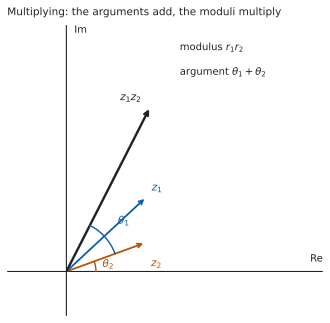
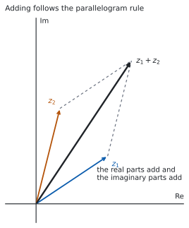

# HL 1.13 — Polar and Euler form, products and quotients（極形式と Euler 形、積と商） {#sec-aahl-1-13}

::: {.callout-note}
## What you should be able to do
- 複素数を $r(\cos\theta + i\sin\theta)$ の形（**polar form**）で書ける。
- 同じものを $re^{i\theta}$ の形（**Euler form**）で書ける。
- $a+bi$・polar form・Euler form のあいだを、どの向きにも行き来できる。
- 極形式のまま、$2$ つの複素数を**かけ・割る**ことができる。
- 掛け算が**回転と拡大**にあたることを、図で説明できる。
:::

## The idea

### 1. Modulus–argument form（極形式） {#polar}

[HL 1.12](aahl-1-12.qmd#modulus-argument) で、複素数には **modulus** $r = \lvert z \rvert$ と **argument** $\theta = \arg z$ の $2$ つがあることを見ました。**この $2$ つだけで、$z$ が決まります。**

[HL 1.12 の図](aahl-1-12.qmd#modulus-argument)にある直角三角形から

$$
a = r\cos\theta, \qquad b = r\sin\theta
$$

なので、$z = a+bi$ に入れると次の形になります。

$$
z = r(\cos\theta + i\sin\theta)
$$ {#eq-aahl113-polar}

これを **modulus–argument form（極形式）**といいます。$r$ が長さ、$\theta$ が向きです。

$r = 2$、$\theta = \dfrac{\pi}{3}$ なら

$$
z = 2\left(\cos\frac{\pi}{3} + i\sin\frac{\pi}{3}\right) = 2\left(\frac{1}{2} + \frac{\sqrt{3}}{2}i\right) = 1 + \sqrt{3}\,i
$$

::: {.callout-note}
## $r\,\mathrm{cis}\,\theta$ という短い書き方もあります
$\cos\theta + i\sin\theta$ を $\mathrm{cis}\,\theta$ と書くことがあります。$\mathbf{c}$os $+$ $\mathbf{i}$ $\mathbf{s}$in の頭文字です。公式集にもこの書き方が出てきます。

**この本では $r(\cos\theta + i\sin\theta)$ と $re^{i\theta}$ を使います。** $\mathrm{cis}$ は、**問題文や公式集で見たときに分かればよい**、という扱いにします。
:::

### 2. Euler form（Euler 形） {#euler}

同じ $z$ は、次のようにも書けます。

$$
z = re^{i\theta}
$$ {#eq-aahl113-euler}

これを **Euler form** といいます。$e$ は自然対数の底です（[SL 2.9](../../aa-sl/02-functions/aasl-2-9.qmd)）。

::: {.callout-important}
## この式は公式集にあります
公式集の **1.13** の欄に、$3$ つの形が $1$ 行に並べて印刷されています。

> Modulus-argument (polar) and exponential (Euler) form
>
> $z = r(\cos\theta + i\sin\theta) = re^{i\theta} = r\,\mathrm{cis}\,\theta$

**等号で結ばれているとおり、$3$ つは同じ数の $3$ 通りの書き方です。** 覚える必要はありません。覚えるのは、**どの形が、どの計算に向いているか**のほうです（[第 4 節](#product)）。
:::

$e^{i\theta}$ は、いまは**「長さ $1$ で、向きが $\theta$ の数」を表す記号**だと思ってください。$\theta$ を指数の位置に書くところが要で、そのおかげで掛け算が足し算になります（[第 4 節](#product)）。

**なぜ $e$ が出てくるのか**は [Why it works](#why-it-works) に置きました。証明は AHL 5.19 の級数まで待ちます。

::: {.callout-tip}
## $\theta = \pi$ を入れてみる
@eq-aahl113-euler で $r = 1$、$\theta = \pi$ とすると $e^{i\pi} = \cos\pi + i\sin\pi = -1$ です。移項すれば

$$
e^{i\pi} + 1 = 0
$$

となり、$e$、$i$、$\pi$、$1$、$0$ が $1$ つの式に並びます。**Euler の等式**と呼ばれます。
:::

### 3. Converting between the forms（形のあいだを行き来する） {#convert}

シラバスは、この行き来をはっきり求めています。

> The ability to convert between Cartesian, modulus-argument (polar) and Euler form is expected.

| 向き | やること |
|:--|:--|
| $a+bi$ → 極形式・Euler 形 | $r = \sqrt{a^{2}+b^{2}}$ と、**象限を見てから** $\theta$（[HL 1.12](aahl-1-12.qmd#modulus-argument)） |
| 極形式・Euler 形 → $a+bi$ | $a = r\cos\theta$、$b = r\sin\theta$ を計算する |
| 極形式 ⇄ Euler 形 | $r$ と $\theta$ をそのまま移すだけ |

: $3$ つの形の行き来 {#tbl-aahl113-convert}

$z = 4i$ で見ます。$r = 4$ で、$4i$ は虚軸の正の側にあるので $\theta = \dfrac{\pi}{2}$ です。

$$
4i = 4\left(\cos\frac{\pi}{2} + i\sin\frac{\pi}{2}\right) = 4e^{i\pi/2}
$$

**極形式と Euler 形のあいだは、書き写すだけです。** 手間がかかるのは $a+bi$ との行き来のほうです。

### 4. Multiplication: multiply the moduli, add the arguments（掛け算：長さはかけ算、角は足し算） {#product}

Euler 形の値打ちは、ここに出ます。指数法則 $e^{x}e^{y} = e^{x+y}$（[SL 1.5](../../aa-sl/01-number-and-algebra/aasl-1-5.qmd)）から

$$
\left(r_{1}e^{i\theta_{1}}\right)\left(r_{2}e^{i\theta_{2}}\right) = r_{1}r_{2}\,e^{i(\theta_{1}+\theta_{2})}
$$ {#eq-aahl113-product}

{#fig-aahl113-idea-a width=100%}

**絶対値どうしは掛け算、偏角どうしは足し算です**（@fig-aahl113-idea-a）。

$$
\lvert z_{1}z_{2} \rvert = \lvert z_{1} \rvert \lvert z_{2} \rvert, \qquad
\arg(z_{1}z_{2}) = \arg z_{1} + \arg z_{2}
$$ {#eq-aahl113-modarg}

$z_{1} = 2e^{i\pi/3}$、$z_{2} = 3e^{i\pi/6}$ なら

$$
z_{1}z_{2} = 6\,e^{i(\pi/3 + \pi/6)} = 6e^{i\pi/2} = 6i
$$

**$a+bi$ の形で同じことをすると、展開が必要です。** 掛け算は、極形式のほうが軽くすみます。

::: {.callout-warning}
## 偏角の和が、範囲から出ることがあります
@eq-aahl113-modarg の足し算は、$2\pi$ の差を無視すれば正しい式です。ただし $\arg z_{1} + \arg z_{2}$ が $-\pi < \theta \leq \pi$ から出てしまうことがあります。

たとえば $\arg z_{1} = \arg z_{2} = \dfrac{3\pi}{4}$ なら、和は $\dfrac{3\pi}{2}$ です。主値で答えるなら $2\pi$ を引いて $-\dfrac{\pi}{2}$ にします。

**$2\pi$ を足し引きしても、指す点は変わりません。** 答えの範囲が指定されているときだけ、直してください。
:::

### 5. Division: divide the moduli, subtract the arguments（割り算：長さは割り算、角は引き算） {#quotient}

同じ指数法則から

$$
\frac{r_{1}e^{i\theta_{1}}}{r_{2}e^{i\theta_{2}}} = \frac{r_{1}}{r_{2}}\,e^{i(\theta_{1}-\theta_{2})}
$$ {#eq-aahl113-quotient}

です（$r_{2} \neq 0$）。上の $z_{1}$、$z_{2}$ なら

$$
\frac{z_{1}}{z_{2}} = \frac{2}{3}e^{i(\pi/3 - \pi/6)} = \frac{2}{3}e^{i\pi/6}
$$

**共役を掛ける必要がありません**（[HL 1.12](aahl-1-12.qmd#division)）。割り算も、極形式のほうが軽くすみます。

### 6. Rotation and enlargement（図形的な意味：回転と拡大） {#geometry}

@eq-aahl113-product を、$z_{2}$ を**かける操作**として読み直します。

> $re^{i\theta}$ をかけることは、**原点のまわりに $\theta$ だけ回し、原点からの距離を $r$ 倍する**ことです。

**$r = 1$ なら、回すだけです。** いちばん短い例が $i$ です。$i = 1 \cdot e^{i\pi/2}$ なので、$i$ をかけることは $\dfrac{\pi}{2}$ の回転です。

$$
i(3+2i) = 3i + 2i^{2} = -2+3i
$$

点 $(3,\ 2)$ が点 $(-2,\ 3)$ に移りました。**確かに $90^{\circ}$ 回っています。**

**$\theta = 0$ なら、拡大・縮小だけです。** 実数をかけることが、それにあたります。

### 7. Addition is done in Cartesian form（足し算は $a+bi$ の形で） {#sums}

足し算だけは、極形式が**向きません。** $r_{1}e^{i\theta_{1}} + r_{2}e^{i\theta_{2}}$ は、これ以上まとめられないからです。

{#fig-aahl113-idea-b width=100%}

**足し算は $a+bi$ の形にしてから、実部どうし・虚部どうしを足します。** 図で見ると、@fig-aahl113-idea-b のように**平行四辺形の対角線**です。矢印のつなぎ方は、ベクトルの足し算と同じです。

$$
(3+2i) + (1+4i) = 4 + 6i
$$

| したいこと | 向いている形 |
|:--|:--|
| 足し算・引き算 | $a+bi$ |
| 掛け算・割り算 | 極形式・Euler 形 |
| 累乗・$n$ 乗根 | Euler 形（[HL 1.14](aahl-1-14.qmd)） |

: どの形を使うかの目安 {#tbl-aahl113-which}

::: {.callout-tip collapse="true"}
## Paper 2 では、電卓で答え合わせができます
TI-Nspire CX II は複素数をそのまま計算できるので、極形式で出した積や商を $a+bi$ に直したものと、$a+bi$ のまま計算したものを見くらべられます。

**$2$ つの道すじが同じ答えになれば、偏角の足し引きが合っています。**

**Paper 1 では使えません。** ですから、このページの例題と演習は、すべて手で出せる角にしてあります。
:::

## Why it works

::: {.callout-tip collapse="true"}
## クリックすると開きます

**なぜ、長さ $1$ で向きが $\theta$ の数を $e^{i\theta}$ と書いてよいのでしょうか。**

$e$ を使う理由は、**指数法則が、そのまま「角の足し算」になってほしい**からです。@eq-aahl113-product で見たとおり、掛け算は角を足します。指数の記号は、掛け算を足し算に変える唯一の道具です。

そこで $f(\theta) = \cos\theta + i\sin\theta$ が、本当に指数法則を満たすかを確かめます。$f(\theta_{1})f(\theta_{2})$ を展開すると

$$
(\cos\theta_{1} + i\sin\theta_{1})(\cos\theta_{2} + i\sin\theta_{2})
$$

$$
= (\cos\theta_{1}\cos\theta_{2} - \sin\theta_{1}\sin\theta_{2}) + i(\sin\theta_{1}\cos\theta_{2} + \cos\theta_{1}\sin\theta_{2})
$$

です。ここで compound angle identities（加法定理、AHL 3.10）を使うと、実部は $\cos(\theta_{1}+\theta_{2})$、虚部は $\sin(\theta_{1}+\theta_{2})$ です。つまり

$$
f(\theta_{1})f(\theta_{2}) = f(\theta_{1}+\theta_{2})
$$

**掛けると、中身が足し算になりました。** これは $e^{x}e^{y} = e^{x+y}$ とまったく同じ形です。だから $f(\theta)$ を $e^{i\theta}$ と書くと、つじつまが合います。

#### 「合う」と「等しい」はちがいます

ここで示したのは、**$f(\theta)$ が指数関数と同じ規則に従う**ことだけです。$f(\theta)$ が本当に $e$ の累乗そのものであることは、$e^{x}$・$\cos x$・$\sin x$ を級数で書いて見くらべると分かります。**それは AHL 5.19 で扱います。**

この本では、@eq-aahl113-euler を**そういう約束の記号**として使い、@eq-aahl113-product と @eq-aahl113-quotient を道具にします。
:::

## Worked examples

::: {.callout-note appearance="simple"}
問題文は英語です。意味が理解できなかったら、問題文の下の「**日本語訳**」を開いてください。解説は日本語です。

**例題も演習も、すべて電卓なしで解けます。** Paper 1 のつもりで解いてください。
:::

::: {#exm-aahl113-topolar}
[Let $z = 1-i$.]{.q-en}

**(a)** [Write $z$ in modulus–argument form.]{.q-en}

**(b)** [Write $z$ in Euler form.]{.q-en}

日本語訳

$z = 1-i$ とします。

**(a)** $z$ を極形式で書きなさい。

**(b)** $z$ を Euler 形で書きなさい。

---

**(a)** まず $r$ を出します。

$$
r = \sqrt{1^{2}+(-1)^{2}} = \sqrt{2}
$$

実部が正、虚部が負なので、$z$ は**第 $4$ 象限**にあります。基準の角は $\arctan 1 = \dfrac{\pi}{4}$ なので

$$
\theta = -\frac{\pi}{4}
$$

$$
z = \sqrt{2}\left(\cos\left(-\frac{\pi}{4}\right) + i\sin\left(-\frac{\pi}{4}\right)\right)
$$

**(b)** $r$ と $\theta$ を、そのまま @eq-aahl113-euler に移します（@tbl-aahl113-convert）。

$$
z = \sqrt{2}\,e^{-i\pi/4}
$$

**検算。** **極形式から $a+bi$ に戻します。**

$$
\sqrt{2}\cos\left(-\frac{\pi}{4}\right) = \sqrt{2} \times \frac{1}{\sqrt{2}} = 1, \qquad
\sqrt{2}\sin\left(-\frac{\pi}{4}\right) = \sqrt{2} \times \left(-\frac{1}{\sqrt{2}}\right) = -1
$$

$1-i$ に戻りました ✓ **象限をまちがえていれば、ここで符号が合いません。**

**検算（絶対値で）。** $\lvert z \rvert^{2} = z z^{*} = 1^{2}+(-1)^{2} = 2$ なので $r = \sqrt{2}$ です ✓ **根号の計算を別の道すじで確かめています。**

**$\theta = \dfrac{\pi}{4}$ としていたら**、戻したとき $1+i$ になります。**虚部の符号を見てください。**

::: {.callout-note}
## 解答例（答案用紙に書くこと）
**(a)** $r = \sqrt{1+1} = \sqrt{2}$, *and $z$ is in the fourth quadrant, so $\theta = -\dfrac{\pi}{4}$.*

$$z = \sqrt{2}\left(\cos\left(-\frac{\pi}{4}\right) + i\sin\left(-\frac{\pi}{4}\right)\right)$$

**(b)**
$$z = \sqrt{2}\,e^{-i\pi/4}$$
:::
:::

::: {#exm-aahl113-tocartesian}
[Write $z = 6e^{i5\pi/6}$ in the form $a+bi$, where $a,b \in \mathbb{R}$.]{.q-en}

日本語訳

$z = 6e^{i5\pi/6}$ を、$a$、$b$ を実数として $a+bi$ の形で書きなさい。

---

$r = 6$、$\theta = \dfrac{5\pi}{6}$ です。@eq-aahl113-polar を使います。

$$
z = 6\left(\cos\frac{5\pi}{6} + i\sin\frac{5\pi}{6}\right)
$$

$\dfrac{5\pi}{6}$ は第 $2$ 象限の角で、基準の角は $\dfrac{\pi}{6}$ です（[SL 3.5](../../aa-sl/03-geometry/aasl-3-5.qmd)）。

$$
\cos\frac{5\pi}{6} = -\frac{\sqrt{3}}{2}, \qquad \sin\frac{5\pi}{6} = \frac{1}{2}
$$

$$
z = 6\left(-\frac{\sqrt{3}}{2} + \frac{1}{2}i\right) = -3\sqrt{3} + 3i
$$

**検算。** **$a+bi$ から極形式に戻します。**

$$
\lvert z \rvert = \sqrt{27+9} = \sqrt{36} = 6
$$

$r = 6$ に戻りました ✓ 実部が負・虚部が正なので第 $2$ 象限にあり、$\dfrac{5\pi}{6}$ と合っています。

**検算（比で）。** $\dfrac{b}{a} = \dfrac{3}{-3\sqrt{3}} = -\dfrac{1}{\sqrt{3}}$ で、$\tan\dfrac{5\pi}{6} = -\dfrac{1}{\sqrt{3}}$ です ✓ **絶対値とは別のところを見ています。**

**$\cos\dfrac{5\pi}{6}$ を $+\dfrac{\sqrt{3}}{2}$ としていたら**、答えは $3\sqrt{3}+3i$ になり、第 $1$ 象限の数になってしまいます。**第 $2$ 象限では $\cos$ が負です。**

::: {.callout-note}
## 解答例（答案用紙に書くこと）

$$z = 6\left(\cos\frac{5\pi}{6} + i\sin\frac{5\pi}{6}\right) = 6\left(-\frac{\sqrt{3}}{2} + \frac{1}{2}i\right)$$

$$= -3\sqrt{3} + 3i$$
:::
:::

::: {#exm-aahl113-product}
[Let $z_{1} = 4e^{i\pi/4}$ and $z_{2} = 2e^{i\pi/12}$.]{.q-en}

**(a)** [Find $z_{1}z_{2}$, giving your answer in Euler form.]{.q-en}

**(b)** [Find $\dfrac{z_{1}}{z_{2}}$, giving your answer in Euler form.]{.q-en}

**(c)** [Explain, in terms of a transformation of the complex plane, what multiplying by $z_{2}$ does to the point representing $z_{1}$.]{.q-en}

日本語訳

$z_{1} = 4e^{i\pi/4}$、$z_{2} = 2e^{i\pi/12}$ とします。

**(a)** $z_{1}z_{2}$ を Euler 形で求めなさい。

**(b)** $\dfrac{z_{1}}{z_{2}}$ を Euler 形で求めなさい。

**(c)** $z_{2}$ をかけることが、$z_{1}$ を表す点にどんな変換をほどこすことになるかを説明しなさい。

---

**(a)** @eq-aahl113-product です。長さは掛け算、角は足し算です。

$$
\frac{\pi}{4} + \frac{\pi}{12} = \frac{3\pi}{12} + \frac{\pi}{12} = \frac{4\pi}{12} = \frac{\pi}{3}
$$

$$
z_{1}z_{2} = 8e^{i\pi/3}
$$

**(b)** @eq-aahl113-quotient です。長さは割り算、角は引き算です。

$$
\frac{\pi}{4} - \frac{\pi}{12} = \frac{2\pi}{12} = \frac{\pi}{6}
$$

$$
\frac{z_{1}}{z_{2}} = 2e^{i\pi/6}
$$

**(c)** `Explain` なので、英語で書きます。

::: {.model-answer}
**試験ではこう書く**

*Multiplying by $z_{2} = 2e^{i\pi/12}$ rotates the point representing $z_{1}$ anticlockwise about the origin through an angle of $\dfrac{\pi}{12}$, and at the same time enlarges its distance from the origin by a scale factor of $2$. This is because the moduli multiply and the arguments add, so the new modulus is $2 \times 4 = 8$ and the new argument is $\dfrac{\pi}{4} + \dfrac{\pi}{12} = \dfrac{\pi}{3}$.*
:::

（$z_{2}$ をかけることは、原点のまわりに $\dfrac{\pi}{12}$ だけ反時計回りに回し、同時に原点からの距離を $2$ 倍にすることである、という意味です。）

**検算（(a) について）。** **$a+bi$ の形でも出してみます。** $z_{1} = 4\left(\dfrac{1}{\sqrt{2}} + \dfrac{1}{\sqrt{2}}i\right) = 2\sqrt{2}(1+i)$ で、答えの $8e^{i\pi/3}$ は

$$
8\left(\frac{1}{2} + \frac{\sqrt{3}}{2}i\right) = 4 + 4\sqrt{3}\,i
$$

です。$\lvert 4+4\sqrt{3}i \rvert = \sqrt{16+48} = \sqrt{64} = 8$ で、$\lvert z_{1} \rvert\lvert z_{2} \rvert = 4 \times 2 = 8$ と一致しました ✓

**検算（(a) と (b) の関係）。** $(z_{1}z_{2}) \div \left(\dfrac{z_{1}}{z_{2}}\right) = z_{2}^{2}$ のはずです。

$$
\frac{8e^{i\pi/3}}{2e^{i\pi/6}} = 4e^{i\pi/6}, \qquad z_{2}^{2} = \left(2e^{i\pi/12}\right)^{2} = 4e^{i\pi/6}
$$

一致しました ✓ **(a)** と **(b)** を別々にまちがえていないかが、これで分かります。

**角の足し算で通分を忘れて $\dfrac{\pi}{4}+\dfrac{\pi}{12} = \dfrac{2\pi}{16}$ としていたら**、$\dfrac{\pi}{8}$ になります。**分母がちがう分数は、そのまま足せません。**

::: {.callout-note}
## 解答例（答案用紙に書くこと）
**(a)**
$$z_{1}z_{2} = (4)(2)e^{i\left(\frac{\pi}{4}+\frac{\pi}{12}\right)} = 8e^{i\pi/3}$$

**(b)**
$$\frac{z_{1}}{z_{2}} = \frac{4}{2}e^{i\left(\frac{\pi}{4}-\frac{\pi}{12}\right)} = 2e^{i\pi/6}$$

**(c)** *Multiplying by $z_{2}$ rotates the point anticlockwise about the origin through $\dfrac{\pi}{12}$ and enlarges its distance from the origin by scale factor $2$.*
:::
:::

::: {#exm-aahl113-rotation}
[The complex number $z$ has $\lvert z \rvert = 3$ and $\arg z = \dfrac{\pi}{6}$. The point representing $z$ is rotated anticlockwise about the origin through $\dfrac{\pi}{2}$ to give the point representing $w$.]{.q-en}

**(a)** [Write $w$ in Euler form.]{.q-en}

**(b)** [Hence write $w$ in the form $a+bi$.]{.q-en}

**(c)** [Explain why $w = iz$.]{.q-en}

日本語訳

複素数 $z$ は $\lvert z \rvert = 3$、$\arg z = \dfrac{\pi}{6}$ をみたします。$z$ を表す点を、原点のまわりに反時計回りに $\dfrac{\pi}{2}$ だけ回した点が $w$ を表します。

**(a)** $w$ を Euler 形で書きなさい。

**(b)** それを使って、$w$ を $a+bi$ の形で書きなさい。

**(c)** $w = iz$ となる理由を説明しなさい。

---

**(a)** 回しただけなので、**長さは変わりません。** 角だけが $\dfrac{\pi}{2}$ 増えます。

$$
\frac{\pi}{6} + \frac{\pi}{2} = \frac{\pi}{6} + \frac{3\pi}{6} = \frac{4\pi}{6} = \frac{2\pi}{3}
$$

$$
w = 3e^{i2\pi/3}
$$

**(b)** @eq-aahl113-polar に入れます。$\dfrac{2\pi}{3}$ は第 $2$ 象限の角です。

$$
w = 3\left(-\frac{1}{2} + \frac{\sqrt{3}}{2}i\right) = -\frac{3}{2} + \frac{3\sqrt{3}}{2}i
$$

**(c)** `Explain why` なので、英語で理由を書きます。

::: {.model-answer}
**試験ではこう書く**

*In Euler form $i = e^{i\pi/2}$, since $\lvert i \rvert = 1$ and $\arg i = \dfrac{\pi}{2}$. Multiplying two complex numbers multiplies their moduli and adds their arguments, so multiplying $z$ by $i$ leaves the modulus unchanged (because the modulus of $i$ is $1$) and increases the argument by $\dfrac{\pi}{2}$. That is exactly an anticlockwise rotation through $\dfrac{\pi}{2}$ about the origin, so $w = iz$.*
:::

（$i$ は Euler 形で $e^{i\pi/2}$ である。掛け算では絶対値がかけ算、偏角が足し算になるので、$i$ をかけると長さは変わらず角だけが $\dfrac{\pi}{2}$ 増える、という意味です。）

**検算。** **$iz$ を直接計算します。** $z = 3\left(\dfrac{\sqrt{3}}{2} + \dfrac{1}{2}i\right) = \dfrac{3\sqrt{3}}{2} + \dfrac{3}{2}i$ なので

$$
iz = i\left(\frac{3\sqrt{3}}{2} + \frac{3}{2}i\right) = \frac{3\sqrt{3}}{2}i + \frac{3}{2}i^{2} = -\frac{3}{2} + \frac{3\sqrt{3}}{2}i
$$

**(b)** と一致しました ✓ **極形式をまったく使わない道すじです。**

**検算（絶対値で）。** $\lvert w \rvert = \sqrt{\dfrac{9}{4} + \dfrac{27}{4}} = \sqrt{9} = 3$ で、$\lvert z \rvert$ と同じです ✓ **回転では長さが変わらない**ことが確かめられました。

**$\dfrac{\pi}{6}+\dfrac{\pi}{2}$ を $\dfrac{\pi}{8}$ としていたら**、分母どうしを足しています。**通分してから足してください。**

::: {.callout-note}
## 解答例（答案用紙に書くこと）
**(a)** *Rotation does not change the modulus, and it adds $\dfrac{\pi}{2}$ to the argument.*

$$w = 3e^{i\left(\frac{\pi}{6}+\frac{\pi}{2}\right)} = 3e^{i2\pi/3}$$

**(b)**
$$w = 3\left(\cos\frac{2\pi}{3} + i\sin\frac{2\pi}{3}\right) = -\frac{3}{2} + \frac{3\sqrt{3}}{2}i$$

**(c)** *$i = e^{i\pi/2}$, so multiplying by $i$ multiplies the modulus by $1$ and adds $\dfrac{\pi}{2}$ to the argument, which is the required rotation.*
:::
:::

## Common errors

::: {.callout-warning}
## $r(\cos\theta - i\sin\theta)$ を極形式として答える
@eq-aahl113-polar の形は $\cos\theta + i\sin\theta$ です。**あいだは $+$ でなければなりません。**

$\cos\theta - i\sin\theta$ が出てきたら、$\cos(-\theta) = \cos\theta$、$\sin(-\theta) = -\sin\theta$ を使って

$$
\cos\theta - i\sin\theta = \cos(-\theta) + i\sin(-\theta)
$$

と直します。**偏角は $-\theta$ です。**
:::

::: {.callout-warning}
## 偏角を度で書く
Euler 形の $\theta$ は radian です。$e^{i \cdot 60^{\circ}}$ とは書けません。

**極形式でも、AA HL では radian で書きます**（[HL 1.12](aahl-1-12.qmd#range)）。$\dfrac{\pi}{3}$ を $60$ と書かないでください。
:::

::: {.callout-warning}
## 象限を見ずに、極形式に直す
$a+bi$ から極形式に直すときは、**必ず象限を見ます**（[HL 1.12](aahl-1-12.qmd#modulus-argument)）。$\arctan\dfrac{b}{a}$ の値をそのまま使うと、第 $2$・第 $3$ 象限で $\pi$ だけずれます。

**簡単な図をかいてから答えてください。** $a$ と $b$ の符号を見るだけで足ります。
:::

::: {.callout-warning}
## 掛け算で、角どうしを掛けてしまう
@eq-aahl113-product は $e^{i\theta_{1}} \times e^{i\theta_{2}} = e^{i(\theta_{1}+\theta_{2})}$ です。**指数は足します。**

$e^{i\pi/3} \times e^{i\pi/6}$ は $e^{i\pi^{2}/18}$ ではありません。$e^{i\pi/2}$ です。**指数法則は $a^{m}a^{n} = a^{m+n}$ です**（[SL 1.5](../../aa-sl/01-number-and-algebra/aasl-1-5.qmd)）。
:::

::: {.callout-warning}
## 足し算を、極形式のままやろうとする
$r_{1}e^{i\theta_{1}} + r_{2}e^{i\theta_{2}}$ は、そのままではまとめられません（[第 7 節](#sums)）。

**$a+bi$ に直してから足します。** 極形式が軽いのは掛け算と割り算のときで、足し算のときではありません。
:::

::: {.callout-warning}
## $r$ を負の数のまま答える
$r$ は原点からの距離なので、$0$ 以上です。$-2e^{i\pi/3}$ は極形式の答えになりません。

$-1 = e^{i\pi}$ なので、符号は**角のほうに入れます。**

$$
-2e^{i\pi/3} = 2e^{i(\pi/3 + \pi)} = 2e^{i4\pi/3} = 2e^{-i2\pi/3}
$$

最後の等号では、$2\pi$ を引いて主値の範囲に直しました。
:::

## Exercises

::: {.callout-note appearance="simple"}
各問題に、折りたたみが $3$ つ付いています。**日本語訳**、**解答例**（答案用紙に書くべきこと。英語です）、**解説**（なぜそうなるか。日本語です）。

まず自分で解いて、次に解答例と見くらべてください。**解説は、合わなかったときだけ開けば十分です。**
:::

::: {.exercise-block}

[1]{.ex-no} [Write $z = 3+3i$ in modulus–argument form and in Euler form.]{.q-en}

日本語訳

$z = 3+3i$ を、極形式と Euler 形で書きなさい。

::: {.callout-note collapse="true"}
## 解答例（答案用紙に書くこと）

$$r = \sqrt{9+9} = 3\sqrt{2}, \qquad \theta = \frac{\pi}{4}$$

$$z = 3\sqrt{2}\left(\cos\frac{\pi}{4} + i\sin\frac{\pi}{4}\right) = 3\sqrt{2}\,e^{i\pi/4}$$
:::

::: {.callout-tip collapse="true"}
## 解説

実部も虚部も正なので、$z$ は第 $1$ 象限にあります。この象限では $\arctan\dfrac{b}{a}$ をそのまま使えます。$\arctan 1 = \dfrac{\pi}{4}$ です。

**検算。** 極形式から $a+bi$ に戻します。

$$
3\sqrt{2}\cos\frac{\pi}{4} = 3\sqrt{2} \times \frac{1}{\sqrt{2}} = 3, \qquad
3\sqrt{2}\sin\frac{\pi}{4} = 3
$$

$3+3i$ に戻りました ✓

**$r$ を $\sqrt{9+9} = \sqrt{18}$ で止めないでください。** $\sqrt{18} = 3\sqrt{2}$ まで直します。
:::

::: {.ex-sep}
:::

[2]{.ex-no} [Write $z = -5i$ in Euler form.]{.q-en}

日本語訳

$z = -5i$ を Euler 形で書きなさい。

::: {.callout-note collapse="true"}
## 解答例（答案用紙に書くこと）

$$r = 5, \qquad \theta = -\frac{\pi}{2}$$

$$z = 5e^{-i\pi/2}$$
:::

::: {.callout-tip collapse="true"}
## 解説

$-5i$ は虚軸の負の側にあります。実部が $0$ なので $\arctan\dfrac{b}{a}$ は使えません。**図で見るのがいちばん速いです。**

$-\pi < \theta \leq \pi$ の範囲では $-\dfrac{\pi}{2}$ です。$\dfrac{3\pi}{2}$ は範囲の外です。

**検算。** 戻します。$5\cos\left(-\dfrac{\pi}{2}\right) = 0$、$5\sin\left(-\dfrac{\pi}{2}\right) = -5$ なので $0 - 5i = -5i$ ✓

**$r = -5$ としないでください。** 絶対値は $0$ 以上です。符号は角のほうに入れます。
:::

::: {.ex-sep}
:::

[3]{.ex-no} [Write $z = 4e^{i\pi/3}$ in the form $a+bi$, where $a,b \in \mathbb{R}$.]{.q-en}

日本語訳

$z = 4e^{i\pi/3}$ を、$a$、$b$ を実数として $a+bi$ の形で書きなさい。

::: {.callout-note collapse="true"}
## 解答例（答案用紙に書くこと）

$$z = 4\left(\cos\frac{\pi}{3} + i\sin\frac{\pi}{3}\right) = 4\left(\frac{1}{2} + \frac{\sqrt{3}}{2}i\right) = 2 + 2\sqrt{3}\,i$$
:::

::: {.callout-tip collapse="true"}
## 解説

$\cos\dfrac{\pi}{3} = \dfrac{1}{2}$、$\sin\dfrac{\pi}{3} = \dfrac{\sqrt{3}}{2}$ です（[SL 3.5](../../aa-sl/03-geometry/aasl-3-5.qmd)）。

**検算。** 絶対値で戻します。

$$
\lvert 2+2\sqrt{3}i \rvert = \sqrt{4 + 12} = \sqrt{16} = 4
$$

$r = 4$ に戻りました ✓ 実部も虚部も正なので第 $1$ 象限にあり、$\dfrac{\pi}{3}$ と合っています。

**$\cos\dfrac{\pi}{3}$ と $\sin\dfrac{\pi}{3}$ を取りちがえると**、答えは $2\sqrt{3}+2i$ になります。絶対値は同じ $4$ なので、**絶対値の検算だけでは見つかりません。** 象限の中のどこにあるかを、図で見てください。
:::

::: {.ex-sep}
:::

[4]{.ex-no} [Write $z = 2\left(\cos\dfrac{3\pi}{4} + i\sin\dfrac{3\pi}{4}\right)$ in the form $a+bi$.]{.q-en}

日本語訳

$z = 2\left(\cos\dfrac{3\pi}{4} + i\sin\dfrac{3\pi}{4}\right)$ を $a+bi$ の形で書きなさい。

::: {.callout-note collapse="true"}
## 解答例（答案用紙に書くこと）

$$z = 2\left(-\frac{1}{\sqrt{2}} + \frac{1}{\sqrt{2}}i\right) = -\sqrt{2} + \sqrt{2}\,i$$
:::

::: {.callout-tip collapse="true"}
## 解説

$\dfrac{3\pi}{4}$ は第 $2$ 象限の角なので、$\cos$ は負、$\sin$ は正です。基準の角は $\dfrac{\pi}{4}$ です。

$\dfrac{2}{\sqrt{2}} = \sqrt{2}$ です。**分母に根号を残さない形まで直してください。**

**検算。** 絶対値で戻します。$\sqrt{2+2} = 2$ ✓ 実部が負・虚部が正なので第 $2$ 象限で、$\dfrac{3\pi}{4}$ と合っています。

**$\cos\dfrac{3\pi}{4}$ を正にしていたら**、第 $1$ 象限の数になります。**象限と符号が合っているかを、最後に見てください。**
:::

::: {.ex-sep}
:::

[5]{.ex-no} [Let $z_{1} = 6e^{i5\pi/12}$ and $z_{2} = 2e^{i\pi/4}$.]{.q-en}

**(a)** [Find $z_{1}z_{2}$, giving your answer in Euler form.]{.q-en}

**(b)** [Find $\dfrac{z_{1}}{z_{2}}$, giving your answer in Euler form.]{.q-en}

日本語訳

$z_{1} = 6e^{i5\pi/12}$、$z_{2} = 2e^{i\pi/4}$ とします。

**(a)** $z_{1}z_{2}$ を Euler 形で求めなさい。

**(b)** $\dfrac{z_{1}}{z_{2}}$ を Euler 形で求めなさい。

::: {.callout-note collapse="true"}
## 解答例（答案用紙に書くこと）

**(a)** $\dfrac{5\pi}{12} + \dfrac{\pi}{4} = \dfrac{5\pi}{12} + \dfrac{3\pi}{12} = \dfrac{8\pi}{12} = \dfrac{2\pi}{3}$

$$z_{1}z_{2} = 12e^{i2\pi/3}$$

**(b)** $\dfrac{5\pi}{12} - \dfrac{\pi}{4} = \dfrac{2\pi}{12} = \dfrac{\pi}{6}$

$$\frac{z_{1}}{z_{2}} = 3e^{i\pi/6}$$
:::

::: {.callout-tip collapse="true"}
## 解説

角は $12$ を分母にそろえてから足し引きします。

**検算。** **(a)** を **(b)** で割ると $z_{2}^{2}$ になるはずです。

$$
\frac{12e^{i2\pi/3}}{3e^{i\pi/6}} = 4e^{i\pi/2}, \qquad
z_{2}^{2} = \left(2e^{i\pi/4}\right)^{2} = 4e^{i\pi/2}
$$

一致しました ✓ **(a)** と **(b)** を別々にまちがえていないかが分かります。

**絶対値だけでも見ておけます。** $6 \times 2 = 12$、$6 \div 2 = 3$ ✓ ただし**これでは角のまちがいは見つかりません。**
:::

::: {.ex-sep}
:::

[6]{.ex-no} [Let $z = (1+i)\left(\sqrt{3}+i\right)$. Find $\lvert z \rvert$ and $\arg z$.]{.q-en}

日本語訳

$z = (1+i)\left(\sqrt{3}+i\right)$ とします。$\lvert z \rvert$ と $\arg z$ を求めなさい。

::: {.callout-note collapse="true"}
## 解答例（答案用紙に書くこと）

$$\lvert 1+i \rvert = \sqrt{2}, \quad \arg(1+i) = \frac{\pi}{4}; \qquad
\lvert \sqrt{3}+i \rvert = 2, \quad \arg\left(\sqrt{3}+i\right) = \frac{\pi}{6}$$

$$\lvert z \rvert = \sqrt{2} \times 2 = 2\sqrt{2}, \qquad
\arg z = \frac{\pi}{4} + \frac{\pi}{6} = \frac{5\pi}{12}$$
:::

::: {.callout-tip collapse="true"}
## 解説

**展開しなくても出せます。** @eq-aahl113-modarg をそのまま使います。

$1+i$ も $\sqrt{3}+i$ も第 $1$ 象限にあるので、偏角はどちらも $\arctan\dfrac{b}{a}$ です。

**検算。** **展開してから絶対値を出します。**

$$
(1+i)\left(\sqrt{3}+i\right) = \sqrt{3} + i + \sqrt{3}\,i - 1 = \left(\sqrt{3}-1\right) + \left(\sqrt{3}+1\right)i
$$

$$
\lvert z \rvert^{2} = \left(\sqrt{3}-1\right)^{2} + \left(\sqrt{3}+1\right)^{2} = (4 - 2\sqrt{3}) + (4 + 2\sqrt{3}) = 8
$$

$\lvert z \rvert = \sqrt{8} = 2\sqrt{2}$ ✓ **極形式をまったく使わない道すじです。**

**$\arg z$ のほうも見ておきます。** $\tan\dfrac{5\pi}{12} = 2+\sqrt{3}$ で、展開した式の $\dfrac{b}{a} = \dfrac{\sqrt{3}+1}{\sqrt{3}-1}$ は、分母を有理化すると $\dfrac{(\sqrt{3}+1)^{2}}{2} = \dfrac{4+2\sqrt{3}}{2} = 2+\sqrt{3}$ です ✓
:::

::: {.ex-sep}
:::

[7]{.ex-no} [Let $z = 8e^{i2\pi/3}$ and $w = 4e^{i\pi/6}$. Find $\dfrac{z}{w}$, giving your answer in the form $a+bi$.]{.q-en}

日本語訳

$z = 8e^{i2\pi/3}$、$w = 4e^{i\pi/6}$ とします。$\dfrac{z}{w}$ を $a+bi$ の形で求めなさい。

::: {.callout-note collapse="true"}
## 解答例（答案用紙に書くこと）

$$\frac{z}{w} = \frac{8}{4}e^{i\left(\frac{2\pi}{3}-\frac{\pi}{6}\right)} = 2e^{i\pi/2}$$

$$= 2\left(\cos\frac{\pi}{2} + i\sin\frac{\pi}{2}\right) = 2i$$
:::

::: {.callout-tip collapse="true"}
## 解説

$\dfrac{2\pi}{3} - \dfrac{\pi}{6} = \dfrac{4\pi}{6} - \dfrac{\pi}{6} = \dfrac{3\pi}{6} = \dfrac{\pi}{2}$ です。

$\cos\dfrac{\pi}{2} = 0$、$\sin\dfrac{\pi}{2} = 1$ なので、実部は $0$ です。

**検算。** **答えに $w$ を掛けて、$z$ に戻るかを見ます。**

$$
2e^{i\pi/2} \times 4e^{i\pi/6} = 8e^{i\left(\frac{\pi}{2}+\frac{\pi}{6}\right)} = 8e^{i2\pi/3}
$$

$z$ に戻りました ✓ **割り算をやり直したのではなく、逆向きの操作です。**

**角を引く向きを逆にして $\dfrac{\pi}{6} - \dfrac{2\pi}{3} = -\dfrac{\pi}{2}$ としていたら**、答えは $-2i$ になります。**割られるほうの角から、割るほうの角を引きます。**
:::

::: {.ex-sep}
:::

[8]{.ex-no} [Explain why $\lvert z_{1}z_{2} \rvert = \lvert z_{1} \rvert\lvert z_{2} \rvert$ for all complex numbers $z_{1}$ and $z_{2}$.]{.q-en}

日本語訳

どんな複素数 $z_{1}$、$z_{2}$ についても $\lvert z_{1}z_{2} \rvert = \lvert z_{1} \rvert\lvert z_{2} \rvert$ となる理由を説明しなさい。

::: {.callout-note collapse="true"}
## 解答例（答案用紙に書くこと）

*Write $z_{1} = r_{1}e^{i\theta_{1}}$ and $z_{2} = r_{2}e^{i\theta_{2}}$, where $r_{1} = \lvert z_{1} \rvert \geq 0$ and $r_{2} = \lvert z_{2} \rvert \geq 0$. Then*

$$z_{1}z_{2} = r_{1}r_{2}\,e^{i(\theta_{1}+\theta_{2})}$$

*This is in Euler form with modulus $r_{1}r_{2}$, since $r_{1}r_{2} \geq 0$. Hence $\lvert z_{1}z_{2} \rvert = r_{1}r_{2} = \lvert z_{1} \rvert\lvert z_{2} \rvert$.*
:::

::: {.callout-tip collapse="true"}
## 解説

`Explain why` なので、英語で理由を書きます。**極形式に直してから掛ける**のが、いちばん短い道すじです。

$r_{1}r_{2} \geq 0$ を言っておくところが要です。**絶対値は $0$ 以上でなければならない**ので、$r_{1}r_{2}$ がそのまま絶対値になると言えます。

**検算。** $a+bi$ の形でも確かめられます。$z_{1} = 3+2i$、$z_{2} = 1-i$ なら $z_{1}z_{2} = 5-i$ で

$$
\lvert 5-i \rvert = \sqrt{26}, \qquad \sqrt{13} \times \sqrt{2} = \sqrt{26}
$$

一致しました ✓ **$1$ つの例では証明になりませんが、書いた式が合っているかの確かめにはなります。**

**$\arg$ のほうは、同じようには書けません。** 偏角の和は主値の範囲から出ることがあるからです（[第 4 節](#product)）。**絶対値のほうには、その心配がありません。**

::: {.model-answer}
**試験ではこう書く**

*Let $z_{1} = r_{1}e^{i\theta_{1}}$ and $z_{2} = r_{2}e^{i\theta_{2}}$, where $r_{1}$ and $r_{2}$ are the moduli and are therefore non-negative. Multiplying gives $z_{1}z_{2} = r_{1}r_{2}e^{i(\theta_{1}+\theta_{2})}$, which is again in Euler form. Its modulus is the non-negative number $r_{1}r_{2}$, so $\lvert z_{1}z_{2} \rvert = r_{1}r_{2} = \lvert z_{1} \rvert \lvert z_{2} \rvert$. The same argument does not settle $\arg(z_{1}z_{2})$ exactly, because $\theta_{1}+\theta_{2}$ may fall outside the chosen range for the argument.*
:::
:::

::: {.ex-sep}
:::

[9]{.ex-no} [The complex number $z$ has modulus $5$ and argument $\dfrac{\pi}{3}$. The point representing $z$ is rotated clockwise about the origin through $\dfrac{\pi}{2}$. Find the complex number represented by the new point, giving your answer in the form $a+bi$.]{.q-en}

日本語訳

複素数 $z$ は絶対値 $5$、偏角 $\dfrac{\pi}{3}$ をみたします。$z$ を表す点を、原点のまわりに時計回りに $\dfrac{\pi}{2}$ だけ回します。移った点が表す複素数を、$a+bi$ の形で求めなさい。

::: {.callout-note collapse="true"}
## 解答例（答案用紙に書くこと）

*Clockwise rotation subtracts from the argument.*

$$\frac{\pi}{3} - \frac{\pi}{2} = -\frac{\pi}{6}, \qquad w = 5e^{-i\pi/6}$$

$$w = 5\left(\frac{\sqrt{3}}{2} - \frac{1}{2}i\right) = \frac{5\sqrt{3}}{2} - \frac{5}{2}i$$
:::

::: {.callout-tip collapse="true"}
## 解説

**時計回りは、角を引きます。** 反時計回りが正の向きだからです（[第 6 節](#geometry)）。

$-\dfrac{\pi}{6}$ は第 $4$ 象限の角なので、$\cos$ が正、$\sin$ が負です。

**検算。** 絶対値が変わっていないかを見ます。

$$
\left(\frac{5\sqrt{3}}{2}\right)^{2} + \left(\frac{5}{2}\right)^{2} = \frac{75}{4} + \frac{25}{4} = \frac{100}{4} = 25
$$

$\lvert w \rvert = 5$ で、もとの絶対値と同じです ✓ **回転では長さが変わりません。**

**時計回りを足し算にしていたら**、偏角は $\dfrac{5\pi}{6}$ になり、第 $2$ 象限の数になります。**向きを取りちがえると、象限が変わります。**
:::

::: {.ex-sep}
:::

[10]{.ex-no} [A student is asked to find $\left(5e^{i\pi/4}\right)\left(2e^{i\pi/4}\right)$ and writes the following.]{.q-en}

$$
\left(5e^{i\pi/4}\right)\left(2e^{i\pi/4}\right) = 10e^{i\pi^{2}/16}
$$

[Identify the error in the student's work, and find the correct answer in the form $a+bi$.]{.q-en}

日本語訳

ある生徒が $\left(5e^{i\pi/4}\right)\left(2e^{i\pi/4}\right)$ を求めるように言われ、上のように書きました。

生徒の誤りを指摘し、正しい答えを $a+bi$ の形で求めなさい。

::: {.callout-note collapse="true"}
## 解答例（答案用紙に書くこと）

*The student multiplied the two arguments instead of adding them. The index law is $e^{x}e^{y} = e^{x+y}$, not $e^{xy}$.*

$$\left(5e^{i\pi/4}\right)\left(2e^{i\pi/4}\right) = 10e^{i\left(\frac{\pi}{4}+\frac{\pi}{4}\right)} = 10e^{i\pi/2} = 10i$$
:::

::: {.callout-tip collapse="true"}
## 解説

`Identify the error` なので、**どこが違うのかを名指し**してから、正しい答えを書きます。

**絶対値のほうは合っています。** $5 \times 2 = 10$ です。まちがっているのは角の扱いだけです。

$e^{x}e^{y} = e^{x+y}$ です（[SL 1.5](../../aa-sl/01-number-and-algebra/aasl-1-5.qmd)）。$e^{xy}$ ではありません。

**検算。** **$a+bi$ の形で計算し直します。** $5e^{i\pi/4} = \dfrac{5}{\sqrt{2}}(1+i)$、$2e^{i\pi/4} = \dfrac{2}{\sqrt{2}}(1+i)$ なので

$$
\frac{10}{2}(1+i)^{2} = 5\left(1 + 2i - 1\right) = 10i
$$

一致しました ✓ **極形式をまったく使わない道すじです。**

::: {.model-answer}
**試験ではこう書く**

*The student has multiplied the arguments $\dfrac{\pi}{4}$ and $\dfrac{\pi}{4}$ together instead of adding them. When two powers of the same base are multiplied the indices are added, so $e^{i\pi/4} \times e^{i\pi/4} = e^{i\left(\frac{\pi}{4}+\frac{\pi}{4}\right)} = e^{i\pi/2}$. Geometrically, multiplying rotates by the sum of the two arguments, not by their product. The moduli, however, are multiplied, and the student was right to write $5 \times 2 = 10$. The correct answer is $10e^{i\pi/2} = 10i$.*
:::
:::

:::
