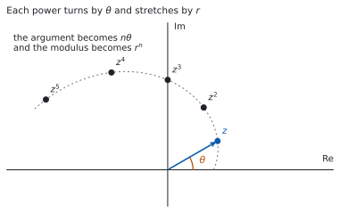
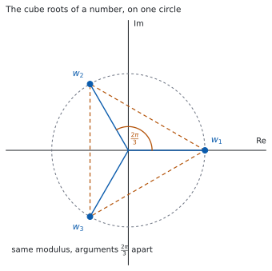

# HL 1.14 — Complex roots, De Moivre's theorem and $n$th roots（共役な解・De Moivre の定理・$n$ 乗根） {#sec-aahl-1-14}

::: {.callout-note}
## What you should be able to do
- 実数係数の方程式の複素数の解が、**共役な組**で現れることを使える。
- $1$ つの複素数の解から、残りの解や係数を求められる。
- **De Moivre の定理**を使って、複素数の累乗を出せる。
- De Moivre の定理を使って、$\cos 3\theta$ のような式を導ける。
- $z^{n} = w$ の解が**ちょうど $n$ 個**あることを知り、すべて求められる。
:::

## The idea

### 1. Conjugate roots（複素数の解は、共役な組で現れる） {#conjugate-roots}

$z^{2}-6z+25 = 0$ を解きます（[HL 1.12](aahl-1-12.qmd#division)）。

$$
z = \frac{6 \pm \sqrt{36-100}}{2} = \frac{6 \pm 8i}{2} = 3 \pm 4i
$$

**$2$ つの解は、互いに共役です。** これは偶然ではありません。シラバスは、次のように書いています。

> Complex roots occur in conjugate pairs.

::: {.callout-important}
## 「係数が実数のとき」という条件が要ります
この決まりが成り立つのは、**多項式の係数がすべて実数のとき**です。

$z^{2} - iz = 0$ の解は $0$ と $i$ で、共役な組になっていません。係数に $i$ があるからです。

**問題文に `with real coefficients` と書いてあるかどうかを見てください。**
:::

### 2. Building a polynomial with real coefficients（実数係数の多項式を組み立てる） {#build}

共役な組で現れることが分かっていると、**$1$ つの解から $2$ つ目がただで手に入ります。**

$3+4i$ が解なら $3-4i$ も解なので、$2$ つを掛けた

$$
\bigl(z-(3+4i)\bigr)\bigl(z-(3-4i)\bigr) = (z-3)^{2} - (4i)^{2} = z^{2}-6z+25
$$

が因数になります。**共役な組の積は、いつも実数係数の $2$ 次式です。**

ここに実数の解 $2$ を足せば、実数係数の $3$ 次式が組み立てられます。

$$
(z-2)\left(z^{2}-6z+25\right) = z^{3}-8z^{2}+37z-50
$$

**逆向きにも使えます。** $3$ 次方程式の解が $1$ つ複素数と分かれば、共役がもう $1$ つの解で、残りの $1$ つは必ず実数です。**$3$ 次式の解が $3$ つで、複素数は $2$ つずつ組になるからです。**

### 3. De Moivre's theorem（De Moivre の定理） {#demoivre}

[HL 1.13](aahl-1-13.qmd#product) で、掛け算は**長さをかけ、角を足す**ことでした。同じ数を $n$ 回かければ、長さは $n$ 乗、角は $n$ 倍です。

$$
\bigl[r(\cos\theta + i\sin\theta)\bigr]^{n} = r^{n}(\cos n\theta + i\sin n\theta)
$$ {#eq-aahl114-demoivre}

Euler 形なら、指数法則そのものです。

$$
\left(re^{i\theta}\right)^{n} = r^{n}e^{in\theta}
$$ {#eq-aahl114-euler}

::: {.callout-important}
## この式は公式集にあります
公式集の **1.14** の欄に、次の形で印刷されています。

> De Moivre's theorem
>
> $[r(\cos\theta + i\sin\theta)]^{n} = r^{n}(\cos n\theta + i\sin n\theta) = r^{n}e^{in\theta} = r^{n}\,\mathrm{cis}\,n\theta$

**覚える必要はありません。** 覚えるのは、**累乗は極形式に直してから**という手順のほうです。
:::

シラバスは、証明についても書いています。

> Includes proof by induction for the case where $n \in \mathbb{Z}^{+}$.

**正の整数 $n$ については、数学的帰納法で証明できます。** その証明は [Why it works](#why-it-works) に置きました。帰納法そのものは、次の項目 [HL 1.15](aahl-1-15.qmd#induction) で扱います。

### 4. Finding powers（累乗を出す） {#powers}

{#fig-aahl114-idea-a width=100%}

$(1+i)^{8}$ を出します。$a+bi$ のまま $8$ 回かけるのは大変ですが、極形式なら $1$ 行です。

$1+i$ は $r = \sqrt{2}$、$\theta = \dfrac{\pi}{4}$ なので（[HL 1.13](aahl-1-13.qmd#convert)）

$$
(1+i)^{8} = \left(\sqrt{2}\right)^{8}e^{i \cdot 8 \cdot \pi/4} = 16\,e^{2\pi i} = 16
$$

$e^{2\pi i} = \cos 2\pi + i\sin 2\pi = 1$ です。**答えが実数になりました**（@fig-aahl114-idea-a のように、角が一周したためです）。

### 5. Rational exponents（有理数の指数） {#rational}

シラバスは、De Moivre の定理を**有理数の指数まで**広げると書いています。$n = \dfrac{p}{q}$ でも

$$
\left(re^{i\theta}\right)^{p/q} = r^{p/q}\,e^{i p\theta/q}
$$ {#eq-aahl114-rational}

の形で使えます。ただし**指数が整数でないときは、答えが $1$ つに決まりません。**

$\theta$ に $2\pi$ を足しても同じ数ですが、$\dfrac{p}{q}$ 倍すると角の差が $\dfrac{2\pi p}{q}$ になり、**もとに戻らない**からです。

**ですから、有理数の指数では「値の $1$ つ」を答えるか、すべてを答えるかが問題文で決まります。** すべてを答える形が、次の節の $n$ 乗根です。

### 6. The equation $z^{n} = w$ has exactly $n$ roots（$n$ 乗根は $n$ 個あります） {#nth-roots}

$z^{3} = 8$ を解きます。実数の範囲では $z = 2$ だけですが、**複素数まで広げると $3$ つあります。**

$8 = 8e^{i \cdot 0}$ ですが、$2\pi$ を足しても同じ数なので

$$
8 = 8e^{i(0 + 2k\pi)}, \qquad k \in \mathbb{Z}
$$

と書けます。@eq-aahl114-rational で $\dfrac{1}{3}$ 乗すると

$$
z = 8^{1/3}e^{i(0+2k\pi)/3} = 2e^{i \cdot 2k\pi/3}
$$

$k = 0,\ 1,\ 2$ で

$$
z = 2, \qquad 2e^{i2\pi/3} = -1+\sqrt{3}\,i, \qquad 2e^{-i2\pi/3} = -1-\sqrt{3}\,i
$$

です（$k = 2$ は $\dfrac{4\pi}{3}$ ですが、$2\pi$ を引いて主値に直しました）。

**$k = 3$ にすると $k = 0$ と同じ点に戻ります。** ですから、ちがう解はちょうど $3$ 個です。

$$
z^{n} = w \ \text{の解は、ちょうど } n \text{ 個}
$$ {#eq-aahl114-count}

### 7. How the $n$th roots are arranged（$n$ 乗根の並び方） {#roots-picture}

{#fig-aahl114-idea-b width=100%}

@fig-aahl114-idea-b が、いま出した $3$ つの解です。**$2$ つのことが読めます。**

- **絶対値がすべて同じ**です。どれも $\lvert w \rvert^{1/n}$ で、**同じ円の上**にあります。
- **偏角が $\dfrac{2\pi}{n}$ ずつちがいます。** ですから**正 $n$ 角形の頂点**に並びます。

$1$ つ求まれば、あとは**$\dfrac{2\pi}{n}$ ずつ足していくだけ**です。

::: {.callout-tip}
## 図をかくと、答えの個数を落としません
$n$ 乗根の問題では、**解の個数が $n$ 個**であることが採点の対象になることがあります。

円をかいて、$n$ 個の点を等間隔に置いてから答えると、数え落としが起きません。
:::

::: {.callout-tip collapse="true"}
## Paper 2 では、電卓で答え合わせができます
TI-Nspire CX II は複素数をそのまま計算できるので、出した解を $n$ 乗して、もとの数に戻るかを確かめられます。

**$n$ 個すべてについて確かめてください。** $1$ つだけ合っていても、他を落としていることがあります。

**Paper 1 では使えません。** ですから、このページの例題と演習は、すべて手で出せる角にしてあります。
:::

## Why it works

::: {.callout-tip collapse="true"}
## クリックすると開きます

#### なぜ、複素数の解は組になるのか {#why-pairs}

$P(z) = a_{n}z^{n} + \cdots + a_{1}z + a_{0}$ の係数 $a_{k}$ が**すべて実数**だとします。$P(w) = 0$ とすると

$$
a_{n}w^{n} + \cdots + a_{1}w + a_{0} = 0
$$

です。両辺の共役をとります。共役には、**和の共役は共役の和、積の共役は共役の積**という性質があります（[HL 1.12](aahl-1-12.qmd#conjugate)）。さらに $a_{k}$ は実数なので $a_{k}^{*} = a_{k}$ です。

$$
a_{n}\left(w^{*}\right)^{n} + \cdots + a_{1}w^{*} + a_{0} = 0^{*} = 0
$$

**これは $P(w^{*}) = 0$ ということです。** つまり $w$ が解なら $w^{*}$ も解です。

**係数が実数でないと、この一歩が使えません。** $a_{k}^{*} = a_{k}$ が成り立たないからです。

#### De Moivre の定理を、帰納法で示す {#why-demoivre}

$n$ が正の整数のとき、@eq-aahl114-demoivre が成り立つことを示します。

**$n = 1$ のとき。** 左辺も右辺も $r(\cos\theta + i\sin\theta)$ なので、成り立ちます。

**$n = k$ で成り立つと仮定します。** つまり

$$
\bigl[r(\cos\theta + i\sin\theta)\bigr]^{k} = r^{k}(\cos k\theta + i\sin k\theta)
$$

とします。両辺に $r(\cos\theta + i\sin\theta)$ を掛けると、左辺は $\bigl[r(\cos\theta + i\sin\theta)\bigr]^{k+1}$ です。右辺は、掛け算の規則（[HL 1.13](aahl-1-13.qmd#product)）から**長さが $r^{k} \times r$、角が $k\theta + \theta$** になるので

$$
r^{k+1}\bigl(\cos(k+1)\theta + i\sin(k+1)\theta\bigr)
$$

です。**$n = k+1$ でも成り立ちました。**

$n = 1$ で成り立ち、$n = k$ で成り立てば $n = k+1$ でも成り立つので、**すべての正の整数 $n$ で成り立ちます。**

**この形の議論が、数学的帰納法です。** 書き方の決まりは、次の項目 [HL 1.15](aahl-1-15.qmd#induction-writing) にあります。

#### 負の整数と、有理数のとき

$n$ が負の整数のときは、$z^{-m} = \dfrac{1}{z^{m}}$ と割り算の規則（[HL 1.13](aahl-1-13.qmd#quotient)）から出ます。有理数のときは、[第 5 節](#rational) で見たとおり**値が $1$ つに決まらない**ので、$n$ 乗根としてすべてを挙げる形になります。
:::

## Worked examples

::: {.callout-note appearance="simple"}
問題文は英語です。意味が理解できなかったら、問題文の下の「**日本語訳**」を開いてください。解説は日本語です。

**例題も演習も、すべて電卓なしで解けます。** Paper 1 のつもりで解いてください。
:::

::: {#exm-aahl114-roots}
[The equation $z^{3}-7z^{2}+17z-15 = 0$ has real coefficients and one root $z = 2+i$. Find the other two roots.]{.q-en}

日本語訳

方程式 $z^{3}-7z^{2}+17z-15 = 0$ の係数はすべて実数で、$z = 2+i$ が解の $1$ つです。他の $2$ つの解を求めなさい。

---

係数が実数なので、$2-i$ も解です（[第 1 節](#conjugate-roots)）。

この $2$ つから作れる因数は

$$
\bigl(z-(2+i)\bigr)\bigl(z-(2-i)\bigr) = (z-2)^{2} - i^{2} = z^{2}-4z+5
$$

です（[第 2 節](#build)）。残りの解を $\alpha$ とすると、$3$ 次式は

$$
z^{3}-7z^{2}+17z-15 = (z-\alpha)\left(z^{2}-4z+5\right)
$$

と書けます。**定数項を見るのがいちばん速いです。** 右辺の定数項は $-5\alpha$ なので

$$
-5\alpha = -15 \ \Rightarrow \ \alpha = 3
$$

**残りの $2$ つの解は $2-i$ と $3$ です。**

**検算。** **展開して、もとの式に戻るかを見ます。**

$$
(z-3)\left(z^{2}-4z+5\right) = z^{3}-4z^{2}+5z-3z^{2}+12z-15 = z^{3}-7z^{2}+17z-15
$$

もとの式に戻りました ✓ **定数項だけを見て出したので、$z^{2}$ と $z$ の係数が合うかは、まだ確かめていませんでした。**

**検算（解の和で）。** $3$ 次方程式 $z^{3}-7z^{2}+\cdots$ の解の和は $7$ です。

$$
(2+i)+(2-i)+3 = 7
$$

合いました ✓ **展開とは別の見方です。**

**$2-i$ を落として $\alpha$ だけを答えていたら**、解が $2$ つしかないことになります。**$3$ 次方程式の解は $3$ つです。**

::: {.callout-note}
## 解答例（答案用紙に書くこと）

*The coefficients are real, so $2-i$ is also a root.*

$$\bigl(z-(2+i)\bigr)\bigl(z-(2-i)\bigr) = (z-2)^{2}+1 = z^{2}-4z+5$$

$$z^{3}-7z^{2}+17z-15 = (z-\alpha)\left(z^{2}-4z+5\right)$$

*Comparing constant terms:* $\ -5\alpha = -15$, *so* $\alpha = 3$.

*The other two roots are $2-i$ and $3$.*
:::
:::

::: {#exm-aahl114-power}
[Let $z = -1+i$.]{.q-en}

**(a)** [Write $z$ in Euler form.]{.q-en}

**(b)** [Hence find $z^{6}$, giving your answer in the form $a+bi$.]{.q-en}

**(c)** [Hence find $z^{12}$.]{.q-en}

日本語訳

$z = -1+i$ とします。

**(a)** $z$ を Euler 形で書きなさい。

**(b)** それを使って $z^{6}$ を $a+bi$ の形で求めなさい。

**(c)** それを使って $z^{12}$ を求めなさい。

---

**(a)** $r = \sqrt{1+1} = \sqrt{2}$ です。実部が負・虚部が正なので第 $2$ 象限にあり、$\theta = \pi - \dfrac{\pi}{4} = \dfrac{3\pi}{4}$ です。

$$
z = \sqrt{2}\,e^{i3\pi/4}
$$

**(b)** @eq-aahl114-euler を使います。

$$
z^{6} = \left(\sqrt{2}\right)^{6}e^{i \cdot 6 \cdot 3\pi/4} = 8\,e^{i9\pi/2}
$$

$\dfrac{9\pi}{2}$ から $2\pi$ を $2$ 回引くと $\dfrac{9\pi}{2} - 4\pi = \dfrac{\pi}{2}$ です。

$$
z^{6} = 8e^{i\pi/2} = 8i
$$

**(c)** $z^{12} = \left(z^{6}\right)^{2} = (8i)^{2} = 64i^{2} = -64$ です。

**検算（(b) について）。** **$a+bi$ のまま $2$ 乗を重ねます。**

$$
(-1+i)^{2} = 1 - 2i + i^{2} = -2i
$$

$$
(-1+i)^{6} = \left((-1+i)^{2}\right)^{3} = (-2i)^{3} = -8i^{3} = 8i
$$

一致しました ✓ **極形式をまったく使わない道すじです。**

**検算（絶対値で）。** $\lvert z \rvert = \sqrt{2}$ なので $\lvert z^{6} \rvert = \left(\sqrt{2}\right)^{6} = 8$ です。$\lvert 8i \rvert = 8$ ✓

**$2\pi$ を引き忘れて $8e^{i9\pi/2}$ のままにしても、値は同じです。** ただし**主値で答えるように言われたら**、範囲に直してください（[HL 1.12](aahl-1-12.qmd#range)）。

::: {.callout-note}
## 解答例（答案用紙に書くこと）
**(a)**
$$r = \sqrt{2}, \quad \theta = \frac{3\pi}{4}, \qquad z = \sqrt{2}\,e^{i3\pi/4}$$

**(b)**
$$z^{6} = \left(\sqrt{2}\right)^{6}e^{i\frac{18\pi}{4}} = 8e^{i\frac{9\pi}{2}} = 8e^{i\frac{\pi}{2}} = 8i$$

**(c)**
$$z^{12} = \left(z^{6}\right)^{2} = (8i)^{2} = -64$$
:::
:::

::: {#exm-aahl114-nthroots}
**(a)** [Solve $z^{3} = 27i$, giving your answers in the form $re^{i\theta}$ with $r > 0$ and $-\pi < \theta \leq \pi$.]{.q-en}

**(b)** [Explain why the three solutions all have the same modulus.]{.q-en}

日本語訳

**(a)** $z^{3} = 27i$ を解き、答えを $r > 0$、$-\pi < \theta \leq \pi$ の $re^{i\theta}$ の形で書きなさい。

**(b)** $3$ つの解の絶対値がすべて等しくなる理由を説明しなさい。

---

**(a)** まず右辺を Euler 形にします。$\lvert 27i \rvert = 27$、$\arg(27i) = \dfrac{\pi}{2}$ です。$2\pi$ の足し引きを入れて

$$
27i = 27\,e^{i\left(\frac{\pi}{2} + 2k\pi\right)}, \qquad k \in \mathbb{Z}
$$

$\dfrac{1}{3}$ 乗します（[第 6 節](#nth-roots)）。$27^{1/3} = 3$ です。

$$
z = 3\,e^{i\left(\frac{\pi}{6} + \frac{2k\pi}{3}\right)}
$$

$k = 0,\ 1,\ 2$ を入れます。

$$
k=0: \ \frac{\pi}{6}, \qquad k=1: \ \frac{\pi}{6}+\frac{2\pi}{3} = \frac{5\pi}{6},
\qquad k=2: \ \frac{\pi}{6}+\frac{4\pi}{3} = \frac{3\pi}{2}
$$

$\dfrac{3\pi}{2}$ は範囲の外なので、$2\pi$ を引いて $-\dfrac{\pi}{2}$ にします。

$$
z = 3e^{i\pi/6}, \qquad 3e^{i5\pi/6}, \qquad 3e^{-i\pi/2}
$$

**(b)** `Explain why` なので、英語で理由を書きます。

::: {.model-answer}
**試験ではこう書く**

*If $z = re^{i\theta}$ then $z^{3} = r^{3}e^{3i\theta}$, so $z^{3} = 27i$ forces $r^{3} = \lvert 27i \rvert = 27$. Since $r$ is a modulus it is real and non-negative, and $r^{3} = 27$ has exactly one such solution, $r = 3$. The three solutions differ only in their arguments, which are the three values of $\theta$ satisfying $3\theta = \dfrac{\pi}{2} + 2k\pi$. Hence all three have modulus $3$ and lie on the circle of radius $3$ centred at the origin.*
:::

（$z = re^{i\theta}$ なら $z^{3} = r^{3}e^{3i\theta}$ なので、絶対値のほうは $r^{3} = 27$ を決める。$r$ は $0$ 以上の実数なので $r = 3$ ただ $1$ つに決まり、$3$ つの解は偏角だけがちがう、という意味です。）

**検算。** **$1$ つを $3$ 乗して、$27i$ に戻るかを見ます。** いちばん手で出しやすい $3e^{-i\pi/2} = -3i$ を使います。

$$
(-3i)^{3} = -27i^{3} = -27(-i) = 27i
$$

戻りました ✓ **極形式ではなく $a+bi$ で計算したので、別の道すじです。**

**検算（個数と間隔で）。** $3$ つの偏角 $\dfrac{\pi}{6}$、$\dfrac{5\pi}{6}$、$-\dfrac{\pi}{2}$ の差は、どちらも $\dfrac{2\pi}{3}$ です（$\dfrac{5\pi}{6}$ から $\dfrac{2\pi}{3}$ 進むと $\dfrac{3\pi}{2}$、つまり $-\dfrac{\pi}{2}$）✓ **等間隔でなければ、どこかで足しまちがえています**（[第 7 節](#roots-picture)）。

**$k = 3$ まで入れていたら**、$\dfrac{\pi}{6}+2\pi$ となり $k = 0$ と同じ点に戻ります。**ちがう解は $3$ 個だけです。**

::: {.callout-note}
## 解答例（答案用紙に書くこと）
**(a)**
$$27i = 27e^{i\left(\frac{\pi}{2}+2k\pi\right)}, \qquad z = 3e^{i\left(\frac{\pi}{6}+\frac{2k\pi}{3}\right)}$$

$$z = 3e^{i\pi/6}, \quad 3e^{i5\pi/6}, \quad 3e^{-i\pi/2}$$

**(b)** *Writing $z = re^{i\theta}$ gives $r^{3} = 27$, and since $r \geq 0$ this has the single solution $r = 3$. Only the arguments differ, so all three roots have modulus $3$.*
:::
:::

::: {#exm-aahl114-identity}
**(a)** [Use De Moivre's theorem to show that $\cos 3\theta = 4\cos^{3}\theta - 3\cos\theta$.]{.q-en}

**(b)** [Hence find an expression for $\sin 3\theta$ in terms of $\sin\theta$.]{.q-en}

**(c)** [Explain why the real parts of the two sides may be equated.]{.q-en}

日本語訳

**(a)** De Moivre の定理を使って $\cos 3\theta = 4\cos^{3}\theta - 3\cos\theta$ を示しなさい。

**(b)** それを使って、$\sin 3\theta$ を $\sin\theta$ で表しなさい。

**(c)** 両辺の実部を等しいとおいてよい理由を説明しなさい。

---

**(a)** $r = 1$ として @eq-aahl114-demoivre を $n = 3$ で使います。

$$
(\cos\theta + i\sin\theta)^{3} = \cos 3\theta + i\sin 3\theta
$$

左辺を、二項定理で展開します（[SL 1.9](../../aa-sl/01-number-and-algebra/aasl-1-9.qmd#theorem)）。$c = \cos\theta$、$s = \sin\theta$ と書きます。

$$
(c+is)^{3} = c^{3} + 3c^{2}(is) + 3c(is)^{2} + (is)^{3}
$$

$i^{2} = -1$、$i^{3} = -i$ なので

$$
= c^{3} + 3ic^{2}s - 3cs^{2} - is^{3} = \left(c^{3}-3cs^{2}\right) + i\left(3c^{2}s - s^{3}\right)
$$

実部どうしをくらべます。

$$
\cos 3\theta = c^{3} - 3cs^{2}
$$

$s^{2} = 1 - c^{2}$ を入れます（[SL 3.6](../../aa-sl/03-geometry/aasl-3-6.qmd)）。

$$
= c^{3} - 3c\left(1-c^{2}\right) = c^{3} - 3c + 3c^{3} = 4c^{3} - 3c
$$

**$\cos 3\theta = 4\cos^{3}\theta - 3\cos\theta$ が示せました。**

**(b)** 同じ式の**虚部**をくらべます。

$$
\sin 3\theta = 3c^{2}s - s^{3}
$$

今度は $c^{2} = 1 - s^{2}$ を入れます。

$$
= 3\left(1-s^{2}\right)s - s^{3} = 3s - 3s^{3} - s^{3} = 3\sin\theta - 4\sin^{3}\theta
$$

**(c)** `Explain why` なので、英語で理由を書きます。

::: {.model-answer}
**試験ではこう書く**

*Two complex numbers are equal if and only if their real parts are equal and their imaginary parts are equal. Here $\theta$ is real, so $\cos\theta$ and $\sin\theta$ are real, and therefore $c^{3}-3cs^{2}$ and $3c^{2}s-s^{3}$ really are the real and imaginary parts of the left-hand side. The right-hand side $\cos 3\theta + i\sin 3\theta$ has real part $\cos 3\theta$ and imaginary part $\sin 3\theta$ for the same reason. Since the two sides are equal as complex numbers, their real parts must be equal, and separately their imaginary parts must be equal.*
:::

（複素数が等しいのは、実部どうしと虚部どうしが両方等しいときだけである。$\theta$ が実数なので $\cos\theta$ と $\sin\theta$ は実数で、展開した式の実部・虚部が本当に実部・虚部になっている、という意味です。）

**検算。** **$\theta = \dfrac{\pi}{3}$ を入れます。** 左辺は $\cos\pi = -1$ です。右辺は $c = \dfrac{1}{2}$ なので

$$
4 \times \frac{1}{8} - 3 \times \frac{1}{2} = \frac{1}{2} - \frac{3}{2} = -1
$$

合いました ✓

**検算（(b) について）。** $\theta = \dfrac{\pi}{6}$ で見ます。左辺は $\sin\dfrac{\pi}{2} = 1$、右辺は $s = \dfrac{1}{2}$ なので $3 \times \dfrac{1}{2} - 4 \times \dfrac{1}{8} = \dfrac{3}{2} - \dfrac{1}{2} = 1$ ✓

**$\theta = 0$ で確かめても、あまり役に立ちません。** $\cos 0 = 1$ で、$4-3 = 1$ ですが、**$s = 0$ なので $s$ を含む項がすべて消えます。** 消えた項のまちがいは見つかりません。

::: {.callout-note}
## 解答例（答案用紙に書くこと）
**(a)**
$$(\cos\theta+i\sin\theta)^{3} = \cos 3\theta + i\sin 3\theta$$

$$(c+is)^{3} = \left(c^{3}-3cs^{2}\right) + i\left(3c^{2}s-s^{3}\right)$$

*Equating real parts and using $s^{2} = 1-c^{2}$:*

$$\cos 3\theta = c^{3}-3c\left(1-c^{2}\right) = 4\cos^{3}\theta - 3\cos\theta$$

**(b)** *Equating imaginary parts and using $c^{2} = 1-s^{2}$:*

$$\sin 3\theta = 3\left(1-s^{2}\right)s - s^{3} = 3\sin\theta - 4\sin^{3}\theta$$

**(c)** *Two complex numbers are equal only when their real parts are equal and their imaginary parts are equal, and here $\cos\theta$ and $\sin\theta$ are real because $\theta$ is real.*
:::
:::

## Common errors

::: {.callout-warning}
## 係数が実数だと確かめずに、共役の解を足す
共役な組で現れるのは、**係数がすべて実数のとき**だけです（[第 1 節](#conjugate-roots)）。

問題文に `with real coefficients` や、係数が実数であることが読み取れる式が書かれているかを見てください。**係数に $i$ があれば、この決まりは使えません。**
:::

::: {.callout-warning}
## $n$ 乗根を $1$ つしか答えない
$z^{3} = 8$ の解は $2$ だけではありません。**$3$ 個あります**（@eq-aahl114-count）。

実数の範囲で考える癖が残っていると、ここを落とします。**$z^{n} = w$ と書いてあったら、$n$ 個**です。円をかいて数えてください（[第 7 節](#roots-picture)）。
:::

::: {.callout-warning}
## $2k\pi$ を足さずに $n$ 乗根を求める
$w$ を Euler 形にするとき、$\theta$ だけを書いて $\dfrac{1}{n}$ 乗すると、**解が $1$ つしか出ません。**

$w = re^{i(\theta + 2k\pi)}$ と、**$2k\pi$ を入れてから**割ってください（[第 6 節](#nth-roots)）。$k = 0, 1, \ldots, n-1$ で $n$ 個そろいます。
:::

::: {.callout-warning}
## $k$ を $n$ 個より多く入れる
$k = n$ にすると、角が $2\pi$ 増えて $k = 0$ と同じ点に戻ります。**新しい解は出ません。**

$k = 0$ から $n-1$ までの $n$ 個で、すべてです。**同じ点を $2$ 回書かないでください。**
:::

::: {.callout-warning}
## $a+bi$ のまま累乗しようとする
$(1+i)^{8}$ を展開で出すのは、二項定理を使っても手間がかかります。**極形式に直してから @eq-aahl114-demoivre を使ってください**（[第 4 節](#powers)）。

$2$ 乗や $3$ 乗なら展開のほうが速いこともあります。**指数が大きいほど、極形式が有利です。**
:::

::: {.callout-warning}
## 主値の範囲に直し忘れる
$\dfrac{9\pi}{2}$ のような角が出たら、$2\pi$ を足し引きして $-\pi < \theta \leq \pi$ に入れます（[HL 1.12](aahl-1-12.qmd#range)）。

**値そのものは変わりません**が、`giving your answer with` $-\pi < \theta \leq \pi$ と指定されていたら、範囲に直すところまでが答えです。
:::

## Exercises

::: {.callout-note appearance="simple"}
各問題に、折りたたみが $3$ つ付いています。**日本語訳**、**解答例**（答案用紙に書くべきこと。英語です）、**解説**（なぜそうなるか。日本語です）。

まず自分で解いて、次に解答例と見くらべてください。**解説は、合わなかったときだけ開けば十分です。**
:::

::: {.exercise-block}

[1]{.ex-no} [The equation $z^{2}+az+b = 0$, where $a$ and $b$ are real, has a root $z = 1+3i$. Find the value of $a$ and the value of $b$.]{.q-en}

日本語訳

$a$、$b$ を実数とする方程式 $z^{2}+az+b = 0$ が、解 $z = 1+3i$ をもちます。$a$ と $b$ の値を求めなさい。

::: {.callout-note collapse="true"}
## 解答例（答案用紙に書くこと）

*The coefficients are real, so $1-3i$ is also a root.*

$$\bigl(z-(1+3i)\bigr)\bigl(z-(1-3i)\bigr) = (z-1)^{2}+9 = z^{2}-2z+10$$

*Hence $a = -2$ and $b = 10$.*
:::

::: {.callout-tip collapse="true"}
## 解説

$(z-1)^{2} - (3i)^{2} = (z-1)^{2} + 9$ です。$-(3i)^{2} = +9$ になるところが要です。

**検算。** 解の和と積で確かめます。和は $(1+3i)+(1-3i) = 2$ で、$2$ 次方程式では $-a$ にあたるので $a = -2$ ✓ 積は $1+9 = 10 = b$ ✓ **展開とは別の見方です。**

**検算（代入で）。** $z = 1+3i$ をもとの式に入れます。$(1+3i)^{2} = -8+6i$ なので

$$
(-8+6i) - 2(1+3i) + 10 = -8+6i-2-6i+10 = 0
$$

$0$ になりました ✓
:::

::: {.ex-sep}
:::

[2]{.ex-no} [The equation $z^{3}-5z^{2}+17z-13 = 0$ has real coefficients and one root $z = 2+3i$. Find the other two roots.]{.q-en}

日本語訳

方程式 $z^{3}-5z^{2}+17z-13 = 0$ の係数はすべて実数で、$z = 2+3i$ が解の $1$ つです。他の $2$ つの解を求めなさい。

::: {.callout-note collapse="true"}
## 解答例（答案用紙に書くこと）

*The coefficients are real, so $2-3i$ is also a root.*

$$\bigl(z-(2+3i)\bigr)\bigl(z-(2-3i)\bigr) = (z-2)^{2}+9 = z^{2}-4z+13$$

$$z^{3}-5z^{2}+17z-13 = (z-\alpha)\left(z^{2}-4z+13\right)$$

*Comparing constant terms:* $\ -13\alpha = -13$, *so* $\alpha = 1$.

*The other two roots are $2-3i$ and $1$.*
:::

::: {.callout-tip collapse="true"}
## 解説

定数項どうしをくらべるのがいちばん速いです（[例題 1](#exm-aahl114-roots)）。

**検算。** 解の和は $5$ のはずです。$(2+3i)+(2-3i)+1 = 5$ ✓

**検算（展開で）。** $(z-1)\left(z^{2}-4z+13\right) = z^{3}-4z^{2}+13z-z^{2}+4z-13 = z^{3}-5z^{2}+17z-13$ ✓ **もとの式に戻りました。**

**共役を書き忘れると、解が $2$ つになります。** $3$ 次方程式の解は $3$ つです。
:::

::: {.ex-sep}
:::

[3]{.ex-no} [Find $\left(\sqrt{3}+i\right)^{6}$, giving your answer in the form $a+bi$.]{.q-en}

日本語訳

$\left(\sqrt{3}+i\right)^{6}$ を $a+bi$ の形で求めなさい。

::: {.callout-note collapse="true"}
## 解答例（答案用紙に書くこと）

$$r = \sqrt{3+1} = 2, \qquad \theta = \frac{\pi}{6}$$

$$\left(\sqrt{3}+i\right)^{6} = 2^{6}e^{i \cdot 6 \cdot \pi/6} = 64e^{i\pi} = -64$$
:::

::: {.callout-tip collapse="true"}
## 解説

第 $1$ 象限なので $\theta = \arctan\dfrac{1}{\sqrt{3}} = \dfrac{\pi}{6}$ です。

$e^{i\pi} = -1$ です（[HL 1.13](aahl-1-13.qmd#euler)）。

**検算。** **$a+bi$ のまま $2$ 乗を重ねます。**

$$
\left(\sqrt{3}+i\right)^{2} = 3 + 2\sqrt{3}i - 1 = 2 + 2\sqrt{3}i
$$

$$
\left(2+2\sqrt{3}i\right)^{2} = 4 + 8\sqrt{3}i - 12 = -8 + 8\sqrt{3}i
$$

$$
\left(\sqrt{3}+i\right)^{6} = \left(2+2\sqrt{3}i\right)\left(-8+8\sqrt{3}i\right) = -16 + 16\sqrt{3}i - 16\sqrt{3}i - 48 = -64
$$

一致しました ✓ **極形式をまったく使わない道すじです。**

**$\lvert z \rvert$ を $\sqrt{3}+1$ としないでください。** $\left(\sqrt{3}\right)^{2} = 3$ です。
:::

::: {.ex-sep}
:::

[4]{.ex-no} [Find $(1-i)^{10}$, giving your answer in the form $a+bi$.]{.q-en}

日本語訳

$(1-i)^{10}$ を $a+bi$ の形で求めなさい。

::: {.callout-note collapse="true"}
## 解答例（答案用紙に書くこと）

$$1-i = \sqrt{2}\,e^{-i\pi/4}$$

$$(1-i)^{10} = \left(\sqrt{2}\right)^{10}e^{-i \cdot 10 \cdot \pi/4} = 32e^{-i\frac{5\pi}{2}} = 32e^{-i\frac{\pi}{2}} = -32i$$
:::

::: {.callout-tip collapse="true"}
## 解説

$\left(\sqrt{2}\right)^{10} = 2^{5} = 32$ です。$-\dfrac{5\pi}{2}$ に $2\pi$ を足すと $-\dfrac{\pi}{2}$ で、主値の範囲に入ります。

**検算。** $(1-i)^{2} = -2i$ なので

$$
(1-i)^{10} = \left((1-i)^{2}\right)^{5} = (-2i)^{5} = -32i^{5} = -32i
$$

一致しました ✓ $i^{5} = i$ です（[HL 1.12](aahl-1-12.qmd#powers)）。

**$\left(\sqrt{2}\right)^{10}$ を $\sqrt{2^{10}} = 32$ と出してもかまいません。** どちらでも同じです。
:::

::: {.ex-sep}
:::

[5]{.ex-no} [Solve $z^{3} = -8$, giving your answers in the form $a+bi$.]{.q-en}

日本語訳

$z^{3} = -8$ を解き、答えを $a+bi$ の形で書きなさい。

::: {.callout-note collapse="true"}
## 解答例（答案用紙に書くこと）

$$-8 = 8e^{i(\pi + 2k\pi)}, \qquad z = 2e^{i\left(\frac{\pi}{3}+\frac{2k\pi}{3}\right)}$$

*For $k = 0, 1, 2$ the arguments are $\dfrac{\pi}{3}$, $\pi$ and $-\dfrac{\pi}{3}$.*

$$z = 1+\sqrt{3}\,i, \qquad -2, \qquad 1-\sqrt{3}\,i$$
:::

::: {.callout-tip collapse="true"}
## 解説

$-8$ は実軸の負の側にあるので、偏角は $\pi$ です。

$k = 2$ では $\dfrac{\pi}{3}+\dfrac{4\pi}{3} = \dfrac{5\pi}{3}$ で、$2\pi$ を引くと $-\dfrac{\pi}{3}$ です。

**検算。** $z = -2$ を入れると $(-2)^{3} = -8$ ✓ **実数の解は、すぐ確かめられます。**

**検算（複素数の解で）。** $\left(1+\sqrt{3}i\right)^{2} = 1 + 2\sqrt{3}i - 3 = -2+2\sqrt{3}i$ なので

$$
\left(1+\sqrt{3}i\right)^{3} = \left(1+\sqrt{3}i\right)\left(-2+2\sqrt{3}i\right) = -2 + 2\sqrt{3}i - 2\sqrt{3}i - 6 = -8
$$

合いました ✓

**$3$ つの解は共役な組と実数 $1$ つ**になっています。もとの方程式 $z^{3}+8 = 0$ の係数が実数だからです（[第 1 節](#conjugate-roots)）。
:::

::: {.ex-sep}
:::

[6]{.ex-no} [Solve $z^{4} = 16$, giving your answers in the form $a+bi$.]{.q-en}

日本語訳

$z^{4} = 16$ を解き、答えを $a+bi$ の形で書きなさい。

::: {.callout-note collapse="true"}
## 解答例（答案用紙に書くこと）

$$16 = 16e^{i(0+2k\pi)}, \qquad z = 2e^{i\frac{k\pi}{2}}$$

*For $k = 0, 1, 2, 3$:*

$$z = 2, \quad 2i, \quad -2, \quad -2i$$
:::

::: {.callout-tip collapse="true"}
## 解説

$16$ は実軸の正の側にあるので、偏角は $0$ です。$16^{1/4} = 2$ です。

$4$ つの解は、半径 $2$ の円の上に $\dfrac{\pi}{2}$ おきに並びます（[第 7 節](#roots-picture)）。**正方形の頂点です。**

**検算。** $(2i)^{4} = 16i^{4} = 16$ ✓ $(-2i)^{4} = 16$ ✓ **$4$ つとも $4$ 乗して $16$ に戻ります。**

**$z^{4} = 16$ を $z^{2} = 4$ としてはいけません。** $z^{2} = -4$ の場合が落ちます。$z^{4}-16 = \left(z^{2}-4\right)\left(z^{2}+4\right)$ で、後ろの因数から $\pm 2i$ が出ます。
:::

::: {.ex-sep}
:::

[7]{.ex-no} [Use De Moivre's theorem to express $\cos 4\theta$ in terms of $\cos\theta$.]{.q-en}

日本語訳

De Moivre の定理を使って、$\cos 4\theta$ を $\cos\theta$ で表しなさい。

::: {.callout-note collapse="true"}
## 解答例（答案用紙に書くこと）

$$(\cos\theta+i\sin\theta)^{4} = \cos 4\theta + i\sin 4\theta$$

*Expanding with $c = \cos\theta$, $s = \sin\theta$:*

$$(c+is)^{4} = c^{4} + 4ic^{3}s - 6c^{2}s^{2} - 4ics^{3} + s^{4}$$

*Equating real parts and using $s^{2} = 1-c^{2}$:*

$$\cos 4\theta = c^{4}-6c^{2}\left(1-c^{2}\right)+\left(1-c^{2}\right)^{2} = 8\cos^{4}\theta - 8\cos^{2}\theta + 1$$
:::

::: {.callout-tip collapse="true"}
## 解説

二項定理の係数は $1, 4, 6, 4, 1$ です（[SL 1.9](../../aa-sl/01-number-and-algebra/aasl-1-9.qmd#pascal)）。$i^{2} = -1$、$i^{3} = -i$、$i^{4} = 1$ に気をつけて符号を決めます。

実部は $i$ を含まない項、つまり $c^{4}$、$-6c^{2}s^{2}$、$s^{4}$ です。

**検算。** $\theta = 0$ では左辺が $1$、右辺が $8-8+1 = 1$ ✓ ただし**$\theta = 0$ では $s$ が消える**ので、これだけでは足りません。

$\theta = \dfrac{\pi}{3}$ で見ます。左辺は $\cos\dfrac{4\pi}{3} = -\dfrac{1}{2}$ です。$c = \dfrac{1}{2}$ なので右辺は

$$
8 \times \frac{1}{16} - 8 \times \frac{1}{4} + 1 = \frac{1}{2} - 2 + 1 = -\frac{1}{2}
$$

合いました ✓ **$s \neq 0$ の値で確かめるのが要です。**
:::

::: {.ex-sep}
:::

[8]{.ex-no} [Explain why the $n$ solutions of $z^{n} = w$, where $w$ is a non-zero complex number, are equally spaced around a circle centred at the origin.]{.q-en}

日本語訳

$w$ を $0$ でない複素数とするとき、$z^{n} = w$ の $n$ 個の解が、原点を中心とする $1$ つの円の上に等間隔に並ぶ理由を説明しなさい。

::: {.callout-note collapse="true"}
## 解答例（答案用紙に書くこと）

*Write $w = Re^{i\phi}$ with $R > 0$, and $z = re^{i\theta}$. Then $z^{n} = r^{n}e^{in\theta}$, so $r^{n} = R$ and $n\theta = \phi + 2k\pi$ for some integer $k$.*

*Since $r \geq 0$, the first equation gives the single value $r = R^{1/n}$, so every solution has the same modulus and lies on the circle of radius $R^{1/n}$ centred at the origin.*

*The second gives $\theta = \dfrac{\phi}{n} + \dfrac{2k\pi}{n}$, so consecutive values of $k$ change the argument by $\dfrac{2\pi}{n}$. The points are therefore equally spaced around that circle.*
:::

::: {.callout-tip collapse="true"}
## 解説

`Explain why` なので、英語で理由を書きます。**絶対値の話と偏角の話を、$2$ つに分けて書く**のが要です。

- 絶対値 … $r^{n} = R$ は、$r \geq 0$ の範囲でただ $1$ つに決まる → **同じ円の上**
- 偏角 … $k$ を $1$ 増やすと $\dfrac{2\pi}{n}$ 増える → **等間隔**

**検算。** [第 6 節](#nth-roots) の $z^{3} = 8$ で見ます。$3$ つの偏角は $0$、$\dfrac{2\pi}{3}$、$-\dfrac{2\pi}{3}$ で、差はどちらも $\dfrac{2\pi}{3}$ です ✓ 絶対値はすべて $2$ です ✓

**$w = 0$ を除いてあるのは、$0$ には偏角がないからです。** $z^{n} = 0$ の解は $z = 0$ だけで、円の上には並びません。

::: {.model-answer}
**試験ではこう書く**

*Let $w = Re^{i\phi}$ with $R = \lvert w \rvert > 0$, and let $z = re^{i\theta}$ be a solution. By De Moivre's theorem $z^{n} = r^{n}e^{in\theta}$, so comparing moduli gives $r^{n} = R$ and comparing arguments gives $n\theta = \phi + 2k\pi$ for some integer $k$. A modulus is non-negative, so $r^{n} = R$ has exactly one solution $r = R^{1/n}$: every root has this same modulus and so lies on the circle of radius $R^{1/n}$ centred at the origin. From the second equation $\theta = \dfrac{\phi}{n} + \dfrac{2k\pi}{n}$, so increasing $k$ by $1$ increases the argument by $\dfrac{2\pi}{n}$, the same amount each time. Hence the $n$ roots are equally spaced around that circle, at the vertices of a regular $n$-sided polygon.*
:::
:::

::: {.ex-sep}
:::

[9]{.ex-no} [Let $z = 27e^{i\pi/2}$. Find the value of $z^{\frac{2}{3}}$ whose argument lies in the interval $0 < \theta < \dfrac{\pi}{2}$, giving your answer in the form $a+bi$.]{.q-en}

日本語訳

$z = 27e^{i\pi/2}$ とします。$z^{\frac{2}{3}}$ の値のうち、偏角が $0 < \theta < \dfrac{\pi}{2}$ にあるものを、$a+bi$ の形で求めなさい。

::: {.callout-note collapse="true"}
## 解答例（答案用紙に書くこと）

$$z^{\frac{2}{3}} = 27^{\frac{2}{3}}e^{i \cdot \frac{2}{3} \cdot \frac{\pi}{2}} = 9e^{i\pi/3}$$

$$= 9\left(\frac{1}{2} + \frac{\sqrt{3}}{2}i\right) = \frac{9}{2} + \frac{9\sqrt{3}}{2}i$$
:::

::: {.callout-tip collapse="true"}
## 解説

$27^{\frac{2}{3}} = \left(27^{\frac{1}{3}}\right)^{2} = 3^{2} = 9$ です（[SL 1.7a](../../aa-sl/01-number-and-algebra/aasl-1-7a.qmd#two-ways)）。

偏角は $\dfrac{2}{3} \times \dfrac{\pi}{2} = \dfrac{\pi}{3}$ で、$0$ と $\dfrac{\pi}{2}$ のあいだにあります。**問題文が範囲を指定しているのは、値が $1$ つに決まらないからです**（[第 5 節](#rational)）。

**検算。** **$3$ 乗して $z^{2}$ に戻るかを見ます。**

$$
\left(9e^{i\pi/3}\right)^{3} = 729e^{i\pi} = -729, \qquad
z^{2} = \left(27e^{i\pi/2}\right)^{2} = 729e^{i\pi} = -729
$$

一致しました ✓ **$\left(z^{2/3}\right)^{3} = z^{2}$ が成り立っています。**

**$27^{\frac{2}{3}}$ を $27 \times \dfrac{2}{3} = 18$ としないでください。** 指数は掛け算ではありません。
:::

::: {.ex-sep}
:::

[10]{.ex-no} [A student is asked to solve $z^{3} = 27$ and writes the following.]{.q-en}

$$
z^{3} = 27 \ \Rightarrow \ z = 3
$$

[Identify what is missing from the student's answer, and give all the solutions in the form $a+bi$.]{.q-en}

日本語訳

ある生徒が $z^{3} = 27$ を解くように言われ、上のように書きました。

生徒の答えに足りないものを指摘し、すべての解を $a+bi$ の形で書きなさい。

::: {.callout-note collapse="true"}
## 解答例（答案用紙に書くこと）

*The student has given only the real solution. A cubic equation has three solutions in the complex numbers.*

$$27 = 27e^{i(0+2k\pi)}, \qquad z = 3e^{i\frac{2k\pi}{3}}$$

$$z = 3, \qquad -\frac{3}{2}+\frac{3\sqrt{3}}{2}i, \qquad -\frac{3}{2}-\frac{3\sqrt{3}}{2}i$$
:::

::: {.callout-tip collapse="true"}
## 解説

`Identify what is missing` なので、**足りないものを名指し**してから、すべての解を書きます。

$3e^{i2\pi/3} = 3\left(-\dfrac{1}{2}+\dfrac{\sqrt{3}}{2}i\right)$ です。$k = 2$ では $-\dfrac{2\pi}{3}$ になり、共役が出ます。

**検算。** $\left(-\dfrac{3}{2}+\dfrac{3\sqrt{3}}{2}i\right)^{2} = \dfrac{9}{4} - \dfrac{9\sqrt{3}}{2}i - \dfrac{27}{4} = -\dfrac{9}{2} - \dfrac{9\sqrt{3}}{2}i$ なので

$$
\left(-\frac{3}{2}+\frac{3\sqrt{3}}{2}i\right)^{3} = \left(-\frac{3}{2}+\frac{3\sqrt{3}}{2}i\right)\left(-\frac{9}{2}-\frac{9\sqrt{3}}{2}i\right) = \frac{27}{4} + \frac{81}{4} = 27
$$

$27$ に戻りました ✓

**検算（和で）。** $z^{3}-27 = 0$ の解の和は $0$ のはずです。$3 - \dfrac{3}{2} - \dfrac{3}{2} = 0$ ✓ **$z^{2}$ の係数が $0$ だからです。**

::: {.model-answer}
**試験ではこう書く**

*The student has found only the real cube root. Over the complex numbers the equation $z^{3} = 27$ has three solutions, because writing $27 = 27e^{i(0+2k\pi)}$ and taking cube roots gives $z = 3e^{i\frac{2k\pi}{3}}$ for $k = 0, 1, 2$, and these are three distinct points. The three solutions are $z = 3$, $z = -\dfrac{3}{2}+\dfrac{3\sqrt{3}}{2}i$ and $z = -\dfrac{3}{2}-\dfrac{3\sqrt{3}}{2}i$; they lie on the circle of radius $3$ centred at the origin, at the vertices of an equilateral triangle.*
:::
:::

:::
