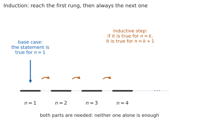
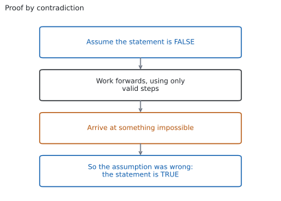

# HL 1.15 — Proof by induction, contradiction and counterexample（数学的帰納法・背理法・反例） {#sec-aahl-1-15}

::: {.callout-note}
## What you should be able to do
- **数学的帰納法**の $2$ つの部分（base case と inductive step）が、それぞれ何を示すものかを言える。
- 和の公式を、帰納法で証明できる。
- 「$\square$ で割り切れる」ことを、帰納法で証明できる。
- **背理法**の形（否定を仮定する → 矛盾を出す → 結論）で証明を書ける。
- **反例**を $1$ つ挙げて、命題が正しくないことを示せる。そのとき、**なぜそれが反例なのかを説明できる**。
:::

## The idea

### 1. Three kinds of proof（証明の $3$ つの型） {#three-kinds}

[SL 1.6](../../aa-sl/01-number-and-algebra/aasl-1-6.qmd#lhs-rhs) では、左辺を変形して右辺にたどり着く **deductive proof** を扱いました。HL では、これに $3$ つの型が加わります。シラバスは、次の $3$ 行だけです。

> Proof by mathematical induction.
>
> Proof by contradiction.
>
> Use of a counterexample to show that a statement is not always true.

**公式集には、この項目の欄がありません。** 覚えるのは式ではなく、**書き方の型**です。

$3$ つは、使いどころがはっきり分かれています。

: $3$ つの型の使いどころ {#tbl-aahl115-kinds}

| 型 | 何を示すか | 合図になる言葉 |
|---|---|---|
| 帰納法（induction） | **すべての正の整数 $n$** で成り立つ | `for all $n \in \mathbb{Z}^{+}$` |
| 背理法（contradiction） | $1$ つの命題が正しい | `prove that`、`show that ... is irrational` |
| 反例（counterexample） | $1$ つの命題が**正しくない** | `is not always true`、`disprove` |

**$3$ 行目だけ、向きが逆です。** 反例は「正しい」ことを示す道具ではなく、**「正しくない」ことを示す道具**です。

### 2. Proof by mathematical induction（数学的帰納法） {#induction}

{#fig-aahl115-idea-a width=100%}

「すべての正の整数 $n$ で成り立つ」ことを示したいとします。$n = 1, 2, 3, \ldots$ と $1$ つずつ確かめても、**いつまでたっても終わりません。**

@fig-aahl115-idea-a が、帰納法の考え方です。はしごについて、次の $2$ つが言えたとします。

- **$1$ 段目にはのぼれる。**
- **どの段にいても、次の段にのぼれる。**

このとき、$1$ 段目から $2$ 段目、$2$ 段目から $3$ 段目、と進めるので、**どの段にもたどり着けます。** 命題についても同じで、次の $2$ つを示せば十分です。

$$
\text{(i) } n = 1 \text{ で成り立つ} \qquad \text{(ii) } n = k \text{ で成り立つなら } n = k+1 \text{ でも成り立つ}
$$ {#eq-aahl115-two-parts}

(i) を **base case**、(ii) を **inductive step** と呼びます。

::: {.callout-important}
## $2$ つの両方が要ります
**片方だけでは証明になりません。**

- base case だけなら、$n = 1$ で成り立つと分かっただけです。
- inductive step だけなら、「$1$ 段目にのぼれれば」という条件付きの話で終わります。**のぼり始める段がありません。**

実際に、inductive step は通るのに base case が成り立たない式が作れます（[演習 10](#exercises)）。**そのときは、どの $n$ でも成り立ちません。**
:::

### 3. How to set out an induction proof（帰納法の書き方） {#induction-writing}

帰納法は、**書き方が採点されます。** 次の $5$ 行を、いつも同じ順で書いてください。

: 帰納法の答案の型 {#tbl-aahl115-layout}

| 行 | 書くこと |
|---|---|
| $1$ | `Let $P(n)$ be the statement ...`（示したい式を $P(n)$ と名づける） |
| $2$ | `When $n = 1$:` 左辺と右辺を別々に計算して、等しいと書く |
| $3$ | `Assume $P(k)$ is true for some $k \in \mathbb{Z}^{+}$`（仮定を式で書く） |
| $4$ | `Then for $n = k+1$:` 仮定を使って、$P(k+1)$ の式を導く |
| $5$ | 結論の $1$ 文（下の型をそのまま使う） |

$5$ 行目は、いつも同じ文です。

::: {.callout-note}
## 結論の $1$ 文（そのまま使えます）

*Since $P(1)$ is true, and $P(k)$ true implies $P(k+1)$ true, by the principle of mathematical induction $P(n)$ is true for all $n \in \mathbb{Z}^{+}$.*
:::

（$P(1)$ が正しく、$P(k)$ が正しければ $P(k+1)$ も正しいので、数学的帰納法により、すべての正の整数 $n$ で $P(n)$ は正しい、という意味です。）

::: {.callout-warning}
## `Assume` を「示す」と書かない
$3$ 行目は**仮定**です。`Assume` か `Suppose` を使ってください。

ここで `Since $P(k)$ is true` と書くと、示したいことを前提にしたことになります。**$P(k)$ が正しいかどうかは、まだ分かっていません。**
:::

### 4. Proving a formula for a sum（和の公式を示す） {#sums}

いちばん出やすい形です。

$$
\sum_{r=1}^{n} r = 1 + 2 + \cdots + n = \frac{n(n+1)}{2}
$$ {#eq-aahl115-sum}

を、帰納法で示します（[SL 1.8](../../aa-sl/01-number-and-algebra/aasl-1-8.qmd#formula) では、等差数列の和として出しました。ここでは別の道で出します）。

**$P(n)$ を、@eq-aahl115-sum の式とします。**

**$n = 1$ のとき。** 左辺は $1$ です。右辺は $\dfrac{1 \times 2}{2} = 1$ です。等しいので、$P(1)$ は正しいです。

**$P(k)$ を正しいと仮定します。** つまり

$$
\sum_{r=1}^{k} r = \frac{k(k+1)}{2}
$$

とします。**$n = k+1$ のときを見ます。** 和は、$k$ までの和に $k+1$ を足したものです。

$$
\sum_{r=1}^{k+1} r = \underbrace{\sum_{r=1}^{k} r}_{\text{仮定が使える}} + (k+1) = \frac{k(k+1)}{2} + (k+1)
$$

**ここが、帰納法の要です。** 仮定を使えるのは、この $1$ か所だけです。あとは式の整理です。$k+1$ でくくります。

$$
\frac{k(k+1)}{2} + (k+1) = (k+1)\left(\frac{k}{2} + 1\right) = \frac{(k+1)(k+2)}{2}
$$

**これは、@eq-aahl115-sum の $n$ に $k+1$ を入れた式そのものです。** $\dfrac{(k+1)\bigl((k+1)+1\bigr)}{2} = \dfrac{(k+1)(k+2)}{2}$ だからです。$P(k+1)$ が示せました。

**目標の形を、先に書いておいてください。** 「何にたどり着けばよいか」が分かっていないと、整理の途中で迷います。

::: {.callout-tip collapse="true"}
## Paper 2 では、電卓で予想を立てられます
TI-Nspire CX II には、和を計算する $\sum$ のテンプレートがあります。`menu` → `Calculus` → `Sum` で

$$
\sum_{r=1}^{5} r = 15
$$

のような値を、いくつも出せます。**式を予想するときには役に立ちます。**

**ただし、これは証明ではありません。** $n = 1$ から $n = 100$ まで合っていても、**すべての $n$ で成り立つ理由にはならない**からです（[SL 1.6](../../aa-sl/01-number-and-algebra/aasl-1-6.qmd#checking)）。

**Paper 1 では使えません。** このページの例題と演習は、すべて手で解けるようにしてあります。
:::

### 5. Proving divisibility（割り切れることを示す） {#divisibility}

もう $1$ つ出やすいのが、「$\square$ で割り切れる」型です。

**$5^{n} - 1$ は、すべての正の整数 $n$ で $4$ で割り切れる**ことを示します。

**$P(n)$ を「$5^{n}-1$ が $4$ の倍数である」とします。**

**$n = 1$ のとき。** $5^{1} - 1 = 4$ で、$4$ の倍数です。

**$P(k)$ を正しいと仮定します。** 「$4$ の倍数である」を式にすると

$$
5^{k} - 1 = 4m \qquad (m \in \mathbb{Z}^{+})
$$ {#eq-aahl115-assume}

です。**文字を $1$ つ置くのが、この型のこつです。** 「割り切れる」のままでは、次の行で使えません。

**$n = k+1$ のときを見ます。** @eq-aahl115-assume から $5^{k} = 4m+1$ なので

$$
5^{k+1} - 1 = 5 \times 5^{k} - 1 = 5(4m+1) - 1 = 20m + 4 = 4(5m+1)
$$

です。$5m+1$ は整数なので、**$5^{k+1}-1$ も $4$ の倍数です。**

$$
\text{割り切れる型は、} \ 4 \times (\text{整数}) \ \text{の形にして終わる}
$$ {#eq-aahl115-divisible-form}

::: {.callout-important}
## $5 \times 5^{k}$ と書き直すところが山です
$5^{k+1}$ を $5 \times 5^{k}$ と書き直さないと、仮定が使えません。**指数法則です**（[SL 1.7a](../../aa-sl/01-number-and-algebra/aasl-1-7a.qmd#negative)）。

$a^{n} - 1$ の型では、いつも **$a \times a^{k}$** に分けてください。
:::

### 6. Proof by contradiction（背理法） {#contradiction}

{#fig-aahl115-idea-b width=100%}

@fig-aahl115-idea-b が、背理法の形です。**示したいことの「逆」を仮定して、矛盾を出します。**

「**いちばん大きい整数は存在しない**」を示します。

**存在すると仮定します。** それを $N$ とします。$N$ は整数で、どの整数よりも大きいか等しいとします。

$N$ が整数なら $N+1$ も整数です。ところが

$$
N + 1 > N
$$

なので、$N$ より大きい整数が見つかりました。**これは「$N$ がいちばん大きい」という仮定に反します。**

**矛盾が出たので、仮定がまちがっていました。** つまり、いちばん大きい整数は存在しません。

::: {.callout-important}
## 矛盾は、「仮定との矛盾」でなくてもかまいません
上では、仮定そのものと矛盾しました。ほかに、**すでに正しいと分かっていること**と矛盾する形もあります。

- $2$ つの整数について「偶数であり、かつ奇数でもある」
- $0$ でない数について $x = 0$
- 「これ以上約分できない分数」なのに、約分できる

**どれでも証明は成り立ちます。** 大事なのは、**あり得ないことにたどり着いた**と、はっきり書くことです。
:::

シラバスは、背理法の例をいくつも挙げています。

> Examples: Irrationality of $\sqrt{3}$; irrationality of the cube root of $5$; Euclid's proof of an infinite number of prime numbers; if $a$ is a rational number and $b$ is an irrational number, then $a + b$ is an irrational number.

**「無理数である」型は、ほとんどが背理法です。** 「無理数である」をそのまま示すのは難しいのに、**「有理数だとすると」と書いた瞬間に $\dfrac{p}{q}$ と置ける**からです。式にできる形になります。

### 7. Counterexamples（反例） {#counterexample}

$3$ つ目は、向きが逆です。**「正しくない」ことを示すには、合わない例を $1$ つ挙げれば済みます。**

シラバスの例を見ます。

> Example: Consider the set $P$ of numbers of the form $n^{2} + 41n + 41$, $n \in \mathbb{N}$, show that not all elements of $P$ are prime.

いくつか計算してみます。

: $n^{2} + 41n + 41$ の値 {#tbl-aahl115-primes}

| $n$ | $0$ | $1$ | $2$ | $3$ | $4$ |
|---|---|---|---|---|---|
| 値 | $41$ | $83$ | $127$ | $173$ | $221$ |
| 素数か | ○ | ○ | ○ | ○ | $221 = 13 \times 17$ |

**$n = 4$ で崩れました。** $221$ は $13 \times 17$ なので、素数ではありません。**これで「すべてが素数」は正しくないと示せました。**

::: {.callout-important}
## 例を挙げるだけでは、点になりません
シラバスは、はっきり書いています。

> It is not sufficient to state the counterexample alone. Students must explain why their example is a counterexample.

**$n = 4$ と書くだけでは足りません。** 次の $3$ つを書いてください。

- その $n$ を**代入した値**（ここでは $221$）
- その値が**条件を満たさない理由**（$221 = 13 \times 17$ なので素数ではない）
- だから**命題は正しくない**、という $1$ 文
:::

**反例は、小さい値から探してください。** $n = 0, 1, 2, \ldots$ と順に入れるのがふつうで、$x$ が実数なら $0$、$1$、$-1$、$\dfrac{1}{2}$ の $4$ つをまず試します。**分数と負の数で崩れる命題が多い**からです。

$$
\text{反例が } 1 \text{ つ見つかれば終わり。見つからなくても、正しい証明にはならない}
$$ {#eq-aahl115-counter}

**逆向きには使えません。** $n = 0$ から $n = 3$ まで素数だったからといって、**すべてが素数だとは言えません。** いま見たとおりです。

## Why it works

::: {.callout-tip collapse="true"}
## クリックすると開きます

#### なぜ、$2$ つ示すだけで「すべての $n$」が言えるのか {#why-induction}

@fig-aahl115-idea-a のはしごは、たとえ話です。**なぜ本当に言えるのか**を、背理法で見ます。

base case と inductive step の $2$ つが示せたのに、**成り立たない $n$ がある**と仮定します。そのような $n$ を集めた集合を $S$ とします。

$S$ は正の整数の集合で、空ではないと仮定したので、**その中にいちばん小さいものがあります。** それを $n_{0}$ とします。

- $n_{0} = 1$ ではありません。base case で $n = 1$ は成り立つと示したからです。
- ですから $n_{0} \geq 2$ で、$n_{0} - 1$ も正の整数です。
- $n_{0}$ は $S$ の最小なので、$n_{0}-1$ は $S$ に入っていません。つまり **$n = n_{0}-1$ では成り立ちます。**
- ところが inductive step から、$n_{0}-1$ で成り立てば $n_{0}$ でも成り立ちます。

**$n_{0}$ は $S$ に入っているのに、成り立つことになりました。** 矛盾です。ですから $S$ は空で、すべての正の整数で成り立ちます。

**「正の整数の空でない集合には、最小のものがある」**ところを使いました。実数ではこれが言えません（$0 < x < 1$ の実数に最小はありません）。**帰納法が整数の話である理由が、ここにあります。**

#### Euclid の証明：素数は無限にある {#why-euclid}

シラバスが挙げている例です。背理法の使い方が、よく分かる形をしています。

**素数が有限個しかないと仮定します。** それを $p_{1}, p_{2}, \ldots, p_{r}$ と、すべて書き並べます。ここで

$$
N = p_{1}p_{2}\cdots p_{r} + 1
$$

という数をつくります。$N$ は $2$ より大きい整数です。

$N$ をどの $p_{i}$ で割っても、**$1$ 余ります。** 積の部分は $p_{i}$ で割り切れるのに、$+1$ が残るからです。

ところが、$2$ 以上のどの整数も、素数の積に分けられます。$N$ を割り切る素数が $1$ つはあるはずですが、**それは $p_{1}, \ldots, p_{r}$ のどれでもありません。**

**「すべての素数を書き並べた」という仮定に反します。** ですから、素数は無限にあります。

#### $n = 1$ 以外から始めることもあります {#why-start}

命題によっては、小さい $n$ で成り立たないことがあります。たとえば $n! > 2^{n}$ は $n = 1, 2, 3$ では成り立たず、**$n = 4$ から成り立ちます**（[演習 5](#exercises)）。

このときは、**base case を $n = 4$ にします。** 結論の $1$ 文も `for all $n \geq 4$` に変えます。はしごの $1$ 段目が $4$ 段目に移るだけで、考え方は同じです。

**問題文が `for $n \geq 4$` と書いていたら、base case は $n = 4$ です。** $n = 1$ で始めると、そこで止まります。

#### 証明と反例の、向きのちがい {#why-asymmetry}

「すべての $n$ で成り立つ」という命題について、$2$ つの向きは**つり合っていません。**

- **正しいと示す**には、すべての $n$ を扱う必要があります。例をいくつ挙げても足りません。
- **正しくないと示す**には、合わない $n$ が $1$ つあれば済みます。

@tbl-aahl115-primes は、$n = 0$ から $3$ まで素数でした。**$4$ つ合っていても、何も証明できていません。** 一方、$n = 4$ の $1$ つだけで、命題は崩れました。

**この非対称が、反例という道具がある理由です。**
:::

## Worked examples

::: {.callout-note appearance="simple"}
問題文は英語です。意味が理解できなかったら、問題文の下の「**日本語訳**」を開いてください。解説は日本語です。

**例題も演習も、すべて電卓なしで解けます。** Paper 1 のつもりで解いてください。
:::

::: {#exm-aahl115-squares}
[Prove by mathematical induction that $\displaystyle\sum_{r=1}^{n} r^{2} = \frac{n(n+1)(2n+1)}{6}$ for all $n \in \mathbb{Z}^{+}$.]{.q-en}

日本語訳

すべての正の整数 $n$ について $\displaystyle\sum_{r=1}^{n} r^{2} = \frac{n(n+1)(2n+1)}{6}$ が成り立つことを、数学的帰納法で証明しなさい。

---

[第 4 節](#sums) の型に当てはめます。

**$n = 1$ のとき。** 左辺は $1^{2} = 1$ です。右辺は $\dfrac{1 \times 2 \times 3}{6} = 1$ です。等しいので成り立ちます。

**$P(k)$ を仮定します。** 両辺に $(k+1)^{2}$ を足します。

$$
\sum_{r=1}^{k+1} r^{2} = \frac{k(k+1)(2k+1)}{6} + (k+1)^{2}
$$

**$k+1$ でくくります。** $\dfrac{1}{6}$ もいっしょに出しておくと、分数が $1$ つで済みます。

$$
= \frac{k+1}{6}\Bigl[k(2k+1) + 6(k+1)\Bigr] = \frac{k+1}{6}\left(2k^{2}+7k+6\right)
$$

$2k^{2}+7k+6$ を因数分解します。$(k+2)(2k+3)$ です。

$$
= \frac{(k+1)(k+2)(2k+3)}{6}
$$

**目標の形と見くらべます。** 公式の $n$ に $k+1$ を入れると

$$
\frac{(k+1)\bigl((k+1)+1\bigr)\bigl(2(k+1)+1\bigr)}{6} = \frac{(k+1)(k+2)(2k+3)}{6}
$$

で、一致しました。$P(k+1)$ が示せました。

**検算。** **$n = 3$ で、両辺を計算します。** 左辺は $1+4+9 = 14$ です。右辺は

$$
\frac{3 \times 4 \times 7}{6} = 14
$$

合いました ✓

**検算（別の $n$ で）。** $n = 4$ では、左辺が $14 + 16 = 30$、右辺が $\dfrac{4 \times 5 \times 9}{6} = 30$ ✓ **$2$ つの $n$ で合えば、式の写しまちがいはまず見つかります。**

::: {.callout-note}
## 解答例（答案用紙に書くこと）

*Let $P(n)$ be the statement $\displaystyle\sum_{r=1}^{n} r^{2} = \frac{n(n+1)(2n+1)}{6}$.*

*When $n = 1$: LHS $= 1$, RHS $= \dfrac{1 \times 2 \times 3}{6} = 1$, so $P(1)$ is true.*

*Assume $P(k)$ is true for some $k \in \mathbb{Z}^{+}$, that is $\displaystyle\sum_{r=1}^{k} r^{2} = \frac{k(k+1)(2k+1)}{6}$.*

*Then*

$$\sum_{r=1}^{k+1} r^{2} = \frac{k(k+1)(2k+1)}{6} + (k+1)^{2} = \frac{k+1}{6}\bigl[k(2k+1)+6(k+1)\bigr]$$

$$= \frac{(k+1)\left(2k^{2}+7k+6\right)}{6} = \frac{(k+1)(k+2)(2k+3)}{6}$$

*which is $P(k+1)$.*

*Since $P(1)$ is true, and $P(k)$ true implies $P(k+1)$ true, by the principle of mathematical induction $P(n)$ is true for all $n \in \mathbb{Z}^{+}$.*
:::
:::

::: {#exm-aahl115-div6}
[Prove by mathematical induction that $7^{n}-1$ is divisible by $6$ for all $n \in \mathbb{Z}^{+}$.]{.q-en}

日本語訳

すべての正の整数 $n$ について、$7^{n}-1$ が $6$ で割り切れることを、数学的帰納法で証明しなさい。

---

[第 5 節](#divisibility) の型です。**まず、仮定を文字の式にします。**

**$n = 1$ のとき。** $7^{1}-1 = 6$ で、$6$ の倍数です。

**$P(k)$ を仮定します。** $7^{k}-1 = 6m$（$m$ は整数）と置きます。ここから $7^{k} = 6m+1$ です。

**$n = k+1$ のときを見ます。** $7^{k+1} = 7 \times 7^{k}$ と分けるのが要です。

$$
7^{k+1} - 1 = 7\left(6m+1\right) - 1 = 42m + 7 - 1 = 42m + 6 = 6(7m+1)
$$

$7m+1$ は整数なので、**$7^{k+1}-1$ は $6$ の倍数です。**

**検算。** **$n = 2$ で確かめます。** $7^{2}-1 = 48$ で、$48 = 6 \times 8$ ✓

**検算（$n = 3$ で）。** $7^{3}-1 = 342$ で、$342 = 6 \times 57$ ✓ **上の式で $m = 8$ とすると $6(7 \times 8 + 1) = 6 \times 57$ となり、同じ値です。**

::: {.callout-note}
## 解答例（答案用紙に書くこと）

*Let $P(n)$ be the statement that $7^{n}-1$ is divisible by $6$.*

*When $n = 1$: $7^{1}-1 = 6 = 6 \times 1$, so $P(1)$ is true.*

*Assume $P(k)$ is true for some $k \in \mathbb{Z}^{+}$, so $7^{k}-1 = 6m$ for some $m \in \mathbb{Z}^{+}$, that is $7^{k} = 6m+1$.*

*Then*

$$7^{k+1}-1 = 7 \times 7^{k} - 1 = 7(6m+1) - 1 = 42m + 6 = 6(7m+1)$$

*and $7m+1 \in \mathbb{Z}^{+}$, so $7^{k+1}-1$ is divisible by $6$, which is $P(k+1)$.*

*Since $P(1)$ is true, and $P(k)$ true implies $P(k+1)$ true, by the principle of mathematical induction $P(n)$ is true for all $n \in \mathbb{Z}^{+}$.*
:::
:::

::: {#exm-aahl115-sumirrational}
[Let $a$ be a rational number and let $b$ be an irrational number. Prove by contradiction that $a+b$ is irrational.]{.q-en}

日本語訳

$a$ を有理数、$b$ を無理数とします。$a+b$ が無理数であることを、背理法で証明しなさい。

---

[第 6 節](#contradiction) の型です。**示したいことの否定から始めます。**

**$a+b$ が有理数だと仮定します。** それを $c$ とします。$a$ も $c$ も有理数なので

$$
a = \frac{p}{q}, \qquad c = \frac{s}{t} \qquad (p,\ q,\ s,\ t \in \mathbb{Z}, \ q \neq 0, \ t \neq 0)
$$

と書けます。$b = c - a$ なので

$$
b = \frac{s}{t} - \frac{p}{q} = \frac{sq - pt}{tq}
$$

です。$sq-pt$ と $tq$ は整数で、$tq \neq 0$ です。**ですから $b$ は有理数です。**

**これは「$b$ は無理数」という前提に反します。** 矛盾が出たので、仮定がまちがっていました。**$a+b$ は無理数です。**

**検算。** **具体例で見ます。** $a = 2$、$b = \sqrt{2}$ とすると $a+b = 2+\sqrt{2}$ です。これが有理数 $c$ なら $\sqrt{2} = c-2$ となり、$\sqrt{2}$ が有理数になってしまいます ✓ **証明と同じ形になっています。**

**検算（差の部分だけ）。** 有理数どうしの差が有理数であることを、数で確かめます。

$$
\frac{3}{4} - \frac{1}{6} = \frac{9-2}{12} = \frac{7}{12}
$$

分数のままです ✓ **$\dfrac{sq-pt}{tq}$ という形が、この計算そのものです。**

::: {.callout-note}
## 解答例（答案用紙に書くこと）

*Assume, for contradiction, that $a+b$ is rational. Write $a+b = c$ with $c$ rational.*

*Since $a$ and $c$ are rational, $a = \dfrac{p}{q}$ and $c = \dfrac{s}{t}$ with $p, q, s, t \in \mathbb{Z}$, $q \neq 0$, $t \neq 0$.*

$$b = c - a = \frac{s}{t} - \frac{p}{q} = \frac{sq - pt}{tq}$$

*Here $sq - pt \in \mathbb{Z}$ and $tq \in \mathbb{Z}$ with $tq \neq 0$, so $b$ is rational.*

*This contradicts the fact that $b$ is irrational. Hence $a+b$ is irrational.*
:::
:::

::: {#exm-aahl115-prime}
[Let $f(n) = n^{2}+n+1$.]{.q-en}

**(a)** [Show that $f(n)$ is prime for $n = 1$, $n = 2$ and $n = 3$.]{.q-en}

**(b)** [Show that the statement "$f(n)$ is prime for all $n \in \mathbb{Z}^{+}$" is not true.]{.q-en}

日本語訳

$f(n) = n^{2}+n+1$ とします。

**(a)** $n = 1$、$n = 2$、$n = 3$ のとき $f(n)$ が素数であることを示しなさい。

**(b)** 「すべての正の整数 $n$ について $f(n)$ は素数である」という命題が正しくないことを示しなさい。

---

**(a)** 順に代入します。

$$
f(1) = 3, \qquad f(2) = 7, \qquad f(3) = 13
$$

$3$、$7$、$13$ はどれも素数です。

**(b)** [第 7 節](#counterexample) のとおり、**反例を $1$ つ挙げます。** (a) の次を試します。

$$
f(4) = 16+4+1 = 21 = 3 \times 7
$$

**$21$ は $3$ と $7$ で割り切れるので、素数ではありません。** ですから、命題は正しくありません。

::: {.model-answer}
**試験ではこう書く**

*Take $n = 4$. Then $f(4) = 4^{2}+4+1 = 21$, and $21 = 3 \times 7$, so $21$ has a factor other than $1$ and itself and is therefore not prime. Since $4 \in \mathbb{Z}^{+}$ and $f(4)$ is not prime, the statement "$f(n)$ is prime for all $n \in \mathbb{Z}^{+}$" is false.*
:::

（$n = 4$ をとる。$f(4) = 21 = 3 \times 7$ なので素数ではない。$4$ は正の整数なので、命題は正しくない、という意味です。）

**検算。** **代入をやり直します。** $4^{2} = 16$、$16+4 = 20$、$20+1 = 21$ ✓

**検算（因数のほう）。** $3 \times 7 = 21$ ✓ **値と因数の両方を確かめてください。** どちらかがまちがっていると、反例になりません。

**(a) で $3$ つ素数だったことは、(b) の答えを何も否定しません。** いくつ合っていても、$1$ つ外れれば命題は崩れます。

::: {.callout-note}
## 解答例（答案用紙に書くこと）

**(a)** *$f(1) = 3$, $f(2) = 7$, $f(3) = 13$, and $3$, $7$, $13$ are all prime.*

**(b)** *Take $n = 4$. Then $f(4) = 21 = 3 \times 7$, which is not prime. Hence the statement is not true.*
:::
:::

## Common errors

::: {.callout-warning}
## base case を書かない
inductive step だけを書いて、「よって成り立つ」と結ぶ答案がよくあります。**$2$ つの両方が要ります**（[第 2 節](#induction)）。

base case がないと、はしごの $1$ 段目がありません。**$n = 1$ の左辺と右辺を、別々に計算して書いてください。**
:::

::: {.callout-warning}
## 仮定を使わずに、$k+1$ の式を公式で書く
$\displaystyle\sum_{r=1}^{k+1} r = \frac{(k+1)(k+2)}{2}$ といきなり書くと、**示したいことを使って示したことになります。**

$k+1$ までの和は、**$k$ までの和に $k+1$ を足したもの**として書いてください（[第 4 節](#sums)）。仮定を使う場所は、そこだけです。
:::

::: {.callout-warning}
## 「割り切れる」のまま、次の行へ進む
$5^{k}-1$ が $4$ の倍数、と書いただけでは、次の式で使えません。**$5^{k}-1 = 4m$ と、文字を置いてください**（[第 5 節](#divisibility)）。

置いた文字が整数であることも、最後に $4(5m+1)$ の形にしたあとで、**$5m+1$ は整数**と書き添えます。
:::

::: {.callout-warning}
## 結論の $1$ 文を書かない
$P(k+1)$ が出たところで止めると、**「すべての $n$ で成り立つ」と言い切っていません。**

[第 3 節](#induction-writing) の $1$ 文を、そのまま書いてください。**毎回同じ文でかまいません。**
:::

::: {.callout-warning}
## 背理法で、何を仮定したかを書かない
`Assume, for contradiction, that ...` にあたる $1$ 文がないと、読む人には**ふつうの計算**に見えます。

**最初の $1$ 行と、矛盾が出たと書く $1$ 行**の $2$ つが、背理法の骨です（[第 6 節](#contradiction)）。どちらも省かないでください。
:::

::: {.callout-warning}
## 反例を挙げるだけで終える
`It is not sufficient to state the counterexample alone.` とシラバスに書かれています（[第 7 節](#counterexample)）。

代入した**値**と、それが条件を満たさない**理由**と、だから命題は正しくないという**$1$ 文**の $3$ つを書いてください。
:::

## Exercises

::: {.callout-note appearance="simple"}
各問題に、折りたたみが $3$ つ付いています。**日本語訳**、**解答例**（答案用紙に書くべきこと。英語です）、**解説**（なぜそうなるか。日本語です）。

まず自分で解いて、次に解答例と見くらべてください。**解説は、合わなかったときだけ開けば十分です。**
:::

::: {.exercise-block}

[1]{.ex-no} [Prove by mathematical induction that $\displaystyle\sum_{r=1}^{n} (2r-1) = n^{2}$ for all $n \in \mathbb{Z}^{+}$.]{.q-en}

日本語訳

すべての正の整数 $n$ について $\displaystyle\sum_{r=1}^{n} (2r-1) = n^{2}$ が成り立つことを、数学的帰納法で証明しなさい。

::: {.callout-note collapse="true"}
## 解答例（答案用紙に書くこと）

*Let $P(n)$ be the statement $\displaystyle\sum_{r=1}^{n}(2r-1) = n^{2}$.*

*When $n = 1$: LHS $= 1$, RHS $= 1^{2} = 1$, so $P(1)$ is true.*

*Assume $P(k)$ is true for some $k \in \mathbb{Z}^{+}$, that is $\displaystyle\sum_{r=1}^{k}(2r-1) = k^{2}$.*

$$\sum_{r=1}^{k+1}(2r-1) = k^{2} + \bigl(2(k+1)-1\bigr) = k^{2} + 2k + 1 = (k+1)^{2}$$

*which is $P(k+1)$.*

*Since $P(1)$ is true, and $P(k)$ true implies $P(k+1)$ true, by the principle of mathematical induction $P(n)$ is true for all $n \in \mathbb{Z}^{+}$.*
:::

::: {.callout-tip collapse="true"}
## 解説

足す項は $2r-1$ なので、$r = k+1$ では $2(k+1)-1 = 2k+1$ です。**$r$ に $k+1$ を入れるところを、ていねいに書いてください。**

$k^{2}+2k+1$ が $(k+1)^{2}$ になるのは、$2$ 乗の展開そのものです。

**検算。** $n = 4$ で確かめます。左辺は $1+3+5+7 = 16$、右辺は $4^{2} = 16$ ✓

**検算（$n = 5$ で）。** 左辺は $16+9 = 25$、右辺は $25$ ✓ **奇数を足していくと平方数になる、という形です。**
:::

::: {.ex-sep}
:::

[2]{.ex-no} [Prove by mathematical induction that $\displaystyle\sum_{r=1}^{n} r(r+1) = \frac{n(n+1)(n+2)}{3}$ for all $n \in \mathbb{Z}^{+}$.]{.q-en}

日本語訳

すべての正の整数 $n$ について $\displaystyle\sum_{r=1}^{n} r(r+1) = \frac{n(n+1)(n+2)}{3}$ が成り立つことを、数学的帰納法で証明しなさい。

::: {.callout-note collapse="true"}
## 解答例（答案用紙に書くこと）

*Let $P(n)$ be the statement $\displaystyle\sum_{r=1}^{n} r(r+1) = \frac{n(n+1)(n+2)}{3}$.*

*When $n = 1$: LHS $= 1 \times 2 = 2$, RHS $= \dfrac{1 \times 2 \times 3}{3} = 2$, so $P(1)$ is true.*

*Assume $P(k)$ is true for some $k \in \mathbb{Z}^{+}$.*

$$\sum_{r=1}^{k+1} r(r+1) = \frac{k(k+1)(k+2)}{3} + (k+1)(k+2) = (k+1)(k+2)\left(\frac{k}{3}+1\right)$$

$$= \frac{(k+1)(k+2)(k+3)}{3}$$

*which is $P(k+1)$.*

*Since $P(1)$ is true, and $P(k)$ true implies $P(k+1)$ true, by the principle of mathematical induction $P(n)$ is true for all $n \in \mathbb{Z}^{+}$.*
:::

::: {.callout-tip collapse="true"}
## 解説

足す項は $r(r+1)$ なので、$r = k+1$ では $(k+1)(k+2)$ です。**$2$ つの項に共通の $(k+1)(k+2)$ でくくる**のが、いちばん短い道です。

$\dfrac{k}{3}+1 = \dfrac{k+3}{3}$ です。

**検算。** $n = 3$ で確かめます。左辺は $2+6+12 = 20$、右辺は $\dfrac{3 \times 4 \times 5}{3} = 20$ ✓

**検算（$n = 4$ で）。** 左辺は $20 + 4 \times 5 = 40$、右辺は $\dfrac{4 \times 5 \times 6}{3} = 40$ ✓
:::

::: {.ex-sep}
:::

[3]{.ex-no} [Prove by mathematical induction that $8^{n}-1$ is divisible by $7$ for all $n \in \mathbb{Z}^{+}$.]{.q-en}

日本語訳

すべての正の整数 $n$ について、$8^{n}-1$ が $7$ で割り切れることを、数学的帰納法で証明しなさい。

::: {.callout-note collapse="true"}
## 解答例（答案用紙に書くこと）

*Let $P(n)$ be the statement that $8^{n}-1$ is divisible by $7$.*

*When $n = 1$: $8^{1}-1 = 7 = 7 \times 1$, so $P(1)$ is true.*

*Assume $P(k)$ is true, so $8^{k}-1 = 7m$ for some $m \in \mathbb{Z}^{+}$, that is $8^{k} = 7m+1$.*

$$8^{k+1}-1 = 8 \times 8^{k} - 1 = 8(7m+1) - 1 = 56m + 7 = 7(8m+1)$$

*and $8m+1 \in \mathbb{Z}^{+}$, so $P(k+1)$ is true.*

*Since $P(1)$ is true, and $P(k)$ true implies $P(k+1)$ true, by the principle of mathematical induction $P(n)$ is true for all $n \in \mathbb{Z}^{+}$.*
:::

::: {.callout-tip collapse="true"}
## 解説

[第 5 節](#divisibility) と同じ形です。**$8^{k+1} = 8 \times 8^{k}$** と分けてから、仮定を入れます。

**検算。** $n = 2$ で確かめます。$8^{2}-1 = 63$ で、$63 = 7 \times 9$ ✓

**検算（$n = 3$ で）。** $8^{3}-1 = 511$ で、$511 = 7 \times 73$ ✓ **上の式で $m = 9$ とすると $7(8 \times 9 + 1) = 7 \times 73$ で、同じ値です。**
:::

::: {.ex-sep}
:::

[4]{.ex-no} [Prove by mathematical induction that $3^{2n}-1$ is divisible by $8$ for all $n \in \mathbb{Z}^{+}$.]{.q-en}

日本語訳

すべての正の整数 $n$ について、$3^{2n}-1$ が $8$ で割り切れることを、数学的帰納法で証明しなさい。

::: {.callout-note collapse="true"}
## 解答例（答案用紙に書くこと）

*Let $P(n)$ be the statement that $3^{2n}-1$ is divisible by $8$.*

*When $n = 1$: $3^{2}-1 = 8 = 8 \times 1$, so $P(1)$ is true.*

*Assume $P(k)$ is true, so $3^{2k}-1 = 8m$ for some $m \in \mathbb{Z}^{+}$, that is $3^{2k} = 8m+1$.*

$$3^{2(k+1)}-1 = 3^{2k+2}-1 = 9 \times 3^{2k} - 1 = 9(8m+1) - 1 = 72m + 8 = 8(9m+1)$$

*and $9m+1 \in \mathbb{Z}^{+}$, so $P(k+1)$ is true.*

*Since $P(1)$ is true, and $P(k)$ true implies $P(k+1)$ true, by the principle of mathematical induction $P(n)$ is true for all $n \in \mathbb{Z}^{+}$.*
:::

::: {.callout-tip collapse="true"}
## 解説

**指数が $2n$ になっているところが、この問題の山です。** $n$ を $k+1$ にすると指数は $2k+2$ で、$3^{2k+2} = 3^{2} \times 3^{2k} = 9 \times 3^{2k}$ です。

**$3 \times 3^{2k}$ ではありません。** 指数が $2$ ずつ増えるので、かける数は $9$ です。

**検算。** $n = 2$ で確かめます。$3^{4}-1 = 80$ で、$80 = 8 \times 10$ ✓

**検算（$n = 3$ で）。** $3^{6}-1 = 728$ で、$728 = 8 \times 91$ ✓
:::

::: {.ex-sep}
:::

[5]{.ex-no} [Prove by mathematical induction that $n! > 2^{n}$ for all integers $n \geq 4$.]{.q-en}

日本語訳

$4$ 以上のすべての整数 $n$ について $n! > 2^{n}$ が成り立つことを、数学的帰納法で証明しなさい。

::: {.callout-note collapse="true"}
## 解答例（答案用紙に書くこと）

*Let $P(n)$ be the statement $n! > 2^{n}$.*

*When $n = 4$: LHS $= 24$, RHS $= 16$, and $24 > 16$, so $P(4)$ is true.*

*Assume $P(k)$ is true for some integer $k \geq 4$, that is $k! > 2^{k}$.*

$$(k+1)! = (k+1) \times k! > (k+1) \times 2^{k}$$

*Since $k \geq 4$, $k+1 \geq 5 > 2$, so*

$$(k+1) \times 2^{k} > 2 \times 2^{k} = 2^{k+1}$$

*Hence $(k+1)! > 2^{k+1}$, which is $P(k+1)$.*

*Since $P(4)$ is true, and $P(k)$ true implies $P(k+1)$ true, by the principle of mathematical induction $P(n)$ is true for all integers $n \geq 4$.*
:::

::: {.callout-tip collapse="true"}
## 解説

**base case が $n = 1$ ではありません**（[Why it works](#why-start)）。問題文が `for all integers $n \geq 4$` なので、$n = 4$ から始めます。

不等式の帰納法では、**仮定を使って $1$ 回大きくし、そのあともう $1$ 回大きくする**のがふつうの形です。ここでは $(k+1) > 2$ を使いました。

**検算。** $n = 5$ で確かめます。$5! = 120$、$2^{5} = 32$ で、$120 > 32$ ✓

**検算（$n = 3$ で）。** $3! = 6$、$2^{3} = 8$ で、$6 < 8$ です。**成り立ちません** ✓ だから base case が $n = 4$ なのだと分かります。
:::

::: {.ex-sep}
:::

[6]{.ex-no} [Prove by contradiction that $\sqrt{2}$ is irrational.]{.q-en}

日本語訳

$\sqrt{2}$ が無理数であることを、背理法で証明しなさい。

::: {.callout-note collapse="true"}
## 解答例（答案用紙に書くこと）

*Assume, for contradiction, that $\sqrt{2}$ is rational. Then $\sqrt{2} = \dfrac{p}{q}$ where $p, q \in \mathbb{Z}$, $q \neq 0$, and $p$ and $q$ have no common factor.*

$$p^{2} = 2q^{2}$$

*so $p^{2}$ is even. If $p$ were odd, say $p = 2t+1$, then $p^{2} = 4t^{2}+4t+1$ would be odd, so $p$ must be even. Write $p = 2s$ with $s \in \mathbb{Z}$.*

$$4s^{2} = 2q^{2}, \qquad \text{so} \qquad q^{2} = 2s^{2}$$

*By the same argument $q$ is even. Then $p$ and $q$ are both even, so they share the factor $2$, which contradicts the assumption that they have no common factor. Hence $\sqrt{2}$ is irrational.*
:::

::: {.callout-tip collapse="true"}
## 解説

**「これ以上約分できない分数」と置くところが要です。** そう置いたのに $2$ で約分できてしまう、という矛盾に持ち込みます。

**「$p^{2}$ が偶数なら $p$ も偶数」は、書いてください。** ここを飛ばすと、証明の穴になります。奇数を $2$ 乗すると奇数になる、という $1$ 行で済みます。

**検算。** 奇数の $2$ 乗を見ます。$3^{2} = 9$、$5^{2} = 25$、$7^{2} = 49$ で、どれも奇数です ✓ $(2t+1)^{2} = 4t^{2}+4t+1$ の形どおりです。

**検算（式のほう）。** $\sqrt{2} = \dfrac{p}{q}$ の両辺を $2$ 乗すると $2 = \dfrac{p^{2}}{q^{2}}$ で、$q^{2}$ を掛けて $p^{2} = 2q^{2}$ ✓
:::

::: {.ex-sep}
:::

[7]{.ex-no} [Prove by contradiction that there is no smallest positive rational number.]{.q-en}

日本語訳

いちばん小さい正の有理数は存在しないことを、背理法で証明しなさい。

::: {.callout-note collapse="true"}
## 解答例（答案用紙に書くこと）

*Assume, for contradiction, that there is a smallest positive rational number, and call it $r$.*

*Since $r$ is rational, $r = \dfrac{p}{q}$ with $p, q \in \mathbb{Z}^{+}$, and so $\dfrac{r}{2} = \dfrac{p}{2q}$ is also rational.*

*Also $r > 0$, so $0 < \dfrac{r}{2} < r$.*

*This gives a positive rational number smaller than $r$, which contradicts the assumption that $r$ is the smallest. Hence there is no smallest positive rational number.*
:::

::: {.callout-tip collapse="true"}
## 解説

**$\dfrac{r}{2}$ が有理数であることを、書いてください。** $\dfrac{p}{2q}$ の形になるので、分母も分子も整数です。これがないと、「もっと小さい数」が有理数だと言えていません。

**$\dfrac{r}{2} < r$ には $r > 0$ が要ります。** 負の数なら向きが逆になるからです。問題文の `positive` を使うところです。

**検算。** $r = \dfrac{1}{100}$ としてみます。$\dfrac{r}{2} = \dfrac{1}{200}$ で、正の有理数であり、$\dfrac{1}{100}$ より小さいです ✓

**検算（整数だと成り立たないことを見る）。** いちばん小さい正の整数は $1$ で、**こちらは存在します。** $\dfrac{1}{2}$ が整数でないからです ✓ **有理数だから言えた**ことが分かります。
:::

::: {.ex-sep}
:::

[8]{.ex-no} [Show that the statement "$x^{2} > x$ for all real numbers $x$" is not always true.]{.q-en}

日本語訳

「すべての実数 $x$ について $x^{2} > x$」という命題が、いつも正しいわけではないことを示しなさい。

::: {.callout-note collapse="true"}
## 解答例（答案用紙に書くこと）

*Take $x = \dfrac{1}{2}$. Then $x^{2} = \dfrac{1}{4}$ and $\dfrac{1}{4} < \dfrac{1}{2}$, so $x^{2} > x$ is false for this value of $x$. Since $\dfrac{1}{2}$ is a real number, the statement is not true for all real $x$.*
:::

::: {.callout-tip collapse="true"}
## 解説

**$0$ と $1$ のあいだの数を試すのが、こつです**（[第 7 節](#counterexample)）。$2$ 乗すると小さくなる範囲だからです。

**検算。** $\left(\dfrac{1}{2}\right)^{2} = \dfrac{1}{4}$ ✓ $\dfrac{1}{4} < \dfrac{1}{2}$ ✓

**検算（別の反例で）。** $x = 1$ では $x^{2} = 1$ で、$1 > 1$ は成り立ちません ✓ **等号のときも反例です。** $x = 0$ も同じです。

**理由を書かないと、点になりません。** シラバスの `Students must explain why their example is a counterexample.` が、ここに効きます。

::: {.model-answer}
**試験ではこう書く**

*The statement claims that $x^{2} > x$ holds for every real number $x$. Take $x = \dfrac{1}{2}$, which is a real number. Then $x^{2} = \dfrac{1}{4}$, and $\dfrac{1}{4} < \dfrac{1}{2}$, so for this value $x^{2} > x$ is false. A single real value for which the inequality fails is enough to show that the statement does not hold for all real $x$, so the statement is not always true.*
:::
:::

::: {.ex-sep}
:::

[9]{.ex-no} [Show that the following statement is not always true: there are no positive integer solutions to the equation $x^{2}+y^{2} = 10$.]{.q-en}

日本語訳

「$x^{2}+y^{2} = 10$ に正の整数の解はない」という命題が、いつも正しいわけではないことを示しなさい。

::: {.callout-note collapse="true"}
## 解答例（答案用紙に書くこと）

*Take $x = 1$ and $y = 3$. Both are positive integers, and*

$$1^{2}+3^{2} = 1+9 = 10$$

*so this is a positive integer solution of the equation. The statement claims that no such solution exists, so the statement is not true.*
:::

::: {.callout-tip collapse="true"}
## 解説

**反例は「解の組」です。** $x$ だけでは足りません。$x$ と $y$ の両方を挙げてください。

$x = 1$ から順に試すと早いです。$x = 1$ なら $y^{2} = 9$ で $y = 3$、**どちらも正の整数**です。

**検算。** $1^{2}+3^{2} = 1+9 = 10$ ✓

**検算（もう $1$ 組）。** $x = 3$、$y = 1$ でも $9+1 = 10$ ✓ **反例は $1$ 組あれば十分ですが、$2$ 組目で写しまちがいが見つかります。**

::: {.model-answer}
**試験ではこう書く**

*The statement claims that the equation $x^{2}+y^{2} = 10$ has no solution with $x$ and $y$ both positive integers. Take $x = 1$ and $y = 3$. Both are positive integers, and $1^{2}+3^{2} = 1+9 = 10$, so this pair does satisfy the equation. Exhibiting one positive integer solution is enough to show that the claim "there are no positive integer solutions" is false, so the statement is not true.*
:::
:::

::: {.ex-sep}
:::

[10]{.ex-no} [A student writes the following.]{.q-en}

> [*Assume $\displaystyle\sum_{r=1}^{k} r = \frac{k^{2}+k+2}{2}$. Then*]{.q-en}
>
> $$\sum_{r=1}^{k+1} r = \frac{k^{2}+k+2}{2} + (k+1) = \frac{k^{2}+3k+4}{2} = \frac{(k+1)^{2}+(k+1)+2}{2}$$
>
> [*which is the statement for $n = k+1$. Hence $\displaystyle\sum_{r=1}^{n} r = \frac{n^{2}+n+2}{2}$ for all $n \in \mathbb{Z}^{+}$.*]{.q-en}

[Explain why this is not a valid proof.]{.q-en}

日本語訳

ある生徒が、次のように書きました。

> $\displaystyle\sum_{r=1}^{k} r = \frac{k^{2}+k+2}{2}$ と仮定する。すると
>
> $$\sum_{r=1}^{k+1} r = \frac{k^{2}+k+2}{2} + (k+1) = \frac{k^{2}+3k+4}{2} = \frac{(k+1)^{2}+(k+1)+2}{2}$$
>
> となり、これは $n = k+1$ のときの式である。よって、すべての正の整数 $n$ について $\displaystyle\sum_{r=1}^{n} r = \frac{n^{2}+n+2}{2}$ である。

これが証明になっていない理由を説明しなさい。

::: {.callout-note collapse="true"}
## 解答例（答案用紙に書くこと）

*The inductive step is correct, but there is no base case. When $n = 1$ the left-hand side is $1$, while the right-hand side is $\dfrac{1+1+2}{2} = 2$, so the statement is false for $n = 1$.*

*Both parts are needed, so the argument does not prove the statement. In fact the statement is false for every $n$, since the correct sum is $\dfrac{n(n+1)}{2}$ and $\dfrac{n^{2}+n+2}{2} - \dfrac{n(n+1)}{2} = 1$ for all $n$.*
:::

::: {.callout-tip collapse="true"}
## 解説

**inductive step の計算そのものは、正しいです。** $\dfrac{k^{2}+k+2}{2} + (k+1) = \dfrac{k^{2}+k+2+2k+2}{2} = \dfrac{k^{2}+3k+4}{2}$ で、これは $n$ に $k+1$ を入れた式と一致します。

**足りないのは base case です**（[第 2 節](#induction)）。$n = 1$ で成り立たないので、はしごの $1$ 段目がありません。

**検算。** $n = 1$ で両辺を計算します。左辺は $1$、右辺は $\dfrac{1+1+2}{2} = 2$ です。合いません ✓

**検算（$n = 3$ で）。** 左辺は $1+2+3 = 6$、右辺は $\dfrac{9+3+2}{2} = 7$ です ✓ **いつも $1$ だけ大きい**ことが見えます。

::: {.model-answer}
**試験ではこう書く**

*The student has verified only the inductive step: the algebra showing that the statement for $n = k$ implies the statement for $n = k+1$ is correct. However, no base case has been established, and a proof by induction needs both parts. Here the base case in fact fails: when $n = 1$ the left-hand side is $1$ but the right-hand side is $\dfrac{1^{2}+1+2}{2} = 2$. So there is no value from which the chain of implications can start, and the argument proves nothing. The statement itself is false for every $n \in \mathbb{Z}^{+}$, because the correct sum is $\dfrac{n(n+1)}{2}$, which is exactly $1$ less than $\dfrac{n^{2}+n+2}{2}$.*
:::
:::

:::
