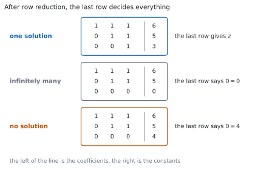
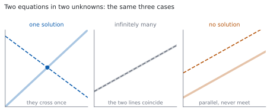

# HL 1.16 — Systems of linear equations（連立 $1$ 次方程式） {#sec-aahl-1-16}

::: {.callout-note}
## What you should be able to do
- $3$ つの文字の連立 $1$ 次方程式を、**row reduction** で解ける。
- 解が **$1$ つに決まる場合・無数にある場合・ない場合**の $3$ つがあることを知っている。
- 解が無数にあるとき、**general solution** を文字を使って書ける。
- 解がないとき、**inconsistent** であると書ける。
- 文字を含む係数について、どの場合になるかを調べられる。
:::

## The idea

### 1. Systems of linear equations and their solutions（連立 $1$ 次方程式とその解） {#idea}

シラバスは、次のように書いています。

> Solutions of systems of linear equations (a maximum of three equations in three unknowns), including cases where there is a unique solution, an infinite number of solutions or no solution.

**最大で「$3$ つの式・$3$ つの文字」です。** それ以上は出ません。

$$
\begin{aligned}
x + y + z &= 6 \\
2x - y + z &= 3 \\
x + 2y - z &= 2
\end{aligned}
$$ {#eq-aahl116-system}

**解とは、$3$ つの式を同時に満たす $(x,\ y,\ z)$ の組**です。$1$ つの式だけを満たしても、解ではありません。

書くときは、**係数と定数だけを取り出した表**にすると速くなります。これを **augmented matrix** と呼びます。

$$
\begin{array}{ccc|c}
1 & 1 & 1 & 6 \\
2 & -1 & 1 & 3 \\
1 & 2 & -1 & 2
\end{array}
$$

**縦線の左が係数、右が定数**です。$x$、$y$、$z$ を書かずに済むので、計算が短くなります。

::: {.callout-important}
## 公式集には、この項目の欄がありません
覚える式はありません。**手順**を覚えます。

なお、この本では行列そのものは扱いません。上の表は、**式を短く書くための道具**です。
:::

### 2. Row reduction: the three operations（row reduction：$3$ つの操作） {#operations}

シラバスは、解き方についても書いています。

> These systems should be solved using both algebraic and technological methods, for example row reduction or matrices.

**row reduction** は、次の $3$ つの操作だけを使って、式を簡単にしていく方法です。

: 使ってよい $3$ つの操作 {#tbl-aahl116-ops}

| 操作 | 書き方 | 例 |
|---|---|---|
| $2$ つの式を入れかえる | $R_{1} \leftrightarrow R_{2}$ | $1$ 行目と $2$ 行目を交換 |
| $1$ つの式を $0$ でない数倍する | $R_{2} \to 3R_{2}$ | $2$ 行目を $3$ 倍 |
| $1$ つの式に、別の式の何倍かを足す | $R_{2} \to R_{2} - 2R_{1}$ | $2$ 行目から $1$ 行目の $2$ 倍を引く |

**この $3$ つは、解を変えません。** どれも「両辺に同じことをする」か「同じ式を並べかえる」だけだからです（[Why it works](#why-it-works)）。

**目標は、左下を $0$ にしていくことです。** $3$ つ目の式から $x$ と $y$ を消せば、$z$ だけの式になります。

::: {.callout-warning}
## $0$ 倍はできません
$R_{2} \to 0 \times R_{2}$ とすると、式が $1$ つ消えてしまいます。**情報が減るので、解が変わります。**

$2$ 番目の操作は、**$0$ でない数**に限ります。
:::

### 3. A unique solution（解が $1$ つに決まる場合） {#unique}

@eq-aahl116-system を解きます。$1$ 行目を使って、下の $2$ 行から $x$ を消します。

$$
R_{2} \to R_{2} - 2R_{1}: \qquad -3y - z = -9
$$

$$
R_{3} \to R_{3} - R_{1}: \qquad y - 2z = -4
$$

$1$ 行目の $-3y-z = -9$ は、両辺に $-1$ を掛けて $3y+z = 9$ としておきます。残ったのは $2$ 文字の連立方程式です。

$$
\begin{aligned}
3y + z &= 9 \\
y - 2z &= -4
\end{aligned}
$$

下の式から $y = 2z - 4$ です。上に入れます。

$$
3(2z-4) + z = 9 \ \Rightarrow \ 7z - 12 = 9 \ \Rightarrow \ z = 3
$$

**$z$ が決まったら、上へ戻ります。** これを **back substitution** と呼びます。

$$
y = 2(3) - 4 = 2, \qquad x = 6 - y - z = 6 - 2 - 3 = 1
$$

**解は $(x,\ y,\ z) = (1,\ 2,\ 3)$ の $1$ 組だけです。**

::: {.callout-tip}
## 検算は、$3$ つの式すべてに入れます
$2$ つの式だけで確かめると、$3$ つ目を使いまちがえていても気づきません。

$1+2+3 = 6$、$2-2+3 = 3$、$1+4-3 = 2$。**$3$ つとも合いました。**
:::

### 4. Infinitely many solutions: the general solution（解が無数にある場合） {#infinite}

次の連立方程式を見ます。

$$
\begin{aligned}
x + y + z &= 6 \\
x + 2y + 3z &= 14 \\
2x + 3y + 4z &= 20
\end{aligned}
$$ {#eq-aahl116-infinite}

同じように $x$ を消します。

$$
R_{2} \to R_{2} - R_{1}: \qquad y + 2z = 8
$$

$$
R_{3} \to R_{3} - 2R_{1}: \qquad y + 2z = 8
$$

**$2$ つが同じ式になりました。** $3$ 行目から $2$ 行目を引くと

$$
R_{3} \to R_{3} - R_{2}: \qquad 0 = 0
$$

です。**これは「いつでも正しい」式で、何も決めません。** 式が実質 $2$ つしかないのに、文字は $3$ つあります。

**このときは、$1$ つの文字を自由に決めます。** $z = \lambda$ と置きます（$\lambda$ はギリシャ文字のラムダで、どんな実数でもよい、という意味です）。

$$
y = 8 - 2\lambda, \qquad x = 6 - y - z = 6 - (8-2\lambda) - \lambda = -2 + \lambda
$$

$$
(x,\ y,\ z) = (-2+\lambda,\ 8-2\lambda,\ \lambda), \qquad \lambda \in \mathbb{R}
$$ {#eq-aahl116-general}

これを **general solution** と呼びます。シラバスにも書かれています。

> Finding a general solution for a system with an infinite number of solutions.

**$\lambda$ に数を入れるたびに、解が $1$ つ出ます。** $\lambda = 0$ なら $(-2,\ 8,\ 0)$、$\lambda = 3$ なら $(1,\ 2,\ 3)$ です。どちらも $3$ つの式を満たします。

::: {.callout-important}
## 「$z$ は何でもよい」だけでは足りません
答案には、**$x$ と $y$ を $\lambda$ で表した式**まで書いてください。

$\lambda$ の代わりに $t$ や $s$ を使ってもかまいませんが、**$1$ 文字を新しく置いた**ことが分かるように書きます。
:::

### 5. No solution: inconsistent systems（解がない場合） {#inconsistent}

@eq-aahl116-infinite の $3$ 行目の右辺だけを、$21$ に変えます。

$$
\begin{aligned}
x + y + z &= 6 \\
x + 2y + 3z &= 14 \\
2x + 3y + 4z &= 21
\end{aligned}
$$

同じ操作をします。

$$
R_{2} \to R_{2} - R_{1}: \qquad y + 2z = 8
$$

$$
R_{3} \to R_{3} - 2R_{1}: \qquad y + 2z = 9
$$

$$
R_{3} \to R_{3} - R_{2}: \qquad 0 = 1
$$

**$0 = 1$ は、あり得ません。** ですから、$3$ つの式を同時に満たす $(x,\ y,\ z)$ はありません。

シラバスは、この場合の呼び名を決めています。

> Systems which have no solution(s) are inconsistent.

**答案には `The system is inconsistent, so there is no solution.` と書きます。** 「解なし」で止めず、**どの行から $0 = 1$ が出たか**も書いてください。

### 6. Telling the three cases apart（$3$ つの場合の見分け方） {#classify}

{#fig-aahl116-idea-a width=100%}

@fig-aahl116-idea-a のとおり、**いちばん下の行が $3$ つの場合を決めます。**

: いちばん下の行の読み方 {#tbl-aahl116-classify}

| 下の行 | 場合 | 答案に書くこと |
|---|---|---|
| $az = b$（$a \neq 0$） | 解は $1$ つ | $z$ を出して back substitution |
| $0 = 0$ | 解は無数 | $z = \lambda$ と置いて general solution |
| $0 = b$（$b \neq 0$） | 解なし | `inconsistent` と書く |

**$0 = 0$ と $0 = b$ を取りちがえないでください。** 右辺が $0$ かどうかだけのちがいですが、**答えは正反対**です。

::: {.callout-tip collapse="true"}
## Paper 2 では、電卓で解けます
TI-Nspire CX II には、連立 $1$ 次方程式を解く機能があります。

`menu` → `Algebra` → `Solve System of Linear Equations` を選ぶと、式の個数と文字の個数をきかれます。$3$ と $3$ を入れて、係数を入力します。

**解が $1$ つに決まる場合は、これで答えが出ます。** 検算にも使えます。

**解が無数にある場合と、解がない場合は、画面の出方がちがいます。** 電卓の出力をそのまま写しても general solution の形になっていないことがあるので、**その $2$ つは手で row reduction してください。**

**Paper 1 では使えません。** このページの例題と演習は、すべて手で解けるようにしてあります。
:::

### 7. A picture in two variables（$2$ 変数の図で見る） {#picture}

{#fig-aahl116-idea-b width=100%}

$3$ 変数の図はかきにくいので、**$2$ 変数で見ます。** $1$ つの $1$ 次方程式は、$1$ 本の直線です（[SL 2.1](../../aa-sl/02-functions/aasl-2-1.qmd)）。

@fig-aahl116-idea-b のように、$2$ 本の直線には $3$ つの場合があります。

- **$1$ 点で交わる** → 解が $1$ つ
- **重なっている** → 解が無数（直線上のすべての点）
- **平行で交わらない** → 解なし

**$3$ 変数でも同じです。** $1$ つの $1$ 次方程式は平面を表し、$3$ つの平面が $1$ 点で交わるか、直線や平面を共有するか、まったく共有しないかに分かれます。シラバスも、そのつながりを書いています。

> Link to: intersection of lines and planes (AHL 3.18).

**平面としての見方は、Topic 3 で扱います。** ここでは、**式の計算だけで $3$ つを見分けられる**ようにしておけば十分です。

## Why it works

::: {.callout-tip collapse="true"}
## クリックすると開きます

#### なぜ、$3$ つの操作で解が変わらないのか {#why-operations}

[第 2 節](#operations) の $3$ つを、順に見ます。

**入れかえ。** 式を書く順番を変えただけです。$3$ つを同時に満たす組は、並べる順によりません。

**$0$ でない数倍。** $E = 0$ という式を $cE = 0$ に変えます。$c \neq 0$ なら、$E = 0$ と $cE = 0$ は**同じ組で成り立ちます。** 逆向きには $\dfrac{1}{c}$ を掛ければ戻せます。$c = 0$ だと戻せません。

**別の式の何倍かを足す。** $E_{1} = 0$ と $E_{2} = 0$ の $2$ つを、$E_{1} = 0$ と $E_{2} + cE_{1} = 0$ に変えます。

- もとの $2$ つを満たす組は、$E_{1} = 0$ かつ $E_{2} = 0$ なので、$E_{2}+cE_{1} = 0+c \times 0 = 0$ も満たします。
- 逆に、新しい $2$ つを満たす組は、$E_{2} = (E_{2}+cE_{1}) - cE_{1} = 0 - 0 = 0$ を満たします。

**どちらの向きにも移れるので、解の集合は同じです。** ここが、「操作をしても答えが変わらない」ことの中身です。

#### なぜ、いちばん下の行だけで決まるのか {#why-last-row}

row reduction が終わった形では、$3$ 行目には $z$ しか残っていません。

- $az = b$ で $a \neq 0$ なら、$z$ がただ $1$ つに決まります。すると $2$ 行目から $y$、$1$ 行目から $x$ が決まるので、**解は $1$ 組**です。
- $0 = 0$ なら、$z$ に何を入れても $3$ 行目は成り立ちます。**$z$ を決めるものがありません。** $z$ を決めれば $y$ と $x$ は決まるので、解は $z$ の値だけ、つまり**無数**にあります。
- $0 = b$ で $b \neq 0$ なら、この行を満たす $z$ がありません。**$1$ つも解がありません。**

**$3$ 通りしかない**のは、このためです。「解がちょうど $2$ 組」は起こりません。

#### 式が足りないとき {#why-fewer}

文字が $3$ つで式が $2$ つしかないと、row reduction のあとに残る行も $2$ 本です。**$z$ を決める行がありません。**

ですから、**解は無数にあるか、$1$ つもないか**のどちらかです。$1$ 組だけ、ということは起こりません（[演習 8](#exercises)）。

**同じことが、式が $3$ 本でも起こります。** $3$ 本のうち $1$ 本が、他の $2$ 本から作れてしまう場合です（[第 4 節](#infinite) が、その形でした）。**本数ではなく、「新しいことを言っている式が何本あるか」が効きます。**
:::

## Worked examples

::: {.callout-note appearance="simple"}
問題文は英語です。意味が理解できなかったら、問題文の下の「**日本語訳**」を開いてください。解説は日本語です。

**例題も演習も、すべて電卓なしで解けます。** Paper 1 のつもりで解いてください。
:::

::: {#exm-aahl116-unique}
[Solve the system of equations]{.q-en}

$$
\begin{aligned}
x + y + z &= 4 \\
2x - y + 3z &= 14 \\
3x + 2y - z &= 1
\end{aligned}
$$

日本語訳

次の連立方程式を解きなさい。

---

[第 3 節](#unique) の手順どおりです。$1$ 行目を使って、$x$ を消します。

$$
R_{2} \to R_{2} - 2R_{1}: \qquad -3y + z = 6
$$

$$
R_{3} \to R_{3} - 3R_{1}: \qquad -y - 4z = -11
$$

$3$ 行目は、両辺に $-1$ を掛けて $y + 4z = 11$ とします。$2$ 行目から $z = 6 + 3y$ なので、これを入れます。

$$
y + 4(6+3y) = 11 \ \Rightarrow \ 13y + 24 = 11 \ \Rightarrow \ y = -1
$$

**back substitution で戻ります。**

$$
z = 6 + 3(-1) = 3, \qquad x = 4 - (-1) - 3 = 2
$$

**解は $(x,\ y,\ z) = (2,\ -1,\ 3)$ です。**

**検算。** **$3$ つの式すべてに入れます。**

$$
2 + (-1) + 3 = 4, \qquad 4 - (-1) + 9 = 14, \qquad 6 + (-2) - 3 = 1
$$

$3$ つとも合いました ✓

**検算（消した式のほうで）。** $-3y + z = -3(-1) + 3 = 6$ ✓ **途中の式でも合っているので、引き算のところでまちがえていません。**

::: {.callout-note}
## 解答例（答案用紙に書くこと）

$$R_{2} \to R_{2} - 2R_{1}: \quad -3y + z = 6$$

$$R_{3} \to R_{3} - 3R_{1}: \quad -y - 4z = -11, \ \text{ that is } \ y + 4z = 11$$

*From the first of these, $z = 6+3y$. Substituting:*

$$y + 4(6+3y) = 11, \quad 13y = -13, \quad y = -1$$

$$z = 6+3(-1) = 3, \qquad x = 4-(-1)-3 = 2$$

*The solution is $x = 2$, $y = -1$, $z = 3$.*
:::
:::

::: {#exm-aahl116-infinite}
[Show that the system]{.q-en}

$$
\begin{aligned}
x + 2y - z &= 3 \\
2x + 5y + z &= 10 \\
3x + 7y \phantom{{}+ 0z} &= 13
\end{aligned}
$$

[has an infinite number of solutions, and find the general solution.]{.q-en}

日本語訳

次の連立方程式の解が無数にあることを示し、general solution を求めなさい。

---

$3$ 行目に $z$ がないので、**係数は $0$** です。$x$ を消します。

$$
R_{2} \to R_{2} - 2R_{1}: \qquad y + 3z = 4
$$

$$
R_{3} \to R_{3} - 3R_{1}: \qquad y + 3z = 4
$$

**$2$ つが同じ式になりました。**

$$
R_{3} \to R_{3} - R_{2}: \qquad 0 = 0
$$

いちばん下が $0 = 0$ なので、**解は無数にあります**（[第 6 節](#classify)）。

**$z = \lambda$ と置きます。**

$$
y = 4 - 3\lambda, \qquad x = 3 - 2y + z = 3 - 2(4-3\lambda) + \lambda = -5 + 7\lambda
$$

$$
(x,\ y,\ z) = (-5+7\lambda,\ 4-3\lambda,\ \lambda), \qquad \lambda \in \mathbb{R}
$$

**検算。** **$\lambda = 1$ で、$3$ つの式に入れます。** $(x,\ y,\ z) = (2,\ 1,\ 1)$ です。

$$
2 + 2 - 1 = 3, \qquad 4 + 5 + 1 = 10, \qquad 6 + 7 = 13
$$

$3$ つとも合いました ✓

**検算（別の $\lambda$ で）。** $\lambda = 0$ なら $(-5,\ 4,\ 0)$ で、$-5+8-0 = 3$、$-10+20+0 = 10$、$-15+28 = 13$ ✓ **$2$ つの $\lambda$ で合えば、式の組み立てはまず正しいです。**

::: {.callout-note}
## 解答例（答案用紙に書くこと）

$$R_{2} \to R_{2} - 2R_{1}: \quad y + 3z = 4$$

$$R_{3} \to R_{3} - 3R_{1}: \quad y + 3z = 4$$

$$R_{3} \to R_{3} - R_{2}: \quad 0 = 0$$

*The last row places no restriction, so there are infinitely many solutions.*

*Let $z = \lambda$, $\lambda \in \mathbb{R}$. Then $y = 4-3\lambda$ and*

$$x = 3 - 2(4-3\lambda) + \lambda = -5 + 7\lambda$$

*The general solution is $x = -5+7\lambda$, $y = 4-3\lambda$, $z = \lambda$, $\lambda \in \mathbb{R}$.*
:::
:::

::: {#exm-aahl116-inconsistent}
[Show that the system]{.q-en}

$$
\begin{aligned}
x + 2y - z &= 3 \\
2x + 5y + z &= 10 \\
3x + 7y \phantom{{}+ 0z} &= 14
\end{aligned}
$$

[has no solution.]{.q-en}

日本語訳

次の連立方程式に解がないことを示しなさい。

---

[例題 2](#exm-aahl116-infinite) と、$3$ 行目の右辺だけがちがいます。同じ操作をします。

$$
R_{2} \to R_{2} - 2R_{1}: \qquad y + 3z = 4
$$

$$
R_{3} \to R_{3} - 3R_{1}: \qquad y + 3z = 5
$$

**左辺は同じで、右辺だけがちがいます。** 引きます。

$$
R_{3} \to R_{3} - R_{2}: \qquad 0 = 1
$$

**$0 = 1$ はあり得ません。** ですから、$3$ つの式を同時に満たす組はありません。

::: {.model-answer}
**試験ではこう書く**

*After the row operations $R_{2} \to R_{2}-2R_{1}$ and $R_{3} \to R_{3}-3R_{1}$ the second and third equations become $y+3z = 4$ and $y+3z = 5$. Subtracting one from the other gives $0 = 1$, which is impossible. So no values of $x$, $y$ and $z$ can satisfy all three equations at once: the system is inconsistent and has no solution.*
:::

（$2$ 行目と $3$ 行目の左辺が同じで右辺がちがうので、引くと $0 = 1$ になる。これはあり得ないので解はない、という意味です。）

**検算。** **左辺が本当に同じかを見ます。** $y+3z$ と $y+3z$ で、係数が一致しています ✓ **ここがずれていたら、$0 = 1$ にはなりません。**

**検算（$1$ つ試してみる）。** [例題 2](#exm-aahl116-infinite) の解の $1$ つ $(2,\ 1,\ 1)$ を入れると、$3$ 行目は $6+7 = 13$ で、$14$ になりません ✓ **$3$ 行目だけが合わない形になっています。**

::: {.callout-note}
## 解答例（答案用紙に書くこと）

$$R_{2} \to R_{2} - 2R_{1}: \quad y + 3z = 4$$

$$R_{3} \to R_{3} - 3R_{1}: \quad y + 3z = 5$$

$$R_{3} \to R_{3} - R_{2}: \quad 0 = 1$$

*This is impossible, so the system is inconsistent and has no solution.*
:::
:::

::: {#exm-aahl116-parameter}
[Consider the system]{.q-en}

$$
\begin{aligned}
x + 2y + 3z &= 4 \\
2x + 5y + 4z &= 7 \\
3x + 7y + kz &= 11
\end{aligned}
$$

[where $k$ is a real number.]{.q-en}

**(a)** [Find the value of $k$ for which the system does not have a unique solution.]{.q-en}

**(b)** [For that value of $k$, find the general solution.]{.q-en}

日本語訳

$k$ を実数として、上の連立方程式を考えます。

**(a)** 解が $1$ つに決まらなくなる $k$ の値を求めなさい。

**(b)** その $k$ について、general solution を求めなさい。

---

**(a)** $k$ が入っていても、手順は同じです。$x$ を消します。

$$
R_{2} \to R_{2} - 2R_{1}: \qquad y - 2z = -1
$$

$$
R_{3} \to R_{3} - 3R_{1}: \qquad y + (k-9)z = -1
$$

$2$ つの左辺から $y$ を消します。

$$
R_{3} \to R_{3} - R_{2}: \qquad (k-9+2)z = 0, \ \text{ つまり } \ (k-7)z = 0
$$

**$k \neq 7$ なら $z = 0$ に決まり、解は $1$ つです。** ですから、$1$ つに決まらないのは

$$
k = 7
$$

のときです。

**(b)** $k = 7$ を入れると、いちばん下の行は $0 = 0$ です。**解は無数にあります。** $z = \lambda$ と置きます。

$$
y = 2\lambda - 1, \qquad x = 4 - 2y - 3z = 4 - 2(2\lambda-1) - 3\lambda = 6 - 7\lambda
$$

::: {.model-answer}
**試験ではこう書く**

*After $R_{2} \to R_{2}-2R_{1}$ and $R_{3} \to R_{3}-3R_{1}$, then $R_{3} \to R_{3}-R_{2}$, the last row becomes $(k-7)z = 0$. If $k \neq 7$ this forces $z = 0$ and back substitution then determines $y$ and $x$, so the solution is unique. Hence the system fails to have a unique solution only when $k = 7$. When $k = 7$ the last row is $0 = 0$, which places no restriction on $z$, so there are infinitely many solutions. Putting $z = \lambda$ gives $y = 2\lambda - 1$ and $x = 6 - 7\lambda$.*
:::

（最後の行が $(k-7)z = 0$ になるので、$k \neq 7$ なら $z = 0$ に決まる。$k = 7$ のときだけ $0 = 0$ になり、解が無数になる、という意味です。）

**検算。** **$k = 7$、$\lambda = 1$ で、$3$ つの式に入れます。** $(x,\ y,\ z) = (-1,\ 1,\ 1)$ です。

$$
-1 + 2 + 3 = 4, \qquad -2 + 5 + 4 = 7, \qquad -3 + 7 + 7 = 11
$$

$3$ つとも合いました ✓

**検算（$k \neq 7$ のほう）。** $k = 8$ とすると $z = 0$、$y = -1$、$x = 4-2(-1) = 6$ です。$3$ 行目は $18 - 7 + 0 = 11$ ✓ **確かに $1$ つに決まりました。**

::: {.callout-note}
## 解答例（答案用紙に書くこと）

**(a)**

$$R_{2} \to R_{2} - 2R_{1}: \quad y - 2z = -1$$

$$R_{3} \to R_{3} - 3R_{1}: \quad y + (k-9)z = -1$$

$$R_{3} \to R_{3} - R_{2}: \quad (k-7)z = 0$$

*If $k \neq 7$ then $z = 0$ and the solution is unique, so $k = 7$.*

**(b)** *When $k = 7$ the last row is $0 = 0$. Let $z = \lambda$, $\lambda \in \mathbb{R}$.*

$$y = 2\lambda - 1, \qquad x = 4 - 2(2\lambda-1) - 3\lambda = 6 - 7\lambda$$

*The general solution is $x = 6-7\lambda$, $y = 2\lambda-1$, $z = \lambda$, $\lambda \in \mathbb{R}$.*
:::
:::

## Common errors

::: {.callout-warning}
## $0 = 0$ を「解なし」と読む
$0 = 0$ は**いつでも正しい**式です。「何も決まらない」という意味で、**解が無数にある**合図です（[第 6 節](#classify)）。

解がないのは $0 = 5$ のように、**右辺が $0$ でない**ときだけです。
:::

::: {.callout-warning}
## general solution で、$x$ と $y$ を書かない
「$z$ は何でもよい」だけでは、解を答えたことになりません。

**$z = \lambda$ と置いてから、$y$、$x$ の順に $\lambda$ の式で書いてください**（[第 4 節](#infinite)）。$3$ つそろって $1$ つの答えです。
:::

::: {.callout-warning}
## どの行を書きかえたのかを書かない
$R_{2} \to R_{2} - 2R_{1}$ の**左側**を省くと、読む人には $R_{1}$ が変わったのか $R_{2}$ が変わったのか分かりません。

矢印の左に、**変わるほうの行**を書いてください。$R_{2} \to R_{1} - 2R_{2}$ のような書き方は、行の番号がずれる元です。
:::

::: {.callout-warning}
## $1$ つの式だけで検算する
出した組を、$1$ 行目にだけ入れて「合った」とする答案があります。**$3$ つの式すべてに入れてください**（[第 3 節](#unique)）。

消す操作をまちがえていると、もとの $1$ 行目は合うのに $3$ 行目が合わない、という形になります。
:::

::: {.callout-warning}
## $0$ 倍を使ってしまう
$R_{3} \to R_{3} - R_{3}$ のように、行を丸ごと消す操作はできません。**式が $1$ つ減って、解が増えてしまいます**（[第 2 節](#operations)）。

数倍するときは、**$0$ でない数**に限ります。
:::

::: {.callout-warning}
## 「解なし」とだけ書く
どこから $0 = b$ が出たのかを書かないと、示したことになりません。

**使った操作と、出てきた行**を書いてから、`The system is inconsistent, so there is no solution.` と結んでください（[第 5 節](#inconsistent)）。
:::

## Exercises

::: {.callout-note appearance="simple"}
各問題に、折りたたみが $3$ つ付いています。**日本語訳**、**解答例**（答案用紙に書くべきこと。英語です）、**解説**（なぜそうなるか。日本語です）。

まず自分で解いて、次に解答例と見くらべてください。**解説は、合わなかったときだけ開けば十分です。**
:::

::: {.exercise-block}

[1]{.ex-no} [Solve the system $x+y+z = 5$, $2x-y+z = 7$, $x+2y-z = -1$.]{.q-en}

日本語訳

連立方程式 $x+y+z = 5$、$2x-y+z = 7$、$x+2y-z = -1$ を解きなさい。

::: {.callout-note collapse="true"}
## 解答例（答案用紙に書くこと）

$$R_{2} \to R_{2} - 2R_{1}: \quad -3y - z = -3, \ \text{ that is } \ 3y + z = 3$$

$$R_{3} \to R_{3} - R_{1}: \quad y - 2z = -6$$

*From the second of these, $y = 2z-6$. Substituting:*

$$3(2z-6) + z = 3, \quad 7z = 21, \quad z = 3$$

$$y = 2(3)-6 = 0, \qquad x = 5 - 0 - 3 = 2$$

*The solution is $x = 2$, $y = 0$, $z = 3$.*
:::

::: {.callout-tip collapse="true"}
## 解説

[例題 1](#exm-aahl116-unique) と同じ手順です。$1$ 行目で $x$ を消してから、$2$ 文字の連立方程式にします。

**$y = 0$ が出ても、おかしくありません。** $0$ も答えです。

**検算。** $3$ つの式すべてに入れます。$2+0+3 = 5$、$4-0+3 = 7$、$2+0-3 = -1$ ✓

**検算（途中の式で）。** $3y+z = 0+3 = 3$ ✓ **引き算のところが合っています。**
:::

::: {.ex-sep}
:::

[2]{.ex-no} [Solve the system $x+y+z = 6$, $2x+y-z = 1$, $x-y+2z = 5$.]{.q-en}

日本語訳

連立方程式 $x+y+z = 6$、$2x+y-z = 1$、$x-y+2z = 5$ を解きなさい。

::: {.callout-note collapse="true"}
## 解答例（答案用紙に書くこと）

$$R_{2} \to R_{2} - 2R_{1}: \quad -y - 3z = -11, \ \text{ that is } \ y + 3z = 11$$

$$R_{3} \to R_{3} - R_{1}: \quad -2y + z = -1$$

*From the first of these, $y = 11-3z$. Substituting:*

$$-2(11-3z) + z = -1, \quad 7z = 21, \quad z = 3$$

$$y = 11 - 9 = 2, \qquad x = 6 - 2 - 3 = 1$$

*The solution is $x = 1$, $y = 2$, $z = 3$.*
:::

::: {.callout-tip collapse="true"}
## 解説

$2$ 行目を $-1$ 倍して $y+3z = 11$ にしておくと、代入が楽になります。**符号の書きまちがいが減ります。**

**検算。** $1+2+3 = 6$、$2+2-3 = 1$、$1-2+6 = 5$ ✓

**検算（$z$ を出したあとで）。** $y+3z = 2+9 = 11$ ✓ **$z$ だけを先に確かめておくと、あとの計算が安心です。**
:::

::: {.ex-sep}
:::

[3]{.ex-no} [Show that the system $x+y+z = 4$, $2x+3y+z = 9$, $3x+5y+z = 14$ has an infinite number of solutions, and find the general solution.]{.q-en}

日本語訳

連立方程式 $x+y+z = 4$、$2x+3y+z = 9$、$3x+5y+z = 14$ の解が無数にあることを示し、general solution を求めなさい。

::: {.callout-note collapse="true"}
## 解答例（答案用紙に書くこと）

$$R_{2} \to R_{2} - 2R_{1}: \quad y - z = 1$$

$$R_{3} \to R_{3} - 3R_{1}: \quad 2y - 2z = 2$$

$$R_{3} \to R_{3} - 2R_{2}: \quad 0 = 0$$

*The last row places no restriction, so there are infinitely many solutions.*

*Let $z = \lambda$, $\lambda \in \mathbb{R}$. Then $y = 1+\lambda$ and $x = 4 - (1+\lambda) - \lambda = 3-2\lambda$.*

*The general solution is $x = 3-2\lambda$, $y = 1+\lambda$, $z = \lambda$, $\lambda \in \mathbb{R}$.*
:::

::: {.callout-tip collapse="true"}
## 解説

$3$ 行目は $2y-2z = 2$ で、$2$ 行目 $y-z = 1$ の $2$ 倍です。**新しいことを何も言っていません**（[Why it works](#why-fewer)）。

ですから $R_{3} \to R_{3} - 2R_{2}$ で $0 = 0$ になります。

**検算。** $\lambda = 1$ なら $(1,\ 2,\ 1)$ です。$1+2+1 = 4$、$2+6+1 = 9$、$3+10+1 = 14$ ✓

**検算（別の $\lambda$ で）。** $\lambda = 0$ なら $(3,\ 1,\ 0)$ で、$3+1+0 = 4$、$6+3+0 = 9$、$9+5+0 = 14$ ✓
:::

::: {.ex-sep}
:::

[4]{.ex-no} [Show that the system $x+2y+z = 3$, $2x+3y-z = 5$, $3x+5y = 9$ has no solution.]{.q-en}

日本語訳

連立方程式 $x+2y+z = 3$、$2x+3y-z = 5$、$3x+5y = 9$ に解がないことを示しなさい。

::: {.callout-note collapse="true"}
## 解答例（答案用紙に書くこと）

$$R_{2} \to R_{2} - 2R_{1}: \quad -y - 3z = -1$$

$$R_{3} \to R_{3} - 3R_{1}: \quad -y - 3z = 0$$

$$R_{3} \to R_{3} - R_{2}: \quad 0 = 1$$

*This is impossible, so the system is inconsistent and has no solution.*
:::

::: {.callout-tip collapse="true"}
## 解説

$3$ 行目には $z$ がないので、**係数を $0$ として計算します。** $0 - 3 \times 1 = -3$ で、$z$ の係数は $-3$ になります。

$2$ 行目と $3$ 行目の左辺がそろい、右辺だけがちがう形です（[例題 3](#exm-aahl116-inconsistent)）。

**検算。** $1$ 行目と $2$ 行目を足すと $3x+5y+0z = 8$ です。$3$ 行目は $3x+5y = 9$ なので、**同じ左辺に $2$ つの値**がついています ✓ これも「解がない」ことの示し方です。

**検算（組を $1$ つ試す）。** $1$ 行目と $2$ 行目を満たす $(1,\ 0,\ 2)$ を入れると、$3$ 行目は $3+0 = 3$ で、$9$ になりません ✓
:::

::: {.ex-sep}
:::

[5]{.ex-no} [Consider the system $x+y+z = 2$, $2x+3y+z = 5$, $x+ky+3z = 4$, where $k$ is a real number. Find the value of $k$ for which the system does not have a unique solution, and state how many solutions the system has for that value of $k$.]{.q-en}

日本語訳

$k$ を実数として、連立方程式 $x+y+z = 2$、$2x+3y+z = 5$、$x+ky+3z = 4$ を考えます。解が $1$ つに決まらなくなる $k$ の値を求め、その $k$ のとき解が何個あるかを答えなさい。

::: {.callout-note collapse="true"}
## 解答例（答案用紙に書くこと）

$$R_{2} \to R_{2} - 2R_{1}: \quad y - z = 1$$

$$R_{3} \to R_{3} - R_{1}: \quad (k-1)y + 2z = 2$$

$$R_{3} \to R_{3} - (k-1)R_{2}: \quad (k+1)z = 3-k$$

*If $k \neq -1$ this gives a single value of $z$, so the solution is unique. Hence $k = -1$.*

*When $k = -1$ the last row is $0 = 4$, which is impossible, so the system has no solution.*
:::

::: {.callout-tip collapse="true"}
## 解説

$k$ が入っていても、手順は [例題 4](#exm-aahl116-parameter) と同じです。**最後の行を $(\ \ )z = (\ \ )$ の形にしてから**、かっこの中が $0$ になる $k$ を探します。

**左のかっこが $0$ になったとき、右も $0$ かどうかを見ます。** ここでは $3-k = 3-(-1) = 4$ で、$0$ ではありません。ですから $0 = 4$ となり、**解なし**です。

**検算。** $k = -1$ を $3$ 行目に入れると $x-y+3z = 4$ です。$1$ 行目を引くと $-2y+2z = 2$、つまり $y-z = -1$ です。ところが $2$ 行目からは $y-z = 1$ でした ✓ **同じ左辺に $2$ つの値**がついています。

**検算（$k \neq -1$ のほう）。** $k = 1$ とすると $(1+1)z = 3-1$ で $z = 1$、$y = 2$、$x = -1$ です。$3$ 行目は $-1+2+3 = 4$ ✓ **$1$ つに決まりました。**
:::

::: {.ex-sep}
:::

[6]{.ex-no} [Consider the system $x+y+z = 2$, $2x+3y+z = 5$, $x-y+3z = 0$. Show that the system has an infinite number of solutions, and find the general solution.]{.q-en}

日本語訳

連立方程式 $x+y+z = 2$、$2x+3y+z = 5$、$x-y+3z = 0$ を考えます。解が無数にあることを示し、general solution を求めなさい。

::: {.callout-note collapse="true"}
## 解答例（答案用紙に書くこと）

$$R_{2} \to R_{2} - 2R_{1}: \quad y - z = 1$$

$$R_{3} \to R_{3} - R_{1}: \quad -2y + 2z = -2, \ \text{ that is } \ y - z = 1$$

$$R_{3} \to R_{3} - R_{2}: \quad 0 = 0$$

*The last row places no restriction, so there are infinitely many solutions.*

*Let $z = \lambda$, $\lambda \in \mathbb{R}$. Then $y = 1+\lambda$ and $x = 2 - (1+\lambda) - \lambda = 1-2\lambda$.*

*The general solution is $x = 1-2\lambda$, $y = 1+\lambda$, $z = \lambda$, $\lambda \in \mathbb{R}$.*
:::

::: {.callout-tip collapse="true"}
## 解説

[演習 5](#exercises) と、$3$ 行目だけがちがいます。**こちらでは右辺も $0$ になる**ので、$0 = 0$ です。

$-2y+2z = -2$ を $-2$ で割って $y-z = 1$ にすると、$2$ 行目とまったく同じ式だと見えます。**$-2$ は $0$ ではないので、割ってかまいません**（[第 2 節](#operations)）。

**検算。** $\lambda = 0$ なら $(1,\ 1,\ 0)$ です。$1+1+0 = 2$、$2+3+0 = 5$、$1-1+0 = 0$ ✓

**検算（別の $\lambda$ で）。** $\lambda = 1$ なら $(-1,\ 2,\ 1)$ で、$-1+2+1 = 2$、$-2+6+1 = 5$、$-1-2+3 = 0$ ✓
:::

::: {.ex-sep}
:::

[7]{.ex-no} [Find the general solution of the system $x+y+z = 6$, $2x+y-z = 3$.]{.q-en}

日本語訳

連立方程式 $x+y+z = 6$、$2x+y-z = 3$ の general solution を求めなさい。

::: {.callout-note collapse="true"}
## 解答例（答案用紙に書くこと）

$$R_{2} \to R_{2} - 2R_{1}: \quad -y - 3z = -9, \ \text{ that is } \ y + 3z = 9$$

*There are only two equations in three unknowns, so $z$ is not determined.*

*Let $z = \lambda$, $\lambda \in \mathbb{R}$. Then $y = 9-3\lambda$ and*

$$x = 6 - (9-3\lambda) - \lambda = -3 + 2\lambda$$

*The general solution is $x = -3+2\lambda$, $y = 9-3\lambda$, $z = \lambda$, $\lambda \in \mathbb{R}$.*
:::

::: {.callout-tip collapse="true"}
## 解説

**式が $2$ つしかありません。** $z$ を決める行がないので、解は無数にあります（[Why it works](#why-fewer)）。

$3$ 行目がないだけで、やることは [例題 2](#exm-aahl116-infinite) と同じです。

**検算。** $\lambda = 3$ なら $(3,\ 0,\ 3)$ です。$3+0+3 = 6$、$6+0-3 = 3$ ✓

**検算（別の $\lambda$ で）。** $\lambda = 0$ なら $(-3,\ 9,\ 0)$ で、$-3+9+0 = 6$、$-6+9-0 = 3$ ✓
:::

::: {.ex-sep}
:::

[8]{.ex-no} [Explain why a system of two linear equations in three unknowns can never have exactly one solution.]{.q-en}

日本語訳

$3$ つの文字についての $1$ 次方程式が $2$ つしかないとき、解がちょうど $1$ つになることはない理由を説明しなさい。

::: {.callout-note collapse="true"}
## 解答例（答案用紙に書くこと）

*Suppose the system does have a solution $(x_{0},\ y_{0},\ z_{0})$. After row reduction at most two rows remain, and neither of them determines all three unknowns, so at least one unknown can be chosen freely. Giving that unknown a different value and solving for the other two produces a second, different solution. So a system with a solution has more than one, and a system without a solution has none. In neither case is there exactly one.*
:::

::: {.callout-tip collapse="true"}
## 解説

**$2$ つの場合に分けるのが、書き方のこつです。** 「解があるとき」と「解がないとき」です。

解があるなら、**自由に決められる文字が残っている**ので、値を変えればもう $1$ つ解が作れます。ですから $1$ つでは終わりません。

**検算。** [演習 7](#exercises) がその例でした。$2$ つの式に対して、解は $\lambda$ の分だけ無数にありました ✓

**検算（解がない例）。** $x+y+z = 1$ と $x+y+z = 2$ の $2$ つは、引くと $0 = 1$ になります。**解は $0$ 個**です ✓ $1$ 個にはなりません。

::: {.model-answer}
**試験ではこう書く**

*Row reduction leaves at most two rows, one for each equation, and two rows cannot pin down three unknowns: at least one unknown remains free. If the system is inconsistent it has no solution at all. If it is consistent, choose a solution and then change the value of the free unknown; solving the two rows for the remaining unknowns gives a different solution of the same system. So a consistent system of this shape has infinitely many solutions, and an inconsistent one has none. Exactly one solution is therefore impossible.*
:::
:::

::: {.ex-sep}
:::

[9]{.ex-no} [A game uses red, blue and green tokens. A player holds $12$ tokens in total. Under the first scoring system a red token is worth $2$ points, a blue token $3$ points and a green token $1$ point, and the player scores $22$ points. Under the second scoring system a red token is worth $1$ point, a blue token $2$ points and a green token $3$ points, and the player scores $28$ points. Find the number of tokens of each colour.]{.q-en}

日本語訳

あるゲームで、赤・青・緑のトークンを使います。ある人は全部で $12$ 個持っています。$1$ つ目の得点のつけ方では、赤が $2$ 点、青が $3$ 点、緑が $1$ 点で、合計 $22$ 点になります。$2$ つ目の得点のつけ方では、赤が $1$ 点、青が $2$ 点、緑が $3$ 点で、合計 $28$ 点になります。それぞれの色が何個あるかを求めなさい。

::: {.callout-note collapse="true"}
## 解答例（答案用紙に書くこと）

*Let $x$, $y$ and $z$ be the numbers of red, blue and green tokens.*

$$x+y+z = 12, \qquad 2x+3y+z = 22, \qquad x+2y+3z = 28$$

$$R_{2} \to R_{2} - 2R_{1}: \quad y - z = -2$$

$$R_{3} \to R_{3} - R_{1}: \quad y + 2z = 16$$

$$R_{3} \to R_{3} - R_{2}: \quad 3z = 18, \quad z = 6$$

$$y = -2 + 6 = 4, \qquad x = 12 - 4 - 6 = 2$$

*There are $2$ red, $4$ blue and $6$ green tokens.*
:::

::: {.callout-tip collapse="true"}
## 解説

**まず、文字が何を表すかを書いてください。** `Let $x$, $y$, $z$ be ...` の $1$ 行です。これがないと、あとの式が読めません。

$3$ つの条件が、そのまま $3$ つの式になります。**個数・$1$ つ目の得点・$2$ つ目の得点**の順です。

**検算。** $3$ つの式すべてに入れます。$2+4+6 = 12$、$4+12+6 = 22$、$2+8+18 = 28$ ✓

**検算（答えが意味を持つか）。** 個数なので、**$0$ 以上の整数**でなければなりません。$2$、$4$、$6$ はどれも当てはまります ✓ **負や分数が出たら、式の立て方を見直す合図です。**
:::

::: {.ex-sep}
:::

[10]{.ex-no} [While solving a system of three linear equations in three unknowns, a student reaches the row $0 = 0$ and writes "the system is inconsistent, so there is no solution". Explain the error, and state what the correct conclusion is.]{.q-en}

日本語訳

$3$ つの文字についての $3$ つの $1$ 次方程式を解いている途中で、ある生徒が $0 = 0$ という行にたどり着き、「この連立方程式は inconsistent なので、解はない」と書きました。まちがいを説明し、正しい結論を述べなさい。

::: {.callout-note collapse="true"}
## 解答例（答案用紙に書くこと）

*The row $0 = 0$ is true for every value of the unknowns, so it rules nothing out. It means that one equation carried no new information, not that the equations contradict each other.*

*A system is inconsistent only when a row of the form $0 = b$ with $b \neq 0$ appears, which is impossible to satisfy.*

*Here the correct conclusion is that the system has an infinite number of solutions, and the general solution should be found by setting $z = \lambda$.*
:::

::: {.callout-tip collapse="true"}
## 解説

**$0 = 0$ と $0 = b$ のちがいは、右辺だけです**（[第 6 節](#classify)）。ところが、答えは正反対になります。

$0 = 0$ は「制限がない」、$0 = b$ は「満たせない」です。

**検算。** [例題 2](#exm-aahl116-infinite) では $0 = 0$ が出て、解が無数にありました ✓ [例題 3](#exm-aahl116-inconsistent) では $0 = 1$ が出て、解がありませんでした ✓ **$2$ つを並べて見ると、ちがいがはっきりします。**

**検算（言葉のほう）。** `inconsistent` は「食いちがっている」という意味です。$0 = 0$ は食いちがっていません ✓

::: {.model-answer}
**試験ではこう書く**

*The row $0 = 0$ is satisfied by every choice of $x$, $y$ and $z$, so it imposes no condition at all; it tells us only that one of the original equations was a combination of the others and carried no new information. A system is called inconsistent when row reduction produces a row of the form $0 = b$ with $b \neq 0$, since no values can satisfy such a row. That has not happened here. The correct conclusion is that the system has an infinite number of solutions, and the student should set $z = \lambda$ and express $x$ and $y$ in terms of $\lambda$ to give the general solution.*
:::
:::

:::
