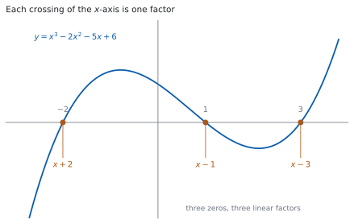
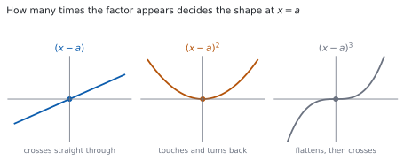

# HL 2.12 — Polynomial functions, the factor and remainder theorems（多項式関数・因数定理・剰余定理・解の和と積） {#sec-aahl-2-12}

::: {.callout-note}
## What you should be able to do
- **zeros**、**roots**、**factors** の $3$ つの言葉が、同じことの別の言い方だと分かる。
- **剰余定理**を使って、割った余りを代入だけで出せる。
- **因数定理**を使って、因数を $1$ つ見つけ、多項式を完全に因数分解できる。
- 係数に文字があるとき、因数や余りの条件から文字を決められる。
- **解の和と積**の公式（公式集の **2.12**）を使える。
- 重解のところで、グラフが $x$ 軸をまたぐのか接するのかを言える。
:::

## The idea

### 1. Polynomial functions（多項式関数） {#polynomials}

シラバスは、次のように書いています。

> Polynomial functions, their graphs and equations; zeros, roots and factors.

**多項式**とは、$x$ の $0$ 以上の整数乗を、定数倍して足しただけの式です。

$$
P(x) = a_{n}x^{n} + a_{n-1}x^{n-1} + \cdots + a_{1}x + a_{0}, \qquad a_{n} \neq 0
$$ {#eq-aahl212-poly}

$n$ を **degree（次数）**、$a_{n}$ を **leading coefficient（最高次の係数）** と呼びます。

$\dfrac{1}{x}$ や $\sqrt{x}$ が入っているものは、多項式ではありません。**指数が $0$ 以上の整数でないから**です。

$1$ 次（直線）と $2$ 次（放物線）は SL で扱いました（[SL 2.7](../../aa-sl/02-functions/aasl-2-7.qmd)）。**HL では $3$ 次以上も出ます。**

### 2. Zeros, roots and factors: three names for one thing（同じことの $3$ つの言い方） {#zeros-roots-factors}

{#fig-aahl212-idea-a width=100%}

@fig-aahl212-idea-a は $y = x^{3}-2x^{2}-5x+6$ のグラフです。$x$ 軸と $-2$、$1$、$3$ で交わっていて、

$$
x^{3}-2x^{2}-5x+6 = (x+2)(x-1)(x-3)
$$

と因数分解できます。**交点と因数が $1$ 対 $1$ で対応しています。**

: $3$ つの言葉の関係 {#tbl-aahl212-words}

| 言葉 | 何について言うか | 例 |
|---|---|---|
| **zero**（零点） | **関数** $P(x)$ について | $P(3) = 0$ なので $3$ は zero |
| **root**（解） | **方程式** $P(x) = 0$ について | $x = 3$ は方程式の root |
| **factor**（因数） | **式** $P(x)$ について | $(x-3)$ は $P(x)$ の factor |

**$3$ つは同じことを指しています。** 問題文がどの言葉を使っていても、やることは変わりません。

$$
P(a) = 0 \iff x = a \ \text{は解} \iff (x-a) \ \text{は因数}
$$ {#eq-aahl212-equivalence}

::: {.callout-important}
## 実数の交点がない場合もあります
$x^{2}+1$ には実数の zero がありません。グラフは $x$ 軸と交わりません。

このときも、**複素数まで広げれば解はあります**（[HL 1.14](../01-number-and-algebra/aahl-1-14.qmd#conjugate-roots)）。シラバスも、そのつながりを書いています。

> Link to: complex roots of quadratic and polynomial equations (AHL 1.14).

**$n$ 次式の解は、複素数まで数えれば重解を込めてちょうど $n$ 個です。**
:::

### 3. The remainder theorem（剰余定理） {#remainder}

$P(x)$ を $(x-a)$ で割ったときの**余り**は、割り算をしなくても出せます。

$$
P(x) \ \text{を} \ (x-a) \ \text{で割った余りは} \ P(a)
$$ {#eq-aahl212-remainder}

たとえば $P(x) = x^{3}-2x^{2}-5x+6$ を $(x-2)$ で割った余りは

$$
P(2) = 8 - 8 - 10 + 6 = -4
$$

です。**$1$ 行で出ます。** 筆算をする必要はありません。

::: {.callout-important}
## $(x+2)$ で割るときは $x = -2$ を入れます
$(x+2) = \bigl(x-(-2)\bigr)$ なので、$a = -2$ です。**符号を逆にする**ところで落とす人が多い場所です。

$(2x-3)$ のように $x$ の係数が $1$ でないときは、$2x-3 = 0$ を解いた $x = \dfrac{3}{2}$ を入れます。
:::

### 4. The factor theorem（因数定理） {#factor}

シラバスは、$2$ つをまとめて書いています。

> The factor and remainder theorems.

因数定理は、剰余定理の**余りが $0$ の場合**です。

$$
(x-a) \ \text{が} \ P(x) \ \text{の因数} \iff P(a) = 0
$$ {#eq-aahl212-factor}

**「因数かどうか」を、代入 $1$ 回で判定できます。**

上の $P(x) = x^{3}-2x^{2}-5x+6$ で $P(1) = 1-2-5+6 = 0$ なので、$(x-1)$ は因数です。

::: {.callout-tip}
## 因数を探すときは、定数項の約数から
$P(x) = x^{3}-2x^{2}-5x+6$ の定数項は $6$ です。**整数の解があるなら、$6$ の約数**（$\pm 1$、$\pm 2$、$\pm 3$、$\pm 6$）のどれかです。

$(x-a)(\cdots)$ を展開したとき、定数項が $-a \times (\text{残りの定数項})$ になるからです。

**$x = 1$ から試してください。** 計算がいちばん軽く、当たることも多いです。
:::

### 5. How to factorise a cubic（因数分解の進め方） {#factorising}

$3$ 次式を因数分解する手順は、いつも同じです。

1. **定数項の約数を、小さいものから代入して、$P(a) = 0$ になる $a$ を $1$ つ見つける。**
2. $(x-a)$ で割って、$2$ 次式を出す。
3. $2$ 次式を因数分解するか、解の公式で解く（[SL 2.7](../../aa-sl/02-functions/aasl-2-7.qmd)）。

$P(x) = x^{3}-2x^{2}-5x+6$ でやってみます。$P(1) = 0$ でしたから、$(x-1)$ で割ります。

$$
x^{3}-2x^{2}-5x+6 = (x-1)\left(x^{2}-x-6\right)
$$

割り算は筆算でもできますが、**係数をくらべるほうが速いことが多いです。** $(x-1)(x^{2}+px+q)$ を展開すると

$$
x^{3} + (p-1)x^{2} + (q-p)x - q
$$

なので、$x^{2}$ の係数から $p-1 = -2$、定数項から $-q = 6$ です。$p = -1$、$q = -6$ と出ます。

$$
x^{2}-x-6 = (x-3)(x+2)
$$

なので、$P(x) = (x-1)(x-3)(x+2)$ です。

::: {.callout-important}
## $2$ 次式が因数分解できないこともあります
割ったあとの $2$ 次式の判別式が負なら、**実数の範囲ではそこで終わり**です（[SL 2.7](../../aa-sl/02-functions/aasl-2-7.qmd)）。

$x^{3}+2x^{2}+3x+6 = (x+2)\left(x^{2}+3\right)$ が、その例です。$x^{2}+3$ はこれ以上分けられません。

**「もっと分けられるはず」と思って時間を使わないでください。** 判別式を見れば $1$ 行で決まります。
:::

### 6. The sum and product of the roots（解の和と積） {#sum-product}

シラバスは、次のように書いています。

> Sum and product of the roots of polynomial equations.

これは**公式集にあります。** 公式集の **2.12** の欄に、次の形で印刷されています。

> Sum and product of the roots of polynomial equations of the form $\sum\limits_{r=0}^{n} a_{r}x^{r} = 0$
>
> Sum is $\dfrac{-a_{n-1}}{a_{n}}$ ; product is $\dfrac{(-1)^{n}a_{0}}{a_{n}}$

$3$ 次方程式 $ax^{3}+bx^{2}+cx+d = 0$ なら、$a_{3} = a$、$a_{2} = b$、$a_{0} = d$ なので

$$
\alpha+\beta+\gamma = -\frac{b}{a}, \qquad \alpha\beta\gamma = \frac{(-1)^{3}d}{a} = -\frac{d}{a}
$$ {#eq-aahl212-cubic-sum-product}

です。**解を求めずに、和と積だけが分かります。**

$x^{3}-2x^{2}-5x+6 = 0$ で確かめます。解は $-2$、$1$、$3$ でした。

$$
(-2)+1+3 = 2 = -\frac{-2}{1}, \qquad (-2)(1)(3) = -6 = -\frac{6}{1}
$$

**どちらも合います。**

::: {.callout-important}
## 積の符号は、次数で変わります
$(-1)^{n}$ が付いているので、**$n$ が奇数なら符号が反転し、偶数ならそのまま**です。

$2$ 次方程式 $ax^{2}+bx+c = 0$ なら積は $\dfrac{(-1)^{2}c}{a} = \dfrac{c}{a}$、$3$ 次なら $-\dfrac{d}{a}$ です。

**次数を確かめてから、符号を決めてください。**
:::

### 7. Repeated roots and the shape of the graph（重解とグラフの形） {#repeated}

{#fig-aahl212-idea-b width=100%}

同じ因数が $2$ 回現れることがあります。$(x-2)^{2}(x+2)$ のような形です。このとき $x = 2$ を **double root（重解）** と呼びます。

@fig-aahl212-idea-b のとおり、**回数でグラフの形が決まります。**

: 因数の回数と、$x = a$ での形 {#tbl-aahl212-shape}

| 因数 | $x = a$ での形 | $x$ 軸を |
|---|---|---|
| $(x-a)$ | まっすぐ通り抜ける | またぐ |
| $(x-a)^{2}$ | 触れて、戻る | またがない |
| $(x-a)^{3}$ | 平らになってから通る | またぐ |

**奇数回ならまたぎ、偶数回なら接します。** グラフの概形をかくときに、いちばん効く見方です。

::: {.callout-tip collapse="true"}
## Paper 2 では、電卓でグラフから zeros を読めます
TI-Nspire CX II の Graphs ページに $f(x)$ を入力し、`menu` → `Analyze Graph` → `Zero` を選びます。**左の境界と右の境界**をきかれるので、交点をはさむように $2$ 点を指定すると、その交点の座標が出ます。

**交点ごとに $1$ 回ずつ操作します。** $3$ 次式なら最大 $3$ 回です。

**接しているところは、読み落としやすいところです。** 触れているだけの点も zero なので、グラフをよく見てください。

**Paper 1 では使えません。** このページの例題と演習は、すべて手で解けるようにしてあります。
:::

## Why it works

::: {.callout-tip collapse="true"}
## クリックすると開きます

#### なぜ、余りが $P(a)$ になるのか {#why-remainder}

$P(x)$ を $(x-a)$ で割ったときの商を $Q(x)$、余りを $R(x)$ とすると

$$
P(x) = (x-a)Q(x) + R(x)
$$

と書けます。**余りの次数は、割る式の次数より小さい**ので、$(x-a)$ は $1$ 次、$R(x)$ は $0$ 次、つまり**定数**です。$R$ と書きます。

$$
P(x) = (x-a)Q(x) + R
$$

ここに $x = a$ を入れます。$(a-a) = 0$ なので、$Q(a)$ が何であっても第 $1$ 項は消えます。

$$
P(a) = 0 \times Q(a) + R = R
$$

**余り $R$ が $P(a)$ でした。** 商 $Q(x)$ を求めずに済むのは、$x = a$ で第 $1$ 項が消えるからです。

**因数定理は、この $R$ が $0$ の場合です。** $R = 0$ なら $P(x) = (x-a)Q(x)$ で、$(x-a)$ は因数です。逆に因数なら $R = 0$、つまり $P(a) = 0$ です。

#### なぜ、解の和と積があの形になるのか {#why-sum-product}

$3$ 次で見ます。$ax^{3}+bx^{2}+cx+d = 0$ の解が $\alpha$、$\beta$、$\gamma$ なら、左辺は

$$
a(x-\alpha)(x-\beta)(x-\gamma)
$$

と書けます。**解が分かれば因数が分かる**（@eq-aahl212-equivalence）からです。展開します。

$$
a\Bigl[x^{3} - (\alpha+\beta+\gamma)x^{2} + (\alpha\beta+\beta\gamma+\gamma\alpha)x - \alpha\beta\gamma\Bigr]
$$

もとの式と係数をくらべます。

$$
b = -a(\alpha+\beta+\gamma), \qquad d = -a\,\alpha\beta\gamma
$$

$$
\alpha+\beta+\gamma = -\frac{b}{a}, \qquad \alpha\beta\gamma = -\frac{d}{a}
$$

**@eq-aahl212-cubic-sum-product が出ました。**

**$n$ 次でも同じです。** $x^{n-1}$ の係数には解の和が、定数項には解の積が現れ、$(x-\alpha)$ の $-$ が $n$ 個かかるので $(-1)^{n}$ が付きます。公式集の形のとおりです。

なお、真ん中の $\alpha\beta+\beta\gamma+\gamma\alpha = \dfrac{c}{a}$ も、同じ展開から読めます。**ただし公式集には載っていません。** 必要になったら、この展開をその場で書いてください。

#### なぜ、重解で接するのか {#why-touch}

$P(x) = (x-a)^{m}Q(x)$ で、$Q(a) \neq 0$ とします。$x$ が $a$ にとても近いとき、$Q(x)$ の符号は $Q(a)$ の符号のままです。ですから、**$P(x)$ の符号は $(x-a)^{m}$ の符号で決まります。**

- $m$ が**奇数**なら、$(x-a)^{m}$ は $x = a$ の前後で符号が変わります。$P(x)$ も変わるので、グラフは $x$ 軸を**またぎます。**
- $m$ が**偶数**なら、$(x-a)^{m}$ はどちらでも正です。符号が変わらないので、グラフは $x$ 軸に**触れて戻ります。**

@fig-aahl212-idea-b の $3$ つが、この $2$ 通りです。**$m = 3$ で平らに見えるのは、$(x-a)^{3}$ が $0$ の近くでとても小さいから**で、またぐことは $m = 1$ と変わりません。
:::

## Worked examples

::: {.callout-note appearance="simple"}
問題文は英語です。意味が理解できなかったら、問題文の下の「**日本語訳**」を開いてください。解説は日本語です。

**例題も演習も、すべて電卓なしで解けます。** Paper 1 のつもりで解いてください。
:::

::: {#exm-aahl212-factor}
[The polynomial $P(x) = 2x^{3}+ax^{2}-5x+6$ has $(x-2)$ as a factor.]{.q-en}

**(a)** [Find the value of $a$.]{.q-en}

**(b)** [Factorise $P(x)$ completely.]{.q-en}

日本語訳

多項式 $P(x) = 2x^{3}+ax^{2}-5x+6$ は $(x-2)$ を因数にもちます。

**(a)** $a$ の値を求めなさい。

**(b)** $P(x)$ を完全に因数分解しなさい。

---

**(a)** 因数定理から $P(2) = 0$ です（[第 4 節](#factor)）。

$$
P(2) = 2(8) + a(4) - 5(2) + 6 = 16 + 4a - 10 + 6 = 4a + 12
$$

$$
4a + 12 = 0 \ \Rightarrow \ a = -3
$$

**(b)** $P(x) = 2x^{3}-3x^{2}-5x+6$ を $(x-2)$ で割ります。$(x-2)\left(2x^{2}+px+q\right)$ を展開すると

$$
2x^{3} + (p-4)x^{2} + (q-2p)x - 2q
$$

です。$x^{2}$ の係数から $p - 4 = -3$ なので $p = 1$、定数項から $-2q = 6$ なので $q = -3$ です。

$$
P(x) = (x-2)\left(2x^{2}+x-3\right) = (x-2)(2x+3)(x-1)
$$

**検算。** **$x = 1$ を入れます。** $2-3-5+6 = 0$ で、$(x-1)$ が因数であることと合います ✓

**検算（解の和と積で）。** 解は $2$、$-\dfrac{3}{2}$、$1$ です。和は $2 - \dfrac{3}{2} + 1 = \dfrac{3}{2}$ で、公式の $-\dfrac{b}{a} = -\dfrac{-3}{2} = \dfrac{3}{2}$ と合います ✓ 積は $2 \times \left(-\dfrac{3}{2}\right) \times 1 = -3$ で、$-\dfrac{d}{a} = -\dfrac{6}{2} = -3$ と合います ✓ **展開とはまったく別の見方です。**

::: {.callout-note}
## 解答例（答案用紙に書くこと）

**(a)** *Since $(x-2)$ is a factor, $P(2) = 0$.*

$$16 + 4a - 10 + 6 = 0, \quad 4a = -12, \quad a = -3$$

**(b)** *Writing $P(x) = (x-2)\left(2x^{2}+px+q\right)$ and comparing coefficients:*

$$x^{2}: \ p-4 = -3 \ \Rightarrow \ p = 1, \qquad x^{0}: \ -2q = 6 \ \Rightarrow \ q = -3$$

$$P(x) = (x-2)\left(2x^{2}+x-3\right) = (x-2)(2x+3)(x-1)$$
:::
:::

::: {#exm-aahl212-two-conditions}
[The polynomial $P(x) = x^{3}+ax^{2}+bx+6$ is divisible by $(x-1)$, and leaves a remainder of $12$ when divided by $(x+2)$.]{.q-en}

**(a)** [Find the value of $a$ and the value of $b$.]{.q-en}

**(b)** [Hence solve $P(x) = 0$.]{.q-en}

日本語訳

多項式 $P(x) = x^{3}+ax^{2}+bx+6$ は $(x-1)$ で割り切れ、$(x+2)$ で割ると余りが $12$ になります。

**(a)** $a$ と $b$ の値を求めなさい。

**(b)** それを使って $P(x) = 0$ を解きなさい。

---

**(a)** 条件が $2$ つあるので、式が $2$ つ立ちます。

「割り切れる」は**余りが $0$**、つまり $P(1) = 0$ です。

$$
1 + a + b + 6 = 0 \ \Rightarrow \ a + b = -7
$$

「$(x+2)$ で割ると余りが $12$」は $P(-2) = 12$ です（[第 3 節](#remainder)）。**$x = -2$ を入れる**ところに気をつけます。

$$
-8 + 4a - 2b + 6 = 12 \ \Rightarrow \ 4a - 2b = 14 \ \Rightarrow \ 2a - b = 7
$$

$2$ つを足すと $3a = 0$ なので $a = 0$、$b = -7$ です。

**(b)** $P(x) = x^{3}-7x+6$ です。$P(1) = 0$ なので $(x-1)$ で割ります。

$$
x^{3}-7x+6 = (x-1)\left(x^{2}+x-6\right) = (x-1)(x+3)(x-2)
$$

**解は $x = 1$、$x = -3$、$x = 2$ です。**

**検算。** **$P(-2) = -8 + 14 + 6 = 12$** ✓ 余りの条件に戻りました。

**検算（解の和と積で）。** 和は $1-3+2 = 0$ で、$-\dfrac{a}{1} = 0$ と合います ✓ 積は $1 \times (-3) \times 2 = -6$ で、$-\dfrac{6}{1} = -6$ と合います ✓

::: {.callout-note}
## 解答例（答案用紙に書くこと）

**(a)** *$P(1) = 0$:* $\ 1+a+b+6 = 0$, *so* $a+b = -7$.

*$P(-2) = 12$:* $\ -8+4a-2b+6 = 12$, *so* $2a-b = 7$.

*Adding: $3a = 0$, so $a = 0$ and $b = -7$.*

**(b)** $P(x) = x^{3}-7x+6 = (x-1)\left(x^{2}+x-6\right) = (x-1)(x+3)(x-2)$

*The roots are $x = 1$, $x = -3$ and $x = 2$.*
:::
:::

::: {#exm-aahl212-sum-product}
[The equation $2x^{3}-5x^{2}+x+3 = 0$ has roots $\alpha$, $\beta$ and $\gamma$.]{.q-en}

**(a)** [Write down the value of $\alpha+\beta+\gamma$ and the value of $\alpha\beta\gamma$.]{.q-en}

**(b)** [Find a cubic equation with integer coefficients whose roots are $2\alpha$, $2\beta$ and $2\gamma$.]{.q-en}

日本語訳

方程式 $2x^{3}-5x^{2}+x+3 = 0$ の解を $\alpha$、$\beta$、$\gamma$ とします。

**(a)** $\alpha+\beta+\gamma$ と $\alpha\beta\gamma$ の値を書きなさい。

**(b)** $2\alpha$、$2\beta$、$2\gamma$ を解とする、係数が整数の $3$ 次方程式を $1$ つ求めなさい。

---

**(a)** 公式集の **2.12** をそのまま使います（[第 6 節](#sum-product)）。$a = 2$、$b = -5$、$d = 3$ です。

$$
\alpha+\beta+\gamma = -\frac{-5}{2} = \frac{5}{2}, \qquad \alpha\beta\gamma = -\frac{3}{2}
$$

**$3$ 次なので、積には $-$ が付きます。**

**(b)** 新しい解を $X = 2x$ とすると $x = \dfrac{X}{2}$ です。**もとの方程式に入れます。**

$$
2\left(\frac{X}{2}\right)^{3} - 5\left(\frac{X}{2}\right)^{2} + \frac{X}{2} + 3 = 0
$$

$$
\frac{X^{3}}{4} - \frac{5X^{2}}{4} + \frac{X}{2} + 3 = 0
$$

両辺を $4$ 倍します。

$$
X^{3} - 5X^{2} + 2X + 12 = 0
$$

**検算。** **和と積で確かめます。** 新しい解の和は $2\alpha+2\beta+2\gamma = 2 \times \dfrac{5}{2} = 5$ のはずです。出した式では $-\dfrac{-5}{1} = 5$ ✓

**検算（積のほう）。** 新しい解の積は $8\alpha\beta\gamma = 8 \times \left(-\dfrac{3}{2}\right) = -12$ のはずです。出した式では $-\dfrac{12}{1} = -12$ ✓ **もとの解を求めずに確かめられました。**

::: {.callout-note}
## 解答例（答案用紙に書くこと）

**(a)** $\alpha+\beta+\gamma = \dfrac{5}{2}$, $\ \alpha\beta\gamma = -\dfrac{3}{2}$

**(b)** *Let $X = 2x$, so $x = \dfrac{X}{2}$. Substituting into the equation:*

$$2\left(\frac{X}{2}\right)^{3} - 5\left(\frac{X}{2}\right)^{2} + \frac{X}{2} + 3 = 0$$

*Multiplying by $4$:*

$$X^{3} - 5X^{2} + 2X + 12 = 0$$
:::
:::

::: {#exm-aahl212-double}
[The graph of $y = x^{3}+ax^{2}+bx+c$ has a double zero at $x = 2$ and passes through the point $(0,\ 8)$.]{.q-en}

**(a)** [Find the values of $a$, $b$ and $c$.]{.q-en}

**(b)** [State, with a reason, whether the graph crosses the $x$-axis at $x = 2$.]{.q-en}

日本語訳

$y = x^{3}+ax^{2}+bx+c$ のグラフは $x = 2$ で重解をもち、点 $(0,\ 8)$ を通ります。

**(a)** $a$、$b$、$c$ の値を求めなさい。

**(b)** このグラフが $x = 2$ で $x$ 軸をまたぐかどうかを、理由をつけて述べなさい。

---

**(a)** $x = 2$ が重解なので、$(x-2)^{2}$ が因数です。$3$ 次で最高次の係数が $1$ なので、残りは $1$ 次の因数 $1$ つです。

$$
y = (x-2)^{2}(x-p)
$$

$(0,\ 8)$ を通るので、$x = 0$ を入れて

$$
(-2)^{2}(-p) = 8 \ \Rightarrow \ -4p = 8 \ \Rightarrow \ p = -2
$$

$$
y = (x-2)^{2}(x+2) = \left(x^{2}-4x+4\right)(x+2) = x^{3}-2x^{2}-4x+8
$$

**$a = -2$、$b = -4$、$c = 8$ です。**

**(b)** $(x-2)$ が $2$ 回現れているので、**またぎません**（[第 7 節](#repeated)）。

::: {.model-answer}
**試験ではこう書く**

*Near $x = 2$ we can write $y = (x-2)^{2}(x+2)$, where the factor $(x+2)$ takes the value $4$ at $x = 2$ and so is positive on both sides of $x = 2$. The factor $(x-2)^{2}$ is a square, so it is positive on both sides of $x = 2$ as well, and zero only at $x = 2$ itself. Hence $y$ has the same sign on both sides of $x = 2$, so the graph touches the $x$-axis there and turns back: it does not cross.*
:::

（$x = 2$ の近くでは $(x+2)$ の符号は変わらず、$(x-2)^{2}$ は $2$ 乗なので常に $0$ 以上である。ですから $y$ の符号が変わらず、接して戻る、という意味です。）

**検算。** **$x = 2$ の両側で符号を見ます。** $x = 1$ では $(1-2)^{2}(1+2) = 3 > 0$、$x = 3$ では $(3-2)^{2}(3+2) = 5 > 0$ ✓ どちらも正で、符号が変わっていません。

**検算（展開のほう）。** $x = 0$ を $x^{3}-2x^{2}-4x+8$ に入れると $8$ ✓ $(0,\ 8)$ を通っています。

::: {.callout-note}
## 解答例（答案用紙に書くこと）

**(a)** *A double zero at $x = 2$ gives a factor $(x-2)^{2}$, so $y = (x-2)^{2}(x-p)$.*

*At $x = 0$: $\ 4(-p) = 8$, so $p = -2$.*

$$y = (x-2)^{2}(x+2) = x^{3}-2x^{2}-4x+8$$

*Hence $a = -2$, $b = -4$, $c = 8$.*

**(b)** *The factor $(x-2)$ occurs twice, so $y$ does not change sign at $x = 2$: the graph touches the $x$-axis and turns back, and does not cross.*
:::
:::

## Common errors

::: {.callout-warning}
## $(x+2)$ で割るのに $x = 2$ を入れる
$(x+2) = \bigl(x-(-2)\bigr)$ なので、入れるのは **$x = -2$** です（[第 3 節](#remainder)）。

$(x-a)$ の形に直してから $a$ を読む、と決めておくと落としません。
:::

::: {.callout-warning}
## $2$ 次式を残したまま「完全に因数分解」と書く
$(x-2)\left(2x^{2}+x-3\right)$ は、まだ途中です。**$2$ 次式が因数分解できるなら、そこまで進めてください。**

判別式を見て、負のときだけ「これ以上分けられない」と書きます（[第 5 節](#factorising)）。
:::

::: {.callout-warning}
## 積の $(-1)^{n}$ を忘れる
$3$ 次では、積は $\dfrac{d}{a}$ ではなく **$-\dfrac{d}{a}$** です（[第 6 節](#sum-product)）。

公式集の式には $(-1)^{n}$ が書かれています。**次数を確かめてから、符号を決めてください。**
:::

::: {.callout-warning}
## 最高次の係数で割り忘れる
$2x^{3}-5x^{2}+\cdots$ の解の和は $5$ ではありません。**$-\dfrac{b}{a} = \dfrac{5}{2}$** です。

$a = 1$ の問題ばかり練習していると、ここで落とします。**公式の分母は、いつも $a_{n}$ です。**
:::

::: {.callout-warning}
## 重解を $1$ つしか数えない
$(x-2)^{2}(x+2)$ の解は $2$、$2$、$-2$ の $3$ つです。**和と積を出すときは、重解も回数ぶん数えます。**

和は $2+2-2 = 2$ で、$2 + (-2) = 0$ ではありません。
:::

::: {.callout-warning}
## 「divisible by」を「余りが出る」と読む
`divisible by $(x-1)$` は、**余りが $0$**、つまり $P(1) = 0$ です。

`leaves a remainder of $12$` なら $P(a) = 12$ です。**この $2$ つを取りちがえると、立てる式がまるごとずれます。**
:::

## Exercises

::: {.callout-note appearance="simple"}
各問題に、折りたたみが $3$ つ付いています。**日本語訳**、**解答例**（答案用紙に書くべきこと。英語です）、**解説**（なぜそうなるか。日本語です）。

まず自分で解いて、次に解答例と見くらべてください。**解説は、合わなかったときだけ開けば十分です。**
:::

::: {.exercise-block}

[1]{.ex-no} [Show that $(x+1)$ is a factor of $P(x) = x^{3}-4x^{2}+x+6$, and hence factorise $P(x)$ completely.]{.q-en}

日本語訳

$(x+1)$ が $P(x) = x^{3}-4x^{2}+x+6$ の因数であることを示し、それを使って $P(x)$ を完全に因数分解しなさい。

::: {.callout-note collapse="true"}
## 解答例（答案用紙に書くこと）

$$P(-1) = -1 - 4 - 1 + 6 = 0$$

*so $(x+1)$ is a factor.*

*Writing $P(x) = (x+1)\left(x^{2}+px+q\right)$ and comparing coefficients:*

$$x^{2}: \ p+1 = -4 \ \Rightarrow \ p = -5, \qquad x^{0}: \ q = 6$$

$$P(x) = (x+1)\left(x^{2}-5x+6\right) = (x+1)(x-2)(x-3)$$
:::

::: {.callout-tip collapse="true"}
## 解説

$(x+1)$ なので、入れるのは **$x = -1$** です（[第 3 節](#remainder)）。

$x^{2}-5x+6$ は、足して $-5$・掛けて $6$ の $2$ 数、つまり $-2$ と $-3$ で分けられます。

**検算。** 解の和は $-1+2+3 = 4$ で、$-\dfrac{-4}{1} = 4$ ✓

**検算（積で）。** $(-1)(2)(3) = -6$ で、$-\dfrac{6}{1} = -6$ ✓ **$3$ 次なので $-$ が付きます。**
:::

::: {.ex-sep}
:::

[2]{.ex-no} [Find the remainder when $x^{4}-3x^{2}+2x-5$ is divided by $(x-2)$.]{.q-en}

日本語訳

$x^{4}-3x^{2}+2x-5$ を $(x-2)$ で割った余りを求めなさい。

::: {.callout-note collapse="true"}
## 解答例（答案用紙に書くこと）

*By the remainder theorem, the remainder is $P(2)$.*

$$P(2) = 16 - 12 + 4 - 5 = 3$$

*The remainder is $3$.*
:::

::: {.callout-tip collapse="true"}
## 解説

**割り算をする必要はありません**（[第 3 節](#remainder)）。$x^{3}$ の項がないので、$x^{3}$ の係数は $0$ として扱います。

**検算。** $2^{4} = 16$、$3 \times 2^{2} = 12$、$2 \times 2 = 4$ です。$16-12+4-5 = 3$ ✓

**検算（$P(x) = (x-2)Q(x)+3$ の形で）。** 余りが $3$ なら $P(x)-3$ が $(x-2)$ で割り切れるはずです。$P(2)-3 = 0$ ✓
:::

::: {.ex-sep}
:::

[3]{.ex-no} [The polynomial $P(x) = 2x^{3}+x^{2}+ax+b$ has $(x-1)$ as a factor, and leaves a remainder of $-18$ when divided by $(x+2)$.]{.q-en}

**(a)** [Find the value of $a$ and the value of $b$.]{.q-en}

**(b)** [Show that $P(x) = 0$ has exactly one real root.]{.q-en}

日本語訳

多項式 $P(x) = 2x^{3}+x^{2}+ax+b$ は $(x-1)$ を因数にもち、$(x+2)$ で割ると余りが $-18$ になります。

**(a)** $a$ と $b$ の値を求めなさい。

**(b)** $P(x) = 0$ の実数解がちょうど $1$ つであることを示しなさい。

::: {.callout-note collapse="true"}
## 解答例（答案用紙に書くこと）

**(a)** *$P(1) = 0$:* $\ 2+1+a+b = 0$, *so* $a+b = -3$.

*$P(-2) = -18$:* $\ -16+4-2a+b = -18$, *so* $-2a+b = -6$.

*Subtracting: $3a = 3$, so $a = 1$ and $b = -4$.*

**(b)** $P(x) = 2x^{3}+x^{2}+x-4 = (x-1)\left(2x^{2}+3x+4\right)$

*For the quadratic factor, $\Delta = 3^{2}-4(2)(4) = 9-32 = -23 < 0$, so it has no real zeros.*

*Hence the only real root is $x = 1$.*
:::

::: {.callout-tip collapse="true"}
## 解説

**(a)** 条件が $2$ つなので、式が $2$ つ立ちます（[例題 2](#exm-aahl212-two-conditions)）。

**(b)** 割ったあとの $2$ 次式の**判別式**を見ます（[第 5 節](#factorising)）。負なので、実数の範囲ではこれ以上分けられません。

**検算。** $P(1) = 2+1+1-4 = 0$ ✓

**検算（余りのほう）。** $P(-2) = -16+4-2-4 = -18$ ✓ **$2$ つの条件に、どちらも戻りました。**
:::

::: {.ex-sep}
:::

[4]{.ex-no} [The equation $3x^{3}+2x^{2}-7x+4 = 0$ has roots $\alpha$, $\beta$ and $\gamma$. Write down the value of $\alpha+\beta+\gamma$ and the value of $\alpha\beta\gamma$.]{.q-en}

日本語訳

方程式 $3x^{3}+2x^{2}-7x+4 = 0$ の解を $\alpha$、$\beta$、$\gamma$ とします。$\alpha+\beta+\gamma$ と $\alpha\beta\gamma$ の値を書きなさい。

::: {.callout-note collapse="true"}
## 解答例（答案用紙に書くこと）

$$\alpha+\beta+\gamma = -\frac{2}{3}, \qquad \alpha\beta\gamma = -\frac{4}{3}$$
:::

::: {.callout-tip collapse="true"}
## 解説

公式集の **2.12** をそのまま使います（[第 6 節](#sum-product)）。$a = 3$、$b = 2$、$d = 4$ です。

**$3$ 次なので $(-1)^{3} = -1$** が積に付きます。

**検算。** 和のほうは $-\dfrac{b}{a} = -\dfrac{2}{3}$ ✓ 分母が $3$ になっているかを見てください。

**検算（次数のほう）。** $n = 3$ は奇数なので、積の符号は反転します ✓ $\dfrac{4}{3}$ ではありません。
:::

::: {.ex-sep}
:::

[5]{.ex-no} [The equation $x^{3}+px^{2}+qx+8 = 0$ has three roots whose sum is $5$.]{.q-en}

**(a)** [Find the value of $p$.]{.q-en}

**(b)** [Explain why the product of the roots can be found without knowing $p$ or $q$, and state its value.]{.q-en}

日本語訳

方程式 $x^{3}+px^{2}+qx+8 = 0$ は、$3$ つの解の和が $5$ です。

**(a)** $p$ の値を求めなさい。

**(b)** 解の積が $p$ や $q$ を知らなくても求められる理由を説明し、その値を書きなさい。

::: {.callout-note collapse="true"}
## 解答例（答案用紙に書くこと）

**(a)** *The sum of the roots is $-\dfrac{p}{1} = -p$, so $-p = 5$ and $p = -5$.*

**(b)** *The product of the roots is $\dfrac{(-1)^{3}a_{0}}{a_{3}} = -\dfrac{8}{1} = -8$, which depends only on the constant term and the leading coefficient. Neither $p$ nor $q$ appears in that expression, so the product is $-8$ whatever $p$ and $q$ are.*
:::

::: {.callout-tip collapse="true"}
## 解説

**公式に $q$ が出てこない**ことに気づけるかどうかの問題です（[第 6 節](#sum-product)）。和は $a_{n-1}$ と $a_{n}$ だけ、積は $a_{0}$ と $a_{n}$ だけで決まります。

**$q$ は、この $2$ つのどちらにも効きません。**

**検算。** $p = -5$ を入れた $x^{3}-5x^{2}+qx+8$ の解の和は $-\dfrac{-5}{1} = 5$ ✓

**検算（$q$ を変えてみる）。** $q = 2$ でも $q = 100$ でも、定数項は $8$ のままです。**積はどちらも $-8$** です ✓
:::

::: {.ex-sep}
:::

[6]{.ex-no} [The equation $x^{3}-3x^{2}+4x-2 = 0$ has roots $\alpha$, $\beta$ and $\gamma$. Find a cubic equation with integer coefficients whose roots are $2\alpha$, $2\beta$ and $2\gamma$.]{.q-en}

日本語訳

方程式 $x^{3}-3x^{2}+4x-2 = 0$ の解を $\alpha$、$\beta$、$\gamma$ とします。$2\alpha$、$2\beta$、$2\gamma$ を解とする、係数が整数の $3$ 次方程式を $1$ つ求めなさい。

::: {.callout-note collapse="true"}
## 解答例（答案用紙に書くこと）

*Let $X = 2x$, so $x = \dfrac{X}{2}$. Substituting:*

$$\left(\frac{X}{2}\right)^{3} - 3\left(\frac{X}{2}\right)^{2} + 4\left(\frac{X}{2}\right) - 2 = 0$$

$$\frac{X^{3}}{8} - \frac{3X^{2}}{4} + 2X - 2 = 0$$

*Multiplying by $8$:*

$$X^{3} - 6X^{2} + 16X - 16 = 0$$
:::

::: {.callout-tip collapse="true"}
## 解説

**$X = 2x$ と置いて、もとの式に $x = \dfrac{X}{2}$ を入れる**のが定石です（[例題 3](#exm-aahl212-sum-product)）。最後に分母をはらって、係数を整数にします。

**検算。** もとの解の和は $-\dfrac{-3}{1} = 3$ なので、新しい解の和は $6$ のはずです。出した式では $-\dfrac{-6}{1} = 6$ ✓

**検算（積で）。** もとの積は $-\dfrac{-2}{1} = 2$ なので、新しい積は $8 \times 2 = 16$ のはずです。出した式では $-\dfrac{-16}{1} = 16$ ✓
:::

::: {.ex-sep}
:::

[7]{.ex-no} [The graph of $y = x^{3}+ax^{2}+bx+18$ has a double zero at $x = 3$. Find the value of $a$ and the value of $b$.]{.q-en}

日本語訳

$y = x^{3}+ax^{2}+bx+18$ のグラフは $x = 3$ で重解をもちます。$a$ と $b$ の値を求めなさい。

::: {.callout-note collapse="true"}
## 解答例（答案用紙に書くこと）

*A double zero at $x = 3$ gives $y = (x-3)^{2}(x-p)$.*

*Comparing constant terms: $9(-p) = 18$, so $p = -2$.*

$$y = (x-3)^{2}(x+2) = \left(x^{2}-6x+9\right)(x+2) = x^{3}-4x^{2}-3x+18$$

*Hence $a = -4$ and $b = -3$.*
:::

::: {.callout-tip collapse="true"}
## 解説

**重解は $(x-3)^{2}$ という因数**です（[第 7 節](#repeated)）。$3$ 次で最高次の係数が $1$ なので、残りは $(x-p)$ の形の $1$ 次式が $1$ つです。

定数項をくらべるのが、いちばん速い道です。

**検算。** $x = 3$ を入れると $27-36-9+18 = 0$ ✓

**検算（解の和で）。** 解は $3$、$3$、$-2$ なので和は $4$ です。$-\dfrac{a}{1} = -(-4) = 4$ ✓ **重解を $2$ 回数えるところが要です。**
:::

::: {.ex-sep}
:::

[8]{.ex-no} [Let $f(x) = (x+2)(x-1)^{2}(x-3)$. State the degree of $f$, describe what the graph of $y = f(x)$ does at each of $x = -2$, $x = 1$ and $x = 3$, and state how many times the graph crosses the $x$-axis.]{.q-en}

日本語訳

$f(x) = (x+2)(x-1)^{2}(x-3)$ とします。$f$ の次数を書き、$y = f(x)$ のグラフが $x = -2$、$x = 1$、$x = 3$ のそれぞれで何をするかを述べ、グラフが $x$ 軸をまたぐ回数を書きなさい。

::: {.callout-note collapse="true"}
## 解答例（答案用紙に書くこと）

*The degree is $1+2+1 = 4$.*

*At $x = -2$ the factor occurs once, so the graph crosses the $x$-axis.*

*At $x = 1$ the factor occurs twice, so the graph touches the $x$-axis and turns back.*

*At $x = 3$ the factor occurs once, so the graph crosses the $x$-axis.*

*The graph crosses the $x$-axis twice.*
:::

::: {.callout-tip collapse="true"}
## 解説

**次数は、因数の指数を全部足したもの**です。展開しなくても分かります。

**検算。** $x = 1$ の両側で符号を見ます。$f(0) = (2)(1)(-3) = -6 < 0$、$f(2) = (4)(1)(-1) = -4 < 0$ ✓ 符号が変わっていないので、接しています。

**検算（またぐほう）。** $f(-3) = (-1)(16)(-6) = 96 > 0$ と $f(0) = -6 < 0$ で、$x = -2$ をはさんで符号が変わります ✓

::: {.model-answer}
**試験ではこう書く**

*The degree of $f$ is $1+2+1 = 4$. At $x = -2$ the factor $(x+2)$ appears to the first power, an odd power, so $f$ changes sign there and the graph crosses the $x$-axis. At $x = 1$ the factor $(x-1)$ appears squared; a square is never negative, so $f$ keeps the same sign on both sides of $x = 1$ and the graph touches the $x$-axis and turns back without crossing. At $x = 3$ the factor $(x-3)$ again appears to the first power, so the graph crosses there as well. The graph therefore crosses the $x$-axis exactly twice, at $x = -2$ and at $x = 3$.*
:::
:::

::: {.ex-sep}
:::

[9]{.ex-no} [Show that $(x-1)$ is a factor of $x^{n}-1$ for every positive integer $n$, and explain how you know.]{.q-en}

日本語訳

すべての正の整数 $n$ について $(x-1)$ が $x^{n}-1$ の因数であることを示し、なぜそう言えるのかを説明しなさい。

::: {.callout-note collapse="true"}
## 解答例（答案用紙に書くこと）

*Let $P(x) = x^{n}-1$. Then*

$$P(1) = 1^{n} - 1 = 1 - 1 = 0$$

*since $1^{n} = 1$ for every positive integer $n$.*

*By the factor theorem, $P(1) = 0$ means $(x-1)$ is a factor of $P(x)$.*
:::

::: {.callout-tip collapse="true"}
## 解説

**割り算をする必要はありません**（[第 4 節](#factor)）。代入 $1$ 回で終わります。

$1$ は何乗しても $1$ です。**ここだけが、$n$ に依らない理由です。**

**検算。** $n = 3$ で確かめます。$x^{3}-1 = (x-1)\left(x^{2}+x+1\right)$ ✓

**検算（$n = 4$ で）。** $x^{4}-1 = (x-1)\left(x^{3}+x^{2}+x+1\right)$ ✓ **どちらも $(x-1)$ が出ています。**

::: {.model-answer}
**試験ではこう書く**

*Let $P(x) = x^{n}-1$, where $n$ is a positive integer. Substituting $x = 1$ gives $P(1) = 1^{n}-1$, and $1^{n} = 1$ for every positive integer $n$, so $P(1) = 1-1 = 0$. The factor theorem states that $(x-a)$ is a factor of a polynomial $P(x)$ exactly when $P(a) = 0$. Taking $a = 1$, we conclude that $(x-1)$ is a factor of $x^{n}-1$. The argument does not depend on the value of $n$, so it holds for every positive integer $n$.*
:::
:::

::: {.ex-sep}
:::

[10]{.ex-no} [A student writes: "The remainder when $P(x) = x^{3}+2x^{2}+3x+6$ is divided by $(x+2)$ is $P(2) = 8+8+6+6 = 28$." Explain the error, and find the correct remainder.]{.q-en}

日本語訳

ある生徒が、次のように書きました。「$P(x) = x^{3}+2x^{2}+3x+6$ を $(x+2)$ で割った余りは $P(2) = 8+8+6+6 = 28$ である。」まちがいを説明し、正しい余りを求めなさい。

::: {.callout-note collapse="true"}
## 解答例（答案用紙に書くこと）

*The remainder theorem uses the value of $x$ that makes the divisor zero. Here $x+2 = 0$ gives $x = -2$, not $x = 2$.*

$$P(-2) = -8 + 8 - 6 + 6 = 0$$

*The remainder is $0$, so $(x+2)$ is in fact a factor of $P(x)$.*
:::

::: {.callout-tip collapse="true"}
## 解説

**$(x-a)$ の形に直してから $a$ を読む**、と決めておくと防げます（[第 3 節](#remainder)）。$(x+2)$ は $\bigl(x-(-2)\bigr)$ です。

符号を逆にしただけで、答えが $28$ から $0$ に変わりました。**余りが $0$ かどうかは、因数かどうかと同じ**ですから、意味も大きく変わります。

**検算。** 実際に因数分解できます。$x^{3}+2x^{2}+3x+6 = (x+2)\left(x^{2}+3\right)$ ✓

**検算（$x^{2}+3$ のほう）。** 判別式は $0-12 = -12 < 0$ なので、実数の範囲ではこれ以上分けられません ✓

::: {.model-answer}
**試験ではこう書く**

*The remainder theorem says that the remainder on division by $(x-a)$ is $P(a)$, where $a$ is the value that makes the divisor zero. The divisor here is $x+2$, and $x+2 = 0$ gives $x = -2$, so the value required is $P(-2)$ and not $P(2)$. Evaluating, $P(-2) = (-2)^{3}+2(-2)^{2}+3(-2)+6 = -8+8-6+6 = 0$. The correct remainder is $0$, and since the remainder is zero the factor theorem tells us that $(x+2)$ is a factor of $P(x)$.*
:::
:::

:::
