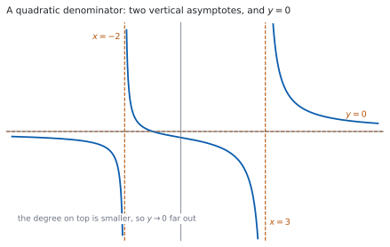
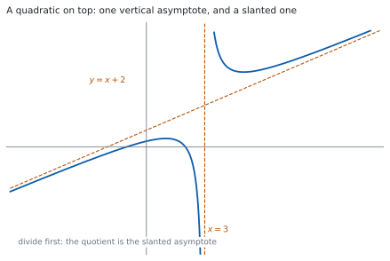

# HL 2.13 — Graphs of rational functions（有理関数のグラフ・斜め漸近線） {#sec-aahl-2-13}

::: {.callout-note}
## What you should be able to do
- $\dfrac{ax+b}{cx^{2}+dx+e}$ と $\dfrac{ax^{2}+bx+c}{dx+e}$ の形を見分けられる。
- **垂直漸近線**を、分母 $= 0$ から出せる。
- 分母のほうが次数が高いとき、**水平漸近線 $y = 0$** があると言える。
- 分子のほうが次数が高いとき、割り算をして**斜め漸近線**を出せる。
- $x$ 軸・$y$ 軸との**交点**を出せる。
- 漸近線と交点を書き込んだ**概形**をかける。
:::

## The idea

### 1. Which functions are meant（どんな関数か） {#idea}

シラバスは、扱う形をはっきり決めています。

> Rational functions of the form $f(x) = \dfrac{ax+b}{cx^{2}+dx+e}$, and $f(x) = \dfrac{ax^{2}+bx+c}{dx+e}$.

**$2$ つの形だけ**です。分子と分母のどちらかが $2$ 次で、もう一方が $1$ 次です。

SL では $\dfrac{ax+b}{cx+d}$ の形を扱いました（[SL 2.8](../../aa-sl/02-functions/aasl-2-8.qmd)）。シラバスも、そのつながりを書いています。

> Link to: rational functions (SL 2.8).

> The reciprocal function is a particular case.

**$y = \dfrac{1}{x}$ も、この仲間です。**

かくべきものも決まっています。

> Graphs should include all asymptotes (horizontal, vertical and oblique) and any intercepts with axes.

**漸近線をすべて（水平・垂直・斜め）と、軸との交点**です。この $2$ つが、このページの中身です。

::: {.callout-important}
## 公式集には、この項目の欄がありません
覚える式はありません。**手順**を覚えます。

やることは、いつも同じ $3$ つです。**分母を $0$ にする $x$**、**$x$ が大きいときの様子**、**軸との交点**です。
:::

### 2. Vertical asymptotes（垂直漸近線） {#vertical}

**分母が $0$ になるところ**で、値がいくらでも大きく（または小さく）なります。

$$
f(x) = \frac{x+1}{x^{2}-x-6}
$$ {#eq-aahl213-example}

の分母は $x^{2}-x-6 = (x-3)(x+2)$ です。$x = 3$ と $x = -2$ で $0$ になります。

$$
x = 3, \qquad x = -2
$$

が垂直漸近線です。**$2$ 本あります。**

::: {.callout-important}
## 分子も同時に $0$ になるときは、垂直漸近線ではありません
$x = a$ で分母も分子も $0$ なら、$(x-a)$ が上下で約分できます。**そこは漸近線ではなく、グラフに開いた点（穴）です**（[第 7 節](#special)）。

**式を見たら、まず分子と分母を因数分解してください。** 約分できるかどうかを先に見ます。
:::

### 3. A quadratic denominator: the horizontal asymptote（分母が $2$ 次のとき：水平漸近線） {#horizontal}

{#fig-aahl213-idea-a width=100%}

@eq-aahl213-example で、$x$ をとても大きくしてみます。分子と分母を $x^{2}$ で割ると

$$
f(x) = \frac{\dfrac{1}{x} + \dfrac{1}{x^{2}}}{1 - \dfrac{1}{x} - \dfrac{6}{x^{2}}}
$$

です。$x \to \infty$ で $\dfrac{1}{x}$ も $\dfrac{1}{x^{2}}$ も $0$ に近づくので、**分子は $0$ に、分母は $1$ に**近づきます。

$$
y = 0
$$ {#eq-aahl213-horizontal}

が水平漸近線です。@fig-aahl213-idea-a のとおりです。

**分母の次数のほうが高ければ、いつも $y = 0$ です。** 下のほうが速く大きくなるので、分数は小さくなります。

::: {.callout-tip}
## 水平漸近線を横切ることもあります
「漸近線に触れてはいけない」わけではありません。@fig-aahl213-idea-a のグラフは、$x = -1$ で $y = 0$ を**横切っています。**

漸近線が言っているのは、**遠くでの様子**だけです。近くで交わってもかまいません。
:::

### 4. A quadratic numerator: the oblique asymptote（分子が $2$ 次のとき：斜め漸近線） {#oblique}

{#fig-aahl213-idea-b width=100%}

$$
f(x) = \frac{x^{2}-x-2}{x-3}
$$ {#eq-aahl213-oblique-example}

は、上のほうが次数が高い形です。このときは**割り算をします**（[HL 2.12](aahl-2-12.qmd#factorising)）。

$$
x^{2}-x-2 = (x+2)(x-3) + 4
$$

なので

$$
f(x) = x + 2 + \frac{4}{x-3}
$$ {#eq-aahl213-divided}

です。$x$ が大きくなると $\dfrac{4}{x-3}$ は $0$ に近づくので、**$f(x)$ は直線 $y = x+2$ に近づきます。**

$$
y = x + 2
$$

が**斜め漸近線**です。@fig-aahl213-idea-b のとおりです。

$$
\text{斜め漸近線} = \text{割り算の商}
$$ {#eq-aahl213-quotient}

**分母 $x-3 = 0$ から、垂直漸近線 $x = 3$ もあります。**

::: {.callout-important}
## 割り算の余りは、漸近線に入りません
@eq-aahl213-divided の $\dfrac{4}{x-3}$ は、遠くで消える部分です。**漸近線は $y = x+2$ だけ**で、$y = x+2+\dfrac{4}{x-3}$ ではありません。

余りは、**グラフが漸近線の上側にあるか下側にあるか**を決めます。$x > 3$ では $\dfrac{4}{x-3} > 0$ なので、グラフは漸近線の**上**にあります。
:::

### 5. Intercepts with the axes（軸との交点） {#intercepts}

交点の出し方は、どちらの形でも同じです。

: 交点の出し方 {#tbl-aahl213-intercepts}

| 交点 | 何をするか | @eq-aahl213-example では |
|---|---|---|
| $x$ 軸（$x$-intercept） | **分子 $= 0$** を解く | $x+1 = 0$ なので $(-1,\ 0)$ |
| $y$ 軸（$y$-intercept） | $x = 0$ を入れる | $\dfrac{1}{-6}$ なので $\left(0,\ -\dfrac{1}{6}\right)$ |

**$x$ 軸との交点は、分子だけ**を見ます。分数が $0$ になるのは、**分子が $0$ で、分母が $0$ でない**ときだけだからです。

$y$ 軸との交点は、$x = 0$ が定義域に入っているときだけあります。**分母が $x = 0$ で $0$ になる関数には、$y$ 切片がありません。**

### 6. The steps for sketching the graph（グラフをかく手順） {#sketching}

$4$ つを、この順にやります。

1. **分子と分母を因数分解する**（約分できるかを見る）。
2. **分母 $= 0$** から垂直漸近線。
3. **次数をくらべて**、水平漸近線（$y = 0$）か、割り算をして斜め漸近線。
4. **交点**を出す。

そのあとで、漸近線を点線でかき、交点を打ってから曲線をつなぎます。

::: {.callout-tip}
## 漸近線の近くは、符号だけで決まります
$x = 3$ の右すぐでは、@eq-aahl213-oblique-example の分母 $x-3$ は**小さい正の数**です。分子 $x^{2}-x-2$ は $x = 3$ で $4 > 0$ なので、$f(x)$ は**大きな正の数**になります。

$x = 3$ の左すぐでは、分母が**小さい負の数**なので、$f(x)$ は**大きな負の数**です。

**符号を $2$ 回見るだけで、上に跳ねるか下に落ちるかが決まります。**
:::

### 7. No vertical asymptote, and fractions that cancel（垂直漸近線がない場合と、約分できる場合） {#special}

**分母が実数の解をもたないと、垂直漸近線はありません。**

$$
f(x) = \frac{2x+1}{x^{2}+1}
$$

の分母は、どの実数 $x$ でも $x^{2}+1 \geq 1 > 0$ です。判別式が $0-4 = -4 < 0$ なので、$0$ になりません。**垂直漸近線は $0$ 本**で、水平漸近線 $y = 0$ だけがあります。

**約分できるときも、そこは漸近線になりません。**

$$
g(x) = \frac{3x+6}{x^{2}+x-2} = \frac{3(x+2)}{(x+2)(x-1)}
$$

$x \neq -2$ では $g(x) = \dfrac{3}{x-1}$ です。**垂直漸近線は $x = 1$ の $1$ 本だけ**で、$x = -2$ にはグラフが**開いた点**（値が定まらない点）があります。

$$
\text{因数分解} \to \text{約分} \to \text{そのあとで漸近線}
$$ {#eq-aahl213-order}

**順番を守ってください。** 分母だけを見て $2$ 本と答えると、まちがいになります。

::: {.callout-tip collapse="true"}
## Paper 2 では、電卓でグラフを見られます
TI-Nspire CX II の Graphs ページに式を入力すると、曲線が出ます。`menu` → `Window / Zoom` → `Window Settings` で、$x$ と $y$ の範囲を自分で決められます。

交点は `menu` → `Analyze Graph` → `Zero` で読めます。

**漸近線は、電卓が引いてくれるわけではありません。** それどころか、垂直漸近線のところで**縦につながった線が引かれて見える**ことがあります。曲線が本当につながっているのではなく、点と点を結んでいるだけです。

**漸近線は、自分で式から出してください。** 電卓は、出した答えの形が合っているかを見るために使います。

**Paper 1 では使えません。** このページの例題と演習は、すべて手で解けるようにしてあります。
:::

## Why it works

::: {.callout-tip collapse="true"}
## クリックすると開きます

#### なぜ、次数をくらべるだけで水平漸近線が決まるのか {#why-horizontal}

分子と分母を、**分母の最高次の項**で割ります。$\dfrac{ax+b}{cx^{2}+dx+e}$ なら $x^{2}$ で割って

$$
f(x) = \frac{\dfrac{a}{x} + \dfrac{b}{x^{2}}}{c + \dfrac{d}{x} + \dfrac{e}{x^{2}}}
$$

です。$x \to \pm\infty$ で $\dfrac{1}{x}$ と $\dfrac{1}{x^{2}}$ はどちらも $0$ に近づくので、分子は $0$ に、分母は $c$ に近づきます。$c \neq 0$ なので

$$
f(x) \to \frac{0}{c} = 0
$$

です。**上の次数が下より小さいと、いつもこうなります。** 上に $x$ が $1$ 個、下に $2$ 個あって、$1$ 個ぶん足りないからです。

#### なぜ、割り算の商が斜め漸近線になるのか {#why-oblique}

$\dfrac{ax^{2}+bx+c}{dx+e}$ を割ると、商が $1$ 次式 $mx+n$、余りが定数 $R$ になります。**余りの次数は、割る式より小さい**からです（[HL 2.12](aahl-2-12.qmd#remainder)）。

$$
f(x) = mx + n + \frac{R}{dx+e}
$$

$x \to \pm\infty$ で $\dfrac{R}{dx+e} \to 0$ なので、

$$
f(x) - (mx+n) \to 0
$$

です。**$f(x)$ と直線 $y = mx+n$ の差が $0$ に近づく**ので、これが漸近線です。

**斜め漸近線があるのは、分子の次数が分母よりちょうど $1$ 大きいときだけです。** $2$ 以上大きいと商が $2$ 次以上になり、直線になりません。ちょうど同じなら商は定数で、水平漸近線になります。

#### 上にいるか、下にいるか {#why-side}

$f(x) - (mx+n) = \dfrac{R}{dx+e}$ の**符号**が、グラフが漸近線のどちら側にあるかを決めます。

@eq-aahl213-divided では $R = 4 > 0$ なので、$x > 3$（分母が正）ではグラフが漸近線の上、$x < 3$ では下です。@fig-aahl213-idea-b で確かめられます。

**概形をかくときに、この $1$ 行が効きます。** 漸近線を引いたあと、上下のどちらに寄せるかが決まるからです。

#### 約分できるとき {#why-hole}

$\dfrac{3(x+2)}{(x+2)(x-1)}$ は、$x \neq -2$ のところでは $\dfrac{3}{x-1}$ と同じ値です。ところが **$x = -2$ では、もとの式は $\dfrac{0}{0}$ で値がありません。**

ですから、グラフは $y = \dfrac{3}{x-1}$ の曲線から、$x = -2$ にあたる点だけを**取り除いた**ものになります。

**漸近線ではありません。** 漸近線なら、近づくにつれて $y$ がいくらでも大きくなるはずですが、ここでは $\dfrac{3}{-3} = -1$ に近づくだけです。
:::

## Worked examples

::: {.callout-note appearance="simple"}
問題文は英語です。意味が理解できなかったら、問題文の下の「**日本語訳**」を開いてください。解説は日本語です。

**例題も演習も、すべて電卓なしで解けます。** Paper 1 のつもりで解いてください。
:::

::: {#exm-aahl213-two-vertical}
[Let $f(x) = \dfrac{2x-4}{x^{2}-9}$. Find the equations of all the asymptotes of the graph of $y = f(x)$, and the coordinates of the points where the graph meets the axes.]{.q-en}

日本語訳

$f(x) = \dfrac{2x-4}{x^{2}-9}$ とします。$y = f(x)$ のグラフの漸近線をすべて求め、グラフが軸と交わる点の座標を求めなさい。

---

**まず因数分解します**（[第 6 節](#sketching)）。

$$
f(x) = \frac{2(x-2)}{(x-3)(x+3)}
$$

**約分できません。** 分子の $(x-2)$ は、分母のどちらとも合いません。

**垂直漸近線。** 分母 $= 0$ から

$$
x = 3, \qquad x = -3
$$

**水平漸近線。** 分子は $1$ 次、分母は $2$ 次で、**分母のほうが高い**ので（[第 3 節](#horizontal)）

$$
y = 0
$$

**$x$ 軸との交点。** 分子 $= 0$ から $x = 2$ です。$(2,\ 0)$ です。

**$y$ 軸との交点。** $x = 0$ を入れて

$$
f(0) = \frac{-4}{-9} = \frac{4}{9}
$$

$\left(0,\ \dfrac{4}{9}\right)$ です。

**検算。** **$y$ 切片の符号を見ます。** 分子も分母も負なので、商は正です ✓ $\dfrac{4}{9}$ は正で、合っています。

**検算（遠くの様子）。** $x = 10$ とすると $\dfrac{16}{91} \approx 0.18$ で、$0$ に近い値です ✓ **水平漸近線が $y = 0$ であることと合います。**

::: {.callout-note}
## 解答例（答案用紙に書くこと）

$$f(x) = \frac{2(x-2)}{(x-3)(x+3)}$$

*Vertical asymptotes: $x = 3$ and $x = -3$.*

*The degree of the numerator is less than the degree of the denominator, so the horizontal asymptote is $y = 0$.*

*$x$-intercept: $2x-4 = 0$ gives $(2,\ 0)$.*

*$y$-intercept:* $\ f(0) = \dfrac{-4}{-9} = \dfrac{4}{9}$, *giving* $\left(0,\ \dfrac{4}{9}\right)$.
:::
:::

::: {#exm-aahl213-oblique}
[Let $f(x) = \dfrac{x^{2}+3x-4}{x+2}$. Find the equations of all the asymptotes of the graph of $y = f(x)$, and the coordinates of the points where the graph meets the axes.]{.q-en}

日本語訳

$f(x) = \dfrac{x^{2}+3x-4}{x+2}$ とします。$y = f(x)$ のグラフの漸近線をすべて求め、グラフが軸と交わる点の座標を求めなさい。

---

分子が $2$ 次、分母が $1$ 次なので、**割り算をします**（[第 4 節](#oblique)）。

$(x+1)(x+2) = x^{2}+3x+2$ なので

$$
x^{2}+3x-4 = (x+1)(x+2) - 6
$$

$$
f(x) = x + 1 - \frac{6}{x+2}
$$

**斜め漸近線は $y = x+1$ です。** **垂直漸近線は、分母 $= 0$ から $x = -2$ です。**

**$x$ 軸との交点。** 分子を因数分解すると $x^{2}+3x-4 = (x+4)(x-1)$ なので、$x = -4$ と $x = 1$ です。$(-4,\ 0)$ と $(1,\ 0)$ です。

**$y$ 軸との交点。**

$$
f(0) = \frac{-4}{2} = -2
$$

$(0,\ -2)$ です。

**検算。** **割り算の形に $x = 0$ を入れます。** $0 + 1 - \dfrac{6}{2} = 1 - 3 = -2$ ✓ もとの式と同じ値になりました。**割り算が合っている**ことの確かめになります。

**検算（遠くの様子）。** $x = 10$ では $f(10) = \dfrac{100+30-4}{12} = \dfrac{126}{12} = 10.5$ です。漸近線は $y = 11$ なので、$0.5$ だけ下にあります。割り算の形では $-\dfrac{6}{12} = -0.5$ ✓ **ずれの大きさまで合いました。**

::: {.callout-note}
## 解答例（答案用紙に書くこと）

$$x^{2}+3x-4 = (x+1)(x+2) - 6, \qquad \text{so} \qquad f(x) = x+1-\frac{6}{x+2}$$

*Oblique asymptote: $y = x+1$. Vertical asymptote: $x = -2$.*

*$x$-intercepts: $x^{2}+3x-4 = (x+4)(x-1) = 0$, giving $(-4,\ 0)$ and $(1,\ 0)$.*

*$y$-intercept:* $\ f(0) = \dfrac{-4}{2} = -2$, *giving* $(0,\ -2)$.
:::
:::

::: {#exm-aahl213-parameter}
[Let $f(x) = \dfrac{x^{2}+k}{x-1}$, where $k$ is a real number.]{.q-en}

**(a)** [Show that $f(x) = x+1+\dfrac{k+1}{x-1}$.]{.q-en}

**(b)** [Write down the equations of the asymptotes when $k = 3$.]{.q-en}

**(c)** [Describe the graph of $y = f(x)$ when $k = -1$.]{.q-en}

日本語訳

$k$ を実数として、$f(x) = \dfrac{x^{2}+k}{x-1}$ とします。

**(a)** $f(x) = x+1+\dfrac{k+1}{x-1}$ となることを示しなさい。

**(b)** $k = 3$ のときの漸近線の式を書きなさい。

**(c)** $k = -1$ のときの $y = f(x)$ のグラフを説明しなさい。

---

**(a)** $(x+1)(x-1) = x^{2}-1$ なので

$$
x^{2}+k = (x+1)(x-1) + (k+1)
$$

です。両辺を $(x-1)$ で割ると、示したい式になります。

**(b)** $k = 3$ なら $f(x) = x+1+\dfrac{4}{x-1}$ です。

$$
y = x+1 \ \text{（斜め）}, \qquad x = 1 \ \text{（垂直）}
$$

**(c)** $k = -1$ なら $k+1 = 0$ なので、余りが消えます。

$$
f(x) = x+1 \qquad (x \neq 1)
$$

::: {.model-answer}
**試験ではこう書く**

*When $k = -1$ the remainder $k+1$ is zero, so $x^{2}-1 = (x+1)(x-1)$ and $f(x) = \dfrac{(x+1)(x-1)}{x-1} = x+1$ for every $x$ except $x = 1$. At $x = 1$ the original expression is $\dfrac{0}{0}$, which is not defined, so $x = 1$ is not in the domain. The graph is therefore the straight line $y = x+1$ with the single point $(1,\ 2)$ removed. There is no vertical asymptote at $x = 1$, because the values of $f$ approach $2$ there rather than growing without bound, and there is no oblique asymptote either, since the graph is the line itself rather than a curve approaching it.*
:::

（$k = -1$ では約分できて $f(x) = x+1$ になるが、$x = 1$ だけは定義されない。グラフは直線 $y = x+1$ から $(1,\ 2)$ を抜いたもので、漸近線はない、という意味です。）

**検算。** **(a) を $x = 2$、$k = 3$ で確かめます。** もとの式は $\dfrac{4+3}{1} = 7$、割り算の形は $2+1+\dfrac{4}{1} = 7$ ✓

**検算（(c) のほう）。** $k = -1$、$x = 3$ ならもとの式は $\dfrac{9-1}{2} = 4$、直線は $3+1 = 4$ ✓ **$x = 1$ 以外では、確かに同じ値です。**

::: {.callout-note}
## 解答例（答案用紙に書くこと）

**(a)** $x^{2}+k = \left(x^{2}-1\right) + (k+1) = (x+1)(x-1) + (k+1)$

*Dividing by $x-1$:* $\ f(x) = x+1+\dfrac{k+1}{x-1}$.

**(b)** *Oblique asymptote $y = x+1$; vertical asymptote $x = 1$.*

**(c)** *When $k = -1$, $f(x) = x+1$ for all $x \neq 1$. The graph is the line $y = x+1$ with the point $(1,\ 2)$ removed; there is no vertical asymptote.*
:::
:::

::: {#exm-aahl213-no-vertical}
[Let $f(x) = \dfrac{2x+3}{x^{2}+1}$.]{.q-en}

**(a)** [Explain why the graph of $y = f(x)$ has no vertical asymptote.]{.q-en}

**(b)** [Write down the equation of the horizontal asymptote, and find the coordinates of the points where the graph meets the axes.]{.q-en}

日本語訳

$f(x) = \dfrac{2x+3}{x^{2}+1}$ とします。

**(a)** $y = f(x)$ のグラフに垂直漸近線がない理由を説明しなさい。

**(b)** 水平漸近線の式を書き、グラフが軸と交わる点の座標を求めなさい。

---

**(a)** 垂直漸近線は、分母が $0$ になるところにあります（[第 2 節](#vertical)）。$x^{2}+1 = 0$ の判別式は

$$
0^{2} - 4(1)(1) = -4 < 0
$$

なので、**実数の解がありません。** どの実数 $x$ でも $x^{2}+1 \geq 1 > 0$ です。ですから、分母が $0$ になる $x$ がなく、垂直漸近線もありません。

**(b)** 分母のほうが次数が高いので、水平漸近線は $y = 0$ です。

**$x$ 軸との交点。** 分子 $= 0$ から $x = -\dfrac{3}{2}$ で、$\left(-\dfrac{3}{2},\ 0\right)$ です。

**$y$ 軸との交点。** $f(0) = \dfrac{3}{1} = 3$ で、$(0,\ 3)$ です。

**検算。** **$x = -\dfrac{3}{2}$ を入れます。** 分子は $-3+3 = 0$、分母は $\dfrac{9}{4}+1 = \dfrac{13}{4} \neq 0$ なので、$f\left(-\dfrac{3}{2}\right) = 0$ ✓ **分母が $0$ でないことも確かめておきます。**

**検算（遠くの様子）。** $x = 100$ では $\dfrac{203}{10001} \approx 0.02$ です ✓ $0$ に近づいています。

::: {.callout-note}
## 解答例（答案用紙に書くこと）

**(a)** *The discriminant of $x^{2}+1$ is $0-4 = -4 < 0$, so $x^{2}+1$ has no real zeros and $x^{2}+1 > 0$ for all real $x$. The denominator is never zero, so there is no vertical asymptote.*

**(b)** *Horizontal asymptote: $y = 0$.*

*$x$-intercept: $2x+3 = 0$, giving* $\left(-\dfrac{3}{2},\ 0\right)$.

*$y$-intercept:* $\ f(0) = 3$, *giving* $(0,\ 3)$.
:::
:::

## Common errors

::: {.callout-warning}
## 因数分解せずに、分母の解をそのまま漸近線にする
分子と分母に**共通の因数**があると、そこは漸近線になりません（[第 7 節](#special)）。

**いつも因数分解から始めてください。** 約分できるかどうかは、それを見ないと分かりません。
:::

::: {.callout-warning}
## 斜め漸近線に、余りまで書く
$f(x) = x+2+\dfrac{4}{x-3}$ の漸近線は **$y = x+2$** です。$\dfrac{4}{x-3}$ は遠くで消える部分なので、入れません（[第 4 節](#oblique)）。

余りは、**グラフが漸近線のどちら側にあるか**を決めるために使います。
:::

::: {.callout-warning}
## $x$ 切片を、分母から出す
$x$ 軸との交点は、**分子 $= 0$** です（[第 5 節](#intercepts)）。分母 $= 0$ は、垂直漸近線のほうです。

$2$ つは、まったく別のものです。**$y = 0$ になるのは分子が $0$ のとき**、と言葉で言えるようにしておいてください。
:::

::: {.callout-warning}
## 分母が実数解をもたないのに、垂直漸近線を書く
$x^{2}+1$ や $x^{2}+x+1$ は、どの実数 $x$ でも $0$ になりません。**判別式を見てください**（[第 7 節](#special)）。

負なら、垂直漸近線は $0$ 本です。
:::

::: {.callout-warning}
## 次数を取りちがえて、$y = 0$ と書く
分子が $2$ 次・分母が $1$ 次のときに $y = 0$ と書くのは、まちがいです。**遠くで $y$ は大きくなります。**

**上と下の次数をくらべてから**、水平か斜めかを決めてください（[第 6 節](#sketching)）。
:::

::: {.callout-warning}
## 漸近線を「交わらない線」と思い込む
水平漸近線や斜め漸近線は、**近くで交わることがあります**（[第 3 節](#horizontal)）。

漸近線が言っているのは、**遠くでの様子**だけです。垂直漸近線だけは、定義されない $x$ なので交わりません。
:::

## Exercises

::: {.callout-note appearance="simple"}
各問題に、折りたたみが $3$ つ付いています。**日本語訳**、**解答例**（答案用紙に書くべきこと。英語です）、**解説**（なぜそうなるか。日本語です）。

まず自分で解いて、次に解答例と見くらべてください。**解説は、合わなかったときだけ開けば十分です。**
:::

::: {.exercise-block}

[1]{.ex-no} [Let $f(x) = \dfrac{x-1}{x^{2}-4}$. Find the equations of all the asymptotes, and the coordinates of the points where the graph meets the axes.]{.q-en}

日本語訳

$f(x) = \dfrac{x-1}{x^{2}-4}$ とします。漸近線をすべて求め、グラフが軸と交わる点の座標を求めなさい。

::: {.callout-note collapse="true"}
## 解答例（答案用紙に書くこと）

$$f(x) = \frac{x-1}{(x-2)(x+2)}$$

*Vertical asymptotes: $x = 2$ and $x = -2$.*

*The numerator has lower degree than the denominator, so the horizontal asymptote is $y = 0$.*

*$x$-intercept: $(1,\ 0)$.*

*$y$-intercept:* $\ f(0) = \dfrac{-1}{-4} = \dfrac{1}{4}$, *giving* $\left(0,\ \dfrac{1}{4}\right)$.
:::

::: {.callout-tip collapse="true"}
## 解説

$x^{2}-4$ は $2$ 乗の差なので $(x-2)(x+2)$ です。**分子の $(x-1)$ とは約分できません。**

**検算。** $y$ 切片は、負 $\div$ 負で正です ✓ $\dfrac{1}{4} > 0$ と合っています。

**検算（遠くの様子）。** $x = 10$ では $\dfrac{9}{96} \approx 0.09$ で、$0$ に近い値です ✓
:::

::: {.ex-sep}
:::

[2]{.ex-no} [Let $f(x) = \dfrac{x+3}{x^{2}+2x-8}$. Find the equations of all the asymptotes, and the coordinates of the points where the graph meets the axes.]{.q-en}

日本語訳

$f(x) = \dfrac{x+3}{x^{2}+2x-8}$ とします。漸近線をすべて求め、グラフが軸と交わる点の座標を求めなさい。

::: {.callout-note collapse="true"}
## 解答例（答案用紙に書くこと）

$$f(x) = \frac{x+3}{(x+4)(x-2)}$$

*Vertical asymptotes: $x = -4$ and $x = 2$.*

*Horizontal asymptote: $y = 0$.*

*$x$-intercept: $(-3,\ 0)$.*

*$y$-intercept:* $\ f(0) = \dfrac{3}{-8}$, *giving* $\left(0,\ -\dfrac{3}{8}\right)$.
:::

::: {.callout-tip collapse="true"}
## 解説

$x^{2}+2x-8$ は、足して $2$・掛けて $-8$ の $2$ 数、つまり $4$ と $-2$ で分けられます。

**$x = -3$ は、分母の $2$ つの解のあいだにあります。** 概形をかくときは、そこを通ることに気をつけてください。

**検算。** $f(-3) = \dfrac{0}{9-6-8} = \dfrac{0}{-5} = 0$ ✓ **分母が $0$ でないことも確かめました。**

**検算（$y$ 切片）。** $f(0) = \dfrac{3}{0+0-8} = -\dfrac{3}{8}$ ✓
:::

::: {.ex-sep}
:::

[3]{.ex-no} [Let $f(x) = \dfrac{x^{2}-4}{x+1}$. Find the equations of all the asymptotes, and the coordinates of the points where the graph meets the axes.]{.q-en}

日本語訳

$f(x) = \dfrac{x^{2}-4}{x+1}$ とします。漸近線をすべて求め、グラフが軸と交わる点の座標を求めなさい。

::: {.callout-note collapse="true"}
## 解答例（答案用紙に書くこと）

$$x^{2}-4 = (x-1)(x+1) - 3, \qquad \text{so} \qquad f(x) = x-1-\frac{3}{x+1}$$

*Oblique asymptote: $y = x-1$. Vertical asymptote: $x = -1$.*

*$x$-intercepts: $x^{2}-4 = 0$, giving $(2,\ 0)$ and $(-2,\ 0)$.*

*$y$-intercept:* $\ f(0) = \dfrac{-4}{1} = -4$, *giving* $(0,\ -4)$.
:::

::: {.callout-tip collapse="true"}
## 解説

割り算をします（[第 4 節](#oblique)）。$(x-1)(x+1) = x^{2}-1$ なので、$x^{2}-4$ にするには $-3$ を足します。

**検算。** 割り算の形に $x = 0$ を入れると $0-1-\dfrac{3}{1} = -4$ ✓ もとの式と同じです。

**検算（遠くの様子）。** $x = 9$ では $f(9) = \dfrac{77}{10} = 7.7$、漸近線は $9-1 = 8$ です。$-\dfrac{3}{10} = -0.3$ だけ下 ✓
:::

::: {.ex-sep}
:::

[4]{.ex-no} [Let $f(x) = \dfrac{x^{2}+2x+5}{x-1}$. Find the equations of all the asymptotes, and show that the graph does not meet the $x$-axis.]{.q-en}

日本語訳

$f(x) = \dfrac{x^{2}+2x+5}{x-1}$ とします。漸近線をすべて求め、グラフが $x$ 軸と交わらないことを示しなさい。

::: {.callout-note collapse="true"}
## 解答例（答案用紙に書くこと）

$$x^{2}+2x+5 = (x+3)(x-1) + 8, \qquad \text{so} \qquad f(x) = x+3+\frac{8}{x-1}$$

*Oblique asymptote: $y = x+3$. Vertical asymptote: $x = 1$.*

*For an $x$-intercept we need $x^{2}+2x+5 = 0$. Its discriminant is*

$$\Delta = 2^{2}-4(1)(5) = 4-20 = -16 < 0$$

*so there are no real solutions and the graph does not meet the $x$-axis.*
:::

::: {.callout-tip collapse="true"}
## 解説

**$x$ 軸と交わるかどうかは、分子の判別式**で決まります（[第 5 節](#intercepts)）。

**検算。** $(x+3)(x-1) = x^{2}+2x-3$ です。$+8$ で $x^{2}+2x+5$ ✓

**検算（$y$ 切片）。** $f(0) = \dfrac{5}{-1} = -5$ です。割り算の形でも $0+3+\dfrac{8}{-1} = -5$ ✓
:::

::: {.ex-sep}
:::

[5]{.ex-no} [Let $f(x) = \dfrac{2x-1}{x^{2}+x+1}$. Explain why the graph has no vertical asymptote, and find the equation of the horizontal asymptote and the coordinates of the points where the graph meets the axes.]{.q-en}

日本語訳

$f(x) = \dfrac{2x-1}{x^{2}+x+1}$ とします。グラフに垂直漸近線がない理由を説明し、水平漸近線の式と、軸との交点の座標を求めなさい。

::: {.callout-note collapse="true"}
## 解答例（答案用紙に書くこと）

*The discriminant of $x^{2}+x+1$ is $1-4 = -3 < 0$, so the denominator has no real zeros and is never $0$. Hence there is no vertical asymptote.*

*Horizontal asymptote: $y = 0$.*

*$x$-intercept:* $\ 2x-1 = 0$, *giving* $\left(\dfrac{1}{2},\ 0\right)$.

*$y$-intercept:* $\ f(0) = \dfrac{-1}{1} = -1$, *giving* $(0,\ -1)$.
:::

::: {.callout-tip collapse="true"}
## 解説

[例題 4](#exm-aahl213-no-vertical) と同じ形です。**判別式を書くところまでが答え**で、「$0$ にならないから」だけでは足りません。

**検算。** $x^{2}+x+1$ に $x = -1$ を入れると $1$、$x = 0$ で $1$、$x = 1$ で $3$ です ✓ どれも正です。

**検算（$x$ 切片）。** $f\left(\dfrac{1}{2}\right) = \dfrac{0}{\frac{1}{4}+\frac{1}{2}+1} = 0$ ✓ 分母は $\dfrac{7}{4} \neq 0$ です。
:::

::: {.ex-sep}
:::

[6]{.ex-no} [The graph of $f(x) = \dfrac{ax+b}{x^{2}-x-6}$ has a $y$-intercept of $-1$ and an $x$-intercept at $x = -3$. Find the value of $a$ and the value of $b$.]{.q-en}

日本語訳

$f(x) = \dfrac{ax+b}{x^{2}-x-6}$ のグラフは、$y$ 切片が $-1$ で、$x = -3$ で $x$ 軸と交わります。$a$ と $b$ の値を求めなさい。

::: {.callout-note collapse="true"}
## 解答例（答案用紙に書くこと）

*$y$-intercept:* $\ f(0) = \dfrac{b}{-6} = -1$, *so* $b = 6$.

*$x$-intercept at $x = -3$:* $\ -3a+b = 0$, *so* $-3a+6 = 0$ *and* $a = 2$.
:::

::: {.callout-tip collapse="true"}
## 解説

**$y$ 切片のほうが先です。** $b$ だけで決まるからです。$a$ は、そのあとに $x$ 切片の条件から出ます。

$x^{2}-x-6 = (x-3)(x+2)$ で、$x = -3$ は分母の解ではありません。**約分は起きません。**

**検算。** $f(x) = \dfrac{2x+6}{x^{2}-x-6}$ とすると、$f(0) = \dfrac{6}{-6} = -1$ ✓

**検算（$x$ 切片）。** $f(-3) = \dfrac{-6+6}{9+3-6} = \dfrac{0}{6} = 0$ ✓ **分母が $0$ でないことも確かめました。**
:::

::: {.ex-sep}
:::

[7]{.ex-no} [Let $f(x) = \dfrac{x^{2}+kx+9}{x-3}$, where $k$ is a real number.]{.q-en}

**(a)** [Show that the oblique asymptote of the graph of $y = f(x)$ is $y = x+k+3$.]{.q-en}

**(b)** [Find the value of $k$ for which the graph has exactly one $x$-intercept.]{.q-en}

日本語訳

$k$ を実数として、$f(x) = \dfrac{x^{2}+kx+9}{x-3}$ とします。

**(a)** $y = f(x)$ のグラフの斜め漸近線が $y = x+k+3$ であることを示しなさい。

**(b)** グラフの $x$ 軸との交点がちょうど $1$ つになる $k$ の値を求めなさい。

::: {.callout-note collapse="true"}
## 解答例（答案用紙に書くこと）

**(a)** $\bigl(x+(k+3)\bigr)(x-3) = x^{2}+kx-3k-9$, *so*

$$x^{2}+kx+9 = \bigl(x+(k+3)\bigr)(x-3) + (3k+18)$$

$$f(x) = x+k+3+\frac{3k+18}{x-3}$$

*and the oblique asymptote is $y = x+k+3$.*

**(b)** *The discriminant of $x^{2}+kx+9$ is $k^{2}-36$.*

*If $k^{2}-36 < 0$ there are no real zeros and no $x$-intercepts. If $k^{2}-36 > 0$ there are two distinct real zeros; neither can equal $3$, since $x = 3$ would need $9+3k+9 = 0$, that is $k = -6$, which does not satisfy $k^{2}-36 > 0$. So there are two $x$-intercepts.*

*If $k = 6$, $x^{2}+6x+9 = (x+3)^{2}$, giving the single $x$-intercept $(-3,\ 0)$.*

*If $k = -6$, $x^{2}-6x+9 = (x-3)^{2}$, so $f(x) = x-3$ for $x \neq 3$; the value $x = 3$ is not in the domain, so there is no $x$-intercept.*

*Hence $k = 6$.*
:::

::: {.callout-tip collapse="true"}
## 解説

**(b) は、$k = \pm 6$ で終わりにしないところが山です。** $k = -6$ では分子が $(x-3)^{2}$ になり、分母と約分できてしまいます（[第 7 節](#special)）。

約分したあとの $x-3$ は $x = 3$ で $0$ ですが、**$x = 3$ は定義域に入っていません。** ですから交点になりません。

**検算。** $k = 6$ のとき $f(-3) = \dfrac{9-18+9}{-6} = 0$ ✓ 分母は $-6 \neq 0$ です。

**検算（$k = -6$ のほう）。** $f(x) = \dfrac{(x-3)^{2}}{x-3}$ で、$x = 4$ なら $\dfrac{1}{1} = 1 = 4-3$ ✓ 直線と同じ値になり、$x = 3$ だけが抜けています。

::: {.model-answer}
**試験ではこう書く**

*An $x$-intercept needs $x^{2}+kx+9 = 0$ with the solution also lying in the domain, that is $x \neq 3$. The discriminant of $x^{2}+kx+9$ is $k^{2}-36$. When $k^{2} < 36$ there are no real solutions, so no $x$-intercepts. When $k^{2} > 36$ there are two distinct real solutions, and neither is $3$, because $x = 3$ would require $9+3k+9 = 0$, that is $k = -6$, which is excluded here; so there are two $x$-intercepts. That leaves $k = 6$ and $k = -6$. For $k = 6$ the numerator is $(x+3)^{2}$, whose only zero is $x = -3$, and $-3$ is in the domain, so there is exactly one $x$-intercept. For $k = -6$ the numerator is $(x-3)^{2}$, and the only candidate $x = 3$ is excluded from the domain, so there is no $x$-intercept at all. Hence $k = 6$.*
:::
:::

::: {.ex-sep}
:::

[8]{.ex-no} [The graph of $f(x) = \dfrac{x^{2}+bx+c}{x-2}$ has oblique asymptote $y = x+5$ and passes through the point $(0,\ 4)$. Find the value of $b$ and the value of $c$.]{.q-en}

日本語訳

$f(x) = \dfrac{x^{2}+bx+c}{x-2}$ のグラフは、斜め漸近線が $y = x+5$ で、点 $(0,\ 4)$ を通ります。$b$ と $c$ の値を求めなさい。

::: {.callout-note collapse="true"}
## 解答例（答案用紙に書くこと）

*Dividing, the quotient is $x+(b+2)$, so the oblique asymptote is $y = x+b+2$.*

$$b+2 = 5 \ \Rightarrow \ b = 3$$

*Through $(0,\ 4)$:* $\ f(0) = \dfrac{c}{-2} = 4$, *so* $c = -8$.
:::

::: {.callout-tip collapse="true"}
## 解説

**商だけが漸近線です**（[第 4 節](#oblique)）。$(x+m)(x-2) = x^{2}+(m-2)x-2m$ なので、$x$ の係数をくらべて $m-2 = b$、つまり $m = b+2$ です。

$(0,\ 4)$ を通る条件は、$c$ だけで決まります。

**検算。** $f(x) = \dfrac{x^{2}+3x-8}{x-2}$ とすると $f(0) = \dfrac{-8}{-2} = 4$ ✓

**検算（漸近線のほう）。** $x^{2}+3x-8 = (x+5)(x-2)+2$ です。商が $x+5$ ✓
:::

::: {.ex-sep}
:::

[9]{.ex-no} [Let $f(x) = \dfrac{x^{2}+1}{x}$.]{.q-en}

**(a)** [Find the equations of the asymptotes of the graph of $y = f(x)$.]{.q-en}

**(b)** [Explain why the graph meets neither the $x$-axis nor the $y$-axis.]{.q-en}

日本語訳

$f(x) = \dfrac{x^{2}+1}{x}$ とします。

**(a)** $y = f(x)$ のグラフの漸近線の式を求めなさい。

**(b)** このグラフが $x$ 軸とも $y$ 軸とも交わらない理由を説明しなさい。

::: {.callout-note collapse="true"}
## 解答例（答案用紙に書くこと）

**(a)** $f(x) = x + \dfrac{1}{x}$

*Oblique asymptote: $y = x$. Vertical asymptote: $x = 0$.*

**(b)** *An $x$-intercept needs $x^{2}+1 = 0$, which has no real solution, so the graph does not meet the $x$-axis. A $y$-intercept needs $x = 0$, but $x = 0$ makes the denominator zero and is not in the domain, so the graph does not meet the $y$-axis.*
:::

::: {.callout-tip collapse="true"}
## 解説

$\dfrac{x^{2}+1}{x} = \dfrac{x^{2}}{x} + \dfrac{1}{x} = x + \dfrac{1}{x}$ です。**割り算をするまでもなく、$2$ つに分けられます。**

**検算。** $x = 2$ では $\dfrac{5}{2} = 2.5$、$x+\dfrac{1}{x} = 2+0.5 = 2.5$ ✓

**検算（遠くの様子）。** $x = 100$ では $100.01$ で、$y = x$ にとても近い値です ✓

::: {.model-answer}
**試験ではこう書く**

*For the graph to meet the $x$-axis we need $f(x) = 0$, and a fraction is zero only when its numerator is zero. Here the numerator is $x^{2}+1$, and $x^{2} \geq 0$ for every real $x$, so $x^{2}+1 \geq 1 > 0$ and the numerator is never zero. Hence the graph never meets the $x$-axis. For the graph to meet the $y$-axis we would need the value of $f$ at $x = 0$, but the denominator is $x$, which is zero at $x = 0$, so $0$ is not in the domain of $f$ and there is no point of the graph on the $y$-axis. In fact $x = 0$ is a vertical asymptote.*
:::
:::

::: {.ex-sep}
:::

[10]{.ex-no} [A student writes: "The graph of $f(x) = \dfrac{x^{2}+3x+2}{x+2}$ has a vertical asymptote at $x = -2$, because the denominator is zero there." Explain the error, and describe the graph correctly.]{.q-en}

日本語訳

ある生徒が、次のように書きました。「$f(x) = \dfrac{x^{2}+3x+2}{x+2}$ のグラフは、$x = -2$ で分母が $0$ になるので、そこに垂直漸近線がある。」まちがいを説明し、グラフを正しく述べなさい。

::: {.callout-note collapse="true"}
## 解答例（答案用紙に書くこと）

*The numerator factorises as $x^{2}+3x+2 = (x+1)(x+2)$, so the numerator is also zero at $x = -2$. Cancelling,*

$$f(x) = x+1 \qquad (x \neq -2)$$

*The values of $f$ approach $-1$ as $x$ approaches $-2$, not infinity, so there is no vertical asymptote. The graph is the line $y = x+1$ with the point $(-2,\ -1)$ removed.*
:::

::: {.callout-tip collapse="true"}
## 解説

**分母だけを見たのが、まちがいのもと**です（[第 2 節](#vertical)）。分子も $x = -2$ で $0$ になります。

**検算。** $x = -2$ を分子に入れると $4-6+2 = 0$ ✓ **$\dfrac{0}{0}$ の形**になっています。

**検算（近くの値で）。** $x = -1.9$ では $f(-1.9) = -0.9$、$x = -2.1$ では $-1.1$ です ✓ **大きくならず、$-1$ に近づいています。** 漸近線ならこうはなりません。

::: {.model-answer}
**試験ではこう書く**

*The test for a vertical asymptote is not that the denominator is zero, but that the value of the function grows without bound. Here the numerator factorises as $(x+1)(x+2)$, so it is zero at $x = -2$ as well, and the fraction takes the indeterminate form $\dfrac{0}{0}$ there. Cancelling the common factor $(x+2)$ gives $f(x) = x+1$ for every $x$ except $x = -2$. As $x$ approaches $-2$ the values of $f$ approach $-1$, which is finite, so there is no vertical asymptote. The correct description is that the graph is the straight line $y = x+1$ with the single point $(-2,\ -1)$ removed, since $x = -2$ is not in the domain of $f$.*
:::
:::

:::
