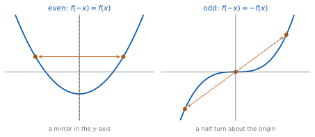
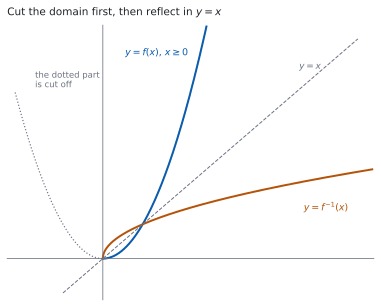

# HL 2.14 — Odd and even functions, and inverses on a restricted domain（偶関数・奇関数・逆関数） {#sec-aahl-2-14}

::: {.callout-note}
## What you should be able to do
- $f(-x)$ を計算して、**偶関数・奇関数・どちらでもない**を判定できる。
- 偶関数・奇関数のグラフの**対称性**を言える。
- **周期関数**の意味を知り、$f(x+T) = f(x)$ を使って値を出せる。
- **逆関数 $f^{-1}(x)$** を求められる。
- 逆関数をもつように**定義域を制限**できる。
- $f^{-1}$ の**定義域と値域**を、$f$ のものから言える。
- **self-inverse**（自分自身が逆関数）であることを示せる。
:::

## The idea

### 1. Even and odd functions（偶関数と奇関数） {#even-odd}

シラバスは、定義を式で書いています。

> Odd and even functions.

> Even: $f(-x) = f(x)$
>
> Odd: $f(-x) = -f(x)$

**判定の手順は、いつも同じです。**

1. $f(-x)$ を計算する。
2. $f(x)$ と同じなら **even**。
3. $-f(x)$ と同じなら **odd**。
4. どちらでもなければ **neither**。

$f(x) = x^{2}-4$ で試します。

$$
f(-x) = (-x)^{2} - 4 = x^{2} - 4 = f(x)
$$

**even です。** 次に $g(x) = x^{3}-x$ です。

$$
g(-x) = -x^{3} + x = -\left(x^{3}-x\right) = -g(x)
$$

**odd です。** 最後に $h(x) = x^{2}+x$ です。

$$
h(-x) = x^{2} - x
$$

これは $h(x) = x^{2}+x$ とも $-h(x) = -x^{2}-x$ とも違います。**neither です。**

::: {.callout-important}
## 「どちらでもない」がふつうです
even でも odd でもない関数のほうが、ずっと多いです。**「even でなければ odd」ではありません。**

覚え方としては、**$x$ の指数がすべて偶数なら even、すべて奇数なら odd**（定数項は $x^{0}$ なので偶数の仲間）です。$x^{2}+x$ のように混ざっていると、どちらでもありません。
:::

### 2. The symmetry of the graph（グラフの対称性） {#symmetry}

{#fig-aahl214-idea-a width=100%}

@fig-aahl214-idea-a のとおり、定義は**グラフの対称性**として見えます。

: 対称性 {#tbl-aahl214-symmetry}

| 種類 | 式 | グラフ |
|---|---|---|
| even | $f(-x) = f(x)$ | $y$ 軸について**線対称** |
| odd | $f(-x) = -f(x)$ | 原点について**点対称**（半回転で重なる） |

**odd な関数が $x = 0$ で定義されていれば、$f(0) = 0$ です。** $f(0) = -f(0)$ から $2f(0) = 0$ となるからです。**グラフは原点を通ります。**

::: {.callout-tip}
## 判定は、式のほうが速いことが多いです
グラフをかいてから対称性を見るより、$f(-x)$ を計算するほうが速く、確かです。

$(-x)^{2} = x^{2}$、$(-x)^{3} = -x^{3}$ と、**指数が偶数か奇数かで符号が決まる**ところだけ気をつけてください。
:::

### 3. Periodic functions（周期関数） {#periodic}

シラバスは、$1$ 行だけ足しています。

> Includes periodic functions.

**ある正の数 $T$ があって、定義域のどの $x$ でも**

$$
f(x+T) = f(x)
$$ {#eq-aahl214-period}

が成り立つとき、$f$ を**周期関数**、いちばん小さいそのような $T$ を**周期（period）** と呼びます。

たとえば「周期が $4$ で、$0 \leq x < 4$ では $f(x) = x$」という関数なら

$$
f(6) = f(6-4) = f(2) = 2, \qquad f(-1) = f(-1+4) = f(3) = 3
$$

です。**$T$ を足したり引いたりして、$0 \leq x < 4$ に入れてから計算します。**

**周期は、いちばん小さいものを答えます。** $T$ が周期なら $2T$ でも @eq-aahl214-period は成り立ちますが、周期と呼ぶのは最小のほうです。

### 4. Finding the inverse function（逆関数を求める） {#inverse}

シラバスは、次のように書いています。

> Finding the inverse function, $f^{-1}(x)$, including domain restriction.

逆関数は SL で扱いました（[SL 2.5](../../aa-sl/02-functions/aasl-2-5.qmd)）。求め方は $3$ 手です。

1. $y = f(x)$ と置く。
2. **$x$ について解く。**
3. $x$ と $y$ を入れかえる（または、出た式の $y$ を $x$ に書きかえる）。

$f(x) = \dfrac{2x+1}{x-3}$（$x \neq 3$）でやります。

$$
y = \frac{2x+1}{x-3} \ \Rightarrow \ y(x-3) = 2x+1
$$

**$x$ の入っている項を左に集めます。**

$$
xy - 3y = 2x + 1 \ \Rightarrow \ xy - 2x = 3y + 1 \ \Rightarrow \ x(y-2) = 3y+1
$$

$$
x = \frac{3y+1}{y-2}
$$

$$
f^{-1}(x) = \frac{3x+1}{x-2}, \qquad x \neq 2
$$

**$x$ でくくるところが山です。** $x$ が $2$ か所に出てくるので、集めてからくくります。

### 5. Restricting the domain（定義域を制限する） {#restriction}

{#fig-aahl214-idea-b width=100%}

$f(x) = x^{2}$ には、$\mathbb{R}$ の上では逆関数がありません。$f(2) = f(-2) = 4$ で、**$4$ から戻るときに $2$ と $-2$ のどちらか決まらない**からです。

**逆関数をもつのは、どの値も $1$ 回しかとらない関数だけ**です。$x^{2}$ は $1$ つの値を $2$ 回とっています。

そこで、**定義域を半分に切ります。**

$$
f(x) = x^{2}, \quad x \geq 0 \qquad \Longrightarrow \qquad f^{-1}(x) = \sqrt{x}, \quad x \geq 0
$$

@fig-aahl214-idea-b のとおり、$x \geq 0$ の部分だけを $y = x$ について折り返したものが $f^{-1}$ です。

$2$ 次関数なら、**平方完成をして頂点を見つけ、そこで切ります**（[SL 2.7](../../aa-sl/02-functions/aasl-2-7.qmd)）。$f(x) = x^{2}-6x+5 = (x-3)^{2}-4$ なら、頂点は $x = 3$ なので $x \geq 3$（または $x \leq 3$）に制限します。

::: {.callout-important}
## どちらに切ったかで、$f^{-1}$ の式が変わります
$(x-3)^{2}-4 = y$ から $x = 3 \pm \sqrt{y+4}$ です。$\pm$ のどちらを取るかは、**制限した側**で決まります。

- $x \geq 3$ に制限したなら $f^{-1}(x) = 3 + \sqrt{x+4}$
- $x \leq 3$ に制限したなら $f^{-1}(x) = 3 - \sqrt{x+4}$

**$\pm$ のまま答えると、関数になりません。** どちらか $1$ つを選んで、理由も書いてください。
:::

### 6. Domain and range swap over（定義域と値域の入れかわり） {#domain-range}

$f^{-1}$ は $f$ の入出力を逆にしたものなので、**定義域と値域も入れかわります。**

$$
\text{domain of } f^{-1} = \text{range of } f, \qquad \text{range of } f^{-1} = \text{domain of } f
$$ {#eq-aahl214-swap}

$f(x) = x^{2}-6x+5$（$x \geq 3$）なら、値域は $y \geq -4$ です。ですから

- $f^{-1}$ の定義域は $x \geq -4$
- $f^{-1}$ の値域は $y \geq 3$

です。**$f^{-1}(x) = 3+\sqrt{x+4}$ の中身 $x+4$ が $0$ 以上でなければならない**ことと、ぴったり合っています。

::: {.callout-tip}
## 定義域は、聞かれていなくても書く価値があります
`state its domain` と書かれていなくても、$f^{-1}$ の定義域を書いておくと、**$\pm$ の選び方が合っているか**を自分で確かめられます。

$3 + \sqrt{x+4}$ の値は必ず $3$ 以上です。制限した定義域 $x \geq 3$ と合っています。
:::

### 7. Self-inverse functions（self-inverse な関数） {#self-inverse}

シラバスの $3$ 行目です。

> Self-inverse functions.

**$f^{-1}$ が $f$ 自身と同じになる**関数があります。これを **self-inverse** と呼びます。式では

$$
f\bigl(f(x)\bigr) = x
$$ {#eq-aahl214-self}

です。$f(x) = \dfrac{x+3}{x-1}$（$x \neq 1$）で確かめます。

$$
f\bigl(f(x)\bigr) = \frac{\dfrac{x+3}{x-1}+3}{\dfrac{x+3}{x-1}-1}
$$

分子と分母に $(x-1)$ を掛けます。

$$
= \frac{(x+3) + 3(x-1)}{(x+3) - (x-1)} = \frac{4x}{4} = x
$$

**$x$ に戻りました。** ですから self-inverse です。

**グラフで言うと、$y = x$ について折り返しても変わらない**ということです。

$$
f\bigl(f(x)\bigr) = x \iff f^{-1} = f
$$ {#eq-aahl214-self-equiv}

::: {.callout-tip collapse="true"}
## Paper 2 では、電卓で逆関数を確かめられます
TI-Nspire CX II の Graphs ページに $f(x)$ と、求めた $f^{-1}(x)$ と、直線 $y = x$ の $3$ つを入れます。**$2$ つの曲線が $y = x$ について対称に見えれば、形は合っています。**

self-inverse かどうかも、$f(x)$ と $y = x$ の $2$ つだけを入れて見れば見当が付きます。

**ただし、定義域は画面に出ません。** 制限した範囲や、$x \neq 3$ のような除外は、自分で書く必要があります。

**Paper 1 では使えません。** このページの例題と演習は、すべて手で解けるようにしてあります。
:::

## Why it works

::: {.callout-tip collapse="true"}
## クリックすると開きます

#### なぜ、式の条件が対称性になるのか {#why-symmetry}

グラフの上の点は $\bigl(x,\ f(x)\bigr)$ です。

**even のとき。** $f(-x) = f(x)$ なので、点 $\bigl(-x,\ f(-x)\bigr)$ は $\bigl(-x,\ f(x)\bigr)$ です。$\bigl(x,\ f(x)\bigr)$ と**高さが同じで、左右が逆**なので、$y$ 軸について線対称です。

**odd のとき。** $f(-x) = -f(x)$ なので、点は $\bigl(-x,\ -f(x)\bigr)$ です。**$x$ 座標も $y$ 座標も符号が逆**なので、原点について点対称、つまり半回転で重なります。

#### odd なら、原点を通ります {#why-origin}

$f$ が odd で、$x = 0$ が定義域に入っているとします。定義の $x$ に $0$ を入れると

$$
f(0) = -f(0)
$$

です。移項して $2f(0) = 0$、つまり $f(0) = 0$ です。

**$x = 0$ が定義域にないときは、この話は使えません。** $f(x) = \dfrac{1}{x}$ は odd ですが、$f(0)$ がありません。

#### even でも odd でもある関数 {#why-both}

定義域が $0$ について対称で、$f$ が even でも odd でもあるとします。すると、どの $x$ でも

$$
f(x) = f(-x) = -f(x)
$$

です。左端と右端をくらべると $2f(x) = 0$、つまり $f(x) = 0$ です。

**両方を満たすのは $f(x) = 0$ だけ**です（[演習 8](#exercises)）。

#### なぜ、逆関数は $y = x$ について折り返しになるのか {#why-reflection}

$f$ が $a$ を $b$ に送るなら、$f^{-1}$ は $b$ を $a$ に送ります。つまり

$$
(a,\ b) \ \text{が } f \text{ のグラフ上} \iff (b,\ a) \ \text{が } f^{-1} \text{ のグラフ上}
$$

です。点 $(a,\ b)$ と $(b,\ a)$ は、**直線 $y = x$ について対称**です。座標を入れかえただけだからです。

グラフのすべての点でこれが起こるので、**$2$ つのグラフは $y = x$ について対称**になります。@fig-aahl214-idea-b がその様子です。

**定義域と値域が入れかわる**のも、同じ理由です。$f$ の出力の集まりが $f^{-1}$ の入力の集まりになります。

#### self-inverse な形 {#why-self}

$f(x) = \dfrac{ax+b}{cx+d}$ の逆関数を求めると

$$
y(cx+d) = ax+b \ \Rightarrow \ x(cy-a) = b - dy \ \Rightarrow \ x = \frac{-dy+b}{cy-a}
$$

なので

$$
f^{-1}(x) = \frac{-dx+b}{cx-a}
$$

です。これが $f$ と同じになるのは、分子の $x$ の係数をくらべて $-d = a$、つまり **$d = -a$** のときです。

$$
f(x) = \frac{ax+b}{cx-a} \ \text{は self-inverse}
$$ {#eq-aahl214-self-form}

[第 7 節](#self-inverse) の $\dfrac{x+3}{x-1}$ は $a = 1$、$b = 3$、$c = 1$ で、確かに分母が $x - 1 = cx - a$ の形です。

**この形を覚えておくと、答えの見当が付きます。** ただし答案では、$f\bigl(f(x)\bigr) = x$ を計算するか $f^{-1}$ を求めるかして、**示してください。**
:::

## Worked examples

::: {.callout-note appearance="simple"}
問題文は英語です。意味が理解できなかったら、問題文の下の「**日本語訳**」を開いてください。解説は日本語です。

**例題も演習も、すべて電卓なしで解けます。** Paper 1 のつもりで解いてください。
:::

::: {#exm-aahl214-parity}
[Determine whether each of the following functions is odd, even or neither.]{.q-en}

**(a)** [$f(x) = x^{4}-3x^{2}$]{.q-en}

**(b)** [$g(x) = x^{3}-4x$]{.q-en}

**(c)** [$h(x) = x^{2}+x$]{.q-en}

日本語訳

次のそれぞれの関数が、奇関数・偶関数・どちらでもない、のどれであるかを判定しなさい。

---

**どれも $f(-x)$ を計算するところから始めます**（[第 1 節](#even-odd)）。

**(a)** $(-x)^{4} = x^{4}$、$(-x)^{2} = x^{2}$ なので

$$
f(-x) = x^{4} - 3x^{2} = f(x)
$$

**even です。**

**(b)** $(-x)^{3} = -x^{3}$ なので

$$
g(-x) = -x^{3} + 4x = -\left(x^{3}-4x\right) = -g(x)
$$

**odd です。**

**(c)**

$$
h(-x) = x^{2} - x
$$

$h(x) = x^{2}+x$ とも $-h(x) = -x^{2}-x$ とも違います。**neither です。**

**検算。** **$x = 1$ と $x = -1$ で値をくらべます。** (a) は $f(1) = -2$、$f(-1) = -2$ で同じ ✓ (b) は $g(1) = -3$、$g(-1) = 3$ で符号だけ逆 ✓

**検算（(c) のほう）。** $h(1) = 2$、$h(-1) = 0$ です。同じでも符号が逆でもありません ✓ **$1$ 組の値だけで neither は示せます**が、even・odd のほうは $f(-x)$ の計算が要ります。

::: {.callout-note}
## 解答例（答案用紙に書くこと）

**(a)** $f(-x) = (-x)^{4}-3(-x)^{2} = x^{4}-3x^{2} = f(x)$, *so $f$ is even.*

**(b)** $g(-x) = (-x)^{3}-4(-x) = -x^{3}+4x = -\left(x^{3}-4x\right) = -g(x)$, *so $g$ is odd.*

**(c)** $h(-x) = (-x)^{2}+(-x) = x^{2}-x$, *which is neither $h(x)$ nor $-h(x)$, so $h$ is neither odd nor even.*
:::
:::

::: {#exm-aahl214-inverse}
[Let $f(x) = \dfrac{3x+2}{x-1}$, $x \neq 1$. Find $f^{-1}(x)$ and state its domain.]{.q-en}

日本語訳

$f(x) = \dfrac{3x+2}{x-1}$（$x \neq 1$）とします。$f^{-1}(x)$ を求め、その定義域を書きなさい。

---

$y = f(x)$ と置いて、$x$ について解きます（[第 4 節](#inverse)）。

$$
y = \frac{3x+2}{x-1} \ \Rightarrow \ y(x-1) = 3x+2
$$

$$
xy - y = 3x + 2 \ \Rightarrow \ xy - 3x = y + 2 \ \Rightarrow \ x(y-3) = y+2
$$

$$
x = \frac{y+2}{y-3}
$$

$$
f^{-1}(x) = \frac{x+2}{x-3}, \qquad x \neq 3
$$

**定義域は $x \neq 3$ です。** 分母が $0$ になる値を外します。

**検算。** **$1$ つ通してみます。** $f(2) = \dfrac{8}{1} = 8$ です。$f^{-1}(8) = \dfrac{10}{5} = 2$ ✓ **戻りました。**

**検算（定義域のほう）。** $f$ の値域を考えます。$f(x) = 3 + \dfrac{5}{x-1}$ と書けるので（[HL 2.13](aahl-2-13.qmd#oblique)）、$f(x)$ は $3$ にはなりません。**$f$ の値域が $y \neq 3$** なので、$f^{-1}$ の定義域が $x \neq 3$ になります ✓ @eq-aahl214-swap と合っています。

::: {.callout-note}
## 解答例（答案用紙に書くこと）

$$y = \frac{3x+2}{x-1} \ \Rightarrow \ y(x-1) = 3x+2 \ \Rightarrow \ x(y-3) = y+2$$

$$x = \frac{y+2}{y-3}, \qquad \text{so} \qquad f^{-1}(x) = \frac{x+2}{x-3}$$

*The domain of $f^{-1}$ is $x \in \mathbb{R}$, $x \neq 3$.*
:::
:::

::: {#exm-aahl214-restrict}
[Let $f(x) = x^{2}-6x+5$, $x \in \mathbb{R}$.]{.q-en}

**(a)** [Explain why $f$ does not have an inverse function.]{.q-en}

**(b)** [Write $f(x)$ in the form $(x-h)^{2}+k$, and hence state the smallest value of $a$ for which $f$ has an inverse on the domain $x \geq a$.]{.q-en}

**(c)** [For that domain, find $f^{-1}(x)$ and state its domain and its range.]{.q-en}

日本語訳

$f(x) = x^{2}-6x+5$（$x \in \mathbb{R}$）とします。

**(a)** $f$ に逆関数がない理由を説明しなさい。

**(b)** $f(x)$ を $(x-h)^{2}+k$ の形で書き、$x \geq a$ という定義域で $f$ が逆関数をもつような、いちばん小さい $a$ の値を書きなさい。

**(c)** その定義域について $f^{-1}(x)$ を求め、その定義域と値域を書きなさい。

---

**(a)** $f(2) = 4-12+5 = -3$ と $f(4) = 16-24+5 = -3$ で、**同じ値を $2$ 回とっています。**

::: {.model-answer}
**試験ではこう書く**

*An inverse function must send each value of $f$ back to a single value of $x$. Here $f(2) = 4-12+5 = -3$ and $f(4) = 16-24+5 = -3$, so the value $-3$ comes from two different inputs, $x = 2$ and $x = 4$. There is no way to decide which of them $-3$ should be sent back to, so no inverse function exists on $\mathbb{R}$. This happens because the graph is a parabola: it is not one-to-one, since every horizontal line above the vertex meets it twice.*
:::

（$f(2)$ と $f(4)$ が同じ値なので、戻すときにどちらか決まらない。放物線は $1$ 対 $1$ でない、という意味です。）

**(b)** 平方完成します。

$$
x^{2}-6x+5 = (x-3)^{2} - 9 + 5 = (x-3)^{2} - 4
$$

頂点は $x = 3$ です。**$x \geq 3$ では右半分だけになり、同じ値を $2$ 回とりません。** いちばん小さい $a$ は

$$
a = 3
$$

**(c)** $y = (x-3)^{2}-4$ から

$$
(x-3)^{2} = y+4 \ \Rightarrow \ x - 3 = \pm\sqrt{y+4}
$$

**$x \geq 3$ なので $x-3 \geq 0$、つまり $+$ のほう**です（[第 5 節](#restriction)）。

$$
x = 3 + \sqrt{y+4}, \qquad f^{-1}(x) = 3 + \sqrt{x+4}
$$

$f$ の値域は $y \geq -4$ なので、@eq-aahl214-swap から

- $f^{-1}$ の**定義域**は $x \geq -4$
- $f^{-1}$ の**値域**は $y \geq 3$

**検算。** **$1$ つ通します。** $f(5) = 25-30+5 = 0$ です。$f^{-1}(0) = 3+\sqrt{4} = 5$ ✓

**検算（$\pm$ の選び方）。** $f^{-1}(x) = 3+\sqrt{x+4}$ の値は必ず $3$ 以上です。制限した定義域 $x \geq 3$ と合っています ✓ $3-\sqrt{x+4}$ なら $3$ 以下になり、合いません。

::: {.callout-note}
## 解答例（答案用紙に書くこと）

**(a)** *$f(2) = -3$ and $f(4) = -3$, so $f$ is not one-to-one and has no inverse on $\mathbb{R}$.*

**(b)** $f(x) = (x-3)^{2}-4$, *so the vertex is at $x = 3$ and the smallest such $a$ is $a = 3$.*

**(c)** $y = (x-3)^{2}-4 \ \Rightarrow \ x-3 = \pm\sqrt{y+4}$

*Since $x \geq 3$ we take the positive square root:*

$$f^{-1}(x) = 3+\sqrt{x+4}$$

*Domain: $x \geq -4$. Range: $y \geq 3$.*
:::
:::

::: {#exm-aahl214-self}
[Let $f(x) = \dfrac{4x+1}{x-4}$, $x \neq 4$.]{.q-en}

**(a)** [Find $f^{-1}(x)$.]{.q-en}

**(b)** [Hence state, with a reason, whether $f$ is self-inverse.]{.q-en}

日本語訳

$f(x) = \dfrac{4x+1}{x-4}$（$x \neq 4$）とします。

**(a)** $f^{-1}(x)$ を求めなさい。

**(b)** それを使って、$f$ が self-inverse かどうかを理由をつけて書きなさい。

---

**(a)** [例題 2](#exm-aahl214-inverse) と同じ手順です。

$$
y(x-4) = 4x+1 \ \Rightarrow \ xy - 4y = 4x + 1 \ \Rightarrow \ x(y-4) = 4y+1
$$

$$
f^{-1}(x) = \frac{4x+1}{x-4}, \qquad x \neq 4
$$

**(b)** $f^{-1}(x)$ が $f(x)$ とまったく同じ式になりました。定義域も同じ $x \neq 4$ です。**ですから $f$ は self-inverse です。**

**検算。** **$f\bigl(f(x)\bigr)$ を計算します。**

$$
f\bigl(f(x)\bigr) = \frac{4 \cdot \dfrac{4x+1}{x-4} + 1}{\dfrac{4x+1}{x-4} - 4}
= \frac{4(4x+1) + (x-4)}{(4x+1) - 4(x-4)} = \frac{17x}{17} = x
$$

$x$ に戻りました ✓ @eq-aahl214-self と合います。

**検算（数で）。** $f(5) = \dfrac{21}{1} = 21$、$f(21) = \dfrac{85}{17} = 5$ ✓ **$2$ 回で戻りました。**

::: {.callout-note}
## 解答例（答案用紙に書くこと）

**(a)** $y(x-4) = 4x+1 \ \Rightarrow \ x(y-4) = 4y+1$

$$f^{-1}(x) = \frac{4x+1}{x-4}, \qquad x \neq 4$$

**(b)** *$f^{-1}(x) = f(x)$ and the two functions have the same domain $x \neq 4$, so $f$ is self-inverse.*
:::
:::

## Common errors

::: {.callout-warning}
## 「even でなければ odd」と考える
$3$ つ目の答え **neither** があります（[第 1 節](#even-odd)）。$x^{2}+x$ のように、指数が偶数と奇数で混ざっていると、どちらでもありません。

**$f(-x)$ を $f(x)$ と $-f(x)$ の両方とくらべてください。**
:::

::: {.callout-warning}
## $(-x)^{2}$ を $-x^{2}$ と書く
$(-x)^{2} = x^{2}$ です。$-x^{2}$ ではありません。**かっこごと $2$ 乗する**ところに気をつけてください。

$(-x)^{3} = -x^{3}$、$(-x)^{4} = x^{4}$ です。**指数が偶数なら符号が消え、奇数なら残ります。**
:::

::: {.callout-warning}
## $f^{-1}(x)$ を $\dfrac{1}{f(x)}$ と取りちがえる
$f^{-1}$ の $-1$ は、**逆関数の記号**です。逆数ではありません。

$f(x) = 2x$ なら $f^{-1}(x) = \dfrac{x}{2}$ で、$\dfrac{1}{2x}$ ではありません。
:::

::: {.callout-warning}
## $\pm$ のまま答える
$x = 3 \pm \sqrt{y+4}$ で止めると、**関数になっていません**（[第 5 節](#restriction)）。

制限した定義域を見て、**$+$ と $-$ のどちらかを選び、理由を書いてください。**
:::

::: {.callout-warning}
## 定義域と値域の入れかえを忘れる
$f^{-1}$ の定義域は、**$f$ の値域**です（[第 6 節](#domain-range)）。$f$ の定義域ではありません。

$f(x) = x^{2}$（$x \geq 0$）なら、$f^{-1}(x) = \sqrt{x}$ の定義域は $x \geq 0$、値域も $y \geq 0$ です。**入れかえてから書く**と決めておいてください。
:::

::: {.callout-warning}
## self-inverse を $f(x) = x$ と取りちがえる
self-inverse は $f\bigl(f(x)\bigr) = x$ であって、$f(x) = x$ ではありません（[第 7 節](#self-inverse)）。

**$2$ 回かけて戻ればよい**ので、$1$ 回では動いてかまいません。$\dfrac{x+3}{x-1}$ は $x$ を動かしますが、self-inverse です。
:::

## Exercises

::: {.callout-note appearance="simple"}
各問題に、折りたたみが $3$ つ付いています。**日本語訳**、**解答例**（答案用紙に書くべきこと。英語です）、**解説**（なぜそうなるか。日本語です）。

まず自分で解いて、次に解答例と見くらべてください。**解説は、合わなかったときだけ開けば十分です。**
:::

::: {.exercise-block}

[1]{.ex-no} [Determine whether each of the following functions is odd, even or neither: $f(x) = 3x^{4}+x^{2}$, $g(x) = x^{5}-x$, $h(x) = x^{3}+1$.]{.q-en}

日本語訳

次のそれぞれの関数が、奇関数・偶関数・どちらでもない、のどれであるかを判定しなさい。$f(x) = 3x^{4}+x^{2}$、$g(x) = x^{5}-x$、$h(x) = x^{3}+1$。

::: {.callout-note collapse="true"}
## 解答例（答案用紙に書くこと）

$f(-x) = 3x^{4}+x^{2} = f(x)$, *so $f$ is even.*

$g(-x) = -x^{5}+x = -\left(x^{5}-x\right) = -g(x)$, *so $g$ is odd.*

$h(-x) = -x^{3}+1$, *which is neither $h(x)$ nor $-h(x)$, so $h$ is neither.*
:::

::: {.callout-tip collapse="true"}
## 解説

$h$ の $+1$ は $x^{0}$ の項なので、**偶数の仲間**です。$x^{3}$ が奇数なので混ざっていて、neither になります（[第 1 節](#even-odd)）。

**検算。** $h(1) = 2$、$h(-1) = 0$ です。同じでも符号が逆でもありません ✓

**検算（$g$ のほう）。** $g(2) = 30$、$g(-2) = -30$ ✓ 符号だけが逆です。
:::

::: {.ex-sep}
:::

[2]{.ex-no} [Let $f(x) = 2x-5$, $x \in \mathbb{R}$. Find $f^{-1}(x)$.]{.q-en}

日本語訳

$f(x) = 2x-5$（$x \in \mathbb{R}$）とします。$f^{-1}(x)$ を求めなさい。

::: {.callout-note collapse="true"}
## 解答例（答案用紙に書くこと）

$$y = 2x-5 \ \Rightarrow \ x = \frac{y+5}{2}$$

$$f^{-1}(x) = \frac{x+5}{2}$$
:::

::: {.callout-tip collapse="true"}
## 解説

$1$ 次関数なので、$x$ を集める手間はありません（[第 4 節](#inverse)）。

**定義域は $\mathbb{R}$ のままです。** $f$ の値域が $\mathbb{R}$ だからです。

**検算。** $f(3) = 1$、$f^{-1}(1) = \dfrac{6}{2} = 3$ ✓

**検算（式のほう）。** $f^{-1}\bigl(f(x)\bigr) = \dfrac{(2x-5)+5}{2} = \dfrac{2x}{2} = x$ ✓
:::

::: {.ex-sep}
:::

[3]{.ex-no} [Let $f(x) = \dfrac{4x-1}{x+2}$, $x \neq -2$. Find $f^{-1}(x)$ and state its domain.]{.q-en}

日本語訳

$f(x) = \dfrac{4x-1}{x+2}$（$x \neq -2$）とします。$f^{-1}(x)$ を求め、その定義域を書きなさい。

::: {.callout-note collapse="true"}
## 解答例（答案用紙に書くこと）

$$y(x+2) = 4x-1 \ \Rightarrow \ xy+2y = 4x-1 \ \Rightarrow \ x(y-4) = -2y-1$$

$$x = \frac{-2y-1}{y-4} = \frac{2y+1}{4-y}$$

$$f^{-1}(x) = \frac{2x+1}{4-x}, \qquad x \neq 4$$
:::

::: {.callout-tip collapse="true"}
## 解説

**$x$ の項を左に集めて、$x$ でくくります**（[例題 2](#exm-aahl214-inverse)）。分子と分母の符号を両方変えると、見やすい形になります。

**検算。** $f(1) = \dfrac{3}{3} = 1$ です。$f^{-1}(1) = \dfrac{3}{3} = 1$ ✓

**検算（別の値で）。** $f(0) = \dfrac{-1}{2}$ です。$f^{-1}\left(-\dfrac{1}{2}\right) = \dfrac{-1+1}{4+\frac{1}{2}} = 0$ ✓ **戻りました。**
:::

::: {.ex-sep}
:::

[4]{.ex-no} [Let $f(x) = x^{2}+4x+7$, $x \geq -2$.]{.q-en}

**(a)** [Write $f(x)$ in the form $(x-h)^{2}+k$.]{.q-en}

**(b)** [Find $f^{-1}(x)$, and state its domain and its range.]{.q-en}

日本語訳

$f(x) = x^{2}+4x+7$（$x \geq -2$）とします。

**(a)** $f(x)$ を $(x-h)^{2}+k$ の形で書きなさい。

**(b)** $f^{-1}(x)$ を求め、その定義域と値域を書きなさい。

::: {.callout-note collapse="true"}
## 解答例（答案用紙に書くこと）

**(a)** $f(x) = (x+2)^{2}+3$

**(b)** $y = (x+2)^{2}+3 \ \Rightarrow \ x+2 = \pm\sqrt{y-3}$

*Since $x \geq -2$ we have $x+2 \geq 0$, so we take the positive root:*

$$f^{-1}(x) = -2+\sqrt{x-3}$$

*Domain: $x \geq 3$. Range: $y \geq -2$.*
:::

::: {.callout-tip collapse="true"}
## 解説

頂点は $x = -2$ で、問題の定義域はちょうどそこから右です。**$+$ のほうを取ります**（[第 5 節](#restriction)）。

$f$ の値域は $y \geq 3$ なので、$f^{-1}$ の定義域が $x \geq 3$ です（[第 6 節](#domain-range)）。

**検算。** $f(0) = 7$ です。$f^{-1}(7) = -2+\sqrt{4} = 0$ ✓

**検算（値域のほう）。** $\sqrt{x-3} \geq 0$ なので $f^{-1}(x) \geq -2$ ✓ もとの定義域と一致しました。
:::

::: {.ex-sep}
:::

[5]{.ex-no} [Show that $f(x) = \dfrac{2x+5}{x-2}$, $x \neq 2$, is self-inverse.]{.q-en}

日本語訳

$f(x) = \dfrac{2x+5}{x-2}$（$x \neq 2$）が self-inverse であることを示しなさい。

::: {.callout-note collapse="true"}
## 解答例（答案用紙に書くこと）

$$f\bigl(f(x)\bigr) = \frac{2 \cdot \dfrac{2x+5}{x-2}+5}{\dfrac{2x+5}{x-2}-2}
= \frac{2(2x+5)+5(x-2)}{(2x+5)-2(x-2)}$$

$$= \frac{4x+10+5x-10}{2x+5-2x+4} = \frac{9x}{9} = x$$

*Hence $f$ is self-inverse.*
:::

::: {.callout-tip collapse="true"}
## 解説

**分子と分母に $(x-2)$ を掛ける**のが、いちばん短い道です（[第 7 節](#self-inverse)）。$f^{-1}$ を求めて $f$ と同じだと示してもかまいません。

**検算。** $f(3) = \dfrac{11}{1} = 11$、$f(11) = \dfrac{27}{9} = 3$ ✓ **$2$ 回で戻りました。**

**検算（形のほう）。** 分母は $x-2$ で、分子の $x$ の係数 $2$ の符号を変えた形です。[Why it works](#why-self) の $\dfrac{ax+b}{cx-a}$ に当てはまっています ✓
:::

::: {.ex-sep}
:::

[6]{.ex-no} [The function $f(x) = x^{3}+ax^{2}+bx+c$ is odd for all real $x$. Find the value of $a$ and the value of $c$.]{.q-en}

日本語訳

関数 $f(x) = x^{3}+ax^{2}+bx+c$ が、すべての実数 $x$ について奇関数であるとします。$a$ と $c$ の値を求めなさい。

::: {.callout-note collapse="true"}
## 解答例（答案用紙に書くこと）

$$f(-x) = -x^{3}+ax^{2}-bx+c, \qquad -f(x) = -x^{3}-ax^{2}-bx-c$$

*For $f$ to be odd these must be equal for all $x$. Comparing the $x^{2}$ terms: $a = -a$, so $a = 0$. Comparing the constant terms: $c = -c$, so $c = 0$.*
:::

::: {.callout-tip collapse="true"}
## 解説

**$f(-x)$ と $-f(x)$ の係数をくらべます**（[HL 2.12](aahl-2-12.qmd#factorising) の係数の比較と同じ考え方です）。

**$b$ は決まりません。** $x$ の項はどちらでも $-bx$ で、条件が出ないからです。

**検算。** $a = c = 0$ とすると $f(x) = x^{3}+bx$ です。$f(-x) = -x^{3}-bx = -f(x)$ ✓

**検算（$f(0)$ で）。** odd な関数は $f(0) = 0$ でした（[第 2 節](#symmetry)）。$f(0) = c$ なので $c = 0$ ✓ **別の道でも同じ答えです。**
:::

::: {.ex-sep}
:::

[7]{.ex-no} [A function $f$ has period $4$, and $f(x) = x^{2}$ for $0 \leq x < 4$. Find $f(10)$ and $f(-3)$.]{.q-en}

日本語訳

関数 $f$ の周期は $4$ で、$0 \leq x < 4$ では $f(x) = x^{2}$ です。$f(10)$ と $f(-3)$ を求めなさい。

::: {.callout-note collapse="true"}
## 解答例（答案用紙に書くこと）

$$f(10) = f(10-4-4) = f(2) = 2^{2} = 4$$

$$f(-3) = f(-3+4) = f(1) = 1^{2} = 1$$
:::

::: {.callout-tip collapse="true"}
## 解説

**$4$ を足したり引いたりして、$0 \leq x < 4$ に入れてから**式を使います（[第 3 節](#periodic)）。

$10$ からは $4$ を $2$ 回引きます。$-3$ には $4$ を $1$ 回足します。

**検算。** $2$ と $10$ は $8 = 4 \times 2$ だけ離れています ✓ 周期の整数倍です。

**検算（もう $1$ つ）。** $f(6) = f(2) = 4$ で、$f(10)$ と同じ値です ✓ **$4$ おきに同じ値が出ます。**
:::

::: {.ex-sep}
:::

[8]{.ex-no} [A function $f$ is both odd and even, and its domain is symmetric about $0$. Show that $f(x) = 0$ for every $x$ in the domain.]{.q-en}

日本語訳

関数 $f$ は奇関数でも偶関数でもあり、その定義域は $0$ について対称であるとします。定義域のどの $x$ についても $f(x) = 0$ であることを示しなさい。

::: {.callout-note collapse="true"}
## 解答例（答案用紙に書くこと）

*Let $x$ be in the domain. Then $-x$ is also in the domain, since the domain is symmetric about $0$.*

*Since $f$ is even, $f(-x) = f(x)$. Since $f$ is odd, $f(-x) = -f(x)$.*

$$f(x) = f(-x) = -f(x) \ \Rightarrow \ 2f(x) = 0 \ \Rightarrow \ f(x) = 0$$

*This holds for every $x$ in the domain.*
:::

::: {.callout-tip collapse="true"}
## 解説

**$2$ つの定義を並べて、$f(-x)$ でつなぐ**のが要です（[Why it works](#why-both)）。

「定義域が $0$ について対称」という条件は、**$-x$ も定義域に入っている**ことを保証するために要ります。

**検算。** $f(x) = 0$ は、確かに even（$0 = 0$）でも odd（$0 = -0$）でもあります ✓

**検算（ほかにないか）。** $f(x) = x^{2}$ は even ですが odd ではありません。$f(x) = x^{3}$ は odd ですが even ではありません ✓ **両方を満たすのは $0$ だけです。**

::: {.model-answer}
**試験ではこう書く**

*Let $x$ be any element of the domain. Because the domain is symmetric about $0$, the number $-x$ also lies in the domain, so both $f(x)$ and $f(-x)$ are defined. Since $f$ is even, $f(-x) = f(x)$. Since $f$ is also odd, $f(-x) = -f(x)$. The left-hand sides are the same number, so $f(x) = -f(x)$. Adding $f(x)$ to both sides gives $2f(x) = 0$, and dividing by $2$ gives $f(x) = 0$. Since $x$ was an arbitrary element of the domain, $f(x) = 0$ for every $x$ in the domain, so $f$ is the zero function.*
:::
:::

::: {.ex-sep}
:::

[9]{.ex-no} [Let $f(x) = x^{2}-4x$, $x \leq 2$.]{.q-en}

**(a)** [Find the range of $f$.]{.q-en}

**(b)** [Find $f^{-1}(x)$, and state its domain and its range.]{.q-en}

日本語訳

$f(x) = x^{2}-4x$（$x \leq 2$）とします。

**(a)** $f$ の値域を求めなさい。

**(b)** $f^{-1}(x)$ を求め、その定義域と値域を書きなさい。

::: {.callout-note collapse="true"}
## 解答例（答案用紙に書くこと）

**(a)** $f(x) = (x-2)^{2}-4$

*On $x \leq 2$ the expression $x-2$ takes every value $\leq 0$, so $(x-2)^{2}$ takes every value $\geq 0$. Hence the range of $f$ is $y \geq -4$.*

**(b)** $y = (x-2)^{2}-4 \ \Rightarrow \ x-2 = \pm\sqrt{y+4}$

*Since $x \leq 2$ we have $x-2 \leq 0$, so we take the negative root:*

$$f^{-1}(x) = 2-\sqrt{x+4}$$

*Domain: $x \geq -4$. Range: $y \leq 2$.*
:::

::: {.callout-tip collapse="true"}
## 解説

**今度は左半分**なので、$-$ のほうを取ります（[第 5 節](#restriction)）。[例題 3](#exm-aahl214-restrict) と符号が逆になります。

**検算。** $f(0) = 0$ です。$f^{-1}(0) = 2-\sqrt{4} = 0$ ✓

**検算（値域のほう）。** $\sqrt{x+4} \geq 0$ なので $2-\sqrt{x+4} \leq 2$ ✓ もとの定義域 $x \leq 2$ と一致しました。

::: {.model-answer}
**試験ではこう書く**

*Completing the square, $f(x) = (x-2)^{2}-4$. Solving $y = (x-2)^{2}-4$ for $x$ gives $(x-2)^{2} = y+4$ and hence $x-2 = \pm\sqrt{y+4}$. Only one of these two signs can be kept, because an inverse function must give a single output. The domain of $f$ is $x \leq 2$, so $x-2 \leq 0$, and the square root $\sqrt{y+4}$ is never negative; therefore $x-2 = -\sqrt{y+4}$ and $f^{-1}(x) = 2-\sqrt{x+4}$. The domain of $f^{-1}$ is the range of $f$, which is $x \geq -4$, and the range of $f^{-1}$ is the domain of $f$, which is $y \leq 2$. As a check, $2-\sqrt{x+4} \leq 2$ for every $x \geq -4$, which matches that range.*
:::
:::

::: {.ex-sep}
:::

[10]{.ex-no} [A student writes: "Since $f(x) = x^{2}$ has inverse $f^{-1}(x) = \sqrt{x}$, we have $f^{-1}\bigl(f(-3)\bigr) = -3$." Explain the error.]{.q-en}

日本語訳

ある生徒が、次のように書きました。「$f(x) = x^{2}$ の逆関数は $f^{-1}(x) = \sqrt{x}$ だから、$f^{-1}\bigl(f(-3)\bigr) = -3$ である。」まちがいを説明しなさい。

::: {.callout-note collapse="true"}
## 解答例（答案用紙に書くこと）

*On $\mathbb{R}$ the function $f(x) = x^{2}$ has no inverse, because $f(3) = f(-3) = 9$ and so $f$ is not one-to-one.*

*The function $\sqrt{x}$ is the inverse of $x^{2}$ only on the restricted domain $x \geq 0$, and $-3$ is not in that domain.*

$$f(-3) = 9, \qquad \sqrt{9} = 3 \neq -3$$
:::

::: {.callout-tip collapse="true"}
## 解説

**$\sqrt{\ }$ は、いつも $0$ 以上の値を返します。** ですから $\sqrt{x^{2}}$ が $x$ に戻るのは、$x \geq 0$ のときだけです。

**検算。** $f(-3) = 9$、$\sqrt{9} = 3$ です ✓ $-3$ には戻りません。

**検算（$x \geq 0$ なら）。** $f(3) = 9$、$\sqrt{9} = 3$ ✓ こちらは戻ります。

::: {.model-answer}
**試験ではこう書く**

*The statement $f^{-1}\bigl(f(x)\bigr) = x$ holds only when $f$ actually has an inverse on the domain being used. On $\mathbb{R}$ the function $f(x) = x^{2}$ is not one-to-one: $f(3) = 9$ and $f(-3) = 9$, so the value $9$ comes from two different inputs and no inverse function exists. The function $\sqrt{x}$ is the inverse of $x^{2}$ only after the domain has been restricted to $x \geq 0$, and $-3$ does not lie in that restricted domain. Working through the numbers, $f(-3) = 9$ and $\sqrt{9} = 3$, so the student's calculation actually gives $3$, not $-3$. In general $\sqrt{x^{2}}$ equals $x$ only for $x \geq 0$.*
:::
:::

:::
