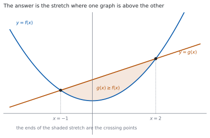
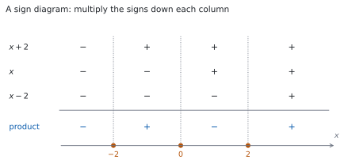

# HL 2.15 — Solving $g(x) \geq f(x)$（不等式をグラフでも式でも解く） {#sec-aahl-2-15}

::: {.callout-note}
## What you should be able to do
- 不等式を、**すべて片側に寄せた形**に直せる。
- グラフから、**どちらが上か**を読んで答えを書ける。
- $2$ 次・$3$ 次の不等式を、因数分解と**符号の表**で解ける。
- 重解があるときの符号の変わり方を言える。
- 分数を含む不等式で、**両辺に掛けてはいけない**理由を言える。
- 答えを、$-1 \leq x \leq 2$ のような**範囲の形**で書ける。
:::

## The idea

### 1. Working with the difference（不等式は「差」で考える） {#difference}

シラバスは、次のように書いています。

> Solutions of $g(x) \geq f(x)$, both graphically and analytically.

**$2$ つの関数をくらべる**問題です。$g(x) \geq f(x)$ は、移項すれば

$$
g(x) - f(x) \geq 0
$$ {#eq-aahl215-difference}

と同じです。**差が $0$ 以上になる $x$ の範囲**を答えます。

**寄せる向きは、どちらでもかまいません。** ただし**負の数で割ったり掛けたりすると、不等号の向きが変わる**ので、最高次の係数が正になるように寄せると安全です。

Guidance は、扱う範囲を決めています。

> Graphical or algebraic methods for simple polynomials up to degree 3. Use of technology for these and other functions.

**手で解くのは $3$ 次まで**です。それ以外は電卓を使います。

::: {.callout-important}
## 公式集には、この項目の欄がありません
覚える式はありません。**手順**を覚えます。

答えの書き方だけは、決まった形にしてください。**$-1 \leq x \leq 2$**、**$x \leq -3$ または $x \geq 3$** のように書きます。
:::

### 2. Solving graphically（グラフで解く） {#graphical}

{#fig-aahl215-idea-a width=100%}

$f(x) = x^{2}$、$g(x) = x+2$ として、$g(x) \geq f(x)$ を解きます。

@fig-aahl215-idea-a のとおり、**直線が放物線より上にあるのは、$2$ つの交点のあいだ**です。交点は

$$
x + 2 = x^{2} \ \Rightarrow \ x^{2}-x-2 = 0 \ \Rightarrow \ (x-2)(x+1) = 0
$$

から $x = -1$ と $x = 2$ です。ですから答えは

$$
-1 \leq x \leq 2
$$

です。**交点そのものは、$\geq$ なので入ります。**

$$
\text{交点を求める} \to \text{どちらが上かを見る} \to \text{範囲を書く}
$$ {#eq-aahl215-graph-steps}

::: {.callout-tip}
## グラフで解くときも、交点は式で出します
`graphically` と書かれていても、**交点の座標は方程式を解いて出す**のがふつうです。

グラフは、**どちらが上か**を決めるために使います。目で読んだ交点の値をそのまま答えにはしません。
:::

### 3. Solving analytically: three steps（式で解く：$3$ つの手順） {#analytic}

グラフをかかずに解くときは、次の $3$ 手です。

1. **すべて片側に寄せて、$(\text{式}) \geq 0$ の形にする。**
2. **因数分解して、$0$ になる $x$（critical values）を出す。**
3. **各区間で符号を調べて、条件に合う区間を書く。**

$2$ 次なら、放物線の向きを考えるだけで $3$ 番目が済みます。$3$ 次以上では、**符号の表**（[第 5 節](#cubic)）を使います。

::: {.callout-important}
## 両辺を $x$ で割ってはいけません
$x^{2} \geq 4x$ の両辺を $x$ で割って $x \geq 4$ とするのは、まちがいです。

**$x$ が負なら不等号の向きが変わり、$x = 0$ なら割れない**からです。

$$
x^{2}-4x \geq 0 \ \Rightarrow \ x(x-4) \geq 0
$$

と**寄せてから**因数分解します。答えは $x \leq 0$ または $x \geq 4$ です。
:::

### 4. Quadratic inequalities（$2$ 次の不等式） {#quadratic}

$x^{2}-x-2 \leq 0$ を解きます。因数分解して

$$
(x-2)(x+1) \leq 0
$$

です。critical values は $-1$ と $2$ です。

**$x^{2}$ の係数が正なので、放物線は下に凸**です。$x$ 軸より下（または上）にあるのは、**$2$ つの交点のあいだ**です。

$$
-1 \leq x \leq 2
$$

**$2$ 次では、この形を覚えておくと速いです。**

: $2$ 次不等式の答えの形（$a > 0$、実数解が $2$ つのとき） {#tbl-aahl215-quadratic}

| 不等式 | 答えの形 |
|---|---|
| $a(x-p)(x-q) \leq 0$（$p < q$） | $p \leq x \leq q$（あいだ） |
| $a(x-p)(x-q) \geq 0$ | $x \leq p$ または $x \geq q$（外側） |

**「あいだ」か「外側」か**の $2$ 通りだけです。

### 5. Cubic inequalities and sign diagrams（$3$ 次の不等式と符号の表） {#cubic}

{#fig-aahl215-idea-b width=100%}

$x^{3} \geq 4x$ を解きます。**まず寄せます。**

$$
x^{3} - 4x \geq 0 \ \Rightarrow \ x\left(x^{2}-4\right) \geq 0 \ \Rightarrow \ x(x-2)(x+2) \geq 0
$$

critical values は $-2$、$0$、$2$ です。この $3$ つで、数直線が $4$ つの区間に分かれます。

@fig-aahl215-idea-b が**符号の表**です。各因数の符号を区間ごとに書き、**縦にかけ算**すると積の符号が出ます。

: 符号の表 {#tbl-aahl215-sign}

| 区間 | $x+2$ | $x$ | $x-2$ | 積 |
|---|---|---|---|---|
| $x < -2$ | $-$ | $-$ | $-$ | $-$ |
| $-2 < x < 0$ | $+$ | $-$ | $-$ | $+$ |
| $0 < x < 2$ | $+$ | $+$ | $-$ | $-$ |
| $x > 2$ | $+$ | $+$ | $+$ | $+$ |

積が $0$ 以上なのは $2$ 番目と $4$ 番目です。critical values も入れて

$$
-2 \leq x \leq 0 \quad \text{または} \quad x \geq 2
$$

**符号は、critical value をまたぐたびに変わります**（因数が $1$ 回ずつしか出てこないとき）。ですから、**いちばん右の区間だけ調べて、左へ交互に書く**こともできます。

### 6. When there is a repeated root（重解があるとき） {#repeated}

同じ因数が $2$ 回現れると、**符号が変わりません**（[HL 2.12](aahl-2-12.qmd#repeated)）。

$(x+1)(x-2)^{2} \geq 0$ を見ます。$(x-2)^{2}$ は $2$ 乗なので、いつでも $0$ 以上です。ですから積の符号は $(x+1)$ だけで決まります。

- $x < -1$：$(x+1) < 0$ なので、積は負
- $x > -1$：$(x+1) > 0$ なので、積は正（ただし $x = 2$ では $0$）

$$
x \geq -1
$$

が答えです。**$x = 2$ は、値が $0$ なので $\geq$ には入ります。**

**「またぐたびに符号が変わる」は、因数が $1$ 回のときの話です。** $2$ 乗の因数があったら、そこで符号は変わりません。

### 7. Inequalities with a fraction: do not multiply through（分数を含むとき：両辺に掛けない） {#fractions}

$\dfrac{1}{x} > 2$ の両辺に $x$ を掛けて $1 > 2x$ とするのは、まちがいです。**$x$ が負なら、向きが変わる**からです。

**差を作って、$1$ つの分数にまとめます。**

$$
\frac{1}{x} - 2 > 0 \ \Rightarrow \ \frac{1-2x}{x} > 0
$$

分数が正になるのは、**分子と分母が同じ符号**のときです。critical values は $\dfrac{1}{2}$（分子）と $0$（分母）です。

- $x < 0$：分子 $1-2x > 0$、分母 $< 0$ → 負
- $0 < x < \dfrac{1}{2}$：どちらも正 → 正
- $x > \dfrac{1}{2}$：分子 $< 0$、分母 $> 0$ → 負

$$
0 < x < \frac{1}{2}
$$

**分母が $0$ になる $x$ は、答えに入れません。** 等号付きの不等号でも、$x = 0$ は外します。

::: {.callout-tip collapse="true"}
## Paper 2 では、電卓でグラフから読めます
Guidance にも `Use of technology for these and other functions.` とあります。

TI-Nspire CX II の Graphs ページに $y = f(x)$ と $y = g(x)$ の $2$ つを入れ、`menu` → `Analyze Graph` → `Intersection` で交点を出します。**左右の境界をきかれる**ので、交点をはさむ $2$ 点を指定します。

交点が出たら、**どちらのグラフが上か**を画面で見て、範囲を書きます。

**$3$ 次より上の式や、$\sin$ などが混ざった式では、これが主な道になります。** 手で因数分解できないからです。

**Paper 1 では使えません。** このページの例題と演習は、すべて手で解けるようにしてあります。
:::

## Why it works

::: {.callout-tip collapse="true"}
## クリックすると開きます

#### なぜ、差にすると解けるのか {#why-difference}

$g(x) \geq f(x)$ は、「$g$ の値のほうが大きいか等しい」という意味です。両辺から $f(x)$ を引くと

$$
g(x) - f(x) \geq 0
$$

で、**$1$ つの関数の符号**の話になりました。$2$ つをくらべる問題が、$1$ つの式が正か負かの問題に変わっています。

**引き算は、不等号の向きを変えません。** 変わるのは、負の数を掛けたり割ったりしたときだけです。

#### なぜ、符号は critical value でしか変わらないのか {#why-critical}

$h(x)$ を多項式とします。多項式のグラフは**つながっています**（切れ目がありません）。

$x = p$ で $h(p) > 0$、$x = q$ で $h(q) < 0$ だとすると、グラフは $p$ と $q$ のあいだで**必ず $x$ 軸を通ります。** 上から下へ行くのに、$0$ を飛び越えることはできないからです。

ですから、**符号が変わる場所は $h(x) = 0$ の解だけ**です。解と解のあいだでは、符号はずっと同じです。

**だから、区間ごとに $1$ 点だけ調べれば足ります。** その $1$ 点の符号が、区間全体の符号です。

#### なぜ、$2$ 乗の因数では変わらないのか {#why-square}

$(x-a)^{2}$ は、$x \neq a$ ではいつも正です。$x = a$ で $0$ になりますが、**$0$ を通っても、前後で符号が同じ**です。

$(x-a)^{3}$ なら、$x < a$ で負、$x > a$ で正なので、変わります。

**指数が偶数なら変わらず、奇数なら変わります**（[HL 2.12](aahl-2-12.qmd#repeated)）。グラフが $x$ 軸に接するか、またぐかと同じ話です。

#### なぜ、両辺に $x$ を掛けてはいけないのか {#why-multiply}

不等式に**負の数**を掛けると、向きが変わります。$3 > 1$ の両辺に $-1$ を掛けると $-3 < -1$ です。

$x$ を掛けるとき、**$x$ が正か負かが分からない**ので、向きをどうすればよいか決められません。$x = 0$ なら、両辺が $0$ になって情報が消えます。

**正だと分かっているものなら掛けられます。** たとえば $x^{2}+1$ はいつも正なので、両辺に掛けても向きは変わりません。

$\dfrac{1}{x} > 2$ のような形では、**差にして $1$ つの分数にまとめる**のが安全です（[第 7 節](#fractions)）。場合分けをしてもかまいませんが、書く量が増えます。
:::

## Worked examples

::: {.callout-note appearance="simple"}
問題文は英語です。意味が理解できなかったら、問題文の下の「**日本語訳**」を開いてください。解説は日本語です。

**例題も演習も、すべて電卓なしで解けます。** Paper 1 のつもりで解いてください。
:::

::: {#exm-aahl215-quadratic}
[Solve $x^{2}-3x-4 \leq 0$.]{.q-en}

日本語訳

$x^{2}-3x-4 \leq 0$ を解きなさい。

---

すでに片側に寄っているので、**因数分解から**です（[第 3 節](#analytic)）。

$$
x^{2}-3x-4 = (x-4)(x+1) \leq 0
$$

critical values は $4$ と $-1$ です。

**$x^{2}$ の係数が正なので、放物線は下に凸**です。$0$ 以下になるのは $2$ つの交点のあいだです（[第 4 節](#quadratic)）。

$$
-1 \leq x \leq 4
$$

**検算。** **区間の中の $1$ 点で試します。** $x = 0$ とすると $0-0-4 = -4 \leq 0$ ✓

**検算（外側で）。** $x = 5$ とすると $25-15-4 = 6 > 0$ ✓ 入りません。$x = -2$ でも $4+6-4 = 6 > 0$ ✓ **両側とも外れています。**

::: {.callout-note}
## 解答例（答案用紙に書くこと）

$$x^{2}-3x-4 = (x-4)(x+1) \leq 0$$

*The critical values are $x = -1$ and $x = 4$, and the parabola opens upwards, so the expression is negative between them.*

$$-1 \leq x \leq 4$$
:::
:::

::: {#exm-aahl215-move}
[Solve $2x+3 > x^{2}$.]{.q-en}

日本語訳

$2x+3 > x^{2}$ を解きなさい。

---

**まず寄せます。** $x^{2}$ の係数が正になる向きに寄せると、あとが考えやすくなります（[第 1 節](#difference)）。

$$
0 > x^{2}-2x-3 \ \Rightarrow \ x^{2}-2x-3 < 0
$$

$$
(x-3)(x+1) < 0
$$

critical values は $3$ と $-1$ で、下に凸なので、あいだです。

$$
-1 < x < 3
$$

**等号が入っていないので、端は含みません。**

**検算。** $x = 0$ とすると、もとの式は $3 > 0$ ✓ 成り立ちます。

**検算（端で）。** $x = 3$ では $9 > 9$ となり、成り立ちません ✓ **端が入らないことと合っています。**

::: {.callout-note}
## 解答例（答案用紙に書くこと）

$$2x+3 > x^{2} \ \Rightarrow \ x^{2}-2x-3 < 0 \ \Rightarrow \ (x-3)(x+1) < 0$$

*The critical values are $x = -1$ and $x = 3$, and the parabola opens upwards, so*

$$-1 < x < 3$$
:::
:::

::: {#exm-aahl215-cubic}
[Solve $x^{3}+2x^{2}-5x-6 \geq 0$.]{.q-en}

日本語訳

$x^{3}+2x^{2}-5x-6 \geq 0$ を解きなさい。

---

$3$ 次なので、**因数定理で因数を $1$ つ見つけます**（[HL 2.12](aahl-2-12.qmd#factor)）。定数項 $-6$ の約数から試します。

$$
P(-1) = -1+2+5-6 = 0
$$

なので $(x+1)$ が因数です。割って

$$
x^{3}+2x^{2}-5x-6 = (x+1)\left(x^{2}+x-6\right) = (x+1)(x+3)(x-2)
$$

critical values は $-3$、$-1$、$2$ です。**符号の表**を作ります（[第 5 節](#cubic)）。

| 区間 | $x+3$ | $x+1$ | $x-2$ | 積 |
|---|---|---|---|---|
| $x < -3$ | $-$ | $-$ | $-$ | $-$ |
| $-3 < x < -1$ | $+$ | $-$ | $-$ | $+$ |
| $-1 < x < 2$ | $+$ | $+$ | $-$ | $-$ |
| $x > 2$ | $+$ | $+$ | $+$ | $+$ |

積が $0$ 以上なのは $2$ 番目と $4$ 番目です。等号があるので critical values も入れます。

$$
-3 \leq x \leq -1 \quad \text{または} \quad x \geq 2
$$

**検算。** **各区間で $1$ 点ずつ試します。** $x = -2$ では $-8+8+10-6 = 4 \geq 0$ ✓ $x = 0$ では $-6 < 0$ ✓ 入りません。

**検算（右端で）。** $x = 3$ では $27+18-15-6 = 24 \geq 0$ ✓ **$4$ つの区間のうち $2$ つだけが答えです。**

::: {.callout-note}
## 解答例（答案用紙に書くこと）

*$P(-1) = -1+2+5-6 = 0$, so $(x+1)$ is a factor.*

$$x^{3}+2x^{2}-5x-6 = (x+1)\left(x^{2}+x-6\right) = (x+1)(x+3)(x-2)$$

*The critical values are $x = -3$, $x = -1$ and $x = 2$. A sign diagram gives the product as negative, positive, negative, positive on the four intervals, so*

$$-3 \leq x \leq -1 \quad \text{or} \quad x \geq 2$$
:::
:::

::: {#exm-aahl215-two-graphs}
[Let $f(x) = x^{3}$ and $g(x) = 4x$.]{.q-en}

**(a)** [Find the $x$-coordinates of the points where the graphs of $f$ and $g$ meet.]{.q-en}

**(b)** [Hence solve $g(x) \geq f(x)$.]{.q-en}

日本語訳

$f(x) = x^{3}$、$g(x) = 4x$ とします。

**(a)** $f$ と $g$ のグラフが交わる点の $x$ 座標を求めなさい。

**(b)** それを使って $g(x) \geq f(x)$ を解きなさい。

---

**(a)** 交点では $f(x) = g(x)$ です。

$$
x^{3} = 4x \ \Rightarrow \ x^{3}-4x = 0 \ \Rightarrow \ x(x-2)(x+2) = 0
$$

$$
x = -2, \qquad x = 0, \qquad x = 2
$$

**両辺を $x$ で割らないでください。** $x = 0$ の解が消えます（[第 3 節](#analytic)）。

**(b)** $g(x) \geq f(x)$ を寄せます。

$$
4x \geq x^{3} \ \Rightarrow \ 0 \geq x^{3}-4x \ \Rightarrow \ x(x-2)(x+2) \leq 0
$$

[第 5 節](#cubic) の符号の表がそのまま使えます。積が $0$ 以下なのは、いちばん左と $3$ 番目の区間です。

$$
x \leq -2 \quad \text{または} \quad 0 \leq x \leq 2
$$

::: {.model-answer}
**試験ではこう書く**

*The graphs meet where $x^{3} = 4x$, that is where $x^{3}-4x = x(x-2)(x+2) = 0$, so at $x = -2$, $x = 0$ and $x = 2$. These three values cut the real line into four intervals, and on each interval the sign of $x(x-2)(x+2)$ is constant, because a polynomial can only change sign where it is zero. Testing one point in each interval: at $x = -3$ the product is $(-3)(-5)(-1) = -15 < 0$; at $x = -1$ it is $(-1)(-3)(1) = 3 > 0$; at $x = 1$ it is $(1)(-1)(3) = -3 < 0$; at $x = 3$ it is $(3)(1)(5) = 15 > 0$. The inequality $g(x) \geq f(x)$ is equivalent to $x(x-2)(x+2) \leq 0$, which therefore holds on the first and third intervals, together with the three points where the product is zero. Hence the solution is $x \leq -2$ or $0 \leq x \leq 2$.*
:::

（交点の $3$ つの値で数直線が $4$ つに分かれ、各区間で符号は変わらない。$1$ 点ずつ試して、負になる区間と交点を集めた、という意味です。）

**検算。** **$x = -3$ で試します。** $g(-3) = -12$、$f(-3) = -27$ です。$-12 \geq -27$ ✓ 入ります。

**検算（$x = 1$ で）。** $g(1) = 4$、$f(1) = 1$ で、$4 \geq 1$ ✓ こちらも入ります。$x = 3$ なら $g = 12$、$f = 27$ で $12 \geq 27$ は成り立ちません ✓

::: {.callout-note}
## 解答例（答案用紙に書くこと）

**(a)** $x^{3} = 4x \ \Rightarrow \ x(x-2)(x+2) = 0$, *so* $x = -2$, $x = 0$, $x = 2$.

**(b)** $4x \geq x^{3} \ \Rightarrow \ x(x-2)(x+2) \leq 0$

*A sign diagram with critical values $-2$, $0$, $2$ gives*

$$x \leq -2 \quad \text{or} \quad 0 \leq x \leq 2$$
:::
:::

## Common errors

::: {.callout-warning}
## 両辺を $x$ で割る
$x^{2} \geq 4x$ を $x$ で割ると、**解が消えたり、向きがまちがったり**します（[第 3 節](#analytic)）。

$x$ の符号が分からないからです。**寄せてから因数分解**してください。
:::

::: {.callout-warning}
## 負の数を掛けて、向きを変え忘れる
$-x^{2}+3x > 0$ の両辺に $-1$ を掛けたら、**$x^{2}-3x < 0$** です。$>$ のままにしないでください。

はじめから**最高次の係数が正になる向き**に寄せておくと、この操作が要りません。
:::

::: {.callout-warning}
## 等号の有無を、答えに写し忘れる
$\leq$ なら端が入り、$<$ なら入りません。**問題文の不等号をそのまま写してください。**

$0$ になる点は、$\leq$ や $\geq$ のときだけ答えに入ります。
:::

::: {.callout-warning}
## 符号が必ず交互だと決めつける
critical value をまたぐたびに符号が変わるのは、**因数が $1$ 回ずつのとき**です（[第 6 節](#repeated)）。

$(x-2)^{2}$ のような因数があると、そこでは変わりません。**符号の表を作れば、決めつけずに済みます。**
:::

::: {.callout-warning}
## 分数の不等式で、両辺に分母を掛ける
$\dfrac{1}{x} > 2$ の両辺に $x$ を掛けてはいけません（[第 7 節](#fractions)）。

**差にして $1$ つの分数にまとめ、分子と分母の符号**を見てください。分母が $0$ になる $x$ は、答えから外します。
:::

::: {.callout-warning}
## 答えを点で書く
$x = -1,\ 2$ は、**方程式の答え**です。不等式の答えは**範囲**です。

$-1 \leq x \leq 2$ のように書いてください。区間が $2$ つなら「または」でつなぎます。
:::

## Exercises

::: {.callout-note appearance="simple"}
各問題に、折りたたみが $3$ つ付いています。**日本語訳**、**解答例**（答案用紙に書くべきこと。英語です）、**解説**（なぜそうなるか。日本語です）。

まず自分で解いて、次に解答例と見くらべてください。**解説は、合わなかったときだけ開けば十分です。**
:::

::: {.exercise-block}

[1]{.ex-no} [Solve $x^{2}-5x+6 < 0$.]{.q-en}

日本語訳

$x^{2}-5x+6 < 0$ を解きなさい。

::: {.callout-note collapse="true"}
## 解答例（答案用紙に書くこと）

$$x^{2}-5x+6 = (x-2)(x-3) < 0$$

*The critical values are $x = 2$ and $x = 3$, and the parabola opens upwards, so*

$$2 < x < 3$$
:::

::: {.callout-tip collapse="true"}
## 解説

足して $-5$・掛けて $6$ の $2$ 数は $-2$ と $-3$ です。下に凸なので、$0$ より小さいのは**あいだ**です（[第 4 節](#quadratic)）。

**検算。** $x = 2.5$ とすると $6.25-12.5+6 = -0.25 < 0$ ✓

**検算（外側で）。** $x = 4$ とすると $16-20+6 = 2 > 0$ ✓ 入りません。
:::

::: {.ex-sep}
:::

[2]{.ex-no} [Solve $x^{2} \geq 9$.]{.q-en}

日本語訳

$x^{2} \geq 9$ を解きなさい。

::: {.callout-note collapse="true"}
## 解答例（答案用紙に書くこと）

$$x^{2}-9 \geq 0 \ \Rightarrow \ (x-3)(x+3) \geq 0$$

*The critical values are $x = -3$ and $x = 3$, and the parabola opens upwards, so*

$$x \leq -3 \quad \text{or} \quad x \geq 3$$
:::

::: {.callout-tip collapse="true"}
## 解説

**$x \geq 3$ だけでは足りません。** $x = -4$ でも $16 \geq 9$ です。

$2$ 乗のままで「ルートを取る」と、負の側を落とします（[演習 10](#exercises)）。**寄せて因数分解**してください。

**検算。** $x = -4$ では $16 \geq 9$ ✓

**検算（あいだで）。** $x = 0$ では $0 \geq 9$ は成り立ちません ✓ **あいだは入りません。**
:::

::: {.ex-sep}
:::

[3]{.ex-no} [Solve $x^{2}+2x-8 \geq 0$.]{.q-en}

日本語訳

$x^{2}+2x-8 \geq 0$ を解きなさい。

::: {.callout-note collapse="true"}
## 解答例（答案用紙に書くこと）

$$x^{2}+2x-8 = (x+4)(x-2) \geq 0$$

*The critical values are $x = -4$ and $x = 2$, and the parabola opens upwards, so*

$$x \leq -4 \quad \text{or} \quad x \geq 2$$
:::

::: {.callout-tip collapse="true"}
## 解説

$\geq 0$ なので、答えは**外側**です（[第 4 節](#quadratic)）。

**検算。** $x = -5$ では $25-10-8 = 7 \geq 0$ ✓

**検算（あいだで）。** $x = 0$ では $-8 < 0$ ✓ 入りません。
:::

::: {.ex-sep}
:::

[4]{.ex-no} [Solve $3x+4 \geq x^{2}$.]{.q-en}

日本語訳

$3x+4 \geq x^{2}$ を解きなさい。

::: {.callout-note collapse="true"}
## 解答例（答案用紙に書くこと）

$$0 \geq x^{2}-3x-4 \ \Rightarrow \ (x-4)(x+1) \leq 0$$

*The critical values are $x = -1$ and $x = 4$, so*

$$-1 \leq x \leq 4$$
:::

::: {.callout-tip collapse="true"}
## 解説

**$x^{2}$ の係数が正になる向きに寄せます**（[第 1 節](#difference)）。$0 \geq (\ )$ は $(\ ) \leq 0$ と同じです。

**検算。** $x = 0$ では、もとの式は $4 \geq 0$ ✓

**検算（端で）。** $x = 4$ では $3(4)+4 = 16$、$4^{2} = 16$ で $16 \geq 16$ ✓ **等号なので、端も答えに入ります。** $x = 5$ では $19 \geq 25$ が成り立たず、外れます ✓
:::

::: {.ex-sep}
:::

[5]{.ex-no} [Solve $x^{3}-4x^{2}+3x < 0$.]{.q-en}

日本語訳

$x^{3}-4x^{2}+3x < 0$ を解きなさい。

::: {.callout-note collapse="true"}
## 解答例（答案用紙に書くこと）

$$x^{3}-4x^{2}+3x = x\left(x^{2}-4x+3\right) = x(x-1)(x-3)$$

*The critical values are $0$, $1$ and $3$. A sign diagram gives the product as negative, positive, negative, positive on the four intervals, so*

$$x < 0 \quad \text{or} \quad 1 < x < 3$$
:::

::: {.callout-tip collapse="true"}
## 解説

**共通因数 $x$ を先にくくる**と、因数分解が早く終わります。

$<$ なので、critical values は**入りません。**

**検算。** $x = -1$ では $-1-4-3 = -8 < 0$ ✓

**検算（$x = 2$ で）。** $8-16+6 = -2 < 0$ ✓ こちらも入ります。$x = 4$ では $64-64+12 = 12 > 0$ ✓ 入りません。
:::

::: {.ex-sep}
:::

[6]{.ex-no} [Solve $(x-1)(x+2)^{2} \leq 0$.]{.q-en}

日本語訳

$(x-1)(x+2)^{2} \leq 0$ を解きなさい。

::: {.callout-note collapse="true"}
## 解答例（答案用紙に書くこと）

*$(x+2)^{2} \geq 0$ for all $x$, and it is zero only at $x = -2$.*

*For $x \neq -2$ the sign of the product is the sign of $(x-1)$, which is negative for $x < 1$ and positive for $x > 1$. At $x = -2$ and at $x = 1$ the product is zero.*

$$x \leq 1$$
:::

::: {.callout-tip collapse="true"}
## 解説

**$2$ 乗の因数では符号が変わりません**（[第 6 節](#repeated)）。$x = -2$ をまたいでも、積は負のままです。

$x = -2$ そのものは値が $0$ なので、$\leq$ には入ります。**答えの範囲の内側なので、書き分ける必要はありません。**

**検算。** $x = -3$ では $(-4)(1) = -4 \leq 0$ ✓

**検算（$x = 0$ で）。** $(-1)(4) = -4 \leq 0$ ✓ $x = 2$ では $(1)(16) = 16 > 0$ ✓ 入りません。

::: {.model-answer}
**試験ではこう書く**

*The factor $(x+2)$ appears squared, and a square is never negative, so $(x+2)^{2} \geq 0$ for every real $x$, with equality only at $x = -2$. For every $x$ other than $-2$ the factor $(x+2)^{2}$ is strictly positive, so the sign of the product $(x-1)(x+2)^{2}$ is the same as the sign of $(x-1)$. That is negative for $x < 1$, zero at $x = 1$ and positive for $x > 1$. The product is also zero at $x = -2$, which already lies in $x < 1$. Note that the sign does not change as $x$ passes through $-2$, because the factor there is squared. Hence the product is $\leq 0$ exactly when $x \leq 1$.*
:::
:::

::: {.ex-sep}
:::

[7]{.ex-no} [Let $f(x) = x^{2}-4$ and $g(x) = 3x$. Find the $x$-coordinates of the points where the graphs meet, and hence solve $g(x) \geq f(x)$.]{.q-en}

日本語訳

$f(x) = x^{2}-4$、$g(x) = 3x$ とします。$2$ つのグラフが交わる点の $x$ 座標を求め、それを使って $g(x) \geq f(x)$ を解きなさい。

::: {.callout-note collapse="true"}
## 解答例（答案用紙に書くこと）

$$3x = x^{2}-4 \ \Rightarrow \ x^{2}-3x-4 = 0 \ \Rightarrow \ (x-4)(x+1) = 0$$

*The graphs meet at $x = -1$ and $x = 4$.*

$$3x \geq x^{2}-4 \ \Rightarrow \ x^{2}-3x-4 \leq 0 \ \Rightarrow \ -1 \leq x \leq 4$$
:::

::: {.callout-tip collapse="true"}
## 解説

**交点を出すところと、不等式を解くところは同じ式**です（[第 2 節](#graphical)）。等号を不等号に変えるだけです。

直線が放物線より上にあるのは、$2$ つの交点のあいだです。

**検算。** $x = 0$ では $g(0) = 0$、$f(0) = -4$ で、$0 \geq -4$ ✓

**検算（外側で）。** $x = 5$ では $g(5) = 15$、$f(5) = 21$ で、$15 \geq 21$ は成り立ちません ✓
:::

::: {.ex-sep}
:::

[8]{.ex-no} [Solve $x^{3} \leq x$.]{.q-en}

日本語訳

$x^{3} \leq x$ を解きなさい。

::: {.callout-note collapse="true"}
## 解答例（答案用紙に書くこと）

$$x^{3}-x \leq 0 \ \Rightarrow \ x\left(x^{2}-1\right) = x(x-1)(x+1) \leq 0$$

*The critical values are $-1$, $0$ and $1$. A sign diagram gives the product as negative, positive, negative, positive on the four intervals, so*

$$x \leq -1 \quad \text{or} \quad 0 \leq x \leq 1$$
:::

::: {.callout-tip collapse="true"}
## 解説

**両辺を $x$ で割らないでください**（[第 3 節](#analytic)）。$x^{2} \leq 1$ としてしまうと、負の側の答えがまるごと変わります。

**検算。** $x = -2$ では $-8 \leq -2$ ✓

**検算（$x = 0.5$ で）。** $0.125 \leq 0.5$ ✓ $x = 2$ では $8 \leq 2$ は成り立ちません ✓
:::

::: {.ex-sep}
:::

[9]{.ex-no} [Explain why multiplying both sides of $\dfrac{1}{x} > 2$ by $x$ can lead to a wrong answer, and solve the inequality correctly.]{.q-en}

日本語訳

$\dfrac{1}{x} > 2$ の両辺に $x$ を掛けると、まちがった答えになりうる理由を説明し、この不等式を正しく解きなさい。

::: {.callout-note collapse="true"}
## 解答例（答案用紙に書くこと）

*The sign of $x$ is unknown, and multiplying an inequality by a negative number reverses it, so multiplying by $x$ is not a valid step.*

$$\frac{1}{x}-2 > 0 \ \Rightarrow \ \frac{1-2x}{x} > 0$$

*The critical values are $x = 0$ and $x = \dfrac{1}{2}$. The quotient is positive only when numerator and denominator have the same sign, which happens for*

$$0 < x < \frac{1}{2}$$
:::

::: {.callout-tip collapse="true"}
## 解説

掛けて $1 > 2x$、つまり $x < \dfrac{1}{2}$ とすると、**$x = -1$ も答えに入ってしまいます。** ところが $\dfrac{1}{-1} = -1$ は $2$ より大きくありません。

**差にして $1$ つの分数にまとめる**のが安全です（[第 7 節](#fractions)）。

**検算。** $x = \dfrac{1}{4}$ では $\dfrac{1}{x} = 4 > 2$ ✓

**検算（外側で）。** $x = -1$ では $-1 > 2$ は成り立ちません ✓ $x = 1$ では $1 > 2$ も成り立ちません ✓

::: {.model-answer}
**試験ではこう書く**

*Multiplying both sides of an inequality by a quantity is only valid when the sign of that quantity is known: multiplying by a positive number keeps the inequality, while multiplying by a negative number reverses it. Here the quantity is $x$ itself, whose sign is exactly what we are trying to determine, and $x$ may also be zero, when the original expression is not even defined. So the step is not valid. Instead, bring everything to one side: $\dfrac{1}{x}-2 > 0$, that is $\dfrac{1-2x}{x} > 0$. A quotient is positive exactly when its numerator and denominator have the same sign. The critical values are $x = \dfrac{1}{2}$, where the numerator is zero, and $x = 0$, where the denominator is zero and the expression is undefined. For $x < 0$ the numerator is positive and the denominator negative, so the quotient is negative; for $0 < x < \dfrac{1}{2}$ both are positive; for $x > \dfrac{1}{2}$ the numerator is negative and the denominator positive. Hence the solution is $0 < x < \dfrac{1}{2}$.*
:::
:::

::: {.ex-sep}
:::

[10]{.ex-no} [A student writes: "$x^{2} > 4$, so taking the square root gives $x > 2$." Explain the error, and give the correct solution.]{.q-en}

日本語訳

ある生徒が、次のように書きました。「$x^{2} > 4$ なので、平方根をとって $x > 2$ である。」まちがいを説明し、正しい答えを書きなさい。

::: {.callout-note collapse="true"}
## 解答例（答案用紙に書くこと）

*Squaring does not preserve order for negative numbers: $x = -3$ satisfies $x^{2} = 9 > 4$ but does not satisfy $x > 2$, so the step loses solutions.*

$$x^{2}-4 > 0 \ \Rightarrow \ (x-2)(x+2) > 0$$

$$x < -2 \quad \text{or} \quad x > 2$$
:::

::: {.callout-tip collapse="true"}
## 解説

**$2$ 乗は、符号の情報を消します。** $(-3)^{2}$ も $3^{2}$ も $9$ です。ですから「ルートを取る」と、負の側が落ちます。

**寄せて因数分解**すれば、$2$ つの区間が両方出ます（[第 3 節](#analytic)）。

**検算。** $x = -3$ では $9 > 4$ ✓ 答えに入っています。

**検算（あいだで）。** $x = 0$ では $0 > 4$ は成り立ちません ✓ **あいだは入りません。**

::: {.model-answer}
**試験ではこう書く**

*Taking square roots of both sides of an inequality is not a valid step unless both sides are known to be non-negative and the sign of $x$ is known. Squaring reverses order on the negative numbers: for instance $-3 < 2$ but $(-3)^{2} = 9 > 4 = 2^{2}$. Concretely, $x = -3$ satisfies $x^{2} = 9 > 4$ yet does not satisfy $x > 2$, so the student's answer leaves out solutions. The correct method is to bring everything to one side and factorise: $x^{2}-4 > 0$ gives $(x-2)(x+2) > 0$, with critical values $x = -2$ and $x = 2$. The parabola opens upwards, so the expression is positive outside the roots. The solution is $x < -2$ or $x > 2$.*
:::
:::

:::
