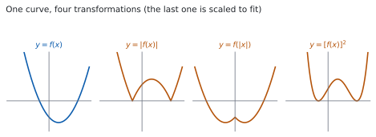
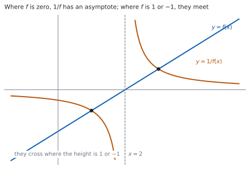

# HL 2.16 — Further graph transformations and the modulus function（絶対値・逆数などのグラフと、絶対値の方程式・不等式） {#sec-aahl-2-16}

::: {.callout-note}
## What you should be able to do
- $y = \lvert f(x) \rvert$ と $y = f(\lvert x \rvert)$ のちがいを、グラフで説明できる。
- $y = \dfrac{1}{f(x)}$ のグラフの、漸近線と交点の場所を言える。
- $y = f(ax+b)$ が、もとのグラフをどう動かした形かを言える。
- $y = [f(x)]^{2}$ の零点と、そこでの形を言える。
- **絶対値を含む方程式**を解ける。
- **絶対値を含む不等式**を解ける。
:::

## The idea

### 1. $y = \lvert f(x) \rvert$: reflecting what is below the axis（下を折り返す） {#abs-f}

{#fig-aahl216-idea-a width=100%}

シラバスは、扱う $5$ つの形を並べています。

> The graphs of the functions, $y = \lvert f(x) \rvert$ and $y = f(\lvert x \rvert)$, $y = \dfrac{1}{f(x)}$, $y = f(ax+b)$, $y = [f(x)]^{2}$.

絶対値は「符号を外した大きさ」なので

$$
\lvert f(x) \rvert =
\begin{cases}
f(x) & (f(x) \geq 0) \\
-f(x) & (f(x) < 0)
\end{cases}
$$ {#eq-aahl216-abs}

です。**$f(x)$ が負のところだけ、符号が変わります。**

グラフで言うと、**$x$ 軸より下にある部分を、$x$ 軸について折り返す**ことです。@fig-aahl216-idea-a の $2$ 枚目がその形です。

**零点は変わりません。** $f(a) = 0$ なら $\lvert f(a) \rvert = 0$ だからです。折り返しの境目が、ちょうど零点になります。

::: {.callout-important}
## 折り返したところは、とがります
$x$ 軸をまたぐ零点では、折り返しによって**角（かど）** ができます。

もとのグラフが $x$ 軸に接しているだけなら、折り返しても形が変わらないので、角はできません。
:::

### 2. $y = f(\lvert x \rvert)$: copying the right half to the left（右半分を左に写す） {#f-abs}

こちらは**入力**に絶対値が付いています。$x$ が負でも $\lvert x \rvert$ は正なので、

$$
f(\lvert x \rvert) = f(x) \ (x \geq 0), \qquad f(\lvert x \rvert) = f(-x) \ (x < 0)
$$ {#eq-aahl216-f-abs}

です。**$x \geq 0$ の部分はそのまま**で、**$x < 0$ の部分は、右半分を $y$ 軸について折り返したもの**に置きかわります。

@fig-aahl216-idea-a の $3$ 枚目です。**もとのグラフの左半分は、使いません。**

$$
y = f(\lvert x \rvert) \ \text{は、いつも even な関数}
$$ {#eq-aahl216-even}

**$y$ 軸について線対称**になります（[HL 2.14](aahl-2-14.qmd#symmetry)）。

::: {.callout-important}
## 左側にあった零点は、消えます
$f$ の零点が $x = -1$ と $x = 3$ だとします。$y = f(\lvert x \rvert)$ が使うのは $x \geq 0$ の部分だけなので、零点は **$x = 3$ とその鏡の $x = -3$** です。

**$x = -1$ は使われません。** ここを取りちがえる人が多いところです。
:::

### 3. $y = \dfrac{1}{f(x)}$: the reciprocal graph（逆数のグラフ） {#reciprocal}

{#fig-aahl216-idea-b width=100%}

逆数を取ると、次のことが起こります。

: $y = f(x)$ から $y = \dfrac{1}{f(x)}$ へ {#tbl-aahl216-reciprocal}

| $f(x)$ が | $\dfrac{1}{f(x)}$ は |
|---|---|
| $0$ | 定義されない → **垂直漸近線** |
| $1$ または $-1$ | 同じ値 → **$2$ つのグラフが交わる** |
| とても大きい | $0$ に近い |
| $0$ に近い（$0$ でない） | とても大きい |
| 正 | 正（**符号は変わりません**） |

**$f$ の最大値は $\dfrac{1}{f}$ の最小値になります**（同じ符号の範囲で）。大小が入れかわるからです。

@fig-aahl216-idea-b が、$f(x) = x-2$ の場合です。$x = 2$ が垂直漸近線で、$f = 1$ と $f = -1$ になる $x = 3$、$x = 1$ で $2$ つのグラフが交わっています。

### 4. $y = f(ax+b)$: horizontal transformations（横の変換） {#horizontal}

$f(ax+b)$ は、**中身が $0$ になる $x$** で考えるのがいちばん速いです。

もとのグラフが $x = p$ で $x$ 軸と交わるなら、$y = f(ax+b)$ は

$$
ax + b = p \ \Rightarrow \ x = \frac{p-b}{a}
$$ {#eq-aahl216-shift}

で交わります。**中身がもとの $x$ の役をします。**

変換としては、$f(ax+b) = f\bigl(a\left(x+\frac{b}{a}\right)\bigr)$ と書けるので

- 横に $\dfrac{1}{a}$ 倍（$a > 1$ なら縮む）
- 横に $-\dfrac{b}{a}$ だけ平行移動

です（[SL 2.11](../../aa-sl/02-functions/aasl-2-11.qmd)）。**順番は「縮めてから動かす」**ですが、試験では @eq-aahl216-shift で点を移すほうが速く、まちがえません。

### 5. $y = [f(x)]^{2}$: squaring the function（$2$ 乗のグラフ） {#squared}

$2$ 乗はいつも $0$ 以上なので、**グラフは $x$ 軸より下に行きません。**

- **零点は変わりません。** $f(a) = 0$ なら $[f(a)]^{2} = 0$ です。
- **ただし、そこでの形が変わります。** もとがまたいでいても、$2$ 乗すると**接する**形になります（[HL 2.12](aahl-2-12.qmd#repeated)）。因数が $2$ 倍になるからです。
- $\lvert f(x) \rvert < 1$ のところでは値が小さくなり、$\lvert f(x) \rvert > 1$ のところでは大きくなります。

@fig-aahl216-idea-a の $4$ 枚目が、その形です（縦の幅を合わせるために縮めてあります）。

**$\lvert f(x) \rvert$ と $[f(x)]^{2}$ は、どちらも「下に行かない」形ですが、別のものです。** 前者は角ができ、後者はなめらかに接します。

### 6. Modulus equations（絶対値を含む方程式） {#modulus-equations}

シラバスは、もう $1$ 行足しています。

> Solution of modulus equations and inequalities.

$\lvert A \rvert = k$（$k > 0$）の形は、**$2$ 通りに分かれます。**

$$
\lvert A \rvert = k \iff A = k \ \text{または} \ A = -k
$$ {#eq-aahl216-eq}

$\lvert 2x-3 \rvert = 5$ なら

$$
2x-3 = 5 \ \Rightarrow \ x = 4, \qquad 2x-3 = -5 \ \Rightarrow \ x = -1
$$

です。**両辺に絶対値があるときも、同じ形です。**

$$
\lvert A \rvert = \lvert B \rvert \iff A = B \ \text{または} \ A = -B
$$ {#eq-aahl216-eq-both}

::: {.callout-important}
## $k$ が負なら、解はありません
$\lvert 2x-3 \rvert = -5$ には解がありません。**絶対値は $0$ 以上**だからです。

$k = 0$ なら、$A = 0$ の $1$ つだけです。**$3$ つの場合に分かれる**ことを覚えておいてください。
:::

### 7. Modulus inequalities（絶対値を含む不等式） {#modulus-inequalities}

不等号の向きで、形が変わります。

$$
\lvert A \rvert < k \iff -k < A < k
$$ {#eq-aahl216-less}

$$
\lvert A \rvert > k \iff A > k \ \text{または} \ A < -k
$$ {#eq-aahl216-greater}

**$<$ なら「あいだ」、$>$ なら「外側」です。** $2$ 次不等式と同じ形です（[HL 2.15](aahl-2-15.qmd#quadratic)）。

$\lvert x-2 \rvert < 3$ なら

$$
-3 < x-2 < 3 \ \Rightarrow \ -1 < x < 5
$$

です。$\lvert x-2 \rvert$ は「$x$ と $2$ の距離」なので、**$2$ から $3$ 以内**と読むこともできます。

::: {.callout-important}
## $>$ のときに、$-k$ の向きを変え忘れる
$\lvert A \rvert > k$ の $2$ 番目は **$A < -k$** です。$A > -k$ ではありません。

$\lvert 2x+1 \rvert \geq 5$ なら $2x+1 \geq 5$ または $2x+1 \leq -5$ で、$x \geq 2$ または $x \leq -3$ です。**「または」でつなぎます。**
:::

::: {.callout-tip collapse="true"}
## Paper 2 では、電卓のグラフで形を確かめられます
Guidance にも、次のように書かれています。

> Dynamic graphing packages could be used to investigate these transformations.

TI-Nspire CX II では、絶対値を `abs(` で入力できます。`y1 = f(x)` と `y2 = abs(f(x))` の $2$ つを同時に表示すると、折り返しの様子が見えます。

不等式も、**$2$ つのグラフを入れて交点を読む**やり方で解けます。シラバスは、電卓が要る例を挙げています。

> Example: $\lvert 3x\arccos(x) \rvert > 1$

$\arccos$ は Topic 3 で扱う関数です。**この形は手では解けません。** 電卓でグラフをかいて、交点から範囲を読みます。

**Paper 1 では使えません。** このページの例題と演習は、すべて手で解けるようにしてあります。
:::

## Why it works

::: {.callout-tip collapse="true"}
## クリックすると開きます

#### なぜ $\lvert f(x) \rvert$ が折り返しになるのか {#why-abs}

点 $\bigl(x,\ f(x)\bigr)$ が $x$ 軸より下にあるとは、$f(x) < 0$ ということです。このとき @eq-aahl216-abs から $\lvert f(x) \rvert = -f(x)$ で、点は $\bigl(x,\ -f(x)\bigr)$ に移ります。

**$x$ はそのまま、$y$ の符号だけが変わる**ので、$x$ 軸について折り返したことになります。

$f(x) \geq 0$ のところでは $\lvert f(x) \rvert = f(x)$ なので、**何も動きません。** 下だけが動く理由です。

#### なぜ $f(\lvert x \rvert)$ が even になるのか {#why-even}

$g(x) = f(\lvert x \rvert)$ と置きます。$\lvert -x \rvert = \lvert x \rvert$ なので

$$
g(-x) = f\bigl(\lvert -x \rvert\bigr) = f\bigl(\lvert x \rvert\bigr) = g(x)
$$

です。**これは even の定義そのもの**です（[HL 2.14](aahl-2-14.qmd#even-odd)）。

$x \geq 0$ では $\lvert x \rvert = x$ なので $g(x) = f(x)$、つまり**右半分はもとのまま**です。左半分は、右半分の鏡です。

#### なぜ、逆数で大小が入れかわるのか {#why-reciprocal}

$0 < a < b$ とします。両辺を $ab > 0$ で割ると

$$
\frac{a}{ab} < \frac{b}{ab} \ \Rightarrow \ \frac{1}{b} < \frac{1}{a}
$$

です。**大きいほうの逆数が小さくなりました。** 正の数どうしなら、向きが逆になります。

ですから、$f > 0$ の区間で $f$ が最大になる点は、$\dfrac{1}{f}$ が最小になる点です。**符号は変わりません**（正の逆数は正、負の逆数は負）。

$f(x) \to 0$ のとき $\dfrac{1}{f(x)}$ はいくらでも大きくなるので、**$f$ の零点が $\dfrac{1}{f}$ の垂直漸近線**になります（[HL 2.13](aahl-2-13.qmd#vertical)）。

#### なぜ $\lvert A \rvert = k$ が $2$ 通りなのか {#why-two-cases}

$\lvert A \rvert$ は $A$ か $-A$ のどちらかで、どちらも $0$ 以上のほうです。ですから $\lvert A \rvert = k$ は

$$
A = k \quad \text{または} \quad -A = k
$$

つまり $A = k$ または $A = -k$ です。**$k > 0$ なら、この $2$ つはちがう値**なので、解も $2$ 組出ます。

$\lvert A \rvert < k$ のほうは、**$A$ が $0$ から距離 $k$ 未満**という意味なので、$-k < A < k$ です。$\lvert A \rvert > k$ なら距離が $k$ より大きいので、$0$ から見て**両側の外**になります。

#### $2$ 乗してよいのは、両辺が $0$ 以上のときです {#why-square}

$\lvert A \rvert = \lvert B \rvert$ の両辺を $2$ 乗して $A^{2} = B^{2}$ とするのは、**正しい変形**です。両辺とも $0$ 以上だからです。

$\lvert A \rvert < \lvert B \rvert$ も、両辺が $0$ 以上なので $A^{2} < B^{2}$ と同値です。**この形なら、絶対値を外して $2$ 次不等式にできます**（[演習 9](#exercises)）。

**片側に絶対値がないときは、気をつけてください。** $\lvert A \rvert < B$ で $B$ が負かもしれないなら、$2$ 乗はできません。
:::

## Worked examples

::: {.callout-note appearance="simple"}
問題文は英語です。意味が理解できなかったら、問題文の下の「**日本語訳**」を開いてください。解説は日本語です。

**例題も演習も、すべて電卓なしで解けます。** Paper 1 のつもりで解いてください。
:::

::: {#exm-aahl216-f-abs}
[Let $f(x) = x^{2}-2x-3$.]{.q-en}

**(a)** [Find the zeros of $f$.]{.q-en}

**(b)** [State the zeros of $y = f(\lvert x \rvert)$, and explain your answer.]{.q-en}

日本語訳

$f(x) = x^{2}-2x-3$ とします。

**(a)** $f$ の零点を求めなさい。

**(b)** $y = f(\lvert x \rvert)$ の零点を書き、その理由を説明しなさい。

---

**(a)** 因数分解します。

$$
x^{2}-2x-3 = (x-3)(x+1)
$$

**零点は $x = -1$ と $x = 3$ です。**

**(b)** $y = f(\lvert x \rvert)$ が使うのは、**$f$ の $x \geq 0$ の部分だけ**です（[第 2 節](#f-abs)）。その範囲にある零点は $x = 3$ だけで、$x = -1$ は使われません。

左半分は右半分の鏡なので、$x = -3$ にも零点ができます。

$$
x = -3, \qquad x = 3
$$

::: {.model-answer}
**試験ではこう書く**

*The zeros of $f$ are $x = -1$ and $x = 3$. For $x \geq 0$ we have $\lvert x \rvert = x$, so $f(\lvert x \rvert) = f(x)$ and the only zero with $x \geq 0$ is $x = 3$. For $x < 0$ we have $\lvert x \rvert = -x > 0$, so $f(\lvert x \rvert) = f(-x)$, which is zero when $-x = 3$, that is when $x = -3$; the value $-x = -1$ cannot occur because $-x$ is positive here. Hence the zeros of $y = f(\lvert x \rvert)$ are $x = -3$ and $x = 3$. The zero of $f$ at $x = -1$ does not appear, because the graph of $y = f(\lvert x \rvert)$ never uses the values of $f$ at negative inputs.*
:::

（$x \geq 0$ では $f(\lvert x \rvert) = f(x)$ なので零点は $3$ だけ。$x < 0$ では $f(-x)$ になり、$-x = 3$、つまり $x = -3$ で $0$ になる、という意味です。）

**検算。** **$x = -3$ を入れます。** $f(\lvert -3 \rvert) = f(3) = 9-6-3 = 0$ ✓

**検算（$x = -1$ で）。** $f(\lvert -1 \rvert) = f(1) = 1-2-3 = -4 \neq 0$ ✓ **もとの零点 $-1$ は、確かに消えています。**

::: {.callout-note}
## 解答例（答案用紙に書くこと）

**(a)** $x^{2}-2x-3 = (x-3)(x+1)$, *so the zeros are $x = -1$ and $x = 3$.*

**(b)** *For $x \geq 0$, $f(\lvert x \rvert) = f(x)$, so the only zero with $x \geq 0$ is $x = 3$. The graph of $y = f(\lvert x \rvert)$ is symmetric in the $y$-axis, so there is also a zero at $x = -3$.*

*The zeros are $x = -3$ and $x = 3$. The zero of $f$ at $x = -1$ is not used, because $\lvert x \rvert$ is never negative.*
:::
:::

::: {#exm-aahl216-transform}
[The graph of $y = f(x)$ meets the $x$-axis at $x = -1$ and at $x = 3$.]{.q-en}

**(a)** [State the values of $x$ for which the graph of $y = f(2x+1)$ meets the $x$-axis.]{.q-en}

**(b)** [State the values of $x$ for which the graph of $y = [f(x)]^{2}$ meets the $x$-axis, and describe the graph at those points.]{.q-en}

日本語訳

$y = f(x)$ のグラフは $x = -1$ と $x = 3$ で $x$ 軸と交わります。

**(a)** $y = f(2x+1)$ のグラフが $x$ 軸と交わる $x$ の値を書きなさい。

**(b)** $y = [f(x)]^{2}$ のグラフが $x$ 軸と交わる $x$ の値を書き、そこでのグラフの様子を述べなさい。

---

**(a)** **中身が、もとの $x$ の役をします**（[第 4 節](#horizontal)）。$f(\square) = 0$ になるのは $\square = -1$ か $\square = 3$ のときです。

$$
2x+1 = -1 \ \Rightarrow \ x = -1, \qquad 2x+1 = 3 \ \Rightarrow \ x = 1
$$

**$x = -1$ と $x = 1$ です。**

**(b)** $[f(x)]^{2} = 0$ になるのは $f(x) = 0$ のときだけなので、**零点は変わりません。**

$$
x = -1, \qquad x = 3
$$

ただし形は変わります。$2$ 乗なので値は $0$ 以上で、**どちらの点でも $x$ 軸に接して戻ります**（[第 5 節](#squared)）。またぎません。

**検算。** **(a) の答えを中身に入れ直します。** $x = -1$ なら $2(-1)+1 = -1$ ✓ $x = 1$ なら $2(1)+1 = 3$ ✓

**検算（(b) の符号で）。** $[f(x)]^{2}$ は $2$ 乗なので、どの $x$ でも $0$ 以上です ✓ 負にならないので、$x$ 軸をまたげません。

::: {.callout-note}
## 解答例（答案用紙に書くこと）

**(a)** *$f(2x+1) = 0$ when $2x+1 = -1$ or $2x+1 = 3$, that is when $x = -1$ or $x = 1$.*

**(b)** *$[f(x)]^{2} = 0$ exactly when $f(x) = 0$, so the graph meets the $x$-axis at $x = -1$ and $x = 3$.*

*Since $[f(x)]^{2} \geq 0$ for all $x$, the graph touches the $x$-axis at each of these points and turns back; it does not cross.*
:::
:::

::: {#exm-aahl216-equations}
[Solve the following equations.]{.q-en}

**(a)** [$\lvert 2x-3 \rvert = 5$]{.q-en}

**(b)** [$\lvert x-1 \rvert = \lvert 2x+3 \rvert$]{.q-en}

日本語訳

次の方程式を解きなさい。

---

**(a)** @eq-aahl216-eq のとおり、$2$ 通りに分けます。

$$
2x-3 = 5 \ \Rightarrow \ x = 4
$$

$$
2x-3 = -5 \ \Rightarrow \ 2x = -2 \ \Rightarrow \ x = -1
$$

**$x = 4$ と $x = -1$ です。**

**(b)** 両辺に絶対値があるので、@eq-aahl216-eq-both を使います。

$$
x-1 = 2x+3 \ \Rightarrow \ -x = 4 \ \Rightarrow \ x = -4
$$

$$
x-1 = -(2x+3) \ \Rightarrow \ x-1 = -2x-3 \ \Rightarrow \ 3x = -2 \ \Rightarrow \ x = -\frac{2}{3}
$$

**$x = -4$ と $x = -\dfrac{2}{3}$ です。**

**検算。** **(a) を入れます。** $x = 4$ なら $\lvert 5 \rvert = 5$ ✓ $x = -1$ なら $\lvert -5 \rvert = 5$ ✓

**検算（(b) を入れます）。** $x = -4$ なら左辺 $\lvert -5 \rvert = 5$、右辺 $\lvert -5 \rvert = 5$ ✓ $x = -\dfrac{2}{3}$ なら左辺 $\left\lvert -\dfrac{5}{3} \right\rvert = \dfrac{5}{3}$、右辺 $\left\lvert \dfrac{5}{3} \right\rvert = \dfrac{5}{3}$ ✓

::: {.callout-note}
## 解答例（答案用紙に書くこと）

**(a)** $2x-3 = 5 \ \Rightarrow \ x = 4$; $\ 2x-3 = -5 \ \Rightarrow \ x = -1$.

*The solutions are $x = 4$ and $x = -1$.*

**(b)** $x-1 = 2x+3 \ \Rightarrow \ x = -4$; $\ x-1 = -(2x+3) \ \Rightarrow \ 3x = -2 \ \Rightarrow \ x = -\dfrac{2}{3}$.

*The solutions are $x = -4$ and $x = -\dfrac{2}{3}$.*
:::
:::

::: {#exm-aahl216-inequalities}
[Solve the following inequalities.]{.q-en}

**(a)** [$\lvert 3x-1 \rvert < 5$]{.q-en}

**(b)** [$\lvert x+2 \rvert \geq 4$]{.q-en}

日本語訳

次の不等式を解きなさい。

---

**(a)** $<$ なので「あいだ」です（@eq-aahl216-less）。

$$
-5 < 3x-1 < 5
$$

**すべての辺に同じことをします。** $1$ を足して

$$
-4 < 3x < 6
$$

$3$ で割ります。$3 > 0$ なので、向きは変わりません。

$$
-\frac{4}{3} < x < 2
$$

**(b)** $\geq$ なので「外側」です（@eq-aahl216-greater）。

$$
x+2 \geq 4 \ \Rightarrow \ x \geq 2
$$

$$
x+2 \leq -4 \ \Rightarrow \ x \leq -6
$$

**$x \geq 2$ または $x \leq -6$ です。**

**検算。** **(a) の中を試します。** $x = 0$ なら $\lvert -1 \rvert = 1 < 5$ ✓ $x = 2$ なら $\lvert 5 \rvert = 5$ で、$<$ は成り立ちません ✓ 端は入りません。

**検算（(b) を試します）。** $x = 2$ なら $\lvert 4 \rvert = 4 \geq 4$ ✓ $x = -6$ なら $\lvert -4 \rvert = 4 \geq 4$ ✓ $x = 0$ なら $2 \geq 4$ は成り立ちません ✓ **あいだは入りません。**

::: {.callout-note}
## 解答例（答案用紙に書くこと）

**(a)** $-5 < 3x-1 < 5 \ \Rightarrow \ -4 < 3x < 6 \ \Rightarrow \ -\dfrac{4}{3} < x < 2$

**(b)** $x+2 \geq 4 \ \Rightarrow \ x \geq 2$; $\ x+2 \leq -4 \ \Rightarrow \ x \leq -6$.

*The solution is $x \leq -6$ or $x \geq 2$.*
:::
:::

## Common errors

::: {.callout-warning}
## $\lvert f(x) \rvert$ と $f(\lvert x \rvert)$ を取りちがえる
**絶対値が外側なら出力**、**内側なら入力**です。

$\lvert f(x) \rvert$ は $x$ 軸について下を折り返し、$f(\lvert x \rvert)$ は $y$ 軸について右を左に写します（[第 1 節](#abs-f)・[第 2 節](#f-abs)）。**別の形です。**
:::

::: {.callout-warning}
## $f(\lvert x \rvert)$ で、左側の零点を残す
$y = f(\lvert x \rvert)$ が使うのは、$f$ の **$x \geq 0$ の部分だけ**です。

$f$ の負の側にあった零点は、**消えます**（[第 2 節](#f-abs)）。正の側の零点だけが、$\pm$ の組で残ります。
:::

::: {.callout-warning}
## $\lvert A \rvert > k$ の $2$ 番目を $A > -k$ と書く
正しくは **$A < -k$** です（@eq-aahl216-greater）。不等号の向きが変わります。

向きを確かめるには、**具体的な数を入れてみてください。** $\lvert -10 \rvert > 3$ は成り立ち、$-10 < -3$ です。
:::

::: {.callout-warning}
## 右辺が負なのに、$2$ 通りに分ける
$\lvert A \rvert = -5$ や $\lvert A \rvert < -2$ には、解がありません。**絶対値は $0$ 以上**です（[第 6 節](#modulus-equations)）。

逆に $\lvert A \rvert > -2$ は、**すべての $x$** が答えです。$0$ 以上の数は、いつも $-2$ より大きいからです。
:::

::: {.callout-warning}
## $y = f(ax+b)$ で、$b$ だけ平行移動すると書く
横に動く量は $-\dfrac{b}{a}$ で、$-b$ ではありません（[第 4 節](#horizontal)）。

**中身が $0$ になる $x$ を出すほう**が、まちがえません。$ax+b = p$ を解いて、点を移してください。
:::

::: {.callout-warning}
## $[f(x)]^{2}$ と $\lvert f(x) \rvert$ を同じものと思う
どちらも $x$ 軸より下に行きませんが、**別の関数**です（[第 5 節](#squared)）。

$\lvert f(x) \rvert$ は零点で**とがり**、$[f(x)]^{2}$ は**なめらかに接します。** 値も、$\lvert f \rvert < 1$ のところでちがってきます。
:::

## Exercises

::: {.callout-note appearance="simple"}
各問題に、折りたたみが $3$ つ付いています。**日本語訳**、**解答例**（答案用紙に書くべきこと。英語です）、**解説**（なぜそうなるか。日本語です）。

まず自分で解いて、次に解答例と見くらべてください。**解説は、合わなかったときだけ開けば十分です。**
:::

::: {.exercise-block}

[1]{.ex-no} [Let $f(x) = x-3$. State the coordinates of the vertex of the graph of $y = \lvert f(x) \rvert$, and the coordinates of its $y$-intercept.]{.q-en}

日本語訳

$f(x) = x-3$ とします。$y = \lvert f(x) \rvert$ のグラフの頂点の座標と、$y$ 切片の座標を書きなさい。

::: {.callout-note collapse="true"}
## 解答例（答案用紙に書くこと）

*The graph of $y = x-3$ meets the $x$-axis at $x = 3$, and reflecting the part below the axis gives a V shape with vertex $(3,\ 0)$.*

$$y\text{-intercept: } \ \lvert 0-3 \rvert = 3, \ \text{so} \ (0,\ 3)$$
:::

::: {.callout-tip collapse="true"}
## 解説

**零点が、折り返しの境目**になります（[第 1 節](#abs-f)）。そこが V の先です。

$y$ 切片は、$x = 0$ を入れて絶対値を取ります。もとの $y$ 切片は $-3$ ですが、折り返して $3$ になります。

**検算。** $x = 5$ では $\lvert 2 \rvert = 2$、$x = 1$ では $\lvert -2 \rvert = 2$ ✓ **頂点から左右に同じだけ離れた点で、同じ高さです。**

**検算（頂点で）。** $\lvert 3-3 \rvert = 0$ ✓
:::

::: {.ex-sep}
:::

[2]{.ex-no} [The graph of $y = f(x)$ meets the $x$-axis at $x = 2$ and at $x = -4$. State the values of $x$ for which the graph of $y = f(\lvert x \rvert)$ meets the $x$-axis.]{.q-en}

日本語訳

$y = f(x)$ のグラフは $x = 2$ と $x = -4$ で $x$ 軸と交わります。$y = f(\lvert x \rvert)$ のグラフが $x$ 軸と交わる $x$ の値を書きなさい。

::: {.callout-note collapse="true"}
## 解答例（答案用紙に書くこと）

*For $x \geq 0$, $f(\lvert x \rvert) = f(x)$, and the only zero of $f$ with $x \geq 0$ is $x = 2$.*

*The graph of $y = f(\lvert x \rvert)$ is symmetric in the $y$-axis, so it also meets the $x$-axis at $x = -2$.*

$$x = -2 \quad \text{and} \quad x = 2$$
:::

::: {.callout-tip collapse="true"}
## 解説

**$x = -4$ は使われません**（[第 2 節](#f-abs)）。$\lvert x \rvert$ が $-4$ になることはないからです。

**検算。** $x = -2$ なら $f(\lvert -2 \rvert) = f(2) = 0$ ✓

**検算（$x = -4$ で）。** $f(\lvert -4 \rvert) = f(4)$ で、これは $0$ とはかぎりません ✓ **もとの零点が、そのまま残るわけではありません。**
:::

::: {.ex-sep}
:::

[3]{.ex-no} [The graph of $y = f(x)$ meets the $x$-axis at $x = 1$ and at $x = 5$.]{.q-en}

**(a)** [State the values of $x$ for which the graph of $y = f(3x)$ meets the $x$-axis.]{.q-en}

**(b)** [State the values of $x$ for which the graph of $y = f(x-2)$ meets the $x$-axis.]{.q-en}

日本語訳

$y = f(x)$ のグラフは $x = 1$ と $x = 5$ で $x$ 軸と交わります。

**(a)** $y = f(3x)$ のグラフが $x$ 軸と交わる $x$ の値を書きなさい。

**(b)** $y = f(x-2)$ のグラフが $x$ 軸と交わる $x$ の値を書きなさい。

::: {.callout-note collapse="true"}
## 解答例（答案用紙に書くこと）

**(a)** $3x = 1 \ \Rightarrow \ x = \dfrac{1}{3}$; $\ 3x = 5 \ \Rightarrow \ x = \dfrac{5}{3}$

**(b)** $x-2 = 1 \ \Rightarrow \ x = 3$; $\ x-2 = 5 \ \Rightarrow \ x = 7$
:::

::: {.callout-tip collapse="true"}
## 解説

**中身がもとの $x$ の役をします**（[第 4 節](#horizontal)）。中身を $1$ と $5$ に等しいと置いて、$x$ について解くだけです。

(a) は横に $\dfrac{1}{3}$ 倍、(b) は右へ $2$ の平行移動です。

**検算。** (a) の $x = \dfrac{1}{3}$ を中身に入れると $3 \times \dfrac{1}{3} = 1$ ✓

**検算（(b) で）。** $x = 7$ を中身に入れると $7-2 = 5$ ✓
:::

::: {.ex-sep}
:::

[4]{.ex-no} [Solve $\lvert 4x+1 \rvert = 9$.]{.q-en}

日本語訳

$\lvert 4x+1 \rvert = 9$ を解きなさい。

::: {.callout-note collapse="true"}
## 解答例（答案用紙に書くこと）

$$4x+1 = 9 \ \Rightarrow \ x = 2$$

$$4x+1 = -9 \ \Rightarrow \ 4x = -10 \ \Rightarrow \ x = -\frac{5}{2}$$

*The solutions are $x = 2$ and $x = -\dfrac{5}{2}$.*
:::

::: {.callout-tip collapse="true"}
## 解説

$2$ 通りに分けるだけです（[第 6 節](#modulus-equations)）。**$-9$ のほうを忘れないでください。**

**検算。** $x = 2$ なら $\lvert 9 \rvert = 9$ ✓

**検算（もう $1$ つ）。** $x = -\dfrac{5}{2}$ なら $4\left(-\dfrac{5}{2}\right)+1 = -10+1 = -9$ で、$\lvert -9 \rvert = 9$ ✓
:::

::: {.ex-sep}
:::

[5]{.ex-no} [Solve $\lvert 2x-5 \rvert = \lvert x+1 \rvert$.]{.q-en}

日本語訳

$\lvert 2x-5 \rvert = \lvert x+1 \rvert$ を解きなさい。

::: {.callout-note collapse="true"}
## 解答例（答案用紙に書くこと）

$$2x-5 = x+1 \ \Rightarrow \ x = 6$$

$$2x-5 = -(x+1) \ \Rightarrow \ 2x-5 = -x-1 \ \Rightarrow \ 3x = 4 \ \Rightarrow \ x = \frac{4}{3}$$

*The solutions are $x = 6$ and $x = \dfrac{4}{3}$.*
:::

::: {.callout-tip collapse="true"}
## 解説

両辺に絶対値があるので、@eq-aahl216-eq-both の形です。**$2$ 通りで足ります**（$4$ 通り書いても、$2$ つは同じ式になります）。

**検算。** $x = 6$ なら左辺 $\lvert 7 \rvert = 7$、右辺 $\lvert 7 \rvert = 7$ ✓

**検算（もう $1$ つ）。** $x = \dfrac{4}{3}$ なら左辺 $\left\lvert \dfrac{8}{3}-5 \right\rvert = \dfrac{7}{3}$、右辺 $\left\lvert \dfrac{4}{3}+1 \right\rvert = \dfrac{7}{3}$ ✓
:::

::: {.ex-sep}
:::

[6]{.ex-no} [Solve $\lvert x-4 \rvert \leq 2$.]{.q-en}

日本語訳

$\lvert x-4 \rvert \leq 2$ を解きなさい。

::: {.callout-note collapse="true"}
## 解答例（答案用紙に書くこと）

$$-2 \leq x-4 \leq 2 \ \Rightarrow \ 2 \leq x \leq 6$$
:::

::: {.callout-tip collapse="true"}
## 解説

$\leq$ なので「あいだ」です（@eq-aahl216-less）。**すべての辺に $4$ を足します。**

「$x$ と $4$ の距離が $2$ 以内」と読むこともできます（[第 7 節](#modulus-inequalities)）。$4$ を中心に、左右へ $2$ ずつです。

**検算。** $x = 2$ なら $\lvert -2 \rvert = 2 \leq 2$ ✓ 端は入ります。

**検算（外で）。** $x = 7$ なら $\lvert 3 \rvert = 3 > 2$ ✓ 入りません。
:::

::: {.ex-sep}
:::

[7]{.ex-no} [Solve $\lvert 3x+2 \rvert > 7$.]{.q-en}

日本語訳

$\lvert 3x+2 \rvert > 7$ を解きなさい。

::: {.callout-note collapse="true"}
## 解答例（答案用紙に書くこと）

$$3x+2 > 7 \ \Rightarrow \ 3x > 5 \ \Rightarrow \ x > \frac{5}{3}$$

$$3x+2 < -7 \ \Rightarrow \ 3x < -9 \ \Rightarrow \ x < -3$$

*The solution is $x < -3$ or $x > \dfrac{5}{3}$.*
:::

::: {.callout-tip collapse="true"}
## 解説

$>$ なので「外側」です（@eq-aahl216-greater）。**$2$ 番目は $< -7$** で、$> -7$ ではありません。

**検算。** $x = 2$ なら $\lvert 8 \rvert = 8 > 7$ ✓

**検算（左側で）。** $x = -4$ なら $\lvert -10 \rvert = 10 > 7$ ✓ $x = 0$ なら $\lvert 2 \rvert = 2 > 7$ は成り立ちません ✓
:::

::: {.ex-sep}
:::

[8]{.ex-no} [Let $f(x) = x^{2}-9$.]{.q-en}

**(a)** [State the equations of all the asymptotes of the graph of $y = \dfrac{1}{f(x)}$.]{.q-en}

**(b)** [The graph of $y = f(x)$ has a minimum point at $x = 0$. Explain why the graph of $y = \dfrac{1}{f(x)}$ has a maximum point there.]{.q-en}

日本語訳

$f(x) = x^{2}-9$ とします。

**(a)** $y = \dfrac{1}{f(x)}$ のグラフの漸近線をすべて書きなさい。

**(b)** $y = f(x)$ のグラフは $x = 0$ で最小になります。$y = \dfrac{1}{f(x)}$ のグラフがそこで最大になる理由を説明しなさい。

::: {.callout-note collapse="true"}
## 解答例（答案用紙に書くこと）

**(a)** *$f(x) = 0$ at $x = 3$ and $x = -3$, so the vertical asymptotes are $x = 3$ and $x = -3$. The degree of the denominator exceeds that of the numerator, so the horizontal asymptote is $y = 0$.*

**(b)** *On $-3 < x < 3$ the values of $f$ are negative, and $f$ is smallest at $x = 0$, where $f(0) = -9$. For negative numbers, taking reciprocals reverses order, so the smallest value of $f$ gives the largest value of $\dfrac{1}{f}$ on that interval, namely $-\dfrac{1}{9}$.*
:::

::: {.callout-tip collapse="true"}
## 解説

**(a)** $x^{2}-9 = (x-3)(x+3)$ です（[第 3 節](#reciprocal)、[HL 2.13](aahl-2-13.qmd#vertical)）。

**(b)** 逆数は、**同じ符号どうしで大小を入れかえます**（[Why it works](#why-reciprocal)）。負の数でも同じです。

**検算。** $f(0) = -9$ なので $\dfrac{1}{f(0)} = -\dfrac{1}{9} \approx -0.11$ です。$f(2) = -5$ なら $\dfrac{1}{-5} = -0.2$ ✓ **$-0.11$ のほうが大きい**です。

**検算（漸近線に近づけて）。** $x = 2.9$ では $f = -0.59$ で、$\dfrac{1}{f} \approx -1.7$ ✓ **もっと小さくなります。**

::: {.model-answer}
**試験ではこう書く**

*On the interval $-3 < x < 3$ the value of $f(x) = x^{2}-9$ is negative, since $x^{2} < 9$ there. Among negative numbers, taking reciprocals reverses order: if $a < b < 0$ then dividing $a < b$ by the positive number $ab$ gives $\dfrac{1}{b} < \dfrac{1}{a}$. So the input that makes $f$ smallest makes $\dfrac{1}{f}$ largest. The minimum of $f$ on this interval is at $x = 0$, where $f(0) = -9$, and therefore $\dfrac{1}{f}$ attains its greatest value there, namely $-\dfrac{1}{9}$. As $x$ approaches $3$ or $-3$ from inside the interval, $f(x)$ approaches $0$ from below, so $\dfrac{1}{f(x)}$ decreases without bound; this confirms that $x = 0$ gives a maximum rather than a minimum.*
:::
:::

::: {.ex-sep}
:::

[9]{.ex-no} [Solve $\lvert x-1 \rvert < \lvert x+3 \rvert$.]{.q-en}

日本語訳

$\lvert x-1 \rvert < \lvert x+3 \rvert$ を解きなさい。

::: {.callout-note collapse="true"}
## 解答例（答案用紙に書くこと）

*Both sides are non-negative, so squaring gives an equivalent inequality.*

$$(x-1)^{2} < (x+3)^{2}$$

$$x^{2}-2x+1 < x^{2}+6x+9$$

$$-8x < 8 \ \Rightarrow \ x > -1$$
:::

::: {.callout-tip collapse="true"}
## 解説

**両辺が $0$ 以上なので、$2$ 乗しても向きが変わりません**（[Why it works](#why-square)）。$x^{2}$ が消えて、$1$ 次不等式になります。

**$-8$ で割るときに、向きが変わる**ところに気をつけてください。

**検算。** $x = 0$ なら左辺 $1$、右辺 $3$ で $1 < 3$ ✓

**検算（境目の外で）。** $x = -2$ なら左辺 $3$、右辺 $1$ で、成り立ちません ✓ $x = -1$ なら両辺とも $2$ で、$<$ は成り立ちません ✓

::: {.model-answer}
**試験ではこう書く**

*Both $\lvert x-1 \rvert$ and $\lvert x+3 \rvert$ are non-negative for every real $x$. For non-negative numbers $u$ and $v$, the statements $u < v$ and $u^{2} < v^{2}$ are equivalent, so squaring both sides here is a valid step and loses no solutions. Since $\lvert A \rvert^{2} = A^{2}$, this gives $(x-1)^{2} < (x+3)^{2}$, that is $x^{2}-2x+1 < x^{2}+6x+9$. The $x^{2}$ terms cancel, leaving $-2x+1 < 6x+9$, hence $-8 < 8x$ and $x > -1$. Geometrically the inequality says that $x$ is closer to $1$ than to $-3$, and the midpoint of $1$ and $-3$ is $-1$, which agrees with the answer.*
:::
:::

::: {.ex-sep}
:::

[10]{.ex-no} [A student solves $\lvert 2x-1 \rvert > 3$ by writing "$2x-1 > 3$ or $2x-1 > -3$", and concludes that $x > -1$. Explain the error, and give the correct solution.]{.q-en}

日本語訳

ある生徒が $\lvert 2x-1 \rvert > 3$ を「$2x-1 > 3$ または $2x-1 > -3$」と書いて、$x > -1$ と結論しました。まちがいを説明し、正しい答えを書きなさい。

::: {.callout-note collapse="true"}
## 解答例（答案用紙に書くこと）

*The second case should be $2x-1 < -3$, not $2x-1 > -3$: for $\lvert A \rvert > k$ the two cases are $A > k$ and $A < -k$.*

$$2x-1 > 3 \ \Rightarrow \ x > 2$$

$$2x-1 < -3 \ \Rightarrow \ 2x < -2 \ \Rightarrow \ x < -1$$

*The solution is $x < -1$ or $x > 2$.*
:::

::: {.callout-tip collapse="true"}
## 解説

**生徒の書いた $2$ つを合わせると、ほとんど全部の $x$ になってしまいます。** 答えが広すぎるときは、向きを疑ってください。

$\lvert A \rvert > k$ は「$0$ からの距離が $k$ より大きい」なので、**右にも左にも離れている**という意味です（[第 7 節](#modulus-inequalities)）。

**検算。** $x = 0$ を入れると $\lvert -1 \rvert = 1 > 3$ は成り立ちません ✓ 生徒の答え $x > -1$ には $0$ が入っているので、まちがいです。

**検算（正しい答えで）。** $x = 3$ なら $\lvert 5 \rvert = 5 > 3$ ✓ $x = -2$ なら $\lvert -5 \rvert = 5 > 3$ ✓

::: {.model-answer}
**試験ではこう書く**

*For a positive number $k$, the statement $\lvert A \rvert > k$ says that $A$ is further than $k$ from zero, which happens in two ways: $A > k$, or $A < -k$. The student has written the second case as $2x-1 > -3$, which describes the numbers close to zero rather than far from it. The two cases as written cover almost every real number, which should itself be a warning. Testing $x = 0$ confirms the error: $\lvert 2(0)-1 \rvert = 1$, which is not greater than $3$, yet $0$ satisfies the student's answer $x > -1$. Solving correctly, $2x-1 > 3$ gives $x > 2$, and $2x-1 < -3$ gives $2x < -2$, that is $x < -1$. The solution is $x < -1$ or $x > 2$.*
:::
:::

:::
