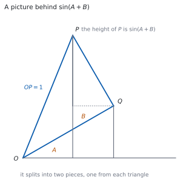
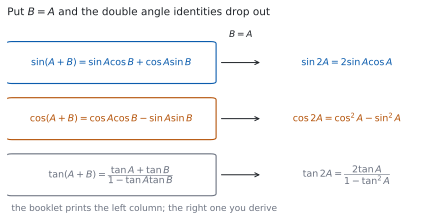

# HL 3.10 — Compound angle identities and the double angle identity for $\tan$（加法定理と $2$ 倍角） {#sec-aahl-3-10}

::: {.callout-note}
## What you should be able to do
- **加法定理**（compound angle identities）を公式集から正しく写せる。
- $\pm$ と $\mp$ の**複号の読み方**が分かる。
- $\dfrac{\pi}{12}$ のような角の**正確な値**を出せる。
- 加法定理に $B = A$ を入れて、**$2$ 倍角の公式を導ける**。
- $\tan 2\theta$ の公式を使える。
- 加法定理を使って、恒等式を示せる。
- $2$ 倍角を含む三角方程式を解ける。
:::

## The idea

### 1. The compound angle identities（加法定理） {#compound}

{#fig-aahl310-idea-a width=100%}

シラバスは、$2$ 行だけです。

> Compound angle identities.
>
> Double angle identity for tan.

**$2$ つの角の和や差**の三角比を、それぞれの三角比で表す式です。公式集の **3.10** の欄に、次の形で印刷されています。

> Compound angle identities
>
> $\sin(A \pm B) = \sin A\cos B \pm \cos A\sin B$
>
> $\cos(A \pm B) = \cos A\cos B \mp \sin A\sin B$
>
> $\tan(A \pm B) = \dfrac{\tan A \pm \tan B}{1 \mp \tan A\tan B}$

**覚える必要はありません。** 大事なのは、**複号の読み方**（[第 2 節](#signs)）と、**どこで使うか**です。

@fig-aahl310-idea-a は、$\sin(A+B)$ を図で見たものです。$P$ の高さが $\sin(A+B)$ で、それが $2$ つの三角形からの高さに分かれます。

::: {.callout-important}
## $\sin(A+B)$ は $\sin A + \sin B$ ではありません
いちばん多いまちがいです。**$\sin$ は「かっこの中をそのまま分けられる」関数ではありません。**

$A = B = \dfrac{\pi}{2}$ で試すと、$\sin\pi = 0$ ですが $\sin\dfrac{\pi}{2}+\sin\dfrac{\pi}{2} = 2$ です。**まったく違います。**
:::

### 2. Reading the $\pm$ and $\mp$ signs（複号の読み方） {#signs}

公式集の式には、$\pm$（上が $+$）と $\mp$（上が $-$）が出てきます。**上どうし・下どうしで読みます。**

: $\cos(A \pm B)$ の読み方 {#tbl-aahl310-signs}

| 左辺 | 右辺 |
|---|---|
| $\cos(A+B)$ | $\cos A\cos B - \sin A\sin B$ |
| $\cos(A-B)$ | $\cos A\cos B + \sin A\sin B$ |

**$\cos$ では、符号が逆になります。** 足し算のほうに $-$、引き算のほうに $+$ が付きます。

$\sin$ のほうは、そのままです。

$$
\sin(A+B) = \sin A\cos B + \cos A\sin B
$$ {#eq-aahl310-sin-sum}

$$
\cos(A+B) = \cos A\cos B - \sin A\sin B
$$ {#eq-aahl310-cos-sum}

::: {.callout-tip}
## 迷ったら、$A = B = \dfrac{\pi}{2}$ で試す
$\cos\pi = -1$ です。$\cos(A+B) = \cos A\cos B - \sin A\sin B$ に入れると $0 - 1 = -1$ ✓ 符号が合っています。

$+$ にしてしまうと $0+1 = 1$ で、合いません。**$30$ 秒で確かめられます。**
:::

### 3. Exact values for new angles（新しい角の正確な値） {#exact}

$\dfrac{\pi}{12}$（$15^{\circ}$）のような角は、**知っている角の和や差**に書き直せます。

$$
\frac{\pi}{12} = \frac{\pi}{3} - \frac{\pi}{4}
$$

なので

$$
\cos\frac{\pi}{12} = \cos\frac{\pi}{3}\cos\frac{\pi}{4} + \sin\frac{\pi}{3}\sin\frac{\pi}{4}
= \frac{1}{2}\cdot\frac{\sqrt{2}}{2} + \frac{\sqrt{3}}{2}\cdot\frac{\sqrt{2}}{2}
= \frac{\sqrt{2}+\sqrt{6}}{4}
$$

です。**$\cos$ の差なので、右辺は $+$ です**（[第 2 節](#signs)）。

**使える角は $\dfrac{\pi}{6}$、$\dfrac{\pi}{4}$、$\dfrac{\pi}{3}$、$\dfrac{\pi}{2}$ です**（[SL 3.5](../../aa-sl/03-geometry/aasl-3-5.qmd)）。この $4$ つの和や差で書ける角なら、正確な値が出せます。

### 4. Deriving the double angle identities（$2$ 倍角を導く） {#double}

{#fig-aahl310-idea-b width=100%}

Guidance は、次のように書いています。

> Derivation of double angle identities from compound angle identities.

**$2$ 倍角の公式は、加法定理に $B = A$ を入れるだけ**で出ます。@fig-aahl310-idea-b のとおりです。

@eq-aahl310-sin-sum で $B = A$ とすると

$$
\sin 2A = \sin A\cos A + \cos A\sin A = 2\sin A\cos A
$$ {#eq-aahl310-sin-double}

@eq-aahl310-cos-sum で $B = A$ とすると

$$
\cos 2A = \cos^{2}A - \sin^{2}A
$$ {#eq-aahl310-cos-double}

**この $2$ つは、公式集の 3.6 の欄にもあります**（SL の範囲です）。$\cos 2A$ には、$\cos^{2}A + \sin^{2}A = 1$ を使った書きかえが $2$ つあります。

$$
\cos 2A = 2\cos^{2}A - 1 = 1 - 2\sin^{2}A
$$ {#eq-aahl310-cos-double-forms}

::: {.callout-tip}
## $3$ つの形は、使い分けます
方程式に**$\sin$ だけ**が残ってほしいときは $1-2\sin^{2}A$、**$\cos$ だけ**が残ってほしいときは $2\cos^{2}A-1$ を選びます（[第 7 節](#solving)）。

**選び方を先に決める**と、途中で行きづまりません。
:::

### 5. The double angle identity for $\tan$（$\tan$ の $2$ 倍角） {#tan-double}

$\tan$ の $2$ 倍角だけは、**HL の範囲**です。公式集の **3.10** の欄にあります。

> Double angle identity for tan
>
> $\tan 2\theta = \dfrac{2\tan\theta}{1 - \tan^{2}\theta}$

$$
\tan 2\theta = \frac{2\tan\theta}{1-\tan^{2}\theta}
$$ {#eq-aahl310-tan-double}

これも、$\tan(A+B)$ に $B = A$ を入れて出ます。

**分母が $0$ になる $\theta$ では使えません。** $\tan^{2}\theta = 1$、つまり $\theta = \dfrac{\pi}{4} + \dfrac{k\pi}{2}$ のときです。そこでは $\tan 2\theta$ に値がありません。

### 6. Proving identities（恒等式を示す） {#proving}

`Show that` の問題では、**左辺から始めて右辺にたどり着きます**（[SL 1.6](../../aa-sl/01-number-and-algebra/aasl-1-6.qmd#lhs-rhs)）。

$$
\cos 3\theta = \cos(2\theta + \theta)
$$

のように、**大きい角を $2$ つに割る**のが定石です。あとは加法定理と $2$ 倍角でほどきます（[演習 9](#exercises)）。

シラバスは、複素数とのつながりも書いています。

> Link to: De Moivre's theorem (AHL1.14).

**De Moivre の定理からも、同じ式が出ます**（[HL 1.14](../01-number-and-algebra/aahl-1-14.qmd#demoivre)）。$(\cos\theta+i\sin\theta)^{2}$ を展開して実部と虚部をくらべると、$2$ 倍角の $2$ つの式が同時に出ます。

### 7. Solving equations with a double angle（$2$ 倍角を含む方程式） {#solving}

$\cos 2\theta$ と $\sin\theta$ が混ざった方程式は、**角をそろえてから**解きます。

$$
\cos 2\theta + 3\sin\theta = 2
$$

$\sin$ だけにしたいので、@eq-aahl310-cos-double-forms の $1-2\sin^{2}\theta$ を使います。

$$
1 - 2\sin^{2}\theta + 3\sin\theta = 2 \ \Rightarrow \ 2\sin^{2}\theta - 3\sin\theta + 1 = 0
$$

$$
(2\sin\theta - 1)(\sin\theta - 1) = 0
$$

**$\sin\theta$ の $2$ 次方程式**になりました。$\sin\theta = \dfrac{1}{2}$ または $\sin\theta = 1$ です。

$$
\text{角をそろえる} \to \text{$1$ 種類の三角比の $2$ 次方程式にする}
$$ {#eq-aahl310-strategy}

::: {.callout-tip collapse="true"}
## Paper 2 では、電卓で答え合わせができます
TI-Nspire CX II の Graphs ページに、左辺と右辺の $2$ つを入れて `menu` → `Analyze Graph` → `Intersection` を使うと、交点から解が読めます。

**範囲の指定に気をつけてください。** $0 \leq \theta \leq 2\pi$ なら、`Window Settings` で $x$ の範囲をその通りにします。そうしないと、範囲外の解まで拾ってしまいます。

恒等式の確かめにも使えます。$y_{1}$ に左辺、$y_{2}$ に右辺を入れて、**$2$ 本のグラフが重なれば**、まず合っています。

**Paper 1 では使えません。** このページの例題と演習は、すべて手で解けるようにしてあります。
:::

## Why it works

::: {.callout-tip collapse="true"}
## クリックすると開きます

#### $\sin(A+B)$ を図で見る {#why-picture}

@fig-aahl310-idea-a で、$OP = 1$、角 $AOQ = A$、角 $QOP = B$、角 $OQP$ は直角とします。

直角三角形 $OQP$ から $OQ = \cos B$、$QP = \sin B$ です。

$P$ の高さ（$x$ 軸からの距離）が $\sin(A+B)$ です。これを $2$ つに分けます。

- $Q$ の高さは $OQ\sin A = \cos B\sin A$
- $Q$ から $P$ までの高さの差は $QP\cos A = \sin B\cos A$

足すと

$$
\sin(A+B) = \sin A\cos B + \cos A\sin B
$$

です。**$A$ と $B$ が鋭角で、$A+B$ が鋭角のときの図です。** すべての角で成り立つことは、単位円や複素数を使って示します。

#### $\tan$ の加法定理は、割り算から出ます {#why-tan}

$\tan(A+B) = \dfrac{\sin(A+B)}{\cos(A+B)}$ に、@eq-aahl310-sin-sum と @eq-aahl310-cos-sum を入れます。

$$
\tan(A+B) = \frac{\sin A\cos B + \cos A\sin B}{\cos A\cos B - \sin A\sin B}
$$

**分子と分母を $\cos A\cos B$ で割ります**（どちらも $0$ でないとします）。

$$
= \frac{\dfrac{\sin A}{\cos A} + \dfrac{\sin B}{\cos B}}{1 - \dfrac{\sin A}{\cos A}\cdot\dfrac{\sin B}{\cos B}}
= \frac{\tan A + \tan B}{1 - \tan A\tan B}
$$

です（[演習 8](#exercises)）。**$\cos A\cos B$ で割るところ**が、この導出の要です。

#### $\cos 2A$ の $3$ つの形 {#why-three-forms}

@eq-aahl310-cos-double は $\cos^{2}A - \sin^{2}A$ でした。ここに $\sin^{2}A = 1 - \cos^{2}A$ を入れると

$$
\cos 2A = \cos^{2}A - \left(1-\cos^{2}A\right) = 2\cos^{2}A - 1
$$

です。$\cos^{2}A = 1 - \sin^{2}A$ を入れると

$$
\cos 2A = \left(1-\sin^{2}A\right) - \sin^{2}A = 1 - 2\sin^{2}A
$$

です。**$3$ つは同じ式で、見た目だけが違います。**

#### De Moivre の定理とのつながり {#why-demoivre}

$(\cos\theta + i\sin\theta)^{2}$ を、$2$ 通りに計算します。

**展開すると**

$$
\cos^{2}\theta + 2i\cos\theta\sin\theta + i^{2}\sin^{2}\theta
= \left(\cos^{2}\theta - \sin^{2}\theta\right) + i\left(2\sin\theta\cos\theta\right)
$$

**De Moivre の定理を使うと**（[HL 1.14](../01-number-and-algebra/aahl-1-14.qmd#demoivre)）

$$
(\cos\theta+i\sin\theta)^{2} = \cos 2\theta + i\sin 2\theta
$$

です。**実部どうし・虚部どうしをくらべる**と、@eq-aahl310-cos-double と @eq-aahl310-sin-double が同時に出ます。

**$3$ 乗にすれば $3$ 倍角が出ます。** 同じやり方が、何倍角でも使えます（[演習 9](#exercises)）。
:::

## Worked examples

::: {.callout-note appearance="simple"}
問題文は英語です。意味が理解できなかったら、問題文の下の「**日本語訳**」を開いてください。解説は日本語です。

**例題も演習も、すべて電卓なしで解けます。** Paper 1 のつもりで解いてください。
:::

::: {#exm-aahl310-exact}
[Find the exact value of $\cos\dfrac{\pi}{12}$.]{.q-en}

日本語訳

$\cos\dfrac{\pi}{12}$ の正確な値を求めなさい。

---

**知っている角の差に書き直します**（[第 3 節](#exact)）。

$$
\frac{\pi}{12} = \frac{4\pi - 3\pi}{12} = \frac{\pi}{3} - \frac{\pi}{4}
$$

$\cos(A-B)$ なので、右辺は $+$ です（[第 2 節](#signs)）。

$$
\cos\frac{\pi}{12} = \cos\frac{\pi}{3}\cos\frac{\pi}{4} + \sin\frac{\pi}{3}\sin\frac{\pi}{4}
$$

$$
= \frac{1}{2}\cdot\frac{\sqrt{2}}{2} + \frac{\sqrt{3}}{2}\cdot\frac{\sqrt{2}}{2}
= \frac{\sqrt{2}}{4} + \frac{\sqrt{6}}{4} = \frac{\sqrt{2}+\sqrt{6}}{4}
$$

**検算。** **大きさを見ます。** $\sqrt{2} \approx 1.41$、$\sqrt{6} \approx 2.45$ なので、答えは約 $\dfrac{3.86}{4} \approx 0.97$ です。$\dfrac{\pi}{12}$ は小さい角なので、$\cos$ は $1$ に近いはずです ✓

**検算（符号のほう）。** $A = B$ として $\cos 0 = 1$ で試します。$\cos^{2}A + \sin^{2}A = 1$ ✓ **$+$ で合っています。** $-$ だと $\cos 2A$ になってしまいます。

::: {.callout-note}
## 解答例（答案用紙に書くこと）

$$\frac{\pi}{12} = \frac{\pi}{3}-\frac{\pi}{4}$$

$$\cos\frac{\pi}{12} = \cos\frac{\pi}{3}\cos\frac{\pi}{4}+\sin\frac{\pi}{3}\sin\frac{\pi}{4}
= \frac{1}{2}\cdot\frac{\sqrt{2}}{2}+\frac{\sqrt{3}}{2}\cdot\frac{\sqrt{2}}{2}$$

$$= \frac{\sqrt{2}+\sqrt{6}}{4}$$
:::
:::

::: {#exm-aahl310-two-angles}
[Let $A$ and $B$ be acute angles with $\sin A = \dfrac{3}{5}$ and $\cos B = \dfrac{5}{13}$.]{.q-en}

**(a)** [Find the exact value of $\sin(A+B)$.]{.q-en}

**(b)** [Find the exact value of $\tan(A+B)$.]{.q-en}

日本語訳

$A$、$B$ を鋭角として、$\sin A = \dfrac{3}{5}$、$\cos B = \dfrac{5}{13}$ とします。

**(a)** $\sin(A+B)$ の正確な値を求めなさい。

**(b)** $\tan(A+B)$ の正確な値を求めなさい。

---

**足りない値を、先にそろえます。** どちらも鋭角なので、正の平方根を取ります。

$$
\cos A = \sqrt{1-\frac{9}{25}} = \frac{4}{5}, \qquad
\sin B = \sqrt{1-\frac{25}{169}} = \frac{12}{13}
$$

**(a)** @eq-aahl310-sin-sum に入れます。

$$
\sin(A+B) = \frac{3}{5}\cdot\frac{5}{13} + \frac{4}{5}\cdot\frac{12}{13}
= \frac{15}{65} + \frac{48}{65} = \frac{63}{65}
$$

**(b)** $\tan(A+B) = \dfrac{\sin(A+B)}{\cos(A+B)}$ なので、$\cos(A+B)$ も出します。

$$
\cos(A+B) = \frac{4}{5}\cdot\frac{5}{13} - \frac{3}{5}\cdot\frac{12}{13}
= \frac{20}{65} - \frac{36}{65} = -\frac{16}{65}
$$

$$
\tan(A+B) = \frac{63/65}{-16/65} = -\frac{63}{16}
$$

**検算。** **$\sin^{2} + \cos^{2} = 1$ で確かめます。**

$$
\left(\frac{63}{65}\right)^{2} + \left(\frac{16}{65}\right)^{2}
= \frac{3969 + 256}{4225} = \frac{4225}{4225} = 1
$$

合いました ✓

**検算（符号のほう）。** $\cos(A+B)$ が負なので、$A+B$ は第 $2$ 象限の角です。$\sin$ が正で $\tan$ が負 ✓ **$3$ つの符号が、たがいに合っています。**

::: {.callout-note}
## 解答例（答案用紙に書くこと）

$$\cos A = \frac{4}{5}, \qquad \sin B = \frac{12}{13} \quad (\text{both acute})$$

**(a)** $\sin(A+B) = \dfrac{3}{5}\cdot\dfrac{5}{13}+\dfrac{4}{5}\cdot\dfrac{12}{13} = \dfrac{63}{65}$

**(b)** $\cos(A+B) = \dfrac{4}{5}\cdot\dfrac{5}{13}-\dfrac{3}{5}\cdot\dfrac{12}{13} = -\dfrac{16}{65}$

$$\tan(A+B) = \frac{63/65}{-16/65} = -\frac{63}{16}$$
:::
:::

::: {#exm-aahl310-equation}
**(a)** [Show that $\cos 2\theta = 1 - 2\sin^{2}\theta$.]{.q-en}

**(b)** [Hence solve $\cos 2\theta + 3\sin\theta = 2$ for $0 \leq \theta \leq 2\pi$.]{.q-en}

日本語訳

**(a)** $\cos 2\theta = 1-2\sin^{2}\theta$ を示しなさい。

**(b)** それを使って、$0 \leq \theta \leq 2\pi$ の範囲で $\cos 2\theta + 3\sin\theta = 2$ を解きなさい。

---

**(a)** 加法定理で $B = A = \theta$ とします（[第 4 節](#double)）。

$$
\cos 2\theta = \cos^{2}\theta - \sin^{2}\theta
$$

$\cos^{2}\theta = 1 - \sin^{2}\theta$ を入れます。

$$
= \left(1-\sin^{2}\theta\right) - \sin^{2}\theta = 1 - 2\sin^{2}\theta
$$

**(b)** (a) を使って、$\sin$ だけにそろえます（@eq-aahl310-strategy）。

$$
1 - 2\sin^{2}\theta + 3\sin\theta = 2
$$

$$
2\sin^{2}\theta - 3\sin\theta + 1 = 0 \ \Rightarrow \ (2\sin\theta-1)(\sin\theta-1) = 0
$$

$\sin\theta = \dfrac{1}{2}$ または $\sin\theta = 1$ です。$0 \leq \theta \leq 2\pi$ で

$$
\theta = \frac{\pi}{6}, \qquad \frac{\pi}{2}, \qquad \frac{5\pi}{6}
$$

**検算。** **$\theta = \dfrac{\pi}{6}$ を入れます。** $\cos\dfrac{\pi}{3} = \dfrac{1}{2}$、$3\sin\dfrac{\pi}{6} = \dfrac{3}{2}$ で、和は $2$ ✓

**検算（$\theta = \dfrac{\pi}{2}$ で）。** $\cos\pi = -1$、$3\sin\dfrac{\pi}{2} = 3$ で、和は $2$ ✓ **$3$ つとも入れて確かめてください。**

::: {.callout-note}
## 解答例（答案用紙に書くこと）

**(a)** $\cos 2\theta = \cos^{2}\theta-\sin^{2}\theta = \left(1-\sin^{2}\theta\right)-\sin^{2}\theta = 1-2\sin^{2}\theta$

**(b)** $1-2\sin^{2}\theta+3\sin\theta = 2 \ \Rightarrow \ 2\sin^{2}\theta-3\sin\theta+1 = 0$

$$(2\sin\theta-1)(\sin\theta-1) = 0, \quad \sin\theta = \frac{1}{2} \ \text{or} \ \sin\theta = 1$$

$$\theta = \frac{\pi}{6}, \quad \frac{\pi}{2}, \quad \frac{5\pi}{6}$$
:::
:::

::: {#exm-aahl310-tan}
[Let $t = \tan\dfrac{\pi}{8}$.]{.q-en}

**(a)** [Use the double angle identity for $\tan$ to show that $t^{2}+2t-1 = 0$.]{.q-en}

**(b)** [Hence find the exact value of $\tan\dfrac{\pi}{8}$.]{.q-en}

日本語訳

$t = \tan\dfrac{\pi}{8}$ とします。

**(a)** $\tan$ の $2$ 倍角の公式を使って、$t^{2}+2t-1 = 0$ を示しなさい。

**(b)** それを使って $\tan\dfrac{\pi}{8}$ の正確な値を求めなさい。

---

**(a)** @eq-aahl310-tan-double で $\theta = \dfrac{\pi}{8}$ とします。$2\theta = \dfrac{\pi}{4}$ なので

$$
\tan\frac{\pi}{4} = \frac{2t}{1-t^{2}}
$$

左辺は $1$ です。

$$
1 = \frac{2t}{1-t^{2}} \ \Rightarrow \ 1 - t^{2} = 2t \ \Rightarrow \ t^{2}+2t-1 = 0
$$

**分母をはらうとき、$1-t^{2} \neq 0$ が要ります。** $\dfrac{\pi}{8}$ では $\tan^{2} \neq 1$ なので、かまいません。

**(b)** 解の公式から

$$
t = \frac{-2 \pm \sqrt{4+4}}{2} = -1 \pm \sqrt{2}
$$

::: {.model-answer}
**試験ではこう書く**

*The quadratic $t^{2}+2t-1 = 0$ has the two roots $t = -1+\sqrt{2}$ and $t = -1-\sqrt{2}$, so one of them must be rejected. The angle $\dfrac{\pi}{8}$ lies strictly between $0$ and $\dfrac{\pi}{2}$, so it is in the first quadrant and its tangent is positive. Now $-1-\sqrt{2}$ is negative, so it cannot be $\tan\dfrac{\pi}{8}$, while $-1+\sqrt{2} = \sqrt{2}-1 \approx 0.414$ is positive. Hence $\tan\dfrac{\pi}{8} = \sqrt{2}-1$.*
:::

（$2$ 次方程式の解は $2$ つあるが、$\dfrac{\pi}{8}$ は第 $1$ 象限の角なので $\tan$ は正。負のほうは捨てる、という意味です。）

$$
\tan\frac{\pi}{8} = \sqrt{2}-1
$$

**検算。** **$2$ 倍角の式に戻します。** $t = \sqrt{2}-1$ なら $t^{2} = 3-2\sqrt{2}$ なので

$$
\frac{2t}{1-t^{2}} = \frac{2\sqrt{2}-2}{1-(3-2\sqrt{2})} = \frac{2\sqrt{2}-2}{2\sqrt{2}-2} = 1
$$

$\tan\dfrac{\pi}{4} = 1$ に戻りました ✓

**検算（大きさで）。** $\sqrt{2}-1 \approx 0.414$ です。$\dfrac{\pi}{8}$ は $\dfrac{\pi}{4}$ の半分なので、$\tan$ は $1$ より小さいはずです ✓

::: {.callout-note}
## 解答例（答案用紙に書くこと）

**(a)** $\tan\dfrac{\pi}{4} = \dfrac{2t}{1-t^{2}}$ *and* $\tan\dfrac{\pi}{4} = 1$, *so*

$$1-t^{2} = 2t, \qquad t^{2}+2t-1 = 0$$

**(b)** $t = \dfrac{-2\pm\sqrt{8}}{2} = -1\pm\sqrt{2}$

*Since $\dfrac{\pi}{8}$ is in the first quadrant, $t > 0$, so $\tan\dfrac{\pi}{8} = \sqrt{2}-1$.*
:::
:::

## Common errors

::: {.callout-warning}
## $\sin(A+B)$ を $\sin A + \sin B$ とする
$\sin$ はかっこの中をそのまま分けられません（[第 1 節](#compound)）。

**公式集の式を、そのまま写してください。** $A = B = \dfrac{\pi}{2}$ で試すと、すぐにちがいが分かります。
:::

::: {.callout-warning}
## $\cos$ の複号を、そのままの符号で読む
$\cos(A+B)$ の右辺は **$-$** です（[第 2 節](#signs)）。公式集では $\mp$ と書かれています。

**$\sin$ は同じ、$\cos$ は逆**と覚えておいてください。
:::

::: {.callout-warning}
## $\cos 2\theta$ の形を選ばずに進む
$3$ つの形があります（@eq-aahl310-cos-double-forms）。**残したい三角比で選びます**（[第 4 節](#double)）。

$\sin$ の式なら $1-2\sin^{2}\theta$、$\cos$ の式なら $2\cos^{2}\theta-1$ です。選ばずに $\cos^{2}\theta-\sin^{2}\theta$ のまま進むと、$2$ 種類が残って解けません。
:::

::: {.callout-warning}
## $\tan 2\theta$ の分母を $1+\tan^{2}\theta$ とする
正しくは **$1-\tan^{2}\theta$** です（@eq-aahl310-tan-double）。$1+\tan^{2}\theta$ は $\sec^{2}\theta$ のほうです（[HL 3.9](aahl-3-9.qmd#identities)）。

**公式集の 3.10 と 3.9 は、となり合っています。** 見る欄をまちがえないでください。
:::

::: {.callout-warning}
## $\sin 2\theta = \cos\theta$ で、両辺を $\cos\theta$ で割る
$\cos\theta$ が $0$ になる $\theta$ が、答えから消えてしまいます（[HL 2.15](../02-functions/aahl-2-15.qmd#analytic)）。

$2\sin\theta\cos\theta - \cos\theta = 0$ と**寄せてから、$\cos\theta$ でくくって**ください。
:::

::: {.callout-warning}
## $2$ 次方程式の解を、片方だけ捨てずに残す
$\tan\dfrac{\pi}{8}$ のような問題では、$2$ 次方程式の解が $2$ つ出ます。**象限から符号を決めて、片方を捨てます**（[例題 4](#exm-aahl310-tan)）。

**捨てた理由を書くところまで**が答えです。
:::

## Exercises

::: {.callout-note appearance="simple"}
各問題に、折りたたみが $3$ つ付いています。**日本語訳**、**解答例**（答案用紙に書くべきこと。英語です）、**解説**（なぜそうなるか。日本語です）。

まず自分で解いて、次に解答例と見くらべてください。**解説は、合わなかったときだけ開けば十分です。**
:::

::: {.exercise-block}

[1]{.ex-no} [Find the exact value of $\sin\dfrac{7\pi}{12}$.]{.q-en}

日本語訳

$\sin\dfrac{7\pi}{12}$ の正確な値を求めなさい。

::: {.callout-note collapse="true"}
## 解答例（答案用紙に書くこと）

$$\frac{7\pi}{12} = \frac{\pi}{3}+\frac{\pi}{4}$$

$$\sin\frac{7\pi}{12} = \sin\frac{\pi}{3}\cos\frac{\pi}{4}+\cos\frac{\pi}{3}\sin\frac{\pi}{4}
= \frac{\sqrt{3}}{2}\cdot\frac{\sqrt{2}}{2}+\frac{1}{2}\cdot\frac{\sqrt{2}}{2}$$

$$= \frac{\sqrt{6}+\sqrt{2}}{4}$$
:::

::: {.callout-tip collapse="true"}
## 解説

$\dfrac{7\pi}{12} = \dfrac{4\pi+3\pi}{12}$ です。**分母を $12$ にそろえてから、$4$ と $3$ に分ける**と見つかります（[第 3 節](#exact)）。

**検算。** $\dfrac{7\pi}{12}$ は $\dfrac{\pi}{2}$ より少し大きい角なので、$\sin$ は $1$ に近い正の値です。$\dfrac{2.45+1.41}{4} \approx 0.97$ ✓

**検算（補角で）。** $\sin\dfrac{7\pi}{12} = \sin\dfrac{5\pi}{12}$ のはずです（$\pi$ から引いた角）。$\dfrac{5\pi}{12} = \dfrac{\pi}{6}+\dfrac{\pi}{4}$ から計算しても、同じ値になります ✓
:::

::: {.ex-sep}
:::

[2]{.ex-no} [Find the exact value of $\tan\dfrac{\pi}{12}$, giving your answer in the form $a+b\sqrt{3}$ where $a$ and $b$ are integers.]{.q-en}

日本語訳

$\tan\dfrac{\pi}{12}$ の正確な値を、$a$、$b$ を整数として $a+b\sqrt{3}$ の形で求めなさい。

::: {.callout-note collapse="true"}
## 解答例（答案用紙に書くこと）

$$\tan\frac{\pi}{12} = \tan\left(\frac{\pi}{3}-\frac{\pi}{4}\right)
= \frac{\tan\frac{\pi}{3}-\tan\frac{\pi}{4}}{1+\tan\frac{\pi}{3}\tan\frac{\pi}{4}}
= \frac{\sqrt{3}-1}{1+\sqrt{3}}$$

*Multiplying numerator and denominator by $\sqrt{3}-1$:*

$$= \frac{(\sqrt{3}-1)^{2}}{(\sqrt{3}+1)(\sqrt{3}-1)}
= \frac{4-2\sqrt{3}}{2} = 2-\sqrt{3}$$
:::

::: {.callout-tip collapse="true"}
## 解説

**$\tan(A-B)$ では、分母が $1+\tan A\tan B$ です。** 公式集の $\mp$ を、下の符号で読みます（[第 2 節](#signs)）。

分母に $\sqrt{3}$ が残っているので、**有理化**します（[SL 1.5](../../aa-sl/01-number-and-algebra/aasl-1-5.qmd)）。

**検算。** $2-\sqrt{3} \approx 0.27$ です。$\dfrac{\pi}{12}$ は小さい角なので、$\tan$ も小さいはずです ✓

**検算（$\tan\dfrac{\pi}{12}\tan\dfrac{5\pi}{12}$ で）。** $\dfrac{\pi}{12}+\dfrac{5\pi}{12} = \dfrac{\pi}{2}$ なので、$2$ つの $\tan$ の積は $1$ のはずです。$(2-\sqrt{3})(2+\sqrt{3}) = 4-3 = 1$ ✓
:::

::: {.ex-sep}
:::

[3]{.ex-no} [Let $A$ and $B$ be acute angles with $\cos A = \dfrac{8}{17}$ and $\sin B = \dfrac{4}{5}$. Find the exact value of $\cos(A-B)$.]{.q-en}

日本語訳

$A$、$B$ を鋭角として、$\cos A = \dfrac{8}{17}$、$\sin B = \dfrac{4}{5}$ とします。$\cos(A-B)$ の正確な値を求めなさい。

::: {.callout-note collapse="true"}
## 解答例（答案用紙に書くこと）

$$\sin A = \sqrt{1-\frac{64}{289}} = \frac{15}{17}, \qquad
\cos B = \sqrt{1-\frac{16}{25}} = \frac{3}{5}$$

$$\cos(A-B) = \cos A\cos B+\sin A\sin B
= \frac{8}{17}\cdot\frac{3}{5}+\frac{15}{17}\cdot\frac{4}{5}$$

$$= \frac{24}{85}+\frac{60}{85} = \frac{84}{85}$$
:::

::: {.callout-tip collapse="true"}
## 解説

**足りない値を先に出します**（[例題 2](#exm-aahl310-two-angles)）。どちらも鋭角なので、正の平方根です。

$\cos(A-B)$ なので、右辺は $+$ です。

**検算。** $8$ 対 $15$ 対 $17$ と $3$ 対 $4$ 対 $5$ の直角三角形です。$8^{2}+15^{2} = 289 = 17^{2}$ ✓

**検算（大きさで）。** $\dfrac{84}{85} \approx 0.99$ です。$\cos$ の値は $1$ 以下でなければなりません ✓ **$A$ と $B$ が近い角だと、差が小さく $\cos$ は $1$ に近くなります。**
:::

::: {.ex-sep}
:::

[4]{.ex-no} [Show that $\sin 2\theta = 2\sin\theta\cos\theta$, starting from the compound angle identity for $\sin(A+B)$.]{.q-en}

日本語訳

$\sin(A+B)$ の加法定理から出発して、$\sin 2\theta = 2\sin\theta\cos\theta$ を示しなさい。

::: {.callout-note collapse="true"}
## 解答例（答案用紙に書くこと）

$$\sin(A+B) = \sin A\cos B+\cos A\sin B$$

*Putting $A = B = \theta$:*

$$\sin 2\theta = \sin\theta\cos\theta+\cos\theta\sin\theta = 2\sin\theta\cos\theta$$
:::

::: {.callout-tip collapse="true"}
## 解説

**$B = A$ を入れるだけ**です（[第 4 節](#double)）。$2$ つの項が同じものになるので、$2$ 倍になります。

**検算。** $\theta = \dfrac{\pi}{4}$ で確かめます。$\sin\dfrac{\pi}{2} = 1$、右辺は $2 \times \dfrac{\sqrt{2}}{2} \times \dfrac{\sqrt{2}}{2} = 1$ ✓

**検算（$\theta = \dfrac{\pi}{6}$ で）。** $\sin\dfrac{\pi}{3} = \dfrac{\sqrt{3}}{2}$、右辺は $2 \times \dfrac{1}{2} \times \dfrac{\sqrt{3}}{2} = \dfrac{\sqrt{3}}{2}$ ✓
:::

::: {.ex-sep}
:::

[5]{.ex-no} [Solve $\cos 2\theta = \sin\theta$ for $0 \leq \theta \leq 2\pi$.]{.q-en}

日本語訳

$0 \leq \theta \leq 2\pi$ の範囲で $\cos 2\theta = \sin\theta$ を解きなさい。

::: {.callout-note collapse="true"}
## 解答例（答案用紙に書くこと）

$$1-2\sin^{2}\theta = \sin\theta \ \Rightarrow \ 2\sin^{2}\theta+\sin\theta-1 = 0$$

$$(2\sin\theta-1)(\sin\theta+1) = 0$$

*$\sin\theta = \dfrac{1}{2}$ gives $\theta = \dfrac{\pi}{6}$ or $\theta = \dfrac{5\pi}{6}$.*

*$\sin\theta = -1$ gives $\theta = \dfrac{3\pi}{2}$.*

$$\theta = \frac{\pi}{6}, \quad \frac{5\pi}{6}, \quad \frac{3\pi}{2}$$
:::

::: {.callout-tip collapse="true"}
## 解説

**右辺が $\sin$ なので、$1-2\sin^{2}\theta$ を選びます**（[第 4 節](#double)）。

$\sin\theta = -1$ になるのは $\dfrac{3\pi}{2}$ の $1$ つだけです。**$-1$ は $\sin$ の最小値なので、$1$ 周に $1$ 回しか出ません。**

**検算。** $\theta = \dfrac{3\pi}{2}$ では $\cos 3\pi = -1$、$\sin\dfrac{3\pi}{2} = -1$ ✓

**検算（$\theta = \dfrac{5\pi}{6}$ で）。** $\cos\dfrac{5\pi}{3} = \dfrac{1}{2}$、$\sin\dfrac{5\pi}{6} = \dfrac{1}{2}$ ✓
:::

::: {.ex-sep}
:::

[6]{.ex-no} [Solve $\sin 2\theta = \cos\theta$ for $0 \leq \theta \leq 2\pi$.]{.q-en}

日本語訳

$0 \leq \theta \leq 2\pi$ の範囲で $\sin 2\theta = \cos\theta$ を解きなさい。

::: {.callout-note collapse="true"}
## 解答例（答案用紙に書くこと）

$$2\sin\theta\cos\theta = \cos\theta \ \Rightarrow \ \cos\theta\left(2\sin\theta-1\right) = 0$$

*$\cos\theta = 0$ gives $\theta = \dfrac{\pi}{2}$ or $\theta = \dfrac{3\pi}{2}$.*

*$\sin\theta = \dfrac{1}{2}$ gives $\theta = \dfrac{\pi}{6}$ or $\theta = \dfrac{5\pi}{6}$.*

$$\theta = \frac{\pi}{6}, \quad \frac{\pi}{2}, \quad \frac{5\pi}{6}, \quad \frac{3\pi}{2}$$
:::

::: {.callout-tip collapse="true"}
## 解説

**両辺を $\cos\theta$ で割らないでください。** $\cos\theta = 0$ の解が $2$ つ消えます。寄せてから、**$\cos\theta$ でくくります。**

**検算。** $\theta = \dfrac{\pi}{2}$ では $\sin\pi = 0$、$\cos\dfrac{\pi}{2} = 0$ ✓ 割っていたら、この解が出ませんでした。

**検算（$\theta = \dfrac{\pi}{6}$ で）。** $\sin\dfrac{\pi}{3} = \dfrac{\sqrt{3}}{2}$、$\cos\dfrac{\pi}{6} = \dfrac{\sqrt{3}}{2}$ ✓
:::

::: {.ex-sep}
:::

[7]{.ex-no} [Show that $\left(\sin\theta+\cos\theta\right)^{2} = 1+\sin 2\theta$.]{.q-en}

日本語訳

$\left(\sin\theta+\cos\theta\right)^{2} = 1+\sin 2\theta$ を示しなさい。

::: {.callout-note collapse="true"}
## 解答例（答案用紙に書くこと）

$$\text{LHS} = \sin^{2}\theta+2\sin\theta\cos\theta+\cos^{2}\theta$$

$$= \left(\sin^{2}\theta+\cos^{2}\theta\right)+2\sin\theta\cos\theta
= 1+\sin 2\theta = \text{RHS}$$
:::

::: {.callout-tip collapse="true"}
## 解説

**展開してから、$2$ つに分けて読む**のが要です。$\sin^{2}+\cos^{2}$ が $1$、残りの $2\sin\theta\cos\theta$ が $\sin 2\theta$ です。

**検算。** $\theta = \dfrac{\pi}{4}$ では、左辺は $\left(\sqrt{2}\right)^{2} = 2$、右辺は $1+\sin\dfrac{\pi}{2} = 2$ ✓

**検算（$\theta = 0$ で）。** 左辺は $1$、右辺は $1+0 = 1$ ✓
:::

::: {.ex-sep}
:::

[8]{.ex-no} [Show that $\tan(A+B) = \dfrac{\tan A+\tan B}{1-\tan A\tan B}$, starting from the compound angle identities for $\sin(A+B)$ and $\cos(A+B)$.]{.q-en}

日本語訳

$\sin(A+B)$ と $\cos(A+B)$ の加法定理から出発して、$\tan(A+B) = \dfrac{\tan A+\tan B}{1-\tan A\tan B}$ を示しなさい。

::: {.callout-note collapse="true"}
## 解答例（答案用紙に書くこと）

$$\tan(A+B) = \frac{\sin(A+B)}{\cos(A+B)}
= \frac{\sin A\cos B+\cos A\sin B}{\cos A\cos B-\sin A\sin B}$$

*Dividing the numerator and the denominator by $\cos A\cos B$:*

$$= \frac{\dfrac{\sin A}{\cos A}+\dfrac{\sin B}{\cos B}}
{1-\dfrac{\sin A}{\cos A}\cdot\dfrac{\sin B}{\cos B}}
= \frac{\tan A+\tan B}{1-\tan A\tan B}$$
:::

::: {.callout-tip collapse="true"}
## 解説

**$\cos A\cos B$ で割るところ**が、この導出の要です（[Why it works](#why-tan)）。分子の $2$ 項も分母の $2$ 項も、きれいに $\tan$ になります。

**検算。** $A = B = \dfrac{\pi}{6}$ で確かめます。左辺は $\tan\dfrac{\pi}{3} = \sqrt{3}$、右辺は $\dfrac{2/\sqrt{3}}{1-1/3} = \dfrac{2/\sqrt{3}}{2/3} = \sqrt{3}$ ✓

**検算（$B = 0$ で）。** 右辺は $\dfrac{\tan A+0}{1-0} = \tan A$ ✓ **左辺も $\tan A$ です。**

::: {.model-answer}
**試験ではこう書く**

*By definition $\tan(A+B) = \dfrac{\sin(A+B)}{\cos(A+B)}$, provided $\cos(A+B) \neq 0$. Substituting the compound angle identities gives*

$$\tan(A+B) = \frac{\sin A\cos B+\cos A\sin B}{\cos A\cos B-\sin A\sin B}$$

*Assume also that $\cos A \neq 0$ and $\cos B \neq 0$, so that $\tan A$ and $\tan B$ are defined. Dividing both the numerator and the denominator by the non-zero quantity $\cos A\cos B$ leaves the value of the fraction unchanged. In the numerator, $\dfrac{\sin A\cos B}{\cos A\cos B} = \tan A$ and $\dfrac{\cos A\sin B}{\cos A\cos B} = \tan B$. In the denominator, $\dfrac{\cos A\cos B}{\cos A\cos B} = 1$ and $\dfrac{\sin A\sin B}{\cos A\cos B} = \tan A\tan B$. Hence $\tan(A+B) = \dfrac{\tan A+\tan B}{1-\tan A\tan B}$.*
:::
:::

::: {.ex-sep}
:::

[9]{.ex-no} [Show that $\cos 3\theta = 4\cos^{3}\theta - 3\cos\theta$.]{.q-en}

日本語訳

$\cos 3\theta = 4\cos^{3}\theta-3\cos\theta$ を示しなさい。

::: {.callout-note collapse="true"}
## 解答例（答案用紙に書くこと）

$$\cos 3\theta = \cos(2\theta+\theta) = \cos 2\theta\cos\theta - \sin 2\theta\sin\theta$$

$$= \left(2\cos^{2}\theta-1\right)\cos\theta - 2\sin\theta\cos\theta\sin\theta$$

$$= 2\cos^{3}\theta-\cos\theta-2\cos\theta\sin^{2}\theta$$

$$= 2\cos^{3}\theta-\cos\theta-2\cos\theta\left(1-\cos^{2}\theta\right)
= 4\cos^{3}\theta-3\cos\theta$$
:::

::: {.callout-tip collapse="true"}
## 解説

**$3\theta$ を $2\theta+\theta$ に割る**のが第一歩です（[第 6 節](#proving)）。あとは $2$ 倍角と $\sin^{2}\theta = 1-\cos^{2}\theta$ でほどきます。

$\cos 2\theta$ には $2\cos^{2}\theta-1$ を選びます。**$\cos$ だけを残したいから**です。

**検算。** $\theta = 0$ では、左辺 $1$、右辺 $4-3 = 1$ ✓

**検算（$\theta = \dfrac{\pi}{3}$ で）。** 左辺は $\cos\pi = -1$、右辺は $4 \times \dfrac{1}{8} - 3 \times \dfrac{1}{2} = \dfrac{1}{2}-\dfrac{3}{2} = -1$ ✓

::: {.model-answer}
**試験ではこう書く**

*Write $3\theta = 2\theta+\theta$ and apply the compound angle identity for cosine:*

$$\cos 3\theta = \cos 2\theta\cos\theta - \sin 2\theta\sin\theta$$

*Now substitute the double angle identities, choosing the form of $\cos 2\theta$ that contains only cosines:*

$$= \left(2\cos^{2}\theta-1\right)\cos\theta - \left(2\sin\theta\cos\theta\right)\sin\theta
= 2\cos^{3}\theta-\cos\theta-2\cos\theta\sin^{2}\theta$$

*Finally replace $\sin^{2}\theta$ by $1-\cos^{2}\theta$, which removes the last sine:*

$$= 2\cos^{3}\theta-\cos\theta-2\cos\theta+2\cos^{3}\theta = 4\cos^{3}\theta-3\cos\theta$$

*as required. The same identity also follows from De Moivre's theorem by expanding $(\cos\theta+i\sin\theta)^{3}$ and comparing real parts.*
:::
:::

::: {.ex-sep}
:::

[10]{.ex-no} [A student writes $\cos(A-B) = \cos A\cos B - \sin A\sin B$. Explain the error, and give a value of $A$ and of $B$ that shows the formula is wrong.]{.q-en}

日本語訳

ある生徒が $\cos(A-B) = \cos A\cos B - \sin A\sin B$ と書きました。まちがいを説明し、この式が正しくないことを示す $A$ と $B$ の値を挙げなさい。

::: {.callout-note collapse="true"}
## 解答例（答案用紙に書くこと）

*The correct identity is $\cos(A-B) = \cos A\cos B + \sin A\sin B$: in the booklet the sign is $\mp$, so the minus on the left goes with a plus on the right.*

*Take $A = B = \dfrac{\pi}{3}$. Then $\cos(A-B) = \cos 0 = 1$, but*

$$\cos\frac{\pi}{3}\cos\frac{\pi}{3}-\sin\frac{\pi}{3}\sin\frac{\pi}{3}
= \frac{1}{4}-\frac{3}{4} = -\frac{1}{2}$$

*which is not $1$.*
:::

::: {.callout-tip collapse="true"}
## 解説

**$\mp$ は「上が $-$、下が $+$」**です（[第 2 節](#signs)）。左辺が $-$ のときは、右辺が $+$ になります。

**$A = B$ で試す**と、左辺が $\cos 0 = 1$ になるので、すぐに見分けられます。

**検算。** 正しい式で $A = B = \dfrac{\pi}{3}$ を入れると $\dfrac{1}{4}+\dfrac{3}{4} = 1$ ✓

**検算（生徒の式が何なのか）。** 生徒の書いた式は $\cos(A+B)$ です ✓ **符号を $1$ つ取りちがえると、別の公式になります。**

::: {.model-answer}
**試験ではこう書く**

*The formula booklet gives $\cos(A \pm B) = \cos A\cos B \mp \sin A\sin B$, where the signs are read together: the upper sign on the left goes with the upper sign on the right. Taking the lower signs gives $\cos(A-B) = \cos A\cos B + \sin A\sin B$, so the student has used a minus where a plus is needed; the expression written is in fact $\cos(A+B)$. A single pair of values settles it. Take $A = B = \dfrac{\pi}{3}$. The left-hand side is $\cos(A-B) = \cos 0 = 1$, while the student's right-hand side is $\cos\dfrac{\pi}{3}\cos\dfrac{\pi}{3}-\sin\dfrac{\pi}{3}\sin\dfrac{\pi}{3} = \dfrac{1}{2}\cdot\dfrac{1}{2}-\dfrac{\sqrt{3}}{2}\cdot\dfrac{\sqrt{3}}{2} = \dfrac{1}{4}-\dfrac{3}{4} = -\dfrac{1}{2}$. Since $1 \neq -\dfrac{1}{2}$, the formula as written is false.*
:::
:::

:::
