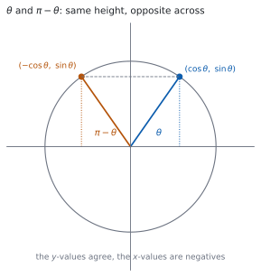
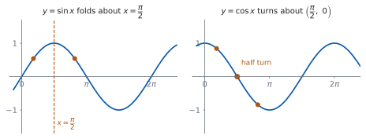

# HL 3.11 — Relationships between trigonometric functions and symmetry（三角関数の関係式とグラフの対称性） {#sec-aahl-3-11}

::: {.callout-note}
## What you should be able to do
- $\sin(\pi-\theta)$、$\cos(\pi-\theta)$、$\tan(\pi-\theta)$ を書ける。
- これらを**単位円**からも**加法定理**からも導ける。
- $\sin(-\theta)$、$\cos(-\theta)$、$\tan(-\theta)$ を、奇関数・偶関数の言葉で言える。
- $\pi$ や $\dfrac{\pi}{2}$ をずらしたときの関係を使える。
- 同じことを、**グラフの対称性**として説明できる。
- $1$ つの三角比の値から、関係する角の値をすべて出せる。
:::

## The idea

### 1. The unit circle behind the relationships（単位円から読む） {#unit-circle}

{#fig-aahl311-idea-a width=100%}

シラバスは、$1$ 行です。

> Relationships between trigonometric functions and the symmetry properties of their graphs.

単位円の上で、角 $\theta$ の点は $(\cos\theta,\ \sin\theta)$ です（[SL 3.5](../../aa-sl/03-geometry/aasl-3-5.qmd)）。シラバスも、そのつながりを書いています。

> Link to: the unit circle (SL3.5), odd and even functions (AHL2.14), compound angles (AHL3.10).

@fig-aahl311-idea-a のとおり、**$\pi-\theta$ の点は、$\theta$ の点を $y$ 軸について折り返したもの**です。ですから

$$
(\text{$\pi-\theta$ の点}) = (-\cos\theta,\ \sin\theta)
$$

です。**$y$ 座標はそのまま、$x$ 座標だけ符号が変わります。**

::: {.callout-important}
## 公式集には、この項目の欄がありません
覚える式はありません。**単位円の図を $1$ つかけば、その場で読めます。**

$\theta$ の点をかいて、聞かれている角の点がどこに移るかを見てください。
:::

### 2. The three relationships for $\pi-\theta$（$\pi-\theta$ の $3$ つの関係） {#pi-minus}

Guidance は、$3$ つを書いています。

> $\sin(\pi - \theta) = \sin\theta$
>
> $\cos(\pi - \theta) = -\cos\theta$
>
> $\tan(\pi - \theta) = -\tan\theta$

$$
\sin(\pi-\theta) = \sin\theta
$$ {#eq-aahl311-sin}

$$
\cos(\pi-\theta) = -\cos\theta
$$ {#eq-aahl311-cos}

$$
\tan(\pi-\theta) = -\tan\theta
$$ {#eq-aahl311-tan}

**$\sin$ だけが符号を変えません。** $y$ 座標が $\sin$ だからです（[第 1 節](#unit-circle)）。

$\tan$ は $\dfrac{\sin}{\cos}$ なので、**分母だけ符号が変わって、全体が負**になります。

### 3. Deriving them from the compound angle identities（加法定理から導く） {#derive}

図を使わずに、式だけでも出せます（[HL 3.10](aahl-3-10.qmd#compound)）。

$$
\sin(\pi-\theta) = \sin\pi\cos\theta - \cos\pi\sin\theta
$$

$\sin\pi = 0$、$\cos\pi = -1$ なので

$$
= 0 \cdot \cos\theta - (-1)\sin\theta = \sin\theta
$$

です。$\cos$ も同じようにできます。

$$
\cos(\pi-\theta) = \cos\pi\cos\theta + \sin\pi\sin\theta = -\cos\theta
$$

**$\sin\pi = 0$ と $\cos\pi = -1$ を入れるだけ**です。どちらの道でも、同じ式が出ます。

### 4. Negative angles: odd and even（負の角：奇関数と偶関数） {#negative}

$-\theta$ の点は、$\theta$ の点を**$x$ 軸について折り返した**ものです。ですから

$$
\sin(-\theta) = -\sin\theta, \qquad
\cos(-\theta) = \cos\theta, \qquad
\tan(-\theta) = -\tan\theta
$$ {#eq-aahl311-negative}

です。これは、**$\sin$ と $\tan$ が奇関数、$\cos$ が偶関数**だと言っているのと同じです（[HL 2.14](../02-functions/aahl-2-14.qmd#even-odd)）。

: 偶関数か奇関数か {#tbl-aahl311-parity}

| 関数 | $f(-x)$ | 種類 | グラフ |
|---|---|---|---|
| $\sin$ | $-\sin x$ | odd | 原点について点対称 |
| $\cos$ | $\cos x$ | even | $y$ 軸について線対称 |
| $\tan$ | $-\tan x$ | odd | 原点について点対称 |

### 5. Shifting by $\pi$ and by $\dfrac{\pi}{2}$（$\pi$ と $\dfrac{\pi}{2}$ のずらし） {#shifts}

$\pi$ を足すと、単位円の点は**原点について反対側**に移ります。両方の座標の符号が変わるので

$$
\sin(\pi+\theta) = -\sin\theta, \qquad
\cos(\pi+\theta) = -\cos\theta, \qquad
\tan(\pi+\theta) = \tan\theta
$$ {#eq-aahl311-pi-plus}

です。**$\tan$ だけ、符号が戻ります。** 分子と分母の両方が負になるからです。**$\tan$ の周期が $\pi$ であること**が、ここに現れています。

$\dfrac{\pi}{2}$ のずらしでは、$\sin$ と $\cos$ が**入れかわります。**

$$
\sin\left(\frac{\pi}{2}-\theta\right) = \cos\theta, \qquad
\cos\left(\frac{\pi}{2}-\theta\right) = \sin\theta
$$ {#eq-aahl311-complementary}

$$
\sin\left(\frac{\pi}{2}+\theta\right) = \cos\theta, \qquad
\cos\left(\frac{\pi}{2}+\theta\right) = -\sin\theta
$$ {#eq-aahl311-quarter}

::: {.callout-tip}
## 迷ったら、$\theta = \dfrac{\pi}{6}$ で試す
どの関係式も、**具体的な角を $1$ つ入れれば確かめられます。**

$\cos\left(\dfrac{\pi}{2}+\dfrac{\pi}{6}\right) = \cos\dfrac{2\pi}{3} = -\dfrac{1}{2}$ で、$-\sin\dfrac{\pi}{6} = -\dfrac{1}{2}$ ✓ 合っています。

**符号を $1$ つ覚えまちがえても、$20$ 秒で見つかります。**
:::

### 6. The same facts read off the graphs（グラフの対称性として読む） {#graphs}

{#fig-aahl311-idea-b width=100%}

@fig-aahl311-idea-b の左は $y = \sin x$ です。**$x = \dfrac{\pi}{2}$ について線対称**になっています。

$\dfrac{\pi}{2}$ から左右に同じだけ離れた $2$ 点、つまり $\dfrac{\pi}{2}-a$ と $\dfrac{\pi}{2}+a$ で、高さが同じです。$\theta = \dfrac{\pi}{2}-a$ と置くと $\pi-\theta = \dfrac{\pi}{2}+a$ なので、これは @eq-aahl311-sin そのものです。

右は $y = \cos x$ です。**点 $\left(\dfrac{\pi}{2},\ 0\right)$ について点対称**です。半回転すると重なるので、$\dfrac{\pi}{2}$ から左右に同じだけ離れた $2$ 点で、値の符号が逆になります。これが @eq-aahl311-cos です。

**式と図は、同じことの別の見方です。**

### 7. Using the relationships（使い方） {#using}

よく出るのは、**$1$ つの値から、関係する角の値を書く**問題です。

$\sin\dfrac{\pi}{5} = p$ とします。すると

- $\sin\dfrac{4\pi}{5} = \sin\left(\pi-\dfrac{\pi}{5}\right) = p$（@eq-aahl311-sin）
- $\sin\dfrac{6\pi}{5} = \sin\left(\pi+\dfrac{\pi}{5}\right) = -p$（@eq-aahl311-pi-plus）
- $\cos\dfrac{3\pi}{10} = \cos\left(\dfrac{\pi}{2}-\dfrac{\pi}{5}\right) = p$（@eq-aahl311-complementary）

です。**まず、与えられた角との関係を式で書く**のが手順です。

$$
\text{角を } \pi-\theta,\ \pi+\theta,\ \frac{\pi}{2}\pm\theta \text{ のどれかの形に直す}
$$ {#eq-aahl311-strategy}

::: {.callout-tip collapse="true"}
## Paper 2 では、電卓で符号だけ確かめられます
TI-Nspire CX II で $\sin(\pi - 0.7)$ と $\sin(0.7)$ を計算すると、どちらも同じ値になります。**関係式を覚えまちがえていないかの確かめ**に使えます。

`RAD` になっているかを、必ず見てください。度のままだと $\pi$ が $3.14^{\circ}$ として扱われます。

**ただし、`in terms of $p$` と書かれた問題では、電卓は答えになりません。** $p$ を使った式で答える必要があります。

**Paper 1 では使えません。** このページの例題と演習は、すべて手で解けるようにしてあります。
:::

## Why it works

::: {.callout-tip collapse="true"}
## クリックすると開きます

#### 単位円から読む {#why-circle}

角 $\theta$ の点を $P$ とします。$P = (\cos\theta,\ \sin\theta)$ です。

**$\pi - \theta$ の点は、$P$ を $y$ 軸について折り返した点**です。正の $x$ 軸から測って $\pi-\theta$ の向きは、$\pi$ の向き（負の $x$ 軸）から $\theta$ だけ戻った向きだからです。

折り返しは $x$ 座標の符号だけを変えるので、その点は $(-\cos\theta,\ \sin\theta)$ です。座標がそのまま $\cos$ と $\sin$ の値なので、@eq-aahl311-sin と @eq-aahl311-cos が読めます。

$\tan$ は $\dfrac{y}{x}$ なので

$$
\tan(\pi-\theta) = \frac{\sin\theta}{-\cos\theta} = -\tan\theta
$$

です。**$3$ つとも、$1$ つの図から出ます。**

#### $\pi$ を足すと、なぜ $\tan$ だけ戻るのか {#why-tan-period}

$\pi$ を足すと、点は原点について反対側に移り、**両方の座標の符号が変わります。**

$$
\tan(\pi+\theta) = \frac{-\sin\theta}{-\cos\theta} = \frac{\sin\theta}{\cos\theta} = \tan\theta
$$

**負が $2$ つで消えます。** ですから $\tan$ の周期は $\pi$ で、$\sin$ や $\cos$ の $2\pi$ の半分です。

#### $\dfrac{\pi}{2}$ のずらしで、なぜ入れかわるのか {#why-swap}

直角三角形で考えると分かりやすいです。$2$ つの鋭角は足して $\dfrac{\pi}{2}$ になります。

角 $\theta$ から見た**対辺**は、角 $\dfrac{\pi}{2}-\theta$ から見れば**隣辺**です。ですから

$$
\sin\theta = \frac{\text{対辺}}{\text{斜辺}} = \cos\left(\frac{\pi}{2}-\theta\right)
$$

です。**$\cos$ の `co` は complementary（余角）から来ています。** 「$\cos$ は余角の $\sin$」という意味です。

#### グラフの対称性との対応 {#why-graph}

@eq-aahl311-sin で $\theta = \dfrac{\pi}{2}-a$ と置くと

$$
\pi - \theta = \pi - \frac{\pi}{2} + a = \frac{\pi}{2}+a
$$

なので、式は

$$
\sin\left(\frac{\pi}{2}+a\right) = \sin\left(\frac{\pi}{2}-a\right)
$$

になります。**これは「$x = \dfrac{\pi}{2}$ から左右に同じだけ離れた $2$ 点で、値が等しい」**という意味で、線対称そのものです。

@eq-aahl311-cos で同じ置きかえをすると

$$
\cos\left(\frac{\pi}{2}+a\right) = -\cos\left(\frac{\pi}{2}-a\right)
$$

で、**値の符号が逆**になります。これは点 $\left(\dfrac{\pi}{2},\ 0\right)$ についての点対称です（[HL 2.14](../02-functions/aahl-2-14.qmd#symmetry)）。
:::

## Worked examples

::: {.callout-note appearance="simple"}
問題文は英語です。意味が理解できなかったら、問題文の下の「**日本語訳**」を開いてください。解説は日本語です。

**例題も演習も、すべて電卓なしで解けます。** Paper 1 のつもりで解いてください。
:::

::: {#exm-aahl311-derive}
[Use the compound angle identities to show that $\sin(\pi-\theta) = \sin\theta$ and that $\cos(\pi-\theta) = -\cos\theta$.]{.q-en}

日本語訳

加法定理を使って、$\sin(\pi-\theta) = \sin\theta$ と $\cos(\pi-\theta) = -\cos\theta$ を示しなさい。

---

**$\sin(A-B)$ の形に当てはめます**（[HL 3.10](aahl-3-10.qmd#compound)）。$A = \pi$、$B = \theta$ です。

$$
\sin(\pi-\theta) = \sin\pi\cos\theta - \cos\pi\sin\theta
$$

$\sin\pi = 0$、$\cos\pi = -1$ を入れます。

$$
= 0 \cdot \cos\theta - (-1)\sin\theta = \sin\theta
$$

$\cos$ も同じです。**$\cos(A-B)$ の右辺は $+$** です（[HL 3.10](aahl-3-10.qmd#signs)）。

$$
\cos(\pi-\theta) = \cos\pi\cos\theta + \sin\pi\sin\theta = -\cos\theta + 0 = -\cos\theta
$$

**検算。** **$\theta = \dfrac{\pi}{3}$ で確かめます。** $\sin\dfrac{2\pi}{3} = \dfrac{\sqrt{3}}{2} = \sin\dfrac{\pi}{3}$ ✓

**検算（$\cos$ のほう）。** $\cos\dfrac{2\pi}{3} = -\dfrac{1}{2}$ で、$-\cos\dfrac{\pi}{3} = -\dfrac{1}{2}$ ✓ **符号が逆になっています。**

::: {.callout-note}
## 解答例（答案用紙に書くこと）

$$\sin(\pi-\theta) = \sin\pi\cos\theta-\cos\pi\sin\theta
= 0\cdot\cos\theta-(-1)\sin\theta = \sin\theta$$

$$\cos(\pi-\theta) = \cos\pi\cos\theta+\sin\pi\sin\theta
= (-1)\cos\theta+0\cdot\sin\theta = -\cos\theta$$
:::
:::

::: {#exm-aahl311-values}
[Let $\alpha$ be an angle with $\sin\alpha = \dfrac{2}{3}$ and $\dfrac{\pi}{2} < \alpha < \pi$.]{.q-en}

**(a)** [Find the exact value of $\cos\alpha$.]{.q-en}

**(b)** [Find the exact value of $\sin(\pi-\alpha)$.]{.q-en}

**(c)** [Find the exact value of $\cos(\pi+\alpha)$.]{.q-en}

日本語訳

$\sin\alpha = \dfrac{2}{3}$、$\dfrac{\pi}{2} < \alpha < \pi$ とします。

**(a)** $\cos\alpha$ の正確な値を求めなさい。

**(b)** $\sin(\pi-\alpha)$ の正確な値を求めなさい。

**(c)** $\cos(\pi+\alpha)$ の正確な値を求めなさい。

---

**(a)** $\cos^{2}\alpha = 1 - \dfrac{4}{9} = \dfrac{5}{9}$ なので $\cos\alpha = \pm\dfrac{\sqrt{5}}{3}$ です。

**$\alpha$ は第 $2$ 象限の角なので、$\cos$ は負**です。

$$
\cos\alpha = -\frac{\sqrt{5}}{3}
$$

**(b)** @eq-aahl311-sin から、そのままです。

$$
\sin(\pi-\alpha) = \sin\alpha = \frac{2}{3}
$$

**(c)** @eq-aahl311-pi-plus から

$$
\cos(\pi+\alpha) = -\cos\alpha = \frac{\sqrt{5}}{3}
$$

**検算。** **$\sin^{2}+\cos^{2} = 1$ で確かめます。** $\dfrac{4}{9} + \dfrac{5}{9} = 1$ ✓

**検算（象限で）。** $\pi + \alpha$ は $\pi$ と $\dfrac{3\pi}{2}$ のあいだ、つまり第 $3$ 象限…ではありません。$\alpha$ が $\dfrac{\pi}{2}$ と $\pi$ のあいだなので、$\pi+\alpha$ は $\dfrac{3\pi}{2}$ と $2\pi$ のあいだで、**第 $4$ 象限**です。第 $4$ 象限では $\cos$ が正 ✓ **答えが正であることと合っています。**

::: {.callout-note}
## 解答例（答案用紙に書くこと）

**(a)** $\cos^{2}\alpha = 1-\dfrac{4}{9} = \dfrac{5}{9}$, *and $\alpha$ is in the second quadrant, so*

$$\cos\alpha = -\frac{\sqrt{5}}{3}$$

**(b)** $\sin(\pi-\alpha) = \sin\alpha = \dfrac{2}{3}$

**(c)** $\cos(\pi+\alpha) = -\cos\alpha = \dfrac{\sqrt{5}}{3}$
:::
:::

::: {#exm-aahl311-in-terms}
[Let $\sin\dfrac{\pi}{5} = p$. Write each of the following in terms of $p$.]{.q-en}

**(a)** [$\sin\dfrac{4\pi}{5}$]{.q-en}

**(b)** [$\sin\dfrac{6\pi}{5}$]{.q-en}

**(c)** [$\cos\dfrac{3\pi}{10}$]{.q-en}

日本語訳

$\sin\dfrac{\pi}{5} = p$ とします。次のそれぞれを $p$ で表しなさい。

---

**まず、$\dfrac{\pi}{5}$ との関係を式で書きます**（@eq-aahl311-strategy）。

**(a)** $\dfrac{4\pi}{5} = \pi - \dfrac{\pi}{5}$ です。

$$
\sin\frac{4\pi}{5} = \sin\left(\pi-\frac{\pi}{5}\right) = \sin\frac{\pi}{5} = p
$$

**(b)** $\dfrac{6\pi}{5} = \pi + \dfrac{\pi}{5}$ です。

$$
\sin\frac{6\pi}{5} = -\sin\frac{\pi}{5} = -p
$$

**(c)** $\dfrac{3\pi}{10} = \dfrac{5\pi - 2\pi}{10} = \dfrac{\pi}{2} - \dfrac{\pi}{5}$ です。

$$
\cos\frac{3\pi}{10} = \cos\left(\frac{\pi}{2}-\frac{\pi}{5}\right) = \sin\frac{\pi}{5} = p
$$

**検算。** **象限で符号を見ます。** $\dfrac{4\pi}{5}$ は第 $2$ 象限なので $\sin$ は正 ✓ $\dfrac{6\pi}{5}$ は第 $3$ 象限なので $\sin$ は負 ✓

**検算（(c) の角）。** $\dfrac{3\pi}{10}$ は $\dfrac{\pi}{2}$ より小さいので第 $1$ 象限、$\cos$ は正 ✓ **$p$ は正なので、合っています。**

::: {.callout-note}
## 解答例（答案用紙に書くこと）

**(a)** $\dfrac{4\pi}{5} = \pi-\dfrac{\pi}{5}$, *so* $\sin\dfrac{4\pi}{5} = \sin\dfrac{\pi}{5} = p$.

**(b)** $\dfrac{6\pi}{5} = \pi+\dfrac{\pi}{5}$, *so* $\sin\dfrac{6\pi}{5} = -\sin\dfrac{\pi}{5} = -p$.

**(c)** $\dfrac{3\pi}{10} = \dfrac{\pi}{2}-\dfrac{\pi}{5}$, *so* $\cos\dfrac{3\pi}{10} = \sin\dfrac{\pi}{5} = p$.
:::
:::

::: {#exm-aahl311-graph}
[Explain, using the graph of $y = \cos x$, why $\cos(\pi-\theta) = -\cos\theta$.]{.q-en}

日本語訳

$y = \cos x$ のグラフを使って、$\cos(\pi-\theta) = -\cos\theta$ である理由を説明しなさい。

---

$\theta$ と $\pi-\theta$ は、**$\dfrac{\pi}{2}$ から左右に同じだけ離れています。** $2$ つの平均が

$$
\frac{\theta + (\pi-\theta)}{2} = \frac{\pi}{2}
$$

だからです。

@fig-aahl311-idea-b の右のとおり、$y = \cos x$ は点 $\left(\dfrac{\pi}{2},\ 0\right)$ について**点対称**です。

::: {.model-answer}
**試験ではこう書く**

*The two inputs $\theta$ and $\pi-\theta$ have mean $\dfrac{\theta+(\pi-\theta)}{2} = \dfrac{\pi}{2}$, so they are the same distance to the left and to the right of $x = \dfrac{\pi}{2}$. The graph of $y = \cos x$ has rotational symmetry of order two about the point $\left(\dfrac{\pi}{2},\ 0\right)$: a half turn about that point maps the curve onto itself. A half turn about a point on the $x$-axis sends the point $\left(\dfrac{\pi}{2}-a,\ y\right)$ to the point $\left(\dfrac{\pi}{2}+a,\ -y\right)$, so the two heights are negatives of each other. Writing $\theta = \dfrac{\pi}{2}-a$, the partner input is $\dfrac{\pi}{2}+a = \pi-\theta$, and the two heights give $\cos(\pi-\theta) = -\cos\theta$.*
:::

（$\theta$ と $\pi-\theta$ は $\dfrac{\pi}{2}$ から等しく離れていて、$\cos$ のグラフはそこで点対称なので、高さの符号が逆になる、という意味です。）

**検算。** **$\theta = \dfrac{\pi}{3}$ で見ます。** $\dfrac{\pi}{3}$ と $\dfrac{2\pi}{3}$ は、$\dfrac{\pi}{2}$ から $\dfrac{\pi}{6}$ ずつ離れています ✓

**検算（値で）。** $\cos\dfrac{\pi}{3} = \dfrac{1}{2}$、$\cos\dfrac{2\pi}{3} = -\dfrac{1}{2}$ ✓ **符号だけが逆です。**

::: {.callout-note}
## 解答例（答案用紙に書くこと）

*The inputs $\theta$ and $\pi-\theta$ are equally spaced either side of $x = \dfrac{\pi}{2}$, since their mean is $\dfrac{\pi}{2}$.*

*The graph of $y = \cos x$ has a half-turn symmetry about $\left(\dfrac{\pi}{2},\ 0\right)$, so two inputs equally spaced either side of $\dfrac{\pi}{2}$ give heights that are negatives of each other.*

$$\cos(\pi-\theta) = -\cos\theta$$
:::
:::

## Common errors

::: {.callout-warning}
## $\cos(\pi-\theta)$ を $\cos\pi - \cos\theta$ とする
$\cos$ はかっこの中を分けられません（[HL 3.10](aahl-3-10.qmd#compound)）。

**加法定理を使うか、単位円をかいてください。** $\cos\pi - \cos\theta = -1-\cos\theta$ は、まったく別の式です。
:::

::: {.callout-warning}
## $\sin(\pi-\theta)$ の符号を変えてしまう
$\sin$ だけは**そのまま**です（@eq-aahl311-sin）。$\cos$ と $\tan$ は符号が変わります。

単位円で、**高さ（$y$ 座標）が変わらない**ことを見てください（[第 1 節](#unit-circle)）。
:::

::: {.callout-warning}
## 象限を確かめずに、平方根の符号を決める
$\cos^{2}\alpha = \dfrac{5}{9}$ から $\cos\alpha$ を出すときは、**$\alpha$ がどの象限にあるか**を見ます（[例題 2](#exm-aahl311-values)）。

$\dfrac{\pi}{2} < \alpha < \pi$ なら $\cos$ は負です。**$\pm$ のまま答えないでください。**
:::

::: {.callout-warning}
## $\pi+\theta$ で $\tan$ の符号も変える
$\tan(\pi+\theta) = \tan\theta$ です（@eq-aahl311-pi-plus）。**$\tan$ だけ、符号が戻ります。**

分子と分母の両方が負になるからです（[Why it works](#why-tan-period)）。
:::

::: {.callout-warning}
## $\dfrac{\pi}{2}-\theta$ と $\pi-\theta$ を取りちがえる
$\dfrac{\pi}{2}-\theta$ では $\sin$ と $\cos$ が**入れかわります**（@eq-aahl311-complementary）。$\pi-\theta$ では入れかわりません。

**引く数が $\dfrac{\pi}{2}$ か $\pi$ か**を、先に見てください。
:::

::: {.callout-warning}
## 角を書きかえずに、そのまま電卓に入れる
`in terms of $p$` と書かれた問題では、**$p$ を使った式**が答えです（[第 7 節](#using)）。

小数を書いても点になりません。**まず $\pi-\theta$ などの形に直してください。**
:::

## Exercises

::: {.callout-note appearance="simple"}
各問題に、折りたたみが $3$ つ付いています。**日本語訳**、**解答例**（答案用紙に書くべきこと。英語です）、**解説**（なぜそうなるか。日本語です）。

まず自分で解いて、次に解答例と見くらべてください。**解説は、合わなかったときだけ開けば十分です。**
:::

::: {.exercise-block}

[1]{.ex-no} [Write $\sin(\pi-\theta)$, $\cos(\pi-\theta)$ and $\tan(\pi-\theta)$ in terms of $\sin\theta$, $\cos\theta$ and $\tan\theta$.]{.q-en}

日本語訳

$\sin(\pi-\theta)$、$\cos(\pi-\theta)$、$\tan(\pi-\theta)$ を、$\sin\theta$、$\cos\theta$、$\tan\theta$ で表しなさい。

::: {.callout-note collapse="true"}
## 解答例（答案用紙に書くこと）

$$\sin(\pi-\theta) = \sin\theta, \qquad
\cos(\pi-\theta) = -\cos\theta, \qquad
\tan(\pi-\theta) = -\tan\theta$$
:::

::: {.callout-tip collapse="true"}
## 解説

**$\sin$ だけ符号がそのまま**です（[第 2 節](#pi-minus)）。単位円で、高さが変わらないことから読めます。

**検算。** $\theta = \dfrac{\pi}{4}$ で試します。$\sin\dfrac{3\pi}{4} = \dfrac{\sqrt{2}}{2} = \sin\dfrac{\pi}{4}$ ✓

**検算（$\tan$ で）。** $\tan\dfrac{3\pi}{4} = -1$、$-\tan\dfrac{\pi}{4} = -1$ ✓
:::

::: {.ex-sep}
:::

[2]{.ex-no} [Let $\beta$ be an angle with $\cos\beta = -\dfrac{1}{4}$ and $\dfrac{\pi}{2} < \beta < \pi$. Find the exact value of **(a)** $\cos(\pi-\beta)$, **(b)** $\cos(-\beta)$, **(c)** $\cos(\pi+\beta)$.]{.q-en}

日本語訳

$\cos\beta = -\dfrac{1}{4}$、$\dfrac{\pi}{2} < \beta < \pi$ とします。**(a)** $\cos(\pi-\beta)$、**(b)** $\cos(-\beta)$、**(c)** $\cos(\pi+\beta)$ の正確な値を求めなさい。

::: {.callout-note collapse="true"}
## 解答例（答案用紙に書くこと）

**(a)** $\cos(\pi-\beta) = -\cos\beta = \dfrac{1}{4}$

**(b)** $\cos(-\beta) = \cos\beta = -\dfrac{1}{4}$

**(c)** $\cos(\pi+\beta) = -\cos\beta = \dfrac{1}{4}$
:::

::: {.callout-tip collapse="true"}
## 解説

**(b) は $\cos$ が偶関数**であることを使います（@eq-aahl311-negative）。符号は変わりません。

(a) と (c) は、どちらも $-\cos\beta$ になります。**$\cos$ では、$\pi-\beta$ と $\pi+\beta$ が同じ値**です。

**検算。** $\cos$ は偶関数なので、$\cos(\pi-\beta)$ と $\cos(\beta-\pi)$ も同じです。$\beta-\pi = -(\pi-\beta)$ ✓

**検算（象限で）。** $\pi-\beta$ は $0$ と $\dfrac{\pi}{2}$ のあいだ、つまり第 $1$ 象限です。$\cos$ は正 ✓ 答えが $\dfrac{1}{4} > 0$ と合っています。
:::

::: {.ex-sep}
:::

[3]{.ex-no} [Let $\sin\dfrac{\pi}{7} = q$. Write each of the following in terms of $q$: **(a)** $\sin\dfrac{6\pi}{7}$, **(b)** $\sin\dfrac{8\pi}{7}$, **(c)** $\cos\dfrac{5\pi}{14}$.]{.q-en}

日本語訳

$\sin\dfrac{\pi}{7} = q$ とします。次のそれぞれを $q$ で表しなさい。**(a)** $\sin\dfrac{6\pi}{7}$、**(b)** $\sin\dfrac{8\pi}{7}$、**(c)** $\cos\dfrac{5\pi}{14}$。

::: {.callout-note collapse="true"}
## 解答例（答案用紙に書くこと）

**(a)** $\dfrac{6\pi}{7} = \pi-\dfrac{\pi}{7}$, *so* $\sin\dfrac{6\pi}{7} = q$.

**(b)** $\dfrac{8\pi}{7} = \pi+\dfrac{\pi}{7}$, *so* $\sin\dfrac{8\pi}{7} = -q$.

**(c)** $\dfrac{5\pi}{14} = \dfrac{7\pi-2\pi}{14} = \dfrac{\pi}{2}-\dfrac{\pi}{7}$, *so* $\cos\dfrac{5\pi}{14} = \sin\dfrac{\pi}{7} = q$.
:::

::: {.callout-tip collapse="true"}
## 解説

**(c) は分母を $14$ にそろえる**と見つかります。$\dfrac{\pi}{2} = \dfrac{7\pi}{14}$、$\dfrac{\pi}{7} = \dfrac{2\pi}{14}$ です（[例題 3](#exm-aahl311-in-terms)）。

**検算。** (a) は第 $2$ 象限なので $\sin$ は正 ✓ (b) は第 $3$ 象限なので負 ✓

**検算（和で）。** $\dfrac{5\pi}{14}+\dfrac{\pi}{7} = \dfrac{5\pi+2\pi}{14} = \dfrac{\pi}{2}$ ✓ **余角の組になっています。**
:::

::: {.ex-sep}
:::

[4]{.ex-no} [Use the compound angle identity to show that $\cos(\pi+\theta) = -\cos\theta$.]{.q-en}

日本語訳

加法定理を使って、$\cos(\pi+\theta) = -\cos\theta$ を示しなさい。

::: {.callout-note collapse="true"}
## 解答例（答案用紙に書くこと）

$$\cos(\pi+\theta) = \cos\pi\cos\theta-\sin\pi\sin\theta
= (-1)\cos\theta-0\cdot\sin\theta = -\cos\theta$$
:::

::: {.callout-tip collapse="true"}
## 解説

**$\cos(A+B)$ の右辺は $-$** です（[HL 3.10](aahl-3-10.qmd#signs)）。$A = \pi$、$B = \theta$ とします。

$\sin\pi = 0$ なので、$2$ 項目はいつも消えます。

**検算。** $\theta = 0$ では、左辺 $\cos\pi = -1$、右辺 $-\cos 0 = -1$ ✓

**検算（$\theta = \dfrac{\pi}{3}$ で）。** 左辺は $\cos\dfrac{4\pi}{3} = -\dfrac{1}{2}$、右辺は $-\dfrac{1}{2}$ ✓
:::

::: {.ex-sep}
:::

[5]{.ex-no} [Simplify $\sin(\pi-\theta)\cos(-\theta) + \cos(\pi-\theta)\sin(-\theta)$.]{.q-en}

日本語訳

$\sin(\pi-\theta)\cos(-\theta) + \cos(\pi-\theta)\sin(-\theta)$ を簡単にしなさい。

::: {.callout-note collapse="true"}
## 解答例（答案用紙に書くこと）

$$\sin(\pi-\theta) = \sin\theta, \quad \cos(-\theta) = \cos\theta, \quad
\cos(\pi-\theta) = -\cos\theta, \quad \sin(-\theta) = -\sin\theta$$

$$\sin\theta\cos\theta + (-\cos\theta)(-\sin\theta)
= 2\sin\theta\cos\theta = \sin 2\theta$$
:::

::: {.callout-tip collapse="true"}
## 解説

**$4$ つの部分を、それぞれ書きかえてから**かけ算します。$2$ 項目は負 $\times$ 負で正になります。

最後は $2$ 倍角の形です（[HL 3.10](aahl-3-10.qmd#double)）。

**検算。** $\theta = \dfrac{\pi}{4}$ で試します。$\sin\dfrac{3\pi}{4}\cos\dfrac{\pi}{4} + \cos\dfrac{3\pi}{4}\sin\dfrac{\pi}{4} = \dfrac{1}{2}+\dfrac{1}{2} = 1$ で、$\sin\dfrac{\pi}{2} = 1$ ✓

**検算（$\theta = \dfrac{\pi}{6}$ で）。** $\sin\dfrac{\pi}{3} = \dfrac{\sqrt{3}}{2}$ で、$2\sin\dfrac{\pi}{6}\cos\dfrac{\pi}{6} = 2 \times \dfrac{1}{2} \times \dfrac{\sqrt{3}}{2} = \dfrac{\sqrt{3}}{2}$ ✓
:::

::: {.ex-sep}
:::

[6]{.ex-no} [Show that $\tan(\pi-\theta) = -\tan\theta$, using $\tan\theta = \dfrac{\sin\theta}{\cos\theta}$.]{.q-en}

日本語訳

$\tan\theta = \dfrac{\sin\theta}{\cos\theta}$ を使って、$\tan(\pi-\theta) = -\tan\theta$ を示しなさい。

::: {.callout-note collapse="true"}
## 解答例（答案用紙に書くこと）

$$\tan(\pi-\theta) = \frac{\sin(\pi-\theta)}{\cos(\pi-\theta)}
= \frac{\sin\theta}{-\cos\theta} = -\frac{\sin\theta}{\cos\theta} = -\tan\theta$$
:::

::: {.callout-tip collapse="true"}
## 解説

**分子はそのまま、分母だけ符号が変わります。** ですから、全体が負になります（[Why it works](#why-circle)）。

$\cos\theta \neq 0$ が要ります。**$\tan$ が定義されている角で考えています。**

**検算。** $\theta = \dfrac{\pi}{3}$ では、$\tan\dfrac{2\pi}{3} = -\sqrt{3}$、$-\tan\dfrac{\pi}{3} = -\sqrt{3}$ ✓

**検算（$\theta = \dfrac{\pi}{6}$ で）。** $\tan\dfrac{5\pi}{6} = -\dfrac{1}{\sqrt{3}}$ ✓
:::

::: {.ex-sep}
:::

[7]{.ex-no} [Solve $\sin(\pi-\theta) = \cos\theta$ for $0 \leq \theta \leq 2\pi$.]{.q-en}

日本語訳

$0 \leq \theta \leq 2\pi$ の範囲で $\sin(\pi-\theta) = \cos\theta$ を解きなさい。

::: {.callout-note collapse="true"}
## 解答例（答案用紙に書くこと）

$$\sin(\pi-\theta) = \sin\theta, \quad \text{so the equation is} \quad
\sin\theta = \cos\theta$$

*Dividing by $\cos\theta$ (which is not zero at any solution, since $\sin\theta$ and $\cos\theta$ cannot both be zero):*

$$\tan\theta = 1, \qquad \theta = \frac{\pi}{4}, \quad \frac{5\pi}{4}$$
:::

::: {.callout-tip collapse="true"}
## 解説

**左辺を先に書きかえます**（@eq-aahl311-sin）。$\sin\theta = \cos\theta$ になれば、知っている形です。

$\cos\theta$ で割るときは、**$\cos\theta = 0$ が解でないこと**を書き添えます。$\cos\theta = 0$ なら $\sin\theta = \pm 1 \neq 0$ なので、等式が成り立ちません。

**検算。** $\theta = \dfrac{\pi}{4}$ では、$\sin\dfrac{3\pi}{4} = \dfrac{\sqrt{2}}{2}$、$\cos\dfrac{\pi}{4} = \dfrac{\sqrt{2}}{2}$ ✓

**検算（$\theta = \dfrac{5\pi}{4}$ で）。** $\sin\left(\pi-\dfrac{5\pi}{4}\right) = \sin\left(-\dfrac{\pi}{4}\right) = -\dfrac{\sqrt{2}}{2}$、$\cos\dfrac{5\pi}{4} = -\dfrac{\sqrt{2}}{2}$ ✓
:::

::: {.ex-sep}
:::

[8]{.ex-no} [The graph of $y = \sin x$ is symmetric about the line $x = \dfrac{\pi}{2}$. Explain how this symmetry gives $\sin(\pi-\theta) = \sin\theta$.]{.q-en}

日本語訳

$y = \sin x$ のグラフは、直線 $x = \dfrac{\pi}{2}$ について対称です。この対称性から $\sin(\pi-\theta) = \sin\theta$ が得られる理由を説明しなさい。

::: {.callout-note collapse="true"}
## 解答例（答案用紙に書くこと）

*The inputs $\theta$ and $\pi-\theta$ have mean $\dfrac{\pi}{2}$, so they are the same distance either side of the line $x = \dfrac{\pi}{2}$.*

*Reflecting in a vertical line does not change heights, so the two inputs give the same value of $\sin$.*

$$\sin(\pi-\theta) = \sin\theta$$
:::

::: {.callout-tip collapse="true"}
## 解説

**$2$ つの角の平均が $\dfrac{\pi}{2}$** であることを、はじめに書きます（[例題 4](#exm-aahl311-graph)）。

線対称では、$x$ 座標だけが動いて**高さは変わりません。** ここが $\cos$ の場合（点対称）とのちがいです。

**検算。** $\theta = \dfrac{\pi}{6}$ では、$\dfrac{\pi}{6}$ と $\dfrac{5\pi}{6}$ が $\dfrac{\pi}{2}$ から $\dfrac{\pi}{3}$ ずつ離れています ✓

**検算（値で）。** $\sin\dfrac{\pi}{6} = \sin\dfrac{5\pi}{6} = \dfrac{1}{2}$ ✓

::: {.model-answer}
**試験ではこう書く**

*Take any $\theta$ and consider the two inputs $\theta$ and $\pi-\theta$. Their mean is $\dfrac{\theta+(\pi-\theta)}{2} = \dfrac{\pi}{2}$, so writing $\theta = \dfrac{\pi}{2}-a$ gives $\pi-\theta = \dfrac{\pi}{2}+a$: the two inputs lie the same distance $a$ to the left and to the right of the line $x = \dfrac{\pi}{2}$. The graph of $y = \sin x$ is symmetric about that line, which means that reflecting the curve in it maps the curve onto itself. A reflection in a vertical line changes the $x$-coordinate of a point but leaves its $y$-coordinate unchanged, so the two points of the curve at $x = \dfrac{\pi}{2}-a$ and $x = \dfrac{\pi}{2}+a$ have the same height. That height is $\sin\theta$ for the first and $\sin(\pi-\theta)$ for the second, so $\sin(\pi-\theta) = \sin\theta$.*
:::
:::

::: {.ex-sep}
:::

[9]{.ex-no} [Show that $\sin\left(\dfrac{\pi}{2}+\theta\right) = \cos\theta$, and state what this says about the graphs of $y = \sin x$ and $y = \cos x$.]{.q-en}

日本語訳

$\sin\left(\dfrac{\pi}{2}+\theta\right) = \cos\theta$ を示し、これが $y = \sin x$ と $y = \cos x$ のグラフについて何を言っているかを述べなさい。

::: {.callout-note collapse="true"}
## 解答例（答案用紙に書くこと）

$$\sin\left(\frac{\pi}{2}+\theta\right)
= \sin\frac{\pi}{2}\cos\theta+\cos\frac{\pi}{2}\sin\theta
= 1\cdot\cos\theta+0\cdot\sin\theta = \cos\theta$$

*So the value of $\sin$ at $\dfrac{\pi}{2}+\theta$ equals the value of $\cos$ at $\theta$: the graph of $y = \sin x$ translated $\dfrac{\pi}{2}$ to the left is the graph of $y = \cos x$.*
:::

::: {.callout-tip collapse="true"}
## 解説

**平行移動として読む**ところが、後半の要です。$y = \sin\left(x+\dfrac{\pi}{2}\right)$ は、$y = \sin x$ を左に $\dfrac{\pi}{2}$ ずらしたグラフです（[SL 2.11](../../aa-sl/02-functions/aasl-2-11.qmd)）。

**検算。** $\theta = 0$ では、$\sin\dfrac{\pi}{2} = 1$、$\cos 0 = 1$ ✓

**検算（$\theta = \dfrac{\pi}{2}$ で）。** $\sin\pi = 0$、$\cos\dfrac{\pi}{2} = 0$ ✓

::: {.model-answer}
**試験ではこう書く**

*Apply the compound angle identity for $\sin(A+B)$ with $A = \dfrac{\pi}{2}$ and $B = \theta$:*

$$\sin\left(\frac{\pi}{2}+\theta\right)
= \sin\frac{\pi}{2}\cos\theta+\cos\frac{\pi}{2}\sin\theta$$

*Since $\sin\dfrac{\pi}{2} = 1$ and $\cos\dfrac{\pi}{2} = 0$, this reduces to $\cos\theta$, which proves the identity. Read as a statement about graphs, it says that the height of $y = \sin x$ at $x = \dfrac{\pi}{2}+\theta$ is the same as the height of $y = \cos x$ at $x = \theta$, for every $\theta$. Equivalently, the curve $y = \sin\left(x+\dfrac{\pi}{2}\right)$ is the curve $y = \cos x$, so translating the graph of $y = \sin x$ by $\dfrac{\pi}{2}$ in the negative $x$-direction gives exactly the graph of $y = \cos x$. The two curves have the same shape and differ only by a horizontal shift of a quarter of a period.*
:::
:::

::: {.ex-sep}
:::

[10]{.ex-no} [A student writes $\cos(\pi-\theta) = \cos\pi - \cos\theta = -1-\cos\theta$. Explain the error, and give the correct value when $\theta = \dfrac{\pi}{3}$.]{.q-en}

日本語訳

ある生徒が $\cos(\pi-\theta) = \cos\pi - \cos\theta = -1-\cos\theta$ と書きました。まちがいを説明し、$\theta = \dfrac{\pi}{3}$ のときの正しい値を書きなさい。

::: {.callout-note collapse="true"}
## 解答例（答案用紙に書くこと）

*Cosine is a function, not a quantity being multiplied out, so $\cos(A-B)$ cannot be split as $\cos A-\cos B$. The correct identity is*

$$\cos(\pi-\theta) = \cos\pi\cos\theta+\sin\pi\sin\theta = -\cos\theta$$

*At $\theta = \dfrac{\pi}{3}$ the correct value is $-\cos\dfrac{\pi}{3} = -\dfrac{1}{2}$, while the student's formula gives $-1-\dfrac{1}{2} = -\dfrac{3}{2}$, which is impossible since $\lvert\cos x\rvert \leq 1$.*
:::

::: {.callout-tip collapse="true"}
## 解説

**答えが $-\dfrac{3}{2}$ になった時点で、まちがいと分かります。** $\cos$ の値は $-1$ 以上 $1$ 以下です。

**大きさを見る**のは、いちばん早い見つけ方です。

**検算。** $\cos\dfrac{2\pi}{3} = -\dfrac{1}{2}$ ✓ 正しい式と合います。

**検算（$\theta = 0$ で）。** 生徒の式なら $-1-1 = -2$ ですが、$\cos\pi = -1$ です ✓ **ここでも合いません。**

::: {.model-answer}
**試験ではこう書く**

*The step $\cos(\pi-\theta) = \cos\pi-\cos\theta$ treats $\cos$ as if it distributed over a subtraction, but $\cos$ is a function applied to the single angle $\pi-\theta$, and $\cos(A-B)$ is not $\cos A - \cos B$ in general. The correct tool is the compound angle identity $\cos(A-B) = \cos A\cos B+\sin A\sin B$, which with $A = \pi$ and $B = \theta$ gives $\cos(\pi-\theta) = (-1)\cos\theta+0\cdot\sin\theta = -\cos\theta$. At $\theta = \dfrac{\pi}{3}$ the correct value is therefore $-\cos\dfrac{\pi}{3} = -\dfrac{1}{2}$, and indeed $\cos\dfrac{2\pi}{3} = -\dfrac{1}{2}$. The student's formula gives $-1-\dfrac{1}{2} = -\dfrac{3}{2}$, which lies outside the interval $[-1,\ 1]$ and so cannot be the cosine of any angle; that alone shows the step is wrong.*
:::
:::

:::
