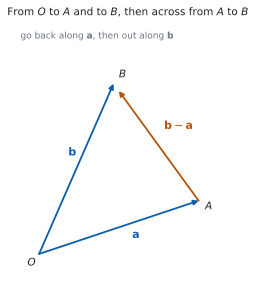
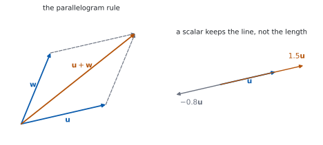

# HL 3.12 — Vectors: components, algebra and magnitude（ベクトルの基本） {#sec-aahl-3-12}

::: {.callout-note}
## What you should be able to do
- **ベクトル**と**スカラー**のちがいを言える。
- **位置ベクトル**と**変位ベクトル**を区別できる。
- $\mathbf{i}$、$\mathbf{j}$、$\mathbf{k}$ を使った形と、成分の形を行き来できる。
- ベクトルの**和・差・スカラー倍**を、成分でも図でも出せる。
- $2$ つのベクトルが**平行**かどうかを判定できる。
- **大きさ**（公式集の **3.12**）と**単位ベクトル**を出せる。
- $\overrightarrow{AB} = \mathbf{b}-\mathbf{a}$ を使って、$2$ 点間の距離を出せる。
- ベクトルを使って、図形の性質を証明できる。
:::

## The idea

### 1. What a vector is（ベクトルとは） {#idea}

シラバスは、次のように始まります。

> Concept of a vector; position vectors; displacement vectors.
>
> Representation of vectors using directed line segments.

**ベクトルは、大きさと向きをもつ量**です。長さだけの量（**スカラー**）とは別ものです。

図では、**矢印**（directed line segment）でかきます。矢印の長さが大きさ、向きが向きです。

この本では、ベクトルを**太字**で書きます。

$$
\mathbf{a}, \qquad \mathbf{v}, \qquad \mathbf{i}
$$

::: {.callout-important}
## 手書きでは、太字が書けません
答案では $\underline{a}$ のように**下線**を引くか、$\vec{a}$ のように矢印を付けてください。

**どちらでもかまいません**が、$1$ 枚の答案の中では統一してください。$a$ と書いてしまうと、スカラーと区別が付きません。
:::

### 2. Position vectors and displacement vectors（位置ベクトルと変位ベクトル） {#position}

{#fig-aahl312-idea-a width=100%}

**原点 $O$ から点 $A$ へのベクトル**を、$A$ の**位置ベクトル**と呼びます。

$$
\overrightarrow{OA} = \mathbf{a}, \qquad \overrightarrow{OB} = \mathbf{b}
$$ {#eq-aahl312-position}

**$2$ 点を結ぶベクトル**は、**変位ベクトル**です。@fig-aahl312-idea-a のとおり、$A$ から $B$ へ行くには、いったん $O$ に戻ってから $B$ へ行けばよいので

$$
\overrightarrow{AB} = \mathbf{b} - \mathbf{a}
$$ {#eq-aahl312-displacement}

です。**「後ろ引く前」ではなく「行き先引く出発点」**です。

::: {.callout-tip}
## $2$ 点を結ぶベクトルだけは、矢印で書きます
本文では $\mathbf{a}$ のように太字を使いますが、**$2$ 点を指定するときは $\overrightarrow{AB}$** と書きます。IB の問題文がこの形だからです。

$\overrightarrow{AB} = \mathbf{b} - \mathbf{a}$ が、$2$ つの書き方の橋です。
:::

### 3. Components and base vectors（成分と基本ベクトル） {#components}

シラバスは、$2$ 通りの書き方を挙げています。

> Base vectors $\mathbf{i}$, $\mathbf{j}$, $\mathbf{k}$.
>
> Components of a vector: $\mathbf{v} = \begin{pmatrix} v_{1} \\ v_{2} \\ v_{3} \end{pmatrix} = v_{1}\mathbf{i}+v_{2}\mathbf{j}+v_{3}\mathbf{k}$.

$\mathbf{i}$、$\mathbf{j}$、$\mathbf{k}$ は、$x$、$y$、$z$ の向きの**長さ $1$ のベクトル**です。

$$
\mathbf{v} = \begin{pmatrix} v_{1} \\ v_{2} \\ v_{3} \end{pmatrix}
= v_{1}\mathbf{i} + v_{2}\mathbf{j} + v_{3}\mathbf{k}
$$ {#eq-aahl312-components}

**$2$ つは同じものです。** 問題文がどちらで書いていても、やることは変わりません。**縦に並べる形のほうが、計算のまちがいが減ります。**

$2$ 次元なら、成分は $2$ つです。$3$ 次元の話で $z$ 成分が $0$ のときは、$\begin{pmatrix} 3 \\ -1 \\ 0 \end{pmatrix}$ のように $0$ を書いてください。

### 4. Adding, subtracting and scaling（和・差・スカラー倍） {#algebra}

{#fig-aahl312-idea-b width=100%}

シラバスは、次の $3$ つを挙げています。

> - the sum and difference of two vectors
> - the zero vector $\mathbf{0}$, the vector $-\mathbf{v}$
> - multiplication by a scalar, $k\mathbf{v}$, parallel vectors

**成分では、そのまま足し引きします。**

$$
\begin{pmatrix} u_{1} \\ u_{2} \\ u_{3} \end{pmatrix}
+ \begin{pmatrix} w_{1} \\ w_{2} \\ w_{3} \end{pmatrix}
= \begin{pmatrix} u_{1}+w_{1} \\ u_{2}+w_{2} \\ u_{3}+w_{3} \end{pmatrix},
\qquad
k\begin{pmatrix} u_{1} \\ u_{2} \\ u_{3} \end{pmatrix}
= \begin{pmatrix} ku_{1} \\ ku_{2} \\ ku_{3} \end{pmatrix}
$$ {#eq-aahl312-algebra}

**図では**、@fig-aahl312-idea-b のとおりです。和は**平行四辺形の対角線**、スカラー倍は**同じ直線の上での伸び縮み**です。$k$ が負なら、向きが逆になります。

$\mathbf{0}$ はすべての成分が $0$ のベクトルで、$-\mathbf{v}$ は $\mathbf{v}$ と**大きさが同じで向きが逆**のベクトルです。

$$
\mathbf{v} + (-\mathbf{v}) = \mathbf{0}
$$ {#eq-aahl312-zero}

### 5. Parallel vectors（平行なベクトル） {#parallel}

$\mathbf{u}$ と $\mathbf{w}$ が**平行**であるとは、**片方がもう片方のスカラー倍**になっていることです。

$$
\mathbf{w} = k\mathbf{u} \quad (k \neq 0) \ \iff \ \mathbf{u} \ \text{と} \ \mathbf{w} \ \text{は平行}
$$ {#eq-aahl312-parallel}

成分で見るときは、**$3$ つの成分すべてで、同じ $k$ になるか**を確かめます。

$$
\begin{pmatrix} 2 \\ -6 \\ -6 \end{pmatrix}
= -2\begin{pmatrix} -1 \\ 3 \\ 3 \end{pmatrix}
$$

なので、この $2$ つは平行です。**$1$ つの成分だけで決めないでください。**

**$k$ が負なら、向きは逆ですが、平行であることに変わりはありません。**

### 6. Magnitude and unit vectors（大きさと単位ベクトル） {#magnitude}

シラバスは、次のように書いています。

> - magnitude of a vector, $\lvert\mathbf{v}\rvert$; unit vectors, $\dfrac{\mathbf{v}}{\lvert\mathbf{v}\rvert}$

**大きさ**は、公式集の **3.12** の欄にあります。

> Magnitude of a vector
>
> $\lvert v \rvert = \sqrt{v_{1}^{2}+v_{2}^{2}+v_{3}^{2}}$, where $v = \begin{pmatrix} v_{1} \\ v_{2} \\ v_{3} \end{pmatrix}$

$$
\lvert\mathbf{v}\rvert = \sqrt{v_{1}^{2}+v_{2}^{2}+v_{3}^{2}}
$$ {#eq-aahl312-magnitude}

**$3$ 次元の三平方の定理**です（[SL 3.1](../../aa-sl/03-geometry/aasl-3-1.qmd)）。

**単位ベクトル**（unit vector）は、**大きさが $1$ で、向きが同じ**ベクトルです。

$$
\hat{\mathbf{v}} = \frac{\mathbf{v}}{\lvert\mathbf{v}\rvert}
$$ {#eq-aahl312-unit}

**大きさで割るだけ**です。Guidance は、距離についても書いています。

> Distance between points A and B is the magnitude of $\overrightarrow{AB}$

$$
AB = \lvert \overrightarrow{AB} \rvert = \lvert \mathbf{b}-\mathbf{a} \rvert
$$ {#eq-aahl312-distance}

### 7. Proving geometry with vectors（ベクトルで図形を証明する） {#proofs}

シラバスの最後の行です。

> Proofs of geometrical properties using vectors.

やり方は、いつも同じ $3$ 手です。

1. **基準の点を $1$ つ決めて**、そこからの位置ベクトルに名前を付ける（$\mathbf{a}$、$\mathbf{b}$ など）。
2. 問題に出てくる点を、**その $2$ つだけで表す。**
3. 示したい関係を、**ベクトルの式**として書く。

「平行」は $\mathbf{w} = k\mathbf{u}$、「長さが半分」は $\lvert\mathbf{w}\rvert = \dfrac{1}{2}\lvert\mathbf{u}\rvert$、「中点」は $\dfrac{\mathbf{a}+\mathbf{b}}{2}$ です。

::: {.callout-tip collapse="true"}
## Paper 2 では、電卓でベクトルの計算ができます
TI-Nspire CX II では、ベクトルを $1$ 行または $1$ 列の行列として入力します。`[1,2,3]` のように書くと、成分の足し算・スカラー倍がそのままできます。

大きさは `norm(` で出ます。`norm([1,2,3])` で $\sqrt{14}$ です。

**ただし、答案に書くのは式のほうです。** `norm(...)` と書いても点になりません。@eq-aahl312-magnitude の形を書いてください。

**Paper 1 では使えません。** このページの例題と演習は、すべて手で解けるようにしてあります。
:::

## Why it works

::: {.callout-tip collapse="true"}
## クリックすると開きます

#### なぜ $\overrightarrow{AB} = \mathbf{b}-\mathbf{a}$ なのか {#why-displacement}

$A$ から $B$ へ行く道を、$O$ を経由して考えます。

$$
\overrightarrow{AB} = \overrightarrow{AO} + \overrightarrow{OB}
$$

$\overrightarrow{AO}$ は $\overrightarrow{OA}$ と大きさが同じで向きが逆なので、$\overrightarrow{AO} = -\mathbf{a}$ です。$\overrightarrow{OB} = \mathbf{b}$ なので

$$
\overrightarrow{AB} = -\mathbf{a} + \mathbf{b} = \mathbf{b}-\mathbf{a}
$$

です。@fig-aahl312-idea-a の三角形が、この式です。

**どの点を経由してもかまいません。** $\overrightarrow{AB} = \overrightarrow{AP} + \overrightarrow{PB}$ は、どんな点 $P$ でも成り立ちます。

#### なぜ、平行はスカラー倍なのか {#why-parallel}

$\mathbf{w} = k\mathbf{u}$ なら、成分はすべて $k$ 倍です。矢印としては、**同じ直線の上で伸び縮みしただけ**なので、向きは同じか正反対です。

逆に、向きが同じか正反対なら、長さの比を $k$（向きが逆なら負）とすれば $\mathbf{w} = k\mathbf{u}$ になります。

**$1$ つの成分だけを見てはいけない**のは、それだけでは $k$ が決まらないからです。$\begin{pmatrix} 2 \\ 4 \end{pmatrix}$ と $\begin{pmatrix} 4 \\ 6 \end{pmatrix}$ は、$1$ 成分目では $k = 2$、$2$ 成分目では $k = 1.5$ で、合いません。平行ではありません。

#### なぜ、大きさで割ると単位ベクトルになるのか {#why-unit}

$\lvert k\mathbf{v}\rvert = \lvert k\rvert\,\lvert\mathbf{v}\rvert$ です。成分がすべて $k$ 倍になると、@eq-aahl312-magnitude の根号の中は $k^{2}$ 倍になるからです。

$k = \dfrac{1}{\lvert\mathbf{v}\rvert}$ とすると

$$
\left\lvert \frac{\mathbf{v}}{\lvert\mathbf{v}\rvert} \right\rvert
= \frac{1}{\lvert\mathbf{v}\rvert}\,\lvert\mathbf{v}\rvert = 1
$$

です。**正の数を掛けているので、向きは変わりません。** 大きさだけが $1$ になります。

#### 中点の位置ベクトル {#why-midpoint}

$A$ と $B$ の中点を $M$ とします。$\overrightarrow{AM} = \dfrac{1}{2}\overrightarrow{AB}$ なので

$$
\mathbf{m} = \mathbf{a} + \overrightarrow{AM}
= \mathbf{a} + \frac{1}{2}(\mathbf{b}-\mathbf{a})
= \frac{\mathbf{a}+\mathbf{b}}{2}
$$

です（[演習 8](#exercises)）。**座標の平均**と同じ形になりました（[SL 3.1](../../aa-sl/03-geometry/aasl-3-1.qmd)）。

この式は、図形の証明でくり返し使います。
:::

## Worked examples

::: {.callout-note appearance="simple"}
問題文は英語です。意味が理解できなかったら、問題文の下の「**日本語訳**」を開いてください。解説は日本語です。

**例題も演習も、すべて電卓なしで解けます。** Paper 1 のつもりで解いてください。
:::

::: {#exm-aahl312-distance}
[The points $A$ and $B$ have coordinates $(1,\ 2,\ -1)$ and $(4,\ 0,\ 3)$.]{.q-en}

**(a)** [Find $\overrightarrow{AB}$.]{.q-en}

**(b)** [Find the distance $AB$.]{.q-en}

日本語訳

点 $A$、$B$ の座標を $(1,\ 2,\ -1)$、$(4,\ 0,\ 3)$ とします。

**(a)** $\overrightarrow{AB}$ を求めなさい。

**(b)** 距離 $AB$ を求めなさい。

---

**(a)** @eq-aahl312-displacement のとおり、**行き先引く出発点**です。

$$
\overrightarrow{AB} = \begin{pmatrix} 4 \\ 0 \\ 3 \end{pmatrix}
- \begin{pmatrix} 1 \\ 2 \\ -1 \end{pmatrix}
= \begin{pmatrix} 3 \\ -2 \\ 4 \end{pmatrix}
$$

**(b)** @eq-aahl312-magnitude を使います。

$$
AB = \left\lvert \overrightarrow{AB} \right\rvert
= \sqrt{3^{2}+(-2)^{2}+4^{2}} = \sqrt{9+4+16} = \sqrt{29}
$$

**検算。** **$\overrightarrow{BA}$ を出して、大きさをくらべます。** $\overrightarrow{BA} = \begin{pmatrix} -3 \\ 2 \\ -4 \end{pmatrix}$ で、大きさは同じ $\sqrt{29}$ ✓ **距離は向きによりません。**

**検算（成分の符号）。** $z$ 成分は $3-(-1) = 4$ です。**引く数が負のときに $+$ になる**ところを、もう $1$ 度見てください ✓

::: {.callout-note}
## 解答例（答案用紙に書くこと）

**(a)** $\overrightarrow{AB} = \mathbf{b}-\mathbf{a} = \begin{pmatrix} 4 \\ 0 \\ 3 \end{pmatrix}-\begin{pmatrix} 1 \\ 2 \\ -1 \end{pmatrix} = \begin{pmatrix} 3 \\ -2 \\ 4 \end{pmatrix}$

**(b)** $AB = \sqrt{3^{2}+(-2)^{2}+4^{2}} = \sqrt{29}$
:::
:::

::: {#exm-aahl312-unit}
[Let $\mathbf{v} = 2\mathbf{i}-\mathbf{j}+2\mathbf{k}$.]{.q-en}

**(a)** [Find $\lvert\mathbf{v}\rvert$.]{.q-en}

**(b)** [Find the unit vector in the direction of $\mathbf{v}$.]{.q-en}

日本語訳

$\mathbf{v} = 2\mathbf{i}-\mathbf{j}+2\mathbf{k}$ とします。

**(a)** $\lvert\mathbf{v}\rvert$ を求めなさい。

**(b)** $\mathbf{v}$ と同じ向きの単位ベクトルを求めなさい。

---

**(a)** $\mathbf{i}$、$\mathbf{j}$、$\mathbf{k}$ の係数が、そのまま成分です（[第 3 節](#components)）。

$$
\mathbf{v} = \begin{pmatrix} 2 \\ -1 \\ 2 \end{pmatrix}, \qquad
\lvert\mathbf{v}\rvert = \sqrt{4+1+4} = \sqrt{9} = 3
$$

**(b)** @eq-aahl312-unit のとおり、大きさで割ります。

$$
\hat{\mathbf{v}} = \frac{1}{3}\begin{pmatrix} 2 \\ -1 \\ 2 \end{pmatrix}
= \begin{pmatrix} \frac{2}{3} \\ -\frac{1}{3} \\ \frac{2}{3} \end{pmatrix}
= \frac{2}{3}\mathbf{i} - \frac{1}{3}\mathbf{j} + \frac{2}{3}\mathbf{k}
$$

**検算。** **出した単位ベクトルの大きさを計算します。**

$$
\sqrt{\frac{4}{9}+\frac{1}{9}+\frac{4}{9}} = \sqrt{\frac{9}{9}} = 1
$$

$1$ になりました ✓

**検算（向き）。** $\dfrac{1}{3}$ は正なので、向きは $\mathbf{v}$ と同じです ✓ **負で割ると、逆向きになってしまいます。**

::: {.callout-note}
## 解答例（答案用紙に書くこと）

**(a)** $\lvert\mathbf{v}\rvert = \sqrt{2^{2}+(-1)^{2}+2^{2}} = \sqrt{9} = 3$

**(b)** $\hat{\mathbf{v}} = \dfrac{\mathbf{v}}{\lvert\mathbf{v}\rvert} = \dfrac{1}{3}\left(2\mathbf{i}-\mathbf{j}+2\mathbf{k}\right) = \dfrac{2}{3}\mathbf{i}-\dfrac{1}{3}\mathbf{j}+\dfrac{2}{3}\mathbf{k}$
:::
:::

::: {#exm-aahl312-parallel}
[Let $\mathbf{a} = \begin{pmatrix} 2 \\ -1 \\ 3 \end{pmatrix}$ and $\mathbf{b} = \begin{pmatrix} 1 \\ 0 \\ -2 \end{pmatrix}$.]{.q-en}

**(a)** [Find $3\mathbf{a}-2\mathbf{b}$.]{.q-en}

**(b)** [Find the value of $t$ for which $\begin{pmatrix} 6 \\ t \\ 9 \end{pmatrix}$ is parallel to $\mathbf{a}$.]{.q-en}

日本語訳

$\mathbf{a} = \begin{pmatrix} 2 \\ -1 \\ 3 \end{pmatrix}$、$\mathbf{b} = \begin{pmatrix} 1 \\ 0 \\ -2 \end{pmatrix}$ とします。

**(a)** $3\mathbf{a}-2\mathbf{b}$ を求めなさい。

**(b)** $\begin{pmatrix} 6 \\ t \\ 9 \end{pmatrix}$ が $\mathbf{a}$ と平行になる $t$ の値を求めなさい。

---

**(a)** @eq-aahl312-algebra のとおり、成分ごとに計算します。

$$
3\mathbf{a} = \begin{pmatrix} 6 \\ -3 \\ 9 \end{pmatrix}, \qquad
2\mathbf{b} = \begin{pmatrix} 2 \\ 0 \\ -4 \end{pmatrix}
$$

$$
3\mathbf{a}-2\mathbf{b} = \begin{pmatrix} 6-2 \\ -3-0 \\ 9-(-4) \end{pmatrix}
= \begin{pmatrix} 4 \\ -3 \\ 13 \end{pmatrix}
$$

**(b)** 平行なので、あるスカラー $k$ で

$$
\begin{pmatrix} 6 \\ t \\ 9 \end{pmatrix} = k\begin{pmatrix} 2 \\ -1 \\ 3 \end{pmatrix}
$$

と書けます（@eq-aahl312-parallel）。**$k$ が決まる成分から先に見ます。** $1$ 成分目から $6 = 2k$、つまり $k = 3$ です。

$3$ 成分目でも $9 = 3 \times 3$ ✓ 合っています。$2$ 成分目から

$$
t = 3 \times (-1) = -3
$$

**検算。** **(a) を $\mathbf{i}$、$\mathbf{j}$、$\mathbf{k}$ の形でもやります。** $3(2\mathbf{i}-\mathbf{j}+3\mathbf{k}) - 2(\mathbf{i}-2\mathbf{k}) = 6\mathbf{i}-3\mathbf{j}+9\mathbf{k}-2\mathbf{i}+4\mathbf{k} = 4\mathbf{i}-3\mathbf{j}+13\mathbf{k}$ ✓

**検算（(b) の $3$ 成分すべて）。** $k = 3$ で $\begin{pmatrix} 6 \\ -3 \\ 9 \end{pmatrix}$ になり、$3$ つとも合っています ✓ **$1$ 成分だけで決めてはいけません。**

::: {.callout-note}
## 解答例（答案用紙に書くこと）

**(a)** $3\mathbf{a}-2\mathbf{b} = \begin{pmatrix} 6 \\ -3 \\ 9 \end{pmatrix}-\begin{pmatrix} 2 \\ 0 \\ -4 \end{pmatrix} = \begin{pmatrix} 4 \\ -3 \\ 13 \end{pmatrix}$

**(b)** *Parallel means $\begin{pmatrix} 6 \\ t \\ 9 \end{pmatrix} = k\mathbf{a}$ for some scalar $k$.*

*From the first component $6 = 2k$, so $k = 3$; the third component gives $9 = 3(3)$, which is consistent.*

$$t = 3(-1) = -3$$
:::
:::

::: {#exm-aahl312-proof}
[In triangle $OAB$, $\overrightarrow{OA} = \mathbf{a}$ and $\overrightarrow{OB} = \mathbf{b}$. The point $M$ is the midpoint of $OA$ and the point $N$ is the midpoint of $OB$. Show that $\overrightarrow{MN}$ is parallel to $\overrightarrow{AB}$ and half its length.]{.q-en}

日本語訳

三角形 $OAB$ で、$\overrightarrow{OA} = \mathbf{a}$、$\overrightarrow{OB} = \mathbf{b}$ とします。点 $M$ は $OA$ の中点、点 $N$ は $OB$ の中点です。$\overrightarrow{MN}$ が $\overrightarrow{AB}$ と平行で、長さが半分であることを示しなさい。

---

**$O$ を基準にして、$M$ と $N$ の位置ベクトルを書きます**（[第 7 節](#proofs)）。

$$
\overrightarrow{OM} = \frac{1}{2}\mathbf{a}, \qquad
\overrightarrow{ON} = \frac{1}{2}\mathbf{b}
$$

@eq-aahl312-displacement から

$$
\overrightarrow{MN} = \overrightarrow{ON} - \overrightarrow{OM}
= \frac{1}{2}\mathbf{b} - \frac{1}{2}\mathbf{a} = \frac{1}{2}(\mathbf{b}-\mathbf{a})
$$

$\overrightarrow{AB} = \mathbf{b}-\mathbf{a}$ なので

$$
\overrightarrow{MN} = \frac{1}{2}\overrightarrow{AB}
$$

::: {.model-answer}
**試験ではこう書く**

*Since $M$ is the midpoint of $OA$, $\overrightarrow{OM} = \dfrac{1}{2}\mathbf{a}$, and since $N$ is the midpoint of $OB$, $\overrightarrow{ON} = \dfrac{1}{2}\mathbf{b}$. Hence*

$$\overrightarrow{MN} = \overrightarrow{ON}-\overrightarrow{OM}
= \frac{1}{2}\mathbf{b}-\frac{1}{2}\mathbf{a} = \frac{1}{2}\left(\mathbf{b}-\mathbf{a}\right) = \frac{1}{2}\overrightarrow{AB}$$

*So $\overrightarrow{MN}$ is a scalar multiple of $\overrightarrow{AB}$, with the scalar $\dfrac{1}{2} \neq 0$, and therefore $MN$ is parallel to $AB$. Taking magnitudes, $\left\lvert\overrightarrow{MN}\right\rvert = \left\lvert\dfrac{1}{2}\right\rvert\left\lvert\overrightarrow{AB}\right\rvert = \dfrac{1}{2}\left\lvert\overrightarrow{AB}\right\rvert$, so $MN$ is half the length of $AB$, as required.*
:::

（$M$、$N$ の位置ベクトルを $\mathbf{a}$、$\mathbf{b}$ で書き、差を取ると $\dfrac{1}{2}\overrightarrow{AB}$ になる。スカラー倍なので平行、係数が $\dfrac{1}{2}$ なので長さは半分、という意味です。）

**検算。** **数を入れてみます。** $\mathbf{a} = \begin{pmatrix} 4 \\ 0 \end{pmatrix}$、$\mathbf{b} = \begin{pmatrix} 0 \\ 6 \end{pmatrix}$ なら $M(2,\ 0)$、$N(0,\ 3)$ です。$\overrightarrow{MN} = \begin{pmatrix} -2 \\ 3 \end{pmatrix}$、$\overrightarrow{AB} = \begin{pmatrix} -4 \\ 6 \end{pmatrix}$ ✓ ちょうど半分です。

**検算（長さで）。** $\lvert\overrightarrow{MN}\rvert = \sqrt{13}$、$\lvert\overrightarrow{AB}\rvert = \sqrt{52} = 2\sqrt{13}$ ✓

::: {.callout-note}
## 解答例（答案用紙に書くこと）

$$\overrightarrow{OM} = \frac{1}{2}\mathbf{a}, \qquad \overrightarrow{ON} = \frac{1}{2}\mathbf{b}$$

$$\overrightarrow{MN} = \overrightarrow{ON}-\overrightarrow{OM}
= \frac{1}{2}(\mathbf{b}-\mathbf{a}) = \frac{1}{2}\overrightarrow{AB}$$

*$\overrightarrow{MN}$ is a non-zero scalar multiple of $\overrightarrow{AB}$, so $MN$ is parallel to $AB$, and*

$$\left\lvert\overrightarrow{MN}\right\rvert = \frac{1}{2}\left\lvert\overrightarrow{AB}\right\rvert$$
:::
:::

## Common errors

::: {.callout-warning}
## $\overrightarrow{AB}$ を $\mathbf{a}-\mathbf{b}$ とする
正しくは **$\mathbf{b}-\mathbf{a}$** です（@eq-aahl312-displacement）。**行き先から出発点を引きます。**

逆にすると、向きが正反対のベクトルになります。**大きさは同じ**なので、距離を聞かれているだけなら答えは合いますが、ベクトルを聞かれていたらまちがいです。
:::

::: {.callout-warning}
## 平行を $1$ つの成分だけで判定する
$\mathbf{w} = k\mathbf{u}$ は、**すべての成分で同じ $k$** でなければなりません（[第 5 節](#parallel)）。

$1$ 成分目で $k$ を出したら、残りの成分でも確かめてください。
:::

::: {.callout-warning}
## 大きさを出すときに、$2$ 乗を忘れる
$\lvert\mathbf{v}\rvert = \sqrt{v_{1}^{2}+v_{2}^{2}+v_{3}^{2}}$ です（@eq-aahl312-magnitude）。成分をそのまま足してはいけません。

**負の成分も、$2$ 乗すれば正**になります。$\sqrt{3^{2}+(-2)^{2}} = \sqrt{13}$ で、$\sqrt{3^{2}-2^{2}}$ ではありません。
:::

::: {.callout-warning}
## ベクトルとスカラーを足す
$\mathbf{v} + 3$ は書けません。**ベクトルに足せるのはベクトルだけ**です。

$3$ をベクトルにしたいなら、$3\mathbf{i}$ のように向きを付けてください。
:::

::: {.callout-warning}
## $\lvert\mathbf{a}+\mathbf{b}\rvert$ を $\lvert\mathbf{a}\rvert+\lvert\mathbf{b}\rvert$ とする
向きがちがうと、合わなくなります（[演習 10](#exercises)）。

**先に足して、それから大きさを出してください。** 順番が大事です。
:::

::: {.callout-warning}
## 答案でベクトルを細字で書く
手書きでは太字が書けないので、$\underline{a}$ か $\vec{a}$ を使ってください（[第 1 節](#idea)）。

**$a$ と書くと、スカラーとの区別が付きません。** $\lvert\mathbf{a}\rvert$ のつもりで $a$ と書く人もいるので、読む側が困ります。
:::

## Exercises

::: {.callout-note appearance="simple"}
各問題に、折りたたみが $3$ つ付いています。**日本語訳**、**解答例**（答案用紙に書くべきこと。英語です）、**解説**（なぜそうなるか。日本語です）。

まず自分で解いて、次に解答例と見くらべてください。**解説は、合わなかったときだけ開けば十分です。**
:::

::: {.exercise-block}

[1]{.ex-no} [The points $A$ and $B$ have coordinates $(2,\ -1,\ 4)$ and $(5,\ 1,\ 0)$. Find $\overrightarrow{AB}$ and the distance $AB$.]{.q-en}

日本語訳

点 $A$、$B$ の座標を $(2,\ -1,\ 4)$、$(5,\ 1,\ 0)$ とします。$\overrightarrow{AB}$ と距離 $AB$ を求めなさい。

::: {.callout-note collapse="true"}
## 解答例（答案用紙に書くこと）

$$\overrightarrow{AB} = \begin{pmatrix} 5 \\ 1 \\ 0 \end{pmatrix}-\begin{pmatrix} 2 \\ -1 \\ 4 \end{pmatrix} = \begin{pmatrix} 3 \\ 2 \\ -4 \end{pmatrix}$$

$$AB = \sqrt{3^{2}+2^{2}+(-4)^{2}} = \sqrt{29}$$
:::

::: {.callout-tip collapse="true"}
## 解説

**行き先引く出発点**です（@eq-aahl312-displacement）。$y$ 成分は $1-(-1) = 2$ です。

**検算。** $\overrightarrow{BA} = \begin{pmatrix} -3 \\ -2 \\ 4 \end{pmatrix}$ で、大きさは同じ $\sqrt{29}$ ✓

**検算（$\sqrt{29}$ の大きさ）。** $5^{2} = 25$、$6^{2} = 36$ なので、$\sqrt{29}$ は $5$ と $6$ のあいだです ✓ **成分がどれも $4$ 以下なので、$6$ より小さいはずです。**
:::

::: {.ex-sep}
:::

[2]{.ex-no} [Let $\mathbf{v} = 3\mathbf{i}+4\mathbf{j}$. Find $\lvert\mathbf{v}\rvert$ and the unit vector in the direction of $\mathbf{v}$.]{.q-en}

日本語訳

$\mathbf{v} = 3\mathbf{i}+4\mathbf{j}$ とします。$\lvert\mathbf{v}\rvert$ と、$\mathbf{v}$ と同じ向きの単位ベクトルを求めなさい。

::: {.callout-note collapse="true"}
## 解答例（答案用紙に書くこと）

$$\lvert\mathbf{v}\rvert = \sqrt{3^{2}+4^{2}} = 5$$

$$\hat{\mathbf{v}} = \frac{1}{5}\left(3\mathbf{i}+4\mathbf{j}\right)
= \frac{3}{5}\mathbf{i}+\frac{4}{5}\mathbf{j}$$
:::

::: {.callout-tip collapse="true"}
## 解説

$3$ 対 $4$ 対 $5$ の組です。**$\mathbf{k}$ の成分は $0$** なので、書かなくてもかまいません。

**検算。** $\left(\dfrac{3}{5}\right)^{2}+\left(\dfrac{4}{5}\right)^{2} = \dfrac{9+16}{25} = 1$ ✓

**検算（向き）。** $\dfrac{1}{5} > 0$ なので、向きは変わっていません ✓
:::

::: {.ex-sep}
:::

[3]{.ex-no} [Let $\mathbf{a} = \begin{pmatrix} 1 \\ -2 \\ 2 \end{pmatrix}$ and $\mathbf{b} = \begin{pmatrix} 3 \\ 0 \\ -1 \end{pmatrix}$. Find $2\mathbf{a}+\mathbf{b}$ and $\lvert 2\mathbf{a}+\mathbf{b} \rvert$.]{.q-en}

日本語訳

$\mathbf{a} = \begin{pmatrix} 1 \\ -2 \\ 2 \end{pmatrix}$、$\mathbf{b} = \begin{pmatrix} 3 \\ 0 \\ -1 \end{pmatrix}$ とします。$2\mathbf{a}+\mathbf{b}$ と $\lvert 2\mathbf{a}+\mathbf{b} \rvert$ を求めなさい。

::: {.callout-note collapse="true"}
## 解答例（答案用紙に書くこと）

$$2\mathbf{a}+\mathbf{b} = \begin{pmatrix} 2 \\ -4 \\ 4 \end{pmatrix}+\begin{pmatrix} 3 \\ 0 \\ -1 \end{pmatrix} = \begin{pmatrix} 5 \\ -4 \\ 3 \end{pmatrix}$$

$$\left\lvert 2\mathbf{a}+\mathbf{b} \right\rvert = \sqrt{25+16+9} = \sqrt{50} = 5\sqrt{2}$$
:::

::: {.callout-tip collapse="true"}
## 解説

**先に足してから、大きさを出します。** $\lvert 2\mathbf{a}\rvert + \lvert\mathbf{b}\rvert$ ではありません（[演習 10](#exercises)）。

$\sqrt{50}$ は $\sqrt{25 \times 2} = 5\sqrt{2}$ と簡単にします。

**検算。** $\lvert 2\mathbf{a}\rvert = 2 \times 3 = 6$、$\lvert\mathbf{b}\rvert = \sqrt{10} \approx 3.2$ です。足すと約 $9.2$ ですが、答えは $5\sqrt{2} \approx 7.1$ ✓ **確かにちがいます。**

**検算（成分）。** $2 \times (-2) + 0 = -4$ ✓
:::

::: {.ex-sep}
:::

[4]{.ex-no} [Find the value of $p$ for which $\begin{pmatrix} 2 \\ p \\ -6 \end{pmatrix}$ is parallel to $\begin{pmatrix} -1 \\ 3 \\ 3 \end{pmatrix}$.]{.q-en}

日本語訳

$\begin{pmatrix} 2 \\ p \\ -6 \end{pmatrix}$ が $\begin{pmatrix} -1 \\ 3 \\ 3 \end{pmatrix}$ と平行になる $p$ の値を求めなさい。

::: {.callout-note collapse="true"}
## 解答例（答案用紙に書くこと）

$$\begin{pmatrix} 2 \\ p \\ -6 \end{pmatrix} = k\begin{pmatrix} -1 \\ 3 \\ 3 \end{pmatrix}$$

*From the first component, $2 = -k$, so $k = -2$. The third component gives $-6 = 3(-2)$, which is consistent.*

$$p = 3(-2) = -6$$
:::

::: {.callout-tip collapse="true"}
## 解説

**$k$ が負になってもかまいません。** 向きが逆なだけで、平行です（[第 5 節](#parallel)）。

**検算。** $-2\begin{pmatrix} -1 \\ 3 \\ 3 \end{pmatrix} = \begin{pmatrix} 2 \\ -6 \\ -6 \end{pmatrix}$ ✓ $3$ 成分とも合っています。

**検算（$3$ 成分目）。** $3 \times (-2) = -6$ ✓ ここが合わなければ、そもそも平行になりません。
:::

::: {.ex-sep}
:::

[5]{.ex-no} [The points $A$, $B$ and $C$ have coordinates $(1,\ 0,\ 2)$, $(3,\ -2,\ 4)$ and $(k,\ -4,\ 6)$. Find the value of $k$ for which $A$, $B$ and $C$ lie on a straight line.]{.q-en}

日本語訳

点 $A$、$B$、$C$ の座標を $(1,\ 0,\ 2)$、$(3,\ -2,\ 4)$、$(k,\ -4,\ 6)$ とします。$A$、$B$、$C$ が一直線上にあるような $k$ の値を求めなさい。

::: {.callout-note collapse="true"}
## 解答例（答案用紙に書くこと）

$$\overrightarrow{AB} = \begin{pmatrix} 2 \\ -2 \\ 2 \end{pmatrix}, \qquad
\overrightarrow{BC} = \begin{pmatrix} k-3 \\ -2 \\ 2 \end{pmatrix}$$

*The points are collinear when $\overrightarrow{BC} = \lambda\overrightarrow{AB}$.*

*From the second component, $-2 = -2\lambda$, so $\lambda = 1$; the third component gives $2 = 2(1)$, which is consistent.*

$$k-3 = 2(1) = 2, \qquad k = 5$$
:::

::: {.callout-tip collapse="true"}
## 解説

**一直線上にある**とは、$\overrightarrow{AB}$ と $\overrightarrow{BC}$ が平行で、$B$ を共有しているということです。

$k$ の入っていない成分から $\lambda$ を決めるのが、いちばん早い道です。

**検算。** $k = 5$ なら $\overrightarrow{BC} = \begin{pmatrix} 2 \\ -2 \\ 2 \end{pmatrix} = \overrightarrow{AB}$ ✓ **$B$ は $AC$ の中点**になっています。

**検算（$\overrightarrow{AC}$ で）。** $\overrightarrow{AC} = \begin{pmatrix} 4 \\ -4 \\ 4 \end{pmatrix} = 2\overrightarrow{AB}$ ✓ こちらでも平行です。
:::

::: {.ex-sep}
:::

[6]{.ex-no} [Let $\mathbf{a} = \begin{pmatrix} 2 \\ -3 \\ 6 \end{pmatrix}$. Find the unit vector parallel to $\mathbf{a}$ but in the opposite direction.]{.q-en}

日本語訳

$\mathbf{a} = \begin{pmatrix} 2 \\ -3 \\ 6 \end{pmatrix}$ とします。$\mathbf{a}$ と平行で、向きが逆の単位ベクトルを求めなさい。

::: {.callout-note collapse="true"}
## 解答例（答案用紙に書くこと）

$$\lvert\mathbf{a}\rvert = \sqrt{4+9+36} = \sqrt{49} = 7$$

$$-\frac{\mathbf{a}}{\lvert\mathbf{a}\rvert} = -\frac{1}{7}\begin{pmatrix} 2 \\ -3 \\ 6 \end{pmatrix}
= \begin{pmatrix} -\frac{2}{7} \\ \frac{3}{7} \\ -\frac{6}{7} \end{pmatrix}$$
:::

::: {.callout-tip collapse="true"}
## 解説

**先に単位ベクトルを出してから、符号を変えます。** 順番はどちらでもかまいません。

**負の数で割ると、向きが逆になる**ことを使っています（[Why it works](#why-unit)）。

**検算。** $\sqrt{\dfrac{4+9+36}{49}} = \sqrt{1} = 1$ ✓ 大きさは $1$ です。

**検算（向き）。** 成分の符号が、もとの $\mathbf{a}$ とすべて逆です ✓
:::

::: {.ex-sep}
:::

[7]{.ex-no} [$OABC$ is a parallelogram with $\overrightarrow{OA} = \mathbf{a}$ and $\overrightarrow{OC} = \mathbf{c}$. Express $\overrightarrow{OB}$ and $\overrightarrow{AC}$ in terms of $\mathbf{a}$ and $\mathbf{c}$.]{.q-en}

日本語訳

$OABC$ は平行四辺形で、$\overrightarrow{OA} = \mathbf{a}$、$\overrightarrow{OC} = \mathbf{c}$ です。$\overrightarrow{OB}$ と $\overrightarrow{AC}$ を $\mathbf{a}$ と $\mathbf{c}$ で表しなさい。

::: {.callout-note collapse="true"}
## 解答例（答案用紙に書くこと）

*In the parallelogram $OABC$, $\overrightarrow{AB} = \overrightarrow{OC} = \mathbf{c}$.*

$$\overrightarrow{OB} = \overrightarrow{OA}+\overrightarrow{AB} = \mathbf{a}+\mathbf{c}$$

$$\overrightarrow{AC} = \overrightarrow{OC}-\overrightarrow{OA} = \mathbf{c}-\mathbf{a}$$
:::

::: {.callout-tip collapse="true"}
## 解説

**平行四辺形では、向かい合う辺のベクトルが等しい**です。$\overrightarrow{AB}$ と $\overrightarrow{OC}$ が同じ向きで同じ長さです。

$2$ 本の対角線が、**和**と**差**になります（@fig-aahl312-idea-b）。

**検算。** $\mathbf{a} = \begin{pmatrix} 4 \\ 0 \end{pmatrix}$、$\mathbf{c} = \begin{pmatrix} 1 \\ 3 \end{pmatrix}$ とすると $B(5,\ 3)$ です。$\overrightarrow{OB} = \begin{pmatrix} 5 \\ 3 \end{pmatrix} = \mathbf{a}+\mathbf{c}$ ✓

**検算（$\overrightarrow{AC}$）。** $A(4,\ 0)$、$C(1,\ 3)$ なので $\overrightarrow{AC} = \begin{pmatrix} -3 \\ 3 \end{pmatrix} = \mathbf{c}-\mathbf{a}$ ✓
:::

::: {.ex-sep}
:::

[8]{.ex-no} [The points $A$ and $B$ have position vectors $\mathbf{a}$ and $\mathbf{b}$. Show that the point $M$ with position vector $\dfrac{\mathbf{a}+\mathbf{b}}{2}$ is the midpoint of $AB$.]{.q-en}

日本語訳

点 $A$、$B$ の位置ベクトルを $\mathbf{a}$、$\mathbf{b}$ とします。位置ベクトルが $\dfrac{\mathbf{a}+\mathbf{b}}{2}$ である点 $M$ が $AB$ の中点であることを示しなさい。

::: {.callout-note collapse="true"}
## 解答例（答案用紙に書くこと）

$$\overrightarrow{AM} = \frac{\mathbf{a}+\mathbf{b}}{2}-\mathbf{a} = \frac{\mathbf{b}-\mathbf{a}}{2}$$

$$\overrightarrow{MB} = \mathbf{b}-\frac{\mathbf{a}+\mathbf{b}}{2} = \frac{\mathbf{b}-\mathbf{a}}{2}$$

*So $\overrightarrow{AM} = \overrightarrow{MB}$: the two parts are parallel, have equal length, and share the point $M$, so $M$ lies on $AB$ and is its midpoint.*
:::

::: {.callout-tip collapse="true"}
## 解説

**$\overrightarrow{AM}$ と $\overrightarrow{MB}$ の両方を計算する**のが要です。片方だけでは、$M$ が線分の上にあることが言えません。

**検算。** $\mathbf{a} = \begin{pmatrix} 0 \\ 0 \end{pmatrix}$、$\mathbf{b} = \begin{pmatrix} 4 \\ 6 \end{pmatrix}$ なら $M(2,\ 3)$ ✓ 座標の平均です。

**検算（長さで）。** $\lvert\overrightarrow{AM}\rvert = \lvert\overrightarrow{MB}\rvert = \dfrac{1}{2}\lvert\overrightarrow{AB}\rvert$ ✓

::: {.model-answer}
**試験ではこう書く**

*Let $\mathbf{m} = \dfrac{\mathbf{a}+\mathbf{b}}{2}$ be the position vector of $M$. Then*

$$\overrightarrow{AM} = \mathbf{m}-\mathbf{a} = \frac{\mathbf{a}+\mathbf{b}}{2}-\mathbf{a}
= \frac{\mathbf{b}-\mathbf{a}}{2}, \qquad
\overrightarrow{MB} = \mathbf{b}-\mathbf{m} = \mathbf{b}-\frac{\mathbf{a}+\mathbf{b}}{2}
= \frac{\mathbf{b}-\mathbf{a}}{2}$$

*The two displacement vectors are equal. Being equal, they are in particular scalar multiples of $\overrightarrow{AB} = \mathbf{b}-\mathbf{a}$, so $A$, $M$ and $B$ are collinear and $M$ lies between $A$ and $B$; and they have the same magnitude, namely $\dfrac{1}{2}\left\lvert\overrightarrow{AB}\right\rvert$. A point on the segment $AB$ that is the same distance from $A$ as from $B$ is by definition the midpoint, so $M$ is the midpoint of $AB$.*
:::
:::

::: {.ex-sep}
:::

[9]{.ex-no} [$OACB$ is a parallelogram with $\overrightarrow{OA} = \mathbf{a}$ and $\overrightarrow{OB} = \mathbf{b}$. Prove that the diagonals $OC$ and $AB$ bisect each other.]{.q-en}

日本語訳

$OACB$ は平行四辺形で、$\overrightarrow{OA} = \mathbf{a}$、$\overrightarrow{OB} = \mathbf{b}$ です。$2$ 本の対角線 $OC$ と $AB$ が、たがいを $2$ 等分することを証明しなさい。

::: {.callout-note collapse="true"}
## 解答例（答案用紙に書くこと）

*Since $OACB$ is a parallelogram, $\overrightarrow{OC} = \mathbf{a}+\mathbf{b}$.*

*The midpoint of $OC$ has position vector $\dfrac{\mathbf{a}+\mathbf{b}}{2}$.*

*The midpoint of $AB$ has position vector $\dfrac{\mathbf{a}+\mathbf{b}}{2}$ as well.*

*The two midpoints are the same point, so each diagonal passes through the midpoint of the other: the diagonals bisect each other.*
:::

::: {.callout-tip collapse="true"}
## 解説

**$2$ つの中点を計算して、同じになることを見る**のが、いちばん短い証明です（[Why it works](#why-midpoint)）。

$\overrightarrow{OC} = \mathbf{a}+\mathbf{b}$ は、平行四辺形の対角線です（[演習 7](#exercises)）。

**検算。** $\mathbf{a} = \begin{pmatrix} 4 \\ 0 \end{pmatrix}$、$\mathbf{b} = \begin{pmatrix} 0 \\ 6 \end{pmatrix}$ なら $C(4,\ 6)$ で、$OC$ の中点は $(2,\ 3)$ ✓

**検算（$AB$ の中点）。** $A(4,\ 0)$、$B(0,\ 6)$ なので、中点は $(2,\ 3)$ ✓ **同じ点です。**

::: {.model-answer}
**試験ではこう書く**

*Take $O$ as origin, so $A$ and $B$ have position vectors $\mathbf{a}$ and $\mathbf{b}$. In the parallelogram $OACB$ the side $BC$ is equal and parallel to $OA$, so $\overrightarrow{BC} = \mathbf{a}$ and the position vector of $C$ is $\overrightarrow{OC} = \overrightarrow{OB}+\overrightarrow{BC} = \mathbf{a}+\mathbf{b}$. The midpoint of a segment joining points with position vectors $\mathbf{p}$ and $\mathbf{q}$ has position vector $\dfrac{\mathbf{p}+\mathbf{q}}{2}$. Applying this to the diagonal $OC$, whose endpoints have position vectors $\mathbf{0}$ and $\mathbf{a}+\mathbf{b}$, gives the midpoint $\dfrac{\mathbf{a}+\mathbf{b}}{2}$. Applying it to the diagonal $AB$, whose endpoints have position vectors $\mathbf{a}$ and $\mathbf{b}$, gives the midpoint $\dfrac{\mathbf{a}+\mathbf{b}}{2}$ as well. The two midpoints have the same position vector and so are the same point. Hence each diagonal passes through the midpoint of the other, which is what it means for the diagonals to bisect each other.*
:::
:::

::: {.ex-sep}
:::

[10]{.ex-no} [A student writes $\lvert\mathbf{a}+\mathbf{b}\rvert = \lvert\mathbf{a}\rvert+\lvert\mathbf{b}\rvert$. Explain why this is not true in general, and give two vectors for which it fails.]{.q-en}

日本語訳

ある生徒が $\lvert\mathbf{a}+\mathbf{b}\rvert = \lvert\mathbf{a}\rvert+\lvert\mathbf{b}\rvert$ と書きました。これが一般には正しくない理由を説明し、成り立たない $2$ つのベクトルを挙げなさい。

::: {.callout-note collapse="true"}
## 解答例（答案用紙に書くこと）

*Adding vectors combines their directions as well as their lengths, so the sum can be shorter than the two parts put end to end.*

*Take $\mathbf{a} = \mathbf{i}$ and $\mathbf{b} = -\mathbf{i}$. Then $\mathbf{a}+\mathbf{b} = \mathbf{0}$, so $\lvert\mathbf{a}+\mathbf{b}\rvert = 0$, while $\lvert\mathbf{a}\rvert+\lvert\mathbf{b}\rvert = 1+1 = 2$.*

*Equality holds only when $\mathbf{a}$ and $\mathbf{b}$ point in the same direction.*
:::

::: {.callout-tip collapse="true"}
## 解説

**三角形の $2$ 辺の和は、残りの $1$ 辺より長い**という、図形の事実と同じです（@fig-aahl312-idea-b）。

一般には $\lvert\mathbf{a}+\mathbf{b}\rvert \leq \lvert\mathbf{a}\rvert+\lvert\mathbf{b}\rvert$ で、**等号は向きが同じとき**だけです。

**検算。** $\mathbf{a} = \begin{pmatrix} 3 \\ 0 \end{pmatrix}$、$\mathbf{b} = \begin{pmatrix} 0 \\ 4 \end{pmatrix}$ でも試します。$\lvert\mathbf{a}+\mathbf{b}\rvert = 5$ ですが、$3+4 = 7$ ✓ **ここでも合いません。**

**検算（同じ向きなら）。** $\mathbf{a} = \begin{pmatrix} 3 \\ 0 \end{pmatrix}$、$\mathbf{b} = \begin{pmatrix} 6 \\ 0 \end{pmatrix}$ なら、$\lvert\mathbf{a}+\mathbf{b}\rvert = 9 = 3+6$ ✓ **このときだけ等しくなります。**

::: {.model-answer}
**試験ではこう書く**

*Taking the magnitude is not a linear operation: $\lvert\mathbf{a}+\mathbf{b}\rvert$ depends on the directions of $\mathbf{a}$ and $\mathbf{b}$ as well as on their lengths, because the sum is the third side of a triangle whose other two sides are $\mathbf{a}$ and $\mathbf{b}$. Unless the two vectors point the same way, that third side is strictly shorter than the two put end to end, so in general $\lvert\mathbf{a}+\mathbf{b}\rvert \leq \lvert\mathbf{a}\rvert+\lvert\mathbf{b}\rvert$ with strict inequality. A single pair of vectors settles it: take $\mathbf{a} = \mathbf{i}$ and $\mathbf{b} = -\mathbf{i}$. Then $\mathbf{a}+\mathbf{b} = \mathbf{0}$, so the left-hand side is $0$, while $\lvert\mathbf{a}\rvert+\lvert\mathbf{b}\rvert = 1+1 = 2$. Since $0 \neq 2$, the claimed equality is false. It does hold when one vector is a positive scalar multiple of the other, that is when they point in the same direction.*
:::
:::

:::
