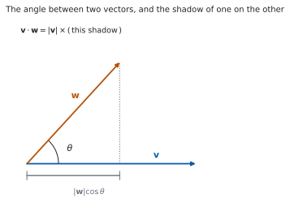
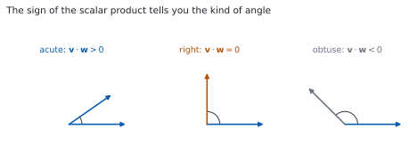

# HL 3.13 — The scalar product and the angle between two vectors（内積となす角） {#sec-aahl-3-13}

::: {.callout-note}
## What you should be able to do
- **内積**（scalar product）を成分から出せる。
- $\mathbf{v}\cdot\mathbf{w} = \lvert\mathbf{v}\rvert\lvert\mathbf{w}\rvert\cos\theta$ を使える。
- $2$ つのベクトルの**なす角**を出せる（公式集の **3.13**）。
- **$\mathbf{v}\cdot\mathbf{w} = 0$ と垂直が同値**であることを使える。
- 平行なベクトルでは $\lvert\mathbf{v}\cdot\mathbf{w}\rvert = \lvert\mathbf{v}\rvert\lvert\mathbf{w}\rvert$ であることを知っている。
- 内積の**性質**（交換・分配・スカラー倍・$\mathbf{v}\cdot\mathbf{v}$）を使える。
- 内積を使って、図形の性質を証明できる。
:::

## The idea

### 1. The definition of the scalar product（内積の定義） {#definition}

シラバスは、$3$ 行です。

> The definition of the scalar product of two vectors.
>
> The angle between two vectors.
>
> Perpendicular vectors; parallel vectors.

**内積は、$2$ つのベクトルから $1$ つの数（スカラー）をつくる**計算です。結果はベクトルではありません。

公式集の **3.13** の欄に、次の形で印刷されています。

> Scalar product
>
> $v \cdot w = v_{1}w_{1} + v_{2}w_{2} + v_{3}w_{3}$, where $v = \begin{pmatrix} v_{1} \\ v_{2} \\ v_{3} \end{pmatrix}$, $w = \begin{pmatrix} w_{1} \\ w_{2} \\ w_{3} \end{pmatrix}$

$$
\mathbf{v}\cdot\mathbf{w} = v_{1}w_{1}+v_{2}w_{2}+v_{3}w_{3}
$$ {#eq-aahl313-components}

**成分どうしをかけて、全部足す**だけです。

::: {.callout-important}
## 答えはスカラーです
$\mathbf{v}\cdot\mathbf{w}$ は**数**です。ベクトルではありません。

答えを $\begin{pmatrix} \ \\ \ \\ \ \end{pmatrix}$ の形で書いたら、まちがいです。**$-8$ のような数**を書いてください。
:::

### 2. The two formulas（$2$ つの式） {#two-forms}

{#fig-aahl313-idea-a width=100%}

公式集には、もう $1$ つの式もあります。

> $v \cdot w = \lvert v \rvert \lvert w \rvert \cos\theta$, where $\theta$ is the angle between $v$ and $w$

$$
\mathbf{v}\cdot\mathbf{w} = \lvert\mathbf{v}\rvert\lvert\mathbf{w}\rvert\cos\theta
$$ {#eq-aahl313-angle-form}

@fig-aahl313-idea-a のとおり、$\lvert\mathbf{w}\rvert\cos\theta$ は **$\mathbf{w}$ を $\mathbf{v}$ の向きに落とした影**の長さです。内積は、その影と $\lvert\mathbf{v}\rvert$ の積です。

**この $2$ つの式があることが、内積の強みです。** 成分から数を出し、その数から角を出せます。

: $2$ つの式の使い分け {#tbl-aahl313-two-forms}

| 分かっているもの | 使う式 |
|---|---|
| 成分 | @eq-aahl313-components |
| 大きさとなす角 | @eq-aahl313-angle-form |
| 成分から角を出したい | **両方**（[第 3 節](#angle)） |

### 3. The angle between two vectors（なす角） {#angle}

@eq-aahl313-components と @eq-aahl313-angle-form を等しいと置けば、$\cos\theta$ が出ます。公式集には、その形も印刷されています。

> Angle between two vectors
>
> $\cos\theta = \dfrac{v_{1}w_{1}+v_{2}w_{2}+v_{3}w_{3}}{\lvert v \rvert \lvert w \rvert}$

$$
\cos\theta = \frac{\mathbf{v}\cdot\mathbf{w}}{\lvert\mathbf{v}\rvert\lvert\mathbf{w}\rvert}
$$ {#eq-aahl313-cos}

手順は $3$ 手です。

1. **内積**を成分から出す。
2. **$2$ つの大きさ**を出す。
3. @eq-aahl313-cos に入れて、$\theta = \arccos(\cdots)$ とする。

**$\theta$ は $0$ から $\pi$ までの角**です。$\arccos$ の値域と同じです（[HL 3.9](aahl-3-9.qmd#arcsin-arccos)）。

@fig-aahl313-idea-b のとおり、**内積の符号が角の種類を教えてくれます。**

{#fig-aahl313-idea-b width=100%}

: 内積の符号と角 {#tbl-aahl313-sign}

| $\mathbf{v}\cdot\mathbf{w}$ | $\cos\theta$ | $\theta$ |
|---|---|---|
| 正 | 正 | 鋭角（$0 \leq \theta < \dfrac{\pi}{2}$） |
| $0$ | $0$ | 直角 |
| 負 | 負 | 鈍角（$\dfrac{\pi}{2} < \theta \leq \pi$） |

### 4. Perpendicular vectors（垂直なベクトル） {#perpendicular}

Guidance は、はっきり書いています。

> For non-zero vectors $v \cdot w = 0$ is equivalent to the vectors being perpendicular

$$
\mathbf{v}\cdot\mathbf{w} = 0 \iff \mathbf{v} \perp \mathbf{w}
\qquad (\mathbf{v} \neq \mathbf{0},\ \mathbf{w} \neq \mathbf{0})
$$ {#eq-aahl313-perp}

**$\cos\dfrac{\pi}{2} = 0$ だから**です。@eq-aahl313-angle-form の右辺が $0$ になります。

**垂直かどうかの判定は、内積 $1$ 回で終わります。** 角を出す必要はありません。

**$\mathbf{0}$ を外してあるのは、$\mathbf{0}$ に向きがないから**です。$\mathbf{0}\cdot\mathbf{w} = 0$ ですが、「垂直」とは言いません。

### 5. Parallel vectors and the scalar product（平行なベクトルと内積） {#parallel}

Guidance の続きです。

> for parallel vectors $\lvert v \cdot w \rvert = \lvert v \rvert \lvert w \rvert$

平行なら $\theta = 0$ か $\theta = \pi$ なので、$\cos\theta = \pm 1$ です。ですから

$$
\lvert\mathbf{v}\cdot\mathbf{w}\rvert = \lvert\mathbf{v}\rvert\lvert\mathbf{w}\rvert
$$ {#eq-aahl313-parallel}

です。**絶対値が付いている**ところに気をつけてください。向きが逆なら、内積そのものは**負**になります。

::: {.callout-important}
## 平行の判定には、内積を使いません
平行かどうかは、**スカラー倍になっているか**で見ます（[HL 3.12](aahl-3-12.qmd#parallel)）。

@eq-aahl313-parallel は「平行ならこうなる」という性質で、判定に使うには $2$ つの大きさを計算しなければならず、遠回りです。
:::

### 6. Properties of the scalar product（内積の性質） {#properties}

Guidance は、$4$ つの性質を挙げています。

> Applications of the properties of the scalar product
>
> $v \cdot w = w \cdot v$;
>
> $u \cdot (v + w) = u \cdot v + u \cdot w$;
>
> $(kv) \cdot w = k(v \cdot w)$;
>
> $v \cdot v = \lvert v \rvert^{2}$.

$4$ つ目が、とくによく使います。

$$
\mathbf{v}\cdot\mathbf{v} = \lvert\mathbf{v}\rvert^{2}
$$ {#eq-aahl313-square}

$\theta = 0$ なので $\cos\theta = 1$ で、@eq-aahl313-angle-form が $\lvert\mathbf{v}\rvert^{2}$ になります。

**分配できる**（$2$ つ目）ので、ふつうの式のように展開できます。

$$
(\mathbf{u}+\mathbf{w})\cdot(\mathbf{u}-\mathbf{w})
= \mathbf{u}\cdot\mathbf{u} - \mathbf{w}\cdot\mathbf{w}
= \lvert\mathbf{u}\rvert^{2} - \lvert\mathbf{w}\rvert^{2}
$$ {#eq-aahl313-expand}

**$2$ 乗の差の形**になりました（[演習 9](#exercises)）。

### 7. Using the scalar product in geometry（図形で使う） {#geometry}

図形の問題では、次の $2$ つに使います。

- **角を出す**（三角形の内角など）
- **垂直を示す**（$2$ つのベクトルの内積が $0$）

三角形 $ABC$ の角 $BAC$ を出すなら、**$A$ から出る $2$ 本**、つまり $\overrightarrow{AB}$ と $\overrightarrow{AC}$ の内積を使います。

$$
\cos(\angle BAC) = \frac{\overrightarrow{AB}\cdot\overrightarrow{AC}}
{\lvert\overrightarrow{AB}\rvert\lvert\overrightarrow{AC}\rvert}
$$ {#eq-aahl313-triangle}

**向きをそろえる**ところが要です。$\overrightarrow{BA}$ と $\overrightarrow{AC}$ を使うと、$\pi$ から引いた角が出てしまいます。

::: {.callout-tip collapse="true"}
## Paper 2 では、電卓で内積が出せます
TI-Nspire CX II には `dotP(` があります。`dotP([1,2,3],[4,5,6])` のように使います。

なす角は `dotP` と `norm` を組み合わせて、$\arccos$ に入れます。**`RAD` になっているか**を見てください。

**答案には、式を書いてください。** @eq-aahl313-cos の形を書いてから値を入れます。`dotP(...)` と書いても点になりません。

**Paper 1 では使えません。** このページの例題と演習は、すべて手で解けるようにしてあります。
:::

## Why it works

::: {.callout-tip collapse="true"}
## クリックすると開きます

#### なぜ $2$ つの式が同じものなのか {#why-two-forms}

$\mathbf{v}$、$\mathbf{w}$ と $\mathbf{v}-\mathbf{w}$ で三角形をつくります。余弦定理（[SL 3.2](../../aa-sl/03-geometry/aasl-3-2.qmd)）から

$$
\lvert\mathbf{v}-\mathbf{w}\rvert^{2}
= \lvert\mathbf{v}\rvert^{2} + \lvert\mathbf{w}\rvert^{2}
- 2\lvert\mathbf{v}\rvert\lvert\mathbf{w}\rvert\cos\theta
$$

です。左辺を成分で書くと

$$
(v_{1}-w_{1})^{2}+(v_{2}-w_{2})^{2}+(v_{3}-w_{3})^{2}
$$

で、展開すると

$$
= \lvert\mathbf{v}\rvert^{2} + \lvert\mathbf{w}\rvert^{2}
- 2\left(v_{1}w_{1}+v_{2}w_{2}+v_{3}w_{3}\right)
$$

です。$2$ つをくらべると、最後のかっこの中が $\lvert\mathbf{v}\rvert\lvert\mathbf{w}\rvert\cos\theta$ に等しいと分かります。

**@eq-aahl313-components と @eq-aahl313-angle-form が同じもの**である理由が、これです。

#### なぜ、内積が $0$ で垂直なのか {#why-perp}

$\mathbf{v} \neq \mathbf{0}$、$\mathbf{w} \neq \mathbf{0}$ とすると $\lvert\mathbf{v}\rvert > 0$、$\lvert\mathbf{w}\rvert > 0$ です。ですから @eq-aahl313-angle-form で

$$
\mathbf{v}\cdot\mathbf{w} = 0 \iff \cos\theta = 0
$$

です。$0 \leq \theta \leq \pi$ で $\cos\theta = 0$ になるのは $\theta = \dfrac{\pi}{2}$ だけなので、**垂直と同値**です。

**片方が $\mathbf{0}$ だと、$\theta$ が決まりません。** だから条件に $\mathbf{v} \neq \mathbf{0}$ が要ります。

#### $\mathbf{v}\cdot\mathbf{v} = \lvert\mathbf{v}\rvert^{2}$ の $2$通りの見方 {#why-square}

**成分で。** @eq-aahl313-components で $\mathbf{w} = \mathbf{v}$ とすると

$$
v_{1}^{2}+v_{2}^{2}+v_{3}^{2} = \lvert\mathbf{v}\rvert^{2}
$$

です（[HL 3.12](aahl-3-12.qmd#magnitude)）。

**角で。** $\mathbf{v}$ と $\mathbf{v}$ のなす角は $0$ なので $\cos 0 = 1$、@eq-aahl313-angle-form は $\lvert\mathbf{v}\rvert\lvert\mathbf{v}\rvert$ です。

**どちらでも同じ**です。この式のおかげで、$\lvert\ \rvert^{2}$ を内積に、内積を $\lvert\ \rvert^{2}$ に置きかえられます。図形の証明で何度も使います。

#### 内積は展開できます {#why-expand}

$u \cdot (v+w) = u\cdot v + u\cdot w$ は、成分で書けばすぐに見えます。

$$
u_{1}(v_{1}+w_{1}) + u_{2}(v_{2}+w_{2}) + u_{3}(v_{3}+w_{3})
$$

を並べかえるだけだからです。

交換法則 $\mathbf{v}\cdot\mathbf{w} = \mathbf{w}\cdot\mathbf{v}$ も、$v_{i}w_{i} = w_{i}v_{i}$ から出ます。

**ですから、$(\mathbf{a}+\mathbf{b})\cdot(\mathbf{a}-\mathbf{b})$ のような式は、ふつうの展開と同じように扱えます。** ただし**$\mathbf{a}\cdot\mathbf{b}$ は数**なので、それ以上「割る」ことはできません。ベクトルの割り算はありません。
:::

## Worked examples

::: {.callout-note appearance="simple"}
問題文は英語です。意味が理解できなかったら、問題文の下の「**日本語訳**」を開いてください。解説は日本語です。

**例題も演習も、すべて電卓なしで解けます。** Paper 1 のつもりで解いてください。
:::

::: {#exm-aahl313-dot}
[Let $\mathbf{a} = \begin{pmatrix} 2 \\ -1 \\ 3 \end{pmatrix}$ and $\mathbf{b} = \begin{pmatrix} 1 \\ 4 \\ -2 \end{pmatrix}$.]{.q-en}

**(a)** [Find $\mathbf{a}\cdot\mathbf{b}$.]{.q-en}

**(b)** [State whether the angle between $\mathbf{a}$ and $\mathbf{b}$ is acute, right or obtuse.]{.q-en}

日本語訳

$\mathbf{a} = \begin{pmatrix} 2 \\ -1 \\ 3 \end{pmatrix}$、$\mathbf{b} = \begin{pmatrix} 1 \\ 4 \\ -2 \end{pmatrix}$ とします。

**(a)** $\mathbf{a}\cdot\mathbf{b}$ を求めなさい。

**(b)** $\mathbf{a}$ と $\mathbf{b}$ のなす角が、鋭角・直角・鈍角のどれかを書きなさい。

---

**(a)** @eq-aahl313-components のとおり、成分どうしをかけて足します。

$$
\mathbf{a}\cdot\mathbf{b} = (2)(1)+(-1)(4)+(3)(-2) = 2-4-6 = -8
$$

**(b)** 内積が**負**なので、$\cos\theta < 0$ です。$0 \leq \theta \leq \pi$ で $\cos$ が負になるのは $\dfrac{\pi}{2}$ より大きい角なので、**鈍角**です（[第 3 節](#angle)）。

**検算。** **順番を入れかえて計算します。** $\mathbf{b}\cdot\mathbf{a} = (1)(2)+(4)(-1)+(-2)(3) = -8$ ✓ **交換法則どおりです。**

**検算（符号だけ）。** $3$ つの積は $2$、$-4$、$-6$ です。負が大きいので、和は負 ✓ **鈍角と合っています。**

::: {.callout-note}
## 解答例（答案用紙に書くこと）

**(a)** $\mathbf{a}\cdot\mathbf{b} = (2)(1)+(-1)(4)+(3)(-2) = -8$

**(b)** *The scalar product is negative, so $\cos\theta < 0$ and the angle is obtuse.*
:::
:::

::: {#exm-aahl313-angle}
[Find the angle between $\mathbf{u} = \mathbf{i}+\mathbf{j}$ and $\mathbf{w} = \mathbf{i}+\mathbf{k}$.]{.q-en}

日本語訳

$\mathbf{u} = \mathbf{i}+\mathbf{j}$ と $\mathbf{w} = \mathbf{i}+\mathbf{k}$ のなす角を求めなさい。

---

**成分に直します。** $\mathbf{u} = \begin{pmatrix} 1 \\ 1 \\ 0 \end{pmatrix}$、$\mathbf{w} = \begin{pmatrix} 1 \\ 0 \\ 1 \end{pmatrix}$ です。

**内積。**

$$
\mathbf{u}\cdot\mathbf{w} = (1)(1)+(1)(0)+(0)(1) = 1
$$

**大きさ。**

$$
\lvert\mathbf{u}\rvert = \sqrt{1+1+0} = \sqrt{2}, \qquad
\lvert\mathbf{w}\rvert = \sqrt{1+0+1} = \sqrt{2}
$$

**@eq-aahl313-cos に入れます。**

$$
\cos\theta = \frac{1}{\sqrt{2}\cdot\sqrt{2}} = \frac{1}{2}
$$

$$
\theta = \frac{\pi}{3}
$$

**検算。** **$\cos\theta$ の大きさを見ます。** $\dfrac{1}{2}$ は $-1$ と $1$ のあいだです ✓ **$1$ より大きくなったら、どこかがまちがっています。**

**検算（符号）。** 内積が正なので、鋭角のはずです。$\dfrac{\pi}{3} < \dfrac{\pi}{2}$ ✓

::: {.callout-note}
## 解答例（答案用紙に書くこと）

$$\mathbf{u}\cdot\mathbf{w} = 1, \qquad
\lvert\mathbf{u}\rvert = \sqrt{2}, \qquad \lvert\mathbf{w}\rvert = \sqrt{2}$$

$$\cos\theta = \frac{\mathbf{u}\cdot\mathbf{w}}{\lvert\mathbf{u}\rvert\lvert\mathbf{w}\rvert}
= \frac{1}{2}, \qquad \theta = \frac{\pi}{3}$$
:::
:::

::: {#exm-aahl313-perp}
[Find the value of $k$ for which $\begin{pmatrix} 2 \\ k \\ -3 \end{pmatrix}$ and $\begin{pmatrix} 4 \\ -1 \\ 2 \end{pmatrix}$ are perpendicular.]{.q-en}

日本語訳

$\begin{pmatrix} 2 \\ k \\ -3 \end{pmatrix}$ と $\begin{pmatrix} 4 \\ -1 \\ 2 \end{pmatrix}$ が垂直になる $k$ の値を求めなさい。

---

**垂直なので、内積が $0$ です**（@eq-aahl313-perp）。

$$
(2)(4)+(k)(-1)+(-3)(2) = 0
$$

$$
8 - k - 6 = 0 \ \Rightarrow \ 2 - k = 0 \ \Rightarrow \ k = 2
$$

**検算。** **$k = 2$ を入れ直します。**

$$
(2)(4)+(2)(-1)+(-3)(2) = 8-2-6 = 0
$$

$0$ になりました ✓

**検算（角のほう）。** 内積が $0$ なら $\cos\theta = 0$ で、$\theta = \dfrac{\pi}{2}$ です ✓ **大きさを計算する必要はありません。**

::: {.callout-note}
## 解答例（答案用紙に書くこと）

*Perpendicular means the scalar product is zero.*

$$(2)(4)+(k)(-1)+(-3)(2) = 0$$

$$8-k-6 = 0, \qquad k = 2$$
:::
:::

::: {#exm-aahl313-proof}
[In triangle $OAB$, $\overrightarrow{OA} = \mathbf{a}$ and $\overrightarrow{OB} = \mathbf{b}$, and $M$ is the midpoint of $AB$. Show that if $\lvert\mathbf{a}\rvert = \lvert\mathbf{b}\rvert$ then $OM$ is perpendicular to $AB$.]{.q-en}

日本語訳

三角形 $OAB$ で $\overrightarrow{OA} = \mathbf{a}$、$\overrightarrow{OB} = \mathbf{b}$ とし、$M$ を $AB$ の中点とします。$\lvert\mathbf{a}\rvert = \lvert\mathbf{b}\rvert$ ならば $OM$ が $AB$ に垂直であることを示しなさい。

---

**$2$ 本のベクトルを、$\mathbf{a}$ と $\mathbf{b}$ で書きます**（[HL 3.12](aahl-3-12.qmd#proofs)）。

$$
\overrightarrow{OM} = \frac{\mathbf{a}+\mathbf{b}}{2}, \qquad
\overrightarrow{AB} = \mathbf{b}-\mathbf{a}
$$

**内積を計算します。** @eq-aahl313-expand の形です。

$$
\overrightarrow{OM}\cdot\overrightarrow{AB}
= \frac{1}{2}(\mathbf{a}+\mathbf{b})\cdot(\mathbf{b}-\mathbf{a})
= \frac{1}{2}\left(\lvert\mathbf{b}\rvert^{2}-\lvert\mathbf{a}\rvert^{2}\right)
$$

$\lvert\mathbf{a}\rvert = \lvert\mathbf{b}\rvert$ なので、これは $0$ です。

::: {.model-answer}
**試験ではこう書く**

*Since $M$ is the midpoint of $AB$, $\overrightarrow{OM} = \dfrac{\mathbf{a}+\mathbf{b}}{2}$, and $\overrightarrow{AB} = \mathbf{b}-\mathbf{a}$. Using the distributive property of the scalar product,*

$$\overrightarrow{OM}\cdot\overrightarrow{AB}
= \frac{1}{2}(\mathbf{a}+\mathbf{b})\cdot(\mathbf{b}-\mathbf{a})
= \frac{1}{2}\left(\mathbf{a}\cdot\mathbf{b}-\mathbf{a}\cdot\mathbf{a}
+\mathbf{b}\cdot\mathbf{b}-\mathbf{b}\cdot\mathbf{a}\right)$$

*The scalar product is commutative, so $\mathbf{a}\cdot\mathbf{b}$ and $\mathbf{b}\cdot\mathbf{a}$ cancel, and $\mathbf{a}\cdot\mathbf{a} = \lvert\mathbf{a}\rvert^{2}$, $\mathbf{b}\cdot\mathbf{b} = \lvert\mathbf{b}\rvert^{2}$. Hence*

$$\overrightarrow{OM}\cdot\overrightarrow{AB} = \frac{1}{2}\left(\lvert\mathbf{b}\rvert^{2}-\lvert\mathbf{a}\rvert^{2}\right)$$

*If $\lvert\mathbf{a}\rvert = \lvert\mathbf{b}\rvert$ this is zero. Neither $\overrightarrow{OM}$ nor $\overrightarrow{AB}$ is the zero vector in a genuine triangle, so a zero scalar product means the two vectors are perpendicular: $OM \perp AB$.*
:::

（$\overrightarrow{OM}$ と $\overrightarrow{AB}$ の内積を展開すると $\dfrac{1}{2}\left(\lvert\mathbf{b}\rvert^{2}-\lvert\mathbf{a}\rvert^{2}\right)$ になり、$2$ 辺が等しいとき $0$ になる、という意味です。）

**検算。** **数で確かめます。** $\mathbf{a} = \begin{pmatrix} 3 \\ 0 \end{pmatrix}$、$\mathbf{b} = \begin{pmatrix} 0 \\ 3 \end{pmatrix}$ なら $\overrightarrow{OM} = \begin{pmatrix} 1.5 \\ 1.5 \end{pmatrix}$、$\overrightarrow{AB} = \begin{pmatrix} -3 \\ 3 \end{pmatrix}$ です。内積は $-4.5+4.5 = 0$ ✓

**検算（等しくないとき）。** $\mathbf{a} = \begin{pmatrix} 4 \\ 0 \end{pmatrix}$、$\mathbf{b} = \begin{pmatrix} 0 \\ 3 \end{pmatrix}$ なら内積は $\dfrac{1}{2}(9-16) = -3.5 \neq 0$ ✓ **条件が要ることが分かります。**

::: {.callout-note}
## 解答例（答案用紙に書くこと）

$$\overrightarrow{OM} = \frac{\mathbf{a}+\mathbf{b}}{2}, \qquad
\overrightarrow{AB} = \mathbf{b}-\mathbf{a}$$

$$\overrightarrow{OM}\cdot\overrightarrow{AB}
= \frac{1}{2}(\mathbf{a}+\mathbf{b})\cdot(\mathbf{b}-\mathbf{a})
= \frac{1}{2}\left(\lvert\mathbf{b}\rvert^{2}-\lvert\mathbf{a}\rvert^{2}\right)$$

*If $\lvert\mathbf{a}\rvert = \lvert\mathbf{b}\rvert$ then this is $0$, so $OM$ is perpendicular to $AB$.*
:::
:::

## Common errors

::: {.callout-warning}
## 答えをベクトルの形で書く
内積の答えは**数**です（[第 1 節](#definition)）。

成分を縦に並べて書いたら、まちがいです。**ベクトルを返す積は、次の項目 AHL 3.16 の外積のほうです。**
:::

::: {.callout-warning}
## 大きさを出すのを忘れて、内積だけで角を出す
$\cos\theta = \mathbf{v}\cdot\mathbf{w}$ ではありません。**$2$ つの大きさで割ります**（@eq-aahl313-cos）。

割り忘れると、$\cos\theta$ が $1$ より大きくなることがあります。**$\lvert\cos\theta\rvert \leq 1$ を確かめてください。**
:::

::: {.callout-warning}
## 三角形の角で、向きをそろえない
$\angle BAC$ を出すには、**$A$ から出る $2$ 本**、$\overrightarrow{AB}$ と $\overrightarrow{AC}$ を使います（[第 7 節](#geometry)）。

$\overrightarrow{BA}$ を使うと、$\pi$ から引いた角が出ます。**符号がちょうど逆**になるので、気づきにくいまちがいです。
:::

::: {.callout-warning}
## 平行の判定に内積を使う
平行は**スカラー倍**で判定します（[HL 3.12](aahl-3-12.qmd#parallel)）。

@eq-aahl313-parallel は「平行ならこうなる」という性質で、判定の道具ではありません。
:::

::: {.callout-warning}
## $\lvert\mathbf{v}\cdot\mathbf{w}\rvert$ の絶対値を落とす
平行なとき、内積は $\pm\lvert\mathbf{v}\rvert\lvert\mathbf{w}\rvert$ です（[第 5 節](#parallel)）。

**向きが逆なら負**になります。絶対値を落とすと、符号を取りちがえます。
:::

::: {.callout-warning}
## ベクトルで割ろうとする
$\mathbf{a}\cdot\mathbf{b} = \mathbf{a}\cdot\mathbf{c}$ から $\mathbf{b} = \mathbf{c}$ とは言えません。

**ベクトルの割り算はありません。** $\mathbf{a}\cdot(\mathbf{b}-\mathbf{c}) = 0$ なので、$\mathbf{a}$ と $\mathbf{b}-\mathbf{c}$ が垂直だ、としか言えません。
:::

## Exercises

::: {.callout-note appearance="simple"}
各問題に、折りたたみが $3$ つ付いています。**日本語訳**、**解答例**（答案用紙に書くべきこと。英語です）、**解説**（なぜそうなるか。日本語です）。

まず自分で解いて、次に解答例と見くらべてください。**解説は、合わなかったときだけ開けば十分です。**
:::

::: {.exercise-block}

[1]{.ex-no} [Let $\mathbf{a} = \begin{pmatrix} 3 \\ -2 \\ 1 \end{pmatrix}$ and $\mathbf{b} = \begin{pmatrix} -1 \\ 4 \\ 2 \end{pmatrix}$. Find $\mathbf{a}\cdot\mathbf{b}$.]{.q-en}

日本語訳

$\mathbf{a} = \begin{pmatrix} 3 \\ -2 \\ 1 \end{pmatrix}$、$\mathbf{b} = \begin{pmatrix} -1 \\ 4 \\ 2 \end{pmatrix}$ とします。$\mathbf{a}\cdot\mathbf{b}$ を求めなさい。

::: {.callout-note collapse="true"}
## 解答例（答案用紙に書くこと）

$$\mathbf{a}\cdot\mathbf{b} = (3)(-1)+(-2)(4)+(1)(2) = -3-8+2 = -9$$
:::

::: {.callout-tip collapse="true"}
## 解説

成分どうしをかけて足すだけです（@eq-aahl313-components）。**符号をていねいに。**

**検算。** 順番を入れかえても $-9$ ✓

**検算（符号）。** 内積が負なので、なす角は鈍角です ✓ $3$ つの積のうち $2$ つが負です。
:::

::: {.ex-sep}
:::

[2]{.ex-no} [Find the angle between $\mathbf{u} = \begin{pmatrix} 1 \\ 0 \\ 1 \end{pmatrix}$ and $\mathbf{w} = \begin{pmatrix} 0 \\ 1 \\ 1 \end{pmatrix}$.]{.q-en}

日本語訳

$\mathbf{u} = \begin{pmatrix} 1 \\ 0 \\ 1 \end{pmatrix}$ と $\mathbf{w} = \begin{pmatrix} 0 \\ 1 \\ 1 \end{pmatrix}$ のなす角を求めなさい。

::: {.callout-note collapse="true"}
## 解答例（答案用紙に書くこと）

$$\mathbf{u}\cdot\mathbf{w} = 0+0+1 = 1, \qquad
\lvert\mathbf{u}\rvert = \sqrt{2}, \qquad \lvert\mathbf{w}\rvert = \sqrt{2}$$

$$\cos\theta = \frac{1}{2}, \qquad \theta = \frac{\pi}{3}$$
:::

::: {.callout-tip collapse="true"}
## 解説

[例題 2](#exm-aahl313-angle) と同じ手順です。**$\sqrt{2}\times\sqrt{2} = 2$** のところで、根号が消えます。

**検算。** $\cos\theta = \dfrac{1}{2}$ は $-1$ と $1$ のあいだ ✓

**検算（符号）。** 内積が正なので鋭角 ✓ $\dfrac{\pi}{3} < \dfrac{\pi}{2}$ です。
:::

::: {.ex-sep}
:::

[3]{.ex-no} [Find the value of $t$ for which $\begin{pmatrix} 1 \\ t \\ 3 \end{pmatrix}$ and $\begin{pmatrix} 2 \\ 4 \\ -2 \end{pmatrix}$ are perpendicular.]{.q-en}

日本語訳

$\begin{pmatrix} 1 \\ t \\ 3 \end{pmatrix}$ と $\begin{pmatrix} 2 \\ 4 \\ -2 \end{pmatrix}$ が垂直になる $t$ の値を求めなさい。

::: {.callout-note collapse="true"}
## 解答例（答案用紙に書くこと）

$$(1)(2)+(t)(4)+(3)(-2) = 0$$

$$2+4t-6 = 0, \qquad 4t = 4, \qquad t = 1$$
:::

::: {.callout-tip collapse="true"}
## 解説

**内積 $= 0$ を立てるだけ**です（@eq-aahl313-perp）。大きさは要りません。

**検算。** $t = 1$ で $2+4-6 = 0$ ✓

**検算（角のほう）。** 内積が $0$ なら $\cos\theta = 0$、$\theta = \dfrac{\pi}{2}$ ✓
:::

::: {.ex-sep}
:::

[4]{.ex-no} [Show that $\mathbf{a} = \begin{pmatrix} 1 \\ 2 \\ 2 \end{pmatrix}$ and $\mathbf{b} = \begin{pmatrix} 2 \\ 1 \\ -2 \end{pmatrix}$ are perpendicular.]{.q-en}

日本語訳

$\mathbf{a} = \begin{pmatrix} 1 \\ 2 \\ 2 \end{pmatrix}$ と $\mathbf{b} = \begin{pmatrix} 2 \\ 1 \\ -2 \end{pmatrix}$ が垂直であることを示しなさい。

::: {.callout-note collapse="true"}
## 解答例（答案用紙に書くこと）

$$\mathbf{a}\cdot\mathbf{b} = (1)(2)+(2)(1)+(2)(-2) = 2+2-4 = 0$$

*Both vectors are non-zero, so they are perpendicular.*
:::

::: {.callout-tip collapse="true"}
## 解説

**「どちらも $\mathbf{0}$ でない」と書き添える**ところまでが答えです（@eq-aahl313-perp）。

**検算。** $\lvert\mathbf{a}\rvert = 3$、$\lvert\mathbf{b}\rvert = 3$ で、どちらも $\mathbf{0}$ ではありません ✓

**検算（角のほう）。** $\cos\theta = \dfrac{0}{9} = 0$ なので $\theta = \dfrac{\pi}{2}$ ✓
:::

::: {.ex-sep}
:::

[5]{.ex-no} [The vectors $\mathbf{a}$ and $\mathbf{b}$ satisfy $\lvert\mathbf{a}\rvert = 3$, $\lvert\mathbf{b}\rvert = 5$, and the angle between them is $\dfrac{\pi}{3}$. Find $\mathbf{a}\cdot\mathbf{b}$.]{.q-en}

日本語訳

$\lvert\mathbf{a}\rvert = 3$、$\lvert\mathbf{b}\rvert = 5$ で、なす角が $\dfrac{\pi}{3}$ であるとします。$\mathbf{a}\cdot\mathbf{b}$ を求めなさい。

::: {.callout-note collapse="true"}
## 解答例（答案用紙に書くこと）

$$\mathbf{a}\cdot\mathbf{b} = \lvert\mathbf{a}\rvert\lvert\mathbf{b}\rvert\cos\theta
= 3 \times 5 \times \cos\frac{\pi}{3} = 15 \times \frac{1}{2} = \frac{15}{2}$$
:::

::: {.callout-tip collapse="true"}
## 解説

**成分が分からなくても、@eq-aahl313-angle-form なら出ます。** $2$ つの式の使い分けです（[第 2 節](#two-forms)）。

**検算。** 鋭角なので、内積は正のはずです ✓ $\dfrac{15}{2} > 0$ です。

**検算（大きさ）。** 平行なら $15$ になります。$\dfrac{15}{2}$ はそれより小さい ✓ **$\lvert\mathbf{a}\cdot\mathbf{b}\rvert \leq \lvert\mathbf{a}\rvert\lvert\mathbf{b}\rvert$ が成り立っています。**
:::

::: {.ex-sep}
:::

[6]{.ex-no} [Let $\mathbf{a} = \begin{pmatrix} 2 \\ -1 \\ 2 \end{pmatrix}$. Find $\mathbf{a}\cdot\mathbf{a}$ and $\lvert\mathbf{a}\rvert$, and comment on your answers.]{.q-en}

日本語訳

$\mathbf{a} = \begin{pmatrix} 2 \\ -1 \\ 2 \end{pmatrix}$ とします。$\mathbf{a}\cdot\mathbf{a}$ と $\lvert\mathbf{a}\rvert$ を求め、$2$ つの答えについて述べなさい。

::: {.callout-note collapse="true"}
## 解答例（答案用紙に書くこと）

$$\mathbf{a}\cdot\mathbf{a} = 4+1+4 = 9, \qquad \lvert\mathbf{a}\rvert = \sqrt{9} = 3$$

*The scalar product of a vector with itself is the square of its magnitude: $\mathbf{a}\cdot\mathbf{a} = \lvert\mathbf{a}\rvert^{2}$.*
:::

::: {.callout-tip collapse="true"}
## 解説

@eq-aahl313-square の確かめです。$9 = 3^{2}$ ✓

**根号を付けるかどうか**のちがいだけ、という見方もできます。

**検算。** 角で考えても同じです。$\theta = 0$ なので $\cos 0 = 1$、$3 \times 3 \times 1 = 9$ ✓

**検算（別のベクトルで）。** $\begin{pmatrix} 1 \\ 2 \\ 2 \end{pmatrix}$ なら内積は $9$、大きさは $3$ ✓
:::

::: {.ex-sep}
:::

[7]{.ex-no} [The points $A$, $B$ and $C$ have coordinates $(1,\ 0,\ 0)$, $(0,\ 1,\ 0)$ and $(0,\ 0,\ 1)$. Find the angle $BAC$.]{.q-en}

日本語訳

点 $A$、$B$、$C$ の座標を $(1,\ 0,\ 0)$、$(0,\ 1,\ 0)$、$(0,\ 0,\ 1)$ とします。角 $BAC$ を求めなさい。

::: {.callout-note collapse="true"}
## 解答例（答案用紙に書くこと）

$$\overrightarrow{AB} = \begin{pmatrix} -1 \\ 1 \\ 0 \end{pmatrix}, \qquad
\overrightarrow{AC} = \begin{pmatrix} -1 \\ 0 \\ 1 \end{pmatrix}$$

$$\overrightarrow{AB}\cdot\overrightarrow{AC} = 1, \qquad
\left\lvert\overrightarrow{AB}\right\rvert = \left\lvert\overrightarrow{AC}\right\rvert = \sqrt{2}$$

$$\cos(\angle BAC) = \frac{1}{2}, \qquad \angle BAC = \frac{\pi}{3}$$
:::

::: {.callout-tip collapse="true"}
## 解説

**$A$ から出る $2$ 本**を使います（[第 7 節](#geometry)）。$\overrightarrow{BA}$ を使ってはいけません。

**検算。** $A$、$B$、$C$ はどれも原点から距離 $1$ で、たがいの距離も $\sqrt{2}$ です。**正三角形**なので、角は $\dfrac{\pi}{3}$ ✓

**検算（別の角）。** 同じ理由で $\angle ABC$ も $\dfrac{\pi}{3}$ です ✓
:::

::: {.ex-sep}
:::

[8]{.ex-no} [Show that if $\lvert\mathbf{a}\rvert = \lvert\mathbf{b}\rvert$ then $\mathbf{a}+\mathbf{b}$ and $\mathbf{a}-\mathbf{b}$ are perpendicular.]{.q-en}

日本語訳

$\lvert\mathbf{a}\rvert = \lvert\mathbf{b}\rvert$ ならば、$\mathbf{a}+\mathbf{b}$ と $\mathbf{a}-\mathbf{b}$ が垂直であることを示しなさい。

::: {.callout-note collapse="true"}
## 解答例（答案用紙に書くこと）

$$(\mathbf{a}+\mathbf{b})\cdot(\mathbf{a}-\mathbf{b})
= \mathbf{a}\cdot\mathbf{a}-\mathbf{b}\cdot\mathbf{b}
= \lvert\mathbf{a}\rvert^{2}-\lvert\mathbf{b}\rvert^{2}$$

*If $\lvert\mathbf{a}\rvert = \lvert\mathbf{b}\rvert$ this is $0$, so the two vectors are perpendicular (provided neither is the zero vector).*
:::

::: {.callout-tip collapse="true"}
## 解説

**展開すると $\mathbf{a}\cdot\mathbf{b}$ と $\mathbf{b}\cdot\mathbf{a}$ が消えます**（交換法則）。残るのが $2$ 乗の差です（@eq-aahl313-expand）。

**これは、ひし形の対角線が垂直であることの証明**でもあります。$\mathbf{a}+\mathbf{b}$ と $\mathbf{a}-\mathbf{b}$ が $2$ 本の対角線だからです。

**検算。** $\mathbf{a} = \begin{pmatrix} 3 \\ 0 \end{pmatrix}$、$\mathbf{b} = \begin{pmatrix} 0 \\ 3 \end{pmatrix}$ なら、和は $\begin{pmatrix} 3 \\ 3 \end{pmatrix}$、差は $\begin{pmatrix} 3 \\ -3 \end{pmatrix}$ で、内積は $9-9 = 0$ ✓

**検算（等しくないとき）。** $\lvert\mathbf{a}\rvert = 4$、$\lvert\mathbf{b}\rvert = 3$ なら $16-9 = 7 \neq 0$ ✓

::: {.model-answer}
**試験ではこう書く**

*Using the distributive and commutative properties of the scalar product,*

$$(\mathbf{a}+\mathbf{b})\cdot(\mathbf{a}-\mathbf{b})
= \mathbf{a}\cdot\mathbf{a}-\mathbf{a}\cdot\mathbf{b}
+\mathbf{b}\cdot\mathbf{a}-\mathbf{b}\cdot\mathbf{b}$$

*The middle two terms are equal in size and opposite in sign, since $\mathbf{a}\cdot\mathbf{b} = \mathbf{b}\cdot\mathbf{a}$, so they cancel. Using $\mathbf{v}\cdot\mathbf{v} = \lvert\mathbf{v}\rvert^{2}$ on the remaining terms gives*

$$(\mathbf{a}+\mathbf{b})\cdot(\mathbf{a}-\mathbf{b}) = \lvert\mathbf{a}\rvert^{2}-\lvert\mathbf{b}\rvert^{2}$$

*If $\lvert\mathbf{a}\rvert = \lvert\mathbf{b}\rvert$ then this scalar product is zero. For non-zero vectors a zero scalar product means the vectors are perpendicular, so $\mathbf{a}+\mathbf{b}$ is perpendicular to $\mathbf{a}-\mathbf{b}$. Geometrically this says that the diagonals of a rhombus are perpendicular.*
:::
:::

::: {.ex-sep}
:::

[9]{.ex-no} [Prove that $(\mathbf{u}+\mathbf{w})\cdot(\mathbf{u}-\mathbf{w}) = \lvert\mathbf{u}\rvert^{2}-\lvert\mathbf{w}\rvert^{2}$ for any vectors $\mathbf{u}$ and $\mathbf{w}$.]{.q-en}

日本語訳

任意のベクトル $\mathbf{u}$、$\mathbf{w}$ について $(\mathbf{u}+\mathbf{w})\cdot(\mathbf{u}-\mathbf{w}) = \lvert\mathbf{u}\rvert^{2}-\lvert\mathbf{w}\rvert^{2}$ を証明しなさい。

::: {.callout-note collapse="true"}
## 解答例（答案用紙に書くこと）

$$(\mathbf{u}+\mathbf{w})\cdot(\mathbf{u}-\mathbf{w})
= \mathbf{u}\cdot\mathbf{u}-\mathbf{u}\cdot\mathbf{w}
+\mathbf{w}\cdot\mathbf{u}-\mathbf{w}\cdot\mathbf{w}$$

*Since $\mathbf{u}\cdot\mathbf{w} = \mathbf{w}\cdot\mathbf{u}$, the middle terms cancel, and $\mathbf{v}\cdot\mathbf{v} = \lvert\mathbf{v}\rvert^{2}$ gives*

$$= \lvert\mathbf{u}\rvert^{2}-\lvert\mathbf{w}\rvert^{2}$$
:::

::: {.callout-tip collapse="true"}
## 解説

**使う性質を、名前で書く**ところが大事です。分配法則・交換法則・$\mathbf{v}\cdot\mathbf{v} = \lvert\mathbf{v}\rvert^{2}$ の $3$ つです（[第 6 節](#properties)）。

**検算。** $\mathbf{u} = \begin{pmatrix} 3 \\ 0 \end{pmatrix}$、$\mathbf{w} = \begin{pmatrix} 0 \\ 4 \end{pmatrix}$ なら、左辺は $\begin{pmatrix} 3 \\ 4 \end{pmatrix}\cdot\begin{pmatrix} 3 \\ -4 \end{pmatrix} = 9-16 = -7$、右辺は $9-16 = -7$ ✓

**検算（成分で）。** $2$ 次元で文字のまま計算しても、$u_{1}^{2}+u_{2}^{2}-w_{1}^{2}-w_{2}^{2}$ になります ✓

::: {.model-answer}
**試験ではこう書く**

*The scalar product distributes over addition, so the product can be expanded exactly like an ordinary product of brackets:*

$$(\mathbf{u}+\mathbf{w})\cdot(\mathbf{u}-\mathbf{w})
= \mathbf{u}\cdot\mathbf{u}-\mathbf{u}\cdot\mathbf{w}
+\mathbf{w}\cdot\mathbf{u}-\mathbf{w}\cdot\mathbf{w}$$

*The scalar product is commutative, so $\mathbf{w}\cdot\mathbf{u} = \mathbf{u}\cdot\mathbf{w}$ and the two middle terms cancel exactly. For any vector $\mathbf{v}$ the scalar product with itself is $\mathbf{v}\cdot\mathbf{v} = \lvert\mathbf{v}\rvert\lvert\mathbf{v}\rvert\cos 0 = \lvert\mathbf{v}\rvert^{2}$. Applying this to the first and last terms gives $(\mathbf{u}+\mathbf{w})\cdot(\mathbf{u}-\mathbf{w}) = \lvert\mathbf{u}\rvert^{2}-\lvert\mathbf{w}\rvert^{2}$, which holds for any two vectors $\mathbf{u}$ and $\mathbf{w}$.*
:::
:::

::: {.ex-sep}
:::

[10]{.ex-no} [A student says: "For parallel vectors $\mathbf{a}\cdot\mathbf{b} = \lvert\mathbf{a}\rvert\lvert\mathbf{b}\rvert$, so for $\mathbf{a} = \begin{pmatrix} 1 \\ 0 \\ 0 \end{pmatrix}$ and $\mathbf{b} = \begin{pmatrix} -2 \\ 0 \\ 0 \end{pmatrix}$ we get $\mathbf{a}\cdot\mathbf{b} = 2$." Explain the error.]{.q-en}

日本語訳

ある生徒が言いました。「平行なベクトルでは $\mathbf{a}\cdot\mathbf{b} = \lvert\mathbf{a}\rvert\lvert\mathbf{b}\rvert$ なので、$\mathbf{a} = \begin{pmatrix} 1 \\ 0 \\ 0 \end{pmatrix}$、$\mathbf{b} = \begin{pmatrix} -2 \\ 0 \\ 0 \end{pmatrix}$ のとき $\mathbf{a}\cdot\mathbf{b} = 2$ である。」まちがいを説明しなさい。

::: {.callout-note collapse="true"}
## 解答例（答案用紙に書くこと）

*The guidance says $\lvert\mathbf{a}\cdot\mathbf{b}\rvert = \lvert\mathbf{a}\rvert\lvert\mathbf{b}\rvert$ for parallel vectors: the modulus signs on the left matter.*

*Here the vectors point in opposite directions, so the angle between them is $\pi$ and $\cos\pi = -1$:*

$$\mathbf{a}\cdot\mathbf{b} = (1)(-2)+0+0 = -2$$

*The size is $2$, as the rule says, but the scalar product itself is $-2$.*
:::

::: {.callout-tip collapse="true"}
## 解説

**絶対値を落としたのが、まちがいのもと**です（[第 5 節](#parallel)）。平行には「同じ向き」と「逆向き」の $2$ 通りがあります。

$\cos\theta = \pm 1$ なので、内積は $\pm\lvert\mathbf{a}\rvert\lvert\mathbf{b}\rvert$ です。

**検算。** 成分で計算すると $-2$ ✓ 生徒の答えと符号が逆です。

**検算（角のほう）。** $\lvert\mathbf{a}\rvert = 1$、$\lvert\mathbf{b}\rvert = 2$、$\theta = \pi$ なので $1 \times 2 \times (-1) = -2$ ✓

::: {.model-answer}
**試験ではこう書く**

*The statement in the guidance is $\lvert\mathbf{a}\cdot\mathbf{b}\rvert = \lvert\mathbf{a}\rvert\lvert\mathbf{b}\rvert$ for parallel vectors, with modulus signs around the scalar product on the left-hand side. Dropping them changes the claim, because parallel vectors can point either the same way or opposite ways. Here $\mathbf{b} = -2\mathbf{a}$, so the vectors are parallel but point in opposite directions and the angle between them is $\pi$, giving $\cos\pi = -1$. Then $\mathbf{a}\cdot\mathbf{b} = \lvert\mathbf{a}\rvert\lvert\mathbf{b}\rvert\cos\pi = (1)(2)(-1) = -2$, and computing from components confirms it: $(1)(-2)+(0)(0)+(0)(0) = -2$. The size of the scalar product is indeed $2 = \lvert\mathbf{a}\rvert\lvert\mathbf{b}\rvert$, which is what the rule asserts, but the scalar product itself is $-2$, not $2$.*
:::
:::

:::
