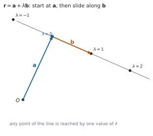
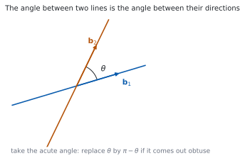

# HL 3.14 — The vector equation of a line（直線のベクトル方程式） {#sec-aahl-3-14}

::: {.callout-note}
## What you should be able to do
- $\mathbf{r} = \mathbf{a}+\lambda\mathbf{b}$ の $\mathbf{a}$ と $\mathbf{b}$ が何かを言える。
- $2$ 次元でも $3$ 次元でも、直線のベクトル方程式を書ける。
- **媒介変数表示**（parametric form）に直せる。
- **デカルト形**（Cartesian form）に直せる。
- $2$ 点を通る直線の式を書ける。
- 点が直線の上にあるかどうかを調べられる。
- $2$ 直線の**なす角**を、方向ベクトルの内積から出せる。
- $\lambda$ を**時間**、$\mathbf{b}$ を**速度**として読める。
:::

## The idea

### 1. The vector equation of a line（直線のベクトル方程式） {#vector-equation}

{#fig-aahl314-idea-a width=100%}

シラバスは、次のように書いています。

> Vector equation of a line in two and three dimensions:
>
> $r = a + \lambda b$.

公式集の **3.14** の欄にも、同じ式があります。

$$
\mathbf{r} = \mathbf{a}+\lambda\mathbf{b}
$$ {#eq-aahl314-vector}

@fig-aahl314-idea-a のとおり、**$\mathbf{a}$ の点から出発して、$\mathbf{b}$ の向きに $\lambda$ だけ進んだ点**が $\mathbf{r}$ です。

**$\lambda$ が実数全体を動くと、直線の上のすべての点が出ます。**

### 2. Position and direction（位置と方向） {#position-direction}

Guidance は、$2$ つの役割をはっきり書いています。

> Relevance of $a$ (position) and $b$ (direction).

- **$\mathbf{a}$ は、直線の上の点 $1$ つ**の位置ベクトルです。
- **$\mathbf{b}$ は、直線の向き**（direction vector）です。

::: {.callout-important}
## 式は $1$ つに決まりません
同じ直線でも、**$\mathbf{a}$ を別の点に取れば、別の式**になります。$\mathbf{b}$ も、何倍かすれば別の式になります。

$$
\mathbf{r} = \begin{pmatrix} 1 \\ 0 \end{pmatrix} + \lambda\begin{pmatrix} 2 \\ 2 \end{pmatrix}
\quad \text{と} \quad
\mathbf{r} = \begin{pmatrix} 3 \\ 2 \end{pmatrix} + \mu\begin{pmatrix} 1 \\ 1 \end{pmatrix}
$$

は、**同じ直線**です（[演習 9](#exercises)）。$\mathbf{b}$ が平行で、片方の $\mathbf{a}$ がもう片方の直線の上にあれば、同じ直線です。

**ですから、答えが解答例とちがっても、まちがいとはかぎりません。**
:::

### 3. Parametric form（媒介変数表示） {#parametric}

Guidance は、$2$ つの書き方も挙げています。

> Knowledge of the following forms for equations of lines:
>
> Parametric form:
>
> $x = x_{0} + \lambda l$, $y = y_{0} + \lambda m$, $z = z_{0} + \lambda n$.

@eq-aahl314-vector を、**成分ごとに $3$ 本の式に分ける**だけです。

$$
\mathbf{a} = \begin{pmatrix} x_{0} \\ y_{0} \\ z_{0} \end{pmatrix}, \qquad
\mathbf{b} = \begin{pmatrix} l \\ m \\ n \end{pmatrix}
$$

とすると

$$
x = x_{0}+\lambda l, \qquad y = y_{0}+\lambda m, \qquad z = z_{0}+\lambda n
$$ {#eq-aahl314-parametric}

です。**点が直線の上にあるかを調べるとき**に、この形がいちばん使いやすいです。$3$ 本すべてで**同じ $\lambda$** が出れば、その点は直線の上にあります。

### 4. Cartesian form（デカルト形） {#cartesian}

> Cartesian form:
>
> $\dfrac{x-x_{0}}{l} = \dfrac{y-y_{0}}{m} = \dfrac{z-z_{0}}{n}$.

@eq-aahl314-parametric の $3$ 本を、それぞれ $\lambda$ について解いて等しいと置いた形です。

$$
\frac{x-x_{0}}{l} = \frac{y-y_{0}}{m} = \frac{z-z_{0}}{n}
$$ {#eq-aahl314-cartesian}

**$\lambda$ が消えます。** $3$ つの分数が等しい、という $1$ つの式になります。

::: {.callout-important}
## 方向ベクトルの成分が $0$ だと、割れません
$\mathbf{b} = \begin{pmatrix} 2 \\ 0 \\ 3 \end{pmatrix}$ のように $m = 0$ のときは、$y$ は動きません。

このときは、$\dfrac{x-x_{0}}{2} = \dfrac{z-z_{0}}{3}$、$y = y_{0}$ のように**分けて書きます。**

**$0$ で割った形を書かないでください。**
:::

### 5. A line through two points（$2$ 点を通る直線） {#two-points}

$2$ 点 $A$、$B$ を通る直線なら

- **位置**は $\mathbf{a}$（または $\mathbf{b}$）
- **方向**は $\overrightarrow{AB} = \mathbf{b}-\mathbf{a}$

です（[HL 3.12](aahl-3-12.qmd#position)）。

$$
\mathbf{r} = \mathbf{a} + \lambda(\mathbf{b}-\mathbf{a})
$$ {#eq-aahl314-two-points}

**方向ベクトルは、約分してかまいません。** $\begin{pmatrix} 4 \\ -2 \\ -2 \end{pmatrix}$ なら $\begin{pmatrix} 2 \\ -1 \\ -1 \end{pmatrix}$ と書いたほうが、あとの計算が軽くなります。

### 6. The angle between two lines（$2$ 直線のなす角） {#angle}

{#fig-aahl314-idea-b width=100%}

Guidance は、次のように書いています。

> The angle between two lines.
>
> Using the scalar product of the two direction vectors.

**方向ベクトルどうしの内積**で出します（[HL 3.13](aahl-3-13.qmd#angle)）。

$$
\cos\theta = \frac{\mathbf{b}_{1}\cdot\mathbf{b}_{2}}
{\lvert\mathbf{b}_{1}\rvert\lvert\mathbf{b}_{2}\rvert}
$$ {#eq-aahl314-angle}

**$\mathbf{a}$ は使いません。** 角は向きだけで決まるからです。

@fig-aahl314-idea-b のとおり、$2$ 直線は $2$ 種類の角をつくります。**答えるのは鋭角のほう**がふつうです。$\cos\theta$ が負になったら、**$\pi-\theta$** に直します。

**$2$ 直線が交わらなくても、なす角は考えられます。** 向きだけの話だからです。

### 7. Kinematics: $\lambda$ as time（運動として読む） {#kinematics}

シラバスは、応用も挙げています。

> Simple applications to kinematics.
>
> Interpretation of $\lambda$ as time and $b$ as velocity, with $\lvert b \rvert$ representing speed.

$\lambda$ を**時間** $t$ と読むと、@eq-aahl314-vector は**動く点の位置**の式になります。

$$
\mathbf{r}(t) = \mathbf{a} + t\mathbf{b}
$$ {#eq-aahl314-motion}

- $\mathbf{a}$ は **$t = 0$ での位置**
- $\mathbf{b}$ は **速度**（velocity）
- $\lvert\mathbf{b}\rvert$ は **速さ**（speed）

**速度はベクトル、速さはスカラー**です。この $2$ つを、日本語でも英語でも区別してください。

::: {.callout-tip collapse="true"}
## Paper 2 では、電卓で連立方程式として解けます
点が直線の上にあるかを調べるときは、@eq-aahl314-parametric の $3$ 本を連立方程式として解きます（[HL 1.16](../01-number-and-algebra/aahl-1-16.qmd#idea)）。

TI-Nspire CX II の `Solve System of Linear Equations` に入れると、$\lambda$ が $1$ つに決まるかどうかが分かります。**解なしと出たら、その点は直線の上にありません。**

なす角は `dotP` と `norm` で出せます。**$\arccos$ の値が鈍角になったら、$\pi$ から引いてください**（[第 6 節](#angle)）。

**Paper 1 では使えません。** このページの例題と演習は、すべて手で解けるようにしてあります。
:::

## Why it works

::: {.callout-tip collapse="true"}
## クリックすると開きます

#### なぜ $\mathbf{a}+\lambda\mathbf{b}$ が直線になるのか {#why-line}

$\mathbf{a}$ の点を $A$、$\mathbf{r}$ の点を $P$ とします。@eq-aahl314-vector は

$$
\mathbf{r}-\mathbf{a} = \lambda\mathbf{b}, \qquad \text{つまり} \qquad
\overrightarrow{AP} = \lambda\mathbf{b}
$$

と書けます。**$\overrightarrow{AP}$ が $\mathbf{b}$ のスカラー倍**、つまり $\mathbf{b}$ と平行だということです（[HL 3.12](aahl-3-12.qmd#parallel)）。

$A$ を通って $\mathbf{b}$ と平行な向きに進む点の集まりは、**$A$ を通り $\mathbf{b}$ の向きの直線**です。

**逆も言えます。** 直線の上のどの点 $P$ についても、$\overrightarrow{AP}$ は $\mathbf{b}$ と平行なので、ある $\lambda$ で $\lambda\mathbf{b}$ と書けます。

#### なぜ、式が $1$ つに決まらないのか {#why-not-unique}

$\mathbf{a}$ は「直線の上のどの点でもよい」ので、点を変えれば式が変わります。$\mathbf{b}$ も「向きが同じならよい」ので、$2\mathbf{b}$ や $-\mathbf{b}$ でもかまいません。

$2$ つの式が同じ直線かどうかは、次の $2$ つで確かめます。

1. **方向ベクトルが平行**か（スカラー倍になっているか）。
2. **片方の $\mathbf{a}$ が、もう片方の直線の上にある**か。

**$1$ つ目だけでは足りません。** 平行だが別の直線、ということがあるからです（次の項目 AHL 3.15 で扱います）。

#### デカルト形は、$\lambda$ を消した形 {#why-cartesian}

@eq-aahl314-parametric の $1$ 本目を $\lambda$ について解くと $\lambda = \dfrac{x-x_{0}}{l}$ です。$2$ 本目、$3$ 本目も同じようにすると

$$
\lambda = \frac{x-x_{0}}{l} = \frac{y-y_{0}}{m} = \frac{z-z_{0}}{n}
$$

です。**同じ $\lambda$ なので、$3$ つが等しい**という式になります。

$l$、$m$、$n$ のどれかが $0$ だと、その式では割れません。**そこだけ別に書く**必要があります。

#### なぜ、なす角に $\mathbf{a}$ が出てこないのか {#why-angle}

角は、**$2$ 本の向き**だけで決まります。直線をどこに平行移動しても、傾きは変わりません。

@eq-aahl314-vector で位置を決めているのは $\mathbf{a}$、向きを決めているのは $\mathbf{b}$ です。ですから、角の式には $\mathbf{b}$ しか出てきません。

**ねじれの位置にある $2$ 直線でも、なす角が考えられる**のは、このためです。交わっていなくても、向きはあります。
:::

## Worked examples

::: {.callout-note appearance="simple"}
問題文は英語です。意味が理解できなかったら、問題文の下の「**日本語訳**」を開いてください。解説は日本語です。

**例題も演習も、すべて電卓なしで解けます。** Paper 1 のつもりで解いてください。
:::

::: {#exm-aahl314-forms}
[The line $l$ passes through the point $A(1,\ 2,\ -1)$ and has direction vector $\begin{pmatrix} 2 \\ -1 \\ 3 \end{pmatrix}$.]{.q-en}

**(a)** [Write down a vector equation of $l$.]{.q-en}

**(b)** [Write down the parametric form of the equation of $l$.]{.q-en}

**(c)** [Find the Cartesian form of the equation of $l$.]{.q-en}

日本語訳

直線 $l$ は点 $A(1,\ 2,\ -1)$ を通り、方向ベクトルは $\begin{pmatrix} 2 \\ -1 \\ 3 \end{pmatrix}$ です。

**(a)** $l$ のベクトル方程式を書きなさい。

**(b)** $l$ の媒介変数表示を書きなさい。

**(c)** $l$ のデカルト形を求めなさい。

---

**(a)** @eq-aahl314-vector にそのまま入れます。

$$
\mathbf{r} = \begin{pmatrix} 1 \\ 2 \\ -1 \end{pmatrix}
+ \lambda\begin{pmatrix} 2 \\ -1 \\ 3 \end{pmatrix}
$$

**(b)** 成分ごとに分けます（@eq-aahl314-parametric）。

$$
x = 1+2\lambda, \qquad y = 2-\lambda, \qquad z = -1+3\lambda
$$

**(c)** それぞれを $\lambda$ について解きます。

$$
\lambda = \frac{x-1}{2}, \qquad \lambda = \frac{y-2}{-1}, \qquad \lambda = \frac{z+1}{3}
$$

$$
\frac{x-1}{2} = \frac{y-2}{-1} = \frac{z+1}{3}
$$

**検算。** **$\lambda = 1$ の点を、$3$ つの形すべてで出します。** (a) から $\begin{pmatrix} 3 \\ 1 \\ 2 \end{pmatrix}$、(b) から $x = 3$、$y = 1$、$z = 2$ ✓

**検算（(c) に入れる）。** $\dfrac{3-1}{2} = 1$、$\dfrac{1-2}{-1} = 1$、$\dfrac{2+1}{3} = 1$ ✓ **$3$ つとも $1$ で、等しくなりました。**

::: {.callout-note}
## 解答例（答案用紙に書くこと）

**(a)** $\mathbf{r} = \begin{pmatrix} 1 \\ 2 \\ -1 \end{pmatrix}+\lambda\begin{pmatrix} 2 \\ -1 \\ 3 \end{pmatrix}$

**(b)** $x = 1+2\lambda$, $\ y = 2-\lambda$, $\ z = -1+3\lambda$

**(c)** $\dfrac{x-1}{2} = \dfrac{y-2}{-1} = \dfrac{z+1}{3}$
:::
:::

::: {#exm-aahl314-two-points}
[Find a vector equation of the line through $A(1,\ 0,\ 2)$ and $B(3,\ -2,\ 6)$.]{.q-en}

日本語訳

$A(1,\ 0,\ 2)$ と $B(3,\ -2,\ 6)$ を通る直線のベクトル方程式を求めなさい。

---

**方向は $\overrightarrow{AB}$ です**（[第 5 節](#two-points)）。

$$
\overrightarrow{AB} = \begin{pmatrix} 3 \\ -2 \\ 6 \end{pmatrix}
- \begin{pmatrix} 1 \\ 0 \\ 2 \end{pmatrix}
= \begin{pmatrix} 2 \\ -2 \\ 4 \end{pmatrix}
$$

**$2$ で割って、簡単にします。** $\begin{pmatrix} 1 \\ -1 \\ 2 \end{pmatrix}$ でも同じ向きです。

$$
\mathbf{r} = \begin{pmatrix} 1 \\ 0 \\ 2 \end{pmatrix}
+ \lambda\begin{pmatrix} 1 \\ -1 \\ 2 \end{pmatrix}
$$

**検算。** **$B$ が出るかを見ます。** $\lambda = 2$ とすると $\begin{pmatrix} 1+2 \\ 0-2 \\ 2+4 \end{pmatrix} = \begin{pmatrix} 3 \\ -2 \\ 6 \end{pmatrix}$ ✓

**検算（$A$ のほう）。** $\lambda = 0$ で $\begin{pmatrix} 1 \\ 0 \\ 2 \end{pmatrix}$ ✓ **$2$ 点とも直線の上にあります。**

::: {.callout-note}
## 解答例（答案用紙に書くこと）

$$\overrightarrow{AB} = \begin{pmatrix} 2 \\ -2 \\ 4 \end{pmatrix}
= 2\begin{pmatrix} 1 \\ -1 \\ 2 \end{pmatrix}$$

$$\mathbf{r} = \begin{pmatrix} 1 \\ 0 \\ 2 \end{pmatrix}+\lambda\begin{pmatrix} 1 \\ -1 \\ 2 \end{pmatrix}$$
:::
:::

::: {#exm-aahl314-angle}
[Find the angle between the lines]{.q-en}

$$
l_{1}: \ \mathbf{r} = \begin{pmatrix} 1 \\ 0 \\ 0 \end{pmatrix}+\lambda\begin{pmatrix} 1 \\ 1 \\ 0 \end{pmatrix},
\qquad
l_{2}: \ \mathbf{r} = \begin{pmatrix} 0 \\ 1 \\ 0 \end{pmatrix}+\mu\begin{pmatrix} 1 \\ 0 \\ 1 \end{pmatrix}
$$

日本語訳

上の $2$ 直線のなす角を求めなさい。

---

**方向ベクトルだけを使います**（[第 6 節](#angle)）。

$$
\mathbf{b}_{1} = \begin{pmatrix} 1 \\ 1 \\ 0 \end{pmatrix}, \qquad
\mathbf{b}_{2} = \begin{pmatrix} 1 \\ 0 \\ 1 \end{pmatrix}
$$

$$
\mathbf{b}_{1}\cdot\mathbf{b}_{2} = 1+0+0 = 1, \qquad
\lvert\mathbf{b}_{1}\rvert = \lvert\mathbf{b}_{2}\rvert = \sqrt{2}
$$

@eq-aahl314-angle から

$$
\cos\theta = \frac{1}{2}, \qquad \theta = \frac{\pi}{3}
$$

**検算。** **$\cos\theta$ が $1$ 以下**です ✓ $\dfrac{1}{2}$ は範囲の中にあります。

**検算（鋭角か）。** 内積が正なので、$\theta$ は鋭角です ✓ $\dfrac{\pi}{3} < \dfrac{\pi}{2}$ なので、$\pi$ から引く必要はありません。

::: {.callout-note}
## 解答例（答案用紙に書くこと）

$$\mathbf{b}_{1}\cdot\mathbf{b}_{2} = 1, \qquad
\lvert\mathbf{b}_{1}\rvert = \lvert\mathbf{b}_{2}\rvert = \sqrt{2}$$

$$\cos\theta = \frac{1}{\sqrt{2}\cdot\sqrt{2}} = \frac{1}{2},
\qquad \theta = \frac{\pi}{3}$$
:::
:::

::: {#exm-aahl314-kinematics}
[A particle moves so that its position at time $t$ is $\mathbf{r} = \begin{pmatrix} 1 \\ 2 \\ 3 \end{pmatrix}+t\begin{pmatrix} 2 \\ -1 \\ 2 \end{pmatrix}$.]{.q-en}

**(a)** [Find the speed of the particle.]{.q-en}

**(b)** [Find the position of the particle when $t = 2$.]{.q-en}

**(c)** [Determine whether the particle passes through the point $(4,\ 1,\ 5)$.]{.q-en}

日本語訳

ある粒子の時刻 $t$ における位置が $\mathbf{r} = \begin{pmatrix} 1 \\ 2 \\ 3 \end{pmatrix}+t\begin{pmatrix} 2 \\ -1 \\ 2 \end{pmatrix}$ です。

**(a)** 粒子の速さを求めなさい。

**(b)** $t = 2$ のときの位置を求めなさい。

**(c)** 粒子が点 $(4,\ 1,\ 5)$ を通るかどうかを調べなさい。

---

**(a)** **速さは、速度の大きさ**です（[第 7 節](#kinematics)）。

$$
\lvert\mathbf{b}\rvert = \sqrt{2^{2}+(-1)^{2}+2^{2}} = \sqrt{9} = 3
$$

**(b)** $t = 2$ を入れます。

$$
\begin{pmatrix} 1+4 \\ 2-2 \\ 3+4 \end{pmatrix} = \begin{pmatrix} 5 \\ 0 \\ 7 \end{pmatrix}
$$

**(c)** 媒介変数表示にして、$3$ 本とも同じ $t$ になるかを見ます（[第 3 節](#parametric)）。

$$
1+2t = 4 \ \Rightarrow \ t = \frac{3}{2}, \qquad
2-t = 1 \ \Rightarrow \ t = 1
$$

**$t$ が合いません。**

::: {.model-answer}
**試験ではこう書く**

*If the particle passes through $(4,\ 1,\ 5)$, there must be a single value of $t$ for which all three coordinates match. The $x$-coordinate gives $1+2t = 4$, so $t = \dfrac{3}{2}$. The $y$-coordinate gives $2-t = 1$, so $t = 1$. These two values are different, so no single time puts the particle at that point. Hence the particle does not pass through $(4,\ 1,\ 5)$, and there is no need to check the $z$-coordinate: one disagreement is enough.*
:::

（$3$ つの成分で同じ $t$ が出なければならないが、$x$ からは $\dfrac{3}{2}$、$y$ からは $1$ が出て合わない。ゆえに通らない、という意味です。）

**検算。** **$t = \dfrac{3}{2}$ のときの位置を出します。** $\begin{pmatrix} 4 \\ \frac{1}{2} \\ 6 \end{pmatrix}$ で、$y$ が $1$ ではありません ✓

**検算（$t = 1$ のとき）。** $\begin{pmatrix} 3 \\ 1 \\ 5 \end{pmatrix}$ で、$x$ が $4$ ではありません ✓ **どちらの $t$ でも合いません。**

::: {.callout-note}
## 解答例（答案用紙に書くこと）

**(a)** $\text{speed} = \left\lvert\begin{pmatrix} 2 \\ -1 \\ 2 \end{pmatrix}\right\rvert = \sqrt{4+1+4} = 3$

**(b)** $\begin{pmatrix} 1 \\ 2 \\ 3 \end{pmatrix}+2\begin{pmatrix} 2 \\ -1 \\ 2 \end{pmatrix} = \begin{pmatrix} 5 \\ 0 \\ 7 \end{pmatrix}$

**(c)** $1+2t = 4$ *gives* $t = \dfrac{3}{2}$; $\ 2-t = 1$ *gives* $t = 1$.

*The values of $t$ do not agree, so the particle does not pass through $(4,\ 1,\ 5)$.*
:::
:::

## Common errors

::: {.callout-warning}
## 通る点と方向を、入れかえる
@eq-aahl314-vector では、**$\mathbf{a}$ が「通る点」、$\mathbf{b}$ が「向き」**です（[第 2 節](#position-direction)）。

入れかえると、まったくちがう直線になります。**問題文の「through」が $\mathbf{a}$、「parallel to」や「direction」が $\mathbf{b}$** だと覚えてください。
:::

::: {.callout-warning}
## $2$ 点を通る直線で、$\mathbf{a}+\mathbf{b}$ を方向に使う
$A$ と $B$ を通る直線の向きは $\overrightarrow{AB} = \mathbf{b}-\mathbf{a}$ です（@eq-aahl314-two-points）。**引き算**です。

足してしまうと、原点が関係する別の向きが出ます。**$A(1,\ 0,\ 0)$、$B(0,\ 1,\ 0)$ で試せば、すぐにおかしいと分かります。**
:::

::: {.callout-warning}
## デカルト形で、分母と分子を逆にする
分母に来るのは**方向ベクトルの成分**、分子に来るのは**通る点からのずれ**です（@eq-aahl314-cartesian）。

$\dfrac{l}{x-x_{0}}$ と書いたら逆です。**$\lambda = \dfrac{x-x_{0}}{l}$ から作った式**だと思い出してください（[第 3 節](#why-cartesian)）。
:::

::: {.callout-warning}
## $2$ 直線のなす角を、鈍角のまま答える
方向ベクトルの取り方で、内積の符号は変わります。ですから @eq-aahl314-angle では**絶対値を付けます**（[第 6 節](#angle)）。

$\theta = \dfrac{2\pi}{3}$ のような答えが出たら、**$\pi$ から引いて $\dfrac{\pi}{3}$** にします。
:::

::: {.callout-warning}
## 式がちがうから、別の直線だと決めつける
同じ直線でも、式は無数にあります（[第 2 節](#position-direction)）。

**方向が平行で、片方の点がもう片方の上にあれば、同じ直線**です。$2$ つとも確かめてください。
:::

::: {.callout-warning}
## 点が直線上にあるかを、$1$ つの成分だけで確かめる
$x$ の式だけから $\lambda$ を出して、「ある」と答えてはいけません。

**その $\lambda$ を残りの成分にも入れて、すべて合うか**を見ます（[第 7 節](#kinematics)）。$1$ つでも合わなければ、その点は直線の上にありません。
:::

## Exercises

::: {.callout-note appearance="simple"}
各問題に、折りたたみが $3$ つ付いています。**日本語訳**、**解答例**（答案用紙に書くべきこと。英語です）、**解説**（なぜそうなるか。日本語です）。

まず自分で解いて、次に解答例と見くらべてください。**解説は、合わなかったときだけ開けば十分です。**
:::

::: {.exercise-block}

[1]{.ex-no} [Write a vector equation and the parametric equations of the line through $(2,\ -1,\ 3)$ with direction $\begin{pmatrix} 1 \\ 4 \\ -2 \end{pmatrix}$.]{.q-en}

日本語訳

$(2,\ -1,\ 3)$ を通り、方向ベクトルが $\begin{pmatrix} 1 \\ 4 \\ -2 \end{pmatrix}$ である直線について、ベクトル方程式と媒介変数表示を書きなさい。

::: {.callout-note collapse="true"}
## 解答例（答案用紙に書くこと）

$$\mathbf{r} = \begin{pmatrix} 2 \\ -1 \\ 3 \end{pmatrix}+\lambda\begin{pmatrix} 1 \\ 4 \\ -2 \end{pmatrix}$$

$$x = 2+\lambda, \qquad y = -1+4\lambda, \qquad z = 3-2\lambda$$
:::

::: {.callout-tip collapse="true"}
## 解説

**そのまま当てはめるだけ**です（@eq-aahl314-vector）。媒介変数表示は、成分ごとに書き出したものです（@eq-aahl314-parametric）。

**検算（$\lambda = 0$）。** $(2,\ -1,\ 3)$ が出ます ✓ 通る点と合っています。

**検算（$\lambda = 1$）。** $(3,\ 3,\ 1)$ です。もとの点との差が $\begin{pmatrix} 1 \\ 4 \\ -2 \end{pmatrix}$ ✓ 方向と合っています。
:::

::: {.ex-sep}
:::

[2]{.ex-no} [Points $A$ and $B$ have coordinates $(0,\ 1,\ 2)$ and $(4,\ -1,\ 0)$. Find a vector equation of the line $AB$.]{.q-en}

日本語訳

点 $A$、$B$ の座標を $(0,\ 1,\ 2)$、$(4,\ -1,\ 0)$ とします。直線 $AB$ のベクトル方程式を $1$ つ求めなさい。

::: {.callout-note collapse="true"}
## 解答例（答案用紙に書くこと）

$$\overrightarrow{AB} = \begin{pmatrix} 4 \\ -1 \\ 0 \end{pmatrix}-\begin{pmatrix} 0 \\ 1 \\ 2 \end{pmatrix} = \begin{pmatrix} 4 \\ -2 \\ -2 \end{pmatrix}$$

$$\mathbf{r} = \begin{pmatrix} 0 \\ 1 \\ 2 \end{pmatrix}+\lambda\begin{pmatrix} 2 \\ -1 \\ -1 \end{pmatrix}$$
:::

::: {.callout-tip collapse="true"}
## 解説

向きは $\mathbf{b}-\mathbf{a}$ です（@eq-aahl314-two-points）。$\begin{pmatrix} 4 \\ -2 \\ -2 \end{pmatrix}$ は $2\begin{pmatrix} 2 \\ -1 \\ -1 \end{pmatrix}$ なので、**約分して小さい整数**にしておくと後が楽です。

**検算（$\lambda = 0$）。** $(0,\ 1,\ 2)$、つまり $A$ ✓

**検算（$\lambda = 2$）。** $(4,\ -1,\ 0)$、つまり $B$ ✓ $2$ 点とも通っています。
:::

::: {.ex-sep}
:::

[3]{.ex-no} [The line $L$ has equation $\mathbf{r} = \begin{pmatrix} 1 \\ 2 \\ 3 \end{pmatrix}+\lambda\begin{pmatrix} 2 \\ -1 \\ 4 \end{pmatrix}$. Write $L$ in Cartesian form.]{.q-en}

日本語訳

直線 $L$ の方程式を $\mathbf{r} = \begin{pmatrix} 1 \\ 2 \\ 3 \end{pmatrix}+\lambda\begin{pmatrix} 2 \\ -1 \\ 4 \end{pmatrix}$ とします。$L$ をデカルト形で書きなさい。

::: {.callout-note collapse="true"}
## 解答例（答案用紙に書くこと）

$$\frac{x-1}{2} = \frac{y-2}{-1} = \frac{z-3}{4}$$
:::

::: {.callout-tip collapse="true"}
## 解説

**分子は「点からのずれ」、分母は「方向の成分」**です（@eq-aahl314-cartesian）。符号はそのまま残します。$\dfrac{y-2}{-1}$ を $2-y$ と書きかえてもかまいません。

**検算（$\lambda = 1$）。** 点は $(3,\ 1,\ 7)$。$\dfrac{3-1}{2} = 1$、$\dfrac{1-2}{-1} = 1$、$\dfrac{7-3}{4} = 1$ ✓ $3$ つとも $1$ です。

**検算（$\lambda = -1$）。** 点は $(-1,\ 3,\ -1)$ で、$3$ つとも $-1$ ✓
:::

::: {.ex-sep}
:::

[4]{.ex-no} [Two lines have direction vectors $\begin{pmatrix} 1 \\ 1 \\ 0 \end{pmatrix}$ and $\begin{pmatrix} 0 \\ 1 \\ 1 \end{pmatrix}$. Find the angle between the lines.]{.q-en}

日本語訳

$2$ 本の直線の方向ベクトルが $\begin{pmatrix} 1 \\ 1 \\ 0 \end{pmatrix}$、$\begin{pmatrix} 0 \\ 1 \\ 1 \end{pmatrix}$ です。$2$ 直線のなす角を求めなさい。

::: {.callout-note collapse="true"}
## 解答例（答案用紙に書くこと）

$$\cos\theta = \frac{\left\lvert (1)(0)+(1)(1)+(0)(1) \right\rvert}{\sqrt{2}\,\sqrt{2}} = \frac{1}{2}$$

$$\theta = \frac{\pi}{3}$$
:::

::: {.callout-tip collapse="true"}
## 解説

**角は向きだけで決まります**（[第 6 節](#angle)）。通る点は要りません。絶対値を付けるので、答えはかならず $0$ 以上 $\dfrac{\pi}{2}$ 以下になります。

**検算（範囲）。** $\dfrac{\pi}{3} = 60^\circ$ で、$90^\circ$ 以下 ✓

**検算（向きを逆にする）。** 片方を $\begin{pmatrix} 0 \\ -1 \\ -1 \end{pmatrix}$ にすると内積は $-1$ ですが、絶対値を取るので $\cos\theta = \dfrac{1}{2}$ のまま ✓
:::

::: {.ex-sep}
:::

[5]{.ex-no} [Determine whether the point $(7,\ -5,\ 4)$ lies on the line $\mathbf{r} = \begin{pmatrix} 1 \\ 1 \\ -2 \end{pmatrix}+\lambda\begin{pmatrix} 3 \\ -3 \\ 3 \end{pmatrix}$.]{.q-en}

日本語訳

点 $(7,\ -5,\ 4)$ が直線 $\mathbf{r} = \begin{pmatrix} 1 \\ 1 \\ -2 \end{pmatrix}+\lambda\begin{pmatrix} 3 \\ -3 \\ 3 \end{pmatrix}$ の上にあるかどうかを調べなさい。

::: {.callout-note collapse="true"}
## 解答例（答案用紙に書くこと）

*From the $x$-coordinate:* $1+3\lambda = 7$, *so* $\lambda = 2$.

*Check:* $1-3(2) = -5$ ✓ *and* $-2+3(2) = 4$ ✓

*All three coordinates agree when* $\lambda = 2$, *so the point lies on the line.*
:::

::: {.callout-tip collapse="true"}
## 解説

**$1$ つの成分で $\lambda$ を出し、残りで確かめる**という順番です（[第 7 節](#kinematics)）。$3$ つとも同じ $\lambda$ で合う必要があります。

**検算。** $\lambda = 2$ を代入すると $\begin{pmatrix} 1 \\ 1 \\ -2 \end{pmatrix}+2\begin{pmatrix} 3 \\ -3 \\ 3 \end{pmatrix} = \begin{pmatrix} 7 \\ -5 \\ 4 \end{pmatrix}$ ✓

**検算（合わない点）。** $(7,\ -5,\ 5)$ なら $z$ から $\lambda = \dfrac{7}{3}$ が出て合いません ✓ 判定が働いています。
:::

::: {.ex-sep}
:::

[6]{.ex-no} [A particle moves so that its position at time $t$ seconds is $\mathbf{r} = \begin{pmatrix} 2 \\ -1 \\ 4 \end{pmatrix}+t\begin{pmatrix} 1 \\ 2 \\ -2 \end{pmatrix}$, with distances in metres. Find the speed of the particle.]{.q-en}

日本語訳

ある粒子の時刻 $t$ 秒における位置が $\mathbf{r} = \begin{pmatrix} 2 \\ -1 \\ 4 \end{pmatrix}+t\begin{pmatrix} 1 \\ 2 \\ -2 \end{pmatrix}$ です（長さの単位はメートル）。この粒子の速さを求めなさい。

::: {.callout-note collapse="true"}
## 解答例（答案用紙に書くこと）

$$\text{speed} = \left\lvert\begin{pmatrix} 1 \\ 2 \\ -2 \end{pmatrix}\right\rvert = \sqrt{1+4+4} = 3 \ \text{m s}^{-1}$$
:::

::: {.callout-tip collapse="true"}
## 解説

**速さは方向ベクトルの大きさ**です（@eq-aahl314-motion）。通る点 $\begin{pmatrix} 2 \\ -1 \\ 4 \end{pmatrix}$ は $t = 0$ の位置で、速さには関係しません。

**検算（$1$ 秒で進む距離）。** $t = 0$ で $(2,\ -1,\ 4)$、$t = 1$ で $(3,\ 1,\ 2)$。差は $\begin{pmatrix} 1 \\ 2 \\ -2 \end{pmatrix}$ で、長さ $3$ ✓

**検算（単位）。** メートル毎秒です ✓ 速さは負にならないので、$\sqrt{\ }$ の正の値を取ります。
:::

::: {.ex-sep}
:::

[7]{.ex-no} [Find a vector equation of the line in two dimensions through $(3,\ 1)$ and $(7,\ 9)$, using a direction vector whose components are integers as small as possible.]{.q-en}

日本語訳

$2$ 次元で、$(3,\ 1)$ と $(7,\ 9)$ を通る直線のベクトル方程式を求めなさい。方向ベクトルの成分は、できるだけ小さい整数にすること。

::: {.callout-note collapse="true"}
## 解答例（答案用紙に書くこと）

$$\begin{pmatrix} 7 \\ 9 \end{pmatrix}-\begin{pmatrix} 3 \\ 1 \end{pmatrix} = \begin{pmatrix} 4 \\ 8 \end{pmatrix} = 4\begin{pmatrix} 1 \\ 2 \end{pmatrix}$$

$$\mathbf{r} = \begin{pmatrix} 3 \\ 1 \end{pmatrix}+\lambda\begin{pmatrix} 1 \\ 2 \end{pmatrix}$$
:::

::: {.callout-tip collapse="true"}
## 解説

$2$ 次元でも式は同じです（@eq-aahl314-two-points）。成分の**最大公約数で割る**と、小さい整数になります。

$\begin{pmatrix} 1 \\ 2 \end{pmatrix}$ は「$x$ が $1$ 増えると $y$ が $2$ 増える」という意味で、**傾き $2$** と同じことです。

**検算（$\lambda = 4$）。** $(7,\ 9)$ ✓ もう $1$ つの点を通ります。

**検算（傾き）。** $\dfrac{9-1}{7-3} = 2$ ✓ 方向ベクトルの $\dfrac{y}{x}$ と一致します。
:::

::: {.ex-sep}
:::

[8]{.ex-no} [Two lines have direction vectors $\begin{pmatrix} 2 \\ -1 \\ 2 \end{pmatrix}$ and $\begin{pmatrix} 1 \\ 2 \\ 0 \end{pmatrix}$. Show that the lines are perpendicular, and explain why this is true whatever points the lines pass through.]{.q-en}

日本語訳

$2$ 本の直線の方向ベクトルが $\begin{pmatrix} 2 \\ -1 \\ 2 \end{pmatrix}$、$\begin{pmatrix} 1 \\ 2 \\ 0 \end{pmatrix}$ です。この $2$ 直線が垂直であることを示し、通る点がどこであっても垂直だといえる理由を説明しなさい。

::: {.callout-note collapse="true"}
## 解答例（答案用紙に書くこと）

$$\begin{pmatrix} 2 \\ -1 \\ 2 \end{pmatrix}\cdot\begin{pmatrix} 1 \\ 2 \\ 0 \end{pmatrix} = 2-2+0 = 0$$

*so* $\cos\theta = 0$ *and* $\theta = \dfrac{\pi}{2}$.

*The angle depends only on the direction vectors, so the points the lines pass through do not affect it.*
:::

::: {.callout-tip collapse="true"}
## 解説

**内積が $0$** なら垂直です（[HL 3.13](aahl-3-13.qmd#perpendicular)）。分母の大きさは $0$ ではないので、$\cos\theta = 0$ が出ます。

$\mathbf{a}$ は角の式に出てきません（[第 6 節](#why-angle)）。ですから、**交わっていなくても（ねじれの位置でも）「垂直」といえます**。

**検算（大きさ）。** $\lvert\mathbf{b}_{1}\rvert = 3$、$\lvert\mathbf{b}_{2}\rvert = \sqrt{5}$ で、どちらも $0$ ではありません ✓ 割り算ができます。

**検算（別の向きで）。** $\begin{pmatrix} -2 \\ 1 \\ -2 \end{pmatrix}$ に取りかえても内積は $0$ ✓ 向きの取り方によりません。

::: {.model-answer}
**試験ではこう書く**

*The angle between two lines is found from their direction vectors, so let* $\mathbf{b}_{1} = \begin{pmatrix} 2 \\ -1 \\ 2 \end{pmatrix}$ *and* $\mathbf{b}_{2} = \begin{pmatrix} 1 \\ 2 \\ 0 \end{pmatrix}$. *Their scalar product is* $(2)(1)+(-1)(2)+(2)(0) = 0$. *Since* $\lvert\mathbf{b}_{1}\rvert = 3$ *and* $\lvert\mathbf{b}_{2}\rvert = \sqrt{5}$ *are both non-zero, it follows that* $\cos\theta = \dfrac{0}{3\sqrt{5}} = 0$, *so* $\theta = \dfrac{\pi}{2}$ *and the lines are perpendicular.*

*The formula for the angle uses only the direction vectors: the position vectors of the lines do not appear in it. Moving either line parallel to itself changes where it is but not which way it points, so the angle is unchanged. This is why two lines can be described as perpendicular even when they do not meet.*
:::
:::

::: {.ex-sep}
:::

[9]{.ex-no} [Explain why the vector equation of a line is not unique, and state how you would check whether two different equations describe the same line.]{.q-en}

日本語訳

直線のベクトル方程式が $1$ つに決まらない理由を説明し、ちがう $2$ つの式が同じ直線を表すかどうかをどう確かめるかを述べなさい。

::: {.callout-note collapse="true"}
## 解答例（答案用紙に書くこと）

*The vector* $\mathbf{a}$ *may be the position vector of any point on the line, and* $\mathbf{b}$ *may be any non-zero multiple of the direction. So there are infinitely many equations for one line.*

*To check whether two equations give the same line: first check that the direction vectors are parallel (one is a scalar multiple of the other), then check that a point of one line satisfies the other equation.*
:::

::: {.callout-tip collapse="true"}
## 解説

$\mathbf{a}$ にも $\mathbf{b}$ にも**選ぶ自由がある**ためです（[第 2 節](#position-direction)）。

**$2$ つとも確かめる必要があります**（[第 2 節](#why-not-unique)）。方向だけ見ると、平行なだけの別の直線を「同じ」と答えてしまいます。

**検算（同じ直線の例）。** $\mathbf{r} = \begin{pmatrix} 0 \\ 0 \\ 0 \end{pmatrix}+\lambda\begin{pmatrix} 1 \\ 1 \\ 1 \end{pmatrix}$ と $\mathbf{r} = \begin{pmatrix} 2 \\ 2 \\ 2 \end{pmatrix}+\mu\begin{pmatrix} -3 \\ -3 \\ -3 \end{pmatrix}$ は、方向が平行で $(2,\ 2,\ 2)$ が $1$ 本目の上にあります ✓

**検算（ちがう直線の例）。** $\mathbf{r} = \begin{pmatrix} 0 \\ 1 \\ 0 \end{pmatrix}+\mu\begin{pmatrix} 1 \\ 1 \\ 1 \end{pmatrix}$ は方向が平行ですが、$(0,\ 1,\ 0)$ は $1$ 本目の上にありません ✓ 平行なだけです。

::: {.model-answer}
**試験ではこう書く**

*A vector equation* $\mathbf{r} = \mathbf{a}+\lambda\mathbf{b}$ *needs a point on the line and a direction for the line. Neither of these is determined by the line itself. Any point of the line can be used for* $\mathbf{a}$, *and any non-zero scalar multiple of* $\mathbf{b}$ *points along the same line, so a single line has infinitely many vector equations.*

*To decide whether* $\mathbf{r} = \mathbf{a}_{1}+\lambda\mathbf{b}_{1}$ *and* $\mathbf{r} = \mathbf{a}_{2}+\mu\mathbf{b}_{2}$ *are the same line, two conditions must both hold. First,* $\mathbf{b}_{2}$ *must be a scalar multiple of* $\mathbf{b}_{1}$, *so that the lines point the same way. Second, the point with position vector* $\mathbf{a}_{2}$ *must satisfy the first equation, that is, there must be a value of* $\lambda$ *with* $\mathbf{a}_{1}+\lambda\mathbf{b}_{1} = \mathbf{a}_{2}$. *The first condition alone is not enough, because two distinct parallel lines also have parallel direction vectors.*
:::
:::

::: {.ex-sep}
:::

[10]{.ex-no} [A student writes: "The lines $\mathbf{r} = \mathbf{a}+\lambda\mathbf{b}$ and $\mathbf{r} = \mathbf{a}+\mu(2\mathbf{b})$ are different, because their direction vectors are different." Identify the error and give a correct statement.]{.q-en}

日本語訳

ある生徒が「$\mathbf{r} = \mathbf{a}+\lambda\mathbf{b}$ と $\mathbf{r} = \mathbf{a}+\mu(2\mathbf{b})$ は、方向ベクトルがちがうから別の直線だ」と書きました。まちがいを指摘し、正しい説明を書きなさい。

::: {.callout-note collapse="true"}
## 解答例（答案用紙に書くこと）

*The two direction vectors are parallel, since* $2\mathbf{b}$ *is a scalar multiple of* $\mathbf{b}$, *so they give the same direction.*

*Both lines also pass through the point with position vector* $\mathbf{a}$, *so they are the same line. Writing* $\lambda = 2\mu$ *turns the second equation into the first.*
:::

::: {.callout-tip collapse="true"}
## 解説

方向ベクトルは**スカラー倍してもよい**のでした（[第 2 節](#position-direction)）。$2\mathbf{b}$ は「同じ向きで、長さが $2$ 倍」というだけです。

$\lambda = 2\mu$ と置きかえれば、$2$ つの式は文字どおり同じになります。**媒介変数の刻み方がちがうだけ**です。

**検算（具体例）。** $\mathbf{a} = \begin{pmatrix} 1 \\ 0 \\ 0 \end{pmatrix}$、$\mathbf{b} = \begin{pmatrix} 0 \\ 1 \\ 0 \end{pmatrix}$ とすると、どちらも $(1,\ y,\ 0)$ の形の点全体 ✓

**検算（対応する値）。** $1$ 本目の $\lambda = 6$ は、$2$ 本目の $\mu = 3$ と同じ点 ✓ 点の集まりは変わりません。

::: {.model-answer}
**試験ではこう書く**

*The error is to treat* $\mathbf{b}$ *and* $2\mathbf{b}$ *as different directions. A direction vector is only fixed up to a non-zero scalar multiple: multiplying it by* $2$ *doubles its length but leaves the direction unchanged, so both equations describe a line pointing the same way.*

*Both lines also contain the point with position vector* $\mathbf{a}$, *obtained by taking* $\lambda = 0$ *in the first equation and* $\mu = 0$ *in the second. A line is determined by one of its points together with its direction, so the two equations describe the same line. Equivalently, substituting* $\lambda = 2\mu$ *into the first equation gives the second, so the two equations generate exactly the same set of points; only the rate at which the parameter moves along the line is different.*
:::
:::

:::
