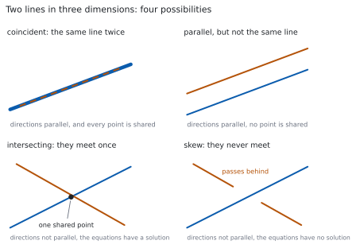
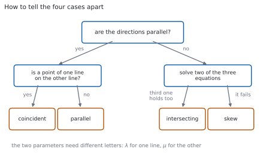

# HL 3.15 — Coincident, parallel, intersecting and skew lines（$2$ 直線の位置関係） {#sec-aahl-3-15}

::: {.callout-note}
## What you should be able to do
- $2$ 直線が**一致**（coincident）・**平行**（parallel）・**交わる**（intersecting）・**ねじれの位置**（skew）のどれかを判定できる。
- 方向ベクトルが平行かどうかを、先に調べられる。
- 平行なとき、一致か別の直線かを、点 $1$ つで見分けられる。
- 平行でないとき、連立方程式を解いて**交点**を求められる。
- $3$ 本目の式が合わないとき、**ねじれの位置**だと結論できる。
- $2$ 本の媒介変数に、ちがう文字を使える。
:::

## The idea

### 1. Four possibilities（$4$ つの場合） {#four-cases}

シラバスは、この項目をこう書いています。

> Coincident, parallel, intersecting and skew lines, distinguishing between these cases.
>
> Points of intersection.

$3$ 次元では、$2$ 直線の関係は **$4$ 通り**しかありません。

{#fig-aahl315-idea-a width=100%}

| 場合 | 方向 | 共有する点 |
|---|---|---|
| coincident（一致） | 平行 | すべて |
| parallel（平行） | 平行 | なし |
| intersecting（交わる） | 平行でない | $1$ つ |
| skew（ねじれの位置） | 平行でない | なし |

: $2$ 直線の $4$ つの場合 {#tbl-aahl315-cases}

**上の $2$ つと下の $2$ つは、方向を見るだけで分かれます。** ですから、判定はいつも**方向から**始めます。

### 2. Skew lines（ねじれの位置） {#skew}

シラバスは、**ねじれの位置**をこう定義しています。

> Skew lines are non-parallel lines that do not intersect in three-dimensional space.

つまり、**平行でもなく、交わりもしない** $2$ 直線のことです。

::: {.callout-important}
## $2$ 次元には、ねじれの位置がありません
平面の上では、平行でない $2$ 直線はかならず交わります。

**ねじれの位置は、$3$ 次元になって初めて現れる場合**です（[第 3 節](#why-skew-3d)）。立体交差する $2$ 本の道路を思いうかべてください。上と下を通っていて、ぶつかりません。
:::

### 3. Two parameters, two letters（媒介変数は $2$ 文字） {#two-letters}

$2$ 直線を

$$
l_{1}: \ \mathbf{r} = \mathbf{a}_{1}+\lambda\mathbf{b}_{1}, \qquad
l_{2}: \ \mathbf{r} = \mathbf{a}_{2}+\mu\mathbf{b}_{2}
$$ {#eq-aahl315-pair}

と書きます。**$\lambda$ と $\mu$ は、ちがう文字にします。**

$2$ 直線の上を動く点は、たがいに関係なく動きます。**同じ文字にすると「同時刻に同じ進み方をする点」だけを見ることになり**、本当の交点を見落とします（[第 4 節](#why-two-letters)）。

### 4. Parallel or not（方向を見る） {#parallel-test}

方向が平行かどうかは、**スカラー倍になっているか**で決めます（[HL 3.12](aahl-3-12.qmd#parallel)）。

$$
\mathbf{b}_{2} = k\,\mathbf{b}_{1} \quad (k \neq 0) \quad \Longleftrightarrow \quad
l_{1} \ \text{と} \ l_{2} \ \text{は平行}
$$ {#eq-aahl315-parallel}

成分の**比がすべて等しい**かを見れば十分です。$1$ つでもちがえば、平行ではありません。

### 5. Coincident or just parallel（一致か、平行か） {#coincident-test}

方向が平行だと分かったら、次に**点を $1$ つ**だけ調べます。

$$
\mathbf{a}_{2} \ \text{が} \ l_{1} \ \text{の上にある} \quad \Longleftrightarrow \quad
l_{1} \ \text{と} \ l_{2} \ \text{は一致}
$$ {#eq-aahl315-coincident}

「$\mathbf{a}_{2}$ が $l_{1}$ の上にある」は、$\mathbf{a}_{1}+\lambda\mathbf{b}_{1} = \mathbf{a}_{2}$ を満たす $\lambda$ があるかどうかです。**$3$ 成分すべてで同じ $\lambda$**が出なければなりません（[HL 3.14](aahl-3-14.qmd#kinematics)）。

**点は $1$ つで足ります。** 平行な直線が $1$ 点を共有したら、それはもう同じ直線だからです（[第 5 節](#why-one-point)）。

### 6. Intersecting or skew（交わるか、ねじれか） {#intersect-test}

方向が平行でないときは、$2$ 本の式を等しいと置きます。

$$
\mathbf{a}_{1}+\lambda\mathbf{b}_{1} = \mathbf{a}_{2}+\mu\mathbf{b}_{2}
$$ {#eq-aahl315-meet}

成分に分けると、**未知数 $2$ つ（$\lambda$、$\mu$）に対して式が $3$ 本**です。手順はこうです。

1. $2$ 本を選んで、$\lambda$ と $\mu$ を求める。
2. その値を、**残りの $1$ 本**に入れる。
3. 合えば**交わる**。合わなければ**ねじれの位置**。

$3$ 本目を確かめるところが要です。**これを飛ばすと、ねじれの位置を「交わる」と答えてしまいます。**

{#fig-aahl315-idea-b width=100%}

### 7. The point of intersection（交点） {#point}

交わると分かったら、**求めた $\lambda$ を $l_{1}$ の式に**入れます。位置ベクトルが出ます。

$$
\mathbf{p} = \mathbf{a}_{1}+\lambda\mathbf{b}_{1}
$$ {#eq-aahl315-point}

**$\mu$ を $l_{2}$ に入れても、同じ点**になります。これが $3$ 本目の確認そのものなので、**検算として必ず両方で出してください**。

交わる $2$ 直線のなす角は、[HL 3.14](aahl-3-14.qmd#angle) のとおり方向ベクトルから出します。

::: {.callout-tip collapse="true"}
## Paper 2 では、電卓で連立方程式として解けます

TI-Nspire CX II で、$\lambda$ と $\mu$ の連立 $1$ 次方程式として解けます。

1. **menu → 3: Algebra → 7: Solve System of Equations → 1: Solve System of Equations**
2. **Number of equations** に $3$、**Variables** に `l, m` と入れます（$\lambda$、$\mu$ の代わりです）。
3. $3$ 本の成分の式を入れます。

$3$ 本とも満たす解があれば**交わり**、`No solution` が返れば**ねじれの位置**です。

**Paper 1 では使えません。** $2$ 本で解いて $3$ 本目で確かめる、という手順を書いてください。
:::

## Why it works

::: {.callout-tip collapse="true"}
## クリックすると開きます

#### なぜ、媒介変数を $2$ 文字にするのか {#why-two-letters}

$\lambda$ は「$l_{1}$ の上のどこか」、$\mu$ は「$l_{2}$ の上のどこか」を表します。**この $2$ つは、別々に選べます**。

同じ文字にしてしまうと、$\mathbf{a}_{1}+\lambda\mathbf{b}_{1} = \mathbf{a}_{2}+\lambda\mathbf{b}_{2}$ という別の問題になります。これは「**同じ $\lambda$ のときに同じ位置にいるか**」を聞いていて、交点があるかどうかとはちがいます。

$2$ 台の車が同じ交差点を通っても、**通る時刻がちがえばぶつかりません**。交点を探すときは、時刻を合わせる必要がないのです。

#### なぜ、点を $1$ つ調べれば足りるのか {#why-one-point}

方向が平行な $2$ 直線が、点 $P$ を共有したとします。

$l_{1}$ は「$P$ を通り $\mathbf{b}_{1}$ の向き」、$l_{2}$ は「$P$ を通り $\mathbf{b}_{2}$ の向き」です。$\mathbf{b}_{2} = k\mathbf{b}_{1}$ なので、**向きは同じ**です。

**$1$ 点と向きが決まれば、直線は $1$ つに決まります**（[HL 3.14](aahl-3-14.qmd#vector-equation)）。ですから $l_{1}$ と $l_{2}$ は同じ直線です。

#### なぜ、ねじれの位置は $3$ 次元だけなのか {#why-skew-3d}

$2$ 次元では、直線の式は $\lambda$ と $\mu$ の $2$ 本だけです。**未知数 $2$ つに式 $2$ 本**なので、方向が平行でなければかならず解けます。

$3$ 次元では式が $3$ 本に増えます。**未知数 $2$ つに式 $3$ 本**なので、解が $1$ つもないことが起こります。これがねじれの位置です。

**式のほうが多い連立方程式**（overdetermined）は、ふつうは解をもちません。$3$ 次元で $2$ 直線が交わるほうが、むしろ特別な場合なのです。

#### なぜ、$3$ 本目を確かめないといけないのか {#why-third}

$2$ 本の式から出した $\lambda$、$\mu$ は、**その $2$ 成分が合う**ことしか保証しません。

たとえば $x$ と $y$ で合わせても、$z$ が合わなければ、$2$ 直線は「真上から見ると交わっているが、高さがちがう」という状態です。

@fig-aahl315-idea-a の右下が、まさにその絵です。**影は交わっているのに、本体は交わっていません。**
:::

## Worked examples

::: {.callout-note appearance="simple"}
問題文は英語です。意味が理解できなかったら、問題文の下の「**日本語訳**」を開いてください。解説は日本語です。

**例題も演習も、すべて電卓なしで解けます。** Paper 1 のつもりで解いてください。
:::

::: {#exm-aahl315-parallel}
[Show that the lines]{.q-en}

$$
l_{1}: \ \mathbf{r} = \begin{pmatrix} 1 \\ 2 \\ 3 \end{pmatrix}+\lambda\begin{pmatrix} 2 \\ -1 \\ 4 \end{pmatrix},
\qquad
l_{2}: \ \mathbf{r} = \begin{pmatrix} 0 \\ 0 \\ 0 \end{pmatrix}+\mu\begin{pmatrix} 4 \\ -2 \\ 8 \end{pmatrix}
$$

[are parallel but not coincident.]{.q-en}

日本語訳

上の $2$ 直線が平行であるが一致はしないことを示しなさい。

---

**まず方向です**（[第 4 節](#parallel-test)）。

$$
\begin{pmatrix} 4 \\ -2 \\ 8 \end{pmatrix} = 2\begin{pmatrix} 2 \\ -1 \\ 4 \end{pmatrix}
$$

スカラー倍なので、平行です。

**次に、$l_{2}$ の点 $(0,\ 0,\ 0)$ が $l_{1}$ の上にあるか**を見ます（[第 5 節](#coincident-test)）。

$$
1+2\lambda = 0 \ \Rightarrow \ \lambda = -\frac{1}{2}, \qquad
2-\lambda = 2+\frac{1}{2} = \frac{5}{2} \neq 0
$$

$y$ が合いません。原点は $l_{1}$ の上にないので、**一致ではありません**。

**検算。** **$z$ でも見ます。** $\lambda = -\dfrac{1}{2}$ のとき $3+4\left(-\dfrac{1}{2}\right) = 1 \neq 0$ ✓ $2$ 成分で合いません。

**検算（方向の比）。** $\dfrac{4}{2} = \dfrac{-2}{-1} = \dfrac{8}{4} = 2$ ✓ $3$ つとも $2$ なので、たしかに平行です。

::: {.callout-note}
## 解答例（答案用紙に書くこと）

$\begin{pmatrix} 4 \\ -2 \\ 8 \end{pmatrix} = 2\begin{pmatrix} 2 \\ -1 \\ 4 \end{pmatrix}$, *so the direction vectors are parallel.*

*If* $(0,\ 0,\ 0)$ *were on* $l_{1}$, *then* $1+2\lambda = 0$ *gives* $\lambda = -\dfrac{1}{2}$, *but then* $y = \dfrac{5}{2} \neq 0$.

*So the lines are parallel and distinct, not coincident.*
:::
:::

::: {#exm-aahl315-intersect}
[Find the point of intersection of]{.q-en}

$$
l_{1}: \ \mathbf{r} = \begin{pmatrix} 1 \\ 0 \\ 1 \end{pmatrix}+\lambda\begin{pmatrix} 1 \\ 1 \\ 0 \end{pmatrix},
\qquad
l_{2}: \ \mathbf{r} = \begin{pmatrix} 4 \\ 3 \\ 3 \end{pmatrix}+\mu\begin{pmatrix} 1 \\ 1 \\ 1 \end{pmatrix}
$$

日本語訳

上の $2$ 直線の交点を求めなさい。

---

**方向は平行ではありません。** $\begin{pmatrix} 1 \\ 1 \\ 0 \end{pmatrix}$ の第 $3$ 成分が $0$、$\begin{pmatrix} 1 \\ 1 \\ 1 \end{pmatrix}$ は $1$ なので、スカラー倍になりません。

@eq-aahl315-meet を成分に分けます。

$$
1+\lambda = 4+\mu, \qquad
\lambda = 3+\mu, \qquad
1 = 3+\mu
$$

**$3$ 本目には $\lambda$ が入っていません。** $\mu = -2$ が出ます。$2$ 本目に入れると $\lambda = 1$ です。

**$1$ 本目で確かめます。** 左辺 $1+1 = 2$、右辺 $4-2 = 2$ ✓ 合いました。

交点は、$\lambda = 1$ を $l_{1}$ に入れて（@eq-aahl315-point）

$$
\begin{pmatrix} 1 \\ 0 \\ 1 \end{pmatrix}+1\begin{pmatrix} 1 \\ 1 \\ 0 \end{pmatrix}
= \begin{pmatrix} 2 \\ 1 \\ 1 \end{pmatrix}
$$

**検算。** **$l_{2}$ のほうでも出します。** $\mu = -2$ で $\begin{pmatrix} 4-2 \\ 3-2 \\ 3-2 \end{pmatrix} = \begin{pmatrix} 2 \\ 1 \\ 1 \end{pmatrix}$ ✓ **同じ点です。**

**検算（式の本数）。** 未知数 $2$ つに式 $3$ 本で、$3$ 本とも満たされました ✓ ねじれの位置ではありません。

::: {.callout-note}
## 解答例（答案用紙に書くこと）

*The direction vectors are not parallel.* *Equating components:*

$$1+\lambda = 4+\mu, \qquad \lambda = 3+\mu, \qquad 1 = 3+\mu$$

*The third equation gives* $\mu = -2$, *and the second then gives* $\lambda = 1$.

*Check in the first:* $1+1 = 2 = 4-2$ ✓

$$\mathbf{p} = \begin{pmatrix} 1 \\ 0 \\ 1 \end{pmatrix}+\begin{pmatrix} 1 \\ 1 \\ 0 \end{pmatrix}
= \begin{pmatrix} 2 \\ 1 \\ 1 \end{pmatrix}$$
:::
:::

::: {#exm-aahl315-skew}
[Show that the lines]{.q-en}

$$
l_{1}: \ \mathbf{r} = \begin{pmatrix} 1 \\ 2 \\ 3 \end{pmatrix}+\lambda\begin{pmatrix} 1 \\ 1 \\ 0 \end{pmatrix},
\qquad
l_{2}: \ \mathbf{r} = \begin{pmatrix} 2 \\ 0 \\ 1 \end{pmatrix}+\mu\begin{pmatrix} 0 \\ 1 \\ 1 \end{pmatrix}
$$

[are skew.]{.q-en}

日本語訳

上の $2$ 直線がねじれの位置にあることを示しなさい。

---

**$2$ つ示すことがあります。** 平行でないこと、そして交わらないことです（[第 2 節](#skew)）。

$\begin{pmatrix} 1 \\ 1 \\ 0 \end{pmatrix}$ の第 $1$ 成分は $1$、$\begin{pmatrix} 0 \\ 1 \\ 1 \end{pmatrix}$ は $0$ です。**$0$ でない数を $0$ にするスカラーはありません**から、平行ではありません。

成分を等しいと置きます。

$$
1+\lambda = 2, \qquad
2+\lambda = \mu, \qquad
3 = 1+\mu
$$

$1$ 本目から $\lambda = 1$、$3$ 本目から $\mu = 2$ です。

**$2$ 本目に入れます。** 左辺 $2+1 = 3$、右辺 $\mu = 2$。**$3 \neq 2$ なので、合いません。**

平行でなく、交わりもしないので、**ねじれの位置**です。

**検算。** **$\mu = 3$ なら $2$ 本目は合います。** しかし $3$ 本目が $3 = 4$ となって合いません ✓ どちらを選んでも、残りがくずれます。

**検算（平行でないこと）。** 比を見ると $\dfrac{0}{1} = 0$、$\dfrac{1}{1} = 1$ で一致しません ✓

::: {.callout-note}
## 解答例（答案用紙に書くこと）

*The direction vectors are not parallel, since no scalar multiple of* $\begin{pmatrix} 1 \\ 1 \\ 0 \end{pmatrix}$ *has first component* $0$ *and third component* $1$.

*Equating components:* $1+\lambda = 2$, $\ 2+\lambda = \mu$, $\ 3 = 1+\mu$.

*The first gives* $\lambda = 1$ *and the third gives* $\mu = 2$, *but the second then reads* $3 = 2$, *which is false.*

*The lines are not parallel and do not intersect, so they are skew.*
:::
:::

::: {#exm-aahl315-classify}
[Determine the relationship between the lines]{.q-en}

$$
l_{1}: \ \mathbf{r} = \begin{pmatrix} 2 \\ -1 \\ 4 \end{pmatrix}+\lambda\begin{pmatrix} 1 \\ 3 \\ -2 \end{pmatrix},
\qquad
l_{2}: \ \mathbf{r} = \begin{pmatrix} 4 \\ 5 \\ 0 \end{pmatrix}+\mu\begin{pmatrix} -2 \\ -6 \\ 4 \end{pmatrix}
$$

日本語訳

上の $2$ 直線の位置関係を答えなさい。

---

**方向から始めます**（@fig-aahl315-idea-b）。

$$
\begin{pmatrix} -2 \\ -6 \\ 4 \end{pmatrix} = -2\begin{pmatrix} 1 \\ 3 \\ -2 \end{pmatrix}
$$

スカラー倍なので、平行です。**向きは逆ですが、それでも平行です。**

**$(4,\ 5,\ 0)$ が $l_{1}$ の上にあるか**を見ます。

$$
2+\lambda = 4 \ \Rightarrow \ \lambda = 2
$$

$$
-1+3(2) = 5 \ \checkmark, \qquad 4-2(2) = 0 \ \checkmark
$$

$3$ 成分とも $\lambda = 2$ で合いました。ですから **$2$ 直線は一致**しています。

**検算。** **$l_{1}$ の点 $(2,\ -1,\ 4)$ が $l_{2}$ の上にあるか**も見ます。$4-2\mu = 2$ から $\mu = 1$、$5-6 = -1$ ✓、$0+4 = 4$ ✓

**検算（逆向きでよいか）。** $k = -2$ は $0$ ではないので、@eq-aahl315-parallel を満たします ✓ 平行の判定に符号は関係しません。

::: {.callout-note}
## 解答例（答案用紙に書くこと）

$\begin{pmatrix} -2 \\ -6 \\ 4 \end{pmatrix} = -2\begin{pmatrix} 1 \\ 3 \\ -2 \end{pmatrix}$, *so the lines are parallel.*

*Putting* $\lambda = 2$ *in* $l_{1}$ *gives* $\begin{pmatrix} 4 \\ 5 \\ 0 \end{pmatrix}$, *a point of* $l_{2}$.

*Parallel lines with a common point are the same line, so* $l_{1}$ *and* $l_{2}$ *are coincident.*
:::

::: {.model-answer}
**試験ではこう書く**

*First compare the directions. Since* $\begin{pmatrix} -2 \\ -6 \\ 4 \end{pmatrix} = -2\begin{pmatrix} 1 \\ 3 \\ -2 \end{pmatrix}$, *the second direction vector is a non-zero scalar multiple of the first, so the two lines are parallel. The multiplier is negative, which only means the two equations run along the line in opposite senses; it does not affect whether they are parallel.*

*Parallel lines are either coincident or completely disjoint, so it is enough to test one point. Take the point of* $l_{2}$ *with position vector* $\begin{pmatrix} 4 \\ 5 \\ 0 \end{pmatrix}$ *and ask whether it lies on* $l_{1}$. *The first component gives* $2+\lambda = 4$, *so* $\lambda = 2$. *Substituting this value into the other two components gives* $-1+3(2) = 5$ *and* $4-2(2) = 0$, *which both agree.*

*So a single value of* $\lambda$ *reproduces all three coordinates, the point lies on* $l_{1}$, *and the two lines are coincident: they are two different equations for the same line.*
:::
:::

## Common errors

::: {.callout-warning}
## $2$ 直線に同じ文字の媒介変数を使う
$l_{1}$ に $\lambda$、$l_{2}$ に $\mu$ を使います（[第 3 節](#two-letters)）。

同じ文字にすると、**交わっているのに「交わらない」**と答えてしまいます。$2$ 点が同時刻に同じ場所にいるか、という別の問題になるからです。
:::

::: {.callout-warning}
## $2$ 本の式だけで「交わる」と結論する
未知数は $2$ つ、式は $3$ 本です。**$3$ 本目を確かめて初めて**交わると言えます（[第 6 節](#intersect-test)）。

確かめを飛ばすと、ねじれの位置を「交わる」と答えます。**$3$ 次元では、こちらのほうが起こりやすい**まちがいです。
:::

::: {.callout-warning}
## 平行だと分かった時点で「平行」と答える
平行には、**一致**と**別の直線**の $2$ 通りがあります（@tbl-aahl315-cases）。

点を $1$ つ調べるところまでが、判定です。**「parallel」とだけ書くと、点数をもらえないことがあります。**
:::

::: {.callout-warning}
## 向きが逆だから平行ではない、と考える
@eq-aahl315-parallel の $k$ は、**負でもかまいません**。

$\mathbf{b}_{2} = -2\mathbf{b}_{1}$ は平行です。$k \neq 0$ だけが条件です。
:::

::: {.callout-warning}
## ねじれの位置を、$2$ 次元でも起こると考える
平面の上では、平行でない $2$ 直線はかならず交わります（[第 3 節](#why-skew-3d)）。

**ねじれの位置は $3$ 次元だけの場合**です。$2$ 次元の問題で「skew」と答えてはいけません。
:::

::: {.callout-warning}
## 交点を $\lambda$ の値のまま答える
問われているのは**点**です。$\lambda = 1$ と書いただけでは答えになりません。

**式に入れて、座標にしてください**（@eq-aahl315-point）。$l_{2}$ と $\mu$ でも出して、同じ点になることを見れば検算にもなります。
:::

## Exercises

::: {.callout-note appearance="simple"}
各問題に、折りたたみが $3$ つ付いています。**日本語訳**、**解答例**（答案用紙に書くべきこと。英語です）、**解説**（なぜそうなるか。日本語です）。

まず自分で解いて、次に解答例と見くらべてください。**解説は、合わなかったときだけ開けば十分です。**
:::

::: {.exercise-block}

[1]{.ex-no} [Determine whether the lines with direction vectors $\begin{pmatrix} 1 \\ -2 \\ 3 \end{pmatrix}$ and $\begin{pmatrix} -2 \\ 4 \\ -6 \end{pmatrix}$ are parallel.]{.q-en}

日本語訳

方向ベクトルが $\begin{pmatrix} 1 \\ -2 \\ 3 \end{pmatrix}$、$\begin{pmatrix} -2 \\ 4 \\ -6 \end{pmatrix}$ である $2$ 直線が平行かどうかを調べなさい。

::: {.callout-note collapse="true"}
## 解答例（答案用紙に書くこと）

$$\begin{pmatrix} -2 \\ 4 \\ -6 \end{pmatrix} = -2\begin{pmatrix} 1 \\ -2 \\ 3 \end{pmatrix}$$

*The second is a non-zero scalar multiple of the first, so the lines are parallel.*
:::

::: {.callout-tip collapse="true"}
## 解説

**比がすべて等しいか**を見ます（@eq-aahl315-parallel）。$\dfrac{-2}{1} = \dfrac{4}{-2} = \dfrac{-6}{3} = -2$ です。

$k$ が負でもかまいません。**向きが逆なだけ**です。

**検算。** $-2$ をかけて、$3$ 成分とも合うことを確かめました ✓

**検算（平行でない例）。** $\begin{pmatrix} -2 \\ 4 \\ -5 \end{pmatrix}$ なら、$3$ 番目の比だけ $-\dfrac{5}{3}$ になって合いません ✓
:::

::: {.ex-sep}
:::

[2]{.ex-no} [Determine the relationship between $l_{1}: \mathbf{r} = \begin{pmatrix} 1 \\ 1 \\ 1 \end{pmatrix}+\lambda\begin{pmatrix} 2 \\ 0 \\ 1 \end{pmatrix}$ and $l_{2}: \mathbf{r} = \begin{pmatrix} 3 \\ 1 \\ 2 \end{pmatrix}+\mu\begin{pmatrix} 4 \\ 0 \\ 2 \end{pmatrix}$.]{.q-en}

日本語訳

$l_{1}$ と $l_{2}$ の位置関係を答えなさい。

::: {.callout-note collapse="true"}
## 解答例（答案用紙に書くこと）

$\begin{pmatrix} 4 \\ 0 \\ 2 \end{pmatrix} = 2\begin{pmatrix} 2 \\ 0 \\ 1 \end{pmatrix}$, *so the lines are parallel.*

*Putting* $\lambda = 1$ *in* $l_{1}$ *gives* $\begin{pmatrix} 3 \\ 1 \\ 2 \end{pmatrix}$, *which is a point of* $l_{2}$.

*The lines are coincident.*
:::

::: {.callout-tip collapse="true"}
## 解説

**$2$ 段階です**（@fig-aahl315-idea-b）。方向が平行、そして点が共有されている、で一致です。

$y$ の成分が両方とも $0$ なので、$y = 1$ の平面の中の直線です。

**検算。** $\lambda = 1$ で $(1+2,\ 1,\ 1+1) = (3,\ 1,\ 2)$ ✓

**検算（逆から）。** $(1,\ 1,\ 1)$ が $l_{2}$ の上にあるかを見ると、$3+4\mu = 1$ から $\mu = -\dfrac{1}{2}$、$z$ は $2-1 = 1$ ✓
:::

::: {.ex-sep}
:::

[3]{.ex-no} [Determine the relationship between $l_{1}: \mathbf{r} = \begin{pmatrix} 0 \\ 1 \\ 2 \end{pmatrix}+\lambda\begin{pmatrix} 1 \\ 1 \\ 1 \end{pmatrix}$ and $l_{2}: \mathbf{r} = \begin{pmatrix} 1 \\ 0 \\ 0 \end{pmatrix}+\mu\begin{pmatrix} 1 \\ 1 \\ 1 \end{pmatrix}$.]{.q-en}

日本語訳

$l_{1}$ と $l_{2}$ の位置関係を答えなさい。

::: {.callout-note collapse="true"}
## 解答例（答案用紙に書くこと）

*The direction vectors are identical, so the lines are parallel.*

*If* $(1,\ 0,\ 0)$ *were on* $l_{1}$, *then* $\lambda = 1$ *from the first component, but that gives* $y = 2 \neq 0$.

*The lines are parallel and distinct.*
:::

::: {.callout-tip collapse="true"}
## 解説

方向が**まったく同じ**でも、一致とはかぎりません（[第 5 節](#coincident-test)）。点を調べるまでが判定です。

**「parallel」で止めずに、「distinct」まで書く**と確実です。

**検算。** $z$ でも見ます。$\lambda = 1$ のとき $z = 3 \neq 0$ ✓

**検算（$2$ 点の差）。** $\begin{pmatrix} 1 \\ -1 \\ -2 \end{pmatrix}$ は $\begin{pmatrix} 1 \\ 1 \\ 1 \end{pmatrix}$ のスカラー倍ではありません ✓ これも一致でないことを示します。
:::

::: {.ex-sep}
:::

[4]{.ex-no} [Find the point of intersection of $l_{1}: \mathbf{r} = \begin{pmatrix} 1 \\ -2 \\ -1 \end{pmatrix}+\lambda\begin{pmatrix} 1 \\ 2 \\ 1 \end{pmatrix}$ and $l_{2}: \mathbf{r} = \begin{pmatrix} 1 \\ 3 \\ 1 \end{pmatrix}+\mu\begin{pmatrix} 2 \\ -1 \\ 0 \end{pmatrix}$.]{.q-en}

日本語訳

$l_{1}$ と $l_{2}$ の交点を求めなさい。

::: {.callout-note collapse="true"}
## 解答例（答案用紙に書くこと）

*The* $z$-*components give* $-1+\lambda = 1$, *so* $\lambda = 2$.

*The* $x$-*components give* $1+2 = 1+2\mu$, *so* $\mu = 1$.

*Check the* $y$-*components:* $-2+2(2) = 2$ *and* $3-1 = 2$ ✓

$$\mathbf{p} = \begin{pmatrix} 1 \\ -2 \\ -1 \end{pmatrix}+2\begin{pmatrix} 1 \\ 2 \\ 1 \end{pmatrix}
= \begin{pmatrix} 3 \\ 2 \\ 1 \end{pmatrix}$$
:::

::: {.callout-tip collapse="true"}
## 解説

**いちばん簡単な式から解く**と楽です。ここでは $z$ の式に $\mu$ が入っていません（[第 6 節](#intersect-test)）。

残った $1$ 本で確かめるところまでが答案です。

**検算。** $l_{2}$ に $\mu = 1$ を入れると $(1+2,\ 3-1,\ 1) = (3,\ 2,\ 1)$ ✓ **同じ点です。**

**検算（平行でないこと）。** $\begin{pmatrix} 2 \\ -1 \\ 0 \end{pmatrix}$ は $\begin{pmatrix} 1 \\ 2 \\ 1 \end{pmatrix}$ のスカラー倍ではありません ✓
:::

::: {.ex-sep}
:::

[5]{.ex-no} [Show that $l_{1}: \mathbf{r} = \begin{pmatrix} 1 \\ 0 \\ 0 \end{pmatrix}+\lambda\begin{pmatrix} 1 \\ 1 \\ 0 \end{pmatrix}$ and $l_{2}: \mathbf{r} = \begin{pmatrix} 0 \\ 0 \\ 1 \end{pmatrix}+\mu\begin{pmatrix} 1 \\ -1 \\ 0 \end{pmatrix}$ are skew.]{.q-en}

日本語訳

$l_{1}$ と $l_{2}$ がねじれの位置にあることを示しなさい。

::: {.callout-note collapse="true"}
## 解答例（答案用紙に書くこと）

$\begin{pmatrix} 1 \\ -1 \\ 0 \end{pmatrix}$ *is not a scalar multiple of* $\begin{pmatrix} 1 \\ 1 \\ 0 \end{pmatrix}$, *so the lines are not parallel.*

*The* $z$-*components give* $0 = 1$, *which is impossible, so there is no point of intersection.*

*The lines are skew.*
:::

::: {.callout-tip collapse="true"}
## 解説

**$z$ の式だけで決まります。** $l_{1}$ は $z = 0$ の平面の中、$l_{2}$ は $z = 1$ の平面の中にあり、高さがちがいます。

**上から見ると交わっています**（$x$、$y$ の $2$ 本には解があります）。@fig-aahl315-idea-a の右下と同じ状況です。

**検算（真上から）。** $1+\lambda = \mu$ と $\lambda = -\mu$ を解くと $\lambda = -\dfrac{1}{2}$、$\mu = \dfrac{1}{2}$ ✓ 影は交わります。

**検算（高さ）。** その $\lambda$、$\mu$ でも $z$ は $0$ と $1$ のままです ✓ 本体は交わりません。
:::

::: {.ex-sep}
:::

[6]{.ex-no} [Determine the relationship between $l_{1}: \mathbf{r} = \begin{pmatrix} 2 \\ 1 \\ 3 \end{pmatrix}+\lambda\begin{pmatrix} 1 \\ -1 \\ 2 \end{pmatrix}$ and $l_{2}: \mathbf{r} = \begin{pmatrix} 5 \\ -2 \\ 9 \end{pmatrix}+\mu\begin{pmatrix} 2 \\ -2 \\ 4 \end{pmatrix}$.]{.q-en}

日本語訳

$l_{1}$ と $l_{2}$ の位置関係を答えなさい。

::: {.callout-note collapse="true"}
## 解答例（答案用紙に書くこと）

$\begin{pmatrix} 2 \\ -2 \\ 4 \end{pmatrix} = 2\begin{pmatrix} 1 \\ -1 \\ 2 \end{pmatrix}$, *so the lines are parallel.*

*Putting* $\lambda = 3$ *in* $l_{1}$ *gives* $\begin{pmatrix} 5 \\ -2 \\ 9 \end{pmatrix}$, *a point of* $l_{2}$.

*The lines are coincident.*
:::

::: {.callout-tip collapse="true"}
## 解説

$x$ から $2+\lambda = 5$、つまり $\lambda = 3$ です。**その $\lambda$ を残りの $2$ 成分に入れて**、合うかを見ます。

**検算。** $1-3 = -2$ ✓、$3+6 = 9$ ✓ $3$ 成分とも合いました。

**検算（比）。** $\dfrac{2}{1} = \dfrac{-2}{-1} = \dfrac{4}{2} = 2$ ✓ 方向も確かに平行です。
:::

::: {.ex-sep}
:::

[7]{.ex-no} [The lines $l_{1}: \mathbf{r} = \begin{pmatrix} 1 \\ 1 \\ 0 \end{pmatrix}+\lambda\begin{pmatrix} 1 \\ 0 \\ 1 \end{pmatrix}$ and $l_{2}: \mathbf{r} = \begin{pmatrix} 2 \\ 0 \\ 0 \end{pmatrix}+\mu\begin{pmatrix} 0 \\ 1 \\ 1 \end{pmatrix}$ intersect. Find the point of intersection and the angle between the lines.]{.q-en}

日本語訳

$l_{1}$ と $l_{2}$ は交わります。交点と、$2$ 直線のなす角を求めなさい。

::: {.callout-note collapse="true"}
## 解答例（答案用紙に書くこと）

*The* $x$-*components give* $1+\lambda = 2$, *so* $\lambda = 1$. *The* $y$-*components give* $1 = \mu$.

*Check the* $z$-*components:* $\lambda = 1$ *and* $\mu = 1$ ✓

$$\mathbf{p} = \begin{pmatrix} 2 \\ 1 \\ 1 \end{pmatrix}, \qquad
\cos\theta = \frac{\lvert 0+0+1 \rvert}{\sqrt{2}\,\sqrt{2}} = \frac{1}{2},
\qquad \theta = \frac{\pi}{3}$$
:::

::: {.callout-tip collapse="true"}
## 解説

交点は $\lambda$ を $l_{1}$ に入れて出します（@eq-aahl315-point）。角は**方向ベクトルだけ**から出します（[HL 3.14](aahl-3-14.qmd#angle)）。

**交点と角は、別々の計算**です。交点の座標は角には関係しません。

**検算（交点）。** $l_{2}$ に $\mu = 1$ を入れると $(2,\ 1,\ 1)$ ✓

**検算（角）。** 内積が正なので鋭角です ✓ $\dfrac{\pi}{3} < \dfrac{\pi}{2}$ で、絶対値を取っても変わりません。
:::

::: {.ex-sep}
:::

[8]{.ex-no} [The lines $l_{1}: \mathbf{r} = \begin{pmatrix} 1 \\ 2 \\ 3 \end{pmatrix}+\lambda\begin{pmatrix} 2 \\ 1 \\ -1 \end{pmatrix}$ and $l_{2}: \mathbf{r} = \begin{pmatrix} 0 \\ 0 \\ 0 \end{pmatrix}+\mu\begin{pmatrix} k \\ 2 \\ -2 \end{pmatrix}$ are parallel. Find $k$, and state whether the lines are coincident.]{.q-en}

日本語訳

$l_{1}$ と $l_{2}$ は平行です。$k$ を求め、$2$ 直線が一致するかどうかを述べなさい。

::: {.callout-note collapse="true"}
## 解答例（答案用紙に書くこと）

*For the directions to be parallel,* $\begin{pmatrix} k \\ 2 \\ -2 \end{pmatrix} = c\begin{pmatrix} 2 \\ 1 \\ -1 \end{pmatrix}$.

*The second component gives* $c = 2$, *and the third agrees.* *Hence* $k = 4$.

*If* $(0,\ 0,\ 0)$ *were on* $l_{1}$, *then* $1+2\lambda = 0$ *gives* $\lambda = -\dfrac{1}{2}$, *but then* $y = \dfrac{3}{2} \neq 0$.

*The lines are parallel and distinct, not coincident.*
:::

::: {.callout-tip collapse="true"}
## 解説

**$k$ を含まない成分から $c$ を決める**のがこつです。$y$ と $z$ に $k$ がないので、そこから $c = 2$ が出ます。

$c$ が決まれば $k = 2c = 4$ です。**$z$ でも $c = 2$ になることを確かめ**ておくと安心です。

**検算（$c$）。** $\dfrac{-2}{-1} = 2$ ✓ $y$ と同じ値です。

**検算（一致でないこと）。** $\lambda = -\dfrac{1}{2}$ のとき $z = 3+\dfrac{1}{2} = \dfrac{7}{2} \neq 0$ ✓ $y$ も $z$ も合いません。

::: {.model-answer}
**試験ではこう書く**

*If the lines are parallel then one direction vector is a scalar multiple of the other, so* $\begin{pmatrix} k \\ 2 \\ -2 \end{pmatrix} = c\begin{pmatrix} 2 \\ 1 \\ -1 \end{pmatrix}$ *for some non-zero* $c$. *The second components give* $2 = c$, *and the third components then read* $-2 = -2$, *which is consistent. The first components give* $k = 2c = 4$.

*Being parallel does not settle whether the lines are the same, so test a point. The line* $l_{2}$ *passes through the origin, so ask whether the origin lies on* $l_{1}$. *The first component requires* $1+2\lambda = 0$, *that is* $\lambda = -\dfrac{1}{2}$. *With this value the second component of* $l_{1}$ *is* $2-\dfrac{1}{2} = \dfrac{3}{2}$, *which is not* $0$.

*No single value of* $\lambda$ *gives the origin, so the origin is not on* $l_{1}$. *The lines are therefore parallel and distinct, not coincident.*
:::
:::

::: {.ex-sep}
:::

[9]{.ex-no} [Explain why two lines in three dimensions that are not parallel need not intersect, but two lines in two dimensions that are not parallel always do.]{.q-en}

日本語訳

$3$ 次元では平行でない $2$ 直線が交わるとはかぎらないのに、$2$ 次元では平行でなければかならず交わる理由を説明しなさい。

::: {.callout-note collapse="true"}
## 解答例（答案用紙に書くこと）

*Setting the two equations equal gives one equation for each coordinate, with two unknowns* $\lambda$ *and* $\mu$.

*In two dimensions there are two equations and two unknowns, and non-parallel directions make the system solvable.*

*In three dimensions there are three equations but still only two unknowns, so the third equation may fail. When it does, the lines are skew.*
:::

::: {.callout-tip collapse="true"}
## 解説

**式の本数と未知数の個数**の話です（[第 3 節](#why-skew-3d)）。

$2$ 次元は「式 $2$ 本、未知数 $2$ つ」でちょうど釣り合っています。$3$ 次元は「式 $3$ 本、未知数 $2$ つ」で、$1$ 本余ります。

**余った $1$ 本が合うかどうか**が、交わるかねじれるかの分かれ目です。

**検算（$2$ 次元の例）。** $(0,\ 0)+\lambda(1,\ 0)$ と $(0,\ 1)+\mu(0,\ 1)$ は $\lambda = 0$、$\mu = -1$ で交わります ✓

**検算（$3$ 次元の例）。** その $2$ 直線に $z$ をつけ、片方を $z = 1$ に上げると、交点は消えます ✓

::: {.model-answer}
**試験ではこう書く**

*To find a common point of two lines we set* $\mathbf{a}_{1}+\lambda\mathbf{b}_{1} = \mathbf{a}_{2}+\mu\mathbf{b}_{2}$ *and compare components. This produces one linear equation for each coordinate, while the unknowns are always just the two parameters* $\lambda$ *and* $\mu$.

*In two dimensions this gives two equations in two unknowns. If the direction vectors are not parallel the two equations are independent, so the system has exactly one solution and the lines meet at exactly one point.*

*In three dimensions the same comparison gives three equations in the same two unknowns. Two of them can be solved for* $\lambda$ *and* $\mu$, *but the third is an extra condition that those values may or may not satisfy. If it is satisfied the lines intersect; if it is not, no pair of parameter values places the two points together, and the lines are skew. The extra coordinate is exactly what allows one line to pass above the other without touching it.*
:::
:::

::: {.ex-sep}
:::

[10]{.ex-no} [A student writes: "For $l_{1}: \mathbf{r} = \mathbf{a}_{1}+\lambda\mathbf{b}_{1}$ and $l_{2}: \mathbf{r} = \mathbf{a}_{2}+\lambda\mathbf{b}_{2}$, solve $\mathbf{a}_{1}+\lambda\mathbf{b}_{1} = \mathbf{a}_{2}+\lambda\mathbf{b}_{2}$ to find the intersection." Identify the error and explain what goes wrong.]{.q-en}

日本語訳

ある生徒が「$l_{1}$、$l_{2}$ の交点は $\mathbf{a}_{1}+\lambda\mathbf{b}_{1} = \mathbf{a}_{2}+\lambda\mathbf{b}_{2}$ を解けばよい」と書きました。まちがいを指摘し、何がいけないのかを説明しなさい。

::: {.callout-note collapse="true"}
## 解答例（答案用紙に書くこと）

*The same letter* $\lambda$ *has been used for both lines, but the two parameters are independent.*

*The equation written down asks for a value of* $\lambda$ *that gives the same point on both lines at the same parameter value, which is a stronger condition than intersecting.*

*The correct equation uses two letters:* $\mathbf{a}_{1}+\lambda\mathbf{b}_{1} = \mathbf{a}_{2}+\mu\mathbf{b}_{2}$.
:::

::: {.callout-tip collapse="true"}
## 解説

**交点は「どこかで出会うか」**であって、「同じ $\lambda$ で出会うか」ではありません（[第 4 節](#why-two-letters)）。

生徒の式では、交わっている $2$ 直線を「交わらない」と判定してしまうことがあります。

**検算（具体例）。** $l_{1}: (0,\ 0,\ 0)+\lambda(1,\ 0,\ 0)$ と $l_{2}: (1,\ 1,\ 0)+\mu(0,\ 1,\ 0)$ は $(1,\ 0,\ 0)$ で交わります ✓

**検算（同じ文字にすると）。** $\lambda = 1$ と $1 = 0$ が同時に必要になり、解がありません ✓ 交わっているのに見落とします。

::: {.model-answer}
**試験ではこう書く**

*The error is using one letter for two independent parameters. In* $\mathbf{r} = \mathbf{a}_{1}+\lambda\mathbf{b}_{1}$ *the parameter locates a point on the first line, and in* $\mathbf{r} = \mathbf{a}_{2}+\mu\mathbf{b}_{2}$ *it locates a point on the second. Nothing ties the two choices together, so they must be allowed to differ.*

*Writing* $\mathbf{a}_{1}+\lambda\mathbf{b}_{1} = \mathbf{a}_{2}+\lambda\mathbf{b}_{2}$ *asks for a single value of the parameter that gives the same point on both lines. Read as motion, it asks whether two particles are at the same place at the same time, whereas intersecting only asks whether their paths cross at all.*

*The condition the student has written is stronger than intersection, so lines that genuinely meet can be declared not to meet. The correct equation is* $\mathbf{a}_{1}+\lambda\mathbf{b}_{1} = \mathbf{a}_{2}+\mu\mathbf{b}_{2}$, *giving three component equations in the two unknowns* $\lambda$ *and* $\mu$.
:::
:::

:::
