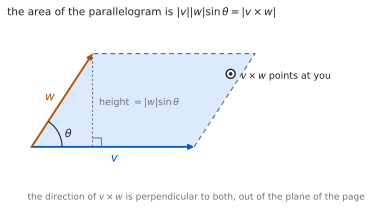
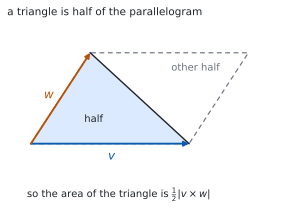

# HL 3.16 — The vector product（ベクトル積） {#sec-aahl-3-16}

::: {.callout-note}
## What you should be able to do
- **ベクトル積**（vector product、cross product）の定義を言える。
- 成分から $\mathbf{v}\times\mathbf{w}$ を計算できる。
- $\mathbf{v}\times\mathbf{w} = -\,\mathbf{w}\times\mathbf{v}$ など、性質を使える。
- $\mathbf{v}\times\mathbf{w} = \mathbf{0}$ が**平行**と同値であることを使える。
- $\lvert\mathbf{v}\times\mathbf{w}\rvert$ で**平行四辺形の面積**を求められる。
- その半分で、**三角形の面積**を求められる。
- 内積（スカラー）とベクトル積（ベクトル）を取りちがえない。
:::

## The idea

### 1. The vector product（ベクトル積） {#definition}

シラバスは、こう書いています。

> The definition of the vector product of two vectors.
>
> The vector product is also known as the "cross product".
>
> $v \times w = \lvert v \rvert \lvert w \rvert \sin\theta\, n$, where $\theta$ is the angle between $v$ and $w$, and $n$ is the unit normal vector whose direction is given by the right-hand screw rule.

$$
\mathbf{v}\times\mathbf{w} = \lvert\mathbf{v}\rvert\lvert\mathbf{w}\rvert\sin\theta\ \mathbf{n}
$$ {#eq-aahl316-definition}

**内積とちがって、答えはベクトルです**（[HL 3.13](aahl-3-13.qmd#definition)）。大きさが $\lvert\mathbf{v}\rvert\lvert\mathbf{w}\rvert\sin\theta$、向きが $\mathbf{n}$ です。

$\mathbf{n}$ は**両方に垂直な単位ベクトル**です。ですから $\mathbf{v}\times\mathbf{w}$ は、$\mathbf{v}$ にも $\mathbf{w}$ にも垂直です。

{#fig-aahl316-idea-a width=100%}

### 2. The right-hand screw rule（右ねじの規則） {#right-hand}

両方に垂直な向きは、**表と裏の $2$ つ**あります。どちらを取るかを決めるのが、**右ねじの規則**です。

右手の指を $\mathbf{v}$ から $\mathbf{w}$ へ回すように曲げると、**親指の向きが $\mathbf{v}\times\mathbf{w}$** です。

::: {.callout-important}
## 順番を変えると、向きが逆になります
$\mathbf{v}$ から $\mathbf{w}$ へ回すのと、$\mathbf{w}$ から $\mathbf{v}$ へ回すのでは、ねじの進む向きが逆です。

$$
\mathbf{w}\times\mathbf{v} = -\,\mathbf{v}\times\mathbf{w}
$$

**内積では順番を変えても同じ**でした。ベクトル積はちがいます（[第 4 節](#properties)）。
:::

### 3. Components（成分で出す） {#components}

公式集の **3.16** の欄にあります。

> Vector product

$$
\mathbf{v}\times\mathbf{w} = \begin{pmatrix}
v_{2}w_{3}-v_{3}w_{2} \\
v_{3}w_{1}-v_{1}w_{3} \\
v_{1}w_{2}-v_{2}w_{1}
\end{pmatrix}
$$ {#eq-aahl316-components}

$$
\lvert\mathbf{v}\times\mathbf{w}\rvert = \lvert\mathbf{v}\rvert\lvert\mathbf{w}\rvert\sin\theta
$$ {#eq-aahl316-magnitude}

**添字の並びに、きまりがあります。** 第 $1$ 成分は $2,3$、第 $2$ 成分は $3,1$、第 $3$ 成分は $1,2$ です。$1 \to 2 \to 3 \to 1$ と輪になっていると覚えてください。

**検算はいつも同じです。** 出てきたベクトルと $\mathbf{v}$、$\mathbf{w}$ の内積が、どちらも $0$ になるかを見ます。

### 4. Properties（性質） {#properties}

シラバスに挙がっている性質です。

> Properties of the vector product.
>
> $v \times w = - w \times v$;
>
> $u \times (v + w) = u \times v + u \times w$;
>
> $(kv) \times w = k(v \times w)$;
>
> $v \times v = 0$.

$1$ つ目を**反交換法則**（anticommutative）といいます。$4$ つ目は、$\theta = 0$ で $\sin\theta = 0$ になるからです。

**$\mathbf{v}\times\mathbf{v} = \mathbf{0}$ の $\mathbf{0}$ は、太字の零ベクトル**です。数の $0$ ではありません。

### 5. Parallel vectors（平行なベクトル） {#parallel}

> For non-zero vectors $v \times w = 0$ is equivalent to the vectors being parallel.

$$
\mathbf{v}\times\mathbf{w} = \mathbf{0} \quad \Longleftrightarrow \quad
\mathbf{v} \ \text{と} \ \mathbf{w} \ \text{は平行} \qquad (\mathbf{v},\ \mathbf{w} \neq \mathbf{0})
$$ {#eq-aahl316-parallel}

平行なら $\theta = 0$ か $\theta = \pi$ で、どちらも $\sin\theta = 0$ です。

**内積とちょうど逆の役目**です。内積が $0$ なら垂直、ベクトル積が $\mathbf{0}$ なら平行です（[HL 3.13](aahl-3-13.qmd#perpendicular)）。

### 6. The area of a parallelogram（平行四辺形の面積） {#parallelogram}

> Geometric interpretation of $\lvert v \times w \rvert$
>
> Use of $\lvert v \times w \rvert$ to find the area of a parallelogram (and hence a triangle).

公式集の **3.16** の欄に、こうあります。

> Area of a parallelogram

$$
A = \lvert\mathbf{v}\times\mathbf{w}\rvert
$$ {#eq-aahl316-area}

$\mathbf{v}$ と $\mathbf{w}$ は、平行四辺形の**となり合う $2$ 辺**です。

底辺が $\lvert\mathbf{v}\rvert$、高さが $\lvert\mathbf{w}\rvert\sin\theta$ なので、面積は $\lvert\mathbf{v}\rvert\lvert\mathbf{w}\rvert\sin\theta$ です（@fig-aahl316-idea-a）。これが @eq-aahl316-magnitude と同じ式です。

### 7. The area of a triangle（三角形の面積） {#triangle}

三角形 $ABC$ の面積は、平行四辺形のちょうど半分です。

$$
\text{Area of } \triangle ABC = \frac{1}{2}\left\lvert \overrightarrow{AB}\times\overrightarrow{AC} \right\rvert
$$ {#eq-aahl316-triangle}

{#fig-aahl316-idea-b width=100%}

**$2$ 本とも、同じ頂点から出します。** $\overrightarrow{AB}$ と $\overrightarrow{BC}$ を混ぜると、ちがう平行四辺形になってしまいます。

::: {.callout-tip collapse="true"}
## Paper 2 では、電卓でベクトル積が出せます

TI-Nspire CX II には `crossP(` があります。`crossP([1,2,3],[4,5,6])` のように使います。

面積は `norm(crossP(...))` で出ます。三角形なら、それを $2$ で割ります。

**答案には、式を書いてください。** @eq-aahl316-components や @eq-aahl316-area の形を書いてから値を入れます。`crossP(...)` と書いても点になりません。

**Paper 1 では使えません。** このページの例題と演習は、すべて手で解けるようにしてあります。
:::

## Why it works

::: {.callout-tip collapse="true"}
## クリックすると開きます

#### なぜ、大きさが平行四辺形の面積になるのか {#why-area}

平行四辺形の面積は「底辺 $\times$ 高さ」です。

底辺を $\lvert\mathbf{v}\rvert$ とすると、高さは $\mathbf{w}$ の**垂直方向の成分**です。$\mathbf{w}$ と底辺のなす角が $\theta$ なので、高さは $\lvert\mathbf{w}\rvert\sin\theta$ です。

$$
A = \lvert\mathbf{v}\rvert \times \lvert\mathbf{w}\rvert\sin\theta
= \lvert\mathbf{v}\times\mathbf{w}\rvert
$$

**内積が $\cos$、ベクトル積が $\sin$** です。内積は「影の長さ」、ベクトル積は「広がった面積」を測っています。

#### なぜ、成分の式があの形なのか {#why-components}

@eq-aahl316-components のベクトルが、$\mathbf{v}$ と $\mathbf{w}$ の両方に垂直であることは、内積を計算すれば分かります。

$$
\mathbf{v}\cdot(\mathbf{v}\times\mathbf{w})
= v_{1}(v_{2}w_{3}-v_{3}w_{2})+v_{2}(v_{3}w_{1}-v_{1}w_{3})+v_{3}(v_{1}w_{2}-v_{2}w_{1})
$$

展開すると、$6$ 個の項が**符号ちがいで打ち消し合って** $0$ になります。$\mathbf{w}$ についても同じです。

**これが、いちばん手早い検算**です。$2$ 回とも $0$ にならなければ、どこかで計算をまちがえています。

#### なぜ、順番を変えると符号が変わるのか {#why-anticommutative}

@eq-aahl316-components の各成分で、$\mathbf{v}$ と $\mathbf{w}$ を入れかえてみてください。

$$
w_{2}v_{3}-w_{3}v_{2} = -(v_{2}w_{3}-v_{3}w_{2})
$$

**引き算の順番が逆になる**ので、符号が変わります。$3$ 成分とも同じです。

定義のほうから見れば、右ねじを回す向きが逆になる、ということです（[第 2 節](#right-hand)）。

#### なぜ、$\mathbf{v}\times\mathbf{v} = \mathbf{0}$ なのか {#why-self}

$\mathbf{v}$ と $\mathbf{v}$ のなす角は $0$ です。$\sin 0 = 0$ なので、大きさが $0$ になります。

面積で考えると、**$2$ 辺が重なった平行四辺形はつぶれていて、面積が $0$** です。

$\mathbf{v}\times\mathbf{w} = -\,\mathbf{w}\times\mathbf{v}$ に $\mathbf{w} = \mathbf{v}$ を入れても、$\mathbf{v}\times\mathbf{v} = -\,\mathbf{v}\times\mathbf{v}$ から同じ結論になります。
:::

## Worked examples

::: {.callout-note appearance="simple"}
問題文は英語です。意味が理解できなかったら、問題文の下の「**日本語訳**」を開いてください。解説は日本語です。

**例題も演習も、すべて電卓なしで解けます。** Paper 1 のつもりで解いてください。
:::

::: {#exm-aahl316-components}
[Let $\mathbf{v} = \begin{pmatrix} 1 \\ 2 \\ 3 \end{pmatrix}$ and $\mathbf{w} = \begin{pmatrix} 4 \\ 5 \\ 6 \end{pmatrix}$. Find $\mathbf{v}\times\mathbf{w}$.]{.q-en}

日本語訳

$\mathbf{v} = \begin{pmatrix} 1 \\ 2 \\ 3 \end{pmatrix}$、$\mathbf{w} = \begin{pmatrix} 4 \\ 5 \\ 6 \end{pmatrix}$ とします。$\mathbf{v}\times\mathbf{w}$ を求めなさい。

---

@eq-aahl316-components にそのまま入れます。

$$
\mathbf{v}\times\mathbf{w} = \begin{pmatrix}
(2)(6)-(3)(5) \\
(3)(4)-(1)(6) \\
(1)(5)-(2)(4)
\end{pmatrix}
= \begin{pmatrix} 12-15 \\ 12-6 \\ 5-8 \end{pmatrix}
= \begin{pmatrix} -3 \\ 6 \\ -3 \end{pmatrix}
$$

**検算。** **$\mathbf{v}$ との内積を見ます。** $(1)(-3)+(2)(6)+(3)(-3) = -3+12-9 = 0$ ✓

**検算（$\mathbf{w}$ のほう）。** $(4)(-3)+(5)(6)+(6)(-3) = -12+30-18 = 0$ ✓ **両方に垂直です。**

::: {.callout-note}
## 解答例（答案用紙に書くこと）

$$\mathbf{v}\times\mathbf{w} = \begin{pmatrix}
(2)(6)-(3)(5) \\ (3)(4)-(1)(6) \\ (1)(5)-(2)(4)
\end{pmatrix}
= \begin{pmatrix} -3 \\ 6 \\ -3 \end{pmatrix}$$
:::
:::

::: {#exm-aahl316-parallel}
[Use the vector product to show that $\mathbf{a} = \begin{pmatrix} 2 \\ -1 \\ 3 \end{pmatrix}$ and $\mathbf{b} = \begin{pmatrix} -4 \\ 2 \\ -6 \end{pmatrix}$ are parallel.]{.q-en}

日本語訳

ベクトル積を使って、$\mathbf{a}$ と $\mathbf{b}$ が平行であることを示しなさい。

---

@eq-aahl316-parallel を使います。

$$
\mathbf{a}\times\mathbf{b} = \begin{pmatrix}
(-1)(-6)-(3)(2) \\
(3)(-4)-(2)(-6) \\
(2)(2)-(-1)(-4)
\end{pmatrix}
= \begin{pmatrix} 6-6 \\ -12+12 \\ 4-4 \end{pmatrix}
= \begin{pmatrix} 0 \\ 0 \\ 0 \end{pmatrix}
$$

どちらも零ベクトルではないので、**平行**です。

**検算。** **スカラー倍でも見えます。** $\mathbf{b} = -2\mathbf{a}$ ✓ たしかに平行です。

**検算（面積として）。** 平行な $2$ 辺では平行四辺形がつぶれ、面積が $0$ です ✓ $\lvert\mathbf{a}\times\mathbf{b}\rvert = 0$ と合います。

::: {.callout-note}
## 解答例（答案用紙に書くこと）

$$\mathbf{a}\times\mathbf{b} = \begin{pmatrix}
(-1)(-6)-(3)(2) \\ (3)(-4)-(2)(-6) \\ (2)(2)-(-1)(-4)
\end{pmatrix} = \begin{pmatrix} 0 \\ 0 \\ 0 \end{pmatrix}$$

*Both vectors are non-zero, so* $\mathbf{a}\times\mathbf{b} = \mathbf{0}$ *shows that they are parallel.*
:::
:::

::: {#exm-aahl316-area}
[Find the area of the parallelogram with adjacent sides $\begin{pmatrix} 1 \\ 0 \\ 1 \end{pmatrix}$ and $\begin{pmatrix} 0 \\ 2 \\ 1 \end{pmatrix}$.]{.q-en}

日本語訳

となり合う $2$ 辺が $\begin{pmatrix} 1 \\ 0 \\ 1 \end{pmatrix}$、$\begin{pmatrix} 0 \\ 2 \\ 1 \end{pmatrix}$ である平行四辺形の面積を求めなさい。

---

まずベクトル積です（@eq-aahl316-components）。

$$
\begin{pmatrix} 1 \\ 0 \\ 1 \end{pmatrix}\times\begin{pmatrix} 0 \\ 2 \\ 1 \end{pmatrix}
= \begin{pmatrix}
(0)(1)-(1)(2) \\
(1)(0)-(1)(1) \\
(1)(2)-(0)(0)
\end{pmatrix}
= \begin{pmatrix} -2 \\ -1 \\ 2 \end{pmatrix}
$$

面積は、その大きさです（@eq-aahl316-area）。

$$
A = \sqrt{(-2)^{2}+(-1)^{2}+2^{2}} = \sqrt{9} = 3
$$

**検算。** **両方との内積を見ます。** $-2+0+2 = 0$ ✓、$0-2+2 = 0$ ✓

**検算（$\sin\theta$ から）。** $\lvert\mathbf{v}\rvert = \sqrt{2}$、$\lvert\mathbf{w}\rvert = \sqrt{5}$、内積が $1$ なので $\cos\theta = \dfrac{1}{\sqrt{10}}$、$\sin\theta = \dfrac{3}{\sqrt{10}}$。積は $\sqrt{2}\sqrt{5}\cdot\dfrac{3}{\sqrt{10}} = 3$ ✓

::: {.callout-note}
## 解答例（答案用紙に書くこと）

$$\begin{pmatrix} 1 \\ 0 \\ 1 \end{pmatrix}\times\begin{pmatrix} 0 \\ 2 \\ 1 \end{pmatrix}
= \begin{pmatrix} -2 \\ -1 \\ 2 \end{pmatrix}$$

$$A = \left\lvert \begin{pmatrix} -2 \\ -1 \\ 2 \end{pmatrix} \right\rvert = \sqrt{4+1+4} = 3$$
:::
:::

::: {#exm-aahl316-triangle}
[The points $A$, $B$ and $C$ have coordinates $(1,\ 0,\ 0)$, $(2,\ 1,\ 1)$ and $(0,\ 2,\ 1)$. Find the area of triangle $ABC$.]{.q-en}

日本語訳

$A(1,\ 0,\ 0)$、$B(2,\ 1,\ 1)$、$C(0,\ 2,\ 1)$ とします。三角形 $ABC$ の面積を求めなさい。

---

**$A$ から出る $2$ 本**を作ります（[第 7 節](#triangle)）。

$$
\overrightarrow{AB} = \begin{pmatrix} 1 \\ 1 \\ 1 \end{pmatrix}, \qquad
\overrightarrow{AC} = \begin{pmatrix} -1 \\ 2 \\ 1 \end{pmatrix}
$$

$$
\overrightarrow{AB}\times\overrightarrow{AC} = \begin{pmatrix}
(1)(1)-(1)(2) \\
(1)(-1)-(1)(1) \\
(1)(2)-(1)(-1)
\end{pmatrix}
= \begin{pmatrix} -1 \\ -2 \\ 3 \end{pmatrix}
$$

@eq-aahl316-triangle から

$$
\text{Area} = \frac{1}{2}\sqrt{1+4+9} = \frac{\sqrt{14}}{2}
$$

**検算。** **両方との内積を見ます。** $-1-2+3 = 0$ ✓、$1-4+3 = 0$ ✓

**検算（$B$ から出しても同じか）。** $\overrightarrow{BA} = \begin{pmatrix} -1 \\ -1 \\ -1 \end{pmatrix}$、$\overrightarrow{BC} = \begin{pmatrix} -2 \\ 1 \\ 0 \end{pmatrix}$ のベクトル積は $\begin{pmatrix} 1 \\ 2 \\ -3 \end{pmatrix}$ で、大きさは同じ $\sqrt{14}$ ✓ **どの頂点から出しても面積は同じです。**

::: {.callout-note}
## 解答例（答案用紙に書くこと）

$$\overrightarrow{AB} = \begin{pmatrix} 1 \\ 1 \\ 1 \end{pmatrix}, \qquad
\overrightarrow{AC} = \begin{pmatrix} -1 \\ 2 \\ 1 \end{pmatrix}$$

$$\overrightarrow{AB}\times\overrightarrow{AC} = \begin{pmatrix} -1 \\ -2 \\ 3 \end{pmatrix}$$

$$\text{Area} = \frac{1}{2}\left\lvert \begin{pmatrix} -1 \\ -2 \\ 3 \end{pmatrix} \right\rvert
= \frac{\sqrt{14}}{2}$$
:::

::: {.model-answer}
**試験ではこう書く**

*Both vectors must start at the same vertex, so take* $\overrightarrow{AB} = \begin{pmatrix} 1 \\ 1 \\ 1 \end{pmatrix}$ *and* $\overrightarrow{AC} = \begin{pmatrix} -1 \\ 2 \\ 1 \end{pmatrix}$, *each found by subtracting the position vector of* $A$.

*The vector product is then* $\overrightarrow{AB}\times\overrightarrow{AC} = \begin{pmatrix} (1)(1)-(1)(2) \\ (1)(-1)-(1)(1) \\ (1)(2)-(1)(-1) \end{pmatrix} = \begin{pmatrix} -1 \\ -2 \\ 3 \end{pmatrix}$. *As a check, this vector has scalar product zero with both* $\overrightarrow{AB}$ *and* $\overrightarrow{AC}$, *as it must.*

*The magnitude of the vector product is the area of the parallelogram with these two vectors as adjacent sides, and the triangle is half of that parallelogram. Hence the area of triangle* $ABC$ *is* $\dfrac{1}{2}\sqrt{(-1)^{2}+(-2)^{2}+3^{2}} = \dfrac{\sqrt{14}}{2}$.
:::
:::

## Common errors

::: {.callout-warning}
## 答えを数で書く
ベクトル積の答えは**ベクトル**です（[第 1 節](#definition)）。

数を返すのは内積のほうです（[HL 3.13](aahl-3-13.qmd#definition)）。**$\times$ と $\cdot$ を、問題文でよく見てください。**
:::

::: {.callout-warning}
## 順番を入れかえても同じだと思う
$\mathbf{v}\times\mathbf{w} = -\,\mathbf{w}\times\mathbf{v}$ です（[第 4 節](#properties)）。

**向きが逆**になります。大きさは同じなので、面積を聞かれているときだけは、どちらでも答えが変わりません。
:::

::: {.callout-warning}
## 成分の式で、添字の順番をまちがえる
第 $2$ 成分は $v_{3}w_{1}-v_{1}w_{3}$ です（@eq-aahl316-components）。$v_{1}w_{3}-v_{3}w_{1}$ ではありません。

**$1 \to 2 \to 3 \to 1$ の輪**で覚え、出したら**内積 $0$ の検算**をしてください。
:::

::: {.callout-warning}
## 平行の判定に内積を使う
平行はベクトル積が $\mathbf{0}$、垂直は内積が $0$ です（[第 5 節](#parallel)）。

**逆に覚えると、いつも反対の答えが出ます。** $\sin$ と $\cos$ のどちらが $0$ になるかで思い出してください。
:::

::: {.callout-warning}
## 三角形で $\dfrac{1}{2}$ を忘れる
$\lvert\overrightarrow{AB}\times\overrightarrow{AC}\rvert$ は**平行四辺形**の面積です（@fig-aahl316-idea-b）。

三角形はその半分です。**答えがちょうど $2$ 倍になっている**ときは、まずここを疑ってください。
:::

::: {.callout-warning}
## 三角形で、ちがう頂点から出した $2$ 本を使う
$\overrightarrow{AB}$ と $\overrightarrow{BC}$ を組にしてはいけません（[第 7 節](#triangle)）。

**同じ頂点から出す**のがきまりです。$A$ からなら $\overrightarrow{AB}$ と $\overrightarrow{AC}$、$B$ からなら $\overrightarrow{BA}$ と $\overrightarrow{BC}$ です。
:::

## Exercises

::: {.callout-note appearance="simple"}
各問題に、折りたたみが $3$ つ付いています。**日本語訳**、**解答例**（答案用紙に書くべきこと。英語です）、**解説**（なぜそうなるか。日本語です）。

まず自分で解いて、次に解答例と見くらべてください。**解説は、合わなかったときだけ開けば十分です。**
:::

::: {.exercise-block}

[1]{.ex-no} [Let $\mathbf{v} = \begin{pmatrix} 1 \\ -1 \\ 2 \end{pmatrix}$ and $\mathbf{w} = \begin{pmatrix} 3 \\ 0 \\ 1 \end{pmatrix}$. Find $\mathbf{v}\times\mathbf{w}$.]{.q-en}

日本語訳

$\mathbf{v} = \begin{pmatrix} 1 \\ -1 \\ 2 \end{pmatrix}$、$\mathbf{w} = \begin{pmatrix} 3 \\ 0 \\ 1 \end{pmatrix}$ とします。$\mathbf{v}\times\mathbf{w}$ を求めなさい。

::: {.callout-note collapse="true"}
## 解答例（答案用紙に書くこと）

$$\mathbf{v}\times\mathbf{w} = \begin{pmatrix}
(-1)(1)-(2)(0) \\ (2)(3)-(1)(1) \\ (1)(0)-(-1)(3)
\end{pmatrix}
= \begin{pmatrix} -1 \\ 5 \\ 3 \end{pmatrix}$$
:::

::: {.callout-tip collapse="true"}
## 解説

@eq-aahl316-components に入れるだけです。**符号をていねいに。**

**検算。** $\mathbf{v}$ との内積は $-1-5+6 = 0$ ✓

**検算（$\mathbf{w}$ のほう）。** $-3+0+3 = 0$ ✓ 両方に垂直です。
:::

::: {.ex-sep}
:::

[2]{.ex-no} [Find $\mathbf{u}\times\mathbf{u}$ for $\mathbf{u} = \begin{pmatrix} 2 \\ 3 \\ -1 \end{pmatrix}$, and explain the result geometrically.]{.q-en}

日本語訳

$\mathbf{u} = \begin{pmatrix} 2 \\ 3 \\ -1 \end{pmatrix}$ について $\mathbf{u}\times\mathbf{u}$ を求め、その結果を図形の言葉で説明しなさい。

::: {.callout-note collapse="true"}
## 解答例（答案用紙に書くこと）

$$\mathbf{u}\times\mathbf{u} = \begin{pmatrix}
(3)(-1)-(-1)(3) \\ (-1)(2)-(2)(-1) \\ (2)(3)-(3)(2)
\end{pmatrix}
= \begin{pmatrix} 0 \\ 0 \\ 0 \end{pmatrix}$$

*The angle between* $\mathbf{u}$ *and itself is* $0$, *so the parallelogram collapses and its area is* $0$.
:::

::: {.callout-tip collapse="true"}
## 解説

どの成分も「同じ積の引き算」になるので、$\mathbf{0}$ です（[第 4 節](#properties)）。

**面積で考えると分かりやすい**です。$2$ 辺が重なった平行四辺形は、つぶれています。

**検算（定義から）。** $\sin 0 = 0$ なので、@eq-aahl316-definition の大きさが $0$ ✓

**検算（反交換法則から）。** $\mathbf{u}\times\mathbf{u} = -\,\mathbf{u}\times\mathbf{u}$ を満たすのは $\mathbf{0}$ だけです ✓
:::

::: {.ex-sep}
:::

[3]{.ex-no} [Given that $\mathbf{v}\times\mathbf{w} = \begin{pmatrix} 2 \\ -5 \\ 1 \end{pmatrix}$, write down $\mathbf{w}\times\mathbf{v}$.]{.q-en}

日本語訳

$\mathbf{v}\times\mathbf{w} = \begin{pmatrix} 2 \\ -5 \\ 1 \end{pmatrix}$ であるとき、$\mathbf{w}\times\mathbf{v}$ を書きなさい。

::: {.callout-note collapse="true"}
## 解答例（答案用紙に書くこと）

$$\mathbf{w}\times\mathbf{v} = -\,\mathbf{v}\times\mathbf{w}
= \begin{pmatrix} -2 \\ 5 \\ -1 \end{pmatrix}$$
:::

::: {.callout-tip collapse="true"}
## 解説

**計算はいりません。** 反交換法則をそのまま使います（[第 4 節](#properties)）。

$3$ 成分すべての符号を変えます。**大きさは変わりません。**

**検算（大きさ）。** どちらも $\sqrt{4+25+1} = \sqrt{30}$ ✓

**検算（向き）。** 右ねじを逆に回した向きです ✓ 面積を聞かれているなら、答えは同じになります。
:::

::: {.ex-sep}
:::

[4]{.ex-no} [Use the vector product to determine whether $\begin{pmatrix} 3 \\ -6 \\ 9 \end{pmatrix}$ and $\begin{pmatrix} -1 \\ 2 \\ -3 \end{pmatrix}$ are parallel.]{.q-en}

日本語訳

ベクトル積を使って、$2$ つのベクトルが平行かどうかを調べなさい。

::: {.callout-note collapse="true"}
## 解答例（答案用紙に書くこと）

$$\begin{pmatrix} 3 \\ -6 \\ 9 \end{pmatrix}\times\begin{pmatrix} -1 \\ 2 \\ -3 \end{pmatrix}
= \begin{pmatrix}
(-6)(-3)-(9)(2) \\ (9)(-1)-(3)(-3) \\ (3)(2)-(-6)(-1)
\end{pmatrix}
= \begin{pmatrix} 0 \\ 0 \\ 0 \end{pmatrix}$$

*Both vectors are non-zero, so they are parallel.*
:::

::: {.callout-tip collapse="true"}
## 解説

@eq-aahl316-parallel の判定です。$3$ 成分とも $0$ になることを示します。

**「both non-zero」と書き添える**と確実です。零ベクトルのときは、この同値が使えません。

**検算。** $\begin{pmatrix} 3 \\ -6 \\ 9 \end{pmatrix} = -3\begin{pmatrix} -1 \\ 2 \\ -3 \end{pmatrix}$ ✓ スカラー倍です。

**検算（面積）。** つぶれた平行四辺形なので、面積は $0$ ✓
:::

::: {.ex-sep}
:::

[5]{.ex-no} [Find the area of the parallelogram with adjacent sides $\begin{pmatrix} 2 \\ 0 \\ 0 \end{pmatrix}$ and $\begin{pmatrix} 0 \\ 3 \\ 0 \end{pmatrix}$.]{.q-en}

日本語訳

となり合う $2$ 辺が $\begin{pmatrix} 2 \\ 0 \\ 0 \end{pmatrix}$、$\begin{pmatrix} 0 \\ 3 \\ 0 \end{pmatrix}$ である平行四辺形の面積を求めなさい。

::: {.callout-note collapse="true"}
## 解答例（答案用紙に書くこと）

$$\begin{pmatrix} 2 \\ 0 \\ 0 \end{pmatrix}\times\begin{pmatrix} 0 \\ 3 \\ 0 \end{pmatrix}
= \begin{pmatrix} 0 \\ 0 \\ 6 \end{pmatrix}, \qquad A = 6$$
:::

::: {.callout-tip collapse="true"}
## 解説

$2$ 辺が垂直なので、これは長方形です。**$2 \times 3 = 6$** と、すぐ分かります。

ベクトル積の第 $3$ 成分だけが残り、その値がちょうど面積です。**$z$ 軸の向きを向いている**のは、平面が $xy$ 平面だからです。

**検算。** $\theta = \dfrac{\pi}{2}$、$\sin\theta = 1$ なので $2 \times 3 \times 1 = 6$ ✓

**検算（内積）。** $\begin{pmatrix} 0 \\ 0 \\ 6 \end{pmatrix}$ は両方と内積 $0$ ✓
:::

::: {.ex-sep}
:::

[6]{.ex-no} [Find the area of the triangle with vertices $(0,\ 0,\ 0)$, $(1,\ 2,\ 0)$ and $(3,\ 1,\ 0)$.]{.q-en}

日本語訳

$3$ 頂点が $(0,\ 0,\ 0)$、$(1,\ 2,\ 0)$、$(3,\ 1,\ 0)$ である三角形の面積を求めなさい。

::: {.callout-note collapse="true"}
## 解答例（答案用紙に書くこと）

$$\begin{pmatrix} 1 \\ 2 \\ 0 \end{pmatrix}\times\begin{pmatrix} 3 \\ 1 \\ 0 \end{pmatrix}
= \begin{pmatrix} 0 \\ 0 \\ -5 \end{pmatrix}$$

$$\text{Area} = \frac{1}{2}\lvert -5 \rvert = \frac{5}{2}$$
:::

::: {.callout-tip collapse="true"}
## 解説

原点が頂点なので、$2$ 本はそのまま位置ベクトルです。**$\dfrac{1}{2}$ を忘れないこと**（@eq-aahl316-triangle）。

第 $3$ 成分が負でも、**大きさを取るので問題ありません**。頂点の順番を変えると符号が変わるだけです。

**検算（順番を変える）。** $\begin{pmatrix} 3 \\ 1 \\ 0 \end{pmatrix}\times\begin{pmatrix} 1 \\ 2 \\ 0 \end{pmatrix} = \begin{pmatrix} 0 \\ 0 \\ 5 \end{pmatrix}$ で、面積は同じ ✓

**検算（$2$ 次元の公式）。** $\dfrac{1}{2}\lvert (1)(1)-(2)(3) \rvert = \dfrac{5}{2}$ ✓
:::

::: {.ex-sep}
:::

[7]{.ex-no} [Find a vector that is perpendicular to both $\begin{pmatrix} 1 \\ 1 \\ 0 \end{pmatrix}$ and $\begin{pmatrix} 0 \\ 1 \\ 1 \end{pmatrix}$.]{.q-en}

日本語訳

$\begin{pmatrix} 1 \\ 1 \\ 0 \end{pmatrix}$ と $\begin{pmatrix} 0 \\ 1 \\ 1 \end{pmatrix}$ の両方に垂直なベクトルを $1$ つ求めなさい。

::: {.callout-note collapse="true"}
## 解答例（答案用紙に書くこと）

$$\begin{pmatrix} 1 \\ 1 \\ 0 \end{pmatrix}\times\begin{pmatrix} 0 \\ 1 \\ 1 \end{pmatrix}
= \begin{pmatrix}
(1)(1)-(0)(1) \\ (0)(0)-(1)(1) \\ (1)(1)-(1)(0)
\end{pmatrix}
= \begin{pmatrix} 1 \\ -1 \\ 1 \end{pmatrix}$$
:::

::: {.callout-tip collapse="true"}
## 解説

「両方に垂直」と言われたら、**ベクトル積**です（[第 1 節](#definition)）。これが、この単元でいちばん使う場面です。

**答えは $1$ つではありません。** スカラー倍はどれも垂直なので、$\begin{pmatrix} -1 \\ 1 \\ -1 \end{pmatrix}$ でも正解です。

**検算。** $1-1+0 = 0$ ✓、$0-1+1 = 0$ ✓

**検算（大きさ）。** $\sqrt{3}$ です。単位ベクトルがほしければ $\sqrt{3}$ で割ります ✓
:::

::: {.ex-sep}
:::

[8]{.ex-no} [Show that $\lvert\mathbf{v}\times\mathbf{w}\rvert^{2}+(\mathbf{v}\cdot\mathbf{w})^{2} = \lvert\mathbf{v}\rvert^{2}\lvert\mathbf{w}\rvert^{2}$ for any vectors $\mathbf{v}$ and $\mathbf{w}$.]{.q-en}

日本語訳

任意のベクトル $\mathbf{v}$、$\mathbf{w}$ について、上の等式を示しなさい。

::: {.callout-note collapse="true"}
## 解答例（答案用紙に書くこと）

$$\lvert\mathbf{v}\times\mathbf{w}\rvert = \lvert\mathbf{v}\rvert\lvert\mathbf{w}\rvert\sin\theta,
\qquad \mathbf{v}\cdot\mathbf{w} = \lvert\mathbf{v}\rvert\lvert\mathbf{w}\rvert\cos\theta$$

$$\lvert\mathbf{v}\times\mathbf{w}\rvert^{2}+(\mathbf{v}\cdot\mathbf{w})^{2}
= \lvert\mathbf{v}\rvert^{2}\lvert\mathbf{w}\rvert^{2}\left(\sin^{2}\theta+\cos^{2}\theta\right)
= \lvert\mathbf{v}\rvert^{2}\lvert\mathbf{w}\rvert^{2}$$
:::

::: {.callout-tip collapse="true"}
## 解説

**$\sin^{2}\theta+\cos^{2}\theta = 1$** を使うだけです（[HL 3.9](aahl-3-9.qmd#identities)）。

$2$ つの積は、**同じ $2$ つの大きさに $\sin$ と $\cos$ を掛けたもの**です。だから $2$ 乗して足すと、$\sin$ と $\cos$ が消えます。

**検算（具体例）。** $\mathbf{v} = \begin{pmatrix} 1 \\ 2 \\ 2 \end{pmatrix}$、$\mathbf{w} = \begin{pmatrix} 2 \\ -1 \\ 0 \end{pmatrix}$ なら、左辺は $45$ ✓

**検算（右辺）。** $\lvert\mathbf{v}\rvert^{2} = 9$、$\lvert\mathbf{w}\rvert^{2} = 5$ で $45$ ✓ 合いました。

::: {.model-answer}
**試験ではこう書く**

*Let* $\theta$ *be the angle between* $\mathbf{v}$ *and* $\mathbf{w}$. *By the definitions of the two products,* $\lvert\mathbf{v}\times\mathbf{w}\rvert = \lvert\mathbf{v}\rvert\lvert\mathbf{w}\rvert\sin\theta$ *and* $\mathbf{v}\cdot\mathbf{w} = \lvert\mathbf{v}\rvert\lvert\mathbf{w}\rvert\cos\theta$. *Note that* $\theta$ *lies between* $0$ *and* $\pi$, *so* $\sin\theta$ *is not negative and the first expression is indeed a magnitude.*

*Squaring each and adding gives*

$$\lvert\mathbf{v}\times\mathbf{w}\rvert^{2}+(\mathbf{v}\cdot\mathbf{w})^{2}
= \lvert\mathbf{v}\rvert^{2}\lvert\mathbf{w}\rvert^{2}\sin^{2}\theta
+\lvert\mathbf{v}\rvert^{2}\lvert\mathbf{w}\rvert^{2}\cos^{2}\theta$$

*Taking out the common factor* $\lvert\mathbf{v}\rvert^{2}\lvert\mathbf{w}\rvert^{2}$ *leaves* $\sin^{2}\theta+\cos^{2}\theta$, *which is* $1$ *by the Pythagorean identity. Hence the sum equals* $\lvert\mathbf{v}\rvert^{2}\lvert\mathbf{w}\rvert^{2}$ *for any two vectors.*
:::
:::

::: {.ex-sep}
:::

[9]{.ex-no} [Explain why the scalar product detects perpendicular vectors while the vector product detects parallel vectors.]{.q-en}

日本語訳

内積が垂直を、ベクトル積が平行を見分けるのはなぜかを説明しなさい。

::: {.callout-note collapse="true"}
## 解答例（答案用紙に書くこと）

*The scalar product carries a factor* $\cos\theta$, *which is zero when* $\theta = \dfrac{\pi}{2}$, *that is, when the vectors are perpendicular.*

*The vector product carries a factor* $\sin\theta$, *which is zero when* $\theta = 0$ *or* $\theta = \pi$, *that is, when the vectors are parallel.*

*For non-zero vectors the other factors cannot vanish, so in each case the product is zero exactly when that angle occurs.*
:::

::: {.callout-tip collapse="true"}
## 解説

**$\cos$ と $\sin$ の、$0$ になる角がちがう**というだけです（[第 5 節](#parallel)）。

面積と影で考えることもできます。**垂直なら影が $0$、平行なら面積が $0$** です。

**検算（垂直の例）。** $\begin{pmatrix} 1 \\ 0 \\ 0 \end{pmatrix}$ と $\begin{pmatrix} 0 \\ 1 \\ 0 \end{pmatrix}$ は内積 $0$、ベクトル積は $\begin{pmatrix} 0 \\ 0 \\ 1 \end{pmatrix} \neq \mathbf{0}$ ✓

**検算（平行の例）。** $\begin{pmatrix} 1 \\ 0 \\ 0 \end{pmatrix}$ と $\begin{pmatrix} 2 \\ 0 \\ 0 \end{pmatrix}$ は内積 $2 \neq 0$、ベクトル積は $\mathbf{0}$ ✓

::: {.model-answer}
**試験ではこう書く**

*Both products are built from the same two magnitudes but with different trigonometric factors. The scalar product is* $\mathbf{v}\cdot\mathbf{w} = \lvert\mathbf{v}\rvert\lvert\mathbf{w}\rvert\cos\theta$ *and the vector product has magnitude* $\lvert\mathbf{v}\times\mathbf{w}\rvert = \lvert\mathbf{v}\rvert\lvert\mathbf{w}\rvert\sin\theta$, *where* $\theta$ *is the angle between the vectors, with* $0 \leq \theta \leq \pi$.

*If both vectors are non-zero then* $\lvert\mathbf{v}\rvert\lvert\mathbf{w}\rvert$ *is positive, so each product vanishes exactly when its trigonometric factor does. On the interval* $0 \leq \theta \leq \pi$, $\cos\theta = 0$ *only at* $\theta = \dfrac{\pi}{2}$, *which is the perpendicular case, while* $\sin\theta = 0$ *only at* $\theta = 0$ *and* $\theta = \pi$, *which are the two parallel cases.*

*Geometrically, the scalar product measures how much of one vector lies along the other, and that is zero when they are at right angles; the vector product measures the area of the parallelogram they span, and that is zero when they lie along the same line.*
:::
:::

::: {.ex-sep}
:::

[10]{.ex-no} [A student writes: "The area of the triangle with vertices $A$, $B$ and $C$ is $\lvert\overrightarrow{AB}\times\overrightarrow{BC}\rvert$." Identify the two errors and give the correct expression.]{.q-en}

日本語訳

ある生徒が「三角形 $ABC$ の面積は $\lvert\overrightarrow{AB}\times\overrightarrow{BC}\rvert$ だ」と書きました。$2$ つのまちがいを指摘し、正しい式を書きなさい。

::: {.callout-note collapse="true"}
## 解答例（答案用紙に書くこと）

*First, the factor* $\dfrac{1}{2}$ *is missing: the magnitude of a vector product gives the area of the parallelogram, and the triangle is half of it.*

*Second, the two vectors must start at the same vertex, so* $\overrightarrow{BC}$ *should be replaced by* $\overrightarrow{AC}$.

$$\text{Area} = \frac{1}{2}\left\lvert \overrightarrow{AB}\times\overrightarrow{AC} \right\rvert$$
:::

::: {.callout-tip collapse="true"}
## 解説

**$2$ つ**あります。$\dfrac{1}{2}$ と、出発点です（[第 7 節](#triangle)）。

$\overrightarrow{AB}$ と $\overrightarrow{BC}$ は、$B$ でつながった $2$ 本です。**共通の頂点から出ていません。**

**検算（面白いことに）。** $\overrightarrow{BC} = \overrightarrow{AC}-\overrightarrow{AB}$ なので、$\overrightarrow{AB}\times\overrightarrow{BC} = \overrightarrow{AB}\times\overrightarrow{AC}$ ✓ 大きさは偶然合います。

**検算（$\dfrac{1}{2}$ のほう）。** こちらは合いません ✓ 生徒の答えは、いつも正しい面積の $2$ 倍です。

::: {.model-answer}
**試験ではこう書く**

*The first error is the missing factor of* $\dfrac{1}{2}$. *The magnitude of a vector product is the area of the parallelogram with those two vectors as adjacent sides, and a triangle is exactly half of that parallelogram, so the student's expression is twice the required area.*

*The second error is using two vectors that do not start at the same point.* $\overrightarrow{AB}$ *runs from* $A$ *to* $B$ *and* $\overrightarrow{BC}$ *runs from* $B$ *to* $C$, *so they are placed head to tail rather than spanning a parallelogram from one vertex. The vectors should both be taken from the same vertex, for example* $\overrightarrow{AB}$ *and* $\overrightarrow{AC}$.

*The correct expression is* $\dfrac{1}{2}\left\lvert \overrightarrow{AB}\times\overrightarrow{AC} \right\rvert$. *Here the second error happens not to change the value, since* $\overrightarrow{AB}\times\overrightarrow{BC} = \overrightarrow{AB}\times(\overrightarrow{AC}-\overrightarrow{AB}) = \overrightarrow{AB}\times\overrightarrow{AC}$, *but the reasoning behind it is wrong and the missing factor of* $\dfrac{1}{2}$ *does change the answer.*
:::
:::

:::
