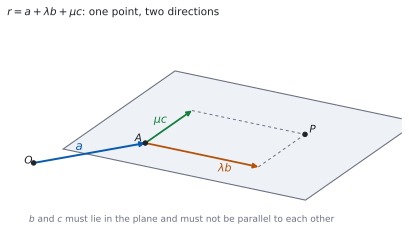
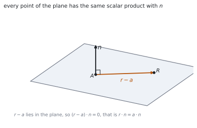

# HL 3.17 — The vector equation of a plane（平面のベクトル方程式） {#sec-aahl-3-17}

::: {.callout-note}
## What you should be able to do
- $\mathbf{r} = \mathbf{a}+\lambda\mathbf{b}+\mu\mathbf{c}$ の $\mathbf{a}$、$\mathbf{b}$、$\mathbf{c}$ が何かを言える。
- **法線ベクトル**（normal vector）をベクトル積から求められる。
- $\mathbf{r}\cdot\mathbf{n} = \mathbf{a}\cdot\mathbf{n}$ の形で平面を書ける。
- **デカルト方程式** $ax+by+cz = d$ に直せる。
- $ax+by+cz = d$ から、法線ベクトルをすぐ読み取れる。
- $3$ 点を通る平面の方程式を求められる。
- 点が平面の上にあるかどうかを調べられる。
:::

## The idea

### 1. The vector equation of a plane（平面のベクトル方程式） {#vector-equation}

シラバスは、こう書いています。

> Vector equations of a plane:
>
> $r = a + \lambda b + \mu c$, where $b$ and $c$ are non-parallel vectors within the plane.

$$
\mathbf{r} = \mathbf{a}+\lambda\mathbf{b}+\mu\mathbf{c}
$$ {#eq-aahl317-vector}

公式集の **3.17** の欄にもあります。

> Vector equation of a plane

$\mathbf{a}$ は**平面の上の点**、$\mathbf{b}$ と $\mathbf{c}$ は**平面の中の、平行でない $2$ 方向**です。

{#fig-aahl317-idea-a width=100%}

### 2. Two parameters（媒介変数が $2$ つ） {#two-parameters}

直線は媒介変数が $1$ つ、平面は $2$ つです（[HL 3.14](aahl-3-14.qmd#vector-equation)）。

**この「$1$ つと $2$ つ」が、$1$ 次元と $2$ 次元のちがい**です（[第 2 節](#why-two)）。$\lambda$ と $\mu$ を別々に動かすと、平面の上のどの点にも届きます。

::: {.callout-important}
## $\mathbf{b}$ と $\mathbf{c}$ が平行だと、平面になりません
$\mathbf{c} = k\mathbf{b}$ なら、$\lambda\mathbf{b}+\mu\mathbf{c} = (\lambda+k\mu)\mathbf{b}$ です。

これは **$\mathbf{b}$ の向きのスカラー倍にすぎず、直線にしかなりません**。だからシラバスは「non-parallel」と書いています。
:::

### 3. The normal vector（法線ベクトル） {#normal}

**平面に垂直なベクトル**を、法線ベクトル $\mathbf{n}$ といいます。

$\mathbf{b}$ と $\mathbf{c}$ が平面の中の $2$ 方向なら、その**ベクトル積**が法線です（[HL 3.16](aahl-3-16.qmd#definition)）。

$$
\mathbf{n} = \mathbf{b}\times\mathbf{c}
$$ {#eq-aahl317-normal}

**$\mathbf{b}$ と $\mathbf{c}$ が平行でないからこそ、$\mathbf{n} \neq \mathbf{0}$** になります（[HL 3.16](aahl-3-16.qmd#parallel)）。

法線は**スカラー倍しても法線**です。成分が整数になるように約分しておくと、後が楽です。

### 4. The scalar product form（内積の形） {#scalar-form}

> $r \cdot n = a \cdot n$, where $n$ is a normal to the plane and $a$ is the position vector of a point on the plane.

$$
\mathbf{r}\cdot\mathbf{n} = \mathbf{a}\cdot\mathbf{n}
$$ {#eq-aahl317-scalar}

公式集では、こう呼ばれています。

> Equation of a plane
>
> (using the normal vector)

平面の上の点 $R$ について、$\mathbf{r}-\mathbf{a}$ は**平面の中のベクトル**なので、$\mathbf{n}$ と垂直です。ですから $(\mathbf{r}-\mathbf{a})\cdot\mathbf{n} = 0$、つまり @eq-aahl317-scalar です。

{#fig-aahl317-idea-b width=100%}

**右辺はただの数**です。先に計算して $d$ と書いてしまってかまいません。

### 5. The Cartesian equation（デカルト方程式） {#cartesian}

> Cartesian equation of a plane $ax + by + cz = d$.

$\mathbf{r} = \begin{pmatrix} x \\ y \\ z \end{pmatrix}$、$\mathbf{n} = \begin{pmatrix} a \\ b \\ c \end{pmatrix}$ とすると、@eq-aahl317-scalar の左辺は $ax+by+cz$ です。

$$
ax+by+cz = d, \qquad d = \mathbf{a}\cdot\mathbf{n}
$$ {#eq-aahl317-cartesian}

::: {.callout-important}
## 係数が、そのまま法線ベクトルです
$ax+by+cz = d$ を見たら、$\mathbf{n} = \begin{pmatrix} a \\ b \\ c \end{pmatrix}$ です。

**計算はいりません。** これは、この単元でいちばんよく使う読み方です。$d$ の値は法線には関係しません。
:::

### 6. A plane through three points（$3$ 点を通る平面） {#three-points}

$3$ 点 $A$、$B$、$C$ が与えられたときの手順です。

1. $\overrightarrow{AB}$ と $\overrightarrow{AC}$ を作る（**同じ頂点から**）。
2. $\mathbf{n} = \overrightarrow{AB}\times\overrightarrow{AC}$ を計算する。
3. $d = \mathbf{a}\cdot\mathbf{n}$ を計算して、@eq-aahl317-cartesian に入れる。

**検算は、残りの $2$ 点を代入する**ことです。$B$ と $C$ でも同じ $d$ が出なければなりません。

$3$ 点が一直線上にあると、$\overrightarrow{AB}\times\overrightarrow{AC} = \mathbf{0}$ になって、平面が決まりません。

### 7. Is a point in the plane?（点が平面の上にあるか） {#membership}

デカルト形なら、**代入するだけ**です。

$$
\text{点} \ (x_{0},\ y_{0},\ z_{0}) \ \text{が平面の上} \quad \Longleftrightarrow \quad
ax_{0}+by_{0}+cz_{0} = d
$$ {#eq-aahl317-membership}

ベクトル形のまま調べるには $\lambda$ と $\mu$ の連立方程式を解くことになるので、**まずデカルト形に直す**ほうが速いです。

同じ考えで、**直線が平面の中にあるか**も調べられます。直線の点が平面の上にあり、かつ**方向ベクトルが $\mathbf{n}$ と垂直**なら、直線はまるごと平面の中にあります。

::: {.callout-tip collapse="true"}
## Paper 2 では、電卓でベクトル積と内積が出せます

TI-Nspire CX II の `crossP(` で法線を、`dotP(` で $d$ を出せます。

`crossP([1,2,0],[0,1,1])` のように入れると、法線ベクトルがそのまま返ります。

**答案には、式を書いてください。** @eq-aahl317-normal と @eq-aahl317-cartesian の形を書いてから値を入れます。

**Paper 1 では使えません。** このページの例題と演習は、すべて手で解けるようにしてあります。
:::

## Why it works

::: {.callout-tip collapse="true"}
## クリックすると開きます

#### なぜ、媒介変数が $2$ つなのか {#why-two}

平面の上で動くには、**独立した $2$ つの向き**が要ります。「たて」と「よこ」です。

$\lambda$ と $\mu$ を別々に選ぶと、$\lambda\mathbf{b}+\mu\mathbf{c}$ は平面の中のどのベクトルにもなれます。これを $\mathbf{a}$ に足すと、平面の上のどの点にも届きます。

$\mathbf{b}$ と $\mathbf{c}$ が平行だと、向きが実質 $1$ つしかありません。**$1$ つの向きで届くのは直線まで**です。

#### なぜ、$\mathbf{r}\cdot\mathbf{n}$ がどの点でも同じなのか {#why-constant}

$R$ を平面の上のどの点にとっても、$\mathbf{r}-\mathbf{a}$ は平面の中に寝ています。$\mathbf{n}$ は平面に垂直なので、内積は $0$ です。

$$
(\mathbf{r}-\mathbf{a})\cdot\mathbf{n} = 0
\quad \Longrightarrow \quad
\mathbf{r}\cdot\mathbf{n}-\mathbf{a}\cdot\mathbf{n} = 0
$$

分配法則を使いました（[HL 3.13](aahl-3-13.qmd#properties)）。移項すれば @eq-aahl317-scalar です。

**$\mathbf{r}\cdot\mathbf{n}$ は「$\mathbf{n}$ の向きに測った高さ」**だと思ってください。平面の上の点は、すべて同じ高さにあります。

#### なぜ、係数が法線ベクトルになるのか {#why-coefficients}

$\mathbf{n} = \begin{pmatrix} a \\ b \\ c \end{pmatrix}$ として内積を成分で書くと

$$
\mathbf{r}\cdot\mathbf{n} = ax+by+cz
$$

です。これが $d$ に等しい、という式がデカルト方程式です。

**つまり、$ax+by+cz = d$ はもともと内積の式**です。係数を縦に並べれば法線が出るのは、そのためです。

#### なぜ、法線はスカラー倍してよいのか {#why-scale}

$\mathbf{n}$ が平面に垂直なら、$k\mathbf{n}$ も垂直です（$k \neq 0$）。

式のほうは、両辺が $k$ 倍されるだけです。

$$
\mathbf{r}\cdot(k\mathbf{n}) = \mathbf{a}\cdot(k\mathbf{n})
\quad \Longleftrightarrow \quad
k\left(\mathbf{r}\cdot\mathbf{n}\right) = k\left(\mathbf{a}\cdot\mathbf{n}\right)
$$

$k \neq 0$ なので、同値です。$2x+4y-6z = 10$ と $x+2y-3z = 5$ は**同じ平面**です。
:::

## Worked examples

::: {.callout-note appearance="simple"}
問題文は英語です。意味が理解できなかったら、問題文の下の「**日本語訳**」を開いてください。解説は日本語です。

**例題も演習も、すべて電卓なしで解けます。** Paper 1 のつもりで解いてください。
:::

::: {#exm-aahl317-forms}
[A plane contains the point $A(1,\ 2,\ 3)$ and the directions $\begin{pmatrix} 1 \\ 0 \\ 1 \end{pmatrix}$ and $\begin{pmatrix} 0 \\ 1 \\ -1 \end{pmatrix}$.]{.q-en}

**(a)** [Write down a vector equation of the plane.]{.q-en}

**(b)** [Find a normal vector to the plane.]{.q-en}

**(c)** [Find the Cartesian equation of the plane.]{.q-en}

日本語訳

平面が点 $A(1,\ 2,\ 3)$ を含み、$\begin{pmatrix} 1 \\ 0 \\ 1 \end{pmatrix}$、$\begin{pmatrix} 0 \\ 1 \\ -1 \end{pmatrix}$ の向きを含んでいます。

**(a)** 平面のベクトル方程式を書きなさい。

**(b)** 法線ベクトルを $1$ つ求めなさい。

**(c)** 平面のデカルト方程式を求めなさい。

---

**(a)** @eq-aahl317-vector にそのまま入れます。

$$
\mathbf{r} = \begin{pmatrix} 1 \\ 2 \\ 3 \end{pmatrix}
+\lambda\begin{pmatrix} 1 \\ 0 \\ 1 \end{pmatrix}
+\mu\begin{pmatrix} 0 \\ 1 \\ -1 \end{pmatrix}
$$

**(b)** ベクトル積です（@eq-aahl317-normal）。

$$
\begin{pmatrix} 1 \\ 0 \\ 1 \end{pmatrix}\times\begin{pmatrix} 0 \\ 1 \\ -1 \end{pmatrix}
= \begin{pmatrix}
(0)(-1)-(1)(1) \\
(1)(0)-(1)(-1) \\
(1)(1)-(0)(0)
\end{pmatrix}
= \begin{pmatrix} -1 \\ 1 \\ 1 \end{pmatrix}
$$

**(c)** $d = \mathbf{a}\cdot\mathbf{n} = (1)(-1)+(2)(1)+(3)(1) = 4$ です。

$$
-x+y+z = 4
$$

**検算。** **法線が $2$ 方向と垂直か**を見ます。$-1+0+1 = 0$ ✓、$0+1-1 = 0$ ✓

**検算（別の点で）。** $\lambda = 1$、$\mu = 0$ の点は $(2,\ 2,\ 4)$。$-2+2+4 = 4$ ✓ **同じ $d$ です。**

::: {.callout-note}
## 解答例（答案用紙に書くこと）

**(a)** $\mathbf{r} = \begin{pmatrix} 1 \\ 2 \\ 3 \end{pmatrix}+\lambda\begin{pmatrix} 1 \\ 0 \\ 1 \end{pmatrix}+\mu\begin{pmatrix} 0 \\ 1 \\ -1 \end{pmatrix}$

**(b)** $\mathbf{n} = \begin{pmatrix} 1 \\ 0 \\ 1 \end{pmatrix}\times\begin{pmatrix} 0 \\ 1 \\ -1 \end{pmatrix} = \begin{pmatrix} -1 \\ 1 \\ 1 \end{pmatrix}$

**(c)** $d = (1)(-1)+(2)(1)+(3)(1) = 4$, *so* $-x+y+z = 4$
:::
:::

::: {#exm-aahl317-three-points}
[Find the Cartesian equation of the plane through $A(1,\ 0,\ 0)$, $B(0,\ 1,\ 0)$ and $C(0,\ 0,\ 1)$.]{.q-en}

日本語訳

$A(1,\ 0,\ 0)$、$B(0,\ 1,\ 0)$、$C(0,\ 0,\ 1)$ を通る平面のデカルト方程式を求めなさい。

---

**$A$ から出る $2$ 本**を作ります（[第 6 節](#three-points)）。

$$
\overrightarrow{AB} = \begin{pmatrix} -1 \\ 1 \\ 0 \end{pmatrix}, \qquad
\overrightarrow{AC} = \begin{pmatrix} -1 \\ 0 \\ 1 \end{pmatrix}
$$

$$
\mathbf{n} = \overrightarrow{AB}\times\overrightarrow{AC}
= \begin{pmatrix}
(1)(1)-(0)(0) \\
(0)(-1)-(-1)(1) \\
(-1)(0)-(1)(-1)
\end{pmatrix}
= \begin{pmatrix} 1 \\ 1 \\ 1 \end{pmatrix}
$$

$d = \mathbf{a}\cdot\mathbf{n} = (1)(1)+(0)(1)+(0)(1) = 1$ です。

$$
x+y+z = 1
$$

**検算。** **$B$ を入れます。** $0+1+0 = 1$ ✓

**検算（$C$ のほう）。** $0+0+1 = 1$ ✓ **$3$ 点とも通ります。**

::: {.callout-note}
## 解答例（答案用紙に書くこと）

$$\overrightarrow{AB} = \begin{pmatrix} -1 \\ 1 \\ 0 \end{pmatrix}, \qquad
\overrightarrow{AC} = \begin{pmatrix} -1 \\ 0 \\ 1 \end{pmatrix}$$

$$\mathbf{n} = \overrightarrow{AB}\times\overrightarrow{AC} = \begin{pmatrix} 1 \\ 1 \\ 1 \end{pmatrix},
\qquad d = \mathbf{a}\cdot\mathbf{n} = 1$$

$$x+y+z = 1$$
:::
:::

::: {#exm-aahl317-membership}
[The plane $\Pi$ has equation $2x-y+z = 6$.]{.q-en}

**(a)** [Determine whether the point $(2,\ 1,\ 3)$ lies in $\Pi$.]{.q-en}

**(b)** [Determine whether the point $(1,\ 1,\ 1)$ lies in $\Pi$.]{.q-en}

日本語訳

平面 $\Pi$ の方程式を $2x-y+z = 6$ とします。

**(a)** 点 $(2,\ 1,\ 3)$ が $\Pi$ の上にあるかどうかを調べなさい。

**(b)** 点 $(1,\ 1,\ 1)$ が $\Pi$ の上にあるかどうかを調べなさい。

---

**代入するだけです**（@eq-aahl317-membership）。

**(a)** $2(2)-1+3 = 4-1+3 = 6$。右辺と同じなので、**平面の上にあります**。

**(b)** $2(1)-1+1 = 2$。$6$ ではないので、**平面の上にありません**。

**検算。** **法線を読んでおきます。** $\mathbf{n} = \begin{pmatrix} 2 \\ -1 \\ 1 \end{pmatrix}$ ✓ 係数をそのまま縦に並べただけです。

**検算（(b) のずれ）。** $6-2 = 4$ だけ足りません ✓ 点は平面から $\mathbf{n}$ の向きにずれています。

::: {.callout-note}
## 解答例（答案用紙に書くこと）

**(a)** $2(2)-(1)+(3) = 6$, *which equals the right-hand side, so the point lies in* $\Pi$.

**(b)** $2(1)-(1)+(1) = 2 \neq 6$, *so the point does not lie in* $\Pi$.
:::
:::

::: {#exm-aahl317-back}
[The plane $\Pi$ has equation $3x+2y-z = 12$. Write down a normal vector, find a point in $\Pi$, and hence write a vector equation of $\Pi$.]{.q-en}

日本語訳

平面 $\Pi$ の方程式を $3x+2y-z = 12$ とします。法線ベクトルを書き、$\Pi$ の上の点を $1$ つ求め、それを使って $\Pi$ のベクトル方程式を書きなさい。

---

**法線は係数から読みます**（[第 5 節](#cartesian)）。

$$
\mathbf{n} = \begin{pmatrix} 3 \\ 2 \\ -1 \end{pmatrix}
$$

**点は、$2$ つの座標を $0$ にすると早い**です。$y = z = 0$ とすると $3x = 12$、つまり $(4,\ 0,\ 0)$ です。

平面の中の方向は、**$\mathbf{n}$ と内積が $0$ になるベクトル**を $2$ 本、平行でないように選びます。

$$
\begin{pmatrix} 2 \\ -3 \\ 0 \end{pmatrix}: \ 6-6+0 = 0, \qquad
\begin{pmatrix} 1 \\ 0 \\ 3 \end{pmatrix}: \ 3+0-3 = 0
$$

$$
\mathbf{r} = \begin{pmatrix} 4 \\ 0 \\ 0 \end{pmatrix}
+\lambda\begin{pmatrix} 2 \\ -3 \\ 0 \end{pmatrix}
+\mu\begin{pmatrix} 1 \\ 0 \\ 3 \end{pmatrix}
$$

**検算。** **$2$ 方向が平行でないか**を見ます。ベクトル積は $\begin{pmatrix} -9 \\ -6 \\ 3 \end{pmatrix} \neq \mathbf{0}$ ✓

**検算（法線にもどるか）。** $\begin{pmatrix} -9 \\ -6 \\ 3 \end{pmatrix} = -3\begin{pmatrix} 3 \\ 2 \\ -1 \end{pmatrix}$ ✓ **もとの法線のスカラー倍です。**

::: {.callout-note}
## 解答例（答案用紙に書くこと）

$$\mathbf{n} = \begin{pmatrix} 3 \\ 2 \\ -1 \end{pmatrix}$$

*Taking* $y = z = 0$ *gives* $3x = 12$, *so* $(4,\ 0,\ 0)$ *lies in* $\Pi$.

$$\mathbf{r} = \begin{pmatrix} 4 \\ 0 \\ 0 \end{pmatrix}+\lambda\begin{pmatrix} 2 \\ -3 \\ 0 \end{pmatrix}+\mu\begin{pmatrix} 1 \\ 0 \\ 3 \end{pmatrix}$$
:::

::: {.model-answer}
**試験ではこう書く**

*The coefficients of a Cartesian equation are the components of a normal vector, so* $\mathbf{n} = \begin{pmatrix} 3 \\ 2 \\ -1 \end{pmatrix}$ *is normal to* $\Pi$.

*Any solution of the equation gives a point of the plane. Setting* $y = 0$ *and* $z = 0$ *leaves* $3x = 12$, *so* $(4,\ 0,\ 0)$ *lies in* $\Pi$ *and its position vector may be used as* $\mathbf{a}$.

*A vector lies in the plane exactly when it is perpendicular to* $\mathbf{n}$. *The vectors* $\begin{pmatrix} 2 \\ -3 \\ 0 \end{pmatrix}$ *and* $\begin{pmatrix} 1 \\ 0 \\ 3 \end{pmatrix}$ *both have scalar product zero with* $\mathbf{n}$, *and they are not parallel to each other, since neither is a scalar multiple of the other. They may therefore be used as* $\mathbf{b}$ *and* $\mathbf{c}$, *giving*

$$\mathbf{r} = \begin{pmatrix} 4 \\ 0 \\ 0 \end{pmatrix}+\lambda\begin{pmatrix} 2 \\ -3 \\ 0 \end{pmatrix}+\mu\begin{pmatrix} 1 \\ 0 \\ 3 \end{pmatrix}$$

*Many other answers are possible, since both the point and the two directions can be chosen in infinitely many ways.*
:::
:::

## Common errors

::: {.callout-warning}
## $\mathbf{b}$ と $\mathbf{c}$ に平行な $2$ 本を選ぶ
平行だと、出てくるのは直線です（[第 2 節](#two-parameters)）。

**ベクトル積が $\mathbf{0}$ にならないこと**を確かめてください。$\mathbf{0}$ なら、選び直しです。
:::

::: {.callout-warning}
## 法線を求めるのに内積を使う
平面の中の $2$ 方向に垂直なベクトルは、**ベクトル積**で出します（@eq-aahl317-normal）。

内積は数を返すので、法線にはなりません（[HL 3.16](aahl-3-16.qmd#definition)）。
:::

::: {.callout-warning}
## デカルト方程式の $d$ を、法線の一部だと思う
$\mathbf{n}$ は $\begin{pmatrix} a \\ b \\ c \end{pmatrix}$ だけです（[第 5 節](#cartesian)）。

$d$ は**平面の位置**を決める数で、向きには関係しません。$d$ を変えると、平行な別の平面になります。
:::

::: {.callout-warning}
## $3$ 点から平面を作るとき、ちがう頂点の $2$ 本を使う
$\overrightarrow{AB}$ と $\overrightarrow{AC}$ のように、**同じ頂点から**出します（[第 6 節](#three-points)）。

$\overrightarrow{AB}$ と $\overrightarrow{BC}$ でも法線は同じ向きになりますが、$d$ を出すときに使う点をまちがえやすくなります。
:::

::: {.callout-warning}
## $d$ を出すのに、平面の上にない点を使う
$d = \mathbf{a}\cdot\mathbf{n}$ の $\mathbf{a}$ は、**平面の上の点**でなければなりません（@eq-aahl317-cartesian）。

原点を使ってしまうと、$d = 0$、つまり原点を通る平面になってしまいます。
:::

::: {.callout-warning}
## 法線を約分したときに、$d$ を直し忘れる
$\mathbf{n}$ を $k$ で割ったら、**$d$ も $k$ で割ります**（[第 4 節](#why-scale)）。

片方だけ直すと、**平行な別の平面**になってしまいます。$2x+4y-6z = 10$ は $x+2y-3z = 5$ であって、$x+2y-3z = 10$ ではありません。
:::

## Exercises

::: {.callout-note appearance="simple"}
各問題に、折りたたみが $3$ つ付いています。**日本語訳**、**解答例**（答案用紙に書くべきこと。英語です）、**解説**（なぜそうなるか。日本語です）。

まず自分で解いて、次に解答例と見くらべてください。**解説は、合わなかったときだけ開けば十分です。**
:::

::: {.exercise-block}

[1]{.ex-no} [Write down a vector equation of the plane through $(2,\ 1,\ 0)$ containing the directions $\begin{pmatrix} 1 \\ 1 \\ 0 \end{pmatrix}$ and $\begin{pmatrix} 0 \\ 1 \\ 1 \end{pmatrix}$.]{.q-en}

日本語訳

$(2,\ 1,\ 0)$ を通り、$\begin{pmatrix} 1 \\ 1 \\ 0 \end{pmatrix}$、$\begin{pmatrix} 0 \\ 1 \\ 1 \end{pmatrix}$ の向きを含む平面のベクトル方程式を書きなさい。

::: {.callout-note collapse="true"}
## 解答例（答案用紙に書くこと）

$$\mathbf{r} = \begin{pmatrix} 2 \\ 1 \\ 0 \end{pmatrix}
+\lambda\begin{pmatrix} 1 \\ 1 \\ 0 \end{pmatrix}
+\mu\begin{pmatrix} 0 \\ 1 \\ 1 \end{pmatrix}$$
:::

::: {.callout-tip collapse="true"}
## 解説

@eq-aahl317-vector に当てはめるだけです。**$2$ 方向が平行でない**ことだけ、目で確かめておきます。

**検算（$\lambda = \mu = 0$）。** $(2,\ 1,\ 0)$ が出ます ✓

**検算（平行でないこと）。** 第 $1$ 成分は $1$ と $0$ なので、スカラー倍にはなりません ✓
:::

::: {.ex-sep}
:::

[2]{.ex-no} [Find a normal vector to the plane $\mathbf{r} = \begin{pmatrix} 1 \\ 0 \\ 2 \end{pmatrix}+\lambda\begin{pmatrix} 2 \\ 0 \\ 1 \end{pmatrix}+\mu\begin{pmatrix} 1 \\ 1 \\ 0 \end{pmatrix}$.]{.q-en}

日本語訳

上の平面の法線ベクトルを $1$ つ求めなさい。

::: {.callout-note collapse="true"}
## 解答例（答案用紙に書くこと）

$$\mathbf{n} = \begin{pmatrix} 2 \\ 0 \\ 1 \end{pmatrix}\times\begin{pmatrix} 1 \\ 1 \\ 0 \end{pmatrix}
= \begin{pmatrix}
(0)(0)-(1)(1) \\ (1)(1)-(2)(0) \\ (2)(1)-(0)(1)
\end{pmatrix}
= \begin{pmatrix} -1 \\ 1 \\ 2 \end{pmatrix}$$
:::

::: {.callout-tip collapse="true"}
## 解説

**$2$ つの向きのベクトル積**です（@eq-aahl317-normal）。$\mathbf{a}$ は使いません。

**検算。** $\begin{pmatrix} 2 \\ 0 \\ 1 \end{pmatrix}$ との内積は $-2+0+2 = 0$ ✓

**検算（もう $1$ 本）。** $\begin{pmatrix} 1 \\ 1 \\ 0 \end{pmatrix}$ との内積は $-1+1+0 = 0$ ✓
:::

::: {.ex-sep}
:::

[3]{.ex-no} [Find the Cartesian equation of the plane with normal vector $\begin{pmatrix} 2 \\ -1 \\ 3 \end{pmatrix}$ passing through $(1,\ 1,\ 1)$.]{.q-en}

日本語訳

法線ベクトルが $\begin{pmatrix} 2 \\ -1 \\ 3 \end{pmatrix}$ で、$(1,\ 1,\ 1)$ を通る平面のデカルト方程式を求めなさい。

::: {.callout-note collapse="true"}
## 解答例（答案用紙に書くこと）

$$d = (1)(2)+(1)(-1)+(1)(3) = 4$$

$$2x-y+3z = 4$$
:::

::: {.callout-tip collapse="true"}
## 解説

**係数は法線、右辺は $\mathbf{a}\cdot\mathbf{n}$** です（@eq-aahl317-cartesian）。法線が与えられているので、ベクトル積は要りません。

**検算。** $(1,\ 1,\ 1)$ を入れると $2-1+3 = 4$ ✓

**検算（別の点）。** $(2,\ 0,\ 0)$ も $4$ になるので、この平面の上にあります ✓
:::

::: {.ex-sep}
:::

[4]{.ex-no} [Write down a normal vector to the plane $5x-2y+z = 7$.]{.q-en}

日本語訳

平面 $5x-2y+z = 7$ の法線ベクトルを書きなさい。

::: {.callout-note collapse="true"}
## 解答例（答案用紙に書くこと）

$$\mathbf{n} = \begin{pmatrix} 5 \\ -2 \\ 1 \end{pmatrix}$$
:::

::: {.callout-tip collapse="true"}
## 解説

**係数を縦に並べるだけ**です（[第 5 節](#cartesian)）。計算はありません。

$7$ は使いません。**$d$ は位置、係数は向き**です。

**検算。** $7$ を $0$ に変えても、平面の向きは変わりません ✓ 原点を通る平行な平面になります。

**検算（スカラー倍）。** $\begin{pmatrix} 10 \\ -4 \\ 2 \end{pmatrix}$ も法線です ✓
:::

::: {.ex-sep}
:::

[5]{.ex-no} [Determine whether the point $(3,\ -1,\ 2)$ lies in the plane $x+2y-z = -1$.]{.q-en}

日本語訳

点 $(3,\ -1,\ 2)$ が平面 $x+2y-z = -1$ の上にあるかどうかを調べなさい。

::: {.callout-note collapse="true"}
## 解答例（答案用紙に書くこと）

$$(3)+2(-1)-(2) = 3-2-2 = -1$$

*This equals the right-hand side, so the point lies in the plane.*
:::

::: {.callout-tip collapse="true"}
## 解説

**代入するだけ**です（@eq-aahl317-membership）。符号に気をつけてください。

**検算（符号）。** $-z$ なので $-2$、$2y$ なので $-2$ ✓ 足して $3-4 = -1$ です。

**検算（近い点）。** $(3,\ -1,\ 1)$ なら $0$ になり、平面の上にありません ✓
:::

::: {.ex-sep}
:::

[6]{.ex-no} [Find the Cartesian equation of the plane through $A(1,\ 1,\ 0)$, $B(2,\ 0,\ 1)$ and $C(0,\ 2,\ 3)$.]{.q-en}

日本語訳

$A(1,\ 1,\ 0)$、$B(2,\ 0,\ 1)$、$C(0,\ 2,\ 3)$ を通る平面のデカルト方程式を求めなさい。

::: {.callout-note collapse="true"}
## 解答例（答案用紙に書くこと）

$$\overrightarrow{AB} = \begin{pmatrix} 1 \\ -1 \\ 1 \end{pmatrix}, \qquad
\overrightarrow{AC} = \begin{pmatrix} -1 \\ 1 \\ 3 \end{pmatrix}$$

$$\overrightarrow{AB}\times\overrightarrow{AC} = \begin{pmatrix} -4 \\ -4 \\ 0 \end{pmatrix}
= -4\begin{pmatrix} 1 \\ 1 \\ 0 \end{pmatrix}$$

$$d = (1)(1)+(1)(1)+(0)(0) = 2, \qquad x+y = 2$$
:::

::: {.callout-tip collapse="true"}
## 解説

**法線は約分してから $d$ を出す**と楽です（[第 4 節](#why-scale)）。約分した法線で $d$ を出せば、直し忘れも起きません。

$z$ の係数が $0$ なので、この平面は **$z$ 軸と平行**です。$z$ をいくつにしても $x+y = 2$ でさえあれば平面の上にあります。

**検算（$B$）。** $2+0 = 2$ ✓

**検算（$C$）。** $0+2 = 2$ ✓ $3$ 点とも通ります。
:::

::: {.ex-sep}
:::

[7]{.ex-no} [The plane $\Pi$ has equation $2x+y-z = 4$. Find a point in $\Pi$ and two non-parallel directions in $\Pi$, and hence write a vector equation of $\Pi$.]{.q-en}

日本語訳

平面 $\Pi$ の方程式を $2x+y-z = 4$ とします。$\Pi$ の上の点を $1$ つと、$\Pi$ の中の平行でない $2$ 方向を求め、$\Pi$ のベクトル方程式を書きなさい。

::: {.callout-note collapse="true"}
## 解答例（答案用紙に書くこと）

$$\mathbf{n} = \begin{pmatrix} 2 \\ 1 \\ -1 \end{pmatrix}$$

*Taking* $y = z = 0$ *gives* $(2,\ 0,\ 0)$.

$$\begin{pmatrix} 1 \\ -2 \\ 0 \end{pmatrix}\cdot\mathbf{n} = 0, \qquad
\begin{pmatrix} 0 \\ 1 \\ 1 \end{pmatrix}\cdot\mathbf{n} = 0$$

$$\mathbf{r} = \begin{pmatrix} 2 \\ 0 \\ 0 \end{pmatrix}
+\lambda\begin{pmatrix} 1 \\ -2 \\ 0 \end{pmatrix}
+\mu\begin{pmatrix} 0 \\ 1 \\ 1 \end{pmatrix}$$
:::

::: {.callout-tip collapse="true"}
## 解説

**答えは $1$ つではありません。** 点も $2$ 方向も、選び方は無数にあります。

$2$ 方向は「$\mathbf{n}$ との内積が $0$」「たがいに平行でない」の $2$ つを満たせばよいだけです。

**検算（点）。** $2(2)+0-0 = 4$ ✓

**検算（平行でないこと）。** ベクトル積は $\begin{pmatrix} -2 \\ -1 \\ 1 \end{pmatrix} \neq \mathbf{0}$ で、$\mathbf{n}$ の $-1$ 倍です ✓ もとの法線にもどりました。
:::

::: {.ex-sep}
:::

[8]{.ex-no} [Show that the line $\mathbf{r} = \begin{pmatrix} 1 \\ 0 \\ 1 \end{pmatrix}+\lambda\begin{pmatrix} 1 \\ 1 \\ 0 \end{pmatrix}$ lies entirely in the plane $x-y+z = 2$.]{.q-en}

日本語訳

直線 $\mathbf{r} = \begin{pmatrix} 1 \\ 0 \\ 1 \end{pmatrix}+\lambda\begin{pmatrix} 1 \\ 1 \\ 0 \end{pmatrix}$ が、平面 $x-y+z = 2$ の中にすべて含まれることを示しなさい。

::: {.callout-note collapse="true"}
## 解答例（答案用紙に書くこと）

*The point* $(1,\ 0,\ 1)$ *gives* $1-0+1 = 2$, *so it lies in the plane.*

*The normal is* $\mathbf{n} = \begin{pmatrix} 1 \\ -1 \\ 1 \end{pmatrix}$, *and* $\begin{pmatrix} 1 \\ 1 \\ 0 \end{pmatrix}\cdot\mathbf{n} = 1-1+0 = 0$, *so the direction is perpendicular to* $\mathbf{n}$.

*A line with a point in the plane and a direction perpendicular to the normal lies entirely in the plane.*
:::

::: {.callout-tip collapse="true"}
## 解説

**$2$ つ示します**（[第 7 節](#membership)）。点が平面の上にあること、方向が法線と垂直なこと。

片方だけでは足りません。**方向だけ垂直なら平行、点だけ載っていれば交わる**、という別の場合になります。

**検算（一般の $\lambda$）。** 点は $(1+\lambda,\ \lambda,\ 1)$。代入すると $(1+\lambda)-\lambda+1 = 2$ ✓ **$\lambda$ が消えました。**

**検算（平行なだけの直線）。** 点を $(0,\ 0,\ 0)$ に変えると $0 \neq 2$ ✓ 平面と平行で、中には入りません。

::: {.model-answer}
**試験ではこう書く**

*A line lies in a plane when two conditions hold: one point of the line is in the plane, and the direction of the line is perpendicular to the normal of the plane.*

*For the point, substitute* $(1,\ 0,\ 1)$ *into the equation of the plane:* $1-0+1 = 2$, *which is the right-hand side, so this point lies in the plane.*

*For the direction, read the normal from the coefficients:* $\mathbf{n} = \begin{pmatrix} 1 \\ -1 \\ 1 \end{pmatrix}$. *Then* $\begin{pmatrix} 1 \\ 1 \\ 0 \end{pmatrix}\cdot\begin{pmatrix} 1 \\ -1 \\ 1 \end{pmatrix} = 1-1+0 = 0$, *so the direction is perpendicular to the normal and therefore lies in the plane.*

*Alternatively, substitute the general point* $(1+\lambda,\ \lambda,\ 1)$ *of the line into the equation:* $(1+\lambda)-\lambda+1 = 2$ *for every value of* $\lambda$. *Since the equation holds identically, every point of the line is in the plane.*
:::
:::

::: {.ex-sep}
:::

[9]{.ex-no} [Explain why the equation of a plane needs two parameters while the equation of a line needs only one.]{.q-en}

日本語訳

平面の方程式に媒介変数が $2$ つ必要で、直線には $1$ つで足りるのはなぜかを説明しなさい。

::: {.callout-note collapse="true"}
## 解答例（答案用紙に書くこと）

*A line is one-dimensional: from a fixed point every other point is reached by moving a certain amount along a single direction, so one parameter is enough.*

*A plane is two-dimensional: two independent directions are needed, and the amounts moved along them can be chosen separately, so two parameters are required.*

*If the two directions were parallel, their combination would still be a multiple of one direction and the equation would describe a line, not a plane.*
:::

::: {.callout-tip collapse="true"}
## 解説

**次元の話**です（[第 2 節](#why-two)）。動ける向きの数が、媒介変数の数になります。

「平行でない」という条件がなぜ要るかも、ここから分かります。**平行なら、向きは実質 $1$ つ**だからです。

**検算（直線）。** $\mathbf{a}+\lambda\mathbf{b}$ で $\lambda$ を動かすと、$1$ 本の線しか描けません ✓

**検算（平行にしてみる）。** $\mathbf{c} = 2\mathbf{b}$ とすると $\lambda\mathbf{b}+\mu(2\mathbf{b}) = (\lambda+2\mu)\mathbf{b}$ ✓ 係数が $1$ つにまとまります。

::: {.model-answer}
**試験ではこう書く**

*The number of parameters matches the number of independent directions in which a point can move within the object.*

*A line is one-dimensional. Once a point* $\mathbf{a}$ *on it and a direction* $\mathbf{b}$ *are fixed, every other point of the line is* $\mathbf{a}+\lambda\mathbf{b}$ *for exactly one value of* $\lambda$, *so a single parameter describes the whole line.*

*A plane is two-dimensional. From a point* $\mathbf{a}$ *in the plane, a point can move in two independent directions* $\mathbf{b}$ *and* $\mathbf{c}$, *and the amounts moved along them are chosen independently. Every point of the plane is therefore* $\mathbf{a}+\lambda\mathbf{b}+\mu\mathbf{c}$, *and both parameters are needed.*

*This also explains why* $\mathbf{b}$ *and* $\mathbf{c}$ *must not be parallel. If* $\mathbf{c} = k\mathbf{b}$ *then* $\lambda\mathbf{b}+\mu\mathbf{c} = (\lambda+k\mu)\mathbf{b}$, *which is a single multiple of* $\mathbf{b}$. *The two parameters would collapse into one and the equation would describe a line.*
:::
:::

::: {.ex-sep}
:::

[10]{.ex-no} [A student writes: "The plane $\mathbf{r} = \mathbf{a}+\lambda\mathbf{b}+\mu\mathbf{c}$ has normal vector $\mathbf{b}+\mathbf{c}$." Identify the error and give the correct normal vector.]{.q-en}

日本語訳

ある生徒が「平面 $\mathbf{r} = \mathbf{a}+\lambda\mathbf{b}+\mu\mathbf{c}$ の法線ベクトルは $\mathbf{b}+\mathbf{c}$ だ」と書きました。まちがいを指摘し、正しい法線ベクトルを書きなさい。

::: {.callout-note collapse="true"}
## 解答例（答案用紙に書くこと）

*The sum* $\mathbf{b}+\mathbf{c}$ *lies in the plane, since it is a combination of two directions of the plane. A normal must be perpendicular to the plane, not in it.*

*The correct normal is* $\mathbf{n} = \mathbf{b}\times\mathbf{c}$, *which is perpendicular to both* $\mathbf{b}$ *and* $\mathbf{c}$.
:::

::: {.callout-tip collapse="true"}
## 解説

$\mathbf{b}+\mathbf{c}$ は $\lambda = \mu = 1$ のときの向きなので、**平面の中**にあります（[第 1 節](#vector-equation)）。

**足し算は平面の中、ベクトル積は平面の外**、と覚えてください（@eq-aahl317-normal）。

**検算（具体例）。** $\mathbf{b} = \begin{pmatrix} 1 \\ 0 \\ 0 \end{pmatrix}$、$\mathbf{c} = \begin{pmatrix} 0 \\ 1 \\ 0 \end{pmatrix}$ なら和は $\begin{pmatrix} 1 \\ 1 \\ 0 \end{pmatrix}$ で、$xy$ 平面の中 ✓

**検算（正しいほう）。** ベクトル積は $\begin{pmatrix} 0 \\ 0 \\ 1 \end{pmatrix}$ で、$xy$ 平面に垂直 ✓

::: {.model-answer}
**試験ではこう書く**

*The error is that* $\mathbf{b}+\mathbf{c}$ *lies in the plane rather than perpendicular to it. Taking* $\lambda = \mu = 1$ *in the vector equation gives the point with position vector* $\mathbf{a}+\mathbf{b}+\mathbf{c}$, *so the displacement* $\mathbf{b}+\mathbf{c}$ *joins two points of the plane and is one of its directions.*

*A normal vector must be perpendicular to every direction in the plane, and in particular to both* $\mathbf{b}$ *and* $\mathbf{c}$. *The vector product does exactly this, so the correct normal is* $\mathbf{n} = \mathbf{b}\times\mathbf{c}$, *and* $\mathbf{b}\cdot\mathbf{n} = \mathbf{c}\cdot\mathbf{n} = 0$ *confirms it.*

*As a concrete check, take* $\mathbf{b} = \begin{pmatrix} 1 \\ 0 \\ 0 \end{pmatrix}$ *and* $\mathbf{c} = \begin{pmatrix} 0 \\ 1 \\ 0 \end{pmatrix}$, *which span the* $xy$-*plane. Their sum* $\begin{pmatrix} 1 \\ 1 \\ 0 \end{pmatrix}$ *lies in that plane, while their vector product* $\begin{pmatrix} 0 \\ 0 \\ 1 \end{pmatrix}$ *points along the* $z$-*axis, perpendicular to it.*
:::
:::

:::
