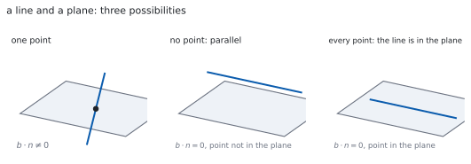
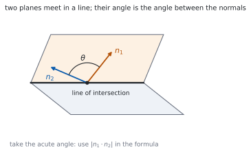

# HL 3.18 — Intersections of lines and planes（直線・平面の交わりとなす角） {#sec-aahl-3-18}

::: {.callout-note}
## What you should be able to do
- 直線と平面の**交点**を求められる。
- 直線が平面と平行か、平面の中にあるかを見分けられる。
- $2$ 平面の**交線**を、媒介変数を使って求められる。
- $3$ 平面の連立方程式を、図形として読める（[HL 1.16](../01-number-and-algebra/aahl-1-16.qmd)）。
- **直線と平面のなす角**を、$\sin$ の式で求められる。
- **$2$ 平面のなす角**を、法線どうしの内積から求められる。
:::

## The idea

### 1. A line meeting a plane（直線と平面の交点） {#line-plane}

シラバスは、こう書いています。

> Intersections of: a line with a plane; two planes; three planes.
>
> Finding intersections by solving equations; geometrical interpretation of solutions.

手順は $1$ つだけです。**直線の点を、平面の式に代入します。**

$$
\left(\mathbf{a}+\lambda\mathbf{b}\right)\cdot\mathbf{n} = d
$$ {#eq-aahl318-substitute}

左辺を展開すると

$$
\mathbf{a}\cdot\mathbf{n}+\lambda\left(\mathbf{b}\cdot\mathbf{n}\right) = d
$$ {#eq-aahl318-expanded}

です。**$\lambda$ についての $1$ 次方程式**です（[第 1 節](#why-linear)）。

デカルト形で書かれていれば、$x$、$y$、$z$ に媒介変数表示を入れるだけです（[HL 3.14](aahl-3-14.qmd#parametric)）。

### 2. Three cases for a line and a plane（$3$ つの場合） {#three-cases}

@eq-aahl318-expanded の $\lambda$ の係数は $\mathbf{b}\cdot\mathbf{n}$ です。ここで場合が分かれます。

{#fig-aahl318-idea-a width=100%}

| $\mathbf{b}\cdot\mathbf{n}$ | $\mathbf{a}\cdot\mathbf{n}$ と $d$ | 交わり方 |
|---|---|---|
| $\neq 0$ | — | $1$ 点で交わる |
| $= 0$ | ちがう | 平行で、交わらない |
| $= 0$ | 同じ | 直線が平面の中にある |

: 直線と平面の $3$ つの場合 {#tbl-aahl318-cases}

**$\mathbf{b}\cdot\mathbf{n} = 0$ は「方向が法線と垂直」**、つまり方向が平面と平行だという意味です（[HL 3.17](aahl-3-17.qmd#membership)）。

代入して $\lambda$ が消え、$0 = 0$ のような**いつでも正しい式**になれば、直線は平面の中です。$0 = 3$ のような**成り立たない式**になれば、平行です。

### 3. Two planes（$2$ 平面の交わり） {#two-planes}

平行でない $2$ 平面は、**$1$ 本の直線**で交わります。

求め方は、連立方程式を解くことです。未知数 $3$ つ、式 $2$ 本なので、**$1$ つ自由に残ります**。残した文字を媒介変数にすれば、直線のベクトル方程式が出ます。

::: {.callout-important}
## 残す文字は、どれでもかまいません
$z = t$ と置くのがふつうですが、$z$ が消えてしまう連立なら $x = t$ や $y = t$ に変えます。

**残す文字を変えると、式の見た目は変わります。** それでも同じ直線です（[HL 3.14](aahl-3-14.qmd#position-direction)）。
:::

法線が平行なら、$2$ 平面は平行です。式が同じなら一致、ちがえば交わりません。

### 4. Three planes（$3$ 平面） {#three-planes}

$3$ 平面は、未知数 $3$ つ、式 $3$ 本の連立 $1$ 次方程式です。これは [HL 1.16](../01-number-and-algebra/aahl-1-16.qmd) でやったことと同じです。シラバスにも、こう書いてあります。

> Link to: solutions of systems of linear equations (AHL 1.16).

| 解 | 図形としての意味 |
|---|---|
| ただ $1$ つ | $3$ 平面が $1$ 点で交わる |
| 無数（$1$ 文字が自由） | $3$ 平面が $1$ 本の直線を共有する |
| 無数（$2$ 文字が自由） | $3$ 平面が一致している |
| なし | 共有する点がない（平行な面があるか、三角柱の形） |

: $3$ 平面と、連立方程式の解 {#tbl-aahl318-three}

**「解なし」には $2$ 通りの絵があります。** どこかに平行な $2$ 面があるか、$3$ 面がどれも平行でないのに三角柱のように囲んでいるかです。

### 5. The angle between a line and a plane（直線と平面のなす角） {#angle-line-plane}

> Angle between: a line and a plane; two planes.

方向ベクトル $\mathbf{b}$ と法線 $\mathbf{n}$ のなす角を求めると、それは**平面となす角の余角**です。

$$
\sin\theta = \frac{\left\lvert \mathbf{b}\cdot\mathbf{n} \right\rvert}
{\lvert\mathbf{b}\rvert\,\lvert\mathbf{n}\rvert}
$$ {#eq-aahl318-angle-line}

**$\cos$ ではなく $\sin$ です。** ここが、この項目でいちばん多いまちがいです（[第 3 節](#why-sine)）。

絶対値を付けるので、$0 \leq \theta \leq \dfrac{\pi}{2}$ になります。$\mathbf{b}\cdot\mathbf{n} = 0$ なら $\theta = 0$、つまり平行です。

### 6. The angle between two planes（$2$ 平面のなす角） {#angle-planes}

$2$ 平面のなす角は、**法線どうしのなす角**と同じです。

$$
\cos\theta = \frac{\left\lvert \mathbf{n}_{1}\cdot\mathbf{n}_{2} \right\rvert}
{\lvert\mathbf{n}_{1}\rvert\,\lvert\mathbf{n}_{2}\rvert}
$$ {#eq-aahl318-angle-planes}

{#fig-aahl318-idea-b width=100%}

こちらは $\cos$ です。**法線を「平面の代表」として使うと、そのまま [HL 3.13](aahl-3-13.qmd#angle) の式**になります。

### 7. Reading the algebra as geometry（式を図形として読む） {#reading}

この項目でくり返し出てくる読み替えを、まとめておきます。

- $\mathbf{b}\cdot\mathbf{n} = 0$ … 直線は平面と**平行**
- $\mathbf{n}_{1}\times\mathbf{n}_{2} = \mathbf{0}$ … $2$ 平面は**平行**
- 連立の解が $1$ つ … $1$ 点で交わる
- 解が無数 … 直線か平面を共有する
- 解なし … 共有点がない

**計算そのものより、「出た式をどう読むか」が問われます。** 答案には、式のあとに「したがって $2$ 平面は平行である」のような $1$ 文を必ず書いてください。

::: {.callout-tip collapse="true"}
## Paper 2 では、電卓で連立方程式として解けます

TI-Nspire CX II の **Solve System of Equations** に $3$ 本の式を入れると、$3$ 平面の解が出ます。

`No solution` なら共有点なし、答えに文字（`c1` など）が残れば直線または平面を共有しています。

なす角は `dotP(` と `norm(` を組み合わせ、$\arcsin$ か $\arccos$ に入れます。**`RAD` になっているか**を見てください。

**答案には、式を書いてください。** @eq-aahl318-angle-line や @eq-aahl318-angle-planes の形を書いてから値を入れます。

**Paper 1 では使えません。** このページの例題と演習は、すべて手で解けるようにしてあります。
:::

## Why it works

::: {.callout-tip collapse="true"}
## クリックすると開きます

#### なぜ、代入すると $1$ 次方程式になるのか {#why-linear}

直線の点は $\mathbf{a}+\lambda\mathbf{b}$ で、$\lambda$ について $1$ 次です。平面の式は内積なので、**$\mathbf{r}$ について $1$ 次**です。

$1$ 次のものを $1$ 次の式に入れれば、$1$ 次のままです。分配法則で展開すると

$$
(\mathbf{a}+\lambda\mathbf{b})\cdot\mathbf{n}
= \mathbf{a}\cdot\mathbf{n}+\lambda\left(\mathbf{b}\cdot\mathbf{n}\right)
$$

です（[HL 3.13](aahl-3-13.qmd#properties)）。$\lambda$ の係数が $\mathbf{b}\cdot\mathbf{n}$、定数項が $\mathbf{a}\cdot\mathbf{n}$ です。

#### なぜ、場合が $3$ つなのか {#why-three-cases}

$1$ 次方程式 $p\lambda = q$ の解は、$3$ 通りしかありません。

- $p \neq 0$ … 解がただ $1$ つ（交点が $1$ つ）
- $p = 0$、$q \neq 0$ … 解なし（平行）
- $p = 0$、$q = 0$ … どの $\lambda$ でもよい（直線が平面の中）

**代数の $3$ 通りが、そのまま図形の $3$ 通り**です（@tbl-aahl318-cases）。ここが、この項目のいちばんおもしろいところです。

#### なぜ、直線と平面では $\sin$ なのか {#why-sine}

内積で出るのは、**$\mathbf{b}$ と $\mathbf{n}$ のなす角** $\alpha$ です。$\mathbf{n}$ は平面に垂直なので、求めたい角 $\theta$ とは

$$
\theta = \frac{\pi}{2}-\alpha
$$

の関係にあります。$\cos\alpha = \cos\left(\dfrac{\pi}{2}-\theta\right) = \sin\theta$ です（[HL 3.11](aahl-3-11.qmd#shifts)）。

ですから、内積から出た $\cos\alpha$ の値は、**そのまま $\sin\theta$** です。$\arccos$ ではなく $\arcsin$ に入れます。

#### なぜ、$3$ 平面の話が連立 $1$ 次方程式なのか {#why-systems}

平面の式 $ax+by+cz = d$ は、$x$、$y$、$z$ の $1$ 次方程式です。$3$ 平面なら、それが $3$ 本あります。

**共有点とは、$3$ 本すべてを満たす $(x,\ y,\ z)$** のことです。つまり連立 $1$ 次方程式の解そのものです。

[HL 1.16](../01-number-and-algebra/aahl-1-16.qmd) で「解が $1$ つ・無数・なし」の $3$ 通りを見ました。その $3$ 通りに、ここで図形の意味がつきます（@tbl-aahl318-three）。
:::

## Worked examples

::: {.callout-note appearance="simple"}
問題文は英語です。意味が理解できなかったら、問題文の下の「**日本語訳**」を開いてください。解説は日本語です。

**例題も演習も、すべて電卓なしで解けます。** Paper 1 のつもりで解いてください。
:::

::: {#exm-aahl318-point}
[Find the point where the line $\mathbf{r} = \begin{pmatrix} 1 \\ 0 \\ 2 \end{pmatrix}+\lambda\begin{pmatrix} 2 \\ 1 \\ -1 \end{pmatrix}$ meets the plane $x+y+z = 7$.]{.q-en}

日本語訳

直線 $\mathbf{r} = \begin{pmatrix} 1 \\ 0 \\ 2 \end{pmatrix}+\lambda\begin{pmatrix} 2 \\ 1 \\ -1 \end{pmatrix}$ と平面 $x+y+z = 7$ の交点を求めなさい。

---

**媒介変数表示を、平面の式に入れます**（@eq-aahl318-substitute）。

$$
x = 1+2\lambda, \qquad y = \lambda, \qquad z = 2-\lambda
$$

$$
(1+2\lambda)+(\lambda)+(2-\lambda) = 7
$$

$$
3+2\lambda = 7, \qquad \lambda = 2
$$

$\lambda = 2$ を直線の式に入れます。

$$
\mathbf{r} = \begin{pmatrix} 1 \\ 0 \\ 2 \end{pmatrix}+2\begin{pmatrix} 2 \\ 1 \\ -1 \end{pmatrix}
= \begin{pmatrix} 5 \\ 2 \\ 0 \end{pmatrix}
$$

**検算。** **平面の式に入れます。** $5+2+0 = 7$ ✓

**検算（$\mathbf{b}\cdot\mathbf{n}$）。** $\mathbf{n} = \begin{pmatrix} 1 \\ 1 \\ 1 \end{pmatrix}$ なので $2+1-1 = 2 \neq 0$ ✓ **$1$ 点で交わる場合です。**

::: {.callout-note}
## 解答例（答案用紙に書くこと）

$$(1+2\lambda)+(\lambda)+(2-\lambda) = 7 \ \Rightarrow \ 3+2\lambda = 7 \ \Rightarrow \ \lambda = 2$$

$$\mathbf{r} = \begin{pmatrix} 1 \\ 0 \\ 2 \end{pmatrix}+2\begin{pmatrix} 2 \\ 1 \\ -1 \end{pmatrix}
= \begin{pmatrix} 5 \\ 2 \\ 0 \end{pmatrix}$$

*The point of intersection is* $(5,\ 2,\ 0)$.
:::
:::

::: {#exm-aahl318-two-planes}
[Find a vector equation of the line of intersection of the planes $2x+y-z = 3$ and $x-y+z = 0$.]{.q-en}

日本語訳

平面 $2x+y-z = 3$ と $x-y+z = 0$ の交線のベクトル方程式を求めなさい。

---

**$2$ 本を足すと、$y$ と $z$ が消えます。**

$$
(2x+y-z)+(x-y+z) = 3+0, \qquad 3x = 3, \qquad x = 1
$$

$x = 1$ を $2$ 本目に入れます。

$$
1-y+z = 0, \qquad y = 1+z
$$

**$z$ を媒介変数にします**（[第 3 節](#two-planes)）。$z = t$ と置くと

$$
x = 1, \qquad y = 1+t, \qquad z = t
$$

$$
\mathbf{r} = \begin{pmatrix} 1 \\ 1 \\ 0 \end{pmatrix}+t\begin{pmatrix} 0 \\ 1 \\ 1 \end{pmatrix}
$$

**検算。** **$1$ 本目に入れます。** $2(1)+(1+t)-t = 3$ ✓ **$t$ が消えました。**

**検算（$2$ 本目）。** $1-(1+t)+t = 0$ ✓ どの $t$ でも成り立ちます。

::: {.callout-note}
## 解答例（答案用紙に書くこと）

*Adding the two equations gives* $3x = 3$, *so* $x = 1$.

*Substituting into the second equation gives* $1-y+z = 0$, *so* $y = 1+z$.

*Let* $z = t$. *Then*

$$\mathbf{r} = \begin{pmatrix} 1 \\ 1 \\ 0 \end{pmatrix}+t\begin{pmatrix} 0 \\ 1 \\ 1 \end{pmatrix}$$
:::
:::

::: {#exm-aahl318-angle-line}
[Find the angle between the line $\mathbf{r} = \begin{pmatrix} 1 \\ 2 \\ 3 \end{pmatrix}+\lambda\begin{pmatrix} 1 \\ 0 \\ 0 \end{pmatrix}$ and the plane $x+y = 3$.]{.q-en}

日本語訳

直線 $\mathbf{r} = \begin{pmatrix} 1 \\ 2 \\ 3 \end{pmatrix}+\lambda\begin{pmatrix} 1 \\ 0 \\ 0 \end{pmatrix}$ と平面 $x+y = 3$ のなす角を求めなさい。

---

**法線は係数から読みます**（[HL 3.17](aahl-3-17.qmd#cartesian)）。

$$
\mathbf{n} = \begin{pmatrix} 1 \\ 1 \\ 0 \end{pmatrix}, \qquad
\mathbf{b} = \begin{pmatrix} 1 \\ 0 \\ 0 \end{pmatrix}
$$

@eq-aahl318-angle-line に入れます。

$$
\sin\theta = \frac{\lvert 1+0+0 \rvert}{(1)\left(\sqrt{2}\right)} = \frac{1}{\sqrt{2}}
$$

$$
\theta = \frac{\pi}{4}
$$

**検算。** **法線とのなす角 $\alpha$ も出します。** $\cos\alpha = \dfrac{1}{\sqrt{2}}$ なので $\alpha = \dfrac{\pi}{4}$ ✓

**検算（余角）。** $\theta+\alpha = \dfrac{\pi}{4}+\dfrac{\pi}{4} = \dfrac{\pi}{2}$ ✓ **足して直角になりました。**

::: {.callout-note}
## 解答例（答案用紙に書くこと）

$$\mathbf{n} = \begin{pmatrix} 1 \\ 1 \\ 0 \end{pmatrix}, \qquad
\sin\theta = \frac{\lvert \mathbf{b}\cdot\mathbf{n} \rvert}{\lvert\mathbf{b}\rvert\lvert\mathbf{n}\rvert}
= \frac{1}{\sqrt{2}}$$

$$\theta = \frac{\pi}{4}$$
:::
:::

::: {#exm-aahl318-angle-planes}
[Find the angle between the planes $x+y = 2$ and $x+z = 5$.]{.q-en}

日本語訳

平面 $x+y = 2$ と $x+z = 5$ のなす角を求めなさい。

---

**法線を $2$ 本、係数から読みます。**

$$
\mathbf{n}_{1} = \begin{pmatrix} 1 \\ 1 \\ 0 \end{pmatrix}, \qquad
\mathbf{n}_{2} = \begin{pmatrix} 1 \\ 0 \\ 1 \end{pmatrix}
$$

@eq-aahl318-angle-planes に入れます。

$$
\cos\theta = \frac{\lvert 1+0+0 \rvert}{\sqrt{2}\,\sqrt{2}} = \frac{1}{2}
$$

$$
\theta = \frac{\pi}{3}
$$

**検算。** **$\cos\theta$ が $1$ 以下**です ✓ $\dfrac{1}{2}$ は範囲の中にあります。

**検算（鋭角か）。** $\dfrac{\pi}{3} < \dfrac{\pi}{2}$ ✓ 絶対値を付けたので、鈍角にはなりません。

::: {.callout-note}
## 解答例（答案用紙に書くこと）

$$\mathbf{n}_{1} = \begin{pmatrix} 1 \\ 1 \\ 0 \end{pmatrix}, \qquad
\mathbf{n}_{2} = \begin{pmatrix} 1 \\ 0 \\ 1 \end{pmatrix}$$

$$\cos\theta = \frac{\lvert \mathbf{n}_{1}\cdot\mathbf{n}_{2} \rvert}
{\lvert\mathbf{n}_{1}\rvert\lvert\mathbf{n}_{2}\rvert} = \frac{1}{2},
\qquad \theta = \frac{\pi}{3}$$
:::

::: {.model-answer}
**試験ではこう書く**

*The angle between two planes equals the angle between their normals, and the normals can be read from the coefficients of the Cartesian equations:* $\mathbf{n}_{1} = \begin{pmatrix} 1 \\ 1 \\ 0 \end{pmatrix}$ *for the first plane and* $\mathbf{n}_{2} = \begin{pmatrix} 1 \\ 0 \\ 1 \end{pmatrix}$ *for the second.*

*Their scalar product is* $(1)(1)+(1)(0)+(0)(1) = 1$, *and each has magnitude* $\sqrt{2}$, *so*

$$\cos\theta = \frac{\lvert 1 \rvert}{\sqrt{2}\,\sqrt{2}} = \frac{1}{2}$$

*The modulus signs ensure that the acute angle is obtained, whichever way round the normals happen to point. Hence* $\theta = \dfrac{\pi}{3}$.

*Note that the constants* $2$ *and* $5$ *play no part: they fix where the planes are, not how they are tilted.*
:::
:::

## Common errors

::: {.callout-warning}
## 直線と平面のなす角に $\arccos$ を使う
内積から出るのは**法線とのなす角**です（[第 3 節](#why-sine)）。

求める角はその余角なので、値はそのまま **$\sin\theta$** です。@eq-aahl318-angle-line の形で書いてください。
:::

::: {.callout-warning}
## $2$ 平面のなす角に $\arcsin$ を使う
$2$ 平面のときは、法線どうしの角がそのまま答えです。**$\cos$ のまま**です（@eq-aahl318-angle-planes）。

**直線と平面は $\sin$、平面と平面は $\cos$** と、対にして覚えてください。
:::

::: {.callout-warning}
## $\lambda$ が消えたとき、「解なし」と決めつける
$0 = 0$ になったら、**直線は平面の中**です（@tbl-aahl318-cases）。交点が無数にある、ということです。

$0 = 3$ のように成り立たない式になったときだけ、平行で交わりません。**右辺を見てください。**
:::

::: {.callout-warning}
## 交点を $\lambda$ の値のまま答える
問われているのは**点**です。$\lambda$ を直線の式に入れて、座標にしてください。

平面の式に入れ直すのが、そのまま検算になります。
:::

::: {.callout-warning}
## $2$ 平面の交線で、媒介変数を置き忘れる
未知数 $3$ つに式 $2$ 本なので、**$1$ つ自由に残ります**（[第 3 節](#two-planes)）。

$x$ と $y$ を $z$ で表したところで止めず、**$z = t$ と置いてベクトル方程式の形**まで書いてください。
:::

::: {.callout-warning}
## 「解なし」を、いつも平行だと説明する
平行な面がなくても、共有点がないことがあります（@tbl-aahl318-three）。

$3$ 面が三角柱のように囲む形です。**法線を見て、平行な $2$ 面があるかどうかを確かめて**から書いてください。
:::

## Exercises

::: {.callout-note appearance="simple"}
各問題に、折りたたみが $3$ つ付いています。**日本語訳**、**解答例**（答案用紙に書くべきこと。英語です）、**解説**（なぜそうなるか。日本語です）。

まず自分で解いて、次に解答例と見くらべてください。**解説は、合わなかったときだけ開けば十分です。**
:::

::: {.exercise-block}

[1]{.ex-no} [Find the point where the line $\mathbf{r} = \begin{pmatrix} 2 \\ -1 \\ 0 \end{pmatrix}+\lambda\begin{pmatrix} 1 \\ 1 \\ 1 \end{pmatrix}$ meets the plane $x+2y+z = 4$.]{.q-en}

日本語訳

直線と平面 $x+2y+z = 4$ の交点を求めなさい。

::: {.callout-note collapse="true"}
## 解答例（答案用紙に書くこと）

$$(2+\lambda)+2(-1+\lambda)+(\lambda) = 4 \ \Rightarrow \ 4\lambda = 4 \ \Rightarrow \ \lambda = 1$$

$$\mathbf{r} = \begin{pmatrix} 2 \\ -1 \\ 0 \end{pmatrix}+\begin{pmatrix} 1 \\ 1 \\ 1 \end{pmatrix}
= \begin{pmatrix} 3 \\ 0 \\ 1 \end{pmatrix}$$
:::

::: {.callout-tip collapse="true"}
## 解説

**代入して、$\lambda$ の $1$ 次方程式にします**（@eq-aahl318-substitute）。定数項が消えて $4\lambda = 4$ になります。

**検算。** $3+0+1 = 4$ ✓

**検算（$\mathbf{b}\cdot\mathbf{n}$）。** $1+2+1 = 4 \neq 0$ ✓ $1$ 点で交わる場合です。
:::

::: {.ex-sep}
:::

[2]{.ex-no} [Show that the line $\mathbf{r} = \begin{pmatrix} 1 \\ 1 \\ 1 \end{pmatrix}+\lambda\begin{pmatrix} 1 \\ -1 \\ 0 \end{pmatrix}$ is parallel to the plane $x+y+z = 10$ but does not lie in it.]{.q-en}

日本語訳

直線が平面 $x+y+z = 10$ と平行であるが、その中にはないことを示しなさい。

::: {.callout-note collapse="true"}
## 解答例（答案用紙に書くこと）

$$\mathbf{b}\cdot\mathbf{n} = (1)(1)+(-1)(1)+(0)(1) = 0$$

*so the direction is perpendicular to the normal and the line is parallel to the plane.*

$$(1)+(1)+(1) = 3 \neq 10$$

*so the point* $(1,\ 1,\ 1)$ *is not in the plane, and the line does not lie in it.*
:::

::: {.callout-tip collapse="true"}
## 解説

**$2$ つ示します**（@tbl-aahl318-cases）。方向が法線と垂直、そして点が平面の上にない。

**検算（代入してみる）。** 一般の点は $(1+\lambda,\ 1-\lambda,\ 1)$。和は $3$ で、$\lambda$ が消えます ✓

**検算（右辺）。** $3 = 10$ は成り立ちません ✓ 平行で、交わりません。
:::

::: {.ex-sep}
:::

[3]{.ex-no} [Find the angle between the line with direction $\begin{pmatrix} 1 \\ 0 \\ 1 \end{pmatrix}$ and the plane $z = 2$.]{.q-en}

日本語訳

方向ベクトルが $\begin{pmatrix} 1 \\ 0 \\ 1 \end{pmatrix}$ の直線と、平面 $z = 2$ のなす角を求めなさい。

::: {.callout-note collapse="true"}
## 解答例（答案用紙に書くこと）

$$\mathbf{n} = \begin{pmatrix} 0 \\ 0 \\ 1 \end{pmatrix}, \qquad
\sin\theta = \frac{\lvert 0+0+1 \rvert}{\sqrt{2}\,(1)} = \frac{1}{\sqrt{2}}$$

$$\theta = \frac{\pi}{4}$$
:::

::: {.callout-tip collapse="true"}
## 解説

$z = 2$ は $0x+0y+z = 2$ です。**法線は $z$ 軸の向き**です（[HL 3.17](aahl-3-17.qmd#cartesian)）。

$\sin$ を使うところに気をつけてください（@eq-aahl318-angle-line）。

**検算（法線との角）。** $\cos\alpha = \dfrac{1}{\sqrt{2}}$ で $\alpha = \dfrac{\pi}{4}$ ✓

**検算（余角）。** 足して $\dfrac{\pi}{2}$ ✓ この場合はどちらも $\dfrac{\pi}{4}$ です。
:::

::: {.ex-sep}
:::

[4]{.ex-no} [Find the angle between the planes $x+y+z = 1$ and $x-y = 3$.]{.q-en}

日本語訳

平面 $x+y+z = 1$ と $x-y = 3$ のなす角を求めなさい。

::: {.callout-note collapse="true"}
## 解答例（答案用紙に書くこと）

$$\mathbf{n}_{1} = \begin{pmatrix} 1 \\ 1 \\ 1 \end{pmatrix}, \qquad
\mathbf{n}_{2} = \begin{pmatrix} 1 \\ -1 \\ 0 \end{pmatrix}$$

$$\mathbf{n}_{1}\cdot\mathbf{n}_{2} = 1-1+0 = 0, \qquad \theta = \frac{\pi}{2}$$

*The planes are perpendicular.*
:::

::: {.callout-tip collapse="true"}
## 解説

内積が $0$ なので、法線どうしが垂直です。**$2$ 平面も垂直**です（@eq-aahl318-angle-planes）。

$\cos\theta = 0$ から $\theta = \dfrac{\pi}{2}$ が出ます。大きさを計算する必要はありません。

**検算（大きさ）。** $\sqrt{3}$ と $\sqrt{2}$ で、どちらも $0$ ではありません ✓ 割り算ができます。

**検算（交わるか）。** 法線が平行でないので、$1$ 本の直線で交わります ✓
:::

::: {.ex-sep}
:::

[5]{.ex-no} [Find a vector equation of the line of intersection of the planes $x+y = 3$ and $y+z = 5$.]{.q-en}

日本語訳

平面 $x+y = 3$ と $y+z = 5$ の交線のベクトル方程式を求めなさい。

::: {.callout-note collapse="true"}
## 解答例（答案用紙に書くこと）

*Let* $z = t$. *Then* $y = 5-t$ *from the second equation, and* $x = 3-y = t-2$ *from the first.*

$$\mathbf{r} = \begin{pmatrix} -2 \\ 5 \\ 0 \end{pmatrix}+t\begin{pmatrix} 1 \\ -1 \\ 1 \end{pmatrix}$$
:::

::: {.callout-tip collapse="true"}
## 解説

**$1$ 文字を媒介変数にします**（[第 3 節](#two-planes)）。$z = t$ から順に $y$、$x$ が決まります。

**検算（$1$ 本目）。** $(t-2)+(5-t) = 3$ ✓ $t$ が消えます。

**検算（$2$ 本目）。** $(5-t)+t = 5$ ✓ どの $t$ でも成り立ちます。
:::

::: {.ex-sep}
:::

[6]{.ex-no} [Determine whether the line $\mathbf{r} = \begin{pmatrix} 1 \\ 0 \\ 0 \end{pmatrix}+\lambda\begin{pmatrix} 1 \\ 1 \\ 1 \end{pmatrix}$ lies in the plane $x-y = 1$.]{.q-en}

日本語訳

直線が平面 $x-y = 1$ の中にあるかどうかを調べなさい。

::: {.callout-note collapse="true"}
## 解答例（答案用紙に書くこと）

$$\mathbf{b}\cdot\mathbf{n} = (1)(1)+(1)(-1)+(1)(0) = 0$$

$$(1)-(0) = 1$$

*The direction is perpendicular to the normal and the point lies in the plane, so the line lies in the plane.*
:::

::: {.callout-tip collapse="true"}
## 解説

**平行の条件と、点の条件の両方**が満たされています（@tbl-aahl318-cases）。

**検算（代入）。** 一般の点は $(1+\lambda,\ \lambda,\ \lambda)$ で、$x-y = 1$ ✓ **$\lambda$ が消えて、いつでも成り立ちます。**

**検算（$z$ は自由）。** $z$ の係数が $0$ なので、$z$ の値は何でもかまいません ✓
:::

::: {.ex-sep}
:::

[7]{.ex-no} [Three planes have equations $x+y+z = 3$, $x-y = 0$ and $2x+2y+2z = 7$. Explain, without solving the system in full, why they have no common point.]{.q-en}

日本語訳

$3$ 平面の方程式が $x+y+z = 3$、$x-y = 0$、$2x+2y+2z = 7$ です。連立方程式を最後まで解かずに、共有点がない理由を説明しなさい。

::: {.callout-note collapse="true"}
## 解答例（答案用紙に書くこと）

*The third equation has normal* $\begin{pmatrix} 2 \\ 2 \\ 2 \end{pmatrix} = 2\begin{pmatrix} 1 \\ 1 \\ 1 \end{pmatrix}$, *so the first and third planes are parallel.*

*Doubling the first equation gives* $2x+2y+2z = 6$, *but the third says* $2x+2y+2z = 7$.

*No point can satisfy both, so the three planes have no common point.*
:::

::: {.callout-tip collapse="true"}
## 解説

**法線を見るだけ**で分かります（@tbl-aahl318-three）。$2$ 面が平行で、しかも一致していないからです。

$2$ 本目は使いません。**$2$ 面だけで矛盾すれば、$3$ 面の共有点もありません。**

**検算（$d$ の比）。** 法線は $2$ 倍ですが、右辺は $3 \to 7$ で $2$ 倍ではありません ✓

**検算（$2$ 倍なら）。** 右辺が $6$ なら $2$ 本は同じ平面で、$1$ 本目と $2$ 本目の交線が答えになります ✓
:::

::: {.ex-sep}
:::

[8]{.ex-no} [Show that the line $\mathbf{r} = \begin{pmatrix} 0 \\ 1 \\ 2 \end{pmatrix}+\lambda\begin{pmatrix} 1 \\ -1 \\ 1 \end{pmatrix}$ does not meet the plane $2x+y-z = 0$, and state the geometrical relationship between them.]{.q-en}

日本語訳

直線が平面 $2x+y-z = 0$ と交わらないことを示し、両者の図形としての関係を述べなさい。

::: {.callout-note collapse="true"}
## 解答例（答案用紙に書くこと）

$$2(\lambda)+(1-\lambda)-(2+\lambda) = -1$$

*The parameter cancels and the equation becomes* $-1 = 0$, *which is impossible, so there is no point of intersection.*

*Since* $\mathbf{b}\cdot\mathbf{n} = 2-1-1 = 0$, *the line is parallel to the plane and lies outside it.*
:::

::: {.callout-tip collapse="true"}
## 解説

**$\lambda$ が消えて、成り立たない式**になりました（@tbl-aahl318-cases）。これが「平行で交わらない」場合です。

「交わらない」だけでなく、**「平行である」まで書く**と点がもらえます。

**検算（点）。** $(0,\ 1,\ 2)$ を入れると $0+1-2 = -1 \neq 0$ ✓ 点は平面の上にありません。

**検算（もし $-1$ が $0$ なら）。** 直線は平面の中に入ります ✓ 右辺との差が、平行か中かを決めています。

::: {.model-answer}
**試験ではこう書く**

*The line has parametric form* $x = \lambda$, $y = 1-\lambda$, $z = 2+\lambda$. *Substituting into the equation of the plane gives*

$$2(\lambda)+(1-\lambda)-(2+\lambda) = 2\lambda+1-\lambda-2-\lambda = -1$$

*The terms in* $\lambda$ *cancel, leaving the statement* $-1 = 0$, *which is false for every value of* $\lambda$. *Hence no point of the line satisfies the equation of the plane, and the line does not meet the plane.*

*The cancellation is not an accident. The coefficient of* $\lambda$ *is* $\mathbf{b}\cdot\mathbf{n} = (1)(2)+(-1)(1)+(1)(-1) = 0$, *so the direction of the line is perpendicular to the normal of the plane, which means the line is parallel to the plane. Since the point* $(0,\ 1,\ 2)$ *gives* $-1 \neq 0$, *the line is not contained in the plane. The line is therefore parallel to the plane and lies outside it.*
:::
:::

::: {.ex-sep}
:::

[9]{.ex-no} [Explain why the angle between a line and a plane is found using sine, while the angle between two planes is found using cosine.]{.q-en}

日本語訳

直線と平面のなす角には $\sin$ を、$2$ 平面のなす角には $\cos$ を使うのはなぜかを説明しなさい。

::: {.callout-note collapse="true"}
## 解答例（答案用紙に書くこと）

*The scalar product always gives the angle between the two vectors used in it.*

*For two planes the natural vectors are the two normals, and the angle between the normals is the angle between the planes, so cosine is used directly.*

*For a line and a plane the vectors are the direction and the normal, and the angle between them is the complement of the angle required. Since* $\cos\left(\dfrac{\pi}{2}-\theta\right) = \sin\theta$, *the value obtained is* $\sin\theta$.
:::

::: {.callout-tip collapse="true"}
## 解説

**内積が返すのは、いつも「使った $2$ 本のなす角」**です（[HL 3.13](aahl-3-13.qmd#angle)）。平面そのものは向きをもたないので、法線で代表させます。

$2$ 平面では、代表が $2$ つとも法線なので、そのままです。直線と平面では、片方が法線なので、$\dfrac{\pi}{2}$ だけずれます。

**検算（極端な場合）。** 直線が平面に垂直なら、$\mathbf{b}$ と $\mathbf{n}$ は平行で $\sin\theta = 1$、$\theta = \dfrac{\pi}{2}$ ✓

**検算（平行な場合）。** 直線が平面と平行なら $\mathbf{b}\cdot\mathbf{n} = 0$ で $\sin\theta = 0$、$\theta = 0$ ✓

::: {.model-answer}
**試験ではこう書く**

*A scalar product computes the angle between the two vectors that are substituted into it, so the choice of function depends on which vectors represent the objects.*

*A plane has no direction of its own, so it is represented by its normal. When two planes are involved, both objects are represented by normals, and the angle between the normals is exactly the angle between the planes. The formula* $\cos\theta = \dfrac{\lvert\mathbf{n}_{1}\cdot\mathbf{n}_{2}\rvert}{\lvert\mathbf{n}_{1}\rvert\lvert\mathbf{n}_{2}\rvert}$ *therefore gives the required angle directly.*

*When a line and a plane are involved, the line is represented by its direction* $\mathbf{b}$ *but the plane is still represented by its normal* $\mathbf{n}$. *The normal is perpendicular to the plane, so the angle* $\alpha$ *between* $\mathbf{b}$ *and* $\mathbf{n}$ *and the required angle* $\theta$ *between the line and the plane satisfy* $\theta = \dfrac{\pi}{2}-\alpha$. *Since* $\cos\alpha = \cos\left(\dfrac{\pi}{2}-\theta\right) = \sin\theta$, *the number produced by the scalar product is* $\sin\theta$ *rather than* $\cos\theta$.

*As a check, a line perpendicular to a plane has* $\mathbf{b}$ *parallel to* $\mathbf{n}$, *giving the value* $1$; *read as a sine this gives* $\theta = \dfrac{\pi}{2}$, *which is correct.*
:::
:::

::: {.ex-sep}
:::

[10]{.ex-no} [A student substitutes a line into the equation of a plane, obtains $0 = 0$, and concludes that the line and the plane do not meet. Identify the error and give the correct conclusion.]{.q-en}

日本語訳

ある生徒が、直線を平面の式に代入して $0 = 0$ を得て、「直線と平面は交わらない」と結論しました。まちがいを指摘し、正しい結論を書きなさい。

::: {.callout-note collapse="true"}
## 解答例（答案用紙に書くこと）

*The statement* $0 = 0$ *is true for every value of the parameter, so every point of the line satisfies the equation of the plane.*

*The line therefore lies in the plane, and the two meet at infinitely many points.*

*A conclusion of "no intersection" would require a false statement such as* $0 = 3$.
:::

::: {.callout-tip collapse="true"}
## 解説

**$\lambda$ が消えたことと、解がないことは別**です（[第 2 節](#why-three-cases)）。

$p\lambda = q$ で $p = 0$ のとき、$q = 0$ なら解は全部、$q \neq 0$ なら解なしです。**右辺で分かれます。**

**検算（中にある例）。** $\mathbf{r} = \begin{pmatrix} 1 \\ 0 \\ 0 \end{pmatrix}+\lambda\begin{pmatrix} 0 \\ 1 \\ 0 \end{pmatrix}$ と平面 $x = 1$ なら、代入して $1 = 1$ ✓ 直線は平面の中です。

**検算（平行な例）。** 同じ直線と平面 $x = 2$ なら $1 = 2$ ✓ こちらが「交わらない」場合です。

::: {.model-answer}
**試験ではこう書く**

*The error is to read a vanishing parameter as a failure to solve. Substituting the line into the equation of the plane produces an equation of the form* $p\lambda = q$, *where* $p = \mathbf{b}\cdot\mathbf{n}$. *When* $p = 0$ *the parameter disappears and what remains is a numerical statement, which is either true or false.*

*Here the statement obtained is* $0 = 0$, *which is true whatever value* $\lambda$ *takes. That means every point of the line satisfies the equation of the plane, so the line lies entirely in the plane and the two objects meet at infinitely many points rather than none.*

*The conclusion "they do not meet" belongs to the other case, where the remaining statement is false, for example* $0 = 3$. *Then no value of* $\lambda$ *works, the line is parallel to the plane and lies outside it. Both cases have* $\mathbf{b}\cdot\mathbf{n} = 0$, *so it is the constant, not the cancellation, that distinguishes them.*
:::
:::

:::
