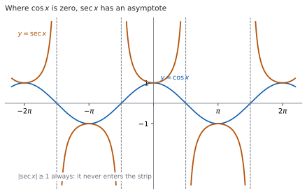
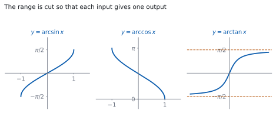

# HL 3.9 — Reciprocal and inverse trigonometric functions（相反三角関数と逆三角関数） {#sec-aahl-3-9}

::: {.callout-note}
## What you should be able to do
- $\sec\theta$、$\operatorname{cosec}\theta$、$\cot\theta$ の定義を書ける。
- それぞれが**定義されない角**を言える。
- $1+\tan^{2}\theta = \sec^{2}\theta$ と $1+\cot^{2}\theta = \operatorname{cosec}^{2}\theta$ を使える。
- この $2$ つを使って、三角方程式を解ける。
- $\arcsin x$、$\arccos x$、$\arctan x$ の**定義域と値域**を書ける。
- $3$ つのグラフの形を言える。
- $\arcsin\left(\sin\theta\right)$ が $\theta$ に戻らない場合を説明できる。
:::

## The idea

### 1. Reciprocal trigonometric ratios（相反三角比） {#reciprocals}

シラバスは、次のように書いています。

> Definition of the reciprocal trigonometric ratios $\sec\theta$, $\operatorname{cosec}\theta$ and $\cot\theta$.

$3$ つとも、**もとの比の逆数**です。

$$
\sec\theta = \frac{1}{\cos\theta}, \qquad
\operatorname{cosec}\theta = \frac{1}{\sin\theta}, \qquad
\cot\theta = \frac{1}{\tan\theta} = \frac{\cos\theta}{\sin\theta}
$$ {#eq-aahl39-definitions}

::: {.callout-important}
## 公式集にあるのは、$2$ つだけです
公式集の **3.9** の欄に、次の形で印刷されています。

> Reciprocal trigonometric identities
>
> $\sec\theta = \dfrac{1}{\cos\theta}$
>
> $\operatorname{cosec}\theta = \dfrac{1}{\sin\theta}$

**$\cot\theta$ は書かれていません。** $\cot\theta = \dfrac{1}{\tan\theta} = \dfrac{\cos\theta}{\sin\theta}$ は、自分で覚えてください。
:::

::: {.callout-tip}
## どの比の逆数か、見分け方
名前の**$3$ 文字目**を見ると分かります。

- $\mathrm{se}\underline{\mathrm{c}}$ → $\underline{\mathrm{c}}\mathrm{os}$ の逆数
- $\mathrm{co}\underline{\mathrm{s}}\mathrm{ec}$ → $\underline{\mathrm{s}}\mathrm{in}$ の逆数

**$\sec$ が $\sin$ の逆数ではない**ところが、取りちがえやすい場所です。
:::

### 2. Where they are undefined（定義されない角） {#undefined}

{#fig-aahl39-idea-a width=100%}

分母が $0$ になる角では、値がありません（[HL 2.16](../02-functions/aahl-2-16.qmd#reciprocal)）。

: 定義されない角 {#tbl-aahl39-undefined}

| 関数 | 分母 | 定義されない角 |
|---|---|---|
| $\sec\theta$ | $\cos\theta$ | $\theta = \dfrac{\pi}{2} + k\pi$ |
| $\operatorname{cosec}\theta$ | $\sin\theta$ | $\theta = k\pi$ |
| $\cot\theta$ | $\sin\theta$ | $\theta = k\pi$ |

（$k$ は整数です。）

@fig-aahl39-idea-a のとおり、$\sec$ のグラフは $\cos$ の零点で**垂直漸近線**をもちます。

**$\lvert \sec\theta \rvert \geq 1$ と $\lvert \operatorname{cosec}\theta \rvert \geq 1$ が、いつも成り立ちます。** $\lvert\cos\theta\rvert \leq 1$ の逆数だからです。**$-1$ と $1$ のあいだの値は取りません。**

### 3. The two Pythagorean identities（$2$ つの Pythagoras の恒等式） {#identities}

シラバスは、$2$ つを挙げています。

> Pythagorean identities:
>
> $1 + \tan^{2}\theta = \sec^{2}\theta$
>
> $1 + \cot^{2}\theta = \operatorname{cosec}^{2}\theta$

どちらも**公式集の 3.9 の欄にあります。** 覚えなくてよい代わりに、**どちらを使うかの判断**が要ります。

$$
1 + \tan^{2}\theta = \sec^{2}\theta
$$ {#eq-aahl39-tan-sec}

$$
1 + \cot^{2}\theta = \operatorname{cosec}^{2}\theta
$$ {#eq-aahl39-cot-csc}

**もとは $\cos^{2}\theta + \sin^{2}\theta = 1$ です**（[SL 3.6](../../aa-sl/03-geometry/aasl-3-6.qmd)）。両辺を $\cos^{2}\theta$ で割ると $1$ つ目、$\sin^{2}\theta$ で割ると $2$ つ目が出ます（[Why it works](#why-it-works)）。

::: {.callout-tip}
## $\tan$ と $\sec$ は組、$\cot$ と $\operatorname{cosec}$ は組
式に $\tan$ と $\sec$ が混ざっていたら @eq-aahl39-tan-sec、$\cot$ と $\operatorname{cosec}$ が混ざっていたら @eq-aahl39-cot-csc です。

**組み合わせを見るだけで、使う式が決まります。**
:::

### 4. Using the identities in equations（方程式で使う） {#using}

三角方程式に $\sec^{2}$ や $\tan$ が混ざっているときは、**片方にそろえます。**

$$
\sec^{2}\theta = 2\tan\theta
$$

を解きます。$\sec^{2}\theta$ を @eq-aahl39-tan-sec で書きかえると

$$
1 + \tan^{2}\theta = 2\tan\theta \ \Rightarrow \ \tan^{2}\theta - 2\tan\theta + 1 = 0
$$

$$
(\tan\theta - 1)^{2} = 0 \ \Rightarrow \ \tan\theta = 1
$$

です。**$\tan$ だけの $2$ 次方程式**になりました。$0 \leq \theta \leq 2\pi$ なら

$$
\theta = \frac{\pi}{4}, \qquad \theta = \frac{5\pi}{4}
$$

です（[SL 3.7a](../../aa-sl/03-geometry/aasl-3-7a.qmd)）。

$$
\text{$2$ 乗のほうを書きかえて、$1$ 種類にそろえる}
$$ {#eq-aahl39-strategy}

### 5. $\arcsin x$ and $\arccos x$（$\arcsin$ と $\arccos$） {#arcsin-arccos}

{#fig-aahl39-idea-b width=100%}

シラバスは、次のように書いています。

> The inverse functions $f(x) = \arcsin x$, $f(x) = \arccos x$, $f(x) = \arctan x$; their domains and ranges; their graphs.

$\sin$ は同じ値を何回もとるので、そのままでは逆関数がありません（[HL 2.14](../02-functions/aahl-2-14.qmd#restriction)）。そこで**定義域を切って**から、逆関数をつくります。

: $\arcsin$ と $\arccos$ {#tbl-aahl39-arcsin-arccos}

| 関数 | domain | range |
|---|---|---|
| $\arcsin x$ | $-1 \leq x \leq 1$ | $-\dfrac{\pi}{2} \leq y \leq \dfrac{\pi}{2}$ |
| $\arccos x$ | $-1 \leq x \leq 1$ | $0 \leq y \leq \pi$ |

**定義域が $-1 \leq x \leq 1$ なのは、$\sin$ と $\cos$ の値がその範囲しか取らないから**です。

**値域がちがう**ところに気をつけてください。@fig-aahl39-idea-b の左と真ん中です。$\arcsin$ は原点をはさんだ範囲、$\arccos$ は $0$ から $\pi$ までです。

### 6. $\arctan x$（$\arctan$） {#arctan}

$\tan$ はすべての実数を取るので、$\arctan$ の**定義域は実数全体**です。

: $\arctan$ {#tbl-aahl39-arctan}

| 関数 | domain | range |
|---|---|---|
| $\arctan x$ | $x \in \mathbb{R}$ | $-\dfrac{\pi}{2} < y < \dfrac{\pi}{2}$ |

**端が入りません。** $\tan\left(\pm\dfrac{\pi}{2}\right)$ に値がないからです。

@fig-aahl39-idea-b の右のとおり、**$y = \pm\dfrac{\pi}{2}$ が水平漸近線**です。$x$ をどれだけ大きくしても、$\dfrac{\pi}{2}$ には届きません。

### 7. Reading values of the inverse functions（逆関数の値を読む） {#values}

$\arcsin x$ の値を出すときは、**$2$ つのことを同時に考えます。**

1. $\sin(\ \ ) = x$ になる角
2. その角が**値域に入っている**こと

$\arcsin\left(-\dfrac{1}{2}\right)$ なら、$\sin\theta = -\dfrac{1}{2}$ になる角は無数にありますが、$-\dfrac{\pi}{2} \leq \theta \leq \dfrac{\pi}{2}$ に入るのは

$$
\theta = -\frac{\pi}{6}
$$

だけです。

::: {.callout-important}
## $\arcsin\left(\sin\theta\right)$ は、いつも $\theta$ に戻るわけではありません
$\theta$ が値域の中にあれば戻りますが、外にあると**別の角**が返ってきます。

$\sin\dfrac{3\pi}{4} = \dfrac{\sqrt{2}}{2}$ で、$\arcsin\dfrac{\sqrt{2}}{2} = \dfrac{\pi}{4}$ です。**$\dfrac{3\pi}{4}$ には戻りません。**

$\dfrac{3\pi}{4}$ が $\arcsin$ の値域 $\left[-\dfrac{\pi}{2},\ \dfrac{\pi}{2}\right]$ の外にあるからです。
:::

::: {.callout-tip collapse="true"}
## Paper 2 では、電卓に $\sec$ のキーはありません
TI-Nspire CX II には $\sin$、$\cos$、$\tan$ と、その逆関数のキーはありますが、**$\sec$・$\operatorname{cosec}$・$\cot$ のキーはありません。**

$\sec 1.2$ を出したいときは `1/cos(1.2)` と入力します。$\cot$ も `1/tan(` です。

**角の単位に気をつけてください。** ラジアンで答える問題なのに度になっていると、全部ずれます。画面の右上に `RAD` と出ているかを見てください。

逆関数のキーは `ctrl` のあとに `sin` などで出ます。**返ってくるのは値域の中の角だけ**です（[第 7 節](#values)）。

**Paper 1 では使えません。** このページの例題と演習は、すべて手で解けるようにしてあります。
:::

## Why it works

::: {.callout-tip collapse="true"}
## クリックすると開きます

#### $2$ つの恒等式は、$1$ つの式から出ます {#why-identities}

出発点は $\cos^{2}\theta + \sin^{2}\theta = 1$ です（[SL 3.6](../../aa-sl/03-geometry/aasl-3-6.qmd)）。

**両辺を $\cos^{2}\theta$ で割ります**（$\cos\theta \neq 0$ のとき）。

$$
\frac{\cos^{2}\theta}{\cos^{2}\theta} + \frac{\sin^{2}\theta}{\cos^{2}\theta}
= \frac{1}{\cos^{2}\theta}
$$

$\dfrac{\sin\theta}{\cos\theta} = \tan\theta$、$\dfrac{1}{\cos\theta} = \sec\theta$ なので

$$
1 + \tan^{2}\theta = \sec^{2}\theta
$$

です。**両辺を $\sin^{2}\theta$ で割ると**（$\sin\theta \neq 0$ のとき）、同じように

$$
\cot^{2}\theta + 1 = \operatorname{cosec}^{2}\theta
$$

が出ます。**覚える式が増えたのではなく、$1$ つの式の別の姿です。**

#### なぜ、値域を切らないといけないのか {#why-restrict}

$\sin\theta = \dfrac{1}{2}$ になる $\theta$ は、$\dfrac{\pi}{6}$、$\dfrac{5\pi}{6}$、$\dfrac{13\pi}{6}$、… と無数にあります。

「$\sin$ の逆」を関数にするには、**入力 $1$ つに出力 $1$ つ**でなければなりません（[HL 2.14](../02-functions/aahl-2-14.qmd#restriction)）。そこで、**どれを返すかを決めておきます。**

$\arcsin$ では $\left[-\dfrac{\pi}{2},\ \dfrac{\pi}{2}\right]$ を選びます。この範囲で $\sin$ は**ずっと増えつづける**ので、同じ値を $2$ 回とりません。

$\arccos$ で $\left[0,\ \pi\right]$ を選ぶのは、$\cos$ がこの範囲でずっと減りつづけるからです。**$\left[-\dfrac{\pi}{2},\ \dfrac{\pi}{2}\right]$ では $\cos$ が増えてから減る**ので、使えません。

#### $\arcsin x + \arccos x$ が $\dfrac{\pi}{2}$ になる理由 {#why-sum}

$\alpha = \arcsin x$ と置きます。$\sin\alpha = x$ で、$-\dfrac{\pi}{2} \leq \alpha \leq \dfrac{\pi}{2}$ です。

$\cos\left(\dfrac{\pi}{2} - \alpha\right) = \sin\alpha = x$ です。さらに $\alpha$ の範囲から

$$
0 \leq \frac{\pi}{2} - \alpha \leq \pi
$$

で、これは $\arccos$ の値域そのものです。ですから

$$
\arccos x = \frac{\pi}{2} - \alpha = \frac{\pi}{2} - \arcsin x
$$

です（[演習 7](#exercises)）。**値域に入っていることを確かめるところ**が、この証明の要です。

#### $\lvert \sec\theta \rvert \geq 1$ になる理由 {#why-size}

$-1 \leq \cos\theta \leq 1$ で、$\cos\theta \neq 0$ とします。すると $0 < \lvert\cos\theta\rvert \leq 1$ です。

$1$ 以下の正の数で $1$ を割ると、答えは $1$ 以上になります。ですから

$$
\lvert \sec\theta \rvert = \frac{1}{\lvert\cos\theta\rvert} \geq 1
$$

です。**$\sec\theta = 0.5$ のような式には、解がありません**（[演習 10](#exercises)）。@fig-aahl39-idea-a で、$\sec$ のグラフが $-1$ と $1$ のあいだに入っていないことが見えます。
:::

## Worked examples

::: {.callout-note appearance="simple"}
問題文は英語です。意味が理解できなかったら、問題文の下の「**日本語訳**」を開いてください。解説は日本語です。

**例題も演習も、すべて電卓なしで解けます。** Paper 1 のつもりで解いてください。
:::

::: {#exm-aahl39-values}
[Given that $\cos\theta = \dfrac{3}{5}$ and $\theta$ is acute, find the exact values of $\sec\theta$, $\operatorname{cosec}\theta$ and $\cot\theta$.]{.q-en}

日本語訳

$\cos\theta = \dfrac{3}{5}$ で $\theta$ が鋭角のとき、$\sec\theta$、$\operatorname{cosec}\theta$、$\cot\theta$ の正確な値を求めなさい。

---

**$\sec\theta$ は、逆数を取るだけです。**

$$
\sec\theta = \frac{1}{\cos\theta} = \frac{5}{3}
$$

$\operatorname{cosec}\theta$ には $\sin\theta$ が要ります。$\cos^{2}\theta + \sin^{2}\theta = 1$ から

$$
\sin^{2}\theta = 1 - \frac{9}{25} = \frac{16}{25} \ \Rightarrow \ \sin\theta = \frac{4}{5}
$$

です。**$\theta$ が鋭角なので、正のほうを取ります。**

$$
\operatorname{cosec}\theta = \frac{5}{4}
$$

$\cot\theta$ は @eq-aahl39-definitions から

$$
\cot\theta = \frac{\cos\theta}{\sin\theta} = \frac{3/5}{4/5} = \frac{3}{4}
$$

です。

**検算。** **@eq-aahl39-tan-sec で確かめます。** $\tan\theta = \dfrac{4}{3}$ なので

$$
1 + \left(\frac{4}{3}\right)^{2} = 1 + \frac{16}{9} = \frac{25}{9}, \qquad
\left(\frac{5}{3}\right)^{2} = \frac{25}{9}
$$

合いました ✓

**検算（$3$ 対 $4$ 対 $5$ の直角三角形で）。** 隣辺 $3$、対辺 $4$、斜辺 $5$ です。$\cot\theta$ は $\tan\theta$ の逆数なので $\dfrac{3}{4}$ ✓ **図でも合っています。**

::: {.callout-note}
## 解答例（答案用紙に書くこと）

$$\sec\theta = \frac{1}{\cos\theta} = \frac{5}{3}$$

$$\sin^{2}\theta = 1-\frac{9}{25} = \frac{16}{25}, \quad \sin\theta = \frac{4}{5} \ (\theta \text{ is acute})$$

$$\operatorname{cosec}\theta = \frac{5}{4}, \qquad \cot\theta = \frac{\cos\theta}{\sin\theta} = \frac{3}{4}$$
:::
:::

::: {#exm-aahl39-identity}
[Show that $\sec^{2}\theta + \operatorname{cosec}^{2}\theta = \sec^{2}\theta \operatorname{cosec}^{2}\theta$.]{.q-en}

日本語訳

$\sec^{2}\theta + \operatorname{cosec}^{2}\theta = \sec^{2}\theta \operatorname{cosec}^{2}\theta$ を示しなさい。

---

**左辺から始めます**（[SL 1.6](../../aa-sl/01-number-and-algebra/aasl-1-6.qmd#lhs-rhs)）。定義で書き直します。

$$
\text{LHS} = \frac{1}{\cos^{2}\theta} + \frac{1}{\sin^{2}\theta}
$$

**通分します。** 分母は $\sin^{2}\theta\cos^{2}\theta$ です。

$$
= \frac{\sin^{2}\theta + \cos^{2}\theta}{\sin^{2}\theta\cos^{2}\theta}
= \frac{1}{\sin^{2}\theta\cos^{2}\theta}
$$

$\cos^{2}\theta + \sin^{2}\theta = 1$ を使いました。最後に、**$2$ つの分数に分け直します。**

$$
= \frac{1}{\cos^{2}\theta} \times \frac{1}{\sin^{2}\theta}
= \sec^{2}\theta \operatorname{cosec}^{2}\theta = \text{RHS}
$$

**検算。** **$\theta = \dfrac{\pi}{4}$ を入れます。** $\cos = \sin = \dfrac{\sqrt{2}}{2}$ なので $\sec^{2} = \operatorname{cosec}^{2} = 2$ です。左辺は $2+2 = 4$、右辺は $2 \times 2 = 4$ ✓

**検算（$\theta = \dfrac{\pi}{6}$ で）。** $\cos^{2} = \dfrac{3}{4}$、$\sin^{2} = \dfrac{1}{4}$ なので、左辺は $\dfrac{4}{3}+4 = \dfrac{16}{3}$、右辺は $\dfrac{4}{3} \times 4 = \dfrac{16}{3}$ ✓

::: {.callout-note}
## 解答例（答案用紙に書くこと）

$$\text{LHS} = \frac{1}{\cos^{2}\theta} + \frac{1}{\sin^{2}\theta}
= \frac{\sin^{2}\theta+\cos^{2}\theta}{\sin^{2}\theta\cos^{2}\theta}$$

$$= \frac{1}{\sin^{2}\theta\cos^{2}\theta}
= \frac{1}{\cos^{2}\theta} \cdot \frac{1}{\sin^{2}\theta}
= \sec^{2}\theta\operatorname{cosec}^{2}\theta = \text{RHS}$$
:::
:::

::: {#exm-aahl39-equation}
[Solve $\sec^{2}\theta = 2\tan\theta$ for $0 \leq \theta \leq 2\pi$.]{.q-en}

日本語訳

$0 \leq \theta \leq 2\pi$ の範囲で $\sec^{2}\theta = 2\tan\theta$ を解きなさい。

---

$\sec$ と $\tan$ が混ざっているので、@eq-aahl39-tan-sec を使います（[第 3 節](#identities)）。

$$
1 + \tan^{2}\theta = 2\tan\theta
$$

$$
\tan^{2}\theta - 2\tan\theta + 1 = 0 \ \Rightarrow \ (\tan\theta - 1)^{2} = 0
$$

$$
\tan\theta = 1
$$

$0 \leq \theta \leq 2\pi$ で $\tan\theta = 1$ になるのは

$$
\theta = \frac{\pi}{4}, \qquad \theta = \frac{5\pi}{4}
$$

です。**$\tan$ の周期は $\pi$ なので、$2\pi$ までに $2$ つ**あります。

**検算。** **$\theta = \dfrac{\pi}{4}$ を入れます。** $\cos\dfrac{\pi}{4} = \dfrac{\sqrt{2}}{2}$ なので $\sec^{2}\dfrac{\pi}{4} = \dfrac{1}{1/2} = 2$ です。右辺は $2\tan\dfrac{\pi}{4} = 2$ ✓

**検算（$\theta = \dfrac{5\pi}{4}$ で）。** $\cos\dfrac{5\pi}{4} = -\dfrac{\sqrt{2}}{2}$ なので $\sec^{2} = 2$、$\tan\dfrac{5\pi}{4} = 1$ で右辺も $2$ ✓ **$\cos$ が負でも、$2$ 乗で消えます。**

::: {.callout-note}
## 解答例（答案用紙に書くこと）

$$\sec^{2}\theta = 1+\tan^{2}\theta, \quad \text{so} \quad 1+\tan^{2}\theta = 2\tan\theta$$

$$\tan^{2}\theta-2\tan\theta+1 = 0, \quad (\tan\theta-1)^{2} = 0, \quad \tan\theta = 1$$

$$\theta = \frac{\pi}{4}, \qquad \theta = \frac{5\pi}{4}$$
:::
:::

::: {#exm-aahl39-inverse}
**(a)** [Write down the domain and the range of $\arccos$.]{.q-en}

**(b)** [Find the exact value of $\arcsin\left(-\dfrac{1}{2}\right) + \arccos\left(-\dfrac{1}{2}\right)$.]{.q-en}

**(c)** [Explain why $\arcsin\left(\sin\dfrac{3\pi}{4}\right)$ is not equal to $\dfrac{3\pi}{4}$.]{.q-en}

日本語訳

**(a)** $\arccos$ の定義域と値域を書きなさい。

**(b)** $\arcsin\left(-\dfrac{1}{2}\right) + \arccos\left(-\dfrac{1}{2}\right)$ の正確な値を求めなさい。

**(c)** $\arcsin\left(\sin\dfrac{3\pi}{4}\right)$ が $\dfrac{3\pi}{4}$ に等しくない理由を説明しなさい。

---

**(a)** [第 5 節](#arcsin-arccos) の表のとおりです。

$$
\text{domain: } -1 \leq x \leq 1, \qquad \text{range: } 0 \leq y \leq \pi
$$

**(b)** $\sin\theta = -\dfrac{1}{2}$ で $-\dfrac{\pi}{2} \leq \theta \leq \dfrac{\pi}{2}$ に入るのは $-\dfrac{\pi}{6}$ です。

$\cos\theta = -\dfrac{1}{2}$ で $0 \leq \theta \leq \pi$ に入るのは $\dfrac{2\pi}{3}$ です。

$$
-\frac{\pi}{6} + \frac{2\pi}{3} = \frac{-\pi + 4\pi}{6} = \frac{\pi}{2}
$$

**(c)** $\sin\dfrac{3\pi}{4} = \dfrac{\sqrt{2}}{2}$ です。$\arcsin\dfrac{\sqrt{2}}{2} = \dfrac{\pi}{4}$ なので、$\dfrac{3\pi}{4}$ には戻りません。

::: {.model-answer}
**試験ではこう書く**

*The function $\arcsin$ returns the angle in its range $\left[-\dfrac{\pi}{2},\ \dfrac{\pi}{2}\right]$ whose sine is the given number, and it can return no other angle. Here $\sin\dfrac{3\pi}{4} = \dfrac{\sqrt{2}}{2}$, so $\arcsin\left(\sin\dfrac{3\pi}{4}\right) = \arcsin\dfrac{\sqrt{2}}{2}$. The angle in $\left[-\dfrac{\pi}{2},\ \dfrac{\pi}{2}\right]$ whose sine is $\dfrac{\sqrt{2}}{2}$ is $\dfrac{\pi}{4}$, so the value is $\dfrac{\pi}{4}$. The angle $\dfrac{3\pi}{4}$ has the same sine, but it lies outside the range of $\arcsin$, so it cannot be returned. In general $\arcsin(\sin\theta) = \theta$ only when $\theta$ itself lies in $\left[-\dfrac{\pi}{2},\ \dfrac{\pi}{2}\right]$.*
:::

（$\arcsin$ は値域の中の角しか返さない。$\dfrac{3\pi}{4}$ は値域の外なので、同じ $\sin$ の値をもつ $\dfrac{\pi}{4}$ が返る、という意味です。）

**検算。** **(b) を @eq-aahl39-definitions ではなく、[Why it works](#why-sum) の式で確かめます。** $\arcsin x + \arccos x = \dfrac{\pi}{2}$ なので、$x = -\dfrac{1}{2}$ でも $\dfrac{\pi}{2}$ ✓

**検算（(c) を数で）。** $\sin\dfrac{\pi}{4} = \dfrac{\sqrt{2}}{2}$ と $\sin\dfrac{3\pi}{4} = \dfrac{\sqrt{2}}{2}$ で、確かに同じ値です ✓ **戻り先は $1$ つしか選べません。**

::: {.callout-note}
## 解答例（答案用紙に書くこと）

**(a)** *Domain: $-1 \leq x \leq 1$. Range: $0 \leq y \leq \pi$.*

**(b)** $\arcsin\left(-\dfrac{1}{2}\right) = -\dfrac{\pi}{6}$, $\ \arccos\left(-\dfrac{1}{2}\right) = \dfrac{2\pi}{3}$

$$-\frac{\pi}{6}+\frac{2\pi}{3} = \frac{\pi}{2}$$

**(c)** *$\sin\dfrac{3\pi}{4} = \dfrac{\sqrt{2}}{2}$ and $\arcsin\dfrac{\sqrt{2}}{2} = \dfrac{\pi}{4}$, since $\dfrac{\pi}{4}$ is in the range of $\arcsin$ while $\dfrac{3\pi}{4}$ is not.*
:::
:::

## Common errors

::: {.callout-warning}
## $\sec$ を $\sin$ の逆数と思う
$\sec\theta = \dfrac{1}{\cos\theta}$ です（[第 1 節](#reciprocals)）。名前の $3$ 文字目で見分けてください。

$\operatorname{cosec}\theta$ のほうが $\sin$ の逆数です。**最初の $2$ 文字 `co` にひっぱられない**ことです。
:::

::: {.callout-warning}
## $\cot$ の式を公式集で探す
公式集の **3.9** には $\sec$ と $\operatorname{cosec}$ しかありません（[第 1 節](#reciprocals)）。

$\cot\theta = \dfrac{1}{\tan\theta} = \dfrac{\cos\theta}{\sin\theta}$ は、**自分で覚えておく**必要があります。
:::

::: {.callout-warning}
## 使う恒等式を取りちがえる
$\tan$ が出てくる式に $1+\cot^{2}\theta = \operatorname{cosec}^{2}\theta$ を使っても、進みません。

**$\tan$ と $\sec$、$\cot$ と $\operatorname{cosec}$ が組**です（[第 3 節](#identities)）。式に何が混ざっているかを先に見てください。
:::

::: {.callout-warning}
## $\arcsin$ と $\arccos$ の値域を入れかえる
$\arcsin$ は $\left[-\dfrac{\pi}{2},\ \dfrac{\pi}{2}\right]$、$\arccos$ は $\left[0,\ \pi\right]$ です（[第 5 節](#arcsin-arccos)）。

**$\arccos$ には負の値がありません。** $\arccos\left(-\dfrac{1}{2}\right)$ は $-\dfrac{2\pi}{3}$ ではなく $\dfrac{2\pi}{3}$ です。
:::

::: {.callout-warning}
## $\arcsin(\sin\theta) = \theta$ といつも書く
$\theta$ が値域の外にあると、戻りません（[第 7 節](#values)）。

**$\theta$ が $\left[-\dfrac{\pi}{2},\ \dfrac{\pi}{2}\right]$ に入っているかを確かめてから**使ってください。
:::

::: {.callout-warning}
## $\lvert \sec\theta \rvert < 1$ の式に答えを出す
$\sec\theta = 0.5$ や $\operatorname{cosec}\theta = -\dfrac{1}{2}$ には、**解がありません**（[第 2 節](#undefined)）。

$\lvert\cos\theta\rvert \leq 1$ の逆数なので、$\lvert\sec\theta\rvert$ は必ず $1$ 以上です。**まず大きさを見てください。**
:::

## Exercises

::: {.callout-note appearance="simple"}
各問題に、折りたたみが $3$ つ付いています。**日本語訳**、**解答例**（答案用紙に書くべきこと。英語です）、**解説**（なぜそうなるか。日本語です）。

まず自分で解いて、次に解答例と見くらべてください。**解説は、合わなかったときだけ開けば十分です。**
:::

::: {.exercise-block}

[1]{.ex-no} [Given that $\sin\theta = \dfrac{5}{13}$ and $\theta$ is acute, find the exact values of $\operatorname{cosec}\theta$, $\sec\theta$ and $\cot\theta$.]{.q-en}

日本語訳

$\sin\theta = \dfrac{5}{13}$ で $\theta$ が鋭角のとき、$\operatorname{cosec}\theta$、$\sec\theta$、$\cot\theta$ の正確な値を求めなさい。

::: {.callout-note collapse="true"}
## 解答例（答案用紙に書くこと）

$$\operatorname{cosec}\theta = \frac{13}{5}$$

$$\cos^{2}\theta = 1-\frac{25}{169} = \frac{144}{169}, \quad \cos\theta = \frac{12}{13} \ (\theta \text{ is acute})$$

$$\sec\theta = \frac{13}{12}, \qquad \cot\theta = \frac{\cos\theta}{\sin\theta} = \frac{12}{5}$$
:::

::: {.callout-tip collapse="true"}
## 解説

$5$ 対 $12$ 対 $13$ の直角三角形です。**鋭角なので、$\cos\theta$ は正**を取ります（[例題 1](#exm-aahl39-values)）。

**検算。** @eq-aahl39-cot-csc で確かめます。$1 + \left(\dfrac{12}{5}\right)^{2} = 1+\dfrac{144}{25} = \dfrac{169}{25}$、$\left(\dfrac{13}{5}\right)^{2} = \dfrac{169}{25}$ ✓

**検算（辺の長さで）。** $5^{2}+12^{2} = 25+144 = 169 = 13^{2}$ ✓ **三平方の定理に合っています。**
:::

::: {.ex-sep}
:::

[2]{.ex-no} [Show that $\cot^{2}\theta - \cos^{2}\theta = \cot^{2}\theta\cos^{2}\theta$.]{.q-en}

日本語訳

$\cot^{2}\theta - \cos^{2}\theta = \cot^{2}\theta\cos^{2}\theta$ を示しなさい。

::: {.callout-note collapse="true"}
## 解答例（答案用紙に書くこと）

$$\text{LHS} = \frac{\cos^{2}\theta}{\sin^{2}\theta} - \cos^{2}\theta
= \cos^{2}\theta\left(\frac{1}{\sin^{2}\theta}-1\right)$$

$$= \cos^{2}\theta \cdot \frac{1-\sin^{2}\theta}{\sin^{2}\theta}
= \cos^{2}\theta \cdot \frac{\cos^{2}\theta}{\sin^{2}\theta}
= \cot^{2}\theta\cos^{2}\theta = \text{RHS}$$
:::

::: {.callout-tip collapse="true"}
## 解説

**$\cos^{2}\theta$ でくくる**のが、いちばん短い道です。かっこの中は $\dfrac{1}{\sin^{2}\theta}-1$ で、通分すると $1-\sin^{2}\theta = \cos^{2}\theta$ が出ます。

**検算。** $\theta = \dfrac{\pi}{4}$ で確かめます。$\cot^{2} = 1$、$\cos^{2} = \dfrac{1}{2}$ なので、左辺は $1-\dfrac{1}{2} = \dfrac{1}{2}$、右辺は $1 \times \dfrac{1}{2} = \dfrac{1}{2}$ ✓

**検算（$\theta = \dfrac{\pi}{3}$ で）。** $\cot^{2} = \dfrac{1}{3}$、$\cos^{2} = \dfrac{1}{4}$ です。左辺は $\dfrac{1}{3}-\dfrac{1}{4} = \dfrac{1}{12}$、右辺は $\dfrac{1}{3} \times \dfrac{1}{4} = \dfrac{1}{12}$ ✓
:::

::: {.ex-sep}
:::

[3]{.ex-no} [Solve $\tan^{2}\theta = \sec\theta + 1$ for $0 \leq \theta \leq 2\pi$.]{.q-en}

日本語訳

$0 \leq \theta \leq 2\pi$ の範囲で $\tan^{2}\theta = \sec\theta + 1$ を解きなさい。

::: {.callout-note collapse="true"}
## 解答例（答案用紙に書くこと）

$$\tan^{2}\theta = \sec^{2}\theta - 1, \quad \text{so} \quad \sec^{2}\theta - 1 = \sec\theta + 1$$

$$\sec^{2}\theta - \sec\theta - 2 = 0, \quad (\sec\theta-2)(\sec\theta+1) = 0$$

*$\sec\theta = 2$ gives $\cos\theta = \dfrac{1}{2}$, so $\theta = \dfrac{\pi}{3}$ or $\theta = \dfrac{5\pi}{3}$.*

*$\sec\theta = -1$ gives $\cos\theta = -1$, so $\theta = \pi$.*

$$\theta = \frac{\pi}{3}, \quad \pi, \quad \frac{5\pi}{3}$$
:::

::: {.callout-tip collapse="true"}
## 解説

**$\tan^{2}\theta$ のほうを書きかえて、$\sec$ だけにそろえます**（@eq-aahl39-strategy）。$\sec$ の $2$ 次方程式になります。

$\sec\theta = k$ は $\cos\theta = \dfrac{1}{k}$ と同じです。**逆数を取ってから、ふつうの三角方程式として解きます。**

**検算。** $\theta = \dfrac{\pi}{3}$ では $\tan^{2} = 3$、$\sec+1 = 2+1 = 3$ ✓

**検算（$\theta = \pi$ で）。** $\tan\pi = 0$ なので左辺は $0$、$\sec\pi = -1$ なので右辺は $-1+1 = 0$ ✓
:::

::: {.ex-sep}
:::

[4]{.ex-no} [Solve $\sec^{2}\theta = 4$ for $0 \leq \theta \leq 2\pi$.]{.q-en}

日本語訳

$0 \leq \theta \leq 2\pi$ の範囲で $\sec^{2}\theta = 4$ を解きなさい。

::: {.callout-note collapse="true"}
## 解答例（答案用紙に書くこと）

$$\sec^{2}\theta = 4 \ \Rightarrow \ \cos^{2}\theta = \frac{1}{4} \ \Rightarrow \ \cos\theta = \pm\frac{1}{2}$$

$$\theta = \frac{\pi}{3}, \quad \frac{2\pi}{3}, \quad \frac{4\pi}{3}, \quad \frac{5\pi}{3}$$
:::

::: {.callout-tip collapse="true"}
## 解説

**$\cos^{2}\theta$ に直してから**、$\pm$ の両方を取ります。$4$ つ出ます。

$\pm$ の片方だけを取ると、答えが半分になります（[HL 2.15](../02-functions/aahl-2-15.qmd#analytic) の $2$ 乗の話と同じです）。

**検算。** $\theta = \dfrac{2\pi}{3}$ では $\cos = -\dfrac{1}{2}$、$\sec = -2$、$\sec^{2} = 4$ ✓

**検算（個数で）。** $\cos\theta = \dfrac{1}{2}$ で $2$ つ、$\cos\theta = -\dfrac{1}{2}$ で $2$ つ、合わせて $4$ つ ✓
:::

::: {.ex-sep}
:::

[5]{.ex-no} [Write down the domain and the range of $\arcsin$, of $\arccos$ and of $\arctan$.]{.q-en}

日本語訳

$\arcsin$、$\arccos$、$\arctan$ の定義域と値域を書きなさい。

::: {.callout-note collapse="true"}
## 解答例（答案用紙に書くこと）

*$\arcsin$: domain $-1 \leq x \leq 1$, range $-\dfrac{\pi}{2} \leq y \leq \dfrac{\pi}{2}$.*

*$\arccos$: domain $-1 \leq x \leq 1$, range $0 \leq y \leq \pi$.*

*$\arctan$: domain $x \in \mathbb{R}$, range $-\dfrac{\pi}{2} < y < \dfrac{\pi}{2}$.*
:::

::: {.callout-tip collapse="true"}
## 解説

**$\arctan$ だけ、定義域が実数全体で、値域の端が入りません**（[第 6 節](#arctan)）。$\tan\left(\pm\dfrac{\pi}{2}\right)$ に値がないからです。

**検算。** $\arctan$ のグラフには水平漸近線 $y = \pm\dfrac{\pi}{2}$ があります（@fig-aahl39-idea-b）✓ 端に届きません。

**検算（$\arcsin$ の定義域）。** $\sin\theta$ の値は $-1$ から $1$ までです。$\arcsin$ の定義域は、その範囲と同じ ✓
:::

::: {.ex-sep}
:::

[6]{.ex-no} [Find the exact value of each of the following: **(a)** $\arctan\sqrt{3}$, **(b)** $\arccos\left(-\dfrac{\sqrt{2}}{2}\right)$, **(c)** $\arcsin\left(\sin\dfrac{5\pi}{6}\right)$.]{.q-en}

日本語訳

次のそれぞれの正確な値を求めなさい。**(a)** $\arctan\sqrt{3}$、**(b)** $\arccos\left(-\dfrac{\sqrt{2}}{2}\right)$、**(c)** $\arcsin\left(\sin\dfrac{5\pi}{6}\right)$。

::: {.callout-note collapse="true"}
## 解答例（答案用紙に書くこと）

**(a)** $\tan\dfrac{\pi}{3} = \sqrt{3}$ *and* $\dfrac{\pi}{3}$ *is in the range, so* $\arctan\sqrt{3} = \dfrac{\pi}{3}$.

**(b)** $\cos\dfrac{3\pi}{4} = -\dfrac{\sqrt{2}}{2}$ *and* $\dfrac{3\pi}{4}$ *is in the range, so the value is* $\dfrac{3\pi}{4}$.

**(c)** $\sin\dfrac{5\pi}{6} = \dfrac{1}{2}$, *and* $\arcsin\dfrac{1}{2} = \dfrac{\pi}{6}$.
:::

::: {.callout-tip collapse="true"}
## 解説

**どれも「値域に入る角を選ぶ」ところが要です**（[第 7 節](#values)）。

(c) では $\dfrac{5\pi}{6}$ が $\arcsin$ の値域の外なので、$\dfrac{\pi}{6}$ が返ります（[例題 4](#exm-aahl39-inverse)）。

**検算。** (b) を逆にたどります。$\cos\dfrac{3\pi}{4} = -\dfrac{\sqrt{2}}{2}$ ✓ $\dfrac{3\pi}{4}$ は $\left[0,\ \pi\right]$ に入っています ✓

**検算（(c) を数で）。** $\sin\dfrac{5\pi}{6}$ と $\sin\dfrac{\pi}{6}$ はどちらも $\dfrac{1}{2}$ ✓ 返るのは値域の中の $\dfrac{\pi}{6}$ です。
:::

::: {.ex-sep}
:::

[7]{.ex-no} [Show that $\arcsin x + \arccos x = \dfrac{\pi}{2}$ for every $x$ with $-1 \leq x \leq 1$.]{.q-en}

日本語訳

$-1 \leq x \leq 1$ を満たすすべての $x$ について $\arcsin x + \arccos x = \dfrac{\pi}{2}$ であることを示しなさい。

::: {.callout-note collapse="true"}
## 解答例（答案用紙に書くこと）

*Let $\alpha = \arcsin x$, so $\sin\alpha = x$ and $-\dfrac{\pi}{2} \leq \alpha \leq \dfrac{\pi}{2}$.*

$$\cos\left(\frac{\pi}{2}-\alpha\right) = \sin\alpha = x$$

*From $-\dfrac{\pi}{2} \leq \alpha \leq \dfrac{\pi}{2}$ we get $0 \leq \dfrac{\pi}{2}-\alpha \leq \pi$, which is the range of $\arccos$.*

$$\arccos x = \frac{\pi}{2}-\alpha, \quad \text{so} \quad \arcsin x + \arccos x = \alpha + \frac{\pi}{2} - \alpha = \frac{\pi}{2}$$
:::

::: {.callout-tip collapse="true"}
## 解説

**$\dfrac{\pi}{2}-\alpha$ が $\arccos$ の値域に入っていることを書くところ**が、この証明の要です（[Why it works](#why-sum)）。これがないと、「$\cos$ の値が同じ角」の $1$ つでしかありません。

**検算。** $x = 0$ では $\arcsin 0 = 0$、$\arccos 0 = \dfrac{\pi}{2}$ で、和は $\dfrac{\pi}{2}$ ✓

**検算（$x = 1$ で）。** $\arcsin 1 = \dfrac{\pi}{2}$、$\arccos 1 = 0$ で、和は $\dfrac{\pi}{2}$ ✓ **端でも成り立ちます。**

::: {.model-answer}
**試験ではこう書く**

*Let $\alpha = \arcsin x$. By the definition of $\arcsin$ this means $\sin\alpha = x$ and $-\dfrac{\pi}{2} \leq \alpha \leq \dfrac{\pi}{2}$. Using $\cos\left(\dfrac{\pi}{2}-\alpha\right) = \sin\alpha$, we get $\cos\left(\dfrac{\pi}{2}-\alpha\right) = x$. Multiplying the inequality $-\dfrac{\pi}{2} \leq \alpha \leq \dfrac{\pi}{2}$ by $-1$ and adding $\dfrac{\pi}{2}$ gives $0 \leq \dfrac{\pi}{2}-\alpha \leq \pi$, and this is exactly the range of $\arccos$. So $\dfrac{\pi}{2}-\alpha$ is the angle that $\arccos$ returns for the input $x$, that is $\arccos x = \dfrac{\pi}{2}-\alpha$. Adding, $\arcsin x + \arccos x = \alpha + \left(\dfrac{\pi}{2}-\alpha\right) = \dfrac{\pi}{2}$ for every $x$ in $[-1,\ 1]$.*
:::
:::

::: {.ex-sep}
:::

[8]{.ex-no} [Explain why the domain of $\arcsin$ must be $-1 \leq x \leq 1$.]{.q-en}

日本語訳

$\arcsin$ の定義域が $-1 \leq x \leq 1$ でなければならない理由を説明しなさい。

::: {.callout-note collapse="true"}
## 解答例（答案用紙に書くこと）

*The domain of an inverse function is the range of the original function.*

*For every real $\theta$, $-1 \leq \sin\theta \leq 1$, so the range of $\sin$ is $[-1,\ 1]$.*

*Hence $\arcsin x$ is defined only for $-1 \leq x \leq 1$: for any other $x$ there is no angle whose sine is $x$.*
:::

::: {.callout-tip collapse="true"}
## 解説

**逆関数の定義域は、もとの関数の値域**です（[HL 2.14](../02-functions/aahl-2-14.qmd#domain-range)）。

$\sin$ の値が $-1$ から $1$ までしかないことが、そのまま理由になります。

**検算。** $\arcsin 2$ を考えます。$\sin\theta = 2$ になる実数 $\theta$ はありません ✓

**検算（端で）。** $\arcsin 1 = \dfrac{\pi}{2}$ で、$\sin\dfrac{\pi}{2} = 1$ ✓ **端は定義されています。**

::: {.model-answer}
**試験ではこう書く**

*By definition, $\arcsin x$ is the angle whose sine is $x$, so a value of $\arcsin x$ exists only when some angle actually has sine equal to $x$. For every real number $\theta$ the point $(\cos\theta,\ \sin\theta)$ lies on the unit circle, so $\sin^{2}\theta \leq 1$ and hence $-1 \leq \sin\theta \leq 1$. The range of the sine function is therefore $[-1,\ 1]$, and there is no angle whose sine is, say, $2$. Since the domain of an inverse function is the range of the original function, the domain of $\arcsin$ is $-1 \leq x \leq 1$. Every value in that interval is attained by $\sin$ on $\left[-\dfrac{\pi}{2},\ \dfrac{\pi}{2}\right]$, so no value of the interval has to be left out either.*
:::
:::

::: {.ex-sep}
:::

[9]{.ex-no} [Solve $3\cot^{2}\theta = 1$ for $0 < \theta < \pi$.]{.q-en}

日本語訳

$0 < \theta < \pi$ の範囲で $3\cot^{2}\theta = 1$ を解きなさい。

::: {.callout-note collapse="true"}
## 解答例（答案用紙に書くこと）

$$\cot^{2}\theta = \frac{1}{3} \ \Rightarrow \ \cot\theta = \pm\frac{1}{\sqrt{3}}
\ \Rightarrow \ \tan\theta = \pm\sqrt{3}$$

$$\theta = \frac{\pi}{3}, \qquad \theta = \frac{2\pi}{3}$$
:::

::: {.callout-tip collapse="true"}
## 解説

**$\cot$ の逆数を取って $\tan$ に直す**と、知っている形になります（[第 1 節](#reciprocals)）。

$0 < \theta < \pi$ では、$\tan\theta = \sqrt{3}$ から $\dfrac{\pi}{3}$、$\tan\theta = -\sqrt{3}$ から $\dfrac{2\pi}{3}$ が出ます。

**検算。** $\theta = \dfrac{2\pi}{3}$ では $\tan = -\sqrt{3}$、$\cot = -\dfrac{1}{\sqrt{3}}$、$3\cot^{2} = 3 \times \dfrac{1}{3} = 1$ ✓

**検算（$\pm$ の両方）。** $\theta = \dfrac{\pi}{3}$ でも $3 \times \dfrac{1}{3} = 1$ ✓ **$2$ 乗なので、符号は消えます。**
:::

::: {.ex-sep}
:::

[10]{.ex-no} [A student solves $\sec\theta = \dfrac{1}{2}$ and gives the answer $\theta = \dfrac{\pi}{3}$. Explain the error.]{.q-en}

日本語訳

ある生徒が $\sec\theta = \dfrac{1}{2}$ を解いて、$\theta = \dfrac{\pi}{3}$ と答えました。まちがいを説明しなさい。

::: {.callout-note collapse="true"}
## 解答例（答案用紙に書くこと）

*$\sec\theta = \dfrac{1}{2}$ means $\dfrac{1}{\cos\theta} = \dfrac{1}{2}$, that is $\cos\theta = 2$.*

*But $-1 \leq \cos\theta \leq 1$ for every real $\theta$, so no angle satisfies the equation: it has no solutions.*

*The student has solved $\cos\theta = \dfrac{1}{2}$ instead, which is a different equation.*
:::

::: {.callout-tip collapse="true"}
## 解説

**$\sec\theta$ と $\cos\theta$ を取りちがえたのが、まちがいのもと**です。$\sec\theta = \dfrac{1}{2}$ なら $\cos\theta = 2$ です。

$\lvert\sec\theta\rvert \geq 1$ なので、$\dfrac{1}{2}$ という値はそもそも出ません（[Why it works](#why-size)）。

**検算。** $\theta = \dfrac{\pi}{3}$ を入れると $\cos\dfrac{\pi}{3} = \dfrac{1}{2}$ なので $\sec\dfrac{\pi}{3} = 2$ です ✓ $\dfrac{1}{2}$ ではありません。

**検算（グラフで）。** @fig-aahl39-idea-a で、$\sec$ のグラフは $-1$ と $1$ のあいだに入っていません ✓

::: {.model-answer}
**試験ではこう書く**

*By definition $\sec\theta = \dfrac{1}{\cos\theta}$, so the equation $\sec\theta = \dfrac{1}{2}$ is equivalent to $\dfrac{1}{\cos\theta} = \dfrac{1}{2}$, that is $\cos\theta = 2$. For every real $\theta$ the cosine satisfies $-1 \leq \cos\theta \leq 1$, so $\cos\theta = 2$ is impossible and the equation has no solutions at all. The student appears to have replaced $\sec\theta$ by $\cos\theta$ and solved $\cos\theta = \dfrac{1}{2}$, which does have the solution $\theta = \dfrac{\pi}{3}$ but is a different equation. Checking the proposed answer confirms the error: $\cos\dfrac{\pi}{3} = \dfrac{1}{2}$, so $\sec\dfrac{\pi}{3} = 2$, not $\dfrac{1}{2}$. In general $\lvert\sec\theta\rvert \geq 1$, so any equation of the form $\sec\theta = k$ with $\lvert k \rvert < 1$ has no solutions.*
:::
:::

:::
