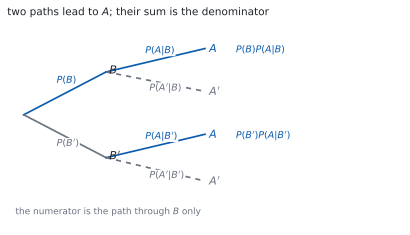
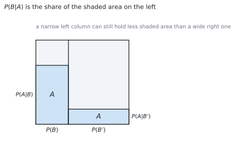

# HL 4.13 — Bayes' theorem（Bayes の定理） {#sec-aahl-4-13}

::: {.callout-note}
## What you should be able to do
- **条件つき確率**の式を、両向きに使える。
- **Bayes の定理**で、条件をひっくり返せる。
- 分母が **$P(A)$** であることを説明できる。
- $2$ 分岐でも $3$ 分岐でも使える（シラバスは $3$ 事象まで）。
- 樹形図や面積図から、分子と分母を読み取れる。
- 検査の問題で、答えが意外に小さくなる理由を説明できる。
:::

## The idea

### 1. Conditional probability（条件つき確率のおさらい） {#conditional}

「$B$ が起きたと分かっているとき、$A$ が起きる確率」を $P(A \mid B)$ と書きました（[SL 4.11](../../aa-sl/04-statistics-and-probability/aasl-4-11.qmd#formula)）。

$$
P(A \mid B) = \frac{P(A \cap B)}{P(B)}
$$ {#eq-aahl413-conditional}

**縦棒の右が「分かっていること」**です。ここを取りちがえると、問題がまるごと別ものになります。

かけ算の形に直すと、次の式になります。この形を、このページでは何度も使います。

$$
P(A \cap B) = P(B)\,P(A \mid B)
$$ {#eq-aahl413-product}

### 2. Reversing the condition（条件をひっくり返す） {#reversing}

シラバスは、この項目をこう書いています。

> Use of Bayes' theorem for a maximum of three events.

問題の多くは、**知りたい向きと、与えられている向きが逆**です。

- 与えられる … $P(\text{陽性} \mid \text{病気})$（検査の性能）
- 知りたい … $P(\text{病気} \mid \text{陽性})$（検査を受けた人の心配）

**この $2$ つはちがう数**です。ひっくり返すのが Bayes の定理です。

{#fig-aahl413-idea-a width=100%}

### 3. Bayes' theorem for two events（$2$ 分岐の Bayes） {#two-events}

公式集の **4.13** の欄にあります。

> Bayes' theorem

$$
P(B \mid A) = \frac{P(B)\,P(A \mid B)}
{P(B)\,P(A \mid B)+P(B')\,P(A \mid B')}
$$ {#eq-aahl413-two}

**分子は、樹形図の「$B$ を通って $A$ に着く道」**です。分母は、$A$ に着く道**全部**の和です。

分子は分母の一部なので、**答えはかならず $0$ 以上 $1$ 以下**になります。これが手軽な検算です。

### 4. The denominator is $P(A)$（分母は $P(A)$） {#total}

分母を見てください。これは $P(A)$ そのものです。

$$
P(A) = P(B)\,P(A \mid B)+P(B')\,P(A \mid B')
$$ {#eq-aahl413-total}

**全確率の法則**（the law of total probability）といいます。$A$ が起きる道を、$B$ が起きた場合と起きなかった場合に分けて足しただけです。

ですから Bayes の定理は、結局 @eq-aahl413-conditional のことです。

$$
P(B \mid A) = \frac{P(A \cap B)}{P(A)}
$$

**新しい式ではありません。** 分子と分母を、与えられた数で書き直しただけです（[第 2 節](#why-same)）。

### 5. Bayes' theorem for three events（$3$ 分岐の Bayes） {#three-events}

原因が $3$ 通りに分かれるときも、同じ考えです。公式集には、この形も印刷されています。

$$
P(B_{i} \mid A) = \frac{P(B_{i})\,P(A \mid B_{i})}
{P(B_{1})\,P(A \mid B_{1})+P(B_{2})\,P(A \mid B_{2})+P(B_{3})\,P(A \mid B_{3})}
$$ {#eq-aahl413-three}

**分母は、$3$ 本の道の和**です。$B_{1}$、$B_{2}$、$B_{3}$ は、重ならずに全部をおおっていなければなりません。

::: {.callout-important}
## シラバスは $3$ 事象までです
$4$ つ以上に分かれる問題は出ません。ですから、**分母は長くても $3$ 項**です。

$3$ 項の和を書くところで力尽きないように、$P(B_{i})P(A \mid B_{i})$ を**先に $3$ つ計算してから**分数を作ってください。
:::

### 6. The area picture（面積で見る） {#area}

全体を $1$ の正方形と思い、横幅で $B$ と $B'$ を分けます。それぞれの柱の中で、高さが $P(A \mid B)$、$P(A \mid B')$ です。

{#fig-aahl413-idea-b width=100%}

$A$ の面積は $2$ つの長方形の和で、これが分母です。$P(B \mid A)$ は、**その影のうち左側が占める割合**です。

**幅がせまくても高さが大きければ面積は稼げます。** 逆に、幅が広ければ高さが小さくても面積は大きくなります。ここが、次の節の話につながります。

### 7. Why the answer surprises（答えが意外に見える理由） {#surprise}

めずらしい病気の検査で、$P(\text{病気} \mid \text{陽性})$ が思ったより小さくなることがあります。

理由は面積図のとおりです。**病気の人の柱はとてもせまい**ので、そこから出る影は小さいままです。いっぽう健康な人の柱はとても広いので、たとえ誤判定の割合が小さくても、影の面積では負けません。

**「検査がよく当たる」ことと「陽性なら病気だ」は、別のこと**です。答案には、計算の後にこの $1$ 文を書けると強いです。

::: {.callout-tip collapse="true"}
## Paper 2 では、電卓で分数のまま計算できます

TI-Nspire CX II は、$0.6 \times 0.05$ のような計算を**分数のまま**返します。`enter` で厳密値、`ctrl` + `enter` で小数です。

分子と分母を別々に求めてから割ると、入力ミスが減ります。`ans` を使うと前の値を呼び出せます。

**答案には、式を書いてください。** @eq-aahl413-two の形を書いてから数を入れます。

**Paper 1 では使えません。** このページの例題と演習は、すべて手で解けるようにしてあります。
:::

## Why it works

::: {.callout-tip collapse="true"}
## クリックすると開きます

#### なぜ、これが条件つき確率と同じ式なのか {#why-same}

@eq-aahl413-conditional を $B \mid A$ の向きで書くと

$$
P(B \mid A) = \frac{P(A \cap B)}{P(A)}
$$

です。分子の $P(A \cap B)$ は、@eq-aahl413-product から $P(B)P(A \mid B)$ と書けます。

分母の $P(A)$ は、@eq-aahl413-total で置きかえられます。**その $2$ つを入れただけ**が Bayes の定理です。

新しい原理ではなく、**「持っている数で書き直す」道具**だと思ってください。

#### なぜ、分母が道の和になるのか {#why-sum}

$B$ と $B'$ は重ならず、合わせて全部をおおっています。ですから $A$ は

$$
A = (A \cap B) \cup (A \cap B')
$$

と、重ならない $2$ つに分かれます。排反な事象の確率は足せるので（[SL 4.6](../../aa-sl/04-statistics-and-probability/aasl-4-6.qmd#exclusive)）

$$
P(A) = P(A \cap B)+P(A \cap B')
$$

です。それぞれを @eq-aahl413-product で書き直すと、@eq-aahl413-total になります。

$3$ 分岐でも同じです。**重ならず、全部をおおっている**ことが効いています。

#### なぜ、$P(A \mid B)$ と $P(B \mid A)$ がちがうのか {#why-different}

@eq-aahl413-conditional の分母を見てください。前者は $P(B)$ で割り、後者は $P(A)$ で割ります。

$$
P(A \mid B) = \frac{P(A \cap B)}{P(B)}, \qquad
P(B \mid A) = \frac{P(A \cap B)}{P(A)}
$$

**分子は同じ、分母がちがう**のです。ですから $P(A)$ と $P(B)$ が大きくちがえば、$2$ つの値も大きくちがいます。

$P(A) = P(B)$ のときだけ、$2$ つは一致します。

#### なぜ、独立なら意味がなくなるのか {#why-independent}

シラバスは、この項目を独立な事象と結びつけています。

> Link to: independent events (SL4.6).

$A$ と $B$ が独立なら $P(A \mid B) = P(A)$ です（[SL 4.11](../../aa-sl/04-statistics-and-probability/aasl-4-11.qmd#test)）。@eq-aahl413-two に入れると

$$
P(B \mid A) = \frac{P(B)P(A)}{P(B)P(A)+P(B')P(A)}
= \frac{P(B)P(A)}{P(A)\left(P(B)+P(B')\right)} = P(B)
$$

です。**$A$ を知っても、$B$ の見込みは変わりません。** Bayes の定理が働くのは、$2$ つに関係があるときだけです。
:::

## Worked examples

::: {.callout-note appearance="simple"}
問題文は英語です。意味が理解できなかったら、問題文の下の「**日本語訳**」を開いてください。解説は日本語です。

**例題も演習も、すべて電卓なしで解けます。** Paper 1 のつもりで解いてください。
:::

::: {#exm-aahl413-factory}
[A factory has two machines. Machine $B$ makes $60\%$ of the items and machine $B'$ makes the rest. Of the items from $B$, $5\%$ are faulty; of those from $B'$, $10\%$ are faulty. An item is chosen at random and found to be faulty. Find the probability that it came from machine $B$.]{.q-en}

日本語訳

ある工場に機械が $2$ 台あります。機械 $B$ が製品の $60\%$ を、機械 $B'$ が残りを作ります。$B$ の製品の $5\%$ が、$B'$ の製品の $10\%$ が不良品です。製品を $1$ つ無作為に選んだところ不良品でした。それが機械 $B$ の製品である確率を求めなさい。

---

**$2$ 本の道を、先に計算します**（@fig-aahl413-idea-a）。

$$
P(B)P(A \mid B) = (0.6)(0.05) = 0.03
$$

$$
P(B')P(A \mid B') = (0.4)(0.10) = 0.04
$$

@eq-aahl413-two に入れます。

$$
P(B \mid A) = \frac{0.03}{0.03+0.04} = \frac{3}{7}
$$

**検算。** **$0$ 以上 $1$ 以下**です ✓ 分子が分母の一部なので、当てはまっています。

**検算（もう片方）。** $P(B' \mid A) = \dfrac{0.04}{0.07} = \dfrac{4}{7}$ で、足すと $1$ ✓ **$2$ つで全部です。**

::: {.callout-note}
## 解答例（答案用紙に書くこと）

$$P(B)P(A \mid B) = (0.6)(0.05) = 0.03, \qquad
P(B')P(A \mid B') = (0.4)(0.10) = 0.04$$

$$P(B \mid A) = \frac{0.03}{0.03+0.04} = \frac{3}{7}$$
:::
:::

::: {#exm-aahl413-test}
[A disease affects $1\%$ of a population. A test is positive for $99\%$ of people who have the disease, and is positive for $5\%$ of people who do not. A person tests positive. Find the probability that the person has the disease.]{.q-en}

日本語訳

ある病気は人口の $1\%$ がかかっています。検査は、病気の人の $99\%$ に陽性を示し、病気でない人の $5\%$ にも陽性を示します。ある人が陽性でした。その人が病気である確率を求めなさい。

---

$B$ を「病気である」、$A$ を「陽性」とします。

$$
P(B)P(A \mid B) = (0.01)(0.99) = 0.0099
$$

$$
P(B')P(A \mid B') = (0.99)(0.05) = 0.0495
$$

$$
P(B \mid A) = \frac{0.0099}{0.0099+0.0495} = \frac{0.0099}{0.0594} = \frac{1}{6}
$$

**検算。** **$0.0099 \times 6 = 0.0594$** ✓ たしかに $\dfrac{1}{6}$ です。

**検算（意味）。** 検査は $99\%$ 当たるのに、答えは $\dfrac{1}{6}$ です ✓ **健康な人の柱がとても広い**からです（[第 7 節](#surprise)）。

::: {.callout-note}
## 解答例（答案用紙に書くこと）

$$P(B)P(A \mid B) = (0.01)(0.99) = 0.0099$$

$$P(B')P(A \mid B') = (0.99)(0.05) = 0.0495$$

$$P(B \mid A) = \frac{0.0099}{0.0099+0.0495} = \frac{1}{6}$$
:::
:::

::: {#exm-aahl413-three}
[A shop buys lamps from three suppliers. Supplier $B_{1}$ provides $50\%$, supplier $B_{2}$ provides $30\%$ and supplier $B_{3}$ provides $20\%$. The proportions that are faulty are $2\%$, $4\%$ and $5\%$ respectively. A lamp is found to be faulty. Find the probability that it came from $B_{2}$.]{.q-en}

日本語訳

ある店は $3$ つの業者からランプを仕入れます。$B_{1}$ が $50\%$、$B_{2}$ が $30\%$、$B_{3}$ が $20\%$ です。不良品の割合はそれぞれ $2\%$、$4\%$、$5\%$ です。あるランプが不良品でした。それが $B_{2}$ のものである確率を求めなさい。

---

**$3$ 本の道を、先に $3$ つとも計算します**（[第 5 節](#three-events)）。

$$
(0.5)(0.02) = 0.010, \qquad
(0.3)(0.04) = 0.012, \qquad
(0.2)(0.05) = 0.010
$$

合計は $0.032$ です。@eq-aahl413-three に入れます。

$$
P(B_{2} \mid A) = \frac{0.012}{0.032} = \frac{3}{8}
$$

**検算。** **$3$ つの割合を全部出します。** $\dfrac{0.010}{0.032} = \dfrac{5}{16}$、$\dfrac{3}{8}$、$\dfrac{5}{16}$ で、足すと $1$ ✓

**検算（分母の意味）。** $0.032$ は「不良品である確率」です ✓ $3.2\%$ で、$2\%$ と $5\%$ の間にあります。

::: {.callout-note}
## 解答例（答案用紙に書くこと）

$$(0.5)(0.02) = 0.010, \quad (0.3)(0.04) = 0.012, \quad (0.2)(0.05) = 0.010$$

$$P(B_{2} \mid A) = \frac{0.012}{0.010+0.012+0.010} = \frac{0.012}{0.032} = \frac{3}{8}$$
:::
:::

::: {#exm-aahl413-bags}
[Bag 1 contains $3$ red and $2$ blue balls. Bag 2 contains $1$ red and $4$ blue balls. A bag is chosen at random and one ball is drawn from it. The ball is red. Find the probability that Bag 1 was chosen.]{.q-en}

日本語訳

袋 $1$ には赤 $3$ 個・青 $2$ 個、袋 $2$ には赤 $1$ 個・青 $4$ 個が入っています。袋を無作為に $1$ つ選び、そこから球を $1$ 個取り出したところ赤でした。袋 $1$ を選んでいた確率を求めなさい。

---

$B$ を「袋 $1$ を選ぶ」、$A$ を「赤が出る」とします。袋は無作為なので $P(B) = P(B') = \dfrac{1}{2}$ です。

$$
P(B)P(A \mid B) = \frac{1}{2}\cdot\frac{3}{5} = \frac{3}{10}, \qquad
P(B')P(A \mid B') = \frac{1}{2}\cdot\frac{1}{5} = \frac{1}{10}
$$

$$
P(B \mid A) = \frac{\frac{3}{10}}{\frac{3}{10}+\frac{1}{10}}
= \frac{3}{4}
$$

**検算。** **$P(A)$ を見ます。** $\dfrac{4}{10} = \dfrac{2}{5}$ で、$2$ 袋の赤の割合 $\dfrac{3}{5}$ と $\dfrac{1}{5}$ の真ん中 ✓

**検算（比で）。** $P(B) = P(B')$ なので、答えは赤の個数の比 $3 : 1$ そのもの ✓ **$\dfrac{3}{4}$ と合います。**

::: {.callout-note}
## 解答例（答案用紙に書くこと）

$$P(B)P(A \mid B) = \frac{1}{2}\cdot\frac{3}{5} = \frac{3}{10}, \qquad
P(B')P(A \mid B') = \frac{1}{2}\cdot\frac{1}{5} = \frac{1}{10}$$

$$P(B \mid A) = \frac{\frac{3}{10}}{\frac{3}{10}+\frac{1}{10}} = \frac{3}{4}$$
:::

::: {.model-answer}
**試験ではこう書く**

*Let* $B$ *be the event that Bag 1 is chosen and* $A$ *the event that the ball drawn is red. Since the bag is chosen at random,* $P(B) = P(B') = \dfrac{1}{2}$, *and the compositions of the bags give* $P(A \mid B) = \dfrac{3}{5}$ *and* $P(A \mid B') = \dfrac{1}{5}$.

*The two paths that lead to a red ball have probabilities* $P(B)P(A \mid B) = \dfrac{1}{2}\cdot\dfrac{3}{5} = \dfrac{3}{10}$ *and* $P(B')P(A \mid B') = \dfrac{1}{2}\cdot\dfrac{1}{5} = \dfrac{1}{10}$. *Their sum is* $P(A) = \dfrac{2}{5}$.

*By Bayes' theorem,*

$$P(B \mid A) = \frac{P(B)P(A \mid B)}{P(B)P(A \mid B)+P(B')P(A \mid B')}
= \frac{\frac{3}{10}}{\frac{2}{5}} = \frac{3}{4}$$

*The answer is larger than the prior probability* $\dfrac{1}{2}$, *which is what should happen: a red ball is more likely from Bag 1, so seeing red makes Bag 1 more plausible.*
:::
:::

## Common errors

::: {.callout-warning}
## $P(A \mid B)$ と $P(B \mid A)$ を取りちがえる
縦棒の**右が「分かっていること」**です（[第 1 節](#conditional)）。

検査の問題では、与えられるのが $P(\text{陽性} \mid \text{病気})$、聞かれるのが $P(\text{病気} \mid \text{陽性})$ です。**この $2$ つはちがう数**です（[第 3 節](#why-different)）。
:::

::: {.callout-warning}
## 分母を書かずに、分子だけで答える
$P(B)P(A \mid B)$ は $P(A \cap B)$ であって、$P(B \mid A)$ ではありません。

**割る**ところまでが Bayes の定理です（@eq-aahl413-two）。
:::

::: {.callout-warning}
## 分母に $P(B')P(A \mid B')$ を足し忘れる
分母は「$A$ に着く道**全部**」の和です（[第 4 節](#total)）。

片方だけだと、答えがかならず $1$ になります。**$1$ が出たら、まずここを疑ってください。**
:::

::: {.callout-warning}
## $P(B')$ を $1-P(A \mid B)$ などと混ぜる
$P(B') = 1-P(B)$ です。$A$ のほうの数とは関係しません。

同じように、$P(A' \mid B) = 1-P(A \mid B)$ です。**引き算は、同じ縦棒の中だけ**でします。
:::

::: {.callout-warning}
## $3$ 分岐で、分母の項を $2$ つで止める
$B_{1}$、$B_{2}$、$B_{3}$ のすべてから道があります（@eq-aahl413-three）。

**先に $3$ つの積を書き出してから**分数を作ると、落としにくくなります。
:::

::: {.callout-warning}
## 答えが $1$ を超えても気づかない
分子は分母の一部なので、$0 \leq P(B \mid A) \leq 1$ です（[第 3 節](#two-events)）。

$1$ を超えたら、**分子と分母のどちらかがまちがっています。** 最後にかならず見てください。
:::

## Exercises

::: {.callout-note appearance="simple"}
各問題に、折りたたみが $3$ つ付いています。**日本語訳**、**解答例**（答案用紙に書くべきこと。英語です）、**解説**（なぜそうなるか。日本語です）。

まず自分で解いて、次に解答例と見くらべてください。**解説は、合わなかったときだけ開けば十分です。**
:::

::: {.exercise-block}

[1]{.ex-no} [Given $P(B) = 0.3$, $P(A \mid B) = 0.4$ and $P(A \mid B') = 0.2$, find $P(B \mid A)$.]{.q-en}

日本語訳

$P(B) = 0.3$、$P(A \mid B) = 0.4$、$P(A \mid B') = 0.2$ のとき、$P(B \mid A)$ を求めなさい。

::: {.callout-note collapse="true"}
## 解答例（答案用紙に書くこと）

$$P(B)P(A \mid B) = (0.3)(0.4) = 0.12, \qquad
P(B')P(A \mid B') = (0.7)(0.2) = 0.14$$

$$P(B \mid A) = \frac{0.12}{0.12+0.14} = \frac{6}{13}$$
:::

::: {.callout-tip collapse="true"}
## 解説

$P(B') = 1-0.3 = 0.7$ を先に出します。あとは @eq-aahl413-two に入れるだけです。

**検算。** $\dfrac{6}{13} < 1$ ✓

**検算（もう片方）。** $P(B' \mid A) = \dfrac{0.14}{0.26} = \dfrac{7}{13}$ で、足すと $1$ ✓
:::

::: {.ex-sep}
:::

[2]{.ex-no} [Given $P(B) = 0.25$, $P(A \mid B) = 0.8$ and $P(A \mid B') = 0.1$, find $P(B \mid A)$.]{.q-en}

日本語訳

$P(B) = 0.25$、$P(A \mid B) = 0.8$、$P(A \mid B') = 0.1$ のとき、$P(B \mid A)$ を求めなさい。

::: {.callout-note collapse="true"}
## 解答例（答案用紙に書くこと）

$$P(B)P(A \mid B) = (0.25)(0.8) = 0.2, \qquad
P(B')P(A \mid B') = (0.75)(0.1) = 0.075$$

$$P(B \mid A) = \frac{0.2}{0.2+0.075} = \frac{8}{11}$$
:::

::: {.callout-tip collapse="true"}
## 解説

$0.275$ で割ります。**分母と分子を $1000$ 倍**して $\dfrac{200}{275}$ にすると、約分しやすくなります。

**$B$ の見込みが $0.25$ から $\dfrac{8}{11}$ に上がりました。** $A$ が $B$ のもとで起こりやすいからです。

**検算。** $200 = 8 \times 25$、$275 = 11 \times 25$ ✓

**検算（範囲）。** $\dfrac{8}{11} < 1$ ✓
:::

::: {.ex-sep}
:::

[3]{.ex-no} [Using the values in question 1, find $P(A)$.]{.q-en}

日本語訳

問題 $1$ の値を使って、$P(A)$ を求めなさい。

::: {.callout-note collapse="true"}
## 解答例（答案用紙に書くこと）

$$P(A) = P(B)P(A \mid B)+P(B')P(A \mid B') = 0.12+0.14 = 0.26$$
:::

::: {.callout-tip collapse="true"}
## 解説

**Bayes の分母が、そのまま $P(A)$** です（@eq-aahl413-total）。新しい計算はありません。

**検算（範囲）。** $0.2$ と $0.4$ の間にあります ✓ $2$ つの条件つき確率の重みつき平均だからです。

**検算（重み）。** $0.3$ と $0.7$ で重みづけすると $0.3(0.4)+0.7(0.2) = 0.26$ ✓
:::

::: {.ex-sep}
:::

[4]{.ex-no} [Events $B_{1}$, $B_{2}$, $B_{3}$ have probabilities $0.2$, $0.5$, $0.3$, and $P(A \mid B_{1}) = 0.1$, $P(A \mid B_{2}) = 0.2$, $P(A \mid B_{3}) = 0.4$. Find $P(B_{3} \mid A)$.]{.q-en}

日本語訳

$B_{1}$、$B_{2}$、$B_{3}$ の確率が $0.2$、$0.5$、$0.3$ で、$P(A \mid B_{1}) = 0.1$、$P(A \mid B_{2}) = 0.2$、$P(A \mid B_{3}) = 0.4$ です。$P(B_{3} \mid A)$ を求めなさい。

::: {.callout-note collapse="true"}
## 解答例（答案用紙に書くこと）

$$(0.2)(0.1) = 0.02, \quad (0.5)(0.2) = 0.10, \quad (0.3)(0.4) = 0.12$$

$$P(B_{3} \mid A) = \frac{0.12}{0.02+0.10+0.12} = \frac{0.12}{0.24} = \frac{1}{2}$$
:::

::: {.callout-tip collapse="true"}
## 解説

**$3$ つの積を先に書き出します**（[第 5 節](#three-events)）。分母はその和です。

$B_{3}$ はもともと $0.3$ でしたが、$A$ が起きたと分かると $\dfrac{1}{2}$ に上がります。**$A$ がいちばん起きやすい原因だから**です。

**検算。** 残りは $\dfrac{0.02}{0.24} = \dfrac{1}{12}$ と $\dfrac{0.10}{0.24} = \dfrac{5}{12}$ で、$3$ つ足すと $1$ ✓

**検算（分母）。** $P(A) = 0.24$ で、$0.1$ と $0.4$ の間 ✓
:::

::: {.ex-sep}
:::

[5]{.ex-no} [A disease affects $10\%$ of a group. A test is positive for $90\%$ of those with the disease and for $20\%$ of those without. A person tests positive. Find the probability that the person has the disease.]{.q-en}

日本語訳

ある集団の $10\%$ がある病気にかかっています。検査は、病気の人の $90\%$ に、病気でない人の $20\%$ に陽性を示します。ある人が陽性でした。その人が病気である確率を求めなさい。

::: {.callout-note collapse="true"}
## 解答例（答案用紙に書くこと）

$$(0.1)(0.9) = 0.09, \qquad (0.9)(0.2) = 0.18$$

$$P(B \mid A) = \frac{0.09}{0.09+0.18} = \frac{1}{3}$$
:::

::: {.callout-tip collapse="true"}
## 解説

**陽性の人のうち $3$ 人に $1$ 人だけ**が病気です。$0.9$ という高い数にだまされないでください（[第 7 節](#surprise)）。

病気でない人が $9$ 倍いるので、$20\%$ の誤判定でも人数では上回ります。

**検算。** $P(A) = 0.27$ で、$27\%$ の人が陽性 ✓ $10\%$ よりずっと多いです。

**検算（もとの見込みと比べて）。** $0.1$ から $\dfrac{1}{3}$ に上がりました ✓ 検査には意味があります。
:::

::: {.ex-sep}
:::

[6]{.ex-no} [Machine 1 makes $70\%$ of the output and machine 2 makes $30\%$. Of machine 1's output $1\%$ is faulty, and of machine 2's output $5\%$ is faulty. An item is faulty. Find the probability that it came from machine 2.]{.q-en}

日本語訳

機械 $1$ が生産の $70\%$、機械 $2$ が $30\%$ を作ります。機械 $1$ の製品の $1\%$、機械 $2$ の製品の $5\%$ が不良品です。ある製品が不良品でした。それが機械 $2$ のものである確率を求めなさい。

::: {.callout-note collapse="true"}
## 解答例（答案用紙に書くこと）

$$(0.7)(0.01) = 0.007, \qquad (0.3)(0.05) = 0.015$$

$$P(\text{machine }2 \mid \text{faulty}) = \frac{0.015}{0.007+0.015} = \frac{15}{22}$$
:::

::: {.callout-tip collapse="true"}
## 解説

**聞かれているのは機械 $2$ のほう**です。分子に $0.015$ を置きます。

機械 $2$ は生産の $30\%$ なのに、不良品の $\dfrac{15}{22}$（約 $68\%$）を出しています。

**検算。** $\dfrac{7}{22}+\dfrac{15}{22} = 1$ ✓

**検算（分母）。** $P(\text{faulty}) = 0.022$、つまり $2.2\%$ ✓ $1\%$ と $5\%$ の間にあります。
:::

::: {.ex-sep}
:::

[7]{.ex-no} [Show that if $A$ and $B$ are independent then $P(B \mid A) = P(B)$.]{.q-en}

日本語訳

$A$ と $B$ が独立ならば $P(B \mid A) = P(B)$ であることを示しなさい。

::: {.callout-note collapse="true"}
## 解答例（答案用紙に書くこと）

*If* $A$ *and* $B$ *are independent then* $P(A \cap B) = P(A)P(B)$.

$$P(B \mid A) = \frac{P(A \cap B)}{P(A)} = \frac{P(A)P(B)}{P(A)} = P(B)$$
:::

::: {.callout-tip collapse="true"}
## 解説

**独立の定義をそのまま入れる**だけです（[SL 4.11](../../aa-sl/04-statistics-and-probability/aasl-4-11.qmd#test)）。$P(A) \neq 0$ が要ります。

意味は「$A$ を知っても、$B$ の見込みが変わらない」です（[第 4 節](#why-independent)）。

**検算（Bayes から）。** @eq-aahl413-two に $P(A \mid B) = P(A \mid B') = P(A)$ を入れても $P(B)$ が出ます ✓

**検算（具体例）。** さいころ $2$ 個で、$1$ 個目が偶数（$A$）、$2$ 個目が $6$（$B$）なら、$P(B \mid A) = \dfrac{1}{6} = P(B)$ ✓
:::

::: {.ex-sep}
:::

[8]{.ex-no} [A box contains two coins: one fair, and one with heads on both faces. A coin is chosen at random and tossed once, showing heads. Find the probability that the two-headed coin was chosen.]{.q-en}

日本語訳

箱に硬貨が $2$ 枚あります。$1$ 枚は公正な硬貨、$1$ 枚は両面が表の硬貨です。無作為に $1$ 枚選んで $1$ 回投げたところ、表が出ました。両面が表の硬貨を選んでいた確率を求めなさい。

::: {.callout-note collapse="true"}
## 解答例（答案用紙に書くこと）

*Let* $B$ *be the event that the two-headed coin is chosen and* $A$ *that a head appears.*

$$P(B)P(A \mid B) = \frac{1}{2}(1) = \frac{1}{2}, \qquad
P(B')P(A \mid B') = \frac{1}{2}\cdot\frac{1}{2} = \frac{1}{4}$$

$$P(B \mid A) = \frac{\frac{1}{2}}{\frac{1}{2}+\frac{1}{4}} = \frac{2}{3}$$
:::

::: {.callout-tip collapse="true"}
## 解説

**両面が表なら $P(A \mid B) = 1$** です。ここを $\dfrac{1}{2}$ と書かないこと。

もとの見込み $\dfrac{1}{2}$ が $\dfrac{2}{3}$ に上がりました。**表が出たことが、その硬貨を選んだ証拠**になっています。

**検算。** $P(A) = \dfrac{3}{4}$ ✓ $4$ 回に $3$ 回は表が出ます。

**検算（もう片方）。** $P(B' \mid A) = \dfrac{1}{3}$ で、足すと $1$ ✓

::: {.model-answer}
**試験ではこう書く**

*Let* $B$ *be the event that the two-headed coin is chosen and* $A$ *the event that the toss shows a head. Since the coin is chosen at random,* $P(B) = P(B') = \dfrac{1}{2}$. *The two-headed coin always shows a head, so* $P(A \mid B) = 1$, *while the fair coin gives* $P(A \mid B') = \dfrac{1}{2}$.

*The two paths leading to a head therefore have probabilities* $\dfrac{1}{2}(1) = \dfrac{1}{2}$ *and* $\dfrac{1}{2}\cdot\dfrac{1}{2} = \dfrac{1}{4}$, *so* $P(A) = \dfrac{3}{4}$.

*By Bayes' theorem,*

$$P(B \mid A) = \frac{\frac{1}{2}}{\frac{3}{4}} = \frac{2}{3}$$

*Seeing a head raises the probability from* $\dfrac{1}{2}$ *to* $\dfrac{2}{3}$, *because a head is twice as likely from the two-headed coin as from the fair one. It does not rise to* $1$, *since a fair coin can also show a head.*
:::
:::

::: {.ex-sep}
:::

[9]{.ex-no} [Explain why the denominator of Bayes' theorem is $P(A)$, and why it is written as a sum.]{.q-en}

日本語訳

Bayes の定理の分母が $P(A)$ であること、またそれが和の形で書かれていることの理由を説明しなさい。

::: {.callout-note collapse="true"}
## 解答例（答案用紙に書くこと）

*By the definition of conditional probability,* $P(B \mid A) = \dfrac{P(A \cap B)}{P(A)}$, *so the denominator is* $P(A)$.

*The events* $B$ *and* $B'$ *do not overlap and together cover everything, so* $A$ *splits into the disjoint parts* $A \cap B$ *and* $A \cap B'$.

*Adding their probabilities and writing each as a product gives* $P(A) = P(B)P(A \mid B)+P(B')P(A \mid B')$.
:::

::: {.callout-tip collapse="true"}
## 解説

**Bayes の定理は、条件つき確率の定義の書き直し**です（[第 1 節](#why-same)）。分母の $P(A)$ を、与えられた数だけで表しています。

和になるのは、$A$ が起きる道が分岐の数だけあるからです（[第 2 節](#why-sum)）。

**検算（樹形図）。** @fig-aahl413-idea-a で、$A$ に着く葉は $2$ つ ✓ その $2$ つの積の和が分母です。

**検算（$3$ 分岐）。** 分岐が $3$ つなら項も $3$ つ ✓ 同じしくみです。

::: {.model-answer}
**試験ではこう書く**

*The starting point is the definition of conditional probability:* $P(B \mid A) = \dfrac{P(A \cap B)}{P(A)}$. *The denominator is therefore* $P(A)$ *by definition, not by a separate rule.*

*It is written as a sum because* $P(A)$ *is usually not given directly, while the branch probabilities are. The events* $B$ *and* $B'$ *are mutually exclusive and exhaustive, so every outcome in* $A$ *lies in exactly one of* $A \cap B$ *and* $A \cap B'$. *Since these two parts do not overlap, their probabilities add:*

$$P(A) = P(A \cap B)+P(A \cap B')$$

*Each part can then be written using the multiplication rule as* $P(A \cap B) = P(B)P(A \mid B)$ *and* $P(A \cap B') = P(B')P(A \mid B')$, *which gives the denominator in the form printed in the formula booklet. With three exhaustive and mutually exclusive events the same argument gives three terms instead of two.*
:::
:::

::: {.ex-sep}
:::

[10]{.ex-no} [A student is told that a test is positive for $95\%$ of people who have a disease, and concludes that a person who tests positive has a $95\%$ chance of having the disease. Identify the error and explain what extra information is needed.]{.q-en}

日本語訳

ある生徒が「検査は病気の人の $95\%$ に陽性を示す」と聞いて、「陽性の人が病気である確率は $95\%$ だ」と結論しました。まちがいを指摘し、あと何が必要かを説明しなさい。

::: {.callout-note collapse="true"}
## 解答例（答案用紙に書くこと）

*The given value is* $P(\text{positive} \mid \text{disease}) = 0.95$, *but the conclusion is about* $P(\text{disease} \mid \text{positive})$. *These are different conditional probabilities.*

*To find the second, two further values are needed: the proportion of people who have the disease, and the probability of a positive result for someone without it.*

*Bayes' theorem then gives the required probability.*
:::

::: {.callout-tip collapse="true"}
## 解説

**条件の向きを入れかえてしまった**まちがいです（[第 1 節](#conditional)）。

必要なのは $P(\text{病気})$ と $P(\text{陽性} \mid \text{病気でない})$ の $2$ つです。**この $2$ つがないと、計算そのものが始まりません。**

**検算（例題 $2$ と比べる）。** 感度 $0.99$ でも答えは $\dfrac{1}{6}$ でした ✓ 感度だけでは決まりません。

**検算（病気が多いとき）。** 病気が $50\%$ の集団なら答えは大きくなります ✓ もとの割合が効いています。

::: {.model-answer}
**試験ではこう書く**

*The error is to treat* $P(\text{positive} \mid \text{disease})$ *and* $P(\text{disease} \mid \text{positive})$ *as the same number. The given figure of* $95\%$ *describes how the test behaves on people already known to have the disease, whereas the conclusion describes how likely the disease is for someone already known to have tested positive. The condition has been reversed.*

*By the definition of conditional probability these two quantities have the same numerator,* $P(\text{disease} \cap \text{positive})$, *but different denominators:* $P(\text{disease})$ *for the first and* $P(\text{positive})$ *for the second. They agree only when those two probabilities are equal, which is not the case for a rare disease.*

*To obtain the second probability, two further pieces of information are required: the proportion of the population that has the disease, and the probability of a positive result for a person without the disease. With these, Bayes' theorem gives*

$$P(\text{disease} \mid \text{positive}) = \frac{P(D)P(+ \mid D)}{P(D)P(+ \mid D)+P(D')P(+ \mid D')}$$

*For a rare disease the second term in the denominator can be much larger than the first, so the answer can be far below* $95\%$.
:::
:::

:::
