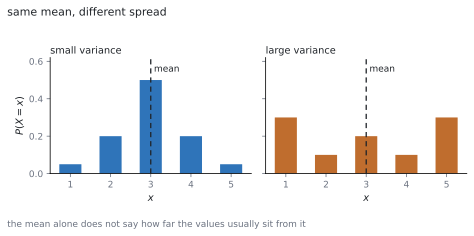
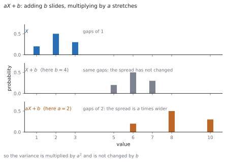

# HL 4.14a — Variance of a discrete random variable（離散確率変数の分散） {#sec-aahl-4-14a}

::: {.callout-note}
## What you should be able to do
- $E(X)$ と $E(X^{2})$ を、確率分布の表から計算できる。
- $\mathrm{Var}(X) = E(X^{2})-\left[E(X)\right]^{2}$ を使える。
- 定義 $\sum (x-\mu)^{2}P(X = x)$ との関係を説明できる。
- **標準偏差** $\sigma = \sqrt{\mathrm{Var}(X)}$ を出せる。
- $E(aX+b) = aE(X)+b$ と $\mathrm{Var}(aX+b) = a^{2}\mathrm{Var}(X)$ を使える。
- **公平なゲーム**（fair game）の条件を書ける。
:::

## The idea

### 1. Expected value again（期待値のおさらい） {#expected}

離散確率変数 $X$ の**期待値**は、値に確率をかけて足したものでした（[SL 4.7](../../aa-sl/04-statistics-and-probability/aasl-4-7.qmd#expected)）。

$$
E(X) = \mu = \sum x\,P(X = x)
$$ {#eq-aahl414a-mean}

シラバスは、この項目を SL とつないでいます。

> Link to: discrete random variables (SL 4.7)

記号についても、こう書いてあります。

> Use of the notation E(X), E(X 2), Var(X),

**$E(X^{2})$ は、$x$ の代わりに $x^{2}$ を使うだけ**です。

$$
E(X^{2}) = \sum x^{2}\,P(X = x)
$$ {#eq-aahl414a-ex2}

$E(X^{2})$ と $\left[E(X)\right]^{2}$ はちがう数です。**先に $2$ 乗するか、後で $2$ 乗するか**のちがいです。

### 2. Variance: the average squared distance（分散：ずれの $2$ 乗の平均） {#variance}

平均だけでは、**値が平均からどれくらい離れているか**が分かりません。

{#fig-aahl414a-idea-a width=100%}

そこで、**平均からのずれを $2$ 乗して、その期待値**をとります。これが**分散**です。公式集の **4.14** の欄にあります。

> Variance of a discrete random variable X

$$
\mathrm{Var}(X) = \sum (x-\mu)^{2}\,P(X = x)
$$ {#eq-aahl414a-definition}

ずれをそのまま足すと、正と負で打ち消し合って $0$ になります。**$2$ 乗するのは、それを防ぐため**です（[第 2 節](#why-square)）。

### 3. The computing formula（計算しやすい形） {#computing}

公式集には、同じ欄にもう $1$ つの形が印刷されています。

$$
\mathrm{Var}(X) = E(X^{2})-\left[E(X)\right]^{2}
$$ {#eq-aahl414a-computing}

シラバスの言い方はこうです。

> where Var(X) = E(X 2) − [E(X)]2

**ふつうはこちらを使います。** $\mu$ を求めてから各 $(x-\mu)^{2}$ を出すより、$\sum x^{2}P(X = x)$ を出すほうが速いからです（[第 1 節](#why-computing)）。

::: {.callout-important}
## 分散は負になりません
$\mathrm{Var}(X) \geq 0$ です。@eq-aahl414a-definition が $2$ 乗の和だからです。

負の値が出たら、**$E(X^{2})$ と $\left[E(X)\right]^{2}$ を入れかえている**ことがほとんどです。計算のいちばん手軽な見張りです。
:::

### 4. Standard deviation（標準偏差） {#sd}

分散は「$2$ 乗したもの」なので、単位が元の量と合いません。平方根をとると、元の単位にもどります。

$$
\sigma = \sqrt{\mathrm{Var}(X)}
$$ {#eq-aahl414a-sd}

これを**標準偏差**（standard deviation）といいます。**$\sigma^{2}$ が分散**、という書き方もよく使われます。

### 5. Linear transformations: the mean（$1$ 次変換と平均） {#linear-mean}

$X$ を $aX+b$ に変えたときの平均は、公式集の **4.14** の欄にあります。

> Linear transformation of a single random variable

$$
E(aX+b) = aE(X)+b
$$ {#eq-aahl414a-linear-mean}

**そのまま入れかえるだけ**です。「$a$ 倍して $b$ を足す」が、平均にもそのまま効きます。

### 6. Linear transformations: the variance（$1$ 次変換と分散） {#linear-var}

分散のほうは、$b$ が消えます。

$$
\mathrm{Var}(aX+b) = a^{2}\,\mathrm{Var}(X)
$$ {#eq-aahl414a-linear-var}

{#fig-aahl414a-idea-b width=100%}

**$b$ を足しても、ちらばりは変わりません。** 全部を同じだけずらしただけだからです。

**$a$ 倍すると、ずれも $a$ 倍**になります。分散はそれを $2$ 乗したものなので、$a^{2}$ 倍です（[第 4 節](#why-linear-var)）。

$a$ が負でも $a^{2}$ は正です。**$\mathrm{Var}(-X) = \mathrm{Var}(X)$** です。

### 7. Fair games（公平なゲーム） {#fair}

シラバスは、期待値の使い道として公平なゲームを挙げています。

> Use of E(X) for "fair" games.

$G$ を「$1$ 回あたりの**もうけ**」（受け取る額から参加料を引いたもの）とすると、

$$
\text{fair} \quad \Longleftrightarrow \quad E(G) = 0
$$ {#eq-aahl414a-fair}

です。**長くくり返したとき、平均して損も得もしない**という意味です。

参加料 $k$ を求める問題なら、$E(\text{受け取る額}) = k$ を解きます。

::: {.callout-tip collapse="true"}
## Paper 2 では、電卓で平均と標準偏差が出せます

TI-Nspire CX II の Lists & Spreadsheet で、$1$ 列目に $x$ の値、$2$ 列目に確率を入れます。

**menu → 4: Statistics → 1: Stat Calculations → 1: One-Variable Statistics** を選び、**X1 List** に値の列、**Frequency List** に確率の列を指定します。

$\bar{x}$ が $E(X)$、$\sigma_{x}$ が標準偏差です。**分散は $\sigma_{x}$ を $2$ 乗**します。$s_{x}$ のほうではありません。

**答案には、式を書いてください。** @eq-aahl414a-computing の形を書いてから数を入れます。

**Paper 1 では使えません。** このページの例題と演習は、すべて手で解けるようにしてあります。
:::

## Why it works

::: {.callout-tip collapse="true"}
## クリックすると開きます

#### なぜ $E(X^{2})-\mu^{2}$ になるのか {#why-computing}

@eq-aahl414a-definition の $(x-\mu)^{2}$ を展開します。

$$
\sum (x-\mu)^{2}P(X = x)
= \sum \left(x^{2}-2\mu x+\mu^{2}\right)P(X = x)
$$

$3$ つに分けます。

$$
= \sum x^{2}P(X = x)-2\mu\sum x\,P(X = x)+\mu^{2}\sum P(X = x)
$$

$1$ つ目は $E(X^{2})$、$2$ つ目の $\sum x P(X = x)$ は $\mu$、$3$ つ目の $\sum P(X = x)$ は $1$ です（[SL 4.7](../../aa-sl/04-statistics-and-probability/aasl-4-7.qmd#sumone)）。

$$
= E(X^{2})-2\mu^{2}+\mu^{2} = E(X^{2})-\mu^{2}
$$

**確率の合計が $1$ であることが効いています。**

#### なぜ、ずれを $2$ 乗するのか {#why-square}

ずれをそのまま足すと、かならず $0$ になります。

$$
\sum (x-\mu)P(X = x) = \mu-\mu = 0
$$

正のずれと負のずれが打ち消し合うからです。**これではちらばりを測れません。**

絶対値を使う手もありますが、$2$ 乗のほうが式として扱いやすく、@eq-aahl414a-computing のようなきれいな形になります。

$2$ 乗したので単位も $2$ 乗になります。それを平方根でもどしたのが標準偏差です（[第 4 節](#sd)）。

#### なぜ $E(aX+b) = aE(X)+b$ なのか {#why-linear-mean}

定義に入れて、和を分けます。

$$
E(aX+b) = \sum (ax+b)P(X = x)
= a\sum x\,P(X = x)+b\sum P(X = x)
$$

$1$ つ目は $aE(X)$、$2$ つ目は $b \times 1 = b$ です。

**ここでも $\sum P(X = x) = 1$ が効いています。**

#### なぜ $\mathrm{Var}(aX+b) = a^{2}\mathrm{Var}(X)$ なのか {#why-linear-var}

$Y = aX+b$ の平均は $a\mu+b$ です。ずれを見ます。

$$
Y-E(Y) = (aX+b)-(a\mu+b) = a(X-\mu)
$$

**$b$ が消えました。** ずらしても、平均との距離は変わらないということです。

これを $2$ 乗すると $a^{2}(X-\mu)^{2}$ なので、期待値をとって

$$
\mathrm{Var}(Y) = a^{2}E\left[(X-\mu)^{2}\right] = a^{2}\mathrm{Var}(X)
$$

$a^{2}$ なので、**$a$ の符号は結果に影響しません**。
:::

## Worked examples

::: {.callout-note appearance="simple"}
問題文は英語です。意味が理解できなかったら、問題文の下の「**日本語訳**」を開いてください。解説は日本語です。

**例題も演習も、すべて電卓なしで解けます。** Paper 1 のつもりで解いてください。
:::

::: {#exm-aahl414a-basic}
[The random variable $X$ has the distribution below.]{.q-en}

| $x$ | $1$ | $2$ | $3$ |
|---|---|---|---|
| $P(X = x)$ | $0.2$ | $0.5$ | $0.3$ |

**(a)** [Find $E(X)$.]{.q-en}

**(b)** [Find $E(X^{2})$.]{.q-en}

**(c)** [Find $\mathrm{Var}(X)$ and the standard deviation of $X$.]{.q-en}

日本語訳

確率変数 $X$ の分布が上の表で与えられています。

**(a)** $E(X)$ を求めなさい。

**(b)** $E(X^{2})$ を求めなさい。

**(c)** $\mathrm{Var}(X)$ と $X$ の標準偏差を求めなさい。

---

**(a)** @eq-aahl414a-mean です。

$$
E(X) = (1)(0.2)+(2)(0.5)+(3)(0.3) = 0.2+1.0+0.9 = 2.1
$$

**(b)** $x$ を $x^{2}$ に変えるだけです（@eq-aahl414a-ex2）。

$$
E(X^{2}) = (1)(0.2)+(4)(0.5)+(9)(0.3) = 0.2+2.0+2.7 = 4.9
$$

**(c)** @eq-aahl414a-computing に入れます。

$$
\mathrm{Var}(X) = 4.9-(2.1)^{2} = 4.9-4.41 = 0.49
$$

$$
\sigma = \sqrt{0.49} = 0.7
$$

**検算。** **定義のほうでも出します。** $(1-2.1)^{2}(0.2)+(2-2.1)^{2}(0.5)+(3-2.1)^{2}(0.3) = 0.242+0.005+0.243 = 0.49$ ✓

**検算（範囲）。** $E(X) = 2.1$ は $1$ と $3$ の間 ✓ また $\mathrm{Var}(X) > 0$ ✓

::: {.callout-note}
## 解答例（答案用紙に書くこと）

**(a)** $E(X) = (1)(0.2)+(2)(0.5)+(3)(0.3) = 2.1$

**(b)** $E(X^{2}) = (1)(0.2)+(4)(0.5)+(9)(0.3) = 4.9$

**(c)** $\mathrm{Var}(X) = 4.9-(2.1)^{2} = 0.49$, $\ \sigma = 0.7$
:::
:::

::: {#exm-aahl414a-linear}
[For the random variable $X$ in the previous example, $E(X) = 2.1$ and $\mathrm{Var}(X) = 0.49$. Let $Y = 3X-2$. Find $E(Y)$, $\mathrm{Var}(Y)$ and the standard deviation of $Y$.]{.q-en}

日本語訳

前の例題の $X$ について $E(X) = 2.1$、$\mathrm{Var}(X) = 0.49$ です。$Y = 3X-2$ とします。$E(Y)$、$\mathrm{Var}(Y)$、および $Y$ の標準偏差を求めなさい。

---

@eq-aahl414a-linear-mean と @eq-aahl414a-linear-var に入れます。

$$
E(Y) = 3(2.1)-2 = 6.3-2 = 4.3
$$

$$
\mathrm{Var}(Y) = 3^{2}(0.49) = 9(0.49) = 4.41
$$

$$
\sigma_{Y} = \sqrt{4.41} = 2.1
$$

**検算。** **標準偏差は $3$ 倍のはず**です。$3 \times 0.7 = 2.1$ ✓

**検算（$-2$ の効き方）。** 平均には効いて、分散には効いていません ✓ ずらしただけだからです（[第 6 節](#linear-var)）。

::: {.callout-note}
## 解答例（答案用紙に書くこと）

$$E(Y) = 3(2.1)-2 = 4.3$$

$$\mathrm{Var}(Y) = 3^{2}(0.49) = 4.41$$

$$\sigma_{Y} = \sqrt{4.41} = 2.1$$
:::
:::

::: {#exm-aahl414a-unknown}
[The random variable $X$ has the distribution below, where $k$ is a constant.]{.q-en}

| $x$ | $0$ | $1$ | $2$ |
|---|---|---|---|
| $P(X = x)$ | $0.3$ | $k$ | $0.5$ |

**(a)** [Find $k$.]{.q-en}

**(b)** [Find $E(X)$ and $\mathrm{Var}(X)$.]{.q-en}

日本語訳

確率変数 $X$ の分布が上の表で与えられています（$k$ は定数）。

**(a)** $k$ を求めなさい。

**(b)** $E(X)$ と $\mathrm{Var}(X)$ を求めなさい。

---

**(a)** 確率の合計は $1$ です（[SL 4.7](../../aa-sl/04-statistics-and-probability/aasl-4-7.qmd#sumone)）。

$$
0.3+k+0.5 = 1, \qquad k = 0.2
$$

**(b)** $x = 0$ の項は消えます。

$$
E(X) = (0)(0.3)+(1)(0.2)+(2)(0.5) = 1.2
$$

$$
E(X^{2}) = (0)(0.3)+(1)(0.2)+(4)(0.5) = 2.2
$$

$$
\mathrm{Var}(X) = 2.2-(1.2)^{2} = 2.2-1.44 = 0.76
$$

**検算。** **$E(X) = 1.2$ は $0$ と $2$ の間**です ✓

**検算（分散の符号）。** $2.2 > 1.44$ なので正 ✓ 入れかえていません。

::: {.callout-note}
## 解答例（答案用紙に書くこと）

**(a)** $0.3+k+0.5 = 1$, *so* $k = 0.2$

**(b)** $E(X) = (0)(0.3)+(1)(0.2)+(2)(0.5) = 1.2$

$E(X^{2}) = (0)(0.3)+(1)(0.2)+(4)(0.5) = 2.2$

$\mathrm{Var}(X) = 2.2-(1.2)^{2} = 0.76$
:::
:::

::: {#exm-aahl414a-game}
[In a game a player pays $\$k$ and then rolls a fair six-sided die, receiving as many dollars as the number shown. Let $X$ be the number shown.]{.q-en}

**(a)** [Find $E(X)$ and $\mathrm{Var}(X)$.]{.q-en}

**(b)** [Find the value of $k$ for which the game is fair.]{.q-en}

**(c)** [Find the variance of the player's net gain.]{.q-en}

日本語訳

あるゲームでは、$\$k$ を払って公正な $6$ 面のさいころを $1$ 回投げ、出た目と同じ数のドルを受け取ります。$X$ を出た目とします。

**(a)** $E(X)$ と $\mathrm{Var}(X)$ を求めなさい。

**(b)** ゲームが公平になる $k$ の値を求めなさい。

**(c)** プレーヤーのもうけの分散を求めなさい。

---

**(a)** どの目も確率 $\dfrac{1}{6}$ です。

$$
E(X) = \frac{1+2+3+4+5+6}{6} = \frac{21}{6} = \frac{7}{2}
$$

$$
E(X^{2}) = \frac{1+4+9+16+25+36}{6} = \frac{91}{6}
$$

$$
\mathrm{Var}(X) = \frac{91}{6}-\left(\frac{7}{2}\right)^{2}
= \frac{182-147}{12} = \frac{35}{12}
$$

**(b)** もうけは $G = X-k$ です。@eq-aahl414a-linear-mean から $E(G) = E(X)-k$ なので、@eq-aahl414a-fair より

$$
\frac{7}{2}-k = 0, \qquad k = \frac{7}{2}
$$

**(c)** $G = X-k$ は $a = 1$、$b = -k$ の形です（@eq-aahl414a-linear-var）。

$$
\mathrm{Var}(G) = 1^{2}\,\mathrm{Var}(X) = \frac{35}{12}
$$

**検算。** **$\dfrac{91}{6} = \dfrac{182}{12}$、$\dfrac{49}{4} = \dfrac{147}{12}$** ✓ 通分が合っています。

**検算（(c) の意味）。** 参加料は毎回同じなので、ちらばりは変わりません ✓ $b$ は分散に効きません。

::: {.callout-note}
## 解答例（答案用紙に書くこと）

**(a)** $E(X) = \dfrac{21}{6} = \dfrac{7}{2}$, $\ E(X^{2}) = \dfrac{91}{6}$, $\ \mathrm{Var}(X) = \dfrac{91}{6}-\dfrac{49}{4} = \dfrac{35}{12}$

**(b)** $E(G) = E(X)-k = 0$ *gives* $k = \dfrac{7}{2}$

**(c)** $\mathrm{Var}(G) = 1^{2}\mathrm{Var}(X) = \dfrac{35}{12}$
:::

::: {.model-answer}
**試験ではこう書く**

*Each face of a fair die has probability* $\dfrac{1}{6}$, *so* $E(X) = \dfrac{1}{6}(1+2+3+4+5+6) = \dfrac{21}{6} = \dfrac{7}{2}$ *and* $E(X^{2}) = \dfrac{1}{6}(1+4+9+16+25+36) = \dfrac{91}{6}$. *Hence*

$$\mathrm{Var}(X) = E(X^{2})-\left[E(X)\right]^{2} = \frac{91}{6}-\frac{49}{4}
= \frac{182-147}{12} = \frac{35}{12}$$

*The player's net gain is* $G = X-k$, *since the fee is paid whatever happens. A game is fair when the expected gain is zero, and* $E(G) = E(X)-k$ *by the rule for a linear transformation, so* $E(X)-k = 0$ *and* $k = \dfrac{7}{2}$. *The fair fee is therefore* $\$3.50$.

*For the variance,* $G = X-k$ *has* $a = 1$ *and* $b = -k$, *so* $\mathrm{Var}(G) = 1^{2}\mathrm{Var}(X) = \dfrac{35}{12}$. *Subtracting a fixed fee moves every outcome by the same amount and so leaves the spread unchanged; only the mean is affected.*
:::
:::

## Common errors

::: {.callout-warning}
## $E(X^{2})$ と $\left[E(X)\right]^{2}$ を取りちがえる
$E(X^{2})$ は**先に $2$ 乗して**から平均、$\left[E(X)\right]^{2}$ は**平均を出してから $2$ 乗**です（[第 1 節](#expected)）。

入れかえると分散が負になります。**負が出たら、まずここです。**
:::

::: {.callout-warning}
## 分散に $b$ が効くと思う
$\mathrm{Var}(aX+b) = a^{2}\mathrm{Var}(X)$ で、$b$ は出てきません（@eq-aahl414a-linear-var）。

全部を同じだけずらしても、**たがいの距離は変わりません**。
:::

::: {.callout-warning}
## 分散の係数を $a$ のままにする
$a$ ではなく **$a^{2}$** です。$\mathrm{Var}(3X) = 9\mathrm{Var}(X)$ です。

$a$ 倍になるのは**標準偏差**のほうです（$a > 0$ のとき）。
:::

::: {.callout-warning}
## $\mathrm{Var}(-X)$ を $-\mathrm{Var}(X)$ とする
$(-1)^{2} = 1$ なので、$\mathrm{Var}(-X) = \mathrm{Var}(X)$ です。

**分散はかならず $0$ 以上**です（[第 3 節](#computing)）。
:::

::: {.callout-warning}
## 標準偏差を聞かれて分散を答える
$\sigma = \sqrt{\mathrm{Var}(X)}$ です（@eq-aahl414a-sd）。

問題文の `standard deviation` と `variance` を読み分けてください。**平方根を取るのを忘れやすい**ところです。
:::

::: {.callout-warning}
## 公平なゲームで、参加料を引き忘れる
公平の条件は $E(\text{もうけ}) = 0$ であって、$E(\text{受け取る額}) = 0$ ではありません（[第 7 節](#fair)）。

**受け取る額の期待値が参加料に等しい**、と読みかえると間違えません。
:::

## Exercises

::: {.callout-note appearance="simple"}
各問題に、折りたたみが $3$ つ付いています。**日本語訳**、**解答例**（答案用紙に書くべきこと。英語です）、**解説**（なぜそうなるか。日本語です）。

まず自分で解いて、次に解答例と見くらべてください。**解説は、合わなかったときだけ開けば十分です。**
:::

::: {.exercise-block}

[1]{.ex-no} [The random variable $X$ takes the values $0$, $1$, $2$ with probabilities $0.5$, $0.3$, $0.2$. Find $E(X)$ and $\mathrm{Var}(X)$.]{.q-en}

日本語訳

確率変数 $X$ が $0$、$1$、$2$ をそれぞれ確率 $0.5$、$0.3$、$0.2$ でとります。$E(X)$ と $\mathrm{Var}(X)$ を求めなさい。

::: {.callout-note collapse="true"}
## 解答例（答案用紙に書くこと）

$$E(X) = (0)(0.5)+(1)(0.3)+(2)(0.2) = 0.7$$

$$E(X^{2}) = (0)(0.5)+(1)(0.3)+(4)(0.2) = 1.1$$

$$\mathrm{Var}(X) = 1.1-(0.7)^{2} = 0.61$$
:::

::: {.callout-tip collapse="true"}
## 解説

$x = 0$ の項は、どちらの和でも消えます。**計算が $1$ つ減ります。**

**検算（範囲）。** $0.7$ は $0$ と $2$ の間 ✓

**検算（符号）。** $1.1 > 0.49$ なので分散は正 ✓
:::

::: {.ex-sep}
:::

[2]{.ex-no} [Given $E(X) = 4$ and $\mathrm{Var}(X) = 9$, find $E(2X+5)$ and $\mathrm{Var}(2X+5)$.]{.q-en}

日本語訳

$E(X) = 4$、$\mathrm{Var}(X) = 9$ のとき、$E(2X+5)$ と $\mathrm{Var}(2X+5)$ を求めなさい。

::: {.callout-note collapse="true"}
## 解答例（答案用紙に書くこと）

$$E(2X+5) = 2(4)+5 = 13$$

$$\mathrm{Var}(2X+5) = 2^{2}(9) = 36$$
:::

::: {.callout-tip collapse="true"}
## 解説

**平均には $b$ が効き、分散には効きません**（[第 6 節](#linear-var)）。

**検算（標準偏差）。** もとが $3$、変換後が $6$ で $2$ 倍 ✓

**検算（$a^{2}$）。** $2$ 倍ではなく $4$ 倍です ✓
:::

::: {.ex-sep}
:::

[3]{.ex-no} [Given $E(X) = 3$ and $E(X^{2}) = 13$, find $\mathrm{Var}(X)$ and the standard deviation of $X$.]{.q-en}

日本語訳

$E(X) = 3$、$E(X^{2}) = 13$ のとき、$\mathrm{Var}(X)$ と $X$ の標準偏差を求めなさい。

::: {.callout-note collapse="true"}
## 解答例（答案用紙に書くこと）

$$\mathrm{Var}(X) = 13-3^{2} = 4, \qquad \sigma = 2$$
:::

::: {.callout-tip collapse="true"}
## 解説

@eq-aahl414a-computing に入れるだけです。分布の表は要りません。

**標準偏差まで聞かれています。** 平方根を忘れないこと（[第 4 節](#sd)）。

**検算（符号）。** $13 > 9$ なので正 ✓

**検算（逆向き）。** $E(X^{2}) = \mathrm{Var}(X)+\left[E(X)\right]^{2} = 4+9 = 13$ ✓
:::

::: {.ex-sep}
:::

[4]{.ex-no} [The random variable $X$ takes the values $1$, $2$, $3$, $4$ with probabilities $0.1$, $0.2$, $0.3$, $0.4$. Find $E(X)$, $\mathrm{Var}(X)$ and $\sigma$.]{.q-en}

日本語訳

確率変数 $X$ が $1$、$2$、$3$、$4$ をそれぞれ確率 $0.1$、$0.2$、$0.3$、$0.4$ でとります。$E(X)$、$\mathrm{Var}(X)$、$\sigma$ を求めなさい。

::: {.callout-note collapse="true"}
## 解答例（答案用紙に書くこと）

$$E(X) = 0.1+0.4+0.9+1.6 = 3$$

$$E(X^{2}) = 0.1+0.8+2.7+6.4 = 10$$

$$\mathrm{Var}(X) = 10-3^{2} = 1, \qquad \sigma = 1$$
:::

::: {.callout-tip collapse="true"}
## 解説

確率が右に寄っているので、平均も右寄りです。**$3$ は真ん中の $2.5$ より大きい**です。

**検算（合計）。** $0.1+0.2+0.3+0.4 = 1$ ✓

**検算（範囲）。** $\sigma = 1$ で、値の幅 $3$ に対して小さすぎず大きすぎません ✓
:::

::: {.ex-sep}
:::

[5]{.ex-no} [The random variable $X$ takes the values $1$, $2$, $3$ with probabilities $k$, $2k$, $3k$. Find $k$, then find $E(X)$ and $\mathrm{Var}(X)$.]{.q-en}

日本語訳

確率変数 $X$ が $1$、$2$、$3$ をそれぞれ確率 $k$、$2k$、$3k$ でとります。$k$ を求め、$E(X)$ と $\mathrm{Var}(X)$ を求めなさい。

::: {.callout-note collapse="true"}
## 解答例（答案用紙に書くこと）

$$k+2k+3k = 1 \ \Rightarrow \ k = \frac{1}{6}$$

$$E(X) = \frac{1+4+9}{6} = \frac{7}{3}, \qquad
E(X^{2}) = \frac{1+8+27}{6} = 6$$

$$\mathrm{Var}(X) = 6-\left(\frac{7}{3}\right)^{2} = 6-\frac{49}{9} = \frac{5}{9}$$
:::

::: {.callout-tip collapse="true"}
## 解説

$E(X)$ の分子は $1(1)+2(2)+3(3)$、$E(X^{2})$ の分子は $1(1)+4(2)+9(3)$ です。**分母はどちらも $6$** です。

**検算（範囲）。** $\dfrac{7}{3} \approx 2.33$ で、$1$ と $3$ の間 ✓

**検算（通分）。** $6 = \dfrac{54}{9}$ なので $\dfrac{54-49}{9} = \dfrac{5}{9}$ ✓
:::

::: {.ex-sep}
:::

[6]{.ex-no} [Given $\mathrm{Var}(X) = 5$, find $\mathrm{Var}(3X-1)$ and $\mathrm{Var}(-X)$.]{.q-en}

日本語訳

$\mathrm{Var}(X) = 5$ のとき、$\mathrm{Var}(3X-1)$ と $\mathrm{Var}(-X)$ を求めなさい。

::: {.callout-note collapse="true"}
## 解答例（答案用紙に書くこと）

$$\mathrm{Var}(3X-1) = 3^{2}(5) = 45$$

$$\mathrm{Var}(-X) = (-1)^{2}(5) = 5$$
:::

::: {.callout-tip collapse="true"}
## 解説

$-1$ は $b$ なので効きません。$3$ は $a$ なので $2$ 乗して効きます（@eq-aahl414a-linear-var）。

$-X$ は $a = -1$ です。**符号は $2$ 乗で消えます。**

**検算（符号）。** どちらも正 ✓ 分散が負になることはありません。

**検算（意味）。** $-X$ は $X$ を裏返しただけで、ちらばりは同じ ✓
:::

::: {.ex-sep}
:::

[7]{.ex-no} [In a game a player pays $\$c$ and receives $\$10$ with probability $0.2$, and nothing otherwise. Find the value of $c$ that makes the game fair.]{.q-en}

日本語訳

あるゲームでは、$\$c$ を払い、確率 $0.2$ で $\$10$ を受け取り、そうでなければ何も受け取りません。ゲームが公平になる $c$ の値を求めなさい。

::: {.callout-note collapse="true"}
## 解答例（答案用紙に書くこと）

$$E(\text{amount received}) = (10)(0.2)+(0)(0.8) = 2$$

*The game is fair when* $E(\text{gain}) = 0$, *that is* $2-c = 0$, *so* $c = 2$.
:::

::: {.callout-tip collapse="true"}
## 解説

**受け取る額の期待値が、参加料に等しい**のが公平です（[第 7 節](#fair)）。

**検算。** $E(\text{gain}) = 2-2 = 0$ ✓

**検算（$c$ が大きいと）。** $c = 3$ なら $E(\text{gain}) = -1$ で、プレーヤーの損 ✓
:::

::: {.ex-sep}
:::

[8]{.ex-no} [Show that $\mathrm{Var}(aX+b) = a^{2}\mathrm{Var}(X)$ for constants $a$ and $b$.]{.q-en}

日本語訳

定数 $a$、$b$ について $\mathrm{Var}(aX+b) = a^{2}\mathrm{Var}(X)$ を示しなさい。

::: {.callout-note collapse="true"}
## 解答例（答案用紙に書くこと）

*Let* $Y = aX+b$. *Then* $E(Y) = a\mu+b$, *where* $\mu = E(X)$.

$$Y-E(Y) = (aX+b)-(a\mu+b) = a(X-\mu)$$

$$\mathrm{Var}(Y) = E\left[(Y-E(Y))^{2}\right]
= E\left[a^{2}(X-\mu)^{2}\right] = a^{2}\mathrm{Var}(X)$$
:::

::: {.callout-tip collapse="true"}
## 解説

**要は「$b$ が引き算で消える」**ことです（[第 4 節](#why-linear-var)）。

$a^{2}$ は定数なので、期待値の外に出せます。

**検算（$a = 1$）。** $\mathrm{Var}(X+b) = \mathrm{Var}(X)$ ✓ ずらしても変わりません。

**検算（$b = 0$）。** $\mathrm{Var}(aX) = a^{2}\mathrm{Var}(X)$ ✓ 見慣れた形です。

::: {.model-answer}
**試験ではこう書く**

*Write* $\mu = E(X)$ *and* $Y = aX+b$. *By the rule for the mean of a linear transformation,* $E(Y) = aE(X)+b = a\mu+b$.

*The deviation of* $Y$ *from its mean is therefore*

$$Y-E(Y) = (aX+b)-(a\mu+b) = aX-a\mu = a(X-\mu)$$

*The constant* $b$ *cancels, which is the key step: adding a constant moves every value and the mean by the same amount, so all deviations are unchanged.*

*Squaring gives* $(Y-E(Y))^{2} = a^{2}(X-\mu)^{2}$, *and taking expectations, with the constant* $a^{2}$ *taken outside,*

$$\mathrm{Var}(Y) = E\left[a^{2}(X-\mu)^{2}\right]
= a^{2}E\left[(X-\mu)^{2}\right] = a^{2}\mathrm{Var}(X)$$

*Since* $a^{2} \geq 0$, *the sign of* $a$ *has no effect, which is why* $\mathrm{Var}(-X) = \mathrm{Var}(X)$.
:::
:::

::: {.ex-sep}
:::

[9]{.ex-no} [Explain why $\mathrm{Var}(X) = E(X^{2})-\left[E(X)\right]^{2}$ is usually easier to use than the definition $\sum (x-\mu)^{2}P(X = x)$.]{.q-en}

日本語訳

$\mathrm{Var}(X) = E(X^{2})-\left[E(X)\right]^{2}$ のほうが、定義 $\sum (x-\mu)^{2}P(X = x)$ より使いやすいのはなぜかを説明しなさい。

::: {.callout-note collapse="true"}
## 解答例（答案用紙に書くこと）

*The definition requires* $\mu$ *first, and then a separate subtraction and squaring for every value of* $x$.

*The other form needs only two sums,* $\sum x P(X = x)$ *and* $\sum x^{2}P(X = x)$, *which can be built from the same table in one pass.*

*It also avoids rounding a value of* $\mu$ *that is not exact and then using it many times.*
:::

::: {.callout-tip collapse="true"}
## 解説

**計算の回数がちがいます。** 定義では、値の個数だけ引き算と $2$ 乗が必要です。

$\mu$ が $\dfrac{7}{3}$ のような分数のとき、差を毎回作るのは面倒です（演習 $5$ がその例です）。

**検算（同じ答えか）。** 例題 $1$ で、両方とも $0.49$ になりました ✓

**検算（どちらが速いか）。** 例題 $1$ では、定義だと $3$ 回の引き算と $2$ 乗が必要でした ✓

::: {.model-answer}
**試験ではこう書く**

*Both formulas give the same number, but they ask for different amounts of work.*

*The definition* $\sum (x-\mu)^{2}P(X = x)$ *cannot be started until* $\mu$ *has been found, and then for each value of* $x$ *it needs a subtraction, a squaring and a multiplication. With* $n$ *values that is* $n$ *separate three-step calculations, done after a first pass through the table.*

*The form* $E(X^{2})-\left[E(X)\right]^{2}$ *needs only the two sums* $\sum x P(X = x)$ *and* $\sum x^{2}P(X = x)$. *Both can be written down directly from the same table, and the squaring happens only once at the end.*

*There is also an accuracy reason. When* $\mu$ *is not a terminating decimal, the definition uses a rounded value of it once for every term, so rounding errors accumulate. The other form uses exact entries from the table and subtracts a single squared mean at the very end.*
:::
:::

::: {.ex-sep}
:::

[10]{.ex-no} [A student writes $\mathrm{Var}(2X) = 2\mathrm{Var}(X)$ and $\mathrm{Var}(X+3) = \mathrm{Var}(X)+3$. Identify both errors and give the correct results.]{.q-en}

日本語訳

ある生徒が $\mathrm{Var}(2X) = 2\mathrm{Var}(X)$、$\mathrm{Var}(X+3) = \mathrm{Var}(X)+3$ と書きました。$2$ つのまちがいを指摘し、正しい結果を書きなさい。

::: {.callout-note collapse="true"}
## 解答例（答案用紙に書くこと）

*The multiplier is squared, so* $\mathrm{Var}(2X) = 2^{2}\mathrm{Var}(X) = 4\mathrm{Var}(X)$.

*An added constant does not affect the variance, so* $\mathrm{Var}(X+3) = \mathrm{Var}(X)$.

*The rule* $\mathrm{Var}(aX+b) = a^{2}\mathrm{Var}(X)$ *covers both cases.*
:::

::: {.callout-tip collapse="true"}
## 解説

**生徒は、平均の規則をそのまま分散に使ってしまいました。** 平均なら $E(2X) = 2E(X)$、$E(X+3) = E(X)+3$ で正しいのです。

分散は「ずれの $2$ 乗」なので、$a$ は $2$ 乗で効き、$b$ は消えます（[第 4 節](#why-linear-var)）。

**検算（具体例）。** $X$ が $0$ と $2$ を確率 $\dfrac{1}{2}$ ずつでとるなら $\mathrm{Var}(X) = 1$ ✓

**検算（$2X$ のほう）。** $2X$ は $0$ と $4$ を半々でとり、分散は $4$ ✓ $2$ 倍ではなく $4$ 倍です。

::: {.model-answer}
**試験ではこう書く**

*Both statements apply the rule for the mean to the variance. For the mean,* $E(aX+b) = aE(X)+b$, *so a multiplier passes straight through and an added constant is added on. The variance behaves differently, because it measures squared deviations from the mean.*

*For the first statement, the correct rule is* $\mathrm{Var}(aX+b) = a^{2}\mathrm{Var}(X)$, *so* $\mathrm{Var}(2X) = 2^{2}\mathrm{Var}(X) = 4\mathrm{Var}(X)$. *Doubling every value doubles every deviation from the mean, and squaring those deviations multiplies the variance by four.*

*For the second statement, adding* $3$ *moves every value and the mean by* $3$, *so every deviation is unchanged and* $\mathrm{Var}(X+3) = \mathrm{Var}(X)$. *A constant cannot be added to a variance in any case, since the variance is measured in squared units.*

*A concrete check: if* $X$ *takes the values* $0$ *and* $2$ *with probability* $\dfrac{1}{2}$ *each, then* $\mathrm{Var}(X) = 1$, *while* $2X$ *takes* $0$ *and* $4$ *and has variance* $4$, *and* $X+3$ *takes* $3$ *and* $5$ *and still has variance* $1$.
:::
:::

:::
