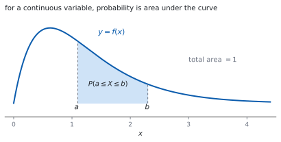
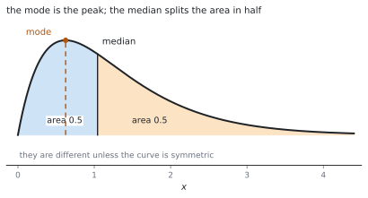

# HL 4.14b — Continuous random variables and probability density functions（連続確率変数と確率密度関数） {#sec-aahl-4-14b}

::: {.callout-note}
## What you should be able to do
- **確率密度関数**（probability density function）の $2$ つの条件を言える。
- $\displaystyle\int_{-\infty}^{\infty} f(x)\,\mathrm{d}x = 1$ から、未知の定数を求められる。
- 確率を**面積**（定積分）として計算できる。
- **区分的に定義された**（piecewise）密度関数を扱える。
- **最頻値**（mode）と**中央値**（median）を求められる。
- $E(X)$、$\mathrm{Var}(X)$、$\sigma$ を積分で求められる。
:::

## The idea

### 1. From discrete to continuous（離散から連続へ） {#from-discrete}

離散確率変数では、値ごとに確率がありました（[SL 4.7](../../aa-sl/04-statistics-and-probability/aasl-4-7.qmd#dist)）。連続確率変数では、値が**切れ目なく**続きます。

身長のような量では、「ちょうど $170.000\ldots$ cm」の確率は $0$ です。意味があるのは「$169$ cm から $171$ cm の間」のような**区間の確率**だけです。

そこで、棒グラフの代わりに**曲線**を使い、確率を**面積**で表します。

{#fig-aahl414b-idea-a width=100%}

### 2. Probability density functions（確率密度関数） {#pdf}

シラバスは、こう書いています。

> Continuous random variables and their probability density functions.
>
> $\displaystyle\int_{-\infty}^{\infty} f(x)\mathrm{d}x = 1$ including piecewise functions.

$$
\int_{-\infty}^{\infty} f(x)\,\mathrm{d}x = 1
$$ {#eq-aahl414b-total}

条件は $2$ つです。

1. **どこでも $f(x) \geq 0$**（面積が負になっては困ります）。
2. **全部の面積が $1$**（@eq-aahl414b-total）。

::: {.callout-important}
## $f(x)$ は確率ではありません
$f(x)$ は「密度」であって、確率ではありません。**$1$ より大きくなってもかまいません。**

たとえば $f(x) = 2$ を $0 \leq x \leq 0.5$ で考えると、面積は $1$ で立派な密度関数です。確率になるのは**面積のほう**だけです（[第 2 節](#why-density)）。
:::

### 3. Probabilities are areas（確率は面積） {#areas}

$$
P(a \leq X \leq b) = \int_{a}^{b} f(x)\,\mathrm{d}x
$$ {#eq-aahl414b-prob}

**$1$ 点の確率は $0$** です。幅が $0$ の区間の面積は $0$ だからです。

$$
P(X = a) = \int_{a}^{a} f(x)\,\mathrm{d}x = 0
$$ {#eq-aahl414b-point}

ですから、$P(X \leq a)$ と $P(X < a)$ は**同じ値**です。離散のときとちがうところです。

### 4. Piecewise functions（区分的に定義された関数） {#piecewise}

密度関数は、区間ごとにちがう式で与えられることがあります。シラバスも `including piecewise functions` と書いています。

$$
f(x) = \begin{cases}
x & 0 \leq x \leq 1 \\
2-x & 1 < x \leq 2 \\
0 & \text{それ以外}
\end{cases}
$$

**積分も区間ごとに分けて、足します。** 「それ以外は $0$」の部分は面積が $0$ なので、計算に入れる必要はありません。

### 5. The mode（最頻値） {#mode}

シラバスは、こう定義しています。

> For a continuous random variable, a value at which the probability density function has a maximum value is called a mode

**$f(x)$ がいちばん大きくなる $x$** が最頻値です。求め方は $2$ 通りです。

- なめらかなら、$f'(x) = 0$ を解いて最大を調べる。
- 区間の端が最大のこともあるので、**端の値も見る**。

$f$ が区間の中で単調なら、最頻値は**端**になります。

### 6. The median（中央値） {#median}

シラバスは、こう書いています。

> and for the median: $\displaystyle\int_{-\infty}^{m} f(x)\mathrm{d}x = \frac{1}{2}$.

$$
\int_{-\infty}^{m} f(x)\,\mathrm{d}x = \frac{1}{2}
$$ {#eq-aahl414b-median}

**面積をちょうど半分に分ける値**です。

{#fig-aahl414b-idea-b width=100%}

$f$ が区間 $[p,\ q]$ の外で $0$ なら、下端は $p$ から始めれば十分です。**$m$ についての方程式**を解くことになります。

### 7. Mean, variance and standard deviation（平均・分散・標準偏差） {#mean-variance}

公式集の **4.14** の欄にあります。

> Expected value of a continuous random variable X

$$
E(X) = \mu = \int_{-\infty}^{\infty} x\,f(x)\,\mathrm{d}x
$$ {#eq-aahl414b-mean}

> Variance of a continuous random variable X

$$
\mathrm{Var}(X) = \int_{-\infty}^{\infty} (x-\mu)^{2} f(x)\,\mathrm{d}x
= \int_{-\infty}^{\infty} x^{2} f(x)\,\mathrm{d}x-\mu^{2}
$$ {#eq-aahl414b-variance}

**離散のときと、形がそっくり**です。$\sum$ が $\int$ に、$P(X = x)$ が $f(x)\,\mathrm{d}x$ に変わっただけです（[HL 4.14a](aahl-4-14a.qmd#computing)）。

$\sigma = \sqrt{\mathrm{Var}(X)}$ も、$E(aX+b) = aE(X)+b$、$\mathrm{Var}(aX+b) = a^{2}\mathrm{Var}(X)$ も、そのまま使えます。

::: {.callout-tip collapse="true"}
## Paper 2 では、電卓で定積分が出せます

TI-Nspire CX II の計算画面で、テンプレート（**ctrl** + **shift** + **B** の $\int$）に区間と式を入れると、定積分がそのまま出ます。

中央値のような方程式は、**menu → 3: Algebra → 1: Solve** に $\int$ を入れたまま渡せます。**`RAD` になっているか**を見てください。

最頻値は、グラフをかいて **menu → 6: Analyze Graph → 3: Maximum** で読めます。

**答案には、式を書いてください。** @eq-aahl414b-median や @eq-aahl414b-mean の形を書いてから値を入れます。

**Paper 1 では使えません。** このページの例題と演習は、すべて手で解けるようにしてあります。
:::

## Why it works

::: {.callout-tip collapse="true"}
## クリックすると開きます

#### なぜ、確率が面積になるのか {#why-area}

区間 $[x,\ x+h]$ の確率を考えます。$h$ が小さければ、その区間の確率はおよそ

$$
P(x \leq X \leq x+h) \approx f(x)\,h
$$

です。**細い長方形の面積**です。これをつなげて足すと、区分求積の形になります。

$h \to 0$ の極限が定積分です（[SL 5.5](../../aa-sl/05-calculus/aasl-5-5.qmd)）。ですから確率は、曲線の下の面積になります。

**全部の確率を足すと $1$** という決まりが、@eq-aahl414b-total にあたります。

#### なぜ、$f(x)$ が $1$ を超えてよいのか {#why-density}

$f(x)$ は「確率そのもの」ではなく、**確率の密度**です。上の式を見ると

$$
f(x) \approx \frac{P(x \leq X \leq x+h)}{h}
$$

で、**確率を幅で割ったもの**です。幅が小さければ、割った値はいくらでも大きくなれます。

単位で考えると分かりやすいです。長さを測る変数なら、$f(x)$ の単位は「$1$ cm あたりの確率」です。**$1$ cm あたり $2$** でも、$0.5$ cm 分なら確率は $1$ です。

#### なぜ、$1$ 点の確率が $0$ なのか {#why-zero}

@eq-aahl414b-point のとおり、幅が $0$ なら面積も $0$ です。

「起こらない」という意味ではありません。**どれか $1$ つの値はかならず出ます**が、前もってその $1$ 点を当てる確率が $0$ だ、ということです。

このため、$\leq$ と $<$ の区別が消えます。**離散のときは区別が必要でした**から、ここは注意してください。

#### なぜ、離散と同じ形の式になるのか {#why-same-shape}

離散では $E(X) = \sum x\,P(X = x)$ でした（[HL 4.14a](aahl-4-14a.qmd#expected)）。

連続では、細い区間 $[x,\ x+h]$ の確率が $f(x)h$ なので、$\sum x\,f(x)h$ を考えます。$h \to 0$ とすると

$$
\sum x\,f(x)\,h \ \longrightarrow \ \int x\,f(x)\,\mathrm{d}x
$$

です。**$\sum$ が $\int$ に、$P(X = x)$ が $f(x)\mathrm{d}x$ に**変わっただけです。

分散も同じで、@eq-aahl414b-variance の $2$ つの形が等しいことは、離散のときとまったく同じ計算で示せます。
:::

## Worked examples

::: {.callout-note appearance="simple"}
問題文は英語です。意味が理解できなかったら、問題文の下の「**日本語訳**」を開いてください。解説は日本語です。

**例題も演習も、すべて電卓なしで解けます。** Paper 1 のつもりで解いてください。
:::

::: {#exm-aahl414b-constant}
[The continuous random variable $X$ has probability density function $f(x) = kx$ for $0 \leq x \leq 2$, and $f(x) = 0$ otherwise.]{.q-en}

**(a)** [Find $k$.]{.q-en}

**(b)** [Find $P(X \leq 1)$.]{.q-en}

日本語訳

連続確率変数 $X$ の確率密度関数が、$0 \leq x \leq 2$ で $f(x) = kx$、それ以外で $f(x) = 0$ です。

**(a)** $k$ を求めなさい。

**(b)** $P(X \leq 1)$ を求めなさい。

---

**(a)** 全部の面積が $1$ です（@eq-aahl414b-total）。$f$ は $[0,\ 2]$ の外で $0$ なので、そこだけ積分します。

$$
\int_{0}^{2} kx\,\mathrm{d}x = \left[\frac{kx^{2}}{2}\right]_{0}^{2} = 2k = 1,
\qquad k = \frac{1}{2}
$$

**(b)** @eq-aahl414b-prob です。

$$
P(X \leq 1) = \int_{0}^{1} \frac{x}{2}\,\mathrm{d}x
= \left[\frac{x^{2}}{4}\right]_{0}^{1} = \frac{1}{4}
$$

**検算。** **三角形の面積で見ます。** 底辺 $2$、高さ $f(2) = 1$ なので面積は $1$ ✓

**検算（(b) の大きさ）。** 左半分は右半分より密度が小さいので、$\dfrac{1}{4} < \dfrac{1}{2}$ ✓ 大小が合っています。

::: {.callout-note}
## 解答例（答案用紙に書くこと）

**(a)** $\displaystyle\int_{0}^{2} kx\,\mathrm{d}x = 2k = 1$, *so* $k = \dfrac{1}{2}$

**(b)** $P(X \leq 1) = \displaystyle\int_{0}^{1} \frac{x}{2}\,\mathrm{d}x = \left[\frac{x^{2}}{4}\right]_{0}^{1} = \frac{1}{4}$
:::
:::

::: {#exm-aahl414b-stats}
[The continuous random variable $X$ has probability density function $f(x) = \dfrac{3}{8}x^{2}$ for $0 \leq x \leq 2$, and $0$ otherwise.]{.q-en}

**(a)** [Find $E(X)$ and $\mathrm{Var}(X)$.]{.q-en}

**(b)** [Find the median of $X$.]{.q-en}

**(c)** [Write down the mode of $X$.]{.q-en}

日本語訳

連続確率変数 $X$ の確率密度関数が、$0 \leq x \leq 2$ で $f(x) = \dfrac{3}{8}x^{2}$、それ以外で $0$ です。

**(a)** $E(X)$ と $\mathrm{Var}(X)$ を求めなさい。

**(b)** $X$ の中央値を求めなさい。

**(c)** $X$ の最頻値を書きなさい。

---

**(a)** @eq-aahl414b-mean と @eq-aahl414b-variance です。

$$
E(X) = \int_{0}^{2} x\cdot\frac{3}{8}x^{2}\,\mathrm{d}x
= \frac{3}{8}\left[\frac{x^{4}}{4}\right]_{0}^{2} = \frac{3}{8}\cdot 4 = \frac{3}{2}
$$

$$
E(X^{2}) = \int_{0}^{2} x^{2}\cdot\frac{3}{8}x^{2}\,\mathrm{d}x
= \frac{3}{8}\left[\frac{x^{5}}{5}\right]_{0}^{2} = \frac{3}{8}\cdot\frac{32}{5} = \frac{12}{5}
$$

$$
\mathrm{Var}(X) = \frac{12}{5}-\left(\frac{3}{2}\right)^{2}
= \frac{48-45}{20} = \frac{3}{20}
$$

**(b)** @eq-aahl414b-median を解きます。

$$
\int_{0}^{m} \frac{3}{8}x^{2}\,\mathrm{d}x = \left[\frac{x^{3}}{8}\right]_{0}^{m}
= \frac{m^{3}}{8} = \frac{1}{2}
$$

$$
m^{3} = 4, \qquad m = \sqrt[3]{4}
$$

**(c)** $f$ は $[0,\ 2]$ で増え続けるので、最大は右端です。**最頻値は $2$** です。

**検算。** **全体の面積を見ます。** $\dfrac{3}{8}\cdot\dfrac{8}{3} = 1$ ✓

**検算（中央値の位置）。** $\sqrt[3]{4} \approx 1.59$ で、$0$ と $2$ の間、しかも平均 $1.5$ より右 ✓ 右に重みのある形と合います。

::: {.callout-note}
## 解答例（答案用紙に書くこと）

**(a)** $E(X) = \dfrac{3}{8}\left[\dfrac{x^{4}}{4}\right]_{0}^{2} = \dfrac{3}{2}$, $\ E(X^{2}) = \dfrac{3}{8}\left[\dfrac{x^{5}}{5}\right]_{0}^{2} = \dfrac{12}{5}$

$\mathrm{Var}(X) = \dfrac{12}{5}-\dfrac{9}{4} = \dfrac{3}{20}$

**(b)** $\dfrac{m^{3}}{8} = \dfrac{1}{2}$, *so* $m = \sqrt[3]{4}$

**(c)** *The mode is* $2$.
:::
:::

::: {#exm-aahl414b-piecewise}
[The continuous random variable $X$ has probability density function]{.q-en}

$$
f(x) = \begin{cases}
x & 0 \leq x \leq 1 \\
2-x & 1 < x \leq 2 \\
0 & \text{otherwise}
\end{cases}
$$

**(a)** [Verify that $f$ is a probability density function.]{.q-en}

**(b)** [Find $E(X)$.]{.q-en}

**(c)** [Write down the mode and the median.]{.q-en}

日本語訳

連続確率変数 $X$ の確率密度関数が上のとおりです。

**(a)** $f$ が確率密度関数であることを確かめなさい。

**(b)** $E(X)$ を求めなさい。

**(c)** 最頻値と中央値を書きなさい。

---

**(a)** どちらの区間でも $f(x) \geq 0$ です。面積を区間ごとに足します。

$$
\int_{0}^{1} x\,\mathrm{d}x+\int_{1}^{2} (2-x)\,\mathrm{d}x
= \frac{1}{2}+\left[2x-\frac{x^{2}}{2}\right]_{1}^{2}
= \frac{1}{2}+\left(2-\frac{3}{2}\right) = 1
$$

**(b)** こちらも区間ごとです。

$$
\int_{0}^{1} x\cdot x\,\mathrm{d}x = \left[\frac{x^{3}}{3}\right]_{0}^{1} = \frac{1}{3}
$$

$$
\int_{1}^{2} x(2-x)\,\mathrm{d}x = \left[x^{2}-\frac{x^{3}}{3}\right]_{1}^{2}
= \frac{4}{3}-\frac{2}{3} = \frac{2}{3}
$$

$$
E(X) = \frac{1}{3}+\frac{2}{3} = 1
$$

**(c)** グラフは $x = 1$ を頂点とする三角形です。**最頻値は $1$**。左右対称なので、**中央値も $1$** です。

**検算。** **三角形の面積で見ます。** 底辺 $2$、高さ $1$ なので $\dfrac{1}{2}\cdot 2\cdot 1 = 1$ ✓

**検算（対称性）。** $x = 1$ について左右対称なので、平均も $1$ ✓ 計算と合いました。

::: {.callout-note}
## 解答例（答案用紙に書くこと）

**(a)** $f(x) \geq 0$ *and* $\displaystyle\int_{0}^{1} x\,\mathrm{d}x+\int_{1}^{2}(2-x)\,\mathrm{d}x = \frac{1}{2}+\frac{1}{2} = 1$

**(b)** $E(X) = \dfrac{1}{3}+\dfrac{2}{3} = 1$

**(c)** *The mode is* $1$ *and the median is* $1$.
:::
:::

::: {#exm-aahl414b-full}
[The continuous random variable $X$ has probability density function $f(x) = k\left(4-x^{2}\right)$ for $0 \leq x \leq 2$, and $0$ otherwise.]{.q-en}

**(a)** [Find $k$.]{.q-en}

**(b)** [Find $E(X)$ and $\mathrm{Var}(X)$.]{.q-en}

**(c)** [Write down the mode of $X$.]{.q-en}

日本語訳

連続確率変数 $X$ の確率密度関数が、$0 \leq x \leq 2$ で $f(x) = k\left(4-x^{2}\right)$、それ以外で $0$ です。

**(a)** $k$ を求めなさい。

**(b)** $E(X)$ と $\mathrm{Var}(X)$ を求めなさい。

**(c)** $X$ の最頻値を書きなさい。

---

**(a)**

$$
\int_{0}^{2} \left(4-x^{2}\right)\mathrm{d}x
= \left[4x-\frac{x^{3}}{3}\right]_{0}^{2} = 8-\frac{8}{3} = \frac{16}{3}
$$

$$
k\cdot\frac{16}{3} = 1, \qquad k = \frac{3}{16}
$$

**(b)**

$$
E(X) = \frac{3}{16}\int_{0}^{2} \left(4x-x^{3}\right)\mathrm{d}x
= \frac{3}{16}\left[2x^{2}-\frac{x^{4}}{4}\right]_{0}^{2}
= \frac{3}{16}(8-4) = \frac{3}{4}
$$

$$
E(X^{2}) = \frac{3}{16}\int_{0}^{2} \left(4x^{2}-x^{4}\right)\mathrm{d}x
= \frac{3}{16}\left[\frac{4x^{3}}{3}-\frac{x^{5}}{5}\right]_{0}^{2}
= \frac{3}{16}\cdot\frac{64}{15} = \frac{4}{5}
$$

$$
\mathrm{Var}(X) = \frac{4}{5}-\left(\frac{3}{4}\right)^{2}
= \frac{64-45}{80} = \frac{19}{80}
$$

**(c)** $4-x^{2}$ は $[0,\ 2]$ で減り続けるので、最大は左端です。**最頻値は $0$** です。

**検算。** **$\dfrac{32}{3}-\dfrac{32}{5} = \dfrac{160-96}{15} = \dfrac{64}{15}$** ✓ 通分が合っています。

**検算（平均の位置）。** $\dfrac{3}{4}$ は $0$ と $2$ の間で、左寄り ✓ 密度が左に厚い形と合います。

::: {.callout-note}
## 解答例（答案用紙に書くこと）

**(a)** $\displaystyle\int_{0}^{2}\left(4-x^{2}\right)\mathrm{d}x = \frac{16}{3}$, *so* $k = \dfrac{3}{16}$

**(b)** $E(X) = \dfrac{3}{16}(8-4) = \dfrac{3}{4}$, $\ E(X^{2}) = \dfrac{3}{16}\cdot\dfrac{64}{15} = \dfrac{4}{5}$

$\mathrm{Var}(X) = \dfrac{4}{5}-\dfrac{9}{16} = \dfrac{19}{80}$

**(c)** *The mode is* $0$.
:::

::: {.model-answer}
**試験ではこう書く**

*For* $f$ *to be a probability density function its total area must be* $1$. *Since* $f$ *is zero outside* $[0,\ 2]$,

$$\int_{0}^{2} k\left(4-x^{2}\right)\mathrm{d}x
= k\left[4x-\frac{x^{3}}{3}\right]_{0}^{2} = k\left(8-\frac{8}{3}\right)
= \frac{16k}{3} = 1$$

*so* $k = \dfrac{3}{16}$. *Note that* $4-x^{2} \geq 0$ *on this interval, so* $f(x) \geq 0$ *as required.*

*The mean is* $E(X) = \displaystyle\int_{0}^{2} x f(x)\,\mathrm{d}x = \frac{3}{16}\left[2x^{2}-\frac{x^{4}}{4}\right]_{0}^{2} = \frac{3}{16}(8-4) = \frac{3}{4}$, *and*

$$E(X^{2}) = \frac{3}{16}\left[\frac{4x^{3}}{3}-\frac{x^{5}}{5}\right]_{0}^{2}
= \frac{3}{16}\left(\frac{32}{3}-\frac{32}{5}\right) = \frac{3}{16}\cdot\frac{64}{15} = \frac{4}{5}$$

*so* $\mathrm{Var}(X) = E(X^{2})-\left[E(X)\right]^{2} = \dfrac{4}{5}-\dfrac{9}{16} = \dfrac{19}{80}$.

*Finally,* $f$ *is decreasing on* $[0,\ 2]$, *since* $4-x^{2}$ *decreases there. The maximum value of the density is therefore at the left endpoint, so the mode is* $0$. *A turning point is not needed here: the largest value of a density can occur at an endpoint of its interval.*
:::
:::

## Common errors

::: {.callout-warning}
## $f(x)$ を確率だと思う
$f(x)$ は密度で、$1$ を超えることがあります（[第 2 節](#pdf)）。

確率になるのは**面積**だけです。$f(0.5) = 2$ と書いてあっても、まちがいではありません。
:::

::: {.callout-warning}
## $P(X = a)$ を $f(a)$ とする
連続では $P(X = a) = 0$ です（@eq-aahl414b-point）。

$f(a)$ は「そこでの密度」であって、確率ではありません。**$\leq$ と $<$ の区別も消えます。**
:::

::: {.callout-warning}
## 区分的な関数を、$1$ 本の積分ですませる
式が変わるところで、**積分を切ります**（[第 4 節](#piecewise)）。

$0$ の部分は足しても $0$ なので省けますが、$2$ つの式にまたがる区間を $1$ 本で書くことはできません。
:::

::: {.callout-warning}
## 中央値と最頻値を取りちがえる
中央値は**面積を半分にする値**、最頻値は**密度が最大になる値**です（@fig-aahl414b-idea-b）。

左右対称な形でなければ、$2$ つは一致しません。
:::

::: {.callout-warning}
## 最頻値を求めるのに、端を調べない
$f'(x) = 0$ の解がなくても、最頻値はあります（[第 5 節](#mode)）。

$f$ が区間の中で単調なら、**最大は端**です。グラフの形を思いうかべてから答えてください。
:::

::: {.callout-warning}
## 分散を $\displaystyle\int x^{2} f(x)\,\mathrm{d}x$ で止める
それは $E(X^{2})$ です。**$\mu^{2}$ を引く**ところまでが分散です（@eq-aahl414b-variance）。

離散のときと同じまちがいです（[HL 4.14a](aahl-4-14a.qmd#computing)）。
:::

## Exercises

::: {.callout-note appearance="simple"}
各問題に、折りたたみが $3$ つ付いています。**日本語訳**、**解答例**（答案用紙に書くべきこと。英語です）、**解説**（なぜそうなるか。日本語です）。

まず自分で解いて、次に解答例と見くらべてください。**解説は、合わなかったときだけ開けば十分です。**
:::

::: {.exercise-block}

[1]{.ex-no} [The continuous random variable $X$ has $f(x) = k$ for $0 \leq x \leq 4$ and $0$ otherwise. Find $k$ and $P(1 \leq X \leq 3)$.]{.q-en}

日本語訳

連続確率変数 $X$ が、$0 \leq x \leq 4$ で $f(x) = k$、それ以外で $0$ です。$k$ と $P(1 \leq X \leq 3)$ を求めなさい。

::: {.callout-note collapse="true"}
## 解答例（答案用紙に書くこと）

$$\int_{0}^{4} k\,\mathrm{d}x = 4k = 1, \qquad k = \frac{1}{4}$$

$$P(1 \leq X \leq 3) = \int_{1}^{3} \frac{1}{4}\,\mathrm{d}x = \frac{2}{4} = \frac{1}{2}$$
:::

::: {.callout-tip collapse="true"}
## 解説

**長方形なので、積分しなくても面積で分かります**（[第 3 節](#areas)）。幅 $4$、高さ $k$ で面積 $1$ です。

これを**一様分布**（uniform distribution）といいます。

**検算。** 幅 $2$ の区間なので、全体 $4$ のうちの半分 ✓

**検算（どこでも同じ）。** $P(0 \leq X \leq 2)$ も $\dfrac{1}{2}$ ✓ 密度が一定だからです。
:::

::: {.ex-sep}
:::

[2]{.ex-no} [The continuous random variable $X$ has $f(x) = kx^{2}$ for $0 \leq x \leq 3$ and $0$ otherwise. Find $k$.]{.q-en}

日本語訳

連続確率変数 $X$ が、$0 \leq x \leq 3$ で $f(x) = kx^{2}$、それ以外で $0$ です。$k$ を求めなさい。

::: {.callout-note collapse="true"}
## 解答例（答案用紙に書くこと）

$$\int_{0}^{3} kx^{2}\,\mathrm{d}x = k\left[\frac{x^{3}}{3}\right]_{0}^{3} = 9k = 1,
\qquad k = \frac{1}{9}$$
:::

::: {.callout-tip collapse="true"}
## 解説

@eq-aahl414b-total に入れて、$k$ について解くだけです。

**検算。** $\dfrac{1}{9}\cdot 9 = 1$ ✓

**検算（$f \geq 0$）。** $\dfrac{x^{2}}{9} \geq 0$ ✓ もう $1$ つの条件も満たしています。
:::

::: {.ex-sep}
:::

[3]{.ex-no} [For the density $f(x) = \dfrac{1}{9}x^{2}$ on $0 \leq x \leq 3$, find $P(X \leq 2)$.]{.q-en}

日本語訳

$0 \leq x \leq 3$ における密度 $f(x) = \dfrac{1}{9}x^{2}$ について、$P(X \leq 2)$ を求めなさい。

::: {.callout-note collapse="true"}
## 解答例（答案用紙に書くこと）

$$P(X \leq 2) = \int_{0}^{2} \frac{x^{2}}{9}\,\mathrm{d}x
= \left[\frac{x^{3}}{27}\right]_{0}^{2} = \frac{8}{27}$$
:::

::: {.callout-tip collapse="true"}
## 解説

下端は $0$ からで十分です。**$x < 0$ では密度が $0$** だからです。

$P(X \leq 2)$ と $P(X < 2)$ は同じ値です（[第 3 節](#areas)）。

**検算（大きさ）。** $\dfrac{8}{27} < \dfrac{1}{2}$ ✓ 密度が右に厚いので、左側は半分未満です。

**検算（残り）。** $P(X > 2) = \dfrac{19}{27}$ で、足すと $1$ ✓
:::

::: {.ex-sep}
:::

[4]{.ex-no} [The continuous random variable $X$ has $f(x) = 3x^{2}$ for $0 \leq x \leq 1$ and $0$ otherwise. Find $E(X)$.]{.q-en}

日本語訳

連続確率変数 $X$ が、$0 \leq x \leq 1$ で $f(x) = 3x^{2}$、それ以外で $0$ です。$E(X)$ を求めなさい。

::: {.callout-note collapse="true"}
## 解答例（答案用紙に書くこと）

$$E(X) = \int_{0}^{1} 3x^{3}\,\mathrm{d}x
= \left[\frac{3x^{4}}{4}\right]_{0}^{1} = \frac{3}{4}$$
:::

::: {.callout-tip collapse="true"}
## 解説

$x$ をかけてから積分します（@eq-aahl414b-mean）。**$x \cdot 3x^{2} = 3x^{3}$** です。

**検算（範囲）。** $\dfrac{3}{4}$ は $0$ と $1$ の間 ✓

**検算（位置）。** 密度が右に厚いので、平均は真ん中の $0.5$ より右 ✓

**検算（全面積）。** $\displaystyle\int_{0}^{1} 3x^{2}\,\mathrm{d}x = 1$ ✓ たしかに密度関数です。
:::

::: {.ex-sep}
:::

[5]{.ex-no} [For the density $f(x) = 3x^{2}$ on $0 \leq x \leq 1$, find the median of $X$.]{.q-en}

日本語訳

$0 \leq x \leq 1$ における密度 $f(x) = 3x^{2}$ について、$X$ の中央値を求めなさい。

::: {.callout-note collapse="true"}
## 解答例（答案用紙に書くこと）

$$\int_{0}^{m} 3x^{2}\,\mathrm{d}x = m^{3} = \frac{1}{2}$$

$$m = \frac{1}{\sqrt[3]{2}}$$
:::

::: {.callout-tip collapse="true"}
## 解説

@eq-aahl414b-median を解きます。積分が $m^{3}$ になるので、$3$ 乗根です。

**検算（大きさ）。** $\dfrac{1}{\sqrt[3]{2}} \approx 0.794$ で、$0$ と $1$ の間 ✓

**検算（平均と比べて）。** 平均 $\dfrac{3}{4} = 0.75$ より少し右 ✓ 密度が右に厚い形と合います。
:::

::: {.ex-sep}
:::

[6]{.ex-no} [The continuous random variable $X$ has $f(x) = \dfrac{1}{2}x$ for $0 \leq x \leq 2$ and $0$ otherwise. Find $E(X)$ and $\mathrm{Var}(X)$.]{.q-en}

日本語訳

連続確率変数 $X$ が、$0 \leq x \leq 2$ で $f(x) = \dfrac{1}{2}x$、それ以外で $0$ です。$E(X)$ と $\mathrm{Var}(X)$ を求めなさい。

::: {.callout-note collapse="true"}
## 解答例（答案用紙に書くこと）

$$E(X) = \int_{0}^{2} \frac{x^{2}}{2}\,\mathrm{d}x
= \left[\frac{x^{3}}{6}\right]_{0}^{2} = \frac{4}{3}$$

$$E(X^{2}) = \int_{0}^{2} \frac{x^{3}}{2}\,\mathrm{d}x
= \left[\frac{x^{4}}{8}\right]_{0}^{2} = 2$$

$$\mathrm{Var}(X) = 2-\left(\frac{4}{3}\right)^{2} = 2-\frac{16}{9} = \frac{2}{9}$$
:::

::: {.callout-tip collapse="true"}
## 解説

$E(X^{2})$ では $x^{2}$ をかけます。**$x^{2}\cdot\dfrac{x}{2} = \dfrac{x^{3}}{2}$** です。

$\mu^{2}$ を引くのを忘れないこと（@eq-aahl414b-variance）。

**検算（符号）。** $2 > \dfrac{16}{9} \approx 1.78$ なので分散は正 ✓

**検算（範囲）。** $\dfrac{4}{3} \approx 1.33$ は $0$ と $2$ の間で、右寄り ✓
:::

::: {.ex-sep}
:::

[7]{.ex-no} [The continuous random variable $X$ has $f(x) = 6x(1-x)$ for $0 \leq x \leq 1$ and $0$ otherwise. Find the mode of $X$.]{.q-en}

日本語訳

連続確率変数 $X$ が、$0 \leq x \leq 1$ で $f(x) = 6x(1-x)$、それ以外で $0$ です。$X$ の最頻値を求めなさい。

::: {.callout-note collapse="true"}
## 解答例（答案用紙に書くこと）

$$f(x) = 6x-6x^{2}, \qquad f'(x) = 6-12x$$

$$f'(x) = 0 \ \Rightarrow \ x = \frac{1}{2}$$

*Since* $f''(x) = -12 < 0$, *this is a maximum, so the mode is* $\dfrac{1}{2}$.
:::

::: {.callout-tip collapse="true"}
## 解説

**最頻値は、密度が最大になる $x$** です（[第 5 節](#mode)）。微分して $0$ とおきます。

この形は上に凸な放物線なので、頂点が最大です。端の値 $f(0) = f(1) = 0$ より大きいことも見ておきます。

**検算（全面積）。** $\displaystyle\int_{0}^{1} \left(6x-6x^{2}\right)\mathrm{d}x = 3-2 = 1$ ✓

**検算（対称性）。** $x = \dfrac{1}{2}$ について左右対称なので、平均も中央値も $\dfrac{1}{2}$ ✓
:::

::: {.ex-sep}
:::

[8]{.ex-no} [Show that, for any continuous random variable with probability density function $f$, the probability $P(X = a)$ is zero for every value $a$.]{.q-en}

日本語訳

確率密度関数 $f$ をもつ任意の連続確率変数について、どの値 $a$ についても $P(X = a) = 0$ であることを示しなさい。

::: {.callout-note collapse="true"}
## 解答例（答案用紙に書くこと）

*Probabilities for a continuous variable are areas:* $P(u \leq X \leq v) = \displaystyle\int_{u}^{v} f(x)\,\mathrm{d}x$.

*Taking* $u = v = a$ *gives* $P(X = a) = \displaystyle\int_{a}^{a} f(x)\,\mathrm{d}x = 0$, *since an integral over an interval of zero width is zero.*

*Hence no single value carries any probability.*
:::

::: {.callout-tip collapse="true"}
## 解説

**幅が $0$ なら面積も $0$**、というだけです（@eq-aahl414b-point）。

「起こらない」という意味ではありません。**どれか $1$ つの値はかならず出ます**（[第 3 節](#why-zero)）。

**検算（区間を縮める）。** $f(x) = \dfrac{1}{2}$ 上 $[0,\ 2]$ で、$P(1 \leq X \leq 1+h) = \dfrac{h}{2}$ ✓ $h \to 0$ で $0$ です。

**検算（$\leq$ と $<$）。** どちらも同じ値になります ✓ 端の $1$ 点の確率が $0$ だからです。

::: {.model-answer}
**試験ではこう書く**

*For a continuous random variable, probability is defined as area under the density curve: for any* $u \leq v$,

$$P(u \leq X \leq v) = \int_{u}^{v} f(x)\,\mathrm{d}x$$

*Setting* $u = v = a$ *gives an integral whose two limits are equal. Such an integral is zero for every integrable function, because the interval of integration has zero width. Hence*

$$P(X = a) = \int_{a}^{a} f(x)\,\mathrm{d}x = 0$$

*for every value* $a$, *whatever the density function is.*

*This does not mean that the outcomes are impossible: one value does occur each time the experiment is performed. It means that no single value has positive probability, and it is why* $P(X \leq a)$ *and* $P(X < a)$ *are equal for a continuous variable, whereas for a discrete variable they can differ.*
:::
:::

::: {.ex-sep}
:::

[9]{.ex-no} [Explain why a probability density function may take values greater than $1$, although a probability never can.]{.q-en}

日本語訳

確率が $1$ を超えないのに、確率密度関数の値が $1$ を超えてもよいのはなぜかを説明しなさい。

::: {.callout-note collapse="true"}
## 解答例（答案用紙に書くこと）

*The value* $f(x)$ *is a density, not a probability: it is a probability per unit of* $x$.

*A probability is an area, given by* $f(x)$ *multiplied by a width, so a large value of* $f$ *over a small width still gives an area of at most* $1$.

*For example* $f(x) = 2$ *on* $0 \leq x \leq \dfrac{1}{2}$ *has total area* $1$ *and is a valid density.*
:::

::: {.callout-tip collapse="true"}
## 解説

**「$1$ 単位あたりの確率」**だと思うのが近道です（[第 2 節](#why-density)）。

制限がかかるのは面積のほうで、高さには制限がありません。せまい区間に確率が集まると、高さは大きくなります。

**検算（例）。** $f(x) = 2$ 上 $\left[0,\ \dfrac{1}{2}\right]$ の面積は $2 \times \dfrac{1}{2} = 1$ ✓

**検算（もっと高く）。** $f(x) = 10$ 上 $\left[0,\ \dfrac{1}{10}\right]$ でも面積は $1$ ✓ 高さはいくらでも大きくできます。

::: {.model-answer}
**試験ではこう書く**

*A probability density function does not give probabilities directly. Its value* $f(x)$ *is a density: approximately, for a small width* $h$,

$$P(x \leq X \leq x+h) \approx f(x)\,h$$

*so* $f(x)$ *is a probability divided by a width, that is, a probability per unit of* $x$. *Dividing by a small number can produce a large result, so there is no upper bound on* $f$.

*What is bounded is area. Every probability is an area under the curve, and the total area is* $1$, *so no area can exceed* $1$. *A tall density is allowed provided it is tall only over a short interval.*

*For example,* $f(x) = 2$ *for* $0 \leq x \leq \dfrac{1}{2}$ *and* $0$ *elsewhere is a perfectly good density: it is never negative and its total area is* $2 \times \dfrac{1}{2} = 1$, *even though its value is twice the largest possible probability.*
:::
:::

::: {.ex-sep}
:::

[10]{.ex-no} [A student says that the median of a continuous random variable is the value at which the density function is largest. Identify the error and state the correct condition for the median.]{.q-en}

日本語訳

ある生徒が「連続確率変数の中央値は、密度関数が最大になる値だ」と言いました。まちがいを指摘し、中央値の正しい条件を述べなさい。

::: {.callout-note collapse="true"}
## 解答例（答案用紙に書くこと）

*The value at which the density is largest is the mode, not the median.*

*The median* $m$ *is defined by* $\displaystyle\int_{-\infty}^{m} f(x)\,\mathrm{d}x = \frac{1}{2}$, *so it divides the total area into two equal halves.*

*The two agree only when the density is symmetric about that value.*
:::

::: {.callout-tip collapse="true"}
## 解説

**最頻値と中央値を取りちがえた**だけです（@fig-aahl414b-idea-b）。

「頂上」と「面積の半分」はちがう場所です。裾が片側に長いと、中央値は裾のほうへ寄ります。

**検算（ずれる例）。** $f(x) = \dfrac{3}{8}x^{2}$ 上 $[0,\ 2]$ では、最頻値が $2$、中央値は $2$ より小さい ✓

**検算（一致する例）。** $f(x) = 6x(1-x)$ 上 $[0,\ 1]$ は対称なので、どちらも $\dfrac{1}{2}$ ✓

::: {.model-answer}
**試験ではこう書く**

*The description given is that of the mode, not the median. The mode of a continuous random variable is a value at which the density function attains its maximum, which is where the curve is highest.*

*The median* $m$ *is defined by the area condition*

$$\int_{-\infty}^{m} f(x)\,\mathrm{d}x = \frac{1}{2}$$

*so it is the value that divides the total area of* $1$ *into two equal halves. It is found by solving an equation in* $m$, *not by differentiating.*

*The two measures answer different questions: the mode asks where the density is greatest, the median asks where half the probability lies to each side. They coincide when the density is symmetric about a single peak, but not in general. For a density that rises steadily on an interval, the mode is at the right endpoint while the median lies strictly inside the interval.*
:::
:::

:::
