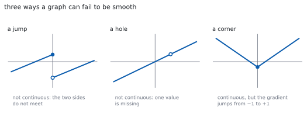
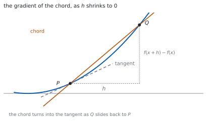

# HL 5.12 — Continuity, differentiability and first principles（連続性・微分可能性と第一原理） {#sec-aahl-5-12}

::: {.callout-note}
## What you should be able to do
- **極限**（limit）が収束するか発散するかを、ことばで説明できる。
- **連続**（continuous）・**微分可能**（differentiable）の意味を、グラフで言える。
- **第一原理**（from first principles）で、多項式の導関数を求められる。
- $\lim_{h \to 0}$ を、答えが出るまで書き続けられる。
- **高次導関数**を求め、$\dfrac{\mathrm{d}^{n}y}{\mathrm{d}x^{n}}$ と $f^{(n)}(x)$ の記号を使える。
- 規則を見つけて、**帰納法**で示せる（[HL 1.15](../01-number-and-algebra/aahl-1-15.qmd)）。
:::

## The idea

### 1. Limits（極限） {#limits}

シラバスは、こう書いています。

> Understanding of limits (convergence and divergence).

$x$ をある値に近づけたとき、$f(x)$ が**$1$ つの値に近づく**なら収束（convergence）、近づかないなら発散（divergence）です（[SL 5.1](../../aa-sl/05-calculus/aasl-5-1.qmd#limit)）。

**$x = a$ での値と、$x \to a$ での極限は別もの**です。穴があいていても、極限はあります。

無限等比級数で見た「近づくけれど、たどり着かない」と同じ考え方です（[SL 1.8](../../aa-sl/01-number-and-algebra/aasl-1-8.qmd)）。

### 2. Continuity（連続性） {#continuity}

**ペンを離さずにかける**なら、そこで連続です。切れ目や穴があれば、連続ではありません。

{#fig-aahl512-idea-a width=100%}

::: {.callout-important}
## 試験では、連続性の判定そのものは出ません
シラバスにこう書いてあります。

> In examinations, students will not be asked to test for continuity and differentiability.

**ことばで説明できれば十分**です。$\varepsilon$–$\delta$ のような形式的な定義は要りません。
:::

### 3. Differentiability（微分可能性） {#differentiability}

**接線が $1$ 本に決まる**なら、そこで微分可能です。

@fig-aahl512-idea-a の右のように**角**（corner）があると、左から来た傾きと右から来た傾きがちがいます。接線が決まらないので、微分できません。

**微分可能なら連続です。** 逆は成り立ちません。角のある $y = \lvert x \rvert$ が、その例です。

### 4. The derivative from first principles（第一原理による微分） {#first-principles}

公式集の **5.12** の欄にあります。

> Derivative of $f(x)$ from first principles

$$
y = f(x) \ \Rightarrow \
\frac{\mathrm{d}y}{\mathrm{d}x} = f'(x)
= \lim_{h \to 0}\left(\frac{f(x+h)-f(x)}{h}\right)
$$ {#eq-aahl512-first}

分数の中身は、**$2$ 点を結ぶ直線（割線）の傾き**です（[SL 5.1](../../aa-sl/05-calculus/aasl-5-1.qmd#average)）。

{#fig-aahl512-idea-b width=100%}

**$h = 0$ を代入してはいけません。** 分母が $0$ になります。**先に約分して、$h$ を消してから**近づけます（[第 2 節](#why-cancel)）。

### 5. Using it on polynomials（多項式でやってみる） {#polynomials}

シラバスは、使う範囲をこう限っています。

> Use of this definition for polynomials only.

手順は、いつも同じ $4$ つです。

1. $f(x+h)$ を**展開**する。
2. $f(x)$ を引く。**定数項と、$h$ のない項が消えます。**
3. 分子の**すべての項に $h$ がある**ので、$h$ で割る。
4. $h \to 0$ とする。**$h$ の残った項が消えます。**

答えは、[SL 5.3](../../aa-sl/05-calculus/aasl-5-3.qmd#power) のべき乗の公式と一致します。

### 6. Higher derivatives（高次導関数） {#higher}

$f'(x)$ をもう一度微分したものが $f''(x)$ です。$n$ 回微分したものを、シラバスは次の記号で書いています。

> Familiarity with the notations $\dfrac{\mathrm{d}^{n}y}{\mathrm{d}x^{n}}$, $f^{(n)}(x)$.

$$
\frac{\mathrm{d}^{n}y}{\mathrm{d}x^{n}} = f^{(n)}(x)
$$ {#eq-aahl512-higher}

**$f^{(n)}$ のかっこは、指数ではありません。** $f^{3}(x)$ は $\left(f(x)\right)^{3}$ の意味で使われることがあるので、$f^{(3)}(x)$ とかっこを付けて区別します。

$n$ 次の多項式は、$n+1$ 回微分すると $0$ になります。

### 7. Finding a pattern, then proving it（規則を見つけて示す） {#pattern}

$n$ 回微分した形を聞かれたら、**まず $1$ 回、$2$ 回、$3$ 回と書き出して規則を見つけます**。

見つけた形は、シラバスのとおり帰納法で示します。

> Link to: proof by mathematical induction (AHL 1.15).

**「$n = k$ で成り立つとして、もう $1$ 回微分する」**のが帰納段階です（[HL 1.15](../01-number-and-algebra/aahl-1-15.qmd)）。

::: {.callout-tip collapse="true"}
## Paper 2 では、電卓で極限と高次導関数が出せます

TI-Nspire CX II には `limit(` があります。`limit((f(x+h)-f(x))/h, h, 0)` の形で入れられます。

高次導関数は、微分のテンプレート（**menu → 4: Calculus → 1: Derivative**）に階数を入れるか、`d(d(f(x),x),x)` のように重ねます。

**答案には、式を書いてください。** @eq-aahl512-first の形から始め、展開・約分・極限の $3$ 行を見せます。`limit(...)` と書いても点になりません。

**Paper 1 では使えません。** このページの例題と演習は、すべて手で解けるようにしてあります。
:::

## Why it works

::: {.callout-tip collapse="true"}
## クリックすると開きます

#### なぜ、先に約分するのか {#why-cancel}

$h = 0$ をそのまま入れると $\dfrac{0}{0}$ になります。これは**値が決まらない形**です（次の項目 AHL 5.13 で扱います）。

ところが $h \neq 0$ のあいだは、分子と分母を $h$ で割ってかまいません。割ったあとの式は、**$h = 0$ の近くでちゃんと値をもちます**。

極限が見ているのは「$h$ が $0$ に近いときの値」であって、「$h = 0$ のときの値」ではありません。ですから、約分してから近づけてよいのです。

#### なぜ、$f(x+h)-f(x)$ の各項に $h$ が残るのか {#why-h}

多項式なら、$f(x+h)$ を展開した式は $f(x)$ の項をそのまま含みます。

$$
(x+h)^{2} = x^{2}+2xh+h^{2}, \qquad
(x+h)^{3} = x^{3}+3x^{2}h+3xh^{2}+h^{3}
$$

**$h$ を含まない項だけが $f(x)$ と同じ**で、引くと消えます。残るのは、すべて $h$ をもつ項です。だからかならず $h$ で割れます。

二項定理で見れば、$(x+h)^{n}$ の $h^{0}$ の項が $x^{n}$ です（[SL 1.9](../../aa-sl/01-number-and-algebra/aasl-1-9.qmd)）。

#### なぜ、角では微分できないのか {#why-corner}

$y = \lvert x \rvert$ を $x = 0$ で考えます。@eq-aahl512-first の中身は

$$
\frac{\lvert 0+h \rvert-0}{h} = \frac{\lvert h \rvert}{h}
$$

です。$h > 0$ なら $1$、$h < 0$ なら $-1$ です。

**右から近づけた値と、左から近づけた値がちがいます。** 極限が $1$ つに決まらないので、微分できません。

グラフでは「接線が $1$ 本に決まらない」ことにあたります。

#### なぜ、微分可能なら連続なのか {#why-implies}

$f'(a)$ が存在するとします。$h$ が小さいとき

$$
f(a+h)-f(a) = h \cdot \frac{f(a+h)-f(a)}{h}
$$

です。右辺は「$0$ に近づくもの」かける「$f'(a)$ に近づくもの」なので、$0$ に近づきます。

つまり $f(a+h) \to f(a)$ で、これが**連続だということ**です。

**逆は成り立ちません。** 連続でも角があれば微分できません。
:::

## Worked examples

::: {.callout-note appearance="simple"}
問題文は英語です。意味が理解できなかったら、問題文の下の「**日本語訳**」を開いてください。解説は日本語です。

**例題も演習も、すべて電卓なしで解けます。** Paper 1 のつもりで解いてください。
:::

::: {#exm-aahl512-square}
[Use the definition of the derivative to find $f'(x)$ for $f(x) = x^{2}$.]{.q-en}

日本語訳

導関数の定義を使って、$f(x) = x^{2}$ の $f'(x)$ を求めなさい。

---

@eq-aahl512-first に入れます。

$$
f(x+h) = (x+h)^{2} = x^{2}+2xh+h^{2}
$$

$$
f(x+h)-f(x) = 2xh+h^{2} = h(2x+h)
$$

$$
\frac{f(x+h)-f(x)}{h} = 2x+h \qquad (h \neq 0)
$$

$$
f'(x) = \lim_{h \to 0}\,(2x+h) = 2x
$$

**検算。** **べき乗の公式と合うか**を見ます。$\dfrac{\mathrm{d}}{\mathrm{d}x}x^{2} = 2x$ ✓（[SL 5.3](../../aa-sl/05-calculus/aasl-5-3.qmd#power)）

**検算（$x = 1$ で）。** $h = 0.1$ のとき割線の傾きは $2.1$、$h = 0.01$ なら $2.01$ ✓ **$2$ に近づいています。**

::: {.callout-note}
## 解答例（答案用紙に書くこと）

$$f'(x) = \lim_{h \to 0}\frac{(x+h)^{2}-x^{2}}{h}
= \lim_{h \to 0}\frac{2xh+h^{2}}{h}$$

$$= \lim_{h \to 0}\,(2x+h) = 2x$$
:::
:::

::: {#exm-aahl512-quadratic}
[Use the definition of the derivative to find $f'(x)$ for $f(x) = 3x^{2}-2x+1$.]{.q-en}

日本語訳

導関数の定義を使って、$f(x) = 3x^{2}-2x+1$ の $f'(x)$ を求めなさい。

---

$$
f(x+h) = 3(x+h)^{2}-2(x+h)+1
= 3x^{2}+6xh+3h^{2}-2x-2h+1
$$

$f(x)$ を引くと、**$h$ のない項がすべて消えます**。

$$
f(x+h)-f(x) = 6xh+3h^{2}-2h = h(6x+3h-2)
$$

$$
f'(x) = \lim_{h \to 0}\,(6x+3h-2) = 6x-2
$$

**検算。** **項ごとに微分したものと合うか**を見ます。$6x-2+0$ ✓

**検算（定数項）。** $+1$ はどこにも残りませんでした ✓ 定数の微分は $0$ です。

::: {.callout-note}
## 解答例（答案用紙に書くこと）

$$f(x+h)-f(x) = 6xh+3h^{2}-2h$$

$$f'(x) = \lim_{h \to 0}\frac{h(6x+3h-2)}{h}
= \lim_{h \to 0}\,(6x+3h-2) = 6x-2$$
:::
:::

::: {#exm-aahl512-cubic}
[Use the definition of the derivative to find $f'(x)$ for $f(x) = x^{3}$.]{.q-en}

日本語訳

導関数の定義を使って、$f(x) = x^{3}$ の $f'(x)$ を求めなさい。

---

**展開がやまです。**

$$
(x+h)^{3} = x^{3}+3x^{2}h+3xh^{2}+h^{3}
$$

$$
f(x+h)-f(x) = 3x^{2}h+3xh^{2}+h^{3} = h\left(3x^{2}+3xh+h^{2}\right)
$$

$$
f'(x) = \lim_{h \to 0}\left(3x^{2}+3xh+h^{2}\right) = 3x^{2}
$$

**検算。** **$h$ の付いた項だけが消えました** ✓ 残ったのは $3x^{2}$ です。

**検算（公式と）。** $\dfrac{\mathrm{d}}{\mathrm{d}x}x^{3} = 3x^{2}$ ✓ 一致します。

::: {.callout-note}
## 解答例（答案用紙に書くこと）

$$f'(x) = \lim_{h \to 0}\frac{(x+h)^{3}-x^{3}}{h}
= \lim_{h \to 0}\frac{3x^{2}h+3xh^{2}+h^{3}}{h}$$

$$= \lim_{h \to 0}\left(3x^{2}+3xh+h^{2}\right) = 3x^{2}$$
:::
:::

::: {#exm-aahl512-induction}
[Let $y = e^{2x}$.]{.q-en}

**(a)** [Find $\dfrac{\mathrm{d}y}{\mathrm{d}x}$, $\dfrac{\mathrm{d}^{2}y}{\mathrm{d}x^{2}}$ and $\dfrac{\mathrm{d}^{3}y}{\mathrm{d}x^{3}}$.]{.q-en}

**(b)** [Write down a conjecture for $\dfrac{\mathrm{d}^{n}y}{\mathrm{d}x^{n}}$ and prove it by induction.]{.q-en}

日本語訳

$y = e^{2x}$ とします。

**(a)** $\dfrac{\mathrm{d}y}{\mathrm{d}x}$、$\dfrac{\mathrm{d}^{2}y}{\mathrm{d}x^{2}}$、$\dfrac{\mathrm{d}^{3}y}{\mathrm{d}x^{3}}$ を求めなさい。

**(b)** $\dfrac{\mathrm{d}^{n}y}{\mathrm{d}x^{n}}$ を予想し、帰納法で証明しなさい。

---

**(a)** 連鎖律で、$1$ 回ごとに $2$ がかかります（[SL 5.6](../../aa-sl/05-calculus/aasl-5-6.qmd#chain)）。

$$
\frac{\mathrm{d}y}{\mathrm{d}x} = 2e^{2x}, \qquad
\frac{\mathrm{d}^{2}y}{\mathrm{d}x^{2}} = 4e^{2x}, \qquad
\frac{\mathrm{d}^{3}y}{\mathrm{d}x^{3}} = 8e^{2x}
$$

**(b)** $2$、$4$、$8$ なので、予想は

$$
\frac{\mathrm{d}^{n}y}{\mathrm{d}x^{n}} = 2^{n}e^{2x}
$$

です。$n = 1$ で $2e^{2x}$ ✓ 成り立ちます。

$n = k$ で成り立つとします。もう $1$ 回微分すると

$$
\frac{\mathrm{d}^{k+1}y}{\mathrm{d}x^{k+1}}
= \frac{\mathrm{d}}{\mathrm{d}x}\left(2^{k}e^{2x}\right)
= 2^{k}\cdot 2e^{2x} = 2^{k+1}e^{2x}
$$

なので、$n = k+1$ でも成り立ちます。

**検算。** **$n = 3$ を式に入れます。** $2^{3}e^{2x} = 8e^{2x}$ ✓ (a) と合います。

**検算（$n = 0$）。** $2^{0}e^{2x} = e^{2x}$ ✓ 微分する前の式にもどります。

::: {.callout-note}
## 解答例（答案用紙に書くこと）

**(a)** $\dfrac{\mathrm{d}y}{\mathrm{d}x} = 2e^{2x}$, $\ \dfrac{\mathrm{d}^{2}y}{\mathrm{d}x^{2}} = 4e^{2x}$, $\ \dfrac{\mathrm{d}^{3}y}{\mathrm{d}x^{3}} = 8e^{2x}$

**(b)** *Conjecture:* $\dfrac{\mathrm{d}^{n}y}{\mathrm{d}x^{n}} = 2^{n}e^{2x}$ *for all* $n \in \mathbb{Z}^{+}$.

*True for* $n = 1$. *Assume true for* $n = k$. *Then*

$$\frac{\mathrm{d}^{k+1}y}{\mathrm{d}x^{k+1}}
= \frac{\mathrm{d}}{\mathrm{d}x}\left(2^{k}e^{2x}\right) = 2^{k+1}e^{2x}$$

*so it is true for* $n = k+1$, *and the result follows by induction.*
:::

::: {.model-answer}
**試験ではこう書く**

*Differentiating repeatedly with the chain rule brings down a factor of* $2$ *each time:* $\dfrac{\mathrm{d}y}{\mathrm{d}x} = 2e^{2x}$, $\dfrac{\mathrm{d}^{2}y}{\mathrm{d}x^{2}} = 4e^{2x}$ *and* $\dfrac{\mathrm{d}^{3}y}{\mathrm{d}x^{3}} = 8e^{2x}$.

*The factors* $2$, $4$, $8$ *are powers of* $2$, *which suggests the conjecture* $\dfrac{\mathrm{d}^{n}y}{\mathrm{d}x^{n}} = 2^{n}e^{2x}$ *for every positive integer* $n$.

*Base case: for* $n = 1$ *the formula gives* $2^{1}e^{2x} = 2e^{2x}$, *which agrees with the first derivative found above, so the statement holds for* $n = 1$.

*Inductive step: assume the statement holds for some positive integer* $n = k$, *so that* $\dfrac{\mathrm{d}^{k}y}{\mathrm{d}x^{k}} = 2^{k}e^{2x}$. *Differentiating both sides once more,*

$$\frac{\mathrm{d}^{k+1}y}{\mathrm{d}x^{k+1}}
= \frac{\mathrm{d}}{\mathrm{d}x}\left(2^{k}e^{2x}\right)
= 2^{k}\left(2e^{2x}\right) = 2^{k+1}e^{2x}$$

*which is the statement for* $n = k+1$. *Since the statement is true for* $n = 1$, *and its truth for* $n = k$ *implies its truth for* $n = k+1$, *it is true for all positive integers* $n$ *by the principle of mathematical induction.*
:::
:::

## Common errors

::: {.callout-warning}
## 約分する前に $h = 0$ を入れる
$\dfrac{0}{0}$ になり、そこで止まってしまいます（[第 1 節](#why-cancel)）。

**分子を因数分解して $h$ を約分してから**、$h \to 0$ とします。
:::

::: {.callout-warning}
## $\lim_{h \to 0}$ を書かずに進める
最後の行までは、**毎行 $\lim_{h \to 0}$ を書きます**（@eq-aahl512-first）。

$h$ を消したあとで初めて外せます。途中で落とすと、点を引かれます。
:::

::: {.callout-warning}
## $(x+h)^{2}$ を $x^{2}+h^{2}$ と展開する
$2xh$ の項が要ります。$(x+h)^{3}$ なら $3x^{2}h+3xh^{2}$ も要ります（[第 2 節](#why-h)）。

**この項が、答えそのもの**です。落とすと導関数が $0$ になってしまいます。
:::

::: {.callout-warning}
## 連続なら微分できる、と考える
$y = \lvert x \rvert$ は $x = 0$ で連続ですが、微分できません（[第 3 節](#differentiability)）。

**向きはこちらだけ**です。微分可能 $\Rightarrow$ 連続、ですが逆は成り立ちません。
:::

::: {.callout-warning}
## $f^{(n)}(x)$ を $n$ 乗だと読む
$f^{(3)}(x)$ は $3$ 回微分、$\left(f(x)\right)^{3}$ は $3$ 乗です（[第 6 節](#higher)）。

**かっこがあるかどうか**で見分けます。
:::

::: {.callout-warning}
## 規則を書いただけで証明したつもりになる
$3$ 回ぶん書き出して形を見つけるのは**予想**です（[第 7 節](#pattern)）。

`prove` と言われたら、**帰納法の $3$ 段（基底・仮定・$k+1$）**まで書いてください。
:::

## Exercises

::: {.callout-note appearance="simple"}
各問題に、折りたたみが $3$ つ付いています。**日本語訳**、**解答例**（答案用紙に書くべきこと。英語です）、**解説**（なぜそうなるか。日本語です）。

まず自分で解いて、次に解答例と見くらべてください。**解説は、合わなかったときだけ開けば十分です。**
:::

::: {.exercise-block}

[1]{.ex-no} [Use the definition of the derivative to find $f'(x)$ for $f(x) = 5x-2$.]{.q-en}

日本語訳

導関数の定義を使って、$f(x) = 5x-2$ の $f'(x)$ を求めなさい。

::: {.callout-note collapse="true"}
## 解答例（答案用紙に書くこと）

$$f(x+h)-f(x) = \left(5x+5h-2\right)-\left(5x-2\right) = 5h$$

$$f'(x) = \lim_{h \to 0}\frac{5h}{h} = \lim_{h \to 0} 5 = 5$$
:::

::: {.callout-tip collapse="true"}
## 解説

$1$ 次式なので、約分したあとに **$h$ が残りません**。極限を取る前から $5$ です。

**検算。** 直線の傾きは、どこでも $5$ ✓ 導関数が定数になるのは、そのためです。

**検算（$-2$）。** 引き算で消えました ✓ 上下にずらしても傾きは変わりません。
:::

::: {.ex-sep}
:::

[2]{.ex-no} [Use the definition of the derivative to find $f'(x)$ for $f(x) = x^{2}+3x$.]{.q-en}

日本語訳

導関数の定義を使って、$f(x) = x^{2}+3x$ の $f'(x)$ を求めなさい。

::: {.callout-note collapse="true"}
## 解答例（答案用紙に書くこと）

$$f(x+h)-f(x) = 2xh+h^{2}+3h = h\left(2x+h+3\right)$$

$$f'(x) = \lim_{h \to 0}\left(2x+h+3\right) = 2x+3$$
:::

::: {.callout-tip collapse="true"}
## 解説

$x^{2}$ の部分と $3x$ の部分を、別々に処理しても同じです。**どちらにも $h$ が残ります。**

**検算。** 項ごとに微分すると $2x+3$ ✓

**検算（$x = 0$）。** $f'(0) = 3$ で、原点での傾きは $3$ ✓ グラフの形と合います。
:::

::: {.ex-sep}
:::

[3]{.ex-no} [Use the definition of the derivative to find $f'(x)$ for $f(x) = 2x^{2}-5$.]{.q-en}

日本語訳

導関数の定義を使って、$f(x) = 2x^{2}-5$ の $f'(x)$ を求めなさい。

::: {.callout-note collapse="true"}
## 解答例（答案用紙に書くこと）

$$f(x+h)-f(x) = 4xh+2h^{2} = h\left(4x+2h\right)$$

$$f'(x) = \lim_{h \to 0}\left(4x+2h\right) = 4x$$
:::

::: {.callout-tip collapse="true"}
## 解説

$2$ を先に外に出してから展開すると、計算が減ります。$2\left[(x+h)^{2}-x^{2}\right] = 2h(2x+h)$ です。

**検算。** $-5$ は消えました ✓ 定数項は導関数に出てきません。

**検算（公式）。** $2 \times 2x = 4x$ ✓
:::

::: {.ex-sep}
:::

[4]{.ex-no} [Use the definition of the derivative to find $f'(x)$ for $f(x) = x^{3}-x$.]{.q-en}

日本語訳

導関数の定義を使って、$f(x) = x^{3}-x$ の $f'(x)$ を求めなさい。

::: {.callout-note collapse="true"}
## 解答例（答案用紙に書くこと）

$$f(x+h)-f(x) = 3x^{2}h+3xh^{2}+h^{3}-h
= h\left(3x^{2}+3xh+h^{2}-1\right)$$

$$f'(x) = \lim_{h \to 0}\left(3x^{2}+3xh+h^{2}-1\right) = 3x^{2}-1$$
:::

::: {.callout-tip collapse="true"}
## 解説

$(x+h)^{3}$ の展開を落とさないこと（[第 2 節](#why-h)）。$-x$ からは $-h$ が出ます。

**検算。** 項ごとに微分すると $3x^{2}-1$ ✓

**検算（$f'(x) = 0$）。** $x = \pm\dfrac{1}{\sqrt{3}}$ で傾きが $0$ ✓ $3$ 次のグラフに山と谷があることと合います。
:::

::: {.ex-sep}
:::

[5]{.ex-no} [Explain why $f(x) = \lvert x \rvert$ is not differentiable at $x = 0$.]{.q-en}

日本語訳

$f(x) = \lvert x \rvert$ が $x = 0$ で微分可能でない理由を説明しなさい。

::: {.callout-note collapse="true"}
## 解答例（答案用紙に書くこと）

$$\frac{f(0+h)-f(0)}{h} = \frac{\lvert h \rvert}{h}$$

*This equals* $1$ *when* $h > 0$ *and* $-1$ *when* $h < 0$.

*The two one-sided limits are different, so the limit as* $h \to 0$ *does not exist and* $f$ *is not differentiable at* $0$.
:::

::: {.callout-tip collapse="true"}
## 解説

**左右で値がちがう**ので、極限が $1$ つに決まりません（[第 3 節](#why-corner)）。

グラフでは、$x = 0$ に角があります（@fig-aahl512-idea-a）。接線が $1$ 本に決まりません。

**検算（連続性）。** $x \to 0$ で $\lvert x \rvert \to 0 = f(0)$ ✓ 連続ではあります。

**検算（ほかの点）。** $x > 0$ では $f(x) = x$ なので $f'(x) = 1$ ✓ $0$ 以外では微分できます。
:::

::: {.ex-sep}
:::

[6]{.ex-no} [Let $y = x^{5}$. Find $\dfrac{\mathrm{d}^{3}y}{\mathrm{d}x^{3}}$.]{.q-en}

日本語訳

$y = x^{5}$ とします。$\dfrac{\mathrm{d}^{3}y}{\mathrm{d}x^{3}}$ を求めなさい。

::: {.callout-note collapse="true"}
## 解答例（答案用紙に書くこと）

$$\frac{\mathrm{d}y}{\mathrm{d}x} = 5x^{4}, \qquad
\frac{\mathrm{d}^{2}y}{\mathrm{d}x^{2}} = 20x^{3}, \qquad
\frac{\mathrm{d}^{3}y}{\mathrm{d}x^{3}} = 60x^{2}$$
:::

::: {.callout-tip collapse="true"}
## 解説

**$1$ 回ずつ、ていねいに**書きます（[第 6 節](#higher)）。指数が $1$ ずつ下がります。

**検算（係数）。** $5 \times 4 \times 3 = 60$ ✓

**検算（次数）。** $5$ 次を $3$ 回微分したので $2$ 次 ✓ あと $3$ 回で $0$ になります。
:::

::: {.ex-sep}
:::

[7]{.ex-no} [Find $\displaystyle\lim_{x \to 2}\frac{x^{2}-4}{x-2}$.]{.q-en}

日本語訳

$\displaystyle\lim_{x \to 2}\frac{x^{2}-4}{x-2}$ を求めなさい。

::: {.callout-note collapse="true"}
## 解答例（答案用紙に書くこと）

$$\frac{x^{2}-4}{x-2} = \frac{(x-2)(x+2)}{x-2} = x+2 \qquad (x \neq 2)$$

$$\lim_{x \to 2}\frac{x^{2}-4}{x-2} = \lim_{x \to 2}\,(x+2) = 4$$
:::

::: {.callout-tip collapse="true"}
## 解説

そのまま入れると $\dfrac{0}{0}$ です。**因数分解して約分**します（[第 1 節](#why-cancel)）。

グラフで言えば、$y = x+2$ の $x = 2$ に穴があいた形です（@fig-aahl512-idea-a）。

**検算（近づける）。** $x = 2.01$ なら $4.01$、$x = 1.99$ なら $3.99$ ✓ どちらからも $4$ に近づきます。

**検算（別の見方）。** これは $f(x) = x^{2}$ の $x = 2$ での導関数でもあります ✓ $f'(2) = 4$ です。
:::

::: {.ex-sep}
:::

[8]{.ex-no} [Use the definition of the derivative to show that, for constants $a$, $b$ and $c$, the function $f(x) = ax^{2}+bx+c$ has $f'(x) = 2ax+b$.]{.q-en}

日本語訳

導関数の定義を使って、定数 $a$、$b$、$c$ について $f(x) = ax^{2}+bx+c$ の導関数が $f'(x) = 2ax+b$ であることを示しなさい。

::: {.callout-note collapse="true"}
## 解答例（答案用紙に書くこと）

$$f(x+h) = a\left(x^{2}+2xh+h^{2}\right)+b(x+h)+c$$

$$f(x+h)-f(x) = 2axh+ah^{2}+bh = h\left(2ax+ah+b\right)$$

$$f'(x) = \lim_{h \to 0}\left(2ax+ah+b\right) = 2ax+b$$
:::

::: {.callout-tip collapse="true"}
## 解説

**文字のままでも、手順は同じ**です（[第 5 節](#polynomials)）。$c$ は引き算で消えます。

$a$、$b$、$c$ は定数なので、極限を取るときに動きません。動くのは $h$ だけです。

**検算（例題 $2$）。** $a = 3$、$b = -2$、$c = 1$ を入れると $6x-2$ ✓

**検算（$a = 0$）。** $1$ 次式になり、$f'(x) = b$ ✓ 演習 $1$ と合います。

::: {.model-answer}
**試験ではこう書く**

*By the definition of the derivative,*

$$f'(x) = \lim_{h \to 0}\frac{f(x+h)-f(x)}{h}$$

*Expanding the numerator, with* $a$, $b$ *and* $c$ *constants,*

$$f(x+h) = a(x+h)^{2}+b(x+h)+c
= ax^{2}+2axh+ah^{2}+bx+bh+c$$

*Subtracting* $f(x) = ax^{2}+bx+c$ *removes every term that does not contain* $h$, *leaving*

$$f(x+h)-f(x) = 2axh+ah^{2}+bh = h\left(2ax+ah+b\right)$$

*Every term of the numerator has a factor* $h$, *so for* $h \neq 0$ *the quotient simplifies to* $2ax+ah+b$. *This cancellation is legitimate because the limit only concerns values of* $h$ *close to* $0$, *not* $h = 0$ *itself.*

*Finally, as* $h \to 0$ *the only term involving* $h$ *vanishes, giving*

$$f'(x) = \lim_{h \to 0}\left(2ax+ah+b\right) = 2ax+b$$
:::
:::

::: {.ex-sep}
:::

[9]{.ex-no} [Explain what $\displaystyle\lim_{h \to 0}$ means in the definition of the derivative, and why the value $h = 0$ cannot simply be substituted at the start.]{.q-en}

日本語訳

導関数の定義における $\displaystyle\lim_{h \to 0}$ の意味を説明し、はじめから $h = 0$ を代入できない理由を述べなさい。

::: {.callout-note collapse="true"}
## 解答例（答案用紙に書くこと）

*The limit describes the value the quotient approaches as* $h$ *gets close to* $0$, *for values of* $h$ *that are not themselves* $0$.

*Substituting* $h = 0$ *at the start gives* $\dfrac{0}{0}$, *which has no value, because the denominator of the quotient is* $h$.

*For* $h \neq 0$ *the factor* $h$ *may be cancelled, and the resulting expression does have a value as* $h \to 0$.
:::

::: {.callout-tip collapse="true"}
## 解説

**「近づく」と「等しい」はちがいます**（[第 1 節](#limits)）。極限は、$h = 0$ のときの値を聞いていません。

割線は $2$ 点を結ぶ直線なので、$h = 0$ だと点が $1$ つになってしまい、直線が決まりません（@fig-aahl512-idea-b）。

**検算（数で）。** $f(x) = x^{2}$、$x = 1$ で $h = 0.001$ なら $2.001$ ✓ $2$ に近づきます。

**検算（約分後）。** $2x+h$ には $h = 0$ を入れてよい ✓ 分母が消えているからです。

::: {.model-answer}
**試験ではこう書く**

*The notation* $\displaystyle\lim_{h \to 0}$ *asks what value the expression approaches as* $h$ *is made arbitrarily close to* $0$, *taking only values with* $h \neq 0$. *It is a statement about the behaviour of the expression near* $h = 0$, *not about its value at* $h = 0$.

*The quotient in the definition has denominator* $h$, *so substituting* $h = 0$ *directly gives* $\dfrac{f(x)-f(x)}{0} = \dfrac{0}{0}$, *which is not a number: division by zero is undefined, and the numerator being zero as well means no single value is forced.*

*Geometrically, the quotient is the gradient of the chord joining the points at* $x$ *and* $x+h$. *If* $h = 0$ *the two points coincide, and a single point does not determine a line.*

*The way through is to keep* $h \neq 0$ *while simplifying. For a polynomial every term of the numerator contains a factor* $h$, *so the* $h$ *in the denominator cancels. The simplified expression is defined at* $h = 0$, *and its value there is the limit.*
:::
:::

::: {.ex-sep}
:::

[10]{.ex-no} [A student writes: "$f'(x) = \dfrac{f(x+0)-f(x)}{0} = \dfrac{0}{0}$, so the derivative cannot be found." Identify the error and explain the correct procedure.]{.q-en}

日本語訳

ある生徒が「$f'(x) = \dfrac{f(x+0)-f(x)}{0} = \dfrac{0}{0}$ だから、導関数は求められない」と書きました。まちがいを指摘し、正しい手順を説明しなさい。

::: {.callout-note collapse="true"}
## 解答例（答案用紙に書くこと）

*The student has substituted* $h = 0$ *instead of taking a limit. The definition uses* $\displaystyle\lim_{h \to 0}$, *which considers values of* $h$ *close to* $0$ *but not equal to it.*

*The correct procedure is to expand* $f(x+h)$, *subtract* $f(x)$, *cancel the common factor* $h$ *while* $h \neq 0$, *and only then let* $h \to 0$.
:::

::: {.callout-tip collapse="true"}
## 解説

**$\lim$ を落としてしまった**のが原因です（[第 4 節](#first-principles)）。

「$\dfrac{0}{0}$ だから求められない」は言いすぎです。**約分すれば値が出ます。**

**検算（$f(x) = x^{2}$ で）。** 約分して $2x+h$、$h \to 0$ で $2x$ ✓ ちゃんと求まります。

**検算（順番）。** 約分を先、極限を後 ✓ 逆にすると止まります。

::: {.model-answer}
**試験ではこう書く**

*The error is to replace the limit by a substitution. The definition of the derivative is*

$$f'(x) = \lim_{h \to 0}\frac{f(x+h)-f(x)}{h}$$

*and the symbol* $\displaystyle\lim_{h \to 0}$ *is not an instruction to put* $h = 0$. *It asks for the value approached as* $h$ *becomes small, with* $h$ *never actually equal to* $0$.

*Setting* $h = 0$ *does produce* $\dfrac{0}{0}$, *but this only shows that the quotient is undefined at that one value; it says nothing about the limit. An expression can fail to have a value at a point and still approach a definite value near it.*

*The correct procedure has four steps: expand* $f(x+h)$; *subtract* $f(x)$, *which removes all terms without a factor* $h$; *divide numerator and denominator by* $h$, *which is allowed because* $h \neq 0$; *and finally take* $h \to 0$ *in the simplified expression, where the substitution is now legitimate. For* $f(x) = x^{2}$ *this gives* $2x+h$ *after cancelling, and hence* $f'(x) = 2x$.
:::
:::

:::
