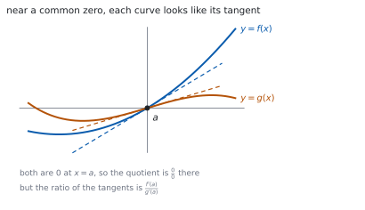
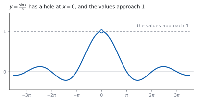

# HL 5.13 — Limits and l'Hôpital's rule（極限と l'Hôpital の定理） {#sec-aahl-5-13}

::: {.callout-note}
## What you should be able to do
- **不定形**（indeterminate form）$\dfrac{0}{0}$ と $\dfrac{\infty}{\infty}$ を見分けられる。
- **l'Hôpital の定理**を使って極限を求められる。
- 使う前に、**形が不定形かどうかを確かめる**ことができる。
- 必要なら、**くり返し**使える。
- $x \to \infty$ の極限を求め、**水平漸近線**と結びつけられる。
- $\displaystyle\lim_{\theta \to 0}\frac{\sin\theta}{\theta} = 1$ を使える。
:::

## The idea

### 1. Indeterminate forms（不定形） {#indeterminate}

シラバスは、こう書いています。

> The indeterminate forms $\dfrac{0}{0}$ and $\dfrac{\infty}{\infty}$.

分子と分母が**どちらも $0$ に近づく**とき、または**どちらも $\infty$ に近づく**ときは、代入しても値が決まりません。

$$
\frac{0}{0}, \qquad \frac{\infty}{\infty}
$$

**「決まらない」であって、「存在しない」ではありません。** 実際、$\dfrac{x^{2}}{x}$ は $0$ に、$\dfrac{x}{x^{2}}$ は $\infty$ に、$\dfrac{3x}{x}$ は $3$ に近づきます。どれも $\dfrac{0}{0}$ の形です。

### 2. l'Hôpital's rule（l'Hôpital の定理） {#lhopital}

シラバスは、こう書いています。

> The evaluation of limits of the form $\displaystyle\lim_{x \to a}\frac{f(x)}{g(x)}$ and $\displaystyle\lim_{x \to \infty}\frac{f(x)}{g(x)}$ using l'Hôpital's rule or the Maclaurin series.

$$
\lim_{x \to a}\frac{f(x)}{g(x)} = \lim_{x \to a}\frac{f'(x)}{g'(x)}
$$ {#eq-aahl513-rule}

**分子と分母を、別々に微分します。** 商の微分ではありません（[第 3 節](#check)）。

{#fig-aahl513-idea-a width=100%}

なぜこれでよいかは、上の図のとおりです。$x = a$ の近くで $f(x)$ は $f'(a)(x-a)$、$g(x)$ は $g'(a)(x-a)$ とほぼ同じなので、比は $\dfrac{f'(a)}{g'(a)}$ に近づきます（[第 1 節](#why-rule)）。

### 3. Check the form first（まず形を確かめる） {#check}

::: {.callout-important}
## 不定形でないときは使えません
$\displaystyle\lim_{x \to 0}\frac{x+1}{x+2}$ は、代入すれば $\dfrac{1}{2}$ です。**不定形ではありません。**

ここで @eq-aahl513-rule を使うと $\dfrac{1}{1} = 1$ となり、**まちがった答え**が出ます。

**答案には「$\dfrac{0}{0}$ の形なので」と書いてから**、定理を使ってください。これが書いていないと点になりません。
:::

### 4. Repeated use（くり返し使う） {#repeated}

> Repeated use of l'Hôpital's rule.

$1$ 回微分しても、まだ $\dfrac{0}{0}$ のことがあります。そのときは**もう一度**使います。

**毎回、形を確かめてから**使ってください。途中で不定形でなくなったら、そこで代入します。

### 5. Limits as $x \to \infty$（$x \to \infty$ の極限） {#infinity}

$x \to \infty$ でも同じように使えます。分子・分母がどちらも $\infty$ に近づくときです。

シラバスは、水平漸近線と結びつけています。

> Link to: horizontal asymptotes (SL2.8).

$\displaystyle\lim_{x \to \infty} f(x) = L$ なら、$y = L$ が**水平漸近線**です（[SL 2.8](../../aa-sl/02-functions/aasl-2-8.qmd)）。

有理関数なら、**最高次の項の係数の比**でも同じ答えが出ます。検算に使えます。

### 6. The standard limit $\dfrac{\sin\theta}{\theta}$（$\sin\theta/\theta$ の極限） {#sine-limit}

シラバスが例に挙げているのが、この極限です。

> For example: $\displaystyle\lim_{\theta \to 0}\frac{\sin\theta}{\theta} = 1$.

$$
\lim_{\theta \to 0}\frac{\sin\theta}{\theta} = 1
$$ {#eq-aahl513-sine}

{#fig-aahl513-idea-b width=100%}

**$\theta$ はラジアン**です。度で測ると、この式は成り立ちません（[第 4 節](#why-radian)）。

### 7. Using the Maclaurin series instead（Maclaurin 級数を使う手） {#maclaurin}

シラバスは「l'Hôpital の定理**または** Maclaurin 級数」と書いています。

たとえば $\sin\theta = \theta-\dfrac{\theta^{3}}{3!}+\cdots$ なので

$$
\frac{\sin\theta}{\theta} = 1-\frac{\theta^{2}}{6}+\cdots \ \longrightarrow \ 1
$$

です。級数のほうは、AHL 5.19 で扱います。**どちらで解いてもかまいません。**

::: {.callout-tip collapse="true"}
## Paper 2 では、電卓で極限が出せます

TI-Nspire CX II の `limit(` に、そのまま入れられます。`limit(sin(3x)/x, x, 0)` のようにします。

$x \to \infty$ なら、`limit(f(x), x, ∞)` です。$\infty$ は **ctrl** + **i** で入れます。**`RAD` になっているか**を見てください。

**答案には、式を書いてください。** 「$\dfrac{0}{0}$ の形なので」の $1$ 文と、@eq-aahl513-rule を使った行を見せます。`limit(...)` と書いても点になりません。

**Paper 1 では使えません。** このページの例題と演習は、すべて手で解けるようにしてあります。
:::

## Why it works

::: {.callout-tip collapse="true"}
## クリックすると開きます

#### なぜ、分子と分母を別々に微分してよいのか {#why-rule}

$f(a) = g(a) = 0$ とします。$x = a$ の近くでは

$$
f(x) \approx f'(a)(x-a), \qquad g(x) \approx g'(a)(x-a)
$$

です。これは接線の式そのものです（[HL 5.12](aahl-5-12.qmd#first-principles)）。

比を作ると $(x-a)$ が約分されて

$$
\frac{f(x)}{g(x)} \approx \frac{f'(a)(x-a)}{g'(a)(x-a)} = \frac{f'(a)}{g'(a)}
$$

になります。**$0$ に近づく速さを比べている**のだ、と読むこともできます。

#### なぜ、形を確かめないといけないのか {#why-check}

上の議論は $f(a) = g(a) = 0$ を使っています。そうでなければ、$(x-a)$ の約分が起きません。

$\dfrac{x+1}{x+2}$ で試すと、分子は $1$、分母は $2$ に近づくので、比はそのまま $\dfrac{1}{2}$ です。微分してしまうと $\dfrac{1}{1}$ になり、**もとの式とは無関係な数**が出ます。

**定理には条件があり、条件を確かめるまでが定理の使い方**です。

#### なぜ、$\dfrac{\infty}{\infty}$ でも使えるのか {#why-infinity}

$\dfrac{f}{g} = \dfrac{1/g}{1/f}$ と書きなおすと、分子・分母がどちらも $0$ に近づきます。

つまり $\dfrac{\infty}{\infty}$ は $\dfrac{0}{0}$ に直せます。ですから、同じ定理が使えます。

**有理関数では、最高次の項が勝ちます。** $\dfrac{3x^{2}+2x}{x^{2}-5}$ なら、大きい $x$ で $\dfrac{3x^{2}}{x^{2}} = 3$ です。微分をくり返しても同じ答えになります。

#### なぜ、ラジアンでないといけないのか {#why-radian}

$\dfrac{\mathrm{d}}{\mathrm{d}x}\sin x = \cos x$ が成り立つのは、**ラジアンで測ったとき**だけです（[SL 5.6](../../aa-sl/05-calculus/aasl-5-6.qmd#standard)）。

度で測ると、$\sin x^{\circ} = \sin\left(\dfrac{\pi x}{180}\right)$ なので、微分に $\dfrac{\pi}{180}$ が付きます。

すると @eq-aahl513-sine の右辺も $\dfrac{\pi}{180}$ になってしまいます。**$1$ になるのは、ラジアンのおかげ**です。
:::

## Worked examples

::: {.callout-note appearance="simple"}
問題文は英語です。意味が理解できなかったら、問題文の下の「**日本語訳**」を開いてください。解説は日本語です。

**例題も演習も、すべて電卓なしで解けます。** Paper 1 のつもりで解いてください。
:::

::: {#exm-aahl513-sine}
[Find $\displaystyle\lim_{x \to 0}\frac{\sin 3x}{x}$.]{.q-en}

日本語訳

$\displaystyle\lim_{x \to 0}\frac{\sin 3x}{x}$ を求めなさい。

---

**まず形を確かめます**（[第 3 節](#check)）。$x = 0$ を入れると $\dfrac{\sin 0}{0} = \dfrac{0}{0}$ で、不定形です。

@eq-aahl513-rule を使います。分子と分母を**別々に**微分します。

$$
\lim_{x \to 0}\frac{\sin 3x}{x}
= \lim_{x \to 0}\frac{3\cos 3x}{1} = 3\cos 0 = 3
$$

**検算。** **@eq-aahl513-sine から出します。** $\dfrac{\sin 3x}{x} = 3\cdot\dfrac{\sin 3x}{3x}$ で、$3 \times 1 = 3$ ✓

**検算（数で）。** $x = 0.01$ なら $\dfrac{\sin 0.03}{0.01} \approx 2.9996$ ✓ $3$ に近づいています。

::: {.callout-note}
## 解答例（答案用紙に書くこと）

*As* $x \to 0$ *both* $\sin 3x \to 0$ *and* $x \to 0$, *so the limit has the form* $\dfrac{0}{0}$.

$$\lim_{x \to 0}\frac{\sin 3x}{x} = \lim_{x \to 0}\frac{3\cos 3x}{1} = 3$$
:::
:::

::: {#exm-aahl513-repeated}
[Find $\displaystyle\lim_{x \to 0}\frac{e^{x}-1-x}{x^{2}}$.]{.q-en}

日本語訳

$\displaystyle\lim_{x \to 0}\frac{e^{x}-1-x}{x^{2}}$ を求めなさい。

---

$x = 0$ で分子は $1-1-0 = 0$、分母も $0$ です。**$\dfrac{0}{0}$ の形**です。

$$
\lim_{x \to 0}\frac{e^{x}-1-x}{x^{2}} = \lim_{x \to 0}\frac{e^{x}-1}{2x}
$$

**まだ $\dfrac{0}{0}$ です。** もう一度使います（[第 4 節](#repeated)）。

$$
= \lim_{x \to 0}\frac{e^{x}}{2} = \frac{1}{2}
$$

**検算。** **$2$ 回目のあとは不定形ではありません。** $\dfrac{e^{0}}{2} = \dfrac{1}{2}$ ✓ そこで止めます。

**検算（数で）。** $x = 0.01$ なら分子 $\approx 0.0000502$、分母 $0.0001$ で、比は $\approx 0.502$ ✓

::: {.callout-note}
## 解答例（答案用紙に書くこと）

*The form is* $\dfrac{0}{0}$, *so*

$$\lim_{x \to 0}\frac{e^{x}-1-x}{x^{2}} = \lim_{x \to 0}\frac{e^{x}-1}{2x}$$

*This is again* $\dfrac{0}{0}$, *so*

$$= \lim_{x \to 0}\frac{e^{x}}{2} = \frac{1}{2}$$
:::
:::

::: {#exm-aahl513-infinity}
[Find $\displaystyle\lim_{x \to \infty}\frac{3x^{2}+2x}{x^{2}-5}$, and state the equation of the horizontal asymptote of $y = \dfrac{3x^{2}+2x}{x^{2}-5}$.]{.q-en}

日本語訳

$\displaystyle\lim_{x \to \infty}\frac{3x^{2}+2x}{x^{2}-5}$ を求め、$y = \dfrac{3x^{2}+2x}{x^{2}-5}$ の水平漸近線の方程式を書きなさい。

---

$x \to \infty$ で分子も分母も $\infty$ に近づきます。**$\dfrac{\infty}{\infty}$ の形**です。

$$
\lim_{x \to \infty}\frac{3x^{2}+2x}{x^{2}-5}
= \lim_{x \to \infty}\frac{6x+2}{2x}
$$

まだ $\dfrac{\infty}{\infty}$ なので、もう一度です。

$$
= \lim_{x \to \infty}\frac{6}{2} = 3
$$

ですから、水平漸近線は $y = 3$ です（[第 5 節](#infinity)）。

**検算。** **最高次の係数の比**で見ます。$\dfrac{3}{1} = 3$ ✓

**検算（数で）。** $x = 100$ なら $\dfrac{30200}{9995} \approx 3.02$ ✓ $3$ に近づいています。

::: {.callout-note}
## 解答例（答案用紙に書くこと）

*The form is* $\dfrac{\infty}{\infty}$, *so*

$$\lim_{x \to \infty}\frac{3x^{2}+2x}{x^{2}-5}
= \lim_{x \to \infty}\frac{6x+2}{2x} = \lim_{x \to \infty}\frac{6}{2} = 3$$

*The horizontal asymptote is* $y = 3$.
:::
:::

::: {#exm-aahl513-cubic}
[Find $\displaystyle\lim_{x \to 0}\frac{x-\sin x}{x^{3}}$.]{.q-en}

日本語訳

$\displaystyle\lim_{x \to 0}\frac{x-\sin x}{x^{3}}$ を求めなさい。

---

$x = 0$ で分子は $0-0 = 0$、分母も $0$ です。

$$
\lim_{x \to 0}\frac{x-\sin x}{x^{3}}
= \lim_{x \to 0}\frac{1-\cos x}{3x^{2}}
$$

まだ $\dfrac{0}{0}$ です。

$$
= \lim_{x \to 0}\frac{\sin x}{6x}
$$

まだ $\dfrac{0}{0}$ です。$3$ 回目を使うか、@eq-aahl513-sine を使います。

$$
= \frac{1}{6}\lim_{x \to 0}\frac{\sin x}{x} = \frac{1}{6}
$$

**検算。** **$3$ 回目の l'Hôpital でも出します。** $\displaystyle\lim_{x \to 0}\frac{\cos x}{6} = \dfrac{1}{6}$ ✓

**検算（数で）。** $x = 0.1$ なら分子 $\approx 0.000167$、分母 $0.001$ で、比は $\approx 0.1666$ ✓

::: {.callout-note}
## 解答例（答案用紙に書くこと）

*Each step has the form* $\dfrac{0}{0}$.

$$\lim_{x \to 0}\frac{x-\sin x}{x^{3}}
= \lim_{x \to 0}\frac{1-\cos x}{3x^{2}}
= \lim_{x \to 0}\frac{\sin x}{6x}
= \lim_{x \to 0}\frac{\cos x}{6} = \frac{1}{6}$$
:::

::: {.model-answer}
**試験ではこう書く**

*Substituting* $x = 0$ *gives* $\dfrac{0-\sin 0}{0} = \dfrac{0}{0}$, *an indeterminate form, so l'Hôpital's rule may be applied. Differentiating numerator and denominator separately,*

$$\lim_{x \to 0}\frac{x-\sin x}{x^{3}} = \lim_{x \to 0}\frac{1-\cos x}{3x^{2}}$$

*Substituting* $x = 0$ *again gives* $\dfrac{1-1}{0} = \dfrac{0}{0}$, *so the rule applies a second time:*

$$= \lim_{x \to 0}\frac{\sin x}{6x}$$

*This is still* $\dfrac{0}{0}$, *so the rule applies a third time, giving*

$$= \lim_{x \to 0}\frac{\cos x}{6} = \frac{1}{6}$$

*Now the form is no longer indeterminate, so the substitution is legitimate and the process stops. The same answer follows from the standard limit* $\displaystyle\lim_{x \to 0}\frac{\sin x}{x} = 1$ *applied at the third stage.*
:::
:::

## Common errors

::: {.callout-warning}
## 形を確かめずに使う
不定形でないときに使うと、**まちがった答え**が出ます（[第 3 節](#check)）。

$\displaystyle\lim_{x \to 0}\frac{x+1}{x+2}$ は $\dfrac{1}{2}$ であって $1$ ではありません。**「$\dfrac{0}{0}$ の形なので」の $1$ 文を必ず書いてください。**
:::

::: {.callout-warning}
## 商の微分をしてしまう
@eq-aahl513-rule は $\dfrac{f'}{g'}$ であって、$\left(\dfrac{f}{g}\right)'$ ではありません。

**分子と分母を、別々に微分**します。商の微分公式は使いません。
:::

::: {.callout-warning}
## $1$ 回で止めてしまう
微分したあと、また $\dfrac{0}{0}$ になることがあります（[第 4 節](#repeated)）。

**毎回、代入して形を確かめて**ください。不定形でなくなったら、そこが終わりです。
:::

::: {.callout-warning}
## 不定形でなくなったのに使い続ける
$\dfrac{\cos x}{6}$ は $x = 0$ で $\dfrac{1}{6}$ です。**ここでもう一度微分すると、答えが変わってしまいます。**

止めどきを見あやまらないこと。**代入できるようになったら代入**です。
:::

::: {.callout-warning}
## 度で計算する
@eq-aahl513-sine が $1$ になるのは、**ラジアンのとき**だけです（[第 4 節](#why-radian)）。

電卓の `RAD` を確かめてください。三角関数の微分も、ラジアンでないと成り立ちません。
:::

::: {.callout-warning}
## $\dfrac{0}{0}$ を「$1$」や「$0$」だと思う
$\dfrac{0}{0}$ は**値が決まらない形**であって、ある値ではありません（[第 1 節](#indeterminate)）。

同じ $\dfrac{0}{0}$ でも、極限は $0$ にも $3$ にも $\infty$ にもなります。
:::

## Exercises

::: {.callout-note appearance="simple"}
各問題に、折りたたみが $3$ つ付いています。**日本語訳**、**解答例**（答案用紙に書くべきこと。英語です）、**解説**（なぜそうなるか。日本語です）。

まず自分で解いて、次に解答例と見くらべてください。**解説は、合わなかったときだけ開けば十分です。**
:::

::: {.exercise-block}

[1]{.ex-no} [Find $\displaystyle\lim_{x \to 0}\frac{\sin 5x}{2x}$.]{.q-en}

日本語訳

$\displaystyle\lim_{x \to 0}\frac{\sin 5x}{2x}$ を求めなさい。

::: {.callout-note collapse="true"}
## 解答例（答案用紙に書くこと）

*The form is* $\dfrac{0}{0}$, *so*

$$\lim_{x \to 0}\frac{\sin 5x}{2x} = \lim_{x \to 0}\frac{5\cos 5x}{2}
= \frac{5}{2}$$
:::

::: {.callout-tip collapse="true"}
## 解説

連鎖律で $5$ が出ます（[SL 5.6](../../aa-sl/05-calculus/aasl-5-6.qmd#chain)）。分母の微分は $2$ です。

**検算。** @eq-aahl513-sine から $\dfrac{5}{2}\cdot\dfrac{\sin 5x}{5x} \to \dfrac{5}{2}$ ✓

**検算（形）。** $\cos 0 = 1$ なので、$2$ 回目は要りません ✓
:::

::: {.ex-sep}
:::

[2]{.ex-no} [Find $\displaystyle\lim_{x \to 0}\frac{1-\cos x}{x^{2}}$.]{.q-en}

日本語訳

$\displaystyle\lim_{x \to 0}\frac{1-\cos x}{x^{2}}$ を求めなさい。

::: {.callout-note collapse="true"}
## 解答例（答案用紙に書くこと）

*The form is* $\dfrac{0}{0}$, *so*

$$\lim_{x \to 0}\frac{1-\cos x}{x^{2}} = \lim_{x \to 0}\frac{\sin x}{2x}$$

*This is again* $\dfrac{0}{0}$, *so*

$$= \lim_{x \to 0}\frac{\cos x}{2} = \frac{1}{2}$$
:::

::: {.callout-tip collapse="true"}
## 解説

$2$ 回使います（[第 4 節](#repeated)）。$2$ 回目のあとは代入できます。

**検算。** $\dfrac{\sin x}{2x} = \dfrac{1}{2}\cdot\dfrac{\sin x}{x} \to \dfrac{1}{2}$ ✓ @eq-aahl513-sine でも同じです。

**検算（数で）。** $x = 0.1$ なら $\dfrac{0.004996}{0.01} \approx 0.4996$ ✓
:::

::: {.ex-sep}
:::

[3]{.ex-no} [Find $\displaystyle\lim_{x \to \infty}\frac{2x^{2}-1}{5x^{2}+3x}$.]{.q-en}

日本語訳

$\displaystyle\lim_{x \to \infty}\frac{2x^{2}-1}{5x^{2}+3x}$ を求めなさい。

::: {.callout-note collapse="true"}
## 解答例（答案用紙に書くこと）

*The form is* $\dfrac{\infty}{\infty}$, *so*

$$\lim_{x \to \infty}\frac{2x^{2}-1}{5x^{2}+3x}
= \lim_{x \to \infty}\frac{4x}{10x+3}
= \lim_{x \to \infty}\frac{4}{10} = \frac{2}{5}$$
:::

::: {.callout-tip collapse="true"}
## 解説

$2$ 回使います。$1$ 回目のあとも $\dfrac{\infty}{\infty}$ だからです。

**検算。** 最高次の係数の比 $\dfrac{2}{5}$ ✓（[第 5 節](#infinity)）

**検算（漸近線）。** $y = \dfrac{2}{5}$ が水平漸近線です ✓
:::

::: {.ex-sep}
:::

[4]{.ex-no} [Find $\displaystyle\lim_{x \to 1}\frac{x^{3}-1}{x-1}$.]{.q-en}

日本語訳

$\displaystyle\lim_{x \to 1}\frac{x^{3}-1}{x-1}$ を求めなさい。

::: {.callout-note collapse="true"}
## 解答例（答案用紙に書くこと）

*The form is* $\dfrac{0}{0}$, *so*

$$\lim_{x \to 1}\frac{x^{3}-1}{x-1} = \lim_{x \to 1}\frac{3x^{2}}{1} = 3$$
:::

::: {.callout-tip collapse="true"}
## 解説

因数分解でも解けます。$x^{3}-1 = (x-1)\left(x^{2}+x+1\right)$ なので、約分して $x^{2}+x+1 \to 3$ です。

**どちらでも正解**ですが、$\dfrac{0}{0}$ と書いてから定理を使うほうが速いことが多いです。

**検算。** $1+1+1 = 3$ ✓ 因数分解でも同じ答えです。

**検算（導関数として）。** これは $f(x) = x^{3}$ の $x = 1$ での導関数です ✓ $f'(1) = 3$
:::

::: {.ex-sep}
:::

[5]{.ex-no} [Find $\displaystyle\lim_{x \to 0}\frac{e^{2x}-1}{x}$.]{.q-en}

日本語訳

$\displaystyle\lim_{x \to 0}\frac{e^{2x}-1}{x}$ を求めなさい。

::: {.callout-note collapse="true"}
## 解答例（答案用紙に書くこと）

*The form is* $\dfrac{0}{0}$, *so*

$$\lim_{x \to 0}\frac{e^{2x}-1}{x} = \lim_{x \to 0}\frac{2e^{2x}}{1}
= 2e^{0} = 2$$
:::

::: {.callout-tip collapse="true"}
## 解説

$e^{0} = 1$ なので、分子は $0$ から始まります。連鎖律で $2$ が出ます。

**検算（導関数として）。** これは $f(x) = e^{2x}$ の $x = 0$ での導関数です ✓ $f'(0) = 2$

**検算（数で）。** $x = 0.01$ なら $\dfrac{0.0202}{0.01} \approx 2.02$ ✓
:::

::: {.ex-sep}
:::

[6]{.ex-no} [Find $\displaystyle\lim_{x \to 0}\frac{\tan x}{x}$.]{.q-en}

日本語訳

$\displaystyle\lim_{x \to 0}\frac{\tan x}{x}$ を求めなさい。

::: {.callout-note collapse="true"}
## 解答例（答案用紙に書くこと）

*The form is* $\dfrac{0}{0}$, *so*

$$\lim_{x \to 0}\frac{\tan x}{x} = \lim_{x \to 0}\frac{\sec^{2}x}{1}
= \sec^{2}0 = 1$$
:::

::: {.callout-tip collapse="true"}
## 解説

$\tan x$ の導関数は $\sec^{2}x$ です（AHL 5.15 で扱います）。$\sec 0 = \dfrac{1}{\cos 0} = 1$ です。

**検算。** $\dfrac{\tan x}{x} = \dfrac{\sin x}{x}\cdot\dfrac{1}{\cos x} \to 1 \times 1 = 1$ ✓

**検算（数で）。** $x = 0.01$ なら $\approx 1.00003$ ✓
:::

::: {.ex-sep}
:::

[7]{.ex-no} [Find $\displaystyle\lim_{x \to \infty}\frac{\ln x}{x}$.]{.q-en}

日本語訳

$\displaystyle\lim_{x \to \infty}\frac{\ln x}{x}$ を求めなさい。

::: {.callout-note collapse="true"}
## 解答例（答案用紙に書くこと）

*The form is* $\dfrac{\infty}{\infty}$, *so*

$$\lim_{x \to \infty}\frac{\ln x}{x}
= \lim_{x \to \infty}\frac{1/x}{1} = \lim_{x \to \infty}\frac{1}{x} = 0$$
:::

::: {.callout-tip collapse="true"}
## 解説

$\ln x$ も $\infty$ に行きますが、**$x$ のほうがずっと速い**ので、比は $0$ です。

**検算（数で）。** $x = 1000$ なら $\dfrac{6.9}{1000} \approx 0.0069$ ✓

**検算（漸近線）。** $y = 0$、つまり $x$ 軸が水平漸近線です ✓
:::

::: {.ex-sep}
:::

[8]{.ex-no} [Find $\displaystyle\lim_{x \to 0}\frac{x-\arctan x}{x^{3}}$.]{.q-en}

日本語訳

$\displaystyle\lim_{x \to 0}\frac{x-\arctan x}{x^{3}}$ を求めなさい。

::: {.callout-note collapse="true"}
## 解答例（答案用紙に書くこと）

*The form is* $\dfrac{0}{0}$, *so*

$$\lim_{x \to 0}\frac{x-\arctan x}{x^{3}}
= \lim_{x \to 0}\frac{1-\dfrac{1}{1+x^{2}}}{3x^{2}}
= \lim_{x \to 0}\frac{x^{2}}{3x^{2}\left(1+x^{2}\right)}$$

$$= \lim_{x \to 0}\frac{1}{3\left(1+x^{2}\right)} = \frac{1}{3}$$
:::

::: {.callout-tip collapse="true"}
## 解説

$\arctan x$ の導関数は $\dfrac{1}{1+x^{2}}$ です（AHL 5.15 で扱います）。

**分子を $1$ つの分数にまとめる**のがこつです。$1-\dfrac{1}{1+x^{2}} = \dfrac{x^{2}}{1+x^{2}}$ となり、$x^{2}$ が約分できます。

**検算（数で）。** $x = 0.1$ なら分子 $\approx 0.000332$、分母 $0.001$ で $\approx 0.332$ ✓

**検算（級数で）。** $\arctan x = x-\dfrac{x^{3}}{3}+\cdots$ なので、分子は $\dfrac{x^{3}}{3}$ ✓

::: {.model-answer}
**試験ではこう書く**

*Substituting* $x = 0$ *gives* $\dfrac{0-\arctan 0}{0} = \dfrac{0}{0}$, *so l'Hôpital's rule applies. Using* $\dfrac{\mathrm{d}}{\mathrm{d}x}\arctan x = \dfrac{1}{1+x^{2}}$,

$$\lim_{x \to 0}\frac{x-\arctan x}{x^{3}}
= \lim_{x \to 0}\frac{1-\dfrac{1}{1+x^{2}}}{3x^{2}}$$

*Rather than differentiating again, simplify the numerator first:*

$$1-\frac{1}{1+x^{2}} = \frac{\left(1+x^{2}\right)-1}{1+x^{2}} = \frac{x^{2}}{1+x^{2}}$$

*so the expression becomes* $\dfrac{x^{2}}{3x^{2}\left(1+x^{2}\right)}$. *For* $x \neq 0$ *the factor* $x^{2}$ *cancels, leaving* $\dfrac{1}{3\left(1+x^{2}\right)}$, *which is no longer indeterminate. Letting* $x \to 0$ *gives* $\dfrac{1}{3}$.

*Simplifying at this stage is quicker than applying the rule twice more, and it also makes the cancellation visible.*
:::
:::

::: {.ex-sep}
:::

[9]{.ex-no} [Explain why l'Hôpital's rule cannot be used to evaluate $\displaystyle\lim_{x \to 0}\frac{x+1}{x+2}$, and give the correct value.]{.q-en}

日本語訳

$\displaystyle\lim_{x \to 0}\frac{x+1}{x+2}$ に l'Hôpital の定理が使えない理由を説明し、正しい値を求めなさい。

::: {.callout-note collapse="true"}
## 解答例（答案用紙に書くこと）

*Substituting* $x = 0$ *gives* $\dfrac{1}{2}$, *which is not an indeterminate form, so the conditions of l'Hôpital's rule are not satisfied.*

*The limit is found by direct substitution:*

$$\lim_{x \to 0}\frac{x+1}{x+2} = \frac{1}{2}$$

*Applying the rule would give* $\dfrac{1}{1} = 1$, *which is wrong.*
:::

::: {.callout-tip collapse="true"}
## 解説

**定理には条件があります**（[第 2 節](#why-check)）。分子・分母がどちらも $0$（または $\infty$）に近づくことが条件です。

条件を満たさないときは、**ふつうに代入**するのが正しいやり方です。

**検算（数で）。** $x = 0.01$ なら $\dfrac{1.01}{2.01} \approx 0.5025$ ✓ $\dfrac{1}{2}$ に近づきます。

**検算（まちがった値）。** $1$ にはなりません ✓ 定理を誤用すると大きくずれます。

::: {.model-answer}
**試験ではこう書く**

*l'Hôpital's rule may only be applied when the quotient takes an indeterminate form, that is when numerator and denominator both tend to* $0$, *or both tend to* $\infty$.

*Here, substituting* $x = 0$ *gives numerator* $0+1 = 1$ *and denominator* $0+2 = 2$. *Neither tends to* $0$ *or to* $\infty$, *so the quotient tends to* $\dfrac{1}{2}$ *and the form is not indeterminate. The hypotheses of the rule are not satisfied and it must not be used.*

*The correct method is direct substitution, since the function is continuous at* $x = 0$:

$$\lim_{x \to 0}\frac{x+1}{x+2} = \frac{0+1}{0+2} = \frac{1}{2}$$

*Applying the rule anyway would give* $\displaystyle\lim_{x \to 0}\dfrac{1}{1} = 1$, *a different and incorrect value. This shows why the check on the form is part of the method and should be written down before the rule is used.*
:::
:::

::: {.ex-sep}
:::

[10]{.ex-no} [A student evaluates $\displaystyle\lim_{x \to 0}\frac{\sin x}{x}$ by differentiating $\dfrac{\sin x}{x}$ with the quotient rule. Identify the error and give the correct working.]{.q-en}

日本語訳

ある生徒が $\displaystyle\lim_{x \to 0}\frac{\sin x}{x}$ を、$\dfrac{\sin x}{x}$ を商の微分公式で微分して求めようとしました。まちがいを指摘し、正しい計算を書きなさい。

::: {.callout-note collapse="true"}
## 解答例（答案用紙に書くこと）

*l'Hôpital's rule replaces the quotient by* $\dfrac{f'(x)}{g'(x)}$, *not by the derivative of the quotient.*

*The numerator and the denominator are differentiated separately:*

$$\lim_{x \to 0}\frac{\sin x}{x} = \lim_{x \to 0}\frac{\cos x}{1} = 1$$
:::

::: {.callout-tip collapse="true"}
## 解説

**$\dfrac{f'}{g'}$ と $\left(\dfrac{f}{g}\right)'$ はまったくちがう式**です（@eq-aahl513-rule）。

商の微分をすると $\dfrac{x\cos x-\sin x}{x^{2}}$ となり、$x = 0$ でまた $\dfrac{0}{0}$ です。遠回りになります。

**検算。** 正しい答えは $1$ ✓ @eq-aahl513-sine と合います。

**検算（図で）。** @fig-aahl513-idea-b の穴の高さが $1$ ✓

::: {.model-answer}
**試験ではこう書く**

*The error is to confuse two different operations. l'Hôpital's rule states that, when the form is indeterminate,*

$$\lim_{x \to a}\frac{f(x)}{g(x)} = \lim_{x \to a}\frac{f'(x)}{g'(x)}$$

*The numerator and denominator are differentiated separately, and the result is a new quotient of derivatives. It is not the derivative of the original quotient, which the quotient rule would give as* $\dfrac{g(x)f'(x)-f(x)g'(x)}{\left(g(x)\right)^{2}}$.

*For this limit, substituting* $x = 0$ *gives* $\dfrac{0}{0}$, *so the rule applies with* $f(x) = \sin x$ *and* $g(x) = x$:

$$\lim_{x \to 0}\frac{\sin x}{x} = \lim_{x \to 0}\frac{\cos x}{1} = \cos 0 = 1$$

*Using the quotient rule instead would produce* $\dfrac{x\cos x-\sin x}{x^{2}}$, *which is still* $\dfrac{0}{0}$ *at* $x = 0$ *and has no bearing on the original limit.*
:::
:::

:::
