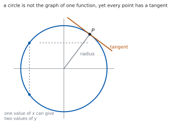
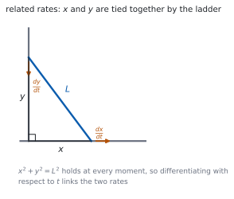

# HL 5.14 — Implicit differentiation, related rates and optimisation（陰関数微分・関連する変化率・最適化） {#sec-aahl-5-14}

::: {.callout-note}
## What you should be able to do
- **陰関数微分**（implicit differentiation）で $\dfrac{\mathrm{d}y}{\mathrm{d}x}$ を求められる。
- $y$ を含む項を微分すると $\dfrac{\mathrm{d}y}{\mathrm{d}x}$ が付くことを説明できる。
- $xy$ のような積を、積の微分公式で扱える。
- 陰関数で表された曲線の**接線・法線**を求められる。
- **関連する変化率**（related rates）の問題を、連鎖律で解ける。
- **最適化**の問題を解き、**端点**が答えになる場合も見落とさない。
:::

## The idea

### 1. Implicit equations（陰関数の式） {#implicit}

$y = f(x)$ の形に書けない式があります。たとえば

$$
x^{2}+y^{2} = 25
$$

です。$y$ について解くと $y = \pm\sqrt{25-x^{2}}$ となり、**$1$ つの関数にはなりません**。

{#fig-aahl514-idea-a width=100%}

それでも、**曲線の各点には接線があります**。ですから傾き $\dfrac{\mathrm{d}y}{\mathrm{d}x}$ を求めることには意味があります。

### 2. Differentiating $y$ with respect to $x$（$y$ を $x$ で微分する） {#dydx}

$y$ は $x$ の関数だと思って、**連鎖律**を使います（[SL 5.6](../../aa-sl/05-calculus/aasl-5-6.qmd#chain)）。

$$
\frac{\mathrm{d}}{\mathrm{d}x}\left(y^{n}\right)
= n\,y^{n-1}\,\frac{\mathrm{d}y}{\mathrm{d}x}
$$ {#eq-aahl514-power}

**$y$ の式を微分したら、かならず $\dfrac{\mathrm{d}y}{\mathrm{d}x}$ が付きます**（[第 1 節](#why-chain)）。

シラバスは、この項目をこう書いています。

> Implicit differentiation.
>
> Appropriate use of the chain rule or implicit differentiation, including cases where the optimum solution is at the end point.

手順は $3$ つです。

1. **両辺を $x$ で微分**する。
2. $\dfrac{\mathrm{d}y}{\mathrm{d}x}$ のある項を左辺に、ない項を右辺に集める。
3. $\dfrac{\mathrm{d}y}{\mathrm{d}x}$ でくくって割る。

### 3. Products such as $xy$（$xy$ の形） {#products}

$xy$ は $x$ と $y$ の積なので、**積の微分公式**を使います。

$$
\frac{\mathrm{d}}{\mathrm{d}x}(xy)
= y+x\,\frac{\mathrm{d}y}{\mathrm{d}x}
$$ {#eq-aahl514-product}

**$y$ をただの定数と思ってはいけません。** $x$ が動けば $y$ も動きます。

### 4. Tangents and normals（接線と法線） {#tangent}

点 $(a,\ b)$ での傾きがほしいときは、**$\dfrac{\mathrm{d}y}{\mathrm{d}x}$ の式に $x = a$、$y = b$ を両方入れます**。

陰関数微分では、**傾きの式に $y$ が残るのがふつう**です。そこが $y = f(x)$ の場合とちがうところです。

接線は $y-b = m(x-a)$、法線は傾きが $-\dfrac{1}{m}$ です（[SL 5.4](../../aa-sl/05-calculus/aasl-5-4.qmd)）。

### 5. Related rates（関連する変化率） {#related}

$2$ つの量が式で結ばれていて、どちらも時刻 $t$ で変わるとき、**変化率どうしも結ばれます**。

{#fig-aahl514-idea-b width=100%}

使うのは連鎖律です。

$$
\frac{\mathrm{d}V}{\mathrm{d}t}
= \frac{\mathrm{d}V}{\mathrm{d}r}\times\frac{\mathrm{d}r}{\mathrm{d}t}
$$ {#eq-aahl514-related}

手順はこうです。

1. $2$ つの量を結ぶ**式を書く**。
2. **両辺を $t$ で微分**する（陰関数微分と同じ要領です）。
3. 与えられた値を**最後に**代入する。

::: {.callout-important}
## 値を代入するのは、微分したあとです
「半径が $5$ cm のとき」を先に入れてしまうと、$r$ が定数になって微分できません。

**文字のまま微分してから**、数を入れてください。
:::

### 6. Optimisation（最適化） {#optimisation}

> Optimisation problems.

手順は SL と同じです（[SL 5.7](../../aa-sl/05-calculus/aasl-5-7.qmd)）。

1. 最大・最小にしたい量を、**$1$ つの文字の式**で書く。
2. **定義域**を書く（場面から決まります）。
3. 微分して $=0$ を解く。
4. 最大か最小かを調べる。

**HL では、定義域の端も調べます**（次の節）。

### 7. When the optimum is at an end point（端点が答えになるとき） {#endpoints}

シラバスは、わざわざこう書いています。

> including cases where the optimum solution is at the end point

$f'(x) = 0$ の解が**最小**で、**最大は端にある**、ということが起こります。

**調べるべき点は $3$ 種類**です。

- $f'(x) = 0$ となる点
- 定義域の**左端**
- 定義域の**右端**

$3$ つの値をくらべて、大きいほうが最大です。**表にして書く**と、答案でも伝わります。

::: {.callout-tip collapse="true"}
## Paper 2 では、電卓で陰関数の微分や最大・最小が出せます

TI-Nspire CX II には `impDif(` があります。`impDif(x^2+y^2=25, x, y)` のように使うと $\dfrac{\mathrm{d}y}{\mathrm{d}x}$ が返ります。

最大・最小は、グラフをかいて **menu → 6: Analyze Graph → 3: Maximum / 2: Minimum** で読めます。**定義域の端の値は、グラフでは読み落としやすい**ので、自分で代入して確かめてください。

**答案には、式を書いてください。** 微分の行と、$\dfrac{\mathrm{d}y}{\mathrm{d}x}$ について解く行を見せます。

**Paper 1 では使えません。** このページの例題と演習は、すべて手で解けるようにしてあります。
:::

## Why it works

::: {.callout-tip collapse="true"}
## クリックすると開きます

#### なぜ $y$ を微分すると $\dfrac{\mathrm{d}y}{\mathrm{d}x}$ が付くのか {#why-chain}

$y$ は $x$ の関数です。ですから $y^{2}$ は**合成関数**です。

外側の関数を $u^{2}$、内側を $u = y$ と見ると、連鎖律から

$$
\frac{\mathrm{d}}{\mathrm{d}x}\left(y^{2}\right)
= \frac{\mathrm{d}}{\mathrm{d}y}\left(y^{2}\right)\times\frac{\mathrm{d}y}{\mathrm{d}x}
= 2y\,\frac{\mathrm{d}y}{\mathrm{d}x}
$$

です。**「外を微分して、中の微分をかける」**といういつもの形です（[SL 5.6](../../aa-sl/05-calculus/aasl-5-6.qmd#chain)）。

$x^{2}$ を微分して $2x$ になるのは、$\dfrac{\mathrm{d}x}{\mathrm{d}x} = 1$ が後ろに付いているからだ、と思うと筋が通ります。

#### なぜ、$y$ について解かずに微分してよいのか {#why-implicit}

曲線の上では、$x$ と $y$ が式で結ばれています。$x$ を少し動かすと、式を保つために $y$ も動きます。

その動き方が $\dfrac{\mathrm{d}y}{\mathrm{d}x}$ です。**式全体を微分すれば、その関係がそのまま出てきます。**

$y = \pm\sqrt{25-x^{2}}$ と解いてから微分しても同じ答えになりますが、**符号の場合分けが要ります**。陰関数微分なら、上半分も下半分も $1$ つの式ですみます。

#### なぜ、関連する変化率が連鎖律なのか {#why-related}

$V$ が $r$ で決まり、$r$ が $t$ で決まるなら、$V$ は $t$ の関数です。

$$
\frac{\mathrm{d}V}{\mathrm{d}t}
= \frac{\mathrm{d}V}{\mathrm{d}r}\times\frac{\mathrm{d}r}{\mathrm{d}t}
$$

は、そのまま連鎖律です。**単位で見ても合います。** $\dfrac{\text{cm}^{3}}{\text{s}} = \dfrac{\text{cm}^{3}}{\text{cm}}\times\dfrac{\text{cm}}{\text{s}}$ です。

はしごのように $2$ 量が式で結ばれている場合は、**その式の両辺を $t$ で微分**します。やっていることは陰関数微分と同じです。

#### なぜ、端点も調べるのか {#why-endpoints}

$f'(x) = 0$ は「**接線が水平になる点**」を見つける式です。

ところが端では、関数がそこで打ち切られているだけで、接線が水平である必要はありません。**端では $f'$ が $0$ でなくても、最大や最小になれます。**

場面から定義域が決まる問題（長さは負にならない、など）では、この状況がよく起こります。

$3$ つの候補の値をくらべるのが、いちばん確実です（[第 7 節](#endpoints)）。
:::

## Worked examples

::: {.callout-note appearance="simple"}
問題文は英語です。意味が理解できなかったら、問題文の下の「**日本語訳**」を開いてください。解説は日本語です。

**例題も演習も、すべて電卓なしで解けます。** Paper 1 のつもりで解いてください。
:::

::: {#exm-aahl514-circle}
[The curve $C$ has equation $x^{2}+y^{2} = 25$.]{.q-en}

**(a)** [Find $\dfrac{\mathrm{d}y}{\mathrm{d}x}$ in terms of $x$ and $y$.]{.q-en}

**(b)** [Find the gradient of $C$ at the point $(3,\ 4)$.]{.q-en}

日本語訳

曲線 $C$ の方程式を $x^{2}+y^{2} = 25$ とします。

**(a)** $\dfrac{\mathrm{d}y}{\mathrm{d}x}$ を $x$ と $y$ で表しなさい。

**(b)** 点 $(3,\ 4)$ における $C$ の傾きを求めなさい。

---

**(a)** 両辺を $x$ で微分します。$y^{2}$ には $\dfrac{\mathrm{d}y}{\mathrm{d}x}$ が付きます（@eq-aahl514-power）。

$$
2x+2y\,\frac{\mathrm{d}y}{\mathrm{d}x} = 0
$$

$$
\frac{\mathrm{d}y}{\mathrm{d}x} = -\frac{x}{y}
$$

**(b)** $x = 3$、$y = 4$ を**両方**入れます。

$$
\frac{\mathrm{d}y}{\mathrm{d}x} = -\frac{3}{4}
$$

**検算。** **半径の傾きと比べます。** 原点から $(3,\ 4)$ への傾きは $\dfrac{4}{3}$ で、積は $-1$ ✓ **接線は半径と垂直です。**

**検算（右辺の微分）。** $25$ は定数なので $0$ ✓ 右辺に $\dfrac{\mathrm{d}y}{\mathrm{d}x}$ は出ません。

::: {.callout-note}
## 解答例（答案用紙に書くこと）

**(a)** $2x+2y\dfrac{\mathrm{d}y}{\mathrm{d}x} = 0$, *so* $\dfrac{\mathrm{d}y}{\mathrm{d}x} = -\dfrac{x}{y}$

**(b)** *At* $(3,\ 4)$: $\ \dfrac{\mathrm{d}y}{\mathrm{d}x} = -\dfrac{3}{4}$
:::
:::

::: {#exm-aahl514-product}
[The curve $C$ has equation $x^{2}+xy+y^{2} = 3$. Find the gradient of $C$ at the point $(1,\ 1)$.]{.q-en}

日本語訳

曲線 $C$ の方程式を $x^{2}+xy+y^{2} = 3$ とします。点 $(1,\ 1)$ における $C$ の傾きを求めなさい。

---

**$xy$ には積の微分公式**を使います（@eq-aahl514-product）。

$$
2x+\left(y+x\,\frac{\mathrm{d}y}{\mathrm{d}x}\right)+2y\,\frac{\mathrm{d}y}{\mathrm{d}x} = 0
$$

$\dfrac{\mathrm{d}y}{\mathrm{d}x}$ のある項を集めます。

$$
(x+2y)\,\frac{\mathrm{d}y}{\mathrm{d}x} = -(2x+y)
$$

$$
\frac{\mathrm{d}y}{\mathrm{d}x} = -\frac{2x+y}{x+2y}
$$

$(1,\ 1)$ を入れると

$$
\frac{\mathrm{d}y}{\mathrm{d}x} = -\frac{3}{3} = -1
$$

**検算。** **$(1,\ 1)$ が曲線の上にあるか**を見ます。$1+1+1 = 3$ ✓

**検算（対称性）。** 式は $x$ と $y$ を入れかえても同じです ✓ ですから $(1,\ 1)$ での傾きが $-1$ になるのは自然です。

::: {.callout-note}
## 解答例（答案用紙に書くこと）

$$2x+y+x\frac{\mathrm{d}y}{\mathrm{d}x}+2y\frac{\mathrm{d}y}{\mathrm{d}x} = 0$$

$$\frac{\mathrm{d}y}{\mathrm{d}x} = -\frac{2x+y}{x+2y}$$

*At* $(1,\ 1)$: $\ \dfrac{\mathrm{d}y}{\mathrm{d}x} = -\dfrac{3}{3} = -1$
:::
:::

::: {#exm-aahl514-balloon}
[A spherical balloon is inflated so that its volume increases at a constant rate of $100 \ \text{cm}^{3}\,\text{s}^{-1}$. Find the rate at which the radius is increasing at the instant when the radius is $5$ cm.]{.q-en}

日本語訳

球形の風船が、体積が毎秒 $100 \ \text{cm}^{3}$ の一定の割合で増えるようにふくらませられています。半径が $5$ cm になった瞬間の、半径の増える割合を求めなさい。

---

**式を書きます**（[第 5 節](#related)）。

$$
V = \frac{4}{3}\pi r^{3}
$$

$r$ で微分します。

$$
\frac{\mathrm{d}V}{\mathrm{d}r} = 4\pi r^{2}
$$

@eq-aahl514-related から

$$
\frac{\mathrm{d}V}{\mathrm{d}t}
= 4\pi r^{2}\,\frac{\mathrm{d}r}{\mathrm{d}t}
$$

**ここで数を入れます。** $\dfrac{\mathrm{d}V}{\mathrm{d}t} = 100$、$r = 5$ です。

$$
100 = 4\pi(25)\,\frac{\mathrm{d}r}{\mathrm{d}t}
= 100\pi\,\frac{\mathrm{d}r}{\mathrm{d}t}
$$

$$
\frac{\mathrm{d}r}{\mathrm{d}t} = \frac{1}{\pi} \ \text{cm}\,\text{s}^{-1}
$$

**検算（単位）。** $\dfrac{\text{cm}^{3}}{\text{s}} \div \text{cm}^{2} = \dfrac{\text{cm}}{\text{s}}$ ✓

**検算（大きさ）。** $\dfrac{1}{\pi} \approx 0.32$ cm/s ✓ 半径 $5$ cm の球なら、ゆっくりに見えて自然です。

::: {.callout-note}
## 解答例（答案用紙に書くこと）

$$V = \frac{4}{3}\pi r^{3}, \qquad \frac{\mathrm{d}V}{\mathrm{d}r} = 4\pi r^{2}$$

$$\frac{\mathrm{d}V}{\mathrm{d}t} = \frac{\mathrm{d}V}{\mathrm{d}r}\times\frac{\mathrm{d}r}{\mathrm{d}t}
\ \Rightarrow \ 100 = 100\pi\,\frac{\mathrm{d}r}{\mathrm{d}t}$$

$$\frac{\mathrm{d}r}{\mathrm{d}t} = \frac{1}{\pi} \ \text{cm}\,\text{s}^{-1}$$
:::
:::

::: {#exm-aahl514-endpoint}
[A piece of wire of length $20$ cm is cut into two pieces. One piece of length $x$ cm is bent into a circle, and the other is bent into a square. Find the value of $x$ that makes the total area a maximum.]{.q-en}

日本語訳

長さ $20$ cm の針金を $2$ つに切ります。長さ $x$ cm の一方を円に、残りを正方形に曲げます。面積の合計が最大になる $x$ の値を求めなさい。

---

**式を書きます。** 円周が $x$ なので半径は $\dfrac{x}{2\pi}$、面積は $\dfrac{x^{2}}{4\pi}$ です。正方形の $1$ 辺は $\dfrac{20-x}{4}$、面積は $\dfrac{(20-x)^{2}}{16}$ です。

$$
A(x) = \frac{x^{2}}{4\pi}+\frac{(20-x)^{2}}{16}, \qquad 0 \leq x \leq 20
$$

$$
A'(x) = \frac{x}{2\pi}-\frac{20-x}{8}
$$

$A'(x) = 0$ を解くと $8x = 2\pi(20-x)$、つまり $x = \dfrac{20\pi}{\pi+4} \approx 8.80$ です。

$$
A''(x) = \frac{1}{2\pi}+\frac{1}{8} > 0
$$

**$2$ 階導関数が正なので、これは最小**です。最大は端にあります（[第 7 節](#endpoints)）。

$$
A(0) = \frac{400}{16} = 25, \qquad
A(20) = \frac{400}{4\pi} = \frac{100}{\pi} \approx 31.8
$$

$$
A(20) > A(0)
$$

ですから、**$x = 20$**、つまり針金を切らずに全部を円にしたときが最大です。

**検算。** **$3$ つの値をくらべました。** $25$、$\approx 14.0$、$\approx 31.8$ ✓ いちばん大きいのは $x = 20$ です。

**検算（意味）。** 同じ周の長さなら、円のほうが正方形より面積が大きい ✓ 全部を円にするのが最大、と合います。

::: {.callout-note}
## 解答例（答案用紙に書くこと）

$$A(x) = \frac{x^{2}}{4\pi}+\frac{(20-x)^{2}}{16}, \qquad 0 \leq x \leq 20$$

$$A'(x) = \frac{x}{2\pi}-\frac{20-x}{8} = 0 \ \Rightarrow \ x = \frac{20\pi}{\pi+4}$$

*Since* $A''(x) > 0$ *this is a minimum, so the maximum is at an end point.*

$$A(0) = 25, \qquad A(20) = \frac{100}{\pi} \approx 31.8$$

*The maximum occurs at* $x = 20$.
:::

::: {.model-answer}
**試験ではこう書く**

*Let the piece bent into a circle have length* $x$ *cm, so* $0 \leq x \leq 20$. *The circumference of the circle is* $x$, *so its radius is* $\dfrac{x}{2\pi}$ *and its area is* $\pi\left(\dfrac{x}{2\pi}\right)^{2} = \dfrac{x^{2}}{4\pi}$. *The square has perimeter* $20-x$, *side* $\dfrac{20-x}{4}$ *and area* $\dfrac{(20-x)^{2}}{16}$. *Hence*

$$A(x) = \frac{x^{2}}{4\pi}+\frac{(20-x)^{2}}{16}$$

*Differentiating,* $A'(x) = \dfrac{x}{2\pi}-\dfrac{20-x}{8}$. *Setting this equal to zero gives* $8x = 2\pi(20-x)$, *so* $x = \dfrac{20\pi}{\pi+4} \approx 8.80$.

*This stationary point is a minimum, not a maximum, because* $A''(x) = \dfrac{1}{2\pi}+\dfrac{1}{8}$ *is positive for all* $x$. *The function is therefore decreasing before this point and increasing after it, so on a closed interval its greatest value must occur at an end point.*

*Evaluating at both ends,* $A(0) = \dfrac{400}{16} = 25$ *and* $A(20) = \dfrac{400}{4\pi} = \dfrac{100}{\pi} \approx 31.8$. *Since* $A(20) > A(0)$, *the maximum total area is obtained by taking* $x = 20$, *that is, by using the whole wire for the circle and cutting nothing for the square.*
:::
:::

## Common errors

::: {.callout-warning}
## $y$ の項を微分するときに $\dfrac{\mathrm{d}y}{\mathrm{d}x}$ を忘れる
$\dfrac{\mathrm{d}}{\mathrm{d}x}\left(y^{2}\right) = 2y\dfrac{\mathrm{d}y}{\mathrm{d}x}$ です（@eq-aahl514-power）。

$2y$ で止めると、それは $y$ で微分したことになります。**これが、この項目でいちばん多いまちがいです。**
:::

::: {.callout-warning}
## $xy$ を微分するのに積の公式を使わない
$\dfrac{\mathrm{d}}{\mathrm{d}x}(xy) = y+x\dfrac{\mathrm{d}y}{\mathrm{d}x}$ です（@eq-aahl514-product）。

$y$ を定数と思って $\dfrac{\mathrm{d}y}{\mathrm{d}x}$ だけにしたり、$y$ だけにしたりしないこと。**$2$ 項出ます。**
:::

::: {.callout-warning}
## 傾きの式に $x$ だけを入れる
陰関数微分の答えには、ふつう $y$ も残ります（[第 4 節](#tangent)）。

**$x$ と $y$ の両方を代入**してください。点の座標が $2$ つとも与えられているのは、そのためです。
:::

::: {.callout-warning}
## 微分する前に数を代入する
「半径が $5$ のとき」を先に入れると、$r$ が定数になり $\dfrac{\mathrm{d}r}{\mathrm{d}t}$ が消えます（[第 5 節](#related)）。

**文字のまま微分してから**、最後に代入します。
:::

::: {.callout-warning}
## 端点を調べない
$f'(x) = 0$ の解だけをくらべても、最大とはかぎりません（[第 7 節](#endpoints)）。

**定義域の両端の値も出して**、$3$ つをくらべてください。
:::

::: {.callout-warning}
## 定義域を書かない
最適化では、場面から $x$ の範囲が決まります。**範囲がなければ、端点も決まりません。**

長さや面積が負にならない条件から、$0 \leq x \leq 20$ のように書いてください。
:::

## Exercises

::: {.callout-note appearance="simple"}
各問題に、折りたたみが $3$ つ付いています。**日本語訳**、**解答例**（答案用紙に書くべきこと。英語です）、**解説**（なぜそうなるか。日本語です）。

まず自分で解いて、次に解答例と見くらべてください。**解説は、合わなかったときだけ開けば十分です。**
:::

::: {.exercise-block}

[1]{.ex-no} [Given $x^{2}+y^{2} = 16$, find $\dfrac{\mathrm{d}y}{\mathrm{d}x}$ in terms of $x$ and $y$.]{.q-en}

日本語訳

$x^{2}+y^{2} = 16$ のとき、$\dfrac{\mathrm{d}y}{\mathrm{d}x}$ を $x$ と $y$ で表しなさい。

::: {.callout-note collapse="true"}
## 解答例（答案用紙に書くこと）

$$2x+2y\frac{\mathrm{d}y}{\mathrm{d}x} = 0, \qquad
\frac{\mathrm{d}y}{\mathrm{d}x} = -\frac{x}{y}$$
:::

::: {.callout-tip collapse="true"}
## 解説

$16$ は定数なので、右辺は $0$ です。**半径が変わっても、傾きの式は同じ**になります。

**検算（$(0,\ 4)$ で）。** $-\dfrac{0}{4} = 0$ ✓ 円のてっぺんは水平です。

**検算（$(4,\ 0)$ で）。** 分母が $0$ ✓ そこでは接線が垂直で、傾きがありません。
:::

::: {.ex-sep}
:::

[2]{.ex-no} [Given $x^{3}+y^{3} = 9$, find $\dfrac{\mathrm{d}y}{\mathrm{d}x}$ in terms of $x$ and $y$.]{.q-en}

日本語訳

$x^{3}+y^{3} = 9$ のとき、$\dfrac{\mathrm{d}y}{\mathrm{d}x}$ を $x$ と $y$ で表しなさい。

::: {.callout-note collapse="true"}
## 解答例（答案用紙に書くこと）

$$3x^{2}+3y^{2}\frac{\mathrm{d}y}{\mathrm{d}x} = 0, \qquad
\frac{\mathrm{d}y}{\mathrm{d}x} = -\frac{x^{2}}{y^{2}}$$
:::

::: {.callout-tip collapse="true"}
## 解説

@eq-aahl514-power で $n = 3$ の場合です。$3$ が約分されます。

**検算（符号）。** $x^{2}$ も $y^{2}$ も正なので、傾きはかならず負 ✓

**検算（$(1,\ 2)$ で）。** $1+8 = 9$ なので曲線の上にあり、傾きは $-\dfrac{1}{4}$ ✓
:::

::: {.ex-sep}
:::

[3]{.ex-no} [Given $xy = 6$, find $\dfrac{\mathrm{d}y}{\mathrm{d}x}$ in terms of $x$ and $y$.]{.q-en}

日本語訳

$xy = 6$ のとき、$\dfrac{\mathrm{d}y}{\mathrm{d}x}$ を $x$ と $y$ で表しなさい。

::: {.callout-note collapse="true"}
## 解答例（答案用紙に書くこと）

$$y+x\frac{\mathrm{d}y}{\mathrm{d}x} = 0, \qquad
\frac{\mathrm{d}y}{\mathrm{d}x} = -\frac{y}{x}$$
:::

::: {.callout-tip collapse="true"}
## 解説

積の微分公式です（@eq-aahl514-product）。**$2$ 項出ることに注意。**

**検算（解いてから）。** $y = \dfrac{6}{x}$ なので $\dfrac{\mathrm{d}y}{\mathrm{d}x} = -\dfrac{6}{x^{2}}$ ✓ $-\dfrac{y}{x} = -\dfrac{6}{x^{2}}$ と同じです。

**検算（$(2,\ 3)$ で）。** $-\dfrac{3}{2}$ ✓ どちらの式でも同じ値です。
:::

::: {.ex-sep}
:::

[4]{.ex-no} [The curve $C$ has equation $x^{2}+2xy+3y^{2} = 6$. Find the gradient of $C$ at the point $(1,\ 1)$.]{.q-en}

日本語訳

曲線 $C$ の方程式を $x^{2}+2xy+3y^{2} = 6$ とします。点 $(1,\ 1)$ における $C$ の傾きを求めなさい。

::: {.callout-note collapse="true"}
## 解答例（答案用紙に書くこと）

$$2x+2y+2x\frac{\mathrm{d}y}{\mathrm{d}x}+6y\frac{\mathrm{d}y}{\mathrm{d}x} = 0$$

*At* $(1,\ 1)$: $\ 2+2+2\dfrac{\mathrm{d}y}{\mathrm{d}x}+6\dfrac{\mathrm{d}y}{\mathrm{d}x} = 0$

$$\frac{\mathrm{d}y}{\mathrm{d}x} = -\frac{1}{2}$$
:::

::: {.callout-tip collapse="true"}
## 解説

**数を先に入れてから解く**と、式が短くなります。微分したあとなら代入してかまいません。

$2xy$ の微分は $2y+2x\dfrac{\mathrm{d}y}{\mathrm{d}x}$ です。係数の $2$ を両方にかけます。

**検算（点が曲線の上か）。** $1+2+3 = 6$ ✓

**検算（一般形で）。** $\dfrac{\mathrm{d}y}{\mathrm{d}x} = -\dfrac{x+y}{x+3y}$ に $(1,\ 1)$ を入れると $-\dfrac{2}{4} = -\dfrac{1}{2}$ ✓
:::

::: {.ex-sep}
:::

[5]{.ex-no} [Find the equation of the tangent to the circle $x^{2}+y^{2} = 25$ at the point $(4,\ 3)$.]{.q-en}

日本語訳

円 $x^{2}+y^{2} = 25$ の点 $(4,\ 3)$ における接線の方程式を求めなさい。

::: {.callout-note collapse="true"}
## 解答例（答案用紙に書くこと）

$$\frac{\mathrm{d}y}{\mathrm{d}x} = -\frac{x}{y}, \qquad
\text{at } (4,\ 3): \ \frac{\mathrm{d}y}{\mathrm{d}x} = -\frac{4}{3}$$

$$y-3 = -\frac{4}{3}(x-4), \qquad 4x+3y = 25$$
:::

::: {.callout-tip collapse="true"}
## 解説

傾きを出してから、点と傾きの形に入れます（[SL 5.4](../../aa-sl/05-calculus/aasl-5-4.qmd)）。分数を払うときれいになります。

**検算（点を入れる）。** $16+9 = 25$ ✓ 接点は接線の上にあります。

**検算（半径と垂直）。** 半径の傾きは $\dfrac{3}{4}$、積は $-1$ ✓
:::

::: {.ex-sep}
:::

[6]{.ex-no} [The side of a square is increasing at a rate of $2 \ \text{cm}\,\text{s}^{-1}$. Find the rate at which the area is increasing when the side is $10$ cm.]{.q-en}

日本語訳

正方形の $1$ 辺が毎秒 $2$ cm の割合で伸びています。$1$ 辺が $10$ cm のときの面積の増える割合を求めなさい。

::: {.callout-note collapse="true"}
## 解答例（答案用紙に書くこと）

$$A = s^{2}, \qquad \frac{\mathrm{d}A}{\mathrm{d}s} = 2s$$

$$\frac{\mathrm{d}A}{\mathrm{d}t} = 2s\,\frac{\mathrm{d}s}{\mathrm{d}t}
= 2(10)(2) = 40 \ \text{cm}^{2}\,\text{s}^{-1}$$
:::

::: {.callout-tip collapse="true"}
## 解説

@eq-aahl514-related と同じ形です。**式を書く $\to$ 微分する $\to$ 代入する**の順です。

**検算（単位）。** $\text{cm} \times \dfrac{\text{cm}}{\text{s}} = \dfrac{\text{cm}^{2}}{\text{s}}$ ✓

**検算（近似で）。** $10$ cm から $10.1$ cm になると面積は $100 \to 102.01$、$0.05$ 秒で約 $2$ cm² ✓ 毎秒 $40$ cm² と合います。
:::

::: {.ex-sep}
:::

[7]{.ex-no} [A ladder of length $5$ m leans against a vertical wall. The foot of the ladder slides away from the wall at $0.5 \ \text{m}\,\text{s}^{-1}$. Find the rate at which the top of the ladder is sliding down when the foot is $3$ m from the wall.]{.q-en}

日本語訳

長さ $5$ m のはしごが垂直な壁に立てかけてあります。はしごの足が毎秒 $0.5$ m で壁から離れていきます。足が壁から $3$ m のときに、はしごの上端が下がる割合を求めなさい。

::: {.callout-note collapse="true"}
## 解答例（答案用紙に書くこと）

$$x^{2}+y^{2} = 25, \qquad
2x\frac{\mathrm{d}x}{\mathrm{d}t}+2y\frac{\mathrm{d}y}{\mathrm{d}t} = 0$$

*When* $x = 3$, $y = 4$. *With* $\dfrac{\mathrm{d}x}{\mathrm{d}t} = 0.5$,

$$2(3)(0.5)+2(4)\frac{\mathrm{d}y}{\mathrm{d}t} = 0, \qquad
\frac{\mathrm{d}y}{\mathrm{d}t} = -\frac{3}{8}$$

*The top slides down at* $\dfrac{3}{8} \ \text{m}\,\text{s}^{-1}$.
:::

::: {.callout-tip collapse="true"}
## 解説

**はしごの長さは変わりません。** ですから $x^{2}+y^{2} = 25$ が、いつでも成り立ちます（@fig-aahl514-idea-b）。

両辺を $t$ で微分します。陰関数微分と同じ要領です。

**検算（$y$）。** $3$–$4$–$5$ の直角三角形なので $y = 4$ ✓

**検算（符号）。** $\dfrac{\mathrm{d}y}{\mathrm{d}t}$ が負 ✓ 上端は下がっています。答えを書くときは「下がる速さ」として正の数で答えます。
:::

::: {.ex-sep}
:::

[8]{.ex-no} [Show that for the circle $x^{2}+y^{2} = r^{2}$ the gradient at a point $(a,\ b)$ with $b \neq 0$ is $-\dfrac{a}{b}$, and explain why this means the tangent is perpendicular to the radius.]{.q-en}

日本語訳

円 $x^{2}+y^{2} = r^{2}$ の点 $(a,\ b)$（$b \neq 0$）における傾きが $-\dfrac{a}{b}$ であることを示し、接線が半径と垂直であることを説明しなさい。

::: {.callout-note collapse="true"}
## 解答例（答案用紙に書くこと）

$$2x+2y\frac{\mathrm{d}y}{\mathrm{d}x} = 0 \ \Rightarrow \
\frac{\mathrm{d}y}{\mathrm{d}x} = -\frac{x}{y}$$

*At* $(a,\ b)$ *with* $b \neq 0$ *this is* $-\dfrac{a}{b}$.

*The radius from the origin to* $(a,\ b)$ *has gradient* $\dfrac{b}{a}$, *and*

$$\left(-\frac{a}{b}\right)\left(\frac{b}{a}\right) = -1$$

*so the tangent and the radius are perpendicular.*
:::

::: {.callout-tip collapse="true"}
## 解説

**傾きの積が $-1$** なら垂直です（[SL 2.1](../../aa-sl/02-functions/aasl-2-1.qmd)）。

$r$ は定数なので、右辺の微分は $0$ です。**半径の大きさは、傾きの式に出てきません。**

**検算（$(3,\ 4)$、$r = 5$）。** 接線 $-\dfrac{3}{4}$、半径 $\dfrac{4}{3}$、積 $-1$ ✓

**検算（$b = 0$ のとき）。** 分母が $0$ になります ✓ そこでは接線が垂直で、傾きが定義されません。

::: {.model-answer}
**試験ではこう書く**

*Differentiating* $x^{2}+y^{2} = r^{2}$ *with respect to* $x$, *treating* $y$ *as a function of* $x$ *and* $r$ *as a constant, gives*

$$2x+2y\frac{\mathrm{d}y}{\mathrm{d}x} = 0$$

*Provided* $y \neq 0$ *this rearranges to* $\dfrac{\mathrm{d}y}{\mathrm{d}x} = -\dfrac{x}{y}$, *so at the point* $(a,\ b)$ *with* $b \neq 0$ *the gradient of the tangent is* $-\dfrac{a}{b}$.

*The radius joining the origin to* $(a,\ b)$ *is a line segment through* $(0,\ 0)$ *and* $(a,\ b)$, *so its gradient is* $\dfrac{b-0}{a-0} = \dfrac{b}{a}$, *provided* $a \neq 0$.

*The product of the two gradients is* $\left(-\dfrac{a}{b}\right)\left(\dfrac{b}{a}\right) = -1$, *and two lines with gradients whose product is* $-1$ *are perpendicular. Hence the tangent at any point of the circle is perpendicular to the radius at that point.*

*The cases* $a = 0$ *and* $b = 0$ *are the top and bottom, and the left and right, of the circle. There one of the two lines is vertical and the other horizontal, so they are still perpendicular even though one gradient is undefined.*
:::
:::

::: {.ex-sep}
:::

[9]{.ex-no} [Explain why the maximum of a function on a closed interval can occur at an end point, and describe how to check for this.]{.q-en}

日本語訳

閉区間における関数の最大値が端点で起こりうる理由を説明し、その確かめ方を述べなさい。

::: {.callout-note collapse="true"}
## 解答例（答案用紙に書くこと）

*Setting* $f'(x) = 0$ *locates points where the tangent is horizontal. At an end of the interval the function simply stops, and the tangent there need not be horizontal.*

*A function that is increasing throughout the interval, for example, has its maximum at the right-hand end with* $f'(x) > 0$ *there.*

*To check, evaluate* $f$ *at every solution of* $f'(x) = 0$ *and at both end points, then compare the values.*
:::

::: {.callout-tip collapse="true"}
## 解説

**$f'(x) = 0$ は「水平な接線」を探す式**です（[第 4 節](#why-endpoints)）。端ではその条件が要りません。

場面から定義域が決まる問題では、この状況がよく起こります。例題 $4$ がその例でした。

**検算（増加する例）。** $f(x) = x$ を $[0,\ 1]$ で考えると、最大は $x = 1$ ✓ $f'(x) = 1 \neq 0$ です。

**検算（両方ある例）。** $f(x) = x^{3}-3x$ を $[0,\ 3]$ で考えると、$x = 1$ が最小、$x = 3$ が最大 ✓

::: {.model-answer}
**試験ではこう書く**

*The equation* $f'(x) = 0$ *identifies stationary points, where the tangent to the graph is horizontal. At such a point the function stops increasing and starts decreasing, or the reverse, so a local maximum or minimum can occur there.*

*An end point of a closed interval is different. The function is not defined beyond it, so there is nothing on one side to compare with. The graph can still be rising as it reaches a right-hand end point, and that end value is then the largest value on the interval even though* $f'(x) \neq 0$ *there. The simplest example is* $f(x) = x$ *on* $[0,\ 1]$, *which has no stationary point at all but takes its maximum at* $x = 1$.

*The reliable method on a closed interval is therefore to build a short list of candidates: every solution of* $f'(x) = 0$ *that lies inside the interval, together with both end points. Evaluating* $f$ *at each candidate and comparing the values gives the maximum and the minimum with certainty.*

*This matters in optimisation problems set in context, where the interval comes from the situation, such as a length that cannot be negative or exceed a given total.*
:::
:::

::: {.ex-sep}
:::

[10]{.ex-no} [A student differentiates $x^{2}+y^{2} = 25$ with respect to $x$ and writes $2x+2y = 0$. Identify the error and give the correct result.]{.q-en}

日本語訳

ある生徒が $x^{2}+y^{2} = 25$ を $x$ で微分して $2x+2y = 0$ と書きました。まちがいを指摘し、正しい結果を書きなさい。

::: {.callout-note collapse="true"}
## 解答例（答案用紙に書くこと）

*The term* $y^{2}$ *has been differentiated with respect to* $y$, *not with respect to* $x$. *Since* $y$ *is a function of* $x$, *the chain rule gives a factor* $\dfrac{\mathrm{d}y}{\mathrm{d}x}$.

$$2x+2y\frac{\mathrm{d}y}{\mathrm{d}x} = 0, \qquad
\frac{\mathrm{d}y}{\mathrm{d}x} = -\frac{x}{y}$$
:::

::: {.callout-tip collapse="true"}
## 解説

**$\dfrac{\mathrm{d}y}{\mathrm{d}x}$ が抜けています**（@eq-aahl514-power）。生徒の式には、求めたいものが入っていません。

生徒の式 $2x+2y = 0$ は $y = -x$ という直線を表していて、円とは関係がありません。

**検算（$(3,\ 4)$ で）。** 正しい傾きは $-\dfrac{3}{4}$ ✓ 生徒の式からは何も出ません。

**検算（見分け方）。** 答えに $\dfrac{\mathrm{d}y}{\mathrm{d}x}$ が出てこなかったら、どこかで落としています ✓

::: {.model-answer}
**試験ではこう書く**

*The error is in the term* $y^{2}$. *Differentiating it as* $2y$ *treats* $y$ *as the variable, which would be correct for* $\dfrac{\mathrm{d}}{\mathrm{d}y}\left(y^{2}\right)$. *Here the differentiation is with respect to* $x$, *and on this curve* $y$ *is a function of* $x$, *so the chain rule applies:*

$$\frac{\mathrm{d}}{\mathrm{d}x}\left(y^{2}\right)
= \frac{\mathrm{d}}{\mathrm{d}y}\left(y^{2}\right)\times\frac{\mathrm{d}y}{\mathrm{d}x}
= 2y\frac{\mathrm{d}y}{\mathrm{d}x}$$

*The correct first line is therefore* $2x+2y\dfrac{\mathrm{d}y}{\mathrm{d}x} = 0$, *which rearranges to* $\dfrac{\mathrm{d}y}{\mathrm{d}x} = -\dfrac{x}{y}$ *for* $y \neq 0$.

*A useful check is that the answer to an implicit differentiation must contain* $\dfrac{\mathrm{d}y}{\mathrm{d}x}$ *before it is rearranged. The student's line* $2x+2y = 0$ *contains no derivative at all, and as an equation it describes the line* $y = -x$, *which has nothing to do with the circle.*
:::
:::

:::
