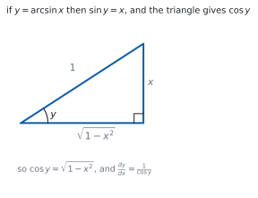
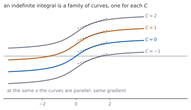

# HL 5.15 — Further derivatives and their integrals（さらに進んだ導関数と、その不定積分） {#sec-aahl-5-15}

::: {.callout-note}
## What you should be able to do
- $\tan x$、$\sec x$、$\operatorname{cosec} x$、$\cot x$ の導関数を使える。
- $a^{x}$、$\log_{a}x$ の導関数を使える。
- $\arcsin x$、$\arccos x$、$\arctan x$ の導関数を使える。
- それらを**逆に読んで**、不定積分に使える。
- $ax+b$ との**合成**の形を積分できる。
- **部分分数**に直してから積分できる（[HL 1.11](../01-number-and-algebra/aahl-1-11.qmd)）。
:::

## The idea

### 1. The new standard derivatives（新しい標準的な導関数） {#derivatives}

シラバスは、こう書いています。

> Derivatives of tanx, secx, cosecx, cotx, ax, loga x, arcsinx, arccosx, arctanx.

公式集の **5.15** の欄に、まとめて印刷されています。

> Standard derivatives

| $f(x)$ | $f'(x)$ |
|---|---|
| $\tan x$ | $\sec^{2}x$ |
| $\sec x$ | $\sec x\tan x$ |
| $\operatorname{cosec} x$ | $-\operatorname{cosec} x\cot x$ |
| $\cot x$ | $-\operatorname{cosec}^{2}x$ |
| $a^{x}$ | $a^{x}(\ln a)$ |
| $\log_{a}x$ | $\dfrac{1}{x\ln a}$ |
| $\arcsin x$ | $\dfrac{1}{\sqrt{1-x^{2}}}$ |
| $\arccos x$ | $-\dfrac{1}{\sqrt{1-x^{2}}}$ |
| $\arctan x$ | $\dfrac{1}{1+x^{2}}$ |

: 公式集 **5.15** の標準的な導関数 {#tbl-aahl515-derivatives}

**覚えるのではなく、引けるようにしておきます。** 頭に `co` が付く $3$ つ（$\cos$、$\operatorname{cosec}$、$\cot$、それに $\arccos$）は、導関数に**マイナス**が付きます。

### 2. Where the $\tan$ family comes from（$\tan$ の仲間はどこから出るか） {#tan-family}

$\tan x = \dfrac{\sin x}{\cos x}$ に商の微分公式を使います（[SL 5.6](../../aa-sl/05-calculus/aasl-5-6.qmd)）。

$$
\frac{\mathrm{d}}{\mathrm{d}x}\tan x
= \frac{\cos x\cos x-\sin x(-\sin x)}{\cos^{2}x}
= \frac{1}{\cos^{2}x} = \sec^{2}x
$$ {#eq-aahl515-tan}

$\sec x = (\cos x)^{-1}$ も、連鎖律で出ます。**どれも新しい原理ではありません**（[第 1 節](#why-tan)）。

### 3. $a^{x}$ and $\log_{a}x$（底が $e$ でないとき） {#exponential}

$a^{x}$ は $e$ の形に直します。$a = e^{\ln a}$ なので

$$
a^{x} = e^{x\ln a}, \qquad
\frac{\mathrm{d}}{\mathrm{d}x}a^{x} = a^{x}\ln a
$$ {#eq-aahl515-ax}

$\log_{a}x$ は底の変換で $\dfrac{\ln x}{\ln a}$ です（[SL 1.7b](../../aa-sl/01-number-and-algebra/aasl-1-7b.qmd)）。$\ln a$ は定数なので

$$
\frac{\mathrm{d}}{\mathrm{d}x}\log_{a}x = \frac{1}{x\ln a}
$$ {#eq-aahl515-loga}

**$a = e$ のとき $\ln a = 1$** になり、SL で習った形にもどります。

### 4. The inverse trigonometric derivatives（逆三角関数の導関数） {#inverse-trig}

$y = \arcsin x$ は $\sin y = x$ という意味です（[HL 3.9](../03-geometry-and-trigonometry/aahl-3-9.qmd#arcsin-arccos)）。両辺を $x$ で微分します（[HL 5.14](aahl-5-14.qmd#dydx)）。

$$
\cos y\,\frac{\mathrm{d}y}{\mathrm{d}x} = 1, \qquad
\frac{\mathrm{d}y}{\mathrm{d}x} = \frac{1}{\cos y}
$$

{#fig-aahl515-idea-a width=100%}

三角形から $\cos y = \sqrt{1-x^{2}}$ なので、@tbl-aahl515-derivatives の形になります。

$\arccos$ は符号が逆、$\arctan$ は $\sqrt{\ }$ が付きません。**$\arctan$ の導関数は、どの $x$ でも定義されます。**

### 5. Reading them backwards（逆に読む：不定積分） {#integrals}

> Indefinite integrals of the derivatives of any of the above functions.
>
> Indefinite integral interpreted as a family of curves.

@tbl-aahl515-derivatives を右から左に読めば、そのまま不定積分です。公式集の **5.15** には、次の $3$ つも印刷されています。

> Standard integrals

$$
\int a^{x}\,\mathrm{d}x = \frac{1}{\ln a}a^{x}+C
$$ {#eq-aahl515-int-ax}

$$
\int \frac{1}{a^{2}+x^{2}}\,\mathrm{d}x
= \frac{1}{a}\arctan\left(\frac{x}{a}\right)+C
$$ {#eq-aahl515-int-arctan}

$$
\int \frac{1}{\sqrt{a^{2}-x^{2}}}\,\mathrm{d}x
= \arcsin\left(\frac{x}{a}\right)+C, \qquad \lvert x \rvert < a
$$ {#eq-aahl515-int-arcsin}

{#fig-aahl515-idea-b width=100%}

**$+C$ を忘れないこと。** $C$ がちがう曲線は上下にずれているだけで、どこでも傾きが同じです。

### 6. Composites with $ax+b$（$ax+b$ との合成） {#linear}

> The composites of any of these with a linear function.

$ax+b$ との合成なら、**$\dfrac{1}{a}$ をかける**だけです（[SL 5.10](../../aa-sl/05-calculus/aasl-5-10.qmd#linear)）。シラバスが挙げている例です。

> $\int \sec^{2}(2x+5)\mathrm{d}x = \frac{1}{2}\tan(2x+5)+C$

$$
\int \frac{1}{x^{2}+2x+5}\,\mathrm{d}x
= \frac{1}{2}\arctan\left(\frac{x+1}{2}\right)+C
$$

こちらは**平方完成**が先です。$x^{2}+2x+5 = (x+1)^{2}+4$ と直してから @eq-aahl515-int-arctan を使います。

### 7. Partial fractions in the integrand（部分分数にしてから積分） {#partial}

> Use of partial fractions to rearrange the integrand.
>
> Link to: partial fractions (AHL1.11)

分母が $1$ 次式の積に因数分解できるときは、**部分分数に直します**（[HL 1.11](../01-number-and-algebra/aahl-1-11.qmd)）。シラバスの例です。

> $\int \frac{1}{x^{2}+3x+2}\mathrm{d}x = \ln\left| \frac{x+1}{x+2} \right|+C$

**分母が因数分解できるかどうか**が、分かれ道です。できれば部分分数、できなければ平方完成して $\arctan$ です。

::: {.callout-tip collapse="true"}
## Paper 2 では、電卓で微分と積分が出せます

TI-Nspire CX II は、不定積分もそのまま返します。積分のテンプレートは **menu → 4: Calculus → 3: Integral** です。

**電卓は $+C$ を付けません。** 自分で書き足してください。

$\arctan$ や $\arcsin$ の形は、電卓の答えが公式集と見た目でちがうことがあります。**微分して元にもどるか**を見れば、どちらも正しいと分かります。

**答案には、式を書いてください。** 平方完成や部分分数の行を見せてから、公式集の形に当てはめます。

**Paper 1 では使えません。** このページの例題と演習は、すべて手で解けるようにしてあります。
:::

## Why it works

::: {.callout-tip collapse="true"}
## クリックすると開きます

#### なぜ $\tan$ の導関数が $\sec^{2}$ なのか {#why-tan}

商の微分公式に入れると、分子が $\cos^{2}x+\sin^{2}x = 1$ になります（@eq-aahl515-tan）。

$$
\frac{\mathrm{d}}{\mathrm{d}x}\tan x = \frac{1}{\cos^{2}x} = \sec^{2}x
$$

**Pythagoras の恒等式が効いています**（[HL 3.9](../03-geometry-and-trigonometry/aahl-3-9.qmd#identities)）。

$\sec x = (\cos x)^{-1}$ なら連鎖律で

$$
\frac{\mathrm{d}}{\mathrm{d}x}\sec x
= -(\cos x)^{-2}(-\sin x) = \frac{\sin x}{\cos^{2}x} = \sec x\tan x
$$

です。$\operatorname{cosec}$ と $\cot$ も同じ計算で、**符号だけが逆**になります。

#### なぜ $a^{x}$ の導関数に $\ln a$ が出るのか {#why-lna}

$a^{x} = e^{x\ln a}$ と書きなおします。指数の部分は $x$ の $1$ 次式で、その導関数が $\ln a$ です。

連鎖律から

$$
\frac{\mathrm{d}}{\mathrm{d}x}e^{x\ln a} = e^{x\ln a}\times\ln a = a^{x}\ln a
$$

です。**$\ln a$ は「$a$ を $e$ の何乗で書くか」**を表す数で、それがそのまま出てきます。

$a = e$ なら $\ln e = 1$ で、$e^{x}$ の導関数が $e^{x}$ という見慣れた形になります。

#### なぜ $\arcsin$ の導関数に $\sqrt{1-x^{2}}$ が出るのか {#why-arcsin}

$\sin y = x$ を微分すると $\cos y\dfrac{\mathrm{d}y}{\mathrm{d}x} = 1$ です。

$\cos y$ を $x$ で書きたいので、$\sin^{2}y+\cos^{2}y = 1$ を使います。

$$
\cos y = \sqrt{1-\sin^{2}y} = \sqrt{1-x^{2}}
$$

ここで**正の平方根**を取ってよいのは、$\arcsin$ の値域が $\left[-\dfrac{\pi}{2},\ \dfrac{\pi}{2}\right]$ で、そこでは $\cos y \geq 0$ だからです（[HL 3.9](../03-geometry-and-trigonometry/aahl-3-9.qmd#arcsin-arccos)）。

$\arccos$ の値域は $[0,\ \pi]$ で、$\sin y \geq 0$ です。同じ計算で符号だけが逆になります。

#### なぜ $\dfrac{1}{a^{2}+x^{2}}$ の積分に $\dfrac{1}{a}$ が付くのか {#why-1a}

$\dfrac{1}{a^{2}+x^{2}} = \dfrac{1}{a^{2}}\cdot\dfrac{1}{1+\left(\frac{x}{a}\right)^{2}}$ と書きなおします。

$\arctan\left(\dfrac{x}{a}\right)$ を微分すると、連鎖律で $\dfrac{1}{a}$ が出ます。

$$
\frac{\mathrm{d}}{\mathrm{d}x}\arctan\left(\frac{x}{a}\right)
= \frac{1}{1+\left(\frac{x}{a}\right)^{2}}\times\frac{1}{a}
= \frac{a}{a^{2}+x^{2}}
$$

ほしいのは $\dfrac{1}{a^{2}+x^{2}}$ なので、$\dfrac{1}{a}$ をかけます。**$\arcsin$ のほうに $\dfrac{1}{a}$ が付かない**のは、$\sqrt{\ }$ の中も外も同じだけ $a$ で割れるからです。
:::

## Worked examples

::: {.callout-note appearance="simple"}
問題文は英語です。意味が理解できなかったら、問題文の下の「**日本語訳**」を開いてください。解説は日本語です。

**例題も演習も、すべて電卓なしで解けます。** Paper 1 のつもりで解いてください。
:::

::: {#exm-aahl515-diff}
[Differentiate each of the following.]{.q-en}

**(a)** [$y = \tan 3x$]{.q-en}

**(b)** [$y = x\sec x$]{.q-en}

**(c)** [$y = \arctan 2x$]{.q-en}

日本語訳

次のそれぞれを微分しなさい。

**(a)** $y = \tan 3x$

**(b)** $y = x\sec x$

**(c)** $y = \arctan 2x$

---

**(a)** 連鎖律です。外は $\tan$、中は $3x$ です。

$$
\frac{\mathrm{d}y}{\mathrm{d}x} = 3\sec^{2}3x
$$

**(b)** 積の微分公式です（[SL 5.6](../../aa-sl/05-calculus/aasl-5-6.qmd)）。

$$
\frac{\mathrm{d}y}{\mathrm{d}x} = \sec x+x\sec x\tan x
$$

**(c)** 外は $\arctan$、中は $2x$ です。

$$
\frac{\mathrm{d}y}{\mathrm{d}x} = \frac{1}{1+(2x)^{2}}\times 2
= \frac{2}{1+4x^{2}}
$$

**検算（(a)）。** **$x = 0$ で** $3\sec^{2}0 = 3$ ✓ $\tan 3x$ は原点で傾き $3$ です。

**検算（(c)）。** $x = 0$ で $2$ ✓ $\arctan 2x$ も原点で傾き $2$ です。

::: {.callout-note}
## 解答例（答案用紙に書くこと）

**(a)** $\dfrac{\mathrm{d}y}{\mathrm{d}x} = 3\sec^{2}3x$

**(b)** $\dfrac{\mathrm{d}y}{\mathrm{d}x} = \sec x+x\sec x\tan x$

**(c)** $\dfrac{\mathrm{d}y}{\mathrm{d}x} = \dfrac{2}{1+4x^{2}}$
:::
:::

::: {#exm-aahl515-expo}
[Differentiate $y = 3^{x}$ and $y = \log_{2}x$.]{.q-en}

日本語訳

$y = 3^{x}$ と $y = \log_{2}x$ を微分しなさい。

---

@eq-aahl515-ax と @eq-aahl515-loga に当てはめます。

$$
\frac{\mathrm{d}}{\mathrm{d}x}3^{x} = 3^{x}\ln 3, \qquad
\frac{\mathrm{d}}{\mathrm{d}x}\log_{2}x = \frac{1}{x\ln 2}
$$

**検算（$e$ にもどす）。** $a = e$ なら $\ln e = 1$ で、$e^{x}$ と $\dfrac{1}{x}$ ✓ 見慣れた形です。

**検算（符号）。** $\ln 3 > 0$、$\ln 2 > 0$ なので、どちらの導関数も正 ✓ グラフはどちらも増加です。

::: {.callout-note}
## 解答例（答案用紙に書くこと）

$$\frac{\mathrm{d}}{\mathrm{d}x}3^{x} = 3^{x}\ln 3$$

$$\frac{\mathrm{d}}{\mathrm{d}x}\log_{2}x = \frac{1}{x\ln 2}$$
:::
:::

::: {#exm-aahl515-linear}
[Find each of the following integrals.]{.q-en}

**(a)** [$\displaystyle\int \sec^{2}(2x+5)\,\mathrm{d}x$]{.q-en}

**(b)** [$\displaystyle\int \frac{1}{x^{2}+2x+5}\,\mathrm{d}x$]{.q-en}

日本語訳

次のそれぞれの積分を求めなさい。

**(a)** $\displaystyle\int \sec^{2}(2x+5)\,\mathrm{d}x$

**(b)** $\displaystyle\int \frac{1}{x^{2}+2x+5}\,\mathrm{d}x$

---

**(a)** $\sec^{2}$ の積分は $\tan$ です。$2x+5$ との合成なので $\dfrac{1}{2}$ をかけます（[第 6 節](#linear)）。

$$
\int \sec^{2}(2x+5)\,\mathrm{d}x = \frac{1}{2}\tan(2x+5)+C
$$

**(b)** **まず平方完成**です。

$$
x^{2}+2x+5 = (x+1)^{2}+4
$$

@eq-aahl515-int-arctan で $a = 2$、$x$ の代わりに $x+1$ です。

$$
\int \frac{1}{(x+1)^{2}+2^{2}}\,\mathrm{d}x
= \frac{1}{2}\arctan\left(\frac{x+1}{2}\right)+C
$$

**検算（(a)）。** **微分してもどします。** $\dfrac{1}{2}\times 2\sec^{2}(2x+5) = \sec^{2}(2x+5)$ ✓

**検算（(b)）。** 微分すると $\dfrac{1}{2}\cdot\dfrac{1}{1+\left(\frac{x+1}{2}\right)^{2}}\cdot\dfrac{1}{2} = \dfrac{1}{(x+1)^{2}+4}$ ✓

::: {.callout-note}
## 解答例（答案用紙に書くこと）

**(a)** $\displaystyle\int \sec^{2}(2x+5)\,\mathrm{d}x = \frac{1}{2}\tan(2x+5)+C$

**(b)** $x^{2}+2x+5 = (x+1)^{2}+4$, *so*

$$\int \frac{1}{x^{2}+2x+5}\,\mathrm{d}x
= \frac{1}{2}\arctan\left(\frac{x+1}{2}\right)+C$$
:::
:::

::: {#exm-aahl515-partial}
[Find $\displaystyle\int \frac{1}{x^{2}+3x+2}\,\mathrm{d}x$.]{.q-en}

日本語訳

$\displaystyle\int \frac{1}{x^{2}+3x+2}\,\mathrm{d}x$ を求めなさい。

---

**分母が因数分解できます。**

$$
x^{2}+3x+2 = (x+1)(x+2)
$$

部分分数に直します（[HL 1.11](../01-number-and-algebra/aahl-1-11.qmd)）。

$$
\frac{1}{(x+1)(x+2)} = \frac{A}{x+1}+\frac{B}{x+2}
$$

$1 = A(x+2)+B(x+1)$ で、$x = -1$ から $A = 1$、$x = -2$ から $B = -1$ です。

$$
\int\left(\frac{1}{x+1}-\frac{1}{x+2}\right)\mathrm{d}x
= \ln\lvert x+1 \rvert-\ln\lvert x+2 \rvert+C
= \ln\left\lvert \frac{x+1}{x+2} \right\rvert+C
$$

**検算。** **足しもどします。** $\dfrac{1}{x+1}-\dfrac{1}{x+2} = \dfrac{(x+2)-(x+1)}{(x+1)(x+2)} = \dfrac{1}{(x+1)(x+2)}$ ✓

**検算（$x = 0$ で）。** もとの式は $\dfrac{1}{2}$、部分分数は $1-\dfrac{1}{2} = \dfrac{1}{2}$ ✓

::: {.callout-note}
## 解答例（答案用紙に書くこと）

$$\frac{1}{x^{2}+3x+2} = \frac{1}{x+1}-\frac{1}{x+2}$$

$$\int \frac{1}{x^{2}+3x+2}\,\mathrm{d}x
= \ln\lvert x+1 \rvert-\ln\lvert x+2 \rvert+C
= \ln\left\lvert \frac{x+1}{x+2} \right\rvert+C$$
:::

::: {.model-answer}
**試験ではこう書く**

*The denominator factorises as* $x^{2}+3x+2 = (x+1)(x+2)$, *a product of two distinct linear factors, so the integrand can be written in partial fractions:*

$$\frac{1}{(x+1)(x+2)} = \frac{A}{x+1}+\frac{B}{x+2}$$

*Multiplying through by* $(x+1)(x+2)$ *gives* $1 = A(x+2)+B(x+1)$. *Substituting* $x = -1$ *gives* $1 = A$, *and substituting* $x = -2$ *gives* $1 = -B$, *so* $B = -1$.

*Hence*

$$\int \frac{1}{x^{2}+3x+2}\,\mathrm{d}x
= \int\left(\frac{1}{x+1}-\frac{1}{x+2}\right)\mathrm{d}x
= \ln\lvert x+1 \rvert-\ln\lvert x+2 \rvert+C$$

*The two logarithms may be combined using the laws of logarithms, giving* $\ln\left\lvert \dfrac{x+1}{x+2} \right\rvert+C$. *The modulus signs are needed because the integrand is defined for* $x < -2$ *and for* $-2 < x < -1$ *as well as for* $x > -1$.

*Note that completing the square would not help here: the quadratic has real roots, so the answer involves logarithms rather than* $\arctan$.
:::
:::

## Common errors

::: {.callout-warning}
## `co` の付く関数の符号を落とす
$\operatorname{cosec}$、$\cot$、$\arccos$ の導関数には**マイナス**が付きます（@tbl-aahl515-derivatives）。

符号を落とすと、あとの計算が全部ずれます。**公式集を見て確かめてください。**
:::

::: {.callout-warning}
## $a^{x}$ を $xa^{x-1}$ と微分する
それは $x^{a}$ の微分です。**指数に $x$ があるとき**は @eq-aahl515-ax です。

$\dfrac{\mathrm{d}}{\mathrm{d}x}2^{x} = 2^{x}\ln 2$ であって $x2^{x-1}$ ではありません。
:::

::: {.callout-warning}
## $\dfrac{1}{1+x^{2}}$ の積分を $\ln$ にする
$\ln$ になるのは $\dfrac{f'}{f}$ の形のときだけです。分子が $2x$ なら $\ln$、分子が $1$ なら $\arctan$ です。

**分子を見てから**決めてください（@eq-aahl515-int-arctan）。
:::

::: {.callout-warning}
## 平方完成をせずに $\arctan$ の形に当てはめる
$x^{2}+2x+5$ はそのままでは $a^{2}+x^{2}$ の形ではありません（[第 6 節](#linear)）。

$(x+1)^{2}+4$ に直してから使います。**$1$ 次の項があれば、まず平方完成**です。
:::

::: {.callout-warning}
## 因数分解できる分母に平方完成を使う
分母が実数の範囲で因数分解できるなら、答えは $\ln$ です（[第 7 節](#partial)）。

**判別式を見る**と早いです。$b^{2}-4ac > 0$ なら部分分数、$< 0$ なら平方完成して $\arctan$ です。
:::

::: {.callout-warning}
## $+C$ を書かない
不定積分の答えは**曲線の族**です（@fig-aahl515-idea-b）。

$+C$ がないと、答えが $1$ 本の曲線に限られてしまいます。**毎回書いてください。**
:::

## Exercises

::: {.callout-note appearance="simple"}
各問題に、折りたたみが $3$ つ付いています。**日本語訳**、**解答例**（答案用紙に書くべきこと。英語です）、**解説**（なぜそうなるか。日本語です）。

まず自分で解いて、次に解答例と見くらべてください。**解説は、合わなかったときだけ開けば十分です。**
:::

::: {.exercise-block}

[1]{.ex-no} [Differentiate $y = \tan 4x$.]{.q-en}

日本語訳

$y = \tan 4x$ を微分しなさい。

::: {.callout-note collapse="true"}
## 解答例（答案用紙に書くこと）

$$\frac{\mathrm{d}y}{\mathrm{d}x} = 4\sec^{2}4x$$
:::

::: {.callout-tip collapse="true"}
## 解説

外は $\tan$、中は $4x$ です。連鎖律で $4$ をかけます。

**検算（$x = 0$）。** $4\sec^{2}0 = 4$ ✓ 原点での傾きです。

**検算（符号）。** $\sec^{2}$ はつねに正 ✓ $\tan$ はどこでも増加です。
:::

::: {.ex-sep}
:::

[2]{.ex-no} [Differentiate $y = \arcsin 3x$.]{.q-en}

日本語訳

$y = \arcsin 3x$ を微分しなさい。

::: {.callout-note collapse="true"}
## 解答例（答案用紙に書くこと）

$$\frac{\mathrm{d}y}{\mathrm{d}x}
= \frac{1}{\sqrt{1-(3x)^{2}}}\times 3 = \frac{3}{\sqrt{1-9x^{2}}}$$
:::

::: {.callout-tip collapse="true"}
## 解説

**中の $3x$ を $2$ 乗する**のを忘れないこと。$9x^{2}$ です。

**検算（$x = 0$）。** $3$ ✓ 原点での傾きです。

**検算（定義域）。** $1-9x^{2} > 0$ から $\lvert x \rvert < \dfrac{1}{3}$ ✓ $\arcsin 3x$ の定義域と合います。
:::

::: {.ex-sep}
:::

[3]{.ex-no} [Differentiate $y = 2^{x}$.]{.q-en}

日本語訳

$y = 2^{x}$ を微分しなさい。

::: {.callout-note collapse="true"}
## 解答例（答案用紙に書くこと）

$$\frac{\mathrm{d}y}{\mathrm{d}x} = 2^{x}\ln 2$$
:::

::: {.callout-tip collapse="true"}
## 解説

@eq-aahl515-ax です。**$x2^{x-1}$ ではありません。**

**検算（$x = 0$）。** $\ln 2 \approx 0.69$ ✓ $1$ より小さい傾きです。

**検算（$e$ と比べて）。** $e^{x}$ なら原点の傾きは $1$ ✓ $2 < e$ なので、$2^{x}$ のほうがゆるやかです。
:::

::: {.ex-sep}
:::

[4]{.ex-no} [Differentiate $y = \log_{5}x$.]{.q-en}

日本語訳

$y = \log_{5}x$ を微分しなさい。

::: {.callout-note collapse="true"}
## 解答例（答案用紙に書くこと）

$$\frac{\mathrm{d}y}{\mathrm{d}x} = \frac{1}{x\ln 5}$$
:::

::: {.callout-tip collapse="true"}
## 解説

@eq-aahl515-loga です。$\ln 5$ は**分母**に来ます。

**検算（底の変換）。** $\log_{5}x = \dfrac{\ln x}{\ln 5}$ を微分しても同じ ✓

**検算（$x = 1$）。** $\dfrac{1}{\ln 5} \approx 0.62$ ✓ $\ln x$ なら $1$ です。
:::

::: {.ex-sep}
:::

[5]{.ex-no} [Find $\displaystyle\int \frac{1}{9+x^{2}}\,\mathrm{d}x$.]{.q-en}

日本語訳

$\displaystyle\int \frac{1}{9+x^{2}}\,\mathrm{d}x$ を求めなさい。

::: {.callout-note collapse="true"}
## 解答例（答案用紙に書くこと）

$$\int \frac{1}{9+x^{2}}\,\mathrm{d}x
= \frac{1}{3}\arctan\left(\frac{x}{3}\right)+C$$
:::

::: {.callout-tip collapse="true"}
## 解説

@eq-aahl515-int-arctan で $a = 3$ です。**$a$ は $\sqrt{9}$**、つまり $3$ です。

**検算。** 微分すると $\dfrac{1}{3}\cdot\dfrac{1}{1+\frac{x^{2}}{9}}\cdot\dfrac{1}{3} = \dfrac{1}{9+x^{2}}$ ✓

**検算（$+C$）。** 書き忘れていないか ✓
:::

::: {.ex-sep}
:::

[6]{.ex-no} [Find $\displaystyle\int \frac{1}{\sqrt{4-x^{2}}}\,\mathrm{d}x$.]{.q-en}

日本語訳

$\displaystyle\int \frac{1}{\sqrt{4-x^{2}}}\,\mathrm{d}x$ を求めなさい。

::: {.callout-note collapse="true"}
## 解答例（答案用紙に書くこと）

$$\int \frac{1}{\sqrt{4-x^{2}}}\,\mathrm{d}x
= \arcsin\left(\frac{x}{2}\right)+C$$
:::

::: {.callout-tip collapse="true"}
## 解説

@eq-aahl515-int-arcsin で $a = 2$ です。**こちらには $\dfrac{1}{a}$ が付きません**（[第 4 節](#why-1a)）。

**検算。** 微分すると $\dfrac{1}{\sqrt{1-\frac{x^{2}}{4}}}\cdot\dfrac{1}{2} = \dfrac{1}{\sqrt{4-x^{2}}}$ ✓

**検算（定義域）。** $\lvert x \rvert < 2$ ✓ 公式集の条件と合います。
:::

::: {.ex-sep}
:::

[7]{.ex-no} [Find $\displaystyle\int 5^{x}\,\mathrm{d}x$.]{.q-en}

日本語訳

$\displaystyle\int 5^{x}\,\mathrm{d}x$ を求めなさい。

::: {.callout-note collapse="true"}
## 解答例（答案用紙に書くこと）

$$\int 5^{x}\,\mathrm{d}x = \frac{5^{x}}{\ln 5}+C$$
:::

::: {.callout-tip collapse="true"}
## 解説

@eq-aahl515-int-ax です。微分で $\ln a$ をかけたので、積分では**割ります**。

**検算。** 微分すると $\dfrac{5^{x}\ln 5}{\ln 5} = 5^{x}$ ✓

**検算（$a = e$）。** $\ln e = 1$ なので $e^{x}+C$ ✓ 見慣れた形です。
:::

::: {.ex-sep}
:::

[8]{.ex-no} [Find $\displaystyle\int \frac{1}{x^{2}+4x+13}\,\mathrm{d}x$.]{.q-en}

日本語訳

$\displaystyle\int \frac{1}{x^{2}+4x+13}\,\mathrm{d}x$ を求めなさい。

::: {.callout-note collapse="true"}
## 解答例（答案用紙に書くこと）

$$x^{2}+4x+13 = (x+2)^{2}+9$$

$$\int \frac{1}{(x+2)^{2}+3^{2}}\,\mathrm{d}x
= \frac{1}{3}\arctan\left(\frac{x+2}{3}\right)+C$$
:::

::: {.callout-tip collapse="true"}
## 解説

**判別式は $16-52 = -36 < 0$** なので因数分解できません。平方完成して $\arctan$ です（[第 7 節](#partial)）。

$a = 3$ なので、前に $\dfrac{1}{3}$ が付きます。

**検算。** 微分すると $\dfrac{1}{3}\cdot\dfrac{1}{1+\left(\frac{x+2}{3}\right)^{2}}\cdot\dfrac{1}{3} = \dfrac{1}{(x+2)^{2}+9}$ ✓

**検算（平方完成）。** $(x+2)^{2}+9 = x^{2}+4x+4+9 = x^{2}+4x+13$ ✓

::: {.model-answer}
**試験ではこう書く**

*The denominator has discriminant* $4^{2}-4(1)(13) = -36 < 0$, *so it does not factorise over the real numbers and partial fractions are not available. The method is to complete the square:*

$$x^{2}+4x+13 = \left(x^{2}+4x+4\right)+9 = (x+2)^{2}+9$$

*This is now of the form* $u^{2}+a^{2}$ *with* $u = x+2$ *and* $a = 3$, *which matches the standard integral*

$$\int \frac{1}{a^{2}+u^{2}}\,\mathrm{d}u = \frac{1}{a}\arctan\left(\frac{u}{a}\right)+C$$

*Since* $u = x+2$ *is a linear function of* $x$ *with coefficient* $1$, *no extra factor is needed, and*

$$\int \frac{1}{x^{2}+4x+13}\,\mathrm{d}x
= \frac{1}{3}\arctan\left(\frac{x+2}{3}\right)+C$$

*Differentiating the answer confirms it: the chain rule gives a factor* $\dfrac{1}{3}$ *from the inside and the derivative of* $\arctan$ *supplies* $\dfrac{1}{1+\left(\frac{x+2}{3}\right)^{2}}$, *and the two factors of* $\dfrac{1}{3}$ *combine with the* $9$ *to return the original integrand.*
:::
:::

::: {.ex-sep}
:::

[9]{.ex-no} [Explain why the derivative of $\arccos x$ is the negative of the derivative of $\arcsin x$.]{.q-en}

日本語訳

$\arccos x$ の導関数が $\arcsin x$ の導関数の符号を変えたものになる理由を説明しなさい。

::: {.callout-note collapse="true"}
## 解答例（答案用紙に書くこと）

*For* $-1 \leq x \leq 1$, $\ \arcsin x+\arccos x = \dfrac{\pi}{2}$.

*Differentiating both sides with respect to* $x$ *gives*

$$\frac{\mathrm{d}}{\mathrm{d}x}\arcsin x+\frac{\mathrm{d}}{\mathrm{d}x}\arccos x = 0$$

*since the right-hand side is a constant. Hence the two derivatives are negatives of each other.*
:::

::: {.callout-tip collapse="true"}
## 解説

**$2$ つを足すと定数**になります（[HL 3.9](../03-geometry-and-trigonometry/aahl-3-9.qmd#arcsin-arccos)）。定数の微分は $0$ です。

直接計算しても同じです。$\cos y = x$ を微分すると $-\sin y\dfrac{\mathrm{d}y}{\mathrm{d}x} = 1$ で、マイナスが出ます。

**検算（$x = 0$）。** $\arcsin 0+\arccos 0 = 0+\dfrac{\pi}{2}$ ✓

**検算（$x = 1$）。** $\dfrac{\pi}{2}+0$ ✓ どの $x$ でも和は $\dfrac{\pi}{2}$ です。

::: {.model-answer}
**試験ではこう書く**

*The two inverse functions are linked by the identity* $\arcsin x+\arccos x = \dfrac{\pi}{2}$ *for all* $x$ *in* $[-1,\ 1]$. *This holds because if* $y = \arcsin x$ *then* $\sin y = x$, *so* $\cos\left(\dfrac{\pi}{2}-y\right) = x$, *and* $\dfrac{\pi}{2}-y$ *lies in* $[0,\ \pi]$, *the range of* $\arccos$; *hence* $\arccos x = \dfrac{\pi}{2}-y$.

*Differentiating the identity with respect to* $x$, *and using the fact that the derivative of the constant* $\dfrac{\pi}{2}$ *is zero,*

$$\frac{\mathrm{d}}{\mathrm{d}x}\arcsin x+\frac{\mathrm{d}}{\mathrm{d}x}\arccos x = 0$$

*so* $\dfrac{\mathrm{d}}{\mathrm{d}x}\arccos x = -\dfrac{\mathrm{d}}{\mathrm{d}x}\arcsin x = -\dfrac{1}{\sqrt{1-x^{2}}}$, *which is what the formula booklet records.*

*Geometrically, the graphs of* $\arcsin$ *and* $\arccos$ *are reflections of each other in a horizontal line, so wherever one rises the other falls at exactly the same rate.*
:::
:::

::: {.ex-sep}
:::

[10]{.ex-no} [A student writes $\displaystyle\int \frac{1}{1+x^{2}}\,\mathrm{d}x = \ln\left\lvert 1+x^{2} \right\rvert+C$. Identify the error and give the correct integral.]{.q-en}

日本語訳

ある生徒が $\displaystyle\int \frac{1}{1+x^{2}}\,\mathrm{d}x = \ln\left\lvert 1+x^{2} \right\rvert+C$ と書きました。まちがいを指摘し、正しい積分を書きなさい。

::: {.callout-note collapse="true"}
## 解答例（答案用紙に書くこと）

*The form* $\displaystyle\int \frac{f'(x)}{f(x)}\,\mathrm{d}x = \ln\lvert f(x) \rvert+C$ *requires the numerator to be the derivative of the denominator. Here the derivative of* $1+x^{2}$ *is* $2x$, *not* $1$.

*The correct integral is*

$$\int \frac{1}{1+x^{2}}\,\mathrm{d}x = \arctan x+C$$
:::

::: {.callout-tip collapse="true"}
## 解説

**分子を見る**のが決め手です（[第 5 節](#integrals)）。$\ln$ になるのは $\dfrac{f'}{f}$ のときだけです。

$\displaystyle\int \frac{2x}{1+x^{2}}\,\mathrm{d}x$ なら $\ln\left(1+x^{2}\right)+C$ で正解です。

**検算。** 生徒の答えを微分すると $\dfrac{2x}{1+x^{2}}$ ✓ もとの式とちがいます。

**検算（正しい答え）。** $\arctan x$ を微分すると $\dfrac{1}{1+x^{2}}$ ✓

::: {.model-answer}
**試験ではこう書く**

*The rule the student has used is* $\displaystyle\int \frac{f'(x)}{f(x)}\,\mathrm{d}x = \ln\lvert f(x) \rvert+C$, *which applies only when the numerator is exactly the derivative of the denominator. Here* $f(x) = 1+x^{2}$ *has* $f'(x) = 2x$, *while the numerator is* $1$, *so the rule does not apply.*

*This is easily checked by differentiating the student's answer:*

$$\frac{\mathrm{d}}{\mathrm{d}x}\ln\left\lvert 1+x^{2} \right\rvert = \frac{2x}{1+x^{2}}$$

*which is not the original integrand.*

*The integrand* $\dfrac{1}{1+x^{2}}$ *matches the standard integral with* $a = 1$, *so*

$$\int \frac{1}{1+x^{2}}\,\mathrm{d}x = \arctan x+C$$

*and differentiating* $\arctan x$ *returns* $\dfrac{1}{1+x^{2}}$ *as required. The general lesson is to look at the numerator first: a numerator equal to the derivative of the denominator gives a logarithm, while a constant numerator over a sum of squares gives an inverse tangent.*
:::
:::

:::
