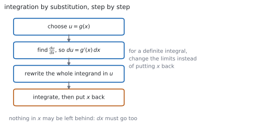
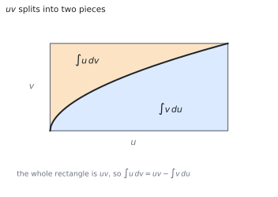

# HL 5.16 — Integration by substitution and by parts（置換積分と部分積分） {#sec-aahl-5-16}

::: {.callout-note}
## What you should be able to do
- $\displaystyle\int kg'(x)f(g(x))\,\mathrm{d}x$ の形を**見て気づく**ことができる。
- **置換積分**（integration by substitution）の手順を書ける。
- 置換が**与えられた**ときに、それを使える。
- 定積分では、**上端・下端も変える**ことができる。
- **部分積分**（integration by parts）の公式を使える。
- $u$ を選ぶ基準を言える。
- 部分積分を**くり返す**問題を解ける。
:::

## The idea

### 1. Recognising the chain rule backwards（連鎖律を逆に読む） {#recognise}

連鎖律で $f(g(x))$ を微分すると $g'(x)f'(g(x))$ でした。逆に読むと

$$
\int k\,g'(x)\,f'(g(x))\,\mathrm{d}x = k\,f(g(x))+C
$$ {#eq-aahl516-recognise}

です。**「中身の微分が、外にかかっている」形**を探します（[SL 5.10](../../aa-sl/05-calculus/aasl-5-10.qmd)）。

$\displaystyle\int 2x\left(x^{2}+1\right)^{5}\mathrm{d}x$ なら、中身 $x^{2}+1$ の微分 $2x$ が前にあります。ですから答えは $\dfrac{\left(x^{2}+1\right)^{6}}{6}+C$ です。

### 2. Integration by substitution（置換積分） {#substitution}

気づけないときは、**文字を置きかえます**。

> Integration by substitution.

{#fig-aahl516-idea-a width=100%}

**$\mathrm{d}x$ も置きかえる**のが要です。$u = g(x)$ なら $\dfrac{\mathrm{d}u}{\mathrm{d}x} = g'(x)$ なので

$$
\mathrm{d}u = g'(x)\,\mathrm{d}x
$$ {#eq-aahl516-du}

と書きます。**$x$ が $1$ つでも残っていたら、まだ終わっていません。**

### 3. When a substitution is given（置換が与えられるとき） {#given}

シラバスは、こう約束しています。

> On examination papers, substitutions will be provided if the integral is not of the form $\int kg'(x) f (g(x))\mathrm{d}x$.
>
> Link to: integration by substitution (SL5.10).

つまり、**自分で思いつかなければならないのは @eq-aahl516-recognise の形だけ**です。それ以外は問題文に「use the substitution $u = \ldots$」と書いてあります。

与えられたら、**素直にそれを使います**。$x$ を $u$ で表す式（たとえば $x = u-1$）が必要になることもあります。

### 4. Definite integrals: change the limits（定積分：上端・下端も変える） {#limits}

定積分では、$x$ にもどさずに**上端・下端を $u$ の値に変える**ほうが速いです（[SL 5.11](../../aa-sl/05-calculus/aasl-5-11.qmd#sub)）。

$$
\int_{a}^{b} f(g(x))g'(x)\,\mathrm{d}x = \int_{g(a)}^{g(b)} f(u)\,\mathrm{d}u
$$ {#eq-aahl516-limits}

**変えたら、$x$ にもどす必要はありません。** もどすなら、上端・下端はもとのままにします。**どちらか一方**です。

### 5. Integration by parts（部分積分） {#parts}

> Integration by parts.

公式集の **5.16** の欄にあります。

> Integration by parts

$$
\int u\,\frac{\mathrm{d}v}{\mathrm{d}x}\,\mathrm{d}x = uv-\int v\,\frac{\mathrm{d}u}{\mathrm{d}x}\,\mathrm{d}x
\qquad \text{or} \qquad
\int u\,\mathrm{d}v = uv-\int v\,\mathrm{d}u
$$ {#eq-aahl516-parts}

{#fig-aahl516-idea-b width=100%}

もとは**積の微分公式**です（[第 1 節](#why-parts)）。**マイナスの符号**を落とさないでください。

### 6. Choosing $u$（$u$ の選び方） {#choosing}

$u$ に選ぶのは、**微分すると簡単になるほう**です。$\dfrac{\mathrm{d}v}{\mathrm{d}x}$ に選ぶのは、**積分できるほう**です。

> Examples: $\int x\sin x\,\mathrm{d}x$, $\int \ln x\,\mathrm{d}x$, $\int \arcsin x\,\mathrm{d}x$

- $\displaystyle\int x\sin x\,\mathrm{d}x$ … $u = x$（微分すると $1$）
- $\displaystyle\int \ln x\,\mathrm{d}x$ … $u = \ln x$、$\dfrac{\mathrm{d}v}{\mathrm{d}x} = 1$
- $\displaystyle\int \arcsin x\,\mathrm{d}x$ … $u = \arcsin x$、$\dfrac{\mathrm{d}v}{\mathrm{d}x} = 1$

::: {.callout-important}
## $\ln x$ と $\arcsin x$ は、積分できないほうです
$\ln x$ や $\arcsin x$ は、そのままでは積分できません。ですから**かならず $u$ のほう**に置きます。

残った $\dfrac{\mathrm{d}v}{\mathrm{d}x}$ は $1$ です。$v = x$ として使います。
:::

### 7. Repeated integration by parts（くり返す部分積分） {#repeated}

> Repeated integration by parts.
>
> Examples: $\int x^{2}e^{x}\mathrm{d}x$ and $\int e^{x}\sin x\,\mathrm{d}x$.

$x^{2}$ のように、**$1$ 回では $1$ にならない**ときはくり返します。$x^{2} \to 2x \to 2$ と $2$ 回です。

$e^{x}\sin x$ は、$2$ 回使うと**もとの積分がもどってきます**。そこで、もとの積分を $I$ と置いて方程式として解きます（[第 4 節](#why-circular)）。

::: {.callout-tip collapse="true"}
## Paper 2 では、電卓で積分が出せます

TI-Nspire CX II の積分テンプレートに入れれば、置換も部分積分も自動です。**$+C$ は付きません。**

答えの見た目が自分の答えとちがうことがあります。**差が定数かどうか**を見るか、**微分してもどるか**を見れば、どちらも正しいと分かります。

**答案には、式を書いてください。** 置換なら $u$ と $\mathrm{d}u$ の行、部分積分なら $u$ と $\dfrac{\mathrm{d}v}{\mathrm{d}x}$ を決めた行を見せます。

**Paper 1 では使えません。** このページの例題と演習は、すべて手で解けるようにしてあります。
:::

## Why it works

::: {.callout-tip collapse="true"}
## クリックすると開きます

#### なぜ、置換積分が成り立つのか {#why-sub}

連鎖律を逆に読んでいるだけです。$F' = f$ とすると

$$
\frac{\mathrm{d}}{\mathrm{d}x}F(g(x)) = f(g(x))\,g'(x)
$$

です。両辺を $x$ で積分すると

$$
\int f(g(x))\,g'(x)\,\mathrm{d}x = F(g(x))+C
$$

になります。$u = g(x)$ と書けば、右辺は $F(u)+C$、つまり $\displaystyle\int f(u)\,\mathrm{d}u$ です。

**$\mathrm{d}u = g'(x)\mathrm{d}x$ は、この対応を短く書いたもの**です。

#### なぜ、部分積分が成り立つのか {#why-parts}

積の微分公式から出ます（[SL 5.6](../../aa-sl/05-calculus/aasl-5-6.qmd)）。

$$
\frac{\mathrm{d}}{\mathrm{d}x}(uv) = u\,\frac{\mathrm{d}v}{\mathrm{d}x}+v\,\frac{\mathrm{d}u}{\mathrm{d}x}
$$

両辺を $x$ で積分します。左辺は $uv$ です。

$$
uv = \int u\,\frac{\mathrm{d}v}{\mathrm{d}x}\,\mathrm{d}x+\int v\,\frac{\mathrm{d}u}{\mathrm{d}x}\,\mathrm{d}x
$$

移項すれば @eq-aahl516-parts です。**マイナスは、移項から出ています。**

@fig-aahl516-idea-b の面積図でも同じことが見えます。長方形 $uv$ が、曲線で $2$ つに分かれています。

#### なぜ、$u$ は「微分すると簡単になるほう」なのか {#why-choose}

@eq-aahl516-parts の右辺には、$\displaystyle\int v\dfrac{\mathrm{d}u}{\mathrm{d}x}\mathrm{d}x$ が残ります。

**この残りが、もとより易しくなっていなければ意味がありません。** $u$ を微分するので、微分して簡単になるものを $u$ にします。

$x\sin x$ で $u = \sin x$ と選ぶと、残りは $\displaystyle\int \dfrac{x^{2}}{2}\cos x\,\mathrm{d}x$ となり、**もとより難しくなります**。選び方が大事なのは、このためです。

#### なぜ、もとの積分がもどってくることがあるのか {#why-circular}

$e^{x}\sin x$ では、微分しても積分しても形が変わりません。$2$ 回使うと

$$
I = e^{x}\sin x-e^{x}\cos x-I
$$

のように、右辺に $I$ が現れます。

これは**$I$ についての $1$ 次方程式**です。$2I = e^{x}\sin x-e^{x}\cos x$ から $I$ が求まります。

**$+C$ は最後に付けます。** 方程式を解いてから書き足してください。
:::

## Worked examples

::: {.callout-note appearance="simple"}
問題文は英語です。意味が理解できなかったら、問題文の下の「**日本語訳**」を開いてください。解説は日本語です。

**例題も演習も、すべて電卓なしで解けます。** Paper 1 のつもりで解いてください。
:::

::: {#exm-aahl516-recognise}
[Find $\displaystyle\int 2x\left(x^{2}+1\right)^{5}\mathrm{d}x$.]{.q-en}

日本語訳

$\displaystyle\int 2x\left(x^{2}+1\right)^{5}\mathrm{d}x$ を求めなさい。

---

**中身は $x^{2}+1$、その微分は $2x$** です。ちょうど前に付いています（@eq-aahl516-recognise）。

$u = x^{2}+1$ と置くと $\mathrm{d}u = 2x\,\mathrm{d}x$ なので

$$
\int 2x\left(x^{2}+1\right)^{5}\mathrm{d}x
= \int u^{5}\,\mathrm{d}u = \frac{u^{6}}{6}+C
= \frac{\left(x^{2}+1\right)^{6}}{6}+C
$$

**検算。** **微分してもどします。** $\dfrac{6\left(x^{2}+1\right)^{5}}{6}\times 2x = 2x\left(x^{2}+1\right)^{5}$ ✓

**検算（$\mathrm{d}x$）。** $2x\,\mathrm{d}x$ がまるごと $\mathrm{d}u$ になりました ✓ $x$ は残っていません。

::: {.callout-note}
## 解答例（答案用紙に書くこと）

*Let* $u = x^{2}+1$, *so* $\mathrm{d}u = 2x\,\mathrm{d}x$.

$$\int 2x\left(x^{2}+1\right)^{5}\mathrm{d}x = \int u^{5}\,\mathrm{d}u
= \frac{u^{6}}{6}+C = \frac{\left(x^{2}+1\right)^{6}}{6}+C$$
:::
:::

::: {#exm-aahl516-given}
[Use the substitution $u = x+1$ to find $\displaystyle\int x\sqrt{x+1}\,\mathrm{d}x$.]{.q-en}

日本語訳

置換 $u = x+1$ を使って $\displaystyle\int x\sqrt{x+1}\,\mathrm{d}x$ を求めなさい。

---

$u = x+1$ なら $\mathrm{d}u = \mathrm{d}x$ です。**$x$ も $u$ で書きます。** $x = u-1$ です。

$$
\int x\sqrt{x+1}\,\mathrm{d}x = \int (u-1)\sqrt{u}\,\mathrm{d}u
= \int\left(u^{3/2}-u^{1/2}\right)\mathrm{d}u
$$

$$
= \frac{2}{5}u^{5/2}-\frac{2}{3}u^{3/2}+C
= \frac{2}{5}(x+1)^{5/2}-\frac{2}{3}(x+1)^{3/2}+C
$$

**検算。** **微分してもどします。** $(x+1)^{3/2}-(x+1)^{1/2} = (x+1)^{1/2}\left[(x+1)-1\right] = x\sqrt{x+1}$ ✓

**検算（$x$ が残っていないか）。** 置きかえの途中で $x = u-1$ を使いました ✓ $u$ だけの式になっています。

::: {.callout-note}
## 解答例（答案用紙に書くこと）

*Let* $u = x+1$, *so* $\mathrm{d}u = \mathrm{d}x$ *and* $x = u-1$.

$$\int x\sqrt{x+1}\,\mathrm{d}x = \int\left(u^{3/2}-u^{1/2}\right)\mathrm{d}u
= \frac{2}{5}u^{5/2}-\frac{2}{3}u^{3/2}+C$$

$$= \frac{2}{5}(x+1)^{5/2}-\frac{2}{3}(x+1)^{3/2}+C$$
:::
:::

::: {#exm-aahl516-parts}
[Find $\displaystyle\int x\sin x\,\mathrm{d}x$.]{.q-en}

日本語訳

$\displaystyle\int x\sin x\,\mathrm{d}x$ を求めなさい。

---

**$u = x$、$\dfrac{\mathrm{d}v}{\mathrm{d}x} = \sin x$** と選びます（[第 6 節](#choosing)）。

$$
u = x, \quad \frac{\mathrm{d}u}{\mathrm{d}x} = 1, \qquad
\frac{\mathrm{d}v}{\mathrm{d}x} = \sin x, \quad v = -\cos x
$$

@eq-aahl516-parts に入れます。

$$
\int x\sin x\,\mathrm{d}x
= x(-\cos x)-\int (-\cos x)(1)\,\mathrm{d}x
$$

$$
= -x\cos x+\int \cos x\,\mathrm{d}x
= -x\cos x+\sin x+C
$$

**検算。** **微分してもどします。** $-\cos x+x\sin x+\cos x = x\sin x$ ✓

**検算（選び方）。** $u = \sin x$ にすると $\displaystyle\int \dfrac{x^{2}}{2}\cos x\,\mathrm{d}x$ が残ります ✓ もとより難しくなります。

::: {.callout-note}
## 解答例（答案用紙に書くこと）

*Let* $u = x$ *and* $\dfrac{\mathrm{d}v}{\mathrm{d}x} = \sin x$, *so* $\dfrac{\mathrm{d}u}{\mathrm{d}x} = 1$ *and* $v = -\cos x$.

$$\int x\sin x\,\mathrm{d}x = -x\cos x+\int \cos x\,\mathrm{d}x
= -x\cos x+\sin x+C$$
:::
:::

::: {#exm-aahl516-repeated}
[Find $\displaystyle\int x^{2}e^{x}\,\mathrm{d}x$.]{.q-en}

日本語訳

$\displaystyle\int x^{2}e^{x}\,\mathrm{d}x$ を求めなさい。

---

**$1$ 回目。** $u = x^{2}$、$\dfrac{\mathrm{d}v}{\mathrm{d}x} = e^{x}$ です。

$$
\int x^{2}e^{x}\,\mathrm{d}x = x^{2}e^{x}-\int 2xe^{x}\,\mathrm{d}x
$$

**$2$ 回目。** 残った積分に、もう一度使います。$u = 2x$、$\dfrac{\mathrm{d}v}{\mathrm{d}x} = e^{x}$ です。

$$
\int 2xe^{x}\,\mathrm{d}x = 2xe^{x}-\int 2e^{x}\,\mathrm{d}x = 2xe^{x}-2e^{x}
$$

合わせます。

$$
\int x^{2}e^{x}\,\mathrm{d}x = x^{2}e^{x}-2xe^{x}+2e^{x}+C
= e^{x}\left(x^{2}-2x+2\right)+C
$$

**検算。** **微分してもどします。** $e^{x}\left(x^{2}-2x+2\right)+e^{x}(2x-2) = e^{x}x^{2}$ ✓

**検算（回数）。** $x^{2} \to 2x \to 2$ で、$2$ 回で $x$ が消えました ✓ $x^{3}$ なら $3$ 回です。

::: {.callout-note}
## 解答例（答案用紙に書くこと）

$$\int x^{2}e^{x}\,\mathrm{d}x = x^{2}e^{x}-\int 2xe^{x}\,\mathrm{d}x$$

$$\int 2xe^{x}\,\mathrm{d}x = 2xe^{x}-2e^{x}$$

$$\int x^{2}e^{x}\,\mathrm{d}x = e^{x}\left(x^{2}-2x+2\right)+C$$
:::

::: {.model-answer}
**試験ではこう書く**

*Integration by parts is applied twice, because the polynomial factor* $x^{2}$ *needs two differentiations before it disappears.*

*First application: take* $u = x^{2}$ *and* $\dfrac{\mathrm{d}v}{\mathrm{d}x} = e^{x}$, *so that* $\dfrac{\mathrm{d}u}{\mathrm{d}x} = 2x$ *and* $v = e^{x}$. *Then*

$$\int x^{2}e^{x}\,\mathrm{d}x = x^{2}e^{x}-\int 2xe^{x}\,\mathrm{d}x$$

*The remaining integral is simpler, since the power of* $x$ *has dropped from* $2$ *to* $1$.

*Second application, on that integral: take* $u = 2x$ *and* $\dfrac{\mathrm{d}v}{\mathrm{d}x} = e^{x}$, *so* $\dfrac{\mathrm{d}u}{\mathrm{d}x} = 2$ *and* $v = e^{x}$. *Then*

$$\int 2xe^{x}\,\mathrm{d}x = 2xe^{x}-\int 2e^{x}\,\mathrm{d}x = 2xe^{x}-2e^{x}$$

*Combining, and writing the constant only once at the end,*

$$\int x^{2}e^{x}\,\mathrm{d}x = x^{2}e^{x}-2xe^{x}+2e^{x}+C = e^{x}\left(x^{2}-2x+2\right)+C$$

*Differentiating the answer returns the integrand, which confirms it. Note that the same choice of* $u$ *must be kept at each stage: switching to* $u = e^{x}$ *at the second step would undo the first and return to the original integral.*
:::
:::

## Common errors

::: {.callout-warning}
## $\mathrm{d}x$ を置きかえない
$u$ だけ置きかえて $\mathrm{d}x$ をそのままにすると、式が合いません（@eq-aahl516-du）。

**$\mathrm{d}u = g'(x)\mathrm{d}x$ を、かならず書いてください。**
:::

::: {.callout-warning}
## $x$ を残したまま積分する
置換したあとの式に $x$ が残っていたら、まだ終わりではありません（[第 2 節](#substitution)）。

$x = u-1$ のように、**$x$ を $u$ で表す**必要があることもあります。
:::

::: {.callout-warning}
## 定積分で、上端・下端を変えたのに $x$ にもどす
**どちらか一方**です（[第 4 節](#limits)）。

上端・下端を $u$ の値にしたら、そのまま $u$ で計算します。$x$ にもどすなら、上端・下端はもとのままです。
:::

::: {.callout-warning}
## 部分積分のマイナスを落とす
@eq-aahl516-parts は $uv-\displaystyle\int v\,\mathrm{d}u$ です。

**プラスにすると、符号が全部ずれます。** 移項から出た符号だと覚えておくと落としません（[第 2 節](#why-parts)）。
:::

::: {.callout-warning}
## $u$ の選び方をまちがえる
微分して簡単になるほうを $u$ にします（[第 3 節](#why-choose)）。

残った積分がもとより難しくなったら、**選び方が逆**です。やり直してください。
:::

::: {.callout-warning}
## $\ln x$ や $\arcsin x$ を $\dfrac{\mathrm{d}v}{\mathrm{d}x}$ に選ぶ
どちらも、そのままでは積分できません（[第 6 節](#choosing)）。

**かならず $u$ のほう**です。残りの $\dfrac{\mathrm{d}v}{\mathrm{d}x}$ は $1$ になります。
:::

## Exercises

::: {.callout-note appearance="simple"}
各問題に、折りたたみが $3$ つ付いています。**日本語訳**、**解答例**（答案用紙に書くべきこと。英語です）、**解説**（なぜそうなるか。日本語です）。

まず自分で解いて、次に解答例と見くらべてください。**解説は、合わなかったときだけ開けば十分です。**
:::

::: {.exercise-block}

[1]{.ex-no} [Find $\displaystyle\int 3x^{2}\left(x^{3}+2\right)^{4}\mathrm{d}x$.]{.q-en}

日本語訳

$\displaystyle\int 3x^{2}\left(x^{3}+2\right)^{4}\mathrm{d}x$ を求めなさい。

::: {.callout-note collapse="true"}
## 解答例（答案用紙に書くこと）

*Let* $u = x^{3}+2$, *so* $\mathrm{d}u = 3x^{2}\,\mathrm{d}x$.

$$\int 3x^{2}\left(x^{3}+2\right)^{4}\mathrm{d}x = \int u^{4}\,\mathrm{d}u
= \frac{u^{5}}{5}+C = \frac{\left(x^{3}+2\right)^{5}}{5}+C$$
:::

::: {.callout-tip collapse="true"}
## 解説

中身の微分が、そのまま前に付いています（@eq-aahl516-recognise）。**置換を書かずに答えてもかまいません。**

**検算。** 微分すると $\dfrac{5\left(x^{3}+2\right)^{4}}{5}\times 3x^{2}$ ✓

**検算（係数）。** $3x^{2}$ がちょうど $\mathrm{d}u$ ✓ 余分な数が出ません。
:::

::: {.ex-sep}
:::

[2]{.ex-no} [Find $\displaystyle\int \sin^{3}x\cos x\,\mathrm{d}x$.]{.q-en}

日本語訳

$\displaystyle\int \sin^{3}x\cos x\,\mathrm{d}x$ を求めなさい。

::: {.callout-note collapse="true"}
## 解答例（答案用紙に書くこと）

*Let* $u = \sin x$, *so* $\mathrm{d}u = \cos x\,\mathrm{d}x$.

$$\int \sin^{3}x\cos x\,\mathrm{d}x = \int u^{3}\,\mathrm{d}u
= \frac{u^{4}}{4}+C = \frac{\sin^{4}x}{4}+C$$
:::

::: {.callout-tip collapse="true"}
## 解説

**$\cos x$ が $\sin x$ の微分**です。@eq-aahl516-recognise の形です。

**検算。** 微分すると $\dfrac{4\sin^{3}x}{4}\times\cos x$ ✓

**検算（$x = \dfrac{\pi}{2}$）。** 答えは $\dfrac{1}{4}$、被積分関数は $0$ ✓ そこで傾きが $0$ です。
:::

::: {.ex-sep}
:::

[3]{.ex-no} [Find $\displaystyle\int x e^{x^{2}}\,\mathrm{d}x$.]{.q-en}

日本語訳

$\displaystyle\int x e^{x^{2}}\,\mathrm{d}x$ を求めなさい。

::: {.callout-note collapse="true"}
## 解答例（答案用紙に書くこと）

*Let* $u = x^{2}$, *so* $\mathrm{d}u = 2x\,\mathrm{d}x$ *and* $x\,\mathrm{d}x = \dfrac{1}{2}\mathrm{d}u$.

$$\int x e^{x^{2}}\,\mathrm{d}x = \frac{1}{2}\int e^{u}\,\mathrm{d}u
= \frac{1}{2}e^{u}+C = \frac{1}{2}e^{x^{2}}+C$$
:::

::: {.callout-tip collapse="true"}
## 解説

$\mathrm{d}u = 2x\,\mathrm{d}x$ ですが、式にあるのは $x\,\mathrm{d}x$ です。**$\dfrac{1}{2}$ が出ます。**

**検算。** 微分すると $\dfrac{1}{2}e^{x^{2}}\times 2x = xe^{x^{2}}$ ✓

**検算（$\dfrac{1}{2}$ の出どころ）。** $x\,\mathrm{d}x = \dfrac{1}{2}\mathrm{d}u$ ✓ ここから来ています。
:::

::: {.ex-sep}
:::

[4]{.ex-no} [Find $\displaystyle\int \frac{x}{x^{2}+1}\,\mathrm{d}x$.]{.q-en}

日本語訳

$\displaystyle\int \frac{x}{x^{2}+1}\,\mathrm{d}x$ を求めなさい。

::: {.callout-note collapse="true"}
## 解答例（答案用紙に書くこと）

*Let* $u = x^{2}+1$, *so* $\mathrm{d}u = 2x\,\mathrm{d}x$.

$$\int \frac{x}{x^{2}+1}\,\mathrm{d}x = \frac{1}{2}\int \frac{1}{u}\,\mathrm{d}u
= \frac{1}{2}\ln\lvert u \rvert+C = \frac{1}{2}\ln\left(x^{2}+1\right)+C$$
:::

::: {.callout-tip collapse="true"}
## 解説

**分子が分母の微分の $\dfrac{1}{2}$ 倍**です。ですから $\ln$ になります。

$x^{2}+1 > 0$ なので、絶対値は外してかまいません。

**検算。** 微分すると $\dfrac{1}{2}\cdot\dfrac{2x}{x^{2}+1} = \dfrac{x}{x^{2}+1}$ ✓

**検算（分子が $1$ なら）。** $\arctan x$ になります ✓ 分子で見分けます。
:::

::: {.ex-sep}
:::

[5]{.ex-no} [Find $\displaystyle\int \ln x\,\mathrm{d}x$.]{.q-en}

日本語訳

$\displaystyle\int \ln x\,\mathrm{d}x$ を求めなさい。

::: {.callout-note collapse="true"}
## 解答例（答案用紙に書くこと）

*Let* $u = \ln x$ *and* $\dfrac{\mathrm{d}v}{\mathrm{d}x} = 1$, *so* $\dfrac{\mathrm{d}u}{\mathrm{d}x} = \dfrac{1}{x}$ *and* $v = x$.

$$\int \ln x\,\mathrm{d}x = x\ln x-\int x\cdot\frac{1}{x}\,\mathrm{d}x
= x\ln x-x+C$$
:::

::: {.callout-tip collapse="true"}
## 解説

**積に見えなくても、$1$ をかけたと思えば部分積分が使えます**（[第 6 節](#choosing)）。

$\ln x$ は積分できないので、$u$ のほうです。

**検算。** 微分すると $\ln x+x\cdot\dfrac{1}{x}-1 = \ln x$ ✓

**検算（$x = 1$）。** 答えは $-1+C$、被積分関数は $0$ ✓ そこで傾きが $0$ です。
:::

::: {.ex-sep}
:::

[6]{.ex-no} [Find $\displaystyle\int x\cos x\,\mathrm{d}x$.]{.q-en}

日本語訳

$\displaystyle\int x\cos x\,\mathrm{d}x$ を求めなさい。

::: {.callout-note collapse="true"}
## 解答例（答案用紙に書くこと）

*Let* $u = x$ *and* $\dfrac{\mathrm{d}v}{\mathrm{d}x} = \cos x$, *so* $\dfrac{\mathrm{d}u}{\mathrm{d}x} = 1$ *and* $v = \sin x$.

$$\int x\cos x\,\mathrm{d}x = x\sin x-\int \sin x\,\mathrm{d}x
= x\sin x+\cos x+C$$
:::

::: {.callout-tip collapse="true"}
## 解説

$-\displaystyle\int \sin x\,\mathrm{d}x = +\cos x$ です。**符号が $2$ 回変わります。**

**検算。** 微分すると $\sin x+x\cos x-\sin x = x\cos x$ ✓

**検算（$\sin$ のとき）。** $\displaystyle\int x\sin x\,\mathrm{d}x = -x\cos x+\sin x+C$ ✓ 形は似ていますが符号がちがいます。
:::

::: {.ex-sep}
:::

[7]{.ex-no} [Find $\displaystyle\int_{0}^{1} x e^{x}\,\mathrm{d}x$.]{.q-en}

日本語訳

$\displaystyle\int_{0}^{1} x e^{x}\,\mathrm{d}x$ を求めなさい。

::: {.callout-note collapse="true"}
## 解答例（答案用紙に書くこと）

*Let* $u = x$ *and* $\dfrac{\mathrm{d}v}{\mathrm{d}x} = e^{x}$, *so* $v = e^{x}$.

$$\int_{0}^{1} x e^{x}\,\mathrm{d}x
= \left[xe^{x}\right]_{0}^{1}-\int_{0}^{1} e^{x}\,\mathrm{d}x
= e-\left[e^{x}\right]_{0}^{1} = e-(e-1) = 1$$
:::

::: {.callout-tip collapse="true"}
## 解説

**定積分でも、角かっこを付ければ同じ**です。$uv$ の部分にも上端・下端が付きます。

**検算（不定積分から）。** $e^{x}(x-1)$ を $0$ から $1$ で $0-(-1) = 1$ ✓

**検算（大きさ）。** 被積分関数は $0$ から $e$ まで増えるので、面積が $1$ 前後なのは自然 ✓
:::

::: {.ex-sep}
:::

[8]{.ex-no} [Find $\displaystyle\int e^{x}\sin x\,\mathrm{d}x$.]{.q-en}

日本語訳

$\displaystyle\int e^{x}\sin x\,\mathrm{d}x$ を求めなさい。

::: {.callout-note collapse="true"}
## 解答例（答案用紙に書くこと）

*Let* $I = \displaystyle\int e^{x}\sin x\,\mathrm{d}x$. *Taking* $u = \sin x$, $\dfrac{\mathrm{d}v}{\mathrm{d}x} = e^{x}$,

$$I = e^{x}\sin x-\int e^{x}\cos x\,\mathrm{d}x$$

*Applying parts again to the new integral, with* $u = \cos x$,

$$\int e^{x}\cos x\,\mathrm{d}x = e^{x}\cos x+\int e^{x}\sin x\,\mathrm{d}x
= e^{x}\cos x+I$$

$$I = e^{x}\sin x-e^{x}\cos x-I, \qquad
I = \frac{e^{x}\left(\sin x-\cos x\right)}{2}+C$$
:::

::: {.callout-tip collapse="true"}
## 解説

**もとの積分がもどってきます**（[第 4 節](#why-circular)）。そこで $I$ についての方程式として解きます。

**$2$ 回とも同じ側を $u$ にする**のが大切です。$1$ 回目に $\sin$、$2$ 回目に $e^{x}$ を $u$ にすると、もとにもどるだけで進みません。

**検算。** 微分すると $\dfrac{e^{x}(\sin x-\cos x)+e^{x}(\cos x+\sin x)}{2} = e^{x}\sin x$ ✓

**検算（$+C$）。** 方程式を解いたあとに付けました ✓ 途中で付けると $2$ 重になります。

::: {.model-answer}
**試験ではこう書く**

*Write* $I = \displaystyle\int e^{x}\sin x\,\mathrm{d}x$. *Neither factor becomes simpler on differentiation, so the aim is to recover* $I$ *and solve for it.*

*Apply integration by parts with* $u = \sin x$ *and* $\dfrac{\mathrm{d}v}{\mathrm{d}x} = e^{x}$, *so* $\dfrac{\mathrm{d}u}{\mathrm{d}x} = \cos x$ *and* $v = e^{x}$:

$$I = e^{x}\sin x-\int e^{x}\cos x\,\mathrm{d}x$$

*Apply parts a second time to* $\displaystyle\int e^{x}\cos x\,\mathrm{d}x$, *keeping the trigonometric factor as* $u$ *so that the process moves forward rather than reversing. With* $u = \cos x$ *and* $v = e^{x}$,

$$\int e^{x}\cos x\,\mathrm{d}x = e^{x}\cos x-\int e^{x}(-\sin x)\,\mathrm{d}x
= e^{x}\cos x+I$$

*Substituting back,*

$$I = e^{x}\sin x-\left(e^{x}\cos x+I\right)
= e^{x}\sin x-e^{x}\cos x-I$$

*This is a linear equation in* $I$. *Adding* $I$ *to both sides gives* $2I = e^{x}\left(\sin x-\cos x\right)$, *so*

$$I = \frac{e^{x}\left(\sin x-\cos x\right)}{2}+C$$

*The constant of integration is added only at this final stage, after the equation has been solved.*
:::
:::

::: {.ex-sep}
:::

[9]{.ex-no} [Explain how to choose $u$ and $\dfrac{\mathrm{d}v}{\mathrm{d}x}$ when using integration by parts.]{.q-en}

日本語訳

部分積分を使うときの $u$ と $\dfrac{\mathrm{d}v}{\mathrm{d}x}$ の選び方を説明しなさい。

::: {.callout-note collapse="true"}
## 解答例（答案用紙に書くこと）

*The formula replaces one integral by* $uv$ *minus another integral involving* $v$ *and* $\dfrac{\mathrm{d}u}{\mathrm{d}x}$, *so the new integral must be easier than the original.*

*Choose as* $u$ *the factor that becomes simpler when differentiated, such as a power of* $x$, *and as* $\dfrac{\mathrm{d}v}{\mathrm{d}x}$ *a factor that can be integrated, such as* $e^{x}$ *or* $\sin x$.

*Functions such as* $\ln x$ *and* $\arcsin x$ *cannot be integrated directly, so they must be taken as* $u$, *with* $\dfrac{\mathrm{d}v}{\mathrm{d}x} = 1$.
:::

::: {.callout-tip collapse="true"}
## 解説

**残る積分が易しくなるか**、が判断の基準です（[第 3 節](#why-choose)）。

$x^{n}$ は微分すると次数が下がるので $u$ 向きです。$e^{x}$、$\sin x$、$\cos x$ は積分しても形が変わらないので $\dfrac{\mathrm{d}v}{\mathrm{d}x}$ 向きです。

**検算（悪い選び方）。** $x\sin x$ で $u = \sin x$ とすると $\displaystyle\int\dfrac{x^{2}}{2}\cos x\,\mathrm{d}x$ ✓ 次数が上がっています。

**検算（$\ln x$）。** 積分できないので $u$ にするしかありません ✓

::: {.model-answer}
**試験ではこう書く**

*The formula* $\displaystyle\int u\frac{\mathrm{d}v}{\mathrm{d}x}\mathrm{d}x = uv-\int v\frac{\mathrm{d}u}{\mathrm{d}x}\mathrm{d}x$ *does not evaluate an integral by itself: it trades the original integral for a different one. The choice of* $u$ *is therefore made so that the new integral is easier than the old.*

*Since* $u$ *is differentiated and* $\dfrac{\mathrm{d}v}{\mathrm{d}x}$ *is integrated, two conditions guide the choice. First,* $u$ *should become simpler on differentiation. A power of* $x$ *is ideal, because each differentiation lowers the degree by one and after enough steps it disappears. Second,* $\dfrac{\mathrm{d}v}{\mathrm{d}x}$ *must be something that can actually be integrated, such as* $e^{x}$, $\sin x$ *or* $\cos x$, *whose integrals are no harder than themselves.*

*Some functions force the choice. Neither* $\ln x$ *nor* $\arcsin x$ *has an elementary antiderivative that is known in advance, so neither can serve as* $\dfrac{\mathrm{d}v}{\mathrm{d}x}$. *They must be taken as* $u$, *and the remaining factor is then* $1$, *giving* $v = x$.

*A practical test is to look at the integral that remains. If it is simpler than the original, the choice was right; if it is more complicated, swapping the two factors usually fixes it.*
:::
:::

::: {.ex-sep}
:::

[10]{.ex-no} [A student writes $\displaystyle\int u\,\mathrm{d}v = uv+\int v\,\mathrm{d}u$. Identify the error and show, using $\displaystyle\int x e^{x}\,\mathrm{d}x$, what goes wrong.]{.q-en}

日本語訳

ある生徒が $\displaystyle\int u\,\mathrm{d}v = uv+\int v\,\mathrm{d}u$ と書きました。まちがいを指摘し、$\displaystyle\int x e^{x}\,\mathrm{d}x$ を使って何がいけないのかを示しなさい。

::: {.callout-note collapse="true"}
## 解答例（答案用紙に書くこと）

*The correct formula has a minus sign:* $\displaystyle\int u\,\mathrm{d}v = uv-\int v\,\mathrm{d}u$.

*With* $u = x$ *and* $\mathrm{d}v = e^{x}\mathrm{d}x$, *the student's version gives* $xe^{x}+e^{x}+C$.

*Differentiating this gives* $e^{x}+xe^{x}+e^{x} = xe^{x}+2e^{x}$, *which is not the integrand. The correct answer is* $xe^{x}-e^{x}+C$.
:::

::: {.callout-tip collapse="true"}
## 解説

**符号は移項から出ています**（[第 2 節](#why-parts)）。プラスにすると、積の微分公式にもどりません。

**検算（正しい答え）。** $xe^{x}-e^{x}$ を微分すると $e^{x}+xe^{x}-e^{x} = xe^{x}$ ✓

**検算（差）。** $2$ つの答えの差は $2e^{x}$ で、定数ではありません ✓ ですから「$+C$ のちがい」では説明できません。

::: {.model-answer}
**試験ではこう書く**

*The formula for integration by parts comes from the product rule,*

$$\frac{\mathrm{d}}{\mathrm{d}x}(uv) = u\frac{\mathrm{d}v}{\mathrm{d}x}+v\frac{\mathrm{d}u}{\mathrm{d}x}$$

*Integrating both sides gives* $uv = \displaystyle\int u\,\mathrm{d}v+\int v\,\mathrm{d}u$, *and rearranging to make* $\displaystyle\int u\,\mathrm{d}v$ *the subject moves the second integral across, producing a minus sign:*

$$\int u\,\mathrm{d}v = uv-\int v\,\mathrm{d}u$$

*The student's version has a plus sign and is therefore not equivalent to the product rule.*

*Applying it to* $\displaystyle\int xe^{x}\mathrm{d}x$ *with* $u = x$ *and* $\mathrm{d}v = e^{x}\mathrm{d}x$, *so* $\mathrm{d}u = \mathrm{d}x$ *and* $v = e^{x}$, *the incorrect formula gives* $xe^{x}+\displaystyle\int e^{x}\mathrm{d}x = xe^{x}+e^{x}+C$.

*Differentiating this result gives* $e^{x}+xe^{x}+e^{x} = xe^{x}+2e^{x}$, *which is not the integrand* $xe^{x}$. *The correct formula gives* $xe^{x}-\displaystyle\int e^{x}\mathrm{d}x = xe^{x}-e^{x}+C$, *whose derivative is* $e^{x}+xe^{x}-e^{x} = xe^{x}$ *as required. The two answers differ by* $2e^{x}$, *which is not a constant, so this is a genuine error and not merely a different choice of constant.*
:::
:::

:::
