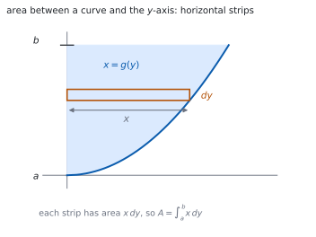
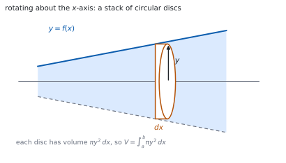

# HL 5.17 — Areas with respect to the $y$-axis and volumes of revolution（$y$ 軸とのあいだの面積と回転体の体積） {#sec-aahl-5-17}

::: {.callout-note}
## What you should be able to do
- 曲線と **$y$ 軸**とのあいだの面積を、$\displaystyle\int x\,\mathrm{d}y$ で求められる。
- $y = f(x)$ を $x = g(y)$ の形に直せる。
- **$x$ 軸まわり**の回転体の体積を求められる。
- **$y$ 軸まわり**の回転体の体積を求められる。
- 上端・下端を、**どちらの軸で積分するか**に合わせて決められる。
- $2$ 曲線にはさまれた部分を回した体積を、**差**として求められる。
:::

## The idea

### 1. Area between a curve and the $y$-axis（$y$ 軸とのあいだの面積） {#area-y}

シラバスは、こう書いています。

> Area of the region enclosed by a curve and the y-axis in a given interval.

公式集の **5.17** の欄にあります。

> Area of region enclosed by a curve and y-axis

$$
A = \int_{a}^{b} x\,\mathrm{d}y
$$ {#eq-aahl517-area}

{#fig-aahl517-idea-a width=100%}

$x$ 軸とのあいだなら**たて長**の短冊でした（[SL 5.11](../../aa-sl/05-calculus/aasl-5-11.qmd)）。$y$ 軸とのあいだなら**よこ長**です。

**上端・下端は $y$ の値**です。$x$ の値ではありません。

### 2. Making $x$ the subject（$x$ を $y$ で表す） {#subject}

@eq-aahl517-area を使うには、$x$ を $y$ の式で書く必要があります。

$$
y = x^{2} \ (x \geq 0) \quad \Longrightarrow \quad x = \sqrt{y}
$$

**符号に気をつけてください。** $y = x^{2}$ を解くと $x = \pm\sqrt{y}$ です。問題の図から、どちらを使うかを決めます。

$y = e^{x}$ なら $x = \ln y$、$y = x^{3}$ なら $x = y^{1/3}$ です。

### 3. Volume of revolution about the $x$-axis（$x$ 軸まわりの回転体） {#volume-x}

> Volumes of revolution about the x-axis or y-axis.

公式集の **5.17** には、こうあります。

> Volume of revolution about the x or y-axes

$$
V = \int_{a}^{b} \pi y^{2}\,\mathrm{d}x
$$ {#eq-aahl517-vol-x}

{#fig-aahl517-idea-b width=100%}

**$\pi y^{2}$ は円の面積**です（[第 1 節](#why-disc)）。半径が $y$ の円板を、厚さ $\mathrm{d}x$ で積み上げています。

**$y$ を $2$ 乗するのを忘れないこと。** これが、この項目でいちばん多いまちがいです。

### 4. Volume of revolution about the $y$-axis（$y$ 軸まわりの回転体） {#volume-y}

$$
V = \int_{a}^{b} \pi x^{2}\,\mathrm{d}y
$$ {#eq-aahl517-vol-y}

**$x$ と $y$ を入れかえただけ**です。今度は $x$ を $y$ で表してから積分します。

回す軸が $y$ 軸なら、円板の半径は**軸からの水平距離**、つまり $x$ です。

### 5. Choosing the limits（上端・下端の決め方） {#limits}

::: {.callout-important}
## 上端・下端は、積分する変数の値です
$\mathrm{d}x$ で積分するなら $x$ の値、$\mathrm{d}y$ で積分するなら $y$ の値です。

$y = x^{2}$ を $y$ 軸まわりに、$0 \leq x \leq 2$ の部分で回すなら、**上端・下端は $y$ の値 $0$ と $4$** です。$x$ の値 $0$ と $2$ ではありません。

**$x$ の範囲が与えられたら、$y$ の範囲に直してから**書いてください。
:::

### 6. Rotating the region between two curves（$2$ 曲線のあいだを回す） {#between}

$2$ 曲線にはさまれた部分を回すと、**中が空いた立体**になります。

体積は、**外側の立体から内側の立体を引いた差**です。

$$
V = \int_{a}^{b} \pi\left(y_{\text{outer}}^{2}-y_{\text{inner}}^{2}\right)\mathrm{d}x
$$ {#eq-aahl517-between}

**$\left(y_{\text{outer}}-y_{\text{inner}}\right)^{2}$ ではありません。** $2$ 乗してから引きます（[第 3 節](#why-difference)）。

### 7. Checking with a known solid（知っている立体で検算） {#check}

答えが出たら、**知っている立体の公式**とくらべると安心です。

- $y = mx$ を $x$ 軸まわりに $0$ から $h$ まで回すと**円錐**。$V = \dfrac{1}{3}\pi r^{2}h$ です。
- 半円 $y = \sqrt{r^{2}-x^{2}}$ を回すと**球**。$V = \dfrac{4}{3}\pi r^{3}$ です。

**答えに $\pi$ が付いているか**も、手軽な見張りです。回転体の体積には、かならず $\pi$ が出ます。

::: {.callout-tip collapse="true"}
## Paper 2 では、電卓で定積分が出せます

TI-Nspire CX II の積分テンプレートに、$\pi y^{2}$ をそのまま入れられます。$\pi$ は **ctrl** + **π** です。

グラフで交点を先に読んでから、上端・下端に使うと速いです。**menu → 6: Analyze Graph → 4: Intersection** です。

**答案には、式を書いてください。** @eq-aahl517-vol-x の形と、$y$ を $x$ で表した式を見せます。

**Paper 1 では使えません。** このページの例題と演習は、すべて手で解けるようにしてあります。
:::

## Why it works

::: {.callout-tip collapse="true"}
## クリックすると開きます

#### なぜ、円板を積むのか {#why-disc}

回転体を、軸に垂直な平面で薄く切ります。切り口は**円**です。

$x$ のところの切り口の半径は $y = f(x)$ なので、面積は $\pi y^{2}$ です。厚さを $\mathrm{d}x$ とすると、その薄い円板の体積は

$$
\pi y^{2}\,\mathrm{d}x
$$

です。これを $a$ から $b$ まで足し合わせたものが @eq-aahl517-vol-x です。

**「切り口の面積 $\times$ 厚さ」を積む**、という考え方は、面積のときの「高さ $\times$ 幅」と同じです。

#### なぜ、$y$ 軸のときは $x\,\mathrm{d}y$ なのか {#why-xdy}

$x$ 軸とのあいだの面積では、たて長の短冊の高さが $y$、幅が $\mathrm{d}x$ でした。

$y$ 軸とのあいだでは、**横だおしに考えます**。よこ長の短冊の長さが $x$、厚さが $\mathrm{d}y$ です（@fig-aahl517-idea-a）。

$x$ と $y$ の役割を入れかえただけで、式の形は同じです。**軸を $90^\circ$ 回して見れば、同じ絵**になります。

#### なぜ、差の $2$ 乗ではなく $2$ 乗の差なのか {#why-difference}

中が空いた輪（ドーナツの切り口）の面積は

$$
\pi R^{2}-\pi r^{2} = \pi\left(R^{2}-r^{2}\right)
$$

です。**大きい円から小さい円を引きます。**

$\pi(R-r)^{2}$ は「半径 $R-r$ の円」の面積で、まったく別のものです。$R = 2$、$r = 1$ で試すと、$\pi(4-1) = 3\pi$ に対して $\pi(2-1)^{2} = \pi$ です。**$3$ 倍ちがいます。**

#### なぜ、円錐や球の公式が出てくるのか {#why-cone}

$y = \dfrac{r}{h}x$ を $0$ から $h$ まで $x$ 軸まわりに回すと

$$
V = \int_{0}^{h}\pi\frac{r^{2}}{h^{2}}x^{2}\,\mathrm{d}x
= \pi\frac{r^{2}}{h^{2}}\cdot\frac{h^{3}}{3} = \frac{1}{3}\pi r^{2}h
$$

です。**円錐の公式が、計算から出てきます。**

球も同じで、$y = \sqrt{r^{2}-x^{2}}$ を $-r$ から $r$ まで回すと $\dfrac{4}{3}\pi r^{3}$ になります。小学校で習った公式が、ここで証明できるわけです。
:::

## Worked examples

::: {.callout-note appearance="simple"}
問題文は英語です。意味が理解できなかったら、問題文の下の「**日本語訳**」を開いてください。解説は日本語です。

**例題も演習も、すべて電卓なしで解けます。** Paper 1 のつもりで解いてください。
:::

::: {#exm-aahl517-area}
[The curve $y = x^{2}$ for $x \geq 0$ is drawn. Find the area of the region enclosed by the curve, the $y$-axis and the line $y = 4$.]{.q-en}

日本語訳

$x \geq 0$ における曲線 $y = x^{2}$ について、曲線・$y$ 軸・直線 $y = 4$ で囲まれた部分の面積を求めなさい。

---

**$x$ を $y$ で表します**（[第 2 節](#subject)）。$x \geq 0$ なので $x = \sqrt{y}$ です。

$y$ の範囲は $0$ から $4$ です。@eq-aahl517-area に入れます。

$$
A = \int_{0}^{4} \sqrt{y}\,\mathrm{d}y
= \left[\frac{2}{3}y^{3/2}\right]_{0}^{4}
= \frac{2}{3}(8) = \frac{16}{3}
$$

**検算。** **長方形とくらべます。** 全体の長方形は $2 \times 4 = 8$ で、答えはその $\dfrac{2}{3}$ ✓ 図と合います。

**検算（$x$ 軸側で）。** $x$ 軸とのあいだの面積は $\displaystyle\int_{0}^{2}x^{2}\mathrm{d}x = \dfrac{8}{3}$。足すと $8$ ✓ **$2$ つで長方形になります。**

::: {.callout-note}
## 解答例（答案用紙に書くこと）

*Since* $x \geq 0$, $\ x = \sqrt{y}$.

$$A = \int_{0}^{4} \sqrt{y}\,\mathrm{d}y
= \left[\frac{2}{3}y^{3/2}\right]_{0}^{4} = \frac{16}{3}$$
:::
:::

::: {#exm-aahl517-volx}
[The region under $y = x^{2}$ from $x = 0$ to $x = 2$ is rotated through $2\pi$ about the $x$-axis. Find the volume of the solid formed.]{.q-en}

日本語訳

$x = 0$ から $x = 2$ までの $y = x^{2}$ の下の部分を、$x$ 軸のまわりに $1$ 回転させます。できる立体の体積を求めなさい。

---

@eq-aahl517-vol-x に入れます。**$y$ を $2$ 乗**します。

$$
V = \int_{0}^{2} \pi\left(x^{2}\right)^{2}\mathrm{d}x
= \pi\int_{0}^{2} x^{4}\,\mathrm{d}x
= \pi\left[\frac{x^{5}}{5}\right]_{0}^{2}
= \frac{32\pi}{5}
$$

**検算（$\pi$）。** 答えに $\pi$ が付いています ✓ 回転体なので当てはまります。

**検算（大きさ）。** 半径 $4$、高さ $2$ の円柱なら $32\pi$。答えは $\dfrac{32\pi}{5}$ で、その $\dfrac{1}{5}$ ✓ 立体は円柱よりずっと細いので自然です。

::: {.callout-note}
## 解答例（答案用紙に書くこと）

$$V = \int_{0}^{2} \pi\left(x^{2}\right)^{2}\mathrm{d}x
= \pi\left[\frac{x^{5}}{5}\right]_{0}^{2} = \frac{32\pi}{5}$$
:::
:::

::: {#exm-aahl517-voly}
[The region between $y = x^{2}$, the $y$-axis and $y = 4$, with $x \geq 0$, is rotated through $2\pi$ about the $y$-axis. Find the volume of the solid formed.]{.q-en}

日本語訳

$x \geq 0$ で、$y = x^{2}$・$y$ 軸・$y = 4$ で囲まれた部分を、$y$ 軸のまわりに $1$ 回転させます。できる立体の体積を求めなさい。

---

$y$ 軸まわりなので @eq-aahl517-vol-y です。**$x^{2}$ を $y$ で表します。**

$$
y = x^{2} \quad \Longrightarrow \quad x^{2} = y
$$

$2$ 乗がそのまま $y$ になるので、計算が楽です。

$$
V = \int_{0}^{4} \pi y\,\mathrm{d}y
= \pi\left[\frac{y^{2}}{2}\right]_{0}^{4} = 8\pi
$$

**検算（上端・下端）。** $y$ で積分しているので $0$ から $4$ ✓ $x$ の $0$ から $2$ ではありません（[第 5 節](#limits)）。

**検算（大きさ）。** 半径 $2$、高さ $4$ の円柱なら $16\pi$。答えはその半分 ✓ 立体は円柱の内側にあります。

::: {.callout-note}
## 解答例（答案用紙に書くこと）

$$y = x^{2} \ \Rightarrow \ x^{2} = y$$

$$V = \int_{0}^{4} \pi y\,\mathrm{d}y
= \pi\left[\frac{y^{2}}{2}\right]_{0}^{4} = 8\pi$$
:::
:::

::: {#exm-aahl517-between}
[The region enclosed by $y = x$ and $y = x^{2}$ between $x = 0$ and $x = 1$ is rotated through $2\pi$ about the $x$-axis. Find the volume of the solid formed.]{.q-en}

日本語訳

$x = 0$ から $x = 1$ のあいだで $y = x$ と $y = x^{2}$ に囲まれた部分を、$x$ 軸のまわりに $1$ 回転させます。できる立体の体積を求めなさい。

---

**$0 < x < 1$ では $x > x^{2}$** なので、外側が $y = x$、内側が $y = x^{2}$ です。

@eq-aahl517-between に入れます。**$2$ 乗してから引きます。**

$$
V = \int_{0}^{1} \pi\left(x^{2}-\left(x^{2}\right)^{2}\right)\mathrm{d}x
= \pi\int_{0}^{1}\left(x^{2}-x^{4}\right)\mathrm{d}x
$$

$$
= \pi\left[\frac{x^{3}}{3}-\frac{x^{5}}{5}\right]_{0}^{1}
= \pi\left(\frac{1}{3}-\frac{1}{5}\right) = \frac{2\pi}{15}
$$

**検算（どちらが外か）。** $x = 0.5$ で $y = 0.5$ と $y = 0.25$ ✓ $y = x$ のほうが外側です。

**検算（大きさ）。** 外側だけの体積は $\dfrac{\pi}{3}$、内側だけは $\dfrac{\pi}{5}$。差は $\dfrac{2\pi}{15}$ ✓ 合っています。

::: {.callout-note}
## 解答例（答案用紙に書くこと）

*For* $0 < x < 1$, $\ x > x^{2}$, *so* $y = x$ *is the outer curve.*

$$V = \int_{0}^{1} \pi\left(x^{2}-x^{4}\right)\mathrm{d}x
= \pi\left[\frac{x^{3}}{3}-\frac{x^{5}}{5}\right]_{0}^{1}
= \frac{2\pi}{15}$$
:::

::: {.model-answer}
**試験ではこう書く**

*The two curves meet where* $x = x^{2}$, *that is at* $x = 0$ *and* $x = 1$, *which are the limits given. Between these values, testing* $x = \dfrac{1}{2}$ *gives* $y = \dfrac{1}{2}$ *for the line and* $y = \dfrac{1}{4}$ *for the parabola, so the line lies above the parabola and is the outer boundary of the region.*

*When the region is rotated about the* $x$-*axis, each cross-section perpendicular to the axis is an annulus with outer radius* $x$ *and inner radius* $x^{2}$. *Its area is* $\pi x^{2}-\pi\left(x^{2}\right)^{2}$, *the difference of the two circular areas, not the square of the difference of the radii.*

*Hence*

$$V = \int_{0}^{1} \pi\left(x^{2}-x^{4}\right)\mathrm{d}x
= \pi\left[\frac{x^{3}}{3}-\frac{x^{5}}{5}\right]_{0}^{1}
= \pi\left(\frac{1}{3}-\frac{1}{5}\right) = \frac{2\pi}{15}$$

*As a check, the solid obtained from the line alone is a cone of radius* $1$ *and height* $1$, *with volume* $\dfrac{\pi}{3}$, *and the solid from the parabola alone has volume* $\dfrac{\pi}{5}$. *The difference is* $\dfrac{2\pi}{15}$, *as found.*
:::
:::

## Common errors

::: {.callout-warning}
## $y$ を $2$ 乗するのを忘れる
@eq-aahl517-vol-x は $\displaystyle\int \pi y^{2}\mathrm{d}x$ です。$\displaystyle\int \pi y\,\mathrm{d}x$ ではありません。

**切り口は円**なので、面積に $2$ 乗が要ります（[第 1 節](#why-disc)）。
:::

::: {.callout-warning}
## $\pi$ を書き忘れる
回転体の体積には、かならず $\pi$ が付きます（[第 7 節](#check)）。

答えに $\pi$ がなかったら、そこで気づけます。**最後に見直してください。**
:::

::: {.callout-warning}
## 上端・下端に、もう一方の変数の値を使う
$\mathrm{d}y$ で積分するなら $y$ の値です（[第 5 節](#limits)）。

$x$ の範囲しか与えられていなければ、**$y$ の範囲に直して**から書きます。
:::

::: {.callout-warning}
## $y$ 軸まわりなのに $x$ で積分する
$y$ 軸まわりなら $\displaystyle\int \pi x^{2}\mathrm{d}y$ です（@eq-aahl517-vol-y）。

**$x$ を $y$ で表す**ところから始めます。$y = f(x)$ のままでは進めません。
:::

::: {.callout-warning}
## $2$ 曲線のとき、差を $2$ 乗する
$\pi\left(y_{\text{outer}}^{2}-y_{\text{inner}}^{2}\right)$ であって $\pi\left(y_{\text{outer}}-y_{\text{inner}}\right)^{2}$ ではありません（[第 3 節](#why-difference)）。

**$2$ 乗してから引く**、と覚えてください。
:::

::: {.callout-warning}
## どちらが外側かを調べない
$2$ 曲線のあいだでは、区間の中の値を $1$ つ入れて**上下を確かめます**。

取りちがえると、体積が負になります。**負が出たら、まずここです。**
:::

## Exercises

::: {.callout-note appearance="simple"}
各問題に、折りたたみが $3$ つ付いています。**日本語訳**、**解答例**（答案用紙に書くべきこと。英語です）、**解説**（なぜそうなるか。日本語です）。

まず自分で解いて、次に解答例と見くらべてください。**解説は、合わなかったときだけ開けば十分です。**
:::

::: {.exercise-block}

[1]{.ex-no} [Find the area of the region enclosed by the curve $x = y^{2}$, the $y$-axis and the lines $y = 0$ and $y = 2$.]{.q-en}

日本語訳

曲線 $x = y^{2}$、$y$ 軸、および直線 $y = 0$、$y = 2$ で囲まれた部分の面積を求めなさい。

::: {.callout-note collapse="true"}
## 解答例（答案用紙に書くこと）

$$A = \int_{0}^{2} y^{2}\,\mathrm{d}y
= \left[\frac{y^{3}}{3}\right]_{0}^{2} = \frac{8}{3}$$
:::

::: {.callout-tip collapse="true"}
## 解説

**すでに $x$ が $y$ で表されています。** そのまま @eq-aahl517-area に入れるだけです。

**検算（長方形）。** $4 \times 2 = 8$ の $\dfrac{1}{3}$ ✓ 放物線の下の面積らしい値です。

**検算（単位）。** 面積なので $\pi$ は出ません ✓
:::

::: {.ex-sep}
:::

[2]{.ex-no} [Find the area of the region enclosed by the curve $y = e^{x}$, the $y$-axis and the lines $y = 1$ and $y = e$.]{.q-en}

日本語訳

曲線 $y = e^{x}$、$y$ 軸、および直線 $y = 1$、$y = e$ で囲まれた部分の面積を求めなさい。

::: {.callout-note collapse="true"}
## 解答例（答案用紙に書くこと）

$$x = \ln y$$

$$A = \int_{1}^{e} \ln y\,\mathrm{d}y
= \left[y\ln y-y\right]_{1}^{e} = (e-e)-(0-1) = 1$$
:::

::: {.callout-tip collapse="true"}
## 解説

$\ln y$ の積分は部分積分です（[HL 5.16](aahl-5-16.qmd#choosing)）。

**上端・下端は $y$ の値**です。$1$ と $e$ を使います。

**検算（長方形）。** $1 \times (e-1) \approx 1.72$ より小さい ✓

**検算（$x$ 軸側）。** $\displaystyle\int_{0}^{1}e^{x}\mathrm{d}x = e-1 \approx 1.72$。$2$ つを足すと $e \approx 2.72$ ✓ 長方形 $1 \times e$ になります。
:::

::: {.ex-sep}
:::

[3]{.ex-no} [The region under $y = \sqrt{x}$ from $x = 0$ to $x = 4$ is rotated through $2\pi$ about the $x$-axis. Find the volume.]{.q-en}

日本語訳

$x = 0$ から $x = 4$ までの $y = \sqrt{x}$ の下の部分を、$x$ 軸のまわりに $1$ 回転させます。体積を求めなさい。

::: {.callout-note collapse="true"}
## 解答例（答案用紙に書くこと）

$$V = \int_{0}^{4} \pi\left(\sqrt{x}\right)^{2}\mathrm{d}x
= \pi\int_{0}^{4} x\,\mathrm{d}x
= \pi\left[\frac{x^{2}}{2}\right]_{0}^{4} = 8\pi$$
:::

::: {.callout-tip collapse="true"}
## 解説

$\left(\sqrt{x}\right)^{2} = x$ なので、積分が楽になります。**$2$ 乗して形が簡単になる例**です。

**検算（円柱）。** 半径 $2$、高さ $4$ の円柱は $16\pi$。答えはその半分 ✓

**検算（$\pi$）。** 付いています ✓
:::

::: {.ex-sep}
:::

[4]{.ex-no} [The region under $y = 2x$ from $x = 0$ to $x = 3$ is rotated through $2\pi$ about the $x$-axis. Find the volume, and check your answer using the formula for the volume of a cone.]{.q-en}

日本語訳

$x = 0$ から $x = 3$ までの $y = 2x$ の下の部分を、$x$ 軸のまわりに $1$ 回転させます。体積を求め、円錐の体積の公式で検算しなさい。

::: {.callout-note collapse="true"}
## 解答例（答案用紙に書くこと）

$$V = \int_{0}^{3} \pi(2x)^{2}\mathrm{d}x
= 4\pi\left[\frac{x^{3}}{3}\right]_{0}^{3} = 36\pi$$

*The solid is a cone of radius* $6$ *and height* $3$, *and* $\dfrac{1}{3}\pi(6)^{2}(3) = 36\pi$.
:::

::: {.callout-tip collapse="true"}
## 解説

$x = 3$ のとき $y = 6$ なので、底面の半径は $6$、高さは $3$ です（[第 7 節](#check)）。

**直線を回すと円錐**になります。公式と合うことを確かめると安心です。

**検算。** $\dfrac{1}{3}\pi(36)(3) = 36\pi$ ✓

**検算（$2$ 乗）。** $(2x)^{2} = 4x^{2}$ ✓ $2$ も $2$ 乗します。
:::

::: {.ex-sep}
:::

[5]{.ex-no} [The region between $y = x^{3}$, the $y$-axis and $y = 8$, with $x \geq 0$, is rotated through $2\pi$ about the $y$-axis. Find the volume.]{.q-en}

日本語訳

$x \geq 0$ で、$y = x^{3}$・$y$ 軸・$y = 8$ で囲まれた部分を、$y$ 軸のまわりに $1$ 回転させます。体積を求めなさい。

::: {.callout-note collapse="true"}
## 解答例（答案用紙に書くこと）

$$y = x^{3} \ \Rightarrow \ x = y^{1/3}, \qquad x^{2} = y^{2/3}$$

$$V = \int_{0}^{8} \pi y^{2/3}\,\mathrm{d}y
= \pi\left[\frac{3}{5}y^{5/3}\right]_{0}^{8}
= \pi\cdot\frac{3}{5}(32) = \frac{96\pi}{5}$$
:::

::: {.callout-tip collapse="true"}
## 解説

$y$ 軸まわりなので、$x^{2}$ を $y$ で表します（@eq-aahl517-vol-y）。

**$8^{5/3} = \left(8^{1/3}\right)^{5} = 2^{5} = 32$** です。

**検算（上端・下端）。** $y$ の値 $0$ と $8$ ✓ $x$ の $0$ と $2$ ではありません。

**検算（円柱）。** 半径 $2$、高さ $8$ の円柱は $32\pi$。答え $\dfrac{96\pi}{5} = 19.2\pi$ はその内側 ✓
:::

::: {.ex-sep}
:::

[6]{.ex-no} [The region under $y = \sin x$ from $x = 0$ to $x = \pi$ is rotated through $2\pi$ about the $x$-axis. Find the volume.]{.q-en}

日本語訳

$x = 0$ から $x = \pi$ までの $y = \sin x$ の下の部分を、$x$ 軸のまわりに $1$ 回転させます。体積を求めなさい。

::: {.callout-note collapse="true"}
## 解答例（答案用紙に書くこと）

$$V = \int_{0}^{\pi} \pi\sin^{2}x\,\mathrm{d}x
= \pi\int_{0}^{\pi}\frac{1-\cos 2x}{2}\,\mathrm{d}x$$

$$= \pi\left[\frac{x}{2}-\frac{\sin 2x}{4}\right]_{0}^{\pi}
= \pi\cdot\frac{\pi}{2} = \frac{\pi^{2}}{2}$$
:::

::: {.callout-tip collapse="true"}
## 解説

$\sin^{2}x$ は**そのままでは積分できません**。$2$ 倍角から $\sin^{2}x = \dfrac{1-\cos 2x}{2}$ に直します（[HL 3.10](../03-geometry-and-trigonometry/aahl-3-10.qmd)）。

**検算。** $\sin 2\pi = \sin 0 = 0$ なので、第 $2$ 項は消えます ✓

**検算（平均で）。** $\sin^{2}x$ の平均は $\dfrac{1}{2}$ なので、$\pi\times\dfrac{1}{2}\times\pi = \dfrac{\pi^{2}}{2}$ ✓
:::

::: {.ex-sep}
:::

[7]{.ex-no} [Find the area of the region enclosed by the curve $y = x^{2}$ (with $x \geq 0$), the $y$-axis and the lines $y = 1$ and $y = 4$.]{.q-en}

日本語訳

$x \geq 0$ における曲線 $y = x^{2}$、$y$ 軸、および直線 $y = 1$、$y = 4$ で囲まれた部分の面積を求めなさい。

::: {.callout-note collapse="true"}
## 解答例（答案用紙に書くこと）

$$A = \int_{1}^{4} \sqrt{y}\,\mathrm{d}y
= \left[\frac{2}{3}y^{3/2}\right]_{1}^{4}
= \frac{2}{3}(8)-\frac{2}{3}(1) = \frac{14}{3}$$
:::

::: {.callout-tip collapse="true"}
## 解説

下端が $0$ ではなく $1$ です。**$y = 1$ から始めます。**

**検算（引き算で）。** $0$ から $4$ までが $\dfrac{16}{3}$、$0$ から $1$ までが $\dfrac{2}{3}$。差は $\dfrac{14}{3}$ ✓

**検算（長方形）。** $2 \times 3 = 6$ より小さい ✓
:::

::: {.ex-sep}
:::

[8]{.ex-no} [The region enclosed by $y = 4-x^{2}$ and the $x$-axis, with $x \geq 0$, is rotated through $2\pi$ about the $y$-axis. Find the volume.]{.q-en}

日本語訳

$x \geq 0$ で、$y = 4-x^{2}$ と $x$ 軸で囲まれた部分を、$y$ 軸のまわりに $1$ 回転させます。体積を求めなさい。

::: {.callout-note collapse="true"}
## 解答例（答案用紙に書くこと）

$$y = 4-x^{2} \ \Rightarrow \ x^{2} = 4-y$$

*The region runs from* $y = 0$ *to* $y = 4$.

$$V = \int_{0}^{4} \pi(4-y)\,\mathrm{d}y
= \pi\left[4y-\frac{y^{2}}{2}\right]_{0}^{4}
= \pi(16-8) = 8\pi$$
:::

::: {.callout-tip collapse="true"}
## 解説

$y$ 軸まわりなので、**$x^{2}$ を $y$ で表します**（@eq-aahl517-vol-y）。$x^{2} = 4-y$ と、$2$ 乗のまま出るので楽です。

$y$ の範囲は、$x = 0$ のとき $y = 4$、$x = 2$ のとき $y = 0$ から決まります。

**検算（円柱）。** 半径 $2$、高さ $4$ の円柱は $16\pi$。答えはその半分 ✓

**検算（放物線）。** 放物線を回した立体は、円柱のちょうど半分になります ✓

::: {.model-answer}
**試験ではこう書く**

*The solid is generated by rotating about the* $y$-*axis, so the disc at height* $y$ *has radius equal to the horizontal distance from the axis, which is* $x$. *The formula required is therefore* $V = \displaystyle\int_{a}^{b}\pi x^{2}\,\mathrm{d}y$, *and* $x^{2}$ *must be expressed in terms of* $y$.

*From* $y = 4-x^{2}$ *it follows directly that* $x^{2} = 4-y$. *No square root is needed, which is convenient: the formula asks for* $x^{2}$, *not* $x$.

*The limits are values of* $y$. *The region meets the* $y$-*axis at* $x = 0$, *where* $y = 4$, *and meets the* $x$-*axis at* $y = 0$, *where* $x = 2$. *So* $y$ *runs from* $0$ *to* $4$.

$$V = \int_{0}^{4} \pi(4-y)\,\mathrm{d}y
= \pi\left[4y-\frac{y^{2}}{2}\right]_{0}^{4}
= \pi\left(16-8\right) = 8\pi$$

*As a check, the solid fits inside a cylinder of radius* $2$ *and height* $4$, *whose volume is* $16\pi$, *and the answer is exactly half of that, which is the known result for a paraboloid.*
:::
:::

::: {.ex-sep}
:::

[9]{.ex-no} [Explain why the volume of a solid of revolution about the $x$-axis is $\displaystyle\int_{a}^{b}\pi y^{2}\,\mathrm{d}x$ rather than $\displaystyle\int_{a}^{b}\pi y\,\mathrm{d}x$.]{.q-en}

日本語訳

$x$ 軸まわりの回転体の体積が $\displaystyle\int_{a}^{b}\pi y\,\mathrm{d}x$ ではなく $\displaystyle\int_{a}^{b}\pi y^{2}\,\mathrm{d}x$ である理由を説明しなさい。

::: {.callout-note collapse="true"}
## 解答例（答案用紙に書くこと）

*Cutting the solid perpendicular to the axis gives a circular cross-section of radius* $y$, *whose area is* $\pi y^{2}$.

*A thin slice of thickness* $\mathrm{d}x$ *therefore has volume* $\pi y^{2}\,\mathrm{d}x$, *and adding the slices gives the integral.*

*The expression* $\pi y$ *is not an area, so* $\displaystyle\int \pi y\,\mathrm{d}x$ *does not measure a volume.*
:::

::: {.callout-tip collapse="true"}
## 解説

**「切り口の面積 $\times$ 厚さ」**を積んでいます（[第 1 節](#why-disc)）。

円の面積は $\pi r^{2}$ で、ここでの $r$ が $y$ です。**$2$ 乗は、円の面積から来ています。**

**検算（単位）。** $y^{2}\mathrm{d}x$ は長さの $3$ 乗 ✓ 体積の単位です。

**検算（$\pi y$ なら）。** 長さの $2$ 乗にしかなりません ✓ 体積にはなりません。

::: {.model-answer}
**試験ではこう書く**

*The integral is built from thin slices of the solid taken perpendicular to the axis of rotation. At the position* $x$, *the curve is at height* $y = f(x)$, *and rotating that point through a full turn about the* $x$-*axis sweeps out a circle of radius* $y$.

*The slice between* $x$ *and* $x+\mathrm{d}x$ *is therefore approximately a disc with radius* $y$ *and thickness* $\mathrm{d}x$. *Its volume is the area of the circular face times the thickness, that is*

$$\pi y^{2}\,\mathrm{d}x$$

*Summing these slices from* $x = a$ *to* $x = b$ *and letting the thickness tend to zero gives* $\displaystyle\int_{a}^{b}\pi y^{2}\,\mathrm{d}x$.

*The alternative* $\pi y$ *would be the circumference of the circle, not its area. Multiplying a circumference by a thickness gives a quantity measured in units of length squared, which is an area rather than a volume, so that expression cannot be correct dimensionally.*
:::
:::

::: {.ex-sep}
:::

[10]{.ex-no} [A student finds the volume obtained by rotating the region between $y = 2$ and $y = 1$ for $0 \leq x \leq 3$ about the $x$-axis, and writes $V = \displaystyle\int_{0}^{3}\pi(2-1)^{2}\mathrm{d}x = 3\pi$. Identify the error and give the correct volume.]{.q-en}

日本語訳

ある生徒が、$0 \leq x \leq 3$ で $y = 2$ と $y = 1$ にはさまれた部分を $x$ 軸まわりに回した体積を $V = \displaystyle\int_{0}^{3}\pi(2-1)^{2}\mathrm{d}x = 3\pi$ と求めました。まちがいを指摘し、正しい体積を書きなさい。

::: {.callout-note collapse="true"}
## 解答例（答案用紙に書くこと）

*The cross-section is an annulus, whose area is the difference of two circular areas, not the area of a circle of radius* $2-1$.

$$V = \int_{0}^{3} \pi\left(2^{2}-1^{2}\right)\mathrm{d}x
= \int_{0}^{3} 3\pi\,\mathrm{d}x = 9\pi$$
:::

::: {.callout-tip collapse="true"}
## 解説

**$2$ 乗してから引きます**（[第 3 節](#why-difference)）。生徒の式は、半径 $1$ の円柱の体積です。

$\pi\left(4-1\right) = 3\pi$ が切り口の面積、長さ $3$ をかけて $9\pi$ です。

**検算（外側）。** 半径 $2$ の円柱は $12\pi$、半径 $1$ の円柱は $3\pi$。差は $9\pi$ ✓

**検算（生徒の答え）。** $3\pi$ は内側の円柱の体積と同じ ✓ 偶然ですが、まったく別のものです。

::: {.model-answer}
**試験ではこう書く**

*Rotating the region about the* $x$-*axis produces a cylindrical shell: the outer surface comes from* $y = 2$ *and the inner surface from* $y = 1$. *Each cross-section perpendicular to the axis is an annulus with outer radius* $2$ *and inner radius* $1$.

*The area of an annulus is the difference of the two circular areas,*

$$\pi R^{2}-\pi r^{2} = \pi\left(2^{2}-1^{2}\right) = 3\pi$$

*The student has instead used* $\pi(R-r)^{2} = \pi(1)^{2} = \pi$, *which is the area of a circle of radius* $1$ — *a different region altogether. Squaring and subtracting is not the same as subtracting and squaring.*

*The correct volume is therefore*

$$V = \int_{0}^{3} \pi\left(2^{2}-1^{2}\right)\mathrm{d}x
= \int_{0}^{3} 3\pi\,\mathrm{d}x = 9\pi$$

*This agrees with the direct calculation: the outer cylinder has volume* $\pi(2)^{2}(3) = 12\pi$ *and the inner cylinder has volume* $\pi(1)^{2}(3) = 3\pi$, *and* $12\pi-3\pi = 9\pi$.
:::
:::

:::
