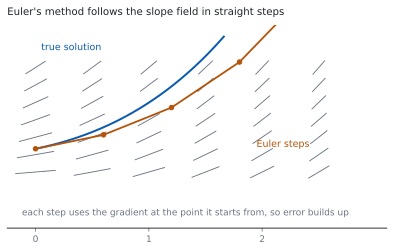
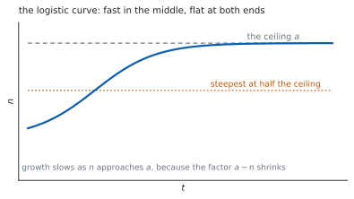

# HL 5.18a — Euler's method and separation of variables（Euler 法と変数分離） {#sec-aahl-5-18a}

::: {.callout-note}
## What you should be able to do
- **$1$ 階微分方程式**（first order differential equation）の解が何かを言える。
- **傾きの場**（slope field）を読める。
- **Euler 法**の式を使って、数値解を求められる。
- 計算を**表**にして進められる。
- **変数分離**（variables separable）で解ける。
- 初期条件から**特殊解**（particular solution）を求められる。
- **ロジスティック方程式**を、部分分数を使って解ける（[HL 1.11](../01-number-and-algebra/aahl-1-11.qmd)）。
:::

## The idea

### 1. First order differential equations（$1$ 階微分方程式） {#first-order}

シラバスは、こう書いています。

> First order differential equations.

$\dfrac{\mathrm{d}y}{\mathrm{d}x}$ を含む方程式です。**$1$ 階**というのは、$2$ 階以上の導関数が出てこないという意味です。

**解は、数ではなく関数**です。$\dfrac{\mathrm{d}y}{\mathrm{d}x} = 2x$ の解は $y = x^{2}+C$ で、$C$ の数だけ解があります。

- **一般解**（general solution）… $C$ を含む形。
- **特殊解**（particular solution）… 初期条件で $C$ を決めた形。

### 2. Slope fields（傾きの場） {#slope-field}

$\dfrac{\mathrm{d}y}{\mathrm{d}x} = f(x,\ y)$ は、**平面の各点で傾きを決めている**と読めます。

{#fig-aahl518a-idea-a width=100%}

点ごとに短い線分をかいたものが**傾きの場**です。解の曲線は、その線分の向きに沿って進みます。

### 3. Euler's method（Euler 法） {#euler}

> Numerical solution of $\dfrac{\mathrm{d}y}{\mathrm{d}x} = f(x, y)$ using Euler's method.

公式集の **5.18** の欄にあります。

> Euler's method

$$
y_{n+1} = y_{n}+h \times f(x_{n},\ y_{n}), \qquad
x_{n+1} = x_{n}+h
$$ {#eq-aahl518a-euler}

シラバスは、刻み幅についてこう書いています。

> $x_{n+1} = x_{n}+h$, where $h$ is a constant.

**いまいる点の傾きで、まっすぐ $h$ だけ進む**という方法です。傾きは進むあいだに変わるので、**誤差が出ます**（[第 1 節](#why-error)）。

### 4. Working in a table（表で計算する） {#table}

手で計算するときは、表にすると落としにくくなります。

| $n$ | $x_{n}$ | $y_{n}$ | $f(x_{n},\ y_{n})$ | $h\,f$ |
|---|---|---|---|---|
| $0$ | $x_{0}$ | $y_{0}$ | 計算する | 計算する |
| $1$ | $x_{0}+h$ | $y_{0}+hf$ | 計算する | 計算する |

: Euler 法の表 {#tbl-aahl518a-table}

**$f$ の欄には、$x_{n}$ と $y_{n}$ の両方を入れます。** $y$ を入れ忘れるのが、いちばん多いまちがいです。

### 5. Separation of variables（変数分離） {#separation}

> Variables separable.

$\dfrac{\mathrm{d}y}{\mathrm{d}x}$ が「$x$ だけの式」$\times$「$y$ だけの式」に分かれるときに使えます。

$$
\frac{\mathrm{d}y}{\mathrm{d}x} = g(x)\,h(y)
\quad \Longrightarrow \quad
\int \frac{1}{h(y)}\,\mathrm{d}y = \int g(x)\,\mathrm{d}x
$$ {#eq-aahl518a-separate}

手順は $4$ つです。

1. $y$ のものを左、$x$ のものを右に**分ける**。
2. 両辺を**積分**する。
3. $C$ を**片側だけ**に書く。
4. できれば $y$ について**解く**。

### 6. The particular solution（初期条件で $C$ を決める） {#particular}

初期条件（$x = 0$ のとき $y = 2$ など）が与えられたら、**積分したすぐあと**に代入して $C$ を求めます。

**$y$ について解いてから代入すると、計算が重くなります。** 先に $C$ を決めるほうが速いです。

### 7. The logistic equation（ロジスティック方程式） {#logistic}

シラバスが例に挙げているのが、この方程式です。

> Example: the logistic equation $\dfrac{\mathrm{d}n}{\mathrm{d}t} = kn(a-n)$, $a$, $k \in \mathbb{R}$
>
> Link to: partial fractions (AHL1.11) and use of partial fractions to rearrange the integrand (AHL5.15).

$$
\frac{\mathrm{d}n}{\mathrm{d}t} = kn(a-n)
$$ {#eq-aahl518a-logistic}

分離すると、左辺に $\dfrac{1}{n(a-n)}$ が出ます。**そのままでは積分できない**ので、部分分数に直します（[HL 5.15](aahl-5-15.qmd#partial)）。

$$
\frac{1}{n(a-n)} = \frac{1}{a}\left(\frac{1}{n}+\frac{1}{a-n}\right)
$$ {#eq-aahl518a-pf}

{#fig-aahl518a-idea-b width=100%}

$n$ が小さいうちは $a-n$ がほぼ $a$ なので、**ほぼ指数増加**です。$n$ が $a$ に近づくと $a-n$ が小さくなり、**増え方が止まります**。

::: {.callout-tip collapse="true"}
## Paper 2 では、電卓で Euler 法と微分方程式が扱えます

TI-Nspire CX II には `deSolve(` があります。`deSolve(y'=x*y and y(0)=2, x, y)` のように、初期条件も一緒に入れられます。

Euler 法は、Lists & Spreadsheet で**列に順に計算する**のが速いです。$1$ 行目に $x_{0}$、$y_{0}$ を入れ、$2$ 行目に @eq-aahl518a-euler の式を入れて下へコピーします。

**答案には、式を書いてください。** Euler 法なら表、変数分離なら分けた行と積分した行を見せます。

**Paper 1 では使えません。** このページの例題と演習は、すべて手で解けるようにしてあります。
:::

## Why it works

::: {.callout-tip collapse="true"}
## クリックすると開きます

#### なぜ Euler 法に誤差が出るのか {#why-error}

@eq-aahl518a-euler は、**接線で近似**しています。

$$
y(x+h) \approx y(x)+h\,y'(x)
$$

本当の解は曲がっているので、まっすぐ進むとずれます。しかも**次の一歩は、ずれた点から始まります**。誤差はたまっていきます（@fig-aahl518a-idea-a）。

$h$ を小さくすると $1$ 歩あたりの誤差は小さくなりますが、**歩数が増えます**。ふつうは、それでも全体の誤差は小さくなります。

#### なぜ、変数分離ができるのか {#why-separate}

$\dfrac{\mathrm{d}y}{\mathrm{d}x} = g(x)h(y)$ の両辺を $h(y)$ で割ります。

$$
\frac{1}{h(y)}\,\frac{\mathrm{d}y}{\mathrm{d}x} = g(x)
$$

両辺を $x$ で積分すると、左辺は置換積分の形です（[HL 5.16](aahl-5-16.qmd#substitution)）。

$$
\int \frac{1}{h(y)}\,\frac{\mathrm{d}y}{\mathrm{d}x}\,\mathrm{d}x
= \int \frac{1}{h(y)}\,\mathrm{d}y
$$

ですから @eq-aahl518a-separate が成り立ちます。**$\mathrm{d}y$ と $\mathrm{d}x$ を分数のように動かしてよい**のは、この置換積分のおかげです。

#### なぜ、$C$ は片側だけでよいのか {#why-onec}

両辺に $C_{1}$、$C_{2}$ と付けても、移項すれば $C_{2}-C_{1}$ という $1$ つの定数にまとまります。

**$2$ つ書く意味がありません。** ふつうは右辺に $1$ つだけ書きます。

$\ln$ が出るときは、$C$ を $\ln A$ と置きなおすと式がきれいになることがあります。**どちらでも正解**です。

#### なぜ、ロジスティック曲線は S 字になるのか {#why-logistic}

@eq-aahl518a-logistic の右辺は、$n$ の $2$ 次式です。$n = 0$ と $n = a$ で $0$、$n = \dfrac{a}{2}$ で最大になります。

つまり**増え方が最大になるのは、上限のちょうど半分のとき**です。そこが S 字の変曲点です（@fig-aahl518a-idea-b）。

$n$ が小さいときは $\dfrac{\mathrm{d}n}{\mathrm{d}t} \approx kan$ で指数増加、$n \to a$ では $\dfrac{\mathrm{d}n}{\mathrm{d}t} \to 0$ で頭打ちです。
:::

## Worked examples

::: {.callout-note appearance="simple"}
問題文は英語です。意味が理解できなかったら、問題文の下の「**日本語訳**」を開いてください。解説は日本語です。

**例題も演習も、すべて電卓なしで解けます。** Paper 1 のつもりで解いてください。
:::

::: {#exm-aahl518a-euler}
[Use Euler's method with step length $h = 0.1$ to estimate $y$ at $x = 0.3$ for $\dfrac{\mathrm{d}y}{\mathrm{d}x} = x+y$ with $y = 1$ when $x = 0$.]{.q-en}

日本語訳

$\dfrac{\mathrm{d}y}{\mathrm{d}x} = x+y$、$x = 0$ のとき $y = 1$ について、刻み幅 $h = 0.1$ の Euler 法で $x = 0.3$ における $y$ を見積もりなさい。

---

@eq-aahl518a-euler を $3$ 回使います。表にします（@tbl-aahl518a-table）。

$$
y_{1} = 1+0.1(0+1) = 1.1
$$

$$
y_{2} = 1.1+0.1(0.1+1.1) = 1.1+0.12 = 1.22
$$

$$
y_{3} = 1.22+0.1(0.2+1.22) = 1.22+0.142 = 1.362
$$

$x = 0.3$ のとき $y \approx 1.362$ です。

**検算。** **$y$ は増え続けています。** $f = x+y > 0$ なので、増加で正しい ✓

**検算（刻みの数）。** $\dfrac{0.3-0}{0.1} = 3$ 歩 ✓ ちょうど $3$ 回使いました。

::: {.callout-note}
## 解答例（答案用紙に書くこと）

$$y_{1} = 1+0.1(0+1) = 1.1$$

$$y_{2} = 1.1+0.1(0.1+1.1) = 1.22$$

$$y_{3} = 1.22+0.1(0.2+1.22) = 1.362$$

*So* $y \approx 1.362$ *when* $x = 0.3$.
:::
:::

::: {#exm-aahl518a-separate}
[Solve $\dfrac{\mathrm{d}y}{\mathrm{d}x} = xy$ given that $y = 2$ when $x = 0$.]{.q-en}

日本語訳

$x = 0$ のとき $y = 2$ という条件のもとで $\dfrac{\mathrm{d}y}{\mathrm{d}x} = xy$ を解きなさい。

---

**分けます**（@eq-aahl518a-separate）。

$$
\frac{1}{y}\,\mathrm{d}y = x\,\mathrm{d}x
$$

両辺を積分します。

$$
\ln\lvert y \rvert = \frac{x^{2}}{2}+C
$$

**ここで初期条件を入れます**（[第 6 節](#particular)）。$x = 0$、$y = 2$ で

$$
\ln 2 = 0+C, \qquad C = \ln 2
$$

$$
\ln\lvert y \rvert = \frac{x^{2}}{2}+\ln 2, \qquad
y = 2e^{x^{2}/2}
$$

**検算。** **微分してもどします。** $y' = 2e^{x^{2}/2}\times x = xy$ ✓

**検算（初期条件）。** $x = 0$ で $y = 2e^{0} = 2$ ✓

::: {.callout-note}
## 解答例（答案用紙に書くこと）

$$\int \frac{1}{y}\,\mathrm{d}y = \int x\,\mathrm{d}x, \qquad
\ln\lvert y \rvert = \frac{x^{2}}{2}+C$$

*When* $x = 0$, $y = 2$: $\ \ln 2 = C$.

$$y = 2e^{x^{2}/2}$$
:::
:::

::: {#exm-aahl518a-square}
[Solve $\dfrac{\mathrm{d}y}{\mathrm{d}x} = 2xy^{2}$ given that $y = 1$ when $x = 0$.]{.q-en}

日本語訳

$x = 0$ のとき $y = 1$ という条件のもとで $\dfrac{\mathrm{d}y}{\mathrm{d}x} = 2xy^{2}$ を解きなさい。

---

$$
\frac{1}{y^{2}}\,\mathrm{d}y = 2x\,\mathrm{d}x
$$

$$
-\frac{1}{y} = x^{2}+C
$$

$x = 0$、$y = 1$ を入れると $-1 = C$ です。

$$
-\frac{1}{y} = x^{2}-1, \qquad
y = \frac{1}{1-x^{2}}
$$

**検算。** **微分してもどします。** $y' = \dfrac{2x}{\left(1-x^{2}\right)^{2}} = 2xy^{2}$ ✓

**検算（初期条件）。** $x = 0$ で $y = 1$ ✓

::: {.callout-note}
## 解答例（答案用紙に書くこと）

$$\int y^{-2}\,\mathrm{d}y = \int 2x\,\mathrm{d}x, \qquad
-\frac{1}{y} = x^{2}+C$$

*When* $x = 0$, $y = 1$: $\ -1 = C$.

$$y = \frac{1}{1-x^{2}}$$
:::
:::

::: {#exm-aahl518a-logistic}
[A population $N$ satisfies $\dfrac{\mathrm{d}N}{\mathrm{d}t} = 0.1N(100-N)$, with $N = 10$ when $t = 0$. Find $N$ in terms of $t$.]{.q-en}

日本語訳

ある個体数 $N$ が $\dfrac{\mathrm{d}N}{\mathrm{d}t} = 0.1N(100-N)$ を満たし、$t = 0$ のとき $N = 10$ です。$N$ を $t$ の式で表しなさい。

---

**分けます。**

$$
\frac{1}{N(100-N)}\,\mathrm{d}N = 0.1\,\mathrm{d}t
$$

左辺を部分分数に直します（@eq-aahl518a-pf、$a = 100$）。

$$
\frac{1}{N(100-N)} = \frac{1}{100}\left(\frac{1}{N}+\frac{1}{100-N}\right)
$$

積分します。

$$
\frac{1}{100}\left(\ln N-\ln(100-N)\right) = 0.1t+C
$$

$$
\ln\left(\frac{N}{100-N}\right) = 10t+C'
$$

$t = 0$、$N = 10$ を入れると $\ln\dfrac{10}{90} = C'$、つまり $C' = \ln\dfrac{1}{9}$ です。

$$
\frac{N}{100-N} = \frac{1}{9}e^{10t}, \qquad
N = \frac{100}{1+9e^{-10t}}
$$

**検算（$t = 0$）。** $N = \dfrac{100}{1+9} = 10$ ✓

**検算（$t \to \infty$）。** $e^{-10t} \to 0$ なので $N \to 100$ ✓ **上限に近づきます。**

::: {.callout-note}
## 解答例（答案用紙に書くこと）

$$\frac{1}{N(100-N)} = \frac{1}{100}\left(\frac{1}{N}+\frac{1}{100-N}\right)$$

$$\frac{1}{100}\ln\left(\frac{N}{100-N}\right) = 0.1t+C$$

*When* $t = 0$, $N = 10$: $\ C = \dfrac{1}{100}\ln\dfrac{1}{9}$.

$$N = \frac{100}{1+9e^{-10t}}$$
:::

::: {.model-answer}
**試験ではこう書く**

*The equation is separable, so divide by* $N(100-N)$ *and multiply by* $\mathrm{d}t$:

$$\int \frac{1}{N(100-N)}\,\mathrm{d}N = \int 0.1\,\mathrm{d}t$$

*The left integrand is rewritten in partial fractions. Writing* $\dfrac{1}{N(100-N)} = \dfrac{A}{N}+\dfrac{B}{100-N}$ *and clearing denominators gives* $1 = A(100-N)+BN$; *putting* $N = 0$ *gives* $A = \dfrac{1}{100}$ *and putting* $N = 100$ *gives* $B = \dfrac{1}{100}$. *Hence*

$$\frac{1}{100}\int\left(\frac{1}{N}+\frac{1}{100-N}\right)\mathrm{d}N = \int 0.1\,\mathrm{d}t$$

*Integrating, and noting that the second term gives* $-\ln(100-N)$ *because of the inner derivative* $-1$,

$$\frac{1}{100}\left(\ln N-\ln(100-N)\right) = 0.1t+C$$

*Multiplying by* $100$ *and combining the logarithms,* $\ln\left(\dfrac{N}{100-N}\right) = 10t+C'$. *The initial condition* $N = 10$ *at* $t = 0$ *gives* $C' = \ln\dfrac{10}{90} = \ln\dfrac{1}{9}$.

*Taking exponentials,* $\dfrac{N}{100-N} = \dfrac{1}{9}e^{10t}$, *and solving for* $N$ *gives*

$$N = \frac{100}{1+9e^{-10t}}$$

*Both checks hold:* $N = 10$ *at* $t = 0$, *and* $N \to 100$ *as* $t \to \infty$, *which is the ceiling predicted by the factor* $100-N$.
:::
:::

## Common errors

::: {.callout-warning}
## Euler 法で、$f$ に $y$ を入れ忘れる
$f(x_{n},\ y_{n})$ には、**その時点の $y$ も入ります**（@eq-aahl518a-euler）。

$x$ だけ入れると、ただの積分になってしまいます。**表の $f$ の欄を、毎回きちんと**（@tbl-aahl518a-table）。
:::

::: {.callout-warning}
## Euler 法で、$h$ をかけ忘れる
$y_{n+1} = y_{n}+h\,f$ です。$f$ をそのまま足してはいけません。

**「傾き $\times$ 進んだ量」**が、$y$ の増分です。
:::

::: {.callout-warning}
## 分けきる前に積分する
$\dfrac{\mathrm{d}y}{\mathrm{d}x} = x+y$ は**分けられません**。和の形だからです（[第 5 節](#separation)）。

分けられるのは**積の形**のときだけです。分けられないものは、AHL 5.18b の方法で解きます。
:::

::: {.callout-warning}
## $C$ を最後まで付けない
積分したその行で $C$ を書きます。あとから足すと、**$\ln$ の中や指数の肩に入れそこねます**。

$\ln\lvert y \rvert = x+C$ から $y = e^{x+C} = Ae^{x}$ です。$y = e^{x}+C$ ではありません。
:::

::: {.callout-warning}
## ロジスティック方程式を部分分数にせずに積分する
$\dfrac{1}{n(a-n)}$ は、そのままでは積分できません（[第 7 節](#logistic)）。

**$2$ つに分けてから**積分します（@eq-aahl518a-pf）。
:::

::: {.callout-warning}
## $\ln(a-n)$ の符号を落とす
$\displaystyle\int \frac{1}{a-n}\,\mathrm{d}n = -\ln\lvert a-n \rvert+C$ です。

中身の微分が $-1$ なので、**マイナスが付きます**。ここを落とすと、答えの形がまったく変わります。
:::

## Exercises

::: {.callout-note appearance="simple"}
各問題に、折りたたみが $3$ つ付いています。**日本語訳**、**解答例**（答案用紙に書くべきこと。英語です）、**解説**（なぜそうなるか。日本語です）。

まず自分で解いて、次に解答例と見くらべてください。**解説は、合わなかったときだけ開けば十分です。**
:::

::: {.exercise-block}

[1]{.ex-no} [Use Euler's method with $h = 0.2$ to estimate $y$ at $x = 0.4$ for $\dfrac{\mathrm{d}y}{\mathrm{d}x} = x+y$ with $y = 1$ when $x = 0$.]{.q-en}

日本語訳

$\dfrac{\mathrm{d}y}{\mathrm{d}x} = x+y$、$x = 0$ のとき $y = 1$ について、$h = 0.2$ の Euler 法で $x = 0.4$ における $y$ を見積もりなさい。

::: {.callout-note collapse="true"}
## 解答例（答案用紙に書くこと）

$$y_{1} = 1+0.2(0+1) = 1.2$$

$$y_{2} = 1.2+0.2(0.2+1.2) = 1.2+0.28 = 1.48$$

*So* $y \approx 1.48$ *when* $x = 0.4$.
:::

::: {.callout-tip collapse="true"}
## 解説

$2$ 歩で着きます。**$h$ が大きいぶん、誤差も大きく**なります。

**検算（歩数）。** $\dfrac{0.4}{0.2} = 2$ ✓

**検算（$h$ を小さくすると）。** 例題 $1$ の $h = 0.1$ では $x = 0.3$ で $1.362$ ✓ こまかく刻むほど本当の解に近づきます。
:::

::: {.ex-sep}
:::

[2]{.ex-no} [Use Euler's method with $h = 0.1$ to estimate $y$ at $x = 0.2$ for $\dfrac{\mathrm{d}y}{\mathrm{d}x} = y-x$ with $y = 2$ when $x = 0$.]{.q-en}

日本語訳

$\dfrac{\mathrm{d}y}{\mathrm{d}x} = y-x$、$x = 0$ のとき $y = 2$ について、$h = 0.1$ の Euler 法で $x = 0.2$ における $y$ を見積もりなさい。

::: {.callout-note collapse="true"}
## 解答例（答案用紙に書くこと）

$$y_{1} = 2+0.1(2-0) = 2.2$$

$$y_{2} = 2.2+0.1(2.2-0.1) = 2.2+0.21 = 2.41$$

*So* $y \approx 2.41$ *when* $x = 0.2$.
:::

::: {.callout-tip collapse="true"}
## 解説

$f = y-x$ なので、**引く順番**に気をつけてください。

**検算（増加）。** $y > x$ のあいだは $f > 0$ で増加 ✓

**検算（$2$ 歩目の $x$）。** $x_{1} = 0.1$ を使いました ✓ $x_{0} = 0$ ではありません。
:::

::: {.ex-sep}
:::

[3]{.ex-no} [Solve $\dfrac{\mathrm{d}y}{\mathrm{d}x} = 3x^{2}y$ given that $y = 1$ when $x = 0$.]{.q-en}

日本語訳

$x = 0$ のとき $y = 1$ という条件のもとで $\dfrac{\mathrm{d}y}{\mathrm{d}x} = 3x^{2}y$ を解きなさい。

::: {.callout-note collapse="true"}
## 解答例（答案用紙に書くこと）

$$\int \frac{1}{y}\,\mathrm{d}y = \int 3x^{2}\,\mathrm{d}x, \qquad
\ln\lvert y \rvert = x^{3}+C$$

*When* $x = 0$, $y = 1$: $\ C = 0$.

$$y = e^{x^{3}}$$
:::

::: {.callout-tip collapse="true"}
## 解説

$\ln 1 = 0$ なので $C = 0$ です。**きれいな形になります。**

**検算。** 微分すると $e^{x^{3}}\times 3x^{2} = 3x^{2}y$ ✓

**検算（初期条件）。** $x = 0$ で $e^{0} = 1$ ✓
:::

::: {.ex-sep}
:::

[4]{.ex-no} [Solve $\dfrac{\mathrm{d}y}{\mathrm{d}x} = \dfrac{y}{x}$ for $x > 0$, given that $y = 2$ when $x = 1$.]{.q-en}

日本語訳

$x > 0$ で、$x = 1$ のとき $y = 2$ という条件のもとで $\dfrac{\mathrm{d}y}{\mathrm{d}x} = \dfrac{y}{x}$ を解きなさい。

::: {.callout-note collapse="true"}
## 解答例（答案用紙に書くこと）

$$\int \frac{1}{y}\,\mathrm{d}y = \int \frac{1}{x}\,\mathrm{d}x, \qquad
\ln\lvert y \rvert = \ln x+C$$

*When* $x = 1$, $y = 2$: $\ C = \ln 2$.

$$y = 2x$$
:::

::: {.callout-tip collapse="true"}
## 解説

$\ln y = \ln x+\ln 2 = \ln 2x$ なので $y = 2x$ です。**対数の法則でまとめる**と早いです。

**検算。** $y' = 2$、$\dfrac{y}{x} = \dfrac{2x}{x} = 2$ ✓

**検算（初期条件）。** $x = 1$ で $y = 2$ ✓
:::

::: {.ex-sep}
:::

[5]{.ex-no} [Solve $\dfrac{\mathrm{d}y}{\mathrm{d}x} = 1+y^{2}$ given that $y = 0$ when $x = 0$.]{.q-en}

日本語訳

$x = 0$ のとき $y = 0$ という条件のもとで $\dfrac{\mathrm{d}y}{\mathrm{d}x} = 1+y^{2}$ を解きなさい。

::: {.callout-note collapse="true"}
## 解答例（答案用紙に書くこと）

$$\int \frac{1}{1+y^{2}}\,\mathrm{d}y = \int 1\,\mathrm{d}x, \qquad
\arctan y = x+C$$

*When* $x = 0$, $y = 0$: $\ C = 0$.

$$y = \tan x$$
:::

::: {.callout-tip collapse="true"}
## 解説

左辺の積分が $\arctan$ です（[HL 5.15](aahl-5-15.qmd#integrals)）。右辺は $x$ だけなので $x+C$ です。

**検算。** $y' = \sec^{2}x = 1+\tan^{2}x = 1+y^{2}$ ✓

**検算（範囲）。** $\tan x$ は $x = \dfrac{\pi}{2}$ で定義されません ✓ 解が使えるのは $-\dfrac{\pi}{2} < x < \dfrac{\pi}{2}$ です。
:::

::: {.ex-sep}
:::

[6]{.ex-no} [Solve $\dfrac{\mathrm{d}y}{\mathrm{d}x} = e^{x-y}$ given that $y = 0$ when $x = 0$.]{.q-en}

日本語訳

$x = 0$ のとき $y = 0$ という条件のもとで $\dfrac{\mathrm{d}y}{\mathrm{d}x} = e^{x-y}$ を解きなさい。

::: {.callout-note collapse="true"}
## 解答例（答案用紙に書くこと）

$$e^{x-y} = \frac{e^{x}}{e^{y}}, \qquad
\int e^{y}\,\mathrm{d}y = \int e^{x}\,\mathrm{d}x$$

$$e^{y} = e^{x}+C$$

*When* $x = 0$, $y = 0$: $\ 1 = 1+C$, *so* $C = 0$ *and* $y = x$.
:::

::: {.callout-tip collapse="true"}
## 解説

**指数法則で分けます。** $e^{x-y} = e^{x}e^{-y}$ なので、$x$ の部分と $y$ の部分に分かれます。

**検算。** $y = x$ なら $y' = 1$、$e^{x-y} = e^{0} = 1$ ✓

**検算（初期条件）。** $x = 0$ で $y = 0$ ✓
:::

::: {.ex-sep}
:::

[7]{.ex-no} [Find the general solution of $\dfrac{\mathrm{d}y}{\mathrm{d}x} = \dfrac{x}{y}$.]{.q-en}

日本語訳

$\dfrac{\mathrm{d}y}{\mathrm{d}x} = \dfrac{x}{y}$ の一般解を求めなさい。

::: {.callout-note collapse="true"}
## 解答例（答案用紙に書くこと）

$$\int y\,\mathrm{d}y = \int x\,\mathrm{d}x, \qquad
\frac{y^{2}}{2} = \frac{x^{2}}{2}+C$$

$$y^{2} = x^{2}+A \qquad (A = 2C)$$
:::

::: {.callout-tip collapse="true"}
## 解説

**初期条件がないので、$C$ が残ります。** これが一般解です（[第 1 節](#first-order)）。

$2$ をかけて $A = 2C$ と置きなおすと、式がきれいになります。**定数の置きなおしは自由**です。

**検算。** 両辺を $x$ で微分すると $2y\dfrac{\mathrm{d}y}{\mathrm{d}x} = 2x$ ✓

**検算（図形）。** $A > 0$ なら双曲線、$A = 0$ なら $y = \pm x$ ✓ 曲線の族です。
:::

::: {.ex-sep}
:::

[8]{.ex-no} [Solve $\dfrac{\mathrm{d}y}{\mathrm{d}x} = y(1-y)$ given that $y = \dfrac{1}{2}$ when $x = 0$.]{.q-en}

日本語訳

$x = 0$ のとき $y = \dfrac{1}{2}$ という条件のもとで $\dfrac{\mathrm{d}y}{\mathrm{d}x} = y(1-y)$ を解きなさい。

::: {.callout-note collapse="true"}
## 解答例（答案用紙に書くこと）

$$\frac{1}{y(1-y)} = \frac{1}{y}+\frac{1}{1-y}$$

$$\ln y-\ln(1-y) = x+C, \qquad
\ln\left(\frac{y}{1-y}\right) = x+C$$

*When* $x = 0$, $y = \dfrac{1}{2}$: $\ \ln 1 = C$, *so* $C = 0$.

$$\frac{y}{1-y} = e^{x}, \qquad y = \frac{1}{1+e^{-x}}$$
:::

::: {.callout-tip collapse="true"}
## 解説

$a = 1$、$k = 1$ のロジスティック方程式です（@eq-aahl518a-logistic）。部分分数が要ります。

$\dfrac{y}{1-y} = e^{x}$ から $y$ を解くときは、**両辺に $1-y$ をかけて**整理します。

**検算（$x = 0$）。** $y = \dfrac{1}{2}$ ✓

**検算（$x \to \infty$）。** $y \to 1$ ✓ 上限 $a = 1$ に近づきます。

::: {.model-answer}
**試験ではこう書く**

*The equation is separable with* $\dfrac{\mathrm{d}y}{\mathrm{d}x} = y(1-y)$, *so*

$$\int \frac{1}{y(1-y)}\,\mathrm{d}y = \int 1\,\mathrm{d}x$$

*The integrand on the left is rewritten in partial fractions. Writing* $\dfrac{1}{y(1-y)} = \dfrac{A}{y}+\dfrac{B}{1-y}$ *gives* $1 = A(1-y)+By$; *putting* $y = 0$ *gives* $A = 1$ *and putting* $y = 1$ *gives* $B = 1$. *Hence*

$$\int\left(\frac{1}{y}+\frac{1}{1-y}\right)\mathrm{d}y = \int 1\,\mathrm{d}x$$

*Integrating, and remembering that the inner derivative of* $1-y$ *is* $-1$,

$$\ln\lvert y \rvert-\ln\lvert 1-y \rvert = x+C,
\qquad \ln\left(\frac{y}{1-y}\right) = x+C$$

*The initial condition* $y = \dfrac{1}{2}$ *at* $x = 0$ *gives* $\ln 1 = C$, *so* $C = 0$.

*Taking exponentials,* $\dfrac{y}{1-y} = e^{x}$. *Multiplying up gives* $y = e^{x}-ye^{x}$, *so* $y\left(1+e^{x}\right) = e^{x}$ *and*

$$y = \frac{e^{x}}{1+e^{x}} = \frac{1}{1+e^{-x}}$$

*As* $x \to \infty$ *this tends to* $1$, *the value that makes the factor* $1-y$ *vanish, which is the ceiling of the logistic model.*
:::
:::

::: {.ex-sep}
:::

[9]{.ex-no} [Explain why Euler's method gives only an approximation, and describe what happens to the estimate as the step length is reduced.]{.q-en}

日本語訳

Euler 法が近似しか与えない理由を説明し、刻み幅を小さくしたときに見積もりがどうなるかを述べなさい。

::: {.callout-note collapse="true"}
## 解答例（答案用紙に書くこと）

*Each step replaces the curve by its tangent at the starting point of that step. The gradient changes along the step, so the estimate leaves the true solution.*

*Every later step starts from a point that is already wrong, so the errors accumulate.*

*Reducing* $h$ *makes each step shorter, so the tangent is a better approximation over that step, and the estimate generally becomes closer to the true value, at the cost of more steps.*
:::

::: {.callout-tip collapse="true"}
## 解説

**接線で近似している**ことが、誤差のもとです（[第 1 節](#why-error)）。

@fig-aahl518a-idea-a では、Euler の折れ線が本当の解より下にずれています。曲線が上に凸だからです。

**検算（例題 $1$ と演習 $1$）。** $h$ を $0.2$ から $0.1$ にすると、真の値に近づきます ✓

**検算（歩数）。** $h$ を半分にすると歩数は $2$ 倍 ✓ 手計算の手間は増えます。

::: {.model-answer}
**試験ではこう書く**

*Euler's method uses the formula* $y_{n+1} = y_{n}+h\,f(x_{n},\ y_{n})$, *which is the equation of the tangent to the solution curve at the point* $(x_{n},\ y_{n})$, *evaluated a distance* $h$ *further along. The true solution is generally curved, so over the whole step the gradient is not constant, and the straight-line step ends at a point slightly off the true curve.*

*The error is not merely repeated but compounded: the next step starts from the point just reached, which is already inaccurate, and computes its gradient there rather than on the true solution. Successive steps therefore drift further from the exact curve, which is why the gap in the diagram widens from left to right.*

*Reducing the step length* $h$ *shortens each straight segment, over which the tangent is a better model of the curve, so each individual error is smaller. In general the estimate converges towards the true value as* $h$ *decreases. The cost is that reaching the same final value of* $x$ *requires more steps: halving* $h$ *doubles the number of calculations.*
:::
:::

::: {.ex-sep}
:::

[10]{.ex-no} [A student tries to solve $\dfrac{\mathrm{d}y}{\mathrm{d}x} = x+y$ by writing $\displaystyle\int 1\,\mathrm{d}y = \int (x+y)\,\mathrm{d}x$. Identify the error and state what method should be used instead.]{.q-en}

日本語訳

ある生徒が $\dfrac{\mathrm{d}y}{\mathrm{d}x} = x+y$ を $\displaystyle\int 1\,\mathrm{d}y = \int (x+y)\,\mathrm{d}x$ と書いて解こうとしました。まちがいを指摘し、代わりに使うべき方法を述べなさい。

::: {.callout-note collapse="true"}
## 解答例（答案用紙に書くこと）

*Separation of variables requires the right-hand side to be a product of a function of* $x$ *and a function of* $y$. *Here it is a sum, so the variables cannot be separated.*

*The right-hand integral still contains* $y$, *which is an unknown function of* $x$, *so it cannot be evaluated.*

*This equation is linear and is solved with an integrating factor.*
:::

::: {.callout-tip collapse="true"}
## 解説

**和は分けられません**（[第 5 節](#separation)）。分けられるのは積の形だけです。

$\displaystyle\int y\,\mathrm{d}x$ は、$y$ が分からないので計算できません。**式が進みません。**

**検算（積の形なら）。** $\dfrac{\mathrm{d}y}{\mathrm{d}x} = xy$ は分けられます ✓ 例題 $2$ がそれです。

**検算（この式の解法）。** $y'-y = x$ と書けます ✓ AHL 5.18b の積分因子で解きます。

::: {.model-answer}
**試験ではこう書く**

*Separation of variables applies to equations of the form* $\dfrac{\mathrm{d}y}{\mathrm{d}x} = g(x)h(y)$, *where the right-hand side factorises into a part depending only on* $x$ *and a part depending only on* $y$. *Only then can all the* $y$ *terms be collected on one side and all the* $x$ *terms on the other.*

*Here the right-hand side is* $x+y$, *a sum rather than a product. There is no way to write it as* $g(x)h(y)$, *so the variables cannot be separated. The student's line leaves a* $y$ *inside the integral* $\displaystyle\int (x+y)\,\mathrm{d}x$, *and since* $y$ *is the unknown function of* $x$ *that is being sought, this integral cannot be evaluated. The method stops before it starts.*

*The equation can, however, be written as* $\dfrac{\mathrm{d}y}{\mathrm{d}x}-y = x$, *which has the form* $y'+P(x)y = Q(x)$ *with* $P(x) = -1$ *and* $Q(x) = x$. *This is a linear first order equation and is solved using an integrating factor.*

*A numerical estimate is also available: Euler's method works whatever the form of* $f(x,\ y)$, *which is exactly why it is useful for equations that cannot be separated.*
:::
:::

:::
