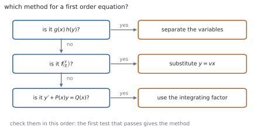
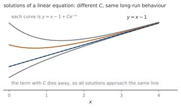

# HL 5.18b — Homogeneous equations and the integrating factor（同次形と積分因子） {#sec-aahl-5-18b}

::: {.callout-note}
## What you should be able to do
- 変数分離が使えない式を見分けられる。
- **同次形**（homogeneous）$\dfrac{\mathrm{d}y}{\mathrm{d}x} = f\!\left(\dfrac{y}{x}\right)$ に気づける。
- **$y = vx$** と置いて、変数分離できる形に直せる。
- **$1$ 次の微分方程式** $y'+P(x)y = Q(x)$ を見分けられる。
- **積分因子**（integrating factor）$e^{\int P\,\mathrm{d}x}$ を求められる。
- 積分因子をかけて、左辺を $1$ つの導関数にまとめられる。
:::

## The idea

### 1. When separation fails（変数分離が使えないとき） {#fails}

$\dfrac{\mathrm{d}y}{\mathrm{d}x} = x+y$ は、右辺が**和**なので分けられません（[HL 5.18a](aahl-5-18a.qmd#separation)）。

そういう式のために、$2$ つの方法が用意されています。

{#fig-aahl518b-idea-a width=100%}

**上から順に試す**のが確実です。変数分離がいちばん軽く、積分因子がいちばん重い計算になります。

### 2. Homogeneous equations（同次形） {#homogeneous}

シラバスは、こう書いています。

> Homogeneous differential equation $\dfrac{\mathrm{d}y}{\mathrm{d}x} = f\!\left(\dfrac{y}{x}\right)$ using the substitution $y = vx$.

右辺が **$\dfrac{y}{x}$ だけの式**で書けるとき、同次形といいます。

$$
\frac{\mathrm{d}y}{\mathrm{d}x} = \frac{x+y}{x} = 1+\frac{y}{x}
$$

これは $f(u) = 1+u$ の形です。**分母・分子を $x$ で割って確かめる**のが手です。

### 3. The substitution $y = vx$（$y = vx$ と置く） {#substitution}

$v$ も $x$ の関数なので、**積の微分公式**を使います。

$$
y = vx \quad \Longrightarrow \quad
\frac{\mathrm{d}y}{\mathrm{d}x} = v+x\,\frac{\mathrm{d}v}{\mathrm{d}x}
$$ {#eq-aahl518b-vx}

**$\dfrac{\mathrm{d}v}{\mathrm{d}x}$ だけにしてはいけません。** $v$ の項が残ります（[第 1 節](#why-vx)）。

### 4. After the substitution（置きかえたあと） {#after}

@eq-aahl518b-vx を入れると

$$
v+x\,\frac{\mathrm{d}v}{\mathrm{d}x} = f(v)
\quad \Longrightarrow \quad
x\,\frac{\mathrm{d}v}{\mathrm{d}x} = f(v)-v
$$ {#eq-aahl518b-separable}

となり、**$x$ と $v$ に分けられます**。

$$
\int \frac{1}{f(v)-v}\,\mathrm{d}v = \int \frac{1}{x}\,\mathrm{d}x
$$

解いたら、最後に **$v = \dfrac{y}{x}$ をもどします**。

### 5. Linear equations（$1$ 次の微分方程式） {#linear}

> Solution of $y' + P(x)y = Q(x)$, using the integrating factor.

$y$ と $y'$ が**それぞれ $1$ 次**で、かけ算されていない形です。

$$
\frac{\mathrm{d}y}{\mathrm{d}x}+P(x)\,y = Q(x)
$$ {#eq-aahl518b-linear}

::: {.callout-important}
## まず、この形に直します
$x\dfrac{\mathrm{d}y}{\mathrm{d}x}+y = x^{2}$ のように $\dfrac{\mathrm{d}y}{\mathrm{d}x}$ に係数が付いていたら、**先に割って**ください。

$$
\frac{\mathrm{d}y}{\mathrm{d}x}+\frac{1}{x}y = x
$$

割る前に $P$ を読むと、まったくちがう積分因子が出てしまいます。
:::

### 6. The integrating factor（積分因子） {#factor}

公式集の **5.18** の欄にあります。

> Integrating factor for $y'+P(x)y = Q(x)$

$$
I = e^{\int P(x)\,\mathrm{d}x}
$$ {#eq-aahl518b-factor}

両辺に $I$ をかけると、**左辺が $1$ つの導関数にまとまります**（[第 2 節](#why-factor)）。

$$
\frac{\mathrm{d}}{\mathrm{d}x}\left(I\,y\right) = I\,Q(x)
$$ {#eq-aahl518b-collapse}

あとは両辺を積分するだけです。

{#fig-aahl518b-idea-b width=100%}

**$I$ を求めるときの積分定数は要りません。** $1$ つ選べば十分です（[第 3 節](#why-noc)）。

### 7. The procedure（手順のまとめ） {#procedure}

$1$ 次の微分方程式を解く手順です。

1. **$\dfrac{\mathrm{d}y}{\mathrm{d}x}$ の係数を $1$ にする。**
2. $P(x)$ を読み、$I = e^{\int P\,\mathrm{d}x}$ を求める。
3. 両辺に $I$ をかけ、左辺を $\dfrac{\mathrm{d}}{\mathrm{d}x}(Iy)$ と書く。
4. 両辺を積分し、$y$ について解く。

**$3$ のところで $\dfrac{\mathrm{d}}{\mathrm{d}x}(Iy)$ と書けるか**を、毎回確かめてください。書けなければ、どこかがまちがっています。

::: {.callout-tip collapse="true"}
## Paper 2 では、電卓で微分方程式が解けます

TI-Nspire CX II の `deSolve(` は、同次形も $1$ 次の形も扱えます。`deSolve(y'=(x+y)/x and y(1)=0, x, y)` のように入れます。

**答えの形が自分のものとちがう**ことがあります。$C$ の置き方がちがうだけのことが多いので、**初期条件で値を入れてくらべて**ください。

**答案には、式を書いてください。** 同次形なら $y = vx$ と置いた行、$1$ 次なら $I$ を求めた行を見せます。

**Paper 1 では使えません。** このページの例題と演習は、すべて手で解けるようにしてあります。
:::

## Why it works

::: {.callout-tip collapse="true"}
## クリックすると開きます

#### なぜ $y = vx$ で分けられるようになるのか {#why-vx}

同次形の右辺は $\dfrac{y}{x}$ だけの式です。$v = \dfrac{y}{x}$ と置けば、**右辺は $v$ だけの式**になります。

左辺は @eq-aahl518b-vx から $v+x\dfrac{\mathrm{d}v}{\mathrm{d}x}$ です。$v$ を右へ移すと

$$
x\,\frac{\mathrm{d}v}{\mathrm{d}x} = f(v)-v
$$

で、**左は $x$ だけ、右は $v$ だけ**になりました。これで変数分離が使えます。

**$v$ の項を落とすと、この形になりません。** 積の微分公式をていねいに使ってください。

#### なぜ、$I$ をかけると $1$ つの導関数になるのか {#why-factor}

$Iy$ を微分します。

$$
\frac{\mathrm{d}}{\mathrm{d}x}(Iy) = I\,\frac{\mathrm{d}y}{\mathrm{d}x}+y\,\frac{\mathrm{d}I}{\mathrm{d}x}
$$

いっぽう @eq-aahl518b-linear に $I$ をかけると

$$
I\,\frac{\mathrm{d}y}{\mathrm{d}x}+IP\,y = IQ
$$

です。**この $2$ つが同じになる**ためには $\dfrac{\mathrm{d}I}{\mathrm{d}x} = IP$ が要ります。

これは $I$ についての変数分離形で、解くと $I = e^{\int P\,\mathrm{d}x}$ です。**積分因子は、そう決めたから働く**のです。

#### なぜ、$I$ に積分定数を付けなくてよいのか {#why-noc}

$\int P\,\mathrm{d}x$ に $C$ を付けると、$I$ は $e^{C}$ 倍になります。

$$
\frac{\mathrm{d}}{\mathrm{d}x}\left(e^{C}Iy\right) = e^{C}IQ
$$

**両辺が同じだけ倍される**ので、約分されて消えます。ですから $C = 0$ と選んでかまいません。

同じ理由で、$\ln$ が出たときの絶対値も気にしなくてよいことが多いです。$P = \dfrac{1}{x}$ なら $I = x$ で十分です。

#### なぜ、$C$ の項が消えていくのか {#why-decay}

$y'+y = x$ の解は $y = x-1+Ce^{-x}$ です（@fig-aahl518b-idea-b）。

$e^{-x}$ は $x$ が大きくなると $0$ に近づきます。ですから、**どの解も同じ直線 $y = x-1$ に近づきます**。

$C$ の項は「初期条件のちがい」を表していて、時間がたつと効かなくなります。**物理では過渡項**（transient）と呼ばれます。
:::

## Worked examples

::: {.callout-note appearance="simple"}
問題文は英語です。意味が理解できなかったら、問題文の下の「**日本語訳**」を開いてください。解説は日本語です。

**例題も演習も、すべて電卓なしで解けます。** Paper 1 のつもりで解いてください。
:::

::: {#exm-aahl518b-homog}
[Solve $\dfrac{\mathrm{d}y}{\mathrm{d}x} = \dfrac{x+y}{x}$ for $x > 0$, given that $y = 0$ when $x = 1$.]{.q-en}

日本語訳

$x > 0$ で、$x = 1$ のとき $y = 0$ という条件のもとで $\dfrac{\mathrm{d}y}{\mathrm{d}x} = \dfrac{x+y}{x}$ を解きなさい。

---

**同次形かを確かめます。** 分子・分母を $x$ で割ると $1+\dfrac{y}{x}$ です（[第 2 節](#homogeneous)）。

$y = vx$ と置きます（@eq-aahl518b-vx）。

$$
v+x\,\frac{\mathrm{d}v}{\mathrm{d}x} = 1+v
$$

$$
x\,\frac{\mathrm{d}v}{\mathrm{d}x} = 1
$$

分けて積分します。

$$
\int \mathrm{d}v = \int \frac{1}{x}\,\mathrm{d}x, \qquad
v = \ln x+C
$$

**$v = \dfrac{y}{x}$ をもどします。**

$$
y = x\left(\ln x+C\right)
$$

$x = 1$、$y = 0$ から $0 = 1(0+C)$、つまり $C = 0$ です。

$$
y = x\ln x
$$

**検算。** **微分してもどします。** $y' = \ln x+1$、$\dfrac{x+y}{x} = 1+\ln x$ ✓

**検算（初期条件）。** $x = 1$ で $y = 1 \times 0 = 0$ ✓

::: {.callout-note}
## 解答例（答案用紙に書くこと）

$$\frac{x+y}{x} = 1+\frac{y}{x}$$

*Let* $y = vx$, *so* $\dfrac{\mathrm{d}y}{\mathrm{d}x} = v+x\dfrac{\mathrm{d}v}{\mathrm{d}x}$.

$$v+x\frac{\mathrm{d}v}{\mathrm{d}x} = 1+v
\ \Rightarrow \ x\frac{\mathrm{d}v}{\mathrm{d}x} = 1$$

$$v = \ln x+C, \qquad y = x(\ln x+C)$$

*When* $x = 1$, $y = 0$: $\ C = 0$, *so* $y = x\ln x$.
:::
:::

::: {#exm-aahl518b-homog2}
[Solve $\dfrac{\mathrm{d}y}{\mathrm{d}x} = \dfrac{x^{2}+y^{2}}{xy}$ for $x > 0$, given that $y = 1$ when $x = 1$.]{.q-en}

日本語訳

$x > 0$ で、$x = 1$ のとき $y = 1$ という条件のもとで $\dfrac{\mathrm{d}y}{\mathrm{d}x} = \dfrac{x^{2}+y^{2}}{xy}$ を解きなさい。

---

$x^{2}$ で割ると $\dfrac{1+\left(\frac{y}{x}\right)^{2}}{\frac{y}{x}}$ で、同次形です。

$y = vx$ と置きます。

$$
v+x\,\frac{\mathrm{d}v}{\mathrm{d}x} = \frac{1+v^{2}}{v} = \frac{1}{v}+v
$$

$$
x\,\frac{\mathrm{d}v}{\mathrm{d}x} = \frac{1}{v}
$$

分けます。

$$
\int v\,\mathrm{d}v = \int \frac{1}{x}\,\mathrm{d}x, \qquad
\frac{v^{2}}{2} = \ln x+C
$$

$v = \dfrac{y}{x}$ をもどします。

$$
\frac{y^{2}}{2x^{2}} = \ln x+C, \qquad
y^{2} = 2x^{2}\left(\ln x+C\right)
$$

$x = 1$、$y = 1$ から $1 = 2C$、つまり $C = \dfrac{1}{2}$ です。

$$
y^{2} = x^{2}\left(2\ln x+1\right)
$$

**検算（初期条件）。** $x = 1$ で $y^{2} = 1$ ✓

**検算（微分）。** 両辺を微分すると $2yy' = 2x(2\ln x+1)+2x$。$y' = \dfrac{x(2\ln x+2)}{y}$ で、$\dfrac{x^{2}+y^{2}}{xy} = \dfrac{x^{2}+x^{2}(2\ln x+1)}{xy} = \dfrac{x(2\ln x+2)}{y}$ ✓

::: {.callout-note}
## 解答例（答案用紙に書くこと）

*Let* $y = vx$. *Then*

$$v+x\frac{\mathrm{d}v}{\mathrm{d}x} = \frac{1}{v}+v
\ \Rightarrow \ x\frac{\mathrm{d}v}{\mathrm{d}x} = \frac{1}{v}$$

$$\frac{v^{2}}{2} = \ln x+C, \qquad y^{2} = 2x^{2}(\ln x+C)$$

*When* $x = 1$, $y = 1$: $\ C = \dfrac{1}{2}$, *so* $y^{2} = x^{2}(2\ln x+1)$.
:::
:::

::: {#exm-aahl518b-factor}
[Solve $\dfrac{\mathrm{d}y}{\mathrm{d}x}+2y = e^{-x}$, given that $y = 2$ when $x = 0$.]{.q-en}

日本語訳

$x = 0$ のとき $y = 2$ という条件のもとで $\dfrac{\mathrm{d}y}{\mathrm{d}x}+2y = e^{-x}$ を解きなさい。

---

すでに @eq-aahl518b-linear の形です。$P(x) = 2$、$Q(x) = e^{-x}$ です。

$$
I = e^{\int 2\,\mathrm{d}x} = e^{2x}
$$

両辺に $e^{2x}$ をかけます。

$$
e^{2x}\,\frac{\mathrm{d}y}{\mathrm{d}x}+2e^{2x}y = e^{2x}e^{-x} = e^{x}
$$

左辺は $\dfrac{\mathrm{d}}{\mathrm{d}x}\left(e^{2x}y\right)$ です（@eq-aahl518b-collapse）。

$$
e^{2x}y = \int e^{x}\,\mathrm{d}x = e^{x}+C
$$

$$
y = e^{-x}+Ce^{-2x}
$$

$x = 0$、$y = 2$ から $2 = 1+C$、つまり $C = 1$ です。

$$
y = e^{-x}+e^{-2x}
$$

**検算。** **左辺を作ってみます。** $y' = -e^{-x}-2e^{-2x}$ なので $y'+2y = -e^{-x}-2e^{-2x}+2e^{-x}+2e^{-2x} = e^{-x}$ ✓

**検算（初期条件）。** $x = 0$ で $1+1 = 2$ ✓

::: {.callout-note}
## 解答例（答案用紙に書くこと）

$$I = e^{\int 2\,\mathrm{d}x} = e^{2x}$$

$$\frac{\mathrm{d}}{\mathrm{d}x}\left(e^{2x}y\right) = e^{x}, \qquad
e^{2x}y = e^{x}+C$$

$$y = e^{-x}+Ce^{-2x}$$

*When* $x = 0$, $y = 2$: $\ C = 1$, *so* $y = e^{-x}+e^{-2x}$.
:::
:::

::: {#exm-aahl518b-varP}
[Solve $x\dfrac{\mathrm{d}y}{\mathrm{d}x}+y = x^{3}$ for $x > 0$, given that $y = 1$ when $x = 1$.]{.q-en}

日本語訳

$x > 0$ で、$x = 1$ のとき $y = 1$ という条件のもとで $x\dfrac{\mathrm{d}y}{\mathrm{d}x}+y = x^{3}$ を解きなさい。

---

**まず $\dfrac{\mathrm{d}y}{\mathrm{d}x}$ の係数を $1$ にします**（[第 5 節](#linear)）。$x$ で割ります。

$$
\frac{\mathrm{d}y}{\mathrm{d}x}+\frac{1}{x}y = x^{2}
$$

$P(x) = \dfrac{1}{x}$ なので

$$
I = e^{\int \frac{1}{x}\,\mathrm{d}x} = e^{\ln x} = x
$$

両辺に $x$ をかけます。

$$
\frac{\mathrm{d}}{\mathrm{d}x}\left(xy\right) = x^{3}
$$

$$
xy = \frac{x^{4}}{4}+C, \qquad
y = \frac{x^{3}}{4}+\frac{C}{x}
$$

$x = 1$、$y = 1$ から $1 = \dfrac{1}{4}+C$、つまり $C = \dfrac{3}{4}$ です。

$$
y = \frac{x^{3}}{4}+\frac{3}{4x}
$$

**検算。** **もとの式に入れます。** $y' = \dfrac{3x^{2}}{4}-\dfrac{3}{4x^{2}}$ なので $xy'+y = \dfrac{3x^{3}}{4}-\dfrac{3}{4x}+\dfrac{x^{3}}{4}+\dfrac{3}{4x} = x^{3}$ ✓

**検算（$I$ の働き）。** もとの式の左辺は、そのまま $\dfrac{\mathrm{d}}{\mathrm{d}x}(xy)$ です ✓ $I = x$ が正しいことの裏づけです。

::: {.callout-note}
## 解答例（答案用紙に書くこと）

$$\frac{\mathrm{d}y}{\mathrm{d}x}+\frac{1}{x}y = x^{2}, \qquad
I = e^{\int \frac{1}{x}\,\mathrm{d}x} = x$$

$$\frac{\mathrm{d}}{\mathrm{d}x}\left(xy\right) = x^{3}, \qquad
xy = \frac{x^{4}}{4}+C$$

*When* $x = 1$, $y = 1$: $\ C = \dfrac{3}{4}$.

$$y = \frac{x^{3}}{4}+\frac{3}{4x}$$
:::

::: {.model-answer}
**試験ではこう書く**

*The equation is linear, but the coefficient of* $\dfrac{\mathrm{d}y}{\mathrm{d}x}$ *is not* $1$, *so divide throughout by* $x$, *which is allowed since* $x > 0$:

$$\frac{\mathrm{d}y}{\mathrm{d}x}+\frac{1}{x}y = x^{2}$$

*Now the equation is in the standard form* $y'+P(x)y = Q(x)$ *with* $P(x) = \dfrac{1}{x}$ *and* $Q(x) = x^{2}$. *The integrating factor is*

$$I = e^{\int P(x)\,\mathrm{d}x} = e^{\int \frac{1}{x}\,\mathrm{d}x} = e^{\ln x} = x$$

*No constant of integration is needed here, since any constant multiple of* $I$ *would cancel from both sides.*

*Multiplying the standard form by* $I = x$ *gives* $x\dfrac{\mathrm{d}y}{\mathrm{d}x}+y = x^{3}$, *and the left-hand side is exactly* $\dfrac{\mathrm{d}}{\mathrm{d}x}(xy)$ *by the product rule. Hence*

$$\frac{\mathrm{d}}{\mathrm{d}x}(xy) = x^{3}, \qquad
xy = \frac{x^{4}}{4}+C, \qquad
y = \frac{x^{3}}{4}+\frac{C}{x}$$

*The condition* $y = 1$ *at* $x = 1$ *gives* $1 = \dfrac{1}{4}+C$, *so* $C = \dfrac{3}{4}$ *and*

$$y = \frac{x^{3}}{4}+\frac{3}{4x}$$

*Substituting back into the original equation confirms the answer.*
:::
:::

## Common errors

::: {.callout-warning}
## $y = vx$ を微分するときに $v$ の項を落とす
$\dfrac{\mathrm{d}y}{\mathrm{d}x} = v+x\dfrac{\mathrm{d}v}{\mathrm{d}x}$ です（@eq-aahl518b-vx）。

$x\dfrac{\mathrm{d}v}{\mathrm{d}x}$ だけにすると、式が分けられません（[第 1 節](#why-vx)）。
:::

::: {.callout-warning}
## 最後に $v$ を $\dfrac{y}{x}$ にもどさない
答えは $y$ の式で書きます（[第 4 節](#after)）。

$v$ のままだと、問題に答えたことになりません。**もどす行を、かならず書いてください。**
:::

::: {.callout-warning}
## 標準形に直す前に $P$ を読む
$x\dfrac{\mathrm{d}y}{\mathrm{d}x}+y = x^{3}$ の $P$ は $1$ ではありません。$x$ で割って $\dfrac{1}{x}$ です（[第 5 節](#linear)）。

**係数を $1$ にするのが、いちばん最初**です。
:::

::: {.callout-warning}
## 積分因子に積分定数を付ける
$I$ は $1$ つ選べば十分です（[第 3 節](#why-noc)）。

$C$ を付けても、両辺で約分されて消えます。**式が長くなるだけ**です。
:::

::: {.callout-warning}
## $I$ をかけたのに、右辺にかけ忘れる
@eq-aahl518b-collapse は $\dfrac{\mathrm{d}}{\mathrm{d}x}(Iy) = I\,Q(x)$ です。

**右辺にも $I$ がかかります。** ここを落とすと、答えがまったく変わります。
:::

::: {.callout-warning}
## 同次形でないのに $y = vx$ と置く
右辺が $\dfrac{y}{x}$ だけの式に書けるかを、**先に確かめて**ください（@fig-aahl518b-idea-a）。

書けないなら、$1$ 次の形かどうかを見ます。
:::

## Exercises

::: {.callout-note appearance="simple"}
各問題に、折りたたみが $3$ つ付いています。**日本語訳**、**解答例**（答案用紙に書くべきこと。英語です）、**解説**（なぜそうなるか。日本語です）。

まず自分で解いて、次に解答例と見くらべてください。**解説は、合わなかったときだけ開けば十分です。**
:::

::: {.exercise-block}

[1]{.ex-no} [Show that $\dfrac{\mathrm{d}y}{\mathrm{d}x} = \dfrac{2x+3y}{x}$ is homogeneous by writing the right-hand side as a function of $\dfrac{y}{x}$.]{.q-en}

日本語訳

右辺を $\dfrac{y}{x}$ の関数として書くことで、$\dfrac{\mathrm{d}y}{\mathrm{d}x} = \dfrac{2x+3y}{x}$ が同次形であることを示しなさい。

::: {.callout-note collapse="true"}
## 解答例（答案用紙に書くこと）

$$\frac{2x+3y}{x} = \frac{2x}{x}+\frac{3y}{x} = 2+3\left(\frac{y}{x}\right)$$

*This is a function of* $\dfrac{y}{x}$ *alone, so the equation is homogeneous.*
:::

::: {.callout-tip collapse="true"}
## 解説

**分子・分母を $x$ で割る**のが手です（[第 2 節](#homogeneous)）。

$f(u) = 2+3u$ の形になりました。

**検算（$x$ だけ、$y$ だけが残らないか）。** $2+3\dfrac{y}{x}$ には $x$ も $y$ も単独では出ません ✓

**検算（$f$ の形）。** $u = \dfrac{y}{x}$ とすると $f(u) = 2+3u$ ✓
:::

::: {.ex-sep}
:::

[2]{.ex-no} [Use the substitution $y = vx$ to solve $\dfrac{\mathrm{d}y}{\mathrm{d}x} = \dfrac{y-x}{x}$ for $x > 0$, given that $y = 2$ when $x = 1$.]{.q-en}

日本語訳

$x > 0$ で、$x = 1$ のとき $y = 2$ という条件のもとで、$y = vx$ を使って $\dfrac{\mathrm{d}y}{\mathrm{d}x} = \dfrac{y-x}{x}$ を解きなさい。

::: {.callout-note collapse="true"}
## 解答例（答案用紙に書くこと）

$$\frac{y-x}{x} = \frac{y}{x}-1$$

*Let* $y = vx$:

$$v+x\frac{\mathrm{d}v}{\mathrm{d}x} = v-1
\ \Rightarrow \ x\frac{\mathrm{d}v}{\mathrm{d}x} = -1$$

$$v = -\ln x+C, \qquad y = x(C-\ln x)$$

*When* $x = 1$, $y = 2$: $\ C = 2$, *so* $y = x(2-\ln x)$.
:::

::: {.callout-tip collapse="true"}
## 解説

$v$ が両辺で消えて、$x\dfrac{\mathrm{d}v}{\mathrm{d}x} = -1$ という簡単な式になります。

**符号に気をつけてください。** $-1$ なので $v$ は減ります。

**検算。** $y' = 2-\ln x-1 = 1-\ln x$、$\dfrac{y}{x}-1 = 2-\ln x-1 = 1-\ln x$ ✓

**検算（初期条件）。** $x = 1$ で $y = 1(2-0) = 2$ ✓
:::

::: {.ex-sep}
:::

[3]{.ex-no} [Use the substitution $y = vx$ to solve $\dfrac{\mathrm{d}y}{\mathrm{d}x} = \dfrac{y}{x}+\left(\dfrac{y}{x}\right)^{2}$ for $x > 0$, given that $y = 1$ when $x = 1$.]{.q-en}

日本語訳

$x > 0$ で、$x = 1$ のとき $y = 1$ という条件のもとで、$y = vx$ を使って上の方程式を解きなさい。

::: {.callout-note collapse="true"}
## 解答例（答案用紙に書くこと）

*Let* $y = vx$:

$$v+x\frac{\mathrm{d}v}{\mathrm{d}x} = v+v^{2}
\ \Rightarrow \ x\frac{\mathrm{d}v}{\mathrm{d}x} = v^{2}$$

$$\int v^{-2}\,\mathrm{d}v = \int \frac{1}{x}\,\mathrm{d}x, \qquad
-\frac{1}{v} = \ln x+C$$

*When* $x = 1$, $v = 1$: $\ C = -1$.

$$-\frac{x}{y} = \ln x-1, \qquad y = \frac{x}{1-\ln x}$$
:::

::: {.callout-tip collapse="true"}
## 解説

$v$ が消えて $x\dfrac{\mathrm{d}v}{\mathrm{d}x} = v^{2}$ になります。**$v^{-2}$ の積分**です。

$v = \dfrac{y}{x}$ なので $\dfrac{1}{v} = \dfrac{x}{y}$ です。もどすときに逆数になります。

**検算（初期条件）。** $x = 1$ で $y = \dfrac{1}{1-0} = 1$ ✓

**検算（定義域）。** $\ln x = 1$、つまり $x = e$ で分母が $0$ ✓ そこまでが解の範囲です。
:::

::: {.ex-sep}
:::

[4]{.ex-no} [Find the integrating factor for $\dfrac{\mathrm{d}y}{\mathrm{d}x}+3y = x$.]{.q-en}

日本語訳

$\dfrac{\mathrm{d}y}{\mathrm{d}x}+3y = x$ の積分因子を求めなさい。

::: {.callout-note collapse="true"}
## 解答例（答案用紙に書くこと）

$$P(x) = 3, \qquad I = e^{\int 3\,\mathrm{d}x} = e^{3x}$$
:::

::: {.callout-tip collapse="true"}
## 解説

すでに標準形なので、$P$ をそのまま読めます（@eq-aahl518b-factor）。

**積分定数は付けません**（[第 3 節](#why-noc)）。

**検算。** $\dfrac{\mathrm{d}I}{\mathrm{d}x} = 3e^{3x} = IP$ ✓ 積分因子の条件を満たします。

**検算（左辺）。** $\dfrac{\mathrm{d}}{\mathrm{d}x}\left(e^{3x}y\right) = e^{3x}y'+3e^{3x}y$ ✓ もとの左辺の $e^{3x}$ 倍です。
:::

::: {.ex-sep}
:::

[5]{.ex-no} [Find the integrating factor for $\dfrac{\mathrm{d}y}{\mathrm{d}x}+\dfrac{2}{x}y = x$, where $x > 0$.]{.q-en}

日本語訳

$x > 0$ における $\dfrac{\mathrm{d}y}{\mathrm{d}x}+\dfrac{2}{x}y = x$ の積分因子を求めなさい。

::: {.callout-note collapse="true"}
## 解答例（答案用紙に書くこと）

$$P(x) = \frac{2}{x}, \qquad
I = e^{\int \frac{2}{x}\,\mathrm{d}x} = e^{2\ln x} = x^{2}$$
:::

::: {.callout-tip collapse="true"}
## 解説

$e^{2\ln x} = e^{\ln x^{2}} = x^{2}$ です。**対数の法則で指数を中に入れます。**

**検算。** $\dfrac{\mathrm{d}I}{\mathrm{d}x} = 2x$、$IP = x^{2}\cdot\dfrac{2}{x} = 2x$ ✓

**検算（左辺）。** $\dfrac{\mathrm{d}}{\mathrm{d}x}\left(x^{2}y\right) = x^{2}y'+2xy$ ✓ もとの左辺の $x^{2}$ 倍です。
:::

::: {.ex-sep}
:::

[6]{.ex-no} [Solve $\dfrac{\mathrm{d}y}{\mathrm{d}x}+y = 2$, given that $y = 5$ when $x = 0$.]{.q-en}

日本語訳

$x = 0$ のとき $y = 5$ という条件のもとで $\dfrac{\mathrm{d}y}{\mathrm{d}x}+y = 2$ を解きなさい。

::: {.callout-note collapse="true"}
## 解答例（答案用紙に書くこと）

$$I = e^{x}, \qquad \frac{\mathrm{d}}{\mathrm{d}x}\left(e^{x}y\right) = 2e^{x}$$

$$e^{x}y = 2e^{x}+C, \qquad y = 2+Ce^{-x}$$

*When* $x = 0$, $y = 5$: $\ C = 3$, *so* $y = 2+3e^{-x}$.
:::

::: {.callout-tip collapse="true"}
## 解説

**この式は変数分離でも解けます。** どちらでも正解ですが、積分因子のほうが機械的です。

**検算。** $y' = -3e^{-x}$、$y'+y = -3e^{-x}+2+3e^{-x} = 2$ ✓

**検算（$x \to \infty$）。** $y \to 2$ ✓ $C$ の項が消えます（[第 4 節](#why-decay)）。
:::

::: {.ex-sep}
:::

[7]{.ex-no} [Find the general solution of $\dfrac{\mathrm{d}y}{\mathrm{d}x}+2xy = x$.]{.q-en}

日本語訳

$\dfrac{\mathrm{d}y}{\mathrm{d}x}+2xy = x$ の一般解を求めなさい。

::: {.callout-note collapse="true"}
## 解答例（答案用紙に書くこと）

$$I = e^{\int 2x\,\mathrm{d}x} = e^{x^{2}}$$

$$\frac{\mathrm{d}}{\mathrm{d}x}\left(e^{x^{2}}y\right) = xe^{x^{2}}, \qquad
e^{x^{2}}y = \frac{1}{2}e^{x^{2}}+C$$

$$y = \frac{1}{2}+Ce^{-x^{2}}$$
:::

::: {.callout-tip collapse="true"}
## 解説

右辺の積分 $\displaystyle\int xe^{x^{2}}\mathrm{d}x$ は置換積分です（[HL 5.16](aahl-5-16.qmd#recognise)）。$\dfrac{1}{2}$ が出ます。

**初期条件がないので、$C$ が残ります。** これが一般解です。

**検算。** $y' = -2xCe^{-x^{2}}$、$y'+2xy = -2xCe^{-x^{2}}+x+2xCe^{-x^{2}} = x$ ✓

**検算（$x \to \infty$）。** $y \to \dfrac{1}{2}$ ✓
:::

::: {.ex-sep}
:::

[8]{.ex-no} [Solve $x\dfrac{\mathrm{d}y}{\mathrm{d}x}+y = x^{2}$ for $x > 0$.]{.q-en}

日本語訳

$x > 0$ における $x\dfrac{\mathrm{d}y}{\mathrm{d}x}+y = x^{2}$ を解きなさい。

::: {.callout-note collapse="true"}
## 解答例（答案用紙に書くこと）

$$\frac{\mathrm{d}y}{\mathrm{d}x}+\frac{1}{x}y = x, \qquad
I = e^{\int \frac{1}{x}\,\mathrm{d}x} = x$$

$$\frac{\mathrm{d}}{\mathrm{d}x}\left(xy\right) = x^{2}, \qquad
xy = \frac{x^{3}}{3}+C$$

$$y = \frac{x^{2}}{3}+\frac{C}{x}$$
:::

::: {.callout-tip collapse="true"}
## 解説

**左辺は、もとのままで $\dfrac{\mathrm{d}}{\mathrm{d}x}(xy)$** です。それでも、標準形に直して $I$ を求める手順を書くのが答案です。

**検算。** $y' = \dfrac{2x}{3}-\dfrac{C}{x^{2}}$ なので $xy'+y = \dfrac{2x^{2}}{3}-\dfrac{C}{x}+\dfrac{x^{2}}{3}+\dfrac{C}{x} = x^{2}$ ✓

**検算（$I$）。** $\dfrac{\mathrm{d}I}{\mathrm{d}x} = 1 = x\cdot\dfrac{1}{x}$ ✓

::: {.model-answer}
**試験ではこう書く**

*The equation is linear in* $y$, *but the coefficient of* $\dfrac{\mathrm{d}y}{\mathrm{d}x}$ *is* $x$ *rather than* $1$. *Divide throughout by* $x$, *which is permitted because* $x > 0$:

$$\frac{\mathrm{d}y}{\mathrm{d}x}+\frac{1}{x}y = x$$

*This is the standard form with* $P(x) = \dfrac{1}{x}$ *and* $Q(x) = x$, *so the integrating factor is*

$$I = e^{\int \frac{1}{x}\,\mathrm{d}x} = e^{\ln x} = x$$

*Multiplying the standard form by* $I$ *returns the original equation, and by the product rule its left-hand side is* $\dfrac{\mathrm{d}}{\mathrm{d}x}(xy)$. *Hence*

$$\frac{\mathrm{d}}{\mathrm{d}x}(xy) = x^{2}$$

*Integrating both sides with respect to* $x$,

$$xy = \frac{x^{3}}{3}+C, \qquad y = \frac{x^{2}}{3}+\frac{C}{x}$$

*Since no initial condition is given, this is the general solution, one curve for each value of* $C$. *Substituting back into the original equation confirms it:* $x\left(\dfrac{2x}{3}-\dfrac{C}{x^{2}}\right)+\dfrac{x^{2}}{3}+\dfrac{C}{x} = x^{2}$.
:::
:::

::: {.ex-sep}
:::

[9]{.ex-no} [Explain why the substitution $y = vx$ turns a homogeneous equation into one in which the variables separate.]{.q-en}

日本語訳

$y = vx$ という置きかえによって、同次形が変数分離できる形になる理由を説明しなさい。

::: {.callout-note collapse="true"}
## 解答例（答案用紙に書くこと）

*A homogeneous equation has* $\dfrac{\mathrm{d}y}{\mathrm{d}x} = f\!\left(\dfrac{y}{x}\right)$, *so the right-hand side depends only on the ratio* $\dfrac{y}{x}$.

*Putting* $v = \dfrac{y}{x}$ *makes the right-hand side* $f(v)$, *a function of* $v$ *alone, while the left-hand side becomes* $v+x\dfrac{\mathrm{d}v}{\mathrm{d}x}$.

*Rearranging gives* $x\dfrac{\mathrm{d}v}{\mathrm{d}x} = f(v)-v$, *in which one side involves only* $x$ *and the other only* $v$.
:::

::: {.callout-tip collapse="true"}
## 解説

**もとの変数では分けられないが、比に注目すると分けられる**、というのが要点です（[第 1 節](#why-vx)）。

$v$ の項が両辺に出て、片方が消えることが多いのも助けになります。

**検算（例題 $1$）。** $f(v) = 1+v$ なので $f(v)-v = 1$ ✓ とても簡単な式になりました。

**検算（例題 $2$）。** $f(v) = \dfrac{1}{v}+v$ なので $f(v)-v = \dfrac{1}{v}$ ✓ やはり $v$ が消えます。

::: {.model-answer}
**試験ではこう書く**

*An equation is homogeneous when it can be written as* $\dfrac{\mathrm{d}y}{\mathrm{d}x} = f\!\left(\dfrac{y}{x}\right)$. *The essential feature is that the right-hand side depends on* $x$ *and* $y$ *only through their ratio, never on either variable by itself.*

*The substitution* $y = vx$ *introduces that ratio as a new variable, since* $v = \dfrac{y}{x}$. *The right-hand side then becomes* $f(v)$, *a function of* $v$ *alone.*

*The left-hand side must be differentiated with the product rule, because both* $v$ *and* $x$ *vary:*

$$\frac{\mathrm{d}y}{\mathrm{d}x} = v+x\frac{\mathrm{d}v}{\mathrm{d}x}$$

*The equation becomes* $v+x\dfrac{\mathrm{d}v}{\mathrm{d}x} = f(v)$, *and subtracting* $v$ *gives*

$$x\frac{\mathrm{d}v}{\mathrm{d}x} = f(v)-v$$

*Dividing by* $x$ *and by* $f(v)-v$ *now separates the variables completely:*

$$\int \frac{1}{f(v)-v}\,\mathrm{d}v = \int \frac{1}{x}\,\mathrm{d}x$$

*Once this is integrated, replacing* $v$ *by* $\dfrac{y}{x}$ *returns the answer to the original variables.*
:::
:::

::: {.ex-sep}
:::

[10]{.ex-no} [To solve $2\dfrac{\mathrm{d}y}{\mathrm{d}x}+4y = 6$, a student writes $I = e^{\int 4\,\mathrm{d}x} = e^{4x}$. Identify the error and give the correct integrating factor.]{.q-en}

日本語訳

$2\dfrac{\mathrm{d}y}{\mathrm{d}x}+4y = 6$ を解くために、ある生徒が $I = e^{\int 4\,\mathrm{d}x} = e^{4x}$ と書きました。まちがいを指摘し、正しい積分因子を書きなさい。

::: {.callout-note collapse="true"}
## 解答例（答案用紙に書くこと）

*The formula* $I = e^{\int P\,\mathrm{d}x}$ *applies only to the standard form* $y'+P(x)y = Q(x)$, *in which the coefficient of* $y'$ *is* $1$.

*Dividing by* $2$ *gives* $\dfrac{\mathrm{d}y}{\mathrm{d}x}+2y = 3$, *so* $P(x) = 2$ *and*

$$I = e^{\int 2\,\mathrm{d}x} = e^{2x}$$
:::

::: {.callout-tip collapse="true"}
## 解説

**先に係数を $1$ にします**（[第 5 節](#linear)）。$P$ は $4$ ではなく $2$ です。

$e^{4x}$ をかけても、左辺は $\dfrac{\mathrm{d}}{\mathrm{d}x}\left(e^{4x}y\right)$ になりません。**そこで気づけます。**

**検算（正しい $I$）。** $\dfrac{\mathrm{d}}{\mathrm{d}x}\left(e^{2x}y\right) = e^{2x}y'+2e^{2x}y$ ✓ 標準形の左辺の $e^{2x}$ 倍です。

**検算（答え）。** $e^{2x}y = \dfrac{3}{2}e^{2x}+C$ なので $y = \dfrac{3}{2}+Ce^{-2x}$ ✓ もとの式に入れると成り立ちます。

::: {.model-answer}
**試験ではこう書く**

*The integrating factor formula* $I = e^{\int P(x)\,\mathrm{d}x}$ *is derived for the standard form*

$$\frac{\mathrm{d}y}{\mathrm{d}x}+P(x)y = Q(x)$$

*in which the coefficient of* $\dfrac{\mathrm{d}y}{\mathrm{d}x}$ *is* $1$. *The student has read* $P$ *off the equation* $2\dfrac{\mathrm{d}y}{\mathrm{d}x}+4y = 6$, *which is not in that form, so the value* $4$ *is not the* $P$ *the formula refers to.*

*Dividing throughout by* $2$ *gives the standard form*

$$\frac{\mathrm{d}y}{\mathrm{d}x}+2y = 3$$

*so* $P(x) = 2$, $Q(x) = 3$, *and the correct integrating factor is* $I = e^{\int 2\,\mathrm{d}x} = e^{2x}$.

*The error is easy to detect. Multiplying the standard form by the correct factor makes the left-hand side collapse to a single derivative:* $\dfrac{\mathrm{d}}{\mathrm{d}x}\left(e^{2x}y\right) = 3e^{2x}$. *With* $e^{4x}$ *the left-hand side is* $e^{4x}y'+2e^{4x}y$, *which is not* $\dfrac{\mathrm{d}}{\mathrm{d}x}\left(e^{4x}y\right) = e^{4x}y'+4e^{4x}y$. *Checking that the left-hand side really does collapse is the safeguard against this mistake.*

*Completing the solution,* $e^{2x}y = \dfrac{3}{2}e^{2x}+C$, *so* $y = \dfrac{3}{2}+Ce^{-2x}$.
:::
:::

:::
