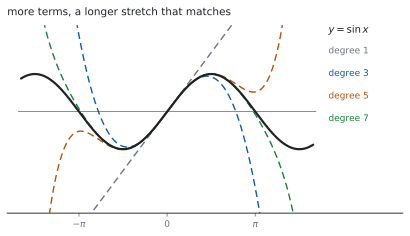
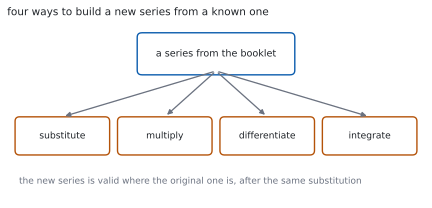

# HL 5.19 — Maclaurin series（Maclaurin 級数） {#sec-aahl-5-19}

::: {.callout-note}
## What you should be able to do
- **Maclaurin 級数**の式を書き、係数を求められる。
- 公式集にある $e^{x}$、$\ln(1+x)$、$\sin x$、$\cos x$、$\arctan x$ の級数を使える。
- $(1+x)^{p}$（$p \in \mathbb{Q}$）の展開を書ける（[HL 1.10b](../01-number-and-algebra/aahl-1-10b.qmd)）。
- **置きかえ**で新しい級数を作れる。
- **かけ算**で級数を作れる。
- **微分・積分**で級数を作れる。
- **微分方程式**から級数を作れる。
:::

## The idea

### 1. The Maclaurin series（Maclaurin 級数） {#maclaurin}

公式集の **5.19** の欄にあります。

> Maclaurin series

$$
f(x) = f(0)+x\,f'(0)+\frac{x^{2}}{2!}f''(0)+\cdots
$$ {#eq-aahl519-maclaurin}

**$x = 0$ での値と導関数だけ**で、関数を多項式に近づけます（[第 1 節](#why-zero)）。

$x^{n}$ の係数は $\dfrac{f^{(n)}(0)}{n!}$ です。**分母の階乗**を落とさないでください。

{#fig-aahl519-idea-a width=100%}

### 2. The five standard series（公式集の $5$ つ） {#standard}

シラバスは、こう書いています。

> Maclaurin series to obtain expansions for $e^{x}$, sinx, cosx, arctanx, ln(1 + x), $(1 + x)^{p}$, $p \in \mathbb{Q}$.

公式集には、次の $5$ つが印刷されています。

> Maclaurin series for special functions

| 関数 | 級数 |
|---|---|
| $e^{x}$ | $1+x+\dfrac{x^{2}}{2!}+\cdots$ |
| $\ln(1+x)$ | $x-\dfrac{x^{2}}{2}+\dfrac{x^{3}}{3}-\cdots$ |
| $\sin x$ | $x-\dfrac{x^{3}}{3!}+\dfrac{x^{5}}{5!}-\cdots$ |
| $\cos x$ | $1-\dfrac{x^{2}}{2!}+\dfrac{x^{4}}{4!}-\cdots$ |
| $\arctan x$ | $x-\dfrac{x^{3}}{3}+\dfrac{x^{5}}{5}-\cdots$ |

: 公式集 **5.19** の級数 {#tbl-aahl519-standard}

**分母に注意してください。** $\sin$ と $\cos$ は**階乗**、$\ln(1+x)$ と $\arctan$ は**ただの整数**です。

$\sin$ と $\arctan$ は**奇数次だけ**、$\cos$ は**偶数次だけ**です。

### 3. $(1+x)^{p}$（二項級数） {#binomial}

$p$ が有理数のときの二項展開です（[HL 1.10b](../01-number-and-algebra/aahl-1-10b.qmd)）。

$$
(1+x)^{p} = 1+px+\frac{p(p-1)}{2!}x^{2}+\frac{p(p-1)(p-2)}{3!}x^{3}+\cdots
$$ {#eq-aahl519-binomial}

$p$ が正の整数でなければ、**項は無限に続きます**。使えるのは $\lvert x \rvert < 1$ のときです。

### 4. Substitution（置きかえで作る） {#substitution}

> Use of simple substitution, products, integration and differentiation to obtain other series.

{#fig-aahl519-idea-b width=100%}

シラバスの例です。

> Example: for substitution: replace $x$ with $x^{2}$ to define the Maclaurin series for $e^{x^{2}}$.

$$
e^{x^{2}} = 1+x^{2}+\frac{x^{4}}{2!}+\cdots
$$

**もとの $x$ のところに、まるごと入れます。** $2x$ を入れるなら $(2x)^{2} = 4x^{2}$ のように、$2$ 乗も忘れずに。

### 5. Products（かけ算で作る） {#products}

> Example: the expansion of $e^{x}\sin x$.

$2$ つの級数をかけて、**ほしい次数までの項だけ**を集めます。

$$
e^{x}\sin x
= \left(1+x+\frac{x^{2}}{2}+\cdots\right)\left(x-\frac{x^{3}}{6}+\cdots\right)
$$

**$x^{3}$ までなら、$x^{4}$ 以上になる組は捨てます。** どこまで書けばよいかを先に決めると、計算が減ります。

### 6. Differentiating and integrating（微分と積分で作る） {#diff-int}

級数は、**項ごとに微分・積分**できます。

$$
\frac{1}{1+x^{2}} = 1-x^{2}+x^{4}-\cdots
\quad \Longrightarrow \quad
\arctan x = x-\frac{x^{3}}{3}+\frac{x^{5}}{5}-\cdots
$$

積分したときの定数は、**$x = 0$ を入れて決めます**。$\arctan 0 = 0$ なので $C = 0$ です。

### 7. From a differential equation（微分方程式から作る） {#from-de}

> Maclaurin series developed from differential equations.

$\dfrac{\mathrm{d}y}{\mathrm{d}x}$ の式が与えられたら、**くり返し微分して $x = 0$ での値を並べます**。

1. $y(0)$ は初期条件から。
2. $y'(0)$ は方程式に $x = 0$ を入れて。
3. 方程式の両辺を微分して $y''$ の式を作り、$x = 0$ を入れて。
4. 必要な次数まで、くり返す。

**変数分離などで解けない式でも、級数なら作れます。** これが、この方法の強みです。

::: {.callout-tip collapse="true"}
## Paper 2 では、電卓で級数が出せます

TI-Nspire CX II には `taylor(` があります。`taylor(e^x, x, 3, 0)` で、$x = 0$ のまわりの $3$ 次までが返ります。

$4$ 番目の引数が展開の中心です。**Maclaurin は中心が $0$** なので、$0$ を入れます。

**答案には、式を書いてください。** 係数を求めた行や、置きかえ・かけ算の行を見せます。

**Paper 1 では使えません。** このページの例題と演習は、すべて手で解けるようにしてあります。
:::

## Why it works

::: {.callout-tip collapse="true"}
## クリックすると開きます

#### なぜ $x = 0$ での導関数だけで決まるのか {#why-zero}

多項式 $a_{0}+a_{1}x+a_{2}x^{2}+\cdots$ に $x = 0$ を入れると、$a_{0}$ だけが残ります。

$1$ 回微分してから $x = 0$ を入れると $a_{1}$、$2$ 回微分してから入れると $2a_{2}$ です。一般に

$$
f^{(n)}(0) = n!\,a_{n}
$$

なので $a_{n} = \dfrac{f^{(n)}(0)}{n!}$ です。**階乗は、ここから出ています。**

@eq-aahl519-maclaurin は「$x = 0$ での値・傾き・曲がり方…をすべて合わせた多項式」だ、と読めます。

#### なぜ、項を増やすと合う範囲が広がるのか {#why-more}

$1$ 次の項までなら、$x = 0$ での値と傾きだけを合わせた接線です。$2$ 次まで入れると、曲がり方も合います。

**合わせる条件が増えるほど、離れたところまで似てきます**（@fig-aahl519-idea-a）。

ただし、どこまでも合うわけではありません。$\ln(1+x)$ や $\arctan x$ は、$\lvert x \rvert > 1$ では級数が発散します。

#### なぜ、置きかえてよいのか {#why-sub}

$e^{u} = 1+u+\dfrac{u^{2}}{2!}+\cdots$ は、**どの $u$ でも成り立ちます**。

ですから $u = x^{2}$ と置いてかまいません。$u$ が $x$ の式でも、等式は等式のままです。

**ただし、範囲も置きかわります。** $\ln(1+u)$ が使えるのは $\lvert u \rvert < 1$ なので、$u = 2x$ なら $\lvert x \rvert < \dfrac{1}{2}$ です。

#### なぜ、項ごとに微分・積分してよいのか {#why-term}

級数が収束する範囲の内側では、**有限個の多項式と同じように**項ごとの微分・積分ができます。

$\dfrac{1}{1+x^{2}}$ は等比級数 $1-x^{2}+x^{4}-\cdots$ です（[SL 1.8](../../aa-sl/01-number-and-algebra/aasl-1-8.qmd)）。公比が $-x^{2}$ なので、$\lvert x \rvert < 1$ で収束します。

これを項ごとに積分すると $\arctan$ の級数になり、@tbl-aahl519-standard と一致します。**公式集の級数どうしが、つながっている**わけです。
:::

## Worked examples

::: {.callout-note appearance="simple"}
問題文は英語です。意味が理解できなかったら、問題文の下の「**日本語訳**」を開いてください。解説は日本語です。

**例題も演習も、すべて電卓なしで解けます。** Paper 1 のつもりで解いてください。
:::

::: {#exm-aahl519-sub}
[Find the Maclaurin series for $e^{2x}$ up to and including the term in $x^{3}$.]{.q-en}

日本語訳

$e^{2x}$ の Maclaurin 級数を、$x^{3}$ の項まで求めなさい。

---

$e^{u}$ の級数に $u = 2x$ を入れます（[第 4 節](#substitution)）。

$$
e^{u} = 1+u+\frac{u^{2}}{2!}+\frac{u^{3}}{3!}+\cdots
$$

$$
e^{2x} = 1+2x+\frac{(2x)^{2}}{2}+\frac{(2x)^{3}}{6}+\cdots
= 1+2x+2x^{2}+\frac{4}{3}x^{3}+\cdots
$$

**検算。** **微分してもどします。** 級数を微分すると $2+4x+4x^{2}$ で、もとの級数の $2$ 倍 ✓ $\dfrac{\mathrm{d}}{\mathrm{d}x}e^{2x} = 2e^{2x}$ と合います。

**検算（$x = 0$）。** $1$ ✓ $e^{0} = 1$ です。

::: {.callout-note}
## 解答例（答案用紙に書くこと）

$$e^{2x} = 1+(2x)+\frac{(2x)^{2}}{2!}+\frac{(2x)^{3}}{3!}+\cdots$$

$$= 1+2x+2x^{2}+\frac{4}{3}x^{3}+\cdots$$
:::
:::

::: {#exm-aahl519-log}
[Find the Maclaurin series for $\ln(1+2x)$ up to and including the term in $x^{3}$.]{.q-en}

日本語訳

$\ln(1+2x)$ の Maclaurin 級数を、$x^{3}$ の項まで求めなさい。

---

$\ln(1+u) = u-\dfrac{u^{2}}{2}+\dfrac{u^{3}}{3}-\cdots$ に $u = 2x$ を入れます。

$$
\ln(1+2x) = 2x-\frac{(2x)^{2}}{2}+\frac{(2x)^{3}}{3}-\cdots
= 2x-2x^{2}+\frac{8}{3}x^{3}-\cdots
$$

**検算。** **微分してもどします。** $2-4x+8x^{2}$ で、$\dfrac{2}{1+2x} = 2(1-2x+4x^{2}-\cdots)$ ✓

**検算（範囲）。** $\lvert 2x \rvert < 1$、つまり $\lvert x \rvert < \dfrac{1}{2}$ ✓（[第 3 節](#why-sub)）

::: {.callout-note}
## 解答例（答案用紙に書くこと）

$$\ln(1+2x) = (2x)-\frac{(2x)^{2}}{2}+\frac{(2x)^{3}}{3}-\cdots$$

$$= 2x-2x^{2}+\frac{8}{3}x^{3}-\cdots$$
:::
:::

::: {#exm-aahl519-product}
[Find the Maclaurin series for $e^{x}\sin x$ up to and including the term in $x^{3}$.]{.q-en}

日本語訳

$e^{x}\sin x$ の Maclaurin 級数を、$x^{3}$ の項まで求めなさい。

---

$x^{3}$ までほしいので、**それぞれ $x^{3}$ までで十分**です（[第 5 節](#products)）。

$$
e^{x} = 1+x+\frac{x^{2}}{2}+\frac{x^{3}}{6}+\cdots, \qquad
\sin x = x-\frac{x^{3}}{6}+\cdots
$$

かけ算して、$x^{3}$ 以下の項だけ集めます。

- $x$ の項 … $1 \times x = x$
- $x^{2}$ の項 … $x \times x = x^{2}$
- $x^{3}$ の項 … $\dfrac{x^{2}}{2}\times x = \dfrac{x^{3}}{2}$、$1 \times\left(-\dfrac{x^{3}}{6}\right) = -\dfrac{x^{3}}{6}$

$$
e^{x}\sin x = x+x^{2}+\left(\frac{1}{2}-\frac{1}{6}\right)x^{3}+\cdots
= x+x^{2}+\frac{x^{3}}{3}+\cdots
$$

**検算（定数項）。** $\sin 0 = 0$ なので、定数項はありません ✓

**検算（係数）。** $\dfrac{1}{2}-\dfrac{1}{6} = \dfrac{3-1}{6} = \dfrac{1}{3}$ ✓

::: {.callout-note}
## 解答例（答案用紙に書くこと）

$$e^{x}\sin x = \left(1+x+\frac{x^{2}}{2}+\cdots\right)
\left(x-\frac{x^{3}}{6}+\cdots\right)$$

$$= x+x^{2}+\left(\frac{1}{2}-\frac{1}{6}\right)x^{3}+\cdots
= x+x^{2}+\frac{x^{3}}{3}+\cdots$$
:::
:::

::: {#exm-aahl519-de}
[Given that $\dfrac{\mathrm{d}y}{\mathrm{d}x} = x+y$ and $y = 1$ when $x = 0$, find the Maclaurin series for $y$ up to and including the term in $x^{3}$.]{.q-en}

日本語訳

$\dfrac{\mathrm{d}y}{\mathrm{d}x} = x+y$、$x = 0$ のとき $y = 1$ とします。$y$ の Maclaurin 級数を $x^{3}$ の項まで求めなさい。

---

**$x = 0$ での値を、順に出します**（[第 7 節](#from-de)）。

$$
y(0) = 1
$$

方程式に $x = 0$、$y = 1$ を入れます。

$$
y'(0) = 0+1 = 1
$$

方程式の両辺を微分します。

$$
y'' = 1+y' \quad \Longrightarrow \quad y''(0) = 1+1 = 2
$$

もう一度微分します。

$$
y''' = y'' \quad \Longrightarrow \quad y'''(0) = 2
$$

@eq-aahl519-maclaurin に入れます。

$$
y = 1+x+\frac{2}{2!}x^{2}+\frac{2}{3!}x^{3}+\cdots
= 1+x+x^{2}+\frac{x^{3}}{3}+\cdots
$$

**検算。** **級数を微分します。** $1+2x+x^{2}$。いっぽう $x+y = x+1+x+x^{2} = 1+2x+x^{2}$ ✓

**検算（初期条件）。** $x = 0$ で $y = 1$ ✓

::: {.callout-note}
## 解答例（答案用紙に書くこと）

$$y(0) = 1, \qquad y'(0) = 0+1 = 1$$

$$y'' = 1+y' \ \Rightarrow \ y''(0) = 2, \qquad
y''' = y'' \ \Rightarrow \ y'''(0) = 2$$

$$y = 1+x+\frac{2}{2!}x^{2}+\frac{2}{3!}x^{3}+\cdots
= 1+x+x^{2}+\frac{x^{3}}{3}+\cdots$$
:::

::: {.model-answer}
**試験ではこう書く**

*The Maclaurin series needs the values of* $y$ *and its derivatives at* $x = 0$, *so these are found one at a time from the differential equation.*

*The initial condition gives* $y(0) = 1$ *directly. Substituting* $x = 0$ *and* $y = 1$ *into* $\dfrac{\mathrm{d}y}{\mathrm{d}x} = x+y$ *gives* $y'(0) = 0+1 = 1$.

*Differentiating the whole equation with respect to* $x$, *and remembering that* $y$ *is a function of* $x$, *gives* $y'' = 1+y'$. *Substituting* $x = 0$ *and the value* $y'(0) = 1$ *already found gives* $y''(0) = 1+1 = 2$.

*Differentiating once more gives* $y''' = y''$, *so* $y'''(0) = 2$.

*Substituting into* $y = y(0)+xy'(0)+\dfrac{x^{2}}{2!}y''(0)+\dfrac{x^{3}}{3!}y'''(0)+\cdots$,

$$y = 1+x+\frac{2}{2}x^{2}+\frac{2}{6}x^{3}+\cdots = 1+x+x^{2}+\frac{x^{3}}{3}+\cdots$$

*As a check, differentiating this series term by term gives* $1+2x+x^{2}$, *while* $x+y = 1+2x+x^{2}$ *to the same order, so the series satisfies the equation.*
:::
:::

## Common errors

::: {.callout-warning}
## 分母の階乗を落とす
$x^{n}$ の係数は $\dfrac{f^{(n)}(0)}{n!}$ です（@eq-aahl519-maclaurin）。

$f^{(n)}(0)$ だけ書くと、$n \geq 2$ で値がちがってしまいます。
:::

::: {.callout-warning}
## $\ln(1+x)$ や $\arctan x$ の分母を階乗にする
この $2$ つは**ただの整数**です（@tbl-aahl519-standard）。

$\ln(1+x) = x-\dfrac{x^{2}}{2}+\dfrac{x^{3}}{3}-\cdots$ であって、$\dfrac{x^{2}}{2!}$ ではありません。$3$ 次の項でちがいが出ます。
:::

::: {.callout-warning}
## 置きかえのときに $2$ 乗を忘れる
$u = 2x$ なら $u^{2} = 4x^{2}$ です（[第 4 節](#substitution)）。

$\dfrac{(2x)^{2}}{2} = 2x^{2}$ であって $x^{2}$ ではありません。**かっこを付けて書く**と防げます。
:::

::: {.callout-warning}
## かけ算で、必要な次数を超えた項まで計算する
$x^{3}$ までなら、$x^{4}$ 以上になる組は要りません（[第 5 節](#products)）。

**先にどこまで必要かを決める**と、計算がぐっと減ります。
:::

::: {.callout-warning}
## 微分方程式から作るとき、$y$ が $x$ の関数であることを忘れる
$y'' = 1+y'$ のように、**$y$ を微分すると $y'$ が出ます**（[HL 5.14](aahl-5-14.qmd#dydx)）。

$y$ を定数とあつかうと、$2$ 次以降の係数がすべてまちがいます。
:::

::: {.callout-warning}
## 収束する範囲を書かない
$\ln(1+x)$ や $(1+x)^{p}$ の級数が使えるのは $\lvert x \rvert < 1$ のときです（[第 3 節](#binomial)）。

置きかえたら、**範囲も置きかわります**（[第 3 節](#why-sub)）。
:::

## Exercises

::: {.callout-note appearance="simple"}
各問題に、折りたたみが $3$ つ付いています。**日本語訳**、**解答例**（答案用紙に書くべきこと。英語です）、**解説**（なぜそうなるか。日本語です）。

まず自分で解いて、次に解答例と見くらべてください。**解説は、合わなかったときだけ開けば十分です。**
:::

::: {.exercise-block}

[1]{.ex-no} [Find the Maclaurin series for $e^{-x}$ up to and including the term in $x^{3}$.]{.q-en}

日本語訳

$e^{-x}$ の Maclaurin 級数を、$x^{3}$ の項まで求めなさい。

::: {.callout-note collapse="true"}
## 解答例（答案用紙に書くこと）

$$e^{-x} = 1+(-x)+\frac{(-x)^{2}}{2!}+\frac{(-x)^{3}}{3!}+\cdots$$

$$= 1-x+\frac{x^{2}}{2}-\frac{x^{3}}{6}+\cdots$$
:::

::: {.callout-tip collapse="true"}
## 解説

$u = -x$ を入れるだけです。**符号が交互**になります。

**検算（微分）。** $-1+x-\dfrac{x^{2}}{2}$ で、もとの級数の $-1$ 倍 ✓

**検算（$e^{x}$ とかける）。** $\left(1+x+\dfrac{x^{2}}{2}\right)\left(1-x+\dfrac{x^{2}}{2}\right) = 1+0x+0x^{2}+\cdots$ ✓ $e^{x}e^{-x} = 1$ と合います。
:::

::: {.ex-sep}
:::

[2]{.ex-no} [Find the Maclaurin series for $\sin 2x$ up to and including the term in $x^{3}$.]{.q-en}

日本語訳

$\sin 2x$ の Maclaurin 級数を、$x^{3}$ の項まで求めなさい。

::: {.callout-note collapse="true"}
## 解答例（答案用紙に書くこと）

$$\sin 2x = (2x)-\frac{(2x)^{3}}{3!}+\cdots
= 2x-\frac{8x^{3}}{6}+\cdots = 2x-\frac{4}{3}x^{3}+\cdots$$
:::

::: {.callout-tip collapse="true"}
## 解説

$(2x)^{3} = 8x^{3}$ です。**$3$ 乗も忘れずに。**

$\sin$ は奇数次だけなので、$x^{2}$ の項はありません（[第 2 節](#standard)）。

**検算（$x = 0$）。** $0$ ✓ $\sin 0 = 0$ です。

**検算（微分）。** $2-4x^{2}$ で、$2\cos 2x = 2\left(1-\dfrac{(2x)^{2}}{2}\right) = 2-4x^{2}$ ✓
:::

::: {.ex-sep}
:::

[3]{.ex-no} [Find the Maclaurin series for $\cos\left(x^{2}\right)$ up to and including the term in $x^{4}$.]{.q-en}

日本語訳

$\cos\left(x^{2}\right)$ の Maclaurin 級数を、$x^{4}$ の項まで求めなさい。

::: {.callout-note collapse="true"}
## 解答例（答案用紙に書くこと）

$$\cos u = 1-\frac{u^{2}}{2!}+\cdots, \qquad u = x^{2}$$

$$\cos\left(x^{2}\right) = 1-\frac{x^{4}}{2}+\cdots$$
:::

::: {.callout-tip collapse="true"}
## 解説

$u^{2} = x^{4}$ なので、$x^{4}$ までなら**項は $2$ つ**です。次は $u^{4} = x^{8}$ です。

**検算（$x = 0$）。** $1$ ✓ $\cos 0 = 1$ です。

**検算（偶数次）。** 出てくるのは $x^{0}$ と $x^{4}$ ✓ どちらも偶数次です。
:::

::: {.ex-sep}
:::

[4]{.ex-no} [Find the Maclaurin series for $\sqrt{1+x}$ up to and including the term in $x^{3}$.]{.q-en}

日本語訳

$\sqrt{1+x}$ の Maclaurin 級数を、$x^{3}$ の項まで求めなさい。

::: {.callout-note collapse="true"}
## 解答例（答案用紙に書くこと）

*With* $p = \dfrac{1}{2}$ *in the binomial series,*

$$\sqrt{1+x} = 1+\frac{1}{2}x+\frac{\frac{1}{2}\left(-\frac{1}{2}\right)}{2!}x^{2}
+\frac{\frac{1}{2}\left(-\frac{1}{2}\right)\left(-\frac{3}{2}\right)}{3!}x^{3}+\cdots$$

$$= 1+\frac{x}{2}-\frac{x^{2}}{8}+\frac{x^{3}}{16}+\cdots$$
:::

::: {.callout-tip collapse="true"}
## 解説

@eq-aahl519-binomial で $p = \dfrac{1}{2}$ です。**符号が途中で変わる**ところに気をつけてください。

**検算（$2$ 乗する）。** $\left(1+\dfrac{x}{2}-\dfrac{x^{2}}{8}\right)^{2} = 1+x+\left(\dfrac{1}{4}-\dfrac{1}{4}\right)x^{2}+\cdots = 1+x$ ✓

**検算（範囲）。** $\lvert x \rvert < 1$ ✓
:::

::: {.ex-sep}
:::

[5]{.ex-no} [Find the Maclaurin series for $\ln(1-x)$ up to and including the term in $x^{3}$.]{.q-en}

日本語訳

$\ln(1-x)$ の Maclaurin 級数を、$x^{3}$ の項まで求めなさい。

::: {.callout-note collapse="true"}
## 解答例（答案用紙に書くこと）

*Putting* $u = -x$ *in* $\ln(1+u)$:

$$\ln(1-x) = (-x)-\frac{(-x)^{2}}{2}+\frac{(-x)^{3}}{3}-\cdots
= -x-\frac{x^{2}}{2}-\frac{x^{3}}{3}-\cdots$$
:::

::: {.callout-tip collapse="true"}
## 解説

**符号がすべてマイナス**になります。$(-x)^{2} = x^{2}$ で、前の $-$ がそのまま残るからです。

**検算（微分）。** $-1-x-x^{2}$ で、$\dfrac{-1}{1-x} = -\left(1+x+x^{2}+\cdots\right)$ ✓

**検算（$\ln(1+x)$ と足す）。** $\ln(1+x)+\ln(1-x) = -x^{2}-\cdots$ で、$\ln\left(1-x^{2}\right)$ の級数 ✓
:::

::: {.ex-sep}
:::

[6]{.ex-no} [Write down the Maclaurin series for $\dfrac{1}{1+x^{2}}$ up to the term in $x^{4}$, and integrate it to obtain the series for $\arctan x$ up to the term in $x^{5}$.]{.q-en}

日本語訳

$\dfrac{1}{1+x^{2}}$ の Maclaurin 級数を $x^{4}$ の項まで書き、それを積分して $\arctan x$ の級数を $x^{5}$ の項まで求めなさい。

::: {.callout-note collapse="true"}
## 解答例（答案用紙に書くこと）

$$\frac{1}{1+x^{2}} = 1-x^{2}+x^{4}-\cdots$$

$$\arctan x = \int\left(1-x^{2}+x^{4}-\cdots\right)\mathrm{d}x
= x-\frac{x^{3}}{3}+\frac{x^{5}}{5}+C$$

*Since* $\arctan 0 = 0$, $\ C = 0$.
:::

::: {.callout-tip collapse="true"}
## 解説

$\dfrac{1}{1+x^{2}}$ は、公比 $-x^{2}$ の等比級数です（[第 4 節](#why-term)）。

項ごとに積分すると、公式集の $\arctan$ の級数になります。**$C$ は $x = 0$ で決めます。**

**検算。** @tbl-aahl519-standard と一致 ✓

**検算（微分でもどす）。** $1-x^{2}+x^{4}$ ✓ もとの級数です。
:::

::: {.ex-sep}
:::

[7]{.ex-no} [Find the Maclaurin series for $x\cos x$ up to and including the term in $x^{5}$.]{.q-en}

日本語訳

$x\cos x$ の Maclaurin 級数を、$x^{5}$ の項まで求めなさい。

::: {.callout-note collapse="true"}
## 解答例（答案用紙に書くこと）

$$\cos x = 1-\frac{x^{2}}{2!}+\frac{x^{4}}{4!}-\cdots$$

$$x\cos x = x-\frac{x^{3}}{2}+\frac{x^{5}}{24}-\cdots$$
:::

::: {.callout-tip collapse="true"}
## 解説

**$x$ をかけるだけ**なので、次数が $1$ ずつ上がります。$\cos$ を $x^{4}$ まで書けば十分です。

$2! = 2$、$4! = 24$ です。

**検算（奇数次）。** 偶数次の級数に $x$ をかけたので、奇数次だけ ✓

**検算（$x = 0$）。** $0$ ✓ $0 \times \cos 0 = 0$ です。
:::

::: {.ex-sep}
:::

[8]{.ex-no} [Given that $\dfrac{\mathrm{d}y}{\mathrm{d}x} = y^{2}$ and $y = 1$ when $x = 0$, find the Maclaurin series for $y$ up to and including the term in $x^{3}$.]{.q-en}

日本語訳

$\dfrac{\mathrm{d}y}{\mathrm{d}x} = y^{2}$、$x = 0$ のとき $y = 1$ とします。$y$ の Maclaurin 級数を $x^{3}$ の項まで求めなさい。

::: {.callout-note collapse="true"}
## 解答例（答案用紙に書くこと）

$$y(0) = 1, \qquad y'(0) = 1^{2} = 1$$

$$y'' = 2yy' \ \Rightarrow \ y''(0) = 2(1)(1) = 2$$

$$y''' = 2\left(y'\right)^{2}+2yy'' \ \Rightarrow \ y'''(0) = 2+4 = 6$$

$$y = 1+x+\frac{2}{2!}x^{2}+\frac{6}{3!}x^{3}+\cdots = 1+x+x^{2}+x^{3}+\cdots$$
:::

::: {.callout-tip collapse="true"}
## 解説

$y^{2}$ の微分は**積の微分公式**で $2yy'$ です（[HL 5.14](aahl-5-14.qmd#dydx)）。$y$ が $x$ の関数だからです。

$y''$ を微分するときも、$2yy'$ に積の微分公式を使います。

**検算（厳密解）。** 変数分離で解くと $y = \dfrac{1}{1-x}$ ✓ その級数は $1+x+x^{2}+x^{3}+\cdots$ です。

**検算（係数）。** $\dfrac{6}{3!} = 1$ ✓ 階乗で割るのを忘れていません。

::: {.model-answer}
**試験ではこう書く**

*The Maclaurin series requires* $y(0)$, $y'(0)$, $y''(0)$ *and* $y'''(0)$, *which are obtained from the differential equation by repeated differentiation.*

*The initial condition gives* $y(0) = 1$, *and substituting into* $\dfrac{\mathrm{d}y}{\mathrm{d}x} = y^{2}$ *gives* $y'(0) = 1^{2} = 1$.

*Differentiating the equation with respect to* $x$ *requires the chain rule on* $y^{2}$, *since* $y$ *is a function of* $x$:

$$y'' = 2y\,y', \qquad y''(0) = 2(1)(1) = 2$$

*Differentiating again, this time with the product rule on* $2yy'$,

$$y''' = 2\left(y'\right)^{2}+2y\,y'', \qquad
y'''(0) = 2(1)^{2}+2(1)(2) = 6$$

*Substituting into the Maclaurin series,*

$$y = 1+x+\frac{2}{2!}x^{2}+\frac{6}{3!}x^{3}+\cdots = 1+x+x^{2}+x^{3}+\cdots$$

*This equation can also be solved exactly by separating the variables, giving* $y = \dfrac{1}{1-x}$, *whose expansion is the geometric series* $1+x+x^{2}+x^{3}+\cdots$, *confirming the answer.*
:::
:::

::: {.ex-sep}
:::

[9]{.ex-no} [Explain why the Maclaurin series of a function uses only the values of the function and its derivatives at $x = 0$.]{.q-en}

日本語訳

関数の Maclaurin 級数が、$x = 0$ における関数の値と導関数の値だけを使う理由を説明しなさい。

::: {.callout-note collapse="true"}
## 解答例（答案用紙に書くこと）

*Suppose the function is written as a power series* $a_{0}+a_{1}x+a_{2}x^{2}+\cdots$.

*Substituting* $x = 0$ *leaves only* $a_{0}$. *Differentiating once and then substituting* $x = 0$ *leaves only* $a_{1}$, *and in general differentiating* $n$ *times leaves* $n!\,a_{n}$.

*So* $a_{n} = \dfrac{f^{(n)}(0)}{n!}$: *each coefficient is determined by one derivative at* $0$.
:::

::: {.callout-tip collapse="true"}
## 解説

**$x = 0$ を入れると、$1$ つの項だけが残る**のが要点です（[第 1 節](#why-zero)）。

だから、係数を $1$ つずつ取り出せます。階乗は、$x^{n}$ を $n$ 回微分したときに出る $n!$ です。

**検算（$n = 2$）。** $x^{2}$ を $2$ 回微分すると $2$ ✓ $2! = 2$ です。

**検算（$n = 3$）。** $x^{3}$ を $3$ 回微分すると $6$ ✓ $3! = 6$ です。

::: {.model-answer}
**試験ではこう書く**

*Suppose that a function can be represented near* $x = 0$ *by a power series*

$$f(x) = a_{0}+a_{1}x+a_{2}x^{2}+a_{3}x^{3}+\cdots$$

*Substituting* $x = 0$ *makes every term containing* $x$ *vanish, leaving* $f(0) = a_{0}$.

*Differentiating once gives* $f'(x) = a_{1}+2a_{2}x+3a_{3}x^{2}+\cdots$, *and substituting* $x = 0$ *again removes every term with a factor* $x$, *leaving* $f'(0) = a_{1}$.

*Differentiating* $n$ *times sends the term* $a_{n}x^{n}$ *to the constant* $n!\,a_{n}$, *while every earlier term has been differentiated away to zero and every later term still carries a factor of* $x$. *Hence* $f^{(n)}(0) = n!\,a_{n}$, *that is*

$$a_{n} = \frac{f^{(n)}(0)}{n!}$$

*Each coefficient is therefore fixed by a single derivative evaluated at the one point* $x = 0$, *which is exactly the formula in the booklet. The factorials in the denominators come from differentiating* $x^{n}$ *repeatedly.*
:::
:::

::: {.ex-sep}
:::

[10]{.ex-no} [A student writes $\cos x = 1-\dfrac{x^{2}}{2}+\dfrac{x^{4}}{4}-\cdots$. Identify the error and give the correct series.]{.q-en}

日本語訳

ある生徒が $\cos x = 1-\dfrac{x^{2}}{2}+\dfrac{x^{4}}{4}-\cdots$ と書きました。まちがいを指摘し、正しい級数を書きなさい。

::: {.callout-note collapse="true"}
## 解答例（答案用紙に書くこと）

*The denominators for* $\cos x$ *are factorials, not the exponents themselves.*

$$\cos x = 1-\frac{x^{2}}{2!}+\frac{x^{4}}{4!}-\cdots
= 1-\frac{x^{2}}{2}+\frac{x^{4}}{24}-\cdots$$

*The term in* $x^{2}$ *happens to agree, since* $2! = 2$, *but the term in* $x^{4}$ *does not, since* $4! = 24$.
:::

::: {.callout-tip collapse="true"}
## 解説

**$2$ 次の項までは合っています。** $2! = 2$ だからです。ちがいが出るのは $4$ 次からです。

整数の分母をもつのは $\ln(1+x)$ と $\arctan x$ のほうです（@tbl-aahl519-standard）。**取りちがえやすい**ところです。

**検算（微分）。** 正しい級数を微分すると $-x+\dfrac{x^{3}}{6}$ で、$-\sin x$ ✓

**検算（生徒の級数を微分）。** $-x+x^{3}$ となり、$-\sin x$ と合いません ✓

::: {.model-answer}
**試験ではこう書く**

*The error is in the denominators. For* $\cos x$ *the coefficient of* $x^{n}$ *is* $\dfrac{f^{(n)}(0)}{n!}$, *so the denominators are factorials:*

$$\cos x = 1-\frac{x^{2}}{2!}+\frac{x^{4}}{4!}-\frac{x^{6}}{6!}+\cdots
= 1-\frac{x^{2}}{2}+\frac{x^{4}}{24}-\cdots$$

*The student's second term is correct only by coincidence, because* $2! = 2$. *The third term is wrong:* $4! = 24$, *not* $4$.

*The series with plain integer denominators belong to* $\ln(1+x) = x-\dfrac{x^{2}}{2}+\dfrac{x^{3}}{3}-\cdots$ *and* $\arctan x = x-\dfrac{x^{3}}{3}+\dfrac{x^{5}}{5}-\cdots$, *which is probably the source of the confusion.*

*A quick check catches the error: differentiating the correct series term by term gives* $-x+\dfrac{x^{3}}{6}-\cdots$, *which is* $-\sin x$ *as required, whereas differentiating the student's series gives* $-x+x^{3}-\cdots$, *which is not.*
:::
:::

:::
