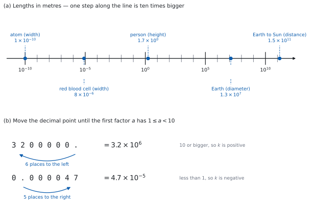

# SL 1.1 — Numbers in standard form（標準形・指数表記） {#sec-aasl-1-1}

::: {.callout-note}
## What you should be able to do
- 大きい数・小さい数を **standard form**（標準形・指数表記）$a \times 10^{k}$ で書ける。
- $a$ が **$1 \leq a < 10$** に入っているかを確かめ、外れていたら直せる。
- standard form と、普通の数を、**両方向に**書き直せる。
- **電卓を使わずに**、standard form どうしの掛け算・割り算ができる。
- **$10$ の指数をそろえて**、足し算・引き算ができる。
- 答えの桁が合っているかを、**見積もりで確かめられる**。
- 電卓の表示（`5.2E30`）を、**答案の書き方に直せる**。
:::

## The idea

### 1. なぜ、この書き方が要るのか {#why}

理科や地理の資料には、こういう数が出てきます。

$$
150\,000\,000\,000 \ \text{m} \qquad (\text{地球から太陽までの距離})
$$

$$
0.000\,000\,000\,1 \ \text{m} \qquad (\text{原子 } 1 \text{ 個くらいの大きさ})
$$

**$0$ を数えるのが大変です。** 書き写すときに $1$ 個多かったり少なかったりすると、答えが $10$ 倍ずれます。$0$ の個数を数え直しても、次に見たときにまた数え直すことになります。

そこで、**「どんな数字か」と「どれくらいの大きさか」を、分けて書きます。**

$$
1.5 \times 10^{11} \ \text{m} \qquad\qquad 1 \times 10^{-10} \ \text{m}
$$

この書き方を **standard form** と言います。$0$ を数える必要がなくなり、**けた（大きさの程度）は指数（$10$ の右上の数）を見るだけ**で分かります。

{#fig-aasl11-scale width=100%}

@fig-aasl11-scale の (a) が、その物差しです。**目盛りはすべてメートル**で、**小さい目盛り $1$ つで $10$ 倍**、ラベルの付いた大きい目盛りまでで $10^{5}$ 倍になっています。人のところの $1.7$ は身長、地球のところの $1.3 \times 10^{7}$ は直径です。

原子と太陽までの距離のように、**けた違いのものを $1$ 本の線の上に並べられる**のは、この書き方のおかげです。

### 2. 書き方の決まり — $a \times 10^{k}$ {#form}

standard form は、次の形です。

$$
a \times 10^{k}, \qquad 1 \leq a < 10, \qquad k \text{ は integer（整数）}
$$ {#eq-aasl11-form}

決まりは $2$ つだけです。**$a$ は $1$ 以上 $10$ 未満**、**$k$ は整数**（負でもよい）。

整数の全体を $\mathbb{Z}$ と書き、「$k$ は整数」を $k \in \mathbb{Z}$ と表します。**試験の問題文では、この書き方でよく出てきます。**

負の数は、$-3.2 \times 10^{5}$ のように、頭に $-$ を付けて書きます。$a$ の範囲の決まりは、$-$ を取ったあとの数についてのものです。

::: {.callout-important}
## この項目の式は、公式集にありません
公式集の Topic 1 は **SL 1.2 から**始まっていて、**1.1 の欄はありません。** 覚える公式のない項目です。

**ただし、$10^{m} \times 10^{n} = 10^{m+n}$ のような指数法則も、公式集には印刷されていません。**（公式集の exponents の欄に載っているのは、$a^{x} = b \iff \log_{a} b = x$ など、対数と結び付いたものだけです。）このページで使う $10$ のべきの足し引きは、**手が覚えるまで使います。**
:::

#### なぜ $a$ を $1$ 以上 $10$ 未満に決めるのか {#unique}

**書き方を $1$ つに決めるため**です。同じ数 $320\,000$ は、こう書けてしまいます。

$$
32 \times 10^{4}, \qquad 3.2 \times 10^{5}, \qquad 0.32 \times 10^{6}
$$

**どれも値は同じ**です。けれども、これでは $2$ つの数を見くらべるときに、いちいち書き直すことになります。そこで $1 \leq a < 10$ と決めて、**$3.2 \times 10^{5}$ だけを正解**にしています。

| 書き方 | $a$ の値 | 判定 |
|:--|:--|:--|
| $32 \times 10^{4}$ | $32$ | 範囲外（$10$ 以上） |
| $3.2 \times 10^{5}$ | $3.2$ | **これが答え** |
| $0.32 \times 10^{6}$ | $0.32$ | 範囲外（$1$ 未満） |

: $a$ の範囲で判定する {#tbl-aasl11-range}

この決まりのおかげで、**standard form の書き方は $1$ 通りしかありません。** その理由は [Why it works](#why-it-works) で確かめます。

### 3. 普通の数と standard form を、行き来する {#convert}

**小数点を動かして、$a$ を $1$ 以上 $10$ 未満にします。動かした桁数が $k$ の大きさを、動かした向きが $k$ の符号を決めます。**

**大きい数**は、小数点を**左**へ動かします。$k$ は**正**になります。

$$
3\,200\,000 = 3.2 \times 10^{6}
$$

$3\,200\,000.$ の小数点を左に $6$ 桁動かすと $3.2$ になります。@fig-aasl11-scale の (b) が、その様子です。

**小さい数**は、小数点を**右**へ動かします。$k$ は**負**になります。

$$
0.000\,047 = 4.7 \times 10^{-5}
$$

$0.000047$ の小数点を右に $5$ 桁動かすと $4.7$ になります。

**戻すときは、逆向きに動かします。** $5.09 \times 10^{-3}$ なら、小数点を左に $3$ 桁動かして $0.00509$ です。

::: {.callout-tip}
## 符号は、元の数が $10$ 以上か、$1$ 未満かで決まります
向きを覚えるのが面倒なら、**答えを書いたあとに $1$ 回だけ**こう確かめてください。

- 元の数が **$10$ 以上** なら、$k$ は **正**
- 元の数が **$1$ 以上 $10$ 未満** なら、$k$ は **$0$**
- 元の数が **$1$ 未満** なら、$k$ は **負**

$0.000047$ は $1$ 未満なので $k$ は負です。$4.7 \times 10^{5}$ と書いてしまったら、**$1$ より小さいはずの数が $470\,000$ になっている**ので、そこで気づけます。
:::

### 4. 掛け算と割り算 — $a$ どうし、$10$ どうし {#multiply}

**AA の Paper 1 では電卓が使えません。** ですから、この計算は手でできる必要があります。とはいえ、やることは $2$ つに分けるだけです。

$$
(2 \times 10^{3}) \times (4 \times 10^{5}) = \underbrace{(2 \times 4)}_{a \text{ の部分}} \times \underbrace{10^{3+5}}_{10 \text{ の部分}} = 8 \times 10^{8}
$$

**指数は足します。掛けません。** なぜ足せるのかは [Why it works](#why-it-works) で確かめます。

割り算なら、$a$ どうしを割り、指数は**引きます**。

$$
\frac{9 \times 10^{7}}{3 \times 10^{2}} = 3 \times 10^{5}
$$

**答えの $a$ が範囲から出ることが、よくあります。**

$$
(5 \times 10^{4}) \times (6 \times 10^{3}) = 30 \times 10^{7}
$$

$a = 30$ なので、**これはまだ答えではありません。** $30 = 3 \times 10$ と書き直せば $30 \times 10^{7} = 3 \times 10^{8}$ です。この直し方は、[第 6 節](#tidy)でまとめて扱います。

::: {.callout-tip collapse="true"}
## Paper 2 では、電卓でこう入れます
Paper 2 では電卓が使えます。standard form の数は、**見たままに打つのがいちばん確実**です。

```
3.5 × 10^7
```

`^` は指数のキーです。**押したあと、右矢印キーで指数のボックスから出る**のを忘れないでください。そのまま次の記号を打つと、指数の中に入ってしまいます。

`E` を使う入力のしかたもありますが、**使わなくて構いません。** $10^{k}$ と打てば同じことですし、答案に書く形と同じなので混乱しません。
:::

### 5. 足し算と引き算 — $10$ の指数をそろえる {#add}

掛け算とは、やり方が変わります。**指数がそろっていないと、足せません。**

$$
(3.4 \times 10^{6}) + (5 \times 10^{5})
$$

$5 \times 10^{5}$ を、**指数が $6$ の形に書き直します。**

$$
5 \times 10^{5} = 0.5 \times 10^{6}
$$

そろったので、$a$ の部分だけを足します。

$$
3.4 \times 10^{6} + 0.5 \times 10^{6} = (3.4 + 0.5) \times 10^{6} = 3.9 \times 10^{6}
$$

::: {.callout-important}
## 大きいほうの指数にそろえます
どちらにそろえても値は同じですが、**大きいほうにそろえると、書き直した側の $a$ が $1$ より小さくなる**ので、最後に $a$ の範囲を直す手間が減ります。

小さいほうにそろえると $34 \times 10^{5} + 5 \times 10^{5} = 39 \times 10^{5}$ となり、**もう一度 $3.9 \times 10^{6}$ に直すことになります。**
:::

### 6. 答えを standard form に直す {#tidy}

計算のあと、$a$ が @eq-aasl11-form の範囲から出ていたら直します。**$10$ を、$a$ の側から $10$ の側へ移すだけ**です。

**$a$ が $10$ 以上のとき** — $a$ を $10$ で割り、指数を $1$ 増やします。

$$
30 \times 10^{7} = 3 \times 10 \times 10^{7} = 3 \times 10^{8}
$$

**$a$ が $1$ 未満のとき** — $a$ を $10$ 倍し、指数を $1$ 減らします。

$$
0.6 \times 10^{-3} = 6 \times 10^{-1} \times 10^{-3} = 6 \times 10^{-4}
$$

::: {.callout-warning}
## 指数を動かす向きを、取りちがえないでください
**$a$ を小さくしたら、指数は大きくします。** 全体の値が変わってはいけないからです。

$30 \times 10^{7}$ で $a$ を $\dfrac{1}{10}$ にしたのだから、$10$ の側は $10$ 倍、つまり指数は $+1$ です。$3 \times 10^{6}$ と書いてしまうと、**もとの数の $\dfrac{1}{100}$** になります。

迷ったら、**小さいほうの数で試してください。** $30 \times 10^{1} = 300$ です。$3 \times 10^{2} = 300$ で合い、$3 \times 10^{0} = 3$ では合いません。
:::

### 7. 桁で見積もる — 電卓がなくても、答えの大きさは分かる {#estimate}

standard form のいちばん役に立つ使い方が、これです。**$a$ を $1$ 桁に丸めて、指数だけを追いかけます。**

$$
(7.9 \times 10^{-6}) \times (4.2 \times 10^{3}) \ \approx \ (8 \times 4) \times 10^{-6+3} = 32 \times 10^{-3} \approx 3 \times 10^{-2}
$$

ですから答えは **$3 \times 10^{-2}$ くらい**のはずです。正確に計算すると $7.9 \times 4.2 = 33.18$ なので

$$
33.18 \times 10^{-3} = 3.318 \times 10^{-2}
$$

見積もりと合っています。**$3.318 \times 10^{-3}$ や $3.318 \times 10^{-1}$ が出ていたら、どこかで桁がずれています。**

Paper 1 では、割り戻しや、普通の数に戻す方法と並ぶ、**手早い検算**になります。

::: {.callout-tip collapse="true"}
## Paper 2 では、電卓の打ち間違いを、これで見つけます
電卓は、打ち間違えても平気で答えを出します。**桁を先に見積もっておけば、そこで気づけます。**
:::

### 8. 答案の書き方 — 電卓の表記は認められません {#notation}

シラバスの Guidance 欄に、例まで挙げて書かれています。

> **Calculator or computer notation is not acceptable.** For example, **5.2E30 is not acceptable** and should be written as $5.2 \times 10^{30}$.

ガイドの notation の節にも、計算機の表記ではなく、正しい数学の記号を使うこと、と書かれています。

`5.2E30` と `5.2e30` は電卓の表記なので、**認められません**。必ず $5.2 \times 10^{30}$ と書いてください。

**`5.2^30` は、そもそも別の数です。** $5.2$ を $30$ 個掛けた数で、$5.2 \times 10^{30}$ とはまるでちがう、およそ $3 \times 10^{21}$ にしかなりません。

**計算が合っているのに、書き方だけで得点を落とすことがあるのは、いちばんもったいないところ**です。

::: {.callout-tip collapse="true"}
## Paper 2 では、電卓の表示をこう読みます
電卓は、大きい数や小さい数を勝手に短く表示します。**`E` のうしろの数が、そのまま $10$ の指数**です。

| 電卓の表示 | 意味 | 答案に書く形 |
|:--|:--|:--|
| `1.4E13` | $1.4 \times 10^{13}$ | $1.4 \times 10^{13}$ |
| `4.E−6` | $4 \times 10^{-6}$ | $4 \times 10^{-6}$ |
| `7.12E6` | $7.12 \times 10^{6}$ | $7.12 \times 10^{6}$ |

: 電卓の表示と、答案の書き方 {#tbl-aasl11-display}

**`E−6` の `−` を落とさないでください。** $4 \times 10^{6}$ と $4 \times 10^{-6}$ では、$10$ の $12$ 乗も違います。

表示のしかたは `doc → Settings → Document Settings` の `Exponential Format` で変えられます（`Normal` / `Scientific` / `Engineering`）。

**`Engineering` は使わないでください。** 指数が $3$ の倍数になる形なので、$a$ が $10$ 以上で表示されることがあり、そのまま写すと $1 \leq a < 10$ を満たさなくなります。
:::

## Why it works

ここでは $3$ つのことを確かめます。**なぜ掛け算では指数を足せるのか**、**なぜ足し算では指数をそろえないといけないのか**、そして**なぜ standard form の書き方が $1$ 通りに決まるのか**です。

**なぜ、掛け算では指数を足すのか。**

$10^{3}$ は $10$ を $3$ 個掛けたもの、$10^{5}$ は $10$ を $5$ 個掛けたものです。この $2$ つを掛け合わせると、

$$
10^{3} \times 10^{5} = \underbrace{(10 \times 10 \times 10)}_{3 \text{ 個}} \times \underbrace{(10 \times 10 \times 10 \times 10 \times 10)}_{5 \text{ 個}} = \underbrace{10 \times \cdots \times 10}_{8 \text{ 個}} = 10^{8}
$$

**$10$ が何個あるかを数えているだけ**です。割り算なら、上と下で $10$ が消し合う分だけ個数が減るので、指数を引きます。

$$
\frac{10^{7}}{10^{2}} = \frac{10 \times 10 \times 10 \times 10 \times 10 \times \cancel{10} \times \cancel{10}}{\cancel{10} \times \cancel{10}} = 10^{5}
$$

**なぜ、足し算では指数をそろえないといけないのか。**

$10$ の個数がちがうものは、そのままでは $1$ つにまとめられません。そろっていれば、共通の $10^{k}$ でくくれます。

$$
a \times 10^{k} + b \times 10^{k} = (a+b) \times 10^{k}
$$

これは distributive law（分配法則）そのものです。$10^{6}$ と $10^{5}$ のままでは、この形にくくれません。だから、先にそろえます。

**なぜ、standard form の書き方は $1$ 通りしかないのか。**

[第 2 節](#form)で「$1 \leq a < 10$ と決めれば書き方が $1$ つになる」と言いました。それを確かめます。

やり方は、**「$2$ 通りに書けた」と、いったん認めてしまう**ことです。認めた先で話が合わなくなれば、はじめから $2$ 通りには書けなかった、と分かります。

そこで、ある正の数が、次の $2$ 通りに書けたとします。

$$
a \times 10^{k} = b \times 10^{m}, \qquad 1 \leq a < 10, \quad 1 \leq b < 10
$$

まず、指数がちがう場合を考えます。$k \neq m$ なら、どちらかが大きいので、**大きいほうを $k$ と呼ぶことにします。** どちらに $k$ という名前を付けるかだけの話なので、これで場合を取りこぼすことはありません。つまり $k > m$ です。

両辺を $b \times 10^{k}$ で割ります。左辺は $10^{k}$ が消えて $\dfrac{a}{b}$、右辺は $b$ が消えて $\dfrac{10^{m}}{10^{k}} = 10^{\,m-k}$ です。

$$
\frac{a}{b} = 10^{\,m-k}
$$

**まず、右辺の大きさを見ます。** $k > m$ で、$k$ と $m$ は整数ですから、$m - k$ は $-1$ 以下です。$10$ のべきは指数が小さいほど小さいので

$$
\frac{a}{b} = 10^{\,m-k} \leq 10^{-1} = \frac{1}{10}
$$

**次に、左辺の大きさを見ます。** $a \geq 1$ で $b < 10$ ですから、分子は $1$ 以上、分母は $10$ 未満です。したがって

$$
\frac{a}{b} > \frac{1}{10}
$$

同じ $\dfrac{a}{b}$ が、$\dfrac{1}{10}$ 以下であり、かつ $\dfrac{1}{10}$ より大きい。これは起こりません。ですから、はじめに認めた $k \neq m$ のほうが誤りで、$k = m$ です。

$k = m$ なら $a \times 10^{k} = b \times 10^{k}$ ですから、両辺を $10^{k}$ で割って $a = b$ も出ます。

**$a$ も $k$ も、ただ $1$ 通りに決まりました。** 「$1 \leq a < 10$」という、一見ささいな決まりが効いています。

## Worked examples

::: {.callout-note appearance="simple"}
問題文は英語です。意味が理解できなかったら、問題文の下の「**日本語訳**」を開いてください。解説は日本語です。

**例題も演習も、すべて電卓なしで解けます。** Paper 1 のつもりで解いてください。
:::

::: {#exm-aasl11-convert}
**(a)** [Write $0.000407$ in the form $a \times 10^{k}$, where $1 \leq a < 10$ and $k \in \mathbb{Z}$.]{.q-en}

**(b)** [Write $5.2 \times 10^{6}$ as an ordinary number.]{.q-en}

**(c)** [Write $84 \times 10^{-7}$ in the form $a \times 10^{k}$, where $1 \leq a < 10$ and $k \in \mathbb{Z}$.]{.q-en}

**(d)** [Explain why $0.62 \times 10^{5}$ and $6.2 \times 10^{4}$ are the same number, and state which one is in the form $a \times 10^{k}$.]{.q-en}

<details class="jp-trans">
<summary>日本語訳</summary>

**(a)** $0.000407$ を、$1 \leq a < 10$、$k$ が整数である $a \times 10^{k}$ の形で書きなさい。

**(b)** $5.2 \times 10^{6}$ を普通の数で書きなさい。

**(c)** $84 \times 10^{-7}$ を、$1 \leq a < 10$、$k$ が整数である $a \times 10^{k}$ の形で書きなさい。

**(d)** $0.62 \times 10^{5}$ と $6.2 \times 10^{4}$ が同じ数である理由を説明し、どちらが $a \times 10^{k}$ の形になっているかを述べなさい。

</details>

---

**(a)** 小数点を右に動かして、$a$ を $1$ 以上 $10$ 未満にします（[第 3 節](#convert)）。

$$
0.000407 \ \longrightarrow \ 4.07 \qquad (\text{右に } 4 \text{ 桁})
$$

元の数は $1$ より小さいので、$k$ は負です。

$$
0.000407 = 4.07 \times 10^{-4}
$$

**(b)** 今度は standard form から普通の数に戻します。指数が正なので、小数点を**右**に $6$ 桁動かします。

$$
5.2 \times 10^{6} = 5\,200\,000
$$

**(c)** $a = 84$ が範囲から出ています（[第 6 節](#tidy)）。$a$ を $\dfrac{1}{10}$ にして、指数を $1$ 増やします。

$$
84 \times 10^{-7} = 8.4 \times 10 \times 10^{-7} = 8.4 \times 10^{-6}
$$

**(d)** `Explain why` なので、英語で理由を書きます。

::: {.model-answer}
**試験ではこう書く**

*Moving the decimal point in $0.62$ one place to the right multiplies it by $10$, and reducing the index from $5$ to $4$ divides the number by $10$, so the value is unchanged: $0.62 \times 10^{5} = 6.2 \times 10^{-1} \times 10^{5} = 6.2 \times 10^{4}$. Only $6.2 \times 10^{4}$ is in the form $a \times 10^{k}$, because $a$ must satisfy $1 \leq a < 10$ and $0.62 < 1$.*
:::

（$0.62$ の小数点を右に $1$ 桁動かすと $10$ 倍になり、指数を $5$ から $4$ に下げると $10$ で割ることになるので、値は変わらない。$a \times 10^{k}$ の形になっているのは $6.2 \times 10^{4}$ だけで、$a$ は $1 \leq a < 10$ を満たす必要があるのに $0.62 < 1$ だから、という意味です。）

**検算（(a) について）。** 小数点を数え直すのではなく、**大きさで挟みます。**

$$
0.0001 = 10^{-4}, \qquad 0.001 = 10^{-3}, \qquad 0.0001 < 0.000407 < 0.001
$$

$a \geq 1$ なので、$a \times 10^{k}$ は $10^{k}$ 以上 $10^{k+1}$ 未満です。$0.000407$ はちょうど $10^{-4}$ と $10^{-3}$ のあいだにあるので、$k = -4$ ✓ **これは小数点を数える方法とは別の道すじなので、$1$ 桁数えまちがえて $4.07 \times 10^{-5}$ と書いていたら、ここで合いません**（$10^{-5}$ と $10^{-4}$ のあいだにあるのは $0.0000407$ です）。

**検算（(c) について）。** どちらも普通の数に戻して見くらべます。$84 \times 10^{-7} = 84 \times 0.0000001 = 0.0000084$、$8.4 \times 10^{-6} = 0.0000084$ ✓ **指数を $1$ 減らして $8.4 \times 10^{-8}$ としていたら、$0.000000084$ となって合いません。**

::: {.callout-note}
## 解答例（答案用紙にはこう書く）
**(a)**
$$0.000407 = 4.07 \times 10^{-4}$$

**(b)**
$$5.2 \times 10^{6} = 5\,200\,000$$

**(c)**
$$84 \times 10^{-7} = 8.4 \times 10 \times 10^{-7} = 8.4 \times 10^{-6}$$

**(d)**
*$0.62 \times 10^{5} = 6.2 \times 10^{-1} \times 10^{5} = 6.2 \times 10^{4}$, so they are equal. Only $6.2 \times 10^{4}$ is in the form $a \times 10^{k}$, since $a$ must satisfy $1 \leq a < 10$, and $0.62 < 1$.*
:::
:::

::: {#exm-aasl11-multiply}
**(a)** [Find $(3 \times 10^{5}) \times (2.5 \times 10^{-8})$, giving your answer in the form $a \times 10^{k}$, where $1 \leq a < 10$ and $k \in \mathbb{Z}$.]{.q-en}

**(b)** [Find $(4 \times 10^{6}) \times (8 \times 10^{7})$, giving your answer in the same form.]{.q-en}

**(c)** [Find $(7.2 \times 10^{-3}) \div (9 \times 10^{2})$, giving your answer in the same form.]{.q-en}

**(d)** [A student gives $32 \times 10^{13}$ as the answer to part (b). Explain why this is not in the required form.]{.q-en}

<details class="jp-trans">
<summary>日本語訳</summary>

**(a)** $(3 \times 10^{5}) \times (2.5 \times 10^{-8})$ を求め、$1 \leq a < 10$、$k$ が整数である $a \times 10^{k}$ の形で答えなさい。

**(b)** $(4 \times 10^{6}) \times (8 \times 10^{7})$ を求め、同じ形で答えなさい。

**(c)** $(7.2 \times 10^{-3}) \div (9 \times 10^{2})$ を求め、同じ形で答えなさい。

**(d)** ある生徒が (b) の答えを $32 \times 10^{13}$ と書きました。これが求められた形になっていない理由を説明しなさい。

</details>

---

**(a)** $a$ どうし、$10$ どうしに分けます（[第 4 節](#multiply)）。

$$
(3 \times 2.5) \times 10^{5 + (-8)} = 7.5 \times 10^{-3}
$$

$a = 7.5$ は範囲の中なので、これが答えです。

**(b)** 同じようにします。

$$
(4 \times 8) \times 10^{6+7} = 32 \times 10^{13}
$$

$a = 32$ なので、直します（[第 6 節](#tidy)）。

$$
32 \times 10^{13} = 3.2 \times 10 \times 10^{13} = 3.2 \times 10^{14}
$$

**(c)** 割り算なので、$a$ どうしを割り、指数は引きます。

$$
\frac{7.2}{9} = 0.8, \qquad 10^{-3-2} = 10^{-5}
$$

$$
0.8 \times 10^{-5} = 8 \times 10^{-1} \times 10^{-5} = 8 \times 10^{-6}
$$

**$a = 0.8$ は $1$ 未満なので、ここでも直しています。** 掛け算では $a$ が大きくなりすぎ、割り算では小さくなりすぎることが多い、と覚えておいてください。

**(d)** `Explain why` なので、英語で理由を書きます。

::: {.model-answer}
**試験ではこう書く**

*In the form $a \times 10^{k}$, the number $a$ must satisfy $1 \leq a < 10$, but here $a = 32$, which is greater than $10$. Writing $32$ as $3.2 \times 10$ and combining the powers of ten gives $3.2 \times 10^{14}$, which has the same value, with $a$ now in the required interval.*
:::

（$a \times 10^{k}$ の形では $a$ が $1 \leq a < 10$ を満たす必要があるが、ここでは $a = 32$ で $10$ より大きい。$32$ を $3.2 \times 10$ と書いて $10$ のべきをまとめると $3.2 \times 10^{14}$ となり、値は同じまま $a$ が必要な範囲に入る、という意味です。）

**検算（(b) について）。** 答えを、**掛けた片方で割り戻します。**

$$
\frac{3.2 \times 10^{14}}{8 \times 10^{7}} = 0.4 \times 10^{7} = 4 \times 10^{6}
$$

もう一方の $4 \times 10^{6}$ に戻りました ✓ **これは割り算なので、掛け算をもう一度やり直したことにはなりません。** 指数を $1$ 間違えて $3.2 \times 10^{13}$ としていたら、割り戻すと $4 \times 10^{5}$ になり、$4 \times 10^{6}$ と合いません。

**検算（(c) について）。** 答えに $9 \times 10^{2}$ を**掛け戻します。**

$$
(8 \times 10^{-6}) \times (9 \times 10^{2}) = 72 \times 10^{-4} = 7.2 \times 10^{-3}
$$

元に戻りました ✓ **$0.8 \times 10^{-5}$ を直すときに指数を動かし忘れて $8 \times 10^{-5}$ としていたら**、掛け戻すと $72 \times 10^{-3} = 7.2 \times 10^{-2}$ となり、$7.2 \times 10^{-3}$ の $10$ 倍になって合いません。

::: {.callout-note}
## 解答例（答案用紙にはこう書く）
**(a)**
$$(3 \times 2.5) \times 10^{5-8} = 7.5 \times 10^{-3}$$

**(b)**
$$(4 \times 8) \times 10^{6+7} = 32 \times 10^{13} = 3.2 \times 10^{14}$$

**(c)**
$$\frac{7.2}{9} \times 10^{-3-2} = 0.8 \times 10^{-5} = 8 \times 10^{-6}$$

**(d)**
*$a$ must satisfy $1 \leq a < 10$, but $a = 32$. Since $32 = 3.2 \times 10$, the answer is $3.2 \times 10^{14}$.*
:::
:::

::: {#exm-aasl11-add}
**(a)** [Find $(4.2 \times 10^{5}) + (3 \times 10^{4})$, giving your answer in the form $a \times 10^{k}$, where $1 \leq a < 10$ and $k \in \mathbb{Z}$.]{.q-en}

**(b)** [Find $(8 \times 10^{-3}) - (6 \times 10^{-4})$, giving your answer in the same form.]{.q-en}

**(c)** [Two samples have masses $2.5 \times 10^{-3}$ kg and $7.5 \times 10^{-4}$ kg. Find the total mass, in kg, giving your answer in the same form.]{.q-en}

**(d)** [Explain why the indices cannot simply be added when adding two numbers in standard form.]{.q-en}

<details class="jp-trans">
<summary>日本語訳</summary>

**(a)** $(4.2 \times 10^{5}) + (3 \times 10^{4})$ を求め、$1 \leq a < 10$、$k$ が整数である $a \times 10^{k}$ の形で答えなさい。

**(b)** $(8 \times 10^{-3}) - (6 \times 10^{-4})$ を求め、同じ形で答えなさい。

**(c)** $2$ つの試料の質量が $2.5 \times 10^{-3}$ kg と $7.5 \times 10^{-4}$ kg です。合計の質量を kg 単位で、同じ形で求めなさい。

**(d)** standard form の $2$ つの数を足すとき、指数をそのまま足すことができない理由を説明しなさい。

</details>

---

**(a)** 大きいほうの指数 $10^{5}$ にそろえます（[第 5 節](#add)）。

$$
3 \times 10^{4} = 0.3 \times 10^{5}
$$

$$
4.2 \times 10^{5} + 0.3 \times 10^{5} = 4.5 \times 10^{5}
$$

**(b)** 大きいほうは $10^{-3}$ です。$10^{-4}$ のほうを書き直します。

$$
6 \times 10^{-4} = 0.6 \times 10^{-3}
$$

$$
8 \times 10^{-3} - 0.6 \times 10^{-3} = 7.4 \times 10^{-3}
$$

**(c)** $10^{-3}$ にそろえます。$7.5 \times 10^{-4} = 0.75 \times 10^{-3}$ なので

$$
2.5 \times 10^{-3} + 0.75 \times 10^{-3} = 3.25 \times 10^{-3} \ \text{kg}
$$

**単位を書き忘れないでください。** 質量を聞かれているので、答えは kg 付きです。

**(d)** `Explain why` なので、英語で理由を書きます。

::: {.model-answer}
**試験ではこう書く**

*Addition requires a common factor that can be taken out: $a \times 10^{k} + b \times 10^{k} = (a+b) \times 10^{k}$. When the indices differ, there is no common power of ten to take out, so the two terms cannot be combined until one of them is rewritten. Adding the indices would answer a different question: $10^{5} \times 10^{4} = 10^{9}$, whereas $10^{5} + 10^{4} = 1.1 \times 10^{5}$.*
:::

（足し算には、くくり出せる共通因数が要る。$a \times 10^{k} + b \times 10^{k} = (a+b) \times 10^{k}$ である。指数がちがうと、くくり出せる共通の $10$ のべきがないので、片方を書き直すまで $2$ つの項はまとめられない。指数を足すのは、別の問いに答えることになる。$10^{5} \times 10^{4} = 10^{9}$ であるのに対し、$10^{5} + 10^{4} = 1.1 \times 10^{5}$ である、という意味です。）

**検算（(a) について）。** 普通の数に戻して足します。

$$
420\,000 + 30\,000 = 450\,000 = 4.5 \times 10^{5}
$$

合いました ✓ **これは standard form を使わない別の道すじです。** 指数を足して $7.2 \times 10^{9}$ としていたら、$72$ 億という桁違いの数になるので、ここで気づけます。

**検算（(c) について）。** 大きさで挟みます。**足すほうが小さいので、答えは $2.5 \times 10^{-3}$ より大きく、$2.5 \times 10^{-3}$ の $2$ 倍より小さい**はずです。

$$
2.5 \times 10^{-3} < 3.25 \times 10^{-3} < 5 \times 10^{-3}
$$

範囲に入っています ✓ **そろえるときに $7.5 \times 10^{-4} = 7.5 \times 10^{-3}$ としてしまっていたら**、合計は $10 \times 10^{-3} = 1 \times 10^{-2}$ となり、この範囲から出ます。

::: {.callout-note}
## 解答例（答案用紙にはこう書く）
**(a)**
$$3 \times 10^{4} = 0.3 \times 10^{5}, \qquad 4.2 \times 10^{5} + 0.3 \times 10^{5} = 4.5 \times 10^{5}$$

**(b)**
$$6 \times 10^{-4} = 0.6 \times 10^{-3}, \qquad 8 \times 10^{-3} - 0.6 \times 10^{-3} = 7.4 \times 10^{-3}$$

**(c)**
$$7.5 \times 10^{-4} = 0.75 \times 10^{-3}, \qquad 2.5 \times 10^{-3} + 0.75 \times 10^{-3} = 3.25 \times 10^{-3} \ \text{kg}$$

**(d)**
*Factorizing requires a common power of ten: $a \times 10^{k} + b \times 10^{k} = (a+b) \times 10^{k}$. Adding the indices describes multiplication, not addition.*
:::
:::

::: {#exm-aasl11-context}
[A single water molecule has a mass of $3 \times 10^{-26}$ kg. A drop of water has a mass of $6 \times 10^{-5}$ kg.]{.q-en}

**(a)** [Find the number of water molecules in the drop, giving your answer in the form $a \times 10^{k}$, where $1 \leq a < 10$ and $k \in \mathbb{Z}$.]{.q-en}

**(b)** [Find the total mass of $4 \times 10^{2}$ such drops, in kg, giving your answer in the same form.]{.q-en}

**(c)** [A student writes the answer to part (a) as $2\text{E}21$. Explain why this would not be accepted in an examination.]{.q-en}

**(d)** [The student decides to check part (a) by working out $(2 \times 10^{21}) \times (3 \times 10^{-26})$. Explain why this is a useful check, and carry out the calculation.]{.q-en}

<details class="jp-trans">
<summary>日本語訳</summary>

水の分子 $1$ 個の質量は $3 \times 10^{-26}$ kg です。水滴 $1$ 粒の質量は $6 \times 10^{-5}$ kg です。

**(a)** その水滴に含まれる水分子の個数を、$1 \leq a < 10$、$k$ が整数である $a \times 10^{k}$ の形で求めなさい。

**(b)** そのような水滴 $4 \times 10^{2}$ 粒の合計の質量を kg 単位で、同じ形で求めなさい。

**(c)** ある生徒が (a) の答えを $2\text{E}21$ と書きました。これが試験で認められない理由を説明しなさい。

**(d)** その生徒は、$(2 \times 10^{21}) \times (3 \times 10^{-26})$ を計算して (a) を確かめようとしています。これがよい確かめ方である理由を説明し、実際に計算しなさい。

</details>

---

**(a)** 「水滴の質量」を「分子 $1$ 個の質量」で割ります。

$$
\frac{6 \times 10^{-5}}{3 \times 10^{-26}} = \frac{6}{3} \times 10^{-5-(-26)} = 2 \times 10^{21}
$$

**指数の引き算で、$-5 - (-26) = -5 + 26 = 21$ です。** 負の数を引くところが、いちばん間違えやすいところです。

$2 \times 10^{21}$ 個。**個数なので、単位は付きません。**

**(b)** 掛け算です。

$$
(6 \times 10^{-5}) \times (4 \times 10^{2}) = 24 \times 10^{-3} = 2.4 \times 10^{-2} \ \text{kg}
$$

**(c)** `Explain why` なので、英語で理由を書きます。

::: {.model-answer}
**試験ではこう書く**

*$2\text{E}21$ is calculator notation, and the syllabus states that calculator or computer notation is not acceptable. The value is correct, but it must be written using mathematical notation as $2 \times 10^{21}$. Marks for the final answer can be lost even when the working and the value are right.*
:::

（$2\text{E}21$ は電卓の表記であり、シラバスは電卓やコンピュータの表記は認められないと述べている。値は正しいが、数学の記号を使って $2 \times 10^{21}$ と書かなければならない。過程と値が正しくても、最後の答えの点を落とすことがある、という意味です。）

**(d)** `Explain why` なので、英語で理由を書きます。計算は次のとおりです。

$$
(2 \times 10^{21}) \times (3 \times 10^{-26}) = 6 \times 10^{21-26} = 6 \times 10^{-5}
$$

水滴の質量に戻りました。

::: {.model-answer}
**試験ではこう書く**

*Part (a) is a division, so multiplying the answer by the divisor should return the original mass, and this uses the opposite operation rather than repeating the same one. Here $(2 \times 10^{21}) \times (3 \times 10^{-26}) = 6 \times 10^{-5}$, which is the mass of the drop, so the answer is consistent. An error in the index would show up at once: $2 \times 10^{20}$ would give $6 \times 10^{-6}$ instead.*
:::

（(a) は割り算なので、答えに割った数を掛けると元の質量に戻るはずであり、同じ計算を繰り返すのではなく逆の計算を使っている。ここでは $(2 \times 10^{21}) \times (3 \times 10^{-26}) = 6 \times 10^{-5}$ となり、水滴の質量に一致するので、答えは筋が通っている。指数の誤りはすぐ表に出る。$2 \times 10^{20}$ なら $6 \times 10^{-6}$ になってしまう、という意味です。）

**検算（(b) について）。** 普通の数に戻して計算します。水滴 $1$ 粒は $0.00006$ kg、粒の数は $4 \times 10^{2} = 400$ です。

$$
0.00006 \times 400 = 0.024 = 2.4 \times 10^{-2}
$$

合いました ✓ **これは standard form を使わない別の道すじです。** $a$ を直すときに指数を減らして $2.4 \times 10^{-4}$ としていたら、それは $0.00024$ で、$100$ 分の $1$ になります。

::: {.callout-note}
## 解答例（答案用紙にはこう書く）
**(a)**
$$\frac{6 \times 10^{-5}}{3 \times 10^{-26}} = 2 \times 10^{-5+26} = 2 \times 10^{21}$$

**(b)**
$$(6 \times 4) \times 10^{-5+2} = 24 \times 10^{-3} = 2.4 \times 10^{-2} \ \text{kg}$$

**(c)**
*Calculator notation is not acceptable; the answer must be written as $2 \times 10^{21}$.*

**(d)**
*Multiplying by the divisor reverses the division, so it should return $6 \times 10^{-5}$.*
$$(2 \times 10^{21}) \times (3 \times 10^{-26}) = 6 \times 10^{-5}$$
:::
:::

## Common errors

::: {.callout-warning}
## 掛け算で、指数を掛けてしまう
$10^{5} \times 10^{-8}$ は $10^{-40}$ ではありません。**足して $10^{-3}$** です（[第 4 節](#multiply)）。

$10^{5}$ は「$10$ が $5$ 個」という意味なので、掛け合わせたら**個数が増える**、と考えてください（[Why it works](#why-it-works)）。

**桁を見積もれば、すぐ分かります。** $10^{-40}$ は、原子より何十桁も小さい数です。
:::

::: {.callout-warning}
## $a$ が範囲から出たまま、答えにしてしまう
$32 \times 10^{13}$ も $0.8 \times 10^{-5}$ も、**まだ答えではありません**（[第 6 節](#tidy)）。

**掛け算のあとは $a$ が大きくなりすぎ、割り算のあとは小さくなりすぎることが、よくあります。** 計算が終わったら、$1 \leq a < 10$ かどうかを、必ず $1$ 回見てください。

問題文に `in the form` $a \times 10^{k}$ と書いてあるときは、**答えの形そのものが問われています。** 直さずに出すと、求められた形になっていません。
:::

::: {.callout-warning}
## 足し算・引き算で、指数をそろえない
$4.2 \times 10^{5} + 3 \times 10^{4}$ を $7.2 \times 10^{9}$ とするのは、掛け算のやり方を持ちこんだものです。

**足し算は、指数をそろえてから $a$ だけを足します**（[第 5 節](#add)）。そろえずに $a$ だけ足して $7.2 \times 10^{5}$ とするのも誤りです。

**普通の数に戻せば確かめられます。** $420\,000 + 30\,000 = 450\,000$ です。
:::

::: {.callout-warning}
## 小数点を動かす向きと、指数の符号を取りちがえる
$0.000047$ を $4.7 \times 10^{5}$ と書いてしまう誤りです。

**元の数が $1$ より小さいのに、答えが $470\,000$ になっています**（[第 3 節](#convert)）。

$a$ を大きくしたぶん、$10$ の側は小さくしなければ、値が変わってしまいます。
:::

::: {.callout-warning}
## 電卓の表記を、そのまま答案に書く
`2E21` は、電卓の中だけの書き方です。シラバスが名指しで認めていません（[第 8 節](#notation)）。

**必ず $2 \times 10^{21}$ と書き直してください。** 値が合っていても、ここで得点にならないことがあります。

Paper 1 では電卓が使えないので出てきませんが、**Paper 2 で写すときに起きます。**
:::

## Exercises

::: {.callout-note appearance="simple"}
各問題に、折りたたみが $3$ つ付いています。**日本語訳**、**解答例**（答案用紙に書くべきこと。英語です）、**解説**（なぜそうなるか。日本語です）。

まず自分で解いて、次に解答例と見くらべてください。**解説は、合わなかったときだけ開けば十分です。**
:::

::: {.exercise-block}

[1]{.ex-no} [Write each number in the form $a \times 10^{k}$, where $1 \leq a < 10$ and $k \in \mathbb{Z}$.]{.q-en} **(a)** [$0.00000091$]{.q-en} **(b)** [$62\,400$]{.q-en}

<details class="jp-trans">
<summary>日本語訳</summary>

次の数を、$1 \leq a < 10$、$k$ が整数である $a \times 10^{k}$ の形で書きなさい。

**(a)** $0.00000091$　**(b)** $62\,400$

</details>

::: {.callout-note collapse="true"}
## 解答例（答案用紙に書くこと）

**(a)**
$$0.00000091 = 9.1 \times 10^{-7}$$

**(b)**
$$62\,400 = 6.24 \times 10^{4}$$
:::

::: {.callout-tip collapse="true"}
## 解説

**(a)** 小数点を右に $7$ 桁動かすと $9.1$ になります。元の数が $1$ より小さいので、$k$ は負です。

**(b)** 小数点を左に $4$ 桁動かすと $6.24$ です。**$62\,400$ の末尾の $0$ は、$a$ には入れません。** $6.2400$ と書く必要はありません。

**検算。** 大きさで挟みます（@exm-aasl11-convert）。$0.00000091$ は $10^{-7} = 0.0000001$ と $10^{-6} = 0.000001$ のあいだにあるので $k = -7$ ✓ $62\,400$ は $10^{4}$ と $10^{5}$ のあいだなので $k = 4$ ✓

**$1$ 桁数えまちがえて $9.1 \times 10^{-8}$ としていたら**、それは $0.000000091$ で、$10^{-8}$ と $10^{-7}$ のあいだの数になり、合いません。
:::

::: {.ex-sep}
:::

[2]{.ex-no} [Write each number as an ordinary number.]{.q-en} **(a)** [$3.06 \times 10^{-4}$]{.q-en} **(b)** [$2.5 \times 10^{6}$]{.q-en}

<details class="jp-trans">
<summary>日本語訳</summary>

次の数を、普通の数で書きなさい。

**(a)** $3.06 \times 10^{-4}$　**(b)** $2.5 \times 10^{6}$

</details>

::: {.callout-note collapse="true"}
## 解答例（答案用紙に書くこと）

**(a)**
$$3.06 \times 10^{-4} = 0.000306$$

**(b)**
$$2.5 \times 10^{6} = 2\,500\,000$$
:::

::: {.callout-tip collapse="true"}
## 解説

**(a)** 指数が負なので、小数点を**左**に $4$ 桁動かします。$3.06$ の小数点を左へ動かすと $0.306$、$0.0306$、$0.00306$、$0.000306$ です。

**$0$ を書く場所に気をつけてください。** 小数点のあとに $0$ が $3$ 個並んでから $306$ です。

**(b)** 指数が正なので、小数点を**右**に $6$ 桁動かします。$2.5$ には数字が $2$ 個しかないので、足りないぶんは $0$ で埋めます。

**検算。** 大きさで挟みます（演習 $1$ と同じやり方です）。$0.000306$ は $10^{-4} = 0.0001$ と $10^{-3} = 0.001$ のあいだにあるので $k = -4$ ✓ $2\,500\,000$ は $10^{6}$ と $10^{7}$ のあいだなので $k = 6$ ✓

**これは、桁を数えるのとは別の道すじです。** $0$ を $1$ 個多く書いて $0.0000306$ としていたら、それは $10^{-5}$ と $10^{-4}$ のあいだの数なので、$k = -4$ と合いません。
:::

::: {.ex-sep}
:::

[3]{.ex-no} [Find $(2 \times 10^{7}) \times (4.5 \times 10^{-3})$, giving your answer in the form $a \times 10^{k}$, where $1 \leq a < 10$ and $k \in \mathbb{Z}$.]{.q-en}

<details class="jp-trans">
<summary>日本語訳</summary>

$(2 \times 10^{7}) \times (4.5 \times 10^{-3})$ を求め、$1 \leq a < 10$、$k$ が整数である $a \times 10^{k}$ の形で答えなさい。

</details>

::: {.callout-note collapse="true"}
## 解答例（答案用紙に書くこと）

$$(2 \times 4.5) \times 10^{7+(-3)} = 9 \times 10^{4}$$
:::

::: {.callout-tip collapse="true"}
## 解説

$a$ どうしで $2 \times 4.5 = 9$、指数は $7 + (-3) = 4$ です（[第 4 節](#multiply)）。

$a = 9$ は $1$ 以上 $10$ 未満なので、直す必要はありません。

**検算。** 答えを $2 \times 10^{7}$ で割り戻します。

$$
\frac{9 \times 10^{4}}{2 \times 10^{7}} = 4.5 \times 10^{-3}
$$

もう一方に戻りました ✓ **割り算という逆の計算なので、掛け算をやり直したことにはなりません。**

**指数を引いて $9 \times 10^{10}$ としていたら**、割り戻すと $4.5 \times 10^{3}$ となり、$4.5 \times 10^{-3}$ とは $10$ の $6$ 乗ちがいます。
:::

::: {.ex-sep}
:::

[4]{.ex-no} [Find $(4.8 \times 10^{5}) \div (6 \times 10^{-2})$, giving your answer in the form $a \times 10^{k}$, where $1 \leq a < 10$ and $k \in \mathbb{Z}$.]{.q-en}

<details class="jp-trans">
<summary>日本語訳</summary>

$(4.8 \times 10^{5}) \div (6 \times 10^{-2})$ を求め、$1 \leq a < 10$、$k$ が整数である $a \times 10^{k}$ の形で答えなさい。

</details>

::: {.callout-note collapse="true"}
## 解答例（答案用紙に書くこと）

$$\frac{4.8}{6} \times 10^{5-(-2)} = 0.8 \times 10^{7} = 8 \times 10^{6}$$
:::

::: {.callout-tip collapse="true"}
## 解説

$\dfrac{4.8}{6} = 0.8$ で、指数は $5 - (-2) = 7$ です。**負の数を引くので、$5 + 2$ になります。**

$a = 0.8$ は $1$ 未満なので、直します（[第 6 節](#tidy)）。$a$ を $10$ 倍したぶん、指数を $1$ 減らして $8 \times 10^{6}$ です。

**検算。** 答えに $6 \times 10^{-2}$ を掛け戻します。

$$
(8 \times 10^{6}) \times (6 \times 10^{-2}) = 48 \times 10^{4} = 4.8 \times 10^{5}
$$

元に戻りました ✓ **直すときに指数を増やして $8 \times 10^{8}$ としていたら**、掛け戻すと $48 \times 10^{6} = 4.8 \times 10^{7}$ となり、$4.8 \times 10^{5}$ の $100$ 倍になります。
:::

::: {.ex-sep}
:::

[5]{.ex-no} [Find $(5 \times 10^{-4}) + (3.2 \times 10^{-3})$, giving your answer in the form $a \times 10^{k}$, where $1 \leq a < 10$ and $k \in \mathbb{Z}$.]{.q-en}

<details class="jp-trans">
<summary>日本語訳</summary>

$(5 \times 10^{-4}) + (3.2 \times 10^{-3})$ を求め、$1 \leq a < 10$、$k$ が整数である $a \times 10^{k}$ の形で答えなさい。

</details>

::: {.callout-note collapse="true"}
## 解答例（答案用紙に書くこと）

$$5 \times 10^{-4} = 0.5 \times 10^{-3}$$

$$0.5 \times 10^{-3} + 3.2 \times 10^{-3} = 3.7 \times 10^{-3}$$
:::

::: {.callout-tip collapse="true"}
## 解説

大きいほうの指数は $-3$ です（$-3 > -4$）。**指数が負のときは、$0$ に近い指数のほうが、大きい数を表します**（$10^{-3} > 10^{-4}$）。ここを取りちがえないでください。

$5 \times 10^{-4}$ を $0.5 \times 10^{-3}$ に書き直してから、$a$ だけを足します（[第 5 節](#add)）。

**検算。** 普通の数に戻して足します。

$$
0.0005 + 0.0032 = 0.0037 = 3.7 \times 10^{-3}
$$

合いました ✓ **これは standard form を使わない別の道すじです。** そろえる向きを取りちがえて $5 \times 10^{-4} + 32 \times 10^{-4} = 37 \times 10^{-4}$ としても、直せば $3.7 \times 10^{-3}$ で同じ答えになります。**そろえる向きは、どちらでも誤りではありません。** ただし、そのときは最後に $a$ を直す手間が増えます。
:::

::: {.ex-sep}
:::

[6]{.ex-no} [Find $(9.1 \times 10^{8}) - (4 \times 10^{7})$, giving your answer in the form $a \times 10^{k}$, where $1 \leq a < 10$ and $k \in \mathbb{Z}$.]{.q-en}

<details class="jp-trans">
<summary>日本語訳</summary>

$(9.1 \times 10^{8}) - (4 \times 10^{7})$ を求め、$1 \leq a < 10$、$k$ が整数である $a \times 10^{k}$ の形で答えなさい。

</details>

::: {.callout-note collapse="true"}
## 解答例（答案用紙に書くこと）

$$4 \times 10^{7} = 0.4 \times 10^{8}$$

$$9.1 \times 10^{8} - 0.4 \times 10^{8} = 8.7 \times 10^{8}$$
:::

::: {.callout-tip collapse="true"}
## 解説

$10^{8}$ にそろえてから引きます。$9.1 - 0.4 = 8.7$ です。

**引き算では、答えが小さくなることを確かめてください。** $8.7 \times 10^{8}$ は $9.1 \times 10^{8}$ より小さいので、筋が通っています。

**検算。** 普通の数に戻して引きます。

$$
910\,000\,000 - 40\,000\,000 = 870\,000\,000 = 8.7 \times 10^{8}
$$

合いました ✓ **これは standard form を使わない別の道すじです。** そろえ忘れて $9.1 - 4 = 5.1$ とし、$5.1 \times 10^{8}$ と書いていたら、それは $510\,000\,000$ なので、ここで合いません。
:::

::: {.ex-sep}
:::

[7]{.ex-no} [Light travels at a speed of $3 \times 10^{8}$ metres per second.]{.q-en}

**(a)** [Find the distance, in metres, that light travels in $2 \times 10^{2}$ seconds, giving your answer in the form $a \times 10^{k}$, where $1 \leq a < 10$ and $k \in \mathbb{Z}$.]{.q-en}

**(b)** [The distance from the Sun to the Earth is approximately $1.5 \times 10^{11}$ metres. Find the time, in seconds, for light to travel this distance, giving your answer in the same form.]{.q-en}

<details class="jp-trans">
<summary>日本語訳</summary>

光は毎秒 $3 \times 10^{8}$ メートルの速さで進みます。

**(a)** 光が $2 \times 10^{2}$ 秒で進む距離を、メートルを単位として、$1 \leq a < 10$、$k$ が整数である $a \times 10^{k}$ の形で求めなさい。

**(b)** 太陽から地球までの距離は、およそ $1.5 \times 10^{11}$ メートルです。光がこの距離を進むのにかかる時間を秒で、同じ形で求めなさい。

</details>

::: {.callout-note collapse="true"}
## 解答例（答案用紙に書くこと）

**(a)**
$$(3 \times 10^{8}) \times (2 \times 10^{2}) = 6 \times 10^{10} \ \text{m}$$

**(b)**
$$\frac{1.5 \times 10^{11}}{3 \times 10^{8}} = 0.5 \times 10^{3} = 5 \times 10^{2} \ \text{s}$$
:::

::: {.callout-tip collapse="true"}
## 解説

**(a)** 「$1$ 秒あたりの距離 $\times$ 秒数」です。$3 \times 2 = 6$、指数は $8 + 2 = 10$。

**(b)** 今度は距離を速さで割ります。$\dfrac{1.5}{3} = 0.5$、指数は $11 - 8 = 3$。$a = 0.5$ を直して $5 \times 10^{2}$ 秒です。

**約 $500$ 秒、つまり $8$ 分あまり**です。太陽の光が地球に届くまでの時間として、よく知られた値と合っています。

**検算。** (b) の答えを (a) の考え方で戻します。

$$
(3 \times 10^{8}) \times (5 \times 10^{2}) = 15 \times 10^{10} = 1.5 \times 10^{11}
$$

太陽までの距離に戻りました ✓ **$a$ を直さずに $0.5 \times 10^{3}$ のままにしても値は同じ**ですが、この問題は $a \times 10^{k}$ の形を求めているので、$5 \times 10^{2}$ と書いてください。
:::

::: {.ex-sep}
:::

[8]{.ex-no} [Consider the four numbers below.]{.q-en}

$$
0.7 \times 10^{5}, \qquad 9.99 \times 10^{-2}, \qquad 10 \times 10^{3}, \qquad 8 \times 10^{0}
$$

**(a)** [State which of them are in the form $a \times 10^{k}$, where $1 \leq a < 10$ and $k \in \mathbb{Z}$.]{.q-en}

**(b)** [Rewrite the others in that form.]{.q-en}

<details class="jp-trans">
<summary>日本語訳</summary>

上の $4$ つの数について答えなさい。

**(a)** そのうち、$1 \leq a < 10$、$k$ が整数である $a \times 10^{k}$ の形になっているものを述べなさい。

**(b)** そうでないものを、その形に書き直しなさい。

</details>

::: {.callout-note collapse="true"}
## 解答例（答案用紙に書くこと）

**(a)**
*$9.99 \times 10^{-2}$ and $8 \times 10^{0}$ are in the form $a \times 10^{k}$.*

**(b)**
$$0.7 \times 10^{5} = 7 \times 10^{4}, \qquad 10 \times 10^{3} = 1 \times 10^{4}$$
:::

::: {.callout-tip collapse="true"}
## 解説

$a$ の値だけを見ます（@tbl-aasl11-range）。$0.7$ は $1$ 未満、$10$ は $10$ 以上なので、この $2$ つが範囲の外です。

**$9.99$ は、ぎりぎり範囲の中です。** $9.99 < 10$ だからです。$a < 10$ は「$10$ を含まない」という意味です。

**$8 \times 10^{0}$ も、この形です。** $k = 0$ は整数で、$10^{0} = 1$ なので値は $8$ です。**$k$ が $0$ でも構いません。**

**検算。** 書き直した $2$ つを、普通の数にして見くらべます。$0.7 \times 10^{5} = 70\,000$、$7 \times 10^{4} = 70\,000$ ✓ $10 \times 10^{3} = 10\,000$、$1 \times 10^{4} = 10\,000$ ✓

**$0.7 \times 10^{5}$ を $7 \times 10^{6}$ としていたら**、$7\,000\,000$ となり、$100$ 倍ちがいます。$a$ を $10$ 倍したのだから、指数は $1$ **減らす**ほうです。
:::

::: {.ex-sep}
:::

[9]{.ex-no} [A memory card holds two files, of sizes $4.8 \times 10^{-3}$ GB and $1.2 \times 10^{-3}$ GB.]{.q-en}

**(a)** [Find the total size of the two files, in GB, giving your answer in the form $a \times 10^{k}$, where $1 \leq a < 10$ and $k \in \mathbb{Z}$.]{.q-en}

**(b)** [The first file is $n$ times as large as the second. Find the value of $n$.]{.q-en}

**(c)** [Explain why $n$ has no units.]{.q-en}

<details class="jp-trans">
<summary>日本語訳</summary>

$1$ 枚のメモリーカードに、$4.8 \times 10^{-3}$ GB と $1.2 \times 10^{-3}$ GB の $2$ つのファイルが入っています。

**(a)** $2$ つのファイルの合計の容量を GB 単位で、$1 \leq a < 10$、$k$ が整数である $a \times 10^{k}$ の形で求めなさい。

**(b)** $1$ つ目のファイルは $2$ つ目の $n$ 倍の容量です。$n$ の値を求めなさい。

**(c)** $n$ に単位が付かない理由を説明しなさい。

</details>

::: {.callout-note collapse="true"}
## 解答例（答案用紙に書くこと）

**(a)**
$$4.8 \times 10^{-3} + 1.2 \times 10^{-3} = 6 \times 10^{-3} \ \text{GB}$$

**(b)**
$$n = \frac{4.8 \times 10^{-3}}{1.2 \times 10^{-3}} = 4 \times 10^{0} = 4$$

**(c)**
*Both sizes are measured in gigabytes, so the units cancel in the division and $n$ is a pure number. Its value would be the same in any unit.*
:::

::: {.callout-tip collapse="true"}
## 解説

**(a)** 指数がすでにそろっているので、$a$ をそのまま足します。$4.8 + 1.2 = 6$ です。

**(b)** $\dfrac{4.8}{1.2} = 4$、指数は $-3 - (-3) = 0$ です。$4 \times 10^{0} = 4$ なので、**$n = 4$、つまりただの $4$** です。

**(c)** `Explain why` なので、英語で理由を書きます。

**検算（(a) について）。** 大きさで挟みます。合計は、大きいほうの $4.8 \times 10^{-3}$ より大きく、大きいほうの $2$ 倍 $9.6 \times 10^{-3}$ より小さいはずです。$6 \times 10^{-3}$ は、その中にあります ✓

**検算（(b) について）。** 答えに $2$ つ目の容量を掛け戻します。$4 \times 1.2 \times 10^{-3} = 4.8 \times 10^{-3}$ ✓ **指数を引き忘れて $4 \times 10^{-3}$ としていたら**、掛け戻すと $4.8 \times 10^{-6}$ となり、$4.8 \times 10^{-3}$ の $1000$ 分の $1$ になります。

::: {.model-answer}
**試験ではこう書く**

*Both sizes are measured in gigabytes, so the units cancel in the division: $n = \frac{4.8 \times 10^{-3} \ \text{GB}}{1.2 \times 10^{-3} \ \text{GB}} = 4$. What is left is a pure number, and it answers "how many times", not "how much". The value of $n$ would be the same in any unit: in megabytes the two sizes are $4.8$ and $1.2$, and the ratio is still $4$.*
:::
:::

::: {.ex-sep}
:::

[10]{.ex-no} [A student is asked to find $(4 \times 10^{5}) \times (3 \times 10^{-8})$ and writes]{.q-en}

$$
12 \times 10^{-40}
$$

[Identify the errors and give the correct answer in the form $a \times 10^{k}$.]{.q-en}

<details class="jp-trans">
<summary>日本語訳</summary>

ある生徒が $(4 \times 10^{5}) \times (3 \times 10^{-8})$ を求めるように言われ、上のように書きました。

誤りを**すべて**指摘し、正しい答えを $a \times 10^{k}$ の形で書きなさい。

</details>

::: {.callout-note collapse="true"}
## 解答例（答案用紙に書くこと）

*There are two errors. First, the indices have been multiplied: $5 \times (-8) = -40$. For a product, the indices are added, giving $5 + (-8) = -3$. Second, $a = 12$ does not satisfy $1 \leq a < 10$, so the answer is not in the required form.*

$$(4 \times 3) \times 10^{5+(-8)} = 12 \times 10^{-3} = 1.2 \times 10^{-2}$$
:::

::: {.callout-tip collapse="true"}
## 解説

`Identify the errors` なので、**どこが違うのかを名指し**してから、正しい答えを書きます。

**$a$ の部分 $4 \times 3 = 12$ は合っています。** 違うのは指数の扱いと、最後の直しの $2$ つです。

**検算。** 大きさで挟みます。$4 \times 10^{5}$ は $40$ 万、$3 \times 10^{-8}$ は $1$ 億分の $3$ です。**$1$ より大きい数を掛けている**のだから、答えは $3 \times 10^{-8}$ より大きいはずです。しかも $40$ 万倍するのですから、$0.01$ のあたりになります。$1.2 \times 10^{-2} = 0.012$ ✓

**これは指数を足し引きしない道すじです。** 生徒の答え $12 \times 10^{-40}$ は $1.2 \times 10^{-39}$ で、掛けた $3 \times 10^{-8}$ より **$30$ 桁以上も小さい**数になっています。

**正の数どうしなら、掛けた答えが両方の数より小さくなるのは、$2$ つとも $1$ より小さいときだけ**です。ここでは $4 \times 10^{5}$ が $1$ より大きいので、そうはなりません。

::: {.model-answer}
**試験ではこう書く**

*The first error is in the indices: they have been multiplied, $5 \times (-8) = -40$, but for a product they must be added, $5 + (-8) = -3$. The second error is the form of the answer: $a = 12$ does not satisfy $1 \leq a < 10$, so $12 \times 10^{-3}$ has to be rewritten as $1.2 \times 10^{-2}$. A quick check of the size confirms this: $4 \times 10^{5}$ is a few hundred thousand and $3 \times 10^{-8}$ is a few hundred-millionths, and their product should be near $10^{-2}$, not near $10^{-40}$. The correct answer is $1.2 \times 10^{-2}$.*
:::
:::

:::
