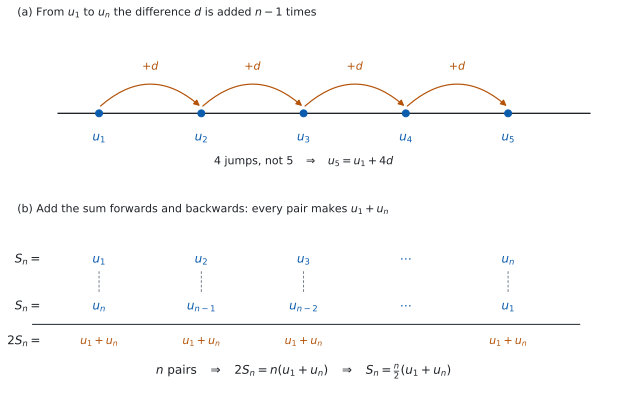

# SL 1.2 — Arithmetic sequences and series（等差数列と等差級数） {#sec-aasl-1-2}

::: {.callout-note}
## What you should be able to do
- **arithmetic sequence**（等差数列）を見分け、**common difference**（公差）$d$ を求められる。
- $u_n = u_1 + (n-1)d$ で、$n$ 番目の項を求められる。
- **項が $2$ つ**分かれば、$u_1$ と $d$ を求められる。
- **series**（級数、和）$S_n$ を、$2$ つの公式のうち都合のよいほうで求められる。
- **sigma notation**（シグマ記号）$\sum$ で書かれた和を、等差級数として計算できる。
- 単利のように、**現実の場面**を等差数列で表せる。
- ぴったり等差でないデータで、$d$ を**見積もれる**。
:::

## The idea

### 1. 同じ数ずつ変わる並び {#idea}

数が並んだものを **sequence**（数列）と言い、そのひとつひとつを **term**（項）と言います。

$$
5, \quad 8, \quad 11, \quad 14, \quad 17, \quad \ldots
$$

この並びは、**となり合う項の差が、いつも同じ**です。$8-5 = 3$、$11-8 = 3$、$14-11 = 3$。

こういう数列を **arithmetic sequence**（等差数列）と言い、その一定の差を **common difference**（公差）と呼んで $d$ と書きます。ここでは $d = 3$ です。

$1$ 番目の項（**first term**、初項）を $u_1$、$n$ 番目の項を $u_n$ と書きます。上の例なら $u_1 = 5$、$u_4 = 14$ です。

::: {.callout-important}
## $d$ は「うしろ引く前」です
$$
d = u_2 - u_1 = u_3 - u_2 = \cdots
$$

**あとの項から、前の項を引きます。** 逆にすると符号が変わります。

$d$ は**負でも構いません。** $20, 17, 14, 11, \ldots$ なら $d = -3$ で、これも立派な arithmetic sequence です。
:::

**等差かどうかを確かめるには、書かれている項の差を全部見てください。** $2$ か所合っていても足りません。$2, 5, 8, 13, \ldots$ は、はじめの $2$ つの差がどちらも $3$ ですが、次が $5$ なので等差ではありません。

### 2. $n$ 番目の項 — なぜ $n-1$ なのか {#nth}

$100$ 番目の項が知りたいときに、$100$ 個書き出すわけにはいきません。$u_1$ と $d$ さえ分かれば、いきなり $n$ 番目が出せます。

$$
u_n = u_1 + (n-1)d
$$ {#eq-aasl12-nth}

::: {.callout-important}
## この式は公式集にあります
公式集の **1.2** の欄に、`The nth term of an arithmetic sequence` として印刷されています。

試験中に配られるので、**覚える必要はありません。** 覚えるのは、**どういうときに使うか**のほうです。
:::

#### なぜ $n$ ではなく $n-1$ なのか {#why-n-minus-1}

**足す回数は、項の番号より $1$ つ少ない**からです。@fig-aasl12-idea の (a) を見てください。

$u_1$ から $u_5$ へ行くのに、$d$ を足すのは $4$ 回です。$1$ 番目にはまだ $1$ 回も足していません。

| 項 | $d$ を足した回数 |
|:--|:--|
| $u_1$ | $0$ 回 |
| $u_2$ | $1$ 回 |
| $u_3$ | $2$ 回 |
| $u_n$ | $n-1$ 回 |

: 番号と、足した回数 {#tbl-aasl12-count}

{#fig-aasl12-idea width=100%}

はじめの例で確かめます。$u_1 = 5$、$d = 3$ なので

$$
u_5 = 5 + (5-1)(3) = 5 + 12 = 17
$$

はじめに書き出した $5$ 番目の項と、同じ $17$ になりました。

### 3. 項が $2$ つ分かれば、数列が決まる {#two-terms}

問題では $u_1$ と $d$ が直接は与えられず、**途中の項が $2$ つ**だけ分かっていることがよくあります。

$u_2 = 11$、$u_7 = 41$ とします。@eq-aasl12-nth に入れると、$2$ つの式ができます。

$$
u_1 + d = 11, \qquad u_1 + 6d = 41
$$

**引き算をすると $u_1$ が消えます。**

$$
5d = 30, \qquad d = 6
$$

$d$ が出たら、どちらかの式に戻して $u_1 = 11 - 6 = 5$ です。

::: {.callout-tip}
## 番号の差が、そのまま $d$ の個数です
$u_2$ から $u_7$ までは、番号が $5$ つ進んでいます。ですから、$d$ を $5$ 回足したぶんだけ大きくなっています。

$$
u_7 - u_2 = 5d
$$

これを使えば、連立方程式を書かずに $d = \dfrac{41-11}{5} = 6$ と出せます。**一般に $u_q - u_p = (q-p)d$ です。**
:::

### 4. 和 — $S_n$ の $2$ つの形 {#sum}

はじめの $n$ 項を全部足したものを **series**（級数）と言い、$S_n$ と書きます。arithmetic sequence の項を足したものなので、**arithmetic series**（等差級数）とも言います。

$$
S_n = \frac{n}{2}\bigl(2u_1 + (n-1)d\bigr), \qquad S_n = \frac{n}{2}(u_1 + u_n)
$$ {#eq-aasl12-sum}

::: {.callout-important}
## この $2$ つも公式集にあります
公式集の **1.2** の欄に、`The sum of n terms of an arithmetic sequence` として、**両方**印刷されています。

**同じことを言っている $2$ つの形**です。$u_n = u_1 + (n-1)d$ を右の形に入れれば、左の形になります。
:::

$\dfrac{n}{2}$ が前に付く理由は、[Why it works](#why-it-works) で確かめます。**平均 $\times$ 個数**だと思うと、腑に落ちます。

$$
S_n = \underbrace{\frac{u_1 + u_n}{2}}_{\text{最初と最後の平均}} \times \underbrace{n}_{\text{個数}}
$$

はじめの例（$5, 8, 11, 14, 17$）で確かめます。$5$ 項の和は、書き出せば $55$ です。公式でも

$$
S_5 = \frac{5}{2}(5 + 17) = \frac{5}{2}(22) = 55
$$

### 5. どちらの形を使うか {#which}

| 分かっているもの | 使う形 |
|:--|:--|
| $u_1$ と $d$ と $n$ | $S_n = \dfrac{n}{2}\bigl(2u_1 + (n-1)d\bigr)$ |
| $u_1$ と $u_n$ と $n$ | $S_n = \dfrac{n}{2}(u_1 + u_n)$ |

: 和の $2$ つの形の使い分け {#tbl-aasl12-which}

**最後の項が問題文に書いてあるときは、右の形が速い**です。$d$ を求めなくても済むこともあります。

::: {.callout-warning}
## 項の個数 $n$ を、数えまちがえないでください
`Find the sum of` $6 + 13 + 20 + \cdots + 202$ のように、**最後の項で書かれている**ときは、まず $n$ を求めます。

$$
202 = 6 + (n-1)(7) \ \Longrightarrow \ 196 = 7(n-1) \ \Longrightarrow \ n = 29
$$

$\dfrac{202-6}{7} = 28$ は**間隔の数**で、項の数はそれより $1$ 多い $29$ です（[第 2 節](#nth)と同じ話です）。
:::

### 6. sigma notation {#sigma}

**sigma notation**（シグマ記号）は、和を短く書く記法です。

$$
\sum_{k=1}^{5}(4k+1) = 5 + 9 + 13 + 17 + 21
$$

下の $k=1$ から上の $5$ まで、$k$ に順に入れて足す、という意味です。$k$ は **index**（添字）で、名前は何でも構いません。

::: {.callout-tip}
## $k$ の式が $1$ 次なら、それは等差数列です
$4k+1$ のように、$k$ について**$1$ 次**の式なら、$k$ が $1$ 増えるごとに値は $4$ ずつ増えます。ですから、**$k$ の係数がそのまま $d$** です。

$$
\sum_{k=1}^{n}(ak+b) \ \text{は、} \ u_1 = a+b, \ d = a \ \text{の等差級数}
$$

上の例なら $u_1 = 5$、$d = 4$、$n = 5$ で、$S_5 = \dfrac{5}{2}(5+21) = 65$ です。書き出した $5+9+13+17+21$ も $65$ です。
:::

**項の個数は、$k$ の下と上から数えます。** $\displaystyle\sum_{k=1}^{n}$ なら $n$ 個ですが、$\displaystyle\sum_{k=3}^{20}$ なら $20-3+1 = 18$ 個です。**引いて $1$ を足す**のを忘れないでください。

::: {.callout-tip collapse="true"}
## Paper 2 では、電卓が数列を作ってくれます
Paper 1 では使えませんが、Paper 2 では次の $2$ つが強力です。

```
seq(5 + (n-1)*3, n, 1, 20)      … u_1 から u_20 までを一気に並べる
sum(seq(5 + (n-1)*3, n, 1, 20)) … その合計、つまり S_20
```

`seq(` は **`menu → List & Spreadsheet → Sequence`** にあります。

$\sum$ の記号そのものも、**$9$ キーの右にあるテンプレートのパレット**から入れられます。下・上・中身の $3$ つのボックスを `tab` で移動しながら埋めます。

**下が $k=1$ から始まっているか、$k=0$ からかを、必ず見てください。** $1$ つずれるだけで答えが変わります。

Press-to-Test（試験モード）でも $\sum$ は使えます。
:::

### 7. 現実の場面 — 単利 {#applications}

シラバスが例に挙げているのが **simple interest**（単利）です。

**単利は、利息がいつも元金に対して計算されます。** 元金 $1500$ 円、年利 $6\%$ なら、利息は毎年

$$
1500 \times 0.06 = 90 \ \text{円}
$$

で、**毎年 $90$ 円ずつ増えます。** 差が一定なので、これは arithmetic sequence です。

| 年 | $0$ | $1$ | $2$ | $3$ |
|:--|:--|:--|:--|:--|
| 元利合計 | $1500$ | $1590$ | $1680$ | $1770$ |

: 単利は、同じ額ずつ増える {#tbl-aasl12-simple}

$n$ 年後の元利合計は $1500 + 90n$ です。

利息が利息を生む **compound interest**（複利）は、毎年同じ**倍率**を掛けるので、等差にはなりません。

::: {.callout-warning}
## 「$n$ 年後」と「第 $n$ 項」は、番号が $1$ つずれます
上の表で、$n = 0$ が最初です。**$u_1$ は「$0$ 年後」、つまり $1500$ にあたります。**

$u_n = 1500 + (n-1)(90)$ と、$1500 + 90n$ は、**同じものを別の番号で書いた式**です。

**問題文が何を $1$ 番目と呼んでいるかを、先に決めてください。** ここを取りちがえると、答えが $90$ だけずれます。
:::

### 8. ぴったり等差でないとき {#not-exact}

シラバスの Guidance 欄には、こう書かれています。

> Students will need to approximate common differences.

現実のデータは、きれいに等差にはなりません。

| 週 | $1$ | $2$ | $3$ | $4$ | $5$ |
|:--|:--|:--|:--|:--|:--|
| 高さ（cm） | $12.1$ | $17.8$ | $23.6$ | $29.4$ | $35.2$ |

: ぴったり等差ではないデータ {#tbl-aasl12-approx}

差は $5.7$、$5.8$、$5.8$、$5.8$ です。**ぴったり同じではありませんが、ほぼ一定**です。

こういうときは、**最初と最後から平均の差を出します。**

$$
d \approx \frac{35.2 - 12.1}{5 - 1} = \frac{23.1}{4} = 5.775
$$

$4$ で割るのは、間隔が $4$ つだからです（[第 2 節](#nth)）。

**答えを書くときは、「およそ」であることを言葉で添えてください。** 「$d = 5.775$」と言い切ると、データが完全な等差だと主張したことになります。

## Why it works

ここでは $2$ つのことを確かめます。**なぜ和が $\dfrac{n}{2}(u_1+u_n)$ になるのか**と、**$2$ つの形が同じものだ**ということです。

**なぜ、和は「平均 $\times$ 個数」なのか。**

$S_n$ を、前から書いた式と、うしろから書いた式の、$2$ 通りで書きます。

$$
S_n = u_1 + (u_1+d) + (u_1+2d) + \cdots + u_n
$$

$$
S_n = u_n + (u_n-d) + (u_n-2d) + \cdots + u_1
$$

**この $2$ つを、たてに足します。** すると $d$ が全部消えます。

$$
2S_n = \underbrace{(u_1+u_n) + (u_1+u_n) + \cdots + (u_1+u_n)}_{n \text{ 個}} = n(u_1+u_n)
$$

@fig-aasl12-idea の (b) が、その様子です。上の段と下の段を組にすると、**どの組も同じ $u_1+u_n$** になります。両辺を $2$ で割って

$$
S_n = \frac{n}{2}(u_1+u_n)
$$

**なぜ、もう $1$ つの形も同じなのか。**

いま出した形に、$u_n = u_1 + (n-1)d$ を入れるだけです。

$$
S_n = \frac{n}{2}\bigl(u_1 + u_1 + (n-1)d\bigr) = \frac{n}{2}\bigl(2u_1 + (n-1)d\bigr)
$$

**同じ式を、別の材料で書いただけ**です。ですから、どちらを使っても答えは同じになります。片方で解いて、もう片方で確かめる、という使い方ができます（例題で何度も使います）。

## Worked examples

::: {.callout-note appearance="simple"}
問題文は英語です。意味が理解できなかったら、問題文の下の「**日本語訳**」を開いてください。解説は日本語です。

**例題も演習も、すべて電卓なしで解けます。** Paper 1 のつもりで解いてください。
:::

::: {#exm-aasl12-nth}
[An arithmetic sequence has first term $u_1 = 7$ and common difference $d = 4$.]{.q-en}

**(a)** [Find $u_{20}$.]{.q-en}

**(b)** [Find an expression for $u_n$ in terms of $n$.]{.q-en}

**(c)** [Show that $403$ is a term of the sequence, and state which term it is.]{.q-en}

**(d)** [Explain why $400$ is not a term of the sequence.]{.q-en}

<details class="jp-trans">
<summary>日本語訳</summary>

ある arithmetic sequence の first term が $u_1 = 7$、common difference が $d = 4$ です。

**(a)** $u_{20}$ を求めなさい。

**(b)** $u_n$ を $n$ の式で表しなさい。

**(c)** $403$ がこの数列の項であることを示し、それが第何項かを述べなさい。

**(d)** $400$ がこの数列の項でない理由を説明しなさい。

</details>

---

**(a)** @eq-aasl12-nth に入れます。$d$ を足すのは $19$ 回です（[第 2 節](#nth)）。

$$
u_{20} = 7 + (20-1)(4) = 7 + 76 = 83
$$

**(b)** 同じ式を、$n$ のまま整理します。

$$
u_n = 7 + (n-1)(4) = 7 + 4n - 4 = 4n + 3
$$

**$n$ の係数が $d$ になっている**ことに気づいてください（[第 6 節](#sigma)）。

**(c)** `Show that` なので、$u_n = 403$ とおいて $n$ を求めます。

$$
4n + 3 = 403 \ \Longrightarrow \ 4n = 400 \ \Longrightarrow \ n = 100
$$

$n = 100$ は**正の整数**なので、$403$ は第 $100$ 項です。

**(d)** `Explain why` なので、英語で理由を書きます。

::: {.model-answer}
**試験ではこう書く**

*Solving $4n + 3 = 400$ gives $4n = 397$, so $n = 99.25$. A term number must be a positive integer, and $99.25$ is not, so $400$ is not a term of the sequence. Equivalently, every term leaves a remainder of $3$ when divided by $4$, whereas $400$ is exactly divisible by $4$, so $400$ cannot be a term.*
:::

（$4n + 3 = 400$ を解くと $4n = 397$、$n = 99.25$ となる。項の番号は正の整数でなければならず、$99.25$ はそうではないので、$400$ はこの数列の項ではない。同じことだが、どの項も $4$ で割ると $3$ 余るのに対し、$400$ は $4$ で割り切れるので、$400$ は項になりえない、という意味です。）

**検算（(a) について）。** (b) の式に $n = 20$ を入れると $4(20) + 3 = 83$ で、同じ値です ✓ ただし、**$(n-1)$ を $n$ と思いこんでいると (b) の式も $u_n = 7 + 4n$ になり、$87$ 対 $87$ で一致してしまいます。**

そこで、(b) の式には必ず **$n = 1$** も入れてください。

$$
4(1) + 3 = 7 = u_1
$$

合いました ✓ 誤った $7 + 4n$ なら $n = 1$ で $11$ となり、$u_1 = 7$ に合いません。**$n = 1$ は、$(n-1)$ の誤りだけを狙い撃ちにする検算です。**

**検算（(c) について）。** 第 $100$ 項を、$u_1$ から直に出し直します。$7 + 99(4) = 7 + 396 = 403$ ✓

::: {.callout-note}
## 解答例（答案用紙にはこう書く）
**(a)**
$$u_{20} = 7 + 19(4) = 83$$

**(b)**
$$u_n = 7 + (n-1)(4) = 4n + 3$$

**(c)**
$$4n + 3 = 403 \ \Rightarrow \ n = 100$$
*$n = 100$ is a positive integer, so $403$ is the $100$th term.*

**(d)**
*$4n + 3 = 400$ gives $n = 99.25$, which is not a positive integer, so $400$ is not a term.*
:::
:::

::: {#exm-aasl12-two-terms}
[In an arithmetic sequence, $u_3 = 17$ and $u_8 = 42$.]{.q-en}

**(a)** [Find the common difference $d$.]{.q-en}

**(b)** [Find the first term $u_1$.]{.q-en}

**(c)** [Find $u_{50}$.]{.q-en}

**(d)** [Hence find $S_{50}$.]{.q-en}

<details class="jp-trans">
<summary>日本語訳</summary>

ある arithmetic sequence で、$u_3 = 17$、$u_8 = 42$ です。

**(a)** common difference $d$ を求めなさい。

**(b)** first term $u_1$ を求めなさい。

**(c)** $u_{50}$ を求めなさい。

**(d)** そこから $S_{50}$ を求めなさい。

</details>

---

**(a)** 番号は $3$ から $8$ へ、$5$ つ進んでいます（[第 3 節](#two-terms)）。

$$
u_8 - u_3 = 5d \ \Longrightarrow \ 42 - 17 = 5d \ \Longrightarrow \ d = 5
$$

**(b)** $u_3 = u_1 + 2d$ に戻します。

$$
17 = u_1 + 2(5) \ \Longrightarrow \ u_1 = 7
$$

**(c)** @eq-aasl12-nth です。

$$
u_{50} = 7 + 49(5) = 7 + 245 = 252
$$

**(d)** `Hence` なので、**(c) の答えを使います**（[第 5 節](#which)）。最初と最後が分かっているので、右の形が速いです。

$$
S_{50} = \frac{50}{2}(7 + 252) = 25 \times 259 = 6475
$$

**検算（(a)(b) について）。** 出した $u_1$ と $d$ で、**問題文の $2$ つの値を両方**作り直します。

$$
u_3 = 7 + 2(5) = 17, \qquad u_8 = 7 + 7(5) = 42
$$

どちらも問題文の値と合いました ✓

**両方合うことが大事です。** 間隔の数を取りちがえて $d = \dfrac{42-17}{8-3+1} = \dfrac{25}{6} = 4.1\overline{6}$ としていたら、$u_3$ から $u_1 = 17 - 2\left(\dfrac{25}{6}\right) = \dfrac{26}{3}$ が出ます。このとき **$u_3$ のほうは $17$ に戻ってしまいます**（$u_1$ を作るのに使った項だからです）。合わないのは $u_8$ で、$\dfrac{26}{3} + 7\left(\dfrac{25}{6}\right) = \dfrac{227}{6} = 37.8\overline{3}$ となり、$42$ になりません。**$u_1$ を作るのに使わなかったほうの項で見るのが、この検算の要です。**

**検算（(d) について）。** もう $1$ つの形で出し直します（[Why it works](#why-it-works)）。

$$
S_{50} = \frac{50}{2}\bigl(2(7) + 49(5)\bigr) = 25(14 + 245) = 25 \times 259 = 6475
$$

同じ $6475$ です ✓ **こちらは $u_{50}$ を使っていないので、(c) が間違っていたら食いちがいます。**

::: {.callout-note}
## 解答例（答案用紙にはこう書く）
**(a)**
$$u_8 - u_3 = 5d, \qquad 42 - 17 = 5d, \qquad d = 5$$

**(b)**
$$17 = u_1 + 2(5), \qquad u_1 = 7$$

**(c)**
$$u_{50} = 7 + 49(5) = 252$$

**(d)**
$$S_{50} = \frac{50}{2}(7 + 252) = 6475$$
:::
:::

::: {#exm-aasl12-sum}
**(a)** [Find $S_{20}$ for the arithmetic sequence with $u_1 = 3$ and $d = 5$.]{.q-en}

**(b)** [Find the sum $3 + 8 + 13 + \cdots + 153$.]{.q-en}

**(c)** [Find $\displaystyle\sum_{k=1}^{25}(4k-1)$.]{.q-en}

**(d)** [Explain why $\displaystyle\sum_{k=1}^{25}(4k-1)$ is an arithmetic series.]{.q-en}

<details class="jp-trans">
<summary>日本語訳</summary>

**(a)** $u_1 = 3$、$d = 5$ である arithmetic sequence の $S_{20}$ を求めなさい。

**(b)** 和 $3 + 8 + 13 + \cdots + 153$ を求めなさい。

**(c)** $\displaystyle\sum_{k=1}^{25}(4k-1)$ を求めなさい。

**(d)** $\displaystyle\sum_{k=1}^{25}(4k-1)$ が arithmetic series である理由を説明しなさい。

</details>

---

**(a)** 最後の項が分かっていないので、左の形です（@tbl-aasl12-which）。

$$
S_{20} = \frac{20}{2}\bigl(2(3) + 19(5)\bigr) = 10(6 + 95) = 10 \times 101 = 1010
$$

**(b)** **まず項の個数を求めます**（[第 5 節](#which)）。$d = 5$ で、最後が $153$ です。

$$
153 = 3 + (n-1)(5) \ \Longrightarrow \ 150 = 5(n-1) \ \Longrightarrow \ n = 31
$$

最初と最後が分かったので、右の形です。

$$
S_{31} = \frac{31}{2}(3 + 153) = \frac{31}{2}(156) = 31 \times 78 = 2418
$$

**$156$ を先に $2$ で割る**と、分数を扱わずに済みます。

**(c)** $k$ の式が $1$ 次なので、等差級数です（[第 6 節](#sigma)）。

$$
k = 1 \ \text{のとき} \ 4(1)-1 = 3, \qquad k = 25 \ \text{のとき} \ 4(25)-1 = 99
$$

$$
S_{25} = \frac{25}{2}(3 + 99) = \frac{25}{2}(102) = 25 \times 51 = 1275
$$

**(d)** `Explain why` なので、英語で理由を書きます。

::: {.model-answer}
**試験ではこう書く**

*The terms are $u_k = 4k - 1$. The difference between consecutive terms is $u_{k+1} - u_k = 4(k+1) - 1 - (4k - 1) = 4$, which does not depend on $k$. A constant difference between consecutive terms is exactly what makes a sequence arithmetic, so the sum is an arithmetic series with $u_1 = 3$ and $d = 4$.*
:::

（項は $u_k = 4k-1$ である。となり合う項の差は $u_{k+1} - u_k = 4(k+1)-1-(4k-1) = 4$ で、$k$ によらない。となり合う項の差が一定であることが、まさに等差数列の条件なので、この和は $u_1 = 3$、$d = 4$ の等差級数である、という意味です。）

**検算（(a) について）。** もう $1$ つの形で出し直します。$u_{20} = 3 + 19(5) = 98$ なので

$$
S_{20} = \frac{20}{2}(3 + 98) = 10 \times 101 = 1010
$$

同じ $1010$ です ✓

**検算（(b) について）。** まず $n = 31$ を、**解いたのとは逆向き**に確かめます。$u_{31} = 3 + 30(5) = 153$ ✓ 前後も見ると $u_{30} = 148$、$u_{32} = 158$ なので、$153$ はちょうど第 $31$ 項です。

和のほうは、$S_n$ の公式を使わずに出し直せます。項は $3 + 5j$（$j = 0, 1, \ldots, 30$）なので

$$
31 \times 3 + 5(0 + 1 + \cdots + 30) = 93 + 5 \times 465 = 2418
$$

同じ $2418$ です ✓ **$n = 30$ としていたら** $\dfrac{30}{2}(3+153) = 2340$ となり、最初と最後の平均 $78$ だけ足りません。

**検算（(c) について）。** まず、書き出した和の**はじめの数項**で、$u_1$ と $d$ が合っているかを見ます。$3 + 7 + 11 + 15 = 36$ で、公式でも $\dfrac{4}{2}(3+15) = 36$ ✓

さらに、答えそのものをもう $1$ つの形で出し直します。$d = 4$、$n = 25$ から

$$
S_{25} = \frac{25}{2}\bigl(2(3) + 24(4)\bigr) = \frac{25}{2}(102) = 1275
$$

同じ $1275$ です ✓ **こちらは $u_{25} = 99$ を使っていないので、$k = 25$ のところで $4(25)-1$ を打ちまちがえていたら、ここで食いちがいます。**

::: {.callout-note}
## 解答例（答案用紙にはこう書く）
**(a)**
$$S_{20} = \frac{20}{2}\bigl(2(3) + 19(5)\bigr) = 1010$$

**(b)**
$$153 = 3 + (n-1)(5) \ \Rightarrow \ n = 31, \qquad S_{31} = \frac{31}{2}(3 + 153) = 2418$$

**(c)**
$$u_1 = 3, \quad u_{25} = 99, \qquad S_{25} = \frac{25}{2}(3 + 99) = 1275$$

**(d)**
*$u_{k+1} - u_k = 4$ for all $k$, a constant, so the terms form an arithmetic sequence with $u_1 = 3$ and $d = 4$.*
:::
:::

::: {#exm-aasl12-simple}
[Ken invests $\$2000$ in an account paying $4\%$ simple interest per year. Interest is added at the end of each year, and no further money is paid in.]{.q-en}

**(a)** [Show that the balance in the account increases by the same amount each year, and state this amount.]{.q-en}

**(b)** [Find the amount in the account at the end of $5$ years.]{.q-en}

**(c)** [Find the smallest number of complete years after which the account holds more than $\$3000$.]{.q-en}

**(d)** [Explain why simple interest gives an arithmetic sequence, while compound interest does not.]{.q-en}

<details class="jp-trans">
<summary>日本語訳</summary>

Ken は $\$2000$ を、年 $4\%$ の simple interest（単利）が付く口座に預けます。利息は毎年の終わりに加えられ、追加の預け入れはしません。

**(a)** 口座の残高が毎年同じ額ずつ増えることを示し、その額を述べなさい。

**(b)** $5$ 年後の口座の金額を求めなさい。

**(c)** 口座の金額が $\$3000$ を超えるのは、**最短で**何年後（整数年）かを求めなさい。

**(d)** simple interest が arithmetic sequence になり、compound interest がそうならない理由を説明しなさい。

</details>

---

**(a)** `Show that` なので、計算で見せます。**単利では、利息はいつも元金 $\$2000$ に対して計算されます**（[第 7 節](#applications)）。

$$
2000 \times \frac{4}{100} = 80
$$

年によらず $\$80$ です。毎年同じ額が加わるので、金額は arithmetic sequence をなします。

**(b)** $5$ 年で $80$ が $5$ 回加わります。

$$
2000 + 5(80) = 2400
$$

**(c)** $n$ 年後の金額は $2000 + 80n$ です。

$$
2000 + 80n > 3000 \ \Longrightarrow \ 80n > 1000 \ \Longrightarrow \ n > 12.5
$$

$n$ は整数なので、**$n = 13$** です。$13$ 年後に $\$3040$ になります。

**$12.5$ を四捨五入して $13$ とするのではありません。** 「$12.5$ より大きい最小の整数」だから $13$ です。ここが $12$ だと $\$2960$ で、まだ届きません。

**(d)** `Explain why` なので、英語で理由を書きます。

::: {.model-answer}
**試験ではこう書く**

*With simple interest the interest is always calculated on the original $\$2000$, so the same $\$80$ is added every year. A constant amount added each year is a constant difference, which is what makes the sequence arithmetic. With compound interest the interest is calculated on the current balance, which grows each year, so the amount added grows as well. The difference is then not constant, and the balance is multiplied by a fixed factor instead of having a fixed amount added, which makes it geometric rather than arithmetic.*
:::

（単利では、利息はつねに元金の $\$2000$ に対して計算されるので、毎年同じ $\$80$ が加わる。毎年同じ額が加わることが、一定の差、すなわち等差数列の条件である。複利では、利息はそのときの残高に対して計算され、残高は毎年増えるので、加わる額も増える。すると差は一定でなくなり、残高は一定の額を足されるのではなく一定の倍率を掛けられることになるので、等差ではなく等比になる、という意味です。）

**検算（(b) について）。** 表で $1$ 年ずつ追います。$2000 \to 2080 \to 2160 \to 2240 \to 2320 \to 2400$ ✓ **$5$ 回足したことを、指で数えて確かめられます。**

**検算（(c) について）。** 境目の**両側**を計算します。$n = 12$ なら $2000 + 960 = 2960$（$3000$ 以下）、$n = 13$ なら $2000 + 1040 = 3040$（$3000$ より大きい）✓ **不等号の向きを取りちがえていたら、ここで気づけます。**

::: {.callout-note}
## 解答例（答案用紙にはこう書く）
**(a)**
$$2000 \times 0.04 = 80$$
*The interest is always calculated on the original $\$2000$, so $\$80$ is added each year.*

**(b)**
$$2000 + 5(80) = \$2400$$

**(c)**
$$2000 + 80n > 3000 \ \Rightarrow \ n > 12.5 \ \Rightarrow \ n = 13 \text{ years}$$

**(d)**
*Simple interest adds a constant $\$80$ each year, a constant difference. Compound interest multiplies the balance by a constant factor, so the amount added grows and the difference is not constant.*
:::
:::

## Common errors

::: {.callout-warning}
## $u_n = u_1 + nd$ と書いてしまう
足す回数は $n$ ではなく **$n-1$** です（[第 2 節](#nth)）。

$1$ 番目の項には、まだ $1$ 回も足していません。

**確かめ方は $n = 1$ を入れることです。** 正しい式なら $u_1 + 0 \times d = u_1$ になります。$u_1 + 1 \times d$ になったら、その式は違います。
:::

::: {.callout-warning}
## 項の個数を、$1$ つ少なく数える
$3$ から $153$ まで $5$ おきなら、間隔は $30$ 個、**項は $31$ 個**です（[第 5 節](#which)）。

$\displaystyle\sum_{k=3}^{20}$ の項数も $20-3 = 17$ ではなく、**$20-3+1 = 18$** です。

**引いて $1$ を足す**。ここは、毎回ゆっくり数えてください。
:::

::: {.callout-warning}
## $d$ を「前引くうしろ」で出す
$d = u_1 - u_2$ ではありません。**$d = u_2 - u_1$** です（[第 1 節](#idea)）。

逆にすると符号が変わり、増える数列が減る数列になってしまいます。

**数列を見て、増えているのに $d$ が負になったら、引く順番が逆です。**
:::

::: {.callout-warning}
## 差を $1$ か所しか見ずに「等差」と決める
$2, 5, 8, 13, \ldots$ は、はじめの $2$ つの差がどちらも $3$ ですが、次が $5$ です。**等差ではありません**（[第 1 節](#idea)）。

**差は、書かれているところを全部**見てください。$2$ か所合っていても足りません。

現実のデータでは、ぴったり一定にならないことがあります。そのときは「およそ等差」と書きます（[第 8 節](#not-exact)）。
:::

::: {.callout-warning}
## 「$n$ 年後」を、そのまま第 $n$ 項にする
単利の表では、**$u_1$ が「$0$ 年後」**でした（[第 7 節](#applications)）。

$1500 + 90n$ と $u_n = 1500 + (n-1)(90)$ は、**同じものの別の番号づけ**です。

**問題文が何を $1$ 番目と呼んでいるか**を、式を書く前に決めてください。
:::

## Exercises

::: {.callout-note appearance="simple"}
各問題に、折りたたみが $3$ つ付いています。**日本語訳**、**解答例**（答案用紙に書くべきこと。英語です）、**解説**（なぜそうなるか。日本語です）。

まず自分で解いて、次に解答例と見くらべてください。**解説は、合わなかったときだけ開けば十分です。**
:::

::: {.exercise-block}

[1]{.ex-no} [An arithmetic sequence has $u_1 = 5$ and $d = 3$.]{.q-en} **(a)** [Find $u_{12}$.]{.q-en} **(b)** [Find an expression for $u_n$ in terms of $n$.]{.q-en}

<details class="jp-trans">
<summary>日本語訳</summary>

ある arithmetic sequence が $u_1 = 5$、$d = 3$ です。

**(a)** $u_{12}$ を求めなさい。　**(b)** $u_n$ を $n$ の式で表しなさい。

</details>

::: {.callout-note collapse="true"}
## 解答例（答案用紙に書くこと）

**(a)**
$$u_{12} = 5 + 11(3) = 38$$

**(b)**
$$u_n = 5 + (n-1)(3) = 3n + 2$$
:::

::: {.callout-tip collapse="true"}
## 解説

$d$ を足すのは $11$ 回です（[第 2 節](#nth)）。

**検算。** (b) の式に $n = 12$ を入れます。$3(12) + 2 = 38$ ✓ さらに $n = 1$ で $3(1)+2 = 5 = u_1$ ✓

**$u_{12} = 5 + 12(3) = 41$ としていたら**、(b) の式では出せない値です。$n = 1$ を入れる確かめでも、$5 + 1(3) = 8 \neq 5$ となって気づけます。
:::

::: {.ex-sep}
:::

[2]{.ex-no} [Consider the sequence $2,\ 9,\ 16,\ 23,\ \ldots$]{.q-en}

**(a)** [Write down the common difference.]{.q-en}

**(b)** [Find $u_{15}$.]{.q-en}

<details class="jp-trans">
<summary>日本語訳</summary>

数列 $2,\ 9,\ 16,\ 23,\ \ldots$ について考えます。

**(a)** common difference を書きなさい。

**(b)** $u_{15}$ を求めなさい。

</details>

::: {.callout-note collapse="true"}
## 解答例（答案用紙に書くこと）

**(a)**
$$d = 9 - 2 = 7$$

**(b)**
$$u_{15} = 2 + 14(7) = 2 + 98 = 100$$
:::

::: {.callout-tip collapse="true"}
## 解説

**(a)** `Write down` なので、差を書くだけで足ります。ただし**書かれている差は全部**確かめてください。$9-2 = 7$、$16-9 = 7$、$23-16 = 7$ ✓

**検算。** $u_n = 2 + 7(n-1) = 7n - 5$ という式を作り、まず **$n = 1$** を入れます。$7(1) - 5 = 2 = u_1$ ✓ 式そのものが正しいと分かったので、$n = 15$ を入れます。$7(15) - 5 = 100$ ✓

**$n = 1$ を先に入れるのが要です。** $u_n = 2 + 7n$ と作ってしまっていたら、$n = 15$ で $107$ となり、誤った $u_{15} = 2 + 15(7) = 107$ と**一致してしまいます**。$n = 1$ なら $9 \neq 2$ で、すぐ分かります。
:::

::: {.ex-sep}
:::

[3]{.ex-no} [In an arithmetic sequence, $u_4 = 20$ and $u_9 = 45$. Find $u_1$ and $d$.]{.q-en}

<details class="jp-trans">
<summary>日本語訳</summary>

ある arithmetic sequence で、$u_4 = 20$、$u_9 = 45$ です。$u_1$ と $d$ を求めなさい。

</details>

::: {.callout-note collapse="true"}
## 解答例（答案用紙に書くこと）

$$u_9 - u_4 = 5d, \qquad 45 - 20 = 5d, \qquad d = 5$$

$$20 = u_1 + 3(5), \qquad u_1 = 5$$
:::

::: {.callout-tip collapse="true"}
## 解説

番号は $4$ から $9$ へ $5$ つ進むので、$d$ は $5$ 回ぶんです（[第 3 節](#two-terms)）。

**検算。** 出した $u_1 = 5$、$d = 5$ で、**問題文の $2$ つを両方**作り直します。$u_4 = 5 + 3(5) = 20$ ✓ $u_9 = 5 + 8(5) = 45$ ✓

**$9 - 4 = 5$ を $6$ と数えていたら**、$d = \dfrac{25}{6}$ となり、$u_1 = 20 - 3\left(\dfrac{25}{6}\right) = 7.5$ です。この $u_1$ と $d$ では、**$u_4$ のほうは $20$ に戻ってしまいます**（$u_1$ を作るのに使った項だからです）。合わないのは $u_9$ で、$7.5 + 8\left(\dfrac{25}{6}\right) = 40.8\overline{3}$ となり $45$ になりません。**$u_1$ を作るのに使わなかったほうの項で見るのが、この検算の要です。**
:::

::: {.ex-sep}
:::

[4]{.ex-no} [An arithmetic sequence has $u_1 = 4$ and $d = 6$. Find $S_{30}$.]{.q-en}

<details class="jp-trans">
<summary>日本語訳</summary>

ある arithmetic sequence が $u_1 = 4$、$d = 6$ です。$S_{30}$ を求めなさい。

</details>

::: {.callout-note collapse="true"}
## 解答例（答案用紙に書くこと）

$$S_{30} = \frac{30}{2}\bigl(2(4) + 29(6)\bigr) = 15(8 + 174) = 15 \times 182 = 2730$$
:::

::: {.callout-tip collapse="true"}
## 解説

最後の項が与えられていないので、左の形です（@tbl-aasl12-which）。

**検算。** もう $1$ つの形で出し直します。$u_{30} = 4 + 29(6) = 178$ なので

$$
S_{30} = \frac{30}{2}(4 + 178) = 15 \times 182 = 2730
$$

同じ $2730$ です ✓ **これは掛け算・足し算の計算ちがいを捕まえる検算です。**

ただし、$29$ を $30$ と取りちがえる誤りは、$2$ つの形の**どちらにも同じように入ります**（左の形なら $\dfrac{30}{2}\bigl(2(4)+30(6)\bigr) = 2820$、右の形も $u_{30} = 184$ から $2820$）。**これでは捕まりません。**

**$(n-1)$ を疑うときは $n = 1$ を入れてください。** $u_n = 4 + (n-1)(6)$ なら $u_1 = 4$ ✓ ですが、$u_n = 4 + 6n$ なら $u_1 = 10$ となって合いません。
:::

::: {.ex-sep}
:::

[5]{.ex-no} [Find the sum $7 + 11 + 15 + \cdots + 147$.]{.q-en}

<details class="jp-trans">
<summary>日本語訳</summary>

和 $7 + 11 + 15 + \cdots + 147$ を求めなさい。

</details>

::: {.callout-note collapse="true"}
## 解答例（答案用紙に書くこと）

$$147 = 7 + (n-1)(4) \ \Rightarrow \ 140 = 4(n-1) \ \Rightarrow \ n = 36$$

$$S_{36} = \frac{36}{2}(7 + 147) = 18 \times 154 = 2772$$
:::

::: {.callout-tip collapse="true"}
## 解説

**まず項の個数**です（[第 5 節](#which)）。$\dfrac{147-7}{4} = 35$ は間隔の数なので、項は $36$ 個です。

**検算。** まず $n = 36$ を、**解いたのとは逆向き**に確かめます。$u_{36} = 7 + 35(4) = 147$ ✓（$u_{35} = 143$、$u_{37} = 151$ なので、$147$ はちょうど第 $36$ 項です。）

和のほうは、$S_n$ の公式を使わずに出し直せます。項は $7 + 4j$（$j = 0, 1, \ldots, 35$）なので

$$
36 \times 7 + 4(0 + 1 + \cdots + 35) = 252 + 4 \times 630 = 2772
$$

同じ $2772$ です ✓

**$n = 35$ としていたら** $S = \dfrac{35}{2}(154) = 2695$ となり、$77$ だけ足りません。この $77$ は最初と最後の平均 $\dfrac{7+147}{2}$ です。**$n$ を $1$ つ小さく数えると、答えはいつも「平均 $1$ つぶん」ずれます。**
:::

::: {.ex-sep}
:::

[6]{.ex-no} [Find $\displaystyle\sum_{k=4}^{20}(3k+2)$.]{.q-en}

<details class="jp-trans">
<summary>日本語訳</summary>

$\displaystyle\sum_{k=4}^{20}(3k+2)$ を求めなさい。

</details>

::: {.callout-note collapse="true"}
## 解答例（答案用紙に書くこと）

$$n = 20 - 4 + 1 = 17$$

$$u_1 = 3(4) + 2 = 14, \qquad u_{17} = 3(20) + 2 = 62$$

$$S_{17} = \frac{17}{2}(14 + 62) = 17 \times 38 = 646$$
:::

::: {.callout-tip collapse="true"}
## 解説

$k$ の式が $1$ 次なので等差級数で、$d$ は $k$ の係数の $3$ です（[第 6 節](#sigma)）。

**下限が $1$ ではないので、項数は $20 - 4 + 1 = 17$ 個**です。**引いて $1$ を足す**のを忘れないでください（[第 6 節](#sigma)）。

**検算。** 下限 $1$ の和から、いらない $3$ 項を引いて出し直します。

$$
\sum_{k=1}^{20}(3k+2) - \sum_{k=1}^{3}(3k+2) = 670 - (5 + 8 + 11) = 670 - 24 = 646
$$

同じ $646$ です ✓ **これは項数を $20-4+1$ と数える道すじを使っていないので、$17$ を $16$ と数えていたら、ここで食いちがいます**（$n = 16$ なら $8 \times 76 = 608$ です）。
:::

::: {.ex-sep}
:::

[7]{.ex-no} [An arithmetic sequence has $u_1 = 100$ and $d = -7$.]{.q-en}

**(a)** [Find $S_{15}$.]{.q-en}

**(b)** [Find the value of the first negative term of the sequence.]{.q-en}

<details class="jp-trans">
<summary>日本語訳</summary>

ある arithmetic sequence が $u_1 = 100$、$d = -7$ です。

**(a)** $S_{15}$ を求めなさい。

**(b)** この数列で、はじめて負になる項の値を求めなさい。

</details>

::: {.callout-note collapse="true"}
## 解答例（答案用紙に書くこと）

**(a)**
$$S_{15} = \frac{15}{2}\bigl(2(100) + 14(-7)\bigr) = \frac{15}{2}(200 - 98) = \frac{15}{2}(102) = 765$$

**(b)**
$$100 - 7(n-1) < 0 \ \Rightarrow \ 107 < 7n \ \Rightarrow \ n > 15.28\ldots$$
$$n = 16, \qquad u_{16} = 100 - 15(7) = -5$$
:::

::: {.callout-tip collapse="true"}
## 解説

**(a)** $d$ が負でも、公式はそのままです（[第 1 節](#idea)）。$\dfrac{15}{2}(102)$ は、$102$ を先に $2$ で割って $15 \times 51$ とすると楽です。

**(b)** 「はじめて負になる」なので、**不等式**を解いてから、整数に直します。

**検算（(a) について）。** $u_{15} = 100 - 14(7) = 2$ なので、右の形で $S_{15} = \dfrac{15}{2}(100 + 2) = 765$ ✓

**検算（(b) について）。** 境目の**両側**を出します。$u_{15} = 2$（まだ正）、$u_{16} = -5$（負）✓ **$n = 15$ と答えていたら、$u_{15} = 2 > 0$ なので合いません。**
:::

::: {.ex-sep}
:::

[8]{.ex-no} [A candle is lit and its height is measured at the end of each hour. The heights, in cm, at the end of hours $1$ to $5$ are]{.q-en}

$$
18.6, \quad 15.1, \quad 11.7, \quad 8.1, \quad 4.6
$$

**(a)** [Show that these heights do not form an exactly arithmetic sequence.]{.q-en}

**(b)** [Estimate the common difference.]{.q-en}

**(c)** [Use your estimate to predict the height at the end of hour $6$. Comment on whether the same model can be used to predict the height at the end of hour $10$.]{.q-en}

<details class="jp-trans">
<summary>日本語訳</summary>

ろうそくに火をつけ、$1$ 時間ごとの終わりに高さを測ります。$1$ 時間目から $5$ 時間目の終わりの高さ（cm）は、上のとおりです。

**(a)** これらの高さが、ぴったりの arithmetic sequence にはならないことを示しなさい。

**(b)** common difference を見積もりなさい。

**(c)** その見積もりを使って、$6$ 時間目の終わりの高さを予測しなさい。同じモデルで $10$ 時間目の終わりの高さを予測してよいかについて、述べなさい。

</details>

::: {.callout-note collapse="true"}
## 解答例（答案用紙に書くこと）

**(a)**
$$15.1 - 18.6 = -3.5, \quad 11.7 - 15.1 = -3.4, \quad 8.1 - 11.7 = -3.6, \quad 4.6 - 8.1 = -3.5$$
*The differences are not all equal, so the heights are not exactly arithmetic.*

**(b)**
$$d \approx \frac{4.6 - 18.6}{5 - 1} = \frac{-14}{4} = -3.5$$

**(c)**
$$4.6 + (-3.5) = 1.1$$
*The predicted height at the end of hour $6$ is about $1.1$ cm.*
:::

::: {.callout-tip collapse="true"}
## 解説

**(a)** 差が $4$ つとも同じではないことを、実際に $4$ つ書いて見せます（[第 8 節](#not-exact)）。

**(b)** 最初と最後から出します。**間隔は $4$ つ**なので $4$ で割ります。減っているので $d$ は負です。

**検算。** 出した $d = -3.5$ で数列を作り直し、実測と見くらべます。$18.6,\ 15.1,\ 11.6,\ 8.1,\ 4.6$ で、ずれは第 $3$ 項の $0.1$ cm だけです ✓ この程度のずれなら、$d \approx -3.5$ は妥当です。

**なお、$4$ つの差の平均を取るのは、別の道すじではありません。** 途中の項が打ち消し合うので、$\dfrac{(-3.5)+(-3.4)+(-3.6)+(-3.5)}{4}$ は $\dfrac{4.6-18.6}{4}$ と**必ず同じ値**になります。検算にはなりません。

**(c)** `Comment on` なので、英語で述べます。

::: {.model-answer}
**試験ではこう書く**

*Using $d \approx -3.5$, the predicted height at the end of hour $6$ is $4.6 - 3.5 = 1.1$ cm. This is only one hour beyond the data, and all four differences are close to $-3.5$, so the prediction is reasonable. The model cannot be used for hour $10$: it gives $4.6 + 5(-3.5) = -12.9$ cm, and a candle cannot have a negative height. The candle burns out shortly after hour $6$, so the arithmetic model stops describing the situation at that point.*
:::

（$d \approx -3.5$ を使うと、$6$ 時間目の終わりの高さの予測は $4.6 - 3.5 = 1.1$ cm である。これはデータの $1$ 時間先でしかなく、$4$ つの差はどれも $-3.5$ に近いので、予測は妥当である。$10$ 時間目には使えない。$4.6 + 5(-3.5) = -12.9$ cm となるが、ろうそくの高さが負になることはない。ろうそくは $6$ 時間目の少しあとに燃え尽きるので、そこで等差のモデルは通用しなくなる、という意味です。）
:::

::: {.ex-sep}
:::

[9]{.ex-no} [Logs are stacked in rows. The bottom row has $25$ logs, and each row above has $2$ fewer logs than the row below it.]{.q-en}

**(a)** [Find the total number of logs in a stack of $12$ rows.]{.q-en}

**(b)** [Explain why the stack cannot have $14$ rows.]{.q-en}

<details class="jp-trans">
<summary>日本語訳</summary>

丸太が段に積まれています。いちばん下の段には $25$ 本あり、その上の段はどれも、下の段より $2$ 本少なくなっています。

**(a)** $12$ 段の山に入っている丸太の総数を求めなさい。

**(b)** この山が $14$ 段になれない理由を説明しなさい。

</details>

::: {.callout-note collapse="true"}
## 解答例（答案用紙に書くこと）

**(a)**
$$u_1 = 25, \quad d = -2, \qquad S_{12} = \frac{12}{2}\bigl(2(25) + 11(-2)\bigr) = 6(50 - 22) = 168$$

**(b)**
*The number of logs in row $n$ is $u_n = 25 - 2(n-1) = 27 - 2n$. For $n = 14$ this gives $27 - 28 = -1$, and a row cannot contain a negative number of logs. The last possible row is the $13$th, which has $1$ log.*
:::

::: {.callout-tip collapse="true"}
## 解説

**(a)** いちばん下を $u_1$ とすると、上に行くほど減るので $d = -2$ です。

**(b)** `Explain why` なので、英語で理由を書きます。**公式は $n = 14$ でも数を返しますが、その数が意味を持つとはかぎりません。** 文脈のある問題では、答えが場面に合うかを見てください。

**検算（(a) について）。** いちばん上の段は $u_{12} = 25 - 22 = 3$ 本です。右の形で $S_{12} = \dfrac{12}{2}(25 + 3) = 6 \times 28 = 168$ ✓

**さらに、大きさで挟めます。** どの段も $3$ 本以上 $25$ 本以下なので、総数は $12 \times 3 = 36$ と $12 \times 25 = 300$ のあいだのはずです。$168$ はその中にあります ✓

::: {.model-answer}
**試験ではこう書く**

*Row $n$ contains $u_n = 25 - 2(n-1) = 27 - 2n$ logs. Substituting $n = 14$ gives $27 - 28 = -1$, so the formula predicts a negative number of logs, which is impossible for a physical stack. The largest row number with a positive value is $n = 13$, giving $u_{13} = 1$ log, so the stack can have at most $13$ rows.*
:::
:::

::: {.ex-sep}
:::

[10]{.ex-no} [A student is asked to find $u_{10}$ for the arithmetic sequence with $u_1 = 6$ and $d = 4$, and writes]{.q-en}

$$
u_{10} = 6 + 10 \times 4 = 46
$$

[Identify the error and give the correct value of $u_{10}$.]{.q-en}

<details class="jp-trans">
<summary>日本語訳</summary>

ある生徒が、$u_1 = 6$、$d = 4$ である arithmetic sequence の $u_{10}$ を求めるように言われ、上のように書きました。

誤りを指摘し、$u_{10}$ の正しい値を書きなさい。

</details>

::: {.callout-note collapse="true"}
## 解答例（答案用紙に書くこと）

*The formula is $u_n = u_1 + (n-1)d$, so the number of times $d$ is added is $n - 1$, not $n$. The student added $d$ ten times instead of nine.*

$$u_{10} = 6 + 9 \times 4 = 42$$
:::

::: {.callout-tip collapse="true"}
## 解説

`Identify the error` なので、**どこが違うのかを名指し**してから、正しい答えを書きます。

**検算。** $n = 1$ を、生徒の式に入れてみます。$6 + 1 \times 4 = 10$ となり、$u_1 = 6$ と合いません。**正しい式なら $6 + 0 \times 4 = 6$ です**（[Common errors](#common-errors)）。

数列を書き出しても分かります。$6, 10, 14, 18, 22, 26, 30, 34, 38, 42$ — $10$ 番目は $42$ です ✓ **生徒の $46$ は、$11$ 番目の値です。**

::: {.model-answer}
**試験ではこう書く**

*The $n$th term is $u_n = u_1 + (n-1)d$, so $d$ is added $n - 1$ times, not $n$ times. The student used $6 + 10 \times 4$, adding $d$ ten times, which gives the $11$th term rather than the $10$th. Substituting $n = 1$ into the student's method gives $6 + 1 \times 4 = 10$, which is not the first term, so the method must be wrong. The correct value is $u_{10} = 6 + 9 \times 4 = 42$.*
:::
:::

:::
